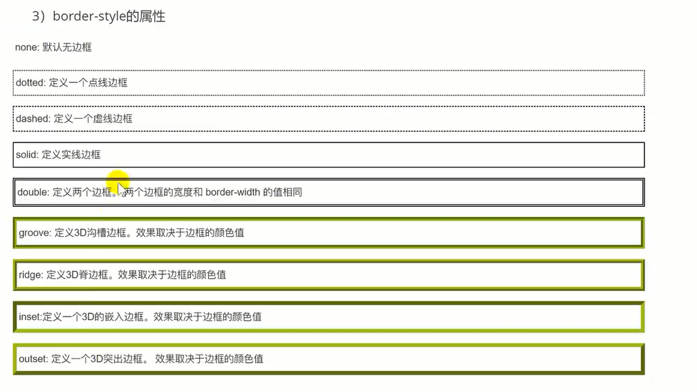

# CSS知识

## 1.css入门

### 1.1 CSS概念

css(cascading Style Sheets)层叠样式表(样式可以叠加)，是一种用来表示HTML语言的文件样式的计算机语言。

最新版本为CSS3（能做到网页和内容分离）。**CSS是用来美化网页用的，没有网页则CSS毫无用处，css需要依赖HTML展示其功能。**

>1.虽然HTML标签的某些属性可以用来设置样式，但是细节处理不够好1
>
>2.HTML实现样式效果会出现大量重复代码，维护成本高！

### 1.2 css基本语法

css样式是由选择器和一条或者多条的以**分号隔开**的样式声明组成，每条声明的样式包含一个CSS属性和属性值。

~~~html
选择器名{
    属性：属性值;
    ......
}
~~~

~~~html
<!DOCTYPE html>
<html lang="en">
<head>
    <meta charset="UTF-8">
    <meta http-equiv="X-UA-Compatible" content="IE=edge">
    <meta name="viewport" content="width=device-width, initial-scale=1.0">
    <title>Document</title>
    
</head>
<body>
    <!-- 
        基础语法
            1.格式
            选择器名 {
                属性：属性值;
                ......
            }
            2.样式需要设置在style标签中
            3.注意：
               ** CSS声明要以分号结尾
               ** 声明要用大括号括起来
               ** 建议一行声明写一个属性
               ** 如果属性值由多个单词组成，要给值加上引号
    -->
    HELLO
</body>
</html>
~~~

### 1.3 CSS的使用

#### 1.3.1 行内样式

行内样式将样式定义在具体的html元素的style属性中。以行内样式写的CSS耦合性高，只适合当前元素。

~~~html

    这是一段文字

~~~

在当前元素使用style属性的声明方式

​        style是行内样式属性；

​        color是颜色属性，red是颜色属性值

​        font-size是字体大小属性：50px是字体大小属性值

~~~html
<!DOCTYPE html>
<html lang="en">
<head>
    <meta charset="UTF-8">
    <meta http-equiv="X-UA-Compatible" content="IE=edge">
    <meta name="viewport" content="width=device-width, initial-scale=1.0">
    <title>Document</title>
</head>
<body>
   <!-- 
       将样式定义在html标签上的style属性中，
       以行内样式写的CSS耦合度较高
   -->
   
这是一段文本

</body>
</html>
~~~

#### 1.3.2 嵌入式

嵌入式通过在html页面内容开辟一段属于css的代码区域，通产做法是在<head>标签中嵌套
~~~

#### 1.3.3 引入外联样式文件

在实际开发中，许多时候都使用引入外部样式文件，这种形式可以使得html页面更加清晰，而且代码复用性高！

我们需要先定义一个css文件，里面写css样式语法代码

然后在html页面引入即可！

~~~html
<link rel="stylesheet" type="text/css" href="css/style.css">
rel:当前文件与引入的文件之间的关系
type:类型， css类型
href:引入的资源的路径
~~~

**样式的作用遵循就近原则，行内样式优先级最高！**

## 2.CSS选择器

选择器是一种模式，用于选择需要添加样式的元素

### 2.1 基本选择器

#### 2.1.1 通用选择器

~~~html
<!DOCTYPE html>
<html lang="en">
<head>
    <meta charset="UTF-8">
    <meta http-equiv="X-UA-Compatible" content="IE=edge">
    <meta name="viewport" content="width=device-width, initial-scale=1.0">
    <title>Document</title>
    
</head>
<body>
    
div1

    
div2

    
div3

    
p

</body>
</html>
~~~

#### 2.1.2 元素选择器

~~~html
<!DOCTYPE html>
<html lang="en">
<head>
    <meta charset="UTF-8">
    <meta http-equiv="X-UA-Compatible" content="IE=edge">
    <meta name="viewport" content="width=device-width, initial-scale=1.0">
    <title>Document</title>
    
</head>
<body>
    
div1

    
div2

    
div3

    
p

</body>
</html>
~~~

#### 2.1.3 ID选择器

~~~html
<!DOCTYPE html>
<html lang="en">
<head>
    <meta charset="UTF-8">
    <meta http-equiv="X-UA-Compatible" content="IE=edge">
    <meta name="viewport" content="width=device-width, initial-scale=1.0">
    <title>Document</title>
    
</head>
<body>
    
div1

    
div2

    
div3

    
p

</body>
</html>
~~~

#### 2.1.4 类选择器

~~~html
<!DOCTYPE html>
<html lang="en">
<head>
    <meta charset="UTF-8">
    <meta http-equiv="X-UA-Compatible" content="IE=edge">
    <meta name="viewport" content="width=device-width, initial-scale=1.0">
    <title>Document</title>
    
</head>
<body>
    
div1

    
div2

    
div3

    
p

</body>
</html>
~~~

#### 2.1.5  分组选择器

~~~html
<!DOCTYPE html>
<html lang="en">
<head>
    <meta charset="UTF-8">
    <meta http-equiv="X-UA-Compatible" content="IE=edge">
    <meta name="viewport" content="width=device-width, initial-scale=1.0">
    <title>Document</title>
    
</head>
<body>
    
div1

    
div2

    
div3

    
p

</body>
</html>
~~~

#### 2.1.6 优先级问题

>选择器的优先级（权重值）
>
>ID选择器 100  --> 类选择器 10 -->元素选择器 1 -->通过选择器
>
>行内样式style属性中 权重是1000

### 2.2 组合选择器

组合选择器说明了两个选择器直接的关系，css中包含四种：

后代选择器：以空格分隔

子选择器：以大于号分隔

相邻兄弟选择器：以加号分隔 （只找下面的）

普通兄弟选择器：以波浪号分隔 （只找下面的）

#### 2.2.1 后代选择器

用于选择指定元素标签下的后辈元素，以空格分隔

选择器1 选择器2 {

​        属性名：属性值；

}

~~~html
<!DOCTYPE html>
<html lang="en">
<head>
    <meta charset="UTF-8">
    <meta http-equiv="X-UA-Compatible" content="IE=edge">
    <meta name="viewport" content="width=device-width, initial-scale=1.0">
    <title>Document</title>
    
</head>
<!--
    后代选择器：‘
        选择指定元素的所有后代元素
        指定元素  指定自带元素 {
            属性名：属性值；
        }
-->   
    
      
<body>
     <h1>食物</h1>
     <ul class="food">
         <li>水果
             <ul>
                 <li>香蕉</li>
                 <li>苹果</li>
                 <li>梨子</li>
             </ul>
         </li>
         <li>蔬菜
            <ul>
                <li>白菜</li>
                <li>油菜</li>
                <li>卷心菜</li>
            </ul>
        </li>

     </ul>
</body>
</html>
~~~

#### 2.2.2 子代选择器

选择指定元素的子代选择器，只找一级，以大于号分隔

~~~html
<!DOCTYPE html>
<html lang="en">
<head>
    <meta charset="UTF-8">
    <meta http-equiv="X-UA-Compatible" content="IE=edge">
    <meta name="viewport" content="width=device-width, initial-scale=1.0">
    <title>Document</title>
    
</head>
<!--
    后代选择器：‘
        选择指定元素的所有后代元素
        指定元素  指定自带元素 {
            属性名：属性值；
        }
-->   
    
      
<body>
     <h1>食物</h1>
     <ul class="food">
         <li>水果
             <ul>
                 <li>香蕉</li>
                 <li>苹果</li>
                 <li>梨子</li>
             </ul>
         </li>
         <li>蔬菜
            <ul>
                <li>白菜</li>
                <li>油菜</li>
                <li>卷心菜</li>
            </ul>
        </li>

     </ul>
</body>
</html>
~~~

#### 2.2.3 相邻兄弟选择器

选择指定元素的相邻的下一个指定元素（**只会向下找一个**）以加号分隔 

~~~html
<!DOCTYPE html>
<html lang="en">
<head>
    <meta charset="UTF-8">
    <meta http-equiv="X-UA-Compatible" content="IE=edge">
    <meta name="viewport" content="width=device-width, initial-scale=1.0">
    <title>Document</title>
    
</head>
<!--
    相邻兄弟选择器：‘
        选择指定元素的相邻的下一个指定元素 只会向下找一个
        如果下一个不是指定的元素，则失效
-->   
    
      
<body>
     

     相邻兄弟选择器
          <ul>
              <li>开心麻花</li>
              <li>贾玲</li>
              <li>松下小宝</li>
          </ul>
     

     
相邻兄弟选择器2

     
相邻兄弟选择器3

</body>
</html>
~~~

#### 2.2.4 普通兄弟选择器

选择指定元素后的指定同级元素（只会向下找）以波浪号分隔 

~~~java
<!DOCTYPE html>
<html lang="en">
<head>
    <meta charset="UTF-8">
    <meta http-equiv="X-UA-Compatible" content="IE=edge">
    <meta name="viewport" content="width=device-width, initial-scale=1.0">
    <title>Document</title>
    
</head>
<!--
    普通兄弟选择器：‘
        选择指定元素的后面的指定兄弟元素 
-->   
    
      
<body>
     

     相邻兄弟选择器
          <ul>
              <li>张三</li>
              <li id="tt">开心麻花</li>
              <li>贾玲</li>
              <li>松下小宝</li>
          </ul>
     

</body>
</html>
~~~

## 3.CSS常用属性

### 3.1 背景

~~~java
<!DOCTYPE html>
<html lang="en">
<head>
    <meta charset="UTF-8">
    <meta http-equiv="X-UA-Compatible" content="IE=edge">
    <meta name="viewport" content="width=device-width, initial-scale=1.0">
    <title>Document</title>
    
</head>
<!--
    普通兄弟选择器：‘
        选择指定元素的后面的指定兄弟元素 
-->   
    
      
<body>

</body>
</html>
~~~

### 3.2 文本

~~~html
<!DOCTYPE html>
<html lang="en">
<head>
    <meta charset="UTF-8">
    <meta http-equiv="X-UA-Compatible" content="IE=edge">
    <meta name="viewport" content="width=device-width, initial-scale=1.0">
    <title>Document</title>
    
</head> 
    
      
<body>
     
文本1

     
文本2

     
文本3

     
这是一段话哈哈哈哈

</body>
</html>
~~~

### 3.3 字体

包括字体效果,大小,风格,粗细

~~~html
<!DOCTYPE html>
<html lang="en">
<head>
    <meta charset="UTF-8">
    <meta http-equiv="X-UA-Compatible" content="IE=edge">
    <meta name="viewport" content="width=device-width, initial-scale=1.0">
    <title>Document</title>
    
</head> 
    
      
<body>
     
这是一段话哈哈哈哈

</body>
</html>
~~~

### 3.4 对齐方式

~~~html
<!DOCTYPE html>
<html lang="en">
<head>
    <meta charset="UTF-8">
    <meta http-equiv="X-UA-Compatible" content="IE=edge">
    <meta name="viewport" content="width=device-width, initial-scale=1.0">
    <title>Document</title>
    
</head> 
<!-- 
    对齐方式（一般针对一段话）：
        设置元素中字体的水平方式的对齐方式
        text-align:
             left
             right
             center
             justify:左右对齐
-->
    
      
<body>
     
全国人大代表李长青谈到如何拉动内需、促消费时表示：建议延长一些节假日或增设法定节假日，恢复小长假

</body>
</html>
~~~

### 3.5 display

可以设置一个元素的生成效果！

**规定元素生成框的类型,可以让元素的显示性值发生改变：如行内元素可以变为块级元素**

~~~html
<!DOCTYPE html>
<html lang="en">
<head>
    <meta charset="UTF-8">
    <meta http-equiv="X-UA-Compatible" content="IE=edge">
    <meta name="viewport" content="width=device-width, initial-scale=1.0">
    <title>Document</title>
    
</head> 
<!-- 
    块级元素：
        可以设置元素的宽高和边距，元素会自动换行。前后有换行符
    行内元素：
        不可以设置元素的宽高和边距，行内元素不会自动换行，前后没有换行符
    行内块级元素
         可以设置宽高，元素不会自动换行
    
    display属性：
         规定元素生成框的类型
         block:        元素会被显示，且元素会被显示为块级元素，元素前后会有换行符
         none:         元素会被隐藏
         inline:       元素会被显示为行内元素
         inline-block   行内块级元素
-->
    
      
<body>
    
        这是一个span1
    
    
        这是一个span2
    
    
        这是一个span3
    
<body
</html>
~~~

### 3.6 浮动

**只在水平方向浮动**

~~~html
<!-- 
    浮动
        flost的属性值有none,left,right,
    注意：
        1，只有横向浮动，没有纵行浮动
        2.会将元素的display属性变为block
        3.浮动元素的后一个元素会围绕着浮动元素（典型应用是文字围绕图片）
        4.浮动元素的前一个元素不会受到影响
 
-->
~~~

### 3.7盒子模型

#### 3.7.1border

>也就是框：边框有宽度，样式（是否是实心线），颜色

~~~html
<!DOCTYPE html>
<html lang="en">
<head>
    <meta charset="UTF-8">
    <meta http-equiv="X-UA-Compatible" content="IE=edge">
    <meta name="viewport" content="width=device-width, initial-scale=1.0">
    <title>边框</title>
    <!--
         边框border:
            1. 可以设置元素边框的宽度，颜色，类型
            2. 单独设置边框的颜色，宽度，类型
                border-color
                border-width
                border-style:
                      dotted:点状线
                      dashed：虚线
      3.设置属性值的顺序是：上右下左
        设置一个属性：表示边框四边属性一致
        设置两个属性：表示上下一致，左右一致
        设置三个属性：表示上，右，下不一致，左右一致
      4.border-collapse:
        设置是否将表格边框折叠为单一边框
        属性值：
             separate(默认。单元格边框独立)
            collapse(单元格边框合并)
    -->   
    
</head> 

<body>
     

         这是一段文本
     

     

     

        这是一段文本
    

    

     

        这是一段文本
    

<body
</html>
~~~

#### 3.7.2padding

>内容距离边框的距离，简称内边距
>
>可以设置元素所有内边框的宽度，或者设置各边上内边距的宽度

~~~html
<!DOCTYPE html>
<html lang="en">
<head>
    <meta charset="UTF-8">
    <meta http-equiv="X-UA-Compatible" content="IE=edge">
    <meta name="viewport" content="width=device-width, initial-scale=1.0">
    <title>边框</title>
    <!--
        padding：设置内边距
        设置一个值：表示四个方向相同
        设置两个值：表示上下一致，左右一致
        设置三个值：表示上，右，下不一致，左右一致
        设置四个值：表示上，右，下，左都不一致
        还可以单独设置某个方向的内边距：
            padding-top
            padding-left
            padding-right
            padding-bottom  
    -->
    
</head> 
     <table border="1" width="500px" align="center" style="border-collapse: collapse;">
         <tr>
           <th>班级</th>
           <th>姓名</th>
           <th>性别</th>
           <th>年龄</th>
         </tr>
         <tr align="center" valign="top" bgcolor="antiquewhite">
            <td>101班</td>
            <td>张三</td>
            <td>男</td>
            <td>18</td>
         </tr>
     </table>
<body>

<body
</html>
~~~

#### 3.7.3 margin

>边框距离最外边的距离，简称外边距

~~~html
<!DOCTYPE html>
<html lang="en">
<head>
    <meta charset="UTF-8">
    <meta http-equiv="X-UA-Compatible" content="IE=edge">
    <meta name="viewport" content="width=device-width, initial-scale=1.0">
    <title>边框</title>
    <!--
         margin:设置外边距
        设置一个值：表示四个方向相同
        设置两个值：表示上下一致，左右一致
        设置三个值：表示上，右，下不一致，左右一致
        设置四个值：表示上，右，下，左都不一致
        还可以单独设置某个方向的内边距：
            margin-top
            margin-left
            margin-right
            margin-bottom  
    -->
    
</head> 
     
这是文本

     
这是文本

<body>

<body
</html>
~~~

