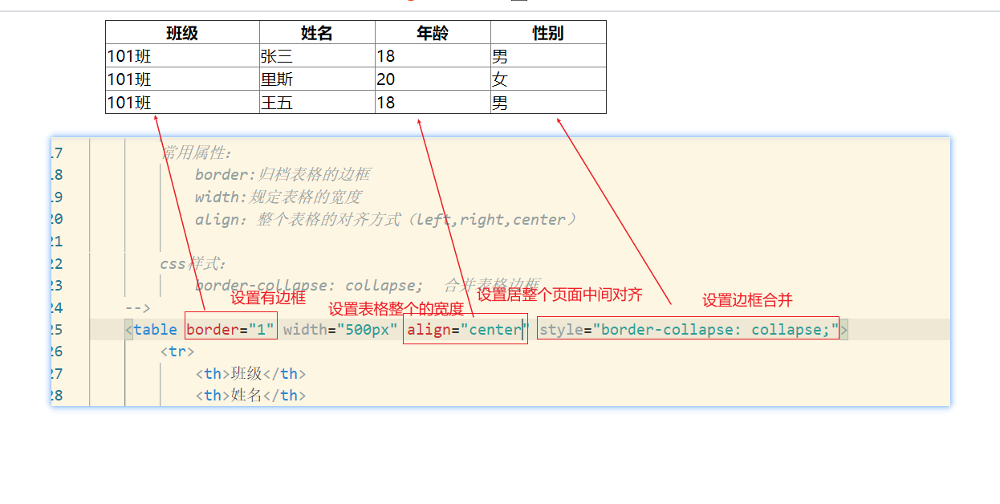
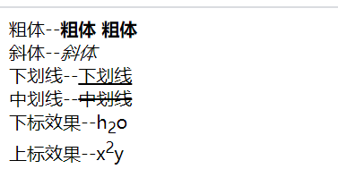

# HTML常用标签	

~~~markdown
所有html标签元素都有的属性：
# 1.id属性：    用来标识元素的唯一性
# 2.name属性：  提交数据时的参数名
# 3.style属性： 设置元素的行内样式（具体的样式）
# 4.class属性： 设置元素的样式名
~~~

## 1.表格

~~~html
<table></table>:定义html表格
<tr></tr>:定义表格中的行，tr元素中包含一个或者多个th或td元素
<td></td>:定义表格中的列，也就是标准单元格
<th></th>:定义表格内的表头单元格，自带加粗和居中对其。

理解：table相当于是一个表格的外框，tr为行，td为一个一个单元格，th为有标题作用的单元格，th中的内容居中且加粗
~~~

~~~html
<<!DOCTYPE html>
<html lang="en">
<head>
    <meta charset="UTF-8">
    <meta http-equiv="X-UA-Compatible" content="IE=edge">
    <meta name="viewport" content="width=device-width, initial-scale=1.0">
    <title>Document</title>
</head>
<body>
    <!--
        表格
            table:     表示表格
            tr:        表示表格中的行（每一行可以包含一个或多个td或者th）
            td:        表示表格中的标准单元格
            th:        表示表格中的表头单元格（具有标题效果，字体加粗，居中显示）
            
        table常用属性：
            border:归定表格的边框
            width:规定表格的宽度
                它有两个取值：像素或者百分比（如果是百分比，参考上一级元素的宽度，如果上一级元素未设置，则参考屏幕宽度）
            align：整个表格的对齐方式（left,right,center）
            height：表格的高度

        tr标签常用属性：
            align：每行中的文本内容的水平方向的对齐方式（left,right,center）
            valign:每行中的文本内容的垂直方向的对齐方式（top,middle,bottom）

        合并单元格：
            <td>标签中的colspan和rowsspan分别规定的那远哥横横跨的列数和行数
                纵向合并： rowspan
                横向合并： colspan

        css样式：
            border-collapse: collapse;  合并表格边框
    -->
    <table border="1" width="500px" align="center" height="200px" style="border-collapse: collapse;">
        <tr>
            <th>班级</th>
            <th>姓名</th>
            <th>年龄</th>
            <th>性别</th>
        </tr> 
        <tr align="center" valign="top">
            <td>101班</td>
            <td>张三</td>
            <td>18</td>
            <td>男</td>
        </tr>
        <tr align="right" valign="middle" bgcolor="antiquewhite">
            <td>101班</td>
            <td>里斯</td>
            <td>20</td>
            <td>女</td>
        </tr>
        <tr align="left">
            <td>101班</td>
            <td>王五</td>
            <td>18</td>
            <td>男</td>
        </tr>
    </table>
</body>
</html>
~~~

**但是上述表格没有边框，为此我们需要知道相关的一些属性**

| 属性   | 值                | 描述                               |
| ------ | ----------------- | ---------------------------------- |
| align  | right,center,left | 表格对齐方式(整个表格在页面的效果) |
| border | px                | 规定表格边框的宽度                 |
| width  | %,px              | 规定表格的宽度(占据屏幕的大小)     |
| height | px                | 规定表格的高度,会作用在每一行上    |

**tr常用属性**

| 属性    | 值                           | 描述                                                         |
| ------- | ---------------------------- | ------------------------------------------------------------ |
| align   | right,left,center            | 定义表格行的内容的对齐方式(水平方向看的对齐方式)             |
| bgcolor | rgb(x,x,x),#xxxxxx,colorname | 规定表格行的背景颜色，以后可以用样式取代他                   |
| valign  | top,middle,bottom            | 规定表格行中内容的垂直对齐方式(也就是竖直方向看的对齐方式)，以后可以用样式取代它 |

**注意**：<td>中的colspan和rowspan分别规定单元格横跨的列数和行数

    纵向合并： rowspan --> 只写在一行内
    横向合并： colspan --> 涉及到多行
~~~html
<!DOCTYPE html>
<html lang="en">
<head>
    <meta charset="UTF-8">
    <meta http-equiv="X-UA-Compatible" content="IE=edge">
    <meta name="viewport" content="width=device-width, initial-scale=1.0">
    <title>Document</title>
</head>
<body>
    <h3>纵向合并 rowspan</h3>
    <h3>横向合并 colspan</h3>
    <table border="1" width="500px" align="center" height="100px" style="border-collapse: collapse;">
        <tr>
            <th colspan="2">班级+姓名</th>
            <th>年龄</th>
            <th>性别</th>
        </tr> 
        <tr align="center">
            <td rowspan="2">101班</td>
            <td>张三</td>
            <td>18</td>
            <td>男</td>
        </tr>
        <tr align="center">
            
            <td>里斯</td>
            <td>20</td>
            <td>女</td>
        </tr>
        <tr align="center">
            <td>102班</td>
            <td>王五</td>
            <td>18</td>
            <td>男</td>
        </tr>
    </table>
</body>
</html>
~~~

## 2.表单

### 2.1 表单介绍

~~~java
<form>标签用于为用户输入创建的html表单:直接看不到效果，需要结合表单元素一起使用
** 1.表单能够包含input元素：比如文本字段、单选框、复选框、提交按钮等，还可以包含textarea等元素
** 2.表单可以向服务器传输数据
** 3.form元素是块级元素。其前后会产生折行：有多个form会自动换行
~~~

|  属性  |                 值                  |                描述                |
| :----: | :---------------------------------: | :--------------------------------: |
| action |                 URL                 | 规定当提交表单时向何处发送表单数据 |
| method |              get\post               |  规定用于发送form-data的HTTP方法   |
|  name  |              Form_name              |           规定表单的名称           |
| target | _blank _self _parent _top framename |      规定在何处打开action URL      |

~~~html
<!DOCTYPE html>
<html lang="en">
<head>
    <meta charset="UTF-8">
    <meta http-equiv="X-UA-Compatible" content="IE=edge">
    <meta name="viewport" content="width=device-width, initial-scale=1.0">
    <title>Document</title>
</head>
<body>
    <!-- 
        表单：
            form
                表单用于向服务器传输数据。form元素是块级元素，其前后会产生折行
                表单提交时，必须设置表单元素的name属性值，否则无法获取数据

           常用属性：
               1.action: 提交表单的地址
               2.method: 提交方式(不区分大小写)
                    GET提交    get
                    POST提交   post
               3.target：提交数据时打开窗口的方式：
                   _self:当前窗口  在当前窗口打开action地址
                   _blank:空白窗口 新开一个窗口打开action地址

               get请求和post请求的区别（其中post请求需要服务器的支持）：
                  1.get请求时参数会在浏览器地址栏后面，而post请求不会（post请求会将数据存放在请求体中）
                  2.get请求相当于post请求不安全
                  3.get请求传递的数据长度有限，而post基本没有限制（一般与服务器相关）
                  4.get请求比post请求快，大概是2倍左右（因为get请求有缓存，会将数据存放在浏览器中，即本地磁盘中），而post请求无缓存
    -->
    <form action="http://www.baidu.com" method="get" target="_self">
        姓名：<input type="text" name="uname"></input>
        <button>提交</button>
    </form>
</body>
</html>
~~~

### 2.2 表单元素<input>

<input>标签用于搜集用户信息

根据不同的type属性的值，输入字段拥有多种形式：输入字段可以是文本字段、单选框、复选框、按钮等

**注意**：表单元素不一定需要放在form表单中，当表单元素需要通过表单提交时，则需要放在表单form标签中

常用<input>标签属性如下：

| 属性      | 值                                                           | 描述                                                         |
| --------- | ------------------------------------------------------------ | ------------------------------------------------------------ |
| type      | text password redio checkbox image file hidden button submit reset date | 规定input元素的类型：文本框、密码框、单选框、复选框、图片框、文件框、隐藏域、普通按钮、提交按钮、重置按钮、日期框 |
| value     |                                                              | 元素的值：可以用来给input元素默认值                          |
| readonly  | readonly                                                     | 让该input标签为只读状态，不可修改                            |
| maxlength |                                                              | 设置输入框的输入字符的长度                                   |

~~~html
<!DOCTYPE html>
<html lang="en">
<head>
    <meta charset="UTF-8">
    <meta http-equiv="X-UA-Compatible" content="IE=edge">
    <meta name="viewport" content="width=device-width, initial-scale=1.0">
    <title>Document</title>
</head>
<body>
    <!-- 
        input标签
             1.type:
                  text:文本框
                  password:密码框
                  redio:单选框（注意：单选框需要通过name属性值设置为一组）
                  checkbox:复选框
                  file:上传文件(文件域)(注意：需要给表单<form>设置一个属性 enctype="multipart/form-data" 提交方式为post)
                  hidden:隐藏域
                  按钮分类：
                      1.button:普通按钮
                      2.submit:提交按钮：会自动提交表单
                      3.reset :重置按钮：会将表单元素清空(默认值不会重置)
                  date:日期框
             
             2.value:元素的值：可以用来给input元素默认值
             3.readonly:一般给值为readonly 设置input输入框为只读状态
             4.maxlength:设置输入框的输入字符的长度
             5.disabled：禁用标签

        注意：
            1.单选框需要通过name属性值设置为一组
            2.复选框需要通过name属性值设置为一组
            3.如果是上传文件的表单，需要给表单<form>设置一个属性 enctype="multipart/form-data" 提交方式为post
            4.没有name属性无法提交到后台
    -->
</body>
<form action="http://www.baidu.com" method="GET">
    文本内容： <input type="text" value="nihao1" name ="text" readonly="readonly"> 
    密码框： <input type="password" name= "password"> 
    单选框： <input type="radio" name="sex" value="man">男<input type="radio" name="sex" value="woman">女 
    复选框：  
            <input type="checkbox" name="test" value="1">1 
            <input type="checkbox" name="test" value="2">2 
            <input type="checkbox" name="test" value="3">3 
    文件域：<input type="file" value="3"> 
    隐藏域：<input type="hidden"  value="3"> 
    普通按钮：<input type="button"  value="普通按钮"> 
    提交按钮：<input type="submit"  value="提交按钮"> 
    重置按钮：<input type="reset"  value="提交按钮"> 
    时间按钮：<input type="date" > 
</form>   
</html>
~~~

**单选框**

~~~markdown
# 1.input标签的type属性为radio
# 2.需要将多个radio标签设置为一组，为此需要用到属性name，同一组的单选框的input标签的name属性值一致
~~~

~~~html
<!DOCTYPE html>
<html lang="en">
<head>
    <meta charset="UTF-8">
    <meta http-equiv="X-UA-Compatible" content="IE=edge">
    <meta name="viewport" content="width=device-width, initial-scale=1.0">
    <title>Document</title>
</head>
<body>
</body>
    单选框： <input type="radio" name="sex" value="man">男<input type="radio" name="sex" value="woman">女
</html>
~~~

**复选框**

~~~markdown
# 1.input标签的type属性为checkbox
# 2.需要将多个checkbox标签设置为一组，为此需要用到属性name，同一组的单选框的input标签的name属性值一致
~~~

~~~html
<!DOCTYPE html>
<html lang="en">
<head>
    <meta charset="UTF-8">
    <meta http-equiv="X-UA-Compatible" content="IE=edge">
    <meta name="viewport" content="width=device-width, initial-scale=1.0">
    <title>Document</title>
</head>
<body>
</body>
    复选框：  
            <input type="checkbox" name="test" value="1">1 
            <input type="checkbox" name="test" value="2">2 
            <input type="checkbox" name="test" value="3">3 
</html>
~~~

### 2.3 表单元素textarea

该标签定义了多行的文本输入控件。文本区可以容纳无限数量的文本.

可以通过cols和rows属性来规定textarea的尺寸。cols规定文本区内可见宽度，rows规定文本区内可见行数

~~~html
<!DOCTYPE html>
<html lang="en">
<head>
    <meta charset="UTF-8">
    <meta http-equiv="X-UA-Compatible" content="IE=edge">
    <meta name="viewport" content="width=device-width, initial-scale=1.0">
    <title>Document</title>
</head>
<body>
    <!-- 
       textarea:
           定义可输入的多行文本控件
           cols:文本的可见宽度
           rows：文本的可见行数 
    -->
</body>
<form action="http://www.baidu.com" method="GET">
    姓名：<input type="text" name="uname">
    简介：<textarea cols="30" rows="10"></textarea>
</form>   
</html>
~~~

### 2.4 表单元素label

这个标签的作用是聚焦用的！

它有for属性，当for属性与元素的id一致时，点击label标签自动为元素聚焦

~~~html
<!DOCTYPE html>
<html lang="en">
<head>
    <meta charset="UTF-8">
    <meta http-equiv="X-UA-Compatible" content="IE=edge">
    <meta name="viewport" content="width=device-width, initial-scale=1.0">
    <title>Document</title>
</head>
<body>
</body>
<form action="http://www.baidu.com" method="GET">
    <label for="123">姓名：</label><input id="123" type="text" name="uname">
    
</form>   
</html>
~~~

### 2.5 表单元素 button

~~~html
<!DOCTYPE html>
<html lang="en">
<head>
    <meta charset="UTF-8">
    <meta http-equiv="X-UA-Compatible" content="IE=edge">
    <meta name="viewport" content="width=device-width, initial-scale=1.0">
    <title>Document</title>
</head>
<body>
</body>
<!-- 
    input按钮：
        type="button"   普通按钮
        type="submit"   提交按钮
        type="reset"    重置按钮
    button按钮：有默认值 type="submit"
    它是双标签，标签之中可以添加内容（文本或者标签等）
        type="button"  普通按钮
        type="submit"  提交按钮-
        type="reset"   重置按钮
-->
<form action="http://www.baidu.com" method="GET">
    <form action="http://www.baidu.com" method="GET">
        <input type="text"></input>
        <input type="button" value="普通按钮" ></input>
        <input type="submit" value="提交按钮"></input>
        <input type="reset"  value="重置按钮"></input>
        

        <button type="button">普通按钮</button>
        <button type="submit">提交按钮</button>
        <button type="reset">重置按钮</button>
    </form>
    
</form>   
</html>
~~~

| 属性     | 值                                                  | 描述             |
| -------- | --------------------------------------------------- | ---------------- |
| disables | disabled                                            | 禁用该按钮       |
| type     | button(普通按钮)、submit(提交按钮)、reset(重置按钮) | 规定按钮的类型   |
| value    | text                                                | 规定按钮的初始值 |
| name     | button_name                                         | 规定按钮的名称   |

### 2.6 表单元素 下拉框select

下拉框样式由两个标签组成：<select>&&<option>

**select常用属性：**

|   属性   |    值    |           描述           |
| :------: | :------: | :----------------------: |
| multiple | multiple |     设置下拉框可多选     |
|   size   |          | 设置下拉框一次可见选项数 |
| disabled | disabled |       禁用此下拉框       |

**option常用属性**

|   属性   |    值    |                             描述                             |
| :------: | :------: | :----------------------------------------------------------: |
| selected | selected |                   设置默认选中下拉框某一项                   |
| disabled | disabled |                        禁用某一个选项                        |
|  value   |          | 提交给服务器的选项值（如果设置value属性值，则提交的是value的值，  如果未设置value的值，则提交的是option标签中的文本值） |

~~~html
<!DOCTYPE html>
<html lang="en">
<head>
    <meta charset="UTF-8">
    <meta http-equiv="X-UA-Compatible" content="IE=edge">
    <meta name="viewport" content="width=<device-width>, initial-scale=1.0">
    <title>Document</title>
</head>
<body>
    <!-- 
        下拉框
            由两个标签组成
            <select>:下拉框标签
            <option>：下拉框中的选项
        select常用属性：
            multiple:  设置下拉框可多选
            size：     设置下拉框可见选项数
            disabled:  禁用下拉框
        option常用属性：
           selected    默认选中项
           disabled    禁用某一个选项
           value       提交给服务器的选项值（如果设置value属性值，则提交的是value的值，
                                           如果未设置value的值，则提交的是option标签中的文本值）
    -->
    <select name="city" multiple="multiple" size="4">
        <option>上海</option>
        <option selected="selected">北京</option>
        <option>广州</option>
        <option>深圳</option>
    </select>
</body>
</html>
~~~

## 3.格式化标签

### 3.1 font

用于规定文本的字体，字体的尺寸，字体的颜色

~~~html
<!DOCTYPE html>
<html lang="en">
<head>
    <meta charset="UTF-8">
    <meta http-equiv="X-UA-Compatible" content="IE=edge">
    <meta name="viewport" content="width=<device-width>, initial-scale=1.0">
    <title>Document</title>
</head>
<body>
<!-- 
    font:字体标签
         可以用来设字体相关的属性
         相关属性：
             color：设置字体颜色
             size:设置字体大小（1-7）
             face:字体风格
-->
</body>
      你好 
      你好
</html>
~~~

### 3.2 pre

**定义预格式化的文本**

被包围在pre元素中的文本通常会保留空格和换行符，而文本也会呈现为等宽字体。

### 3.3 文本标签

<b>&&<strong>:粗文本

<i>：斜体文本

<u>：下划线文本

<del>：中划线文本

：下标文本

：上标文本

~~~html
<!DOCTYPE html>
<html lang="en">
<head>
    <meta charset="UTF-8">
    <meta http-equiv="X-UA-Compatible" content="IE=edge">
    <meta name="viewport" content="width=<device-width>, initial-scale=1.0">
    <title>Document</title>
</head>
<body>
<!-- 
    pre:可以定义预格式化的文本，会保留文本的格式和换行空格等内容
-->
</body>
粗体--<b>粗体</b> <strong>粗体</strong> 
斜体--<i>斜体</i> 
下划线--<u>下划线</u> 
中划线--<del>中划线</del> 
下标效果--h2o 
上标效果--x2y
</html>
~~~

## 4.超链接标签<a>

>从一个地址跳到另一个地址！

~~~html
<!DOCTYPE html>
<html lang="en">
<head>
    <meta charset="UTF-8">
    <meta http-equiv="X-UA-Compatible" content="IE=edge">
    <meta name="viewport" content="width=device-width, initial-scale=1.0">
    <title>超链接a标签</title>
    <!--
        超链接标签a:
            用于从一个页面连接到另一个页面
            行内元素，不会自动换行
            常用属性：
                href:为了实现跳转效果，这个标签必须！，需要链接的地址
                target:窗口打开的方式
                       取值：
                           _self:当前窗口打开
                           _blank：新开空白窗口打开

    -->
</head>
<body>
    <!-- 相对路径-->
    <a href="01.html">可以跳转</a>
    <!-- 新开窗口打开-->
    <a href="01.html" target="_blank">可以跳转</a>
</html>
~~~

### 4.1 a标签实现锚点

也就是当网页内容过多时，怎么瞬间回到页面顶部

~~~html
    <!--
        锚点的实现：
            如果想要跳转到当前页面，那么href的值可以设置为#

        实现方式：
            1.其中一个<a>标签给定name属性值
              另一个<a>标签的href属性值取值为“#name属性值”，即指向a标签的name属性值
            2.href属性值指向其他标签的id属性值
    -->
也就是锚点的定义要么是<a>标签的name属性值，要么是其他标签的id属性值
然后让其他a标签的href属性值指向即可
~~~

## 5 img标签

这是图片引用标签

~~~html
<!DOCTYPE html>
<html lang="en">
<head>
    <meta charset="UTF-8">
    <meta http-equiv="X-UA-Compatible" content="IE=edge">
    <meta name="viewport" content="width=device-width, initial-scale=1.0">
    <title>图片标签</title>
    <!--
       img:
           往页面中插入图片,它是行内元素，不会自动换行
           常用属性：
               src：指定引入图片元素的地址 必须属性
               title:当鼠标悬停在图片上式显示的文字
               alt:当图片找不到时显示的文本
            我们还可以设置图片的大小：
               属性：
               width:宽度属性
               height:高度属性
               align:如何根据文本来排列图片
    -->
</head>
<body>
      <!-- 本地资源-->
      
      <!-- 网络资源-->
      
</body>
</html>
~~~

