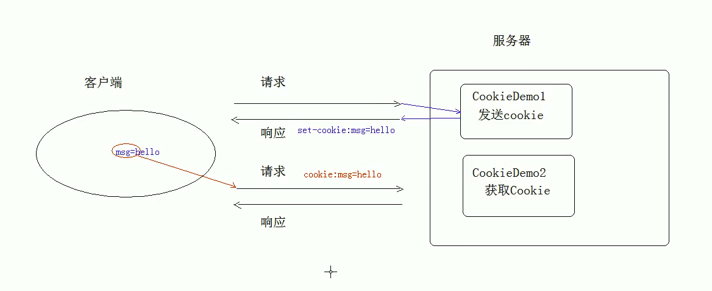
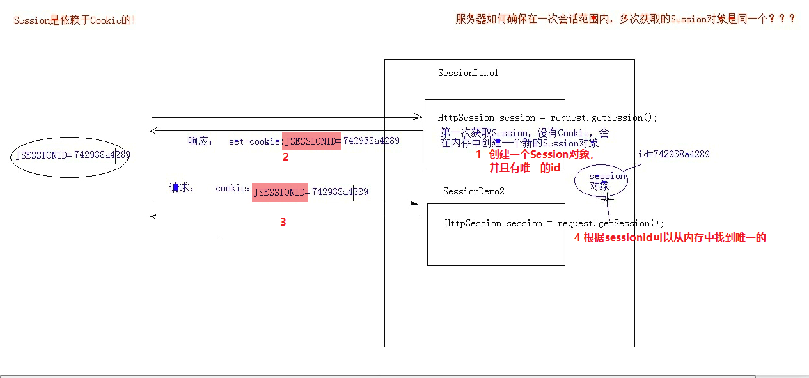

# Cookie&&Session

## 1.概述

**浏览器第一次给服务器资源发送请求，会话建立，直到有一方断开为止**。

*一次会话中包含多次请求与相应*。

功能：在一次会话的范围内的多次请求间**共享数据**。

方式：客户端会话技术Cookie；服务器端会话技术Session

## 2.Cookie

### 2.1 案例

>使用步骤：
>
>​          **创建cookie对象，绑定数据
>
>​          **向客户端发送cookie对象，这个对象的数据会被客户端浏览器保存在本地
>
>​          **(下一次发送请求会带着Cookie来请求)获取cookie,拿到数据

~~~java
// 1.创建cookie对象，绑定数据
new Cookie(String name,String value);
// 2.向客户端发送cookie对象，这个对象的数据会被客户端浏览器保存在本地
response.addCookie(Cookie cookie);
// 3.获取cookie,拿到数据
Cookie[] request.getCookies()
~~~

第一个Servlet

~~~java

package com.itheima.web.servlet;

import javax.servlet.ServletException;
import javax.servlet.annotation.WebServlet;
import javax.servlet.http.Cookie;
import javax.servlet.http.HttpServlet;
import javax.servlet.http.HttpServletRequest;
import javax.servlet.http.HttpServletResponse;
import java.io.IOException;

@WebServlet("/ServletDemo1")
public class ServletDemo1 extends HttpServlet {
    @Override
    protected void doGet(HttpServletRequest req, HttpServletResponse resp) throws ServletException, IOException {
         // 1.创建Cookie对象
        Cookie c = new Cookie("msg", "hello");
        // 2.发送Cookie
        resp.addCookie(c);
    }

    @Override
    protected void doPost(HttpServletRequest req, HttpServletResponse resp) throws ServletException, IOException {
        doGet(req, resp);
    }
}
~~~

第二个Servlet

~~~java
package com.itheima.web.servlet;

import javax.servlet.ServletException;
import javax.servlet.annotation.WebServlet;
import javax.servlet.http.Cookie;
import javax.servlet.http.HttpServlet;
import javax.servlet.http.HttpServletRequest;
import javax.servlet.http.HttpServletResponse;
import java.io.IOException;

@WebServlet("/ServletDemo2")
public class ServletDemo2 extends HttpServlet {
    protected void doPost(HttpServletRequest request, HttpServletResponse response) throws ServletException, IOException {
        doGet(request, response);
    }

    protected void doGet(HttpServletRequest request, HttpServletResponse response) throws ServletException, IOException {
        // 3.获取Cookie
        Cookie[] cookies = request.getCookies();
        if(cookies==null){
            System.out.println("Cookie为空");
            return;
        }
        for (Cookie cookie : cookies) {
            // 遍历Cookies,获取数据
            String name = cookie.getName();
            String value = cookie.getValue();
            System.out.println("name="+name+";value="+value);
        }
    }
}

~~~

### 2.2 Cookie原理

**实际上是基于响应头set-cookie和请求头cookie实现的！**

### 2.3 细节

- 一次可不可以发送多个cookie？

  可以，可以创建多个Cookie对象，使用response对象多次调用addCookie(）方法即可！

- cookie在浏览器中保存多长时间？

  ~~~java
  ** 默认情况下，当浏览器关闭以后，cookie数据被销毁！
  ~~~

  ~~~java
  如果想要cookie持久化存储到银盘，可以使用Cookie对象的方法setMaxAge(int seconds)来设置cookie存储时间
      正数：将Cookie数据写到硬盘的文件中。持久化存储。参数为Cookie的存储time。
      负数：默认值。
      0：删除Cookie信息。
  ---------------------------------------------------------------
          // 1.创建Cookie对象
          Cookie c = new Cookie("msg", "hello");
          // 2.设置cookie的存储time
          c.setMaxAge(300);
          // 3.发送Cookie
          resp.addCookie(c);
  ~~~

- cookie能不能存中文？

  ~~~java
  在Tomcat8之前Cookie不能直接存储中文数据
  在Tomcat8之后Cookie支持中文数据
  ~~~

- cookie的共享问题

  ~~~java
  ** 1、假设在一个服务器中部署了多个web项目，那么这些Web项目中的Cookie默认是不能共享的！
  ** 2、Cookie对象有一个setPath(String path)方法，可以设置Cookie的获取范围，默认情况下，设置的是当前的虚拟目录
           setPath(String path)
  ** 3、如果要共享，可以将path设置为”/“,即setPath(”/“)
  ** 4、不同的tomcat服务器之间的Cookie的共享问题。
        比如
            http://news.baidu.com/
            https://tieba.baidu.com/index.html
        贴吧的服务器和新闻的服务器是不同的，但是我们可以通过方法设置二级域名.baidu.com，让不同服务器之间的Cookie可以访问！
            setDomain(".baidu.com");
  ~~~

### 2.4 Cookie的特点和作用

>1.cookie数据存储在客户端浏览器
>
>2.浏览器对于单个Cookie的大小有限制（4kb），对于同一个域名下的总的Cookie的数量也有限制。

作用：

- Cookie一般用于存储少量的不太敏感的数据
- 在不登陆的情况下，完成服务器对客户端的身份验证！

## 3.Session

概念：服务器端会话技术，再一次会话的多次请求间共享数据，将数据保存在服务器端的对象中。

Session是JSP9大内置对象之一，是四大域对象之一，还是两大会话对象之一。

**HttpSession**

相关方法:

Session的创建和获取是服务器内部实现的。

~~~java
// 获取HttpSession对象
HttpSession session  = request.getSession();
// 使用HttpSession对象
Object getAttribute(String name);
void setAttribute(String name Object value);  --- 存储的是一个对象！！！
void removeAttribute(String name);
~~~

###  3.1 案例

~~~java
package com.itheima.web.servlet;

import javax.servlet.ServletException;
import javax.servlet.annotation.WebServlet;
import javax.servlet.http.*;
import java.io.IOException;

@WebServlet("/ServletDemo1")
public class ServletDemo1 extends HttpServlet {
    @Override
    protected void doGet(HttpServletRequest req, HttpServletResponse resp) throws ServletException, IOException {
        // 使用Session共享数据
        // 1.获取session
        HttpSession session  = req.getSession();
        // 2.存储数据
        session.setAttribute("msg","hello session");
    }

    @Override
    protected void doPost(HttpServletRequest req, HttpServletResponse resp) throws ServletException, IOException {
        doGet(req, resp);
    }
}
~~~

~~~java
package com.itheima.web.servlet;

import javax.servlet.ServletException;
import javax.servlet.annotation.WebServlet;
import javax.servlet.http.*;
import java.io.IOException;

@WebServlet("/ServletDemo2")
public class ServletDemo2 extends HttpServlet {
    protected void doPost(HttpServletRequest request, HttpServletResponse response) throws ServletException, IOException {
        doGet(request, response);
    }

    protected void doGet(HttpServletRequest request, HttpServletResponse response) throws ServletException, IOException {
        // 使用Session获取共享数据
        // 1.获取Session
        HttpSession session = request.getSession();
        // 2.获取数据
        String msg = (String)session.getAttribute("msg");
        System.out.println(msg);

    }
}

~~~

### 3.2 Session原理

**Session的实现是依赖于cookie的！**

浏览器第一次发送请求：

- 浏览器第一次发送请求对象
- 服务器创建session对象，同时会创建一个特殊的COOKIE对象(Cookie的name是固定值：JSESSIONID，Cookie的value是是创建的这个Session的id，唯一标识)，再将这个Cookie发送给浏览器
- 以后浏览器再次请求服务器时，会携带这个Cookie对象
- 服务器通过Cookie对象的value查找到不同的Session对象

浏览器不是第一次发送请求：

- 浏览器不是第一次发送请求，原则上不会再创建Session对象，会获取已经创建的Session对象。
- 重点判断是否可以获取Session对象的两个条件：特殊Cookie是否存在
  1. 不存在：创建一个Session,并且重新创建一个特殊Cookie
  2. 存在：判断Session对象本身是否存在？Session默认存活30分钟

### 3.3 Session的细节

- 1.当客户端关闭以后，服务器不关闭，两次获取的session是否为同一个？

  ~~~java
  ** 1.默认情况下不是的
  ** 2.如果需要相同，则可以创建Cookie,键为JSESSIONID，设置最大存活时间，让Cookie持久化保存。
         // 使用Session获取共享数据
          // 1.获取Session
          HttpSession session = request.getSession();
          System.out.println(session);
          // 2.期望客户端关闭以后，session也能相同
          Cookie c = new Cookie("JSESSIONID",session.getId());
          c.setMaxAge(60*60);
          response.addCookie(c);
  ~~~

- 2.客户端不关闭，服务器关闭，两次获取的session是否为同一个？

  ~~~java
  ** 不是同一个，但是需要确保数据不丢失！
  ~~~

  为什么重启或者关闭服务器，看起来没有影响Session对象？

  **Session的钝化**：Session对象在一段时间内没有被使用或在服务器正常关闭前，将Session的对象以及Session对象的数据从内存**序列化**到硬盘上！

  **Session的活化**：服务器再次调用Session对象或者在服务器启动后，**反序列化！**将session文件转化为内存中的session对象即可!

- 3.session的失效时间？

  Session的默认空闲时间是30分钟。在tomcat>conf>web.xml
  
  ~~~java
  1.服务器关闭
  2.Session对象调用invalidate()方法
  3.Session的默认失效时间是30分钟
    我们可以在服务器的配置文件web.xml中找到并且修改Session的配置
    <session-config>
         <session-timeout>30</session-timeout>
    </session-config>
  ~~~

​       **设置Session的空闲时间**：就近原则

​        1.全局设置：

​                    在web.xml中设置

~~~xml
<session-config>
       <session-timeout>30</session-timeout>
  </session-config>
~~~

​        2.局部设置：

​                    session.setMaxInactiveInterval(ss):单位：秒,类型是int

​                    ss>0:指的是在Session空闲ss秒后失效

​                    ss<=0:设置Session永不失效

### 3.4 Session对象的释放

~~~shell
1.Session对象空闲时间达到了目标设置的最大值，自动释放
2.Session对象被强制失效：invalidate()--设置Session立即失效！！！
3.Web应用卸载
4.服务器进程停止
~~~

### 3.5 Session的特点

>1.Session用于存储一次会话的多次请求间的数据，存在服务器端
>
>2.session可以存储任意类型任意大小的数据，而cookie只能存储字符串！

## 4.Session与Cookie的区别

>1.Session存储数据在服务器端，Cookie在客户端
>
>2.session存储数据没有大小限制，而Cookie有
>
>3.session数据安全，而Cookie相对不安全

