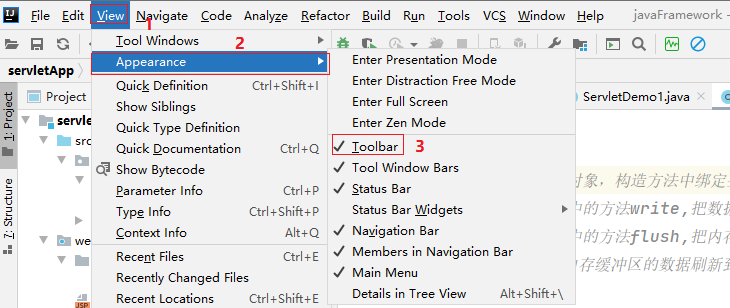
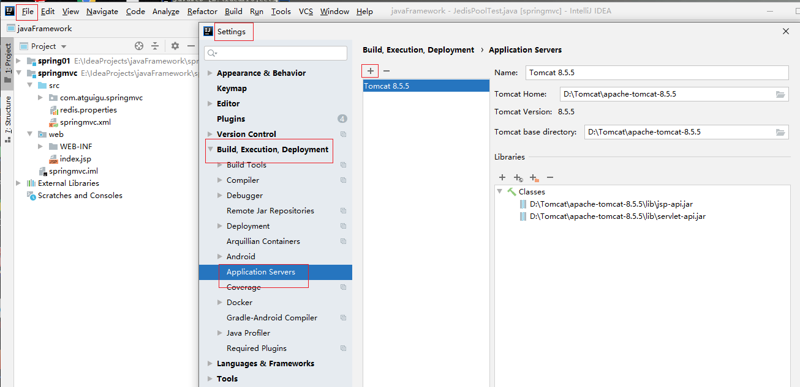
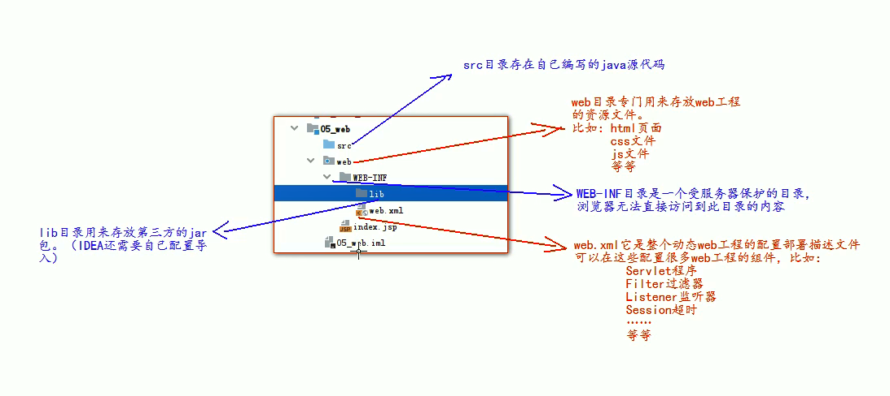
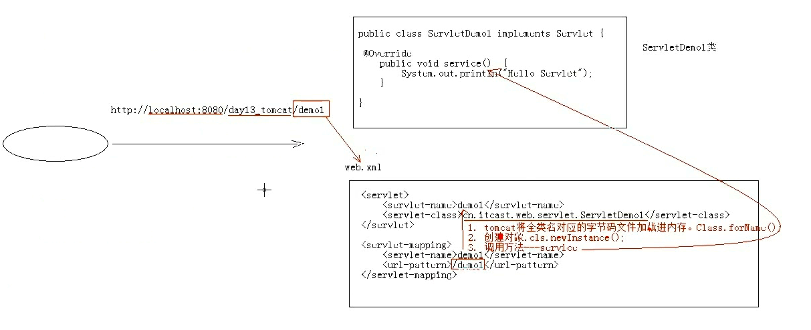
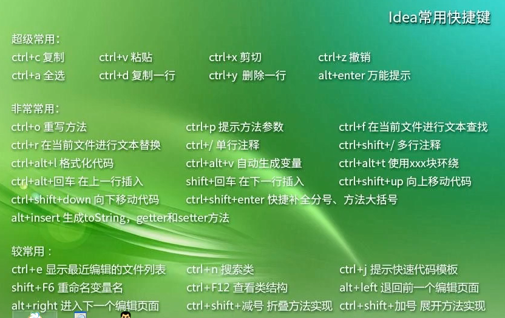

# Servlet

## 1.Tomcat与Http协议

### 1.1 前言

网络技术的出现是为了让我们在网络的世界里面获取资源，这些资源的存放位置，我们把它叫做**网站**

网络资源的分类：

- 静态资源：HTML,CSS,JAVASCRIPT等，不同人不同时间看到的内容是一样的。
- 动态资源：展示的资源由程序决定，不同人不同的时间，看到的内容是不同的。如JSP,Servlet.

基础结构划分为：

- CS结构：Client Seerver 客户端+服务器：要安装应用，更新维护麻烦
- BS结构：Browser Server 浏览器+服务器：不用单独安装应用，有浏览器就可以

技术选型划分：

- MODEL1模型
- MODEL2模型
- MVC模型
- 三层架构+MVC模型

部署方式划分：

- 一体化结构
- 垂直拆分结构
- 分布式结构
- 微服务结构

### 1.2 服务器

服务器是计算机的一种，更快负载更高，而我们现在说的服务器是web服务器，也就是应用服务器，她本是上是一个软件，可以帮助我们发布应用。

**Tomcat:实现了jsp/servlet规范，轻量级服务器，开源免费！**

官网：http://tomcat.apache.org/

相关目录如下：

- bin:存放可执行文件，脚本
- conf:存放配置文件
- lib:存放依赖jar包
- logs:存放生成的日志
- temp:存放临时生成的文件
- webapps:存放发布的项目的目录：每一个文件夹代表一个项目
- work:jsp和session的工作区

从Servlet2.5版本是使用最多的版本，基于XML方式

到了Servlet3.0就开始使用注解的方式！

### 1.3 简单使用

#### 1.3.1**启动**

~~~java
startup.bat windows下启动执行脚本
startup.sh  linux下启动执行脚本
~~~

#### 1.3.2**停止**

~~~java
shutdown.bat   windows下停止执行脚本
shutdown.sh    linux下停止执行脚本
~~~

#### 1.3.3**发布自己的应用**

##### 第一种方式

~~~java
1.在webapps下面创建一个文件夹
2.将资源放到该文件夹下
3.启动tomcat，输入正确路径
~~~

##### 第二种方式

~~~markdown
# 在Tomcat\apache-tomcat-8.5.5\conf\Catalina\localhost目录下创建xml文件，在文件里面指定要发布的工程
~~~

~~~xml
<!-- 
   Context标识一个工程上下文
   path：表示工程的访问路径
   docBase：表示工程的实际目录所在位置
-->
<Context path="/abc" docBase：表示工程的实际目录所在位置="E:\book"></Context>
~~~

#### 1.3.4**控制台乱码问题的解决**

~~~java
logging.properties文件：
java.util.logging.ConsoleHandler.encoding = UTF-8
    改为
java.util.logging.ConsoleHandler.encoding = gbk
~~~

### 1.4 IDEA整合tomcat

将工具栏展示出来：

配置tomcat：

~~~markdown
# 1.web目录专门用来存放web资源文件
# 2.WEB-INF目录是一个首服务器保护的目录，浏览器无法直接访问
# 3.web.xml是整个web工程的配置部署描述文件，可以在里面配置好呢多组件
      Servlet程序
      Filter过滤器
      Listener监听器
      Session超时
      ...
~~~

## 2.Servlet

- servlet是JAVAEE规范之一，规范就是接口
- Sevlet是JavaWeb三大组件之一：Servelt程序，Filter过滤器，Listener监听器
- Servelt是运行在服务器上的一个java小程序，可以接收客户端发送过来的请求，并且响应数据给客户端。

~~~bash
Servlet:server applet ：运行在服务端的小程序！
Servlet就是一个接口，定义了java类被浏览器访问到的(tomcat识别)的规则
这种java类需要遵守一定的规则（接口），才能被服务器执行
~~~

**依赖于服务器才能运行，tomcat执行它**

### 2.1 servlet基本程序

**重点是service方法**

~~~java
package com.itheima.web.servlet;

import javax.servlet.*;
import java.io.IOException;

public class ServletDemo1 implements Servlet {
    @Override
    public void init(ServletConfig servletConfig) throws ServletException {

    }

    @Override
    public ServletConfig getServletConfig() {
        return null;
    }

    // 提供服务的方法
    @Override
    public void service(ServletRequest servletRequest, ServletResponse servletResponse) throws ServletException, IOException {
        System.out.println("hello Servlet");
    }

    @Override
    public String getServletInfo() {
        return null;
    }

    @Override
    public void destroy() {

    }
}

~~~

**配置文件**

~~~xml
<?xml version="1.0" encoding="UTF-8"?>
<web-app xmlns="http://xmlns.jcp.org/xml/ns/javaee"
         xmlns:xsi="http://www.w3.org/2001/XMLSchema-instance"
         xsi:schemaLocation="http://xmlns.jcp.org/xml/ns/javaee http://xmlns.jcp.org/xml/ns/javaee/web-app_4_0.xsd"
         version="4.0">
    <!--
     配置Servelt
     -->
    <servlet>
        <!--1.给编写的servlet设置别名 -->
        <servlet-name>demo1</servlet-name>
        <servlet-class>com.itheima.web.servlet.ServletDemo1</servlet-class>
    </servlet>
    <servlet-mapping>
        <!--2.映射servlet -->
        <servlet-name>demo1</servlet-name>
        <url-pattern>/demo1</url-pattern>
    </servlet-mapping>
</web-app>
~~~

### 2.2 运行原理

1.当服务器接收到客户端浏览器的请求以后，会解析请求的url路径，获取访问的Servlet的资源路径

2.查找web.xml文件，是否有对应的<url-pattern>标签体内容

3.如果有，则再找到对应<servlet-class>的全类名

4.tomcat会将字节码文件加载进内存并且创建其对象

5.调用其方法

### 2.3 Servlet生命周期

~~~markdown
# 1.public void init(ServletConfig servletConfig)：在Servelt被创建时执行，只会执行一次。
# 2.public void service(ServletRequest servletRequest, ServletResponse servletResponse):提供服务的方法，每次Servlet被访问时都会被执行，可能执行多次。
# 3.public void destroy()：在服务器正常关闭时执行，只会执行一次。
~~~

**细节**

1.设置servlet创建时机：默认情况下，**第一次被访问时，创建**

~~~xml
<?xml version="1.0" encoding="UTF-8"?>
<web-app xmlns="http://xmlns.jcp.org/xml/ns/javaee"
         xmlns:xsi="http://www.w3.org/2001/XMLSchema-instance"
         xsi:schemaLocation="http://xmlns.jcp.org/xml/ns/javaee http://xmlns.jcp.org/xml/ns/javaee/web-app_4_0.xsd"
         version="4.0">
    <!--
     配置Servelt
     -->
    <servlet>
        <!--1.给编写的servlet设置别名 -->
        <servlet-name>demo1</servlet-name>
        <servlet-class>com.itheima.web.servlet.ServletDemo1</servlet-class>
        <!--
        指定Servlet的创建时机：
           1.第一次被访问时创建：
             *<load-on-startup>的值为负数
           2.在服务器启动时创建：
             *<load-on-startup>的值为0或者正数
        -->
        <load-on-startup>1</load-on-startup>
    </servlet>
    <servlet-mapping>
        <!--2.映射servlet -->
        <servlet-name>demo1</servlet-name>
        <url-pattern>/demo1</url-pattern>
    </servlet-mapping>
</web-app>
~~~

2.Servlet的init方法只执行一次，说明一个Servlet在内存中只存在一个对象，servlet是单例的！

故多个用户同时访问时，可能存在线程安全问题。

解决：尽量不要在Servlet中定义成员变量，即使定义了成员变量，也不要修改值

3.只有服务器正常销毁，才会执行destroy方法！

### 2.4 3.0版本注解配置Servlet

~~~java
# 支持注解配置，可以不需要web.xml
/*
* 1.定义一个类，实现Servlet接口
* 2.复写方法
* 3.在类上使用@WebServlet注解进行配置
*/
package com.itheima.web.servlet;

import javax.servlet.*;
import javax.servlet.annotation.WebServlet;
import java.io.IOException;
@WebServlet(urlPatterns = "/Demo1")
public class ServletDemo1 implements Servlet {
    @Override
    public void init(ServletConfig servletConfig) throws ServletException {

    }

    @Override
    public ServletConfig getServletConfig() {
        return null;
    }

    // 提供服务的方法
    @Override
    public void service(ServletRequest servletRequest, ServletResponse servletResponse) throws ServletException, IOException {
        System.out.println("hello Servlet");
    }

    @Override
    public String getServletInfo() {
        return null;
    }

    @Override
    public void destroy() {

    }
}

~~~

### 2.5  Servlet体系结构

~~~bash
Servlet --- 接口
GenericServlet --- 抽象类
HttpServlet --- 抽象类
~~~

~~~java
/*GenericServlet --- 抽象类
*将Servlet接口中其他方法做了默认空处理，只将Service()方法作为抽象
*将来定义Servlet类的时候，可以继承GenericServlet，实现service()方法即可
*/
package com.itheima.web.servlet;

import javax.servlet.*;
import javax.servlet.annotation.WebServlet;
import java.io.IOException;
@WebServlet(urlPatterns = "/Demo1")
public class ServletDemo1 extends GenericServlet{

    @Override
    public void service(ServletRequest servletRequest, ServletResponse servletResponse) throws ServletException, IOException {
        System.out.println("6666");
    }
}
~~~

>HttpServlet实际上是对http协议的一种封装，简化操作

~~~java
package com.itheima.web.servlet;

import javax.servlet.ServletException;
import javax.servlet.annotation.WebServlet;
import javax.servlet.http.HttpServlet;
import javax.servlet.http.HttpServletRequest;
import javax.servlet.http.HttpServletResponse;
import java.io.IOException;

@WebServlet(urlPatterns = "/Demo1")
public class ServletDemo1 extends HttpServlet {
    @Override
    protected void doGet(HttpServletRequest req, HttpServletResponse resp) throws ServletException, IOException {
        super.doGet(req, resp);
    }

    @Override
    protected void doPost(HttpServletRequest req, HttpServletResponse resp) throws ServletException, IOException {
        super.doPost(req, resp);
    }
}
~~~

~~~java
//
// Source code recreated from a .class file by IntelliJ IDEA
// (powered by Fernflower decompiler)
//

package javax.servlet.http;

import java.io.IOException;
import java.lang.reflect.Method;
import java.text.MessageFormat;
import java.util.Enumeration;
import java.util.ResourceBundle;
import javax.servlet.DispatcherType;
import javax.servlet.GenericServlet;
import javax.servlet.ServletException;
import javax.servlet.ServletOutputStream;
import javax.servlet.ServletRequest;
import javax.servlet.ServletResponse;

public abstract class HttpServlet extends GenericServlet {
    private static final long serialVersionUID = 1L;  
    private static final String METHOD_GET = "GET";
    private static final String METHOD_POST = "POST";
    public HttpServlet() {
    }

    protected void doGet(HttpServletRequest req, HttpServletResponse resp) throws ServletException, IOException {
        String protocol = req.getProtocol();
        String msg = lStrings.getString("http.method_get_not_supported");
        if (protocol.endsWith("1.1")) {
            resp.sendError(405, msg);
        } else {
            resp.sendError(400, msg);
        }

    }

    protected long getLastModified(HttpServletRequest req) {
        return -1L;
    }

    protected void doPost(HttpServletRequest req, HttpServletResponse resp) throws ServletException, IOException {
        String protocol = req.getProtocol();
        String msg = lStrings.getString("http.method_post_not_supported");
        if (protocol.endsWith("1.1")) {
            resp.sendError(405, msg);
        } else {
            resp.sendError(400, msg);
        }

    }

    protected void service(HttpServletRequest req, HttpServletResponse resp) throws ServletException, IOException {
        String method = req.getMethod();
        long lastModified;
        if (method.equals("GET")) {
            lastModified = this.getLastModified(req);
            if (lastModified == -1L) {
                this.doGet(req, resp);
            } else {
                long ifModifiedSince;
                try {
                    ifModifiedSince = req.getDateHeader("If-Modified-Since");
                } catch (IllegalArgumentException var9) {
                    ifModifiedSince = -1L;
                }

                if (ifModifiedSince < lastModified / 1000L * 1000L) {
                    this.maybeSetLastModified(resp, lastModified);
                    this.doGet(req, resp);
                } else {
                    resp.setStatus(304);
                }
            }
        } else if (method.equals("HEAD")) {
            lastModified = this.getLastModified(req);
            this.maybeSetLastModified(resp, lastModified);
            this.doHead(req, resp);
        } else if (method.equals("POST")) {
            this.doPost(req, resp);
        } else if (method.equals("PUT")) {
            this.doPut(req, resp);
        } else if (method.equals("DELETE")) {
            this.doDelete(req, resp);
        } else if (method.equals("OPTIONS")) {
            this.doOptions(req, resp);
        } else if (method.equals("TRACE")) {
            this.doTrace(req, resp);
        } else {
            String errMsg = lStrings.getString("http.method_not_implemented");
            Object[] errArgs = new Object[]{method};
            errMsg = MessageFormat.format(errMsg, errArgs);
            resp.sendError(501, errMsg);
        }

    }

    // 重写了Servlet接口的service()方法
    public void service(ServletRequest req, ServletResponse res) throws ServletException, IOException {
        HttpServletRequest request;
        HttpServletResponse response;
        try {
            request = (HttpServletRequest)req;
            response = (HttpServletResponse)res;
        } catch (ClassCastException var6) {
            throw new ServletException("non-HTTP request or response");
        }
        // 调用本类的service方法
        this.service(request, response);
    }
}

~~~

## 3.Resonse相关

**常见响应头**：

| 响应头名称                                                   | 含义                                                         |
| ------------------------------------------------------------ | ------------------------------------------------------------ |
| Location                                                     | 要重定向的页面地址                                           |
| Server:apache tomcat                                         | 服务器的名称                                                 |
| Content-Encoding:gzip                                        | 内容的压缩格式                                               |
| Content-Type:text/html;charset=utf-8                         | 服务器返回的内容的格式和使用的编码                           |
| Content-Disposition:in-line:默认值，在当前页面打开； attachment;filename=abc.zip：以附件形式下载，附件名是abc.zip | 内容的处理方式： attachment:附件的形式的处理 filename：文件名（用于文件下载） |
| refresh:1:url=/day29/hello.html                              | 1秒后跳转到指定的页面                                        |

**设置响应头的方法**

| response对象设置响应头的方法              | 描述                                                         |
| ----------------------------------------- | ------------------------------------------------------------ |
| void setHeader(String name ,String value) | 设置响应头的信息name:响应头名称 value:响应头的值             |
| void setContentType(String type)          | 设置响应内容类型及其编码，专门设置Contenttype-type响应头 相当于setHeader("contentType","值"); |

###  3.1 通过refresh响应头设置页面跳转

倒计时跳转，**实际上这是重定向实现的**

~~~java
package com.itheima.web.servlet;

import javax.servlet.ServletException;
import javax.servlet.annotation.WebServlet;
import javax.servlet.http.*;
import java.io.IOException;
import java.io.PrintWriter;

@WebServlet("/ServletDemo2")
public class ServletDemo2 extends HttpServlet {
    protected void doPost(HttpServletRequest request, HttpServletResponse response) throws ServletException, IOException {
        doGet(request, response);
    }

    protected void doGet(HttpServletRequest request, HttpServletResponse response) throws ServletException, IOException {
        response.setContentType("text/html;charset=utf-8");
        PrintWriter pw = response.getWriter();
        pw.println("3秒后跳转到指定的地址");
        // 设置响应头 Refresh 实现3秒后实现页面跳转
        response.setHeader("refresh","3;index.jsp");
    }
}

~~~

### 3.2 response实现页面重定向

**302含义：**代表要进行页面重定向

实现步骤：

- 创建Servlet
- 调用setHeader,设置响应头：（“location","http://www.baidu.com"）
- 调用setStatus,设置响应状态码 302

~~~java
response.setStatus(302);
response.setHeader("location","http://www.baidu.com");
~~~

上述两行代码可以等价于：

~~~java
response.sendRedirect("http://www.baidu.com");
~~~

### 3.3 输出字符数的乱码问题

**输出数据乱码的原因是编码和解码的字符集不一致！！！**

解码：浏览器解码用的字符集和当前操作系统有关系，默认GBK；

编码：浏览器编码用的字符集是由response获取的流对象来编码的，**获取的流对象是浏览器帮我们创建的**，用的编码是ISO-8859-1.

解决：

~~~java
// 1.获取流对象之前设置流的默认编码
response.setCharacterEncoding("GBK");
// 2.告诉浏览器服务器发送的消息体数据的编码，建议浏览器使用该编码
response.setHeader("content-type","text/html;charset=utf-8");
// 3.获取返回数据的流
PrintWriter pw = response.getWriter();
~~~

上述代码可以简写为

~~~java
response.setContentType("text/html;charset=utf-8");
PrintWriter pw = response.getWriter();
~~~

## 附录

### 1.Timer定时工具类

~~~java
package pack5;

import java.util.Timer;
import java.util.TimerTask;

public class PostTest {
    public static void main(String[] args) {
       Timer  timer = new Timer();
       timer.schedule(new MyClass(),5000);
    }
}
class MyClass extends TimerTask{
    @Override
    public void run() {
        System.out.println("ok");
    }
}
~~~

### 2.IDEA快捷键

~~~java
ctrl+n :查找某个类
ctrl+h :查找本类的继承体系
~~~

~~~
1. 删除光标所在行代码

idea快捷键： Ctrl+X

eclipse快捷键： Ctrl+D

2. 复制光标所在行代码，或者鼠标选中的代码
idea快捷键： Ctrl+D
eclipse快捷键： Ctrl+Alt+上下键

3. 切换代码大小写
idea： Ctrl+Shift+U
eclipse： Ctrl+Shift+X（大写） Ctrl+Shift+Y（小写）

4. 关闭当前代码窗
idea： Ctrl+F4
eclipse： Ctrl+W

5. 快速定位到上一次编辑的位置
idea： Ctrl+Alt+左右键
eclipse：Ctrl+Q

6. 快速搜索类和接口
idea：Ctrl+Shift+R
eclipse：Ctrl+Shift+R

7. 切换上一次的浏览栏
idea：Alt+左右键
eclipse：Alt+左右键

8. 生成get，set方法
idea快捷键： Alt+insert
eclipse快捷键： Shift+Alt+S

9. 格式化代码
idea：先Ctrl+A选择全部代码 然后 Ctrl+Alt+L
eclipse：先Ctrl+A选择全部代码 然后 Ctrl+I 格式化代码

10. 下上移动正行代码
idea：Shift+Ctrl+上下键
eclipse：Ctrl+Alt+上下键

11. 接口快速进入实现方法
idea：鼠标放在接口方法上，然后快捷键 Ctrl+Alt+B 进入实现方法
eclipse：鼠标放在接口方法上，然后快捷Ctrl+鼠标右键，显示出来实现方法，点击进入
~~~

### 3 IDEA设置

~~~markdown
## 1.设置方法之间有横线
settings -> Editor -> Appearance -> Show method separators
## 2.设置单行注解颜色
Setting-->Editor-->Color Scheme -->Language Defaults
Comments目录下的
     Block comment  多行注释  /*  */
     Line comment 单行注释  //
     Doc Comment 文档文件 /**  */

~~~

