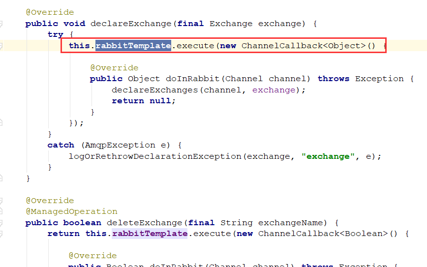
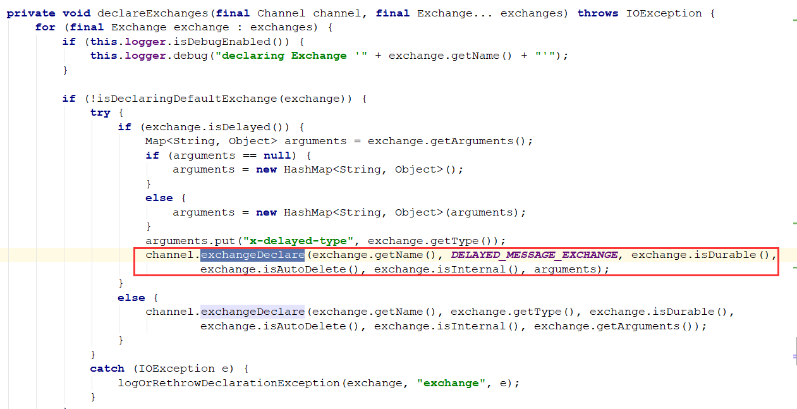

Spring AMQP是用于以AMQP为基础的MQ中间件的解决方案，对于底层API进行封装，使开发者在对MQ进行操作时更加易用，并进行了一些拓展与优化。

这里我们主要使用RabbitMQ与SpringAMQP整合，对于其他以AMQP规范制作的中间件也是差不多的整合方式。

## SpringAMQP核心内容

- `RabbitAdmin`：管控组件
- `RabbitTemplate`：消息模板组件
- `SimpleMessageListenerContainer`：简单消息监听容器
- `MessageListenerAdapter`：消息适配器
- `MessageConverter`：消息转换器

接下来，我们就需要对这些核心内容进行研究

## RabbitAdmin

`RabbitAdmin`的主要作用就是方便的操作Exchange，Queue，Binding这些信息

使用它需要几点注意：

- 需要将`RabbitAdmin`注入到上下文中，注入的前提是`ConnectionFactory`在上下文中，所以要先注入`ConnectionFactory`
- 注入时要设置`autoStartup=true`，不然不会加载`RabbitAdmin`

### 快速入门

#### 添加依赖

需要使用spring的amqp依赖，这里为了方便，使用的springboot的工程

```xml
<dependency>
    <groupId>com.rabbitmq</groupId>
    <artifactId>amqp-client</artifactId>
    <version>3.6.5</version>
</dependency>
<dependency>
    <groupId>org.springframework.boot</groupId>
    <artifactId>spring-boot-starter-amqp</artifactId>
</dependency>
```

#### 注入RabbitAdmin

```java
@SpringBootApplication
public class Application {
    public static void main(String[] args) {
        SpringApplication.run(Application.class,args);
    }

    @Bean
    public ConnectionFactory connectionFactory(){
        CachingConnectionFactory cachingConnectionFactory = new CachingConnectionFactory();
        cachingConnectionFactory.setAddresses("192.168.56.120:5672");
        cachingConnectionFactory.setUsername("guest");
        cachingConnectionFactory.setPassword("guest");
        cachingConnectionFactory.setVirtualHost("/");
        return cachingConnectionFactory;
    }

    @Bean
    public RabbitAdmin rabbitAdmin(ConnectionFactory connectionFactory){
        RabbitAdmin rabbitAdmin = new RabbitAdmin(connectionFactory);
        rabbitAdmin.setAutoStartup(true);
        return rabbitAdmin;
    }
}
```

这里，我直接写在启动器类了，注入`RabbitAdmin`前提是注入`ConnectionFactory`，这里使用的`spring.amqp`下的而不是之前使用的`rabbit`下的`ConnectionFactory`

需要注意的是 `rabbitAdmin.setAutoStartup(true);` 要设置为true，不然不会被加载此类

#### 测试

接着我们在Test类进行测试，简单的创建一个交换机，试试是否注入成功

```java
@RunWith(SpringRunner.class)
@SpringBootTest
public class ApplicationTests {
   
   @Autowired
   private RabbitAdmin rabbitAdmin;
   
   @Test
   public void testAdmin() throws Exception {
      // 添加Exchange
      rabbitAdmin.declareExchange(new DirectExchange("spring.direct",false,false,null));
   }

}
```

这里使用SpringBoot的Test类，然后运行，查看控制台


成功创建，说明`RabbitAdmin`注入成功

### RabbiAdmin基本操作

#### 针对Exchange

```java
@Test
public void testExchange() throws Exception {
   /* 对Exchange的操作 */
   // 添加Exchange
   rabbitAdmin.declareExchange(new DirectExchange("spring.direct",
         false,false,null));
   // 添加 topic类型的Exchange
   rabbitAdmin.declareExchange(new TopicExchange("spring.topic",
         false,false,null));
   // 添加fanout类型的Exchange
   rabbitAdmin.declareExchange(new FanoutExchange("spring.fanout",
         false,false,null));

   // 删除Exchange
   rabbitAdmin.deleteExchange("spring.fanout");
}
```

具有声明以及删除的操作

#### 针对Queue

```java
@Test
public void testQueue() throws Exception {
   /* 对Queue的操作 */
   // 创建Queue，并设置不持久化
   rabbitAdmin.declareQueue(new Queue("spring.direct.queue",false));

   // 获取Queue的属性
   Properties properties = rabbitAdmin.getQueueProperties("spring.direct.queue");
   System.out.println(properties);

   // 删除Queue
   rabbitAdmin.deleteQueue("spring.direct.queue");

   // 清空Queue中的消息
   // 这里使用死信队列，因为之前有一条死信消息没有被消费
   rabbitAdmin.purgeQueue("dlx_queue",false);
}
```

这里我们获取了Queue中的信息，主要获取到了消费者数量，信息数量，队列名，如下图：


#### 针对Binding

```java
@Test
public void testBinding() throws Exception {
   /* 对Binding的操作 */
   // 添加Exchange与Queue绑定关系，先添加一条队列和一个Exchange
   rabbitAdmin.declareExchange(new DirectExchange("spring.direct",false,false,null));
   rabbitAdmin.declareQueue(new Queue("spring.direct.queue",false));
   rabbitAdmin.declareBinding(new Binding(
         "spring.direct.queue", // 队列名
         Binding.DestinationType.QUEUE, // 绑定的是队列，也可以交换机之间进行绑定
         "spring.direct", // 交换机名称
         "direct", // 路由键
         null));

   // 解除绑定关系
   rabbitAdmin.removeBinding(new Binding(
         "spring.direct.queue", // 队列名
         Binding.DestinationType.QUEUE, // 绑定的是队列，也可以交换机之间进行绑定
         "spring.direct", // 交换机名称
         "direct", // 路由键
         null));
}
```

主要就是绑定和解绑

### 注解声明

在刚开始学习RabbitMQ的时候，使用最基础的`API`进行创建Exchange，Queue或Binding

```java
channel.exchangeDeclare(exchange,"topic",true);
channel.queueDeclare(queue,false,false,false,null);
channel.queueBind(queue,exchange,routingKey);
```

通过上面的学习，我们使用`RabbitAdmin`进行创建

```java
rabbitAdmin.declareExchange(DirectExchange);
rabbitAdmin.declareQueue(Queue);
rabbitAdmin.declareBinding(Binding);
```

那么有没有更简单的创建方式呢？

就是使用`@Bean`注解进行声明，放入到容器中，然后配合`RabbitAdmin`会自动进行加载并统一创建

```java
@Component
public class RabbitBean {

    @Bean
    public DirectExchange directExchange(){
        return new DirectExchange("spring.ann.direct");
    }

    @Bean
    public Queue queue(){
        return new Queue("spring.ann.direct.queue",false);
    }

    @Bean
    public Binding binding(){
        return new Binding("spring.ann.direct.queue",
                Binding.DestinationType.QUEUE,
                "spring.ann.direct",
                "ann.direct",
                null);
    }
}
```

这里我创建一个`RabbitBean`类，并添加`@Component`注解，使之注入到上下文容器中。

然后再到Test测试类，随便执行一条`RabbitAdmin`的语句，如下：

```java
@Test
public void testQueue() throws Exception {
   rabbitAdmin.purgeQueue("dlx_queue",false);
}
```

这时，回到控制台，会发现已经创建成功，并绑定了关联关系


**注意：必须使用`rabbitAdmin`执行某个方法，才能成功创建**

为什么要这样呢？我们进入源码探究

### 源码分析

首先进入到`RabbitAdmin`类中



可以发现之前那些创建Exchange，Queue的方法，都是先调用`RabbitTemplate`，**由`RabbitTemplate`创建`Channel`再返回`RabbitAdmin`的`ChannelCallback()`回调函数**

比如如下的回调函数：



最终调用的方法和我们一开始单独使用rabbitmq时一样


接着我们看看`RabbitAdmin`是如何自动创建被`@Bean`声明的交换机队列的

```java
public class RabbitAdmin implements AmqpAdmin, ApplicationContextAware, ApplicationEventPublisherAware,
      InitializingBean {
```

首先在类的实现接口中，就能发现端倪，`InitializingBean`，初始化Bean，按理说要自动创建肯定是初始化的时候，那么和这个接口肯定息息相关

```java
public interface InitializingBean {

   void afterPropertiesSet() throws Exception;

}
```

这个类中只有一个方法，就是初始化之后执行的方法，再回到`RabbitAdmin`中看看这个方法

```java
@Override
public void afterPropertiesSet() {

   synchronized (this.lifecycleMonitor) {
	  // 判断autoStartup是否开启 也是我们一开始说的那个参数，只有开启了才会接着加载
      if (this.running || !this.autoStartup) {
         return;
      }

      ··· // 省略一些配置
	 //  添加一个Connection监听器
      this.connectionFactory.addConnectionListener(new ConnectionListener() {

         // Prevent stack overflow...
         private final AtomicBoolean initializing = new AtomicBoolean(false);

         @Override // 当创建连接时 执行
         public void onCreate(Connection connection) {
             if (RabbitAdmin.this.retryTemplate != null) {
                 RabbitAdmin.this.retryTemplate.execute(
                     new RetryCallback<Object, RuntimeException>() {
                         @Override
                         public Object doWithRetry(RetryContext c) throws RuntimeException {
                             initialize();
                             return null;
                         }
                     });
         	}
      });

   }
}
```

这里主要是添加一个`connection`监听器，并当监听器连接时，调用`initialize()`方法，然后我们再进入这个方法看看

```java
public void initialize() {
    // 先创建各种类型的集合，用来保存Exchange，Queue等等
   Collection<Exchange> contextExchanges = new LinkedList<Exchange>(
         this.applicationContext.getBeansOfType(Exchange.class).values());
   Collection<Queue> contextQueues = new LinkedList<Queue>(
         this.applicationContext.getBeansOfType(Queue.class).values());
   Collection<Binding> contextBindings = new LinkedList<Binding>(
         this.applicationContext.getBeansOfType(Binding.class).values());

   @SuppressWarnings("rawtypes")
    // 从上下文容器中获取Exchange，Queue，Binding类型的类
    // 这里就是获取我们刚刚使用@Bean进行声明的类
   Collection<Collection> collections = this.declareCollections
         ? this.applicationContext.getBeansOfType(Collection.class, false, false).values()
         : Collections.<Collection>emptyList();
   for (Collection<?> collection : collections) {
      if (collection.size() > 0 && collection.iterator().next() instanceof Declarable) {
         for (Object declarable : collection) {
            if (declarable instanceof Exchange) {
               contextExchanges.add((Exchange) declarable);
            }
            else if (declarable instanceof Queue) {
               contextQueues.add((Queue) declarable);
            }
            else if (declarable instanceof Binding) {
               contextBindings.add((Binding) declarable);
            }
         }
      }
   }

   final Collection<Exchange> exchanges = filterDeclarables(contextExchanges);
   final Collection<Queue> queues = filterDeclarables(contextQueues);
   final Collection<Binding> bindings = filterDeclarables(contextBindings);

   ··· // 保存日志

   // 如果没有声明，直接返回不用创建
   if (exchanges.size() == 0 && queues.size() == 0 && bindings.size() == 0) {
      this.logger.debug("Nothing to declare");
      return;
   }
   this.rabbitTemplate.execute(new ChannelCallback<Object>() {
	  // 将被@Bean声明的那些Exchange，Queue，Binding进行创建
      @Override
      public Object doInRabbit(Channel channel) throws Exception {
         declareExchanges(channel, exchanges.toArray(new Exchange[exchanges.size()]));
         declareQueues(channel, queues.toArray(new Queue[queues.size()]));
         declareBindings(channel, bindings.toArray(new Binding[bindings.size()]));
         return null;
      }
   });
   this.logger.debug("Declarations finished");

}
```

通过这段源码的查看，就清晰明了了，会将`applicationcontext`中的所有Exchange，Queue，Binding类型的对象进行取出，再统一通过`channel`进行创建。

这里又回到我们刚刚的问题了，为何必须使用`RabbitAdmin`执行某一个方法，才能创建？

- 首先通过源码可以知道，想要创建，必须由监听器监听到`connection`连接，才会走初始化方法
- 那么可以确定就是如果不使用RabbitAdmin执行某个方法，那么它不会进行`connection`连接，所以这里我大胆猜测，**`RabbitAdmin`是懒加载的**，只有使用到它，它才会进行连接
- 所以我们必须要执行某个方法，让他进行连接，才能进行声明式`Bean`的创建


## RabbitTemplate

`RabbitTemplate`是一个非常好用的消息模板组件，它是非常重要的消息发送类，有大量不同的`send API`，可以非常灵活的进行消息发送。

他还提供了可靠性投递，回调监听`ConfirmCallBack`，返回确认`ReturnCallBack`等方法，来实现`Confirm`与`Return`

### 注入到容器中

RabbitTemplate和RabbitAdmin一样，都需要注入到上下文里

```java
@Bean
public RabbitTemplate rabbitTemplate(ConnectionFactory connectionFactory){
    return new RabbitTemplate(connectionFactory);
}
```

这里可以进行confirm已经return方法的编写，如下


这里我就不做添加了。

### 发送消息

首先可以看到RabbitTemplate有重载了大量的发送消息方法，进行灵活多样的操作


接下来我们通过RabbitTemplate进行发消息

```java
@RunWith(SpringRunner.class)
@SpringBootTest
public class RabbitTemplateTest {

    @Autowired
    private RabbitTemplate rabbitTemplate;

    @Test
    public void sendMessage(){
        // Message的Properties配置
        MessageProperties messageProperties = new MessageProperties();
        messageProperties.setHeader("desc","一些信息"); // 添加Header
        String msg = "hello rabbitTemplate";
        // 创建消息
        Message message = new Message(msg.getBytes(),messageProperties);
        // 发送一条消息 投递到spring.ann.direct Exchange上，路由键为ann.direct
        rabbitTemplate.convertAndSend("spring.ann.direct","ann.direct",message);

        // 发送一条消息，并添加后置处理，添加一些额外的信息
        rabbitTemplate.convertAndSend("spring.ann.direct", "ann.direct", message,
                new MessagePostProcessor() {
            @Override
            public Message postProcessMessage(Message message) throws AmqpException {
                message.getMessageProperties().setHeader("ex","postProcess Msg");
                return message;
            }
        });

        // 这里也可以使用send进行发送
        rabbitTemplate.send("spring.ann.direct","ann.direct",message);

        // 简单的发送一条字符串信息
        rabbitTemplate.convertAndSend("spring.ann.direct","ann.direct","simple send");
    }
}
```

这里我们使用了几种常用发送方式，但其实它还有更多更灵活的发送方式

- `convertAndSend(String exchange, String routingKey, final Object object)`：简单的发送方式，exchange，routingkey进行对应，最后消息的类型可以是多种多样的，底层进行转换，字符串或者`Message`类封装
- `convertAndSend(String exchange, String routingKey, final Object message,final MessagePostProcessor messagePostProcessor)`：添加一个后置处理器，根据需求处理
- `send(final String exchange, final String routingKey, final Message message)`：`send`方法的不同是必须是`Message`类型的参数，而`convertAndSend`是`Object`


发送完可以看到有4条消息，点进去详细查看


这里可以看到，第二第三条消息都添加了后置处理的`header`头，是因为在第二条消息发送的时候，那个`MessagePostProcessor`方法中，就已经在`Message`对象添加`header`头了，所以在第三条消息发送时，并不是他也进行了后置方法，只是`Message`对象还是用的原来的，导致也出现`postProcess Msg`（如果图片看不清，可以右键在新建标签页打开查看）