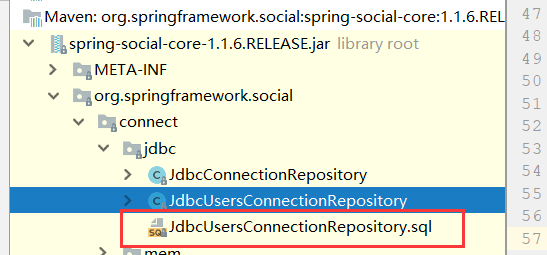
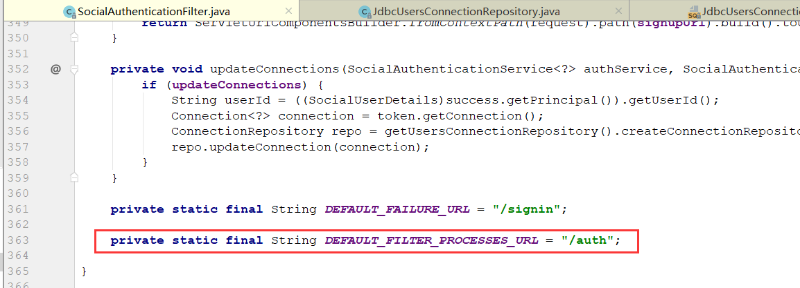
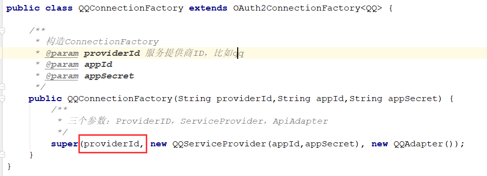

这一节，我们要研究SpringBoot2+SpringSecuritySocial来实现第三方登录-QQ登录

## 开发QQ登录思路

我们先看上一章的图


我们最后需要`Connection`，即QQ登录后的用户信息，想要`Connection`，就需要`ConnectionFactory`，想要`ConnectionFactory`，就需要我们自己实现`APIAdapter`和`ServiceProvider`，对于`ServiceProvider`来说，我们需要自己实现`Api`，而对于`OAuth2Operations`可以使用它默认实现的`OAuth2Template`。

所以，我们的开发流程为：

1. 自己实现`Api`
2. 使用默认的`OAuth2Operations`，从而实现`ServiceProvider`
3. 实现`ApiAdapter`，从而实现`ConnectionFactory`
4. 在`DB`建表，使用默认的`UsersConnectionRepository`
5. 这样就可以在容器中通过`ConnectionFactory`注入`Connection`使用了

## 实现QQ登录

### 准备工作

<https://wiki.connect.qq.com/>，到QQ互联官网查看文档，了解QQ登录需要哪些信息，如何获取这些信息，调用哪些接口，传入什么参数，返回什么结果，比较重要的有：

- [获取用户信息](<https://wiki.connect.qq.com/get_user_info>)
- [获取OpenID](<https://wiki.connect.qq.com/%E8%8E%B7%E5%8F%96%E7%94%A8%E6%88%B7openid_oauth2-0>)
- [获取Access_Token](<https://wiki.connect.qq.com/%E4%BD%BF%E7%94%A8authorization_code%E8%8E%B7%E5%8F%96access_token>)

### Api实现

实现Api前，我们先看看`AbstractOAuth2ApiBinding`的源码

```java
public abstract class AbstractOAuth2ApiBinding implements ApiBinding, InitializingBean {

   private final String accessToken;

   private RestTemplate restTemplate;
```

重要的成员变量有两个：

- `accessToken`：我们知道`Api`是第六步，这个Token就是前五步执行完后的令牌，即认证服务器认证后的标志，对于每个线程，每个用户来说，令牌都是不一样的，所以这个是多实例的
- `RestTemplate`：向不同第三方登录接口发送请求的`Template`类，使用`Restful`形式发送请求

#### 创建QQ接口

```java
public interface QQ {
    QQUserInfo getUserInfo();
}
```

接口化，具体实现由`QQImpl`实现

#### 创建QQUserInfo的Bean

```java
public class QQUserInfo {
    /**
     * 返回码
     */
    private String ret;
    /**
     * 如果ret<0，会有相应的错误信息提示，返回数据全部用UTF-8编码。
     */
    private String msg;
    /**
     *
     */
    private String openId;
    /**
     * 不知道什么东西，文档上没写，但是实际api返回里有。
     */
    private String is_lost;
    /**
     * 省(直辖市)
     */
    private String province;
    /**
     * 市(直辖市区)
     */
    private String city;
    /**
     * 出生年月
     */
    private String year;
    /**
     * 用户在QQ空间的昵称。
     */
    private String nickname;
    /**
     * 大小为30×30像素的QQ空间头像URL。
     */
    private String figureurl;
    private String figureurl_type;

    /**
     * 大小为50×50像素的QQ空间头像URL。
     */
    private String figureurl_1;
    /**
     * 大小为100×100像素的QQ空间头像URL。
     */
    private String figureurl_2;

    private String figureurl_qq;
    /**
     * 大小为40×40像素的QQ头像URL。
     */
    private String figureurl_qq_1;
    /**
     * 大小为100×100像素的QQ头像URL。需要注意，不是所有的用户都拥有QQ的100×100的头像，但40×40像素则是一定会有。
     */
    private String figureurl_qq_2;
    /**
     * 性别。 如果获取不到则默认返回”男”
     */
    private String gender;
    /**
     * 标识用户是否为黄钻用户（0：不是；1：是）。
     */
    private String is_yellow_vip;
    /**
     * 标识用户是否为黄钻用户（0：不是；1：是）
     */
    private String vip;
    /**
     * 黄钻等级
     */
    private String yellow_vip_level;
    /**
     * 黄钻等级
     */
    private String level;
    /**
     * 标识是否为年费黄钻用户（0：不是； 1：是）
     */
    private String is_yellow_year_vip;
}
```

这里就是从QQ互联的文档中查看的

#### 实现QQ接口

```java
public class QQImpl extends AbstractOAuth2ApiBinding implements QQ {

    // QQ的获取openId的路径，固定
    private static final String URL_GET_OPENID = "https://graph.qq.com/oauth2.0/me?access_token=%s";
    // QQ的获取用户信息的路径，固定
    private static final String URL_GET_USERINFO =
            "https://graph.qq.com/user/get_user_info?oauth_consumer_key=%s&openid=%s";

    private String appId; // appId 是QQ互联注册后给的
    private String openId; // openId 是通过accessToken获取的

    private ObjectMapper objectMapper;

    public QQImpl(String accessToken,String appId){
        super(accessToken,TokenStrategy.ACCESS_TOKEN_PARAMETER);

        this.appId = appId;

        // 调用QQ接口，获取openId
        String url = String.format(URL_GET_OPENID,accessToken);
        String result = getRestTemplate().getForObject(url,String.class);
        System.out.println("openid result：" + result);

        //处理结果
        String openId = StringUtils.substringBetween(result,"openid\":\"","\"}");
        this.openId = openId;
    }

    @Override
    public QQUserInfo getUserInfo(){
        // 通过调用QQ接口，获取用户信息
        String url = String.format(URL_GET_USERINFO,appId,openId);
        String result = getRestTemplate().getForObject(url,String.class);
        System.out.println("userinfo result :" + result);

        // 结果转成QQUserInfo对象，使用ObjectMapper
        QQUserInfo qqUserInfo = JSON.parseObject(result,QQUserInfo.class);
        qqUserInfo.setOpenId(openId);
        return qqUserInfo;
    }
}
```

这里我们详细说一下，其实注释也很清楚了

首先需要继承`AbstractOAuth2ApiBinding`抽象类，实现他的抽象方法`getUserInfo()`

我们从QQ互联文档可知，使用QQ接口获取对象，需要`accessToken`（授权），`appId`（qq互联的开发ID），`openId`（用户Id），对于`accessToken`是由`Oauth2Operations`提供的，appId因为是QQ互联注册时给的开发者ID所以肯定是配置的，后面传入的，所以这里我们主要获取`openId`。

根据文档，我们需要发送GET请求来获取openId，这一阶段我们在实例化的时候进行

然后我们通过GET请求再获取用户信息，即实现抽象方法`getUserInfo()`时进行

> 这里我使用了阿里的FastJson进行转换，Maven依赖添加一些即可

### ServiceProvider实现

我们有了API的QQ实现，对于`OAuth2Operations`我们使用默认的`OAuth2Template`，所以我们就可以构造出`ServiceProvider`了：

```java
public class QQServiceProvider extends AbstractOAuth2ServiceProvider<QQ> {

    private static final String URL_AUTHORIZE = "https://graph.qq.com/oauth2.0/authorize";
    private static final String URL_ACCESS_TOKEN = "https://graph.qq.com/oauth2.0/token";

    private String appId;

    /**
     * 构造方法，需要实例化OAuth2Operations
     * 这里我们使用默认的OAuth2OTemplate
     */
    public QQServiceProvider(String appId, String appSecret) {
        /**
         * String clientId, String clientSecret, String authorizeUrl, String accessTokenUrl
         * 四个参数：
         * clientId：注册QQ互联时给的，类似用户名
         * clientSecret：注册QQ互联时给的，类似密码，有了这两个，就知道是谁调用QQ接口了
         * authorizeUrl：引导用户去认证的地址，即获取授权码
         * accessTokenUrl：获取授权码后，请求获取令牌即Token的地址
         */
        super(new OAuth2Template(appId,appSecret,URL_AUTHORIZE,URL_ACCESS_TOKEN));
        this.appId = appId;
    }

    @Override
    public QQ getApi(String accessToken) {
        return new QQImpl(accessToken,appId);
    }
}
```

这里实现也很简单，继承`AbstractOAuth2ServiceProvider`抽象类，并配置QQ互联的两个获取认证的地址即可

### ConnectionFactory实现

想要实现`ConnectionFactory`，需要两个，`ServiceProvider`我们已经有了，就需要实现`ApiAdapter`了

#### 实现ApiAdapter

这里我们需实现`ApiAdapter`接口，我们之前就了解到，`Adapter`是对用户信息进行适配的，将获取到的第三方用户信息赋值到`Connection`上，所以代码也很简单，如下：

```java
public class QQAdapter implements ApiAdapter<QQ> {
    @Override
    public boolean test(QQ api) {
        return true;
    }

    @Override
    public void setConnectionValues(QQ api, ConnectionValues values) {
        // 之前说到的用户信息转换，把QQ返回的信息，转换成Connection固定的信息
        QQUserInfo userInfo = api.getUserInfo();

        values.setDisplayName(userInfo.getNickname()); // 设置用户名
        values.setImageUrl(userInfo.getFigureurl_qq_1()); // 设置用户头像
        values.setProfileUrl(null); // 用户的个人主页，QQ是没有的，微博有
        values.setProviderUserId(userInfo.getOpenId()); // 用户在提供者的ID
    }

    @Override
    public UserProfile fetchUserProfile(QQ api) {
        return null;
    }

    @Override
    public void updateStatus(QQ api, String message) {
        // do nothing
    }
}
```

有了`ApiAdapter`的实现，我们就可以实现`ConnectionFactory`了

```java
public class QQConnectionFactory extends OAuth2ConnectionFactory<QQ> {

    /**
     * 构造ConnectionFactory
     * @param providerId 服务提供商ID，比如qq
     * @param appId
     * @param appSecret
     */
    public QQConnectionFactory(String providerId,String appId,String appSecret) {
        /**
         * 三个参数：ProviderID，ServiceProvider，ApiAdapter
         */
        super(providerId, new QQServiceProvider(appId,appSecret), new QQAdapter());
    }
}
```

代码非常简单，就是通过`ProviderID`（服务提供商ID），`ServiceProvider`（`QQServiceProvider`），`ApiAdapter`实现即可。

### UsersConnectionRepository实现

#### 注入JdbcUsersConnectionRepository

上面绝大部分都实现完毕了，还有一个数据库相关的需要实现，这里我们使用`JdbcUsersConnectionRepository`，配置的方式是通过配置`SocialConfigurerAdapter`来进行注入：

```java
@Configuration
@EnableSocial
public class SocialConfig extends SocialConfigurerAdapter {

    @Autowired
    private DataSource dataSource;
    @Autowired
    private QQProperties qqProperties;

    @Override
    public UsersConnectionRepository getUsersConnectionRepository(ConnectionFactoryLocator connectionFactoryLocator) {
        /**
         * 数据源
         * 连接工厂
         * 对数据加解密
         */
        return new JdbcUsersConnectionRepository(dataSource,connectionFactoryLocator,Encryptors.noOpText());
    }

}
```

#### 数据库建映射表

建表语句我们可以通过查看`JdbcUsersConnectionRepository`源码位置来获取



```sql
create table UserConnection (userId varchar(255) not null,
 providerId varchar(255) not null,
 providerUserId varchar(255),
 rank int not null,
 displayName varchar(255),
 profileUrl varchar(512),
 imageUrl varchar(512),
 accessToken varchar(512) not null,
 secret varchar(512),
 refreshToken varchar(512),
 expireTime bigint,
 primary key (userId, providerId, providerUserId));
create unique index UserConnectionRank on UserConnection(userId, providerId, rank);
```

### 向容器添加ConnectionFatory

因为不同的第三方登录方式不同，所以注入方式也不同，这里我们新创建一个配置类，并继承上面写的`SocialConfig`配置类：

```java
@Configuration
public class QQAutoConfig extends SocialConfig {

    @Autowired
    private QQProperties qqProperties;

    // 向ConnectionFactory配置中添加我们创建的ConnectionFactory
    public void addConnectionFactories(ConnectionFactoryConfigurer configurer, Environment environment) {
        configurer.addConnectionFactory(this.createConnectionFactory());
    }

    // 创建ConnectionFactory
    protected ConnectionFactory<?> createConnectionFactory() {
        return new QQConnectionFactory(qqProperties.getProviderId(),
                qqProperties.getAppId(),
                qqProperties.getAppSecret());
    }

}
```

#### 实现SocialUserDetailsService

这里我们注入了`Connection`，但是还有一个问题：我们之前做好了数据库映射，现在可以通过`Connection`获取本应用`userId`但是我们还需要写一个实现，来通过本应用用户ID获取`UserDetails`，就和之前表单登录时一样。

代码很简单，在之前学习表单登录时实现`UserDetailsService`，在使用`Social`时需要实现`SocialUserDetailsService`，其业务逻辑都是和之前一样的

```java
@Component
public class QQUserDetailsService implements SocialUserDetailsService {

    private Logger logger = LoggerFactory.getLogger(getClass());

    @Autowired
    private PasswordEncoder passwordEncoder;

    @Override
    public SocialUserDetails loadUserByUserId(String userId) throws UsernameNotFoundException {
        return loadUser(userId);
    }

    private SocialUserDetails loadUser(String username) throws UsernameNotFoundException{
        // 第一个参数，用户名；第二个参数，密码；第三个参数，用户所拥有的权限
        // 这里我们写死了密码和权限，实际开发中需要根据业务需求进行查库动态配置
        String password = "123456";
        //return new User(username,password,AuthorityUtils.commaSeparatedStringToAuthorityList("admin"));

        // 这里我们需要自己写一些校验逻辑，比如用户是否被冻结，是否过期，是否可用
        Boolean enabled = true;
        Boolean accountNonExpired = true;
        Boolean credentialsNonExpired = true;
        Boolean accountNonLocked = true;

        // 对密码进行加密
        String encodePassword = passwordEncoder.encode(password);
        logger.info("密码为：" + encodePassword);
        return new SocialUser(username,encodePassword,
                enabled,accountNonExpired,credentialsNonExpired,accountNonLocked,
                AuthorityUtils.commaSeparatedStringToAuthorityList("admin"));
    }
}
```

### Security中配置Social过滤器

这里我们还需将`SocialAuthenticationFilter`加到过滤器链中，首先我们要把`SpringSocialConfigurer`注入到容器中，因为这里包含了Social过滤器的配置

```java
@Bean
public SpringSocialConfigurer springSocialConfigurer(){
    return new SpringSocialConfigurer();
}
```

这里直接加在之前写的`SocialConfig`配置类中就好

然后再`SpringSecurity`的配置类中添加`social`的配置

```java
@Configuration
public class BrowserSecurityConfig extends WebSecurityConfigurerAdapter {

    @Autowired
    private SpringSocialConfigurer springSocialConfigurer;

    @Override
    protected void configure(HttpSecurity http) throws Exception {
        http.
            ···
            .apply(springSocialConfigurer)
        ;
    }
}
```

这里一些之前的配置我们都进行了省略，最重要就是追加`SpringSocial`的配置


### 前端页面

```html
<!DOCTYPE html>
<html>
<head>
<meta charset="UTF-8">
<title>登录</title>
</head>
<body>
    <h2>标准登录页面</h2>
    <h3>社交登录</h3>
    <a href="/auth/qq">QQ登录</a>
</body>
</html>
```

这里为什么使用`"/auth/qq"`呢？我们也没有去配置这个路径，因为`SocialAuthenticationFilter`默认拦截`/auth`下的路径，而`qq`是我们的`providerId`





我们这样配的话，当请求`/auth/qq`时，会先被`SocialAuthenticationFilter`过滤器拦截，然后使用我们创建的`QQConnectionFactory`来走`oauth2`流程+构建`Connection`对象。

### 启动测试


会发现登录失败，非法重定向，到这里我们已经成功了一半了

下一章我们会通过代码，一点点解决问题，直到成功使用QQ登录