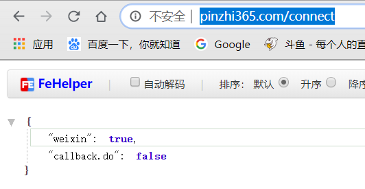
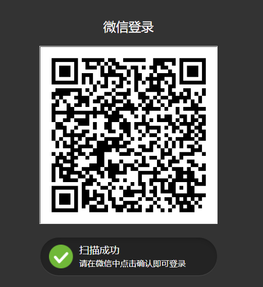
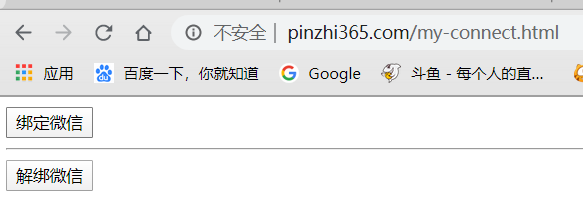
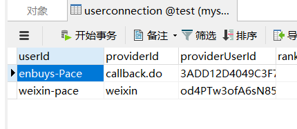

## 本篇内容概述

在很多网站，你注册了他们的用户后，在个人信息页面具有第三方登录的绑定和解绑功能，这和我们之前学习的第三方直接登录大同小异，不同点就是绑定与解绑需要先注册登录再操作，而之前是直接使用第三方登录再注册。


我们这一章要学习的就是使用SpringSocial实现第三方登录的绑定与解绑，实现功能有以下三个

- 获取用户绑定信息，获取了信息，前端页面才能展示绑定按钮还是解绑按钮
- 绑定第三方账号
- 解绑第三方账号

注意：因为对于QQ的绑定，需要到QQ互联中设置回调地址，比较麻烦，这里我们就使用微信进行绑定解绑操作

## ConnectController

实现功能之前，我们要先学习这个类，也是SpringSocial提供关于绑定的最重要的一个类，它提供了我们上面所需实现功能，如下

### 获取用户信息接口

```java
@Controller
@RequestMapping("/connect")
public class ConnectController implements InitializingBean {
    @RequestMapping(method=RequestMethod.GET)
    public String connectionStatus(NativeWebRequest request, Model model) {
       setNoCache(request);
       processFlash(request, model);
       Map<String, List<Connection<?>>> connections = connectionRepository.findAllConnections();
       model.addAttribute("providerIds", connectionFactoryLocator.registeredProviderIds());      
       model.addAttribute("connectionMap", connections);
       return connectView();
    }
    
    protected String connectView() {
		return getViewPath() + "status";
	}
}
```

通过源码可知，我们只需发送GET请求到`/connect`上，即可获取当前登录用户的绑定信息

注意这里会返回connectView()方法，即返回视图，所以我们需要创建一个名字叫`/connect/status`的视图对象，注入到容器中，不然会抛出405错误

实现原理也很简单，先通过`UsersConnectionRepository`根据`userId`查`userconnection`表，然后获取容器中所有`ConnectFactory`，然后根据`ProviderId`与查出来的结果进行判断，就可以知道是否绑定了

### 绑定接口

```java
@RequestMapping(value="/{providerId}", method=RequestMethod.POST)
public RedirectView connect(@PathVariable String providerId, NativeWebRequest request) {
   ConnectionFactory<?> connectionFactory = connectionFactoryLocator.getConnectionFactory(providerId);
   MultiValueMap<String, String> parameters = new LinkedMultiValueMap<String, String>(); 
   preConnect(connectionFactory, parameters, request);
   try {
      return new RedirectView(connectSupport.buildOAuthUrl(connectionFactory, request, parameters));
   } catch (Exception e) {
      sessionStrategy.setAttribute(request, PROVIDER_ERROR_ATTRIBUTE, e);
      return connectionStatusRedirect(providerId, request);
   }
}
```

发送`POST`请求到`/connect/{providerId}`上即可

这里绑定成功也会返回视图，我们也需要创建一个名字叫`/connect/{providerId}connected`

它的实现逻辑就是获取连接工厂然后执行`OAuth`协议的步骤，获取授权码获取令牌，就和我们当时第三方注册的逻辑一样，帮我们再跑了一遍

### 解绑接口

```java
@RequestMapping(value="/{providerId}", method=RequestMethod.DELETE)
public RedirectView removeConnections(@PathVariable String providerId, NativeWebRequest request) {
   ConnectionFactory<?> connectionFactory = connectionFactoryLocator.getConnectionFactory(providerId);
   preDisconnect(connectionFactory, request);
   connectionRepository.removeConnections(providerId);
   postDisconnect(connectionFactory, request);
   return connectionStatusRedirect(providerId, request);
}
```

解绑也很简单，我们自己就可以实现其实，就是删除`userconnection`中记录即可

发送`DELETE`请求到`/connect/{providerId}`

这里解绑成功也会返回视图，我们也需要创建一个名字叫`/connect/{providerId}connect`

这个`ConnectController`类了解完，我们就可以动手实现功能了，当然，还有一个前提是之前已经实现了微信登录注册，即上一篇文章

## 获取用户绑定数据

通过上面的了解，我们需要先创建一个视图

```java
@Component("connect/status")
public class MyConnectionStatusView extends AbstractView {
    @Override
    protected void renderMergedOutputModel(Map<String, Object> model, HttpServletRequest request, HttpServletResponse response) throws Exception {
        /**
         * 返回Json数据
         */
        // 取Connection
        Map<String, List<Connection<?>>> connections = (Map<String, List<Connection<?>>>)model.get("connectionMap");

        //封装当前用户的第三方账号绑定状态 key为providerId ， value为true或false
        Map<String, Boolean> result = new HashMap<>();
        for (String key : connections.keySet()) {
            result.put(key, CollectionUtils.isNotEmpty(connections.get(key)));
        }
        //将当前用户的第三方账号绑定状态返回给浏览器
        response.setContentType("application/json;charset=UTF-8");
        response.getWriter().write(JSON.toJSONString(result));

    }
}
```

然后启动登录后直接访问<http://www.pinzhi365.com/connect>



成功返回绑定信息，这里我登录的是`weixin-pace`，数据库里只绑定了微信，所以结果正常

## 绑定第三方账号

首先还是需要创建视图，因为视图名称不固定，QQ，微信都不同，所以这次我们不直接在类上加`@Component`注解，而是一会加在各自的`AutoConfig`类上

### 创建视图

```java
/**
 * @Author: Pace
 * @Data: 2020/1/16 10:30
 * @Version: v1.0
 * 这里因为QQ，微信都需要使用这个视图，所以不能直接写死，一会配在对应的Config类中
 */
public class MyConnectView extends AbstractView {
    @Override
    protected void renderMergedOutputModel(Map<String, Object> model, HttpServletRequest request, HttpServletResponse response) throws Exception {
        // 直接返回绑定成功json
        response.setContentType("application/json;charset=UTF-8");
        // 这里可以将返回包装，方便起见直接返回字符串了
        response.getWriter().write(JSON.toJSONString("绑定成功"));
    }
}
```

### 在AutoConfig类上注入视图

```java
@Bean("connect/weixinConnected")
@ConditionalOnMissingBean(name = "weixinConnectedView")
public View weixinConnectView(){
   return new MyConnectView();
}
```

### 添加绑定页面

```html
<!DOCTYPE html>
<html lang="en">
<head>
    <meta charset="UTF-8">
    <title>绑定页面</title>
</head>
<body>
<form action="/connect/weixin" method="post">
    <button type="submit">绑定微信</button>
</form>
</body>
</html>
```

### 启动测试


点击绑定按钮，跳转微信登录页面



扫码登录后页面显示绑定成功，数据库里新增一条数据


## 解绑第三方账号

解绑的话也需要视图，这里我们直接使用绑定的视图然后改一下逻辑，也在配置类上注入，原因和绑定的相同

### 改造视图

```java
public class MyConnectView extends AbstractView {
    @Override
    protected void renderMergedOutputModel(Map<String, Object> model, HttpServletRequest request, HttpServletResponse response) throws Exception {
        // 直接返回绑定成功json
        response.setContentType("application/json;charset=UTF-8");
        // 判断model中是否有connection，有说明是绑定，没有说明是解绑
        if(model.get("connections") == null){
            response.getWriter().write(JSON.toJSONString("解绑成功"));
        }else {
            // 这里可以将返回包装，方便起见直接返回字符串了
            response.getWriter().write(JSON.toJSONString("绑定成功"));
        }
    }
}
```

### 在AutoConfig上注入

```java
@Bean({"connect/weixinConnect","connect/weixinConnected"})
@ConditionalOnMissingBean(name = "weixinConnectedView")
public View weixinConnectView(){
   return new MyConnectView();
}
```

### 添加解绑按钮

```html
<!DOCTYPE html>
<html lang="en">
<head>
    <meta charset="UTF-8">
    <title>绑定页面</title>
</head>
<body>
<form action="/connect/weixin" method="post">
    <button type="submit">绑定微信</button>
</form>
<hr/>
<form action="/connect/weixin" method="post">
    <input id="method" type="hidden" name="_method" value="delete"/>
    <button type="submit">解绑微信</button>
</form>
</body>
</html>
```

### 启动测试

先登录pp这个用户，然后进入绑定页面，点击解绑按钮



跳转解绑成功信息，查看数据库，映射已经被删除


