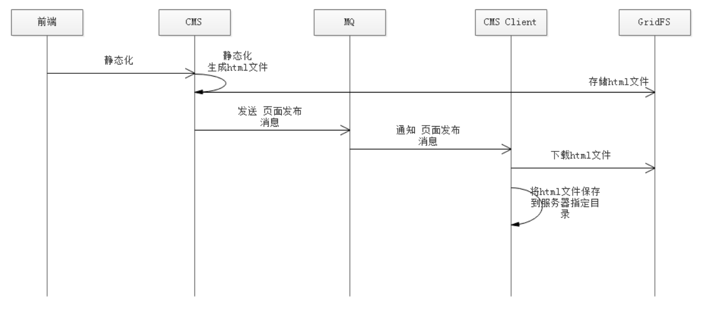
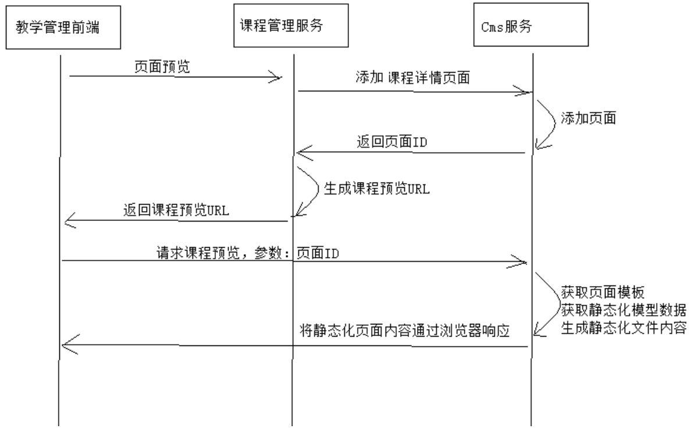
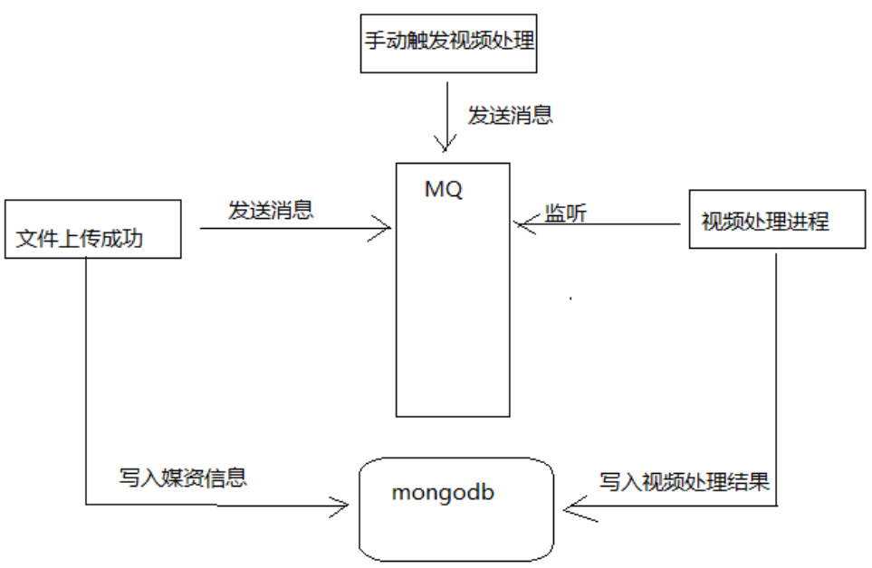
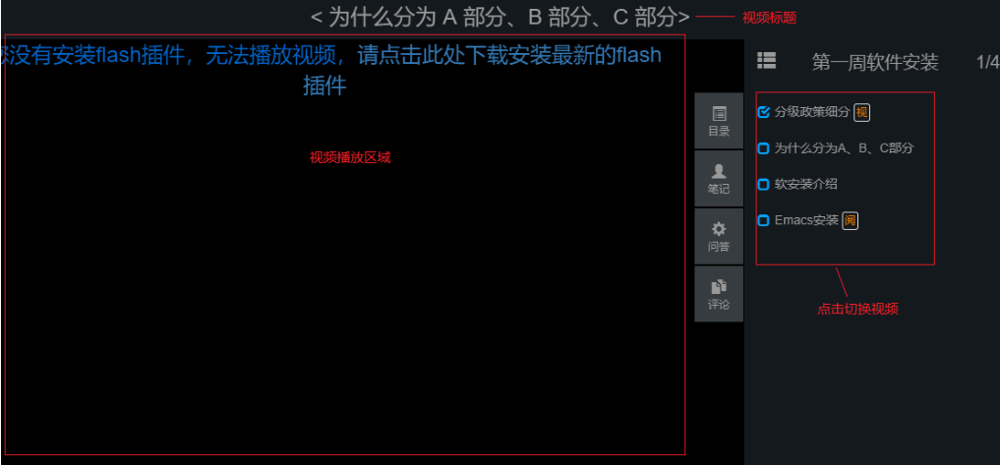
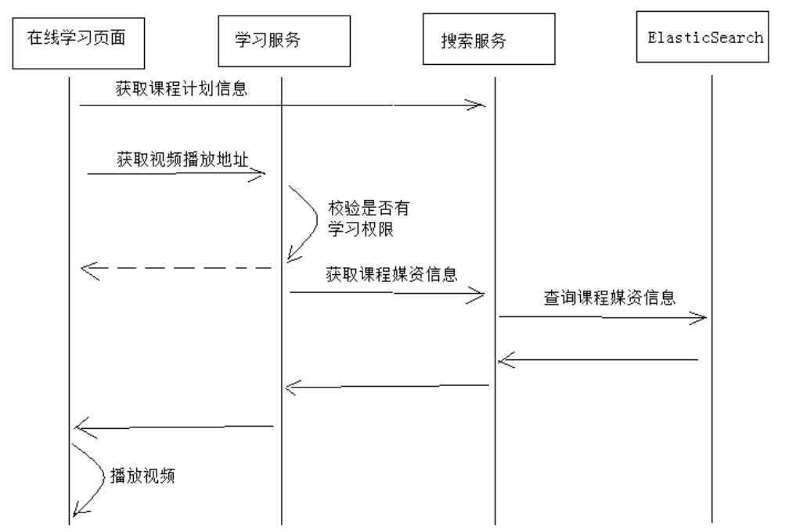
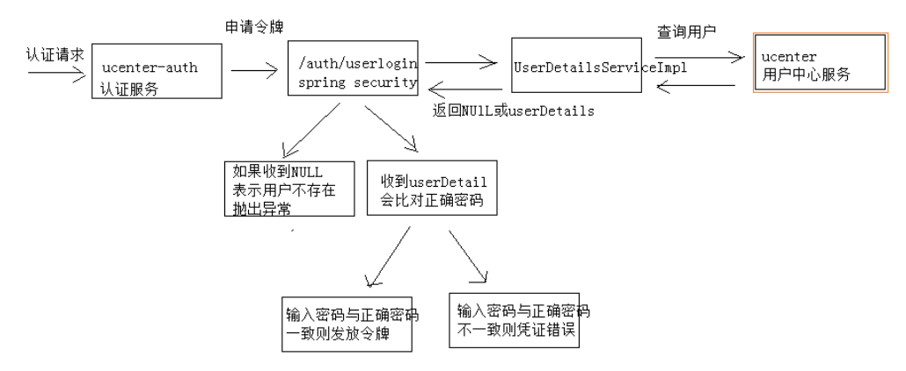
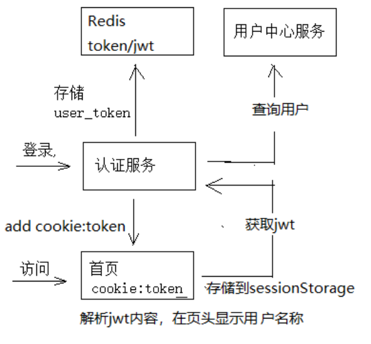
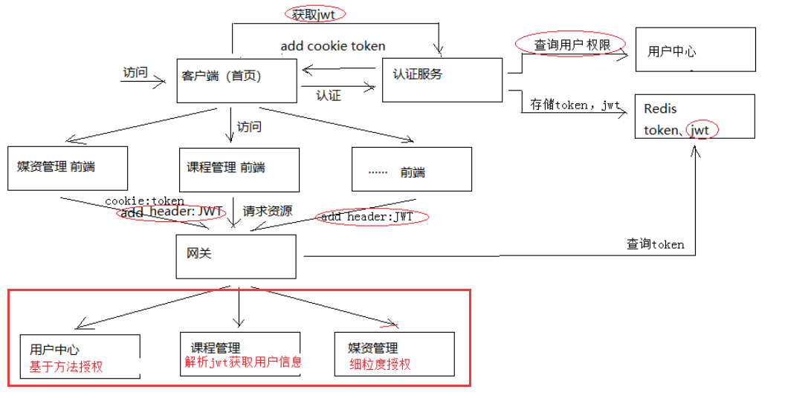
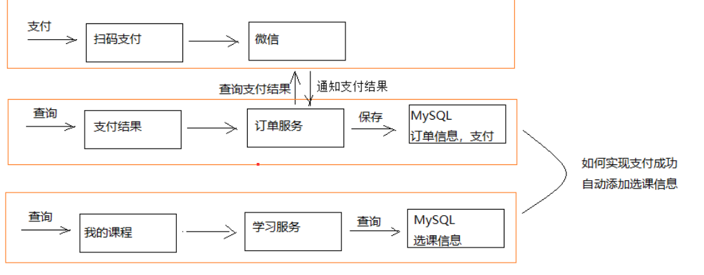
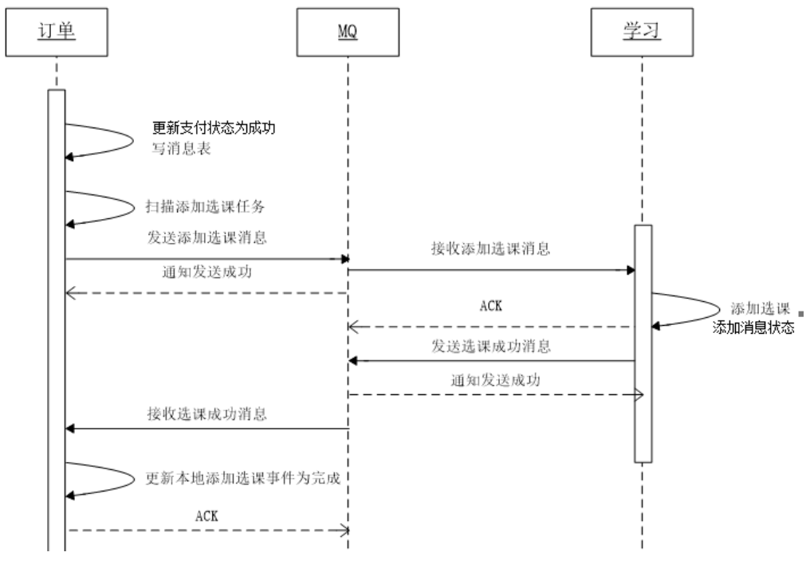

## CMS工程

CMS工程用来静态页面的管理，比如：首页轮播图，课程详情页面等。

主要就是结合Freemarker生成静态页面保存到服务器路径，由于nginx的存在，可以很快速的进行页面的发布。

其使用的数据库是MongoDB

前端项目：

- xc-ui-pc-sysmanage

后端项目：

- xc-service-manage-cms

- xc-service-manage-cms-client：RabbitMQ的消费方，用来接收消息，进行页面保存到服务器路径

### 前提

手工添加站点和模板，本项目实现的功能需要添加有轮播图和课程详情的站点与模板

因为没有编写页面站点和页面模板的管理功能，所以需要手工添加

    1. 需要添加门户主站站点到站点表
    2. 将静态文件（存储在`xc-resources/templates`中）保存到GridFS中，可以使用`xc-service-manage-cms`工程的单笔测试`GridFsTemplateTest`，将静态模板存到GridFS中
    3. 根据保存的文件ID以及门户站点ID，手工添加模板信息到模板表

### 模板数据获取接口

这个接口用来为静态化准备，静态化需要两个条件 模板文件和数据模型，这个接口就是用来获取数据模型的。

根据id查询数据信息`cms_config`表

### 页面管理

页面的增删改查，比较简单

页面需要结合模板表和站点表，还有一个就是需要配置正确的`dataUrl`，用来静态化准备

### 页面预览

页面预览功能其实就是页面静态化的功能，使用Freemarker和MongoDB中的数据生成静态html，具体实现如下图

1. 前端请求CMS管理服务，调用页面静态化接口，传入页面ID
2. CMS首先根据页面ID查询MongoDB的页面表
3. 获取页面中DataUrl的信息，这个字段保存了数据模型获取的接口（新增页面时需要配置好）
4. 使用RestTemplate请求此接口获取数据模型
5. 然后根据页面中的templateId获取模板信息
6. 获取完模板信息根据保存的文件id向GridFS获取文件，并通过文件下载流下载出文件的String格式
7. 然后执行静态化接口，通过模板和数据，生成静态页面
8. 最后通过SpringMVC的ServletOutputStream将页面输出

### 页面发布

页面发布其实就是页面预览（静态化）的升级版，多加了RabbitMQ进行页面保存到服务器

1. 前端请求页面发布接口
2. CMS管理服务首先根据页面id对页面执行静态化，步骤如上方
3. 静态化完毕将html文件保存到GridFS中
4. 然后需要告诉服务器，让服务器到GridFS中下载此文件，然后保存到相应位置，这里就需要RabbitMQ
5. CMS端发送消息给Broker，CMS Client消费方监听消息
6. 然后根据传来的pageId向GridFS中下载页面，然后拼接`服务器路径 = 站点物理路径 + 文件路径 + 文件名`
7. 保存完毕后，因为有nginx的代理，所以即刻便可以访问主页查看是否成功

## 课程管理工程

课程管理就相当于电商系统的商品管理，其属性比较多，比如课程图片，课程基本信息，课程营销，课程计划等等，这些信息都需要我们进行管理，而且对于课程详情页面我们还需要使用静态化进行动态发布，其逻辑和前面的页面发布类似。

其使用的数据库是Mysql

前端项目：

- xc-ui-pc-teach：课程的后台管理工程
- xc-ui-pc-static-resources：课程详情静态化后保存的工程，通过配置nginx访问
- xc-ui-pc-portal：
  - 使用Nuxt搭建的门户页面，因为Vue是客户端渲染语言，对SEO并不好，使用Nuxt为Vue提供的服务端渲染技术，很好的SEO，门户和课程搜索页都需要SEO
  - 课程搜索所在的前端工程

后端项目：

- xc-service-manage-course
- xc-service-base-filesystem：用来上传图片到FastDFS中，course模块使用Feign远程调用
- xc-service-manage-cms：
  - 课程等级和模式使用数据字典，保存到MongoDB中，这里为了方便就写在cms模块里查询
  - 需要使用CMS的页面预览和页面发布接口，课程详情页也是静态化页面
- xc-service-manage-cms-client：页面发布需要使用RabbitMQ
- xc-service-search：ElasticSearch进行课程搜索

### 课程计划管理

- 查询课程计划：相较其他的查询来说稍微复杂一点，因为他是按级别分类的，一级二级三级，这里我们就要动态编写sql语句了，具体看代码或文档
- 添加课程计划：需要注意一点，就是如果没有选择父节点，说明此节点为二级节点，父节点为根节点即一级节点。还有一点就是如果是新课，那么课程计划表里此课是没有根节点的，需要先插入根节点，再插入新添加的节点。
- 修改删除

### 课程管理

- 新增课程：
  - 这里课程的分类需要动态查询，类似课程计划
  - 课程等级和模式使用的是数据字典，需要查询MongoDB，所以这里放到cms工程查询
- 课程管理：课程管理就是课程修改，它分为很多项，课程基本信息，图片等等
  - 课程基本信息修改

  - 课程计划修改，就和上面课程计划管理一样

  - 课程营销修改，相对简单

  - 课程图片：这里需要运用FastDFS来保存图片，需要先根据第六篇笔记搭建环境；课程图片修改和保存时一样的，逻辑就是上传到FDFS后，保存图片信息到数据库；每个课程只能有一个课程图片，所以如果新增会覆盖之前的。删除很简单

    > 因为上传图片到FDFS不止课程图片需要用到，所以这里又创建了一个服务来提供上传图片的功能，为`xc-service-base-filesystem`

### 课程预览

因为课程也是做成静态化的，所以其类似于CMS中的页面预览

#### 前提

执行静态化之前，需要将静态文件保存到GridFS中，可以使用`xc-service-manage-cms`工程的单笔测试`GridFsTemplateTest`，将静态模板存到GridFS中，然后到MongoDB中`xc_cms`库，`cms_template`表中添加新的模板，并保存GridFS返回的ID

这里我们使用的模板是`course.ftl`，保存在`xcEduService\xc-resources\templates`中

分析：因为之前已经做了页面预览，大致流程都清楚，所以课程预览相对简单，只需将课程转化为CmsPage对象，然后保存到MongoDB中即可，根据pageId调用之前页面预览的接口，即可实现页面预览

1. 用户到管理课程界面，发布课程子节点，点击课程预览
2. 课程服务根据课程id查询课程信息，转换为对应的CmsPage
3. 使用SpringCloud的Feign调用CMS服务的添加页面接口，将CmsPage保存到MongoDB中
4. 课程服务获取调用后页面ID拼接课程预览的URL返回给前端
5. 用户在前端页面请求课程预览Url，打开新窗口显示课程详情内容（这里请求的课程预览的接口是之前已经实现的CMS中页面预览接口，所以不需要其他操作，CMS接口会根据页面id进行页面静态化输出到页面）

> 注意，对于课程详情页面的静态化，需要进行nginx代理，比较繁琐，详细请看第九天讲义和nginx配置文件，这里我将静态文件保存在`xc-ui-pc-static-resources\static`下

### 课程发布

课程发布就和之前页面发布逻辑一样，但是多了一些步骤

#### 前提

首先根据自己文件存放的位置，到MongoDB的cms_page和cms_site修改文件存放路径，拼接规则为：

`页面URL = 站点域名 + 站点WebPath + 页面WebPath + 页面名称`，根据拼接规则自行修改，注意CMS Client保存到服务器的位置不是`xc-ui-pc-static-portal`工程，而是`xc-ui-pc-static-resources`中，因为是静态页面，所以应该保存到静态工程中，并且配合之前我们配置的`nginx.conf`，可以实现反向代理到工程中。

逻辑也不是很复杂：

0. 思考下，课程发布时传来的是课程id，所以我们需要转成页面信息保存到MongoDB中，这里需要先调用保存接口，再调用课程发布接口，这样比较繁琐，所以我们在CMS服务中新增一个一键发布接口，即在CMS Service中就实现号保存和课程发布，直接返回给调用方`pageUrl`
1. 前端点击课程发布，传入课程ID
2. 课程管理服务通过Feign请求CMS一键发布接口进行页面发布，参数是CmsPage
3. CMS进行先进行页面保存或修改，然后进行页面发布，发布逻辑和之前的一模一样，直接调用即可，最后拼接URL为`站点域名 + 站点WebPath + 页面WebPath + 页面名称`，返回给课程服务
4. 课程服务调用成功后修改课程状态为已发布，然后返回给前端URL
5. 前端提供标签跳转到课程发布成功后的页面

### 课程搜索

课程搜索需要用到elasticSearch这个全文检索技术，分为两块，一块是课程索引的搭建，一块是搜索服务

具体流程如上图，根据流程，我们会发现两个问题

1. 索引库维护的问题，因为是课程搜索，所以维护的肯定是课程信息，需要mysql的数据同步，这里使用到Logstash同步，也是配合es使用的经典技术（再加上kibana就能搭建elk了~）
2. 经过之前的学习以及代码编写，我们知道课程数据库的课程信息分成了多张表，那么同步起来就很复杂，所以这里我们将使用`course_pub`表将所有数据整合起来，以供ES索引库维护，既然需要将所有数据整合，那么这项工作在哪里完成呢，我们之前编写了课程发布，按逻辑来说，课程发布完，就可以维护此表了，所以我们在课程发布后进行数据插入

关于索引搭建可以具体搭建查看第七个笔记

#### 修改课程发布逻辑

首先我们需要修改课程发布逻辑，要将课程信息保存到课程详情表`course_pub`里

- 当课程发布完毕后，需要根据课程ID查询课程基础信息，图片，营销信息，计划，然后将这些数据结合
- 结合后将信息，设置信息的时间戳存到数据库，这样Logstash根据时间戳，就会自动更新新的数据。
- 还有一点需要修改就是课程删除，Logstash不能进行删除，所以要调用es client进行document删除

#### 课程搜索逻辑

课程搜索单独起一个服务，`xc-service-search`

实现逻辑也很简单，主要是es java api的调用，需要熟悉es 的api

1. 创建搜索请求，设置索引名称和type
2. 创建搜索逻辑，根据关键字搜索，根据分类和等级过滤，并且分页设置和高亮显示
3. 设置完毕后进行搜索
4. 然后将搜索结果封装返回

对于课程搜索来说，因为需要注意SEO，所以使用了Vue提供的Nuxt来实现服务端渲染，所以另起一个前端工程，为动态渲染的门户工程，[xc-ui-pc-portal](https://github.com/PAcee1/xcEduUI/tree/master/xc-ui-pc-portal)

对于前端逻辑以及如何简单使用Nuxt可以查看第8篇笔记

## 媒资管理

媒资管理是用来管理课程视频的，也是非常重要的模块，具体有上传视频，视频查询，视频处理，课程计划整合视频等。

其使用的数据库是Mysql和MongoDB

前端项目：

- xc-ui-pc-teach

后端项目：

- xc-service-manage-media
- xc-service-manage-media-processor：RabbitMQ的消费方，用来接收消息，进行页面保存到服务器路径
- xc-service-manage-course：保存课程计划媒资信息

### 上传视频文件

上传视频就是将视频上传到服务器某个位置，我们使用的前端插件是WebUploader，具体可以看第10天笔记

保存路径为：

- 文件路径：`根路径（配置的路径） + md5第一个字符 + md5第二个字符 + md5值 + 文件扩展名`
- 文件分块路径：`根路径（配置的路径） + md5第一个字符/ md5第二个字符/ md5值/ chunk`

主要步骤有以下步骤

- 断点续传：将大文件分小块，依次上传，使用`WebUploader`前端插件实现
- 上传前检查（后端实现接口）：主要有两个作用
  - 判断文件是否存在，存在直接返回
  - 文件不存在，在保存位置创建对应的文件夹
- 分块检查（后端实现接口）：检查分块路径下是否有传来的分块，根据分块路径+分块名称检查
- 分块上传（后端实现接口）：先检查分块目录是否存在，不存在创建，然后使用IO流将分块上传到对应文件夹下
- 合并文件（后端实现接口）：
  1. 获取分块位置，将分块用`List`保存，方便排序
  2. 将文件块按名称排序，这样才能正确合并
  3. 创建写流，循环`List`
  4. 每个`File`创建读流，将文件内容读取写到合并的文件中
  5. 合并完毕进行`md5`校验
  6. 然后保存文件信息到`MongoDB`中
  7. 最后需要使用RabbitMQ发送消息，告知视频处理服务进行视频处理

### 视频处理

因为我们使用HLS协议，需要将视频转成`m3u8/ts`文件，花费时间较长

所以这里我们创建一个视频处理模块`xc-service-manage-media-processor`，进行视频上传后的处理工作，配合RabbitMQ进行解耦和释放资源。

关于HLS协议，可以查看第九篇笔记。

这里我们使用的视频处理软件是`ffmpeg`，需要提前将它下载好，然后再`xc-service-manage-media-processor`工程中配置其所在目录

视频处理流程：

主要实现逻辑：

1. RabbitMQ监听消息，执行视频处理接口
2. 根据传来的`mediaId`查询MongoDB，找到视频信息
3. 判断文件是否以`.avi`结尾，是则修改视频状态为正在处理，不是则修改视频状态为不处理，保存数据库（目前只支持`.avi`文件）
4. 使用工具类将`avi`文件生成`mp4`文件
5. 将`mp4`文件生成`m3u8/ts`文件
6. 处理成功后保存`m3u8`里的`list`，存到数据库中

### 我的媒资

#### 列表查询

查询，删除，修改媒资文件，较简单

#### 手动处理

即请求视频模块的RabbitMQ接口，向视频处理模块发消息进行处理

### 媒资课程计划

在课程管理的课程计划页面，点击选择视频，弹出选择媒资文件窗口。这里使用`xc-service-manage-course`的接口

1. 前端点击选择，将视频id与课程计划id，课程id，视频访问url等信息传到后台
2. 根据id查询课程计划信息，封装课程计划信息和视频信息，保存到数据库

## 学习中心

学习中心主要是视频播放，目录展示，以及点击目录播放对应视频

其使用的数据库是Mysql

前端项目：

- xc-ui-pc-learning

后端项目：

- xc-service-learning：学习服务，查询课程计划信息，远程调用搜索服务获取媒资信息等
- xc-service-search：搜索服务，搜索媒资信息

### 学习视频播放

视频播放使用了前端插件video.js，支持HLS协议进行播放视频，然后配合nginx就可以请求本地处理好的m3u8视频

### 右侧课程计划展示

课程计划在Mysql数据库和ES索引库里都存在，这里我们使用ES查询，因为更快

简单的使用ES查询

### 获取视频播放地址

这里我们和课程一样，因为视频播放页访问量也较大，所以使用ES进行存储查询，数据库中使用 `teachplan_media_pub`来保存课程和媒体的信息，进行Logstash的同步，具体逻辑是：

0. 索引库维护，课程在课程管理工程发布之后，需要查询课程媒资信息，保存到课程媒资Pub表中，设置时间戳，和课程一样，使用Logstash同步到ES上

1. 前端点击课程某个计划，请求后端，传课程计划id
2. 学习服务使用Feign请求搜索服务
3. 使用ES根据课程计划id查询课程媒资信息
4. 将信息封装返回给学习服务
5. 最后返回给前端，播放视频

## 认证服务

使用SpringSecurity OAuth2实现认证授权，具体可以查看第11和13篇笔记

具体流程如上图

其使用的数据库是Mysql

前端项目：基本需要登录的都有用到

后端项目：

- xc-service-ucenter：用户信息查询，为OAuth生成令牌提供接口
- xc-service-ucenter-auth：认证服务器

### 前提

因为没有写注册接口，所以需要自行向数据库添加用户，测试用户：itcast/111111

### 登录功能

登录逻辑：

生成令牌逻辑：

1. 用户在前端登录
2. 请求认证服务器登录接口
3. 首先使用密码模式获取令牌（令牌保存了用户信息）
4. 令牌由重写SpringSecurity的UserDetailsService接口实现，会向ucenter服务查询用户信息，进行封装
5. SpringSecurity底层按照逻辑生成JWT令牌
6. 登录接口获取到令牌后，会将JWT保存到Redis中
7. 然后将JWT写到Cookie里返回（这里报错jti短令牌）

### 页面显示用户信息

因为之前cookie保存的短令牌，为了提高性能，节省空间，页面要展示用户信息，就必须获取完整的JWT才可以，所以我们需要再次请求，拿短令牌获取JWT，并将其保存到前端的httpSession中

1. 客户端携带cookie中的身份令牌请求认证服务获取jwt令牌。
2. 认证服务查询Redis，拿出JWT返回
3. 客户端解析jwt令牌，并将解析的用户信息存储到sessionStorage中。jwt令牌中包括了用户的基本信息，客户端解析jwt令牌即可获取用户信息。
4. 客户端从sessionStorage中读取用户信息，并在页头显示。

### 登出功能

1. 删除Redis
2. 删除Cookie

### 网关拦截

使用SpringCloud的Zuul网关模块，具体配置可以看第12篇笔记

主要分为路由和过滤

- 路由：路由只需在配置文件中配置即可，可以看笔记
- 过滤：使用ZuulFilter，当用户请求时，判断用户Cookie中是否存在，并且Redis没有过期，并且请求头有Authorization

### 用户授权

刚刚我们使用SpringSecurity实现了认证登录，还有一个就是授权，就是某个用户有权限干嘛的校验

在第13篇笔记详细介绍了用户授权。这里大概说下实现思路：

1. 首先JWT中需要保存用户的权限列表，如：添加课程，发布课程等等
2. 这里就要修改之前查询用户的接口，关联查询权限表，存储用户权限列表
3. 网关放行后，有两种方式
   1. 在方法上使用注解判断，因为用户信息已经保存到SpringSecurity内部的Authorization中了，不需要取出判断
   2. 根据业务逻辑，获取JWT解析，拿出需要的东西进行判断，比如课程查询，用户只能看到他所拥有的课程，就需要根据用户的一些字段做查询条件

## 订单服务

订单服务功能有很多，比如下订单，订单查询等等，这里我们主要目的是学习分布式事物，所以我们实现的功能只有一个，就是订单支付成功后自动添加选课功能。

其使用的数据库是Mysql

前端项目：

- xc-ui-pc-portal
- xc-ui-pc-static-resources

后端项目：

- xc-service-learning：用户信息查询，为OAuth生成令牌提供接口
- xc-service-manage-order：认证服务器

### 支付成功后自动添加选课

如果是简单的单体项目，实现很简单，支付成功回调方法里，修改订单状态，向课程表添加用户信息即可，在一个事物里控制，但是我们用到的是微服务项目，学习中心服务控制学习信息数据库，订单服务控制订单数据库，这就需要分布式事物的控制，

我们实现分布式事物的方法是**消息队列实现最终一致性**，分布式事物拆成多个事物控制：

1. 支付成功后，修改支付状态为成功，并且写入到消息表（在一个事物里）
2. Spring Task定时任务扫描消息表，扫描一分钟前的消息，如果有发送给MQ，并更新其消息updateTime
3. 学习服务监听选课队列，有消息进来先判断历史消息表是否有数据
   1. 没数据，添加选课信息，并将消息保存到历史消息表
   2. 有数据，不作操作
4. 学习中心操作完后，发送完成选课消息到MQ
5. 订单中心监听完成选课队列，有消息过来将消息保存到历史消息表，并删除消息表中这条消息

这样做的好处是各个中心各干各的，效率高，不会出现阻塞等问题，坏处是多次读写数据库，会对数据库性能造成问题。

这样写完还有一个问题，就是因为是微服务，那么就有多个定时任务，会出现重复发消息浪费资源的问题。解决方案是**加入乐观锁**，在发消息之前先更新消息表的version字段，如果更新成功则发送，更新不成功，说明version字段已经被改变，有其他任务已经发了消息，就不做操作。