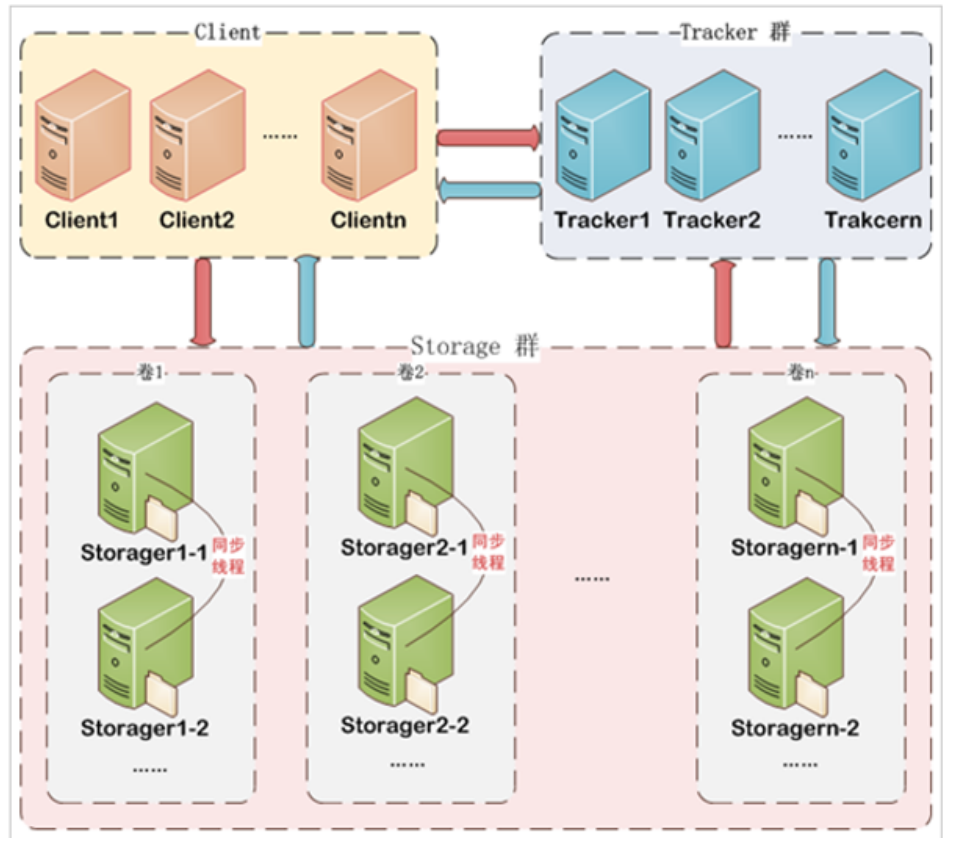
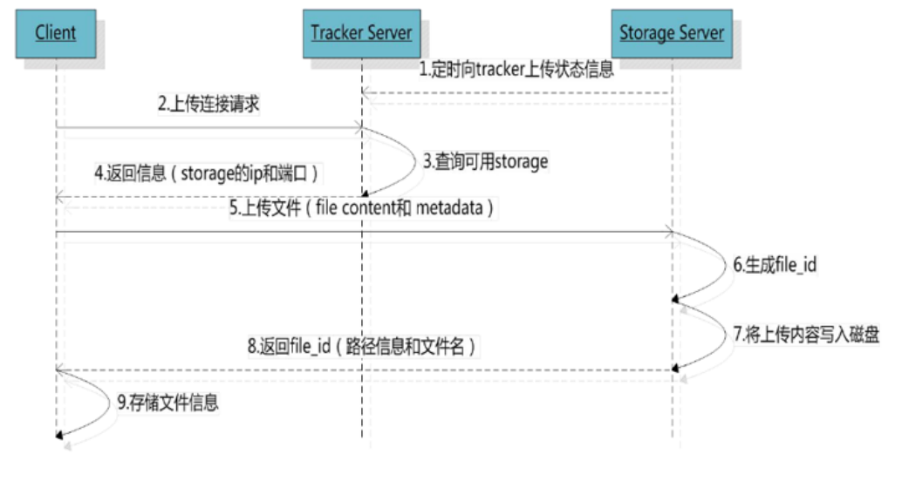
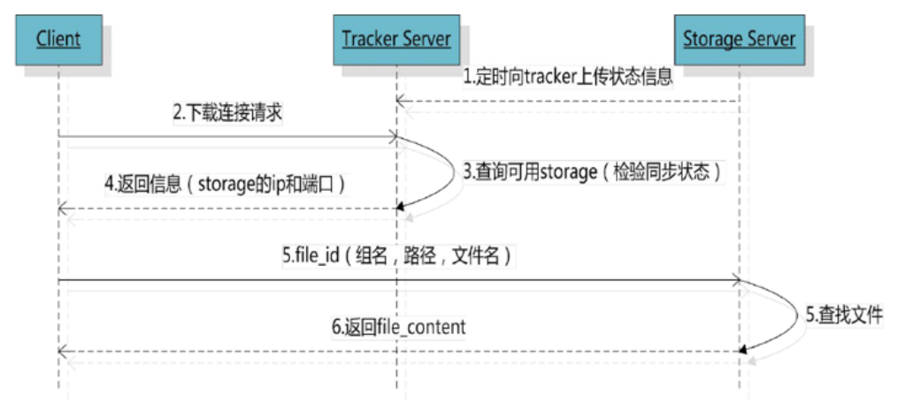

## 分布式文件系统

### 什么是分布式文件系统

指多个文件系统不在一个机器上，而是通过网络连接起来，用户可以访问多个服务器连接起来的文件，比如文件A在A机器，文件B在B机器，AB机器通过网络连接成为分布式文件系统，文件系统中的数据会互相备份，提供高可用，用户访问A就可以拿到A和B文件。

### 为什么需要分布式文件系统

随着互联网用户及需求的增加，单单靠着添加硬盘个数大小已经满足不了要求，因为磁盘传输速度有限，存储的数据极速增长，包括备份安全等成本更加提高。

使用分布式文件系统，多个服务器的文件系统通过网络连接，一台服务器存储传输能力有限，但是多个服务器共同存储传输，其效率成倍增长。

好处：

1. 一台计算机的文件系统处理能力扩充到多台同时存储
2. 一台服务器挂了，还有其他服务器的副本提供数据
3. 服务器分布在不同地域，用户就近访问，速度更快


## FastDFS

### FastDFS介绍

FastDFS是用c语言写的，由淘宝架构师编写并开源。

为互联网量身定制，冗余备份，负载均衡，线性扩容等机制处理得当，注重高性能高可用，并且FastDFS学习成本低，搭建简单。

### 为什么使用FastDFS

分布式文件系统很多，比如NFS，GFS，他们这些系统相对复杂，性能一般，使用起来并不是特别适合。

而FastDFS因为专为互联网而生，搭建简单，性能高，更适合存储图片等小文件，为什么？**因为FastDFS没有使用通常的块存储技术，不对文件分块，使得消去块合并的开销，通信使用Socket，所以速度快性能高**。

### FastDFS架构



架构由两部分组成

- Tracker Server：负责负载均衡和调度，当客户端请求保存或下载时，会根据一些策略选择合适的Storage Server来进行服务提供。当某个Tracker宕机时，客户端请求会使用轮询算法，请求节点宕机会请求下一个节点，达到高可用。

  **注意！这里客户端请求后，Tracker找到合适的Storage后会返回给客户端Storage的ip端口，然后客户端再根据ip端口访问Storage Server上传下载文件；而不是客户端给Tracker文件，由Tracker带着文件信息请求Storage放进去。**

- Storage Server：存储服务器，负责文件的存储与下载，他相对于Tracker来说更加复杂，因为它是由集群和组组成。

  - 集群：一个Storage集群包含多个Storage组，组与组间相互独立，并不通信。
  - 组：一个组包含一个或多个Storage服务器，多个服务器间同步数据，并且是平等关系（不是主从结构），所以当某个服务器挂掉，组内其他服务器也可以提供服务，达到高可用，所以组内最好为2台及以上的服务器数量。
  - 好处：这样划分的好处很多，其中一个就是扩容问题，当服务器访问压力大时，可以扩充组内的服务器来增强服务能力（纵向扩容），当系统容量不够时，可以添加组来达到容量添加（横向扩容）。
  - 心跳：Storage Server会连接所有的Tracker，并定时向他们报告状态。

### FastDFS上传下载流程

#### 上传



由上图可知

1. 客户端首先请求Tracker拿到Storage的ip端口后
2. 再次拿着文件信息请求Storage
3. Storage存储后返回file_id给客户端
4. 客户端存储file_id等文件信息

这里file_id很关键，它的组成是：`组名/虚拟磁盘路径/数据两级目录/文件名`


- 组名：storage组名称
- 虚拟磁盘路径：storage配置的虚拟路径，与磁盘选项`store_path`有关，比如`store_path0`即`M00`，`store_path0`即`M01`
- 数据两级目录： storage服务器在每个虚拟磁盘路径下创建的两级目录，用于存储数据文件。
- 文件名：与文件上传时不同。是由存储服务器根据特定信息生成，文件名包含：源存储服务器 IP地址、文件创建时间戳、文件大小、随机数和文件拓展名等信息。


#### 下载



看明白上传后，下载其实很简单

1. Tracker通过组名定位到存储服务器组，再根据服务器状态返回一个合适的ip端口
2. 客户端再次请求，服务器根据file_id中的信息返回文件给客户端

## FastDFS安装教程

### 准备

一个centos7
一个FastDFS_v5.05.tar.gz
一个libfastcommonV1.0.7.tar.gz

环境安装：

```
$ yum -y install zlib zlib-devel pcre pcre-devel gcc gcc-c++ openssl openssl-devel libevent libevent-devel perl unzip net-tools wget
```

### 安装tracker

```
# libevent环境准备
yum -y install libevent

# 安装libfastcommon
cd /usr/local
tar -zxvf libfastcommonV1.0.7.tar.gz
cd libfastcommon-1.0.7
./make.sh
./make.sh install

# 安装FastDFS
tar -zxvf FastDFS_v5.05.tar.gz
cd FastDFS
./make.sh
./make.sh install
```


注意：libfastcommon 安装好后会自动将库文件拷贝至`/usr/lib64` 下，由于 FastDFS 程序引用 `usr/lib` 目录所以需要将`/usr/lib64 `下的库文件拷贝至`/usr/lib `下。

```
cp /usr/lib64/libfastcommon.so /usr/lib
```


安装成功将安装目录下的conf下的文件拷贝到`/etc/fdfs/`下

```
cp -r conf/. /etc/fdfs/
```

### 配置tracker

fastDFS的配置文件目录 ：`/etc/fdfs`

主要的配置文件：`/etc/fdfs/tracker.conf` （tracker配置文件 ）；`storage.conf`（storage配置文件）

`tracker.conf`配置内容如下：

端口：`port=22122`

存储策略：`store_lookup=`

> 取值范围：0（轮询向storage存储文件）、1（指定具体的group）、2负载均衡，选择空闲的storage存储指		定具体的group：store_group= 如果store_lookup设置为1则这里必须指定一个具体的group。

tracker 基础目录：`base_path=/home/fastdfs`，tracker在运行时会向此目录存储storage的管理数据。

配置 http 端口：`http.server_port=80`

### 配置Storage

Storage的安装和Tracker一样，这里我们使用一台服务器，所以直接配置就好了

`storage.conf`配置 内容如下：

组名：`group_name=group1`

端口：`port=23000`

向 tracker心跳间隔（秒）：`heart_beat_interval=30`

storage基础目录：`base_path=/home/fastdfs`

磁盘存储目录，可定义多个`store_path`：`store_path0=/home/fastdfs/fdfs_storage` 此目录下存储上传的文件，在`/home/fastdfs/fdfs_storage/data`下

上报tracker的地址：`tracker_server=192.168.101.64:22122`

如果有多个tracker则配置多个tracker，比如：

`tracker_server=192.168.101.64:22122`

`tracker_server=192.168.101.65:22122`

配置 http 端口：`http.server_port=80`


这些都配置完毕后，需要创建文件夹：`mkdir -p /home/fastdfs`

### 启动

Tracker：`/usr/bin/fdfs_trackerd /etc/fdfs/tracker.conf restart`

Storage：`/usr/bin/fdfs_storaged /etc/fdfs/storage.conf restart`

## FastDFS测试上传下载

### 环境搭建

创建maven工程，添加依赖：

```xml
<dependencies>
    <dependency>
        <groupId>org.springframework.boot</groupId>
        <artifactId>spring-boot-starter-web</artifactId>
    </dependency>
    <!-- https://mvnrepository.com/artifact/net.oschina.zcx7878/fastdfs-client-java -->
    <dependency>
        <groupId>net.oschina.zcx7878</groupId>
        <artifactId>fastdfs-client-java</artifactId>
        <version>1.27.0.0</version>
    </dependency>
    <dependency>
        <groupId>org.springframework.boot</groupId>
        <artifactId>spring-boot-starter-test</artifactId>
        <scope>test</scope>
    </dependency>
    <dependency>
        <groupId>org.apache.commons</groupId>
        <artifactId>commons-io</artifactId>
        <version>1.3.2</version>
    </dependency>
</dependencies>
```

创建配置文件：`resource/config/fastdfs-client.properties`

```properties
#http连接超时时间
fastdfs.connect_timeout_in_seconds=5
#tracker与storage网络通信超时时间
fastdfs.network_timeout_in_seconds=30
#字符编码
fastdfs.charset=UTF-8
#tracker服务器地址，多个地址中间用英文逗号分隔
fastdfs.tracker_servers=192.168.56.120:22122
```

因为是SpringBoot工程，所以需要先创建启动器类

创建Test测试

```java
@SpringBootTest
@RunWith(SpringRunner.class)
public class TestFastDFS {
}
```

### 上传

```java
@Test
public void upload() throws Exception {
    ClientGlobal.initByProperties("config/fastdfs-client.properties");
    //创建客户端
    TrackerClient trackerClient = new TrackerClient();
    //连接tracker Server
    TrackerServer trackerServer = trackerClient.getConnection();
    //获取一个storage server
    StorageServer storageServer = trackerClient.getStoreStorage(trackerServer);
    //创建一个storage存储客户端 , 使用StorageClient1 因为它是新版本扩展的类，功能更强
    StorageClient1 storageClient1 = new StorageClient1(trackerServer, storageServer);
    String item = "E:\\pic\\photo.jpg";
    String fileid = storageClient1.upload_file1(item, "jpg", null);
    System.out.println("Upload local file " + item + " ok, fileid=" + fileid);
}
```

### 下载

```java
@Test
public void download() throws Exception {
    // 加载配置文件
    ClientGlobal.initByProperties("config/fastdfs-client.properties");
    // 创建Tracker客户端
    TrackerClient trackerClient = new TrackerClient();
    // 根据客户端获取Tracker Server
    TrackerServer trackerServer = trackerClient.getConnection();
    // 然后通过Tracker Server选择一个Storage Server
    StorageServer storageServer = trackerClient.getStoreStorage(trackerServer);
    // 通过获取到的Storage Server创建Storage Client来请求Storage
    StorageClient1 storageClient = new StorageClient1(trackerServer,storageServer);

    // 根据id获取文件
    byte[] bytes = storageClient.download_file1("group1/M00/00/00/wKg4eF4LkeaAewbOAACWdQKHIuQ261.jpg");

    // 保存文件
    FileOutputStream fileOutputStream = new FileOutputStream(
            new File("E:\\pic\\photo_fdfs.jpg"));
    fileOutputStream.write(bytes);
    fileOutputStream.close();
}
```

### 查询

```java
@Test
public void search() throws Exception {
    // 加载配置文件
    ClientGlobal.initByProperties("config/fastdfs-client.properties");
    // 创建Tracker客户端
    TrackerClient trackerClient = new TrackerClient();
    // 根据客户端获取Tracker Server
    TrackerServer trackerServer = trackerClient.getConnection();
    // 然后通过Tracker Server选择一个Storage Server
    StorageServer storageServer = trackerClient.getStoreStorage(trackerServer);
    // 通过获取到的Storage Server创建Storage Client来请求Storage
    StorageClient1 storageClient = new StorageClient1(trackerServer,storageServer);

    // 查询文件信息
    FileInfo fileInfo = storageClient.query_file_info1("group1/M00/00/00/wKg4eF4LkeaAewbOAACWdQKHIuQ261.jpg");
    System.out.println(fileInfo);
}
```

## FastDFS配合nginx实现虚拟主机

### 安装FastDFS-nginx-module

在 storage server 上安装 nginx 的目的是对外通过 http 访问 storage server 上的文件。使用 nginx 的模块 `fastdfs-nginx-module` 的作用是通过 http 方式访问 storage 中的文件，当 storage 本机没有要找的文件时向源 storage 主机代理请求文件。

将 fastdfs-nginx-module_v1.16.tar.gz 传 至 fastDFS 的 storage 服 务 器 的`/usr/local/`下，执行如下命令：

```
cd /usr/local
tar -zxvf fastdfs-nginx-module_v1.16.tar.gz
cd fastdfs-nginx-module/src
```

修改 config 文件将`/usr/local`/路径改为`/usr/`


将 `fastdfs-nginx-module/src` 下的 `mod_fastdfs.conf` 拷贝至`/etc/fdfs/`下

```
cp mod_fastdfs.conf /etc/fdfs/
```

并修改` mod_fastdfs.conf `的内容：`vi /etc/fdfs/mod_fastdfs.conf`

```
base_path=/home/FastDFS
tracker_server=192.168.101.3:22122
tracker_server=192.168.101.4:22122
url_have_group_name=true #url 中包含 group 名称
store_path0=/home/fastdfs/fdfs_storage #指定文件存储路径
```

将 `libfdfsclient.so` 拷贝至`/usr/lib` 下

`cp /usr/lib64/libfdfsclient.so /usr/lib/`

### 安装Nginx

将nginx-1.8.0.tar.gz拷贝到`/usr/local`下

解压nginx-1.8.0.tar.gz

进入nginx-1.8.0目录，执行如下配置命令：

```
./configure \
--prefix=/usr/local/nginx \
--pid-path=/var/run/nginx/nginx.pid \
--lock-path=/var/lock/nginx.lock \
--error-log-path=/var/log/nginx/error.log \
--http-log-path=/var/log/nginx/access.log \
--with-http_gzip_static_module \
--http-client-body-temp-path=/var/temp/nginx/client \
--http-proxy-temp-path=/var/temp/nginx/proxy \
--http-fastcgi-temp-path=/var/temp/nginx/fastcgi \
--http-uwsgi-temp-path=/var/temp/nginx/uwsgi \
--http-scgi-temp-path=/var/temp/nginx/scgi \
--add-module=/usr/local/fastdfs-nginx-module/src
```

然后编译安装

```
make
make install
```

在/usr/local/nginx/conf下添加配置文件 nginx-fdfs.conf

```conf
worker_processes  1;

events {
    worker_connections  1024;
}


http {
    include       mime.types;
    default_type  application/octet-stream;

    sendfile        on;
    keepalive_timeout  65;

	server {
		listen       80;
		server_name  192.168.56.120;
		location ~/group([0-9])/M00/ {
			root /home/fastdfs/fdfs_storage/data;
			ngx_fastdfs_module;
		}
	}

}
```

启动：`/usr/local/nginx/sbin/nginx -c /usr/local/nginx/conf/nginx-fdfs.conf`

启动成功后访问`ip+file_id`测试是否成功访问


## 学成在线上传文件需求


如图，因为我们不止课程图片要保存到fdfs，还有课程资料，用户头像等需要保存，所以我们抽取出文件系统服务，其他服务可以进行统一调用。

并创建文件系统数据库，此数据库仅仅保存文件信息，不存储他是课程的图片还是用户的头像，对于这种更精细的信息由各个服务自行保存到其服务对应的数据库中。