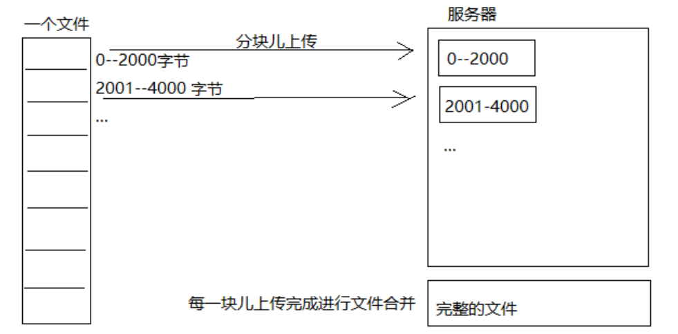
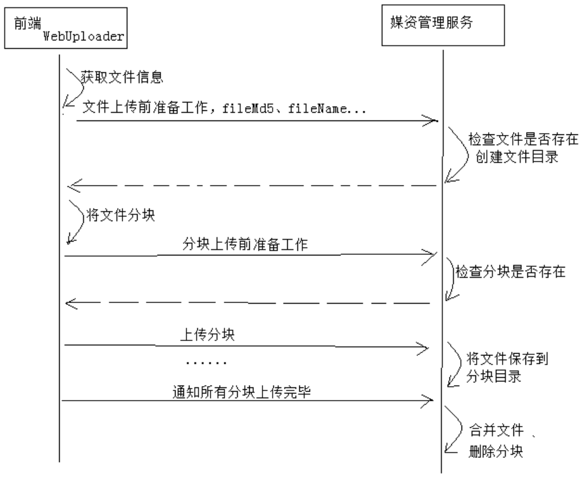
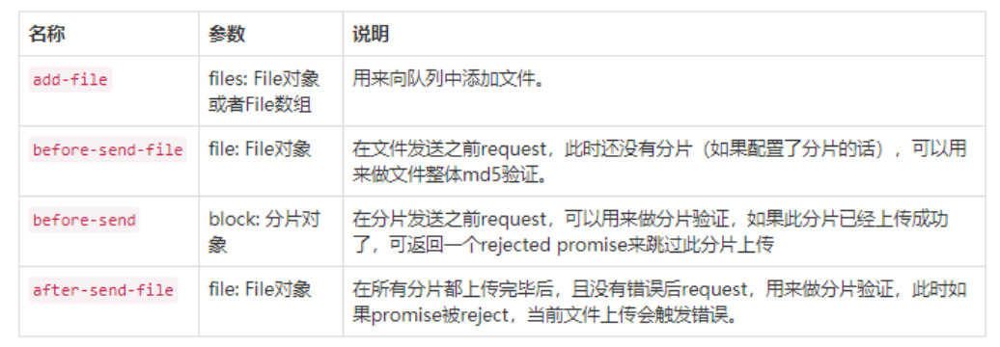

## 断点续传

为什么需要断点续传技术很简单，通过http传输大文件时，如果长连接不小心网络闪断，那么文件就要重头来过，如果是2个G的文件，传到1.9G闪断了，那么非常让人崩溃！

断点续传也很简单，将大文件按照1m或者10m进行分割，分割完后多线程上传或者依次上传，如果出现网络闪断，只需重新上传为完成的部分就好了。



## 使用Java实现断点续传

### 文件分块

```java
/**
 * 测试文件分块
 */
@Test
public void testChunk() throws IOException {
    // 文件位置
    File file = new File("D:\\Videos\\学成在线\\13-在线学习 HLS\\资料\\lucene.avi");

    // 设置文件分块后保存位置
    String chunkFileFolder = "D:\\Videos\\学成在线\\13-在线学习 HLS\\资料\\fileChunk\\";

    // 设置每块大小
    long chunkFileSize = 1 * 1024 * 1024;
    // 块的数量
    long chunkFileNum = (long)Math.ceil((file.length() * 1.0) / chunkFileSize);

    //读取文件
    RandomAccessFile readIO = new RandomAccessFile(file,"r");
    // 循环分块输出
    for (int i = 0; i < chunkFileNum; i++) {
        // 创建写文件
        File outFile = new File(chunkFileFolder + i); // 输出0,1,2,3,4,等文件块
        RandomAccessFile writeIO = new RandomAccessFile(outFile,"rw");

        // 写文件
        byte[] bytes = new byte[1024];
        int len = -1;
        while((len = readIO.read(bytes)) != -1){
            // 写文件
            writeIO.write(bytes);
            // 如果超过块大小，跳出
            if(outFile.length() > chunkFileSize){
                break;
            }
        }

        writeIO.close();
    }
    readIO.close();
}
```

很简单，就是规定文件块大小，如果写入的文件超过了大小，断开，重新创建新文件写入，这样就能写出大量文件块

### 文件合并

```java
/**
 * 测试合并
 */
@Test
public void testMerge() throws IOException {
    // 合并文件夹
    File mergeFolder = new File("D:\\Videos\\学成在线\\13-在线学习 HLS\\资料\\fileChunk\\");
    // 目标文件
    File file = new File("D:\\Videos\\学成在线\\13-在线学习 HLS\\资料\\fileMerge.avi");
    // 创建文件
    file.createNewFile();

    // 处理需要合并的文件，按文件名升序
    File[] files = mergeFolder.listFiles();
    List<File> list = Arrays.asList(files);
    Collections.sort(list, new Comparator<File>() {
        @Override
        public int compare(File o1, File o2) {
            if(Integer.parseInt(o1.getName()) > Integer.parseInt(o2.getName())){
                return 1;
            }
            return -1;
        }
    });

    // 文件读取写入
    byte[] bytes = new byte[1024];
    RandomAccessFile writeIO = new RandomAccessFile(file,"rw");
    for (File merageFile : list){
        RandomAccessFile readIO = new RandomAccessFile(merageFile,"r");
        int len = -1;
        while ((len = readIO.read(bytes)) != -1){
            writeIO.write(bytes,0,len);
        }
        readIO.close();
    }
    writeIO.close();
}
```

合并有一点需要注意，就是文件需要进行排序，按之前分隔的顺序进行写入才可以保证文件原样输出。

**对于Java实现文件断点续传，我们只需要了解，因为我们不在服务端完成这个技术，而是在前端，使用插件完成，这样更简单方便**

## WebUploader

WebUploader是百度开发出来前端Html5文件上传的一个组件，对于大文件上传处理很好用。

具体介绍可以看官网：<http://fexteam.gz01.bdysite.com/webuploader/>

### 上传流程



这里主要上传流程如图，WebUploader提供了很多钩子方法来让我们进行重写执行。

1. 首先用户选择上传的文件，获取文件信息
2. 这里有一个钩子方法可以执行，文件上传前的准备工作，调用媒资服务接口，来进行创建目录，加密等操作
3. 校验完毕后，WebUploader会进行文件分块
4. 在分块上传前，再次执行钩子方法，判断此分块是否存在，即断点续传判断，如果存在就不上传了
5. 接着WebUploader上传分块
6. 所有分块上传完毕后，会执行钩子方法，这时媒资服务就可以合并分块，然后删除分块

### 使用WebUploader

#### 构建WebUploader

```javascript
// 创建uploader对象，配置参数
this.uploader = WebUploader.create(
  {
    swf:"/static/plugins/webuploader/dist/Uploader.swf",//上传文件的flash文件，浏览器不支持h5时启动flash
    server:"/api/media/upload/uploadchunk",//上传分块的服务端地址，注意跨域问题
    fileVal:"file",//文件上传域的name
    pick:"#picker",//指定选择文件的按钮容器
    auto:false,//手动触发上传
    disableGlobalDnd:true,//禁掉整个页面的拖拽功能
    chunked:true,// 是否分块上传
    chunkSize:1*1024*1024, // 分块大小（默认5M）
    threads:3, // 开启多个线程（默认3个）
    prepareNextFile:true// 允许在文件传输时提前把下一个文件准备好
  }
)
```

#### 钩子方法



这里我们要使用的钩子方法有：

##### `before-send-file`

文件开始上传前前端请求服务端准备上传工作。

参考源代码如下：

```javascript
beforeSendFile:function(file) {
    // 创建一个deffered,用于通知是否完成操作
    var deferred = WebUploader.Deferred();
    // 计算文件的唯一标识，用于断点续传
    (new WebUploader.Uploader()).md5File(file, 0, 100*1024*1024)
        .then(function(val) {
        this.fileMd5 = val;
        this.uploadFile = file;
        //向服务端请求注册上传文件
        $.ajax(
            {
                type:"POST",
                url:"/api/media/upload/register",
                data:{
                    // 文件唯一表示
                    fileMd5:this.fileMd5,
                    fileName: file.name,
                    fileSize:file.size,
                    mimetype:file.type,
                    fileExt:file.ext
                },
                dataType:"json",
                success:function(response) {
                    if(response.success) {
                        //alert('上传文件注册成功开始上传');
                        deferred.resolve();
                    } else {
                        alert(response.message);
                        deferred.reject();
                    }
                }
            }
        );
    }.bind(this));

    return deferred.promise();
}.bind(this),
```

##### `before-send`

上传分块前前端请求服务端校验分块是否存在。

参考源代码如下：

```javascript
beforeSend:function(block) {
    var deferred = WebUploader.Deferred();
    // 每次上传分块前校验分块，如果已存在分块则不再上传，达到断点续传的目的
    $.ajax(
        {
            type:"POST",
            url:"/api/media/upload/checkchunk",
            data:{
                // 文件唯一表示
                fileMd5:this.fileMd5,
                // 当前分块下标
                chunk:block.chunk,
                // 当前分块大小
                chunkSize:block.end-block.start
            },
            dataType:"json",
            success:function(response) {
                if(response.fileExist) {
                    // 分块存在，跳过该分块
                    deferred.reject();
                } else {
                    // 分块不存在或不完整，重新发送
                    deferred.resolve();
                }
            }
        }
    );
    //构建fileMd5参数，上传分块时带上fileMd5
    this.uploader.options.formData.fileMd5 = this.fileMd5;
    this.uploader.options.formData.chunk = block.chunk;
    return deferred.promise();
}.bind(this),
```

#####  `after-send-file`

在所有分块上传完成后触发，可以请求服务端合并分块文件

参考代码如下：

```javascript
afterSendFile:function(file) {
    // 合并分块
    $.ajax(
        {
            type:"POST",
            url:"/api/media/upload/mergechunks",
            data:{
                fileMd5:this.fileMd5,
                fileName: file.name,
                fileSize:file.size,
                mimetype:file.type,
                fileExt:file.ext
            },
            success:function(response){
                //在这里解析合并成功结果
                if(response && response.success){
                    alert("上传成功")
                }else{
                    alert("上传失败")
                }
            }
        }
    );
}.bind(this)
```


WebUploader的具体实现可以看`xc-ui-pc-teach\src\module\media\page\upload.vue`


