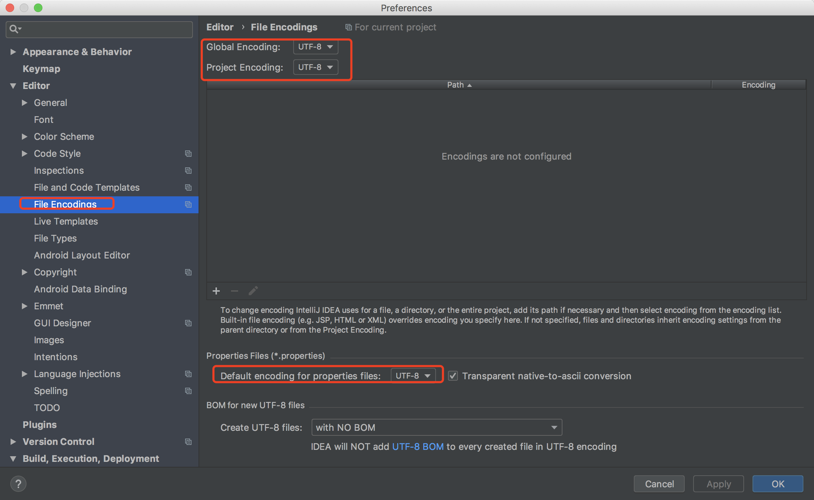
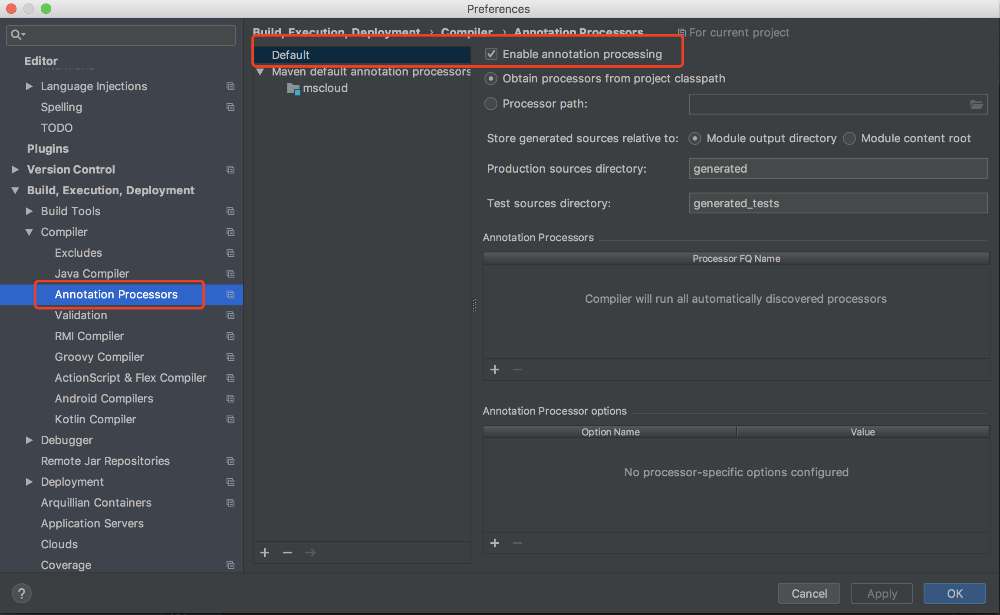
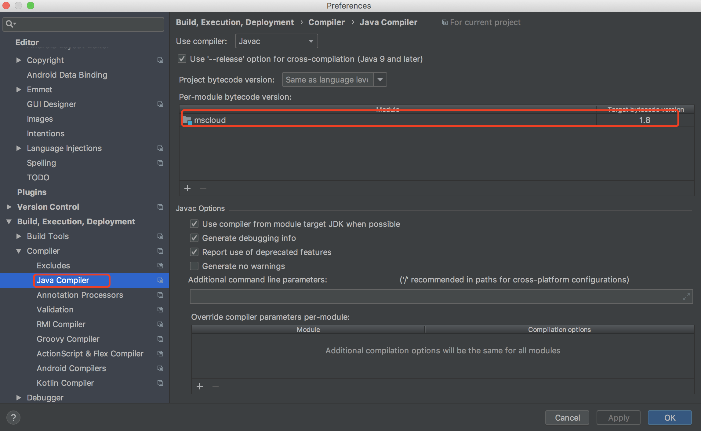
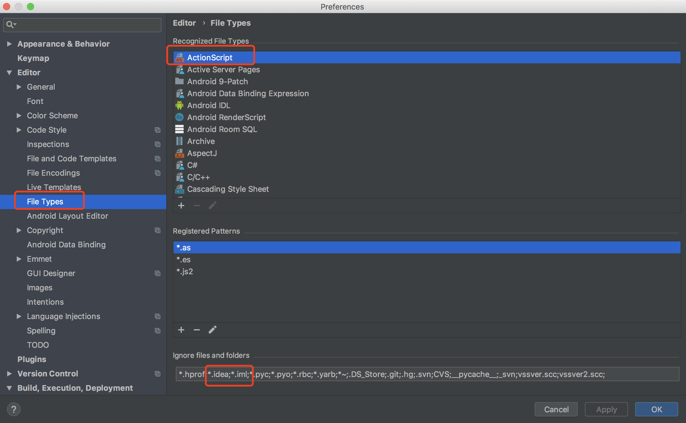

####  父工程新建及配置

1. 新建父工程

2. 字符编码(统一UTF-8)

   

3. 注解生效激活

   

4. java编译版本选8

5. File Type过滤



  在git提交时，可以用.ignore文件，提交时过滤这些文件

#### 父pom.xml文件

```xml
<!-- 统一管理jar包版本 -->
    <properties>
        <project.build.sourceEncoding>UTF-8</project.build.sourceEncoding>
        <maven.compiler.source>1.8</maven.compiler.source>
        <maven.compiler.target>1.8</maven.compiler.target>
        <junit.version>4.12</junit.version>
        <log4j.version>1.2.17</log4j.version>
        <lombok.version>1.16.18</lombok.version>
        <mysql.version>5.1.47</mysql.version>
        <druid.version>1.1.16</druid.version>
        <mybatis.spring.boot.version>1.3.0</mybatis.spring.boot.version>
        <druid.spring.boot.starter.version>1.1.10</druid.spring.boot.starter.version>
    </properties>

    <!-- 子模块继承之后，提供作用：锁定版本+子模块不用写groupId、version -->
    <dependencyManagement>
        <dependencies>
            <!--spring boot 2.2.2-->
            <dependency>
                <groupId>org.springframework.boot</groupId>
                <artifactId>spring-boot-dependencies</artifactId>
                <version>2.2.2.RELEASE</version>
                <type>pom</type>
                <scope>import</scope>
            </dependency>
            <!--spring cloud Hoxton.SR1-->
            <dependency>
                <groupId>org.springframework.cloud</groupId>
                <artifactId>spring-cloud-dependencies</artifactId>
                <version>Hoxton.SR1</version>
                <type>pom</type>
                <scope>import</scope>
            </dependency>
            <!--spring cloud 阿里巴巴-->
            <dependency>
                <groupId>com.alibaba.cloud</groupId>
                <artifactId>spring-cloud-alibaba-dependencies</artifactId>
                <version>2.1.0.RELEASE</version>
                <type>pom</type>
                <scope>import</scope>
            </dependency>
            <!--mysql-->
            <dependency>
                <groupId>mysql</groupId>
                <artifactId>mysql-connector-java</artifactId>
                <version>${mysql.version}</version>
                <scope>runtime</scope>
            </dependency>
            <!-- druid-->
            <dependency>
                <groupId>com.alibaba</groupId>
                <artifactId>druid</artifactId>
                <version>${druid.version}</version>
            </dependency>
            <dependency>
                <groupId>com.alibaba</groupId>
                <artifactId>druid-spring-boot-starter</artifactId>
                <version>${druid.spring.boot.starter.version}</version>
            </dependency>
            <!--mybatis-->
            <dependency>
                <groupId>org.mybatis.spring.boot</groupId>
                <artifactId>mybatis-spring-boot-starter</artifactId>
                <version>${mybatis.spring.boot.version}</version>
            </dependency>

            <!--junit-->
            <dependency>
                <groupId>junit</groupId>
                <artifactId>junit</artifactId>
                <version>${junit.version}</version>
            </dependency>
            <!--log4j-->
            <dependency>
                <groupId>log4j</groupId>
                <artifactId>log4j</artifactId>
                <version>${log4j.version}</version>
            </dependency>
        </dependencies>

    </dependencyManagement>


    <build>
        <!-- 热部署 -->
        <plugins>
            <plugin>
                <groupId>org.springframework.boot</groupId>
                <artifactId>spring-boot-maven-plugin</artifactId>
                <configuration>
                    <fork>true</fork>
                    <addResources>true</addResources>
                </configuration>
            </plugin>
        </plugins>
    </build>

    <reporting>
        <plugins>
            <plugin>
                <artifactId>maven-project-info-reports-plugin</artifactId>
            </plugin>
        </plugins>
    </reporting>
</project>
```

#### dependencyManagement

- Maven使用dependencyManagement元素来提供来一种管理依赖版本号的方式。通常会在一个组织或者项目的最顶层的父POM中看到dependencyManagement元素。
- Maven使用dependencyManagement元素能让所有在子项目中引用一个依赖而不用显式的列出版本号。Maven会沿着父子层次向上走，直到找到一个拥有dependencyManagement元素的项目，然后它就会使用这个dependencyManagement元素中指定的版本号。
- 如果有多个子项目都引用同一样依赖，则可以避免在每个使用的子项目里都声明一个版本号，这样当想升级或切换到另一个版本时，只需要在顶层父容器里面更新，而不需要一个一个子项目的修改；如果某个子项目需要另外一个版本，只需要声明version即可。
- dependencyManagement只是生命依赖，并不实现引入，因此子项目需要显示的生命需要用到的依赖。
- 如果不在子项目中声明依赖，是不会从父项目中继承下来；只有在子项目中写里该依赖项，并且没有制定具体版本，才会从父项目中继承该项，并且version和scope都读取自父pom。
- 如果子项目中指定里版本号，那么会使用子项目中指定的jar版本。

#### 支付模块构建

- 微服务模块构建步骤
  1. 建module
  2. 改pom
  3. 写yml
  4. 主启动
  5. 业务类

#### idea开启热部署

1. 添加依赖pom.xml

   ```xml
           <dependency>
               <groupId>org.springframework.boot</groupId>
               <artifactId>spring-boot-devtools</artifactId>
               <scope>runtime</scope>
               <optional>true</optional>
           </dependency>
   ```

   

2. 添加plugin插件(父类工程)

   ```xml
       <build>
           <finalName>工程名字</finalName>
           <!-- 热部署 -->
           <plugins>
               <plugin>
                   <groupId>org.springframework.boot</groupId>
                   <artifactId>spring-boot-maven-plugin</artifactId>
                   <configuration>
                       <fork>true</fork>
                       <addResources>true</addResources>
                   </configuration>
               </plugin>
           </plugins>
       </build>
   ```

3. 开启自动编译选项

   

4. 勾选设置

   windows(ctrl+alt+shift+/) mac(command+shift+option+/) 单机resistery，勾选两处设置

   

   

5. 重启idea，即可生效

