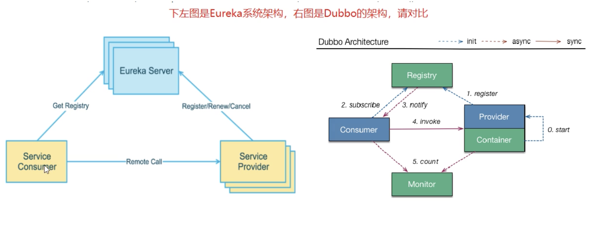
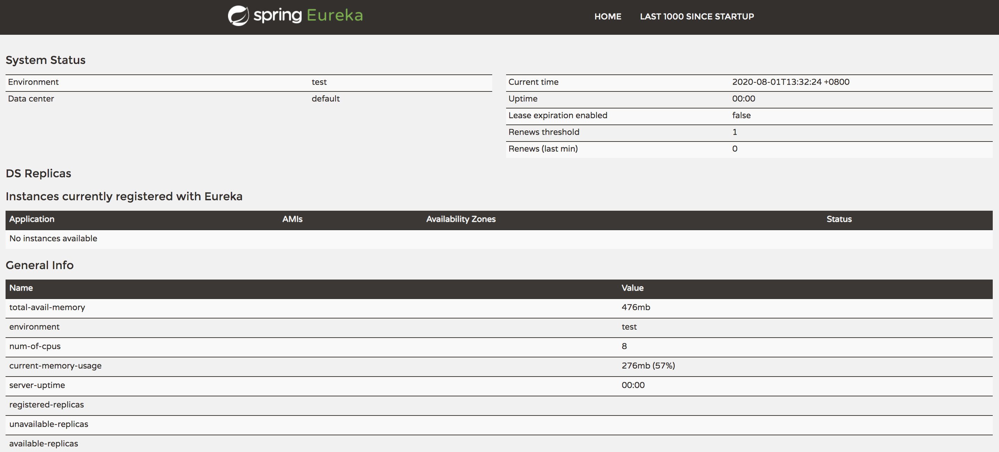
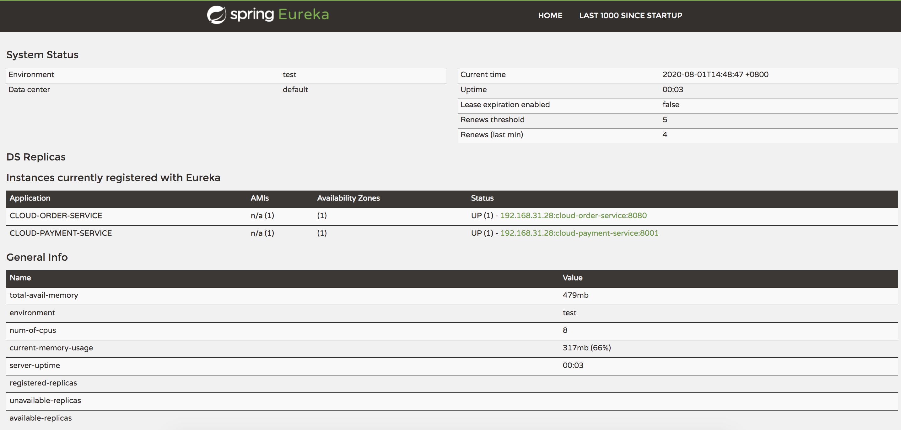
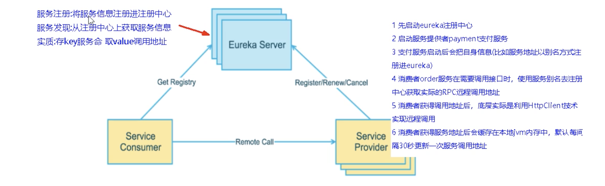
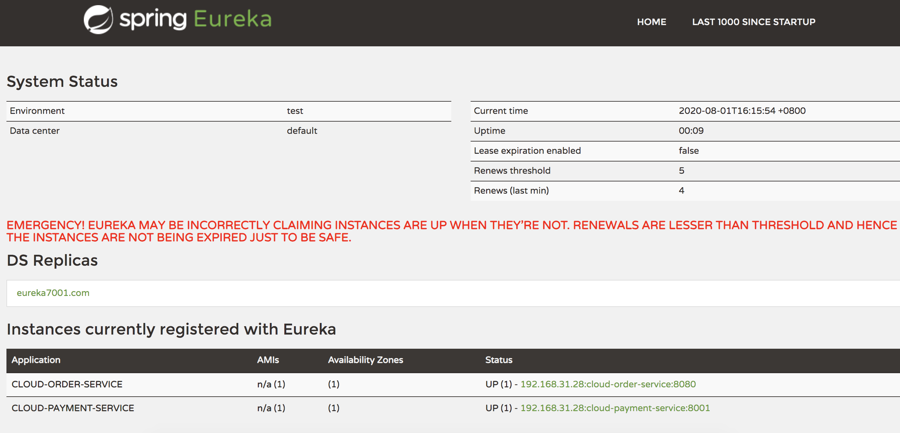

#### 服务治理

​    Spring Cloud封装了Netfix公司开发的Eureka模块来实现服务治理。

​    在传统的rpc远程调用框架中，管理每个服务与服务之间依赖关系比较复杂，管理比较复杂，所以需要使用服务治理，管理服务于服务之间依赖关系，可以实现服务调用、负载均衡、容错等，实现服务注册与发现。

#### 服务注册与发现

​    Eureka采用了cs的设计架构，EUreka Server作为服务注册功能的服务器，它是服务注册中心。而系统中的其他微服务，使用Eureka的客户端连接到Eureka Server并维持心跳连接。这样系统的维护人员就可以通过Eureka Server来监控系统中各个微服务是否正常运行。

​    在服务注册与发现中，有一个注册中心。当服务器启动的时候，会把当前自己服务器的信息，比如服务地址、通讯地址等以别名方式注册到注册中心上。另一方(消费者|服务提供者)，以该别名的方式去注册中心获取到实际的服务通讯地址，然后再实现本地rpc调用。RPC远程调用框架设计思想：在于注册中心，因为使用注册中心管理每个服务与服务之间的一个依赖关系(服务治理概念)。在任何rpc远程框架中，都会有一个注册中心(存放服务地址相关信息)

#### Eureka组件

- Eureka Server 提供服务注册服务

    各个微服务节点通过配置启动后，会在EUrekaServer中进行注册，这样EurekaServer中的服务注册表中将会存储所有可用服务节点的信息，服务节点的信息可以在界面中直观看到。

- Euerka Client 通过注册中心进行访问

    是一个Java客户端，用于简化Eureka Server的交互，客户端同时具有一个内置的、使用轮询(round-robin)负载算法的负载均衡器。在应用启动后，将会向Eureka Server发送心跳(默认周期为30秒)。如果Eureka Server在多个心跳周期内没有接受到某个节点的心跳，EurekaServer将会从注册表中把这个服务节点移除(默认90秒)。

  


#### 单机版Eureka安装

1. 建module

   ```java
   cloud-eureka-server7001
   ```

2. 改pom

   ```xml
   <?xml version="1.0" encoding="UTF-8"?>
   <project xmlns="http://maven.apache.org/POM/4.0.0"
            xmlns:xsi="http://www.w3.org/2001/XMLSchema-instance"
            xsi:schemaLocation="http://maven.apache.org/POM/4.0.0 http://maven.apache.org/xsd/maven-4.0.0.xsd">
       <parent>
           <artifactId>mscloud</artifactId>
           <groupId>pub.ants.springcloud</groupId>
           <version>1.0-SNAPSHOT</version>
       </parent>
       <modelVersion>4.0.0</modelVersion>
   
       <artifactId>cloud-eureka-server7001</artifactId>
   
       <dependencies>
           <!-- eureka-server -->
           <dependency>
               <groupId>org.springframework.cloud</groupId>
               <artifactId>spring-cloud-starter-netflix-eureka-server</artifactId>
           </dependency>
           <!-- 引入自己定义的api通用包，可以使用Payment支付Entity -->
           <dependency>
               <groupId>pub.ants.springcloud</groupId>
               <artifactId>cloud-api-commons</artifactId>
               <version>${project.version}</version>
           </dependency>
           <!-- boot web actuator -->
           <dependency>
               <groupId>org.springframework.boot</groupId>
               <artifactId>spring-boot-starter-web</artifactId>
           </dependency>
           <dependency>
               <groupId>org.springframework.boot</groupId>
               <artifactId>spring-boot-starter-actuator</artifactId>
           </dependency>
           <!-- 一般通用配置 -->
           <dependency>
               <groupId>org.springframework.boot</groupId>
               <artifactId>spring-boot-devtools</artifactId>
               <scope>runtime</scope>
               <optional>true</optional>
           </dependency>
           <dependency>
               <groupId>org.projectlombok</groupId>
               <artifactId>lombok</artifactId>
           </dependency>
           <dependency>
               <groupId>org.springframework.boot</groupId>
               <artifactId>spring-boot-starter-test</artifactId>
               <scope>test</scope>
           </dependency>
       </dependencies>
   </project>
   ```

3. 写yml

   ```yml
   server:
     port: 7001
   
   eureka:
     instance:
       hostname: localhost #erreka服务端的实例名称
     client:
       # false表示不向注册中心注册自己
       register-with-eureka: false
       # false表示自己端就是注册中心，我的职责就是维护服务实例，并不需要去检查索引服务
       fetch-registry: false
       service-url:
         # 设置与Eureka
         defaultZone: http://${eureka.instance.hostname}:${server.port}/eureka/
   ```

4. 业务类

   Eureka服务端不需要业务类

5. 主启动

   ```java
   package pub.ants.springcloud;
   
   import org.springframework.boot.SpringApplication;
   import org.springframework.boot.autoconfigure.SpringBootApplication;
   import org.springframework.cloud.netflix.eureka.server.EnableEurekaServer;
   
   /**
    * @author magw
    * @version 1.0
    * @date 2020/8/1 下午1:29
    * @description: No Description
    *   @EnableEurekaServer  表明是注册中心
    */
   @SpringBootApplication
   @EnableEurekaServer
   public class EurekaMain7001 {
       public static void main(String[] args) {
           SpringApplication.run(EurekaMain7001.class,args);
       }
   }
   ```

6. 浏览器访问[localhost:7001](localhost:7001)

   

#### 微服务8001\8080入驻Euerka Server

Cloud-provider-payment项目改造

1. 改pom

   添加eureka的pom配置

   ```xml
           <!--  eureka-client -->
           <dependency>
               <groupId>org.springframework.cloud</groupId>
               <artifactId>spring-cloud-starter-netflix-eureka-client</artifactId>
           </dependency>
   ```

2. 写yml

   ```yaml
   # eureka配置
   eureka:
     client:
       # 表示是否将自己注册进EurekaServer，默认为true
       register-with-eureka: true
       # 是否从EurekaServer抓取已有的注册信息，默认为true。单节点无所谓，集群必须设置为true 才能配合ribbon使用负载均衡
       fetch-registry: true
       service-url:
         defaultZone: http://localhost:7001/eureka
   ```

3. 主启动

   ```java
   @EnableEurekaClient
   ```

4. 测试

   浏览器访问[localhost:7001](localhost:7001)

   postman调用相关接口

   

#### Eureka集群原理

#### 


- 服务注册：将服务信息注册进注册中心
- 服务发现：从注册中心上获取服务信息
- 实质：key服务名，value调用地址

1. 先启动eureka注册中心
2. 先启动服务提供者payment支付服务
3. 支付服务启动后会把自身信息(比如服务地址以别名方式注册进eureka)
4. 消费者order服务在需要调用接口时，使用服务别名去注册中心获取实际的RPC远程调用地址
5. 消费者获得调用地址后，底层实际是利用HttpClient技术实现远程调用
6. 消费者获得服务地址后会缓存在本地jvm内存中，默认没间隔30秒更新一次服务调用地址

集群注册原理：互相注册，相互守望

#### eureka集群构建

1. 按照7001构建7002

2. 修改host文件(hosts）

   ```
   127.0.0.1 eureka7001.com
   127.0.0.1 eureka7002.com
   ```

3. 修改yml文件

   ```yaml
   # eureka配置
   eureka:
     client:
       # 表示是否将自己注册进EurekaServer，默认为true
       register-with-eureka: true
       # 是否从EurekaServer抓取已有的注册信息，默认为true。单节点无所谓，集群必须设置为true 才能配合ribbon使用负载均衡
       fetch-registry: true
       service-url:
         defaultZone: http://eureka7001.com:7001/eureka,http://eureka7002.com:7002/eureka
   ```



#### 支付微服务

1. payment8002

2. bean设置

   ```java
   @Configuration
   public class ApplicationContextConfig {
   
       @Bean
       @LoadBalanced
       public RestTemplate restTemplate(){
           return new RestTemplate();
       }
   }
   ```

3. 消费微服务配置

   ```java
       // public static final String PAYMENT_URL = "http://localhost:8001";
       public static final String PAYMENT_URL = "http://CLOUD-PAYMENT-SERVICE";
   ```

#### 配置actuator界面更友好显示

```yaml
# eureka配置
eureka:
  client:
    # 表示是否将自己注册进EurekaServer，默认为true
    register-with-eureka: true
    # 是否从EurekaServer抓取已有的注册信息，默认为true。单节点无所谓，集群必须设置为true 才能配合ribbon使用负载均衡
    fetch-registry: true
    service-url:
      defaultZone: http://eureka7001.com:7001/eureka,http://eureka7002.com:7002/eureka
      #defaultZone: http://localhost:7001/eureka
  instance:
    instance-id: payment8001
    # 访问路径可以显示IP地址
    prefer-ip-address: true
```

instance-id：可以显示出配置地址

prefer-ip-address：鼠标放入到连接，显示链接信息

#### 服务发现

1. 启动类配置注解

   ```java
   @EnableDiscoveryClient
   ```

2. controller类

   ```java
       @Autowired
       private DiscoveryClient discoveryClient;
   
       /**
        * 获取注册信息
        * @return
        */
       @GetMapping(value = "/discovery")
       public Object discovery(){
           List<String> services = discoveryClient.getServices();
           services.stream().forEach((name)->{
               log.info("****element"+name);
           });
   
           services.stream().forEach((name)->{
               List<ServiceInstance> instances = discoveryClient.getInstances(name);
               instances.stream().forEach((instance)->{
                   log.info(instance.getServiceId()+"\t"+instance.getHost()+"\t"+instance.getPort());
               });
           });
           return discoveryClient;
       }
   
   ```

#### 保护模式

​    保护模式主要用于一组客户端和Eureka Server之间存在网络分区场景下的保护。一旦进入保护模式，EUreka Server将会尝试保护其服务注册表中信息，不在删除服务注册表中的数据，也就是不会注销任何微服务。

   AP：某时刻某一个微服务不可用了，Eureka不会立刻清理，依旧会对该微服务的信息进行保存

**为什么会产生Eureka自我保护机制？**

​    为了防止EurekaClient可以正常运行，但是EurekaServer网络不通情况下，EUrekaServer不会立刻将EurekaClient服务剔除。

**什么是保护模式？**（解决网络不通情况）

​    默认情况下，如果EurekaServer在一定时间内没有接受到某个微服务实例的心跳，EurekaServer将会注销该实例(默认90秒)。但是当网络分区故障发生(延时、卡顿、拥挤)时，微服务与EurekaServer之间无法正常通信。因为微服务本身其实是健康的，此时不应该注销这个微服务。Eureka通过”自我保护模式“来解决这个问题，当EurekaServer节点在短时间内丢失过多客户端时(可能发生了网络分区故障)，那么这个节点就会进入自我保护模式。

​    自我保护模式是一种应对网络异常的安全保护措施。宁可同时保留所有微服务(健康的微服务和不健康的微服务都会保留)也不盲目注销任何健康的微服务。使用自我保护模式，可以让Eureka集群更加的健壮、稳定。

服务端配置

```yaml
  # 禁用自我保护，保证不可用服务被即使删除
  server:
    enable-self-preservation: false
    eviction-interval-timer-in-ms: 2000
```

客户端配置

```yaml
    # Eureka客户端向服务端发送心跳的时间间隔，单位时间是秒(默认是30秒)
    lease-renewal-interval-in-seconds: 1
    # Eureka服务端在收到最后一次心跳后等待时间上线，单位是秒(默认90秒)，超时删除服务
    lease-expiration-duration-in-seconds: 2
```

#### 停更说明

2.0停更，1.0作为活跃工程还可以使用。 

