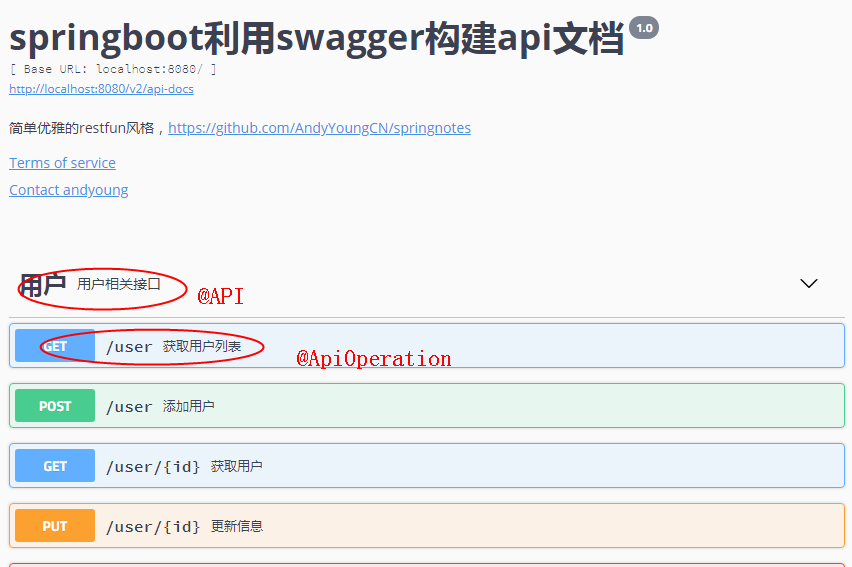
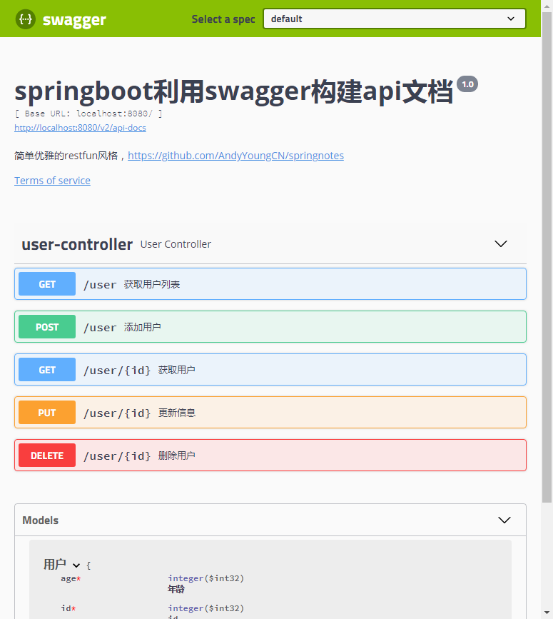
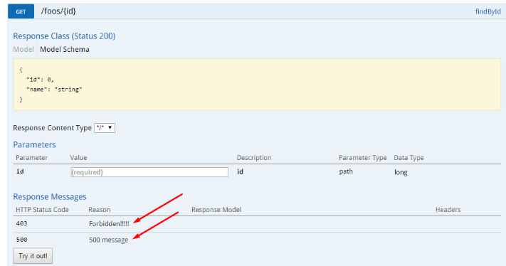

# swagger2教程
> swagger,中文“拽”的意思。它是一个功能强大的api框架，它的集成非常简单，不仅提供了在线文档的查阅，而且还提供了在线文档的测试。另外swagger很容易构建restful风格的api，简单优雅帅气，正如它的名字。
## 1.引入依赖
```
<dependency>
    <groupId>io.springfox</groupId>
    <artifactId>springfox-swagger2</artifactId>
    <version>RELEASE</version>
</dependency>

<dependency>
    <groupId>io.springfox</groupId>
    <artifactId>springfox-swagger-ui</artifactId>
    <version>RELEASE</version>
</dependency>
```
## 2.写配置类
```
@Configuration
@EnableSwagger2
public class Swagger2 {
  @Bean
  public Docket createRestApi() {
    return new Docket(DocumentationType.SWAGGER_2)
        .apiInfo(apiInfo())
        .select()
        .apis(RequestHandlerSelectors.basePackage("cn.andyoung.controller"))
        .paths(PathSelectors.any())
        .build();
  }

  private ApiInfo apiInfo() {
    return new ApiInfoBuilder()
        .title("springboot利用swagger构建api文档")
        .description("简单优雅的restfun风格，https://github.com/AndyYoungCN/springnotes")
        .termsOfServiceUrl("http://blog.csdn.net/forezp")
        .version("1.0")
        .build();
  }
}
```
> 通过@Configuration注解，表明它是一个配置类，@EnableSwagger2开启swagger2。apiInfo()配置一些基本的信息。apis()指定扫描的包会生成文档。
## 3.写生产文档的注解
swagger通过注解表明该接口会生成文档，包括接口名、请求方法、参数、返回信息的等等。

- @Api：修饰整个类，描述Controller的作用 表示标识这个类是swagger的资源 
- @ApiOperation：描述一个类的一个方法，或者说一个接口 表示一个http请求的操作 
- @ApiParam：单个参数描述 表示对参数的添加元数据（说明或是否必填等） 
- @ApiModel：用对象来接收参数 表示对类进行说明，用于参数用实体类接收 
- @ApiProperty：用对象接收参数时，描述对象的一个字段 ;用于方法，字段 
表示对model属性的说明或者数据操作更改 
- @ApiResponse：HTTP响应其中1个描述
- @ApiResponses：HTTP响应整体描述
- @ApiIgnore：使用该注解忽略这个API 表示这个方法或者类被忽略 
- @ApiError ：发生错误返回的信息
- @ApiImplicitParam 用于方法表示单独的请求参数 
- @ApiImplicitParams  用于方法，包含多个 @ApiImplicitParam

### 3.1  @Api：请求类的说明
```
@Api：放在 请求的类上，与 @Controller 并列，说明类的作用，如用户模块，订单类等。
	tags="该类分类"
	value=""
    description="描述"
```
`@Api` 其它属性配置：
-----------------------------------------
|属性名称   |	备注
|----------|:-------------:|
|value	        |url的路径值|
|tags	        |如果设置这个值、value的值会被覆盖
|description	|对api资源的描述
|basePath	    |基本路径
|position	    |如果配置多个Api 想改变显示的顺序位置
|produces	    |如, “application/json, application/xml”
|consumes	    |如, “application/json, application/xml”
|protocols	    |协议类型，如: http, https, ws, wss.
|authorizations	|高级特性认证时配置
|hidden     	|配置为true ，将在文档中隐藏

显示效果
### 3.2 @ApiOperation：方法的说明
```
@ApiOperation："用在请求的方法上，说明方法的作用"
	value="说明方法的作用"
	notes="方法的备注说明"
```
### 3.3 @ApiImplicitParams、@ApiImplicitParam：方法参数的说明
```
@ApiImplicitParams：用在请求的方法上，包含一组参数说明
	@ApiImplicitParam：对单个参数的说明	    
	    name：参数名
	    value：参数的汉字说明、解释
	    required：参数是否必须传
	    paramType：参数放在哪个地方
	        · header --> 请求参数的获取：@RequestHeader
	        · query --> 请求参数的获取：@RequestParam
	        · path（用于restful接口）--> 请求参数的获取：@PathVariable
	        · body（请求体）-->  @RequestBody User user
	        · form（普通表单提交）	   
	    dataType：参数类型，默认String，其它值dataType="Integer"	   
	    defaultValue：参数的默认值
```
### 3.4 @ApiResponses、@ApiResponse：方法返回值的说明
```
@ApiResponses：方法返回对象的说明
	@ApiResponse：每个参数的说明
	    code：数字，例如400
	    message：信息，例如"请求参数没填好"
	    response：抛出异常的类
```
```
@ApiOperation("获取用户信息")
	@ApiImplicitParams({
		@ApiImplicitParam(paramType="query", name="userId", dataType="String", required=true, value="用户Id")
	}) 
	@ApiResponses({
		@ApiResponse(code = 400, message = "请求参数没填好"),
		@ApiResponse(code = 404, message = "请求路径没有或页面跳转路径不对")
	}) 
	@ResponseBody
	@RequestMapping("/list")
```
### 3.5 @ApiModel：用于JavaBean上面，表示一个JavaBean（如：响应数据）的信息
```
@ApiModel：用于JavaBean的类上面，表示此 JavaBean 整体的信息
			（这种一般用在post创建的时候，使用 @RequestBody 这样的场景，
			请求参数无法使用 @ApiImplicitParam 注解进行描述的时候 	
```
### 3.6 @ApiModelProperty：用在JavaBean类的属性上面，说明属性的含义
```
@ApiModel(description= "返回响应数据")
public class RestMessage implements Serializable{

	@ApiModelProperty(value = "是否成功")
	private boolean success=true;
	@ApiModelProperty(value = "返回对象")
	private Object data;
	@ApiModelProperty(value = "错误编号")
	private Integer errCode;
	@ApiModelProperty(value = "错误信息")
	private String message;
		
	/* getter/setter 略*/
}
```
## 4. 具体使用举例说明： 
实例
```

@RestController
@Api("用户api")
@ApiModel(value = "用户接口", description = "用户接口描述")
@RequestMapping("/user")
public class UserController {

  Map<Integer, User> users = Collections.synchronizedMap(new HashMap<>());

  @ApiOperation(value = "获取用户列表", notes = "获取用户列表")
  @GetMapping("")
  public List<User> getUsers() {
    return new ArrayList<>(users.values());
  }

  @ApiOperation(value = "获取用户", notes = "根据用户id获取获取列表")
  @GetMapping("/{id}")
  @ApiImplicitParam(
      name = "id",
      value = "用户id",
      required = true,
      dataType = "int",
      paramType = "path")
  public User getUserById(@PathVariable Integer id) {
    return users.get(id);
  }

  @ApiOperation(value = "添加用户", notes = "添加用户")
  @PostMapping("")
  public String postUser(@RequestBody User user) {
    users.put(user.id, user);
    return "success";
  }

  @ApiOperation(value = "更新信息", notes = "根据url的id来指定更新用户信息")
  @ApiImplicitParams({
    @ApiImplicitParam(
        name = "id",
        value = "用户id",
        required = true,
        dataType = "int",
        paramType = "path"),
    @ApiImplicitParam(name = "user", value = "用户info", required = true, dataType = "User")
  })
  @PutMapping("/{id}")
  public String put(@PathVariable Integer id, @RequestBody User user) {
    User user1 = users.get(id);
    user1.username = user.username;
    user1.password = user.password;
    return "修改成功";
  }

  @ApiOperation(value = "删除用户", notes = "根据url的id来删除用户信息")
  @ApiImplicitParam(name = "user", value = "用户info", required = true, dataType = "User")
  @DeleteMapping("/{id}")
  public String delete(@PathVariable Integer id) {
    users.remove(id);
    return "删除成功";
  }

  @ApiIgnore
  @RequestMapping("/ig")
  public String jsonIgnore() {
    return "jsonIgnore";
  }
}

```
> 通过相关注解，就可以让swagger2生成相应的文档。如果你不需要某接口生成文档，只需要在加@ApiIgnore注解即可。需要说明的是，如果请求参数在url上，@ApiImplicitParam 上加paramType = “path” 。
启动工程，访问：http://localhost:8080/swagger-ui.html ，就看到swagger-ui:


## 5. swager2 安全
> 整个集成过程非常简单，但是我看了相关的资料，swagger没有做安全方面的防护，需要我们自己做相关的工作。
### 5.1 直接使用多环境配置，生产环境不启用Swagger2
#### 5.1.1 添加配置文件
application.properties 文件
`spring.profiles.active=prod`
application-pro.properties 文件
```
#生产环境
server.port=8088
swagger2.enable=false
```
#### 5.1.1 Swagger2配置类修改
添加依赖注入
```
@Value("${swagger2.enable}")
private boolean swagger2Enable;
```
配置swagger开关
```
  @Bean
  public Docket createRestApi() {
    return new Docket(DocumentationType.SWAGGER_2)
        .enable(swagger2Enable)
        .apiInfo(apiInfo())
        .select()
        .apis(RequestHandlerSelectors.basePackage("cn.andyoung.swagger2.controller"))
        .paths(PathSelectors.any())
        .build();
  }
```
这样访问正式：http://localhost:8088/swagger-ui.html 就访问不了了。显示结果:

#### 5.1.2 使用springboot security过滤
//略
## 6.高级配置
应用程序的Docket bean可以配置为让您更多地控制API文档生成过程。
### 6.1 过滤Swagger响应的API
公开整个API的文档并不总是可取的。您可以通过将参数传递给Docket类的apis（）和paths（）方法来限制Swagger的响应  。
如上所示，RequestHandlerSelectors允许使用  any或none谓词，但也可用于根据基本包，类注释和方法注释过滤API。
PathSelectors提供了额外的过滤功能，并使用谓词来扫描应用程序的请求路径。你可以使用  any（），none（），  regex（）或  ant（）。
在下面的示例中，我们将指示Swagger使用ant（）  谓词仅包含特定包中的控制器，并使用特定的路径。
```
@Bean
public Docket api() {                
    return new Docket(DocumentationType.SWAGGER_2)          
      .select()                                       
      .apis(RequestHandlerSelectors.basePackage("org.baeldung.web.controller"))
      .paths(PathSelectors.ant("/foos/*"))                     
      .build();
}
```
> ps 这里可以更加环境区分对需要开发哪些端口
### 6.3 自定义方法响应消息
Swagger允许通过  Docket的  `globalResponseMessage（）`方法全局覆盖HTTP方法的响应消息。首先，您必须指示Swagger不要使用默认响应消息。 
假设您希望覆盖  所有GET方法的500和403响应消息。为了达到这个目的，一些代码必须被添加到Docket的初始化块（为了清楚起见，原始冗余代码被排除）：
```
.useDefaultResponseMessages(false)                                   
.globalResponseMessage(RequestMethod.GET,                     
  newArrayList(new ResponseMessageBuilder()   
    .code(500)
    .message("500 message")
    .responseModel(new ModelRef("Error"))
    .build(),
    new ResponseMessageBuilder() 
      .code(403)
      .message("Forbidden!")
      .build()));
```
