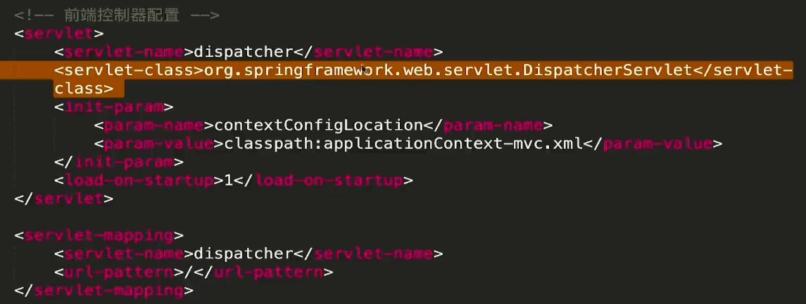
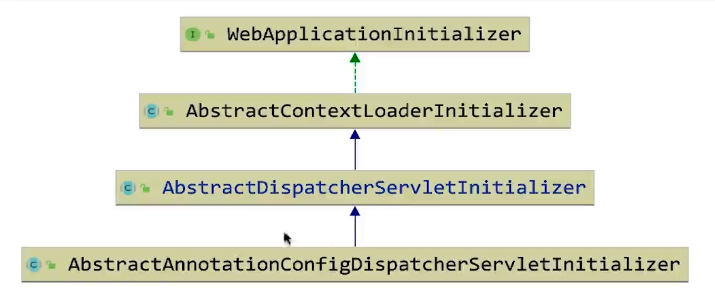

本章节解析Spring最后一个大成员，SpringMVC，也是非常重要的一员

## XML配置实现MVC

因为目前大多是注解开发，使用xml配置方式的人或公司越来越少，所以我们的重点放在注解实现，对于xml配置方式的实现，简单介绍一下。


在配置mvc时，都会在web.xml中配置上下文参数已经初始化监听器

对于初始化监听器，在Servlet初始化时，会监听调用初始化方法


这时就会读取contextConfigLocation配置，对Web容器进行初始化创建



对于前端控制器，也会配置一个配置文件，里面存放controller类以及请求路径的映射，在web容器初始化时，就会加载到web容器中，当用户请求进来，就会被前端控制器拦截，根据请求路径的映射，请求不同controller


## 注解方式实现MVC

对于Spring来说，我们不能直接使用纯注解方式实现MVC，就像SpringBoot一样，我们需要添加一些@Configuration标识的配置类，这样在Web容器加载时，才会根据我们的配置，像xml一样实现MVC。

### 注解方式初始化入口

首先我们全局搜索ServlettContainer，会发现一个SpringServletContainerInitializer类

```java
// 类似@Autowired，用来加载此类
@HandlesTypes(WebApplicationInitializer.class)
public class SpringServletContainerInitializer implements ServletContainerInitializer {

    @Override
    public void onStartup(@Nullable Set<Class<?>> webAppInitializerClasses, ServletContext servletContext)
        throws ServletException {

        // 主要看这里，Web容器初始化的地方，会循环调用所有初始化器
        // 初始化器就是一开始的注解加载进来的
        for (WebApplicationInitializer initializer : initializers) {
            initializer.onStartup(servletContext);
        }
    }

}
```

这里会发现加载了初始化器，我们向下查看


会发现有三个实现类，其中DispatcherServlet应该就是我们要找的，进入查看

```java
public abstract class AbstractDispatcherServletInitializer extends AbstractContextLoaderInitializer {

    /**
    * The default servlet name. Can be customized by overriding {@link #getServletName}.
    */
    public static final String DEFAULT_SERVLET_NAME = "dispatcher";


    @Override
    public void onStartup(ServletContext servletContext) throws ServletException {
        super.onStartup(servletContext);
        // 注册前端控制器
        registerDispatcherServlet(servletContext);
    }

    protected void registerDispatcherServlet(ServletContext servletContext) {
        String servletName = getServletName();
        Assert.hasLength(servletName, "getServletName() must not return null or empty");
		// 创建web ioc容器，模板方法，由子类实现
        WebApplicationContext servletAppContext = createServletApplicationContext();
        Assert.notNull(servletAppContext, "createServletApplicationContext() must not return null");
		// 创建DispatcherServlet，模板方法，由子类实现
        FrameworkServlet dispatcherServlet = createDispatcherServlet(servletAppContext);
        Assert.notNull(dispatcherServlet, "createDispatcherServlet(WebApplicationContext) must not return null");
        dispatcherServlet.setContextInitializers(getServletApplicationContextInitializers());

        ServletRegistration.Dynamic registration = servletContext.addServlet(servletName, dispatcherServlet);
        if (registration == null) {
            throw new IllegalStateException("Failed to register servlet with name '" + servletName + "'. " +
                                            "Check if there is another servlet registered under the same name.");
        }

        registration.setLoadOnStartup(1);
        // 映射路径，这里getServletMappings方法是个模板方法，由子类实现
        registration.addMapping(getServletMappings());
        registration.setAsyncSupported(isAsyncSupported());

        // 创建拦截请求编码，也是模板方法
        Filter[] filters = getServletFilters();
        if (!ObjectUtils.isEmpty(filters)) {
            for (Filter filter : filters) {
                registerServletFilter(servletContext, filter);
            }
        }

        customizeRegistration(registration);
    }
}
```

这里我们发现了四个重要的模板方法，往下看看还有没有更深层的子类实现

```java
public abstract class AbstractAnnotationConfigDispatcherServletInitializer
      extends AbstractDispatcherServletInitializer {

   @Override
   @Nullable
   protected WebApplicationContext createRootApplicationContext() {
      Class<?>[] configClasses = getRootConfigClasses();
      if (!ObjectUtils.isEmpty(configClasses)) {
         AnnotationConfigWebApplicationContext context = new AnnotationConfigWebApplicationContext();
         context.register(configClasses);
         return context;
      }
      else {
         return null;
      }
   }

   @Override
   protected WebApplicationContext createServletApplicationContext() {
      AnnotationConfigWebApplicationContext context = new AnnotationConfigWebApplicationContext();
      Class<?>[] configClasses = getServletConfigClasses();
      if (!ObjectUtils.isEmpty(configClasses)) {
         context.register(configClasses);
      }
      return context;
   }

   // 模板方法，配置RootConfig的Bean，Root存放Service，dao层的对象
   @Nullable
   protected abstract Class<?>[] getRootConfigClasses();

   // 模板方法，由子类实现，配置Servlet的ConfigBean为哪些，servlet存放model，controller对象
   @Nullable
   protected abstract Class<?>[] getServletConfigClasses();

}
```

这样，我们就找到了MVC的初始化时的四个关键类



并且具有四个模板方法，用来代替xml的配置方式，接下来我们简单实现一下注解使用mvc

### 注解方式进行配置

注解使用mvc，想要配置，就需要继承最下层的initializer类，来实现四个模板方法

首先我们要创建RootConfig和MvcConfig，一个用来配置和视图无关的对象，比如Service，一个用来配置和Mvc有关的对象

```java
@Configuration
@ComponentScan("com.enbuys.spring.demo.service")
public class RootConfig {
}

@Configuration
@ComponentScan("com.enbuys.spring.demo.controller")
@EnableWebMvc
public class MvcConfig {

    public InternalResourceViewResolver viewResolver(){
        InternalResourceViewResolver viewResolver = new InternalResourceViewResolver();
        viewResolver.setPrefix("/WEB-INF/jsp/");
        viewResolver.setSuffix(".jsp");
        return viewResolver;
    }
}
```

然后我们配置MVC的初始化配置

```java
public class StartWebApplication extends AbstractAnnotationConfigDispatcherServletInitializer {
    // 配置SpringContext
    @Override
    protected Class<?>[] getRootConfigClasses() {
        return new Class[]{RootConfig.class};
    }

    // 配置前端控制器
    @Override
    protected Class<?>[] getServletConfigClasses() {
        return new Class[]{MvcConfig.class};
    }

    // 配置映射
    @Override
    protected String[] getServletMappings() {
        return new String[]{"/"};
    }

    // 配置编码
    @Override
    protected Filter[] getServletFilters() {
        return super.getServletFilters();
    }
}
```

## MVC请求流程

接下来我们就要开始对MVC原理进行解析，首先看一下请求流程，找到我们需要查看的重点


请求流程已经很熟悉了，其中重点就是前端控制器通过请求路径，向HandlerMapping查找具体的Controller，再通过调用HandlerAdapter调用其具体方法。

所以我们的研究重点就是：

- 前端控制器如何创建请求url与Controller方法映射
- 从映射里获取并处理请求逻辑
- 请求参数绑定到方法形参，执行方法处理请求返回视图的流程

我们一点点开始研究

## 创建Request和Controller方法映射

我们知道，该映射是由DispatcherServlet向HandlerMapping中获取的，那么是不是创建也是在前端控制器进行初始化的呢？

进入DispatcherServlet源码

```java
protected void initStrategies(ApplicationContext context) {
   initMultipartResolver(context);
   initLocaleResolver(context);
   initThemeResolver(context);
   // 初始化处理器映射器
   initHandlerMappings(context);
   // 初始化处理器适配器
   initHandlerAdapters(context);
   initHandlerExceptionResolvers(context);
   initRequestToViewNameTranslator(context);
   initViewResolvers(context);
   initFlashMapManager(context);
}
```

搜索init，果然搜索到前端控制器初始化其他组件的方法，进入初始化处理器映射器的代码

```java
private void initHandlerMappings(ApplicationContext context) {
   this.handlerMappings = null;
   // 判断是否查询全部的HandlerMappings，默认为true
   if (this.detectAllHandlerMappings) {
      // Find all HandlerMappings in the ApplicationContext, including ancestor contexts.
      // 查询所有HandlerMapping类型的Bean
      Map<String, HandlerMapping> matchingBeans =
            BeanFactoryUtils.beansOfTypeIncludingAncestors(context, HandlerMapping.class, true, false);
      if (!matchingBeans.isEmpty()) {
         this.handlerMappings = new ArrayList<>(matchingBeans.values());
         // 排序HandlerMapping，其实最重要的是RequestMappingHandlerMapping，是用来处理请求映射关系的
         AnnotationAwareOrderComparator.sort(this.handlerMappings);
      }
   }
   //····
}
```

通过源码分析，我们发现这里只是初始化HandlerMapping，而真正创建Request和Controller方法映射的是在RequestMappingHandlerMapping


通过关系类图，会发现有一个InitializingBean接口，该接口肯定是初始化接口，而AbstractHandlerMethodMapping实现了他，所以我们进去看看

```java
@Override
public void afterPropertiesSet() {
   initHandlerMethods();
}

protected void initHandlerMethods() {
   // 循环处理Bean
   for (String beanName : getCandidateBeanNames()) {
      if (!beanName.startsWith(SCOPED_TARGET_NAME_PREFIX)) {
          // 对于注册映射关系的逻辑基本都在此方法中
         processCandidateBean(beanName);
      }
   }
   handlerMethodsInitialized(getHandlerMethods());
}

protected void processCandidateBean(String beanName) {
    Class<?> beanType = null;
    try {
        // 获取bean的class对象
        beanType = obtainApplicationContext().getType(beanName);
    }
    catch (Throwable ex) {
        // An unresolvable bean type, probably from a lazy bean - let's ignore it.
        if (logger.isTraceEnabled()) {
            logger.trace("Could not resolve type for bean '" + beanName + "'", ex);
        }
    }
    // 判断class上是否有Controller或RequestMapping注解
    if (beanType != null && isHandler(beanType)) {
        // 提取url和Controller映射关系
        detectHandlerMethods(beanName);
    }
}

protected void detectHandlerMethods(Object handler) {
    Class<?> handlerType = (handler instanceof String ?
                            obtainApplicationContext().getType((String) handler) : handler.getClass());

    if (handlerType != null) {
        // 获取类的本尊，即如果是代理cglib创建的类，获取其本尊
        Class<?> userType = ClassUtils.getUserClass(handlerType);
        // 寻找方法的@RequestMapping注解的方法实例
        // 保存为Map，key为方法，value为RequestMappingInfo，保存了该注解上的信息，比如请求路径
        Map<Method, T> methods = MethodIntrospector.selectMethods(userType,
                                                                  (MethodIntrospector.MetadataLookup<T>) method -> {
                                                                      try {
                                                                          // 获取
                                                                          return getMappingForMethod(method, userType);
                                                                      }
                                                                      catch (Throwable ex) {
                                                                          throw new IllegalStateException("Invalid mapping on handler class [" +
                                                                                                          userType.getName() + "]: " + method, ex);
                                                                      }
                                                                  });
        if (logger.isTraceEnabled()) {
            logger.trace(formatMappings(userType, methods));
        }
        // 将得到的methods对象们注册到HandlerMapping中
        methods.forEach((method, mapping) -> {
            // 获取被AOP包装后的方法
            Method invocableMethod = AopUtils.selectInvocableMethod(method, userType);
            // 注册到HandlerMapping
            registerHandlerMethod(handler, invocableMethod, mapping);
        });
    }
}
```

创建逻辑并不复杂，需要注意的是，该创建逻辑的调用是在refresh的doCreateBean()方法中进行的，需要先将映射关系注册到HandlerMapping中，然后之后在DispatcherServlet创建对应HandlerMapping时，就已经存在映射关系了

## DispatcherServlet处理请求


