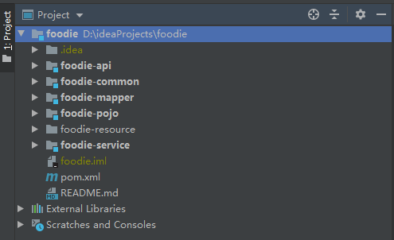

# 单体项目实现

在开发一个电商项目时，谁也不是一蹴而就的，淘宝也是从单体慢慢演变成现在的千亿万亿架构。

所以，我们通过单体到微服务容器化，一步步演进，学习，增强自身。

具体源码：https://github.com/PAcee1/foodie

## 前端工程搭建

虽然我们的重头戏在后端服务端实现，但是前端也是必不可少的。

这里我们直接从网上找了一份前端模板，进行使用。

### 单体项目时启动方式

单体项目时，我们需要使用Tomcat来进行前端页面的启动

#### 项目启动

门户工程：

将foodie-shop工程放到tomcat的webapps目录下，然后启动tomcat，浏览器输入` http://localhost:8080/foodie-shop `即可实现

用户中心工程：

同样，将foodie-center放到tomcat的webapps下面即可

#### 配置修改

然后搭建时需要修改`app.js`文件中的几个参数

```js
window.app = {
    serverUrl: "http://localhost:8088",                                   // 接口服务接口地址
    paymentServerUrl: "http://payment.t.mukewang.com/foodie-payment",       // 支付中心服务地址
    shopServerUrl: "http://localhost:8080/foodie-shop/",                  // 门户网站地址
    centerServerUrl: "http://localhost:8080/foodie-center/",              // 用户中心地址
    cookieDomain: "",                                                       // cookie 域       
}
```

端口ip根据自身修改

## 后端项目搭建



> foodie-resource是存放一些配置文件的比如数据库sql脚本等，不需要关注

刚开始，我们会使用maven+springboot+通用Mybatis实现一个单体项目

如图，项目结构是经典的分层结构，外层一个整体root模块，内部包含多个子模块，通过Maven install将其打包在一起。

运行时运行api工程下的Application启动器类即可

## 整体项目部署

因为当前是单体项目，只用到了java，tomcat和数据库，所以部署起来也非常简单。

再购买好云服务器后，安装必备软件

- jdk
- tomcat一台放前端
- 数据库，mariaDB，也就是mysql

部署步骤：

1. 修改前端项目app.js中的请求路径，改为线上地址
2. 将两个前端项目放到tomcat webapps下，启动tomcat
3. 将后端项目maven打包，将foodie-api的jar包放入linux，`nohup java -jar foodie-api.jar &`启动
4. 测试是否部署成功