## Nginx简单介绍

>  Nginx是我们从单点项目到集群必不可少的一个环节，一个组件，为什么这么说呢？
>
> 因为集群就说明有多个节点，那么当用户请求时，应该如何将域名与多个节点绑定，又应该访问哪个节点都是问题，使用Nginx就可以很好的解决此问题，其轻量高性能的实现反向代理负载均衡

Nginx到现在2020年，使用率是越来越高了，绝大部分公司都会使用它，来当做负载均衡，反向代理的web服务器。而他也就是一个高性能的http和反向代理的web服务器。

主要功能就是反向代理，负载均衡，以及对静态资源进行虚拟化

### 简单介绍反向代理

反向代理服务器，其实就是当用户访问目标网站时，该网站是集群模式的，就会有多个节点，比如223,224,225，3台服务器节点，反向代理就会根据一定的规则将这个用户分配给某个服务器进行访问，如下图：

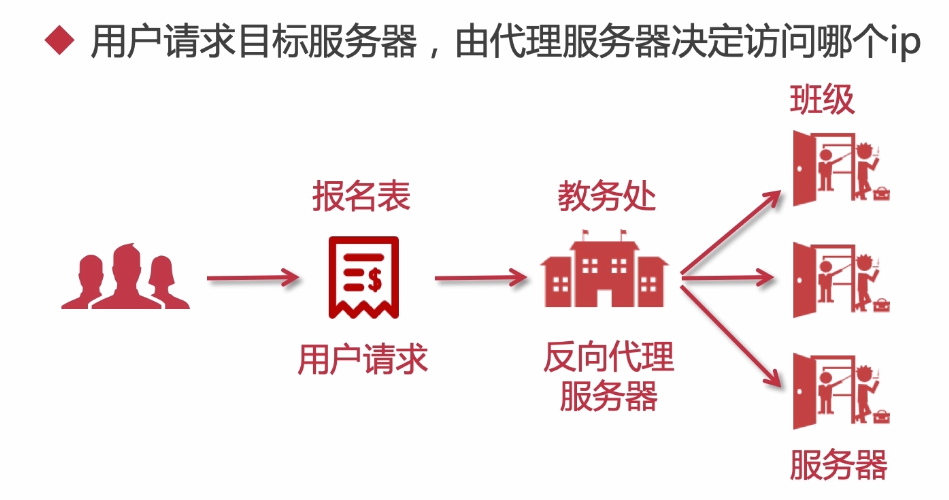

反向代理还有一个重要功能就是路由，nginx可以根据请求域名的不同，根据配置文件，请求应有的应用服务器


简单了解完Nginx作用后，就可以开始学习使用玩他了

## Nginx安装

首先准备nginx安装包，这里我在虚拟机上玩耍，版本1.16.1

1.安装依赖环境

```
yum install -y gcc-c++
yum install -y pcre pcre-devel
yum install -y zlib zlib-devel
yum install -y openssl openssl-devel
```

2.解压nginx

```
tar -zxvf nginx-1.16.1.tar.gz
```

3.创建nginx存放目录文件夹

```
mkdir /var/temp/nginx -p
```

4.在nginx目录下，配置nginx创建makefile文件

```
./configure \
--prefix=/usr/local/nginx \
--pid-path=/var/run/nginx/nginx.pid \
--lock-path=/var/lock/nginx.lock \
--error-log-path=/var/log/nginx/error.log \
--http-log-path=/var/log/nginx/access.log \
--with-http_gzip_static_module \
--http-client-body-temp-path=/var/temp/nginx/client \
--http-proxy-temp-path=/var/temp/nginx/proxy \
--http-fastcgi-temp-path=/var/temp/nginx/fastcgi \
--http-uwsgi-temp-path=/var/temp/nginx/uwsgi \
--http-scgi-temp-path=/var/temp/nginx/scgi
```

5.make编译安装

```
make
make install
```

6.进入sbin启动

```
cd /usr/local/nginx/sbin/

./nginx 启动
./nginx -s stop 停止
./nginx -s reload 重启
```


注意：关闭防火墙或开启端口

```
systemctl stop firewalld.service
systemctl disable firewalld.service 
```

安装完nginx后，我们就开始简单了解下nginx工作原理

## Nginx默认首页解析逻辑

当安装启动Nginx后，输入虚拟机或云服务器ip地址，会自动跳转nginx的首页，这是为什么呢？

我们可以打开nginx的配置文件查看，默认使用`nginx/conf/nginx.conf`


通过该配置文件查看，我们可以发现，nginx会创建一个Server服务，然后启动Nginx后，该服务就会启动，默认监听`http://localhost:80/`这个路径，所以当我们访问ip地址时，就会被Nginx监听，从而响应配置中的html静态文件

## Nginx进程模型

Nginx进程模型比较特殊，不是一般的那种启动后就一个进程，我们可以看一下：


这里搜索nginx进程，会发现一个master和一个worker进程

在Nginx中，master进程用来管理worker进程，包括指令（启停重启）的分发执行，worker的创建销毁；对于worker来说，它用来与一个个的client连接处理，即请求过来后，是由worker进行负载均衡反向代理的。

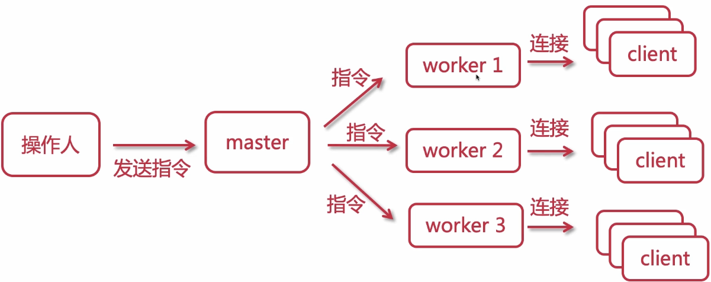

这样做有什么好处呢？

- 当某个worker出现问题时，只需销毁重新创建即可，其他worker并不影响，并且请求进来时，不影响请求处理

worker默认配置一个，可以在nginx.conf文件中修改：


### worker抢占机制

当有多个worker空闲时，有请求进来，多个worker会进行抢占获取连接

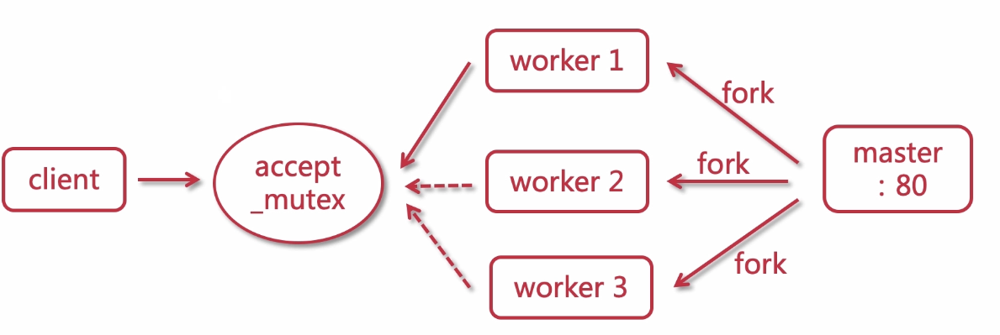

### worker事件处理

**传统事件处理：同步阻塞**

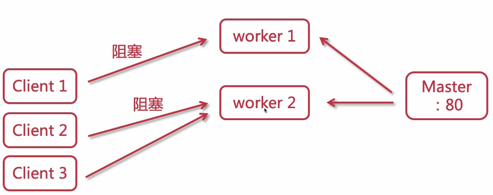

当请求进来时，如果只有一个worker，会处理3个请求，但是，当某一个请求阻塞了，其他的请求必须等待该请求阻塞完毕，才会被处理。这样只要出现阻塞，会大大影响性能

使用传统方式如果想要好的性能，需要创建大量worker


**Nginx事件处理：多路复用器，异步非阻塞**

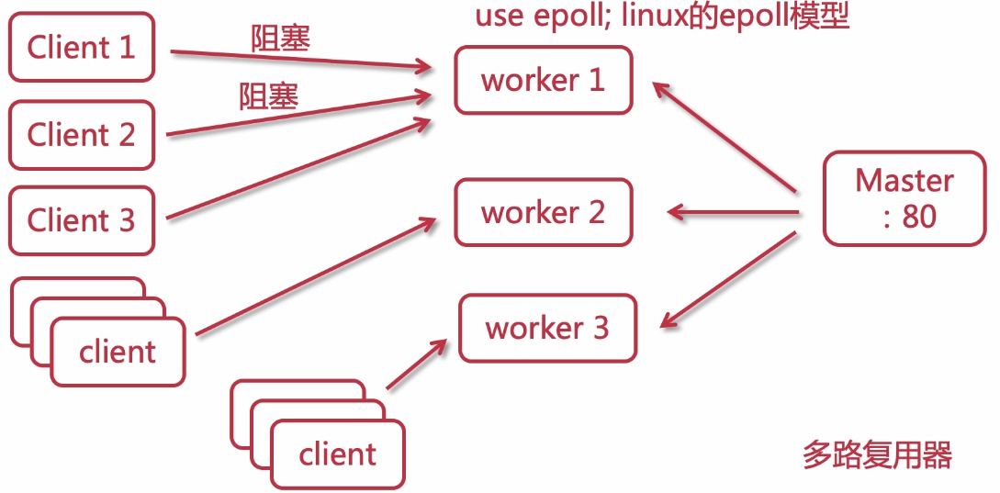

每个worker都是异步非阻塞的，当有请求阻塞时，会处理接下来的请求，而不是等待这个请求阻塞完毕。

每个worker可以处理上万个请求，与cpu内存挂钩，如果服务器性能好，单个worker处理百万请求也可以。

在`nginx.conf`中可以配置每个worker最大并发连接数

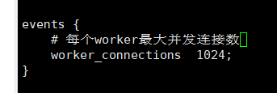

## Nginx配置文件

之前学习默认首页解析时，简单了解了Server中的一些配置，Nginx整体配置如下图：

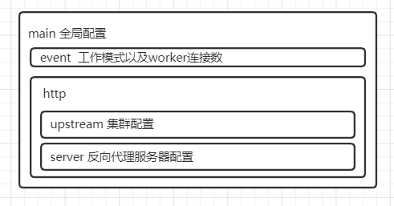

主要核心的就是http中的配置了，http中核心的upstream和server

### 配置文件详解

```
# 设置worker进程的用户，主要是linux环境下的权限配置
# 默认nobody，设置成root即有root用户权限
user  root;
# worker进程数量配置
worker_processes  2;


events {
    # 每个worker最大并发连接数
    worker_connections  1024;
}

# http网络传输配置
http {
	# 可以从外部引入配置加进来，这样主配置文件不会过于臃肿
    include       mime.types;
    default_type  application/octet-stream;

	# 日志格式，可以修改日志打印格式
    #log_format  main  '$remote_addr - $remote_user [$time_local] "$request" '
    #                  '$status $body_bytes_sent "$http_referer" '
    #                  '"$http_user_agent" "$http_x_forwarded_for"';

	# 日志默认存放位置
    #access_log  logs/access.log  main;

	# 提高文件传输效率
    sendfile        on;
    #tcp_nopush     on;

	# 客户端服务器请求超时时间，多次请求不会创建重复连接
    #keepalive_timeout  0;
    keepalive_timeout  65;

	# html/js/css压缩，传输速度增加
    #gzip  on;

	# server服务器配置
    server {
		# 监听端口
        listen       80;
		# ip或者域名
        server_name  localhost;

		# 拦截路径转发
        location / {
			# 请求位置
            root   html;
			# 首页设置
            index  index.html index.htm;
        }

		# 错误页面设置
        error_page   500 502 503 504  /50x.html;
        location = /50x.html {
            root   html;
        }
    }
}

```

## Nginx日志切割

可以发现，当nginx写日志时，都会写到一个文件中，access.log，但是当该日志越来越大，就非常不方便维护了，所以有了日志切割技术，把日志可以按每周每天切割，方便维护。

创建一个shell文件，`cut_nginx_log.sh`

```
#NGINX日志路径
base_path='/var/log/nginx'


#创建目录时间 
RECORD_TIME=$(date -d yesterday +"%Y%m%d") #该参数是创建前一天数据，如需要当天备份，可使用
PID=/var/run/nginx/nginx.pid

#将备份日志
mv ${base_path}/access.log ${base_path}/access.${RECORD_TIME}.log
mv ${base_path}/error.log ${base_path}/error.${RECORD_TIME}.log

#NGINX日志重读
kill -USR1 `cat $PID`
```

添加权限：

```
chmod +x cut_nginx_log.sh
```

手动切割

```
./cut_nginx_log.sh
```

定时切割

需要安装linux的定时任务`yum install crontabs`

添加任务：

```
crontab -e
0 0 * * * * /usr/local/nginx/sbin/cut_nginx_log.sh
```

定时任务操作命令

```
service crond restart #重启
service crond start #启动
service crond stop # 关闭
service crond reload # 重新加载
crontab -e #编辑任务
crontab -l #查看任务列表
```

上面是cron表达式，具体可以百度


## Nginx虚拟目录

nginx配置虚拟目录很简单，之前学习nginx配置文件时，就有了解到，在server中配置，就可以实现web服务器映射。

具体有两种方式

### root方式

```
server{
	# 监听端口
	listen       88;
	# ip或者域名
	server_name  localhost;

	# 拦截路径转发
	location / {
		# 请求位置
		root   /home/image;
	}
}
```

这里设置监听`localhost:88/`，当请求过来后，会根据`/`后的路径，读取`/home/image`下的文件，

比如我在此路径下放了一个图片`zzzt.jpg`


这时我们访问路径：`ip:88/zzzt.jpg`就可以看到图片


### alias方式

alias配置和root差不多，举例来说

我想映射`/home/image`，当用户请求`/image`时进行映射，配置方式如下：

```
# root
location /image {
    root   /home;
}

# alias
location /image {
    alias   /home/image/;
}
```

这时就可以发现区别了

- root：请求路径会添加到配置路径后面，即拦截的路径会拼接到root配置的后面进行查找
- alias，请求路径不影响实际映射路径，即拦截路径后直接从配置的alias下查找

并且root还有一个劣势，路径必须存在，而alias不受限制，如下

```
# root
location /img {
    root   /home;
}

# alias
location /img {
    alias   /home/image/;
}
```

对于alias来说，拦截路径是什么不影响它去设置的路径下查找，而root，必须存在`/home/img`才可以

所以，对于使用来说

- root用来设置`/`这个路径的拦截请求
- alias用来设置`/path`路径的拦截请求

## Nginx跨域配置

```
#允许跨域
add_header 'Access-Control-Allow-Origin' *;
#允许带cookie请求
add_header 'Access-Control-Allow-Credentials' 'true';
# 允许请求的方法
add_header 'Access-Control-Allow-Methods' *;
# 允许请求头
add_header 'Access-Control-Allow-Headers' *;
```

## Nginx负载均衡

之前我们说到Nginx最重要的几个功能，其中就包括负载均衡，当配置集群后，如何评价对集群的访问规则，就是负载均衡要干的事，Nginx配置负载均衡非常简单，在之前了解Nginx配置文件时，就有说到`upstream`这个配置，是用来负载均衡的，这一节就详细说说这个配置。

### 基础使用

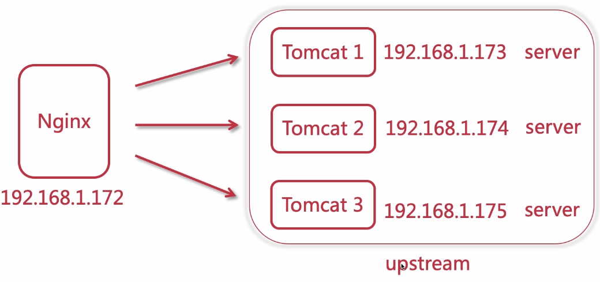

这里我们配置一台为nginx服务器，3台tomcat，当用户请求时，由nginx负载均衡将请求分配给上游服务器，处理下游请求。

配置文件：

```
# 配置上游服务器
upstream tomcats{
    server 192.168.1.173:8080;
    server 192.168.1.174:8080;
    server 192.168.1.175:8080;
}

server{
    listen 80;
    server_name www.tomcats.com;
    
    location / {
        proxy_pass http://tomcats;
    }
}
```

> 本机host需要配置 `192.168.1.172  www.tomcats.com`

这样配置后，浏览器输入www.tomcats.com时，就会请求到Nginx虚拟机上，nginx监听此域名端口，就会将请求转发到配置的上游服务器上，使用负载均衡，一般是轮询分发请求。

这样设置完成后，可以使用JMeter进行压力测试一下，看看3台tomcat的异常率是多少


会发现是18%，这时我们再向上游服务器增加一个节点，再次测试


异常率降低到了0.9%

由此可见集群负载均衡的重要性

### 负载均衡规则

#### 轮询

默认使用的轮询，也很好理解，按照一定的顺序来请求节点服务器


轮询也是默认使用的负载均衡规则，对于各个节点性能差不多的，使用轮询没有问题，但是如果节点间性能不能，使用轮询就有点问题了。

#### 权重

权重就是加权轮询，针对我们刚刚说的，服务器性能不同，其分配的请求如果相同，无法最大使用各节点性能，所以这时就可以使用权重。

为性能好的机器增加大权重，性能略差的减小权重，如下配置：

```
upstream tomcats{
    server 192.168.1.173:8080 weight=5;
    server 192.168.1.174:8080 weight=1;
    server 192.168.1.175:8080 weight=3;
}
```

#### ip_hash

使用对ip进行hash计算，来对其分配使用的节点。

使用这种方式，一个ip多次访问，都会分配到同一个节点上，可以维护会话，但是如果该用户切换了ip，就无法继续维护会话了。

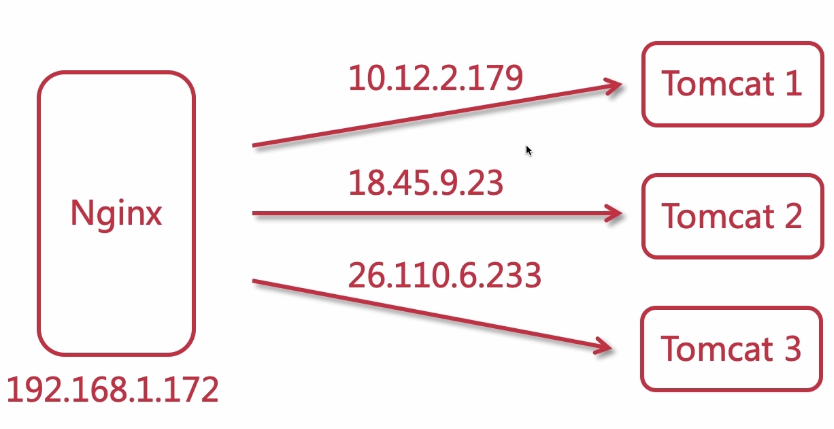

计算逻辑：hash(ip) % node_counts

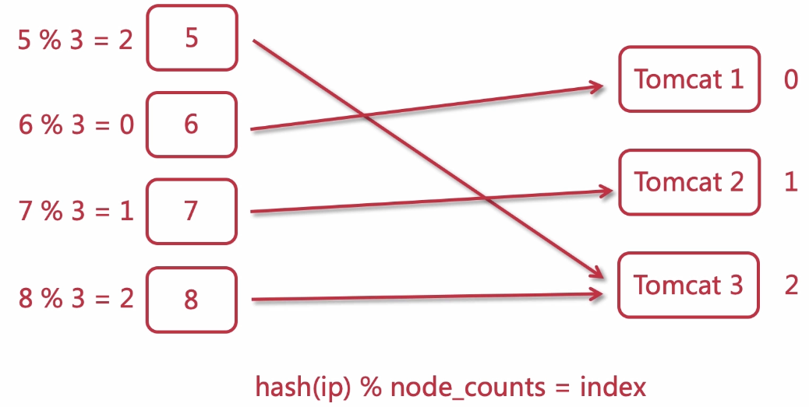

使用方式：

```
upstream{
    ip_hash;
    server ···;
    server ···;
}
```

注意事项：

- 使用ip哈希规则时，当想要剔除某个节点时，应使用down标签配置，这样才不会破坏之前的hash计算规则，如果直接删除一个节点，会打乱计算逻辑，所有ip会重新计算分配节点，之前维护的会话就被打乱。

为什么使用down标签就不会打乱hash呢？这里就引出一致性hash了

##### 一致性hash

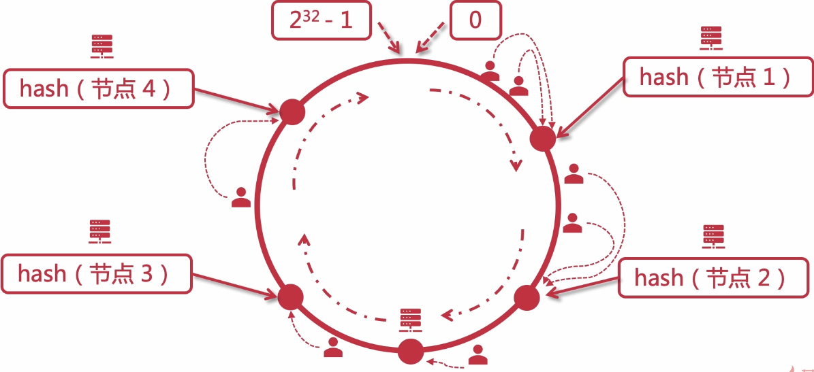

可以看上面这张图，我们将hash算法的所有值连接成了一个闭环

- 当节点减少时，如果3节点去除，那么在2-3之间的用户，根据顺时针就会去请求4节点
- 当节点增加时，比如4-1之间添加节点5，那么4-5之间的就会去请求5，5-1之间的就会去请求1

#### url_hash

类似ip哈希，这个是使用url来进行哈希计算，计算出请求哪个节点


会根据请求的路径，进行hash算法，并除以节点数，计算出请求哪个节点。

配置方式：

```
upstream{
    hash $request_uri;
    server ···;
    server ···;
}
```

注意，在`server`中`server_name`需要配置成域名

#### least_conn

这个就是根据当前各个节点的连接数判断分给哪个节点，哪个节点连接数最少，分配给哪个节点

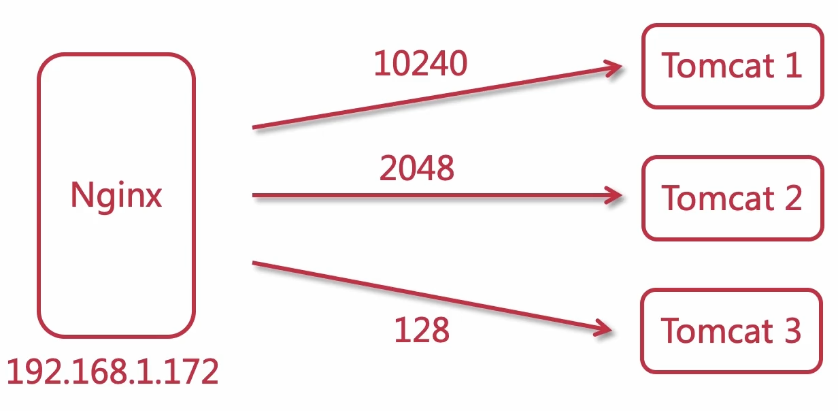

如上图，tomcat3连接数最少，那么使用`least_conn`负载均衡规则时，就会把请求分给tomcat3

配置方式：

```
upstream{
    least_conn;
    server ···;
    server ···;
}
```

### upstream指令配置

`upstream`除了基础节点配置，规则配置还有一些其他的一些配置

- `max_conns`：每个节点最大连接数，避免过载，限流

- `slow_start`：**配合weight权重使用**，可以实现节点的慢开启，比如设置权重为10，`slow_start=60s`，这样他会从0权重开始，慢慢往上添加，直到60秒后才正式启动，权重为10。（商业版功能）

- `down`：标识该节点当前不可用

- `backup`：标识该节点为备用节点，只有当其他节点全部宕机后，才会启动

- `max_fails`：标识当请求失败次数到达时，标记此节点为宕机状态

- `fail_timeout`：失败重试时间

  - `max_fails`配合`fail_timout`使用：`max_fails=2 fail_timeout=15s`，指15秒内，如果该节点失败了两次请求，就标记为宕机

- `keepalive`：长连接数量设置，用于提高吞吐量

  - ```
    upstream{
        server ····;
        keepalive 32;
    }
    server{
        listen ···;
        server_name ···;
        location / {
            proxy_pass ···;
            proxy_http_version 1.1； # 设置长连接http版本
            proxy_set_header Connection ""; # 清除connection header信息
        }
    }
    ```

## Nginx缓存

Nginx可以控制浏览器缓存，也可以自身进行缓存

- 浏览器缓存：保存到浏览器的静态数据，只可以提升单个用户的访问速度
- Nginx缓存，保存在nginx服务端，提升所有访问nginx请求速度

Nginx控制浏览器缓存：

```
location / {
    alias /home/html;
    # expires 10s; # 控制缓存保存10秒
    # expires @22h30m; # 缓存到晚上10点半
    # expires -1h; # 不进行缓存
    # expires epoch; # 不进行缓存
    # expires off; #不使用nginx控制浏览器缓存
    expires max; # 开启最大缓存
}
```

Nginx反向代理缓存

```
# proxy_cache_path：设置缓存目录
# keys_zone 设置key以及开辟初始空间大小
# max_size：缓存最大size
# inactive：超时时间
# use_temp_path：是否使用临时目录
proxy_cache_path /user/local/nginx/upstream_cache keys_zone=mycache:5m max_size=1g inactive=1m use_temp_path=off;

location / {
    proxy_pass ···;
    
    # 开启nginx缓存
    proxy_cache mycache;
    # 设置状态码缓存时间
    proxy_cache_valid 200 304 8h;
}
```

