# 韩顺平IO流

## 1.File类

**文件就是保存数据的地方**，文件在程序中是以流的形式来操作的。

以**内存**作为参考点

输入流：数据从数据源（文件）到程序（内存）的路径

输出流：数据从程序（内存）到数据源（文件）的路径

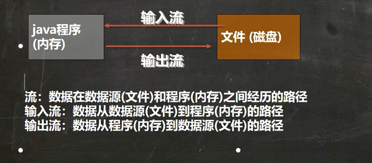

### 1.1 文件的创建

>文件的创建需要用到File类的构造器+creatNewFile()方法！

|      | 构造器                               | 说明                                   |
| :--: | ------------------------------------ | -------------------------------------- |
|  1   | new File(String path)                | 根据路径创建一个File对象               |
|  2   | new File(File parent,String child)   | 根据**父目录文件**和子路径构建File对象 |
|  3   | new File(String parent,String child) | 根据父目录和子路径构建File对象         |
|      | **方法**                             | **说明**                               |
|  1   | creatNewFile()                       | 创建新文件                             |

~~~java
import java.io.File;
import java.io.IOException;

/**
 * 文件的创建
 */
public class Test {
    public static void main(String[] args) {
        createNewFile1();
        createNewFile2();
    }

    /**
     * new File(File parent,String child)
     * 文件路径：e:\\newFile2.txt
     */
    public static void  createNewFile1(){
        File parentFile = new File("e:\\");
        String childName = "newFile2.txt";
        // 这里的file对象，在java程序中只是一个对象
        // 只有执行了createFile方法，才会真正的，在磁盘创建该文件
        File file = new File(parentFile,childName);
        try {
            file.createNewFile();// 这个方法才会真正的创建文件
            System.out.println("创建成功！");
        } catch (IOException e) {
            e.printStackTrace();
        }
    }

    /**
     * new File(string parent,String child)
     * 文件路径：e:\\newFile3.txt
     */
    public static void createNewFile2(){
        String parentPath = "e:\\";
        String fileName = "newFile3.txt";
        File file  = new File(parentPath,fileName);
        try {
            file.createNewFile();
            System.out.println("文件创建成功！");
        } catch (IOException e) {
            e.printStackTrace();
        }
    }
}

~~~

### 1.2 获取文件的相关信息

|      | 方法名            | 说明                   |
| ---- | ----------------- | ---------------------- |
| 1    | getName()         | 获取文件名             |
| 2    | getAbsolutePath() | 获取绝对路径           |
| 3    | getParent()       | 获取文件父级目录       |
| 4    | lengh()           | 获取文件大小，字节个数 |
| 5    | exists()          | 判断是否存在           |
| 6    | isFile()          | 判断是否是一个文件     |
| 7    | isDirectory()     | 判断是否是一个目录     |

### 1.3 File的创建和删除方法

|      | 方法名                  | 说明                                                   |
| ---- | ----------------------- | ------------------------------------------------------ |
| 1    | Boolean createNewFile() | 当且仅当具有该名称的文件不存在的时候，创建一个空文件   |
| 2    | boolean delete()        | 删除由此File表示的文件或目录，**注意：只能删除空目录** |
| 3    | boolean mkdir()         | 创建由此File表示的目录，**注意：只能创建一级目录**     |
| 4    | boolean mkdirs()        | 创建多级目录                                           |

~~~java
package com.atguigu.spring.tx.test;

import org.junit.Test;

import java.io.File;
import java.io.IOException;

public class Test2 {
    @Test
    public void test2() throws IOException {
        File file  = new File("e:\\a.txt");
        // 1.创建空文件，创建成功返回true
        System.out.println(file.createNewFile());
        // 2.删除文件或者文件夹,只能删除非空文件夹
        System.out.println(file.delete());
        // 3.创建一级文件夹
        File file1 = new File("e:\\aaa");
        file1.mkdir();
        // 4.创建多级文件夹
        File file2 = new File("e:\\bbb\\ccc");
        file2.mkdirs();

    }
}

~~~

### 1.4 File目录的遍历

|      | 方法               | 说明                                                         |
| ---- | ------------------ | ------------------------------------------------------------ |
| 1    | String[] list()    | 获取当前目录下所有的**一级文件名称**到一个字符串数组中去返回 |
| 2    | File[] listFiles() | 获取当前目录下的所有**一级文件对象**到一个文件对象数组中去   |

~~~java
package com.atguigu.spring.tx.test;

import org.junit.Test;

import java.io.File;
import java.io.IOException;
import java.util.Arrays;

public class Test2 {
    @Test
    public void test2() throws IOException {
        File file  = new File("E:\\soft");
        String[] list = file.list();
        System.out.println(Arrays.toString(list));
    }
}

~~~

~~~java
package com.atguigu.spring.tx.test;

import org.junit.Test;

import java.io.File;
import java.io.IOException;
import java.util.Arrays;

public class Test2 {
    @Test
    public void test2() throws IOException {
        // 获取当前目录下的全部一级文件对象到一个对象数组中去
        File file  = new File("E:\\编程");
        File[] files = file.listFiles();
        for (File file1 : files) {
            System.out.println(file1.getAbsolutePath());
        }
    }
}

~~~

**拓展**，文件上次修改时间：lastModified();

~~~java
// 1.获取图片的最后修改时间：lastModified();
package com.atguigu.spring.tx.test;

import org.junit.Test;

import java.io.File;
import java.io.IOException;
import java.text.SimpleDateFormat;
import java.util.Arrays;

public class Test2 {
    @Test
    public void test2() throws IOException {
        // 获取当前目录下的全部一级文件对象到一个对象数组中去
        File file  = new File("E:\\编程");
        long l = file.lastModified();
        SimpleDateFormat sdf = new SimpleDateFormat("yyyy/MM/dd HH:mm:ss");
        System.out.println(sdf.format(l));
    }
}
    
~~~

## 2.IO流

**JavaIO流**其中

i:input  **输入**读取外部数据（磁盘、光盘等存储设备的数据）到程序（内存）中。

o:output**输出**将程序（内存）数据输出到磁盘、光盘等存储设备中。

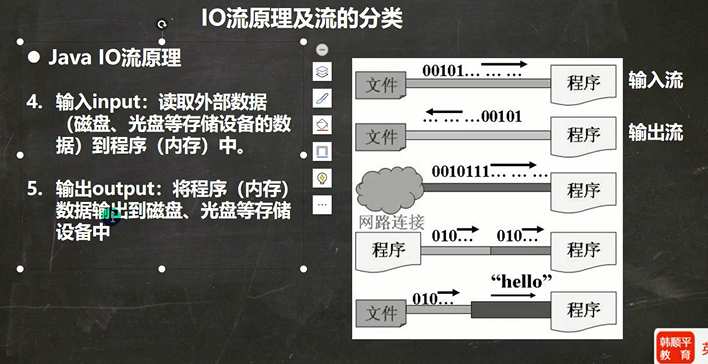

### 2.0 IO流的分类

- 按照操作单位分为：字节流（8 BIT；用来处理二进制文件不会损坏），字符流（按字符；用来处理纯文本）
- 按照数据流的流向分为：输入流，输出流
- 按照流的角色分为：节点流，处理流/包装流

| 抽象基类 | 字节流       | 字符流 |
| -------- | ------------ | ------ |
| 输入流   | InputStream  | Reader |
| 输出流   | OutputStream | Writer |

注意：

1.上面四个都是抽象类，我们需要用他们的实现类

2.由这四个类派生出来的子类名称都是以其父类名作为子类名后缀

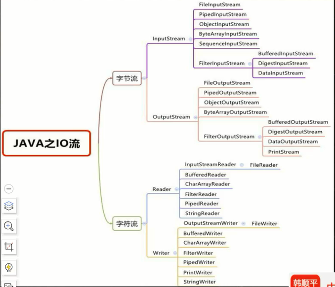

### 2.1 字节流

#### 2.1.1 字节输出流FileOutputStream

是OutPutStream的一个子类！这个类写入数据到文件中，如果文件不存在会创建这个文件。

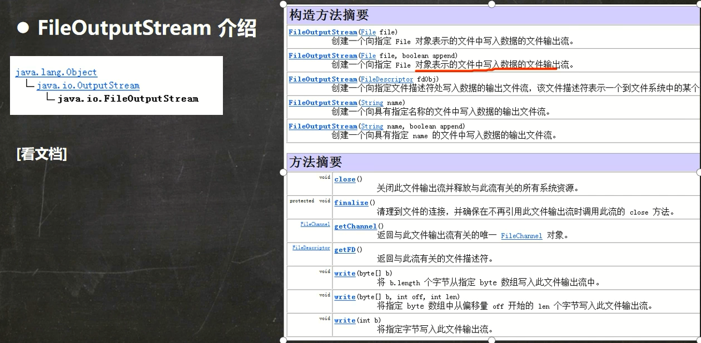

**构造器**

|      | 方法名                                         | 说明                                                         |
| ---- | ---------------------------------------------- | ------------------------------------------------------------ |
| 1    | FileOutputStream(File file)                    | 创建文件输出流以写入由指定的 `File`对象表示的文件。会覆盖写  |
| 2    | FileOutputStream(File file ,boolean append)    | 创建文件输出流以写入由指定的 `File`对象表示的文件。其中第二个参数为true的话，则会**追加写** |
| 3    | FileOutputStream(String name)                  | 创建文件输出流以指定的名称写入文件。                         |
| 4    | FileOutputStream(String name ,boolean append ) | 创建文件输出流以指定的名称写入文件。其中第二个参数为true的话，则会**追加写** |

**方法摘要**

|      | 方法名                                                       | 说明                                                         |
| ---- | ------------------------------------------------------------ | ------------------------------------------------------------ |
| 1    | void **[close](../../java/io/FilterOutputStream.html#close())**() | 关闭此输出流并释放与此流有关的所有系统资源                   |
| 2    | void **[write](../../java/io/FilterOutputStream.html#write(byte[]))**(byte[] b) | 将 `b.length` 个字节写入此输出流                             |
| 3    | void **[write](../../java/io/FilterOutputStream.html#write(byte[], int, int))**(byte[] b,  int off, int len) | 将指定 `byte` 数组中从偏移量 `off` 开始的 `len` 个字节写入此输出流。 |
| 4    | void **[write](../../java/io/FilterOutputStream.html#write(int))**(int b) | 将指定 `byte` 写入此输出流                                   |

##### 写一个字节

~~~java
 @Test
    public void test2() {
       String filepath  = "e:\\a.txt";
       FileOutputStream fileOutPutStream = null;
        try {
            // 1.创建FileOutputStream对象
            fileOutPutStream  = new FileOutputStream(filepath);
            // 2.写入一个字节
            fileOutPutStream.write('H');
        } catch ( IOException e) {
            e.printStackTrace();
        }finally{
            try {
                // 关闭流资源
                fileOutPutStream.close();
            } catch (IOException e) {
                e.printStackTrace();
            }
        }
    }
~~~

##### **写入一个字节数组**

~~~java
package com.atguigu.spring.tx.test;

import org.junit.Test;

import java.io.FileOutputStream;
import java.io.IOException;


public class Test2 {
    @Test
    public void test2() {
       String filepath  = "e:\\a.txt";
       FileOutputStream fileOutPutStream = null;
        try {
            // 1.创建FileOutputStream对象
            fileOutPutStream  = new FileOutputStream(filepath);
            // 2.写入一个字节数组
            String str = "hello world";
            //getBytes()可以把一个字符串转成一个字节数组!
            fileOutPutStream.write(str.getBytes());
        } catch ( IOException e) {
            e.printStackTrace();
        }finally{
            try {
                // 关闭流资源
                fileOutPutStream.close();
            } catch (IOException e) {
                e.printStackTrace();
            }
        }
    }

}

~~~

##### 追加写与覆盖写

>FileOutputStream(File file ,boolean append)/FileOutputStream(String name ,boolean append )
>
>这两个构造方法可以实现文件的追加写，**需要将第二个参数指定为true**，其他情况都是覆盖写！！！

##### 换行符号

>windows:\r\n
>
>linux:/n
>
>mac:/r

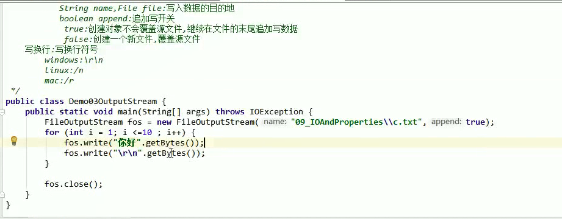

#### 2.1.2 字节输入流FileInputStream

作用：以内存为基准，吧磁盘文件中的数据按照字节的象时读取到内存中去的流

|      | 方法                           | 说明                                                         |
| ---- | ------------------------------ | ------------------------------------------------------------ |
| 1    | `FileInputStream(File file)`   | 通过打开与实际文件的连接创建一个 `FileInputStream` ，该文件由文件系统中的  `File`对象 `file`命名。 |
| 2    | `FileInputStream(String name)` | 通过打开与实际文件的连接来创建一个 `FileInputStream` ，该文件由文件系统中的路径名  `name`命名。 |

**读取字节的方法**

|      | 方法                           | 说明                                                         |
| ---- | ------------------------------ | ------------------------------------------------------------ |
| 1    | public int read()              | 每次读取一个字节返回，读取完毕返回-1                         |
| 2    | public int read(byte[] buffer) | 从字节输入流中读取字节到字节数组中去，返回**读取的字节数量**，没有字节可读返回-1 |

##### 一次读取一个字节

~~~java
package com.atguigu.spring.tx.test;

import org.junit.Test;

import java.io.File;
import java.io.FileInputStream;
import java.io.FileNotFoundException;
import java.io.InputStream;


public class Test2 {
    @Test
    public void test2() throws Exception {
        // 1.创建文件对象定位文件
        File file  = new File("E:\\a.txt");
        // 2.创建一个字节输入流管道与源文件接通
        InputStream is = new FileInputStream(file);
        // 3.读取一个字节编号返回，读取完毕返回-1
        int read1 = is.read();// 读取一滴水，一个字节
        System.out.println(read1);

        int read2 = is.read();// 读取一滴水，一个字节
        System.out.println(read2);

        int read3 = is.read();// 读取一滴水，一个字节
        System.out.println(read3);

        int read4 = is.read();// 读取完毕返回-1
        System.out.println(read4);
    }
}

~~~

**优化写法：使用循环**

~~~java
package com.atguigu.spring.tx.test;

import org.junit.Test;

import java.io.File;
import java.io.FileInputStream;
import java.io.FileNotFoundException;
import java.io.InputStream;


public class Test2 {
    @Test
    public void test2() throws Exception {
        // 1.创建文件对象定位文件
        File file  = new File("E:\\a.txt");
        // 2.创建一个字节输入流管道与源文件接通
        InputStream is = new FileInputStream(file);
        // 3.读取一个字节编号返回，读取完毕返回-1
        int ch = 0;
        while((ch=is.read())!=-1){
            System.out.println((char)ch);
        }
    }
}

~~~

>一个一个字节读取一个英文和数字没有问题。
>
>但是一旦读取中文输出无法避免乱码，因为会截断中文的字节。
>
>一个一个字节的读取数据，性能也较差。

##### 一次读取一个字节数组

~~~java
package com.atguigu.spring.tx.test;

import org.junit.Test;

import java.io.FileInputStream;
import java.io.InputStream;


public class Test2 {
    @Test
    public void test2() throws Exception {
       InputStream is = new FileInputStream("E:\\a.txt");
        // 定义一个字节数组读取数据(定义一个桶)
        byte[] buffer = new byte[3];
        // 从is管道中读取字节装入到字节数组中去，返回读取的字节数量
        int len = is.read(buffer);
        System.out.println("读取了字节数："+len);
        String rs = new String(buffer);
        System.out.println(rs);

        int len1 = is.read(buffer);
        System.out.println("读取了字节数："+len1);
        String rs1 = new String(buffer);
        System.out.println(rs1);

    }
}
~~~

**优化写法：使用循环**

~~~java
package com.atguigu.spring.tx.test;

import org.junit.Test;

import java.io.FileInputStream;
import java.io.InputStream;


public class Test2 {
    @Test
    public void test2() throws Exception {
       InputStream is = new FileInputStream("E:\\a.txt");
        // 定义一个字节数组读取数据(定义一个桶)
       byte[] buffer = new byte[3];
        // 存储每次读取的字节数
       int len = 0;
        // 从is管道中读取字节装入到字节数组中去，返回读取的字节数量
       while((len = is.read(buffer)) != -1){
           // 读取多少倒多少
           String str = new String(buffer,0,len);
           System.out.println(str);
       }

    }
}
~~~

>使用字节数组读取内容，效率可以，但是依然无法避免中文读取输出乱码问题！

#### 2.1.3 字节流读取中文输出不乱吗的解决方案

>一个一个字节读取中文输出，一个一个字节数组读取中文输出均无法避免乱码
>
>如何实现读取避免乱码？
>
> 1.定义一个字节数组，与文件的大小刚刚一样大，然后一桶水读取全部字节数据再输出！但是这个方案不能读取超大文件，会内存溢出！
>
> 2.使用字符流

~~~java
package com.atguigu.spring.tx.test;

import org.junit.Test;

import java.io.File;
import java.io.FileInputStream;
import java.io.InputStream;


public class Test2 {
    @Test
    public void test2() throws Exception {
        // 1，定位文件对象
        File file = new File("E:\\a.txt");
        InputStream is = new FileInputStream(file);
        // 定义一个字节数组读取数据(定义一个桶,与文件的大小刚刚一样大)
        byte[] buffer = new byte[(int)file.length()];
        int len = is.read(buffer);
        System.out.println("读取了:"+len);
        String rs = new String(buffer);
        System.out.println(rs);
    }
}

~~~

~~~java
package com.atguigu.spring.tx.test;

import org.junit.Test;

import java.io.File;
import java.io.FileInputStream;
import java.io.InputStream;


public class Test2 {
    @Test
    public void test2() throws Exception {
        // 1，定位文件对象
        File file = new File("E:\\a.txt");
        InputStream is = new FileInputStream(file);
        // java最新JDK1.9提供了一个API：readAllBytes（），可以获取对应的目标文件大小，直接拿到桶
        byte[] buffer = is.readAllBytes();
        String rs = new String(buffer);
        System.out.println(rs);
    }
}

~~~

#### 2.1.4 文件复制

~~~java
package com.atguigu.spring.tx.test;

import org.junit.Test;

import java.io.*;


public class Test2 {
    @Test
    public void test2() throws Exception {
        /**
         * 1.创建文件输入流，将文件读入程序
         * 2.创建文件输出流，将读取到的文件数据，写入到指定的文件
         */
        FileInputStream fi = new FileInputStream("C:\\Users\\Admin\\Pictures\\Saved Pictures\\a.jpeg");
        FileOutputStream fos = new FileOutputStream("e:\\b.jpeg");
        byte[] buffer = new byte[512];
        int len = 0;
        while((len = fi.read(buffer)) != -1){
            fos.write(buffer,0,len);
        }
        fos.close();
        fi.close();
    }
}

~~~

#### 2.1.5 释放资源的方式


### 2.2 字符流

#### 2.2.1 字符输入流FileReader

>以内存为基准，将磁盘文件的数据以**字符**的形式读入到内存中

**构造器**

|      | 方法                        | 说明                               |
| ---- | --------------------------- | ---------------------------------- |
| 1    | FileReader(File file)       | 创建一个字符输入流与源文件对象接通 |
| 2    | FileReader(String filePath) | 创建一个字符输入流与源文件路径接通 |

**方法**

|      | 方法                    | 说明                                                         |
| ---- | ----------------------- | ------------------------------------------------------------ |
| 1    | int read()              | 读取一个字符的编号返回，读取完毕返回-1                       |
| 2    | int read(char[] buffer) | 读取一个**字符数组**，读取多少个字符就返回**多少个数量**，读取完毕返回-1 |

~~~java
new String(char[] buffer):将char[]数组转为String
new String(char[] buffer,int off,int len):将char[]数组的一部分转为String
~~~

##### 一次读取一个字符

~~~java
package com.atguigu.spring.tx.test;

import org.junit.Test;

import java.io.*;


public class Test2 {
    @Test
    public void test2() throws Exception {
        Reader re = new FileReader("E:\\a.txt");
        // 按照字符读取，一次读取一个字符编号返回
        int read = re.read();
        System.out.println((char)read);
        int read1 = re.read();
        System.out.println((char)read1);
        int read2 = re.read();
        System.out.println((char)read2);
    }
}

~~~

**简化写法**

~~~java
package com.atguigu.spring.tx.test;

import org.junit.Test;

import java.io.*;


public class Test2 {
    @Test
    public void test2() throws Exception {
        Reader re = new FileReader("E:\\a.txt");
        // 按照字符读取，一次读取一个字符编号返回
       int len ;
       while((len = re.read()) != -1){
           System.out.println((char)len);
       }
    }
}

~~~

>字符流一个一个的读取文本内容输出，可以解决中文乱码问题
>
>字符流很适合操作文本文件内容
>
>但是一个个字符的读取文本内容性能较差！

##### 一次读取一个字符数组

~~~java
package com.atguigu.spring.tx.test;

import org.junit.Test;

import java.io.*;


public class Test2 {
    @Test
    public void test2() throws Exception {
        Reader re = new FileReader("E:\\a.txt");
        // 按照字符数组读取数据，一次读取一个字符数组
        char[] cr = new char[4];
        // 定义一个整数记录每次读取的字符数量
        int len;
        while((len = re.read(cr)) != -1){
            System.out.println(new String(cr,0,len));
        }
    }
}

~~~

>字符流按照字符数组循环读取数据，可以解决中文乱码问题，性能较好！

#### 2.2.2 字符输出流 FileWriter

>以内存为基准，把内存中的数据按照字符的形式写出到磁盘文件

**构造器**

|      | 方法                                       | 说明                                             |
| ---- | ------------------------------------------ | ------------------------------------------------ |
| 1    | FileWriter(File file)                      | 创建一个字符输出流管道通向目标文件对象           |
| 2    | FileWriter(String filePath)                | 创建一个字符输出流管道通向目标文件路径           |
| 3    | FileWriter(File file,boolean append)       | 创建一个追加数据的字符输出流管道通向目标文件对象 |
| 4    | FileWriter(String filePath,boolean append) | 创建一个追加数据的字符输出流管道通向目标文件路径 |

**方法**

|      | 方法                                       | 说明                       |
| ---- | ------------------------------------------ | -------------------------- |
| 1    | void write(int c)                          | 写一个字符出去             |
| 2    | void write(String c)                       | 写一个字符串出去           |
| 3    | void writer(char[] buffer)                 | 写一个字符数组出去         |
| 4    | void writer(char[] buffer,int pos,int len) | 写一个字符数组的一部分出去 |
| 5    | void writer(string,int pos,int len)        | 写一个字符串的一部分出去   |

~~~java
String类的toCharArray():可以将String转换为char[]
~~~

**注意：FileWrite使用后，必须要关闭（close）或者刷新（flush）,否则写入不到指定的文件！**

~~~java
package com.atguigu.spring.tx.test;

import org.junit.Test;

import java.io.*;


public class Test2 {
    @Test
    public void test2() throws Exception {
       FileWriter fw = new FileWriter("e:\\haha.txt");
        //1.写一个字符出去 void write(int c)
        fw.write(97);
        fw.write('我');
        //2.写一个字符串出去 void write(String c)
        fw.write("java是最优美的语言！");
        //3.写一个字符数组出去 void writer(char[] buffer)
        fw.write("好好加油".toCharArray());
        fw.write("\r\n");// 换行
        // 4.写数组的一部分出去 void writer(char[] buffer,int pos,int len)
        fw.write("每天进步一点点".toCharArray(),0,2);
        fw.close();
    }
}
~~~

>字符流可以写字符数据出去，总共有5个方法！

### 2.3 缓冲流

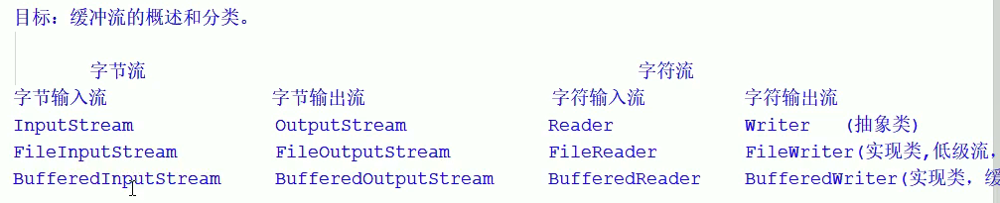

>缓冲流：缓冲流可以提高字节流和字符流读写数据的性能
>
>分为四类：
>
>BufferedInputStream:字节缓冲输入流，可以提高字节输入流读数据的性能
>
>BufferedOutputStream:字节缓冲输出流，可以提高字节输出流写数据的性能
>
>BufferedReader:字符缓冲输入流，可以提高字符输入流读数据的性能
>
>BufferedWriter:字符缓冲输出流，可以提高字符输出流写数据的性能

**缓冲流的原理：**

内部使用数组临时存储多个数组，**当缓冲区数组满或者调用close()或者调用flush(),才回一次性调用底层资源，将数据传输到目标文件中**,目的是为了减少底层资源的调用次数，从而提高读写速度！

#### 2.3.1 字节缓冲输入流BufferedInputStream

>作用：可以把低级的字节输入流包装成一个高级的缓冲字节输入流管道
>
>从而提高字节输入读取数据的性能！
>
>缓冲池大小：8192！！！

|      | 方法                                            | 说明                                                         |
| ---- | ----------------------------------------------- | ------------------------------------------------------------ |
| 1    | `BufferedInputStream(InputStream in)`           | 创建一个 `BufferedInputStream`并保存其参数，输入流 `in` ，供以后使用。 |
| 2    | `BufferedInputStream(InputStream in, int size)` | 创建 `BufferedInputStream`具有指定缓冲区大小，并保存其参数，输入流  `in` ，供以后使用。 |

~~~java
package com.atguigu.spring.tx.test;

import org.junit.Test;

import java.io.*;


public class Test2 {
    @Test
    public void test2() throws Exception {
        // 1.定义一个低级的字节输入流与源文件接通
       FileInputStream fi = new FileInputStream("e:\\haha.txt");
       // 2。把低级的字节输入流包装成一个高级的缓冲字节输入流
        BufferedInputStream bi = new BufferedInputStream(fi);
        byte[] buffer = new byte[3];
        int len;
        while((len = bi.read(buffer)) != -1) {
            System.out.println(new String(buffer,0,len));
        }
    }
}

~~~

>缓冲字节输入流管道自带一个8kb的缓冲池，每次可以直接借用操作系统功能最多读取8KB的数据到缓冲池中去，然后我们直接从池中读取数据，所以性能较好！

#### 2.3.2 字节缓冲输出流BufferedOutputStream

>作用：可以将一个低级的字节输出流包装成一个高级的缓冲字节输出流，从而提高写数据的性能！
>
>缓冲池大小：8192！！！

|      | 方法                                               | 说明                                                         |
| ---- | -------------------------------------------------- | ------------------------------------------------------------ |
| 1    | `BufferedOutputStream(OutputStream out)`           | 创建一个新的缓冲输出流，以将数据写入指定的底层输出流。       |
| 2    | `BufferedOutputStream(OutputStream out, int size)` | 创建一个新的缓冲输出流，以便以指定的缓冲区大小将数据写入指定的底层输出流。 |

~~~java
package com.atguigu.spring.tx.test;

import org.junit.Test;

import java.io.*;


public class Test2 {
    @Test
    public void test2() throws Exception {
       // 1.写一个原始的字节输出流
        OutputStream os = new FileOutputStream("e:\\hehe.txt");
        // 2.把低级的字节输出流包装成一个高级的字节输出流
        BufferedOutputStream bof = new BufferedOutputStream(os);
        bof.write('a');
        bof.write('b');
        bof.write("我爱你中国".getBytes());
        bof.close();
    }
}

~~~

#### 2.3.3 性能测试

~~~java
package com.atguigu.spring.tx.test;

import org.junit.Test;

import java.io.*;


public class Test2 {
    public static final String SRC_FILE="E:\\111\\黑马57期\\磊哥基础加强\\10\\01.字符输入流读取一个一个字符_高清 720P.mp4";
    public static final String DEST_FILE="E:\\";
    public static void main(String[] args) {
        // copy01();
        copy02();
        copy03();
        copy04();
    }

    /** 1.使用低级的字节流按照一个一个字节的形式复制文件 */
    public static void copy01(){
        long startTimer = System.currentTimeMillis();
        try{
            // 创建一个低级的字节输出流与源文件接通
            FileInputStream fi = new FileInputStream(SRC_FILE);
            // 创建一个低级的字节输出流管道与目标文件接通
            FileOutputStream fo = new FileOutputStream(DEST_FILE+"01.mp4");
            int len;
            while((len = fi.read()) != -1){
                fo.write(len);
            }
            fo.close();
            fi.close();
        }catch(Exception e){
            e.printStackTrace();
        }
        long endTimer = System.currentTimeMillis();
        System.out.println("低级的字节流按照一个一个字节的形式复制耗时："+(startTimer-endTimer));
    }

    /** 2.使用低级的字节流按照一个一个字节数组的形式复制文件 */
    public static void copy02(){
        long startTimer = System.currentTimeMillis();
        try {
            // 1.使用一个低级的字节输入流来读取数据
            FileInputStream fi = new FileInputStream(SRC_FILE);
            // 2.使用一个低级的字节输出流来写出数据
            FileOutputStream fo = new FileOutputStream(DEST_FILE+"02.mp4");
            byte[] buffer = new byte[1024];
            int len ;
            while((len = fi.read(buffer))!=-1){
                fo.write(buffer,0,len);
            }
            fo.close();
            fi.close();
        }catch(Exception e){
            e.printStackTrace();
        }
        long endTimer = System.currentTimeMillis();
        System.out.println("低级的字节流按照一个一个字节数组的形式复制耗时："+(endTimer-startTimer));
    }
    /** 3.使用高级的缓冲字节流按照一个一个字节的形式复制文件 */
    public static void copy03(){
        long startTime = System.currentTimeMillis();
        try{
          // 创建一个低级的字节输入流绑定源文件
          FileInputStream fi = new FileInputStream(SRC_FILE);
          // 使用缓冲字节输入流将低级的字节输出流包装成一个高级的字节输入流
          BufferedInputStream bi = new BufferedInputStream(fi);

          //创建一个低级的字节输出流绑定目标文件
            FileOutputStream fo = new FileOutputStream(DEST_FILE+"03.mp4");
          // 创建一个缓冲字节输出流将低级的字节输出流包装成一个高级的字节输出流
            BufferedOutputStream bo = new BufferedOutputStream(fo);
            int len;
            while((len = bi.read()) != -1){
                bo.write(len);
            }
            bo.close();
            bi.close();
        }catch(Exception e){
            e.printStackTrace();
        }
        long endTimer = System.currentTimeMillis();
        System.out.println("高级的字节流按照一个一个字节的形式复制耗时："+(endTimer-startTime));
    }
    /** 4.使用高级的缓冲字节流按照一个一个数组的形式复制文件 */
    public static void copy04(){
        long startTime = System.currentTimeMillis();
        try{
            // 创建一个低级的字节输入流绑定源文件
            FileInputStream fi = new FileInputStream(SRC_FILE);
            // 使用缓冲字节输入流将低级的字节输出流包装成一个高级的字节输入流
            BufferedInputStream bi = new BufferedInputStream(fi);

            //创建一个低级的字节输出流绑定目标文件
            FileOutputStream fo = new FileOutputStream(DEST_FILE+"04.mp4");
            // 创建一个缓冲字节输出流将低级的字节输出流包装成一个高级的字节输出流
            BufferedOutputStream bo = new BufferedOutputStream(fo);

            byte[] buffered = new byte[1024];
            int len;
            while((len = bi.read(buffered)) != -1){
                bo.write(buffered,0,len);
            }
            bo.close();
            bi.close();
        }catch(Exception e){
            e.printStackTrace();
        }
        long endTimer = System.currentTimeMillis();
        System.out.println("高级的字节流按照一个一个字节数组的形式复制耗时："+(endTimer-startTime));
    }
}


~~~

#### 2.3.4 缓冲字符输入流BufferedReader

>作用：字符缓冲输入流可以把字符输入流包装成一个高级的缓冲字符输入流，可以提高字符输入流读数据的性能！
>
>原理：缓冲字符输入流默认有一个8k的缓冲字符池，可以提高读字符的性能！

**构造器**

|      | 方法                                 | 说明                                           |
| ---- | ------------------------------------ | ---------------------------------------------- |
| 1    | `BufferedReader(Reader in)`          | 创建使用默认大小的输入缓冲区的缓冲字符输入流。 |
| 2    | `BufferedReader(Reader in,  int sz)` | 创建使用指定大小的输入缓冲区的缓冲字符输入流。 |

**缓冲字符数流的特有方法：**

|      | 方法                 | 说明                             |
| ---- | -------------------- | -------------------------------- |
| 1    | String  `readLine()` | 读一行文字返回，读取完毕返回null |

**方法**

|      | 方法                    | 说明                                                         |
| ---- | ----------------------- | ------------------------------------------------------------ |
| 1    | int read()              | 读取一个字符的编号返回，读取完毕返回-1                       |
| 2    | int read(char[] buffer) | 读取一个**字符数组**，读取多少个字符就返回**多少个数量**，读取完毕返回-1 |

~~~java
package com.atguigu.spring.tx.test;

import org.junit.Test;

import java.io.*;

/**
 * 缓冲字符输入流还多了一个按行读取数据的功能
 * public String readLine():读取一行数据，读取完毕返回null
 */
public class Test2 {

    public static void main(String[] args) throws Exception {
       // 定义一个原始的字符输入流读取源文件
        FileReader fi = new FileReader("e:\\a.txt");
        // 把低级的字符输入流管道包装成一个高级的缓冲字符输入流管道
        BufferedReader br = new BufferedReader(fi);
        char[] buffer = new char[1024];
        int len;
        while((len = br.read(buffer)) != -1){
            System.out.println(new String(buffer,0,len));
        }
        br.close();
    }

}
~~~

~~~java
package com.atguigu.spring.tx.test;

import org.junit.Test;

import java.io.*;

/**
 * 缓冲字符输入流还多了一个按行读取数据的功能
 * public String readLine():读取一行数据，读取完毕返回null
 */
public class Test2 {

    public static void main(String[] args) throws Exception {
       // 定义一个原始的字符输入流读取源文件
        FileReader fi = new FileReader("e:\\a.txt");
        // 把低级的字符输入流管道包装成一个高级的缓冲字符输入流管道
        BufferedReader br = new BufferedReader(fi);
        // 定义一个字符串变量存储每行的数据
        String  line;
        while((line = br.readLine()) != null){
            System.out.println(line);
        }
    }

}
~~~

>字符缓冲输入流可以把字符输入流包装成一个高级的缓冲字符输入流
>
>可以提高字符输入流读数据的性能！
>
>缓冲字符输入流还多了一个按行读取数据的功能：
>
>public String readLine():读取一行数据，读取完毕返回null

#### 2.3.5 缓冲字符输出流BufferWriter

>作用：把字符输出流包装成一个高级的缓冲字符输出流，提写数据的性能！
>
>原理：高级的字符缓冲输出流多了一个8k的字符缓冲池，写数据性能极大提高了！

**构造器**

|      | 方法                                  | 说明                                                 |
| ---- | ------------------------------------- | ---------------------------------------------------- |
| 1    | `BufferedWriter(Writer out)`          | 创建使用默认大小的输出缓冲区的缓冲字符输出流         |
| 2    | `BufferedWriter(Writer out,  int sz)` | 创建一个新的缓冲字符输出流，使用给定大小的输出缓冲区 |

**特有方法**

|      | 方法               | 说明           |
| ---- | ------------------ | -------------- |
| 1    | `void` `newLine()` | 写一行行分隔符 |

**意味着用了缓冲字符输出流以后不需要自己写换行符，用这个方法即可！**

**方法**

|      | 方法                                  | 说明                 |
| :--- | ------------------------------------- | -------------------- |
| 1    | `write(int c)`                        | 写一个字符           |
| 2    | `write(char[] cbuf,int off, int len)` | 写入字符数组的一部分 |
| 3    | `write(String s,int off, int len)`    | 写一个字符串的一部分 |
| 4    | `write(char[] cbuf)`                  | 写入字符数组         |
| 5    | `write(String s)`                     | 写一个字符串         |

~~~java
package com.atguigu.spring.tx.test;

import org.junit.Test;

import java.io.*;

/**
 * 缓冲字符输入流还多了一个按行读取数据的功能
 * public String readLine():读取一行数据，读取完毕返回null
 */
public class Test2 {

    public static void main(String[] args) throws Exception {
        // 定义一个低级的字符输出流
        FileWriter  fw = new FileWriter("e:\\ll.txt");
        // 把低级的字符输出流包成一个高级的缓冲字符输出流
        BufferedWriter bw = new BufferedWriter(fw);
        // 写字符输出
        bw.write("好好敲代码！");
        bw.newLine();
        bw.write("我爱你",0,2);
        bw.newLine();
        bw.write("爱你亲爱哒".toCharArray());
        bw.close();
    }
}
~~~

### 2.4 转换流

按照某种规则，将字符存储到计算机中，称为编码。

将存储在计算机中的二进制文件按照某种规则解析出来，称为解码

编码表：生活中文字和计算机中二进制的对应规则！

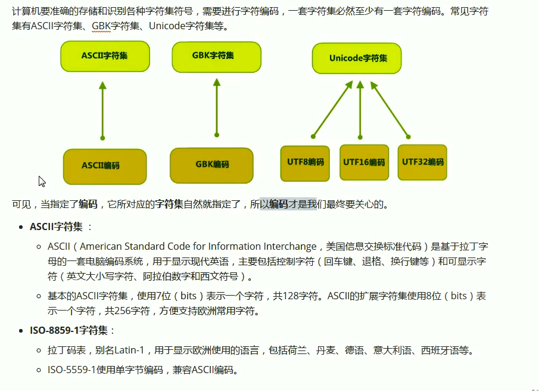

**编码不一致导致乱码**

~~~java
package com.atguigu.spring.tx.test;

import java.io.FileReader;

/**
 * FileReader可以读取IDE默认编码格式（utf-8）的文件
 * 但是读取系统默认编码（GBK）的文件就会产生乱码
 */
public class Test2 {

    public static void main(String[] args) throws Exception {
        FileReader fi = new FileReader("e:\\我是GBK格式的编码.txt");
        int len = 0;
        while((len = fi.read()) != -1){
            System.out.print((char)len);// �Ұ����й���
        }
    }
}
~~~

**实际上最终读取的动作依然是字节流做的，字符流只是通过对应的码表将字节转为字符！而FileReader和FileWriter都是指定默认码表（utf-8）来转换的**

转换流有两个：**InputStreamReader&&OutputStreamWriter**

**转换流实际上是将字节流转换为字符流！**

**InputStreamReader**

>- ```
>  public class InputStreamReader extends Reader
>  ```
>
>  InputStreamReader是从字节流到字符流的桥：它读取字节，并使用指定的`charset`将其解码为[字符](../../java/nio/charset/Charset.html)  。它使用的字符集可以由名称指定，也可以被明确指定，或者可以接受平台的默认字符集。

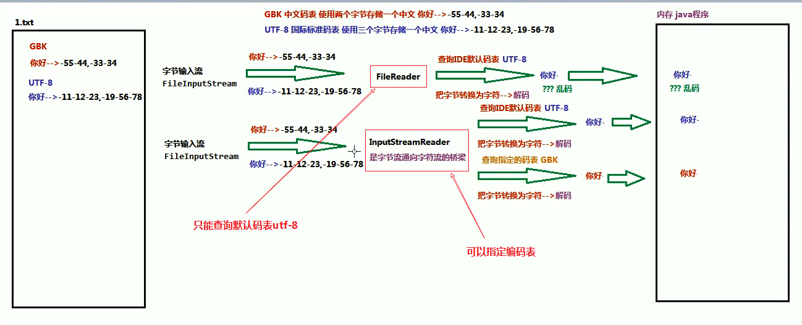

**OutputStreamWriter**

>- ```
>  public class OutputStreamWriter  extends Writer
>  ```
>
>  OutputStreamWriter是字符的桥梁流以字节流：向其写入的字符编码成使用指定的字节[`charset`](../../java/nio/charset/Charset.html) 。  它使用的字符集可以由名称指定，也可以被明确指定，或者可以接受平台的默认字符集。 

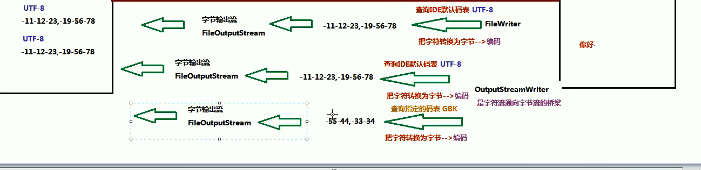

#### 2.4.1 InputStreamReader

~~~java
Reader的子类，可以将InputStream字节流包装成一个Reader字符流！
~~~

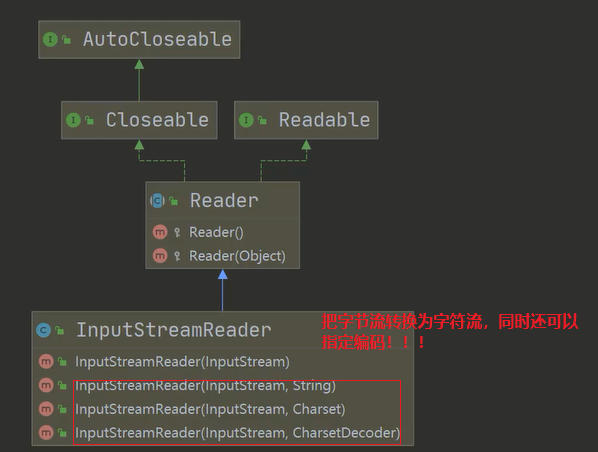

~~~java
package com.atguigu.spring.tx.test;


import java.io.*;

public class Test2 {

    public static void main(String[] args) throws Exception {
        InputStream  fi = new FileInputStream("e:\\我是GBK格式的编码.txt");
        // 把FileInputStream 转为 InputStreamReader,同时指定编码GBK
        InputStreamReader is = new InputStreamReader(fi,"GBK");
        // 由于InputStreamReader是Reader的子类，我们可以把它再包装成一个高效的字符缓冲流管道！
        BufferedReader reader = new BufferedReader(is);
        // 读取
        String s = reader.readLine();
        System.out.println(s);
        // 关闭的时候关闭外层流就可以!
        reader.close();
    }
}
~~~

**注意：关键是包装的时候指定编码格式！**

#### 2.4.2 OutputStreamWriter

~~~java
Writer的子类。可以将一个OutputStream字节流包装成一个Writer字符流！
~~~


~~~java
package com.atguigu.spring.tx.test;


import java.io.*;

/**
 * 把FileOutPutStream 字节流，转换为字符流OutputStreamWriter
 * 指定编码的格式：gbk/utf-8/utf8
 *
 */
public class Test2 {

    public static void main(String[] args) throws Exception {
        String filePath = "e:\\hsp.txt";
        String charSet = "gbk";
        OutputStreamWriter osw = new OutputStreamWriter(new FileOutputStream(filePath),charSet);
        osw.write("hi,韩顺平教育");
        osw.close();
        System.out.println("按照"+charSet+"的形式保存文件成功！");
    }
}


~~~

### 2.5 打印流

**打印流只有输出流没有输入流！字节打印流：PrintStream 字符打印流：PrintWriter**

可以将信息打印到文件中，流中等

#### 2.5.1 PrintStream

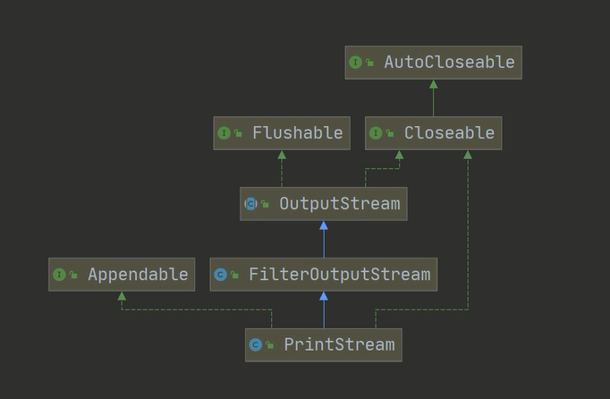

~~~java
package com.atguigu.spring.tx.test;


import java.io.*;

/**
 * 字节打印流 PrintStream 的使用
 */
public class Test2 {
    public static void main(String[] args) throws Exception {
        PrintStream out = System.out;
        /**
         * 在默认的情况下，PrintStream 输出数据的位置是 标准输出，即显示器
         * 但是它本质是一个输出流，所以我们可以改变它输出的位置！
         */
        // 因为print底层是使用write,所以我们可以直接调用write进行打印输出！
        out.println("jhon hello!");
        out.write("你好韩顺平".getBytes());
        out.close();
    }
}


~~~

**修改打印流输出的位置！**

~~~java
package com.atguigu.spring.tx.test;


import java.io.*;

/**
 * 字节打印流 PrintStream 的使用
 */
public class Test2 {
    public static void main(String[] args) throws Exception {
        PrintStream out = System.out;
        /**
         * 在默认的情况下，PrintStream 输出数据的位置是 标准输出，即显示器
         * 但是它本质是一个输出流，所以我们可以改变它输出的位置！
         */
        // 因为print底层是使用write,所以我们可以直接调用write进行打印输出！
        out.println("jhon hello!");
        out.write("你好韩顺平".getBytes());

        // 我们可以修改打印流的输出的位置！
        /**
         * 此时输出修改到了"e:\\f1.txt"
         *
         */
        System.setOut(new PrintStream("e:\\f1.txt"));
        System.out.println("hello 韩顺平！");
        out.close();
    }
}


~~~

#### 2.5.2 PrintWriter

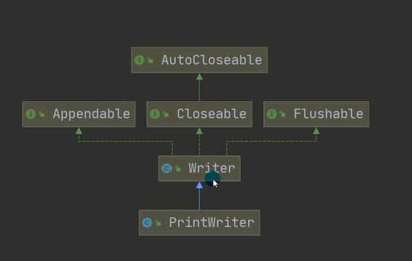

~~~java
package com.atguigu.spring.tx.test;


import java.io.*;

public class Test2 {
    public static void main(String[] args) throws Exception {
        PrintWriter pw = new PrintWriter(System.out);
        pw.print("hi,北京你好");
        pw.close();
    }
}
~~~

**修改字符打印流的输出位置**

~~~java
package com.atguigu.spring.tx.test;


import java.io.*;

public class Test2 {
    public static void main(String[] args) throws Exception {
        PrintWriter pw = new PrintWriter(new FileWriter("e:\\f2,txt"));
        pw.print("hi,北京你好");
        pw.close();// flush+关闭流，才会将数据写入到文件
    }
}
~~~

### 2.6 Properties属性集

>java.util.Properties集合 extends Hashtable<k,v>
>
>properties类表示一个持久的属性集。Properties可保存在流中或从流中加载
>
>Properties集合是唯一一个和IO流结合的集合！他是一个双列集合，键和值都是字符串！
>
>他的每一个键和值都是**字符串！**

**方法**

|      | 方法                                        | 说明                                                    |
| ---- | ------------------------------------------- | ------------------------------------------------------- |
| 1    | Object setProperty(String key,String value) | 底层调用Hashtable的方法put                              |
| 2    | Object getProperty(String key)              | 通过key找到value值，此方法相当于map集合中的get(key)方法 |
| 3    | Set<String> stringPropertyNames()           | 返回此属性列表的键集                                    |

|      | 方法                                       | 说明                                                         |
| ---- | ------------------------------------------ | ------------------------------------------------------------ |
| 1    | `load(InputStream inStream)`               | 从输入字节流读取属性列表（键和元素对                         |
| 2    | `load(Reader reader)`                      | 以简单的线性格式从输入字符流读取属性列表（关键字和元素对）。 |
| 3    | `store(OutputStream out, String comments)` | 此属性列表（键和元素对）写入此 `Properties`表中，以适合于使用 [`load(InputStream)`](../../java/util/Properties.html#load-java.io.InputStream-)方法加载到  `Properties`表中的格式输出流。 |
| 4    | `store(Writer writer, String comments)`    | 将此属性列表（键和元素对）写入此 `Properties`表中，以适合使用 [`load(Reader)`](../../java/util/Properties.html#load-java.io.Reader-)方法的格式输出到输出字符流。 |

>可以使用Properties集合的方法store(),把集合的临时数据，持久化到银盘中存储
>
>可以使用Properties集合的方法load(),把银盘中的保存的文件（键值对），读取到集合中使用

~~~java
package com.atguigu.spring.tx.test;


import java.io.*;
import java.util.Properties;
import java.util.Set;

public class Test2 {
    public static void main(String[] args) throws Exception {
       show01();
    }

    /**
     * 使用Properties集合存储数据，遍历去除Properties集合的数据
     * Properties集合是一个双列集合，key和value默认都是字符串
     * properties集合有一些操作字符串的特有方法
     *       Object setProperty(String key,String value),底层调用Hashtable的方法put
     *       Object getProperty(String key),通过key找到value值，此方法相当于map集合中的get(key)方法
     *       Set<String> stringPropertyNames():返回此属性列表的键集
     */
    private static void show01() {
        Properties pro = new Properties();
        pro.setProperty("1","赵丽颖");
        pro.setProperty("2","迪丽热巴");
        pro.setProperty("3","古力娜扎");
        Set<String> set = pro.stringPropertyNames();
        // 遍历Set集合，去除Properties集合的每一个键
        for (String key : set) {
            String value = pro.getProperty(key);
            System.out.println(key+"="+value);
        }
    }

}
~~~

##### 2.6.1 持久化数据

>1.通过下面两个方法可以持久化集合的数据到硬盘：
>
>`store(OutputStream out, String comments)` ：自己输出流，不能写中文
>
>`store(Writer writer, String comments)` ：字符输出流，可以写中文
>
>2.String comments：
>
>注释：用来解释说明保存的文件用途，不能使用中文，会产生乱码，默认是Unicode编码，一般使用空字符串

~~~java
package com.atguigu.spring.tx.test;


import java.io.*;
import java.util.Properties;
import java.util.Set;

public class Test2 {
    public static void main(String[] args) throws Exception {
        // 1.创建Properties集合对象，存储数据
        Properties pro = new Properties();
        pro.setProperty("1","赵丽颖");
        pro.setProperty("2","迪丽热巴");
        pro.setProperty("3","古力娜扎");
        // 2.创建字节输出流/字符输出流对象，构造方法中绑定要输出的目的地
        FileWriter fo  = new FileWriter("e:\\ksh.txt");
        // 3.使用Properties集合的store方法，将集合中的临时数据，持久化写入到硬盘存储
        pro.store(fo,"save date");
        // 4.释放资源
        fo.close();
    }

}
~~~

##### 2.6.2 读取保存的数据

>Propperties集合的load方法，可以将硬盘中的数据读取到集合中使用！
>
>`load(InputStream inStream)` ：字节输入流，不能读取含有中文的键值对
>
>`load(Reader reader)`  ：字符输入流，可以读取含有中文的键值对

~~~java
注意：
    1.存储键值对的文件中，键与值默认链接符号可以使用=,空格
    2.存储键值对的文件中，可以使用#进行注释，被注释的键值对不会再被读取
    3.存储键值对的文件，键值对默认都是字符串，不用加“”
~~~

~~~java
package com.atguigu.spring.tx.test;


import java.io.*;
import java.util.Properties;
import java.util.Set;


public class Test2 {
    public static void main(String[] args) throws Exception {
        // 1.创建Properties集合对象
        Properties pro = new Properties();
        // 2.使用Properties集合对象中的方法load读取保存的键值对文件
        FileReader fr = new FileReader("e:\\ksh.txt");
        pro.load(fr);
        // 3.遍历Properties集合
        Set<String> set = pro.stringPropertyNames();
        for (String key : set) {
            String value = pro.getProperty(key);
            System.out.println(key+"="+value);
        }
    }
}
~~~

