# 集合

## 1.集合的概述

 ~~~java
集合是一个大小可变的容器
集合中的每一个数据称为一个元素，数据=元素
集合的特点：类型可以不确定，大小不固定。集合有很多种，不同集合的特点和使用场景不同！
 ~~~

>对于数组而言：类型和长度一旦定义出来就都固定啦！
>
>而集合类似于气球！

~~~markdown
# java中单列集合的代表是Collection,Collection集合接口是Java单列集合中的祖宗！
~~~

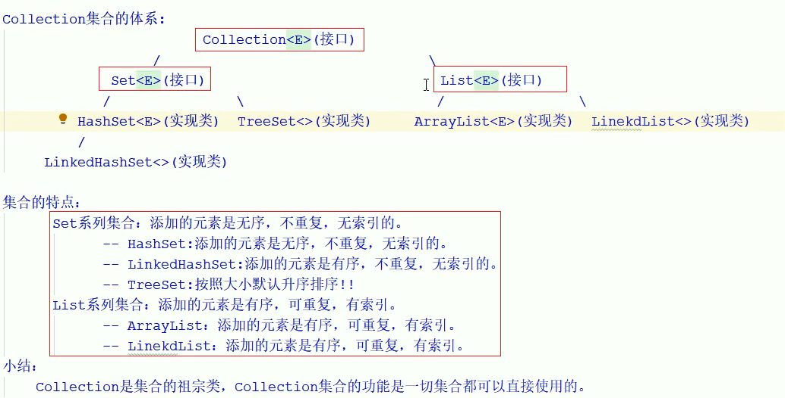

>有序指定的是添加顺序，排序指的是大小顺序！
>
>LinkedHashSet是有序，按照添加先后顺序排列
>
>TreeSet是无序的，不是按照添加先后顺序，而是按照元素的大小顺序！

## 2. Collection接口的常见 API

~~~java
Collection接口是集合的祖宗接口，它的功能是全部集合都可以继承使用的
Collection API如下：
    boolean add(E e):把给定的对象添加到当前集合中去
    void clear():清空集合中所有元素
    boolean remove(E e):把给定的对象在当前集合中删除
    boolean contains(Object obj):判断当前集合是否包含给定的对象
    boolean isEmpty()：判断当前集合是否为空
    int size():返回集合中元素的个数
    Object[] toArray():把结合中的元素，存储到数组中去！
    boolean addAll(Collection c)：将集合c中的元素导入到调用集合对象中！
~~~

~~~~java
package pack2;

import java.util.ArrayList;
import java.util.Arrays;
import java.util.Collection;
import java.util.HashSet;

public class CollectiomDemo {
    public static void main(String[] args) {
        Collection<String> lists = new HashSet<String>();
        // 1.添加元素，添加成功返回true
        System.out.println(lists.add("贾乃亮"));
        System.out.println(lists.add("贾乃亮"));
        System.out.println(lists.add("王宝强"));
        System.out.println(lists.add("小明"));
        System.out.println(lists);
        // 2.清空集合中的元素
        /*lists.clear();
        System.out.println(lists);*/
        // 3.判断集合是否为空，是空返回true,反之false
        System.out.println(lists.isEmpty());
        //4.获取集合元素的大小
        System.out.println(lists.size());
        //5.判断集合是否包含某个元素
        System.out.println(lists.contains("王宝强"));
        //6.删除某个元素，如果又多个重复元素则默认删除第一个！
        lists.remove("小明");
        System.out.println(lists.size());
        System.out.println(lists.contains("小明"));
        //7.把集合转换成数组
        Object[] obj = lists.toArray();
        System.out.println(Arrays.toString(obj));
        System.out.println("================拓展==================");
        Collection<String> c1 = new ArrayList<String>();
        c1.add("hehe");
        c1.add("haha");
        Collection<String> c2 =new ArrayList<String>();
        c2.add("wawa");
        c1.addAll(c2);//将集合c2的元素倒入到c1集合中
        System.out.println(c1);
        System.out.println(c2);
    }
}

~~~~

## 3.单列集合的遍历方式

~~~java
遍历就是将集合中的元素一个一个的访问一遍
    Collection集合的遍历方式是全部单列集合都可以使用的，所以我们要学习他：
    他有三种遍历方式：
    1.迭代器
    2.foreach(增强for循环)
    3.Lambda表达式
~~~

### 3.1 迭代器遍历

- **迭代**：Collection集合的通用获取方式，在获取元素之前先判断集合有没有元素，如果有就把这个元素取出来，继续再判断，如果还有就再继续取出来，一致把集合中的所有元素全部取出来，这种取数方式称为迭代！

~~~java
// 1.获取集合的迭代器，该方法如下：
Iterator<E> iterator()：获取集合对应的迭代器，用来遍历集合中的元素的！
//2.迭代器的超女公用方法：
E next():返回迭代的下一个元素
boolean hasNext():如果仍有元素可以迭代，则返回true
~~~

~~~java
package pack2;

import java.util.ArrayList;
import java.util.Collection;
import java.util.Iterator;

public class CollectionDemo2 {
    public static void main(String[] args) {
        Collection<String> list1 = new ArrayList();
        list1.add("赵敏");
        list1.add("校招");
        list1.add("珠儿");
        list1.add("周芷若");
        System.out.println(list1); // [赵敏, 校招, 珠儿, 周芷若]
        //迭代器遍历集合步骤
        //1.获取集合迭代器完成迭代操作
        Iterator<String> it = list1.iterator();
        //2.使用while循环遍历:必须问一次取一次！
            // 2.1 判断是否有下一个
        while(it.hasNext()){
            //2.2.取出迭代器指向的元素
            String el  = it.next();
            System.out.println(el);
        }
    }
}

~~~

### 3.2 增强for（forEach）遍历

**可以遍历集合或者数组**

~~~java
// foreach遍历可以遍历集合或者数组，当foeeach遍历集合时，可以看成是迭代器的简化形式关键是记住格式！
格式：
    for(被便办理集合或者数组中的元素的类型 变量名 ： 北边遍历集合或者数组){
        ...
    }
~~~

~~~java
public class CollectionDemo2 {
    public static void main(String[] args) {
        Collection<String> list1 = new ArrayList();
        list1.add("赵敏");
        list1.add("校招");
        list1.add("珠儿");
        list1.add("周芷若");
        System.out.println(list1); // [赵敏, 校招, 珠儿, 周芷若]
        for(String a : list1){
            System.out.println(a);
        }
    }
}
~~~

### 3.2 lambda表达式遍历

~~~java
package pack2;

import java.util.ArrayList;
import java.util.Collection;
import java.util.Iterator;

public class CollectionDemo2 {
    public static void main(String[] args) {
        Collection<String> list1 = new ArrayList();
        list1.add("赵敏");
        list1.add("校招");
        list1.add("珠儿");
        list1.add("周芷若");
        System.out.println(list1); // [赵敏, 校招, 珠儿, 周芷若]
        list1.forEach(s -> {
            System.out.println(s);
        });
    }
}
~~~

## 4.数据结构

### 4.1 基本数据结构

~~~java
集合是基于数据结构做出来的，不同的集合底层会采用不同的数据结构
不同的数据结构，功能和作用是不一样的！

数据结构是指数据以什么样的方式组织在一起，不同的数据结构，增删改的性能是不一样的
数据存储的常用结构有：栈，队列，数组，链表和红黑树！
    ** 队列 queue
    先进先出
    ** 栈 stack
    先进后出，后进先出
    压栈：入栈
    弹栈：出栈
    例如：手枪的弹夹
    ** 线性表(数组)
    元素存在索引
    查询元素快(根据索引快速计算出元素的地址，然后立即定位)
    增删元素慢(创建新数组，迁移元素)，查询元素快
    ** 链表
    元素不是内存中的连续区域
    元素时游离存储的，每个元素会记录下一个元素的地址！
    特点：查询元素慢，增删元素快(对于首尾元素，速度极快，一般是双链表)
~~~


### 4.2 二叉树

树具有的特点：

- 每个节点有个或者多个子节点
- 没有父节点的节点称为根节点，**一个树最多只有一个根节点**
- 每一个非根节点有且仅有一个父节点

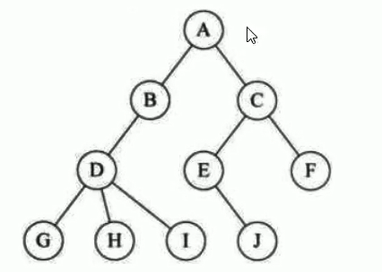

| 名词     | 含义                                                   |
| -------- | ------------------------------------------------------ |
| 节点     | 指树的一个元素                                         |
| 节点的度 | 节点拥有的子树的个数，二叉树的度不超过2                |
| 叶子节点 | 度为0的节点，也称为终端节点                            |
| 高度     | 叶子节点的高度为1，叶子结点的父节点高度为2             |
| 层       | 根节点在第一层，以此类推                               |
| 父节点   | 若一个节点含有子节点，则这个节点称之为其子节点的父节点 |
| 子节点   | 子节点是父节点的下一层节点                             |
| 兄弟节点 | 拥有共同父节点的的节点称为兄弟节点                     |

**1、二叉查找树**

特点：

- 左子树的所有子节点均小于等于他的根节点的值

- 右子树的所有节点的值均大于等于他的根节点的值

- 每一个子节点最多有两个子树

  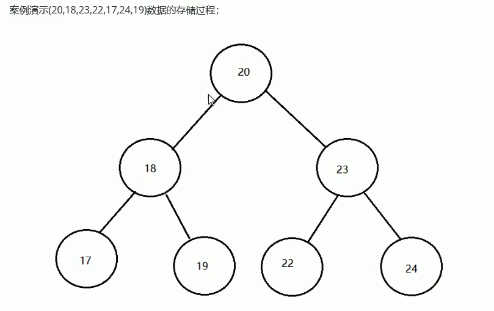

  **增删改查性能都很好！**

`树实际上有一个进化的过程：树->二叉树->二叉排序树->平衡二叉树->红黑树`

为什么会有上述进化：

**二叉排序树存在的问题："瘸子现象"，此时需要平衡：不要让树太高，树高性能必然下降。**

**2、平衡二叉树**

基于查找二叉树，但是不让树太高，尽量让树的元素均衡分布，这个综合性能就高了

规则：**左右两个子树的高度差的绝对值不能超过1，并且左右两个子树都是一颗平衡二叉树**

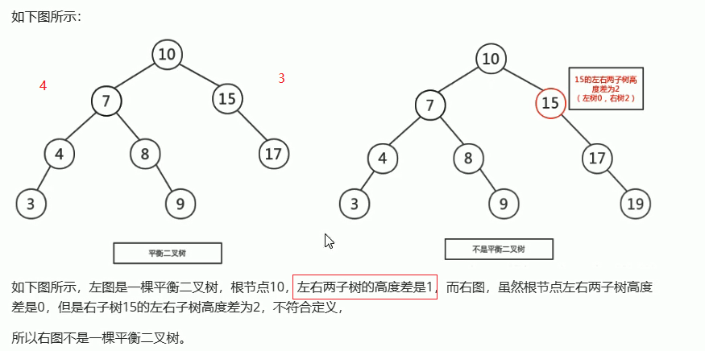

**旋转**

在构建一棵平衡二叉树的过程中，当有新的节点需要插入时，检查是否因插入破坏了树的平衡，如果是，则需要旋转去改变树的结构！

左旋：

**左旋就是将节点的右分支往左拉，右子节点变成父节点，并且把晋升之后的多余的左子节点让出给降级节点的右子节点**

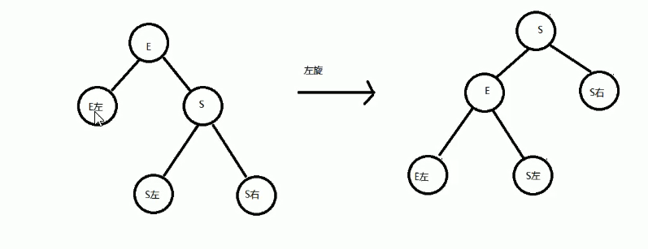

右旋：

**右旋就是将节点的左分支往右拉，左子节点变成父节点，并且把晋升之后的多余的右子节点让出给降级节点的左子节点**

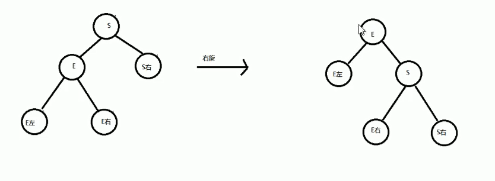

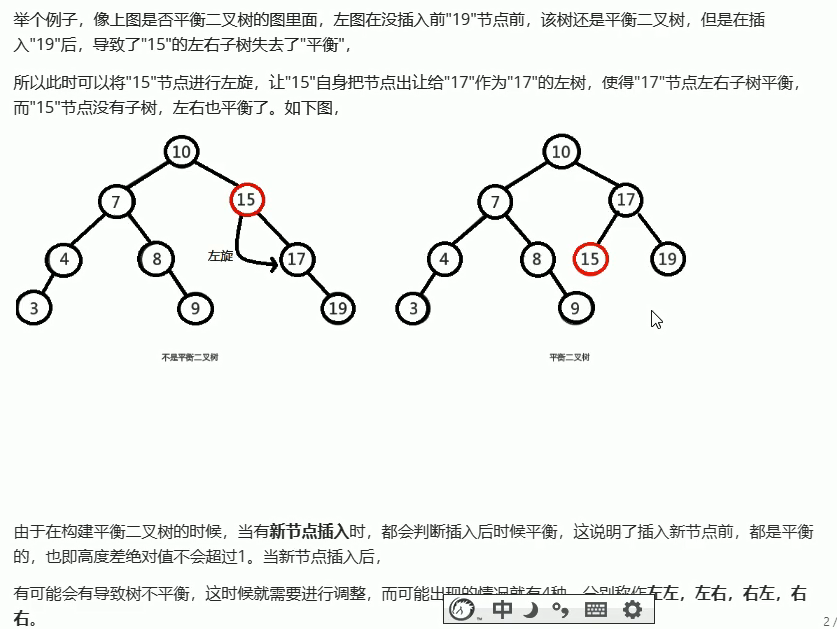

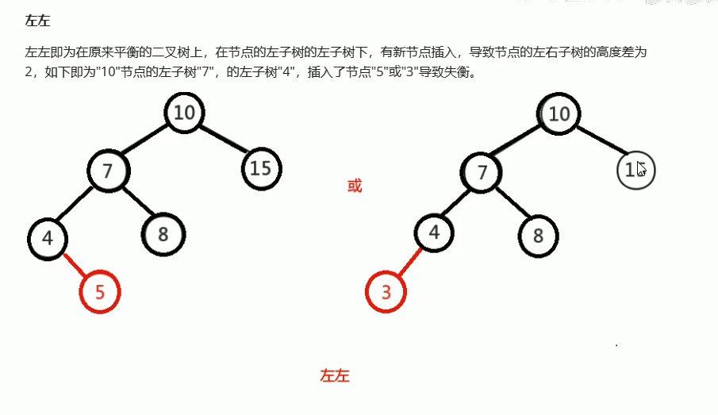

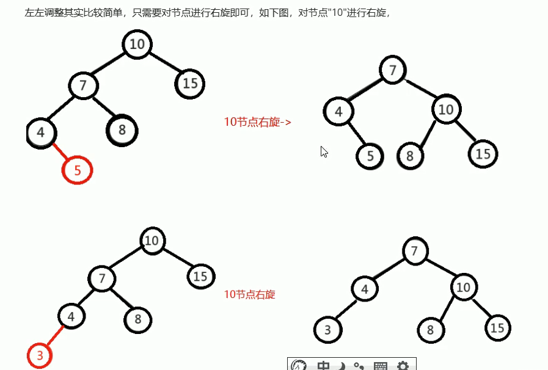


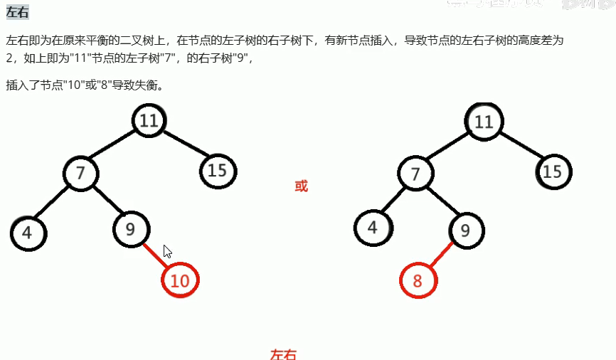

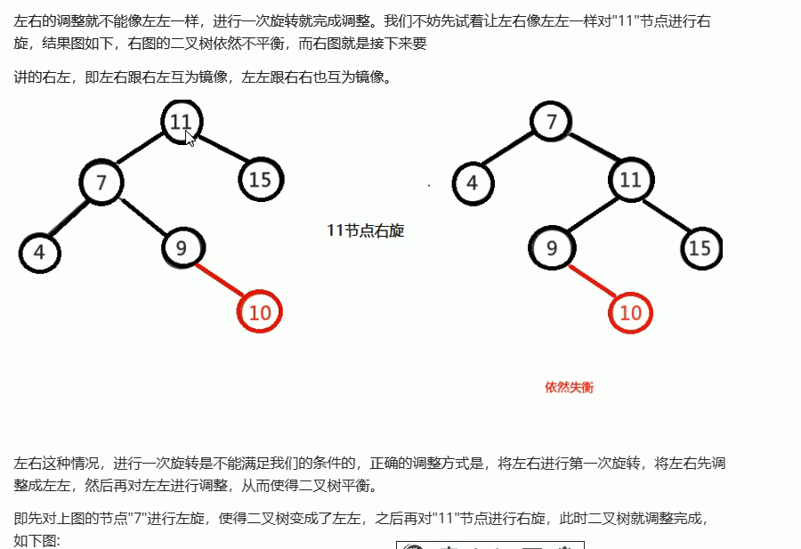

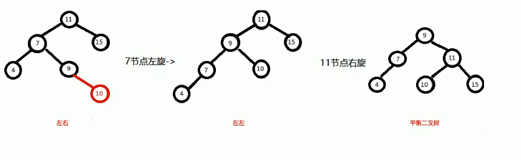

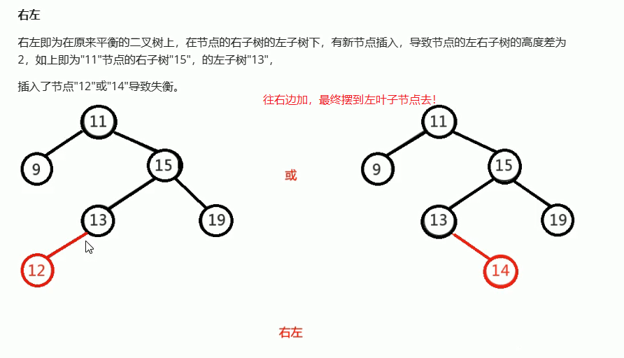

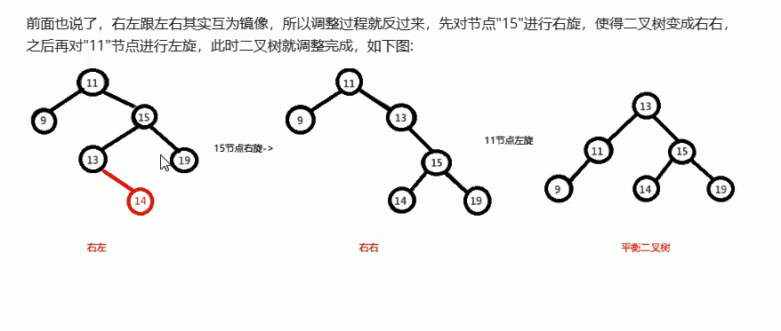

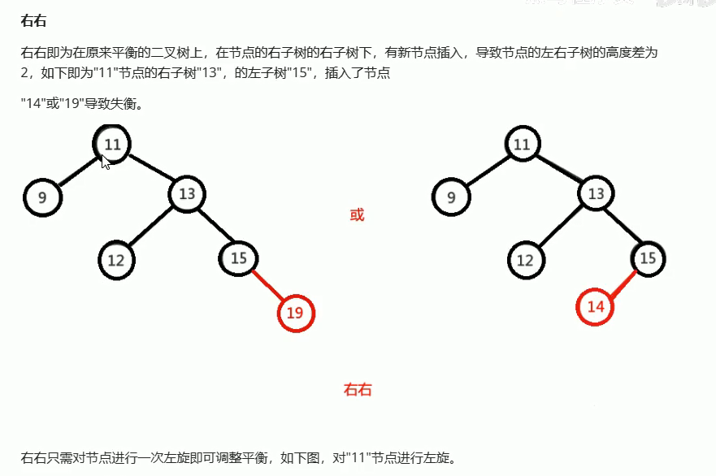

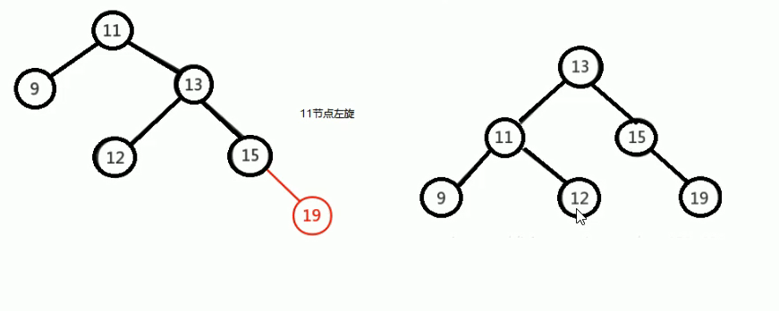

## 5.List集合

### 5.1 ArrayList集合

ArrayList集合底层是基于数组存储数据结构的，查询快，增删慢。

~~~java
 * -- public void add(int index,E e) :添加元素到指定位置掌中去
 * -- public E get(int index) :返回集合中指定位置的元素
 * -- public E remove(int index) ：移除列表中指定位置的元素，返回被移除的元素
 * -- public E set(int index ,E e) :用指定元素替换指定位置的元素
~~~

~~~java
package pack2;

import java.util.ArrayList;
import java.util.List;

/**
 * -- public void add(int index,E e) :添加元素到指定位置掌中去
 * -- public E get(int index) :返回集合中指定位置的元素
 * -- public E remove(int index) ：移除列表中指定位置的元素，返回被移除的元素
 * -- public E set(int index ,E e) :用指定元素替换指定位置的元素
 */
public class ArrayDemo {
    public static void main(String[] args) {
        List<String> list  = new ArrayList<String>();
        // 继承自Collection接口的方法
        list.add("java1");
        list.add("java2");
        System.out.println(list);
        // list接口特有：在某个索引位置插入元素
        list.add(2,"张三丰");
        System.out.println(list);
        // 根据索引拿元素
        System.out.println( list.get(0));
        // 根据索引删除元素
        String remove = list.remove(2);
        System.out.println(remove); // 张三丰
        // 根据索引修改元素
        list.set(1,"mybatis");
        System.out.println(list);

    }
}
~~~

**List集合由于与索引，故多了一种遍历方式：for循环**

~~~java
package pack2;

import java.util.ArrayList;
import java.util.List;

public class ArrayDemo2 {
    public static void main(String[] args) {
        List<String> list = new ArrayList<String>();
        list.add(0,"hehe");
        list.add(1,"haha");
        list.add(2,"wawa");
        System.out.println(list.size());
        for (int i = 0; i < list.size(); i++) {
            System.out.println(list.get(i));
        }
    }
}
~~~

### 5.2 LinkedList集合

实际上list集合还有实现类Vector,不过被淘汰啦

>LinkedList集合特点：语有序，有索引，元素可重复
>
>Linkedlist集合底层是基于双链表的，查询慢，增删快！它定位前后元素，删除前后元素最快！
>
>LinkedList集合除了拥有List集合全部功能，还拥有操作首尾元素的特殊功能！

~~~java
 * -- public void addFirst(E e):将指定元素插入此列表的开头
 * -- public void addLast(E e):将指定元素插入此列表的结尾
 * -- public E getFirst():返回此列表的第一个元素
 * -- public E getLast():返回此列表的最后一个元素
 * -- public E removeFirst():移除并返回此列表的第一个元素
 * -- public E removeLast():移除并返回此列表的最后一个元素
 * -- public E pop():从此列表所表示的栈堆处弹出一个元素
 * -- public void push(E e) :将元素推入此列表表示的栈堆
~~~

~~~java
// 源码
public void push(E e) {
        addFirst(e);
    }

public E pop() {
        return removeFirst();
    }
~~~

~~~java
package pack2;

import java.util.LinkedList;

/**
 * -- public void addFirst(E e):将指定元素插入此列表的开头
 * -- public void addLast(E e):将指定元素插入此列表的结尾
 * -- public E getFirst():返回此列表的第一个元素
 * -- public E getLast():返回此列表的最后一个元素
 * -- public E removeFirst():移除并返回此列表的第一个元素
 * -- public E removeLast():移除并返回此列表的最后一个元素
 * -- public E pop():从此列表所表示的栈堆处弹出一个元素
 * -- public void push(E e) :将元素推入此列表表示的栈堆
 */
public class LinkedDemo {
    public static void main(String[] args) {
        // Linked做一个队列
        LinkedList<String> queue = new LinkedList<String>();
        // 入队
        queue.addLast("1hao");
        queue.addLast("2hao");
        queue.addLast("3hao");
        queue.addLast("4haao");
        System.out.println(queue);
        // 出队！
        System.out.println(queue.removeFirst());
        System.out.println(queue.removeFirst());
        System.out.println(queue);

        // Linked做一个栈
        LinkedList<String> stack = new LinkedList<String>();
        // 压栈
        stack.push("1ke");
        stack.push("2ke");
        stack.push("3ke");
        stack.push("4ke");
        System.out.println(stack); // [4ke, 3ke, 2ke, 1ke]
        // 弹栈
        System.out.println(stack.pop()); // 4ke

    }
}
~~~

## 6.Set集合

>HashSet:无序，不可重复，无索引
>
>LinkedHashSet:有序，不可重复，无索引，是HashSet的子类
>
>TreeSet：不重复，无索引，按照大小默认升序排列,可排序集合！

~~~java
package pack2;

import java.util.HashSet;
import java.util.Set;

public class SetDemo {
    public static void main(String[] args) {
        //经典写法：多态！
        Set<String> set =new HashSet<String>();
        set.add("mybatis");
        set.add("mysql");
        set.add("spring");
        set.add("java");
        set.add("spring");
        System.out.println(set); // [spring, java, mybatis, mysql]
    }
}
//无序值得的添加顺序无序！
~~~

### 6.1 Set集合去重的原因

~~~java
1.对于有值特性的，如String,包装类，Set集合可以直接去重判断。
2.对于引用数据类型，Set集合按照如下流程进行去重判断:
  ** 2.1 Set集合会先让凉凉对象，先调用自己的hashCode()方法得到彼此的哈希值(所谓的内存地址)
      然后比较两个对象的哈希值是否相同，如果不相同则直接认为两个对象不重复！
  ** 2.2 如果哈希值相同，会继续让两个对象进行equals比较内容如果相同认为真的重复啦，如果不相同
      认为不重复！
~~~

~~~java
// hashCode()方法是Object类的方法，每个类每个对象都有这个方法，得到int值，相当于是内存地址，不是真的内存地址！
~~~

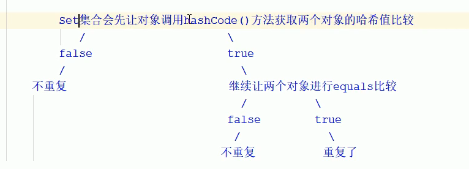

>如果希望Set集合认为两个对象只要内容一样就重复啦，必须重写hashCode()方法和equals()方法！

### 6.2 Set集合元素无序的原因

>根本原因是底层采用了Hash表来存储元素！
>
>JDK1.8之前：数组+链表+(哈希算法)
>
>JDK1,8之后：数组+链表+红黑树+(哈希算法)
>
>当链表长度超过阈值`8`时，将链表转化为红黑树，这样大大减少了查询时间！

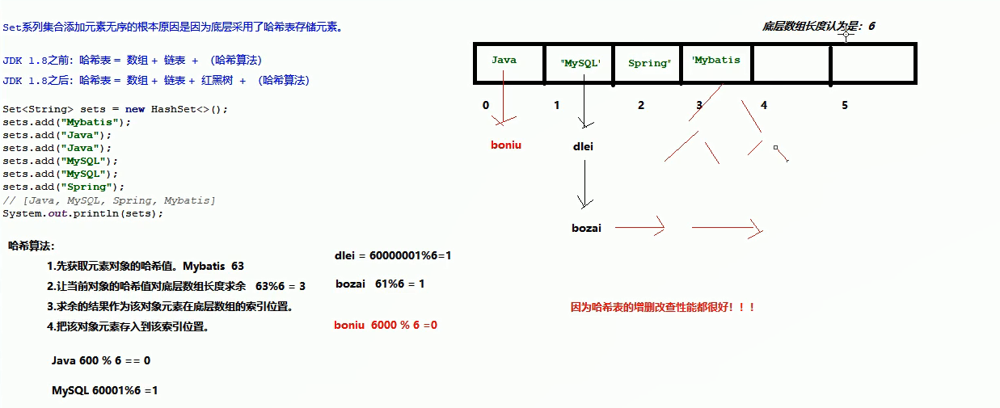

>Set集合是基于哈希表存储数据的，他的增删改查性能都很好，但是他是无序的！

### 6.3 补充

~~~java
对象哈希值概述：
    ** 概念：
    每一个独犀象都会有一个哈希值，默认就是对象在内存中的地址值，哈希值就是一个十进制整数，可以理解为是都西昂的唯一标识！！！
    ** 如何获取：
    通过对象调用hashCode()方法获取，声明如下：
    int hashCode();返回该对象的哈希码值！
    public native int hashCode();
    ** String的哈希值
    字符串的哈希值根据字符串的内容来计算的哈希值！
    结论1：只要字符串的内容相同，哈希值一定相同！
    结论2：字符串的内容不同，哈希值也可能不同！ 如：Aa BB
哈希值是对象存储到哈希表的重要依据！！！
~~~

~~~java
package pack2;

public class Apple {
    private String name ;
    private Double price;
    private String color;

    public Apple() {
    }

    public Apple(String name, Double price, String color) {
        this.name = name;
        this.price = price;
        this.color = color;
    }

    public String getName() {
        return name;
    }

    public void setName(String name) {
        this.name = name;
    }

    public Double getPrice() {
        return price;
    }

    public void setPrice(Double price) {
        this.price = price;
    }

    public String getColor() {
        return color;
    }

    public void setColor(String color) {
        this.color = color;
    }

   /* @Override
    public String toString() {
        return "Apple{" +
                "name='" + name + '\'' +
                ", price=" + price +
                ", color='" + color + '\'' +
                '}';
    }*/
}

~~~

```java
package pack2;

import java.applet.AppletStub;
import java.util.HashSet;
import java.util.Set;

public class SetDemo {
    public static void main(String[] args) {
       Set<Apple> apples = new HashSet<Apple>();
       Apple a1 = new Apple("红富士",59.9,"红色");
       Apple a2 = new Apple("阿克苏",39.9,"青红色");
       Apple a3 = new Apple("阿克苏",39.9,"青红色");
       int i = a1.hashCode();
       System.out.println(i); // 460141958
       System.out.println(a1); // pack2.Apple@1b6d3586
       apples.add(a1);
       apples.add(a2);
       apples.add(a3);
       System.out.println(apples);
    }
}
```

~~~java      1. 什么是哈希表
JDK1.8之前：数组+链表
JDK1.8之后：数组+链表+红黑树
       2. 哈希表存储过程分析
          每存入一个新的元素都要走以下五步
         (1)调用对象的hashCode()方法，获得要存储元素的哈希值。
         (2)将哈希值与表的长度(即数组的长度)进行求余运算得到一个整数值，该值就是新元素要存放的位置(即是索引值)。
             * 如果索引值对应的位置上没有存储任何元素，则直接将元素存储到该位置上。
             * 如果索引值对应的位置上已经存储了元素，则执行第3步。
         (3)遍历该位置上的所有旧元素，依次比较每个旧元素的哈希值和新元素的哈希值是否相同。
             * 如果有哈希值相同的旧元素，则执行第4步。
             * 如果没有哈希值相同的旧元素，则执行第5步。
         (4)比较新元素和旧元素的地址是否相同
             * 如果地址值相同则用新的元素替换老的元素。停止比较。
             * 如果地址值不同，则新元素调用equals方法与旧元素比较内容是否相同。
                 * 如果返回true，用新的元素替换老的元素，停止比较。
                 * 如果返回false，则回到第3步继续遍历下一个旧元素。
         (5)说明没有重复，则将新元素存放到该位置上并让新元素记住之前该位置的元素。
~~~

>先比较哈希值，在比较地址值，最后比较内容！

~~~markdown
# 1.Set底层初始容量是16，加载因子是0.75
# 2.扩容以后再存储的过程叫"再哈希"
~~~

### 6.4 LinkedHashSet集合

>是HashSet的子类，元素有序，不重复，无索引
>
>底层依然是使用哈希表存储元素，但是每个元素都额外带一个链来维护添加顺序
>
>不管增删查快，还有序。但是多了一个链会占用内存空间，而且不允许重复，无索引！

### 6.5 TreeSet集合

>不重复，无索引，按照大小默认升序排序
>
>TreeSet集合称为排序`不重复集合`，可以对元素进行默认的升序排序！

~~~java
package pack2;

import java.util.Set;
import java.util.TreeSet;

public class TreeSetDemo {
    public static void main(String[] args) {
        // TreeSet结合：无序可排序集合！对元素默认进行升序！
        Set<Double> scores = new TreeSet<Double>();
        scores.add(33.4);
        scores.add(12.1);
        scores.add(0.1);
        scores.add(100.0);
        System.out.println(scores); // [0.1, 12.1, 33.4, 100.0]
    }
}
// 如果是字符串，按照首字符的表闹进行排序！
~~~

>TreeSet集合自排序的方式：
>
>​      1.有值特性的元素可以直接升序排列(整型，浮点型)
>
>​      2.字符串类型的元素，按照首字符的编号排序
>
>​      3.对于自定义的引用数据类型，TreeSet集合默认无法排序，执行的时候直接报错，因为人家不知道排序规则！

#### 6.5.1 自定义数据类型的排序实现

>对于自定义的引用数据类型，TreeSet集合默认无法排序,
>
>所以我们需要定制排序的大小规则，程序员定义大小规则的方案有两种！
>
>​      `a 直接为对象的类实现比较器规则接口Comparable,重写比较方法`
>
>```
>// Java比较规则:
>// 如果比较者大于被比较者，返回正数
>// 入股比较者小于被比较者，返回负数
>// 如果比较者等于被比较者，返回0
>```
>
>   `b 直接为集合设置比较器对象Comparator,重写比较方法`：`
>
>```
>// Java比较规则:
>// 如果比较者大于被比较者，返回正数
>// 入股比较者小于被比较者，返回负数
>// 如果比较者等于被比较者，返回0
>```

**方案1：对象的类实现比较器规则接口Comparable,重写比较方法`**

~~~java
package pack2;

import java.util.Objects;

public class Employee  implements Comparable<Employee>{
    private String name;
    private double salary;
    private int age;

    // 重写比较规则方法！
    //  e1.compareTo(o)
    //  比较这：this
    //  需求：按照年龄排序
    public int compareTo(Employee e) {
        // Java比较规则:
        // 如果比较者大于被比较者，返回正数
        // 入股比较者小于被比较者，返回负数
        // 如果比较者等于被比较者，返回0
        return this.age - e.age;
    }

    public Employee() {
    }

    public Employee(String name, double salary, int age) {
        this.name = name;
        this.salary = salary;
        this.age = age;
    }

    @Override
    public String toString() {
        return "Employee{" +
                "name='" + name + '\'' +
                ", salary=" + salary +
                ", age=" + age +
                '}';
    }

    @Override
    public boolean equals(Object o) {
        if (this == o) return true;
        if (o == null || getClass() != o.getClass()) return false;
        Employee employee = (Employee) o;
        return Double.compare(employee.salary, salary) == 0 &&
                age == employee.age &&
                Objects.equals(name, employee.name);
    }

    @Override
    public int hashCode() {
        return Objects.hash(name, salary, age);
    }

    public String getName() {
        return name;
    }

    public void setName(String name) {
        this.name = name;
    }

    public double getSalary() {
        return salary;
    }

    public void setSalary(double salary) {
        this.salary = salary;
    }

    public int getAge() {
        return age;
    }

    public void setAge(int age) {
        this.age = age;
    }

}

~~~

~~~java
package pack2;

import java.util.Set;
import java.util.TreeSet;

public class TreeSetDemo {
    public static void main(String[] args) {
        // TreeSet结合：无序可排序集合！对元素默认进行升序！
        Set<Employee> employees = new TreeSet<Employee>();
        employees.add(new Employee("卜崽",6500.0,21));
        employees.add(new Employee("狗贼",7500.0,19));
        employees.add(new Employee("哇哇",6500.0,23));
        System.out.println(employees); // [Employee{name='狗贼', salary=7500.0, age=19}, Employee{name='卜崽', salary=6500.0, age=21}, Employee{name='哇哇', salary=6500.0, age=23}]
    }
}
~~~

**方案二：直接为集合设置比较器对象Comparator,重写比较方法`**

~~~java
package pack2;

import java.util.Objects;

public class Employee{
    private String name;
    private double salary;
    private int age;
    
    public Employee() {
    }

    public Employee(String name, double salary, int age) {
        this.name = name;
        this.salary = salary;
        this.age = age;
    }

    @Override
    public String toString() {
        return "Employee{" +
                "name='" + name + '\'' +
                ", salary=" + salary +
                ", age=" + age +
                '}';
    }

    @Override
    public boolean equals(Object o) {
        if (this == o) return true;
        if (o == null || getClass() != o.getClass()) return false;
        Employee employee = (Employee) o;
        return Double.compare(employee.salary, salary) == 0 &&
                age == employee.age &&
                Objects.equals(name, employee.name);
    }

    @Override
    public int hashCode() {
        return Objects.hash(name, salary, age);
    }

    public String getName() {
        return name;
    }

    public void setName(String name) {
        this.name = name;
    }

    public double getSalary() {
        return salary;
    }

    public void setSalary(double salary) {
        this.salary = salary;
    }

    public int getAge() {
        return age;
    }

    public void setAge(int age) {
        this.age = age;
    }

}

~~~

~~~java
package pack2;

import java.util.Comparator;
import java.util.Set;
import java.util.TreeSet;

public class TreeSetDemo {
    public static void main(String[] args) {
        // TreeSet结合：无序可排序集合！对元素默认进行升序！
        // 直接为集合设置比较器对象Comparator,重写比较方法`
        Set<Employee> employees = new TreeSet<Employee>(new Comparator<Employee>() {
            public int compare(Employee o1, Employee o2) {
                // o1:比较者
                // o2:被比较者
                return o1.getAge()-o2.getAge();
            }
        });
        employees.add(new Employee("卜崽",6500.0,21));
        employees.add(new Employee("狗贼",7500.0,19));
        employees.add(new Employee("哇哇",6500.0,23));
        System.out.println(employees); // [Employee{name='狗贼', salary=7500.0, age=19}, Employee{name='卜崽', salary=6500.0, age=21}, Employee{name='哇哇', salary=6500.0, age=23}]
    }
}
~~~

**注意：如果类和**对象都存在带下规则，默认使用集合自带的规则！

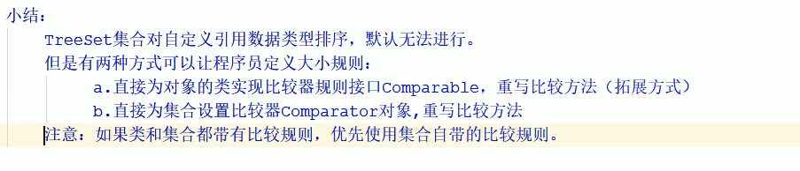

### 6.6 CollectionsG工具类

**Collections是操作集合的工具类，它有几个常用api**

~~~java
1. public static <T> boolean addAll(Collection<? super T> c, T... elements) ：
  给集合对象批量添加元素 ！
2. public static void shuffle(List<?> list)：
  打乱集合顺序！只能操作List集合！
3. public static <T> void sort(List<T> list)：
  将集合中的元素按照默认规则排序 ！只能操作List集合！
4. public static <T> void sort(List<T> list, Comparator<? super T> c)：
  将集合中的元素按照指定规则排序！只能操作List集合！
~~~

~~~java
package pack2;

import java.util.ArrayList;
import java.util.Collection;
import java.util.Collections;

public class CollectionsDemo {
    public static void main(String[] args) {
       Collection<String> lists = new ArrayList<String>();
       // 使用工具类批量添加元素
        /**
         * 参数1：被添加元素的集合
         * 参数2：可变参数，一批元素
         */
       Collections.addAll(lists,"mysql","mybatis","oracle");
       System.out.println(lists); // [mysql, mybatis, oracle]
    }
}
~~~

~~~java
package pack2;

import java.util.ArrayList;
import java.util.Collection;
import java.util.Collections;
import java.util.List;

public class CollectionsDemo {
    public static void main(String[] args) {
       Collection<String> lists = new ArrayList<String>();
       // 1.使用工具类批量添加元素
        /**
         * 参数1：被添加元素的集合
         * 参数2：可变参数，一批元素
         */
       Collections.addAll(lists,"mysql","mybatis","oracle");
       System.out.println(lists); // [mysql, mybatis, oracle]

        // 2.打乱集合的顺序：public static void shuffle(List<?> list)
        // 注意：只能打乱有序的List集合！
        List<Integer> list2 = new ArrayList<Integer>();
        Collections.addAll(list2,1,3,5,7,9,11);
        System.out.println(list2);// [1, 3, 5, 7, 9, 11]
        Collections.shuffle(list2);
        System.out.println(list2);// [5, 11, 1, 7, 9, 3]
    }
}
~~~

~~~java
package pack2;

import java.util.ArrayList;
import java.util.Collections;
import java.util.List;

public class CollectionsDemo {
    public static void main(String[] args) {
      List<Integer> list = new ArrayList<Integer>();
      Collections.addAll(list,11,14,21,9,12,99);
      System.out.println(list); // [11, 14, 21, 9, 12, 99]
      Collections.sort(list);
      System.out.println(list); // [9, 11, 12, 14, 21, 99]
    }
}
~~~

~~~java
/**
 * 字符串按照首字母的编号进行排序！
 * 自定义类型的比较方法API：
 *     -public static <T> void sort(List<T> list);
 *         将集合中的元素按照默认规则排序
 *         对于自定义的引用类型的排序，人家根本不知道怎么排序，直接报错！
 *         如果希望自定义的类型不报错，可以给类提供比较规则Comparable！
 *
 *     - public statc <T>  void sort(List<T> list ,Comparator<? super T>)
 *          将集合中的元素按照指定规则排序，自带比较器
 *          注意，如果类有比较规则，而这有比较器，优先使用比较器
 */
~~~

~~~java
package pack2;

import java.util.ArrayList;
import java.util.Collections;
import java.util.Comparator;
import java.util.List;

/**
 * 字符串按照首字母的编号进行排序！
 * 自定义类型的比较方法API：
 *     -public static <T> void sort(List<T> list);
 *         将集合中的元素按照默认规则排序
 *         对于自定义的引用类型的排序，人家根本不知道怎么排序，直接报错！
 *         如果希望自定义的类型不报错，可以给类提供比较规则Comparable！
 *
 *     - public statc <T>  void sort(List<T> list ,Comparator<? super T>)
 *          将集合中的元素按照指定规则排序，自带比较器
 *          注意，如果类有比较规则，而这有比较器，优先使用比较器
 */
public class CollectionsDemo {
    public static void main(String[] args) {
      List<Employee> list = new ArrayList<Employee>();
      list.add(new Employee("卜崽",6500.0,21));
      list.add(new Employee("狗贼",7500.0,19));
      list.add(new Employee("哇哇",6500.0,23));
      Collections.sort(list, new Comparator<Employee>() {
          public int compare(Employee o1, Employee o2) {
              return o2.getAge() -o1.getAge();
          }
      });
      System.out.println(list); // [Employee{name='哇哇', salary=6500.0, age=23}, Employee{name='卜崽', salary=6500.0, age=21}, Employee{name='狗贼', salary=7500.0, age=19}]
    }
}
~~~

### 6.7 可变参数

~~~java
可变参数用在形参中可以接受多个内容
格式：
    数据类型... 参数名称
作用：
    非常灵活，方便
    可以不传参数
    可以传输多个参数
    可以传递一个数组
 本质：
    在方法内部可变参数就是一个数组
 注意事项：
    一个形参列表中可变参数只有一个！
    可变参数必须放在形参列表的最后面！
~~~

~~~java
package pack2;

import java.util.Arrays;

public class MethodDemo {
    public static void main(String[] args) {
        sum(); // 可以不传参数
        sum(12); // 可以传1个参数
        sum(12,13); // 可以传多个参数
        sum(new int[]{14,16,18}); // 可以传数组
    }
    public static void sum(int...num){
        // 可变参数在方法内部本质上就是一个数组！
        System.out.println("元素长度："+num.length);
        System.out.println("元素内容："+ Arrays.toString(num));
    }
}
~~~

## 7.Map集合

>Map集合是一个双列集合，一个元素有两个值，每个元素叫键值对对象

~~~java
Map集合是一种双列集合，每个元素包含两个值
Map集合的每个元素的格式：key == value (键值对)
Map集合也被称为"键值对集合"
Map集合的完整格式是：
{key1=value1,key2=value2,key3=value3 ...}
~~~

>集合和泛型都只支持泛型，集合完全可以称之为对象容器，存储的都是对象！

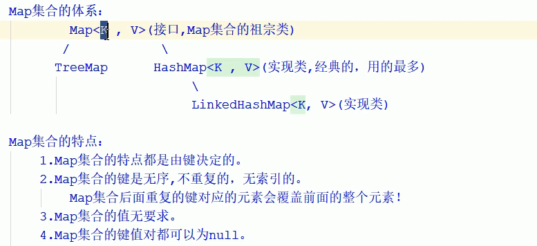

**总结：**

1.map集合的特点都是由键决定的

2.map集合的特点是无序，不重复，无索引的

   map集合**后面的重复的键对应的元素会覆盖前面整个元素！**

3.**map集合的值无要求**

4.**map集合的键值对都可以为null**

>HashMap：按照键是无序，无索引，不重复，值不做要求
>
>LinkedHashMap:元素按照键是有序，不重复，无索引，值不做要求

~~~java
package pack3;

import java.util.HashMap;
import java.util.Map;

public class MapDemo1 {
    public static void main(String[] args) {
        Map<String,Integer> maps = new HashMap<String,Integer>();
        maps.put("wawa",1);
        maps.put("huawei",100);
        maps.put("iPhoneX",5);
        maps.put("wawa",4); //会覆盖前面的
        maps.put(null,null);
        System.out.println(maps); // {null=null, huawei=100, wawa=4, iPhoneX=5}
    }
}
~~~

### 7.1 常用API

~~~java
public V put(K key,V value):把指定的键和指定的值添加到集合中去
public V remove(Object key):把指定的键对应的键值对元素，从map集合中删除，返回被删除的元素
public V get(Object key):根据指定的键，在Map集合中获取对应的值
public Set<K> keySet():获取map集合所有的键，存储到set集合中去
public Collection<> values():获取map集合所有的值，存储到Collection集合中去
public Set<Map.Entry<K,V>> entrySet():获取到map集合中所有的键值对对象的集合(Set集合)
public boolean containKey(Object key):判断集合是否有此键
public boolean containValue(Object value):判断集合是否有此值
public int size():判断集合元素大小
~~~

~~~java
package pack3;

import jdk.nashorn.internal.ir.CallNode;

import java.util.Collection;
import java.util.HashMap;
import java.util.Map;
import java.util.Set;

public class MapDemo1 {
    public static void main(String[] args) {
        Map<String,Integer> maps = new HashMap<String,Integer>();
        maps.put("wawa",1);
        maps.put("huawei",100);
        maps.put("iPhoneX",5);
        maps.put("wawa",4); //会覆盖前面的
        maps.put(null,null);
        System.out.println(maps); // {null=null, huawei=100, wawa=4, iPhoneX=5}
        // 2. 清空集合 clear()
        // maps.clear();
        // System.out.println(maps); // {}
        // 3.判断集合是否为null isEmpty(), 是则返回true;
        System.out.println(maps.isEmpty()); // true
        // 4.根据键获取对应的值 get(Object key)
        Integer value = maps.get("wawa");
        System.out.println(value);
        // 5.根据键删除元素remove(Object key)
        System.out.println(maps.remove("wawa"));
        // 6.判断是否包含某个键 containsKey()
        System.out.println(maps.containsKey("wawa"));
        // 7.判断是否包含某个值 containsValue()
        System.out.println(maps.containsValue(100));
        // 8.获取全部键的集合
        // map集合的键是无序不重复的，所以返回的是一个Set集合
        Set<String> keys = maps.keySet();
        System.out.println(keys); // [null, huawei, iPhoneX]
        // 9.获取全部值的集合： Collections<V> values()
        // 因为值可重复，所以返回的值的集合是Collection
        Collection<Integer> values = maps.values();
        System.out.println(values); // [null, 100, 5]
        for (Integer integer : values) {
            System.out.println(integer);
        }
        // 10.获取集合的大小 size()
        System.out.println(maps.size()); // 3
        // 11.合并其他map集合
        Map<String,Integer> maps2 = new HashMap<String, Integer>();
        maps2.put("手表",23);
        maps2.put("xiaomi",20);
        maps.putAll(maps2); // 会将maps2中的元素都倒入1中去！
        System.out.println(maps); // {null=null, huawei=100, 手表=23, xiaomi=20, iPhoneX=5}
        System.out.println(maps2); // {手表=23, xiaomi=20}
    }
}

~~~

### 7.2 Map集合的遍历

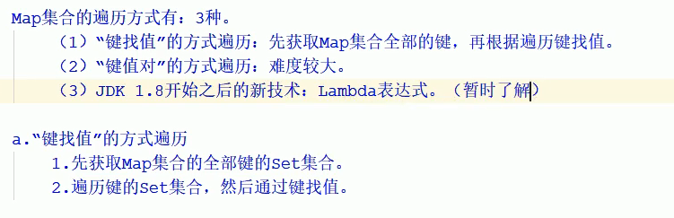

**方式1：通过keySet()键找值**

~~~java
package pack3;


import java.util.Collection;
import java.util.HashMap;
import java.util.Map;
import java.util.Set;

public class MapDemo1 {
    public static void main(String[] args) {
        Map<String,Integer> maps = new HashMap<String,Integer>();
        maps.put("wawa",1);
        maps.put("huawei",100);
        maps.put("iPhoneX",5);
        maps.put("wawa",4); //会覆盖前面的
        maps.put(null,null);
        Map<String,Integer> maps2 = new HashMap<String, Integer>();
        maps2.put("手表",23);
        maps2.put("xiaomi",20);

        // a.通过键找值的方式遍历
        // 获取当前Map集合的全部键的集合
        Set<String> keys = maps.keySet();
        // 通过遍历键获取键对应的值！
        for (String key : keys) {
            // 获取键对应的值
            Integer value = maps.get(key);
            System.out.println(key+"="+value);
        }
    }
}
~~~

**方式2：键值对的方式遍历**

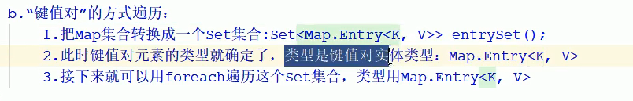

~~~java
package pack3;

import jdk.nashorn.internal.ir.CallNode;

import java.util.Collection;
import java.util.HashMap;
import java.util.Map;
import java.util.Set;

public class MapDemo1 {
    public static void main(String[] args) {
        Map<String,Integer> maps = new HashMap<String,Integer>();
        maps.put("huawei",100);
        maps.put("iPhoneX",5);
        maps.put("wawa",4); //会覆盖前面的
        maps.put(null,null);
        Map<String,Integer> maps2 = new HashMap<String, Integer>();
        maps2.put("手表",23);
        maps2.put("xiaomi",20);

        /**
         *   "键找值"的方式，更加面向对象，代码复杂
         *   "键找值"遍历想把键值对当成一个整体遍历 也就是直接使用foreach遍历
         *   for(被遍历集合类型 变量 : 集合名称){
         *
         *   }
         *   但是发现Map集合的键值对树直接是没有元素类型的，foreach无法直接遍历map集合
         *
         *   把Map集合通过代码Set<Map.Entry<K,V>> entrySet()转化为Set集合
         *
         *   Set<Map.Entry<String, Integer>> entries = maps.entrySet();
         *
         *   此时键值对元素被封装成一个新的类对象，整体就有了类型，类型是 Map.Entry<String, Integer>实体类型
         */
        Set<Map.Entry<String, Integer>> entries = maps.entrySet();
        for (Map.Entry<String, Integer> entry : entries) {
            String key = entry.getKey();
            Integer value = entry.getValue();
            System.out.println(key+"="+value);
        }
    }
}

~~~

~~~java
interface Entry<K,V> {

        K getKey();

        V getValue();

        V setValue(V value);
    ...
}
~~~

**遍历方式3：lambda表达式**

~~~java
package pack3;

import java.util.HashMap;
import java.util.Map;

public class MapDemo1 {
    public static void main(String[] args) {
        Map<String, Integer> maps = new HashMap<String, Integer>();
        maps.put("huawei", 100);
        maps.put("iPhoneX", 5);
        maps.put("wawa", 4); //会覆盖前面的
        maps.put(null, null);
        Map<String, Integer> maps2 = new HashMap<String, Integer>();
        maps2.put("手表", 23);
        maps2.put("xiaomi", 20);
        maps.forEach((k,v) -> {
            System.out.println(k + "=>>" +v);
        });
    }
}
~~~

### 7.3 LinkedHashMap

~~~~java
LinkedHashMap是HashMap的子类
    -- 添加元素按照键有序，不重复的
** HashSet集合相当于是HashMap集合的键不带值
** LinkedHashSet集合相当于是LIinkedHashMap集合的键不带值
~~~~

>底层原理都是一样的，都是基于哈希表存储数据，只是Map集合的键多了一个附属值！

~~~java
public class MapDemo1 {
    public static void main(String[] args) {
        // 有序双列集合
        Map<String, Integer> maps = new LinkedHashMap<String, Integer>();
        maps.put("huawei", 100);
        maps.put("iPhoneX", 5);
        maps.put("wawa", 4); //会覆盖前面的
        maps.put(null, null);
        System.out.println(maps); // {huawei=100, iPhoneX=5, wawa=4, null=null}
    }
}
~~~

### 7.4 TreeMap集合

~~~java
TreeSet集合底层是基于TreeMap
    源码：
     public TreeSet(Comparator<? super E> comparator) {
        this(new TreeMap<>(comparator));
    }
~~~

~~~java
TreeMap集合按照键是可排序的不重复集合。默认排序
TreeMap集合按照键排序的特点和TreeMap是完全一样的！
~~~

~~~java
package pack3;

import java.util.Map;
import java.util.TreeMap;

public class TreeMapDemo {
    public static void main(String[] args) {
        Map<Integer,String> map =new TreeMap<Integer,String>();
        map.put(1000,"香皂");
        map.put(1000,"飞机");
        map.put(2324,"巧克力");
        map.put(100,"手表");
        System.out.println(map);// {100=手表, 1000=飞机, 2324=巧克力}
    }
}
~~~

~~~java
// 拓展
// Double.compare()方法，可以比较double类型，并且返回整形！
int compare =  Double.compare(10.1 , 10);
System.out.println(compare); // 1
int compare2 = Double.compare(10 , 10.1);
System.out.println(compare2); // -1
~~~

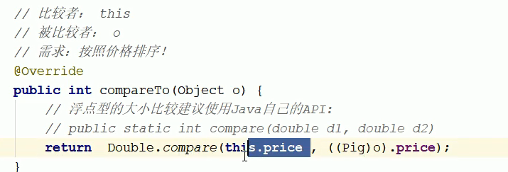

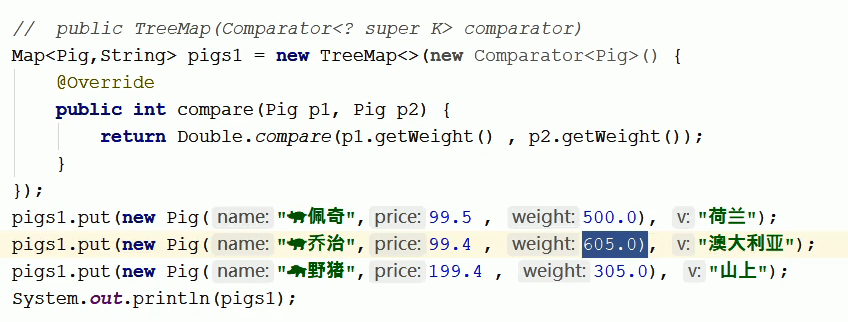

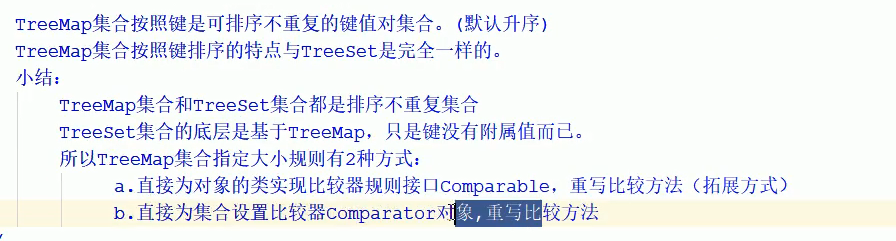

## 8.拓展

### 8.1 冒泡排序

~~~java
核心算法：
    int[] arr = new int[]{55,22,99,88};
思想：
    每次从数组的第一个位置开始两两比较，把较大的元素与较小的元素进行层层交换
    最终把当前最大的一个元素存入到数组的当前末尾。 
~~~

~~~java
实现核心：
    1.首先确定需要冒几轮：一轮只能冒出一个最大值。
    2.每轮两两比较击此
       i(轮次)     j(次数)     每轮次数的规则：数组的长度 -i-1
        0            3
        1            2
        2            1
~~~

~~~java
public class BubbleDemo {
    public static void main(String[] args) {
        int[] arr = new int[]{55,22,99,88};
        //1.定义一个虚幻控制总共需要冒泡几轮：数组的长度-1
        for(int i = 0;i < arr.length;i++){
            // 2.控制每轮比较几次
            for(int j = 0 ; j<arr.length-i-1;j++){
                // 如果当前元素大于后一个元素
                if(arr[j]>arr[j+1]){
                    // 交换位置，大的元素必须后移
                    //定义一个临时变量存储后一个元素
                    int temp  = arr[j+1];
                    arr[j+1] = arr[j] ;
                    arr[j] = temp ;
                }
            }
        }
    }
}
~~~

