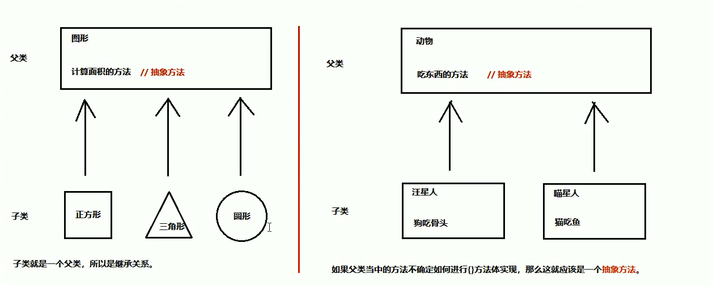
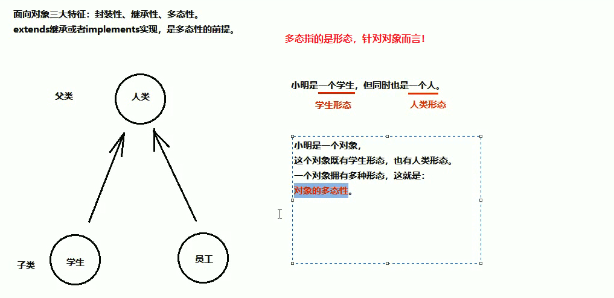
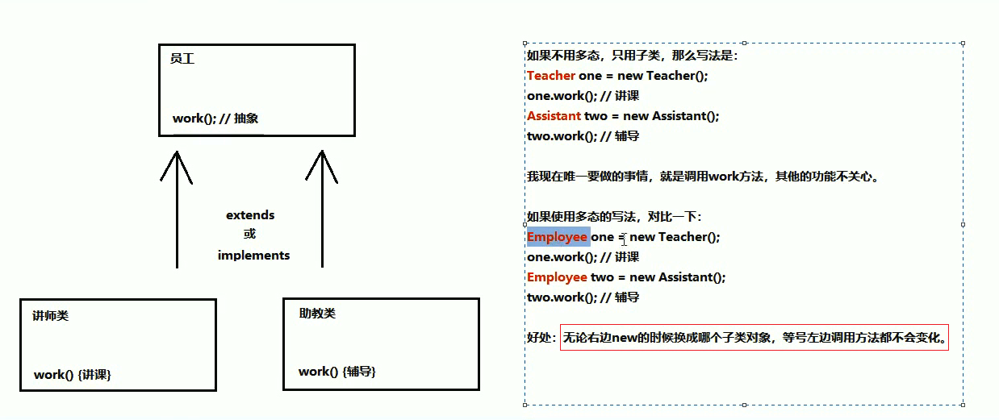
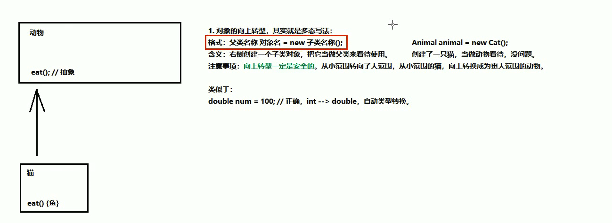
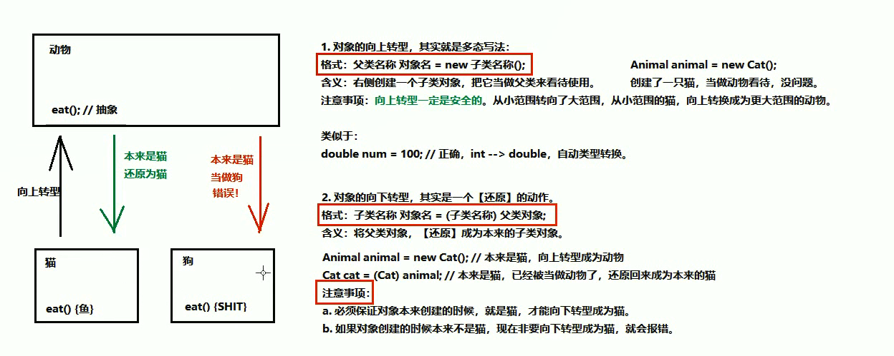

# 面向对象

## 1.抽象类

**如果父类当中的方法不确定如何进行{}方法体实现，那么这就应该是一个抽象方法！**



~~~java
/**
 * 1.抽象方法：就是加上abstract关键字，然后去掉大括号，直接分号结束
 * 2，抽象方法所在的类必须定义成抽象类，抽象类的定义就是在class前面加上abstract关键字
 * 3.抽象类中还可以定义普通的方法！
 */
public abstract class Animal {
    public abstract void eat();
    
    public void getStr(){
        System.out.println(666);
    }
}

~~~

### 1.1 如何使用抽象类和抽象方法

>1.不能直接创建new抽象类对象
>
>2.必须用一个子类来继承抽象父类
>
>3.子类必须覆盖重写抽象父类当中所有的抽象方法。
>
>​            覆盖重写（实现）：去掉abstract关键字，然后补上方法体大括号。
>
>4.创建子类对象使用

### 1.2 抽象类的注意事项

- 抽象类不能直接创建对象，如果创建，编译无法通过而报错，只能创建非抽象子类的对象
- 抽象类当中，可以有构造方法，供子类创建对象的时候，初始化父类成员使用

~~~java
public abstract class Fu {
    public Fu(){
        System.out.println("抽象父类构造方法执行！");
    }

    public abstract void eat();
}

~~~

~~~java
public class Zi extends Fu {
    @Override
    public void eat() {
        System.out.println("吃饭饭");
    }
    public Zi(){
        System.out.println("子类构造方法执行！");
    }
}

~~~

~~~java
public class DemoMain {
    public static void main(String[] args){
        Zi zi = new Zi();
        zi.eat();
    }
}
----------------------------------------
抽象父类构造方法执行！
子类构造方法执行！
吃饭饭
~~~

- **抽象类中不一定有抽象方法，但是有抽象方法的类一定是抽象类**

一个抽象类中不一定有抽象方法，只要保证抽象方法所在的类是一个抽象类即可！

这样没有抽象方法的抽象类，也不能直接创建对象，但是在一些特殊场景有用途！

- **抽象类的子类，必须重写出父类的所有的抽象方法，否则该子类也需是一个抽象类。**

## 2.接口

**接口就是一种公共的规范标准**只要复合规范标准，就可以大家通用！

### 2.1 接口的基本定义格式

~~~java
// 代码中接口就是多个类的公共规范！！！！
// 接口是一种引用数据类型，其中最重要的内容就是其中的：抽象方法！
public interface 接口名称{
    // 接口内容
}
~~~

**接口中可以包含的内容：**

~~~java
// 如果是java7，那么接口中可以包含的内容有：
     1.常量
     2.抽象方法
// 如果是Java8，还可以额外包含有：
     3.默认方法
     4.静态方法
// 如果是Java9，还可以额外包含有：
     5.私有方法
~~~

**接口的使用步骤**

~~~java
1.接口不能直接使用，必须有一个实现类来实现该接口
格式：
   public class 实现类名称 implements 接口名称{
       // ...
   }
2.接口的实现类必须**覆盖重写（实现）接口中的所有抽象方法**
实现：去掉abstarct关键字，加上方法体大括号
3.创建接口实现类对象，进行使用
4.如果实现类并没有覆盖重写接口中所有的抽象方法，那么这个抽象类自己就必须是抽象类
~~~

### 2.2 接口中抽象方法的定义

~~~java
/**
 * 在任何版本的接口中，接口都可以定义抽象方法
 * 抽象方法格式：
 * public abstract 返回值类型 方法名称（参数列表）；
 * 注意事项：
 *    1.接口中的抽象方法，修饰符必须是两个固定的关键字  public abstract
 *    2.这两个关键字修饰符可以选择性省略
 *    3，方法的三要素可以随意定义
 */
public interface MyInterface {
    // 这是一个抽象方法
    public abstract void methodAbs1();

    // 这也是抽象方法
    abstract void methodAbs2();

    // 这也是抽象方法
    String methodAbs3();
}

~~~

### 2.3 接口中的默认方法

~~~java
/**
 * 1.从java8开始，接口中允许定义默认方法
 * 格式：
 * public default 返回值类型 方法名称（参数列表）{
 *     方法体
 * }
 * 2.接口中的默认方法可以解决接口的升级问题！
 * 3.默认方法必须用public default修饰，其中public可以省略。
 * 4.默认方法会被实现类继承！！！接口的默认方法既可以被接口实现类对象直接调用，也可以被接口实现类对象覆盖重写！
 */
public interface MyInterface {

    // 抽象方法
    public abstract void methodAbs1();

    // 默认方法
    public default void methodDefault(){
        System.out.println("这是新添加的默认方法");
    }
}

~~~

### 2.4 接口中的静态方法

~~~java
/**
 * 从Java8开始，接口中允许定义静态方法
 * 1.格式：
 * public static 返回值类型 方法名称(参数列表){
 *     // 方法体
 * }
 * 实际上就是将abstract或者default换成static即可，带上方法体
 * 2.不能通过接口实现类对象来调用接口中的静态方法，通过接口名称直接调用接口中的静态方法
 */
public interface MyInterface {
    public static void methodAbs(){
        System.out.println("这是接口中的静态方法！");
    }
}

~~~

~~~java
public class MyInterfaceImpl  implements MyInterface{
    public static void main(String[] args) {
        MyInterface.methodAbs();
    }
}
~~~

注意**接口中的静态方法不能被实现类继承和子接口继承，但是接口中的非静态的默认方法可以被实现类继承**

### 2.5 接口中的私有方法

~~~java
/**
 * 我们需要抽取一个共有方法，来解决两个默认方法之间的重复代码问题
 * 但是这个共有方法不应该让实现类使用，而应该是私有化的！
 *
 * 解决方案：
 * 从Java9开始，接口中允许定义私有方法
 * 1.普通私有方法，解决多个默认方法之间的重复代码问题
 * 格式：
 * private 返回值类型 方法名称（参数列表）{
 *     //方法体
 * }
 * 2.静态私有方法，解决多个静态方法之间的重复代码问题
 * 格式：
 * private static 返回值类型 方法名称（参数列表）{
 *     //方法体
 * }
 */
~~~

### 2.6 接口中常量的定义和使用

接口中还可以定义**常量**

~~~java
/**
 * 接口中也可以定义“成员变量”，但是必须使用public static final 三个关键字修饰
 * 从效果上，这其实就是接口的常量
 * 格式：
 * public static final 数据类型 常量名  = 数据值
 * 注意：
 * 1.一旦使用final关键字，说明不可改变
 * 2.接口当中的常量，可以省略public static final，注意：不写也是这样
 * 3.接口当中的常量必须赋值，不能不赋值。
 * 4.接口中常量的名称使用完全大写的字母，用下划线隔开多个单词
 */
public interface MyInterface {
    // 这其实是一个常量 一旦赋值，不可以修改
    public static final int A = 10;

    public static void methodAbs(){
        System.out.println("这是接口中的静态方法！");
    }
}

~~~

**总结**

~~~java
从Java9开始，接口的内容可以有：


1.成员变量也是常量，格式：
[Public] [static] [final] 数据类型 常量名称 = 数据值；
注意：
    常量必须进行赋值，而且一旦赋值不能改变
	常量名称必须大写，用下划线进行分割

2.接口中最重要的就是抽象方法，格式：
[public] abstract 返回值类型 方法名称(参数列表);
注意：实现类必须覆盖重写接口所有的抽象方法，除非实现类是抽象类

3.从Java8开始，接口中允许定义默认方法，格式：
[public] default 返回值类型 方法名称(参数列表){
    方法体
}
注意：默认方法也可以被覆盖重写

4.从Java8开始，接口中允许定义静态方法，格式：
public static 返回值类型 方法名称(参数列表){
    方法体
}
注意：应该通过接口名称进行调用，不能通过接口实现类调用接口的静态方法

5.从Java9开始，接口中允许定义私有方法，格式：
普通私有方法：private  返回值类型 方法名称(参数列表){方法体}
静态私有方法：private static  返回值类型 方法名称(参数列表){方法体}
注意：private的方法只有接口自己才能调用，不能被实现类或者别人使用
~~~

### 2.7 接口的注意事项

>```java
>/**
> * 使用接口的注意事项：
> * 1.接口中没有静态代码块或者构造器！
> * 2.一个类的直接父类有且只有一个，但是一个类可以同时实现多个接口
> * 格式：
> * public class MyInterface  implements MyInterfaceA,MyInterfaceB{}
> * 3.如果实现类所实现的多个接口中存在重复的抽象方法，那么只需要重写一次即可！
> * 4.如果实现类没有覆盖重写所有接口当中的所有抽象方法，那么实现类也必须是一个抽象类
> * 5.如果实现类所实现的多个接口当中，存在重复的默认方法，那么实现类一定要对冲突的默认的方法进行覆盖重写！
> * 6.一个类如果直接父类当中的方法，和接口当中的默认方法产生了冲突，优先用父类当中的方法
> */
>```

### 2.8 接口之间的多继承


>```java
>/**
> * 1.类与类之间是单继承的，一个类的直接父类只有一个
> * 2.类与接口之间是多实现的，一个类可以实现多个接口
> * 3.接口与接口之间是多继承的
> *
> * 注意事项：
> * 1.多个父接口当中的抽象方法如果重复，没关系
> * 2.多个父接口当中的默认方法如果重复，那么子接口必须进行默认方法的覆盖重写，而且带着[default关键字]！
> */
>```

## 3.final关键字

### 3.1 final作用于局部变量

>一旦使用final修饰局部变量，那么这个变量就不能进行更改
>
>一次赋值，终身不变

~~~java
public class Test {
    public static void main(String[] args) {
        // 1.一旦使用final修饰局部变量，那么这个变量就不能进行更改
        final int a = 10;
        // 2.下面这个写法也是正确写法，只要保证有唯一一次赋值即可
        final int num3;
        num3=30;
        // 3.对于基本数据类型来说，不可变说的是变量当中的数据不可变；对于引用数据类型来说，不可变说的是变量当中的地址值不可变，但是里面的内容可以改变
    }
}
~~~

### 3.2 final作用于成员变量

~~~java
/**
 * 对于成员变量来说，如果final关键字修饰，那么这个变量也照样不可变
 * 1.由于成员变量具有默认值，所以用了final之后必须手动赋值
 * 2.对于final的成员变量，要么直接赋值，要么使用构造器赋值，二者选其一
 * 3.必须保证类当中所有重载的构造器，都最终会对final成员变量赋值
 */
public class Person {
    public String name;

    public Person(){
       name = "关晓彤";
    }
    public Person(String name){
        this.name = name;
    }

    public String getName() {
        return name;
    }

//    public void setName(String name) {
//        this.name = name;
//    }
}

~~~

## 4.多态

>面向对象的三大特征：封装性，继承性，多态性。
>
>extends继承或者implements实现，是多态性的前提！



~~~java
public  class Fu {
    public Fu(){
        System.out.println("抽象父类构造方法执行！");
    }


    public  void method(){
        System.out.println("父类方法");
    }
    public void methodFu(){
        System.out.println("父类方法！");
    }
}

~~~

~~~java

public class Zi extends Fu {
    @Override
    public void method() {
        System.out.println("子类方法");
    }
    public Zi(){
        System.out.println("子类构造方法执行！");
    }
}

~~~

~~~java
/**
 * 代码当中体现多态性，其实就是一句话：父类引用指向子类对象
 * 格式：
 * 父类名称 对象名 = new 子类名称（）；
 * 或者
 * 接口名称 对象名 = new 实现类名称（）；
 */
public class Test {
    public static void main(String[] args) {
        // 使用多态的写法
        // 左侧父类的引用，指向了右侧子类的对象
        Fu obj = new Zi();
        obj.method();
        obj.methodFu();
    }
}

~~~

### 4.1 多态中成员变量

>/**
> *访问成员变量的两种方式：
> *1.直接通过对象名称访问成员变量：看等号左边是谁就优先用谁，没有则向上找！
> *2.间接通过成员方法访问：看该方法运行属于谁则优先用谁，没有则向上找
> */

~~~java
package demo01;

public class Fu {
    int num =10;
    public void showNum(){
        System.out.println(num);
    }
}
~~~

~~~java
package demo01;

public class Zi extends Fu {
    int num =20;
}
~~~

~~~java
package demo01;

/**
 *访问成员变量的两种方式：
 *1.直接通过对象名称访问成员变量：看等号左边是谁就优先用谁，没有则向上找！
 *2.间接通过成员方法访问：看该方法运行属于谁则优先用谁，没有则向上找
 */
public class TestDemo01 {
    public static void main(String[] args) {
        Fu obj = new Zi();
        System.out.println(obj.num);// 等号左边是fu，优先用fu的成员变量！
        obj.showNum();
    }
}

~~~

### 4.2 多态中成员方法

>```
>/**
> *在多态的代码中，成员方法的访问规则：
> *  看new的是谁，就优先用谁，没有则想上找！
> */
>```

**针对成员方法：编译看左边，运行看右边！**

所以我们可以看出多态的变量无法直接调用子类特有成员方法！

总结：

- 成员变量，编译看左边，运行还看左边
- 成员方法，编译看左边，运行看右边

### 4.3 使用多态的好处



### 4.4 对象的上下转型

**向上转型：向上转型一定是安全的**它从小范围转为大范围

向上转型是正确的，可以的，安全的，但是有一个弊端：

**子类特有方法无法调用！！！**

~~~java
对象的向上转型，其实就是多态写法
格式：父类名称 对象名 = new 子类名称();
含义：右侧创建一个子类对象，把它当作父类来看待
~~~



**向下转型**

~~~java
对象的向下转型其实是一个还原动作
格式：子类名称 对象名 = （子类名称）父类对象
含义：将父类对象还原成本来的子类对象
~~~



### 4.5 instanceof关键字

>辨别父类引用的对象，本来是什么子类，可以用**instanceof**关键字判断，来进行安全的向下转型

格式：

**对象 instanceof 类名称**

这将会得到一个boolean值结果，也就是判断前面的对象能不能当作后面类型的实例
