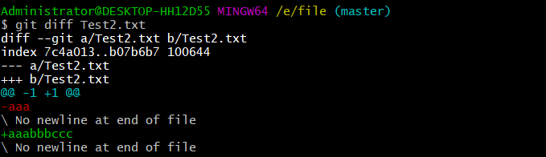
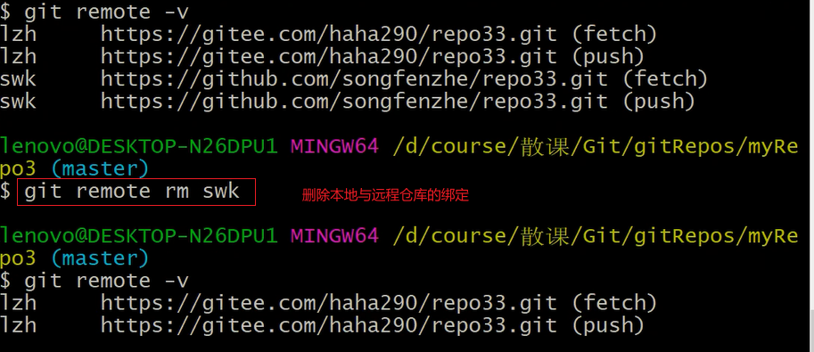

#  GIT

## 1. 概述

**版本控制**是一种记录一个或者若干文件内容变化，以便将来查阅特定版本修订情况的系统

git作为一个分布式的文件版本管理系统，**客户端并不只是提取最新版本的文件快照，而是把代码仓库完整的镜像下来**，而SVN是将最新版本复制过来，本地只保留最新版本，无法在本地进行版本切换！

此时每个客户端都可以作为服务器。

## 2.GIT的文件的三种状态和工作模式

文件状态在git管理下有以下三种模式

|       状态        |                             描述                             |
| :---------------: | :----------------------------------------------------------: |
| 已提交(committed) |        已经提交表示数据已经安全的保存到本地的版本库中        |
| 已修改(modified)  |         已修改表示修改了文件，但是还没保存到数据库中         |
|  已暂存(staged)   | 已暂存表示对一个已经修改文件的当前版本做了标记，使之包含在下次提交的快照中 |

**git的三个工作区域**

| 分类    |                             描述                             |
| ------- | :----------------------------------------------------------: |
| 工作区  | 见到那的理解为在电脑上能看到的目录，比如自己创建的本地项目的目录 |
| 暂存区  | Git版本库中存了很多东西，其中最重要的就是称为stage(或者叫index)的暂存区，还有Git自动创建的第一个分支master,以及指向master的一个指针叫HEAD |
| GIt仓库 |  工作区有一个隐藏目录.git，这个不算工作区，而是git的版本库   |

基本的G工作流程如下：

- 在工作区修改某个文件
- 对修改的文件进行快照，然后添加到暂存区
- 提交更新，将保存在暂存区的文件快照永久转存储到Git仓库中

## 3.本地库与远程库的交互方式

交互方式分为两种：

- 团队内部协作

  

- 跨团队协作

  

## 4.初始化相关

~~~java
-- 查看GIT版本：
    git --version
~~~

### 4.1 设置字体字符集啊编码

### 4.2 设置用户名和密码

在使用Git工作之前，我们还需要做一个一次性的配置，方柏后续追踪谁做了修改，我们需要设置对应的用户名和邮箱地址。

~~~java
git config --global user.name"your_username";
git config --global user.email"your_email@admin.com"
-- 查看所有配置
git config --list
~~~

### 4.3 本地仓库的初始化

~~~java
-- 命令：
    git init
~~~

>注意：.git目录下的文件不要随意修改！！！

## 5.常用操做命令

### 5.1 add && commit

~~~java
add:添加文件
commit:提交文件
~~~

~~~java
git add 文件名
    将文件提交到暂存区
git commit -m "注释"
    将暂存区的文件提交到暂存区
~~~

**注意**

~~~markdown
# 1.不放在本地仓库的文件，git不进行管理
# 2.即使放在本地仓库的文件，git也不管理，必须通过add,commit命令操做才可以将内容提交到本地库
~~~

### 5.2 status命令

>git status 可以查看工作区和暂存区的状态

### 5.3 log命令

>git log 可以让我们查看提交的，显示从最近到最远的日志

**补充**

~~~java
1.当历史记录过多的时候，使用git log命令插件看日志的时候，会与分页效果
此时：
    下一页：空格
    上一页：b
    退出：q
2.更加简洁的展示方式：
    方式1：git log:分屏展示日志信息
    方式2：git log  --pretty=online此时以一页的方式展示日志信息
    方式3：git log  --oneline:截取一部分索引号进行展示
    方式4：git reflog:多了信息：HEAD@{数字}
           这个数字的含义是：指针回到当前历史版本需要走多少步
~~~

### 5.4 reset命令

>用来前进或者后退版本

***

实际上不管是前进版本还是后退版本，我们都可以通过**git  reset --hard 版本号**去定位

### 5.5 diff文件比对命令

>文件比对命令常用如下格式：
>
>​        比较工作空间和暂存区的文件内容差异
>
>​        ` git diff 文件名`:比较某个文件
>
>​        ` git diff`显示所有改变的文件的文件差异
>
>​        比较工作空间和版本库的文件差异
>
>​        `git diff HEAD 文件名`将工作空间和版本库最新版本的某个文件进行比对
>
>​        `git diff 版本号 文件名`将工作空间和版本库选定版本下的该文件进行对比

**1.比较工作空间和暂存区的文件内容的差异**

单个文件

~~~java
1.我们创建Test2.txt文件，并且提交到版本库
Administrator@DESKTOP-HH12D55 MINGW64 /e/file (master)
$ git add Test2.txt
Administrator@DESKTOP-HH12D55 MINGW64 /e/file (master)
$ git commit -m "inser aaa to Test2.txt"
[master 17ea402] inser aaa to Test2.txt
 1 file changed, 1 insertion(+)

2.此时我们往Test2.txt中添加内容bbbccc,并且不执行add操做
Administrator@DESKTOP-HH12D55 MINGW64 /e/file (master)
$ git diff Test2.txt
diff --git a/Test2.txt b/Test2.txt
index 7c4a013..b07b6b7 100644
--- a/Test2.txt
+++ b/Test2.txt
@@ -1 +1 @@
-aaa
\ No newline at end of file
+aaabbbccc
\ No newline at end of file
~~~

所有文件

***

**2.比较工作区和版本库的文件差异**

与当前最新版本比较，用HEAD

说明：

当我们执行`git diff HEAD -- git01.txt`将工作区与版本库最新版本的git01.txt文件进行比差异比较时

~~~
差异比较说明：
'---':表示变动前的文件
'+++':表示变动后的文件
变动过的位置用两个@@作为起首和结束
@@ -1，3 +1,4 @@：
   减号表示第一个文件，“1”表示第一行，“3”表示连续三行。同样的，“+1，4”表示变动文件后，称为第二个文件从第一行开始的连续4行
~~~

**可以看出，文本中的第四行内容并没有提交到版本库，**

## 6.git的时光穿梭机

### 6.1 暂存区文件撤销

>对于误提交到暂存区的文件吗，实际上我们通过
>
>`git reset HEAD`就可以将文件撤回到工作空间

### 6.2 版本穿梭

前面我们已经介绍过，可以通过**git  reset --hard 版本号**进行版本切换，我们来进一步深化版本切换

~~~java
版本回退：
方式1：通过^数量确定回退的版本
**git reset --hard HEAD^**:在当前版本基础往后退1个版本
**git reset --hard HEAD^^**:在当前版本基础往后退2个版本
方式2：
**git reset --hard HEAD~1**:在当前版本基础往后退1个版本
**git reset --hard HEAD~2**:在当前版本基础往后退2个版本
    
   
版本前进：
**git  reset --hard 版本号**:当然这个命令可以做任何的前进后退版本操做，不单单是前进操做
~~~

### 6.3 文件删除

如果文件已经提交到版本库，但是我们不小心将工作区的该文件删除，我们可以通过命令`git checkout --文件名`将该文件还原到工作区。

如果确定更要删除文件，可以执行命令：`git rm 文件名`，这个命令可以本地工作工作空间和版本库的文件全部删除。、

>查看版本库文件多少：
>
>​        `git ls -files`

~~~java
Administrator@DESKTOP-HH12D55 MINGW64 /e/file (master)
$ git ls-files
Test.txt
Test2.txt
demo.txt
demo2.txt
git01.txt
git02.txt
~~~

### 6.4 文件删除

~~~java
在Git中，删除文件同样是一个修改操作，即在git的世界里，Git仅仅关注文件是否被修改（文件添加，更新，删除）
~~~

~~~java
假如我们将已经提交到版本库的文件进行删除操作，那么
$ git commit  -m 'git02.txt' --先提交该文件
[master 1324f9c] git02.txt
 1 file changed, 1 insertion(+)
 create mode 100644 git02.txt

Administrator@DESKTOP-HH12D55 MINGW64 /e/git工作 (master)
$ git status --查看状态
On branch master
nothing to commit, working tree clean

Administrator@DESKTOP-HH12D55 MINGW64 /e/git工作 (master)
$ git status --查看文件删除以后的状态
On branch master
Changes not staged for commit:
  (use "git add/rm <file>..." to update what will be committed)
  (use "git checkout -- <file>..." to discard changes in working directory)

        deleted:    git02.txt -- 显示删除操作

no changes added to commit (use "git add" and/or "git commit -a")

但是这样只是把工作区的文件删除了，版本库中仍然有该文件
那么怎么将该文件还原到工作区
命令：
   git checkout -- git02.txt
   此时会还原在工作区中删除的文件
那如果我们就是要进行删除版本库的文件操作：
命令：
   git rm git02.txt      
~~~

## 7 分支

在版本控制中，使用多条线同事推进多个任务，这里说的多条线就是多个分支

**多个分支可以并行开发，互相不耽误，互相不影响，提高开发效率**

### 7.1 本地分支基本操做操做

|                   命令                    |                             描述                             |
| :---------------------------------------: | :----------------------------------------------------------: |
|                git branch                 |           查看当前项目所有分支，*标记的是当前分支            |
|           git  branch  新分支名           |                          创建新分支                          |
|         git  checkout  目标分支名         |                        切换到指定分支                        |
|        git  checkout  -b  新分支名        |                 创建新分支并且切换到指定分支                 |
|      git  branch  -d  要删除的分支名      |                         删除指定分支                         |
|             git merge 分支名              |              合并分支(`只能在主干上去合并分支`)              |
| git branch -m \|  -M  oldBranch newBranch | 重命名分支，如果newBranch名字分支已经存在，则需要使用-M强制重命名，否则使用-m进行重命名 |
|              git branch  -v               |           查看所有分支，还会显示分支最新索引版本号           |

### 7.2 分支合并冲突解决

**如果在分支和主分支修改了同一个文件的同一个位置，申请分支合并就会出现冲突**

**注意**

~~~java
注意点：
    1.创建分支的时候主干上有什么东西，分支上就会有什么东西
    2.只能在主分支进行合并其他分支的操作！！！
~~~

## 8.远程仓库

~~~java
Git是一个分布式版本控制系统，同一个git仓库可以分布到不同机器上，我们可以将代码托管到远程。到时候克隆下来的本地版本文件与远程一致。
远程仓库：
    1.GitHub:https://github.com/
    2.码云：https://gitee.com/
~~~

### 8.1克隆远程项目到本地仓库

~~~java
tip:好用的插件：Octotree
命令：
    git clone 远程仓库地址
    将远程仓库代码克隆到本地
~~~

### 8.2 查看远程仓库

~~~java
-- 查看远程仓库别名
    git remote -v
-- 给远程仓库地址添加别名
    git remote add 别名名称 远程仓库地址
~~~

|                      命令                       |                   阐述                   |
| :---------------------------------------------: | :--------------------------------------: |
|                   git  remote                   |        查看绑定的远程仓库地址别名        |
|                 git remote  -v                  |             查看远程分支url              |
|         git  remote show  远程仓库别名          |           查看远程仓库详细信息           |
| git  remote  add  <远程仓库别名>  <远程仓库url> | 添加一个远程分支，同时指定可以引用的简介 |

**注意:我们可以执行git add remote <远程仓库别名>  <远程仓库url> 给本地仓库添加多个远程仓库！**

### 8.3将本地仓库推送到远程

**前提**

`需要在远程有一个远程仓库`

~~~java
首次将本地仓库推送到远程的空仓库，需要进行以下步骤
命令：
    git remote add origin       https://gitee.com/pure_love_flying/personal-drip.git
    绑定远程仓库地址
命令：
    git push -u origin master:将本地master分支代码推送到远程仓库
    git push origin master:将本地master分支代码推送到远程仓库
~~~

~~~java
有两种推送方式：HTTPS和SSH
    其中HTTPS协议以https开头远程仓库地址：https://gitee.com/pure_love_flying/personal-drip.git
    ssh协议以git开头远程仓库地址：git@gitee.com/pure_love_flying/personal-drip.git

进行sshx协议的操作要先申请公钥和私钥
   命令如下：
   ssh-keygen -t rsa -C "GitHub账户邮箱"
~~~

#### 8.3.1 HTTP协议

~~~java
mkdir git01
cd git01
git init
touch README.md
git add README.md
git commit -m "first commit"
git remote add origin https://gitee.com/pure_love_flying/git01.git --绑定远程仓库
git push -u origin master --推送
~~~

#### 8.3.2 SSH协议

通过SSH协议传输文件需要我们先生成公钥私钥并且进行绑定

**它的步骤如下：**

1.本地git客户端生成密钥公钥，命令如下：**ssh-keygen -t rsa -C "1607140115@qq.com" --生成公钥私钥**

2.拷贝公钥

3.将公钥放置在指定位置

>我们可以通过命令查看配对是否成功：
>
>​        命令如下：
>
>​                `ssh -T git@gitee.com --查看是否配对成功`

~~~java
这种协议更加安全也更加高效。
在进行这个操作之前要先申请公钥和密钥，他们是存在在C盘.ssh文件中。

操作如下：
1.生成公钥私钥
$ ssh-keygen -t rsa -C "1607140115@qq.com" --生成公钥私钥
Generating public/private rsa key pair.
Enter file in which to save the key (/c/Users/Admin/.ssh/id_rsa):
Created directory '/c/Users/Admin/.ssh'.
Enter passphrase (empty for no passphrase):
Enter same passphrase again:
Your identification has been saved in /c/Users/Admin/.ssh/id_rsa.
Your public key has been saved in /c/Users/Admin/.ssh/id_rsa.pub.
The key fingerprint is:
SHA256:2J6GOXKW0kLNsqv51giDRaZw+nvhkws6qKoRkLbPZ8U 1607140115@qq.com
The key's randomart image is:
+---[RSA 2048]----+
|                 |
|..+              |
|+B               |
|= o  o.o         |
|.=  o +ES        |
|..*..+.= .       |
|o .B=BO +        |
|oo.oXB.o         |
|O.o=+o           |
+----[SHA256]-----+
 
    
2.远端绑定公钥
将公钥复制过来，然后黏贴到相关位置即可。
    
    
    
3.测试公钥私钥是否配对成功
可用如下命令：
$ ssh -T git@gitee.com --查看是否配对成功
The authenticity of host 'gitee.com (180.97.125.228)' can't be established.
ECDSA key fingerprint is SHA256:FQGC9Kn/eye1W8icdBgrQp+KkGYoFgbVr17bmjey0Wc.
Are you sure you want to continue connecting (yes/no)? yes
Warning: Permanently added 'gitee.com,180.97.125.228' (ECDSA) to the list of known hosts.
Hi 纯情小飞飞 (DeployKey)! You've successfully authenticated, but GITEE.COM does not provide shell access.
Note: Perhaps the current use is DeployKey.
Note: DeployKey only supports pull/fetch operations

~~~

**tips**

~~~java
码云 Incorrect username or password ( access token )解决
Q：Git提交时，给出提示Incorrect username or password ( access token )
K： 此处是用户名或者密码有误，建议解决方法两种。具体看哪一种可行，可试。
(码云的用户名是***@qq.com,密码是***)

第一种，电脑管理器内进行修改；
[控制面板][账号管理][凭据管理器]/针对不同的windows系统，也可以在[控制面板]直接搜索[凭据管理器]
[windows凭据]--> 普通凭据内的gitee 的下拉框打开进行编辑；

第二种方式：
查看命令，生产SSH 公钥秘钥；
私钥id_rsa
公钥id_rsa.pub
~~~

**推送操作**

### 8.4 分支的push和pull

|                      命令                      |                             描述                             |
| :--------------------------------------------: | :----------------------------------------------------------: |
|                `git branch -a`                 |                   `查看本地和远程所有分支`                   |
|          `git push origin 本地分支名`          | `推送本地分支到远程同名分支`（也就是将本地分支放到远程，此时如果远程没有该分支，会创建一个远程分支） |
|    `git push origin 本地分支名 :远程分支名`    |              `将本地指定分支推送到远程指定分支`              |
|         git push origin :remote_branch         |                删除远程分支（本地分支还保留）                |
| git checkout -b  本地分支名  origin/远程分支名 | 拉取远程指定分支并在本地创建分支（**若遇到 git branch -a 无法全部显示远程的分支，只显示master分支可以通过 git fetch 将本地远程跟踪分支进行更新，与远程分支保持一致**） |

~~~java
Administrator@DESKTOP-HH12D55 MINGW64 /e/git操作/git操作深化 (localLeaf01)
$ git push origin localLeaf01 -- 将本地分支推送到远程
Enumerating objects: 4, done.
Counting objects: 100% (4/4), done.
Delta compression using up to 8 threads
Compressing objects: 100% (2/2), done.
Writing objects: 100% (3/3), 312 bytes | 312.00 KiB/s, done.
Total 3 (delta 0), reused 0 (delta 0)
remote: Powered by GITEE.COM [GNK-5.0]
remote: Create a pull request for 'localLeaf01' on Gitee by visiting:
remote:     https://gitee.com/pure_love_flying/git-warehouse-03/pull/new/pure_love_flying:localLeaf01...pure_love_flying:master
To https://gitee.com/pure_love_flying/git-warehouse-03.git
 * [new branch]      localLeaf01 -> localLeaf01

Administrator@DESKTOP-HH12D55 MINGW64 /e/git操作/git操作深化 (localLeaf01)
$ git branch -a --查看本地和远程所有分支
* localLeaf01
  master
  remotes/origin/localLeaf01
  remotes/origin/master

Administrator@DESKTOP-HH12D55 MINGW64 /e/git操作/git操作深化 (localLeaf01)
$ git push origin :localLeaf01 --删除远程指定分支（本地分支还保留）
remote: Powered by GITEE.COM [GNK-5.0]
To https://gitee.com/pure_love_flying/git-warehouse-03.git
 - [deleted]         localLeaf01

~~~

#### 8.4.1 fetch与pull

**fetch(抓取)&&pull(拉取)**

~~~java
他们都可以从远程仓库获取最新的版本信息到本地，
    但是fetch不会自动merge，但实际上文件已经获取到了本地仓库中，只是文件存储在本地版本库中，但是没有同步到本地工作空间！！！工作区中的文件并没有被更新
    而pull会自动merge
~~~

##### fetch

~~~java
Administrator@DESKTOP-HH12D55 MINGW64 /e/git操作/git操作深化
$ git init --初始化一个本地仓库
Initialized empty Git repository in E:/git鎿嶄綔/git鎿嶄綔娣卞寲/.git/

Administrator@DESKTOP-HH12D55 MINGW64 /e/git操作/git操作深化 (master)
$ git remote--查看远程仓库（此时啥都没有）

Administrator@DESKTOP-HH12D55 MINGW64 /e/git操作/git操作深化 (master)
$ git remote  add origin https://gitee.com/pure_love_flying/git-warehouse-03.git
-- 绑定远程仓库地址
Administrator@DESKTOP-HH12D55 MINGW64 /e/git操作/git操作深化 (master)
$ git remote -v --查看远程仓库
origin  https://gitee.com/pure_love_flying/git-warehouse-03.git (fetch)
origin  https://gitee.com/pure_love_flying/git-warehouse-03.git (push)
~~~

~~~java
Administrator@DESKTOP-HH12D55 MINGW64 /e/git操作/git操作深化 (master)
$ git fetch
remote: Enumerating objects: 9, done.
remote: Counting objects: 100% (9/9), done.
remote: Compressing objects: 100% (5/5), done.
remote: Total 9 (delta 1), reused 0 (delta 0), pack-reused 0
Unpacking objects: 100% (9/9), 750 bytes | 0 bytes/s, done.
From https://gitee.com/pure_love_flying/git-warehouse-03
 * [new branch]      leaf01     -> origin/leaf01
 * [new branch]      master     -> origin/master

Administrator@DESKTOP-HH12D55 MINGW64 /e/git操作/git操作深化 (master)
$ git branch

Administrator@DESKTOP-HH12D55 MINGW64 /e/git操作/git操作深化 (master)
$ git branch -a
  remotes/origin/leaf01
  remotes/origin/master
同时本地分支并没有看到那些文件，而远程是有的。
~~~

~~~java
所以我们需要手动合并
    命令：
    git merge origin/master --将抓取的远程master分支合并到本地分支
~~~

##### pull

**git  pull 是从远程仓库获取最新的版本并且merge到本地仓库：常用：git  pull   <远程仓库别名>  <远程仓库分支名>**，比如：git pull origin master

~~~java
git pull是从远程仓库获取最新的版本版本并且merge到本地仓库
我们需要指定pull的远程分支名，具体命令如下:
    git pull origin 远程分支名
如果当前本地仓库不是从远程仓库克隆，而是本地创建的仓库，并且仓库中存在文件，此时再从远程仓库拉取文件的时候就会报错（fatal: refusing to merge unrelated histories），解决此问题可以在git pull 命令后加入参数--allow-unrelated-histories
~~~

~~~java
Administrator@DESKTOP-HH12D55 MINGW64 /e/git操作/git操作深化 (master)
$ git remote add origin https://gitee.com/pure_love_flying/git-warehouse-03.git
g
Administrator@DESKTOP-HH12D55 MINGW64 /e/git操作/git操作深化 (master)
$ git branch

Administrator@DESKTOP-HH12D55 MINGW64 /e/git操作/git操作深化 (master)
$ git branch -a

Administrator@DESKTOP-HH12D55 MINGW64 /e/git操作/git操作深化 (master)
$ git pull origin leaf01
remote: Enumerating objects: 9, done.
remote: Counting objects: 100% (9/9), done.
remote: Compressing objects: 100% (5/5), done.
remote: Total 9 (delta 1), reused 0 (delta 0), pack-reused 0
Unpacking objects: 100% (9/9), 750 bytes | 1024 bytes/s, done.
From https://gitee.com/pure_love_flying/git-warehouse-03
 * branch            leaf01     -> FETCH_HEAD
 * [new branch]      leaf01     -> origin/leaf01

Administrator@DESKTOP-HH12D55 MINGW64 /e/git操作/git操作深化 (master)
$ git branch -a
* master
  remotes/origin/leaf01
~~~

**总结**

~~~java
命令：
git fetch -- 读取远程仓库最新的一个状态
~~~

~~~java
概念：
    ** 从远程服务器克隆一个一模一样的版本库到本地,复制的是整个版本库，叫做clone.（clone是将一个库复制到你的本地，是一个本地从无到有的过程）
    ** 从远程服务器获取到一个branch分支的更新到本地，并更新本地库，叫做pull.（pull是指同步一个在你本地有版本的库内容更新的部分到你的本地库）
操作上：
    ** git pull相当于是从远程获取最新版本并merge（合并）到本地     
       git pull = git fetch + git merge，git fetch更安全一些
    ** git clone是远程操作的第一步，通常是从远程主机克隆一个版本库，
       eg:$ git clone ##   该命令会在本地主机生成一个目录，与远程主机的版本库同名，如果要是制定不同的目录名，可以将目录名作为git clone 命令的第二个参数。
       eg:$ git clone #版本库网址# #本地目录名#     
       git clone支持多种协议，除了http（s),还有ssh,git,本地协议。
  
实际上  git pull 作用是，取回远程主机某个分支的更新，再与本地的指定分支合并。它的完整格式稍稍有点复杂。
       eg:$ git pull ##远程主机（origin） #远程分支(next)#：#本地分支(master)#
          **如果远程分支是与当前分支合并，则冒号后面的部分可以省略。
       eg:$ git pull #远程主机(origin)#　 #远程分支(next)#　
           相当于 1. $ git fetch origin next 
                 2. $ git merge origin/next 
在某些场合，git会自动在本地和远程分之之间，建立一种追踪关系。比如，在git clone 的时候，所有本地分之默认与远程主机的同名分之，建立追踪关系，也就是，本地的master分之自动“追踪”origin/master分之。git 可以手动建立追踪， git branch --set-upstream master origin/next   --->指定master分之追踪到origin/next。
如果当前分支只有一个追踪分支，连远程主机名都可以省略。
`$ git pull  表示当前分之自动与唯一一个追踪分支进行合并`。
~~~

| 命令                                            |                   描述                   |
| ----------------------------------------------- | :--------------------------------------: |
| `git fetch  origin master`                      |       抓取远程指定master分支的信息       |
| `git merge origin/master`(一般与上述命令一起用) | 将抓取的远程master分支合并到本地当前分支 |
| `git pull origin master`                        | 拉去远程指定master分支并且与当前分支合并 |
| `git pull origin master :本地分支`              |   拉取远程master分支与本地指定分支合并   |

实际上，clone没有代码，是从远程仓库下载代码

pull 有代码，是更新最新的远程的代码

### 8.5 移除远程仓库

~~~java
如果想要解除与远程仓库的绑定，可以使用如下命令：
    git remote rm  远程仓库别名
~~~

##  9.Eclipse中操作GIT

### 1.全局配置

