# Git

 ## 1.版本控制

版本控制就是一种记录若干文件内容变化，以便将来查阅特定版本修订情况的系统，简单讲就是**备份和记录**。

 ### 分布式版本控制系统

**Distributes Version Control Sytem**

在这类系统中，客户端不仅仅是提取出最新的文本快照，而且把最原始的代码仓库镜像到本地，这样一来，任何一处协同工作的服务器发生故障，事后都可以用任何一个镜像出来的本地仓库备份。因为每一次的提取操作，实际上都是一次对代码仓库的完整备份。

## 2.windows上安装git

~~~java
git bash here :用命令行操作
命令：
查看git版本
   git --version
~~~

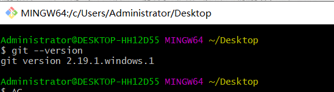

 在使用git之前，我们需要做个一次性的配置，方便后续GIT能跟踪到是谁做了修改，我们需要设置对应的用户名和邮箱地址

~~~java
命令：
查看所有配置：
    git config --list
设置用户名：
    git config --global user.name "fangdeng"
    git config --global user.email "qmzhong@amarsoft.com
"
~~~

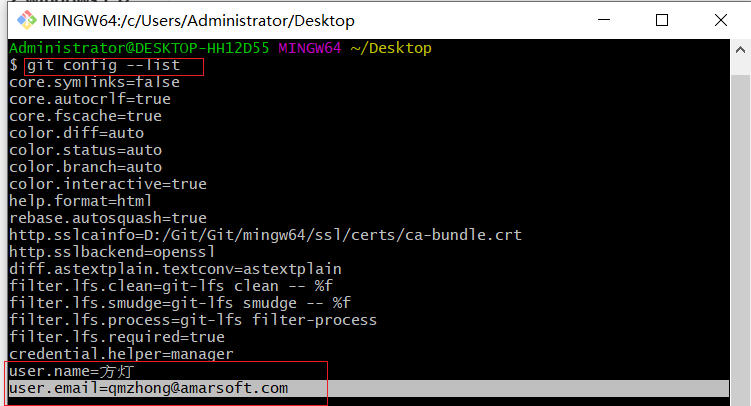

## 3.理解GIt文件的三种状态和工作模式

**文件的三种状态**

| 状态               | 描述                                                         |
| ------------------ | ------------------------------------------------------------ |
| 已提交（commited） | 表示数据已经安全的保存到本地数据仓库中                       |
| 已修改（modified） | 表示已经修改文件，但是还没保存到数据库（本地库）中           |
| 已暂存（staged）   | 表示对一个已经修改的文件的当前版本做了标记，便于包含在下次提交的快照中 |

针对git的三种状态，这里需要了解git项目的三个工作区域：工作区，暂存区和Git仓库

| 分类    | 描述                                                         |
| ------- | ------------------------------------------------------------ |
| 工作区  | 简单理解为在电脑上能看到的目录，比如自己创建的本地项目目录   |
| 暂存区  | Git的版本库里面保存了许多东西，其中最重要的就是称之为stage(或者叫index)的暂存区，还有Git自动创建的第一个分支master，以及指向master的一个指针叫HEAD。 |
| Git仓库 | 工作区有一个隐藏目录.git，这个不算工作区，而是Git的版本库    |

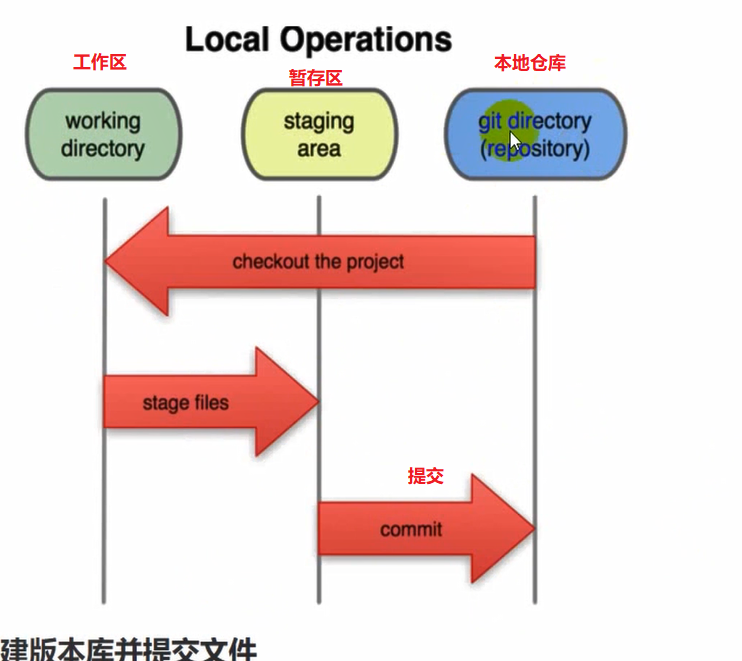 

~~~java
基本的工作流程描述如下：
    1.在工作区中修改一些文件
    2.将修改的文件进行快照，然后添加到暂存区
    3.提交更新，将保存在暂存区的文件快照永久转存贮到Git版本库。
~~~

## 4.创建版本库并提交文件

版本库又名仓库，可以简单理解为一个目录，这个目录里面的所有文件都可以被Git管理起来，每个文件的的修改，删除，更新，Git都能追踪，以便任何时候都可以追踪历史，或者将来在某个时刻还原。

~~~java
1.初始化本地仓库
    命令：在选中的目录下执行
    git init --初始化本地空仓库 
    通过执行git init命令，可以在本地初始化一个本地仓库，执行该命令的本地初始化仓库，没有任何文件，他是一个空仓库！
    
2.将文件添加到暂存区
    命令：
    git add path --将文件添加到暂存区
    path可以是一个文件，也可以是目录。Git可以判断出path中修改和新添加的文件，并且把他们的信息添加到版本库。
    
3.查看工作状态
   命令：
   git status
   用于显示工作目录和暂存区的的状态。使用此命令可以看到那些被修改了，那些没有，那些文件没有被git追踪到等。

4.提交文件到本地版本库
    命令：
    git commmit
    git commit -m "描述文字"
    将更改的暂存区的文件到提交到版本库。同时会将索引的当前内容与描述更改的用户和日志信息一起存储在新的提交中。
    通常在执行git commit命令后跟上 -m 属性，用来加上本次提交的记录说明，方便后续查看提交或者改动的记录
    
5.查看日志
    命令:
    git log --用于显示提交的日志信息
~~~

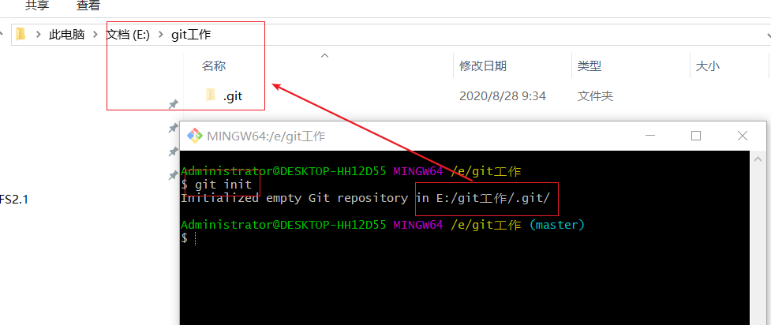

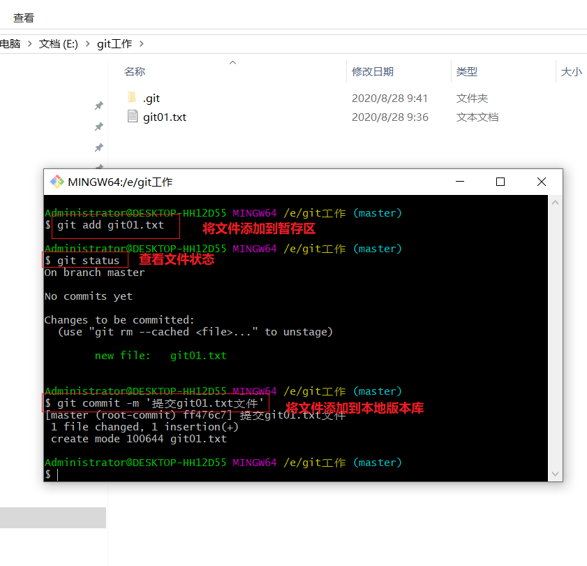

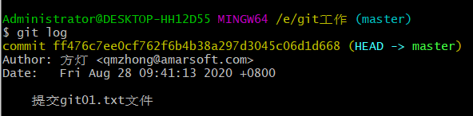

**总结**：

~~~java
1.添加到暂存区的命令： git add path
2.将文件提交到本地版本库：git commit -m '描述'，会将暂存区的**所有**文件提交到本地版本库！
~~~

~~~java
1.在工作空间中新创建的文件：
    未添加到暂存区：状态：未追踪的文件（红色）
    添加到暂存区：状态 ：新文件（绿色）
    提交到版本库：状态：已添加（）
2.将原来提交到版本库的文件进行修改：
    未添加到暂存区：状态：已修改文件（红色）
    添加到暂存区：状态：已修改文件（绿色）
    提交到版本库：状态：已添加（）
~~~

## 5.时光穿梭机

也就是版本控制：回退到之前的历史版本，或者追溯到之前的版本。**即项目的历史版本，未来版本的切换操作**

~~~java
修改一个原来已经提交到版本库的文件，执行git status,此时我们可以看到 $ git status
On branch master --在主分支
Changes not staged for commit: --未添加到暂存区
  (use "git add <file>..." to update what will be committed) --可以使用add命令添加到暂存区
  (use "git checkout -- <file>..." to discard changes in working directory) 

        modified:   git01.txt --提示文件已经修改

no changes added to commit (use "git add" and/or "git commit -a")

命令：
    git commit -a --这是一个组合命令，会将文件先添加到暂存区，再提交到本地版本库
~~~

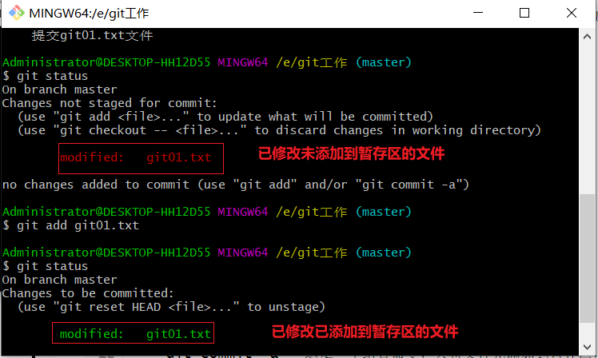

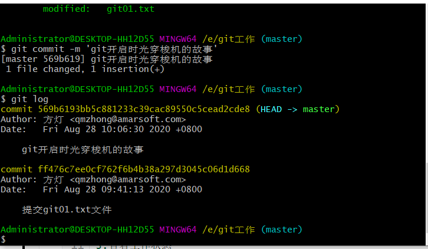

~~~java
$ git diff HEAD -- git01.txt
diff --git a/git01.txt b/git01.txt
index cef0942..3f1b4a3 100644
--- a/git01.txt
+++ b/git01.txt
@@ -1,2 +1,3 @@

命令：
    git diff HEAD -- 文件名、
    可以查看版本库与工作空间中最新文件的状态

差异比较说明：
'---'：表示变动前的文件
'+++'：表示变动后的文件
变动的位置用的两个@@作为起首和结束
@@ -1,2 +1,3 @@：减号表示第一个文件，”1“表示第一行，'2'表示连续两行。同样的，“+1，3”表示变动后，称为第二个文件的从第一行开始的连续三行。
~~~

**可以看出，文本第三行内容并没有被提交到版本库 原因在于修改后的git01.txt文件并没有被添加到暂存区，所有执行提交的操作并不会发生改变**

### 5.1 暂存撤销

~~~java
暂存区文件提交与撤销
当发现因为失误而将文件添加到暂存区，git支持文件的撤销操作
命令：
    git reset HEAD
~~~

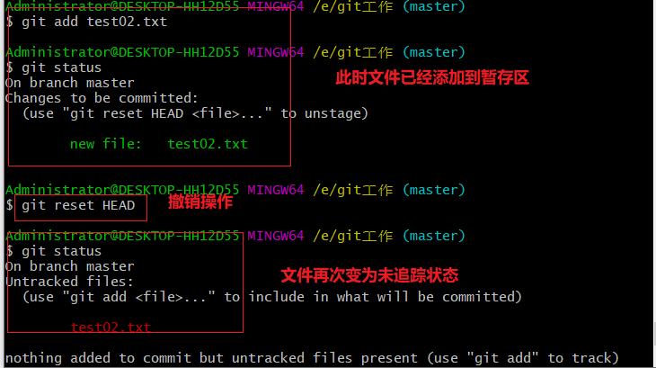

### 5.2 版本回退与版本未来

~~~java
当文件修改被提交的次数很多时，对于版本中存放的文件会出现不同的版本，通常会对不同版本文件进行查看甚至回退，git也支持让开发者在不同的版本中进行切换的功能。
对于历史版本的查看可以使用 git log 命令
~~~

~~~java
$ git log
commit c83635f86ce1ae53ea2b97a3225c34ed86f169ef (HEAD -> master)
Author: 方灯 <qmzhong@amarsoft.com>
Date:   Fri Aug 28 11:23:53 2020 +0800
蓝色字体是版本的唯一标识！！！
~~~

~~~java
$ git log -7 --pretty=oneline
c83635f86ce1ae53ea2b97a3225c34ed86f169ef (HEAD -> master) 第五次保存修改
39fd5e7b136e58346005ea95bcd7a7a3f4f82274 第四次修改操作
84419f5570d5de034fe64d5deae2d2fe076c8e71 test文件第二次修改
1fbac2c2b8af97d9939bee15546dbbb5b330a6d3 新增test.txt文件
91248cfda5137e96d4972765684713bcf28fbaa3 第三次提交操作
569b6193bb5c881233c39cac89550c5cead2cde8 git开启时光穿梭机的故事
ff476c7ee0cf762f6b4b38a297d3045c06d1d668 提交git01.txt文件

~~~

~~~java
版本回退命令：
    命令1：
    git reset --hard HEAD^
    ^代表回退几个版本，一个^代表回退到上一个版本
    命令2：
    git reset --hard HEAD~1
    ~后面的数字代表往回退几个版本，1就是代表往回退一个版本
版本未来命令：
    命令：
    git reset --hard 唯一标识符（保证能唯一区分就可以）
    
    
Administrator@DESKTOP-HH12D55 MINGW64 /e/git工作 (master)
$ git log -7 --pretty=oneline
c83635f86ce1ae53ea2b97a3225c34ed86f169ef (HEAD -> master) 第五次保存修改
39fd5e7b136e58346005ea95bcd7a7a3f4f82274 第四次修改操作
84419f5570d5de034fe64d5deae2d2fe076c8e71 test文件第二次修改
1fbac2c2b8af97d9939bee15546dbbb5b330a6d3 新增test.txt文件
91248cfda5137e96d4972765684713bcf28fbaa3 第三次提交操作
569b6193bb5c881233c39cac89550c5cead2cde8 git开启时光穿梭机的故事
ff476c7ee0cf762f6b4b38a297d3045c06d1d668 提交git01.txt文件

Administrator@DESKTOP-HH12D55 MINGW64 /e/git工作 (master)
$ git reset --hard HEAD^
HEAD is now at 39fd5e7 第四次修改操作

~~~

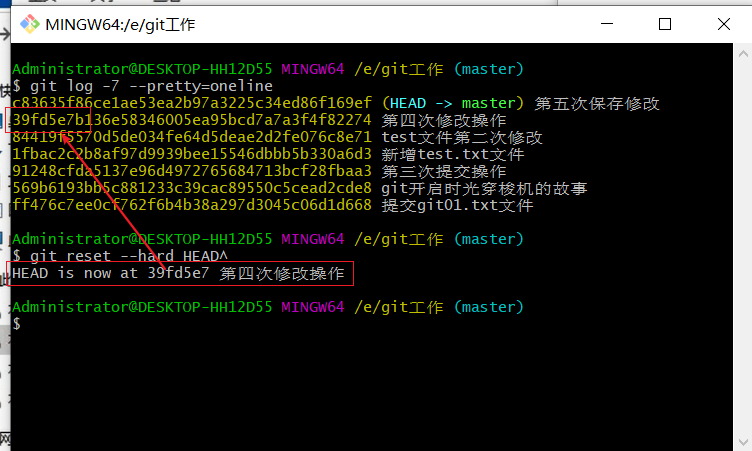

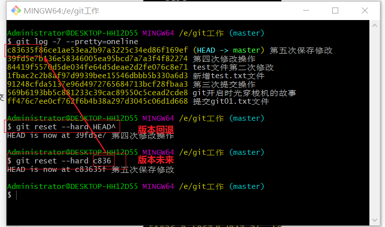

~~~java
git reflog:查看记录在本地的HEAD和分支引用在过去指向的位置
~~~

~~~java
$ git reflog
c83635f (HEAD -> master) HEAD@{0}: reset: moving to c836
39fd5e7 HEAD@{1}: reset: moving to HEAD^
c83635f (HEAD -> master) HEAD@{2}: commit: 第五次保存修改
39fd5e7 HEAD@{3}: commit: 第四次修改操作
84419f5 HEAD@{4}: reset: moving to HEAD
84419f5 HEAD@{5}: commit: test文件第二次修改
1fbac2c HEAD@{6}: commit: 新增test.txt文件
91248cf HEAD@{7}: commit: 第三次提交操作
569b619 HEAD@{8}: commit: git开启时光穿梭机的故事
ff476c7 HEAD@{9}: commit (initial): 提交git01.txt文件

~~~

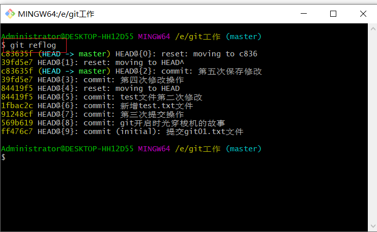

### 5.3 文件删除

~~~java
在Git中，删除文件同样是一个修改操作，即在git的世界里，Git仅仅关注文件是否被修改（文件添加，更新，删除）
~~~

~~~java
假如我们将已经提交到版本库的文件进行删除操作，那么
$ git commit  -m 'git02.txt' --先提交该文件
[master 1324f9c] git02.txt
 1 file changed, 1 insertion(+)
 create mode 100644 git02.txt

Administrator@DESKTOP-HH12D55 MINGW64 /e/git工作 (master)
$ git status --查看状态
On branch master
nothing to commit, working tree clean

Administrator@DESKTOP-HH12D55 MINGW64 /e/git工作 (master)
$ git status --查看文件删除以后的状态
On branch master
Changes not staged for commit:
  (use "git add/rm <file>..." to update what will be committed)
  (use "git checkout -- <file>..." to discard changes in working directory)

        deleted:    git02.txt -- 显示删除操作

no changes added to commit (use "git add" and/or "git commit -a")

但是这样只是把工作区的文件删除了，版本库中仍然有该文件
那么怎么将该文件还原到工作区
命令：
   git checkout -- git02.txt
   此时会还原在工作区中删除的文件
那如果我们就是要进行删除版本库的文件操作：
命令：
   git rm git02.txt
       
~~~

## 6.远程仓库

~~~java
Git是一个分布式版本控制系统，同一个git仓库可以分布到不同机器上，我们可以将代码托管到远程。到时候克隆下来的本地版本文件与远程一致。
远程仓库：
    1.GitHub:https://github.com/
    2.码云：https://gitee.com/
~~~

### 6.1克隆远程项目到本地仓库

~~~java
tip:好用的插件：Octotree
命令：
    git clone 远程仓库地址
    将远程仓库代码克隆到本地
~~~

### 6.2 将本地仓库推送到远程

~~~java
首次将本地仓库推送到远程的空仓库，需要进行以下步骤
命令：
    git remote add origin       https://gitee.com/pure_love_flying/personal-drip.git
    绑定远程仓库地址
命令：
    git push -u origin master
    将代码推送到远程仓库
~~~

~~~java
有两种推送方式：HTTPS和SSH
    其中HTTPS协议以https开头远程仓库地址：https://gitee.com/pure_love_flying/personal-drip.git
    ssh协议以git开头远程仓库地址：git@gitee.com/pure_love_flying/personal-drip.git

进行sshx协议的操作要先申请公钥和私钥
   命令如下：
   ssh-keygen -t rsa -C "GitHub账户邮箱"
~~~

#### 6.2.1 HTTP协议

~~~java
mkdir git01
cd git01
git init
touch README.md
git add README.md
git commit -m "first commit"
git remote add origin https://gitee.com/pure_love_flying/git01.git --绑定远程仓库
git push -u origin master --推送
~~~

#### 6.2.2 SSH协议

~~~java
这种协议更加安全也更加高效。
在进行这个操作之前要先申请公钥和密钥，他们是存在在C盘.ssh文件中。

操作如下：
1.生成公钥私钥
$ ssh-keygen -t rsa -C "1607140115@qq.com" --生成公钥私钥
Generating public/private rsa key pair.
Enter file in which to save the key (/c/Users/Admin/.ssh/id_rsa):
Created directory '/c/Users/Admin/.ssh'.
Enter passphrase (empty for no passphrase):
Enter same passphrase again:
Your identification has been saved in /c/Users/Admin/.ssh/id_rsa.
Your public key has been saved in /c/Users/Admin/.ssh/id_rsa.pub.
The key fingerprint is:
SHA256:2J6GOXKW0kLNsqv51giDRaZw+nvhkws6qKoRkLbPZ8U 1607140115@qq.com
The key's randomart image is:
+---[RSA 2048]----+
|                 |
|..+              |
|+B               |
|= o  o.o         |
|.=  o +ES        |
|..*..+.= .       |
|o .B=BO +        |
|oo.oXB.o         |
|O.o=+o           |
+----[SHA256]-----+
    
2.远端绑定公钥
将公钥复制过来，然后黏贴到相关位置即可。
3.测试公钥私钥是否配对成功
可用如下命令：
$ ssh -T git@gitee.com --查看是否配对成功
The authenticity of host 'gitee.com (180.97.125.228)' can't be established.
ECDSA key fingerprint is SHA256:FQGC9Kn/eye1W8icdBgrQp+KkGYoFgbVr17bmjey0Wc.
Are you sure you want to continue connecting (yes/no)? yes
Warning: Permanently added 'gitee.com,180.97.125.228' (ECDSA) to the list of known hosts.
Hi 纯情小飞飞 (DeployKey)! You've successfully authenticated, but GITEE.COM does not provide shell access.
Note: Perhaps the current use is DeployKey.
Note: DeployKey only supports pull/fetch operations

~~~

~~~java
码云 Incorrect username or password ( access token )解决
Q：Git提交时，给出提示Incorrect username or password ( access token )
K： 此处是用户名或者密码有误，建议解决方法两种。具体看哪一种可行，可试。
(码云的用户名是***@qq.com,密码是***)

第一种，电脑管理器内进行修改；
[控制面板][账号管理][凭据管理器]/针对不同的windows系统，也可以在[控制面板]直接搜索[凭据管理器]
[windows凭据]--> 普通凭据内的gitee 的下拉框打开进行编辑；

第二种方式：
查看命令，生产SSH 公钥秘钥；
私钥id_rsa
公钥id_rsa.pub
~~~

## 7.分支操作

| 命令                                | 描述                                                         |
| ----------------------------------- | ------------------------------------------------------------ |
| git checkout  分支名                | 切换到指定分支                                               |
| git checkout -b 新分支名            | 新建分支并切换到新建分支                                     |
| git branch -d 分支名                | 删除指定分支                                                 |
| git branch                          | 查看所有分支，并且*标记当前所在分支                          |
| git merge 分支名                    | 合并分支（只能在主分支执行合并其他分支操作）                 |
| git branch  -m/-M 旧分支名 新分支名 | 重命名分支：如果newbranch名字分支已经存在，则需要使用-M强制重命名，否则使用-m进行重命名 |

~~~java
注意点：
    1.创建分支的时候主干上有什么东西，分支上就会有什么东西
    2.只能在主分支进行合并其他分支的操作！！！
~~~

### 7.1 分支的创建与删除

~~~java
Administrator@DESKTOP-HH12D55 MINGW64 /e/git工作 (master)
$ git branch -- 查看所有分支，带*的代表当前分支
* master

Administrator@DESKTOP-HH12D55 MINGW64 /e/git工作 (master)
$ git checkout -b 'left01' -- 创建分支并且切换带该分支
Switched to a new branch 'left01'

Administrator@DESKTOP-HH12D55 MINGW64 /e/git工作 (left01)
$ git branch
* left01 
  master

Administrator@DESKTOP-HH12D55 MINGW64 /e/git工作 (left01)
$ git ls-files --查看该分支上所有文件
git01.txt
git02.txt
test.txt

~~~

~~~java
Administrator@DESKTOP-HH12D55 MINGW64 /e/git工作 (master)
$ git checkout -b 'left01'
Switched to a new branch 'left01'

Administrator@DESKTOP-HH12D55 MINGW64 /e/git工作 (left01)
$ git branch
* left01
  master

Administrator@DESKTOP-HH12D55 MINGW64 /e/git工作 (left01)
$ git ls-files
git01.txt
git02.txt
test.txt

Administrator@DESKTOP-HH12D55 MINGW64 /e/git工作 (left01)
$ git status
On branch left01
Untracked files:
  (use "git add <file>..." to include in what will be committed)

        git03.txt

nothing added to commit but untracked files present (use "git add" to track)

Administrator@DESKTOP-HH12D55 MINGW64 /e/git工作 (left01)
$ git add git03.txt

Administrator@DESKTOP-HH12D55 MINGW64 /e/git工作 (left01)
$ git commit -m '分支上git03的第一次提交'
[left01 98302e4] 分支上git03的第一次提交
 1 file changed, 1 insertion(+)
 create mode 100644 git03.txt

Administrator@DESKTOP-HH12D55 MINGW64 /e/git工作 (left01)
$ git ls-files
git01.txt
git02.txt
git03.txt
test.txt

Administrator@DESKTOP-HH12D55 MINGW64 /e/git工作 (left01)
$ git checkout master --切换到主分支
Switched to branch 'master'

Administrator@DESKTOP-HH12D55 MINGW64 /e/git工作 (master)
$ git ls-files --查看分支上所有文件
git01.txt
git02.txt
test.txt

Administrator@DESKTOP-HH12D55 MINGW64 /e/git工作 (master)
$ git merge left01 --合并分支
Updating 3acf1d7..98302e4
Fast-forward
 git03.txt | 1 +
 1 file changed, 1 insertion(+)
 create mode 100644 git03.txt

Administrator@DESKTOP-HH12D55 MINGW64 /e/git工作 (master)
$ git branch -d left01 --删除分支
Deleted branch left01 (was 98302e4).

Administrator@DESKTOP-HH12D55 MINGW64 /e/git工作 (master)
$ git branch--查看所有分支
* master

~~~

### 7.2 分支push与pull

|                      命令                      |                             描述                             |
| :--------------------------------------------: | :----------------------------------------------------------: |
|                 git branch -a                  |                    查看本地和远程所有分支                    |
|           git push origin 本地分支名           | 推送本地分支到远程同名分支（也就是将本地分支放到远程，此时如果远程没有该分支，会创建一个远程分支） |
|         git push origin :remote_branch         |                删除远程分支（本地分支还保留）                |
| git checkout -b  本地分支名  origin/远程分支名 | 拉取远程指定分支并在本地创建分支（**若遇到 git branch -a 无法全部显示远程的分支，只显示master分支可以通过 git fetch 将本地远程跟踪分支进行更新，与远程分支保持一致**） |

~~~java
Administrator@DESKTOP-HH12D55 MINGW64 /e/git操作/git操作深化 (localLeaf01)
$ git push origin localLeaf01 -- 将本地分支推送到远程
Enumerating objects: 4, done.
Counting objects: 100% (4/4), done.
Delta compression using up to 8 threads
Compressing objects: 100% (2/2), done.
Writing objects: 100% (3/3), 312 bytes | 312.00 KiB/s, done.
Total 3 (delta 0), reused 0 (delta 0)
remote: Powered by GITEE.COM [GNK-5.0]
remote: Create a pull request for 'localLeaf01' on Gitee by visiting:
remote:     https://gitee.com/pure_love_flying/git-warehouse-03/pull/new/pure_love_flying:localLeaf01...pure_love_flying:master
To https://gitee.com/pure_love_flying/git-warehouse-03.git
 * [new branch]      localLeaf01 -> localLeaf01

Administrator@DESKTOP-HH12D55 MINGW64 /e/git操作/git操作深化 (localLeaf01)
$ git branch -a --查看本地和远程所有分支
* localLeaf01
  master
  remotes/origin/localLeaf01
  remotes/origin/master

Administrator@DESKTOP-HH12D55 MINGW64 /e/git操作/git操作深化 (localLeaf01)
$ git push origin :localLeaf01 --删除远程指定分支（本地分支还保留）
remote: Powered by GITEE.COM [GNK-5.0]
To https://gitee.com/pure_love_flying/git-warehouse-03.git
 - [deleted]         localLeaf01

~~~

~~~java
命令：
git fetch -- 读取远程仓库最新的一个状态
~~~

~~~java
概念：
    ** 从远程服务器克隆一个一模一样的版本库到本地,复制的是整个版本库，叫做clone.（clone是将一个库复制到你的本地，是一个本地从无到有的过程）
    ** 从远程服务器获取到一个branch分支的更新到本地，并更新本地库，叫做pull.（pull是指同步一个在你本地有版本的库内容更新的部分到你的本地库）
操作上：
    ** git pull相当于是从远程获取最新版本并merge（合并）到本地     
       git pull = git fetch + git merge，git fetch更安全一些
    ** git clone是远程操作的第一步，通常是从远程主机克隆一个版本库，
       eg:$ git clone ##   该命令会在本地主机生成一个目录，与远程主机的版本库同名，如果要是制定不同的目录名，可以将目录名作为git clone 命令的第二个参数。
       eg：$ git clone #版本库网址# #本地目录名#     
       git clone支持多种协议，除了http（s),还有ssh,git,本地协议。
  
实际上  git pull 作用是，取回远程主机某个分支的更新，再与本地的指定分支合并。它的完整格式稍稍有点复杂。
       eg:$ git pull ##远程主机（origin） #远程分之(next)#：#本地分之(master)#
如果远程分支是与当前分支合并，则冒号后面的部分可以省略。
       eg:$ git pull #远程主机(origin)#　 #远程分之(next)#　相当于1. $ git fetch origin   2.$git merge origin/next 
在某些场合，git会自动在本地和远程分之之间，建立一种追踪关系。比如，在git clone 的时候，所有本地分之默认与远程主机的同名分之，建立追踪关系，也就是，本地的master分之自动“追踪”origin/master分之。git 可以手动建立追踪， git branch --set-upstream master origin/next   --->指定master分之追踪到origin/next。
如果当前分支只有一个追踪分支，连远程主机名都可以省略。$ git pull  表示当前分之自动与唯一一个追踪分之进行合并。
~~~

#### 7.2.1 fetch与pull

**fetch(抓取)&&pull(拉取)**

~~~java
他们都可以从远程仓库获取最新的版本信息到本地，
    但是fetch不会自动merge，但实际上文件已经获取到了本地仓库中
    而pull会自动merge
~~~

##### fetch

~~~java
Administrator@DESKTOP-HH12D55 MINGW64 /e/git操作/git操作深化
$ git init --初始化一个本地仓库
Initialized empty Git repository in E:/git鎿嶄綔/git鎿嶄綔娣卞寲/.git/

Administrator@DESKTOP-HH12D55 MINGW64 /e/git操作/git操作深化 (master)
$ git remote--查看远程仓库（此时啥都没有）

Administrator@DESKTOP-HH12D55 MINGW64 /e/git操作/git操作深化 (master)
$ git remote  add origin https://gitee.com/pure_love_flying/git-warehouse-03.git
-- 绑定远程仓库地址
Administrator@DESKTOP-HH12D55 MINGW64 /e/git操作/git操作深化 (master)
$ git remote -v --查看远程仓库
origin  https://gitee.com/pure_love_flying/git-warehouse-03.git (fetch)
origin  https://gitee.com/pure_love_flying/git-warehouse-03.git (push)
~~~

~~~java
Administrator@DESKTOP-HH12D55 MINGW64 /e/git操作/git操作深化 (master)
$ git fetch
remote: Enumerating objects: 9, done.
remote: Counting objects: 100% (9/9), done.
remote: Compressing objects: 100% (5/5), done.
remote: Total 9 (delta 1), reused 0 (delta 0), pack-reused 0
Unpacking objects: 100% (9/9), 750 bytes | 0 bytes/s, done.
From https://gitee.com/pure_love_flying/git-warehouse-03
 * [new branch]      leaf01     -> origin/leaf01
 * [new branch]      master     -> origin/master

Administrator@DESKTOP-HH12D55 MINGW64 /e/git操作/git操作深化 (master)
$ git branch

Administrator@DESKTOP-HH12D55 MINGW64 /e/git操作/git操作深化 (master)
$ git branch -a
  remotes/origin/leaf01
  remotes/origin/master
同时本地分支并没有看到那些文件，而远程是有的。
~~~

~~~java
所以我们需要手动合并
    命令：
    git merge origin/master --将抓取的远程分支合并到本地
~~~

##### pull

~~~java
git pull是从远程仓库获取最新的版本版本并且merge到本地仓库
我们需要指定pull的远程分支名，具体命令如下:
    git pull origin 远程分支名
如果当前本地仓库不是从远程仓库克隆，而是本地创建的仓库，并且仓库中存在文件，此时再从远程仓库拉取文件的时候就会报错（fatal: refusing to merge unrelated histories
），解决此问题可以在git pull 命令后加入参数--allow-unrelated-histories
~~~

~~~java
Administrator@DESKTOP-HH12D55 MINGW64 /e/git操作/git操作深化 (master)
$ git remote add origin https://gitee.com/pure_love_flying/git-warehouse-03.git
g
Administrator@DESKTOP-HH12D55 MINGW64 /e/git操作/git操作深化 (master)
$ git branch

Administrator@DESKTOP-HH12D55 MINGW64 /e/git操作/git操作深化 (master)
$ git branch -a

Administrator@DESKTOP-HH12D55 MINGW64 /e/git操作/git操作深化 (master)
$ git pull origin leaf01
remote: Enumerating objects: 9, done.
remote: Counting objects: 100% (9/9), done.
remote: Compressing objects: 100% (5/5), done.
remote: Total 9 (delta 1), reused 0 (delta 0), pack-reused 0
Unpacking objects: 100% (9/9), 750 bytes | 1024 bytes/s, done.
From https://gitee.com/pure_love_flying/git-warehouse-03
 * branch            leaf01     -> FETCH_HEAD
 * [new branch]      leaf01     -> origin/leaf01

Administrator@DESKTOP-HH12D55 MINGW64 /e/git操作/git操作深化 (master)
$ git branch -a
* master
  remotes/origin/leaf01
~~~

#### 7.2.2 移除远程仓库

~~~java
如果想要解除与远程仓库的绑定，可以使用如下命令：
    git rm remote 远程仓库别名
~~~

### 7.3 分支操作冲突与解决

开发中对不同分支下同一个文件进行修改以后执行合并就会出现文件修改冲突的情况。

#### 7.3.1 本地分支操作冲突

~~~java
如果对于本地的两个分支下的文件git01.txt同时进行修改：
    leaf01分支 git01.txt:
    太棒啦
    真好
    分支leaf01添加内容测试--添加的内容
    
    master分支 git01.txt：
    太棒啦
    真好
    主分支修改
 此时如果申请主分支合并leaf01分支就会出现冲突！
~~~

~~~java

Administrator@DESKTOP-HH12D55 MINGW64 /e/git操作/git操作深化 (leaf01)
$ git branch
* leaf01 --在leaf01分支
  master
Administrator@DESKTOP-HH12D55 MINGW64 /e/git操作/git操作深化 (leaf01)
$ git commit -m '分支leaf01修改并提交'
[leaf01 204356f] 鍒嗘敮leaf01淇敼骞舵彁浜▒
 1 file changed, 1 insertion(+)

Administrator@DESKTOP-HH12D55 MINGW64 /e/git操作/git操作深化 (leaf01)
$ git ls-files
git01.txt
git02.txt
git03.txt
Administrator@DESKTOP-HH12D55 MINGW64 /e/git操作/git操作深化 (leaf01)
$ cat git01.txt
太棒啦
真好
分支leaf01添加内容测试
    
Administrator@DESKTOP-HH12D55 MINGW64 /e/git操作/git操作深化 (leaf01)
$ git checkout master --转换到master分支
Switched to branch 'master'
Your branch is up to date with 'origin/master'.
git ls
Administrator@DESKTOP-HH12D55 MINGW64 /e/git操作/git操作深化 (master)
$ git ls-files
git01.txt
git02.txt
git03.txt
Administrator@DESKTOP-HH12D55 MINGW64 /e/git操作/git操作深化 (master)
$ cat git01.txt
太棒啦
真好

Administrator@DESKTOP-HH12D55 MINGW64 /e/git操作/git操作深化 (master)
$ git status
On branch master
Your branch is up to date with 'origin/master'.

Changes not staged for commit:
  (use "git add <file>..." to update what will be committed)
  (use "git restore <file>..." to discard changes in working directory)
        modified:   git01.txt

no changes added to commit (use "git add" and/or "git commit -a")
gir add
Administrator@DESKTOP-HH12D55 MINGW64 /e/git操作/git操作深化 (master)
$ gir add git01.txt
bash: gir: command not found

Administrator@DESKTOP-HH12D55 MINGW64 /e/git操作/git操作深化 (master)
$ git status
On branch master
Your branch is up to date with 'origin/master'.

Changes not staged for commit:
  (use "git add <file>..." to update what will be committed)
  (use "git restore <file>..." to discard changes in working directory)
        modified:   git01.txt

no changes added to commit (use "git add" and/or "git commit -a")

Administrator@DESKTOP-HH12D55 MINGW64 /e/git操作/git操作深化 (master)
$ git add git01.txt

Administrator@DESKTOP-HH12D55 MINGW64 /e/git操作/git操作深化 (master)
$ git status
On branch master
Your branch is up to date with 'origin/master'.

Changes to be committed:
  (use "git restore --staged <file>..." to unstage)
        modified:   git01.txt

Administrator@DESKTOP-HH12D55 MINGW64 /e/git操作/git操作深化 (master)
$ git commit -m 'master分支修改提交'
[master 47db521] master鍒嗘敮淇敼鎻愪氦
 1 file changed, 1 insertion(+)

合并：
Administrator@DESKTOP-HH12D55 MINGW64 /e/git操作/git操作深化 (master)
$ git merge leaf01
Auto-merging git01.txt
CONFLICT (content): Merge conflict in git01.txt --合并冲突在git01
Automatic merge failed; fix conflicts and then commit the result. --自动合并失败， 修改冲突并且稍后在提交
 
查看冲突文件
Administrator@DESKTOP-HH12D55 MINGW64 /e/git操作/git操作深化 (master|MERGING)
$ cat git01.txt
太棒啦
真好
<<<<<<< HEAD
主分支修改
=======
分支leaf01添加内容测试
>>>>>>> leaf01

~~~

#### 7.3.2 多人协作操作冲突

拉取远程dev分支，并且在本地创建dev开发库，执行命令 git checkout -b dev origin/dev .这里以同台及其不同窗口来模拟两个用户操作同一个分支同一个文件（实际开发中多人操作同一个文件冲突情况比较常见）。

这里两个客户端以c1和c2来描述

**c1用户：**

~~~java
Administrator@DESKTOP-HH12D55 MINGW64 /e/git操作/git操作深化 (master)
$ git status
On branch master
Your branch is up to date with 'origin/master'.

Changes not staged for commit:
  (use "git add <file>..." to update what will be committed)
  (use "git restore <file>..." to discard changes in working directory)
        modified:   git03.txt

no changes added to commit (use "git add" and/or "git commit -a")

Administrator@DESKTOP-HH12D55 MINGW64 /e/git操作/git操作深化 (master)
$ git add git03.txt

Administrator@DESKTOP-HH12D55 MINGW64 /e/git操作/git操作深化 (master)
$ git status
On branch master
Your branch is up to date with 'origin/master'.

Changes to be committed:
  (use "git restore --staged <file>..." to unstage)
        modified:   git03.txt

Administrator@DESKTOP-HH12D55 MINGW64 /e/git操作/git操作深化 (master)
$ git commit -m 'c1用户修改git03'
[master 6e7659d] c1鐢ㄦ埛淇敼git03
 1 file changed, 1 insertion(+)

Administrator@DESKTOP-HH12D55 MINGW64 /e/git操作/git操作深化 (master)
$ git status
On branch master
Your branch is ahead of 'origin/master' by 1 commit.
  (use "git push" to publish your local commits)

nothing to commit, working tree clean

Administrator@DESKTOP-HH12D55 MINGW64 /e/git操作/git操作深化 (master)
$ git push -u origin master
Enumerating objects: 5, done.
Counting objects: 100% (5/5), done.
Delta compression using up to 8 threads
Compressing objects: 100% (2/2), done.
Writing objects: 100% (3/3), 307 bytes | 307.00 KiB/s, done.
Total 3 (delta 1), reused 0 (delta 0), pack-reused 0
remote: Powered by GITEE.COM [GNK-5.0]
To https://gitee.com/pure_love_flying/git-warehouse-03.git
   8d1e5c0..6e7659d  master -> master
Branch 'master' set up to track remote branch 'master' from 'origin'.

此时c1用户修改了git03文件的第二行并且提交到了远程仓库master分支。
~~~

**c2用户：**

~~~java
此时c2用户也推送代码
Administrator@DESKTOP-HH12D55 MINGW64 /e/git操作/git操作深化01/git-warehouse-03 (master)
$ cat git03.txt --查看文件内容
Hello World
c2客户端修改了内容
Administrator@DESKTOP-HH12D55 MINGW64 /e/git操作/git操作深化01/git-warehouse-03 (master)
$ git push -u origin master --推送到远程master分支
To https://gitee.com/pure_love_flying/git-warehouse-03.git
 ! [rejected]        master -> master (fetch first)
error: failed to push some refs to 'https://gitee.com/pure_love_flying/git-warehouse-03.git'
hint: Updates were rejected because the remote contains work that you do
hint: not have locally. This is usually caused by another repository pushing
hint: to the same ref. You may want to first integrate the remote changes
hint: (e.g., 'git pull ...') before pushing again.
hint: See the 'Note about fast-forwards' in 'git push --help' for details.

此时发现推送被拒绝，因为出现了冲突！
~~~

##### 解决方案：

~~~java
先执行pull拉取操作，在进行推送
Administrator@DESKTOP-HH12D55 MINGW64 /e/git操作/git操作深化01/git-warehouse-03 (master)
$ git pull origin master
remote: Enumerating objects: 5, done.
remote: Counting objects: 100% (5/5), done.
remote: Compressing objects: 100% (2/2), done.
remote: Total 3 (delta 1), reused 0 (delta 0), pack-reused 0
Unpacking objects: 100% (3/3), 287 bytes | 2.00 KiB/s, done.
From https://gitee.com/pure_love_flying/git-warehouse-03
 * branch            master     -> FETCH_HEAD
   8d1e5c0..6e7659d  master     -> origin/master
Auto-merging git03.txt
CONFLICT (content): Merge conflict in git03.txt
Automatic merge failed; fix conflicts and then commit the result.
~~~

~~~java
pull拉取操作以后git03的内容
    Hello World
<<<<<<< HEAD
c2客户端修改了内容
=======
这是git深化操作改的
>>>>>>> 6e7659d16142359a34c054fba712bf255f56a785
~~~

~~~java
c2来解决冲突
Administrator@DESKTOP-HH12D55 MINGW64 /e/git操作/git操作深化01/git-warehouse-03 (master|MERGING)
$ cat git03.txt --查看冲突文件
Hello World
<<<<<<< HEAD
c2▒ͻ▒▒▒▒޸▒▒▒▒▒▒▒
=======
▒▒▒▒git▒▒▒▒▒▒ĵ▒
>>>>>>> 6e7659d16142359a34c054fba712bf255f56a785

Administrator@DESKTOP-HH12D55 MINGW64 /e/git操作/git操作深化01/git-warehouse-03 (master|MERGING)
$ git status
On branch master
Your branch and 'origin/master' have diverged,
and have 1 and 1 different commits each, respectively.
  (use "git pull" to merge the remote branch into yours)

You have unmerged paths.
  (fix conflicts and run "git commit")
  (use "git merge --abort" to abort the merge)

Unmerged paths:
  (use "git add <file>..." to mark resolution)
        both modified:   git03.txt

no changes added to commit (use "git add" and/or "git commit -a")

Administrator@DESKTOP-HH12D55 MINGW64 /e/git操作/git操作深化01/git-warehouse-03 (master|MERGING)
$ git add git03.txt git03.txt --将冲突文件修改并且添加到暂存区

Administrator@DESKTOP-HH12D55 MINGW64 /e/git操作/git操作深化01/git-warehouse-03 (master|MERGING)
$ git commit -m 'c2用户修改了git03，解决了冲突' --提交到本地
[master e43c355] c2鐢ㄦ埛淇敼浜唃it03锛岃В鍐充簡鍐茬獊

Administrator@DESKTOP-HH12D55 MINGW64 /e/git操作/git操作深化01/git-warehouse-03 (master)
$ git push -u origin master --推送到远程
Enumerating objects: 10, done.
Counting objects: 100% (10/10), done.
Delta compression using up to 8 threads
Compressing objects: 100% (4/4), done.
Writing objects: 100% (6/6), 642 bytes | 321.00 KiB/s, done.
Total 6 (delta 2), reused 0 (delta 0), pack-reused 0
remote: Powered by GITEE.COM [GNK-5.0]
To https://gitee.com/pure_love_flying/git-warehouse-03.git
   6e7659d..e43c355  master -> master
Branch 'master' set up to track remote branch 'master' from 'origin'.
~~~

## 8.git标签管理

标签基本操作命令git tag

| 命令                                | 描述                             |
| ----------------------------------- | -------------------------------- |
| git tag tag_name                    | 新建标签，默认是HEAD             |
| git tag -a tag_name -m '***'        | 添加标签并且指定该标签描述信息   |
| git tag                             | 查看所有标签                     |
| git tag -d tag_name                 | 删除一个本地标签                 |
| git push origin tag_name            | 推送本地标签到远程               |
| git push origin --tags              | 推送全部未推送过的本地标签到远程 |
| git push origin :refs/tags/tag_name | 删除一个远程标签                 |

同大多数VCS一样，Git也可以对某一时间点上的版本打上标签。开发中在发布某个软件版本（比如v1.0等等）的时候，通常使用版本库命令来对某一个版本打赏一个标签，以方便标识。

~~~java
Administrator@DESKTOP-HH12D55 MINGW64 /e/git操作/git操作深化 (master)
$ git tag --查看所有标签

Administrator@DESKTOP-HH12D55 MINGW64 /e/git操作/git操作深化 (master)
$ git tag v_1.0 --添加一个标签

Administrator@DESKTOP-HH12D55 MINGW64 /e/git操作/git操作深化 (master)
$ git tag --查看所有标签
v_1.0

Administrator@DESKTOP-HH12D55 MINGW64 /e/git操作/git操作深化 (master)
$ git tag -a v_1.1 -m '若干bug修复' --添加一个标签，并给他描述

Administrator@DESKTOP-HH12D55 MINGW64 /e/git操作/git操作深化 (master)
$ git tag
v_1.0
v_1.1

Administrator@DESKTOP-HH12D55 MINGW64 /e/git操作/git操作深化 (master)
$ git push origin v_1.1 --将本地标签推送到远程
Enumerating objects: 6, done.
Counting objects: 100% (6/6), done.
Delta compression using up to 8 threads
Compressing objects: 100% (3/3), done.
Writing objects: 100% (4/4), 455 bytes | 227.00 KiB/s, done.
Total 4 (delta 1), reused 0 (delta 0), pack-reused 0
remote: Powered by GITEE.COM [GNK-5.0]
To https://gitee.com/pure_love_flying/git-warehouse-03.git
 * [new tag]         v_1.1 -> v_1.1
~~~

## 9.IDEA下git的操作

## 命令总结

~~~java
查看git版本
   git --version
查看所有配置：
    git config --list
设置用户名：
    git config --global user.name "fangdeng"
    git config --global user.email "qmzhong@amarsoft.com
命令：在选中的目录下执行
    git init --初始化本地空仓库
命令：
    git add path --将文件添加到暂存区
命令：
    git status --用于显示工作目录和暂存区的的状态
命令：
    git commit -m "描述文字" --将更改的暂存区的文件到提交到版本库
命令:
    git log --用于显示提交的日志信息
（重要）暂存文件撤销命令：
    git reset HEAD --提交到暂存区的文件执行撤销操作
（重要）版本回退命令：
    命令1：
    git reset --hard HEAD^
    ^代表回退几个版本，一个^代表回退到上一个版本
    命令2：
    git reset --hard HEAD~1
    ~后面的数字代表往回退几个版本，1就是代表往回退一个版本
（重要）版本未来命令：
    命令：
    git reset --hard 唯一标识符（保证能唯一区分就可以） 
（重要）查看所有记录：
    命令：
    git reflog:查看记录在本地的HEAD和分支引用在过去指向的位置
命令：
    git checkout -- 文件名
    此时会还原在工作区中删除的文件
命令：
    git rm 文件名 --删除版本库中的文件
命令：
    git ls-files --查看本地仓库本分支的所有文件
~~~

~~~java
命令：
    git  clone 远程地址
    将远程代码克隆到本地
本地仓库分支相关命令：
    git branch --查看所有分支
    git branch -d '分支名' --删除指定分支
    git checkout '分支名' --切换到指定分支
    git checkout -b '新建的分支名' --创建新分支并且切换到新创建的分支
    git merge '要合并的分支名'
    
命令：
    git remote add origin       https://gitee.com/pure_love_flying/personal-drip.git
    绑定远程仓库地址
命令：
    git push -u origin master
    将本地master分支代码推送到远程仓库
~~~

### 本地分支操作

~~~java
本地仓库分支相关命令：
    git branch --查看所有分支
    git branch -d '分支名' --删除指定分支
    git checkout '分支名' --切换到指定分支
    git checkout -b '新建的分支名' --创建新分支并且切换到新创建的分支
    git merge '要合并的分支名'
~~~

### 远程分支操作

~~~java
命令：
    git branch -a --查看本地和远程所有分支
    git push origin <本地分支名> --将本地分支推送到与本地分支同名的远程分支上，没有该分支则会创建该分支
    git push origin :远程分支名 --删除远程指定名称分支（但是本地分支还是保留的）
    git checkout -b 本地分支名 origin/远程分支名 -- 将远程分支拉取到本地
        可能会出现报错的情况：
        新建分支
　　     若遇到 git branch -a 无法全部显示远程的分支，只显示master分支
　　     可以通过 git fetch（上面命令将某个远程主机的更新，全部取回本地）将本地远程跟踪分支进行更新，与远程分支保持一致
~~~

~~~java
命令：
    git merge origin/master --将抓取的远程分支合并到本地
命令：
    git pull origin <远程分支名>:<本地分支名> --将远程指定分支 拉取到本地指定分支上
命令：
    git pull origin 远程分支名 --拉取远程分支到本地当前分支
命令：
    git push origin <本地分支名>:<远程分支名> --将本地当前分支 推送到远程指定分支上
命令：
    git push origin <本地分支名> --将本地分支推送到与本地分支同名的远程分支上，没有该分支则会创建该分支
~~~

### 注意

**执行新键分支的操作以后，内容会自动复制到分支中**

