#  git操作相关

## 1. git相关命令

- 当我们对一个地方`git init`之后会生成`.git`文件，此文件记录当前仓库版本迭代信息，表示当前文件夹下就是一个 git 仓库，当前仓库的改动会被 git 所识别和记录.
- `git clone url `可以将远程仓库克隆下来！

### 1.1 git绑定多个远程仓库⭐

git可以手工绑定多个远程仓库，命令如下：

**方式1**

~~~shell
// 添加github
git remote add origin https://github.com/xxx(仓库地址)
// 添加gitee
git remote add gitee https://git.gitee.com/xxxx(仓库地址)
 
// 删除origin仓库
git remote rm origin
~~~

**方式2**

~~~shell
git remote set-url --add gitee https://git.gitee.com/xxxx(仓库地址)
~~~

注意：

- **origin**和**gitee**为自定义远程仓库的名字，不能重复
- 方式1可以选择任一仓库进行pull，而方式2缺默认只能从config中的第一个url内的仓库pull代码

### 1.2 git的各种回退操作

#### 场景一：工作区改动未 add 还原工作区修改⭐

~~~shell
git checkout -- 文件名
~~~

#### 场景二：已 add 未 commit 还原工作区成 stage 但 stage 不变

这个文件我改动了然后 add 了，但是还没有 commit，之后我又改动了这个文件，可是这时候我想要将其还原成 stage 暂存区中的内容。

~~~shell
git checkout -- 文件名
~~~

#### 场景三：已 add 未 commit 工作区不变撤销 stage（即撤销 add）⭐

这个文件我改动了，然后 add 了，未 commit，这个时候又改动了这个文件，但是此时我想将其 add 操作撤销，也就是删掉 stage 中的内容

~~~shell
# 只撤销某个文件的 add
git reset HEAD 文件名
# 撤销 stage 暂存区所有的 add
git reset HEAD
~~~

#### 版本回退与版本穿梭⭐

回退到历史版本

~~~shell
git reset --hard HEAD^
git reset --hard HEAD~n
~~~

版本穿梭

~~~shell
git reset --hard 版本号
~~~

## 2.idea中操作git

### 2.1.idea绑定git

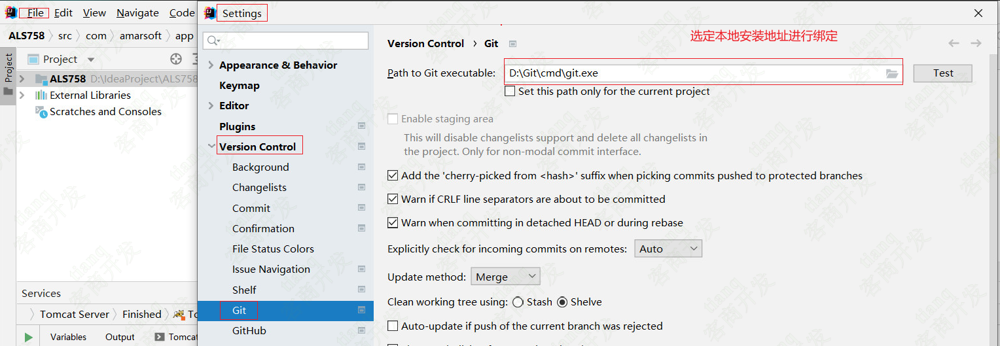

### 2.2 查看本地修改的文件和记录⭐

我们需要在git模块下查看修改的文件

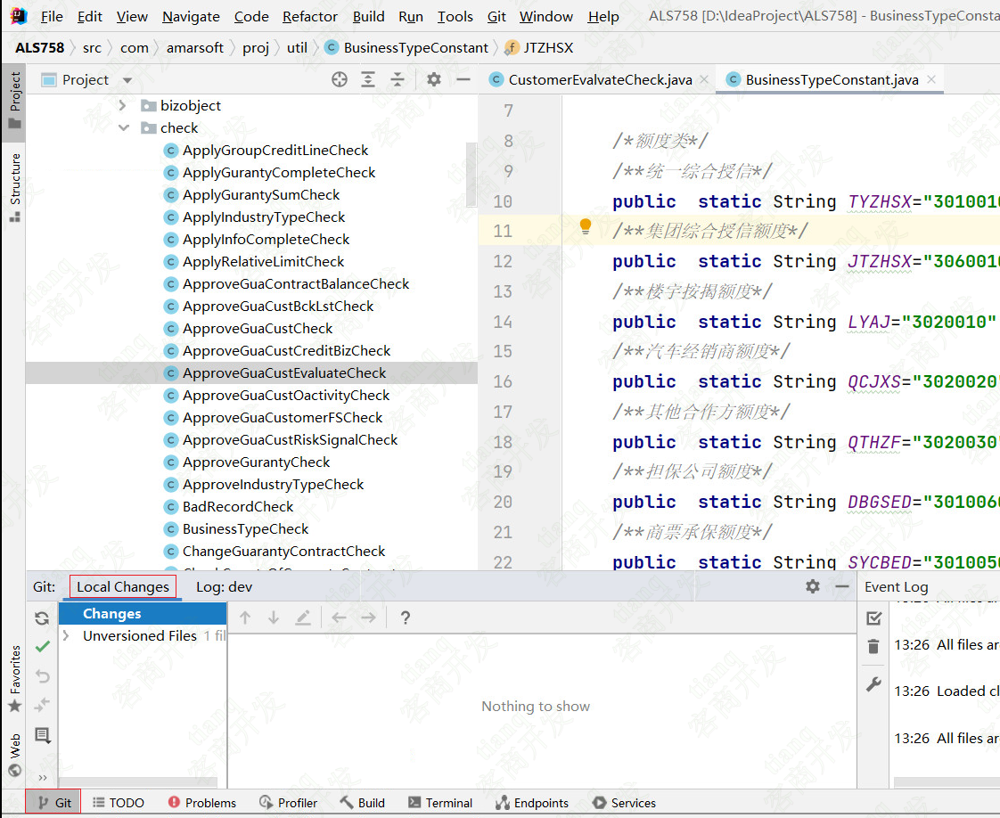如果默认没有这个图标，可以进行如下设置：

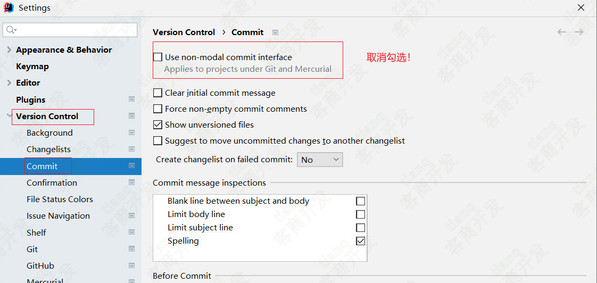

==查看当前内容是谁修改的==

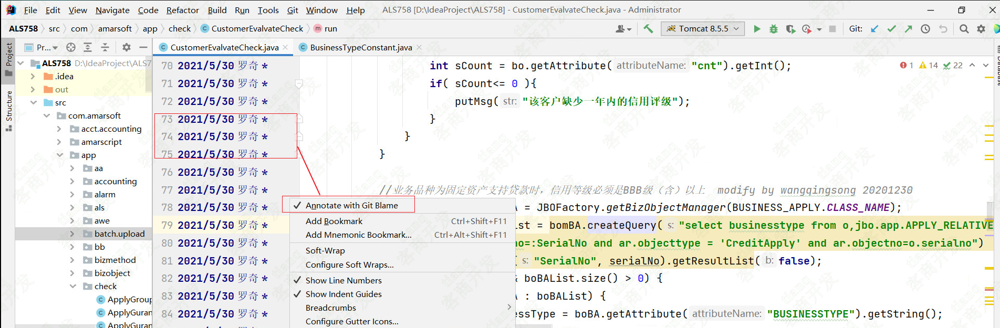

### 2.3 本地分支切换⭐

我们选中本地非当前分支，然后checkout就可以切换本地分支到当前的选中的分支！,也就是在**本地分支中切换**

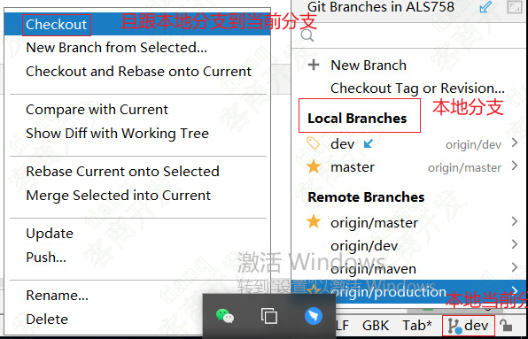

### 2.4 同步远程分支并创建本地分支

**拉取更新远程代码**

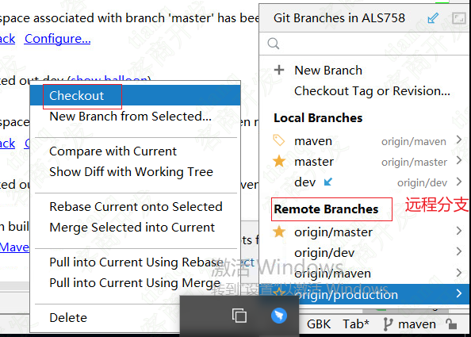

### 2.5 git绑定多个远程仓库

我们可以设置git的多个远程仓库地址，在idea中设置如下：

==git->manager remotes==

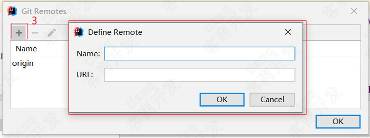

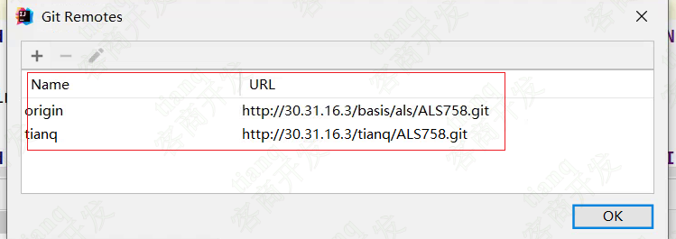

### 2.6 git的拉取，提交

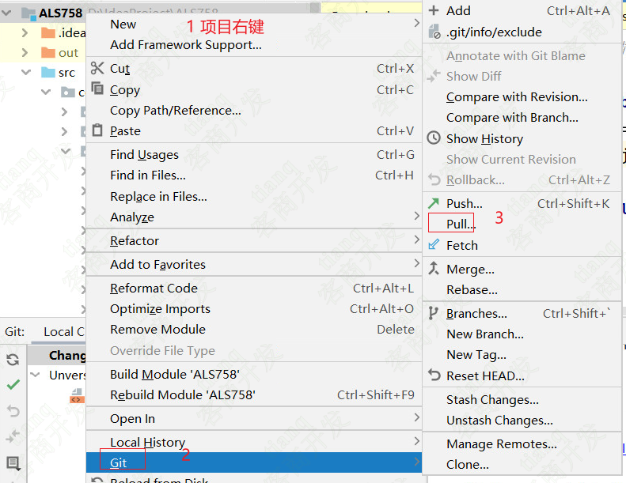

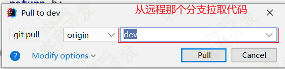

**将本地文件推送到本地版本库**

**文件添加到暂存区**：

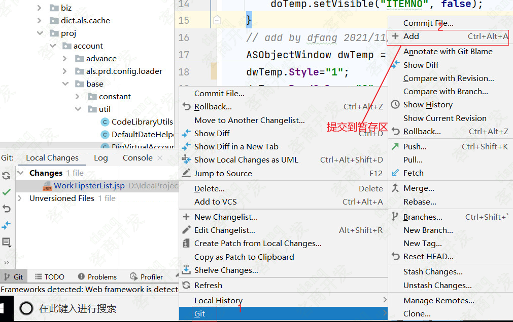

**文件添加到版本库**

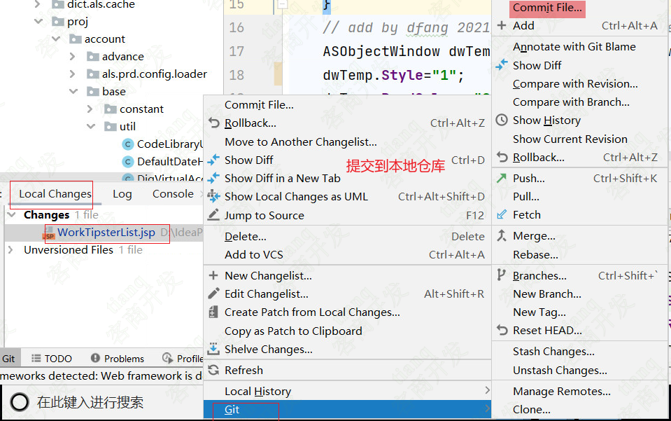

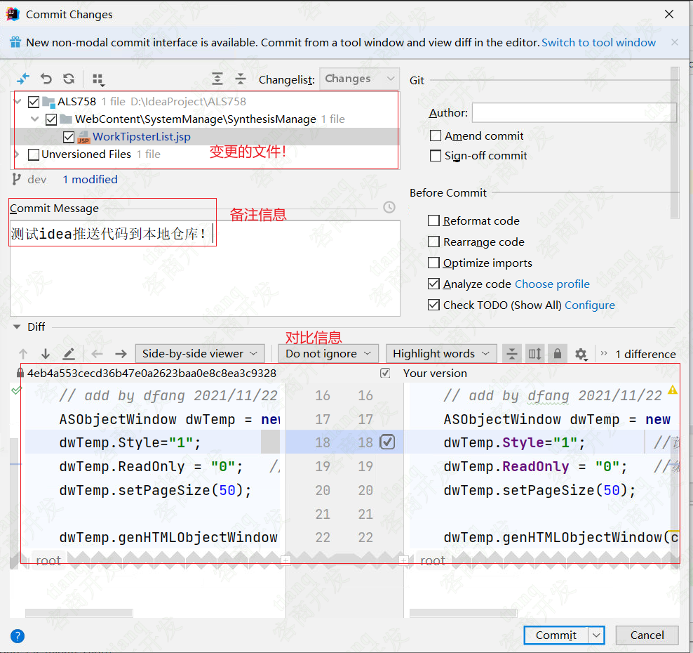

### 2.7 git的推送操作

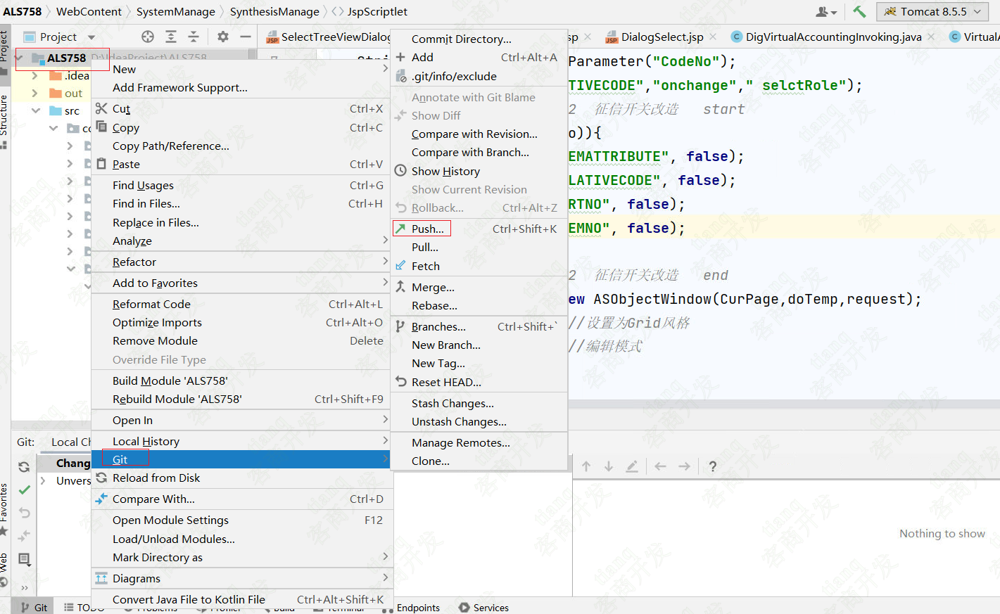

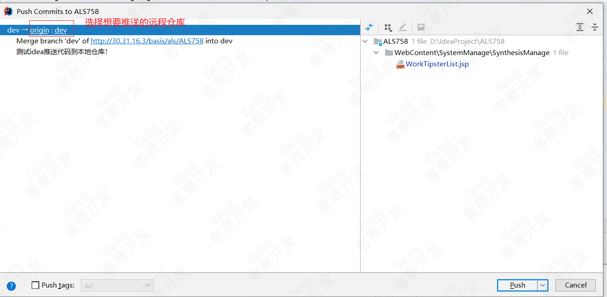

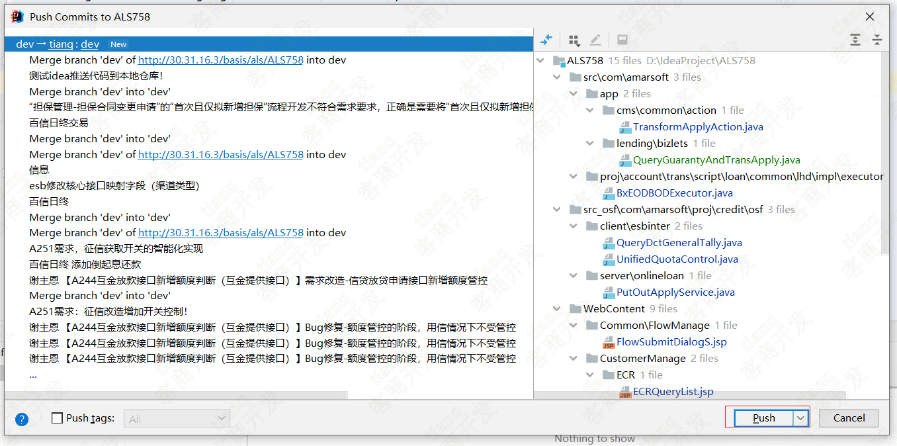

## 3.Idea的其他操作

### 3.1 IDEA如何取消所有断点

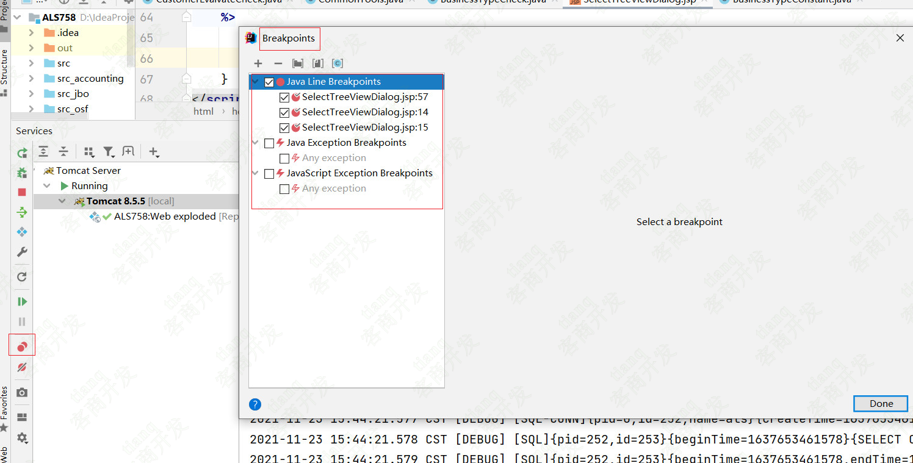