# Java**多线程**

> **前言**：Java多线程从入门到精通，由浅入深。


## 引言

### 什么是进程，线程？

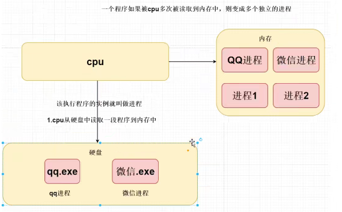

**进程** ：`资源分配的最小单位`,cpu从磁盘中读取一段程序到内存中，该执行程序的实例就叫做进程。一个程序如果被cpu多次读取到内存中，则变成多个独立的进程。

**线程** : 线程是`程序执行的最小单位`，在一个进程中可以有多个不同的线程。


**线程的应用实例：**

*同一个应用程序中(进程)，更好的并行处理。*

例子：手写一个文本编辑器需要多少个线程？

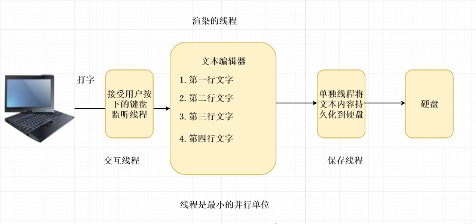


为什么需要使用多线程？

**采用多线程的形式执行代码，目的是为了提高程序开发的效率。**


### 串行、并行的区别

> CPU分时间片交替执行，宏观并行，微观串行，由OS负责调度。如今的CPU已经发展到了多核CPU，真正存在并行。

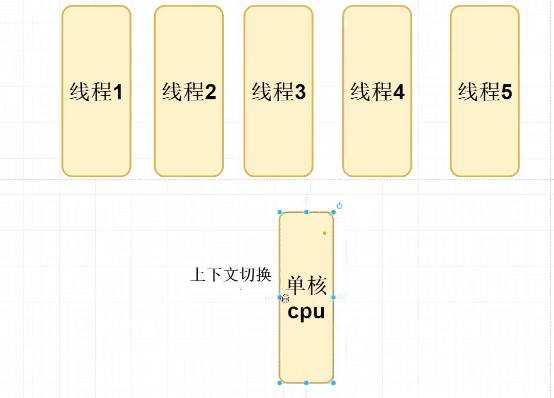

### CPU调度算法

>  多线程是不是一定提高效率？     不一定，需要了解cpu调度的算法。

**CPU调度算法：** 

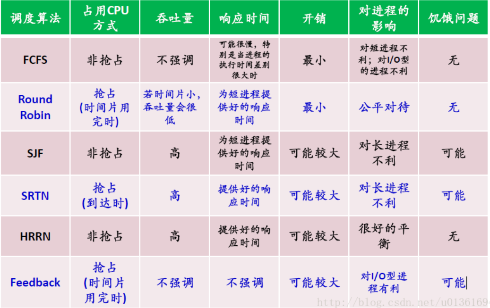


**如果在生产环境中，开启很多线程，但是我们的服务器核数很低，我们这么多线程会在cpu上做上下文切换，反而会降低效率。**

`使用线程池来限制线程数和cpu数相同会比较好。`


## 一、Java多线程基础

### 创建线程的方式

1. 继承`Thread`类创建线程
2. 实现`Runnable`接口创建线程
3. 使用匿名内部类形式创建线程
4. 使用`Lambda`表达式创建
5. 使用`Callable`和 `Future`创建线程
6. 使用线程池创建
7. Spring中的`@Async`创建


#### 1.继承`Thread`类创建线程

```java

public class ThreadTest extends Thread{
    @Override
    public void run() {
        for (int i = 0; i < 10; i++) {
            System.out.println("子线程,线程一");
        }

    }
    
/* 创建对象进入初始状态，调用start()进入就绪状态。直接调用run()方法，相当于在main中执行run。并不是新线程*/
    public static void main(String[] args) {
        new ThreadTest().start();

    }
}

```

#### 2.实现`Runnable`接口创建线程

```java
public class Thread02 implements Runnable {

    @Override
    public void run() {
        System.out.println(Thread.currentThread().getName()+"我是子线程");
    }
    public static void main(String[] args) {
        new Thread(new Thread02()).start();
    }
}
```

#### 3.使用匿名内部类形式创建线程

```java
    public static void main(String[] args) {
        new Thread(new Runnable() {
            @Override
            public void run() {
                System.out.println(Thread.currentThread().getName()+"我是子线程");
            }
        }).start();
    }
```

#### 4.使用`Lambda`表达式创建

```java
public class Thread02  {
    public static void main(String[] args) {
        new Thread(() -> System.out.println(Thread.currentThread().getName()+"我是子线程")).start();
    }
}
```

#### 5.使用`Callable`和 `Future`创建线程

Callable和Future线程可以获取到返回结果，底层基于`LockSupport`。 （这里只是略写，后面有详细介绍）

```java
Runnable的缺点：
1.  run没有返回值
2.  不能抛异常
    
Callable接口允许线程有返回值，也允许线程抛出异常
Future接口用来接受返回值
```

```java
public class Thread03 implements Callable<Integer> {
    /**
     * 当前线程需要执行的代码，返回结果
     * @return 1
     * @throws Exception
     */
    @Override
    public Integer call() throws Exception {
        System.out.println(Thread.currentThread().getName()+"返回1");
        return 1;
    }
}
```

```java
public static void main(String[] args) throws ExecutionException, InterruptedException {
    Thread03 callable = new Thread03();
    FutureTask<Integer> integerFutureTask = new FutureTask<Integer>(callable);
    new Thread(integerFutureTask).start();
    //通过api获取返回结果，主线程需要等待子线程返回结果
    Integer result = integerFutureTask.get();
    System.out.println(Thread.currentThread().getName()+","+result); // main,1
}
```

#### 6.使用线程池创建

```java
public class ThreadExecutor {
    public static void main(String[] args) {
     ExecutorService executorService = Executors.newCachedThreadPool();
     executorService.execute(new Runnable() {
         @Override
         public void run() {
             System.out.println(Thread.currentThread().getName()+"我是子线程1");
         }
     });
     executorService.submit(new Thread03()); //submit一个线程到线程池
    }
}
```


#### 7.Spring中的`@Async`创建

第一步：在入口类中开启异步注解

```java
@SpringBootApplication
@EnableAsync
```

第二步：在当前方法上加上@Async

```java
@Component
@Slf4j
public class Thread01 {
    @Async
    public void asyncLog(){
        try {
            Thread.sleep(3000);
            log.info("<2>");
        } catch (InterruptedException e) {
            e.printStackTrace();
        }
    }

}
```

第三步：验证测试

```java

@RestController
@Slf4j
public class Service {
    @Autowired
    private Thread01 thread01;
    @RequestMapping("test")
    public String Test(){
        log.info("<1>");
        thread01.asyncLog();
        log.info("<3>");
        return "test";
    }
}

```

访问`localhost:8080/test`查看日志为：

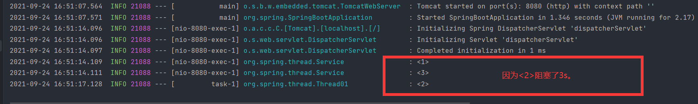


### `Thread`中的常用的方法

1.`Thread.currentThread() 方法可以获得当前线程`

java中的任何一段代码都是执行在某个线程当中的，执行当前代码的线程就是当前线程。


2.`setName()/getName`

```java
thread.currentThread().setName(线程名称) //设置线程名称
thread.currentThread().getName() //返回线程名称
```

通过设置线程名称，有助于调试程序，提高程序的可读性，建议为每个线程都设置一个能够体现线程功能的名称。


3.`isAlive()` 

```java
thread.isAlive() //判断当前线程是否处于活动状态
```

4.`sleep()` 

```java
Thread.sleep(millis); //让当前线程休眠指定的毫秒数
```

实例：计时器(一分钟倒计时)

```java
package se.high.thread;

/**
 * @author 王泽
 * 使用线程休眠，实现一个简单的计数器。
 */

public class SimpleTimer {

    public static void main(String[] args) {
        int remaining = 60 ; //从60秒开始计时

        while(true){
            try {
                System.out.println("时间：  " + remaining);
                if (remaining >= 0){ remaining--; }
                Thread.sleep(1000); //线程休眠
                if(remaining == -1){break;}
            } catch (InterruptedException e) {
                e.printStackTrace();
            }
        }
    }
}

```

5.`getId()` java中的线程都有一个唯一编号


6.`yield()`  放弃当前的cpu资源

```java
Thread.yield();  //可以让线程由运行转为就绪状态
```

7.`setPriority()` 设置线程的优先级

```java
thread.setPriority(num); 设置线程的优先级，取值为1-10，如果超过范围会抛出异常  IllegalArugumentExption;

优先级越高的线程，获得cpu资源的概率越大。
优先级本质上只是给线程调度器一个提示信息，以便于线程调度器决定先调度哪些线程。不能保证优先级高的线程先运行。
java优先级设置不当，可能导致某些线程永远无法得到运行，产生了线程饥饿。
    线程的优先级并不是设置的越高越好，在开发时不必设置线程的优先级。
```

8.`interrupt()`中断线程 (Thread中的方法。)

```java
因为interrupt()方法只能中断阻塞过程中的线程而不能中断正在运行过程中的线程。

在运行中的线程使用：
注意调用此方法仅仅是在当前线程打一个停止标志，并不是真正的停止线程。
例如在线程1中调用线程b的interrupt(),在b线程中监听b线程的中断标志，来处理结束。
```

```java
package se.high.thread;

/**
 * @author 王泽
 */

public class YieldTest extends Thread {
    @Override
    public void run() {
        for (int i = 1; i < 1000; i++) {
            // 判断中断标志
            if (this.isInterrupted()){
                //如果为true，结束线程
                //break;
                return;
            }
            System.out.println("thread 1 --->"+i);
        }
    }
}

```

```java
package se.high.thread;

/**
 * @author 王泽
 */

public class Test {
    public static void main(String[] args) {
        YieldTest t1 = new YieldTest();
        t1.start(); //开启子线程

        //当前线程main线程
        for (int i = 1; i < 100; i++) {
            System.out.println("main --->" + i);
        }
        //打印完main线程中100个后，中断子线程,仅仅是个标记，必须在线程中处理
        t1.interrupt();
    }

}

```

9.`setDaemon()` 守护线程

```java
//线程启动前
thread.setDaemon(true);
thread.start();
```

java中的线程分为用户线程与守护线程

守护线程是为其他线程提供服务的线程，如垃圾回收(GC)就是一个典型的守护线程。

守护线程不能单独运行，当jvm中没有其他用户线程，只有守护线程时，守护线程会自动销毁，jvm会自动退出。


### 线程的状态

**线程的状态：**`getState()`

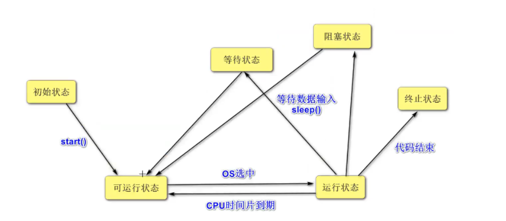


### 阶段案例：手写`@Async`异步注解

思路：通过Aop拦截只要在我们方法上有使用到我们自己定义的异步注解，我们就单独的开启一个异步线程去执行目标方法。


1.自定义一个注解

```java
/**
 * @author 王泽
 */
@Target({ElementType.TYPE, ElementType.METHOD})
@Retention(RetentionPolicy.RUNTIME)
@Documented
public @interface MyAsync {
    String value() default "";
}

```

2.Aop编程

```java

 @Aspect 用来类上,代表这个类是一个切面
 @Before 用在方法上代表这个方法是一个前置通知方法
 @After 用在方法上代表这个方法是一个后置通知方法 @Around 用在方法上代表这个方法是一个环绕的方法
 @Around 用在方法上代表这个方法是一个环绕的方法
 */

@Component
@Aspect
@Slf4j
public class ExtThreadAsyncAop {

    @Around(value ="@annotation(org.spring.annotation.MyAsync)")
    public Object around(ProceedingJoinPoint joinPoint){
        try {
            log.info(">环绕通知开始执行<");
            new Thread(new Runnable() {
                @SneakyThrows
                @Override
                public void run() {
                    joinPoint.proceed();//目标方法
                }
            }).start();
            log.info(">环绕通知结束执行<");
            return "环绕通知";
        }catch (Throwable throwable){
            return "系统错误";
        }
    }

}

```

3.使用自定义注解

```java
@Component
@Slf4j
public class Thread01 {
    @MyAsync
    public void asyncLog(){
        try {
            log.info("目标方法正在执行...阻塞3s");
            Thread.sleep(3000);
            log.info("<2>");
        } catch (InterruptedException e) {
            e.printStackTrace();
        }
    }

}

```

4.测试

```java
/**
 * @author 王泽
 */
@RestController
@Slf4j
public class Service {
    @Autowired
    private Thread01 thread01;
    @RequestMapping("test")
    public String Test(){
        log.info("<1>");
        thread01.asyncLog();
        log.info("<3>");
        return "test";
    }

}
```

5.结果：

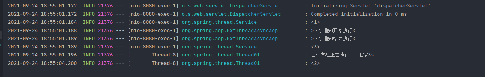


## 二、线程安全原理篇

**多线程的好处：**

1. 提高了系统的`吞吐量`，多线程编程可以使一个进程有`多个并发(concurrent)。`
2. 提高`响应性`，服务器会采用一些专门的线程负责用户的请求处理，缩短了用户的等待时间。
3. `充分利用多核处理器资源`，通过多线程可以充分的利用CPU资源。

**多线程的问题：**

1. `线程安全`问题，多线程共享数据时，如果没有采取正确的并发访问控制措施，就可能产生数据一致性问题，如读取脏数据（过期的数据），如丢失数据更新。

2. `线程活性(thread liveness)`问题。由于程序自身的缺陷或者由资源稀缺性导致的线程一直处于`非RUNNABLE状态`，这就是线程活性问题。

   常见的线程活性问题：

   1.`死锁 （DeadLock）` 鹬蚌相争
   2.`锁死 （Lockout）` 睡美人故事中王子挂啦
   3.`活锁 （LiveLock）` 类似小猫一直咬自己的尾巴，但是咬不到
   4.`饥饿 （Starvation）`类似于健壮的雏鸟总是从母鸟嘴中抢食物。

3. `上下文切换(Context Switch) `处理器从执行一个线程切换到执行另外一个线程。

4. `可靠性 `可能会由一个线程导致JVM意外终止，其他线程也无法执行。


### 线程安全问题

**什么是线程安全问题？**

当多个线程对同一个对象的实例变量，做写(修改)的操作时，可能会受到其他线程的干扰，发生线程安全的问题。


#### **原子性(Atomic)：**

`不可分割`，访问(读，写)某个共享变量的时候，从其他线程来看，该操作要么已经执行完毕，要么尚未发生。其他线程看不到当前操作的中间结果。 访问同一组`共享变量`的原子操作是不能够交错的，如现实生活中从ATM取款。

```java
java中有两种方式实现原子性：
    1.锁 ：锁具有排他性，可以保证共享变量某一时刻只能被一个线程访问。
    2.CAS指令 ：直接在硬件层次上实现，看做是一个硬件锁。
```

#### **可见性(visbility)：**

在多线程环境中，一个线程对某个`共享变量`更新之后，后续其他的线程可能无法立即读到这个更新的结果。

如果一个线程对共享变量更新之后，后续访问该变量的其他线程可以读到更新的结果，称这个线程对共享变量的更新对其他线程可见。否则称这个线程对共享变量的更新对其他线程不可见。

`多线程程序因为可见性问题可能会导致其他线程读取到旧数据(脏数据)。`

#### **有序性(Ordering)：**

是指在什么情况下一个处理器上运行的一个线程所执行的 `内存访问操作`在另外一个处理器运行的其他线程来看是`乱序`的(Out of Order)

*乱序: 是指内存访问操作的顺序看起来发生了变化。*


### 重排序与happens-before

#### 重排序

> 一个处理器上执行的多个操作，在其他处理器来看它的顺序与目标代码执行的顺序可能不一致，这种现象成为重排序。（不是必然出现）

 在多核处理器的环境下，编写的顺序结构，这种操作执行的顺序可能是没有保障的：

- 编译器可能会改变两个程序的先后顺序；


- 处理器也可能不会按照目标代码的顺序执行；


**重排序是对内存访问有序操作的一种优化，可以在不影响单线程程序正确的情况下提升程序的性能，但是可能对多线程程序的正确性产生影响，即可能导致线程安全问题。**

1. **指令重排序(确实排序了)** JVM

   *计算机在执行程序时，为了提高性能，编译器和处理器常常会对指令做重排。*

   源码顺序与程序顺序不一致，或者程序顺序与执行顺序不一致的情况下，我们就说发生了指令重排序(Instruction Reorder).

   `javac`编译器一般不会执行指令重排序，而`JIT`编译器可能执行指令重排序。

   **指令重排对于提高CPU处理性能十分必要。虽然由此带来了乱序的问题，但是这点牺牲是值得的。**

   指令重排一般分为以下三种：

   - **编译器优化重排**

     编译器在**不改变单线程程序语义**的前提下，可以重新安排语句的执行顺序。

   - **指令并行重排**

     现代处理器采用了指令级并行技术来将多条指令重叠执行。如果**不存在数据依赖性**(即后一个执行的语句无需依赖前面执行的语句的结果)，处理器可以改变语句对应的机器指令的执行顺序。

   - **内存系统重排**

     由于处理器使用缓存和读写缓存冲区，这使得加载(load)和存储(store)操作看上去可能是在乱序执行，因为三级缓存的存在，导致内存与缓存的数据同步存在时间差。

2. **存储子系统重排序(没有真正的排序)** CPU

   存储子系统是指写缓冲器与高速缓存。

   高速缓存(Cache)是CPU中为了匹配与主内存处理速度不匹配儿设计的一个高速缓存。

   写缓冲器(Store buffer,Wirte buffer) 用来提高写高速缓存操作的效率。

   **即使处理器严格按照程序顺序执行两个内存访问操作，在存储子系统的作用下，其他处理器对这两个操作的感知顺序与程序顺序不一致。**

   > 从处理器角度来看，读内存就是从指定的RAM地址中加载数据到寄存器，成为**Load**操作；写内存就是把数据存储到指定的地址表示的RAM存储单元中，称为**Store**操作，内存重排序有以下四中可能：
   >
   > 1. LoadLoad重排序，在一个处理器上先后执行两个读操作L1和L2，其他处理器对这两个内存操作的感知顺序可能是先L2。
   > 2. StoreStore重排序，一个处理器上先后执行两个写操作W1和W2，其他处理器对两个内存操作的感知顺序可能是先W2。
   > 3. LoadStore重排序，一个处理器上先执行读内存L1再执行写内存W1，其他内存感知顺序可能是W1在前。
   > 4. StoreLoad重排序，一个处理器上先执行写操作W1再执行读内存L1，其他内存感知顺序可能是L1在前。
   >
   > **内存重排序与具体的处理器微架构有关，不同架构的处理器所允许的内存重排序不同。内存重排序可能会导致线程的安全问题。**

3. **貌似串行语义**

   JIt编译器，处理器，存储子系统是按照一定的规则对指令，内存操作的结果进行重排序，给单线程程序造成一种假象--指令是按照源码顺序执行的，这种假象称为貌似串行语义。并不能保证多线程环境程序的正确性。

   不存在数据依赖关系可能重排序。

   存在控制依赖关系的语句允许重排。(如先执行if语句，在执行判断条件)

   

**保证内存访问的顺序性**

可以使用`volatile`关键字，`synchronized`关键字实现有序性。


#### happens-before

*一方面，程序员需要JMM提供一个强的内存模型来编写代码；另一方面，编译器和处理器希望JMM对它们的束缚越少越好，这样它们就可以最可能多的做优化来提高性能，希望的是一个弱的内存模型。*

JMM考虑了这两种需求，并且找到了平衡点，对编译器和处理器来说，**只要不改变程序的执行结果（单线程程序和正确同步了的多线程程序），编译器和处理器怎么优化都行。**

而对于程序员，JMM提供了**happens-before规则**（JSR-133规范），满足了程序员的需求——**简单易懂，并且提供了足够强的内存可见性保证。**换言之，程序员只要遵循happens-before规则，那他写的程序就能保证在JMM中具有强的内存可见性。

JMM使用happens-before的概念来定制两个操作之间的执行顺序。这两个操作可以在一个线程以内，也可以是不同的线程之间。因此，JMM可以通过happens-before关系向程序员提供跨线程的内存可见性保证。

happens-before关系的定义如下：

1. 如果一个操作happens-before另一个操作，那么第一个操作的执行结果将对第二个操作可见，而且第一个操作的执行顺序排在第二个操作之前。
2. **两个操作之间存在happens-before关系，并不意味着Java平台的具体实现必须要按照happens-before关系指定的顺序来执行。如果重排序之后的执行结果，与按happens-before关系来执行的结果一致，那么JMM也允许这样的重排序。**

as-if-serial语义保证单线程内重排序后的执行结果和程序代码本身应有的结果是一致的，happens-before关系保证正确同步的多线程程序的执行结果不被重排序改变。

总之，**如果操作A happens-before操作B，那么操作A在内存上所做的操作对操作B都是可见的，不管它们在不在一个线程。**

- ```markdown
  在Java中，有以下天然的happens-before关系：
  
  - 程序顺序规则：一个线程中的每一个操作，happens-before于该线程中的任意后续操作。
  - 监视器锁规则：对一个锁的解锁，happens-before于随后对这个锁的加锁。
  - volatile变量规则：对一个volatile域的写，happens-before于任意后续对这个volatile域的读。
  - 传递性：如果A happens-before B，且B happens-before C，那么A happens-before C。
  - start规则：如果线程A执行操作ThreadB.start()启动线程B，那么A线程的ThreadB.start（）操作happens-before于线程B中的任意操作、
  - join规则：如果线程A执行操作ThreadB.join（）并成功返回，那么线程B中的任意操作happens-before于线程A从ThreadB.join()操作成功返回。
  ```

  

### JVM与JMM

#### JVM运行时数据区

先谈一下运行时数据区，下面这张图相信大家一点都不陌生：


**对于每一个线程来说，栈都是私有的，而堆是共有的。**

也就是说在栈中的变量（局部变量、方法定义参数、异常处理器参数）不会在线程之间共享，也就不会有内存可见性（下文会说到）的问题，也不受内存模型的影响。而在堆中的变量是共享的，本文称为共享变量。

所以，内存可见性是针对的**共享变量**。

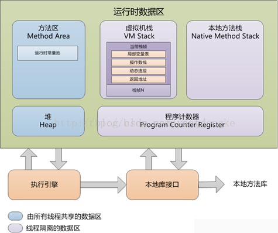


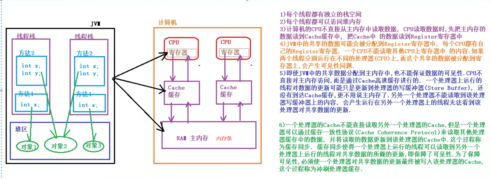


#### JMM模型


从图中可以看出：

1. 所有的共享变量都存在主内存中。
2. 每个线程都保存了一份该线程使用到的共享变量的副本。
3. 如果线程A与线程B之间要通信的话，必须经历下面2个步骤：
   1. 线程A将本地内存A中更新过的共享变量刷新到主内存中去。
   2. 线程B到主内存中去读取线程A之前已经更新过的共享变量。

**所以，线程A无法直接访问线程B的工作内存，线程间通信必须经过主内存。**

注意，根据JMM的规定，**线程对共享变量的所有操作都必须在自己的本地内存中进行，不能直接从主内存中读取**。

所以线程B并不是直接去主内存中读取共享变量的值，而是先在本地内存B中找到这个共享变量，发现这个共享变量已经被更新了，然后本地内存B去主内存中读取这个共享变量的新值，并拷贝到本地内存B中，最后线程B再读取本地内存B中的新值。

那么怎么知道这个共享变量的被其他线程更新了呢？这就是JMM的功劳了，也是JMM存在的必要性之一。**JMM通过控制主内存与每个线程的本地内存之间的交互，来提供内存可见性保证**。

> **Java中的volatile关键字可以保证多线程操作共享变量的可见性以及禁止指令重排序**，synchronized关键字不仅保证可见性，同时也保证了原子性（互斥性）。在更底层，JMM通过内存屏障来实现内存的可见性以及禁止重排序。为了程序员的方便理解，提出了happens-before，它更加的简单易懂，从而避免了程序员为了理解内存可见性而去学习复杂的重排序规则以及这些规则的具体实现方法。


#### JMM与Java内存区域划分的区别与联系

上面两小节分别提到了JMM和Java运行时内存区域的划分，这两者既有差别又有联系：

- 区别

  两者是不同的概念层次。JMM是抽象的，他是用来描述一组规则，通过这个规则来控制各个变量的访问方式，围绕原子性、有序性、可见性等展开的。而Java运行时内存的划分是具体的，是JVM运行Java程序时，必要的内存划分。

- 联系

  都存在私有数据区域和共享数据区域。一般来说，JMM中的主内存属于共享数据区域，他是包含了堆和方法区；同样，JMM中的本地内存属于私有数据区域，包含了程序计数器、本地方法栈、虚拟机栈。

**实际上，他们表达的是同一种含义，这里不做区分。**


### 出现线程不安全的例子：

```java
public class ThreadCount implements Runnable{
    private int count =100;

    @Override
    public void run() {
        while(true){
            if (count>0){
                count--;
                System.out.println(Thread.currentThread().getName()+"---->"+count);
            }
        }

    }

    public static void main(String[] args) {
        ThreadCount threadCount = new ThreadCount();
        new Thread(threadCount).start();
        new Thread(threadCount).start();
    }
}

```


**如何解决线程安全的问题？**

核心思想：上锁

*在同一个JVM中，多个线程需要竞争锁的资源，最终只能够有一个线程能够获取到锁，多个线程同时抢一把锁，哪个线程能够获得到锁，谁就可以执行该代码，如果没有获取锁成功，中间需要经历锁的升级过程，如果一直没有获取到锁则会一直阻塞等待。*

例如上述情况下如何上锁呢？？

```java
public class ThreadCount implements Runnable{
    private  int count =100;

    @Override
    public void run() {
        while(true){
            if (count>0){
                /*线程0 线程1 同时获取this锁，假设线程0 获取到this锁，意味着线程1没有获取到锁则会等待。等线程0执行完count-- 释放锁资源后，就会唤醒线程1 从新进入到获取锁的资源。 获取锁与释放锁全部由虚拟机实现*/
                synchronized (this){
                    count--;
                    System.out.println(Thread.currentThread().getName()+"----"+count);
                }
            }
        }

    }

    public static void main(String[] args) {
        ThreadCount threadCount = new ThreadCount();
        new Thread(threadCount).start();
        new Thread(threadCount).start();
    }
}
```

## 三、线程同步

> 线程同步可以理解为线程之间按照**一定的顺序**执行。

*在我们的线程之间，有一个同步的概念。什么是同步呢，假如我们现在有2位正在抄暑假作业答案的同学：线程A和线程B。当他们正在抄的时候，老师突然来修改了一些答案，可能A和B最后写出的暑假作业就不一样。我们为了A,B能写出2本相同的暑假作业，我们就需要让老师先修改答案，然后A，B同学再抄。或者A，B同学先抄完，老师再修改答案。这就是线程A，线程B的线程同步。*

线程安全的产生就是因为多线程之间没有同步，**线程同步机制是一套用于协调线程之间的数据访问机制，该机制可以保证线程安全。**

Java平台提供的线程机制包括`锁`，`volatile关键字`，`final关键字`，`static关键字`，以及相关的`API,Objet.wait(); Object.notify()`等。


### 锁的概念

> 线程安全问题的产生前提是多个线程并发访问共享数据。**将多个线程对共享数据的并发访问转为串行访问，即一个共享数据一次只能被一个线程访问。锁就是用这种思路来保证线程安全的.**
>
> 一个线程只能有锁的时候才能对共享数据进项访问，结束访问后必须释放锁。
>
> 持有锁和释放锁之间所执行的代码叫做**临界区(CriticalSection)**
>
> 锁具有**排他性**，即一个锁只能被一个线程持有，这种锁被称为**互斥锁**


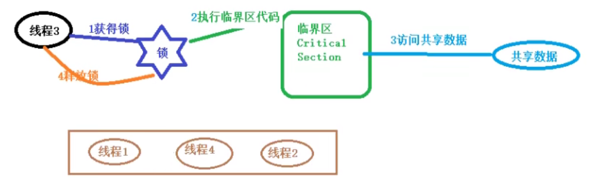


**JVM把锁分为内部锁和显示锁两种。内部所通过`synchronized`关键字实现；显示锁通过`java.concurrent.locks.lock`接口实现类实现的。**


> **锁的作用：**锁可以实现对共享数据的安全访问，保障线程的`原子性`，`可见性`，`与有序性。`

- 锁是通过互斥保障原子性，一个锁只能被一个线程持有，这就保证临界区的代码一次只能被一个线程执行，使得操作不可分割，保证原子性。
- 可见性的保障是通过**写线程冲刷处理器的缓存和读线程刷新处理器缓存**这两个动作实现的。在java中，锁的获得隐含着刷新处理器缓存的动作，锁的释放隐含着冲刷处理器缓存的动作。**保证写线程对数据的修改，第一时间推送到处理器的高速缓存中，保证读线程第一时间可见。**
- 锁能够保证有序性，写线程在临界区所执行的在读线程所执行的临界区看来像是完全按照源码顺序执行的。

**注意**：使用锁来保证线程的安全性必须满足以下条件：

- 这些线程在访问共享数据时，必须使用同一个锁。
- 这些线程即使仅仅是读共享数据，也需要使用锁。


> **锁相关的概念：**

1. 可重入性(Reentrancy)

   一个线程持有一个锁的时候，能否再次申请该锁？

   ```java
   void methodA(){							void methodB(){
       申请a锁								申请a锁；
        methodB();									...
       释放a锁								释放a锁
   }										}
   A线程 重复申请了a锁。
   ```

2. 锁的争用与调度

   java平台中内部锁属于非公平锁，显示Lock既支持公平锁又支持非公平锁。

3. 锁的粒度

   一个锁可以保护的共享数据的数量大小称为锁的粒度。（粗，细）

   锁的粒度过粗，导致线程在申请锁的时候会进行不必要的等待，锁的粒度过细会增加锁调度的开销。（例如银行柜台的功能越多就会等待时间越长）


### 内部锁：synchronized

**java中的每个对象都有一个与之关联的内部锁(这种锁也被称为监视器Monitor)，这种锁是一种排他锁，可以保证原子性，可见性，有序性。**

所谓`“临界区”`，指的是某一块代码区域，它同一时刻只能由一个线程执行。如果`synchronized`关键字在方法上，那临界区就是整个方法内部。而如果是使用synchronized代码块，那临界区就指的是代码块内部的区域。


**synchronized的几种使用场景：**

1、synchronized修饰一个代码块，被修饰的代码块称为同步语句块，其作用的范围是大括号{}括起来的代码，作用的对象是调用这个代码块的对象；

```java
synchronized(对象锁){
    同步代码块，可以在同步代码块中访问共享数据
}
-------------------------------------------------------------------------------
package se.high.thread.intrinsiclock;

/**
 * @author 王泽
 * 同步代码块
 */

public class Test01 {
    public static void main(String[] args) {
        //创建两个线程，分别调用mm()方法
        //先创建Test01对象，通过对象名调用mm()方法
        Test01 obj = new Test01();
        new Thread(new Runnable() {
            @Override
            public void run() {
                obj.mm(); //使用的锁对象this就是obj对象
            }
        }).start();

        new Thread(new Runnable() {
            @Override
            public void run() {
                obj.mm(); // 使用的锁对象this就是obj对象
            }
        }).start();

    }

    //定义一个方法，打印100行字符串
    public void mm(){
        //使用this当前对象作为锁对象
        synchronized (this){
            for (int i = 0; i <100; i++) {
            System.out.println(Thread.currentThread().getName()+"---->"+i);
        }}

    }
}

```

2、synchronized修饰一个方法，被修饰的方法称为同步方法，其作用的范围是整个方法，作用的对象是调用这个方法的对象；

```java
package se.high.thread.intrinsiclock;

/**
 * @author 王泽
 * 同步实例方法，把整个方法体作为同步代码块。
 * 默认的锁对象是this锁对象。
 */

public class Test02 {
    public static void main(String[] args) {
        //创建两个线程，分别调用mm()方法 mm2
        Test02 obj = new Test02();
        new Thread(new Runnable() {
            @Override
            public void run() {
                obj.mm(); //使用的锁对象this就是obj对象
            }
        }).start();
        new Thread(new Runnable() {
            @Override
            public void run() {
                obj.mm2(); // 使用的锁对象this就是obj对象
            }
        }).start();

    }
    public void mm(){
        //使用this当前对象作为锁对象
        synchronized (this){
            for (int i = 0; i < 100; i++) {
                System.out.println(Thread.currentThread().getName()+"---->"+i);
            }}

    }
    /**
     * 同步实例方法，同步实例方法，默认this作为锁对象。
     */
    public synchronized void mm2(){
        for (int i = 0; i < 100; i++) {
            System.out.println(Thread.currentThread().getName()+"--->"+i);
        }
    }
}

```

3、synchronized修饰一个静态的方法，其作用的范围是整个静态方法，作用的对象是这个类的所有对象；

```java
// 关键字在静态方法上，锁为当前Class对象
public static synchronized void classLock() {
    // code
}
```

等价于===

```java
// 关键字在代码块上，锁为括号里面的对象
public void blockLock() {
    synchronized (this.getClass()) {
        // code
    }
}
```

4、synchronized修饰一个类，其作用的范围是synchronized后面括号括起来的部分，作用的对象是这个类的所有对象。


> 总结：
>
> 1. 同步代码块比同步方法效率更高。
> 2. 脏读出现的原因是对共享数据的修改与对共享数据的读取不同步。需要对读取数据的代码块同步。
> 3. 线程出现异常会自动释放锁。


**多线程访问同步方法的7种情况**

1、两个线程同时访问一个对象的同步方法
答：串行执行

2、两个线程访问的是两个对象的同步方法
答：并行执行，因为两个线程持有的是各自的对象锁，互补影响。

3、两个线程访问的是synchronized的static方法
答：串行执行，持有一个类锁

4、同时访问同步方法和非同步方法
答：并行执行，无论是同一对象还是不同对象，普通方法都不会受到影响

5、访问同一对象的不同的普通同步方法
答：串行执行，持有相同的锁对象

6、同时访问静态的synchronized方法和非静态的synchronized方法
答：并行执行，因为一个是持有的class类锁，一个是持有的是this对象锁，不同的锁，互补干扰。

7、方法抛出异常后，会释放锁
答：synchronized无论是正常结束还是抛出异常后，都会释放锁，而lock必须手动释放锁才可以。


### 死锁的问题

死锁是这样一种情形：多个线程同时被阻塞，它们中的一个或者全部都在等待某个资源被释放。由于线程被无限期地阻塞，因此程序不可能正常终止。

java 死锁产生的四个必要条件：

- 1、互斥使用，即当资源被一个线程使用(占有)时，别的线程不能使用
- 2、不可抢占，资源请求者不能强制从资源占有者手中夺取资源，资源只能由资源占有者主动释放。
- 3、请求和保持，即当资源请求者在请求其他的资源的同时保持对原有资源的占有。
- 4、循环等待，即存在一个等待队列：P1占有P2的资源，P2占有P3的资源，P3占有P1的资源。这样就形成了一个等待环路。

当上述四个条件都成立的时候，便形成死锁。当然，死锁的情况下如果打破上述任何一个条件，便可让死锁消失。下面用java代码来模拟一下死锁的产生：

```java
package se.high.thread.intrinsiclock;

import javax.security.auth.Subject;

/**
 * @author 王泽
 * 演示死锁问题。
 * 在多线程程序中，同步时可能需要使用多个锁，如果获得锁的顺序不一致，可能会导致死锁。
 */

public class DeadLock {
    public static void main(String[] args) {
        SubThread t1 =new SubThread();
        t1.setName("a");
        t1.start();

        SubThread t2 = new SubThread();
        t2.setName("b");
        t2.start();

    }

    static class SubThread extends Thread{
        private static final Object yitian = new Object();
        private static final Object tulong = new Object();
        @Override
        public void run() {
            if ("a".equals(Thread.currentThread().getName())){
                synchronized (yitian){
                    System.out.println("a线程获得了倚天剑，爽翻了，再来个屠龙刀就好了...");
                    synchronized (tulong){
                        System.out.println("a线程获得了倚天剑和屠龙刀，直接称霸武林...");
                    }
                }
            }
            if ("b".equals(Thread.currentThread().getName())){
                synchronized (tulong){
                    System.out.println("b线程获得了屠龙宝刀，得劲,谁也不给....");
                    synchronized (yitian){
                        System.out.println("b线程获得了屠龙后又来把倚天剑....b称霸武林");
                    }
                }
            }
        }
    }
}

```

```java
a线程获得了倚天剑，爽翻了，再来个屠龙刀就好了...
b线程获得了屠龙宝刀，得劲,谁也不给....
```

解决死锁：

当需要获得多个锁时，所有线程获得锁的顺序保持一致。


### volatile

> 在Java内存模型那一章我们介绍了JMM有一个主内存，每个线程有自己私有的工作内存，工作内存中保存了一些变量在主内存的拷贝。
>
> **内存可见性，指的是线程之间的可见性，当一个线程修改了共享变量时，另一个线程可以读取到这个修改后的值**。
>
> 
>
> **Java中的volatile关键字可以保证多线程操作共享变量的可见性以及禁止指令重排序，synchronized关键字不仅保证可见性，同时也保证了原子性（互斥性）。**

#### volatile作用

**volatile可以保证内存可见性且禁止重排序**

可以强制线程从公共内存中读取变量的值，而不是从工作内存中读取。

```java
package se.high.thread.volatilekw;

/**
 * @author 王泽
 */

public class Test01 {
    public static void main(String[] args) {
        PrintString  printString = new PrintString();
        //打印字符串的方法
        new Thread(new Runnable() {
            @Override
            public void run() {
                printString.printStringMethod();
            }
        }).start();


        //main线程睡眠1000毫秒
        try {
            Thread.sleep(1000);
        } catch (InterruptedException e) {
            e.printStackTrace();
        }
        System.out.println("在main线程中修改打印标志");
        printString.setContinuePrint(false);
        //在main修改玩打印标志后，子线程是否结束打印。

    }
    static class PrintString{
        private volatile boolean continuePrint = true;
        public void printStringMethod(){
            while (continuePrint){
                System.out.println(Thread.currentThread().getName());
                try {
                    Thread.sleep(500);
                } catch (InterruptedException e) {
                    e.printStackTrace();
                }
            }
        }

        public void setContinuePrint(boolean continuePrint) {
            this.continuePrint = continuePrint;
        }
    }


}

```

```java
Thread-0
Thread-0
在main线程中修改打印标志

进程已结束，退出代码为 0
```

而如果`flag`变量**没有**用`volatile`修饰，在main中修改的标志就不会更新到主内存。

#### volatile 与 synchronized比较

1）volatile 关键字是线程同步的轻量级实现，**所以volatile性能比synchronized更好**，volatile只能修饰变量，而synchronized可以修饰方法，代码块。随着JDK新版本的发布，synchronized的执行效率也有了很大的提升。

在开发中我们使用synchronized的比例较大。

2）多线程访问volatile变量不会发生阻塞，而synchronized可能会阻塞。

3）**volatile能保证数据的可见性，不能保证原子性。synchronized都可以保证，会数据同步。**

4）volatile解决的是变量在多个线程之间的可见性；synchronized解决多个线程之间访问公共资源的同步性。


#### volatile 非原子特性

volatile 关键字增加了实例变量在多个线程之间的可见性，但是不具备原子性。

```java
package se.high.thread.volatilekw;

/**
 * @author 王泽
 * 看volatile的非原子性
 */

public class Test02 {
    public static void main(String[] args) {
        for (int i = 0; i < 10; i++) {
          new Mythread().start();
        }

    }
    static class Mythread extends Thread{
        volatile public static int count;
        public static void addCount(){
            for (int i = 0; i < 1000; i++) {
                count++;
            }
            System.out.println(Thread.currentThread().getName()+"count="+count);
        }

        @Override
        public void run() {
            addCount();
        }
    }
}

```

```java
Thread-3count=4000
Thread-2count=4000
Thread-1count=4000
Thread-0count=4000
Thread-4count=6894
Thread-5count=6493
Thread-6count=6320
Thread-7count=7894
Thread-8count=8894
Thread-9count=9894

进程已结束，退出代码为 0

```

发现有不是整千的，说明某个线程的for循环不是原子操作。

#### 常用原子类进行自增自减操作

我们知道`i++`不是原子操作，除了使用`Synchornized`进行同步外，也可以使用`Atomiclnteger/AtomicLong`原子类进行实现。

`java.util.concurrent.atomic `的包里有``AtomicBoolean, AtomicInteger,AtomicLong,AtomicLongArray,
 AtomicReference`等原子类的类，主要用于在高并发环境下的高效程序处理,来帮助我们简化同步处理.

在Java语言中，`++i`和`i++`操作并不是线程安全的，在使用的时候，不可避免的会用到`synchronized`关键字。而`AtomicInteger`则通过一种线程安全的加减操作接口。


### CAS

```java
CAS的全称是：比较并交换（Compare And Swap）。在CAS中，有这样三个值：

- V：要更新的变量(var)
- E：预期值(expected)
- N：新值(new)

比较并交换的过程如下：

判断V是否等于E，如果等于，将V的值设置为N；如果不等，说明已经有其它线程更新了V，则当前线程放弃更新，什么都不做。
```

CAS（Compare And Swap）协议/算法是由硬件实现的。

CAS可以将 read - modify -write 这类的操作转换为 原子操作。

**i++ 包括三个原子操作：**

1. 从主内存读取i变量的值
2. 对i的值加1
3. 再把加一之后的值保存到主内存

**CAS原理：**

在把数据更新到主内存时，再次读取主内存变量的值，如果现在变量的值与期望的值（操作起始时读取

的值）一致就更新。


理想状态：

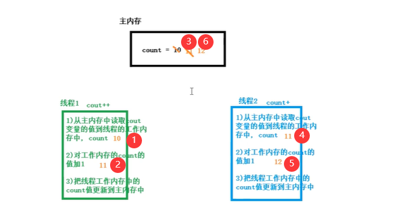

并发问题可能的状态：

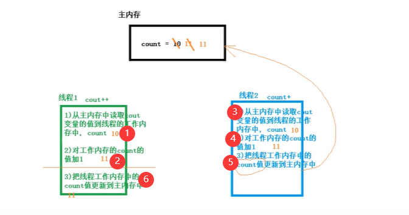

**CAS就是把数据更新到主内存的共享变量前，再次读取主内存共享变量的值，如果现在读取的共享变量的值与期望的值一样就更新：**

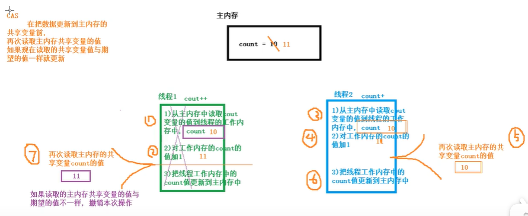

#### 使用CAS实现线程安全的计数器

```java
package se.high.thread.cas;

/**
 * @author 王泽
 * 使用CAS实现一个线程安全的计数器
 */

public class CasTest {
    public static void main(String[] args) {
        CASCounter cas = new CASCounter();
        for (int i = 0; i < 10000; i++) {
            new Thread(new Runnable() {
                @Override
                public void run() {
                    System.out.println(Thread.currentThread().getName()+"----->"+cas.incrementAndGet());
                }
            }).start();
        }
    }
}

class  CASCounter{
    //使用volatile修饰value的值，使线程可见
    volatile private long value;
    public long getValue(){
        return value;
    }
    private boolean compareAndSwap(long expectedValue,long newValue){
        //如果当前value的值与情网的expectedValue值一样，就把当时的Value字段替换为newValue值
        synchronized (this){
            if (value == expectedValue){
                value = newValue;
                return true;
            }else {
                return false;
            }
        }
    }

    //定义自增的方法
    public long incrementAndGet(){
        long oldValue;
        long newValue;
        do {
            oldValue = value;
            newValue = oldValue+1;
        }while(!compareAndSwap(oldValue,newValue));
        return newValue;
    }
}
```

#### CAS中的ABA问题

CAS实现原子操作背后有一个假设：共享变量的当前值与当前线程提供的期望值相同，就认为这个变量没有被其他线程修改过。

实际上这个假设不一定总成立。

*例如：有一个共享变量 count =0，A线程对count的值修改为10，B线程对count修改为20，C线程对count修改为10； 如果当前线程看到count变量的值为10，我们是否认为count变量的值没有被其他线程更新呢？？这种结果是否能接受？？*

**共享变量经历了  A -> B -> A 的更新**

是否能够接受ABA的问题跟实现算法有关。如果想要规避ABA问题，可以为共享变量引入一个修订号(时间戳)，每次修改共享变量时，相应的修订号就会增加1。

**[A,0] -> [B,1] -> [A,2]**


这也是AtomicStampedReference类就是基于这种思想产生的。


### 原子变量类

原子变量类基于CAS实现的，当对共享变量进行 `read-modify-writer`更新操作时，通过原子变量类可以保障操作的原子性与可见性，对变量的`read-modify-writer`更新操作是指当前操作不是一个简单的赋值，而是一个变量的新值依赖变量的旧值。

例如 `i++` 的操作就是 `读 -> +1 -> 赋值`;

由于`volatile`无法保证原子性，只能保证可见性，原子变量类内部就是借助一个`volatile`变量，并且保障了该变量的 `read-modify-writer` 操作的原子性，有时把原子变量类看做增强的 `volatile`变量。

**原子变量类：**

| 分组         | 原子变量类                                                   |
| ------------ | ------------------------------------------------------------ |
| 基础数据类型 | AtomicInteger，AtomicLong，AtomicBoolean                     |
| 数组型       | AtomicIntegerArray，AtomicLongArray，AtomicReferenceArray    |
| 字段更新器   | AtomicIntegerFieldUpdater,AtomicLongFieldUpdater,AtomicReferenceFieldUpdater |
| 引用型       | AtomicReference，AtomicStampedReference，AtomicMarkableReference |


#### 使用AtomicLong定义计数器

> 开发一个程序统计请求的总数，成功数，失败数。模拟多用户多线程访问。

```java
package se.high.thread.atomic.atomiclong;

import java.util.concurrent.atomic.AtomicLong;

/**
 * @author 结构化思维wz
 * 使用原子变量类定义一个计数器
 * 统计计数器，在整个程序中都能使用，并且所有地方都使用这一计数器，这个计数器可以设计为单例
 */

public class Indicator {
    //构造方法私有化
    private Indicator(){}
    //定义一个私有的本类静态对象
    private static final Indicator INSTANCE = new Indicator();
    //提供一个公共静态方法返回该类的唯一实例
    public static Indicator getInstance(){
        return INSTANCE;
    }
    /**
     * 记录原子变量类保存请求总数，成功数，失败数。
     */
    private final AtomicLong requestCount = new AtomicLong(0); //记录请求总数
    private final AtomicLong successCount = new AtomicLong(0); //记录请求成功数
    private final AtomicLong fialureCount = new AtomicLong(0); //记录请求失败数

    /**
     * 有新的请求的时候
     */
    public void newRequestReceive(){
        requestCount.incrementAndGet(); //总数增长
    }
    /**
     * 处理成功的时候
     */
    public void requestSuccess(){
        successCount.incrementAndGet(); //成功数+1
    }
    /**
     * 处理失败的时候
     */
    public void requestFialure(){
        fialureCount.incrementAndGet(); //失败数+1
    }

    /**
     * 查看总数，成功数，失败数
     */
    public long getRequestCount(){
        return requestCount.get();
    }
    public long getRequestSuccess(){
        return successCount.get();
    }
    public long getRequestFialure(){
        return fialureCount.get();
    }
}

```

```java
package se.high.thread.atomic.atomiclong;

import java.util.Random;

/**
 * @author 王泽
 * 模拟服务器的请求总数，处理成功数，处理失败数。
 */

public class AtomicTest {
    public static void main(String[] args) {
        // 通过线程模拟请求
        for (int i = 0; i < 10000; i++) {
            new Thread(new Runnable() {
                @Override
                public void run() {
                    //每个线程都是一个请求
                    Indicator.getInstance().newRequestReceive();
                    int num = new Random().nextInt();
                    if (num %2 == 0){
                        //偶数模拟成功
                        Indicator.getInstance().requestSuccess();
                    }else {Indicator.getInstance().requestFialure();}
                }
            }).start();
        }
        try {
            Thread.sleep(1000);
        } catch (InterruptedException e) {
            e.printStackTrace();
        }

        //打印结果
        System.out.println("请求的总数--->"+Indicator.getInstance().getRequestCount());
        System.out.println("请求成功数--->"+Indicator.getInstance().getRequestSuccess());
        System.out.println("请求失败数--->"+Indicator.getInstance().getRequestFialure());

    }

}

```

```java
请求的总数--->10000
请求成功数--->5035
请求失败数--->4965

进程已结束，退出代码为 0
```

#### AtomicIntegerArray

原子更新数组

```java
package se.high.thread.atomic.atomicIntegerArray;

import java.util.concurrent.atomic.AtomicIntegerArray;

/**
 * @author 结构化思维wz
 * 原子更新数组
 */

public class Test {
    public static void main(String[] args) {
        //1.创建一个指定长度的数组
        AtomicIntegerArray atomicIntegerArray = new AtomicIntegerArray(10);
        System.out.println(atomicIntegerArray);
        //2.返回指定位置的元素
        System.out.println("返回指定下标的元素"+atomicIntegerArray.get(2));
        //3.设置指定位置的元素、
        atomicIntegerArray.set(0,10);
        //4.在设置数组元素的新值时，同时返回数组元素。
        System.out.println("返回1下标原来的元素并设置一个元素"+atomicIntegerArray.getAndSet(1,11));
        System.out.println(atomicIntegerArray);
        System.out.println("设置之后的元素"+atomicIntegerArray.get(1));
        //5.修改数组元素把数组加上某个值
        System.out.println("先加20，再返回："+atomicIntegerArray.addAndGet(0,20));
        System.out.println("先返回再加"+atomicIntegerArray.getAndAdd(1,20));
        System.out.println(atomicIntegerArray);
        //6.CAS操作
        System.out.println("如果0下标元素是30--->"+atomicIntegerArray.compareAndSet(0,30,222)+"-->就设置为222");
        System.out.println(atomicIntegerArray);
        //7.自增、自减
        System.out.println(atomicIntegerArray.incrementAndGet(3)); //先自增
        System.out.println(atomicIntegerArray.getAndIncrement(3)); //先使用再自增
        System.out.println(atomicIntegerArray.get(3));
        System.out.println(atomicIntegerArray.getAndDecrement(3));
        System.out.println(atomicIntegerArray.get(3));
    }

}
```

```java
[0, 0, 0, 0, 0, 0, 0, 0, 0, 0]
返回指定下标的元素0
返回1下标原来的元素并设置一个元素0
[10, 11, 0, 0, 0, 0, 0, 0, 0, 0]
设置之后的元素11
先加20，再返回：30
先返回再加11
[30, 31, 0, 0, 0, 0, 0, 0, 0, 0]
如果0下标元素是30--->true-->就设置为222
[222, 31, 0, 0, 0, 0, 0, 0, 0, 0]
1
1
2
2
1

进程已结束，退出代码为 0
```

#### 多线程中使用原子数组

```java
package se.high.thread.atomic.atomicIntegerArray;

import java.util.concurrent.atomic.AtomicIntegerArray;

/**
 * @author 结构化思维wz
 * 在多线程中使用原子数组
 */

public class Test02 {
    /**
     *  定义原子数组
     */
    static AtomicIntegerArray atomicIntegerArray = new AtomicIntegerArray(10);

    public static void main(String[] args) {
       //定义一个线程数组
        Thread[] threads = new Thread[10];
        //给线程数组元素赋值
        for (int i = 0; i < threads.length; i++) {
            threads[i]= new AddThread();
        }
        //开启子线程
        for (Thread thread : threads) {
            thread.start();
        }
        //在主线程中查看自增以后原子数组中的各个元素的值，在主线程中需要在所欲子线程中打印执行后再查看
        //把所有子线程合并到当前主线程
        for (Thread thread:threads) {
            try {
                thread.join();
            } catch (InterruptedException e) {
                e.printStackTrace();
            }
        }
        System.out.println(atomicIntegerArray);
    }

    /**
     * 定义一个线程类，在线程中修改原子数组
     */
    static class AddThread extends Thread{
        @Override
        public void run() {
            //把原子数组的每个元素自增1000次
            for (int i = 0; i < 1000; i++) {
                for (int j = 0; j < atomicIntegerArray.length(); j++) {
                    atomicIntegerArray.getAndIncrement(j%atomicIntegerArray.length());
                }
            }

        }
    }
}
```

#### AtomicIntegerFieldUpdater更新字段

AtomicIntegerUpdater可以对原子正整数字段进行更新，要求：

1. 字段必须使用volatile修饰 ，使线程之间可见。
2. 只能是实例变量，不能是静态变量，也不能使用final修饰。
3. 

```java
AtomicIntegerFieldUpdater<User> updater = AtmoicIntegerFieldUpdater.newUpdater(User.class,"age"); //对user中的age字段修改
```

#### AtomicReference

可以原子读写一个对象。

```java
package se.high.thread.atomic.atomicreference;

import java.util.concurrent.atomic.AtomicReference;

/**
 * @author 结构化思维wz
 * 用原子对象操作字符串
 */

public class Test01 {
    static AtomicReference<String> atomicReference = new AtomicReference<>("abc");

    public static void main(String[] args) {
        for (int i = 0; i < 100; i++) {
            new Thread(new Runnable() {
                @Override
                public void run() {
                    if(atomicReference.compareAndSet("abc","def")){
                        System.out.println(Thread.currentThread().getName()+"把字符串abc更改为def");
                    }
                }
            }).start();
        }
        //再创建100个线程
        for (int i = 0; i<100; i++){
            new Thread(new Runnable() {
                @Override
                public void run() {
                    if (atomicReference.compareAndSet("def","abc")){
                        System.out.println(Thread.currentThread().getName()+"把字符串还原为abc");
                    }
                }
            }).start();
        }
    }

}

```

#### AtomicReference的ABA问题

使用AtomicStampedreference (带时间戳)

​      AtomicMarkableReference（带标志）


## 四、线程间的通信

> 众所周知线程都有自己的线程栈，那么线程之间是如何保证通信的呢？下面来分析：

### 等待/通知机制

**什么是等待通知机制？**

*举例：吃自助的时候吃现做的一些饭，放到台子上才能拿。*

在单线程编程中，要执行的操作需要满足一定的条件才能执行，可以把这个操作放在if语句快中。

在多线程编程中，可能A线程条件没有满足只是暂时的，稍后其他的线程B可能会更新条件使得A线程的条件得到满足，可以将A线程暂停，直到他的条件得到满足后再将A线程唤醒。

伪代码：

```java
atomic{
    while（条件不成立）{
        等待
    }
    条件满足后当前线程被唤醒，继续执行下面的操作
}
```

**等待通知机制的实现：**

Object类中的`wait()`方法，可以使当前执行代码的线程等待。暂停执行，知道接受到通知或被中断为止。

注意：

1. wait()方法只能在同步代码块中由锁对象调用。
2. 调用wait()方法后，当前线程会释放锁。

伪代码：

```java
//在调用wait()方法前获得对象的内部锁
synchronized(锁对象){
    while(条件不成立){
        //通过锁对象调用wait()方法暂停线程，释放锁对象
        锁对象.wait();
    }
    //线程的条件满足了继续向下执行
}
```

Object类的 notify()可以唤醒线程，该方法也必须在同步代码块中由锁对象调用。没有使用锁对象调用wait()/notify()会抛出异常。

如果有多个等待的线程，**notify()方法只能唤醒其中的一个，并不会立即释放锁对象。**一般将notify方法放在同步代码块的最后。

伪代码：

```java
synchronized(锁对象){
    执行修改保护条件的代码
    唤醒其他线程
        锁对象.notify();
}
```

**实例：**

```java
package se.high.thread.wait;

/**
 * @author 结构化思维wz
 * 用notify唤醒等待的线程
 */

public class Test01 {

    public static void main(String[] args) {
        String lock = "wzjiayou"; //定义一个字符串作为锁对象
        Thread t1 = new Thread(new Runnable() {
            @Override
            public void run() {
                synchronized (lock){
                    System.out.println("线程1开始等待-->"+System.currentTimeMillis());
                    try {
                        lock.wait(); //线程等待
                    } catch (InterruptedException e) {
                        e.printStackTrace();
                    }
                    System.out.println("线程1结束等待-->"+System.currentTimeMillis());
                }
            }
        });

        /**
         * 定义线程2，用来唤醒线程1
         */
        Thread t2 = new Thread(new Runnable() {
            @Override
            public void run() {
                //notify需要在同步代码块中由锁对象调用
                synchronized (lock){
                    System.out.println("线程2开始唤醒"+System.currentTimeMillis());
                    lock.notify();
                    System.out.println("线程2结束唤醒"+System.currentTimeMillis());
                }
            }
        });
        t1.start(); //开启t1线程,main线程谁3秒，确保t1等待
        try {
            Thread.sleep(3000);
        } catch (InterruptedException e) {
            e.printStackTrace();
        }
        t2.start();
    }

}
```

```java
线程1开始等待-->1633345984896
线程2开始唤醒1633345987897
线程2结束唤醒1633345987897
线程1结束等待-->1633345987897

进程已结束，退出代码为 0
```

#### interrupt()方法会中断wait()

当线程处于`wait()`等待状态时，调用线程对象的`interrupt()`方法会中断线程等待状态，会产生`InterruptedExceptiont`异常。


#### notify()与notifyAll()

`notify()`一次只能唤醒一个线程，如果有多个等待的线程，只能随机唤醒其中的某一个；想要唤醒所有的线程，需要调用``notifyAll()``;


#### wait(long)

如果在参数指定的时间内没有被唤醒，超时后会自动唤醒。


#### 通知过早

>  线程wait()等待后，可以调用notify()唤醒线程，如果notify()唤醒过早，在等待之前就调用了notify()可能会打乱程序正常的执行逻辑。

在应用中，我们为了保证t1等待后才让t2唤醒。如果t2线程先唤醒，就不让t1等待了。

可以设置一个Boolean变量，通知后设为false，如果为true再等待。


#### wait() 等待条件发生了变化

在使用`wait(),notify()`,注意wait条件发生的了变化，也可能导致逻辑的混乱。


### 生产者消费者模式

生产者消费者问题（Producer-consumer problem），也称有限缓冲问题（Bounded-buffer problem），是一个多线程同步问题的经典案例。生产者生成一定量的数据放到缓冲区中，然后重复此过程；与此同时，消费者也在缓冲区消耗这些数据。生产者和消费者之间必须保持同步，要保证生产者不会在缓冲区满时放入数据，消费者也不会在缓冲区空时消耗数据。不够完善的解决方法容易出现死锁的情况，此时进程都在等待唤醒。

示意图：

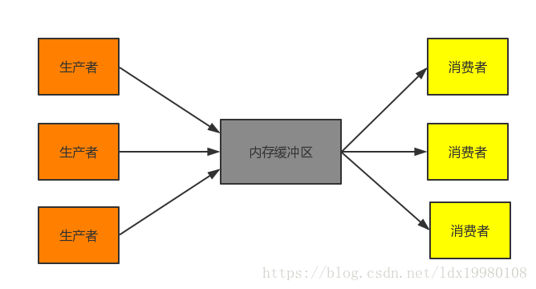

解决思路：

1. 采用某种机制保护生产者和消费者之间的同步。有较高的效率，并且易于实现，代码的可控制性较好，属于常用的模式。
2. 在生产者和消费者之间建立一个管道。管道缓冲区不易控制，被传输数据对象不易于封装等，实用性不强。

解决问题的核心：

​	**保证同一资源被多个线程并发访问时的完整性。常用的同步方法是采用信号或加锁机制，保证资源在任意时刻至多被一个线程访问。**

wait() / notify()方法
当缓冲区已满时，生产者线程停止执行，放弃锁，使自己处于等待状态，让其他线程执行；
当缓冲区已空时，消费者线程停止执行，放弃锁，使自己处于等待状态，让其他线程执行。

*当生产者向缓冲区放入一个产品时，向其他等待的线程发出可执行的通知，同时放弃锁，使自己处于等待状态；
当消费者从缓冲区取出一个产品时，向其他等待的线程发出可执行的通知，同时放弃锁，使自己处于等待状态。*

**仓库Storage.java**

```java
import java.util.LinkedList;

public class Storage {
// 仓库容量
private final int MAX_SIZE = 10;
// 仓库存储的载体
private LinkedList<Object> list = new LinkedList<>();

public void produce() {
    synchronized (list) {
        /*仓库满的情况*/
        while (list.size() + 1 > MAX_SIZE) {
            System.out.println("【生产者" + Thread.currentThread().getName()
	                + "】仓库已满");
            try {
                list.wait();
            } catch (InterruptedException e) {
                e.printStackTrace();
            }
        }
        /*生产者生产*/
        list.add(new Object());
        System.out.println("【生产者" + Thread.currentThread().getName()
                + "】生产一个产品，现库存" + list.size());
        list.notifyAll();
    }
}

public void consume() {
    synchronized (list) {
        /*仓库空了*/
        while (list.size() == 0) {
            System.out.println("【消费者" + Thread.currentThread().getName() 
					+ "】仓库为空");
            try {
                list.wait();
            } catch (InterruptedException e) {
                e.printStackTrace();
            }
        }
        /*消费者消费*/
        list.remove();
        System.out.println("【消费者" + Thread.currentThread().getName()
                + "】消费一个产品，现库存" + list.size());
        list.notifyAll();
    }
}}
```
**生产者：**

```java
public class Producer implements Runnable{
private Storage storage;
public Producer(){}
public Producer(Storage storage){
    this.storage = storage;
}

@Override
public void run(){
    while(true){
        try{
            Thread.sleep(1000);
            storage.produce();
        }catch (InterruptedException e){
            e.printStackTrace();
        }
    }
}}
```
**消费者**

```java
public class Consumer implements Runnable{
private Storage storage;
public Consumer(){}

public Consumer(Storage storage){
    this.storage = storage;
}

@Override
public void run(){
    while(true){
        try{
            Thread.sleep(3000);
            storage.consume();
        }catch (InterruptedException e){
            e.printStackTrace();
        }
    }
}}
```
**Main：**

```java
public class Main {
public static void main(String[] args) {
    Storage storage = new Storage();
    Thread p1 = new Thread(new Producer(storage));
    Thread p2 = new Thread(new Producer(storage));
    Thread p3 = new Thread(new Producer(storage));

    Thread c1 = new Thread(new Consumer(storage));
    Thread c2 = new Thread(new Consumer(storage));
    Thread c3 = new Thread(new Consumer(storage));

    p1.start();
    p2.start();
    p3.start();
    c1.start();
    c2.start();
    c3.start();
}}
```
```java
运行结果

【生产者p1】生产一个产品，现库存1
【生产者p2】生产一个产品，现库存2
【生产者p3】生产一个产品，现库存3
【生产者p1】生产一个产品，现库存4
【生产者p2】生产一个产品，现库存5
【生产者p3】生产一个产品，现库存6
【生产者p1】生产一个产品，现库存7
【生产者p2】生产一个产品，现库存8
【消费者c1】消费一个产品，现库存7
【生产者p3】生产一个产品，现库存8
【消费者c2】消费一个产品，现库存7
【消费者c3】消费一个产品，现库存6
【生产者p1】生产一个产品，现库存7
【生产者p2】生产一个产品，现库存8
【生产者p3】生产一个产品，现库存9
【生产者p1】生产一个产品，现库存10
【生产者p2】仓库已满
【生产者p3】仓库已满
【生产者p1】仓库已满
【消费者c1】消费一个产品，现库存9
【生产者p1】生产一个产品，现库存10
【生产者p3】仓库已满
。。。。。。以下省略
```


一个生产者线程运行produce方法，睡眠1s；一个消费者运行一次consume方法，睡眠3s。此次实验过程中，有3个生产者和3个消费者，也就是我们说的**多对多**的情况。仓库的容量为10，可以看出消费的速度明显慢于生产的速度，符合设定。

注意：

notifyAll()方法可使所有正在等待队列中等待同一共享资源的“全部”线程从等待状态退出，进入可运行状态。此时，优先级最高的哪个线程最先执行，但也有可能是随机执行的，这要取决于JVM虚拟机的实现。即最终也只有一个线程能被运行，上述线程优先级都相同，每次运行的线程都不确定是哪个，后来给线程设置优先级后也跟预期不一样，还是要看JVM的具体实现吧。


### 通过管道实现线程间的通信

>  在`java.io`中的 `PipeStream `管道流，用于在线程之间传送数据。
>
> 一个线程发送数据到输出管道，另一个线程从输入管道中读取数据。`PipeInputStream , PipeOutStream, PipeReader , PipedWriter。`

```java
package se.high.thread.pipestream;

import java.io.IOException;
import java.io.PipedInputStream;
import java.io.PipedOutputStream;

/**
 * @author 结构化思维wz
 */

public class Test {
    public static void main(String[] args) throws IOException {
        /*定义管道字节流*/
        PipedInputStream  inputStream = new PipedInputStream();
        PipedOutputStream outputStream = new PipedOutputStream();

        inputStream.connect(outputStream);

        /*创建两个线程向管道流中读写数据*/
        new Thread(new Runnable() {
            @Override
            public void run() {
                try {
                    writeData(outputStream);
                } catch (IOException e) {
                    e.printStackTrace();
                }
            }
        }).start();
        new Thread(new Runnable() {
            @Override
            public void run() {
                try {
                    readData(inputStream);
                } catch (IOException e) {
                    e.printStackTrace();
                }
            }
        }).start();

    }
    /**
     * 定义方法向管道流中写入数据
     */
    public static void writeData(PipedOutputStream out) throws IOException {
        /*把0-100 之间的数写入管道中*/
        for (int i = 0; i < 100; i++) {
            String data = "-" + i;
            out.write(data.getBytes()); //把字节数组写入到输出管道流中
        }
        out.close();
    }

    /**
     * 定义方法从管道中读取数据
     */
    public static void readData(PipedInputStream input) throws IOException {
        /*从管道中读取0-100*/
        byte[] bytes = new byte[1024];
        int len = input.read(bytes); //返回读到的字节数，如果没有读到任何数据返回-1
        while(len != -1){
            //把bytes数组中从0开始到len个字节转换为字符串打印出来
            System.out.println(new String(bytes,0,len));
            len = input.read(bytes); //继续从管道中读取数据
        }
        input.close();
    }

}
```

### join()

`join()`方法是`Thread`类的一个实例方法。它的作用是`让当前线程陷入“等待”状态，等join的这个线程执行完成后，再继续执行当前线程。`

有时候，主线程创建并启动了子线程，如果子线程中需要进行大量的耗时运算，主线程往往将早于子线程结束之前结束。

如果主线程想等待子线程执行完毕后，获得子线程中的处理完的某个数据，就要用到join方法了。(插队)

示例代码：

```java
public class Join {
    static class ThreadA implements Runnable {

        @Override
        public void run() {
            try {
                System.out.println("我是子线程，我先睡一秒");
                Thread.sleep(1000);
                System.out.println("我是子线程，我睡完了一秒");
            } catch (InterruptedException e) {
                e.printStackTrace();
            }
        }
    }

    public static void main(String[] args) throws InterruptedException {
        Thread thread = new Thread(new ThreadA());
        thread.start();
        thread.join();
        System.out.println("如果不加join方法，我会先被打出来，加了就不一样了");
    }
}
```

> 注意join()方法有两个重载方法，一个是join(long)， 一个是join(long, int)。
>
> 实际上，通过源码你会发现，join()方法及其重载方法底层都是利用了wait(long)这个方法。
>
> 对于join(long, int)，通过查看源码(JDK 1.8)发现，底层并没有精确到纳秒，而是对第二个参数做了简单的判断和处理。


## 五、Callable与Future

通常来说，我们使用`Runnable`和`Thread`来创建一个新的线程。但是它们有一个弊端，就是`run`方法是没有返回值的。而有时候我们希望开启一个线程去执行一个任务，并且这个任务执行完成后有一个返回值。

JDK提供了`Callable`接口与`Future`接口为我们解决这个问题，这也是所谓的“异步”模型。

### Callable接口

`Callable`与`Runnable`类似，同样是只有一个抽象方法的函数式接口。不同的是，`Callable`提供的方法是**有返回值**的，而且支持**泛型**。

```java
@FunctionalInterface
public interface Callable<V> {
    V call() throws Exception;
}
```

那一般是怎么使用`Callable`的呢？`Callable`一般是配合线程池工具`ExecutorService`来使用的。我们会在后续章节解释线程池的使用。这里只介绍`ExecutorService`可以使用`submit`方法来让一个`Callable`接口执行。它会返回一个`Future`，我们后续的程序可以通过这个`Future`的`get`方法得到结果。

这里可以看一个简单的使用demo：

```java
// 自定义Callable
class Task implements Callable<Integer>{
    @Override
    public Integer call() throws Exception {
        // 模拟计算需要一秒
        Thread.sleep(1000);
        return 2;
    }
    public static void main(String args[]) throws Exception {
        // 使用
        ExecutorService executor = Executors.newCachedThreadPool();
        Task task = new Task();
        Future<Integer> result = executor.submit(task);
        // 注意调用get方法会阻塞当前线程，直到得到结果。
        // 所以实际编码中建议使用可以设置超时时间的重载get方法。
        System.out.println(result.get()); 
    }
}
```

输出结果：

```java
2
```

### Future接口

`Future`接口只有几个比较简单的方法：

```java
public abstract interface Future<V> {
    public abstract boolean cancel(boolean paramBoolean);
    public abstract boolean isCancelled();
    public abstract boolean isDone();
    public abstract V get() throws InterruptedException, ExecutionException;
    public abstract V get(long paramLong, TimeUnit paramTimeUnit)
            throws InterruptedException, ExecutionException, TimeoutException;
}
```

`cancel`方法是试图取消一个线程的执行。

注意是**试图**取消，**并不一定能取消成功**。因为任务可能已完成、已取消、或者一些其它因素不能取消，存在取消失败的可能。`boolean`类型的返回值是“是否取消成功”的意思。参数`paramBoolean`表示是否采用中断的方式取消线程执行。

所以有时候，为了让任务有能够取消的功能，就使用`Callable`来代替`Runnable`。如果为了可取消性而使用 `Future`但又不提供可用的结果，则可以声明 `Future<?>`形式类型、并返回 `null`作为底层任务的结果。

### FutureTask类

上面介绍了`Future`接口。这个接口有一个实现类叫`FutureTask`。`FutureTask`是实现的`RunnableFuture`接口的，而`RunnableFuture`接口同时继承了`Runnable`接口和`Future`接口：

```java
public interface RunnableFuture<V> extends Runnable, Future<V> {
    /**
     * Sets this Future to the result of its computation
     * unless it has been cancelled.
     */
    void run();
}
```

那`FutureTask`类有什么用？为什么要有一个`FutureTask`类？前面说到了`Future`只是一个接口，而它里面的`cancel`，`get`，`isDone`等方法要自己实现起来都是**非常复杂**的。所以JDK提供了一个`FutureTask`类来供我们使用。

示例代码：

```java
// 自定义Callable，与上面一样
class Task implements Callable<Integer>{
    @Override
    public Integer call() throws Exception {
        // 模拟计算需要一秒
        Thread.sleep(1000);
        return 2;
    }
    public static void main(String args[]) throws Exception {
        // 使用
        ExecutorService executor = Executors.newCachedThreadPool();
        FutureTask<Integer> futureTask = new FutureTask<>(new Task());
        executor.submit(futureTask);
        System.out.println(futureTask.get());
    }
}
```

使用上与第一个Demo有一点小的区别。首先，调用`submit`方法是没有返回值的。这里实际上是调用的`submit(Runnable task)`方法，而上面的Demo，调用的是`submit(Callable<T> task)`方法。

然后，这里是使用`FutureTask`直接取`get`取值，而上面的Demo是通过`submit`方法返回的`Future`去取值。

在很多高并发的环境下，有可能Callable和FutureTask会创建多次。FutureTask能够在高并发环境下**确保任务只执行一次**。这块有兴趣的同学可以参看FutureTask源码。

### FutureTask的几个状态

```java
/**
  *
  * state可能的状态转变路径如下：
  * NEW -> COMPLETING -> NORMAL
  * NEW -> COMPLETING -> EXCEPTIONAL
  * NEW -> CANCELLED
  * NEW -> INTERRUPTING -> INTERRUPTED
  */
private volatile int state;
private static final int NEW          = 0;
private static final int COMPLETING   = 1;
private static final int NORMAL       = 2;
private static final int EXCEPTIONAL  = 3;
private static final int CANCELLED    = 4;
private static final int INTERRUPTING = 5;
private static final int INTERRUPTED  = 6;
```

> state表示任务的运行状态，初始状态为NEW。运行状态只会在set、setException、cancel方法中终止。COMPLETING、INTERRUPTING是任务完成后的瞬时状态。

以上就是Java多线程几个基本的类和接口的介绍。可以打开JDK看看源码，体会这几个类的设计思路和用途吧！

## 六、ThreadLocal()

> `ThreadLocal`类顾名思义可以理解为线程本地变量。也就是说如果定义了一个`ThreadLocal`， 每个线程往这个`ThreadLocal`中读写是线程隔离，互相之间不会影响的。它提供了一种将可变数据通过每个线程有自己的独立副本从而实现线程封闭的机制。

*如果一百个同学抢一根笔，这个笔就是共享资源。作为王老师，一定得处理这个事不然学生容易打起来，让他们一个一个的来。 ===内部锁的原理*

*如果给同学提供100支笔，能更快的完成任务。====ThreadLocal()的思路*


**ThreadLocal ThreadLocal的作用主要是做数据隔离，填充的数据只属于当前线程，变量的数据对别的线程而言是相对隔离的，在多线程环境下，如何防止自己的变量被其它线程篡改。**


每个`Thread`对象都有一个`ThreadLocalMap`，每个`ThreadLocalMap`可以存储多个`ThreadLocal`

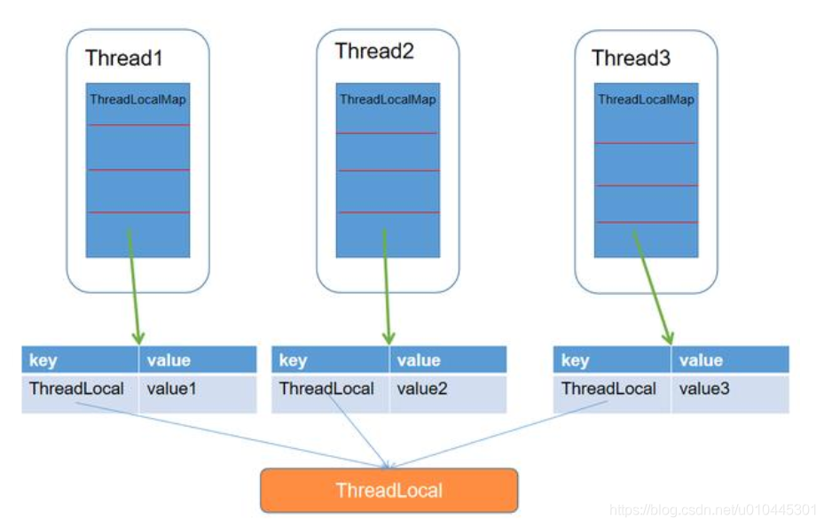


### API介绍

> 主要是`initialValue`、`set`、`get`、`remove`这几个方法

**initialValue**

- initialValue方法会返回当前线程对应的“初始值”，这是一个延迟加载的方法，只有在调用get的时候，才会触发。

- 当线程第一次使用get方法访问变量时，将调用initialValue方法，除非线程先前调用了set方法，在这种情况下，不会为线程调用本initialValue方法。

- 通常，每个线程最多调用一次initialValue()方法，但如果已经调用了一次remove()后，再调用get()，则可以再次调用initialValue()，相当于第一次调用get()。

- 如果不重写initialValue()方法，这个方法会返回null。一般使用匿名内部类的方法来重写initialValue()方法，以便在后续使用中可以初始化副本对象。

**set**

```java
	 // 把当前线程需要全局共享的value传入
    public void set(T value) {
        Thread t = Thread.currentThread();
        ThreadLocalMap map = getMap(t);
        // map对象为空就创建，不为空就覆盖
        if (map != null)
            map.set(this, value);
        else
            createMap(t, value);
    }

```

**get**

- get方法是先取出当前线程的ThreadLocalMap，然后调用map.getEntry方法，把本ThreadLocal的引用作为参数传入，取出map中属于本ThreadLocal的value

- 注意：这个map以及map中的key和value都是保存在线程中ThreadLocalMap的，而不是保存在ThreadLocal中

- getMap方法：获取到当前线程内的ThreadLocalMap对象
  每个线程内都有ThreadLocalMap对象，名为threadLocals，初始值为null

**remove**

```java
 // 删除对应这个线程的值
 public void remove() {
 	//  获取当前线程的ThreadLocalMap 
     ThreadLocalMap m = getMap(Thread.currentThread());
     if (m != null)
		// 移除这个ThreadLocal对应的值
         m.remove(this);
 }

```


### ThreadLocal使用场景

典型场景1：每个线程需要一个独享的对象（通常是工具类，典工具类型需要使用的类有SimpleDateFormat和Random）

*使用`ThreadLocal`（不仅线程安全，而且也没有`synchronized`带来的性能问题，每个线程内有自己独享的`SimpleDateFormat`对象）*

```java
package se.high.thread.threadlocal;

import java.text.ParseException;
import java.text.SimpleDateFormat;
import java.util.Date;

/**
 * @author 结构化思维wz
 * Threadlocal 应用。 在多线程当中，把一个字符串转换为日期对象。SimpleDateFormat
 */

public class Test02 {
    /**
     * 定义SimpleDateFormat,该对象可以把字符串转换为日期
     */
    private static SimpleDateFormat time = new SimpleDateFormat("yyyy年MM月dd日 HH:mm:ss");
    /**
     * 为每个线程指定自己的SimpleDateFormat
     */
    static ThreadLocal<SimpleDateFormat> threadLocal = new ThreadLocal<>();
    /**
     * 定义Runnable接口的实现类
     */
    static class ParseDate implements Runnable{
        private int i = 0;
        public ParseDate(int i) {
            this.i = i;
        }
        /**
         * 把字符串转为日期
         */
        @Override
        public void run() {
            String text = "2021年10月5日 20:10:"+String.valueOf(i%60); //构建一个表示日期的字符串
            try {
                //先判断当前线程是否含有日期对象，如果没有就创建一个
                if (threadLocal.get()== null){
                    threadLocal.set(new SimpleDateFormat("yyyy年MM月dd日 HH:mm:ss"));
                }
                    Date date = threadLocal.get().parse(text);
                    System.out.println(i+"-"+date); //打印日期

            } catch (ParseException e) {
                e.printStackTrace();
            }
        }
    }

    public static void main(String[] args) {
        //创建100个线程
        for (int i = 0; i < 100; i++) {
           Thread thread= new Thread(new ParseDate(i));
           thread.start();
            try {
                thread.join();
            } catch (InterruptedException e) {
                e.printStackTrace();
            }
        }
    }


}
```

典型场景2：每个线程内需要保存全局变量（例如在拦截器中获取用户信息），可以让不同方法直接使用，避免参数传递的麻烦


## 七、显示锁Lock

> 在JDK5中新增了`java.util.concurrent.locks包`下的Lock接口。有ReentrantLock实现类,ReentrantLock锁称为可重入锁, 它功能比synchronized多。

*锁的可重入是指,当一个线程获得一个对象锁后,再次请求该对象锁时是可以获得该对象的锁的。synchronized关键字就是使用的重入锁。*

:one:我们先来看看`synchronized`有什么不足之处。

- 如果临界区是只读操作，其实可以多线程一起执行，但使用synchronized的话，**同一时间只能有一个线程执行**。
- synchronized无法知道线程有没有成功获取到锁
- 使用synchronized，如果临界区因为IO或者sleep方法等原因阻塞了，而当前线程又没有释放锁，就会导致**所有线程等待**。

而这些都是locks包下的锁可以解决的。


:two:**公平锁与非公平锁**

这里的“公平”，其实通俗意义来说就是“先来后到”，也就是FIFO。如果对一个锁来说，先对锁获取请求的线程一定会先被满足，后对锁获取请求的线程后被满足，那这个锁就是公平的。反之，那就是不公平的。

一般情况下，`非公平锁能提升一定的效率。但是非公平锁可能会发生线程饥饿（有一些线程长时间得不到锁）的情况`。所以要根据实际的需求来选择非公平锁和公平锁。

ReentrantLock支持非公平锁和公平锁两种。（可以根据构造方法的重载选择不同的锁）。

### Lock中的方法

| 方法名                              | 返回值    | 作用                                                         |
| ----------------------------------- | --------- | ------------------------------------------------------------ |
| `lock()`                            | void      | 获得锁                                                       |
| `unlock()`                          | void      | 释放锁                                                       |
| `tryLock() `                        | boolean   | 仅在调用时锁为空闲状态才获取该锁，可以响应中断               |
| `tryLock(long time, TimeUnit unit)` | boolean   | 如果锁在给定的等待时间内空闲，并且当前线程未被中断，则获取锁 |
| `lockInterruptibly()`               | void      | 如果当前线程未被中断，则获取锁，可以响应中断                 |
| `newCondition()`                    | Condition | 返回绑定到此 Lock 实例的新 Condition 实例                    |

#### lock()

lock()方法是平常使用得最多的一个方法，就是用来获取锁。**如果锁已被其他线程获取，则进行等待。**在前面已经讲到，如果采用Lock，**必须主动去释放锁**，**并且在发生异常时，不会自动释放锁**。因此，一般来说，使用Lock必须在try…catch…块中进行，并且将释放锁的操作放在finally块中进行，以保证锁一定被被释放，防止死锁的发生。通常使用Lock来进行同步的话，是以下面这种形式去使用的：

```java
Lock lock = ...;
lock.lock();
try{
    //处理任务
}catch(Exception ex){

}finally{
    lock.unlock();   //释放锁
}
```

#### tryLock()

`tryLock()`方法是有返回值的，它表示用来尝试获取锁，如果获取成功，则返回`true`；如果获取失败（即锁已被其他线程获取），则返回false，也就是说，这个方法无论如何都会`立即返回`（在拿不到锁时不会一直在那等待）。

　　`tryLock(long time, TimeUnit unit)`方法和`tryLock()`方法是类似的，只不过区别在于这个方法在拿不到锁时会`等待一定的时间`，在时间期限之内如果还拿不到锁，就返回`false`，同时可以响应中断。如果一开始拿到锁或者在等待期间内拿到了锁，则返回true。

一般情况下，通过tryLock来获取锁时是这样使用的：

```java
Lock lock = ...;
if(lock.tryLock()) {
     try{
         //处理任务
     }catch(Exception ex){

     }finally{
         lock.unlock();   //释放锁
     } 
}else {
    //如果不能获取锁，则直接做其他事情
}
```

#### lockInterruptibly()　

`lockInterruptibly()`方法比较特殊，当通过这个方法去获取锁时，如果线程 `正在等待获取锁`，则这个线程能够 `响应中断`，即中断线程的等待状态。例如，当两个线程同时通过``lock.lockInterruptibly()``想获取某个锁时，假若此时线程A获取到了锁，而线程B只有在等待，那么对线程B调用`threadB.interrupt()`方法能够中断线程B的等待过程。

　　由于`lockInterruptibly()`的声明中抛出了异常，所以`lock.lockInterruptibly()`必须放在try块中或者在调用lockInterruptibly()的方法外声明抛出 InterruptedException，但推荐使用后者，原因稍后阐述。因此，lockInterruptibly()一般的使用形式如下：

```java
public void method() throws InterruptedException {
    lock.lockInterruptibly();
    try {  
     //.....
    }
    finally {
        lock.unlock();
    }  
}
```

当一个线程获取了锁之后，是不会被interrupt()方法中断的。因为**interrupt()方法只能中断阻塞过程中的线程而不能中断正在运行过程中的线程**。因此，当通过lockInterruptibly()方法获取某个锁时，如果不能获取到，那么只有进行等待的情况下，才可以响应中断的。与 synchronized 相比，当一个线程处于等待某个锁的状态，是无法被中断的，只有一直等待下去。

#### unlock()

释放锁，在finally中第一句执行。

#### newCondition()

关键字`synchronized`与`wait()/notify`这两个方法一起使用可以实现等待通知模式。

在`Lock`显示锁中，`newConditon()`方法返回`Condition对象`，`Condition`类也可以用`await/signal`实现等待通知模式。

*使用notify()通知时，JVM会随机唤醒某个等待的线程；使用Condition可以选择性的通知。*


### Condition

1. `await()`

   await() 会使当前线程等待，同时释放锁，当前其他线程调用signal()时，线程会重新获得锁，并继续执行。

2. `signal()/signalAll()`

   用于唤醒等待的线程。

   注意：在调用`await/signal`前，也需要线程持有相关的锁。

```java
package se.high.thread.lock;

import java.util.concurrent.locks.Condition;
import java.util.concurrent.locks.Lock;
import java.util.concurrent.locks.ReentrantLock;

/**
 * @author 结构化思维wz
 */

public class ConditionTest {
    //定义锁
    static Lock lock = new ReentrantLock();

    //获得Condition对象
    static Condition condition = lock.newCondition();

    //定义线程子类
    static class SubThread extends Thread{
        @Override
        public void run() {
            try {
                lock.lock();
                System.out.println("子线程获得锁...");
                System.out.println("子线程即将等待等待....");
                condition.await();
            } catch (InterruptedException e) {
                e.printStackTrace();
            } finally {
                lock.unlock();
                System.out.println("子线程释放锁....");
            }
        }
    }

    public static void main(String[] args) throws InterruptedException {
        SubThread t1 = new SubThread();
        t1.start();
        System.out.println("子线程启动....");
        Thread.sleep(3000);
        System.out.println("主线程睡了3s，现在唤醒子线程...");
        /*注意===== 在调用方法之前需要持有锁=========*/
        try {
            lock.lock();
            condition.signal();
        } catch (Exception e) {
            e.printStackTrace();
        } finally {
            lock.unlock();
        }
    }


}

```

```java
子线程启动....
子线程获得锁...
子线程即将等待等待....
主线程睡了3s，现在唤醒子线程...
子线程释放锁....

进程已结束，退出代码为 0
```

#### 实例：两个线程交替打印

```java
package se.high.thread.lock;

import java.util.concurrent.locks.Condition;
import java.util.concurrent.locks.Lock;
import java.util.concurrent.locks.ReentrantLock;

/**
 * @author 结构化思维wz
 * 实现两个线程交替打印
 */

public class ConditionTest02 {
    public static void main(String[] args) {
        MyService myService = new MyService();
        //创建打印线程
        new Thread(new Runnable() {
            @Override
            public void run() {
                for (int i = 0; i < 20; i++) {
                    myService.printOne();
                }
            }
        }).start();
        new Thread(new Runnable() {
            @Override
            public void run() {
                for (int i = 0; i < 20; i++) {
                    myService.printTwo();
                }
            }
        }).start();
    }
    static class MyService{
        private Lock lock = new ReentrantLock();
        private Condition condition = lock.newCondition();
        private boolean flag = true; //打印标志
        /**
         * 打印方法 ----
         */
        public void printOne(){
            try {
                lock.lock();
                while(!flag){
                    condition.await();
                }
                System.out.println(Thread.currentThread().getName()+"----------One-------");
                flag=false;
                condition.signal(); //通知领完的线程打印
            } catch (InterruptedException e) {
                e.printStackTrace();
            } finally {
                lock.unlock();
            }
        }

        /**
         * 打印方法2
         */
        public void printTwo(){
            try {
                lock.lock();
                while(flag){
                    condition.await();
                }
                System.out.println(Thread.currentThread().getName()+"**********TWO********");
                flag=true;
                condition.signal(); //通知领完的线程打印
            } catch (InterruptedException e) {
                e.printStackTrace();
            } finally {
                lock.unlock();
            }
        }
    }

}

```

```java
Thread-0----------One-------
Thread-1**********TWO********
Thread-0----------One-------
Thread-1**********TWO********
Thread-0----------One-------
Thread-1**********TWO********
```


### ReetntranLock

> ReentrantLock 是 java.util.concurrent（J.U.C）包中的锁。是Lock的一个实现类。

`ReentrantLock`，即 可重入锁。`ReentrantLock`是唯一实现了Lock接口的类，并且ReentrantLock提供了更多的方法。下面通过一些实例学习如何使用 ReentrantLock。

　　**构造方法（不带参数 和带参数 true： 公平锁； false: 非公平锁）**

```java
package se.high.thread.lock.reentrant;

import java.util.concurrent.ExecutorService;
import java.util.concurrent.Executors;
import java.util.concurrent.locks.Lock;
import java.util.concurrent.locks.ReentrantLock;

/**
 * @author 结构化思维wz
 * Reentrantlock的基本使用
 */

public class Test02 {
    //首先定义一个显示锁
    private Lock lock = new ReentrantLock();
    //定义方法
    public void func() {
        //先获得锁
        lock.lock();
        try {
            for (int i = 0; i < 10; i++) {
                System.out.println(i + "---"+Thread.currentThread().getName());
            }
        } finally {
            lock.unlock(); // 确保释放锁，从而避免发生死锁。
        }
    }
    public static void main(String[] args) {
        //多个线程调用同一个方法
        Test02 lockTest = new Test02();
        ExecutorService executorService = Executors.newCachedThreadPool();
        executorService.execute(lockTest::func);
        executorService.execute(lockTest::func);
    }

}

```

#### 常用方法

| 方法名                                    | 返回值  | 作用                                        |
| ----------------------------------------- | ------- | ------------------------------------------- |
| `getHoldCount()`                          | int     | 返回当前线程调用 lock()的次数；             |
| `getQueueLength()`                        | int     | 返回正等待获得锁的线程预估数；              |
| `getWaitQueueLength(Condition condition)` | int     | 返回与 condition 条件相关的线程的预估数；   |
| `hasQueueThread(Thread thread)`           | boolean | 查看参数指定的线程是否在等待获得锁；        |
| `hasQueuedThreads()`                      | boolean | 查询是否还有线程在等待获得锁；              |
| `hasWaiters`                              | boolean | 查询是否有线程正在等待指定的Condition条件； |
| `isFair()`                                | boolean | 判断锁是否为公平锁；                        |
| `isHeldByCurrentThread()`                 | boolean | 判断当前线程是否持有该锁；                  |
| `isLocked()`                              | boolean | 判断锁是否被线程持有；                      |


#### synchronized与ReetntranLock

**1. 锁的实现**

synchronized 是 JVM 实现的，而 ReentrantLock 是 JDK 实现的。

**2. 性能**

新版本 Java 对 synchronized 进行了很多优化，例如自旋锁等，synchronized 与 ReentrantLock 大致相同。

**3. 等待可中断**

当持有锁的线程长期不释放锁的时候，正在等待的线程可以选择放弃等待，改为处理其他事情。

ReentrantLock 可中断，而 synchronized 不行。

**4. 公平锁**

公平锁是指多个线程在等待同一个锁时，必须按照申请锁的时间顺序来依次获得锁。

synchronized 中的锁是非公平的，ReentrantLock 默认情况下也是非公平的，但是也可以是公平的。

**5. 锁绑定多个条件**

一个 ReentrantLock 可以同时绑定多个 Condition 对象。

**使用选择**

除非需要使用 ReentrantLock 的高级功能，否则优先使用 synchronized。这是因为 synchronized 是 JVM 实现的一种锁机制，JVM 原生地支持它，而 ReentrantLock 不是所有的 JDK 版本都支持。并且使用 synchronized 不用担心没有释放锁而导致死锁问题，因为 JVM 会确保锁的释放。


### ReadWriteLock

**ReadWriterLock接口中定义了 `readLock()` 返回读锁；`writeLock()`方法返回写锁。该接口的实现类是ReentrantReadWriteLock.**

#### 读写锁和排它锁

我们前面讲到的 `synchronized`用的锁和 `ReentrantLock`，其实都是==“排它锁”==。也就是说，这些锁在同一时刻只允许一个线程进行访问。

而==读写锁==可以在同一时刻允许多个读线程访问。Java提供了`ReentrantReadWriteLock`类作为读写锁的默认实现，内部维护了两个锁：一个读锁，一个写锁。通过分离读锁和写锁，使得在“读多写少”的环境下，大大地提高了性能。

> 注意，即使用读写锁，在写线程访问时，所有的读线程和其它写线程均被阻塞。

**读锁共享，写锁排它。**


#### ReentrantReadWriteLock

> 这个类也是一个非抽象类，它是ReadWriteLock接口的JDK默认实现。它与ReentrantLock的功能类似，同样是可重入的，支持非公平锁和公平锁。不同的是，它还支持”读写锁“。

**注意：** readLock() 与 writeLock() 返回的锁对象是同一个锁对象的两个不同的角色，不是分别获得两个不同的锁。

```java
public class Test {
    //定义读写锁
    ReadWriteLock readWriteLock = new ReentrantReadWriteLock();
    //获得读锁
    Lock readlock = readWriteLock.readLock();
    //获得写锁
    Lock writelock = readWriteLock.writeLock();

    /**
     * 读数据的方法
     */
    void read(){
        try {
            readlock.lock(); //申请读锁
        } catch (Exception e) {
            e.printStackTrace();
        } finally {
            readlock.unlock();
        }
    }

    /**
     * 写数据的方法
     */
    void write(){
        try {
            writelock.lock(); //申请写锁
        } catch (Exception e) {
            e.printStackTrace();
        } finally {
            writelock.unlock();
        }
    }

}

```

#### 读读共享实例

```java
package se.high.thread.lock.readwrite;

import java.util.concurrent.TimeUnit;
import java.util.concurrent.locks.ReadWriteLock;
import java.util.concurrent.locks.ReentrantReadWriteLock;

/**
 * @author 结构化思维wz
 * 读读共享
 */

public class Test01 {
    public static void main(String[] args) {
        Service service = new Service();
        //创建五个线程调用read方法；
        for (int i = 0; i < 5; i++) {
            new Thread(new Runnable() {
                @Override
                public void run() {
                    service.read();
                }
            }).start();
        }
    }

    static class Service{
        ReadWriteLock readWriteLock = new ReentrantReadWriteLock();
        public void read(){
            try {
                readWriteLock.readLock().lock();
                System.out.println("获取到读锁，开始读取数据"+System.currentTimeMillis());
                TimeUnit.SECONDS.sleep(3); //模拟读取数据用时3s；
            } catch (InterruptedException e) {
                e.printStackTrace();
            } finally {
                readWriteLock.readLock().unlock();
            }
        }
    }

}

```

```java
获取到读锁，开始读取数据1633505485461
获取到读锁，开始读取数据1633505485461
获取到读锁，开始读取数据1633505485461
获取到读锁，开始读取数据1633505485461
获取到读锁，开始读取数据1633505485461
```

#### 写写互斥实例

```java
package se.high.thread.lock.readwrite;
import java.util.concurrent.TimeUnit;
import java.util.concurrent.locks.ReadWriteLock;
import java.util.concurrent.locks.ReentrantReadWriteLock;

/**
 * @author 结构化思维wz
 * 写写互斥
 */

public class Test02 {
    public static void main(String[] args) {
        Service service = new Service();
        //创建五个线程调用write方法；
        for (int i = 0; i < 5; i++) {
            new Thread(new Runnable() {
                @Override
                public void run() {
                    service.write();
                }
            }).start();
        }
    }

    static class Service{
        ReadWriteLock readWriteLock = new ReentrantReadWriteLock();
        public void write(){
            try {
                readWriteLock.writeLock().lock();
                System.out.println("获取到写锁，开始写数据"+System.currentTimeMillis());
                TimeUnit.SECONDS.sleep(3); //模拟写取数据用时3s；
            } catch (InterruptedException e) {
                e.printStackTrace();
            } finally {
                readWriteLock.writeLock().unlock();
            }
        }
    }

}

```

```java
获取到写锁，开始写数据1633505890868
获取到写锁，开始写数据1633505893869
获取到写锁，开始写数据1633505896878
获取到写锁，开始写数据1633505899885
获取到写锁，开始写数据1633505902899

```

#### 读写互斥实例

```java
package se.high.thread.lock.readwrite;
import java.util.concurrent.TimeUnit;
import java.util.concurrent.locks.ReadWriteLock;
import java.util.concurrent.locks.ReentrantReadWriteLock;

/**
 * @author 结构化思维wz
 * 写写互斥
 */

public class Test02 {
    public static void main(String[] args) {
        Service service = new Service();
        //创建五个线程调用write方法；
            new Thread(new Runnable() {
                @Override
                public void run() {
                    service.read();
                }
            }).start();

            new Thread(new Runnable() {
                @Override
                public void run() {
                    service.write();
                }
            }).start();

    }

    static class Service{
        ReadWriteLock readWriteLock = new ReentrantReadWriteLock();
        public void write(){
            try {
                readWriteLock.writeLock().lock();
                System.out.println("获取到写锁，开始写数据"+System.currentTimeMillis());
                TimeUnit.SECONDS.sleep(3); //模拟写取数据用时3s；
            } catch (InterruptedException e) {
                e.printStackTrace();
            } finally {
                readWriteLock.writeLock().unlock();
            }
        }
        public void read(){
            try {
                readWriteLock.readLock().lock();
                System.out.println("获取到读锁，开始读取数据"+System.currentTimeMillis());
                TimeUnit.SECONDS.sleep(3); //模拟读取数据用时3s；
            } catch (InterruptedException e) {
                e.printStackTrace();
            } finally {
                readWriteLock.readLock().unlock();
            }
        }
    }

}

```

```java
获取到读锁，开始读取数据1633506170089
获取到写锁，开始写数据1633506173104

```

### AQS

> 此处仅仅是略写，可以看[敖丙的博客](https://blog.csdn.net/qq_35190492/article/details/115339297)

  AQS是**AbstractQueuedSynchronizer**的简称。AQS提供了一种实现阻塞锁和一系列依赖FIFO等待队列的同步器的框架，如下图所示。AQS为一系列同步器依赖于一个单独的原子变量（state）的同步器提供了一个非常有用的基础。子类们必须定义改变state变量的protected方法，这些方法定义了state是如何被获取或释放的。鉴于此，本类中的其他方法执行所有的排队和阻塞机制。子类也可以维护其他的state变量，但是为了保证同步，必须原子地操作这些变量。


   **AbstractQueuedSynchronizer**中对**state**的操作是原子的，且不能被继承。所有的同步机制的实现均依赖于对改变量的原子操作。为了实现不同的同步机制，我们需要创建一个非共有的（non-public internal）扩展了AQS类的内部辅助类来实现相应的同步逻辑。AbstractQueuedSynchronizer并不实现任何同步接口，它提供了一些可以被具体实现类直接调用的一些原子操作方法来重写相应的同步逻辑。AQS同时提供了互斥模式（exclusive）和共享模式（shared）两种不同的同步逻辑。一般情况下，子类只需要根据需求实现其中一种模式，当然也有同时实现两种模式的同步类，如`ReadWriteLock`。接下来将详细介绍AbstractQueuedSynchronizer的提供的一些具体实现方法。


#### state状态

  AbstractQueuedSynchronizer维护了一个volatile int类型的变量，用户表示当前同步状态。volatile虽然不能保证操作的原子性，但是保证了当前变量state的可见性。state的访问方式有三种:

> - getState()
> - setState()
> - compareAndSetState()

  这三种叫做均是原子操作，其中compareAndSetState的实现依赖于Unsafe的compareAndSwapInt()方法。代码实现如下：


```java
    /**
     * The synchronization state.
     */
    private volatile int state;
  
    /**
     * Returns the current value of synchronization state.
     * This operation has memory semantics of a {@code volatile} read.
     * @return current state value
     */
    protected final int getState() {
        return state;
    }

    /**
     * Sets the value of synchronization state.
     * This operation has memory semantics of a {@code volatile} write.
     * @param newState the new state value
     */
    protected final void setState(int newState) {
        state = newState;
    }

    /**
     * Atomically sets synchronization state to the given updated
     * value if the current state value equals the expected value.
     * This operation has memory semantics of a {@code volatile} read
     * and write.
     *
     * @param expect the expected value
     * @param update the new value
     * @return {@code true} if successful. False return indicates that the actual
     *         value was not equal to the expected value.
     */
    protected final boolean compareAndSetState(int expect, int update) {
        // See below for intrinsics setup to support this
        return unsafe.compareAndSwapInt(this, stateOffset, expect, update);
    }
```

#### 自定义资源共享方式

  AQS定义两种资源共享方式：**Exclusive**（独占，只有一个线程能执行，如ReentrantLock）和**Share**（共享，多个线程可同时执行，如Semaphore/CountDownLatch）。
  不同的自定义同步器争用共享资源的方式也不同。自定义同步器在实现时只需要实现共享资源state的获取与释放方式即可，至于具体线程等待队列的维护（如获取资源失败入队/唤醒出队等），**AQS已经在顶层实现好了。自定义同步器实现时主要实现以下几种方法：**

> - isHeldExclusively()：该线程是否正在独占资源。只有用到condition才需要去实现它。
> - tryAcquire(int)：独占方式。尝试获取资源，成功则返回true，失败则返回false。
> - tryRelease(int)：独占方式。尝试释放资源，成功则返回true，失败则返回false。
> - tryAcquireShared(int)：共享方式。尝试获取资源。负数表示失败；0表示成功，但没有剩余可用资源；正数表示成功，且有剩余资源。
> - tryReleaseShared(int)：共享方式。尝试释放资源，如果释放后允许唤醒后续等待结点返回true，否则返回false。

------

## 八、线程的管理

### *线程组*

> 类似于使用文件夹管理文件，也可以使用线程组来管理线程。（了解即可）

在线程组中表示一组相似(先关)的线程。在线程组中也可以定义子线程组。


**Thread类有几个构造方法允许在创建线程时指定线程组，如果在创建线程时没有指定线程组，则该线程就属于父线层所在的线程组。**

*JVM在创建main线程时，会为它指定一个线程组，因此每个Java线程都有一个线程组与之关联。可以调用`getThreadGroup()`方法返回线程组。*


**线程组的作用：**

- 线程组开始是处于安全的考虑设计来用区分不同的 Applet ，然而ThreadGroup 并未实现这一目标。
- 新开发的项目中已经不常用了。


**新时代的开发方式：**

现在一般会将一组相关的线程存入一个数组或一个集合中，如果仅仅是用来区分线程时，可以使用线程名称来区分。


#### 线程组的基本使用

**创建线程组的两个构造：**

`ThreadGroup(String name)`//指定线程组的名称

`ThreadGroup(ThreadGroup parent,Stirng name)`//指定父线程组and线程组的名称

```java
package se.high.thread.threadgroup;

/**
 * @author 结构化思维wz
 */

public class Test01 {
    public static void main(String[] args) {
        ThreadGroup mainGroup = Thread.currentThread().getThreadGroup(); //main线程组
        System.out.println(mainGroup);

        /*定义线程组*/
        ThreadGroup group1 = new ThreadGroup("group1");
        System.out.println(group1);

        /*定义线程组，同时指定父组*/
        ThreadGroup group2 = new ThreadGroup(group1,"group2");
        System.out.println(group2);
        System.out.println(group2.getParent()== group1 ? "2的父线程组是1" :"2的父线程组不是1");

        /*创建线程时指定线程组*/
        Thread t1 = new Thread(group1,new Runnable(){
            @Override
            public void run() {
                System.out.println(Thread.currentThread().getThreadGroup()== group1 ? "线程组是1" :"线程组不是1");
            }
        });
        t1.start();
    }

}

```


### 捕获线程的执行异常

> 在线程的run方法中，如果有受检异常必须进行捕获处理，如果想要获得run()方法中出现的运行时异常信息，可以通过回调接口`UncaughtExceptionhandler` 获得哪个线程出现了运行时异常。

`Thread`中有关处理运行异常的方法有：

- getDefaultUncaughtException() 获得全局的(默认的)异常处理器
- getUncaughtExceptionHandler() 获得当前线程的UncaughtExceptionHandler。
- setDefaultUncaughtExceptionHandler(Thread.UncaughtExceptionHandler eh) 设置全局的UncaughtExceptionHandler。
- setUncaughtExceptionHandler(Thread.UncaughtExceptionHandler eh) 设置当前线程的UncaughtExceptionHandler。

当线程运行过程中出现异常,JVM会调用Thread类的dispatchUncaughtException(Throwable e)方法, 该方法会调用getUncaughtExceptionHandler().uncaughtException(this, e); 如果想要获得线程中出现异常的信息,就需要设置线程的UncaughtExceptionHandler。

```java
package se.high.thread.threadexception;

/**
 * @author 结构化思维wz
 */

public class Test01 {
    public static void main(String[] args) {
        //1)设置线程全局的回调接口
        Thread.setDefaultUncaughtExceptionHandler((t, e) -> {
            //t参数接收发生异常的线程, e就是该线程中的异常
            System.out.println(t.getName() + "线程产生了异常: " + e.getMessage());
        });

        Thread t1 = new Thread(() -> {
            System.out.println(Thread.currentThread().getName() + "开始运行");
            try {
                Thread.sleep(2000);
            } catch (InterruptedException e) {
                //线程中的受检异常必须捕获处理
                e.printStackTrace();
            }
            System.out.println(12 / 0 );    //会产生算术异常

        });
        t1.start();

        new Thread(() -> {
            String txt = null;
            System.out.println( txt.length());  //会产生空指针异常
        }).start();

        /*
            在实际开发中,这种设计异常处理的方式还是比较常用的,尤其是异常执行的方法
            如果线程产生了异常, JVM会调用dispatchUncaughtException()方法,在该方法中调用了getUncaughtExceptionHandler().uncaughtException(this, e); 如果当前线程设置了UncaughtExceptionHandler回调接口就直接调用它自己的uncaughtException方法, 如果没有设置则调用当前线程所在线程组UncaughtExceptionHandler回调接口的uncaughtException方法,如果线程组也没有设置回调接口,则直接把异常的栈信息定向到System.err中
         */
    }

}

```

```java
Thread-0开始运行
Thread-1线程产生了异常: null
Thread-0线程产生了异常: / by zero

进程已结束，退出代码为 0
```

### 注入Hook钩子线程

> 很多软件都包括MySQL，ZK，kafka等都存在Hook线程的校验机制，目的是校验进程是否已启动，防止重复启动程序。

Hook线程也称为钩子线程,当JVM退出的时候会执行Hook线程。

经常在程序启动时创建一个.lock文件，用.lock文件消炎程序是否启动，在JVM退出时再删除.lock文件，在Hook线程中处理防止重新启动进程外，还可以做资源释放，尽量避免在Hook线程中进行复杂的操作。


**通过Hook线程防止程序重复启动**

```java
package se.high.thread.hook;
import java.io.IOException;
import java.nio.file.Path;
import java.nio.file.Paths;
import java.util.concurrent.TimeUnit;

/**
 * 通过Hook线程防止程序重复启动
 */
public class Test {
    public static void main(String[] args) {
        //1)注入Hook线程,在程序退出时删除.lock文件
        Runtime.getRuntime().addShutdownHook(new Thread(){
            @Override
            public void run() {
                System.out.println("JVM退出,会启动当前Hook线程,在Hook线程中删除.lock文件");
                getLockFile().toFile().delete();
            }
        });

        //2)程序运行时,检查lock文件是否存在,如果lock文件存在,则抛出异常
        if ( getLockFile().toFile().exists()){
            throw  new RuntimeException("程序已启动");
        }else {     //文件不存在,说明程序是第一次启动,创建lock文件
            try {
                getLockFile().toFile().createNewFile();
                System.out.println("程序在启动时创建了lock文件");
            } catch (IOException e) {
                e.printStackTrace();
            }
        }

        //模拟程序运行
        for (int i = 0; i < 10; i++) {
            System.out.println("程序正在运行");
            try {
                TimeUnit.SECONDS.sleep(1);
            } catch (InterruptedException e) {
                e.printStackTrace();
            }
        }
    }

    private static Path getLockFile(){
        return Paths.get("", "tmp.lock");
    }
}
```

程序运行的时候创建：


程序运行结束，文件自动删除。


### 线程池

#### 什么是线程池

*可以以 new Thread( () -> { 线程执行的任务 }).start(); 这种形式开启一个线程. 当run()方法运行结束,线程对象会被GC释放。*

在真实的生产环境中,可能需要很多线程来支撑整个应用,当线程数量非常多时 ,反而会耗尽CPU资源. 如果不对线程进行控制与管理,反而会影响程序的性能. 线程开销主要包括: 创建与启动线程的开销; 线程销毁开销; 线程调度的开销; 线程数量受限CPU处理器数量。

线程池就是有效使用线程的一种常用方式. 线程池内部可以预先创建一定数量的**工作线程**,客户端代码直接将任务作为一个对象提交给线程池, 线程池将这些任务缓存在**工作队列**中, 线程池中的工作线程不断地从队列中取出任务并执行。

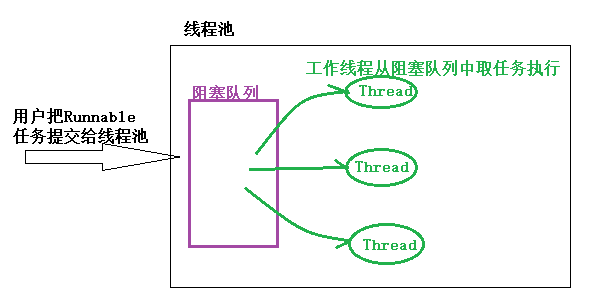

使用线程池主要有以下三个原因：

1. 创建/销毁线程需要消耗系统资源，线程池可以**复用已创建的线程**。
2. **控制并发的数量**。并发数量过多，可能会导致资源消耗过多，从而造成服务器崩溃。（主要原因）
3. **可以对线程做统一管理**。


#### ThreadPoolExecutor的构造方法

Java中的线程池顶层接口是`Executor`接口，`ThreadPoolExecutor`是这个接口的实现类。

```java
// 五个参数的构造函数
public ThreadPoolExecutor(int corePoolSize, //该线程池中核心线程数最大值
                          int maximumPoolSize,//该线程池中线程总数最大值 
                          long keepAliveTime,//非核心线程闲置超时时长
                          TimeUnit unit,//keepAliveTime的单位。
                          BlockingQueue<Runnable> workQueue)//阻塞队列，维护着等待执行的Runnable任务对象。

// 六个参数的构造函数-1
public ThreadPoolExecutor(int corePoolSize,
                          int maximumPoolSize,
                          long keepAliveTime,
                          TimeUnit unit,
                          BlockingQueue<Runnable> workQueue,
                          ThreadFactory threadFactory)//创建线程的工厂 ，用于批量创建线程，统一在创建线程时设置一些参数，如是否守护线														程、线程的优先级等。如果不指定，会新建一个默认的线程工厂。

// 六个参数的构造函数-2
public ThreadPoolExecutor(int corePoolSize,
                          int maximumPoolSize,
                          long keepAliveTime,
                          TimeUnit unit,
                          BlockingQueue<Runnable> workQueue,
                          RejectedExecutionHandler handler)//拒绝处理策略，线程数量大于最大线程数就会采用拒绝处理策略

// 七个参数的构造函数
public ThreadPoolExecutor(int corePoolSize,
                          int maximumPoolSize,
                          long keepAliveTime,
                          TimeUnit unit,
                          BlockingQueue<Runnable> workQueue,
                          ThreadFactory threadFactory,
                          RejectedExecutionHandler handler)
```

- **int corePoolSize**：该线程池中**核心线程数最大值**

  核心线程：线程池中有两类线程，核心线程和非核心线程。核心线程默认情况下会一直存在于线程池中，即使这个核心线程什么都不干（铁饭碗），而非核心线程如果长时间的闲置，就会被销毁（临时工）。

- **int maximumPoolSize**：该线程池中**线程总数最大值** 。

  该值等于核心线程数量 + 非核心线程数量。

- **long keepAliveTime**：**非核心线程闲置超时时长**。

  非核心线程如果处于闲置状态超过该值，就会被销毁。如果设置allowCoreThreadTimeOut(true)，则会也作用于核心线程。

- **TimeUnit unit**：keepAliveTime的单位。

  *TimeUnit是一个枚举类型 ，包括以下属性：*

  *NANOSECONDS ： 1微毫秒 = 1微秒 / 1000 ；  MICROSECONDS ：1微秒 = 1毫秒 / 1000 ；MILLISECONDS ： 1毫秒 = 1秒 /1000 ；SECONDS ： 秒； MINUTES ： 分 ；HOURS ： 小时 ；DAYS ： 天*

- **BlockingQueue workQueue**：阻塞队列，维护着**等待执行的Runnable任务对象**。

  常用的几个阻塞队列：

  1. **LinkedBlockingQueue**

     链式阻塞队列，底层数据结构是链表，默认大小是`Integer.MAX_VALUE`，也可以指定大小。

  2. **ArrayBlockingQueue**

     数组阻塞队列，底层数据结构是数组，需要指定队列的大小。

  3. **SynchronousQueue**

     同步队列，内部容量为0，每个put操作必须等待一个take操作，反之亦然。

  4. **DelayQueue**

     延迟队列，该队列中的元素只有当其指定的延迟时间到了，才能够从队列中获取到该元素 。

- **ThreadFactory threadFactory**

  创建线程的工厂 ，用于批量创建线程，统一在创建线程时设置一些参数，如是否守护线程、线程的优先级等。如果不指定，会新建一个默认的线程工厂。

- **RejectedExecutionHandler handler**

  **拒绝处理策略**，线程数量大于最大线程数就会采用拒绝处理策略，四种拒绝处理的策略为 ：

  1. **ThreadPoolExecutor.AbortPolicy**：**默认拒绝处理策略**，丢弃任务并抛出RejectedExecutionException异常。
  2. **ThreadPoolExecutor.DiscardPolicy**：丢弃新来的任务，但是不抛出异常。
  3. **ThreadPoolExecutor.DiscardOldestPolicy**：丢弃队列头部（最旧的）的任务，然后重新尝试执行程序（如果再次失败，重复此过程）。
  4. **ThreadPoolExecutor.CallerRunsPolicy**：由调用线程处理该任务。


#### ThreadPoolExecutor的策略

线程池本身有一个调度线程，这个线程就是用于管理布控整个线程池里的各种任务和事务，例如创建线程、销毁线程、任务队列管理、线程队列管理等等。

故线程池也有自己的状态。`ThreadPoolExecutor`类中使用了一些`final int`常量变量来表示线程池的状态 ，分别为RUNNING、SHUTDOWN、STOP、TIDYING 、TERMINATED。

- 线程池创建后处于**RUNNING**状态。

- 调用shutdown()方法后处于**SHUTDOWN**状态，线程池不能接受新的任务，清除一些空闲worker,会等待阻塞队列的任务完成。

- 调用shutdownNow()方法后处于**STOP**状态，线程池不能接受新的任务，中断所有线程，阻塞队列中没有被执行的任务全部丢弃。此时，poolsize=0,阻塞队列的size也为0。

- 当所有的任务已终止，ctl记录的”任务数量”为0，线程池会变为**TIDYING(整洁)**状态。接着会执行 终止terminated()函数。

  > ThreadPoolExecutor中有一个控制状态的属性叫`ctl`，它是一个AtomicInteger类型的变量。线程池状态就是通过AtomicInteger类型的成员变量`ctl`来获取的。
  >
  > 获取的`ctl`值传入`runStateOf`方法，与`~CAPACITY`位与运算(`CAPACITY`是低29位全1的int变量)。
  >
  > `~CAPACITY`在这里相当于掩码，用来获取ctl的高3位，表示线程池状态；而另外的低29位用于表示工作线程数

- 线程池处在TIDYING状态时，**执行完terminated()方法之后**，就会由 **TIDYING -> TERMINATED**， 线程池被设置为TERMINATED状态。


#### 线程池主要的任务处理流程

**总结一下处理流程**

1. 线程总数量 < corePoolSize(核心线程)，无论线程是否空闲，都会新建一个核心线程执行任务（让核心线程数量快速达到corePoolSize，在核心线程数量 < corePoolSize时）。**注意，这一步需要获得全局锁。**
2. 线程总数量 >= corePoolSize时，新来的线程任务会进入任务队列中等待，然后空闲的核心线程会依次去缓存队列中取任务来执行（体现了**线程复用**）。
3. 当缓存队列满了，说明这个时候任务已经多到爆棚，需要一些“临时工”来执行这些任务了。于是会创建非核心线程去执行这个任务。**注意，这一步需要获得全局锁。**
4. 缓存队列满了， 且总线程数达到了maximumPoolSize，则会采取上面提到的拒绝策略进行处理。

整个过程如图所示：


#### ThreadPoolExecutor如何做到线程复用的？

我们知道，一个线程在创建的时候会指定一个线程任务，当执行完这个线程任务之后，线程自动销毁。但是线程池却可以复用线程，即一个线程执行完线程任务后不销毁，继续执行另外的线程任务。**那么，线程池如何做到线程复用呢？**

原来，ThreadPoolExecutor在创建线程时，会将线程封装成**工作线程worker**,并放入**工作线程组**中，然后这个worker反复从阻塞队列中拿任务去执行。


#### 自定义线程工厂

```java
package se.high.thread.executor;

import java.util.Date;
import java.util.Random;
import java.util.concurrent.*;

/**
 * @author 结构化思维wz
 */

public class Test05 {
    public static void main(String[] args) throws InterruptedException {

        //定义任务
        Runnable r = new Runnable() {
            @Override
            public void run() {
                int num = new Random().nextInt(10);
                System.out.println(Thread.currentThread().getName() + "号线程-->" + System.currentTimeMillis() + "开始睡眠:" + num + "秒");
                try {
                    TimeUnit.SECONDS.sleep(num);
                } catch (InterruptedException e) {
                    e.printStackTrace();
                }
            }
        };
        //创建线程池, 使用自定义线程工厂, 采用默认的拒绝策略是抛出异常
        ExecutorService executorService = new ThreadPoolExecutor(5, 5, 0, TimeUnit.SECONDS, new SynchronousQueue<>(), new ThreadFactory() {
            //自定义线程工厂
            @Override
            public Thread newThread(Runnable r) {
                //根据参数r接收的任务,创建一个线程
                Thread t = new Thread( r );
                t.setDaemon(true);  //设置为守护线程, 当主线程运行结束,线程池中的线程会自动退出
                System.out.println("创建了线程: " + t);
                return t ;
            }
        });

        //提交5个任务, 当给当前线程池提交的任务超过5个时,线程池默认抛出异常
        for (int i = 0; i < 5; i++) {
            executorService.execute(r);
        }

        //主线程睡眠
        Thread.sleep(10000);
        //主线程睡眠超时, 主线程结束, 线程池中的线程会自动退出
    }

}

```

```java
创建了线程: Thread[Thread-0,5,main]
创建了线程: Thread[Thread-1,5,main]
创建了线程: Thread[Thread-2,5,main]
创建了线程: Thread[Thread-3,5,main]
创建了线程: Thread[Thread-4,5,main]
Thread-0号线程-->1633525975792开始睡眠:4秒
Thread-4号线程-->1633525975792开始睡眠:9秒
Thread-1号线程-->1633525975792开始睡眠:1秒
Thread-3号线程-->1633525975792开始睡眠:6秒
Thread-2号线程-->1633525975792开始睡眠:4秒

进程已结束，退出代码为 0

```

#### 监控线程池的方法

**ThreadPoolExecutor提供了一组方法用于监控线程池。**

- int `getActiveCount()` 获得线程池中当前活动线程的数量。
- long `getCompletedTaskCount()` 返回线程池完成任务的数量。
- int `getCorePoolSize()` 线程池中核心线程的数量。
- int `getLargestPoolSize()` 返回线程池曾经达到的线程的最大数。
- int `getMaximumPoolSize()` 返回线程池的最大容量。
- int `getPoolSize()` 当前线程池的大小。
- BlockingQueue `getQueue()` 返回阻塞队列。
- long `getTaskCount()` 返回线程池收到的任务总数。


**有时需要对线程池进行==扩展==,如在监控每个任务的开始和结束时间,或者自定义一些其他增强的功能。**

ThreadPoolExecutor线程池提供了两个方法：

● `protected void afterExecute(Runnable r, Throwable t)`

● `protected void beforeExecute(Thread t, Runnable r)`

在线程池执行任务前会调用`beforeExecute()`方法,在任务结束后(任务异常退出)会执行`afterExecute()`方法。

------


#### 线程池中的异常跟踪

在使用ThreadPoolExecutor进行submit提交任务时,有的任务抛出了异常,但是线程池并没有进行提示,即线程池把任务中的异常给吃掉了,可以把submit提交改为execute执行,也可以对`ThreadPoolExecutor`线程池进行扩展.对提交的任务进行包装:

```java
 //自定义线程池类
    private static class  TraceThreadPollExecutor extends  ThreadPoolExecutor{
        public TraceThreadPollExecutor(int corePoolSize, int maximumPoolSize, long keepAliveTime, TimeUnit unit, BlockingQueue workQueue) {
            super(corePoolSize, maximumPoolSize, keepAliveTime, unit, workQueue);
        }
        //定义方法,对执行的任务进行包装,接收两个参数,第一个参数接收要执行的任务,第二个参数是一个Exception异常
        public Runnable wrap( Runnable task, Exception exception){
            return  new Runnable() {
                @Override
                public void run() {
                    try {
                        task.run();
                    }catch (Exception e ){
                        exception.printStackTrace();
                        throw  e;
                    }
                }
            };
        }

        //重写submit方法
        @Override
        public Future submit(Runnable task) {
            return super.submit(wrap(task, new Exception("客户跟踪异常")));
        }

        @Override
        public void execute(Runnable command) {
            super.execute(wrap(command, new Exception("客户跟踪异常")));
        }
    }

    //定义类实现Runnable接口,用于计算两个数相除
    private static class  DivideTask implements  Runnable{
        private  int x;
        private  int y;

        public DivideTask(int x, int y) {
            this.x = x;
            this.y = y;
        }

        @Override
        public void run() {
            System.out.println(Thread.currentThread().getName() + "计算:" + x + " / " + y + " = " + (x/y));
        }
    }
    public static void main(String[] args) {
        //创建线程池
//        ThreadPoolExecutor poolExecutor = new ThreadPoolExecutor(0, Integer.MAX_VALUE, 0, TimeUnit.SECONDS, new SynchronousQueue<>());
        //使用自定义的线程池
        ThreadPoolExecutor poolExecutor = new TraceThreadPollExecutor(0, Integer.MAX_VALUE, 0, TimeUnit.SECONDS, new SynchronousQueue<>());

        //向线程池中添加计算两个数相除的任务
        for (int i = 0; i < 5; i++) {
            poolExecutor.submit(new DivideTask(10, i));
//            poolExecutor.execute(new DivideTask(10, i));
        }

    }
```


### 四种常见的线程池

> `Executors`类中提供的几个静态方法来创建线程池。

主要有四种 Executor：

- CachedThreadPool：一个任务创建一个线程；
- FixedThreadPool：所有任务只能使用固定大小的线程；
- SingleThreadExecutor：相当于大小为 1 的 FixedThreadPool。
- newScheduledThreadPool：创建一个定长线程池，支持定时及周期性任务执行。

#### **submit()和execut的区别：**

1、execut()可以添加一个Runable任务,submit()不仅可以添加Runable任务还可以添加Callable任务。
2、execut()没有返回值,而submit()在添加Callable任务时会有返回值(再添加Runable任务时也有,不过无意义),可以通过返回值来查看线程执行的情况。

3、如果发生异常submit()可以通过捕获Future.get抛出的异常,而execute()会终止这个线程。

4、submit中抛出异常**不管提交的是Runnable还是Callable类型的任务，如果不对返回值Future调用get()方法，都会吃掉异常**


#### 1.newCachedThreadPool

> ```java
> public static ExecutorService newCachedThreadPool() {
>     return new ThreadPoolExecutor(0, Integer.MAX_VALUE,
>                                   60L, TimeUnit.SECONDS,
>                                   new SynchronousQueue<Runnable>());
> }
> ```
>
> `CacheThreadPool`的**运行流程**如下：
>
> 1. 提交任务进线程池。
> 2. 因为**corePoolSize**为0的关系，不创建核心线程，线程池最大为Integer.MAX_VALUE。
> 3. 尝试将任务添加到**SynchronousQueue**队列。
> 4. 如果SynchronousQueue入列成功，等待被当前运行的线程空闲后拉取执行。如果当前没有空闲线程，那么就创建一个非核心线程，然后从SynchronousQueue拉取任务并在当前线程执行。
> 5. 如果SynchronousQueue已有任务在等待，入列操作将会阻塞。

**当需要执行`很多短时间`的任务时，CacheThreadPool的线程`复用率`比较高， 会显著的`提高性能`。而且线程60s后会回收，意味着即使没有任务进来，CacheThreadPool`并不会占用很多资源`。**

应用实例：

```java
public class Test02 {
    public static void main(String[] args) {
        //创建线程池
        ExecutorService fixed = Executors.newCachedThreadPool();
        //向线程池中提交18个任务
        for (int i = 0; i < 18; i++) {
            fixed.execute(new Runnable() {
                @Override
                public void run() {
                    System.out.println(Thread.currentThread().getId()+"编号的任务正在执行"+System.currentTimeMillis());
                    try {
                        Thread.sleep(3000); //模拟任务
                    } catch (InterruptedException e) {
                        e.printStackTrace();
                    }
                }
            });
        }
    }
}

```

结果：直接创建18个线程

```java
12编号的任务正在执行1633523743560
15编号的任务正在执行1633523743560
14编号的任务正在执行1633523743560
13编号的任务正在执行1633523743560
17编号的任务正在执行1633523743560
16编号的任务正在执行1633523743560
18编号的任务正在执行1633523743560
20编号的任务正在执行1633523743560
19编号的任务正在执行1633523743560
21编号的任务正在执行1633523743560
22编号的任务正在执行1633523743560
23编号的任务正在执行1633523743560
24编号的任务正在执行1633523743560
25编号的任务正在执行1633523743560
26编号的任务正在执行1633523743560
27编号的任务正在执行1633523743561
28编号的任务正在执行1633523743561
29编号的任务正在执行1633523743561
```


#### 2.newFixedThreadPool

> ```java
> public static ExecutorService newFixedThreadPool(int nThreads) {
>         return new ThreadPoolExecutor(nThreads, nThreads,
>                                       0L, TimeUnit.MILLISECONDS,
>                                       new LinkedBlockingQueue<Runnable>());
> }
> ```
>
> 核心线程数量和总线程数量相等，都是传入的参数nThreads，所以只能创建核心线程，不能创建非核心线程。因为LinkedBlockingQueue的默认大小是Integer.MAX_VALUE，故如果核心线程空闲，则交给核心线程处理；如果核心线程不空闲，则入列等待，直到核心线程空闲。

**与CachedThreadPool的区别**：

- 因为 corePoolSize == maximumPoolSize ，所以FixedThreadPool只会创建核心线程。 而CachedThreadPool因为corePoolSize=0，所以只会创建非核心线程。
- 在 getTask() 方法，如果队列里没有任务可取，线程会一直阻塞在 LinkedBlockingQueue.take() ，线程不会被回收。 CachedThreadPool会在60s后收回。
- 由于线程不会被回收，会一直卡在阻塞，所以**没有任务的情况下， FixedThreadPool占用资源更多**。
- 都几乎不会触发拒绝策略，但是原理不同。FixedThreadPool是因为阻塞队列可以很大（最大为Integer最大值），故几乎不会触发拒绝策略；CachedThreadPool是因为线程池很大（最大为Integer最大值），几乎不会导致线程数量大于最大线程数，故几乎不会触发拒绝策略。

使用案例：

```java
package se.high.thread.executor;

import java.util.concurrent.ExecutorService;
import java.util.concurrent.Executors;

/**
 * @author 结构化思维wz
 * 线程池耳钉基本使用
 */

public class Test01 {
    public static void main(String[] args) {
        //创建线程池
        ExecutorService fixed = Executors.newFixedThreadPool(5);

        //向线程池中提交18个任务
        for (int i = 0; i < 18; i++) {
            fixed.execute(new Runnable() {
                @Override
                public void run() {
                    System.out.println(Thread.currentThread().getId()+"编号的任务正在执行"+System.currentTimeMillis());
                    try {
                        Thread.sleep(3000); //模拟任务
                    } catch (InterruptedException e) {
                        e.printStackTrace();
                    }
                }
            });
        }
    }

}

```

结果：线程池中一直有5个线程，而且不会结束。

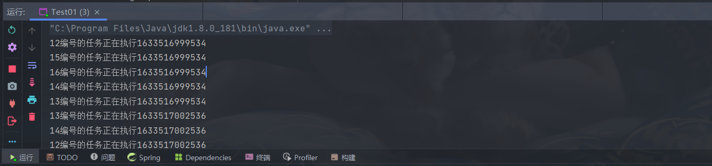


#### 3.newSingleThreadExecutor

> ```java
> public static ExecutorService newSingleThreadExecutor() {
>     return new FinalizableDelegatedExecutorService
>         (new ThreadPoolExecutor(1, 1,
>                                 0L, TimeUnit.MILLISECONDS,
>                                 new LinkedBlockingQueue<Runnable>()));
> }
> ```
>
> 有且仅有一个核心线程（ corePoolSize == maximumPoolSize=1），使用了LinkedBlockingQueue（容量很大），所以，**不会创建非核心线程**。所有任务按照**先来先执行**的顺序执行。如果这个唯一的线程不空闲，那么新来的任务会存储在任务队列里等待执行。

```java
public class Test03 {
    public static void main(String[] args) {
        //创建线程池
        ExecutorService fixed = Executors.newSingleThreadExecutor();

        //向线程池中提交18个任务
        for (int i = 0; i < 18; i++) {
            fixed.execute(new Runnable() {
                @Override
                public void run() {
                    System.out.println(Thread.currentThread().getId()+"编号的任务正在执行"+System.currentTimeMillis());
                    try {
                        Thread.sleep(3000); //模拟任务
                    } catch (InterruptedException e) {
                        e.printStackTrace();
                    }
                }
            });
        }
    }

}
```

```java
12编号的任务正在执行1633523971042
12编号的任务正在执行1633523974053
12编号的任务正在执行1633523977066
12编号的任务正在执行1633523980077
12编号的任务正在执行1633523983086
.....
```


#### 4.newScheduledThreadPool

> 创建一个定长线程池，支持定时及周期性任务执行。
>
> ```java
> public static ScheduledExecutorService newScheduledThreadPool(int corePoolSize) {
>     return new ScheduledThreadPoolExecutor(corePoolSize);
> }
> 
> //ScheduledThreadPoolExecutor():
> public ScheduledThreadPoolExecutor(int corePoolSize) {
>     super(corePoolSize, Integer.MAX_VALUE,
>           DEFAULT_KEEPALIVE_MILLIS, MILLISECONDS,
>           new DelayedWorkQueue());
> }
> ```


```java
package se.high.thread.executor;

import java.text.SimpleDateFormat;
import java.time.format.DateTimeFormatter;
import java.util.Date;
import java.util.concurrent.Executors;
import java.util.concurrent.ScheduledExecutorService;
import java.util.concurrent.TimeUnit;

/**
 * @author 结构化思维wz
 */

public class Test04 {
    static SimpleDateFormat date = new SimpleDateFormat("yyyy-MM-dd HH:mm:ss");
    public static void main(String[] args) {

        ScheduledExecutorService scheduledThreadPool = Executors.newScheduledThreadPool(5);
        //循环周期执行
        /**
         * Runnable–要执行的任务
         * initialDelay–延迟第一次执行的时间
         * period–一次执行终止与下一次执行开始之间的延迟
         * unit–initialDelay和delay参数的时间单位
         */
        System.out.println(date.format(System.currentTimeMillis()));
        scheduledThreadPool.scheduleAtFixedRate(new Runnable() {
            @Override
            public void run() {
               String time = date.format(System.currentTimeMillis());
                System.out.println("延迟一秒，每3s运行一次"+time);
            }
        }, 1, 3, TimeUnit.SECONDS);

    }

}

```

```java
2021-10-06 21:22:48
延迟一秒，每3s运行一次2021-10-06 21:22:49
延迟一秒，每3s运行一次2021-10-06 21:22:52
延迟一秒，每3s运行一次2021-10-06 21:22:55
延迟一秒，每3s运行一次2021-10-06 21:22:58
延迟一秒，每3s运行一次2021-10-06 21:23:01
延迟一秒，每3s运行一次2021-10-06 21:23:04
延迟一秒，每3s运行一次2021-10-06 21:23:07
延迟一秒，每3s运行一次2021-10-06 21:23:10

```

四种常见的线程池基本够我们使用了，但是《阿里巴巴开发手册》不建议我们直接使用Executors类中的线程池，而是通过`ThreadPoolExecutor`的方式，这样的处理方式让写的同学需要更加明确线程池的运行规则，规避资源耗尽的风险。


### ForkJoinPoll

`“分而治之”`是一个有效的处理大数据的方法,著名的`MapReduce`就是采用这种分而治之的思路. 简单点说,如果要处理的1000个数据,但是我们不具备处理1000个数据的能力,可以只处理10个数据, 可以把这1000个数据分阶段处理100次,每次处理10个,把100次的处理结果进行合成,形成最后这1000个数据的处理结果。

把一个大任务调用`fork()`方法分解为若干小的任务,把小任务的处理结果进行`join()`合并为大任务的结果。

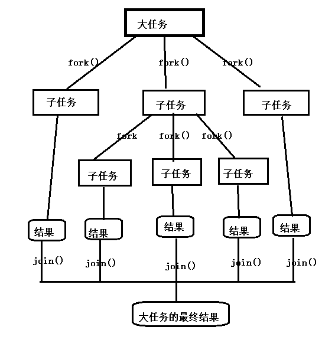

系统对`ForkJoinPool`线程池进行了优化,提交的任务数量与线程的数量不一定是一对一关系.在多数情况下,一个物理线程实际上需要处理多个逻辑任务。

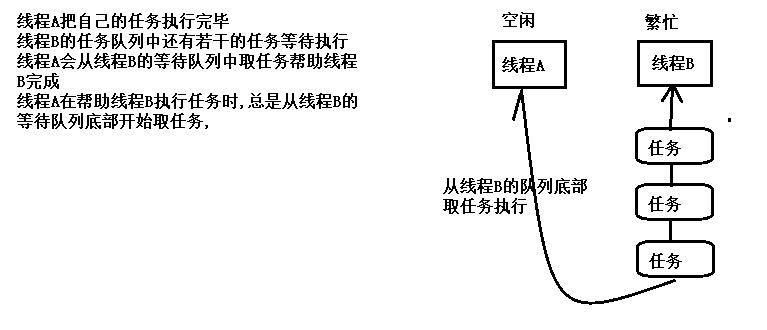

ForkJoinPool线程池中最常用的方法是:

`ForkJoinTask submit(ForkJoinTask task)` 向线程池提交一个`ForkJoinTask`任务. ForkJoinTask任务支持`fork()`分解与 `join()`等待的任务. `ForkJoinTask`有两个重要的子类:`RecursiveAction`和 `RecursiveTask` ,它们的区别在于`RecursiveAction任务没有返回值`, `RecursiveTask 任务可以带有返回值`。

```java
package se.high.thread.executor;

import java.util.ArrayList;
import java.util.concurrent.ExecutionException;
import java.util.concurrent.ForkJoinPool;
import java.util.concurrent.ForkJoinTask;
import java.util.concurrent.RecursiveTask;

/**
 * @author 结构化思维wz
 * 演示ForkJoinPool线程池的使用
 * 使用该线程池模拟数列求和
 */

public class Test07 {
    //计算数列的和, 需要返回结果,可以定义任务继承RecursiveTask
    private static class CountTask extends RecursiveTask<Long> {
        private static final int THRESHOLD = 10000;     //定义数据规模的阈值,允许计算10000个数内的和,超过该阈值的数列就需要分解
        private static final int TASKNUM = 100;     //定义每次把大任务分解为100个小任务
        private long start;     //计算数列的起始值
        private long end;       //计算数列的结束值

        public CountTask(long start, long end) {
            this.start = start;
            this.end = end;
        }

        //重写RecursiveTask类的compute()方法,计算数列的结果
        @Override
        protected Long compute() {
            long sum = 0 ;      //保存计算的结果
            //判断任务是否需要继续分解,如果当前数列end与start范围的数超过阈值THRESHOLD,就需要继续分解
            if ( end - start < THRESHOLD){
                //小于阈值可以直接计算
                for (long i = start ; i <= end; i++){
                    sum += i;
                }
            }else {     //数列范围超过阈值,需要继续分解
                //约定每次分解成100个小任务,计算每个任务的计算量
                long step = (start + end ) / TASKNUM;
                //start = 0 , end = 200000, step = 2000, 如果计算[0,200000]范围内数列的和, 把该范围的数列分解为100个小任务,每个任务计算2000个数即可
                //注意,如果任务划分的层次很深,即THRESHOLD阈值太小,每个任务的计算量很小,层次划分就会很深,可能出现两种情况:一是系统内的线程数量会越积越多,导致性能下降严重;  二是分解次数过多,方法调用过多可能会导致栈溢出
                //创建一个存储任务的集合
                ArrayList<CountTask> subTaskList = new ArrayList<>();
                long pos = start;       //每个任务的起始位置
                for (int i = 0; i < TASKNUM; i++) {
                    long lastOne = pos + step;      //每个任务的结束位置
                    //调整最后一个任务的结束位置
                    if ( lastOne > end ){
                        lastOne = end;
                    }
                    //创建子任务
                    CountTask task = new CountTask(pos, lastOne);
                    //把任务添加到集合中
                    subTaskList.add(task);
                    //调用for()提交子任务
                    task.fork();
                    //调整下个任务的起始位置
                    pos += step + 1;
                }

                //等待所有的子任务结束后,合并计算结果
                for (CountTask task : subTaskList) {
                    sum += task.join();         //join()会一直等待子任务执行完毕返回执行结果
                }
            }

            return sum;
        }
    }

    public static void main(String[] args) {
        //创建ForkJoinPool线程池
        ForkJoinPool forkJoinPool = new ForkJoinPool();
        //创建一个大的任务
        CountTask task = new CountTask(0L, 200000L);
        //把大任务提交给线程池
        ForkJoinTask<Long> result = forkJoinPool.submit(task);
        try {
            Long res = result.get();    //调用任务的get()方法返回结果
            System.out.println("计算数列结果为:" + res);
        } catch (InterruptedException e) {
            e.printStackTrace();
        } catch (ExecutionException e) {
            e.printStackTrace();
        }

        //验证
        long s = 0L;
        for (long i = 0; i <= 200000 ; i++) {
            s += i;
        }
        System.out.println(s);
    }

}

```


## 九、保障线程安全的设计技术

> 从面向对象设计的角度出发介绍几种保障线程安全的设计技术,这些技术可以使得我们在不必借助锁的情况下保障线程安全,避免锁可能导致的问题及开销。

### 1.Java运行时存储空间

**Java运行时(Java runtime)内存可以分为`栈区`,`堆区`与`方法区(非堆空间)`。**

**栈空间(Stack Space)**为线程的执行准备一段固定大小的存储空间,**每个线程都有独立的线程栈空间,创建线程时就为线程分配栈空间.**在线程栈中每调用一个方法就给方法分配一个``栈帧``,``栈帧用于存储方法的局部变量,返回值等私有数据``, 即**局部变量存储在栈空间中, 基本类型变量也是存储在栈空间中, 引用类型变量值也是存储在栈空间中,引用 的对象存储在堆中.** 由于线程栈是相互独立的,一个线程不能访问另外一个线程的栈空间,因此线程对局部变量以及只能通过当前线程的局部变量才能访问的对象进行的操作具有固定的线程安全性。

**堆空间(Heap Space)**用于存储对象,是在JVM启动时分配的一段可以动态扩容的内存空间. **创建对象时,在堆空间中给对象分配存储空间,实例变量就是存储在堆空间中的,** 堆空间是多个线程之间可以**共享的空间**,因此实例变量可以被多个线程共享. 多个线程同时操作实例变量可能存在线程安全问题。

**非堆空间(Non-Heap Space)****用于存储常量,类的元数据等**, 非堆空间也是在JVM启动时分配的一段可以动态扩容的存储空间.类的元数据包括``静态变量``,``类有哪些方法``及``这些方法的元数据(方法名,参数,返回值等)``. 非堆空间也是多个 线程可以共享的, 因此访问非堆空间中的``静态变量``也可能存在线程安全问题。

堆空间与非堆空间是线程可以共享的空间,**即实例变量与静态变量是线程可以共享的,可能存在线程安全问题.** 栈空间是线程私有的存储空间,局部变量存储在栈空间中,**局部变量具有固定的线程安全性。**

### 2.无状态对象

Java无状态对象

对象就是数据及对数据操作的封装, 对象所包含的数据称为对象的状态(State), 实例变量与静态变量称为状态变量。

**如果一个类的同一个实例被多个线程共享并不会使这些线程存储共享的状态,那么该类的实例就称为无状态对象(Stateless Object).** 反之**如果一个类的实例被多个线程共享会使这些线程存在共享状态,那么 该类的实例称为有状态对象.** 实际上**无状态对象就是不包含任何实例变量也不包含任何静态变量的对象。**

线程安全问题的前提是**多个线程存在共享的数据,实现线程安全的一种办法就是避免在多个线程之间共享数据,使用无状态对象就是这种方法。**

### 3.不可变对象

不可变对象是指一经创建它的状态就保持不变的对象,不可变对象具有固有的线程安全性. 当不可变对象现实实体的状态发生变化时,系统会创建一个新的不可变对象,就如String字符串对象. 一个不可变对象需要满足以下条件：

1、**类本身使用final修饰,防止通过创建子类来改变它的定义。**

2、**所有的字段都是final修饰的,final字段在创建对象时必须显示初始化,不能被修改。**

3、**如果字段引用了其他状态可变的对象(集合,数组),则这些字段必须是private私有的。**

**不可变对象主要的应用场景:**

1、被建模对象的状态变化不频繁。

2、同时对一组相关数据进行写操作,可以应用不可变对象,既可以保障原子性也可以避免锁的使用。

3、使用不可变对象作为安全可靠的Map键, HashMap键值对的存储位置与键的hashCode()有关,如果键的内部状态发生了变化会导致键的哈希码不同,可能会影响键值对的存储位置. 如果HashMap的键是一个不可变对象,则hashCode()方法的返回值恒定,存储位置是固定的。

### 4.线程特有对象

我们可以选择**不共享非线程安全的对象**,对于非线程安全的对象,每个线程都创建一个该对象的实例,各个线程线程访问各自创建的实例,一个线程不能访问另外一个线程创建的实例. 这种各个线程创建各自的实例,一个实例只能被一个线程访问的对象就称为线程特有对象. 线程特有对象既保障了对非线程安全对象的访问的线程安全,又避免了锁的开销.线程特有对象也具有固有的线程安全性。

**ThreadLocal类相当于线程访问其特有对象的代理,即各个线程通过ThreadLocal对象可以创建并访问各自的线程特有对象,泛型T指定了线程特有对象的类型. 一个线程可以使用不同的ThreadLocal实例来创建并访问不同的线程特有对象。**

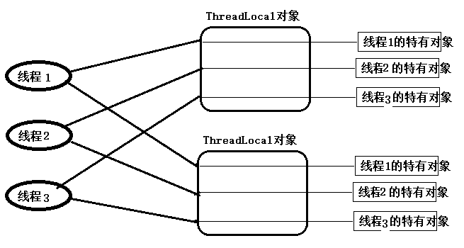

ThreadLocal实例为每个访问它的线程都关联了一个该线程特有的对象, ThreadLocal实例都有当前线程与特有实例之间的一个关联。

### 5.装饰器模式

装饰器模式可以用来实现线程安全,基本思想是**为非线程安全的对象创建一个相应的线程安全的外包装对象,客户端代码不直接访问非线程安全的对象而是访问它的外包装对象.** 外包装对象与非线程安全的对象具有相同的接口,即外包装对象的使用方式与非线程安全对象的使用方式相同,而**外包装对象内部通常会借助锁,以线程安全的方式调用相应的非线程安全对象的方法**。

在``java.util.Collections`工具类中提供了一组`synchronizedXXX(xxx)``可以把不是线程安全的``xxx集合``转换为``线程安全的集合``,它就是采用了这种装饰器模式. 这个方法返回值就是指定集合的外包装对象.这类集合又称为``同步集合``。

使用装饰器模式的一个好处就是实现``关注点分离``,在这种设计中,实现同一组功能的对象的两个版本:非线程安全的对象与线程安全的对象. 对于非线程安全的在设计时只关注要实现的功能,对于线程安全的版本只关注线程安全性。


## 十、锁的优化及注意事项

> 多核CPU时代，多线程能明显提高效率。但是锁的不当使用，会让效率下降。

### 减少锁持有时间

对于使用锁进行并发控制的应用程序来说,如果单个线程特有锁的时间过长,会导致锁的竞争更加激烈,会影响系统的性能.在程序中需要尽可能减少线程对锁的持有时间,如下面代码:

```java
public synchronized void  syncMethod(){
   othercode1();
   mutexMethod();
   othercode();
}
```

在syncMethod同步方法中,假设只有mutexMethod()方法是需要同步的, othercode1()方法与othercode2()方法不需要进行同步. 如果othercode1与othercode2这两个方法需要花费较长的CPU时间,在并发量较大的情况下,这种同步方案会导致等待线程的大量增加. 一个较好的优化方案是,只在必要时进行同步,可以减少锁的持有时间,提高系统的吞吐量,如把上面的代码改为:

```java
public  void  syncMethod(){
   othercode1();
   synchronized (this) {
      mutexMethod();
   }
   othercode();
}
```

只对mutexMethod()方法进行同步,这种**减少锁持有时间有助于降低锁冲突的可能性,提升系统的并发能力。**


### 减小锁的粒度

一个锁保护的共享数据的数量大小称为锁的粒度. 如果一个锁保护的共享数据的数量大就称该锁的粒度粗,否则称该锁的粒度细.锁的粒度过粗会导致线程在申请锁时需要进行不必要的等待.

*例如某柜台的业务太多，导致要等待很长时间。现实中把不同业务分为不同柜台，减少等待时间。*

**减少锁粒度是一种削弱多线程锁竞争的一种手段,可以提高系统的并发性。**

应用实例：在JDK7前,java.util.concurrent.ConcurrentHashMap类采用分段锁协议,可以提高程序的并发性。


### 使用读写分离锁代替独占锁

使用 `ReadWriteLock`读写分离锁可以提高系统性能, 使用读写分离锁也是减小锁粒度的一种特殊情况. 第**二条建议是能分割数据结构实现减小锁的粒度,**那么**读写锁是对系统功能点的分割。**

在多数情况下都允许多个线程同时读,在写的使用采用独占锁,在读多写少的情况下,使用读写锁可以大大提高系统的并发能力。


### 锁分离

将读写锁的思想进一步延伸就是锁分离.读写锁是根据读写操作功能上的不同进行了锁分离.**根据应用程序功能的特点,也可以对独占锁进行分离.**如``java.util.concurrent.LinkedBlockingQueue类``中``take()``与``put()``方法分别从队头取数据,把数据添加到队尾. **虽然这两个方法都是对队列进行修改操作,由于操作的主体是链表,take()操作的是链表的头部,put()操作的是链表的尾部,两者并不冲突.** **如果采用独占锁的话,这两个操作不能同时并发,在该类中就采用锁分离,take()取数据时有取锁, put()添加数据时有自己的添加锁,这样take()与put()相互独立实现了并发。**


### 粗锁化

为了保证多线程间的有效并发,会要求每个线程持有锁的时间尽量短.但是凡事都有一个度,**如果对同一个锁不断的进行请求,同步和释放,也会消耗系统资源.如:**

```java
public void  method1(){
   synchronized( lock ){
      同步代码块1
   }
   synchronized( lock ){
      同步代码块2
   }
}
```

JVM在遇到一连串不断对同一个锁进行请求和释放操作时,会把所有的锁整合成对锁的一次请求,从而减少对锁的请求次数,**这个操作叫锁的粗化**,如上一段代码会整合为:

```java
public void  method1(){
  synchronized( lock ){
     同步代码块1
     同步代码块2
  }
}
```

在开发过程中,也应该有意识的在合理的场合进行锁的粗化,尤其在循环体内请求锁时,如:

```java
for(int i = 0 ; i< 100; i++){
   synchronized(lock){}
}
```

这种情况下,意味着每次循环都需要申请锁和释放锁,所以一种更合理的做法就是在循环外请求一次锁,如:

```java
synchronized( lock ){
   for(int i = 0 ; i< 100; i++){}
}
```


### JVM锁优化

锁偏向

**锁偏向是一种针对加锁操作的优化,如果一个线程获得了锁,那么锁就进入偏向模式,** 当这个线程再次请求锁时,无须再做任何同步操作,这样可以节省有关锁申请的时间,提高了程序的性能。

**锁偏向在没有锁竞争的场合可以有较好的优化效果,对于锁竞争 比较激烈的场景,效果不佳, 锁竞争激烈的情况下可能是每次都是不同的线程来请求锁,这时偏向模式失效。**

### 量级锁

**如果锁偏向失败,JVM不会立即挂起线程,还会使用一种称为轻量级锁的优化手段. 会将对象的头部作为指针,指向持有锁的线程堆栈内部, 来判断一个线程是否持有对象锁.** 如果线程获得轻量级锁成功,就进入临界区. 如果获得轻量级锁失败,表示其他线程抢到了锁,那么当前线程的锁的请求就膨胀为重量级锁.当前线程就转到阻塞队列中变为阻塞状态。

**偏向锁,轻量级锁都是乐观锁**, **重量级锁是悲观锁。**

**一个对象刚开始实例化时,没有任何线程访问它,它是可偏向的,即它认为只可能有一个线程来访问它,所以当第一个线程来访问它的时候,它会偏向这个线程.** 偏向第一个线程,这个线程在修改对象头成为偏向锁时使用==CAS操作==,将对象头中ThreadId改成自己的ID,之后再访问这个对象时,只需要对比ID即可. 一旦有第二个线程访问该对象,**因为偏向锁不会主动释放**,所以第二个线程可以查看对象的偏向状态,当第二个线程访问对象时,表示在这个对象上已经存在竞争了,检查原来持有对象锁的线程是否存活,如果挂了则将对象变为无锁状态,然后重新偏向新的线程; 如果原来的线程依然存活,则马上执行原来线程的栈,检查该对象的使用情况,如果仍然需要偏向锁,则偏向锁升级为轻量级锁。

**轻量级锁认为竞争存在,但是竞争的程度很轻,一般两个线程对同一个锁的操作会错开,或者稍微等待一下(自旋)另外一个线程就会释放锁. 当自旋超过一定次数,或者一个线程持有锁,一个线程在自旋,又来第三个线程访问时, 轻量级锁会膨胀为重量级锁, 重量级锁除了持有锁的线程外,其他的线程都阻塞。**

### 自旋锁

锁膨胀后,JVM为了避免线程在真实的层面被挂起,JVM还会做最后的努力,这就是自旋锁. **当前线程无法立即获得锁,但是在什么时候可以获得锁也不一定, 也许在几个CPU周期后就可以得到锁, 如果是这样的话,简单的将线程挂起可能是一种得不偿失的操作. 因此JVM会进行一次赌注: JVM期望在不久的将来可以得到锁.** 因为JVM会让当前的线程做几个空循环,在经过若干次循环后,如果可以得到锁就进入临界区,如果还不能得到锁则将线程真实的挂起。

### 锁消除

**锁消除是一种更彻底的锁优化, JVM在JIT编译时,会通过扫描上下文,去除不可能存在共享资源竞争的锁, 通过锁消除,可以节省毫无意义的请求锁时间。**


### **多线程开发良好的实践**

- 给线程起个有意义的名字，这样可以方便找 Bug。
- 缩小同步范围，从而减少锁争用。例如对于 `synchronized`，应该尽量使用同步块而不是同步方法。
- 多用同步工具少用 wait() 和 notify()。首先，CountDownLatch, CyclicBarrier, Semaphore 和 Exchanger 这些同步类简化了编码操作，而用 wait() 和 notify() 很难实现复杂控制流；其次，这些同步类是由最好的企业编写和维护，在后续的 JDK 中还会不断优化和完善。
- 使用 `BlockingQueue` 实现生产者消费者问题。
- 多用并发集合少用同步集合，例如应该使用 `ConcurrentHashMap` 而不是 Hashtable。
- 使用`本地变量`和``不可变类``来保证线程安全。
- 使用``线程池``而不是直接创建线程，这是因为创建线程代价很高，线程池可以有效地利用有限的线程来启动任务。

