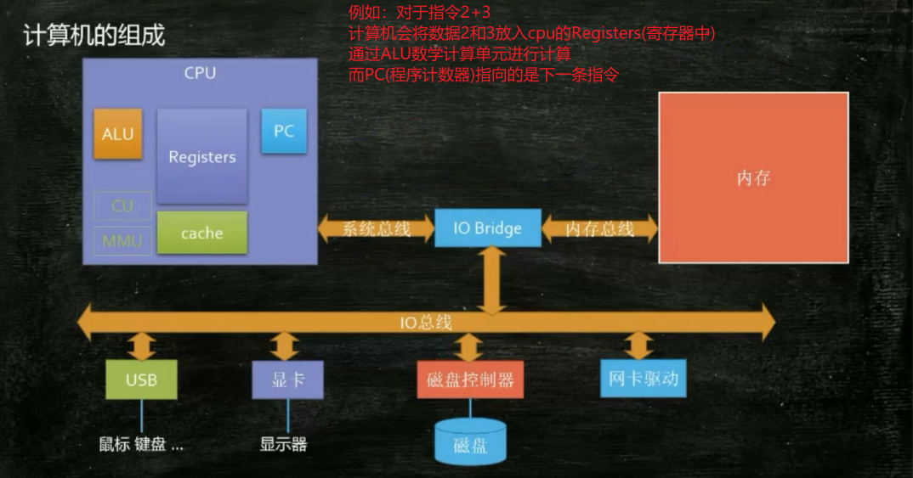
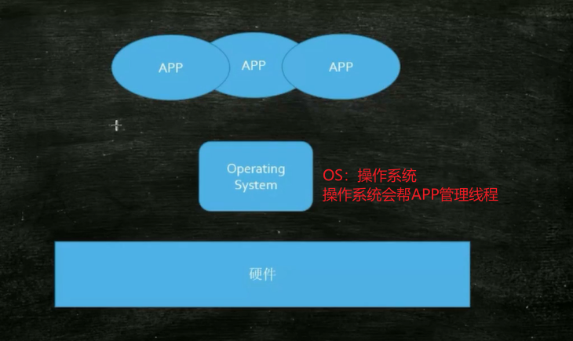
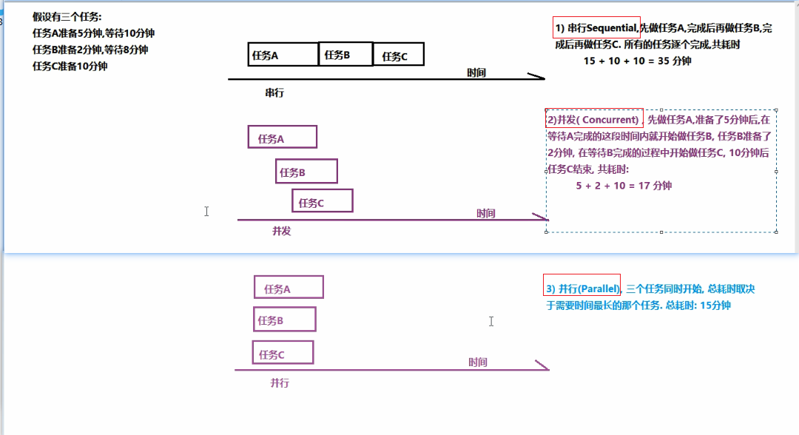
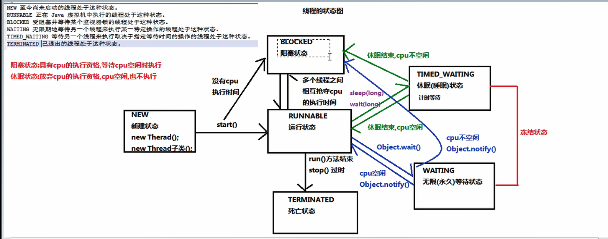
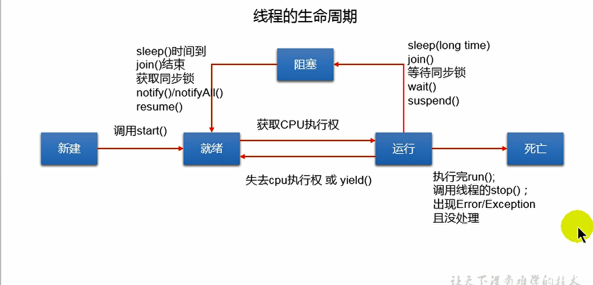
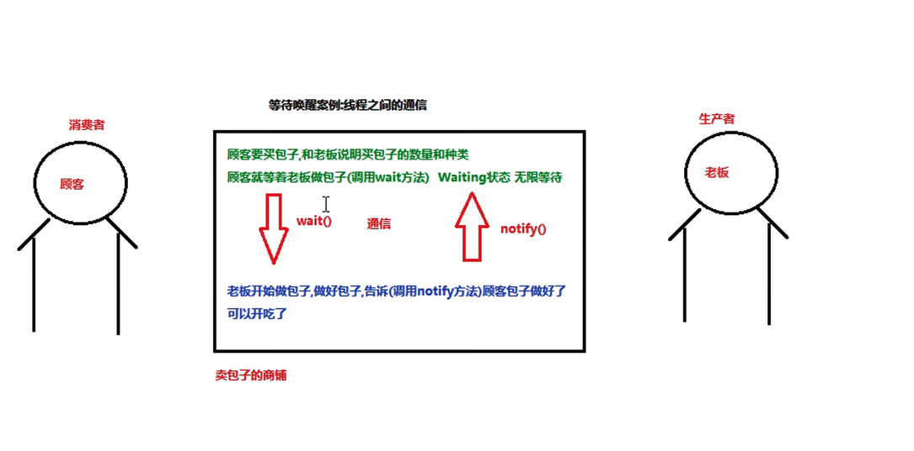

# 线程

## 1.线程概述

### 1.1 线程的相关概念

~~~markdown
# 1.进程(process)
是计算机中的程序关于某数据集合的一次运行活动，是操作系统进行资源分配和调度的基本单位！是正在运行的程序，程序是静止的，进程是活跃的。
ctrl + alt + delete  -- >弹出任务管理器
操作系统中正在运行的一个程序！
特点：
    1.动态性
    2.并发性
    3.独立性  
# 2.线程(thread)
是进程的一个执行单元！
线程就是进程的一个执行分支！，是CPU调度的最小执行单元！
~~~

~~~java
进程是计算机程序在内存中分配的空间，也就是正在运行的程序！
进程是线程的容器，一个进程中至少有一个线程，一个进程中也可以有多个线程！
~~~

> 在操作系统中是以进程为单位分配资源，如虚拟存储空间，文件描述符等
>
> 每个线程都有自己各自的线程栈自己的寄存器环境，自己的线程本地存储
>
> 进程是操作系统进⾏资源分配的基本单位，⽽线程是操作系 
>
> 统进⾏调度的基本单位，即CPU分配时间的单位



​	CPU读指令：pc**存储指令地址，区分每一条指令，执行下一条指令**，Registers**读数据**，ALU**计算**回写,上一个线程之心管道哪里一般保存到cache中！

**原理分析**



~~~markdown
JVM起的线程和操作系统起的线程是1:1的关系
此时，CPU采⽤时间⽚轮转的⽅式运⾏进程：CPU为每个进程分配⼀个时间段，称 作它的时间⽚。如果在时间⽚结束时进程还在运⾏，则暂停这个进程的运⾏，并且CPU分配给另⼀个进程（这个过程叫做上下⽂切换）。如果进程在时间⽚结束前阻塞或结束，则CPU⽴即进⾏切换，不⽤等待时间⽚⽤完
~~~

>Context Switch(线程切换):保存现场，执行新线程，恢复现场，继续执行原线程的这样一个过程，称为线程切换。线程切换也是需要时间的！
>
>当进程暂停时，它会保存当前进程的状态（进程标识，进程使⽤的资源等），在下⼀次切换回来时根据之前保存的状态进⾏恢复，接着继续执⾏

#### 使用多线程的好处

- 进程间通信较为复杂，而线程间通信比较简单，我们需要使用共享资源，而这些资源在线程之间通信比较简单！！！
- 进程是重量级的，线程是轻量级的，故多线程的方式的系统开销小！

`主线程与子线程`

~~~markdown
JVM启动时会创建一个主线程，该线程负责执行main方法，主线程就是运行main方法的线程。
Java中的线程不是孤立的，线程之间也存在一些联系。如果在A线程中创建了B线程，则称B线程是A线程的子线程！
~~~



>并发可以提高对事物的处理效率，在一段时间内可以处理或者完成更多的事情！！！

>如果是单核cpu,一个处理器一次只能执行一个线程的情况下，处理器可以使用时间片轮转技术，可以让cpu快速的在各个线程之间切换，对于用户来说，感觉像是三个线程同时执行。如果是多核CPU，可以为不同的线程分配不同的cpu内核！

**总结**

- 进程单独占有⼀定的内存地址空间，所以进程间存在内存隔离，数据是分开 的，数据共享复杂但是同步简单，各个进程之间互不⼲扰；⽽线程共享所属进 程占有的内存地址空间和资源，数据共享简单，但是同步复杂。 

- 进程单独占有⼀定的内存地址空间，⼀个进程出现问题不会影响其他进程，不影响主程序的稳定性，可靠性⾼；⼀个线程崩溃可能影响整个程序的稳定性， 可靠性较低。 

- 进程单独占有⼀定的内存地址空间，进程的创建和销毁不仅需要保存寄存器和 栈信息，还需要资源的分配回收以及⻚调度，开销较⼤；线程只需要保存寄存器和栈信息，开销较⼩。


## 2.线程的创建和启动

### 2.1 创建方式1：继承Thread类

~~~java
package pack2;

public class TereadTest01 {
    public static void main(String[] args) {
        // 启动后的ThreadTest01当成一个进程
        // main方法是由主线程执行。理解成main方法就是一个主线程！
        // 3.创建线程对象
        Thread t  = new MyThread();
        // 4.调用线程对象的start()方法 最终还是执行run()方法
        t.start();
        for (int i = 0; i < 5; i++) {
            System.out.println("主线程执行"+i);
        }
    }
}


//  方式1：继承Thread类
//  1.定义一个类继承Thread类
class MyThread extends Thread{
    // 2.重写run方法
    @Override
    public void run() {
        for (int i = 0; i < 5; i++) {
            System.out.println("子线程执行"+i);
        }
    }
}
~~~

**虽然在并发执行，但是还是在向前推进**

~~~java
优缺点：
    优点：编码简单
    缺点：线程类已经继承了Thread类无法继承其他类，功能不能拓展（单继承的局限性）
~~~

**注意**

~~~markdown
# 1.线程的启动必须调用start()方法，否则会当成普通类处理
    -- 如果直接调用run方法，相当于变成普通类处理，此时只有主线程在执行他们
    -- start()方法底层其实是cpu注册当前线程，并且触发run()执行
# 2.建议线程先创建子线程，主线程的任务放在之后
~~~

#

**注意**

>我们在程序⾥⾯调⽤了start()⽅法后，虚拟机会先为我们创建⼀个线程，然 后等到这个线程第⼀次得到时间⽚时再调⽤run()⽅法。 
>
>注意不可多次调⽤start()⽅法。在第⼀次调⽤start()⽅法后，再次调⽤start()⽅法会抛出异常。

### 2.2 创建方式2：实现Runnable接口

**TIPS**

~~~java
Thread类的构造器
    -- public Thread(){}
    -- public Thread(String name){}
    -- public Thread(Runnable target){}
    -- public Thread(Runnable target,String name){}
~~~


~~~markdown
# 1.创建一个线程任务类实现Runnable接口
# 2.重写run()方法
# 3.创建一个线程任务对象
# 4.把线程任务对象包装成线程对象
# 5.调用线程对象的start()方法启动线程
~~~

~~~java
package pack2;

public class ThreadTest02 {
    public static void main(String[] args) {
        // 3.创建一个线程任务对象(线程任务对象不是线程对象，只是执行贤臣过任务的)
        Runnable target = new MyRunnable();
        // 4.把线程任务对象包装成线程对象
        Thread t2 = new Thread(target);
        // 5.调用线程对象的start方法
        t2.start();
        for (int i = 0; i < 5; i++) {
            System.out.println("主线程执行"+i);
        }
    }

}


// 方式2 实现runnable接口
// 1.创建一个线程任务类实现Runnable接口
class MyRunnable implements Runnable{

    // 2.重写run方法
    @Override
    public void run() {
        for (int i = 0; i < 5; i++) {
            System.out.println("子线程执行"+i);
        }

    }
}
~~~

~~~java
优缺点：
    缺点：代码复杂一点
    有点：
        1.线程任务类只是实现了Runnable接口，它可以继续继承其他类。继续实现其他接口，避免了单继承的局限性
        2.同一个任务对象可以被包装成多个线程对象
        3.适合多个线程去共享同一个资源
        4.实现代码解耦，代码可以被多个线程共享，任务代码和线程独立
        5.线程池可以放入实现Runnable或者Callable类的线程，不能直接放入继承Thread类的线程

注意：
    其实Thread类本身也是实现了Runnable接口的。
~~~

#### 方式2的匿名内部类写法

~~~java
package pack2;

// 匿名内部类写法
public class Demo02 {
    public static void main(String[] args) {
        // 1.匿名内部类写法
        Runnable target = new Runnable() {
            //2.实现Runnable接口的run方法
            @Override
            public void run() {
                for (int i = 0; i < 5; i++) {
                    System.out.println("子线程执行"+i);
                }
            }
        };
        //3.把任务对象包装成线程对象
        Thread t = new Thread(target);
        //4.启动线程
        t.start();
        for (int i = 0; i < 5; i++) {
            System.out.println("主线程执行"+i);
        }
    }
}
~~~

**最后简化**

~~~java
package pack2;

// 匿名内部类写法
public class Demo02 {
    public static void main(String[] args) {
       new Thread(new Runnable() {
            //2.实现Runnable接口的run方法
            @Override
            public void run() {
                for (int i = 0; i < 5; i++) {
                    System.out.println("子线程执行"+i);
                }
            }
        }).start();
        for (int i = 0; i < 5; i++) {
            System.out.println("主线程执行"+i);
        }
    }
}
~~~

### 2.3 创建方式3：实现Callable接口

~~~java
与使用Runnable相比，Callable功能更强大些
~~~

~~~markdown
# 1.相比run()方法，可以有返回值
# 2.方法可以支持泛型的返回值
# 3.方法可以抛出异常
# 4.需要借助TutureTask类，比如获取返回值。
~~~

~~~java
Future接口：
    可以对具体的Runnable,Callable任务的执行结果进行取消，查询是否完成，获取返回结果等。
    FutureTask是Future接口的唯一实现类
    FutureTask实现了Runnable,Callable接口，故它既可以作为Runnable被线程执行，又可以作为Future得到Callable的返回值。
~~~

~~~java
package pack4;

import java.util.concurrent.Callable;
import java.util.concurrent.ExecutionException;
import java.util.concurrent.FutureTask;

/**
 * 创建线程的方式3:实现Callable接口
 */
// 1.创建一个实现Callabled的实现类
class NumThread implements Callable{
    // 2.实现Call方法，将此线程需要执行的操做声明在call()中
    @Override
    public Object call() throws Exception {
        int sum = 0;
        for (int i = 0; i <= 100 ; i++) {
            if(i% 2==0){
                System.out.println(i);
                sum += i;
            }
        }
        return sum;
    }
}
public class Demo02 {
    public static void main(String[] args) throws ExecutionException, InterruptedException {
        // 3.创建Callable接口对象
        NumThread numThread = new NumThread();
        //4.将此Callable接口实现类的对象作为参数传递到FutureTask构造器中，创建FutureTask对象
        FutureTask task = new FutureTask<>(numThread);
        // 5.将FutureTask的对象作为参数传递到Thread类的构造器中，创建Thread类的都西昂，并且调用start()
        new Thread(task).start();
        for (int i = 0; i < 50; i++) {
            System.out.println("主线程"+i);
        }
        // 6.get()方法的返回值即为FutureTask构造器参数的Callable实现类重写call()的返回值。
        Object sum = task.get();
        System.out.println("总和为"+sum);
    }
}

~~~

## 3.线程的常用API

### 3.1 线程休眠API sleep

~~~java
public static void slepp(long time):让当前线程休眠多少毫秒再继续执行
~~~

```java
package pack2;

public class Demo02 {
    public static void main(String[] args) throws InterruptedException {
        for (int i = 0; i < 5; i++) {
            System.out.println("主线程执行"+i);
            Thread.sleep(1000);
        }
    }
}
```

### 3.2 线程名字的创建和获取

~~~java
Thread类的API：
    1.start():启动当前线程，调用当前线程的run()
    2.run():通常需要重写Thread类的此方法，将创建的线程要执行的操做声明在此方法中
    3.public void setName(String name):给当前线程取名字
    4.public void getName():获取当前线程的名字
          -- 线程存在默认名称，子线程的默认名称是：Thread-索引
          -- 主线程的默认名称是：main
    5.public static Thread currentThread():
          -- 获取当前线程对象，这个代码在那个线程中，就得到哪个线程对象
~~~

~~~java
线程名字创建：
-- 1.通过Thread类的有参数构造器为当前线程对象取名字
-- public Thread(){}
-- public Thread(String name){}:创建线程对象并且取名字
-- 2.Thread.currentThread().setName("主线程main")给线程取名字

线程名字获取
    Thread.currentThread().getName()：这个方法获取
~~~

~~~java
package pack2;

public class TereadTest01{
    public static void main(String[] args) {
        Thread t = new MyThread("线程1");
        t.start();
        Thread.currentThread().setName("主线程main");
        for (int i = 0; i < 5; i++) {
            System.out.println(Thread.currentThread().getName()+i);
        }
    }
 }

//  方式1：继承Thread类
//  1.定义一个类继承Thread类
class MyThread extends Thread{
    public MyThread(String name){
        // 调用父类的有参数构造器
        super(name);
    }
    // 2.重写run方法
    @Override
    public void run() {
        for (int i = 0; i < 5; i++) {
            // 获取线程名字
            System.out.println(Thread.currentThread().getName()+i);
        }
    }
}
~~~

### 3.3 yield()方法

>释放当前cpu的执行权：但是释放了以后可能还会继续被拿到

~~~java
package pack3;

class HelloThread extends Thread{
    @Override
    public void run() {
        for (int i = 0; i <100 ; i++) {
            if(i%2 == 0){
                System.out.println(Thread.currentThread().getName()+":"+i);
            }
            if(i%20 == 0){
                this.yield();
            }
        }
    }
    public HelloThread(String name){
        super(name);
    }
}


public class Demo01 {
    public static void main(String[] args) {
        HelloThread t = new HelloThread("Thread:"+1);
        t.start();
        for (int i = 0; i < 100; i++) {
            if(i%2==0){
                System.out.println(Thread.currentThread().getName()+i);
            }
        }
    }
}
~~~

### 3.4 join()方法

>在线程A中调用线程B的join()方法，此时线程A进入阻塞状态，直到线程B完全执行完以后，线程A才结束阻塞状态。

~~~java
package pack3;

class HelloThread extends Thread{
    @Override
    public void run() {
        for (int i = 0; i <100 ; i++) {
            if(i%2 == 0){
                System.out.println(Thread.currentThread().getName()+":"+i);
            }
        }
    }
    public HelloThread(String name){
        super(name);
    }
}

public class Demo01 {
    public static void main(String[] args) throws InterruptedException {
        HelloThread t = new HelloThread("Thread:"+1);
        t.start();
        for (int i = 0; i < 100; i++) {
            if(i%2==0){
                System.out.println(Thread.currentThread().getName()+i);
            }
            if(i==20){
                t.join();
            }
        }
    }
}
~~~

### 3.5 stop()方法

>强制结束线程！已过时，不推荐使用

### 3.6 isAlive()方法

>判断当前线程是否存活！

### 3.7 线程的优先级设置


~~~java
线程的优先级设置
    MAX_PRIORITY:10
    MIN_PRIORITY:1
    NORM_PRIORITY:5
涉及的方法:
    getPriority():返回线程的优先级
    setPriority(int new Priority):改变线程的优先级
 说明：
     线程创建时继承父线程的优先级
     低优先级只是获得调度概率低，并非一定是在高优先级线程之后才被调度。
如果线程的优先级相同，那么会随机选择一个(线程随机性)，java使用的是抢占式调度
~~~

## 4.卖票案例引出的线程安全问题

**前言**

~~~markdown
这个有几个点需要去注意一下：
    1.同步代码块和同步方法必须要求锁对象唯一！！！！
    2.对于Lock显示锁，它也必须唯一
    3.我们只是需要保证锁对象唯一即可，他们控制的代码可以不一样，也就是哪怕是两个不同线程的代码，只要锁对象唯一，依然可以做到保证同步！！！这个可以看线程通信案例
~~~

~~~java
package pack4;


class Window implements Runnable{
    private int ticket = 100;
    @Override
    public void run() {
        while(true){
            if(ticket>0){
                System.out.println(Thread.currentThread().getName()+"卖出票号为："+ticket);
                ticket--;
            }else{
                break;
            }
        }
    }
}

public class Demo01 {
    public static void main(String[] args) {
        Window target = new Window();
        Thread t1 = new Thread(target);
        t1.setName("线程A");
        Thread t2 = new Thread(target);
        t2.setName("线程B");
        Thread t3 = new Thread(target);
        t3.setName("线程C");
        t1.start();
        t2.start();
        t3.start();

    }
}
~~~

**多个线程操作同一个共享资源**的时候就容易出现线程安全问题

~~~java
package pack5;
// 账户类
public class Account {
    public String cerdID;
    private double money;

    public Account() {
    }

    public Account(String cerdID, double money) {
        this.cerdID = cerdID;
        this.money = money;
    }

    public String getCerdID() {
        return cerdID;
    }

    public void setCerdID(String cerdID) {
        this.cerdID = cerdID;
    }

    public double getMoney() {
        return money;
    }

    public void setMoney(double money) {
        this.money = money;
    }

    // 真正取钱的逻辑
    public void drawMoney(int money) {
        // 1.先知道是谁取钱
        String name = Thread.currentThread().getName();
        // 2.判断当前账户对象余额是否足够
        if(this.money >= money){
            System.out.println(name +"来取钱，，余额足够，吐出"+money);
            // 3.更新余额
            this.money -= money;
            System.out.println(name +"来取钱，余额剩余"+this.money);

        }else{
            System.out.println(name+"来取钱，余额不足！");
        }

    }
}

~~~

~~~java
package pack5;

// 创建取钱线程
public class DrawThread extends Thread{
    private Account acc;
    public DrawThread(Account acc,String name){
        super(name);
        this.acc = acc;
    }
    @Override
    public void run() {
         // 取钱 10000
        acc.drawMoney(100000);
    }
}

~~~

~~~java
package pack5;

public class ThreadSafe {
    public static void main(String[] args) {
       // a.创建一个共享资源账户对象
        Account acc = new Account("ICBC-110",100000);

        // b.创建两个线程对象去账户对象中取钱
        Thread t1 = new DrawThread(acc,"小红");
        Thread t2 = new DrawThread(acc,"小明");
        t1.start();
        t2.start();
    }
}

~~~

### 4.1线程同步

线程同步的做法是：**加锁**

是把共享资源进行上锁，每次只能一个线程进入访问完毕以后，其他线程才能进来

线程同步的方式又三种：

- **同步代码块**

- **同步方法**

- **lock锁**

  

#### 4.1.1 同步代码块的方法

~~~java
作用：
    把出现线程安全的核心代码给上锁，每次只能一个线程进入
    执行完毕以后自动解锁，其他线程才可以进来执行
格式：
    synchronized(锁对象){
        // 访问共享资源的核心代码
    }
    锁对象：理论上是可以是任意的唯一对象即可
    原则上：锁对象建议使用共享资源
           -- 在实例方法中建议使用this作为锁对象，此时this正好是共享资源
           -- 在静态方法中建议使用类名.class字节码作为锁对象
~~~

~~~java
package pack5;
// 账户类
public class Account {
    public String cerdID;
    private double money;

    public Account() {
    }

    public Account(String cerdID, double money) {
        this.cerdID = cerdID;
        this.money = money;
    }

    public String getCerdID() {
        return cerdID;
    }

    public void setCerdID(String cerdID) {
        this.cerdID = cerdID;
    }

    public double getMoney() {
        return money;
    }

    public void setMoney(double money) {
        this.money = money;
    }

    // 真正取钱的逻辑
    public void drawMoney(int money) {
        synchronized(this){
            // 1.先知道是谁取钱
            String name = Thread.currentThread().getName();
            // 2.判断当前账户对象余额是否足够
            if(this.money >= money){
                System.out.println(name +"来取钱，，余额足够，吐出"+money);
                // 3.更新余额
                this.money -= money;
                System.out.println(name +"来取钱，余额剩余"+this.money);

            }else{
                System.out.println(name+"来取钱，余额不足！");
            }
        }

    }
}
~~~

#### 4.1.2 同步方法

~~~java
作用：把出现线程安全的问题的核心方法给锁起来
      每次只能一个线程进入访问，其他线程必须在方法外面等待！
用法：直接给方法加一个修饰符 synchronized
原理：同步方法的原理和同步代码块的底层原理其实是一样的，只是同步方法是把整个方法的代码都锁起来
      同步方法底层也有锁对象
          如果是实例方法，同步方法默认使用this作为锁对象
          如果是静态方法，同步方法默认使用来类名.class作为锁对象
~~~

~~~java
package pack5;
// 账户类
public class Account {
    public String cerdID;
    private double money;

    public Account() {
    }

    public Account(String cerdID, double money) {
        this.cerdID = cerdID;
        this.money = money;
    }

    public String getCerdID() {
        return cerdID;
    }

    public void setCerdID(String cerdID) {
        this.cerdID = cerdID;
    }

    public double getMoney() {
        return money;
    }

    public void setMoney(double money) {
        this.money = money;
    }

    // 真正取钱的逻辑
    public synchronized void drawMoney(int money) {
            // 1.先知道是谁取钱
            String name = Thread.currentThread().getName();
            // 2.判断当前账户对象余额是否足够
            if(this.money >= money){
                System.out.println(name +"来取钱，，余额足够，吐出"+money);
                // 3.更新余额
                this.money -= money;
                System.out.println(name +"来取钱，余额剩余"+this.money);

            }else{
                System.out.println(name+"来取钱，余额不足！");
            }
        

    }
}

~~~

#### 4.1.3 lock显示锁

~~~java
java.util.concurrent.locks.Lock机制提供了比synchronized代码块和synchronized同步方法更为强大的同步功能。
同步代码块/同步方法具有的功能lock都有，除此之外更强大

lock锁也称为同步锁，加锁和释放锁方法化啦，如下：
    -- public void lock():加同步锁
    -- public void unlock():释放同步锁
~~~

~~~java
package pack5;

import java.util.concurrent.locks.Lock;
import java.util.concurrent.locks.ReentrantLock;

// 账户类
public class Account {
    public String cerdID;
    private double money;

    // 创建一把锁：因为账户都西昂对于小明小红来说是唯一的
    private final Lock lock = new ReentrantLock();

    public Account() {
    }

    public Account(String cerdID, double money) {
        this.cerdID = cerdID;
        this.money = money;
    }

    public String getCerdID() {
        return cerdID;
    }

    public void setCerdID(String cerdID) {
        this.cerdID = cerdID;
    }

    public double getMoney() {
        return money;
    }

    public void setMoney(double money) {
        this.money = money;
    }

    // 真正取钱的逻辑
    public  void drawMoney(int money) {
            // 1.先知道是谁取钱
            String name = Thread.currentThread().getName();

            // 上锁
           lock.lock();
           try{
               // 2.判断当前账户对象余额是否足够
               if(this.money >= money){
                   System.out.println(name +"来取钱，，余额足够，吐出"+money);
                   // 3.更新余额
                   this.money -= money;
                   System.out.println(name +"来取钱，余额剩余"+this.money);

               }else{
                   System.out.println(name+"来取钱，余额不足！");
               }

           }catch(Exception e){
               e.printStackTrace();
           }finally{
               // 解锁
               lock.unlock();
           }

    }
}

~~~

##### 4.1.3.1注意

我们建议释放锁的操作在**finally中进行，这样才是最专业的，因为可能会产生异常，此时释放锁的操作也必须做！**

线程安全性能差！！！、

线程不安全，性能好！！！

## 5.线程的生命周期

**生命周期：某一个结构从他的出生到它的消亡的过程**

~~~java
Thread的内部类State记录了一个线程的各个状态。   
~~~

~~~java
 public enum State {
        NEW,
        RUNNABLE,
        WAITING,
        TIMED_WAITING,
        TERMINATED;
    }
~~~

|        线程状态         |                      导致状态发生的条件                      |
| :---------------------: | :----------------------------------------------------------: |
|        NEW(新建)        |      线程刚刚创建，但是还未启动，还没有调用start()方法       |
|  Runnable(可运行状态)   | 线程可以在java虚拟机中运行的状态，可能正在运行自己的代码，也可能没有，这取决于操作系统处理器 |
|     Blocked(锁阻塞)     | 当一个线程试图获取锁对象，而该锁对象被其他线程持有，此时该线程进入Blocked状态；当该线程持有锁时，该线程并将变成Runnable状态 |
|    Waiting(无限等待)    | 一个线程在等待另一个线程执行（唤醒）操作的时候，该线程进入Waiting状态，进入这个状态后是不能自动唤醒的，必须等待另一个线程调用notify()或者notifyAll()方法才能够唤醒 |
| Timed Waiting(计时等待) | 有几个方法又超时参数，调用他们将进入Timed wating状态。这个个状态将一致保持到或者接收到唤醒通知，带有超时参数的常用方法有Thread.sleep()、Object.wait() |
|   Terminated(被销毁)    |         正常执行完而消亡或者因为没有捕获的异常而中止         |



~~~markdown
1.在一个线程的完整的生命周期中要经历如下几种状态：
# 1.新建
    当一个Thread类及其子类的都西昂被声明并创建时，新生的线程对象处于新建状态
# 2.就绪
    处于新建状态的线程被start()后，将进入线程队列等待cpu时间片，此时的它具备了运行的条件，只是没有被分配到CPU资源
# 3.运行
    当就绪的线程被分配CPU资源以后，便进入了运行状态，run()方法定义了线程的操作和功能
# 4.阻塞
    在某种特殊情况下，被认为挂起或执行输入输出操作时，让出cpu并且临时中止自己的操作
# 5.消失
    线程完成了它的工作或者线程被提前强制性的中止或者异常导致结束
~~~




## 6.线程的通信

我们通过等待唤醒案例来看这个问题



**代码实现**

~~~markdown
# 调用的方法：Object类中的方法
# 1.void wait():
    在其他线程中调用此对象的notify()或者notifyAll()之前，导致当前线程的等待
# 2.void notify():
    唤醒在此监视器上等待的单个线程
    会继续执行wait方法之后的代码
~~~

~~~java
等待唤醒案例：线程之间的通信
   创建一个顾客（消费者）:告知老板要的包子的种类和数量，调用wait()方法，放弃cpu的执行权，进入到WAITING(无限等待)    
   创建一个老板线程（生产者）:花了5秒做好包子以后，调用notify()方法，唤醒顾客吃包子
~~~

**注意**

- 顾客和老板线程必须使用同步代码块包裹起来，保证等待和唤醒只有一个在执行
- 同步使用的锁对象必须保证唯一
- 只有锁对象才能调用wait和notify方法

~~~java
package pack6;

public class DemoWaitingAndNotify {
    public static void main(String[] args) {
        // 创建锁对象，保证其唯一！！！
        Object obj = new Object();
        // 创建一个顾客线程（消费者）
        new Thread(){
            @Override
            public void run() {
                while(true){
                    // 使用不同技术保证等待和唤醒的只有一个线程，需要使用同步技术
                    synchronized(obj){
                        System.out.println("告知老板要的包子的种类和数量");
                        // 调用wait方法，放弃cpu的执行权，进入到WAITING状态（无限等待）
                        try {
                            obj.wait();
                        } catch (InterruptedException e) {
                            e.printStackTrace();
                        }
                        System.out.println("包子已经做好了，开吃");
                        System.out.println("===========================");
                    }
                }
                }

        }.start();

        new Thread(){
            @Override
            public void run() {
                while(true){
                    try {
                        Thread.sleep(5000);//花5秒做包子
                    } catch (InterruptedException e) {
                        e.printStackTrace();
                    }
                    // 保证等待和唤醒只有一个执行
                    synchronized(obj){
                        System.out.println("老板花了5秒钟做好了包子，搞知顾客，可以吃包子");
                        // 做好包子之后，调用Notify()方法，唤醒顾客吃包子
                        obj.notify();
                    }
                }
            }
        }.start();
    }
}

~~~

