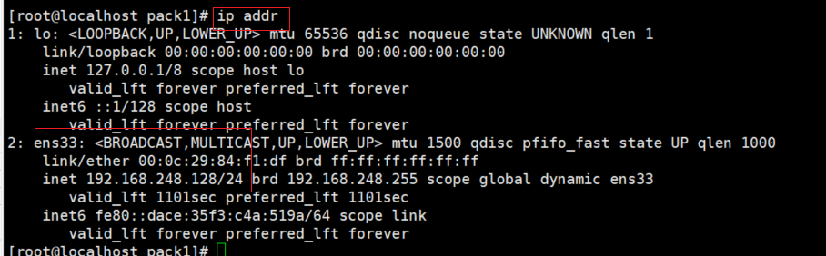

# Linux

## 1.引言

## 2.安装

## 3.常用目录介绍

~~~java
lrwxrwxrwx.   1 root root    7 10月 12 2019 bin -> usr/bin     存放二进制的可执行文件，指令，命令等
dr-xr-xr-x.   5 root root 4096 10月 12 2019 boot               引导分区，系统开启都需要有一个引导分区
drwxr-xr-x.  20 root root 3240 1月   3 16:53 dev               存放设备管理的信息
drwxr-xr-x.  86 root root 8192 1月   3 16:53 etc               存放核心配置文件的信息
drwxr-xr-x.   2 root root    6 11月  5 2016 home               普通用户的家目录
lrwxrwxrwx.   1 root root    7 10月 12 2019 lib -> usr/lib     类库相关的信息，系统依赖库相关的信息
lrwxrwxrwx.   1 root root    9 10月 12 2019 lib64 -> usr/lib64 与64位系统相关的类库信息
drwxr-xr-x.   2 root root    6 11月  5 2016 media              与多媒体相关的目录，光驱
drwxr-xr-x.   2 root root    6 11月  5 2016 mnt                官方挂载的地址，挂载外部资源
drwxr-xr-x.   3 root root   16 10月 12 2019 opt                装软件的地方
dr-xr-xr-x. 116 root root    0 1月   3 16:53 proc              进程信息
dr-xr-x---.   5 root root  227 11月 21 2019 root               超级管理员的家目录 cd 可以回到当前用户的家目录
drwxr-xr-x.  32 root root  900 1月   3 16:53 run 
lrwxrwxrwx.   1 root root    8 10月 12 2019 sbin -> usr/sbin  
drwxr-xr-x.   2 root root    6 11月  5 2016 srv
dr-xr-xr-x.  13 root root    0 1月   3 16:53 sys               系统信息
drwxrwxrwt.  10 root root 4096 1月   3 17:16 tmp               临时文件目录，系统重启以后可能被删除掉
drwxr-xr-x.  13 root root  155 10月 12 2019 usr                类似于window系统的用户目录，很多软件装在这个目录下
drwxr-xr-x.  21 root root 4096 10月 12 2019 var                var放置变量，放进去的文件永久保存
~~~

## 4.Linux 相关命令

- linux命令与参数之间必须用空格隔开
- linux命令是区分大小写的！

~~~java
#回退到上一次目录
cd -
#进到根目录
cd /
#进到当前用户的HOME路径
cd 或者 cd ~ 或者cd $HOME
#回退到上一级目录
cd ../

#获取前一天的日期
date -d "20200801 -1 day " +%Y%m%d

Linux查找同时包含多个指定字符串的文件，不区分大小写
find 目录 -type f -iname 文件名匹配|xargs grep -irl 字符串1|xargs grep -irl 字符串2
例：find ./ -type f -iname "*.*"|xargs grep -irl "scorecard_info"|xargs grep -irl "status"

Linux查看指定文件包含指定字符串的所在行即内容，红色标识指定字符串(i为忽略大小写，n为展示行号)
cat 文件名|grep --color 字符串 -in  
cat ./test.txt|grep --color "scorecard_info" -in

查看指定行的内容
sed -n 行号p(某个范围中间用逗号隔开) 文件名
sed -n "60,70p" ./WEBINF/classes/com/amarsoft/accountin/second/AppInterViewSignInfo.java

Linux 批量修改文件名
for i in `ls *.task` ; do mv $i `echo $i|sed 's/\P_/P_cms0_/g'` ; done

windows 批量修改文件名
修改单个文件名：ren task_1.cfg task_2.cfg
修改多个就把多个命令分行写到.bat文件中，执行.bat文件即可批量修改

awk -F"=" '{print $2}'  filename  ## 逐行处理，以=拆分，输出第二个字符串
echo "20200617" | cut -c 7-8      ## 截取字符串20200617第7到第8位
sed -n '2p' filename.txt          ## 打印filename.txt第2行的内容
sed -n '2p' filename.txt | awk -F"=" '{print $2}' ## 获取filename.txt第2行的内容，以=拆分得到的第2个字符串
expr length '/home/ap/edw/tmp/ods/20300310'    ## 计算字符串/home/ap/edw/tmp/ods/20300310的长度   e

xpr命令求表达式变量的值
expr substr '/home/ap/edw/tmp/ods/20300310' 1 28   ## 截取字符串/home/ap/edw/tmp/ods/20300310第1到第28个字符
tee -a filename.txt                  ## 输出到标准输出同时在filename.txt文件末尾追加，若文件不存在则创建
touch path/filename.log       ## 若文件不存在，则创建新的空文件，若文件存在，则修改时间戳为当前时间
sh ./desctable_T.sh  pram1 pram2 pram3  ## 执行desctable_T.sh文件，并传pram1、pram2、pram3参数，在desctable_T.sh中可根据参数顺序获取参数值，例如pram1=$1  pram2=$2
sed "s/\\$Data_Date/$Lv_BizDate/g"`  ## 将$Data_Date替换成$Lv_DataDate,替换多个用;隔开
sed "s/\\$Data_Date/$Lv_BizDate/g;s/\\$Data_CorpID/$CorporationID/g"
sed "s/\\r//g"    ## 
将\r替换成空

impdp 用户名/密码 schemas=要导入的用户（即是使用expdp导出的用户） directory=创建的文件夹名称（directory_name） dumpfile=test.dmp(要放入到directory_path路径下) logfile=imp.log（可以不写）
impdp NJ20191203/NJ20191203 dumpfile=als7_20191204.dmp logfile=als7_20191203.log
directory=DMPDIRTMP schema=NJ20191203 exclude=table:"in('INTERACTION_LOG')"
~~~

### 4.1 查看IP与网络

~~~markdown
# 1.查看ip
1.ifconfig 
2.ip addr
# 2.查看网络
1. ping ip地址
~~~

查看网络

### 4.2 创建空文件

~~~markdown
# 创建空文件用命令touch
eg: touch First.java
~~~

### 4.3 输出命令

~~~markdown
# echo
# 1. echo 文本
直接输出文本到控制台
# 2. echo 文本 --> 文件名
输出文本到指定的文件
~~~

### 4.4 删除文件的命令

~~~markdown
# 删除文件用rm 命令
参数：
   —r:删除当前目录和子目录所有文件 
   -f:强制删除(没有这个参数，在执行命令的时候询问一下，加了这个参数则不询问，直接删除)
~~~

### 4.5 查看文件内容

~~~markdown
# 1.cat 文件名
将整个文件内容全部展示！也就是一次性显示
# 2.tac 文件名
倒着展示整个文件的全部内容，一次性按行逆序展示
`在查看文件内容很多的时候，我们则需要进行分页`
# 3.more 文件名
默认展示第一页
`回车`：下一行
`空格`：下一页
‘b’: 回退
‘q’: 退出
# 4.head 文件名：默认展示10行(从前展示)
    head -3 文件名：展示前面3行数据
# 5.tail 文件名：默认展示10行(从后展示)
    tail -3 文件名：展示后面3行数据
~~~

~~~java
如何查看第10行文件：通过管道实现！
head -10 profile | tail -1    
~~~

**注意**

>tail -f / F  文件名 可以实时读取文件的新增内容
>
>常用来查看日志，也就是可以打开文件，同时文件实时刷新的内容也可以看到！ 
>
>参数 f&&F：
>
>​       我们在用tail 命令监控日志的时候，他们有如下区别：
>
>​      f:实时监控文件内容变化，在监控的文件删除后若再次再次创建该同名文件，并且实时写入日志，此时无法刷新监控和继续监控
>
>​     F：实时监控文件内容变化，在监控的文件删除后若再次再次创建该同名文件，并且实时写入日志，此时仍然可以刷新并且继续监控

~~~markdown
# 1. 如果f
   他会监听指定inode的文件数据变化，如果当文件删除以后，即使重新创建，inode也会发生变化，于是监听失效
# 2. 如果F
   他会监听指定名字的文件，如果文件删除以后，重新创建，他会重新监听新文件的数据变化，监听不受影响！
~~~

### 4.6 查找指定名称的文件

~~~markdown
# 1.查找含有指定字段的文件名的文件，查找指定的文件
find 要查找的范围 -name 名字
find ./ -name ab :查找root目录下名字叫ab的文件
~~~

### 4.7 管道与重定向

>管道会将前一个查询的信息当成参数`传递`给后一个命令

~~~java
[root@localhost ~]# head -3 profile 
# /etc/profile

# System wide environment and startup programs, for login setup
[root@localhost ~]# head -3 profile  | tail -1
# System wide environment and startup programs, for login setup
[root@localhost ~]# 

~~~

`当我们需要将前面命令的结果作为参数传递给后面的命令，我们就需要用到管道`

 #### 4.7.2 重定向

>重定向可以将将原来输出到控制台的命令的结果信息输出到我们重定向的文件中
>
>注意：
>
>重定向是重定向命令的结果
>
>而echo是输出我们写好的字符串

>`注意：一个箭头是覆盖，两个箭头是追加`

**重定向有级别区分**

~~~java]
默认级别是重定向正确信息，2>>是重定向错误信息
如果我们希望重定向正确和错误信息，可以加后缀：2>&1
ll /abcd  >> log 2>&1
ll / >> log 2>&1
~~~

### 4.8 VI编辑器

- 前言

~~~java
使用VI命令可以打开文件，这是如果我们修改文件，但是没有保存而直接退出，下次再使用vi命令打开文件，就会产生下面的问题
~~~

>此时我们可以选择 rm  -rf  .First.java.swp 文件

#### 1.vi/vim命令

>打开文件：vi/vim 文件名
>
>打开文件并且定位到指定行： vi/vim  +行数  文件名
>
>打开文件并定位到最后一行： vi + 文件名
>
>打开文件并且定位到要匹配的文本： vi  +/文本 文件名
>
>​        此时按n 定位到下一个满足的文本所在的行！

 ~~~
vi +3 xiaoming.java
 ~~~

~~~
vi + 文件名
~~~

~~~
vim +/java xiaoming.java
~~~

#### 2.vi编辑器的三种模式

>vi编辑器有三种模式：
>
>​      命令模式：命令模式中每个按键都是快捷键
>
>​      编辑(输入)模式：编辑模式每个按键就是要输入的内容
>
>​      底行模式
>
>​              底行模式可以输入命令：set nu

#### 3.一些快捷键

~~~~markdown
# 1.vi进入命令模式除了可以按箭头进行上下左右移动，还可以有其他快捷键：
    hjkl
    h:左边
    j:下边
    k:上边
    l:右边
# 2.W：会智能跳动一个单词的距离
    输入w 在单词单词之间来回跳动
    eg:3w 每次跳动的三个单词
# 3.其他命令
    dd:删除当前行
    ndd:从当前行开始，数到第n行，删除n行
    dw:删除当前单词！
    3dw:删除3个单词
    u:撤销
    .u:回退u执行的操做！
    yy:复制
    2yy:复制当前行的前两行
    yw:复制一个单词
    p:黏贴
    3p:将复制的内容黏贴三次！
    x:删除一个字符！
    3x:删除三个字母
    r:替换
    r1:将选中的字母变成1
    3ra:从当前字母开始，数三个字母，都变成a!
    nG:跳到第n行，n是数字
    gg:跳到第一行
    GG:跳到到最后一行
    20G:跳到第20行！
    15G：跳到第15行！
    ZZ:保存并退出(也是据在命令模式修改文本以后的退出操做！)
    ctrl+s:锁屏
    ctrl+q:解锁
~~~~

#### 4.vi的底行模式

~~~java
// 底行模式最重要的是给我们输入一些命令：
    set nu：设置行号！
    set nonu:取消行号
    q：退出
    w:保存
    q!:强制退出！此时不会保存修改的内容！
    wq:保存并且退出！
     s:替换文本内容
       s/源文本内容/要替换成的文本：替换当前行第一个符合的文本！
       s/源文本内容/要替换成的文本/g:替换当前行所有复核的文本！
~~~

~~~markdown
# 1.在底行模式查找文本:/文本内容即可！
      此时 n:继续往下寻找
          N：往上回退
~~~

### 4.9 计算机的文件拷贝

##### 4.9.1 Window与Linux之间传递数据

- Windows与linux如何传递数据？--- xftp

  ~~~java
  除了上述比较成熟的方式的，我们还可以通过lrzsz工具命令来传输文件
      需要手动安装，安装命令：
          yum install lrzsz -y
  ~~~
  
  >rz:将文件从window系统上传到linux系统
>
  >数字：将文件从linux系统传输到window系统
>
  >sz:将文件从Linux系统上传到window系统
  >
  >一般用法：sz 文件名

`这个如见命令虽然简单，但是已经可以摆脱软件的限制`

##### 4.9.2 Linux与Linux系统之间怎么传递数据

>linux与linux之间传递数据通过scp命令

~~~java
scp 源数据地址(source) 目标数据地址(target)
~~~

~~~markdown
# 1.scp timg.jpg 192.168.58.200:/opt/
    将当前目录下timg.jpg拷贝到192.168.58.200这个主机的opt目录下！
~~~

**注意**

`上述做法都是将本主机的文件共发送给目标主机，在本机操做，文件也在本主机，我们也可以在本主机操做，将其他主机文件拉过来!`

### 4.10 查看文件大小

>df -h 查看分区大小！

- swap分区，一个特殊的分区，以银盘代替内存，当内存使用满以后，可以将一部分数据写到swap分区

  

>du -h  文件名/文件夹名 ：查看文件或者文件夹大小，当为文件夹时，会显示所有文件大小
>
>du -sh  文件名 ：查看文件或者文件夹大小，当为文件夹时，不会显示子文件或者文件夹大小

### 4.11 压缩与解压

>linux压缩与解压通过tar命令进行，主要针对***.tart.gz格式的文件

- 解压缩：

  `tar -zx(解压)v(过程)f(后面+要解压的文件名) xxxx.tar.gz`

  x:解压参数，解压必须

  v:显示过程，有这个参数会显示中间过程

  f:后面跟指定的文件的文件

  `tar -zx(解压)v(过程)f(后面+要解压的文件名) xxxx.tar.gz -C 解压到的目标目录地址`

  x:解压参数，解压必须

  v:显示过程，有这个参数会显示中间过程

  f:后面跟指定的文件的文件

  C:后面指定解压的目录名称

- 打包压缩

  `tar -c(打包)v(过程)f(后面+压缩后的文件名) xxxx.tar.gz 目标文件文件名1 目标文件文件名2` 

  上述命令仅仅打包

  `tar -zc(打包)v(过程)f(后面+压缩后的文件名) xxxx.tar.gz 目标文件文件名1 目标文件文件名2` 

  上述命令既打包又压缩

  ~~~java
  针对zip格式linu系统需要安装软件：
  安装命令如下：
       yum install zip unzip -y
  压缩：
      zip -r 压缩后的文件名 要压缩的文件名
  解压：
      unzip xxx.zip  
  ~~~

### 4.12  帮助命令

>当我们想查看某个命令是如何使用时，需要用到help/man 名令
>
>help :只能帮助我们查看内置(builtin)的命令,对于 ping 等不是内置的命令无法查看,内置命令的帮助文档
>
>man:可以查看所有的命令，外部命令的帮助文档

~~~java
网上查看linux命令地址:
https://man.linuxde.net/
~~~

### 4.13 查找命令

**find命令**

>find 目录名 -name "要找的文件名"

它可以用来查找文件，但是它匹配的内容很多的时候，具体是哪个文件看不到！

**管道符|**

>命令1 | 命令2
>
>命令1执行完所有的内容，通过管道符，传递给命令2使用

**grep过滤**

>grep 关键字

格式1：命令1 | grep 关键字

格式2：grep 关键字 文件名：将文件内的含有指定关键字的行过滤出来！

~~~java
grep 2 file01 :取出file01文件内包含2的行
grep -v 2 file01 :取出file01文件内不包含2的行
grep  -vn 2 file01 :取出file01文件内不包含2的行,并且显示行号
~~~

### 4.14 文件系统

~~~markdown
# 1.linux系统里面所有文件的根节点是/
# 2.一个节点上可以有多个子节点
~~~

根目录对应的二级目录如下：

~~~java
[root@fangd ~]# cd /
[root@fangd /]# ll
总用量 24
lrwxrwxrwx.   1 root root    7 10月 12 2019 bin -> usr/bin
dr-xr-xr-x.   5 root root 4096 10月 12 2019 boot
drwxr-xr-x.  20 root root 3240 1月   3 16:53 dev
drwxr-xr-x.  86 root root 8192 1月   3 16:53 etc
drwxr-xr-x.   2 root root    6 11月  5 2016 home
lrwxrwxrwx.   1 root root    7 10月 12 2019 lib -> usr/lib
lrwxrwxrwx.   1 root root    9 10月 12 2019 lib64 -> usr/lib64
drwxr-xr-x.   2 root root    6 11月  5 2016 media
drwxr-xr-x.   2 root root    6 11月  5 2016 mnt
drwxr-xr-x.   3 root root   16 10月 12 2019 opt
dr-xr-xr-x. 120 root root    0 1月   3 16:53 proc
dr-xr-x---.   5 root root  227 11月 21 2019 root
drwxr-xr-x.  32 root root  900 1月   3 16:53 run
lrwxrwxrwx.   1 root root    8 10月 12 2019 sbin -> usr/sbin
drwxr-xr-x.   2 root root  129 10月 14 2019 soft
drwxr-xr-x.   2 root root    6 11月  5 2016 srv
dr-xr-xr-x.  13 root root    0 1月   3 16:53 sys
drwxrwxrwt.  20 root root 4096 1月   3 16:53 tmp
drwxr-xr-x.  13 root root  155 10月 12 2019 usr
drwxr-xr-x.  21 root root 4096 10月 12 2019 var
[root@fangd /]# 
~~~

**查找文件的方式：**

相对路径

以当前路径为基准点，查找其他资源

vi ./usr/pin

**一个点代表当前目录**

绝对路径

以根目录为基准点，查找其他资源

vi /etc/sysconfig/network-scripts/ifcfg-ens33 

**常见目录介绍**

~~~java
lrwxrwxrwx.   1 root root    7 10月 12 2019 bin -> usr/bin     存放二进制的可执行文件，指令，命令等
dr-xr-xr-x.   5 root root 4096 10月 12 2019 boot               引导分区，系统开启都需要有一个引导分区
drwxr-xr-x.  20 root root 3240 1月   3 16:53 dev               存放设备管理的信息
drwxr-xr-x.  86 root root 8192 1月   3 16:53 etc               存放核心配置文件的信息
drwxr-xr-x.   2 root root    6 11月  5 2016 home               普通用户的家目录
lrwxrwxrwx.   1 root root    7 10月 12 2019 lib -> usr/lib     类库相关的信息，系统依赖库相关的信息
lrwxrwxrwx.   1 root root    9 10月 12 2019 lib64 -> usr/lib64 与64位系统相关的类库信息
drwxr-xr-x.   2 root root    6 11月  5 2016 media              与多媒体相关的目录，光驱
drwxr-xr-x.   2 root root    6 11月  5 2016 mnt                官方挂载的地址，挂载外部资源
drwxr-xr-x.   3 root root   16 10月 12 2019 opt                装软件的地方
dr-xr-xr-x. 116 root root    0 1月   3 16:53 proc              进程信息
dr-xr-x---.   5 root root  227 11月 21 2019 root               超级管理员的家目录 cd 可以回到当前用户的家目录
drwxr-xr-x.  32 root root  900 1月   3 16:53 run 
lrwxrwxrwx.   1 root root    8 10月 12 2019 sbin -> usr/sbin  
drwxr-xr-x.   2 root root    6 11月  5 2016 srv
dr-xr-xr-x.  13 root root    0 1月   3 16:53 sys               系统信息
drwxrwxrwt.  10 root root 4096 1月   3 17:16 tmp               临时文件目录，系统重启以后可能被删除掉
drwxr-xr-x.  13 root root  155 10月 12 2019 usr                类似于window系统的用户目录，很多软件装在这个目录下
drwxr-xr-x.  21 root root 4096 10月 12 2019 var                var放置变量，放进去的文件永久保存

~~~

tips:cd /dev/null **黑洞文件夹：放进去的文件都可以自动被处理掉**

###  4.15 进程信息

类似于window的任务管理器

>查看进程：ps  - ef

>ps  -aux 查看进程的详细信息，性能信息
>
>top  查看内存使用情况
>
>kill  -9 进程编号 :可以关闭该进程！

**后台进程**

~~~java
 ping www.baidu.com >>  baidu
 此时上述命令是一个前台进程
 如何将其变为后台进程：只需要加一个 & 即可
 ping www.baidu.com >> baidu &
~~~

>jobs -l :可以查看后台进程
>
>只能查看当前用户登陆期间开启的后台进程，同一个用户再次登录使用 jobs-l 也查看不了，只能当前用户界面可以获取到！
>
>nohup 可以防止后台进程被挂起
>
>nohup ping www.baidu.com >> baidu 2>&1 &

### 4.16 文件权限

**linux系统文件针对普通用户有权限概念**

| 概念     | 解释                         |
| -------- | ---------------------------- |
| 属主     | 目录或者文件的拥有者(创建者) |
| 属组     | 拥有者所在的组               |
| 其他用户 | 除了属主和属组之外的其他用户 |

**权限操作**

>通过chmod命令

**权限范围**

| 权限范围 | 说明                        |
| -------- | --------------------------- |
| u        | User 属主，文件和目录拥有者 |
| g        | Group属组，拥有者所在的组   |
| o        | Other 其他用户              |
| a        | All所有用户                 |

**权限操作**

| 权限符号 | 说明     |
| -------- | -------- |
| +        | 添加权限 |
| =        | 修改权限 |
| -        | 删除权限 |

~~~java
chmod a+wrx baidu.java :给所有人读写执行的权限
chmod u=rwx,g=rw,o=r baidu.java ：修改权限
~~~

| 权限字母 | 权限数字 | 说明            |
| -------- | -------- | --------------- |
| r        | 4        | Read 读取权限   |
| w        | 2        | Write 写权限    |
| x        | 1        | Execute执行权限 |
| -        | 0        | 没有权限        |

~~~java
chmod 777 baidu.java ：给所有人所有权限
chmod 000 baidu.java ：给所有人没有权限  
~~~

### 4.17 crontab定时任务

>以后用定时任务备份文件，如数据库文件！
>
>crontab 参数：参数如下：

| -l   | 显示当前用户的所有定时任务！                    |
| ---- | ----------------------------------------------- |
| -e   | 使用vim编辑当前用户的定时任务，一行一个定时任务 |
| -r   | 删除当前用户的定时任务                          |

**编辑定时任务的格式说明**

**分 时 日 月 周 命令**

| minute  | 表示分钟，0-59之间的整数                      |
| ------- | --------------------------------------------- |
| hour    | 表示小时，1-23之间的整数                      |
| day     | 表示日期，1-31之间的整数                      |
| month   | 表示月，1-12之间的整数                        |
| week    | 表示星期几。0或者7表示星期日，1-6表示周1到周6 |
| command | 要执行的命令                                  |

**特殊符号说明**

| 特殊符号 | 说明                                                         |
| -------- | ------------------------------------------------------------ |
| * 星号   | 代表所有可能的值                                             |
| ，逗号   | 用逗号隔开代表指定某几个时间点。如“1，2，5" 表示1点，2点，5点 |
| -  短横  | 表示一个整数范围，如用在日上”2-6“表示2号到6号                |
| / 正斜杠 | 指定时间间隔的频率，如用在小时上"0-10/2"表示0点到10点每隔2小时执行一次，与星号一起使用如：* /10，如果用在分钟字段表示每10分钟执行一次。 |

~~~java
* * * * * command
    每分钟执行一次
30 21 * * * command
    每天21点30分执行一次
3,15 * * * * command
    每小时的第3分钟，第15分钟执行一次
5，10 8-10 * * * command
    每天上午的8点到10点的第5和10分钟执行一次
*/2 * * * * command
    每隔2分钟执行一次
~~~

#### 打印系统时间

>date 命令：打印系统时间

~~~java
[root@fangd usr]# date
2021年 01月 03日 星期日 20:54:52 CST
~~~

~~~java
* * * * * date >> /etc/mydate.log
编写定时任务，每分钟打印系统时间到致电给的mydate.log文件中去！
~~~

#### 定时任务的服务管理

我们创建定时任务是前提是需要定时服务先开启的！

#### 设置后台服务的自启动配置

###  4.18 proc文件

~~~java
[root@localhost /]# ll
总用量 28
lrwxrwxrwx.   1 root root    7 4月  15 2020 bin -> usr/bin
dr-xr-xr-x.   5 root root 4096 4月  15 2020 boot
drwxr-xr-x.  20 root root 3220 1月   5 16:12 dev
drwxr-xr-x.  86 root root 8192 1月   5 16:13 etc
drwxr-xr-x.   2 root root    6 11月  5 2016 home
lrwxrwxrwx.   1 root root    7 4月  15 2020 lib -> usr/lib
lrwxrwxrwx.   1 root root    9 4月  15 2020 lib64 -> usr/lib64
drwxr-xr-x.   2 root root    6 11月  5 2016 media
drwxr-xr-x.   2 root root    6 11月  5 2016 mnt
drwxr-xr-x.   3 root root  230 5月  14 2020 opt
dr-xr-xr-x. 109 root root    0 1月   5 16:12 proc
dr-xr-x---.   5 root root 4096 1月   5 16:34 root
drwxr-xr-x.  32 root root  920 1月   5 16:27 run
lrwxrwxrwx.   1 root root    8 4月  15 2020 sbin -> usr/sbin
drwxr-xr-x.   2 root root    6 11月  5 2016 srv
dr-xr-xr-x.  13 root root    0 1月   5 16:12 sys
drwxrwxrwt.  19 root root 4096 1月   5 16:18 tmp
drwxr-xr-x.  13 root root  155 4月  15 2020 usr
drwxr-xr-x.  21 root root 4096 4月  15 2020 var
[root@localhost /]# 

~~~

> proc文件夹事用来存放当前进程信息的！

### 4.19 文本处理的普通三剑客

补充：**删除空文件夹**

>rmdir  删除`空`文件夹

补充：**拷贝文件**

~~~java
cp 源文件或者源文件夹 你要存放的地址
这个命令可以拷贝文件或者文件夹，但是在拷贝文件夹的时候需要加一个参数 
    -r
cp -r 源文件夹 你要存放的地址
cp /opt/baidu ./ :将opt目录下的baidu文件拷贝到当前目录
~~~

补充：**移动文件或者重命名文件**

>`通过mv命令可以移动文件或者文件夹`
>
>`通过mv命令还可以重命名文件`
>
>mv hello /opt/  :将helo文件移动到opt目录下

**cut**

>`cut -d  '指定切分方式' -f1,2,3 文件名`
>
>cut命令可以用来切分文件并且指定显示切分的内容！
>
>如：
>
>cut -d ':' -f1,2 password :按照冒号来切分password文件，并且展示切割后的没行的第一列和第二列！
>
>注意：`-d后面指定切分的方式！`
>
>​           `  -f后面跟切分后的每行的列数1`

**sort**

>sort命令：用来排序！对文本中的数据进行排序
>
>`sort 文件名`：默认按照每行首字母字典顺序排序！对文本中的行进行排序
>
>`sort -t '' -k2 文件名` ：对每一行的数据进行切分，按照第二列排序！
>
>`sort  -t '' -k2 -r  文件名`：对每一行的数据进行切分，按照第二列逆序！
>
>`sort -t '' -k2 -n  文件名`：按照数值大小进行排序，如果有字母，字母在前

~~~java
sort -t ';' -k3 password :将password文档按照分号切割，取每行的第三列进行排序
~~~

**wc**

~~~java
wc :word count  统计单词的数量
wc 文件名
可以对整个文档进行统计！
~~~

### 4.20  Linux关机重启命令

>重启：shutdown -r now
>
>关机：poweroff 立即关机
>
>​            shutdown -h now 立即关机
>
>​            shutdown -h 10:10分钟后关机  用shutdown -c 可以取消关机

### 4.21 Linux系统文本的超级三剑客

#### grep

**grep**主要是用来搜索文本的！

>主要是对文本进行搜索，

~~~java
[root@localhost ~]# cp /etc/passwd ./  =- 拷贝etc目录下的passwd文件到当前目录下！
[root@localhost ~]# ll
总用量 24
-rw-------. 1 root root 1287 4月  15 2020 anaconda-ks.cfg
-rw-r--r--. 1 root root  225 12月 31 10:18 First.java
-rw-r--r--. 1 root root  225 1月   5 17:11 haha
-rw-r--r--. 1 root root    0 12月 25 17:35 java
drwxr-xr-x. 2 root root    6 5月  14 2020 mysql
-rw-r--r--. 1 root root 1305 1月   6 14:23 passwd
-rw-r--r--. 1 root root 1795 12月 16 18:48 profile
-rw-r--r--. 1 root root  261 1月   5 17:56 xiaoming.java
[root@localhost ~]# 
~~~

>普通搜索：
>
>`1.grep  '要搜索的字符' 文件名 文件名2 .。 ：从文件1，文件2内容中搜索匹配‘要搜索的字符’的内容`

~~~java
[root@localhost ~]# grep 'ba' profile passwd 
profile:# Functions and aliases go in /etc/bashrc
passwd:root:x:0:0:root:/root:/bin/bash
~~~

>搜索且显示行号：加参数-n
>
>`2.grep -n '要搜索的字符' 文件名 文件名2 .。 ：从文件1，文件2内容中搜索匹配‘要搜索的字符’的内容`
>
>此时还可以显搜索出的内容在文件中的行数。

~~~Java[root@localhost ~]# grep -n 'ba' profile passwd 
[root@localhost ~]# grep -n 'ba' profile passwd 
profile:4:# Functions and aliases go in /etc/bashrc
passwd:1:root:x:0:0:root:/root:/bin/bash
~~~

>搜索且忽略大小写：加参数-i
>
>`3.grep -ni '要搜索的字符' 文件名 文件名2 .。 ：从文件1，文件2内容中搜索匹配‘要搜索的字符’的内容`

~~~java
[root@localhost ~]# grep -ni 'AB' profile passwd 
passwd:19:abrt:x:173:173::/etc/abrt:/sbin/nologin
~~~

>搜索显示不匹配的内容 :加参数 -v
>
>`4.grep -nvi '要搜索的字符' 文件名 文件名2 .。 ：从文件1，文件2内容中搜索匹配‘要搜索的字符’的内容`

>还可以加正则表示式
>
>​        grep -E ’正则表达式‘ 文件名

#### sed

**sed**增删改查文件

>sed :Stream Editor 字符流编辑器的缩写
>
>它是将文件转化为字符流，在放入sed工厂中，我们可以通过sed命令操得到相应的结果！！！
>
>`类似于字符流，每次都只是操做文件的已备份，默认是截取一行,每次处理完了再处理下一行，`

>查看sed版本
>
>​        sed --version

~~~java
[root@localhost ~]# sed --version
sed (GNU sed) 4.2.2
Copyright (C) 2012 Free Software Foundation, Inc.
License GPLv3+: GNU GPL version 3 or later <http://gnu.org/licenses/gpl.html>.
This is free software: you are free to change and redistribute it.
There is NO WARRANTY, to the extent permitted by law.

Written by Jay Fenlason, Tom Lord, Ken Pizzini,
and Paolo Bonzini.
GNU sed home page: <http://www.gnu.org/software/sed/>.
General help using GNU software: <http://www.gnu.org/gethelp/>.
E-mail bug reports to: <bug-sed@gnu.org>.
Be sure to include the word ``sed'' somewhere in the ``Subject:'' field.

~~~

>语法格式：
>
>​        ` sed  [选项]  [sed命令]  [输入文件]`
>
>可以对一个文本做增删改查操做！

##### sed增加内容 -a

>sed '2a heelo xiaoming' passwd :往passwd文件的第二后面行追加文本：heelo xiaoming
>
>这里面`a:append` 追加的意思！
>
>sed '2i heelo xiaoming' passwd :往passwd文件的第二行插入文本：heelo xiaoming
>
>这里面`i:insert` 追加的意思！
>
>注意：
>
>​         上述命令只是直接作用到控制台给我们展示，并没有真正作用到文件，要想真正作用到文件，沃恩还需要在前面追加参数 -i,具体实现如下：
>
>`sed -i '2a heelo xiaoming' passwd`
>
>`sed -i '2i heelo xiaoming' passwd`

数字参数可以有以下情况

~~~java
行的选择模式：
    10：第10行
    m,n:第m行到第n行[m,n]
    m,+n:第m行到第m+n行[m,m+n],再前面基础加上加后面的数值！
    m~n:从第m行开始，一次累加n
    m,$:从m开始到最后一行
    /school/:匹配含有school的行
    /u/，/u4/：匹配从u到u4
~~~

##### sed删除内容 -d

>如果我们要删除相应的文件内容，需要改变参数
>
>sed '2,4d' passwd  :2,3,4行删除，知识显示在控制台，并非真的删除作用到文件
>
>sed -i '2,4d' passwd  :2,3,4行删除，作用到文件原数据！

##### sed修改 -c/-s

>如果我们想修改文件，那我们需要用到参数 -c
>
>`整行替换用-c`：
>
>sed '3,20c hahah'  passwd
>
>sed '3~1c hahah'  passwd
>
>`字符替换-s`：
>
>sed '1,5s/root/xxx12/g' passwd

~~~java
两种模式：
sed -i 's/目标内容/替换内容/g' 
sed -i 's#目标内容#替换内容#g'
~~~

#### awk

>它是一门语言！

### 4.22 防火墙命令

Centos 7 firewall 命令：
查看已经开放的端口：

~~~shell
firewall-cmd --list-ports
~~~

开启端口

~~~shell
firewall-cmd --zone=public --add-port=80/tcp --permanent
~~~

命令含义：

–zone #作用域

–add-port=80/tcp #添加端口，格式为：端口/通讯协议

–permanent #永久生效，没有此参数重启后失效

重启防火墙

~~~shell
firewall-cmd --reload #重启firewall
systemctl stop firewalld.service #停止firewall
systemctl disable firewalld.service #禁止firewall开机启动
~~~

~~~shell
firewall-cmd --state                          ##查看防火墙状态，是否是running
firewall-cmd --reload                          ##重新载入配置，比如添加规则之后，需要执行此命令
firewall-cmd --get-zones                      ##列出支持的zone
firewall-cmd --get-services                    ##列出支持的服务，在列表中的服务是放行的
firewall-cmd --query-service ftp              ##查看ftp服务是否支持，返回yes或者no
firewall-cmd --add-service=ftp                ##临时开放ftp服务
firewall-cmd --add-service=ftp --permanent    ##永久开放ftp服务
firewall-cmd --remove-service=ftp --permanent  ##永久移除ftp服务
firewall-cmd --add-port=80/tcp --permanent    ##永久添加80端口
iptables -L -n                                ##查看规则，这个命令是和iptables的相同的
man firewall-cmd                              ##查看帮助

更多命令，使用 firewall-cmd --help 查看帮助文件
~~~

## 5.linux安装软件管理

### 5.1 RPM包管理

~~~java
rpm用于互联网下载包的打包和啊包装工具，他生成具有.RPM拓展名的文件。
RPM是RedHat Package Manager(软件包管理工具)的缩写，类似于windows的setup.exe。
~~~

>rpm的简单查询指令：
>
>`  rpm -qa |grep xx :查询已经安装的rpm包`
>
>rpm包的基本格式如下：
>
>mysql-community-server-5.7.16-1.el7.x86_64
>
>`名称`：mysql-community-server
>
>`版本号`：5.7.16
>
>`使用的操做系统`：1.el7.x86_64
>
>​        如果是：i686,i386则表示32位操做系统，arech表示通用！

~~~java
[root@localhost ~]# rpm -qa |grep mysql
mysql-community-common-5.7.16-1.el7.x86_64
mysql-community-libs-5.7.16-1.el7.x86_64
mysql-community-server-5.7.16-1.el7.x86_64
~~~

>rpm -q 软件包名：查询软件包是否安装
>
>rpm -qi 软件包名：查询软件包的详细信息
>
>rpm -ql 软件包名：查询软件包包含的所文件

## 6linux时间

~~~java
查看linux系统时间：
    date 命令
    
修改当前系统时间
    date -s 
~~~

~~~java
[root@localhost ~]# date 
2021年 01月 08日 星期五 11:40:13 CST
~~~

~~~java
// 日期时间组件
可以用来给服务器同步时间服务器的时间！！！
1.我们需求先安装软件：安装命令：
    yum install ntp -y
2.同步时间服务器的时间：
    ntpdate cn.ntp.org.cn
有了这个软件我们就不需要用date -s 去修改时间啦，可以直接同步时间服务器的时间！
~~~

