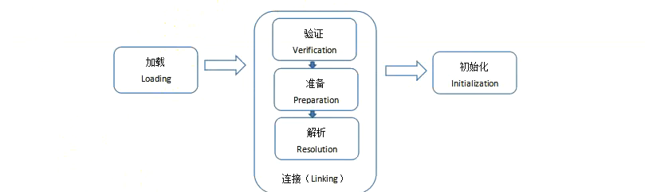

# 反射

**反射**是特别重要的一门技术，==无反射，无框架==。

反射所在的API在**java.lang.reflect**包下。

## 1.类的加载问题

类在内存中的生命周期：加载-->使用-->卸载

### 1.1 类的加载过程⭐

当程序要使用某个类的时候，如果该类还未被加载进内存的话，系统会通过加载、连接、初始化三个步骤来对该类初始化，JVM将会连续完成这三个步骤，所以把这三个步骤统称为类加载。

类的加载又分为三个阶段：

- 1.加载：load

  就是指将类型的class字节码文件读入内存中

- 2.连接：link

​        验证：校验合法性等

​        准备：准备对应的内存（方法区），创建==**Class对象**==(表示**正在运行中的某一个类或者接口**，因为==它就像一面镜子，把类给映射出来，Class对象表示一个正在运行中的某个类或者接口，可以让我们拿到正在运行中的类或者接口的各个组成结构，如构造器、方法、属性等==)，为类变量赋值

​        解析：把字节码中的符号引用替换为对应的直接地址引用

- 3.初始化：initialize（类初始化），即执行<clinit>类初始化方法，大多数情况下下，类的加载就完成了类的初始化，有些情况下，会延迟类的初始化。

### 1.2 类初始化⭐

1.哪些操作会导致类的初始化

- a.运行主方法所在的类，在先完成类的初始化，再执行main方法
- b.第一次使用某个类型就是再new它的对象，此时这个类没有初始化的话，要先完成类的初始化，在做实例初始化
- c.调用某个类的静态成员（类变量和类方法），此时这个类没有初始化的，先完成类的初始化
- d.子类初始化时，发现他的父类还未初始化，那么先初始化父类
- e.通过反射操作某个类时，如果这个类没有初始化，也会导致该类先初始化

2.那些使用类的操作，不会导致类的初始化

- 使用某个类的静态常量（static final）
- 通过子类调用父类的静态变量，静态方法，只会导致父类初始化，不会导致子类初始化，即只有声明静态成员的类才会初始化
- 用某个类型声明数组并且创建数组对象时，不会导致这个类初始化，也就是数组的类型不会被初始化

### 1.3 类加载器

我们可能会遇到java.lang.ClassNotFoundException,为了更好的解决这类问题或者在一些特殊的场景，比如需要支持类的动态加载或者需要对编译后的字节码文件进行加密解密操作，这个时候就需要自定义类加载器。

类加载器分为：

- ==**引导类加载器（Bootstrap Classloader） 又称为根类加载器**==

~~~tex
它本身负责加载\jdk\jre\lib\rt.jar核心库
它本身给不是java代码实现的，也不是ClassLoader的子类，获取他的对象时往往返回null
~~~

~~~java
public class Test {
    public static void main(String[] args){
        // 获取类加载器需要通过Class对象获取
        System.out.println(String.class.getClassLoader());// null
    }
}
~~~

- ==**拓展类加载器（Extension ClassLoader）**==

~~~tex
它负责加载jre/lib/ext拓展库
它是ClassLoader的子类
~~~

- ==**应用程序类加载器（Application ClassLoader）**==

~~~tex
它负责加载项目的classpath路径下的类,也就是加载我们自己写的类
它是ClassLoader的子类
~~~

~~~java
public class Test {
    public static void main(String[] args){
        System.out.println(Student.class.getClassLoader());//sun.misc.Launcher$AppClassLoader@18b4aac2
    }
}
~~~

- ==**自定义类加载器**==

~~~tex
当你的程序需要加载“特定”目录下的子类，可以自定义类加载器
当你的程序的字节码文件需要加密时，那么往往会提供一个自定义类加载器对其解码
tomcat中有自定义的类加载器
~~~

#### 双亲委托模式

应用程序加载器会把拓展类加载器视为父加载器

拓展类加载器会把引导类加载器视为父加载器

不是**继承关系**，是组合的方式实现。

~~~tex
下一级别的类加载，如果接到任务，会先搜索是否被加载过，如果没有，会把任务往上传，如果都没有被加载过，一直到根类加载器，如果根类加载器在他负责的路径下没有找到，会往回传，如果一路回传到最后一级都没有找到，那么会报
ClassNotFoundException或NoClassDefError,如果在某一级找到啦，就直接返回Class对象。
~~~

## 2.java.lang.Class类

**java反射机制是在运行状态下，对于任意一个类，都能够知道这个类的所有属性和方法；对于任意一个对象，都能够调用它的任意一个方法和属性；这种动态获取信息以及动态调用对象的方法的功能称为java语言的反射机制。**要想要解剖一个类，必须要先获取到该类的Class对象。而剖析一个类或用反射解决具体的问题就是使用相关的API

- java.lang.Class
- java.lang.reflect.*

所以，Class对象是反射的根源，通过它来获取一切内部结构，包括私有的内容。

### 2.1 那些类型可以获取class对象

~~~java
// 1.基本数据类型和void
int.class
void.class
// 2.类和接口
String.class
Compare.class
// 3.枚举
ElementType.class
// 4.注解
Override.class
// 5.数组
int[].class
~~~

### 2.2 获取Class对象的四种方式⭐

- ==类型名.class==

要求编译期间已知类型

- ==对象.getClass()==

获取对象的运行时类型

- ==Class.forName(类型全名称)==

可以获取编译期间未知类型

- ==ClassLoader的类加载器对象.loadClass(类型全名称)==

可以用系统类加载对象或者自定义类加载器对象加载指定路径下的类型

~~~java
package com.atguigu.test;

/**
 * 获取运行时类或接口的class对象的四种方式
 * 1.类型.class
 * 2.对象.getClass()
 * 3.class.forName(类型的全类名)
 * 4.ClassLoader的类加载器对象.loadClass(类型全名称)
 */
public class Demo1 {
    public static void main(String[] args) throws ClassNotFoundException {
        // 1.类型.class
        Class<Student> clazz1 = Student.class;
        System.out.println(clazz1);
        // 2.对象.getClass()
        Class<? extends Student> clazz2 = new Student().getClass();
        System.out.println(clazz2);
        // 3.class.forName(类型的全类名)
        Class<?> clazz3 = Class.forName("com.atguigu.test.Student");
        System.out.println(clazz3);
        // 4.ClassLoader的类加载器对象.loadClass(类型全名称)
        Class<?> clazz4 = Demo1.class.getClassLoader().loadClass("com.atguigu.test.Student");
        System.out.println(clazz4);
    }
}
~~~

## 3. Class对象的应用

==通过Class对象可以获取Class对象所对应的类型的内部结构==。

### 3.1 获取构造方法并且使用

|      | 方法                                               | 说明                                     |
| ---- | -------------------------------------------------- | ---------------------------------------- |
| 1    | getConstructor(Class<?>... parameterTypes)         | 获取某个具体的公共的构造方法，不包括私有 |
| 2    | getConstructors()                                  | 获取所有的公共的构造方法，不包括私有     |
| 3    | getDeclaredConstructor(Class<?>... parameterTypes) | 获取某个具体的公共的构造方法，包括私有   |
| 4    | getDeclaredConstructors()                          | 获取所有的公共的构造方法，包括私有       |

~~~java
 /* 
 * Constructor对象：表示某个Class对象所对应的类型中的构造器对象，上述方法的返回值都含有这个对象
 * 这个对象有方法：
 * 1.newInstance(Object ... initargs):通过构造器对象实例化对象，并为参数赋值
 * 注意：在使用newInstance方法的时候，要为Constructor对象所对应的构造器中的参数赋值
 * 2.setAccessible(true)忽略Class对象所对应的类型中成员的访问权限
 */
~~~

~~~java
package com.atguigu.test;

import jdk.nashorn.internal.ir.CallNode;

import java.lang.reflect.Constructor;
import java.lang.reflect.InvocationTargetException;

/**
 * 通过反射获取公共的构造器
 * getConstructors();获取所有的公共的构造器
 * getConstructor(Class<?>... parameterTypes);获取某个公共的构造器
 *
 * Constructor对象：表示某个Class对象所对应的类型中的构造器对象
 * 其有方法：
 * newInstance(Object ... initargs):通过构造器对象实例化对象，并为参数赋值
 * 注意：在使用newInstance方法的时候，要为Constructor对象所对应的构造器中的参数赋值
 */
public class Test {
    public static void main(String[] args) throws ClassNotFoundException, NoSuchMethodException, IllegalAccessException, InvocationTargetException, InstantiationException {
        // 获取Student所对应的Class对象
        Class<?> clazz = Class.forName("com.atguigu.test.Student");
        // 1.获取所有的公共的构造器
        Constructor<?>[] constructors = clazz.getConstructors();
        for (Constructor<?> constructor : constructors) {
            System.out.println(constructor);
        }

        // 2.1获取某一个公共的构造器，参数为该构造器的参数类型所对应的class对象，此时为获取无参构造
        Constructor<?> constructor1 = clazz.getConstructor();
        // 通过Constructor对象可以实例化类型对象
        Object o1 = constructor1.newInstance();
        System.out.println(o1);
        // 2.2获取某一个公共的构造器，参数为该构造器的参数类型所对应的class对象，此时为获取有参构造
        Constructor<?> constructor2 = clazz.getConstructor(Integer.class, String.class, String.class);
        // 通过Constructor对象可以实例化类型对象
        Object o2 = constructor2.newInstance(1, "hehe", "男");
        System.out.println(o2);
        
    }
}

~~~

~~~java
package com.atguigu.test;

import jdk.nashorn.internal.ir.CallNode;

import java.lang.reflect.Constructor;
import java.lang.reflect.InvocationTargetException;

/**
 * 通过反射获取公共的构造器
 * getDeclaredConstructors();获取某个构造器，包括私有
 * getDeclaredConstructor(Class<?>... parameterTypes);获取所有构造器
 *
 * Constructor对象：表示某个Class对象所对应的类型中的构造器对象
 * 其有方法：
 * newInstance(Object ... initargs):通过构造器对象实例化对象，并为参数赋值
 * 注意：在使用newInstance方法的时候，要为Constructor对象所对应的构造器中的参数赋值
 * setAccessible(true)忽略Class对象所对应的类型中成员的访问权限
 */
public class Test {
    public static void main(String[] args) throws ClassNotFoundException, NoSuchMethodException, IllegalAccessException, InvocationTargetException, InstantiationException {
        // 获取Student所对应的Class对象
        Class<?> clazz = Class.forName("com.atguigu.test.Student");
        // 获取所有的构造器，包括私有的构造器
        Constructor<?>[] constructors1 = clazz.getDeclaredConstructors();
        for (Constructor<?> constructor : constructors1) {
            System.out.println(constructor);
        }

        Constructor<?> declaredConstructor = clazz.getDeclaredConstructor(String.class, String.class);
        System.out.println(declaredConstructor);
        /* 但是我们在调用这个私有构造器的newInstance方法的时候，会出现一个异常
        Exception in thread "main" java.lang.IllegalAccessException: Class com.atguigu.test.Test can not access a member of class com.atguigu.test.Student with modifiers "private"
            at sun.reflect.Reflection.ensureMemberAccess(Reflection.java:102)
            at java.lang.reflect.AccessibleObject.slowCheckMemberAccess(AccessibleObject.java:296)
            at java.lang.reflect.AccessibleObject.checkAccess(AccessibleObject.java:288)
            at java.lang.reflect.Constructor.newInstance(Constructor.java:413)
            at com.atguigu.test.Test.main(Test.java:31)
        此时需要我们进行暴力反射：setAccessible(true):忽略Class对象所对应的类型中成员的访问权限
         */
        // 默认是false,我们改为true
        declaredConstructor.setAccessible(true);
        Object o = declaredConstructor.newInstance("hehe", "男");
        System.out.println(o);
    }
}

~~~

### 3.2 获取成员变量并且使用

|      | 方法                          | 说明                                                         |
| ---- | ----------------------------- | ------------------------------------------------------------ |
| 1    | getField(String name)         | 获取Class对象所对应的类型中某个公共属性（==包括继承父类的成员变量==） |
| 2    | getFields()                   | 获取Class对象所对应的类型中所有的公共成员变量（==包括继承父类的成员变量==） |
| 3    | getDeclaredField(String name) | 获取Class对象所对应的类型中某个的成员变量，==包括私有，但是不包括继承自父类的成员变量== |
| 4    | getDeclaredField()            | 获取Class对象所对应的类型中所有的成员变量，==包括私有，但是不包括继承自父类的成员变量== |

~~~java
package com.atguigu.test;

import java.lang.reflect.Field;
import java.lang.reflect.InvocationTargetException;

/**
 * 通过Class对象获取所对应的类型中的成员变量
 */
public class Test {
    public static void main(String[] args) throws ClassNotFoundException, NoSuchMethodException, IllegalAccessException, InvocationTargetException, InstantiationException, NoSuchFieldException {
        // 获取Student所对应的Class对象
        Class<?> clazz = Class.forName("com.atguigu.test.Student");
        Field[] fields = clazz.getFields();
        for (Field field : fields) {
            System.out.println(field);
        }
        Field sid = clazz.getField("sid");
        System.out.println(sid);

        Field[] declaredFields = clazz.getDeclaredFields();
        for (Field declaredField : declaredFields) {
            System.out.println(declaredField);
        }
        Field sname = clazz.getDeclaredField("sname");
        System.out.println(sname);
    }
}

~~~

==**获取到类型的对象的成员变量以后，可以通过get/set赋值或者取值。**==

==**Class对象操作某个类型中的成员变量时，一定是基于某个实例化对象操作的。**==

~~~java
package com.atguigu.test;

import java.lang.reflect.Constructor;
import java.lang.reflect.Field;
import java.lang.reflect.InvocationTargetException;

/**
 * 通过Class对象获取所对应的类型中的成员变量
 */
public class Test {
    public static void main(String[] args) throws ClassNotFoundException, NoSuchMethodException, IllegalAccessException, InvocationTargetException, InstantiationException, NoSuchFieldException {
        // 获取Student所对应的Class对象
        Class<?> clazz = Class.forName("com.atguigu.test.Student");

        Field sname = clazz.getDeclaredField("sname");
        System.out.println(sname);

        Constructor declaredConstructors = clazz.getDeclaredConstructor();
        Object obj = declaredConstructors.newInstance();
        sname.setAccessible(true);
        sname.set(obj,"狗子");
        System.out.println(obj);
        
        Object o = sname.get(obj);
        System.out.println(o);

    }
}
~~~

### 3.4 通过Class对象直接实例化对象

~~~java
package com.atguigu.test;

import java.lang.reflect.InvocationTargetException;

public class Test {
    public static void main(String[] args) throws ClassNotFoundException, NoSuchMethodException, IllegalAccessException, InvocationTargetException, InstantiationException, NoSuchFieldException {
        // 获取Student所对应的Class对象
        Class<?> clazz = Class.forName("com.atguigu.test.Student");
        /**
         *  Class对象也有方法newInstance()，
         *  可以直接用来创建对象实例，这个方法调用的是无参构造！！！！
         */
        Object o = clazz.newInstance();
        System.out.println(o);
    }
}

~~~

### 3.4 获取成员方法并且使用

|      | 方法                                                         | 说明                                                         |
| ---- | ------------------------------------------------------------ | ------------------------------------------------------------ |
| 1    | getMethods()                                                 | 获取Class对象所对应的类型中所有的公共成员方法（==包括继承父类的成员方法==） |
| 2    | getMethod(String methodname, Class<?>... parameterTypes)     | 获取Class对象所对应的类型中某一个的公共成员方法（==包括继承父类的成员方法==） |
| 3    | getDeclaredMethods()                                         | 获取Class对象所对应的类型中所有的成员方法（==不包括继承父类的成员方法==），包括私有 |
| 4    | getDeclaredMethod(String methodname, Class<?>... parameterTypes) | 获取Class对象所对应的类型中某一个成员方法（==不包括继承父类的成员方法==），包括私有 |

~~~java
package com.atguigu.test;

import java.lang.reflect.InvocationTargetException;
import java.lang.reflect.Method;

/**
 * 通过Class对象获取所对应的类型中的方法并使用
 */
public class Test {
    public static void main(String[] args) throws ClassNotFoundException, NoSuchMethodException, IllegalAccessException, InvocationTargetException, InstantiationException, NoSuchFieldException {
        // 获取Student所对应的Class对象
        Class<?> clazz = Class.forName("com.atguigu.test.Student");
        // getMethods():获取所有公共的方法，包括继承自父类的方法
        Method[] methods = clazz.getMethods();
        for (Method method : methods) {
            System.out.println(method);
        }
        // 获取当前Class多对应的类中的所有方法，包括私有的，但是不包括继承自父类的方法
        Method[] declaredMethods = clazz.getDeclaredMethods();
        for (Method declaredMethod : declaredMethods) {
            System.out.println(declaredMethod);
        }
    }
}
~~~

~~~java
package com.atguigu.test;

import java.lang.reflect.Constructor;
import java.lang.reflect.InvocationTargetException;
import java.lang.reflect.Method;

/**
 * 通过Class对象获取所对应的类型中的方法并使用
 */
public class Test {
    public static void main(String[] args) throws ClassNotFoundException, NoSuchMethodException, IllegalAccessException, InvocationTargetException, InstantiationException, NoSuchFieldException {
        // 获取Student所对应的Class对象
        Class<?> clazz = Class.forName("com.atguigu.test.Student");
        Constructor<?> constructor = clazz.getConstructor(Integer.class, String.class, String.class);
        Object o = constructor.newInstance(22, "小男", "女");
        Method getSname = clazz.getMethod("getSname");
        // 暴力反射，通过setAccessible忽略访问权限
        getSname.setAccessible(true);
        // 调用创建的实例化对象的方法对象所对应的方法
        Object invokeRes = getSname.invoke(o);
        System.out.println(invokeRes);
    }
}
~~~

