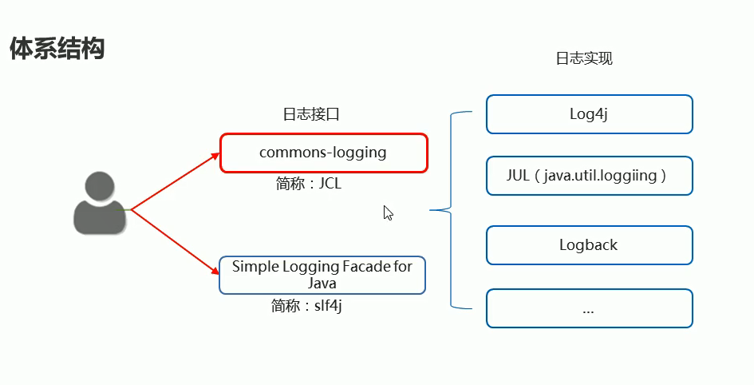
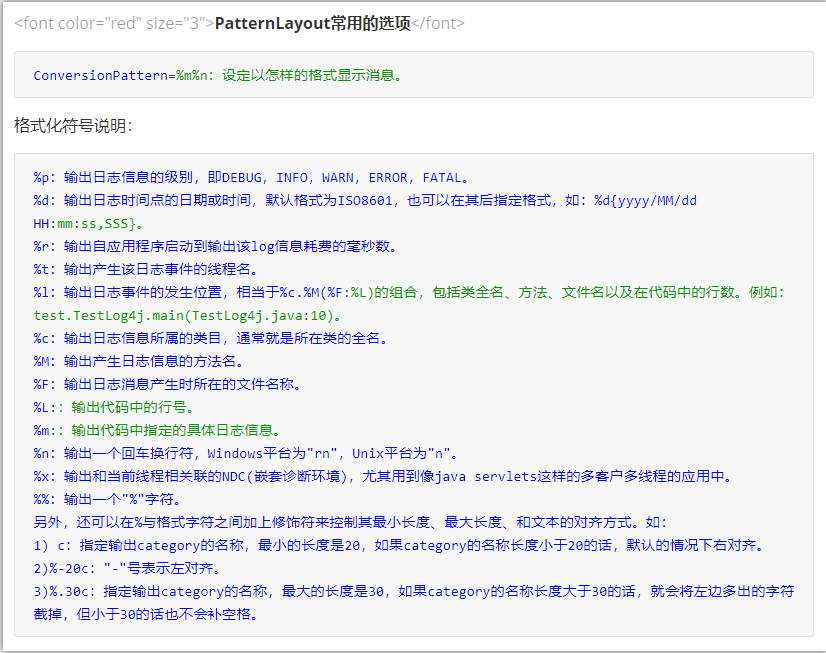

# 注解

**注解**（annotation）

也叫元数据，是一种代码级别的说明。它可以声明在包括包、类、字段、方法、局部变量、方法参数等的前面对元素进行说明，注释。

作用分类：

1. 用来编写文档，可以通过代码里面的注解生成文档(如@author,@version)
2. 代码分析：可以通过代码里面标注的注解对代码进行分析
3. 编译检查：可以通过代码里面的注解让编译器能够实现基本的编译检查（如@Override）

## 1.自定义注解

~~~java
/*
     自定义注解：
     1.空注解
     public @interface 注解名称 {
         
     }
     2.有属性集的注解
     public @interface 注解名称 {
         // 属性集
     }
                           属性集的定义格式：
              1.没有默认值的属性   数据类型 属性名()
              2.有默认值的属性     数据类型 属性名() default 默认值
     3.注解中的属性支持哪些数据类型：
     8种基本数据类型，String类型，枚举类型，注解类型，class类型
     以及以后三个类型对应的一维数组
 */
~~~

~~~java
public @interface MyAnno01 {
    // 没有默认值的属性
	String name();
	// 有默认值的属性
	int age() default 18;
    // 数组属性
	String[] hobbies();
}
~~~

~~~java
/*
        自定义注解的基本使用
       1.空注解：直接使用
                                 使用格式：@注解名称
       2.有属性集的注解
                                 使用格式:   @注解名称(属性名1=属性值1,属性名2=属性值2...)
                                其中数组属性的使用格式：
                                                                    数组属性名称={"元素1","元素2"}
                                有属性集的注解必须给属性赋值，如果给有默认值的属性赋值，将覆盖默认值
                                如果数组属性只有一个值，可以省略{}
   
 */
@MyAnno01(name ="大额",age=18,hobbies= {"看球","撸代码"})
public class AnnotationDemo01 {

}
~~~

## 2注解的注意事项

>1.空注解直接使用
>
>2.一个注解只能在同一个位置上只能使用一次，一个位置上可以使用多个不同的注解
>
>3.如果注解有属性（没有默认值），那么必须给属性赋值才可以使用
>
>​            键值对的赋值方式 属性名=属性值 多个属性，隔开
>
>​            如果属性是数组类型 并且只有一个属性值，那么{}可以省略不写；如果有多个属性值，{}不能省略
>
>4.如果属性没有默认值必须赋值，如果有默认值，可以不赋值

>注意事项
>
>1.当注解只有一个属性且名称是value，在使用注解时可以直接属性值，无论value是单值元素还是数组元素；
>
>2.如果注解属性有默认值，那么使用注解时候，这个属性可以不用赋值
>
>3.如果属性没有默认值，那么使用注解时一定要给属性赋值

## 3自定义注解的案例

~~~java

package pack1;

public @interface Book {
   String value();// 书名
   double price() default 100; // 价格，默认为100
   String[] authors();// 多位作者
}

~~~

## 4.元注解介绍

元注解是用来限制注解的注解。

作用：

 1.限制自定义注解的使用范围（规定直接是可以使用在类上，方法上，接口上，变量上）

2.限制自定义注解的生命周期（只存在于源代码中，存在于class文件中，存在于运行时期的内存中）

### @Target

**元注解之target**

>作用：知名此注解用在哪个位置，如果不写默认是任何地方都可以使用
>
>​            只有一个属性value，而且是一个ElementType数组：
>
>​                             使用的时候可以省略属性名value,如果只有一个值可以省略{}
>
>​                              ElementType是一个枚举

~~~markdown
## TYPE：用在类，接口上
## FIELD：用在成员变量上
## METHOD:用在方法上
## PARAMETER:用在参数上
## CONSTRUCTOR:用在构造方法上
## LOCAL_VARIARLE:用在局部变量上
~~~

~~~java
public @interface Target {
    ElementType[] value();
}
-------------------------------------------------------------------------------------------
public enum ElementType {
    /** Class, interface (including annotation type), or enum declaration */
    TYPE,

    /** Field declaration (includes enum constants) */
    FIELD,

    /** Method declaration */
    METHOD,

    /** Formal parameter declaration */
    PARAMETER,

    /** Constructor declaration */
    CONSTRUCTOR,

    /** Local variable declaration */
    LOCAL_VARIABLE,

    /** Annotation type declaration */
    ANNOTATION_TYPE,

    /** Package declaration */
    PACKAGE,

    /**
     * Type parameter declaration
     *
     * @since 1.8
     */
    TYPE_PARAMETER,

    /**
     * Use of a type
     *
     * @since 1.8
     */
    TYPE_USE
}
~~~

~~~java
/**
 * 
        空注解
        限制注解的适用范围：只能使用在类上：@Target(value=ElementType.TYPE)
        限制注解的适用范围：只能使用在方法上和构造方法上：@Target(value= {ElementType.METHOD,ElementType.CONSTRUCTOR})
 *
 */
@Target(value= {ElementType.METHOD,ElementType.CONSTRUCTOR})
public @interface Book {
	
}
~~~

### @Retention

限制注解的生命周期

~~~java
public @interface Retention {
    RetentionPolicy value();
}
-------------------------------------------------------------------------------------------
public enum RetentionPolicy {
    /**
     * Annotations are to be discarded by the compiler.
     */
    SOURCE,// 源代码阶段

    /**
     * Annotations are to be recorded in the class file by the compiler
     * but need not be retained by the VM at run time.  This is the default
     * behavior.
     */
    CLASS,// 字节码阶段

    /**
     * Annotations are to be recorded in the class file by the compiler and
     * retained by the VM at run time, so they may be read reflectively.
     *
     * @see java.lang.reflect.AnnotatedElementb
     */
    RUNTIME// 运行时阶段
}    
~~~

## 5.解析注解

~~~java
package pack1;

import java.lang.annotation.ElementType;
import java.lang.annotation.Retention;
import java.lang.annotation.RetentionPolicy;
import java.lang.annotation.Target;

// 规定该注解之恩是用在类上或者方法上
@Target({ElementType.METHOD,ElementType.TYPE})
// 规定注解的生命周期在运行时期有效
@Retention(RetentionPolicy.RUNTIME)
public @interface MyAnno07 {
	String name();
	int age() default 16;
	String[] hobbies();
}

~~~

>1.所有的注解都实现了Annotation接口；
>
>​            注解本质上是一个接口，该接口默认继承Annotation接口，它是所有注解类型的公共接口
>
>2.需要规定注解的生命周期在运行时期有效这样才可以利用反射获取注解内容

### 获取类上的注解

~~~java
package pack1;

import java.util.Arrays;

@MyAnno07(name="张三",hobbies= {"唱歌","跳舞","撸代码"})
public class AnnotationDemo02 {
	public static void main(String[] args) {
        // 1.获取Class类型对象
		Class<AnnotationDemo02> clazz = AnnotationDemo02.class;
		// 2.判断类上是否含有这个@MyAnno07注解
		if(clazz.isAnnotationPresent(MyAnno07.class)) {
			// 说明类上含有MyAnno07这个注解
			// 3 .获取类上指定的注解
			MyAnno07 annotation = clazz.getAnnotation(MyAnno07.class);
			// 4.获取注解的属性值:注解对象.属性名();
			int age = annotation.age();
			String name  = 	annotation.name();	
			String[] hobbies = annotation.hobbies();
			System.out.println("姓名："+name+",年龄是："+age+"，爱好是："+Arrays.toString(hobbies));
		}
	}
}
~~~

### 获取方法上的注解

~~~java
package pack1;

import java.lang.reflect.Method;
import java.util.Arrays;

public class AnnotationDemo02 {
	// 在方法上使用注解
	@MyAnno07(name="张三",hobbies= {"唱歌","跳舞","撸代码"})
	public void show() {

	}
	public static void main(String[] args) throws Exception {
		// 1获取class类型的对象
		Class<AnnotationDemo02> clazz = AnnotationDemo02.class;
		// 2 获取show()方法对应的Method对象
		Method showMethod = clazz.getMethod("show");
		// 3.判断Method对象中是否含有@MyAnno07注解
		if(showMethod.isAnnotationPresent(MyAnno07.class)) {
			// 4.如果有，获取Method对象中方法上的注解MyAnno07注解
			MyAnno07 annotation =  showMethod.getAnnotation(MyAnno07.class);
			// 5.注解MyAnno07的对象获取属性值
			int age = annotation.age();
			String name = annotation.name();
			String[] hobbies = annotation.hobbies();
			// 6.打印属性值
			System.out.println("姓名："+name+",年龄是："+age+"，爱好是："+Arrays.toString(hobbies));
		}

	}
}

~~~

### 总结

~~~java
用带两个方法：
    public <A extends Anotation> A getAnnotation(Class<A> annotationClass)
    如果该元素指定的注解类型存在于此对象上，则返回该注解，否则返回null;
    public boolean isAnnotationPresent(Class<A> annotationClass):
    判断当前对象（Class对象）是否存在制定类型的注解，有则返回true，否则false
~~~

~~~java
1.Class类，Constructor类，Method类，Field类继承AccessibleObject类：
    AccessibleObject类定义了成员方法：获取注解对象，获取所有注解对象，怕毛短是否有该注解对象
2.AccessibleObject类中定义的方法，实际上是实现了接口AnnotationElement接口
    定义了抽象方法：获取注解对象，获取所有注解对象，怕毛短是否有该注解对象
~~~

# 枚举

~~~java
package pack2;
/*
   *       枚举：JDK1.5引入
   *                类似列举，穷举，一一罗列
*      java枚举：把某个类型的对象，全部列出来
*         什么情况下会使用枚举：
*                  当某个类型的对象是固定的，有限的几个，就可以使用枚举
*                  如：性别，星期
 */
public class TestEnum {
	public static void main(String[] args) {
		Gender nan1 = Gender.nan;
		Gender nv1 = Gender.nv;
	}
}
/**
 * 
 * JDK1,5之前想要实现这种效果：
 *     1.构造器私有化
 *                          这样在类的外面就无法创建对象
 *     2.在这个类中，提前创建好几个对象，供别人使用
 *        
 */
class Gender{
	// public使得外面可以直接访问
	// static使得类名可以直接调用
	// final 强调这个对象不可变
	public static final Gender nan = new Gender("男");
	public static final Gender nv = new Gender("女");
	public static final Gender yao = new Gender("妖");
	
	private String description;
	
	private Gender(String description) {
		this.description=description;
	}
	
}
~~~

~~~java
package pack2;
/**
 * 
 *      枚举语法：
 *    1. 如何声明枚举
 *               修饰符 enum 枚举类型名{
 *                          常量对象列表         
 *    }
 *    2. 如何声明枚举
 *               修饰符 enum 枚举类型名{
 *                          常量对象列表     
 *                          其他成员列表                     
 *    }
 *    说明：
 *     1.如果常量对象列表后面还有其他成员，那么需要在常量对象列表后面加;
 *     2.枚举是一种特殊的类，他的对象只有固定的几个
 *     3.枚举类型不能继承其他类型，因为所有枚举类型有一个隐含的父类java.lang.Enum
 *     4.Enum类中有一个唯一的构造器
 *                                     这个构造器不是程序员自动调用的，是编译器自动调用的，在所有枚举类型的构造器的首行帮我们自动调用，并且自动传入name和oridinal的值
 *           name是常量对象名称
 *           oridinal是常量对象的顺序 ，其中初始常量序号为0      
 *       Enum类还申明了几个方法：
 *           String name();
 *           int oridinal();
 *           String toString();-->  Enum类重写了object类的toString方法，返回常量对象名
 *     5.编译器帮我们自动生成的方法
 *                                    枚举类型[]  values();--拿到枚举对象数组
 *                                    枚举类型 valueOf(String name);--拿到枚举对象
 */
~~~

~~~java
package pack2;
/**
 * 
 *      枚举语法：
 *    1. 如何声明枚举
 *               修饰符 enum 枚举类型名{
 *                          常量对象列表         
 *    }
 *    2. 如何声明枚举
 *               修饰符 enum 枚举类型名{
 *                          常量对象列表     
 *                          其他成员列表                     
 *    }
 *    说明：
 *     1.如果常量对象列表后面还有其他成员，那么需要在常量对象列表后面加;
 *     2.枚举是一种特殊的类，他的对象只有固定的几个
 *     3.枚举类型不能继承其他类型，因为所有枚举类型有一个隐含的父类java.lang.Enum
 *     4.Enum类中有一个唯一的构造器
 *                                     这个构造器不是程序员自动调用的，是编译器自动调用的，在所有枚举类型的构造器的首行帮我们自动调用，并且自动传入name和oridinal的值
 *           name是常量对象名称
 *           oridinal是常量对象的顺序 ，其中初始常量序号为0      
 *       Enum类还申明了几个方法：
 *           String name();
 *           int oridinal();
 *           String toString();-->  Enum类重写了object类的toString方法，返回常量对象名
 *     5.编译器帮我们自动生成的方法
 *                                    枚举类型[]  values();--拿到枚举对象数组
 *                                    枚举类型 valueOf(String name);--拿到枚举对象
 */
public class TestEnum2 {
	public static void main(String[] args) {
		Season s = Season.SPRING;
		Season[] all = Season.values();
		for(int i =0;i<all.length;i++) {
			System.out.println(all[i]);
		}
		System.out.println("----------------------------");
		Season spring = Season.valueOf("SPRING");
		System.out.println(spring);
	}
}
enum Season{
	// 常量对象后面没有值的就是无参构造
	// 常量对象后面有值的就是有参构造
	SPRING("春暖花开"),SUMMER,FALL,WINTER;
	
	private String description;

	private Season(String description) {
		this.description = description;
	}

	private Season() {
	}
	
}
~~~

~~~java
public class TestEnum2 {
	public static void main(String[] args) {
		Season s = Season.SPRING;
	}
}
enum Season{
	SPRING,SUMMER,FALL,WINTER
}
~~~

### 枚举实现接口

~~~java
package pack2;
/**
 * 
   *           枚举类型实现接口
 *
 */
public class TestEnum03 {
	public static void main(String[] args) {
		MyEnum a = MyEnum.A;
		a.test();
	}

}
interface MyInter{
	void test();
}
enum MyEnum implements MyInter{
	A,B;

	@Override
	public void test() {
		System.out.println("test");
	}
	
}
~~~

**我们还可以分开去实现**

~~~java
package pack2;
/**
 * 
   *           枚举类型实现接口
 *
 */
public class TestEnum03 {
	public static void main(String[] args) {
		MyEnum a = MyEnum.A;
		a.test();
		MyEnum b = MyEnum.B;
		b.test();
	}

}
interface MyInter{
	void test();
}
enum MyEnum implements MyInter{
	A{

	@Override
	public void test() {
		System.out.println("testA");
	}
	},B{
		@Override
		public void test() {
			System.out.println("testB");
		}
	}
	
}
~~~

# 日志Log4j

~~~markdown
输出语句的弊端：
## 1.想取消记录的信息需要修改代码
## 2.信息只能展示在控制台，不能将其记录到其他的位置（文件，数据库）
~~~

程序中的日志可以用来记录程序的点点滴滴，并且可以永久存储

|          | 输出语句                 | 日志技术                             |
| -------- | ------------------------ | ------------------------------------ |
| 取消日志 | 需要修改代码，灵活性较差 | 不需要修改代码，灵活性较好           |
| 输出位置 | 只能在控制台             | 可以将日志信息写到文件或者数据库     |
| 多线程   | 和业务代码处于一个线程   | 多县城记录方式，不影响业务代码的性能 |

>log4j是Apache的一个开源项目
>
>1.可以控制日志信息输送到目的地是控制台或者文件中
>
>2.可以控制日志的输出格式
>
>3.可以定义每一条日志的级别，更加细致的管理控制日志的生成过程
>
>关键是我们可以通过配置文件来灵活配置，不需要修改代码

## 1.入门案例

1. 导入相关jar包
2. 编写配置文件
3. 在代码中获取日志的对象
4. 按照级别设置记录日志信息

~~~java
配置文件：
    
log4j.rootLogger=info,my,fileAppender -- 配置根logger

### direct log messages to my ###
log4j.appender.my=org.apache.log4j.ConsoleAppender--输出到控制台
log4j.appender.my.ImmediateFlush = true
log4j.appender.my.Target=System.out -- 可以控制输出字体颜色
    
log4j.appender.my.layout=org.apache.log4j.PatternLayout
log4j.appender.my.layout.ConversionPattern=%d %t %5p %c{1}:%L - %m%n

# fileAppenderÑÝʾ
log4j.appender.fileAppender=org.apache.log4j.FileAppender--输出到文件
log4j.appender.fileAppender.ImmediateFlush = true
log4j.appender.fileAppender.Append=true   --追加还是覆盖，true为追加
    
log4j.appender.fileAppender.File=D:/log4j-log.log -- 日志输出的地址
log4j.appender.fileAppender.layout=org.apache.log4j.PatternLayout
log4j.appender.fileAppender.layout.ConversionPattern=%d %5p %c{1}:%L - %m%n

~~~

~~~java
package pack3;

import org.slf4j.Logger;
import org.slf4j.LoggerFactory;

// import org.apache.log4j.Logger;

public class Log4jDemo01 {
	// 使用log4j的api来获取日志的对象
	// 弊端：如果以后我们更换日志的实现类。下面的代码需要改变
	// 不推荐使用
	// private static final Logger LOGGER=Logger.getLogger(Log4jDemo01.class);// 这是log4j对象获取
	
	// 使用slf4j里面的api来获取日志的对象
	// 好处：如果以后我们更换日志的实现类。下面的代码不需要改变
	// 推荐使用
	private static final Logger LOGGER =  LoggerFactory.getLogger(Log4jDemo01.class);
	public static void main(String[] args) {
		// 1.导入配置文件
		// 2.编写配置文件：文件名必须是log4j.properties,放在src目录下
		LOGGER.debug("debug級別的日志");
		LOGGER.info("info級別的日志");
		LOGGER.warn("warn級別的日志");
		LOGGER.error("error級別的日志");
	}
}

~~~

## 2.Log4j的重要核心

~~~markdown
## 1.Loggers記錄器            日志的级别
## 2.Appenders輸出源          日志要输出的地方 
## 3.Layouts布局              日志输出的格式
~~~

~~~java
LOggers组件在系统中常用的五个级别
    DEBUG <INFO <WARN <ERROR <FATAL
规则：只输出级别不低于设定级别的日志信息
~~~

**Appenders（输出源）**

把日志输出到不同的地方，如控制台（Console）、文件（File）

**org.apache.log4j.ConsoleAppender**

**org.apache.log4j.FileAppender**

****

**Layouts（布局）**

常用的布局管理器：

**org.apache.log4j.PatternLayout**le可以灵活的指定布局模式

**org.apache.log4j.SimpleLayout** 包含日志信息的级别和信息字符串

**org.apache.log4j.TTCCLayout**包含日志产生的时间、线程、类别等信息

+ 配置根Logger

  + 格式

    log4j.rootLogger=日志级别，appenderName1，appenderName2，…

  + 日志级别

    OFF、FATAL、ERROR、WARN、INFO、DEBUG、ALL或者自定义的级别。

  + appenderName1

    就是指定日志信息要输出到哪里。可以同时指定多个输出目的地，用逗号隔开。

    例如：log4j.rootLogger＝INFO，ca，fa

+ ConsoleAppender常用的选项

  + ImmediateFlush=true

    表示所有消息都会被立即输出，设为false则不输出，默认值是true。

  + Target=System.err    ----------打印出来的字体颜色是红色

    默认值是System.out。------打印出来的字体颜色是黑色

+ FileAppender常用的选项

  + ImmediateFlush=true

    表示所有消息都会被立即输出。设为false则不输出，默认值是true

  + Append=false

    true表示将消息添加到指定文件中，原来的消息不覆盖。

    false则将消息覆盖指定的文件内容，默认值是true。

  + File=D:/logs/logging.log4j

    指定消息输出到logging.log4j文件中

+ PatternLayout常用的选项

  + ConversionPattern=%m%n

    设定以怎样的格式显示消息

    

### 

