# oracle数据库

## 1.安装

>我们采用XP系统挂载的方式，在虚拟机中安装ORACLE10g.具体实现需要XP系统虚拟机镜像和数据库安装包！

~~~plsql
-- oracle数据库的启动命令
sqlplus scott/123456
sqlplus system/orcl
~~~

## 2.配置网络

~~~java
配置网络让本地环境和虚拟机环境联通！
~~~

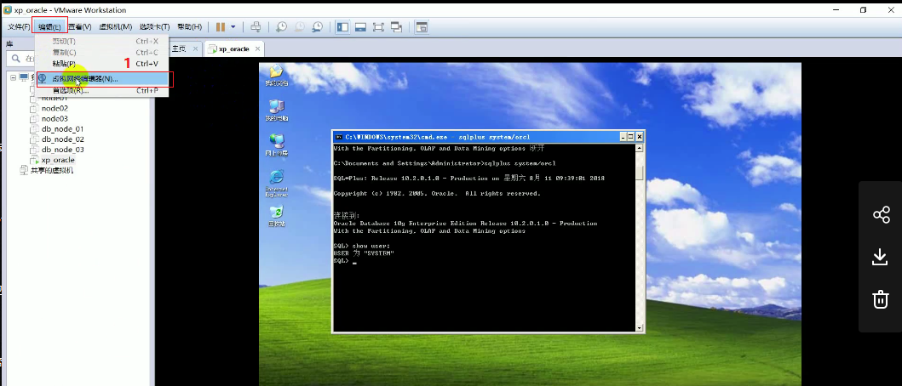

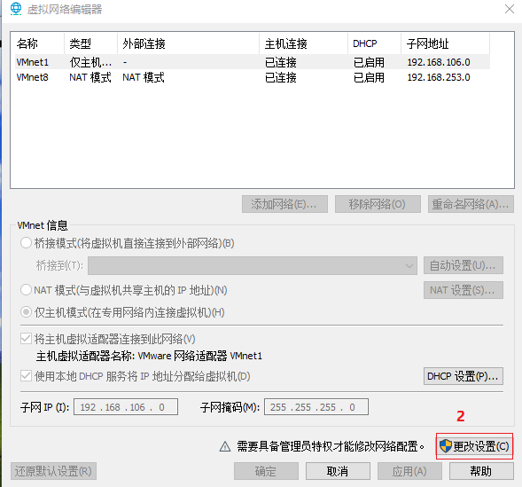

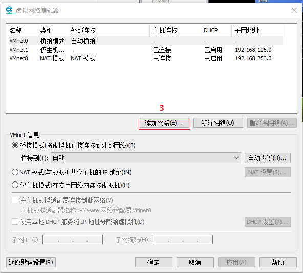

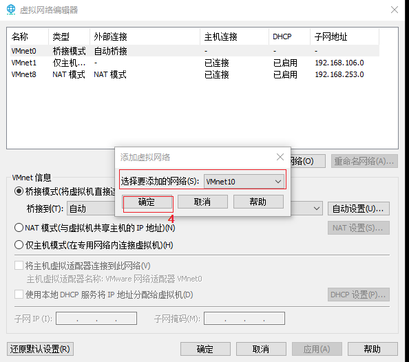

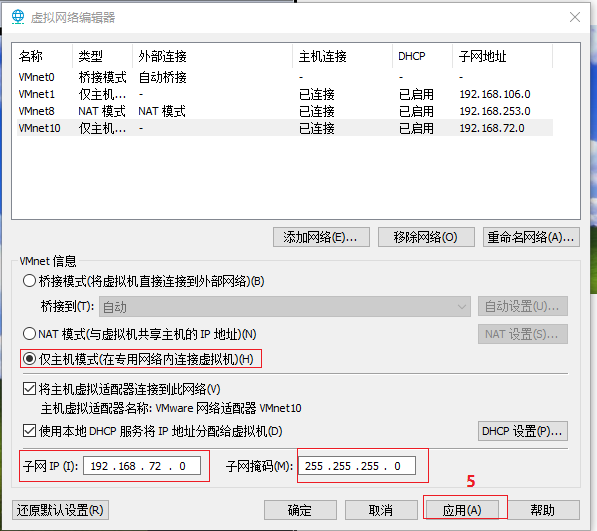

实现原理是：

**通过VNET10沟通WIN10和XP系统！**

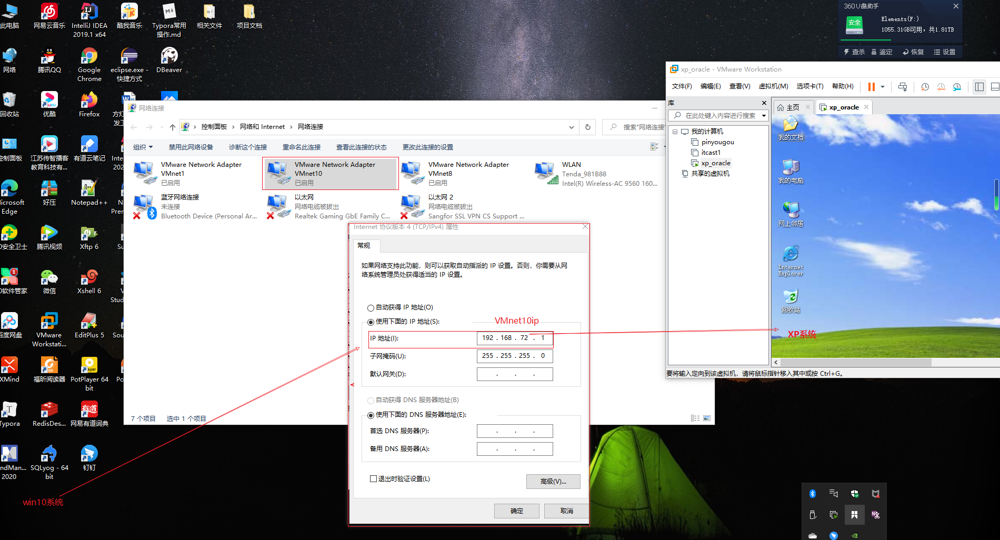

此时我们需要将网关设置给XP系统，让XP系统可用！

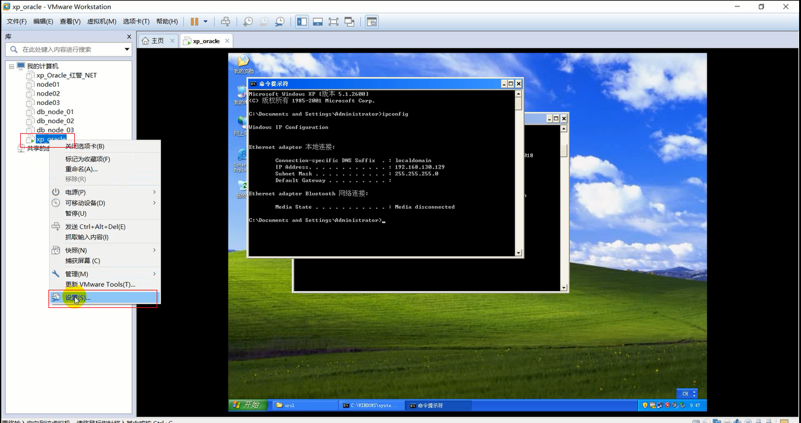

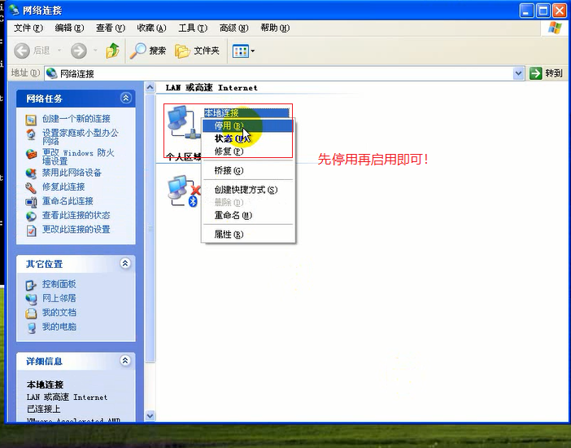

### 1.将XP系统IP固定

此时进入虚拟机，

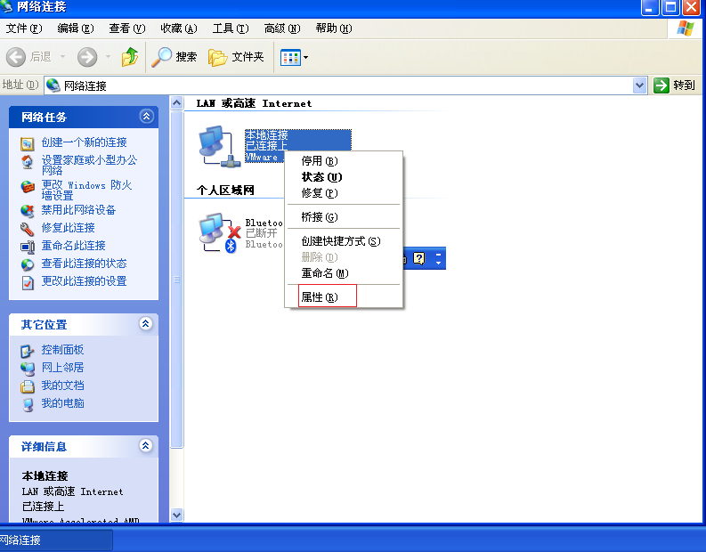

选择属性

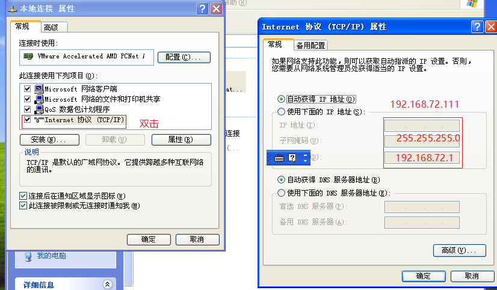

### 2.改动oracle配置文件，配置固定IP

**我们需要改动两个配置文件**

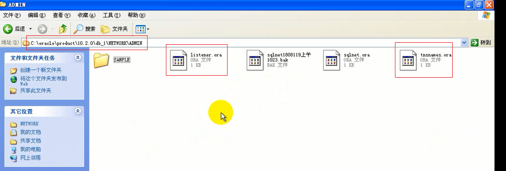

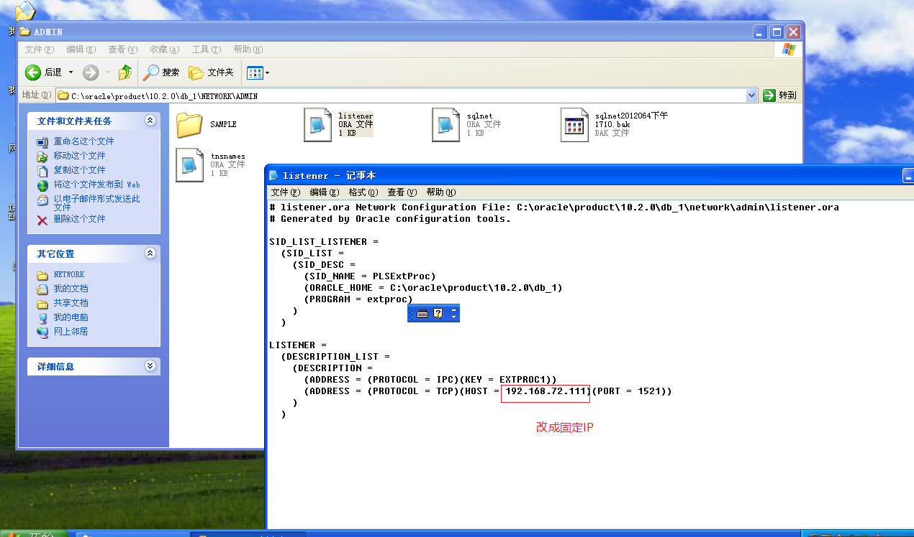

重启服务让配置生效！

>我的电脑 --> 管理 --> 服务和应用程序 --> 服务 

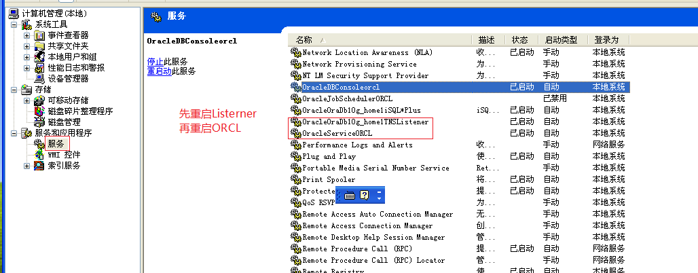

### 3.Oracle数据库的体系结构

~~~markdown
# 1.一个操作系统只有一个数据库，也就是只有一个库，而mysql一个数据库软件内可以创建多个库
# 2.一个数据库可以有多个实例，但是一般也只有一个实例。它是由一系列的后台进程组成
# 3.数据文件：以后的数据都是存储在`dbf`数据文件中！是存储数据的物理单位！！！
# 4.表空间：我们面向的是表空间，一个表空间可以有一个数据文件或者多个数据文件组成。他是存储数据的逻辑的单位。
# 5.用户：用户只能从属于一个表空间，一个表空间可以有多个用户！
  每个用户之间的表是不可见的！
~~~

**总结**

一个实例可以有多个表空间，

`一个表空间可以有多个数据文件dbf，我们面向的是表空间`

`数据库表随机存储在数据文件里面！`

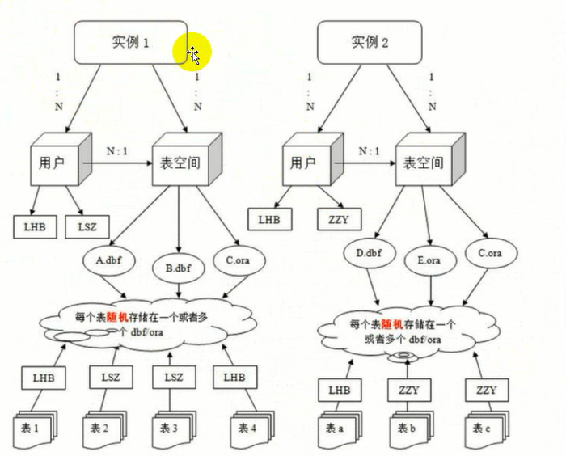

## 3.客户端操作ORACLE数据库

安装配置：

**Navicat**

~~~java
D:\Navicat\Navicat Premium 12\instantclient_10_2\oci.dll
~~~

**PLSql**

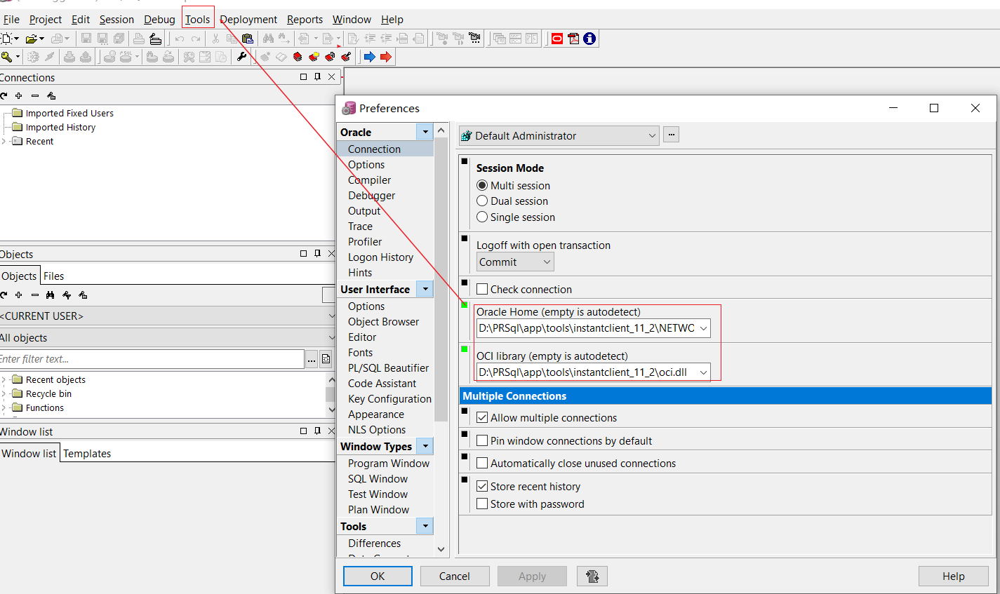

## 4.数据库的查询

~~~plsql
SQL：数据库查询语言
分为：
DDL:数据库定义语言
DML:数据库操作语言
DQL:数据库查询语言(重点)
DCL:数据库控制语言
~~~

~~~plsql
-- 别名：
别名一般不用中文；别名如果是纯数字或者是数字开头，必须使用双引号；别名不能使用单引号
select empno 员工编号, ename as 员工姓名,job "工作" ,mgr as "领导编码" from emp;
-- 去重：distinct
select distinct job from emp;
~~~

### 4.1 四则运算

~~~plsql
-- 计算员工的年薪
select empno,ename,sal as 月薪,sal*12 年薪 from emp;
~~~

~~~plsql
-- 计算员工的年收入
select empno,ename,sal as 月薪,sal*12 年薪,comm 奖金,sal*12+comm as 年收入 from emp;
~~~

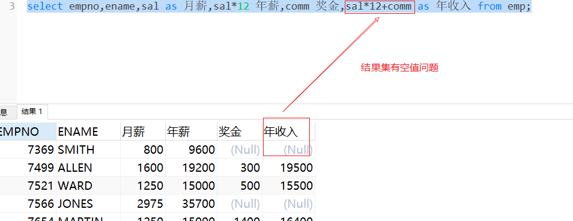

`空值问题`

**任何数字加上空都为空**

~~~plsql
-- 空值函数去空
-- oracle:nvl(v1,p1):当v1都等于空的时候，返回p1
-- mysql:ifnull(v1,p1):当v1都等于空的时候，返回p1
select empno,ename,sal as 月薪,sal*12 年薪,comm 奖金,sal*12+nvl(comm,0) as 年收入 from emp;
~~~

### 4.2 字符串拼接

#### 1.函数拼接

~~~plsql
-- 单行函数 concat
-- concat(v1,v2):把v1和v2拼接起来
select concat(empno,ename) as 员工编号与员工姓名 from emp;
~~~

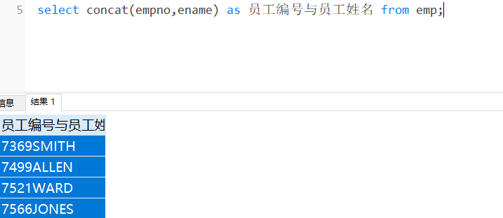

~~~plsql
-- concat函数嵌套
select concat(concat(empno,','),ename) as 员工编号与员工姓名 from emp;
~~~

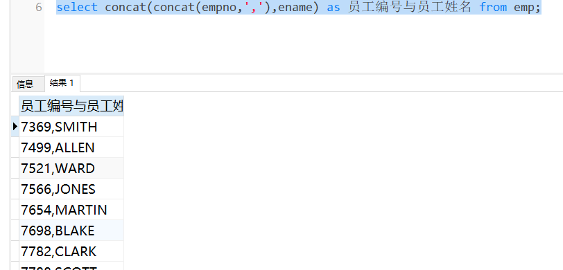

#### 2.双竖线拼接

~~~plsql
-- ||
select empno||','||ename||'========'||comm as haha from emp;
~~~

###  4.3 条件查询

~~~plsql
-- 条件查询：条件是写在where后面，使用where后面的条件对结果进行过滤
where条件可以是：
** 比较运算符号：
  等于：=
  不等于:<> | !=
** 其他比较运算符：
  between...and...：在两个值之间，包含边界
  in():等于值列表中的一个
  like:模糊查询
  is null:空值
~~~

~~~plsql
-- 空值判断
-- IS NULL ;IS NOT NULL
SELECT * FROM emp WHERE comm IS NOT NULL AND comm > 0;
-- 如果用比较运算可以去空
SELECT * FROM emp  where  comm > 0;
~~~

~~~plsql
-- 基本工资大于1500但是小于3000
SELECT sal FROM emp WHERE SAL >1500 AND sal <3000;
-- 基本工资大于等于1500但是小于等于3000
SELECT * FROM emp WHERE sal BETWEEN 1500 AND 3000;-- 
~~~

#####  日期函数

~~~plsql
-- to_date():将字符串转成日期
-- 案例：找出1981年入职的员工
SELECT * FROM emp WHERE HIREDATE BETWEEN TO_DATE('1981-01-01','yyyy-mm-dd')  AND TO_DATE('1981-12-31','yyyy-mm-dd');
~~~

##### 模糊查询

~~~plsql
-- 查询员工姓名包含M的员工
SELECT  * FROM emp WHERE ename LIKE  '%M%';
-- 查询员工的姓名中第二个字母闹含M的一个员工：Oracle区分大小写
SELECT * FROM emp WHERE ename LIKE '_M%'
~~~

##### 排序

~~~plsql
order by 字段名 asc [升序由小到大] desc [降序由大到小]
-- 查询员工的工资
SELECT * FROM emp order BY  sal DESC;
-- 空值处理
-- nulls first|last
SELECT * FROM emp ORDER BY comm DESC NULLS LAST ;
~~~

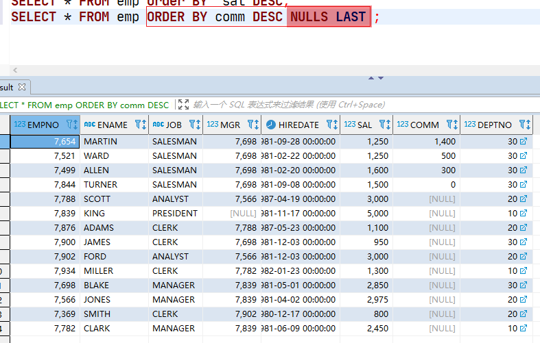

## 5.函数

>sql的函数可以没有参数，但是必须要有返回值！！！
>
>分为单行函数，多行函数

`单行函数：统计一条返回一条`

`多行函数：统计多条返回一条`

### 5.1 单行函数

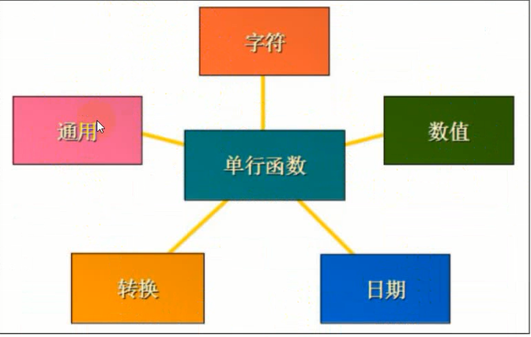

#### 5.1.1 大小写函数

~~~plsql
-- dual是一张伪表，不存在的表，是用来补全语法
-- 字符串的处理
-- 大小写控制
-- lower(v1):把字符串变小写
-- upper(v1):把字符串变大写
SELECT upper('abc') FROM dual; -- ABC
SELECT lower('ABC') FROM dual; -- abc
~~~

#### 5.1.2 长度计算

~~~plsql
SELECT length('123456') FROM dual; -- 6
~~~

#### 5.1.3 截取字符串

~~~plsql
-- 截取字符串
-- substr(v1,p1,p2) v1:源字符串 p1:开始索引[0和1都是从1开始] p2:截取长度
SELECT substr('nihaho',3,3) FROM dual; --hah
~~~

#### 5.1.4 替换字符串

~~~plsql
-- 替换字符串
-- replace(v1,p1,p2) v1:源字符串  p1:要替换的字符串 p2:替换后的字符串
SELECT replace('hello','he','waaa') from dual; -- waaallo
~~~

#### 5.1.5 数字计算

~~~plsql
-- 四舍五入 round(v1,p1) v1:源数字  p1：省略：返回的是整数，不省略：返回的是p1指定的小数位
SELECT round(2002.56,1) FROM dual;-- 2002.6
SELECT round(2002.56) FROM dual ;-- 2003
-- 截断 trunc(v1,p1) v1:源数字  p1：
-- 省略：返回的是整数，不会进行四舍五入 不省略：返回的是p1指定的小数位
SELECT trunc(2003.1) FROM dual;-- 2003
SELECT trunc(2003.12,1) FROM dual; -- 2003.1
~~~

#### 5.1.6 日期

~~~plsql
-- 系统时间
SELECT  sysdate FROM dual;
-- 时间-时间得到的是天数
SELECT empno,ename,hiredate,trunc(sysdate-hiredate)  AS 天数 FROM emp;
-- 得到两个时间的月数
-- months_between(v1-v2)：得到两个时间间隔的月数
SELECT empno,ename,hiredate,trunc(months_between(sysdate,hiredate)) AS 月数 FROM emp;
~~~

#### 5.1.7 转换函数

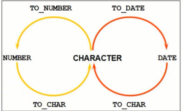

~~~plsql
-- 转换函数 
-- to_char：可以数字转换成字符串，也可以日期转换成字符串
SELECT 123,to_char(123) FROM dual;
SELECT sysdate,to_char(sysdate,'yyyy-mm-dd hh:mi:ss') FROM dual;
SELECT sysdate,to_char(sysdate,'yyyy-mm-dd hh24:mi:ss') FROM dual;

-- to_date:将字符串转成日期
SELECT to_date('2020-12-12 08:04:23','yyyy-mm-dd hh24:mi:ss') FROM dual;

-- to_number:将字符串转成数字
SELECT TO_NUMBER('123')  FROM dual;
~~~

#### 5.1.8 条件表达式

~~~plsql
-- case表达式
-- decode函数
~~~

~~~plsql
SELECT  empno,ename,DEPTNO,
      CASE DEPTNO
          when 10 THEN '男人'
          when 20 THEN '女人'
          ELSE '锤子'
      END AS 部门名称 
 FROM emp;
~~~

~~~plsql
SELECT empno ,ename, deptno,
    decode(deptno,10,'男人',20,'女人','锤子') AS hah1
FROM emp 
~~~

### 5.2 多行函数

>处理的是多行数据返回一条

~~~plsql
-- cuunt(),avg(),max(),min(),sum()
~~~

~~~plsql
-- 统计数据
SELECT count(*) FROM emp;
-- 计算公司的平均工资
SELECT avg(sal) FROM emp;
-- 计算公司的每个部门的平均工资
SELECT deptno,avg(sal) FROM emp group BY deptno;
~~~

`注意：where后面不可以加聚合函数,如果要加，可以用having!!!`

~~~plsql
SELECT deptno,avg(sal) FROM emp group BY deptno HAVING round(avg(sal),2) >2000;
~~~

~~~plsql
--  where 和 having的区别
--  where后面不能加组函数！！！
~~~

**补充点**

~~~markdown
# 1. oracle的date类型是精确到时分秒的，与mysql的datatime类型一致，mysql的date类型只到年月日！
# 2.双引号只在oracle别名用到，单引号是字符串！
~~~

## 6 Oracle多表查询

~~~java
笛卡尔积：
   **  两张表进进行关联查询，如果不加任何任何条件，得到的是两张表记录数的乘积！
   ** 笛卡尔积是没有意义的！我们可以通过外键条件约束来避免 
~~~

**补充：数据库的外键约束**

~~~mysql
foreign key ：外键 让表与表产生关系，从而保证数据的正确性
--  1.在创建表时可以添加外键
    create table  表名(
      ...
--    外键列
      constraint 外键名称 foreign key (本表的外键列名称) references 主表名称(主表列名称)
    )
--    2.删除外键
    alter table 表名 drop foreign key 外键名称
--    3.在创建表之后添加外键
    alter table 表名 add constraint 外键名称 foreign key (本表的外键列名称) references 主表名称(主表列名称)
~~~

**外键的级联操做**

~~~mysql
级联删除：
    constraint 外键名称 foreign key (本表的外键列名称) references 主表名称(主表列名称) on delete cascade
级联更新：
     constraint 外键名称 foreign key (本表的外键列名称) references 主表名称(主表列名称) on update cascade
~~~

### 6.1 内连接

~~~markdown
# 特点：得到的数据要完全满足条件才会显示！
~~~

~~~mysql
隐式内连接：
    select * from 表1，表2 where 条件； 
显式内连接：
    select * from 表1 inner join 表2 on 条件 where 条件；
~~~

### 6.2 外连接

>外连接重点在找基准表！
>
>`如果是基准表，它的数据全部显示！`
>
>左外连接：
>
>​        ` select * from tab1 left join tab2 on 条件;tab1是基准表！`
>
>右外连接：
>
>​          ` select * from tab1 right join tab2 on 条件;tab2是基准表！`

**oracle中特有的外连接**

>oracle中特有的外连接：使用+号
>
>口诀：`+ 在那一边，对面的那一边就是基准表！`

~~~plsql
select  * from emp e,emp m where e.mgr = m.empno(+);
此时 emp e就是基准表，因为他在加号的另一边！
~~~

## 7 Oracle子查询

>概念：
>
>​        `将一个查询的结果作为另外一个查询的条件`
>
>子查询是实际上是查询中嵌套查询。
>
>子查询的结果在主查询之前一次执行，子查询的结果被主查询使用。

~~~markdown
# 1.子查询的结果是单行单列的，可以作为条件用比较运算符等！
# 2.子查询的结果是多行单列的，可以是用in，between等！
# 3.子查询的结果是多行多列的，可以作为一张表来多表查询使用！
~~~

**子查询的结果是单行单列的**

~~~java
谁的工资比scott高？
    -- 先拿到scott工资
    -- 在进行排序比较！
~~~

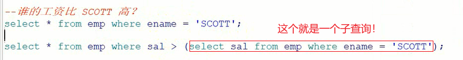

**子查询的结果是多行多列的**

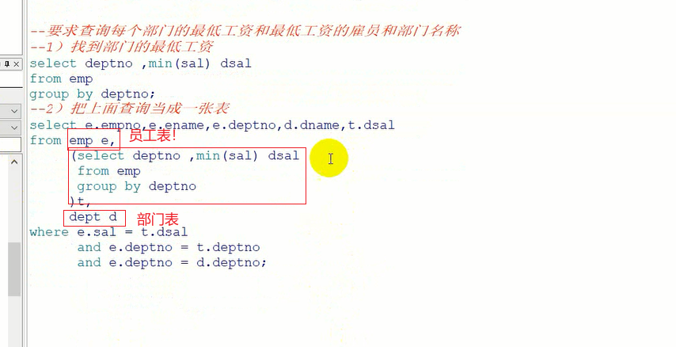

~~~mysql
-- 细节
-- 1.单行子查询与多行子查询的空值问题
    ** 单行单列子查询为null，数据不会显示但是不会报错！
-- 2.多行单列子查询作为条件，使用not in 要区空判断！
    select * from emp where empno not in(select  distinct mgr from emp where mgr is not null)
~~~

### exists用法

>exists:存在，存在返回true

~~~plsql
-- 用法：
exists:存在，返回的布尔值：true/false
用法:
    exists(子查询):
          1)当子查询有返回就结果的时候，返回true;
          2)当子查询没有返回结果的时候，返回false;
~~~

~~~mysql
-- 具体用法如下：
select * from dept d where exists(select * from emp e where d.deptno =e.deptno);
-- 它的执行原理是这样的：
select * from dept d 将dept里面的记录一条条取出，再将取出的记录进行exists子查询,当取出的记录与子查询的结果有返回结果，exists返回true,此时这条记录显示，反之则反。
~~~

>exists与in的区别：
>
>​      ` in会发生全表扫描！`
>
>​      `exists不会发生全表扫描！`
>
>`当数据量很大的时候，建议用exists`

## 8 Oracle分页查询

### oracle的伪列

~~~plsql
-- 查询员工表中工资最高的前三名
-- 1.先排序
select * from emp order by sal desc;

-- rownum:行号：每查询到一条数据就分配一个行号
-- rowid:行id,它执行的是物理存储的ID

~~~

>mysql的分页：
>
>​      select   *      from   表名 limit   开始记录索引 ,每页的记录数；
>
>`但是oracle中没有limit关键字，它靠的是rownum`；

~~~plsql
-- 查询emp表的数据，pageSize = 3;

-- 1)求第一页的数据
select * from emp where rownum <= 3;

-- 2)求第二页的数据
-- select * from business_contract where rownum >3 and rownum <=6;
上述写法无法拿到任何数据，理由：
rownum 不能使用>(大于号)
每查询一条就分配一个行号，
    使用小于号，数据已经查询出来啦，此时还会给每条记录分配行号！！！
    使用大于号，数据还没有查询出来！不能使用大于号
正确做法是：先查询小于等于6的记录，把结果当成一张表，再利用分配好的行号

select * from 
    (select rownum as rnum,e.* from emp e where rownum <=6)
t where t.rnum >3; -- 注意，可以给伪列rownum定义别名！！！，这里给他定义了别名rnum.

~~~

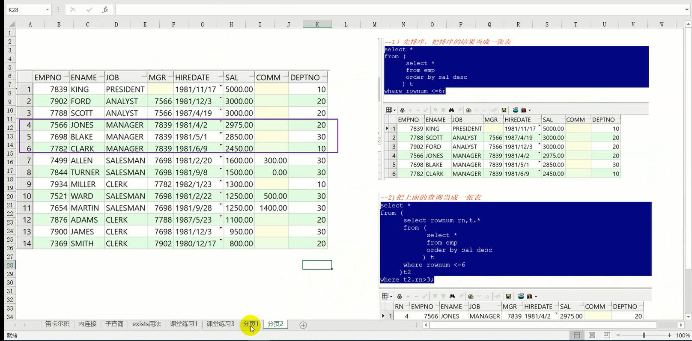

## 9.集合运算

>包括：并集，交集，差集！
>
>规则：
>
>​        两个集合返回的字段的数量和字段的数据类型必须一致

### 并集 union/union all

~~~plsql
-- 并集：把两个集合加起来
-- 案例，查询工资大于1500的或者他是20号部门的员工！

select * from emp where salary >1500
union all -- 把两个集合联合起来
select * from emp where deptno = 20
-- 但是这个union all只是简单的把两个集合加起来，并且没有去重！
-- 虽然他不能去重，但是他效率高！

select * from emp where salary >1500
union  -- 把两个集合联合起来，并且去重!
select * from emp where deptno = 20
-- union可以去重，但是效率低一些
~~~

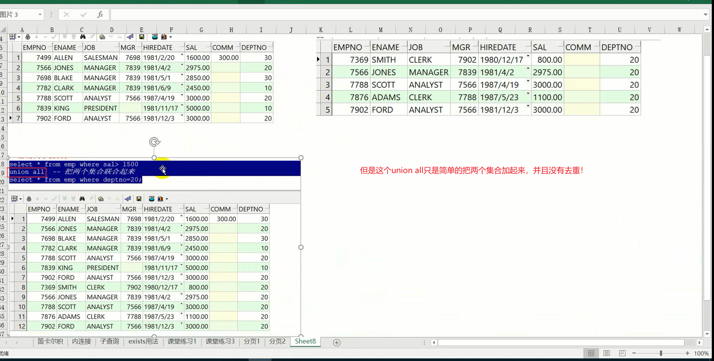

### 交集：intersect

~~~plsql
-- 交集：相等的数据显示出来！！！
-- 通过关键字intersect
-- 案例，查询工资大于1500的并且他是20号部门的员工！

select * from emp where salary >1500
intersect -- 把两个集合相同的部分取出来
select * from emp where deptno = 20
~~~

### 差集：有方向性

~~~plsql
-- 查询1981年入职的普通员工，不包括总裁和经理(差集)
--1)A集合：1981年入职的员工
select * from emp where  to_char(hiredate,'yyyy')='1981';
--1)B集合:总裁与经理
select * from emp where job ='PRESIDENT' or job ='MANAGER';
~~~

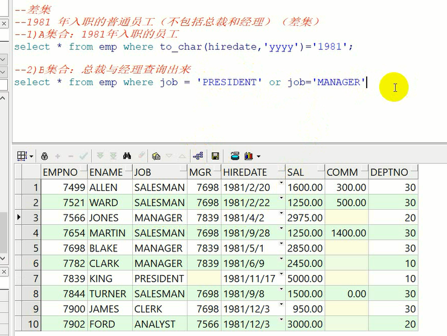

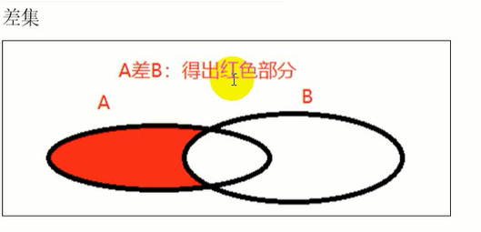

~~~plsql
-- A差B：得出A的红色部分
select * from emp where  to_char(hiredate,'yyyy')='1981'
minus
select * from emp where job ='PRESIDENT' or job ='MANAGER';
~~~

## 10.Oraclle的DDL语句

>oracle一个数据库可以有多个实例，但是一般也只有一个实例！
>
>一个实例：可以有多个表空间！
>
>一个表空间：由多个数据文件dbf组成！
>
>一个表空间：可以有多个用户
>
>一个用户只能从属于一个表空间
>
>
>
>oracle中我们面向的是用户，每个用户之间的表都是相对独立的，不过权限很高的用户可以跨用户去查其他用户的表！

### 10.1表空间

~~~plsql
-- 创建表空间
-- 语法：
    create tablespace 表空间的名称
    datafile 'c:\test.dbf' -- 数据文件的位置
    size 50m -- 指定数据文件的大小
    autoextend on -- 开启自动拓展(上述50m用完会自动拓展数据文件的大小！on代表自动扩展打开)
    next 30m ; --下一次扩展的大小
    
 -- 细节：
    创建表空间需要dba的权限！！！
~~~

### 10.2创建用户

~~~plsql
-- 创建用户需要dba权限
create user xiaoming  -- 创建用户
identified by xiaoming123 -- 指定用户密码(不能用纯数字)
default tablespace 表空间的名称; --指定创建的用户所属的表空间
~~~

>刚创建的用户登录不了，必须进行授权！！！
>
>oracle通过角色来授权。
>
>connect:用户连接权限
>
>resource:开发者权限
>
>dba:系统管理员权限

~~~plsql
-- 授权语法：
grant connect,resource to xiaoming;
-- 撤销权限
revoke connect,resource from xiaoming;

--查看用户所属那个表空间
select default_tablespace from dba_users where username ='KAIFA1101';
--查看用户权限
select * from dba_role_privs where grantee ='KAIFA1101'
~~~

~~~plsql
----------------------------------------------
-- 用户
----------------------------------------------
1.【管理员】创建用户
create user user1 identified by 123456;

2.【管理员】授权用户：访问数据库的权限create session
grant create session to user1;

3.【user1】创建表tab_test
create table tab_test(
       tid number(4)
);

4.【管理员】授权用户：创建表的权限create table
grant create table to user1;

5.【管理员】授权表空间：
alter user user1 quota 10M on users;

6.修改密码 ① 用户已登录，修改密码  ② 用户忘记密码，管理重置
alter user user1 identified by 123;

7.用户状态：正常（未锁定）、锁定、密码过期
alter user user1 account lock;--管理员锁定（the account is locked）
alter user user1 account unlock;--管理员解锁
alter user user1 password expire;--管理员设置密码过期

8.【管理员】删除用户:处于连接状态的用户不能被删除
drop user user1 cascade;

----------------------------------------------
-- 权限： 系统权限 与 对象权限
--
--     系统权限：A->B->C, 当A回收B的权限时，【不会级联】回收C的权限
--     对象权限：A->B->C, 当A回收B的权限时，【会级联】  回收C的权限
----------------------------------------------
create user user2 identified by 123456;
create user user3 identified by 123456;

--系统权限
1.授系统权限给用户   grant...to    --with admin option 允许user2继续将该权限授权给其他用户，比如User3  管理员 -> user2 -> user3
grant create session to user2 with admin option;--管理员授权给user2
grant create session to user3;                  --user2授权给user3

2.从用户撤回系统权限 revoke...from --  A->B->C, 当A回收B的权限时，不会级联回收C的权限
revoke create session from user2;
revoke create session from user3;

--对象权限
1.授对象权限给用户 grant...on...to --with grant option 允许user2继续将该权限授权给其他用户，比如User3  scott -> user2 -> user3
grant select on emp to user2 with grant option;   --scott授权给user2
grant select on scott.emp to user3;               --user2授权给user3   单个授权

grant update,insert,delete on scott.emp to user2; --scott授权给user2  批量授权

grant all privileges on scott.emp to user2;       --scott授权给user2  全量授权

grant update(job,deptno) on scott.emp to user2;    --scott授权给user2  仅限制修改job与deptno列

2.从用户撤回对象权限  revoke...on...from --  A->B->C, 当A回收B的权限时，会级联回收C的权限
revoke select on scott.emp from user2;

----------------------------------------------
-- 角色：权限的集合
----------------------------------------------
1.【管理员】创建角色
create role stuRole;

2.【管理员】给角色授权
grant create session,create table,create view to stuRole;

3.【管理员】创建用户
create user user4 identified by 123456;
create user user5 identified by 123456;

4.【管理员】给用户授予角色
grant stuRole to user4;
grant stuRole to user5;

5.【user4】查看权限
select * from session_privs;

6.【管理员】回收角色的权限
revoke create session from stuRole;

7.【管理员】回收用户的角色
revoke stuRole from user4;

8.【管理员】删除角色
drop role stuRole;

----------------------------------------------
-- 预定义角色：DBA、Connect、Resource
----------------------------------------------
create user user6 identified by 123456;
grant connect,resource to user6;

select * from dba_sys_privs where grantee = 'DBA';--管理员权限
select * from dba_sys_privs where grantee = 'CONNECT';--管理员权限  CREATE SESSION
select * from dba_sys_privs where grantee = 'RESOURCE';--管理员权限

----------------------------------------------
-- public
----------------------------------------------
grant create session to public;--将登陆权限授权给所有人
~~~

### 10.3oracle中的数据类型

**mysql**中的数据类型

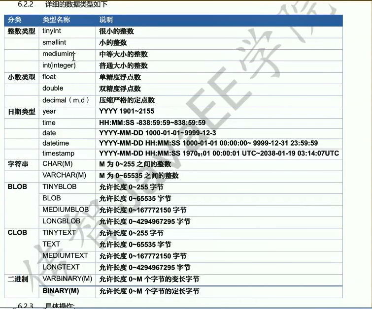

~~~plsql
-- 1字符串
-- 定长 ：char
-- 变长 ：varchar2  
-- 长字符串：long 最大可以存储2G的字符串

-- 2数值
-- 整数：number(v1,p1):v1是整个数字的长度，p1:是小数位
        省略的p1就是整数
        v1,p1都存在就是小数
        number(3):最大值999
        number(3,2):最大值：9.99
        
-- 3日期
-- date:精确到秒，与mysql的datetime时间一致
-- timestamp:精确到秒的后9位

--4大数据类型
-- blob:存储二进制文件，最大4G
-- clob ：存储的是字符串，最多是4G

~~~

### 10.4创建表与修改表

~~~plsql
create table person(
  id number(10),
  nmae varchar2(200)
);

-- 复制表
create table 表名 like 被复制的表名;
~~~

**修改表**

~~~plsql
-- 往表中加入一列！
alter table person add address01 varchar2(300);

-- 修改列的属性
alter table person modify address01 varchar2(500);

-- 修改列名
alter table person rename column address01 to address02;

-- 删除一列
alter table person drop column address01;
~~~

### 10.5约束

~~~plsql
-- 主键约束：已经包含非空和唯一约束
primary key  
-- 非空约束
not null
-- 唯一约束
unique
-- 检查约束
check
~~~

~~~plsql
create table person(
    id number(10) primary key,
    name varchar2(200) not null unique,
    gender number(1) default 1 check(gender in (1,2))
 --检查gender字段，他只能取值1或者2
);
~~~

#### 外键约束

~~~plsql
foreign key ：外键 让表与表产生关系，从而保证数据的正确性
--  1.在创建表时可以添加外键
    create table  表名(
      ...
--    外键列
      constraint 外键名称 foreign key (本表的外键列名称) references 主表名称(主表列名称)
    )
--    2.删除外键
    alter table 表名 drop foreign key 外键名称
--    3.在创建表之后添加外键
    alter table 表名 add constraint 外键名称 foreign key (本表的外键列名称) references 主表名称(主表列名称)
~~~

>注意：`删除数据的话，正常情况下，先删除从表的数据，再删除主表的数据！`

**级联操做**

~~~plsql
级联删除：
    constraint 外键名称 foreign key (本表的外键列名称) references 主表名称(主表列名称) on delete cascade
级联更新：
     constraint 外键名称 foreign key (本表的外键列名称) references 主表名称(主表列名称) on update cascade
~~~

## 11.Oracle的DML

~~~plsql
-- insert 插入
insert into 表名(列名1,列名2,...) values(值1,值2,...)

-- update 更新
update 表名 set 列名1=值1,列名2=值2,... where条件

-- delete 删除
delete from 表名 where 条件;
~~~

~~~plsql
-- 全表删除
delete from 表名; -- 删除所有数据，效率比较低，有可能产生碎片！但是可以回滚！
truncate table 表名; -- 删除所有数据，效率高，但是不能回滚，先摧毁表，再创建表。
~~~

## 12 事务

~~~markdown
# 1.事务是逻辑上的一组操做，要么全部成功，要么全不成功！！！
# 2.事务的操做：
     开启事务: start transaction ;
     提交事务：commit;
     回滚事务：rollback;
# 3.事务的四大特性：ACID
    原子性：它是不可分割的最小操作单位，要么同时成功，要么同时失败
    一致性：事务操做前后数据总量不变
    隔离性：多个事务之间相互影响，我们希望多个事务之间相互独立.一个事务失败与另一个事务无关，即一个事务失败不会导致另一个事务回滚
    永久性：如果一旦事务提交或者回滚，会持久的保存到数据库中，数据会持久化的保存
~~~

>注意：
>
>`1.在mysql中事务默认自动提交，一条DML(增删改)语句会自动提交一次事务。而在ORACLE事务默认不自动提交，DML语句执行需要提交事务！`
>
>`2.如果手动提交事务，需要先开启事务，再提交事务.`
>
>`3.修改事务的默认提交方式：`
>
>​            查看事务的默认提交方式(`mysql数据库`)：
>
>​                     select @@autocommit ; -- 1代表自动提交 0代表手动提交
>
>​           修改事务的默认提交方式(`mysql数据库`)：
>
>​                     set  @@autocommit = 0 ;

### 事物的隔离级别

~~~java
多个事务之间是相互独立的，但是如果多个事务操做同一批数据，则会引发一些问题，设置不同的隔离级别就可以解决这些问题。
~~~

~~~markdown
# 1.脏读
    一个事务，读取到另外一个事务中还未提交的数据
# 2.不可重复读 update
    一个事务中，两次读取到的数据不一样！
    一般是针对同一个数据的修改操做！
    一个事务A读取了某个数据，他的值为XXXX，但是一个事务B修改了这个数据为YYYY，然后A又读取了一遍这个数据，发现他变为YYYY，对于事务A来说，同一个事务中，自己没有修改值，但是两次读取到的值不一致。
# 3.幻读
    一个事务操作(insert delete)：
    一个事务A读取某个表中的数据，两次读取到的记录数不同，因为在事务A前后两次读取事务的过程中，事务B添加或者删除了某些记录，并且提交。
~~~

隔离级别

~~~markdown
# 1.read uncommitted:读未提交
    在这个隔离级别下，会产生脏读，不可重复度，幻读
# 2.read committed:读已提交 oracle
    产生的问题：不可重复读，幻读
# 3.repeatable read：可重复度 mysql
    产生的问题：幻读
# 4.serializable:串行化
    可以解决所有问题

隔离级别从小到大安全性越来越高，但是效率越来越低！！！

# mysql数据库查询隔离界别
select @@tx_isolation;
# 数据库设置隔离界别
set global transaction isolation level 级别字符串;
~~~

### 保存点savepoint

~~~plsql
-- 保存点之前的数据提交，保存点之后的数据回滚
insert into person(id,name) values (1,'樱木花道');
savepoint s1;
insert into person(id,name) values (2,'三仅售');
rollback s1;
commit;
-- 此时第一条数据会提交到数据库！！！
~~~

## 13.视图

~~~plsql
-- 视图：一般是查询用的，可以用来屏蔽敏感数据和封装复杂的sql.但是修改视图的数据也可以间接作用到原表。
-- 1.创建视图的语法：
create view 视图的名称 as 查询语句;
-- 2.创建视图需要授权;
-- 3.细节：视图本身不存储数据，真正的数据存储在表中，故我们可以直接操做视图作用到原表。
~~~

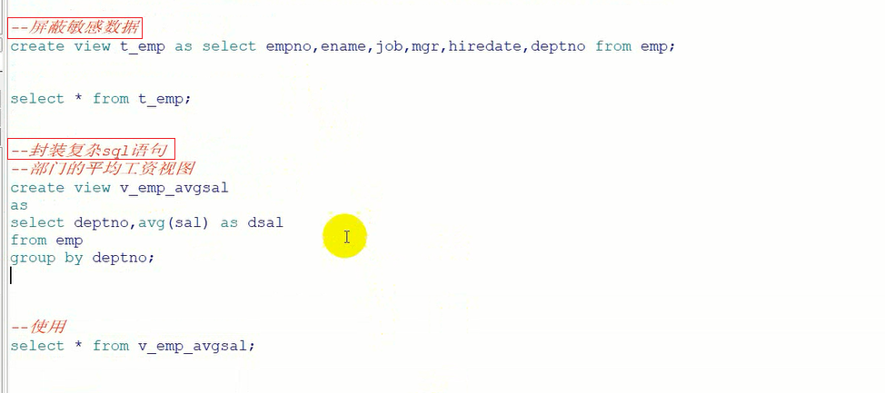

## 14.序列

`oracle中没有主键自增，序列的存在就是为了主键的生成准备的！`

`序列可以生成连续的或者不连续的数字主键`

~~~plsql
-- 语法：
create sequence 序列的名称;
-- 使用：获取序列的值
   序列名称.currval;  -- 查询当前的值 
   序列名称.nextval;  -- 查询下一个值，每一次都会+1
-- 细节：
    1.刚创建完的序列不能马上执行执行查询当前值，必须先执行一次nextval	 2.默认情况下，序列的起始值为1
~~~

~~~plsql
-- 创建序列
create sequence seq_dfang;
-- 查询当前序列的值 第一次要先执行下面的语句
select seq_dfang.currval from dual;
--  查询下一个值
select seq_dfang.nextval from dual;

-- 一般用它来作为主键的自增长序列
insert into emp (empno,ename) values (seq_dfang.nextval,'johhny');
commit;
~~~

~~~plsql
-- 序列的另一种用法：不常用
create seqence 序列名称 
   start with 3 -- 起始值
   increment by 3 -- 步长
   maxvalue 20 -- 最大值
   cycle -- 开启循环(查过最大值以后会从1开始循环)
   cache 5; -- 缓存的个数默认值是20
~~~

## 15.索引

>索引主要是为了提高效率的。
>
>oracle索引：
>
>​     单列索引：只是某一列字段做索引
>
>​     复合索引：多个字段

~~~plsql
-- 创建单列索引
create index 索引名称 on 表名(单列);
-- 创建复合索引
create index 索引名称 on 表名(单列1,单列2);
~~~

~~~plsql
--往一张表插入100万条数据，比对没有索引和有索引的查询时间【使用到明天的知识】
drop table person;
create table person(
       id number(10) primary key,
       name varchar2(200),
       gender number(1) default 1
);

--创建序列
create sequence seq_person_id;

--插入100万条数据
begin
   for i in 1..1000000 loop
       insert into person (id,name,gender) values (seq_person_id.nextval,'用户名称'||i,1);
   end loop;
   commit;
end;

--统计条数
select count(*) from person;

-- 没有索引：0.203秒
select * from person where name = '用户名称980000';

--创建索引
create index ind_person_name on person(name);

-- 有索引：0.032秒
select * from person where name = '用户名称990000';
~~~

~~~markdown
# 1.在数据量比较大的表中使用索引
# 2.在查询比较多的列中使用索引
# 3.如果某张表它的新增删除比较频繁，索引慎用。因为增删操做会重构索引树
# 4.复合索引有优先索引列，create index 索引名称 on person (name,gender)  --name 是优先索引列
    select * from person where name=? and gender =?  -- 触发索引
    elect * from person where name=? or gender =?    -- 不会触发索引
    select * from person where gender =? and  name=? -- 不会触发索引
    select * from person where gender =?             -- 不会触发索引
~~~

## 16 数据的导入导出

**在oracle的服务器端执行：在命令提示符中去执行:效率最高**

~~~plsql
-- 在oracle的服务器端执行：在命令提示符中去执行:效率最高
-- 1导出：会生成.dmp文件
-- 全库导出：exp 用户名/密码 file ='c:\xxx.dmp' full = y
-- 按表导出: exp 用户名/密码 file ='c:\xxx.dmp' tables = 表名1,表名2,...
  
~~~

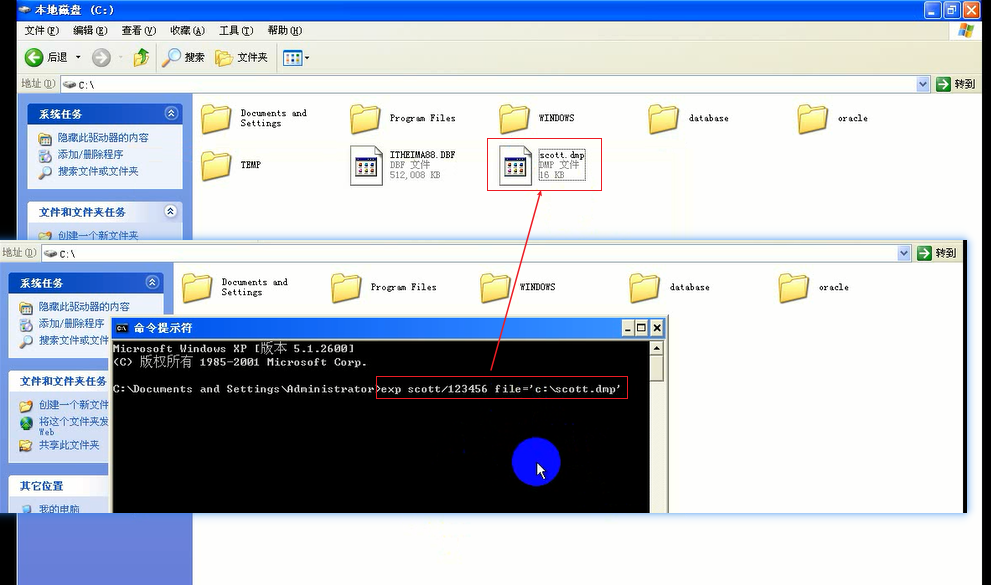

~~~plsql
-- 2.导入
-- 全库导入：
imp 其他用户名/密码 file = 'c:\导出文件名称.dmp' full = y 
imp 其他用户名/密码 file = 'c:\导出文件名称.dmp' fromuser = 从那个用户过来 touser = 到哪个用户中去
-- 按表导入
imp 其他用户名/密码 file = 'c:\导出文件名称.dmp' full = y 
imp 其他用户名/密码 file = 'c:\导出文件名称.dmp' fromuser = 从那个用户过来 touser = 到哪个用户中去 tables = 表名1,表名2,...
imp 其他用户名/密码 file = 'c:\导出文件名称.dmp' tables = 表名1,表名2,...
~~~

**sql命令脚本**

~~~plsql
-- 通过客户端plsql导出
plsql菜单 --> Tools --> Export Tables
-- 通过客户端plsql导入
plsql菜单 --> Tools --> Import Tables
~~~

