# 2.1 SELECT语句基础

## 2.1.1 从表中选取数据

### SELECT语句

从表中选取数据时需要使用SELECT语句，也就是只从表中选出（SELECT）必要数据的意思。通过SELECT语句查询并选取出必要数据的过程称为匹配查询或查询（query）。

基本SELECT语句包含了SELECT和FROM两个子句（clause）。示例如下：

```sql
SELECT <列名>，
  FROM <表名>；
```
其中，SELECT子句中列举了希望从表中查询出的列的名称，而FROM子句则指定了选取出数据的表的名称。
## 2.1.2 从表中选取符合条件的数据

### WHERE语句

当不需要取出全部数据，而是选取出满足“商品种类为衣服”“销售单价在1000日元以上”等某些条件的数据时，使用WHERE语句。

SELECT 语句通过WHERE子句来指定查询数据的条件。在WHERE 子句中可以指定“某一列的值和这个字符串相等”或者“某一列的值大于这个数字”等条件。执行含有这些条件的SELECT语句，就可以查询出只符合该条件的记录了。

```sql
SELECT <列名>，……
  FROM <表名>
 WHERE <条件表达式>；
```
比较下面两者输出结果的不同：
```sql
-- 用来选取product type列为衣服’的记录的SELECT语句
SELECT product_name,product_type
  FROM product
 WHERE product_type = '衣服'；
-- 也可以选取出不是查询条件的列（条件列与输出列不同）
SELECT product_name
  FROM product
 WHERE product_type = '衣服'；
```
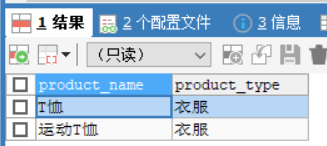


## 2.1.3 相关法则

* 星号（*）代表全部列的意思。
* SQL中可以随意使用换行符，不影响语句执行（但不可插入空行）。
* 设定汉语别名时需要使用双引号（"）括起来。
* 在SELECT语句中使用DISTINCT可以删除重复行。
* 注释是SQL语句中用来标识说明或者注意事项的部分。分为1行注释"-- "和多行注释两种"/*  */"。
```sql
-- 想要查询出全部列时，可以使用代表所有列的星号（*）。
SELECT *
  FROM <表名>；
-- SQL语句可以使用AS关键字为列设定别名（用中文时需要双引号（“”））。
SELECT product_id     As id,
       product_name   As name,
       purchase_price AS "进货单价"
  FROM product;
-- 也可以直接这样重命名
SELECT product_id id,
       product_name  NAME,
       purchase_price "进货单价"
  FROM product;
-- 使用DISTINCT删除product_type列中重复的数据
SELECT DISTINCT product_type
  FROM product;
```
select出的数据取别名：

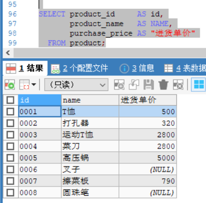

使用DISTINCT删除product_type列中重复的数据:

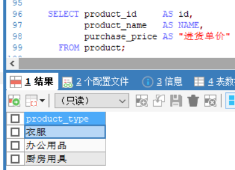

# 2.2 算术运算符和比较运算符

## 2.2.1 算术运算符

SQL语句中可以使用的四则运算的主要运算符如下：

|含义|运算符|
|:----|:----|
|加法|+|
|减法|-|
|乘法|*|
|除法|/|


## 2.2.2 比较运算符

```sql
-- 选取出sale_price列为500的记录
SELECT product_name,product_type
  FROM product
 WHERE sale_price = 500;
```
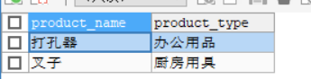

SQL常见比较运算符如下：

|运算符|含义|
|:----|:----|
|=|相等|
|<>|不相等|
|>=|大于等于|
|>|大于|
|<=|小于等于|
|<|小于|


## 2.2.3 常用法则

* SELECT子句中可以使用常数或者表达式。
* 使用比较运算符时一定要注意不等号和等号的位置。
* 字符串类型的数据原则上按照字典顺序进行排序，不能与数字的大小顺序混淆。
* 选取NULL记录时，需要在条件表达式中使用IS NULL运算符。希望选取不是NULL的记录时，需要在条件表达式中使用IS NOT NULL运算符。

相关代码如下：

```sql
-- SQL语句中也可以使用运算表达式
SELECT product_name,sale_price,sale_price * 2 AS "sale_price x2"
  FROM product;
-- WHERE子句的条件表达式中也可以使用计算表达式
 SELECT product_name,sale_price,purchase_price
 FROM product  -- 这里因为格式问题> =连着写会被自动合并为>=
 WHERE sale_price-purchase_price>= 500; 
/* 对字符串使用不等号
首先创建chars并插入数据
选取出大于‘2’的SELECT语句*/
-- DDL：创建表
CREATE TABLE chars
(chr CHAR(3)NOT NULL,
PRIMARY KEY(chr))
-- 选取出大于'2'的数据的SELECT语句('2'为字符串)
SELECT chr
  FROM chars
 WHERE chr > '2';
-- 选取NULL的记录
 SELECT product_name,purchase_price
  FROM product
 WHERE purchase_price IS NULL;
-- 选取不为NULL的记录
SELECT product_name,purchase_price
  FROM product
 WHERE purchase_price IS NOT NULL;
```
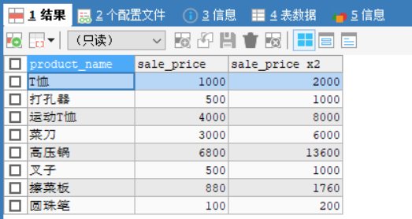
# 2.3 逻辑运算符

## 2.3.1 NOT运算符

想要表示“不是……”时，除了前文的<>运算符外，还存在另外一个表示否定、使用范围更广的运算符：NOT。

NOT不能单独使用，如下例：

```sql
-- 选取出销售单价大于等于1000日元的记录
SELECT product_name,product_type,sale_price
  FROM product
 WHERE sale_price >= 1000;  -- 这里因为格式问题> =后连着写或被自动合并为>=
-- 向代码清单2-30的查询条件中添加NOT运算符
SELECT product_name，product_type，sale_price
  FROM product
 WHERE NOT sale_price >= 1000；  -- 售价不大于1000的
```
大于：

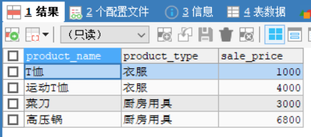

不大于： <=1000  没有T恤

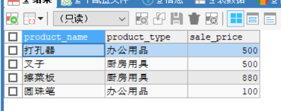

## 2.3.2 AND运算符和OR运算符

当希望同时使用多个查询条件时，可以使用AND或者OR运算符。

AND 相当于“并且”，类似数学中的取交集；

OR 相当于“或者”，类似数学中的取并集。

如下图所示：

AND运算符工作效果图

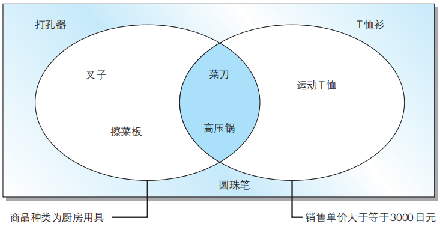

OR运算符工作效果图

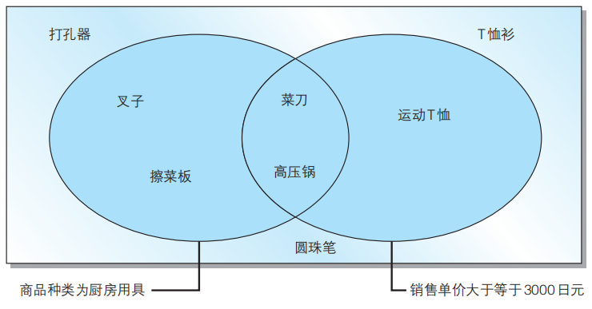

### 通过括号优先处理

如果要查找这样一个商品，该怎么处理？

>“商品种类为办公用品”并且“登记日期是 2009 年 9 月 11 日或者 2009 年 9 月 20 日”
>理想结果为“打孔器”，但当你输入以下信息时，会得到错误结果
```sql
-- 将查询条件原封不动地写入条件表达式，会得到错误结果
SELECT product_name, product_type, regist_date
  FROM product
 WHERE product_type = '办公用品'
   AND regist_date = '2009-09-11'
    OR regist_date = '2009-09-20';
```
错误的原因是**是 AND 运算符优先于 OR 运算符**，想要优先执行OR运算，可以使用**括号**：
```sql
-- 通过使用括号让OR运算符先于AND运算符执行
SELECT product_name, product_type, regist_date
  FROM product
 WHERE product_type = '办公用品'
   AND ( regist_date = '2009-09-11'
        OR regist_date = '2009-09-20');
```

## 2.3.3 真值表

复杂运算时该怎样理解？

当碰到条件较复杂的语句时，理解语句含义并不容易，这时可以采用**真值表**来梳理逻辑关系。

什么是真值？

本节介绍的三个运算符 NOT、AND 和 OR 称为逻辑运算符。这里所说的逻辑就是对真值进行操作的意思。**真值**就是值为真（TRUE）或假 （FALSE）其中之一的值。

例如，对于 sale_price >= 3000 这个查询条件来说，由于 product_name 列为 '运动 T 恤' 的记录的 sale_price 列的值是 2800，因此会返回假（FALSE），而 product_name 列为 '高压锅' 的记录的sale_price 列的值是 5000，所以返回真（TRUE）。

**AND 运算符**两侧的真值都为真时返回真，除此之外都返回假。

**OR 运算符**两侧的真值只要有一个不为假就返回真，只有当其两侧的真值都为假时才返回假。

**NOT运算符**只是单纯的将真转换为假，将假转换为真。

真值表

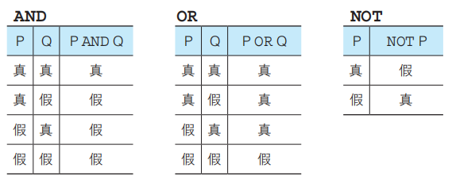

查询条件为P AND（Q OR R）的真值表

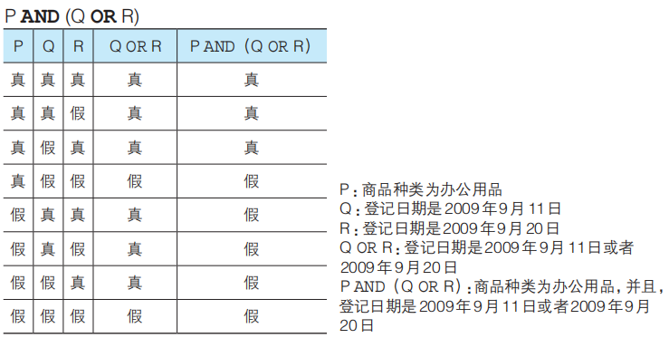

### 含有NULL时的真值

NULL的真值结果既不为真，也不为假，因为并不知道这样一个值。

那该如何表示呢？

这时真值是除真假之外的第三种值——**不确定**（UNKNOWN）。一般的逻辑运算并不存在这第三种值。SQL 之外的语言也基本上只使用真和假这两种真值。与通常的逻辑运算被称为二值逻辑相对，只有 SQL 中的逻辑运算被称为三值逻辑。

三值逻辑下的AND和OR真值表为：


## 练习题-第一部分

### 2.1

编写一条SQL语句，从product（商品）表中选取出“登记日期（regist在2009年4月28日之后”的商品，查询结果要包含product_name和regist_date两列。

```
SELECT product_name, regist_date 
FROM product
WHERE regist_date>'2009-04-28';
```

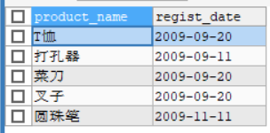

### 2.2

请说出对product 表执行如下3条SELECT语句时的返回结果。

① 列出所有的字段，但没有记录。

```sql
SELECT *
  FROM product
 WHERE purchase_price = NULL;
```
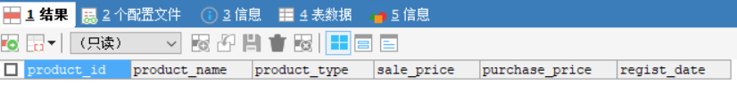

②列出所有的字段，但没有记录。
```sql
SELECT *
  FROM product
 WHERE purchase_price <> NULL;
```
③列出所有的字段，但没有记录。
```sql
SELECT *
  FROM product
 WHERE product_name > NULL;
```
- 判断为NULL时需要使用 is null 或者 is not null

### 2.3

代码清单2-22（2-2节）中的SELECT语句能够从product表中取出“销售单价（saleprice）比进货单价（purchase price）高出500日元以上”的商品。请写出两条可以得到相同结果的SELECT语句。执行结果如下所示。

```sql
product_name | sale_price | purchase_price 
-------------+------------+------------
T恤衫         | 　 1000    | 500
运动T恤       |    4000    | 2800
高压锅        |    6800    | 5000
```


```sql
-- 原始的内容
SELECT product_name,sale_price,purchase_price
FROM product  -- 这里因为格式问题> =连着写会被自动合并为>=
WHERE sale_price-purchase_price>= 500; 
-- 1. 不小于500
SELECT product_name,sale_price,purchase_price
FROM product
WHERE not sale_price-purchase_price<500; 
-- 2. 大于500 或者 等于500
SELECT product_name,sale_price,purchase_price
FROM product
WHERE (sale_price-purchase_price)>500 or (sale_price-purchase_price)=500;
```


### 2.4

请写出一条SELECT语句，从product表中选取出满足“销售单价打九折之后利润高于100日元的办公用品和厨房用具”条件的记录。查询结果要包括product_name列、product_type列以及销售单价打九折之后的利润（别名设定为profit）。

提示：销售单价打九折，可以通过saleprice列的值乘以0.9获得，利润可以通过该值减去purchase_price列的值获得。

```sql
-- 1.
SELECT product_name, product_type, sale_price*0.9-purchase_price AS profit
FROM product
WHERE sale_price*0.9-purchase_price>100 AND (product_type='办公用品' OR product_type='厨房用具');

-- 2. 
SELECT product_name, product_type, sale_price*0.9-purchase_price AS profit
FROM product
WHERE sale_price*0.9-purchase_price>100 AND product_type IN('办公用品','厨房用具');
```

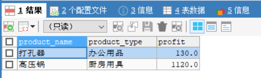

# 2.4 对表进行聚合查询

## 2.4.1 聚合函数

SQL中用于汇总的函数叫做聚合函数。**聚合函数的适用前提是结果集一经确定，**以下五个是最常用的聚合函数：

* COUNT：计算表中的记录数（行数）
* SUM：计算表中数值列中数据的合计值
* AVG：计算表中数值列中数据的平均值
* MAX：求出表中任意列中数据的最大值
* MIN：求出表中任意列中数据的最小值

请沿用第一章的数据，使用以下操作熟练函数：

```sql
-- 计算全部数据的行数（包含NULL）
SELECT COUNT(*)
  FROM product;
-- 计算NULL以外数据的行数
SELECT COUNT(purchase_price)
  FROM product;
-- 计算销售单价和进货单价的合计值
SELECT SUM(sale_price), SUM(purchase_price) 
  FROM product;
-- 计算销售单价和进货单价的平均值
SELECT AVG(sale_price), AVG(purchase_price)
  FROM product;
-- MAX和MIN也可用于非数值型数据
SELECT MAX(regist_date), MIN(regist_date)
  FROM product;
```
- 使用聚合函数删除重复值

```sql
-- 计算去除重复数据后的数据行数
SELECT COUNT(DISTINCT product_type)
 FROM product;
-- 是否使用DISTINCT时的动作差异（SUM函数）
SELECT SUM(sale_price), SUM(DISTINCT sale_price)
 FROM product;
```


## 2.4.2 常用法则

* COUNT函数的结果根据参数的不同而不同。COUNT(*)会得到包含NULL的数据行数，而COUNT(<列名>)会得到NULL之外的数据行数。
* 聚合函数会将NULL排除在外。但COUNT(*)例外，并不会排除NULL。
* MAX/MIN函数几乎适用于所有数据类型的列。SUM/AVG函数只适用于数值类型的列。
* 想要计算值的种类时，可以在COUNT函数的参数中使用DISTINCT。
* 在聚合函数的参数中使用DISTINCT，可以删除重复数据。
# 2.5 对表进行分组

## 2.5.1 GROUP BY语句

之前使用聚合函数都是会整个表的数据进行处理，当你想将进行分组汇总时（即：将现有的数据按照某列来汇总统计），GROUP BY可以帮助你：

```sql
SELECT <列名1>,<列名2>, <列名3>, ……
  FROM <表名>
 GROUP BY <列名1>, <列名2>, <列名3>, ……;
```
看一看是否使用GROUP BY语句的差异：
```sql
-- 按照商品种类统计数据行数
SELECT product_type, COUNT(*)
  FROM product
 GROUP BY product_type;
 -- 不含GROUP BY
SELECT product_type, COUNT(*)
  FROM product;
```
按照product_type进行分组：

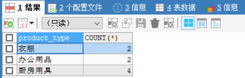

不进行分组：总共就8条记录

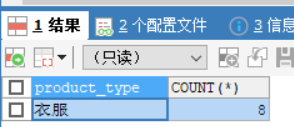

按照商品种类对表进行切分

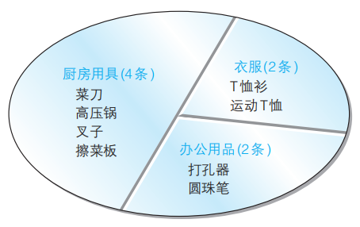

这样，GROUP BY 子句就像切蛋糕那样将表进行了分组。在 GROUP BY 子句中指定的列称为**聚合键**或者**分组列**。

### 

### 聚合键中包含NULL时

将进货单价（purchase_price）作为聚合键举例：

```sql
SELECT purchase_price, COUNT(*)
FROM product
GROUP BY purchase_price;
```
此时会将NULL作为一组特殊数据进行处理
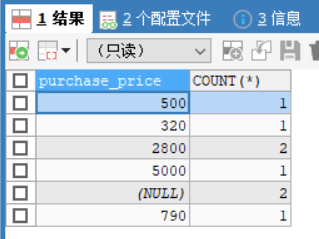

```sql
-- product_type不是分组列，即不是聚合键时，其显示的值为第一个purchase_price对应的product_type
SELECT purchase_price,product_type,COUNT(*)
FROM product
GROUP BY purchase_price;
```


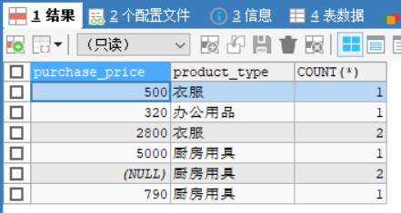

### GROUP BY书写位置

GROUP BY的子句书写顺序有严格要求，不按要求会导致SQL无法正常执行，目前出现过的子句顺序为：

书写顺序：**1. select→ 2. from→ 3.where→ 4.group by**

查询顺序： **1.FROM → 2.WHERE →  3.GROUP BY → 4.SELECT**

其中前三项用于筛选数据，**GROUP BY对筛选出的数据进行处理**

### 在WHERE子句中使用GROUP BY

```sql
SELECT purchase_price,product_type, COUNT(*)
FROM product
WHERE product_type = '衣服'
GROUP BY purchase_price;
```
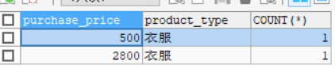

## 2.5.2 常见错误

在使用聚合函数及GROUP BY子句时，经常出现的错误有：

1. 在聚合函数的SELECT子句中写了聚合健以外的列，会出现错误。使用COUNT等聚合函数时，**SELECT子句中如果出现列名，只能是GROUP BY子句中指定的列名（也就是聚合键）。 **   
> 但尝试了发现没事。

```sql
SELECT purchase_price,product_type,COUNT(*)
FROM product
GROUP BY purchase_price;
```

- 按照purchase_price进行分组，product_type无法展示所有的，展示的为第一个。

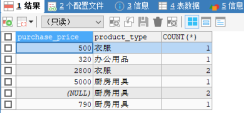

2. 在GROUP BY子句中不能使用列的别名。SELECT子句中可以通过AS来指定别名，但在GROUP BY中不能使用别名。因为在DBMS中 ,SELECT子句在GROUP BY子句后执行。

> - 在mysql中，group by中可以使用别名；where中不能使用别名；order by中可以使用别名。

```sql
-- 有别名问题
SELECT purchase_price  AS price, COUNT(*)
FROM product
WHERE product_type = '衣服'
GROUP BY price;
```

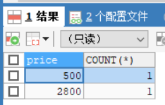

3. **在WHERE中不可以使用聚合函数。原因是聚合函数的使用前提是结果集已经确定，而WHERE还处于确定结果集的过程中，所以相互矛盾会引发错误。 如果想指定条件，可以在SELECT，HAVING（下面马上会讲）以及ORDER BY子句中使用聚合函数。**


# 2.6 为聚合结果指定条件

## 2.6.1 用HAVING得到特定分组

> 通过having子句，对GROUP BY分组，各个组进行条件过滤。
>
> **对聚合后的结果，再进行过滤。**
>
> 也就是说having子句依存于group by，有group by才能有having子句，有having子句必定有group by。

将表使用GROUP BY分组后，怎样才能只取出其中两组？


这里WHERE不可行，因为，WHERE子句只能指定记录（行）的条件，而不能用来指定组的条件（例如，“数据行数为 2 行”或者“平均值为 500”等）。

可以在GROUP BY后使用HAVING子句。

HAVING的用法类似WHERE

## 

## 2.6.2 HAVING特点

**1.FROM → 2.WHERE → 3.GROUP BY →4. HAVING → 5.SELECT**

**HAVING子句用于对分组进行过滤**，可以**使用数字、聚合函数和GROUP BY中指定的列名（聚合键）**。**where语句中不能使用聚合函数，因为聚合是发生在结果集确定之后，where进行处理时，仍是在进行结果集的筛选中。**

```sql
-- 数字
SELECT product_type, COUNT(*)
  FROM product
 GROUP BY product_type
HAVING COUNT(*) = 2;
-- 错误形式（因为product_name不包含在GROUP BY聚合键中）
SELECT product_type, COUNT(*)
  FROM product
 GROUP BY product_type
HAVING product_name = '圆珠笔';
/*错误代码： 1054
Unknown column 'product_name' in 'having clause'*/
```


# 2.7 对查询结果进行排序

## 2.7.1 ORDER BY

SQL中的执行结果是随机排列的，当需要按照特定顺序排序时，可已使用**ORDER BY**子句。

```sql
SELECT <列名1>, <列名2>, <列名3>, ……
  FROM <表名>
 ORDER BY <排序基准列1>, <排序基准列2>, ……
```
**默认为升序排列ASC，降序排列为DESC**

```sql
-- 降序排列
SELECT product_id, product_name, sale_price, purchase_price
FROM product
ORDER BY sale_price DESC;
-- 多个排序键
SELECT product_id, product_name, sale_price, purchase_price
FROM product
ORDER BY sale_price, product_id;
-- 当用于排序的列名中含有NULL时，NULL会在开头或末尾进行汇总。
SELECT product_id, product_name, sale_price, purchase_price
  FROM product
 ORDER BY purchase_price;
```
1. 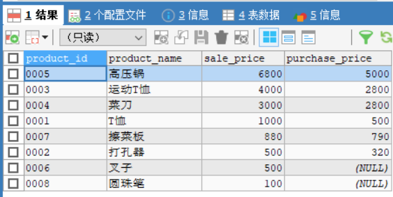
2. 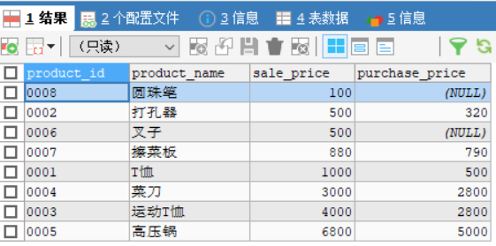
3. 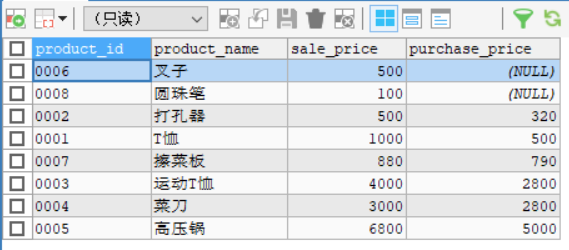

## 2.7.2 ORDER BY中列名可使用别名

前文讲GROUP BY中提到，GROUP BY 子句中不能使用SELECT 子句中定义的别名，但是在 ORDER BY 子句中却可以使用别名。为什么在GROUP BY中不可以而在ORDER BY中可以呢？

这是因为SQL在使用 HAVING 子句时 SELECT 语句的顺序为：

编写顺序：**SELECT → FROM → WHERE → GROUP BY → HAVING → ORDER BY→ limit。**

执行顺序：**FROM → WHERE → GROUP BY → HAVING → SELECT → ORDER BY → limit。**


其中SELECT的执行顺序在 GROUP BY 子句之后，ORDER BY 子句之前。也就是说，当在ORDER BY中使用别名时，已经知道了SELECT设置的别名存在，但是在GROUP BY中使用别名时还不知道别名的存在，所以**能在ORDER BY中可以使用别名，但是在GROUP BY中不能使用别名。**


执行顺序解析：

执行顺序：**FROM → WHERE → GROUP BY → HAVING → SELECT → ORDER BY → limit。**

1. 从哪个表中，满足where条件的内容
2. 得到的结果按照聚合键进行分组，并使用having子句对分组结果进行限定与过滤。
3. 选择出最终的结果集以及要展示的字段。
4. 使用order by，对最终结果进行排序，默认是asc即升序排列。
5. 对排序后的结果取有限条。

## 练习题-第二部分

### 2.5

请指出下述SELECT语句中所有的语法错误。

```sql
SELECT product id，SUM（product name）
--本SELECT语句中存在错误。
  FROM product 
 GROUP BY product_type 
 WHERE regist_date > '2009-09-01'；
```
```sql
-- 错误
1. 求和SUM聚合函数只可以用于数字，不能用于字符串类型
2. product id 与 product name 缺少下划线
3. select中只能出现聚合键（分组列）和聚合函数，不能出现非聚合键如product id
4. where语句应该在group by语句之前。
```


### 2.6

请编写 一条SELECT语句，求出销售单价（sale_price列）合计值是进货单价（purchase price列）合计值1.5倍的商品种类。执行结果如下所示。

```sql
product_type | sum  | sum 
-------------+------+------
衣服         | 5000 | 3300
办公用品      |  600 | 320
```


```sql
select product_type,sum(sale_price) as sum,sum(purchase_price) as sum
from product
group by product_type
having SUM(sale_price) > 1.5*SUM(purchase_price);
```


### 2.7

此前我们曾经使用SELECT语句选取出了product（商品）表中的全部记录。当时我们使用了ORDERBY子句来指定排列顺序，但现在已经无法记起当时如何指定的了。请根据下列执行结果，思考ORDERBY子句的内容。

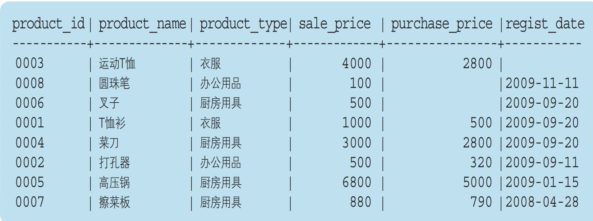

```sql
SELECT product_id, product_name, product_type, sale_price, purchase_price, regist_date
FROM product
ORDER BY -regist_date ASC,sale_price;
-- 使用了一个小技巧，通常按照regist_date进行从大到小DESC的进行排列时，NULL值在最下边，采用加负号，再从大到小的排列，则可将NULL值，排在最上边。
```

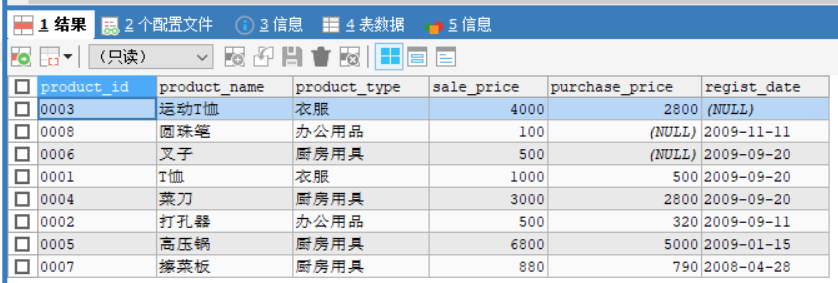

