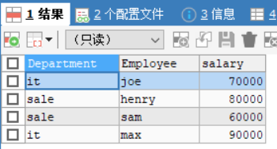
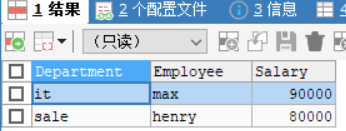

# 练习一: 各部门工资最高的员工（难度：中等）

创建Employee 表，包含所有员工信息，每个员工有其对应的 Id, salary 和 department Id。

```plain
+----+-------+--------+--------------+
| Id | Name  | Salary | DepartmentId |
+----+-------+--------+--------------+
| 1  | Joe   | 70000  | 1            |
| 2  | Henry | 80000  | 2            |
| 3  | Sam   | 60000  | 2            |
| 4  | Max   | 90000  | 1            |
+----+-------+--------+--------------+
```
```sql
CREATE TABLE employee(
	id INTEGER NOT NULL,
	NAME VARCHAR(30) NOT NULL,
	salary FLOAT,
	departmentid INTEGER NOT NULL,
	PRIMARY KEY(id)
);

INSERT INTO employee VALUES(1,'joe',70000,1),
(2,'henry',80000,2),(3,'sam',60000,2),(4,'max',90000,1);
```


创建Department 表，包含公司所有部门的信息。

```plain
+----+----------+
| Id | Name     |
+----+----------+
| 1  | IT       |
| 2  | Sales    |
+----+----------+
```
```sql
CREATE TABLE department(
	id INTEGER NOT NULL,
	NAME VARCHAR(30),
	PRIMARY KEY(id)
);
INSERT INTO department VALUES(1,'it'),(2,'sale');
```

编写一个 SQL 查询，找出每个部门工资最高的员工。例如，根据上述给定的表格，Max 在 IT 部门有最高工资，Henry 在 Sales 部门有最高工资。
```plain
+------------+----------+--------+
| Department | Employee | Salary |
+------------+----------+--------+
| IT         | Max      | 90000  |
| Sales      | Henry    | 80000  |
+------------+----------+--------+
```

- 错误1

```sql
-- 想的是直接利用内连接，进行分组，分组进行统计时，无法按照E.name和D.name共同分组，且
SELECT D.`name` AS Department,E.`name` AS Employee,MAX(E.`salary`) AS salary
FROM department AS D INNER JOIN employee AS E
ON E.`departmentid`=D.`id`
GROUP BY D.`name`,E.`name`;
```



> 思考： 
>
> ​	扩列使用内连接，也需要按照分组找到max的salary，且两项都是employee表的内容。
>
> 1.  在employee中分组，找到部门对应工资最高（无法直接找到最高的人），作为临时表EE
> 2. 使用自内连接，找到最高的人。最为临时表EEE
> 3. 再进行与department内连接，通过departmentid来得到department的name

- 正确方式

```sql
SELECT D.`name` AS Department,EEE.name AS Employee,EEE.max_salary AS Salary
FROM (SELECT E2.departmentid,EE.max_salary,E2.name
	FROM (
		SELECT E.`departmentid`,MAX(E.`salary`) AS max_salary
		FROM employee AS E
		GROUP BY E.`departmentid`) AS EE INNER JOIN employee AS E2
		ON E2.departmentid=EE.`departmentid` AND E2.salary=EE.max_salary) AS EEE
		INNER JOIN department AS D
		ON D.`id`=EEE.departmentid
		ORDER BY salary DESC;
```



# 练习二: 换座位（难度：中等）

小美是一所中学的信息科技老师，她有一张 seat 座位表，平时用来储存学生名字和与他们相对应的座位 id。

其中纵列的**id**是连续递增的

小美想改变相邻俩学生的座位。

你能不能帮她写一个 SQL query 来输出小美想要的结果呢？

请创建如下所示seat表：

**示例：**

```plain
+---------+---------+
|    id   | student |
+---------+---------+
|    1    | Abbot   |
|    2    | Doris   |
|    3    | Emerson |
|    4    | Green   |
|    5    | Jeames  |
+---------+---------+
```
假如数据输入的是上表，则输出结果如下：
```plain
+---------+---------+
|    id   | student |
+---------+---------+
|    1    | Doris   |
|    2    | Abbot   |
|    3    | Green   |
|    4    | Emerson |
|    5    | Jeames  |
+---------+---------+
```
**注意：**
如果学生人数是奇数，则不需要改变最后一个同学的座位。

> 思考：
>
> 可以通过分类别：奇数的id+1，偶数的id-1，最后一个为奇数时，不变。进行结果的union，并按照id进行排序。

```sql
CREATE TABLE IF NOT EXISTS seat(id INTEGER NOT NULL,student VARCHAR(20) NOT NULL,PRIMARY KEY(id));
TRUNCATE TABLE seat;
DROP TABLE seat;

INSERT INTO seat VALUES(1,'Abbot'),(2,'Doris'),(3,'Emerson'),(4,'Green'),(5,'Jeames');


-- 方法一：采用UNION的方式，对各个可能的结果进行分类处理后联合起来。
SELECT s.id,s.student
FROM (
	SELECT id+1 AS id,student FROM seat WHERE MOD(id,2)!=0 AND id!=(SELECT COUNT(*) FROM seat)
	UNION
	SELECT id-1 AS id,student FROM seat WHERE MOD(id,2)=0
	UNION
	SELECT id,student FROM seat WHERE id=(SELECT COUNT(*) FROM seat)
)AS s
ORDER BY s.id;


-- 方法2：使用CASE WHEN表达式，对最后一位不管是奇数还是偶数处理的都很好，推荐这种
SELECT (CASE
      WHEN MOD(id,2)!=0 AND id!=counts THEN id+1 -- 奇数
      WHEN MOD(id,2)!=0 AND id=counts THEN id -- 最后一位是奇数
      ELSE id-1 END)AS id,student -- 偶数
      FROM seat,(SELECT COUNT(*)AS counts FROM seat)AS seat_counts
ORDER BY id;
```


# 练习三:  分数排名（难度：中等）

编写一个 SQL 查询来实现分数排名。如果两个分数相同，则两个分数排名（Rank）相同。请注意，平分后的下一个名次应该是下一个连续的整数值。换句话说，名次之间不应该有“间隔”。

创建以下score表：

```plain
+----+-------+
| Id | Score |
+----+-------+
| 1  | 3.50  |
| 2  | 3.65  |
| 3  | 4.00  |
| 4  | 3.85  |
| 5  | 4.00  |
| 6  | 3.65  |
+----+-------+
```
例如，根据上述给定的 Score表，你的查询应该返回（按分数从高到低排列）：
```plain
+-------+------+
| Score | Rank |
+-------+------+
| 4.00  | 1    |
| 4.00  | 1    |
| 3.85  | 2    |
| 3.65  | 3    |
| 3.65  | 3    |
| 3.50  | 4    |
+-------+------+
```
> 思考：对分数进行排名，笨办法自连接，子查询，来确定每一个大于等于它的；也可以使用task05中的窗口函数，DENSE_RANK能够满足要求，不过要考虑parttion 和 order by

```sql
CREATE TABLE IF NOT EXISTS score(
	id INTEGER NOT NULL,
	score FLOAT NOT NULL,
	PRIMARY KEY(id)
);
TRUNCATE TABLE score;

INSERT INTO score VALUES(1,3.50),(2,3.65),(3,4.00),(4,3.85),(5,4.00),(6,3.65);


SELECT score,DENSE_RANK() OVER (ORDER BY score DESC) AS 'rank'
FROM score;
```

# 练习四：连续出现的数字（难度：中等）

编写一个 SQL 查询，查找所有至少连续出现三次的数字。

```plain
+----+-----+
| Id | Num |
+----+-----+
| 1  |  1  |
| 2  |  1  |
| 3  |  1  |
| 4  |  2  |
| 5  |  1  |
| 6  |  2  |
| 7  |  2  |
+----+-----+
```
例如，给定上面的 Logs 表， 1 是唯一连续出现至少三次的数字。
```plain
+-----------------+
| ConsecutiveNums |
+-----------------+
| 1               |
+-----------------+
```
> 思考：
>
> 	1. 笨办法，自连接三个
> 	2. 至少连续出现3次，可以考虑窗口？precding 和 following

```sql
CREATE TABLE IF NOT EXISTS LOGS (
	id INTEGER NOT NULL,
	num INTEGER NOT NULL,
	PRIMARY KEY(id)
);
TRUNCATE TABLE LOGS;
INSERT INTO LOGS VALUES(1,1),(2,1),(3,1),(4,2),(5,1),(6,2),(7,2);

-- 笨方法
SELECT DISTINCT(l1.`num`) AS ConsecutiveNums
FROM LOGS AS l1 INNER JOIN LOGS AS l2 INNER JOIN LOGS AS l3
WHERE l1.id=l2.`id`-1 AND l2.`id`=l3.`id`-1
AND l1.`num`=l2.`num` AND l2.`num`=l3.`num`;

-- 考虑固定长度的窗口
-- 出不来
```


# 练习五：树节点 （难度：中等）

对于**tree**表，*id*是树节点的标识，*p_id*是其父节点的*id*。

```plain
+----+------+
| id | p_id |
+----+------+
| 1  | null |
| 2  | 1    |
| 3  | 1    |
| 4  | 2    |
| 5  | 2    |
+----+------+
```
每个节点都是以下三种类型中的一种：
* Root: 如果节点是根节点。
* Leaf: 如果节点是叶子节点。
* Inner: 如果节点既不是根节点也不是叶子节点。

写一条查询语句打印节点id及对应的节点类型。按照节点id排序。上面例子的对应结果为：

```plain
+----+------+
| id | Type |
+----+------+
| 1  | Root |
| 2  | Inner|
| 3  | Leaf |
| 4  | Leaf |
| 5  | Leaf |
+----+------+
```
**说明**

* 节点’1’是根节点，因为它的父节点为NULL，有’2’和’3’两个子节点。
* 节点’2’是内部节点，因为它的父节点是’1’，有子节点’4’和’5’。
* 节点’3’，‘4’，'5’是叶子节点，因为它们有父节点但没有子节点。

下面是树的图形：

        1         
      /   \ 
     2    3    
    / \
    4  5

**注意**

如果一个树只有一个节点，只需要输出根节点属性。

> 思考：
>
> 两种思路：
>
> 1. 存在的三种类型，进行集合的union
>
> 2. 使用case语句进行分条件判断
>
> 2. 叶子节点
>
>    没有子节点的节点为叶子节点。故要找到t1  t2，t1 做本表，t2的父为t1，在其中筛选，找t2中没有父的，则为
>
> 

```sql
USE shop;

CREATE TABLE IF NOT EXISTS tree(
	id INTEGER,
	p_id INTEGER
);
TRUNCATE tree;

INSERT INTO tree VALUES(1,NULL),(2,1),(3,1),(4,2),(5,2);
SELECT * FROM tree;

-- 根节点查询 --
SELECT  id,  @Type := 'Root' AS Type 
FROM  tree WHERE  p_id IS NULL;

-- 内部节点查询 --
-- 内部节点：其父节点存在并且子节点也存在
SELECT  id,  @Type := 'Inner' AS Type
FROM  tree-- 
WHERE  id IN ( SELECT DISTINCT p_id FROM tree WHERE p_id IS NOT NULL )-- 作为父节点，有子
     AND p_id IN ( SELECT DISTINCT id FROM tree WHERE id IS NOT NULL );-- 作为子节点，有父
     
-- 叶子节点查询 --
SELECT  id,  @Type := 'Leaf' AS Type 
FROM  tree-- 节点不为父的节点
WHERE  id not in(SELECT DISTINCT p_id FROM tree WHERE p_id is not null);


-- 解法：case条件分支判断解决
SELECT  id,  (  CASE      WHEN p_id IS NULL THEN 'Root'       WHEN id NOT IN ( SELECT DISTINCT p_id FROM tree WHERE p_id IS NOT NULL ) THEN  'Leaf'      ELSE 'Inner'     END   ) AS Type FROM  tree;
```

- case条件分支判断

```sql
-- 解法：case条件分支判断解决
SELECT  id, (CASE   
WHEN p_id IS NULL THEN 'Root'       
WHEN id NOT IN ( SELECT DISTINCT p_id FROM tree WHERE p_id IS NOT NULL ) THEN  'Leaf'
ELSE 'Inner' END) AS TYPE
FROM  tree;
```


# 练习六：至少有五名直接下属的经理 （难度：中等）

**Employee1**表包含所有员工及其上级的信息。每位员工都有一个Id，并且还有一个对应主管的Id（ManagerId）。

```plain
+------+----------+-----------+----------+
|Id    |Name 	  |Department |ManagerId |
+------+----------+-----------+----------+
|101   |John 	  |A 	      |null      |
|102   |Dan 	  |A 	      |101       |
|103   |James 	  |A 	      |101       |
|104   |Amy 	  |A 	      |101       |
|105   |Anne 	  |A 	      |101       |
|106   |Ron 	  |B 	      |101       |
+------+----------+-----------+----------+
```
针对**Employee1**表，写一条SQL语句找出有5个下属的主管。对于上面的表，结果应输出：

```plain
+-------+
| Name  |
+-------+
| John  |
+-------+
```
**注意:**

没有人向自己汇报。

>思考：
>
>
>

```sql
-- 6
create table if not exists employee1(
	id integer,
	name varchar(20),
	department varchar(5),
	managerid integer
);
truncate table employee1;

desc employee1;
select * from employee1;

insert into employee1 values(101,'Jhon','A',null),
(102,'Dan','A',101),(103,'James','A',101),
(104,'Amy','A',101),(105,'Anne','A',101),
(106,'Ron','B',101);

select name as 'Name'
from employee1
where id = (select managerid
		from employee1
		group by managerid
		having count(managerid)=5);
```


# 练习七: 分数排名  （难度：中等）

练习三的分数表，实现排名功能，但是排名需要是非连续的，如下：

```plain
+-------+------+
| Score | Rank |
+-------+------+
| 4.00  | 1    |
| 4.00  | 1    |
| 3.85  | 3    |
| 3.65  | 4    |
| 3.65  | 4    |
| 3.50  | 6    |
+-------+------
```
> 思考：直接窗口函数即可
>

```sql
SELECT * FROM score;

SELECT score AS 'Score',RANK() OVER(ORDER BY score DESC) AS 'Rank'
FROM score;
```


# 练习八：查询回答率最高的问题 （难度：中等）

求出**survey_log**表中回答率最高的问题，表格的字段有：**uid, action, question_id, answer_id, q_num, timestamp**。

uid是用户id；action的值为：“show”， “answer”， “skip”；当action是"answer"时，answer_id不为空，相反，当action是"show"和"skip"时为空（null）；q_num是问题的数字序号。

写一条sql语句找出回答率最高的问题。

**举例：**

**输入**

| uid  | action | question_id  | answer_id  | q_num|timestamp  |
|:----|:----|:----|:----|:----|:----|
|5| show      |285| null       |1|123|
|5| answer    |285|124124|1|124|
|5| show      |369| null       |2|125|
|5| skip      |369| null       |2|126|

**输出**

|survey_log  |
|:----|
|285      |

**说明**

问题285的回答率为1/1，然而问题369的回答率是0/1，所以输出是285。

**注意：**最高回答率的意思是：同一个问题出现的次数中回答的比例。

> 求比率问题：
>
> (sum(case when `action` like 'answer' then 1 else 0 end) / sum(case when `action` like 'show' then 1 else 0 end)) as rate

```sql
select question_id as survey_log
from(
select (sum(case when `action` like 'answer' then 1 else 0 end) / sum(case when `action` is not null then 1 else 0 end)) as rate,question_id
from survey_log
group by question_id
order by rate desc
limit 1) as x;
```


# 练习九：各部门前3高工资的员工（难度：中等）

将项目1中的employee表清空，重新插入以下数据（其实是多插入5,6两行）：

```plain
+----+-------+--------+--------------+
| Id | Name  | Salary | DepartmentId |
+----+-------+--------+--------------+
| 1  | Joe   | 70000  | 1            |
| 2  | Henry | 80000  | 2            |
| 3  | Sam   | 60000  | 2            |
| 4  | Max   | 90000  | 1            |
| 5  | Janet | 69000  | 1            |
| 6  | Randy | 85000  | 1            |
+----+-------+--------+--------------+
```
编写一个 SQL 查询，找出每个部门工资前三高的员工。例如，根据上述给定的表格，查询结果应返回：
```plain
+------------+----------+--------+
| Department | Employee | Salary |
+------------+----------+--------+
| IT         | Max      | 90000  |
| IT         | Randy    | 85000  |
| IT         | Joe      | 70000  |
| Sales      | Henry    | 80000  |
| Sales      | Sam      | 60000  |
+------------+----------+--------+
```
此外，请考虑实现各部门前N高工资的员工功能。

> 思考：
>
> 每个部门工资前3高的员工
>
> 按部门分组进行查询，

[解析一道笔试题目：查找各个部门工资最高的前3名员工信息  —— 很全面，多种解法](https://blog.csdn.net/seagal890/article/details/83034768)

```sql
select * from employee;

insert into employee values(5,'janet',69000,1),
(6,'randy',85000,1);


select e2.* from(
select departmentid,name,salary,rank() over(partition by departmentid order by salary Desc) as 'rank'
from employee as e1
) as e2
where e2.rank in (1,2,3)

select * from department;

select d.name as 'Department',e3.name as 'Employee',salary as 'Salary'
from department as d inner join (
	SELECT e2.departmentid,e2.name,e2.salary 
	FROM(
		SELECT e1.departmentid,e1.name,e1.salary,RANK() OVER(PARTITION BY departmentid ORDER BY salary DESC) AS 'rank'
		FROM employee AS e1) AS e2
	WHERE e2.rank IN (1,2,3)) as e3
on e3.departmentid=d.`id`;
```

# 练习十：平面上最近距离 (难度: 困难）

**point_2d**表包含一个平面内一些点（超过两个）的坐标值（x，y）。

写一条查询语句求出这些点中的最短距离并保留2位小数。

```plain
|x   | y  |
|----|----|
| -1 | -1 |
|  0 |  0 |
| -1 | -2 |
```
最短距离是1，从点（-1，-1）到点（-1，2）。所以输出结果为：

| shortest |

1.00

```plain
+--------+
|shortest|
+--------+
|1.00    |
+--------+
```
**注意：**所有点的最大距离小于10000。

```sql
CREATE TABLE point_2d(
	X INTEGER,
	Y INTEGER
);
TRUNCATE TABLE point_2d;

INSERT INTO point_2d VALUES(-1,-1),
(0,0),(-1,-2);

SELECT * FROM point_2d;

SELECT * FROM point_2d AS p1

SELECT MIN(SQRT(POW(p1.x-p2.x,2)+POW(p1.y-p2.y,2))) AS shortest
FROM point_2d AS p1 INNER JOIN point_2d AS p2
ON p1.x <> p2.x OR p1.y <> p2.y;
```


# 练习十一：行程和用户（难度：困难）

Trips 表中存所有出租车的行程信息。每段行程有唯一键 Id，Client_Id 和 Driver_Id 是 Users 表中 Users_Id 的外键。Status 是枚举类型，枚举成员为 (‘completed’, ‘cancelled_by_driver’, ‘cancelled_by_client’)。

| Id | Client_Id | Driver_Id | City_Id |          Status      |Request_at|
|:----|:----|:----|:----|:----|:----|
|1|1|10|1|     completed      |2013-10-1|
|2|2|11|1| cancelled_by_driver|2013-10-1|
|3|3|12|6|     completed      |2013-10-1|
|4|4|13|6| cancelled_by_client|2013-10-1|
|5|1|10|1|     completed      |2013-10-2|
|6|2|11|6|     completed      |2013-10-2|
|7|3|12|6|     completed      |2013-10-2|
|8|2|12|12|     completed      |2013-10-3|
|9|3|10|12|     completed      |2013-10-3|
|10|4|13|12| cancelled_by_driver|2013-10-3|

Users 表存所有用户。每个用户有唯一键 Users_Id。Banned 表示这个用户是否被禁止，Role 则是一个表示（‘client’, ‘driver’, ‘partner’）的枚举类型。

```plain
+----------+--------+--------+
| Users_Id | Banned |  Role  |
+----------+--------+--------+
|    1     |   No   | client |
|    2     |   Yes  | client |
|    3     |   No   | client |
|    4     |   No   | client |
|    10    |   No   | driver |
|    11    |   No   | driver |
|    12    |   No   | driver |
|    13    |   No   | driver |
+----------+--------+--------+
```
写一段 SQL 语句查出**2013年10月1日**至**2013年10月3日**期间非禁止用户的取消率。基于上表，你的 SQL 语句应返回如下结果，取消率（Cancellation Rate）保留两位小数。
```plain
+------------+-------------------+
|     Day    | Cancellation Rate |
+------------+-------------------+
| 2013-10-01 |       0.33        |
| 2013-10-02 |       0.00        |
| 2013-10-03 |       0.50        |
+------------+-------------------+
```

> 求比率，可以考虑上边的求比率的例子。
>
> 先创建两个表，对任务进行分解。

```sql
CREATE TABLE trips(
	id INTEGER,
	client_id INTEGER,
	driver_id INTEGER,
	city_id INTEGER,
	STATUS VARCHAR(30),
	request_at DATE
);
TRUNCATE TABLE trips;


DESC trips;

INSERT INTO trips VALUES(1,1,10,1,'completed','2013-10-1'),
(2,2,11,1,'cancelled_by_driver','2013-10-1'),(3,3,12,6,'completed','2013-10-1'),
(4,4,13,6,'cancelled_by_client','2013-10-1'),(5,1,10,1,'completed','2013-10-2'),
(6,2,11,6,'completed','2013-10-2'),(7,3,12,6,'completed','2013-10-2'),
(8,2,12,12,'completed','2013-10-3'),(9,3,10,12,'completed','2013-10-3'),
(10,4,13,12,'cancelled_by_driver','2013-10-3');

SELECT * FROM trips;


CREATE TABLE users(
	user_id INTEGER,
	banned VARCHAR(5),
	ROLE ENUM('client','driver','partner')
);
TRUNCATE TABLE users;

INSERT INTO users VALUES(1,'No',1),
(2,'Yes',1),(3,'No',1),(4,'No',1),
(10,'No',2),(11,'No',2),(12,'No',2),
(13,'No',2);

DROP TABLE users;
SELECT * FROM users;

-- 查出2013年10月1日至2013年10月3日期间非禁止用户的取消率
-- 先查询出2013年10月1日至2013年10月3日的所有用户
-- 非禁止用户的数量  以及  非禁止用户的取消了的数量

SELECT t.`client_id`,t.`status`,t.`request_at`
FROM trips AS t
WHERE request_at BETWEEN '2013-10-1' AND '2013-10-3'


SELECT 
request_at AS 'Day',
ROUND(SUM(CASE WHEN t.status LIKE 'cancelled_%' THEN 1 ELSE 0 END)/COUNT(*),2) AS rate
FROM trips AS t
INNER JOIN users AS u
ON t.`client_id`=u.user_id AND u.banned='No'
GROUP BY request_at
```


