# Spring框架

**框架：**具有**约束性**的去**支撑**我们完成各种功能的半成品的项目！就像是骨架。

- 约束性：框架都有一套标准一套模式，我们要按照框架的约束去操作
- 支撑性：会封装java中的一些技术，从而有了支撑性
- 半成品：提供了简单的架子，但是缺少业务逻辑

框架+业务逻辑就是一个完整的项目！

>框架，即framework。其实就是某种应用的半成品，就是一组组件，供你选用完成你自己的系统。简单说就是使用别人搭好的舞台，你来做表演。而且，框架一般是成熟的，不断升级的软件。
>
>框架是对特定应用领域中的应用系统的部分设计和实现的整体结构。

MVC框架：struts1,struts2,SpringMVC

持久层框架：(全自动)hibernate，(半自动)mybatis

整合性框架/设计性框架：Spring

## 1.Spring概述

- Spring是一个开源框架  

- Spring为简化企业级开发而生，使用Spring，JavaBean就可以实现很多以前要靠EJB才能实现的功能。同样的功能，在EJB中要通过繁琐的配置和复杂的代码才能够实现，而在Spring中却非常的优雅和简洁。 

-  Spring是一个**IOC**(DI)和**AOP**容器框架。这是Spring的核心！

-  Spring的优良特性

​        ①  **非侵入式**：基于Spring开发的应用中的对象可以不依赖于Spring的API

​        ②  **依赖注入**：DI——Dependency Injection，反转控制(IOC)最经典的**实现**。

​        ③  **面向切面编程**：Aspect Oriented Programming——AOP，OOP面向对象编程。**AOP是对OOP进行补充!**

​        ④  **容器**：Spring是一个容器，因为它包含并且管理应用对象的生命周期

​        **⑤**  **组件化**：Spring实现了使用简单的组件配置组合成一个复杂的应用。在 Spring 中可以使用XML和Java注解组合这些对象。**Spring中的组件是指Spring管理的对象！**

​        **⑥** **一站式**：在IOC和AOP的基础上可以整合各种企业应用的开源框架和优秀的第三方类库（实际上Spring 自身也提供了表述层的SpringMVC和持久层的Spring JDBC），庞大的家族，提供从表现层到业务层，到持久层的全套解决方案！

**Spring的模块:**

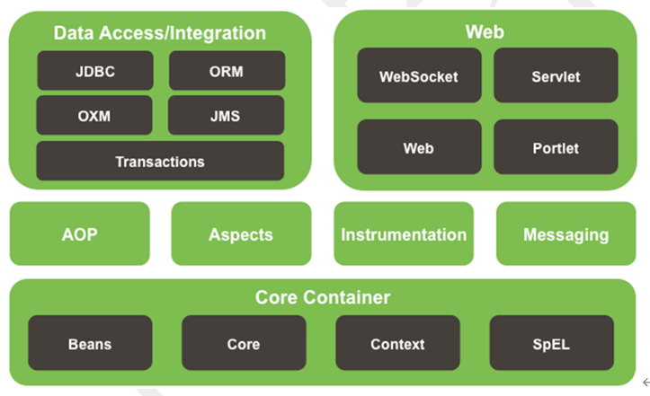

**Spring主要是为了降低程序与程序之间的关系，也就是低耦合！**

### 1.1 入门程序

**步骤：**

**!.导入jar包**

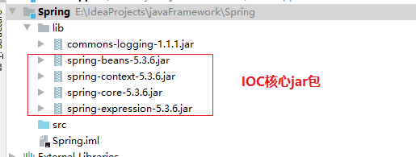

**2,创建实体类**

~~~java
package com.atguigu.spring;

public class Person {
    private Integer score;
    private String name;

    public Integer getScore() {
        return score;
    }

    public void setScore(Integer score) {
        this.score = score;
    }

    public String getName() {
        return name;
    }

    public void setName(String name) {
        this.name = name;
    }

    @Override
    public String toString() {
        return "Person{" +
                "score=" + score +
                ", name='" + name + '\'' +
                '}';
    }
}

~~~

**3.编写配置文件注册bean**

~~~xml
<?xml version="1.0" encoding="UTF-8"?>
<beans xmlns="http://www.springframework.org/schema/beans"
       xmlns:xsi="http://www.w3.org/2001/XMLSchema-instance"
       xsi:schemaLocation="http://www.springframework.org/schema/beans http://www.springframework.org/schema/beans/spring-beans.xsd">
     <!--
        bean标签：一个bean标签就代表Spring管理的一个对象！
        id：该对象的唯一标识,注意：不可以重复！！！！在通过类型获取1bean的过程中可以不设置id属性值！！！！
        class:对象是由类实例化产生的，class属性值就是创建对象的类的全限定名！此对象所属类的全限定名！
      -->
      <bean id="person" class="com.atguigu.spring.Person">
          <!--
             在bean标签中，我们以bean标签的子标签的形式对属性赋值！
          -->
          <property name="score" value="1111"></property>
          <property name="name" value="小明"></property>
      </bean>
</beans>
~~~

**4.代码测试**

~~~java
package com.atguigu.spring;

import org.springframework.context.ApplicationContext;
import org.springframework.context.support.ClassPathXmlApplicationContext;

public class Test {
    public static void main(String[] args) {
//        Person person  = new Person();
//        person.setName("张三");
//        person.setScore(1001);
//        System.out.println(person);
        /**
         * 我们现在需要将对象交给Spring管理，来实现解耦
         * 管理对象需要将对象配置在Spring的配置文件中！
         */
        // 1.初始化容器
        ApplicationContext ac = new ClassPathXmlApplicationContext("applicationContext.xml");
        // 2.通过getBean()方法获取对象
        Person bean =(Person)ac.getBean("person");
        System.out.println(bean);
    }
}
~~~

**注意：**

>1.**Spring的配置文件名常用applicationContext.xml**
>
>2.**Bean在创建ApplicationContext对象时一起创建Bean对象（默认）**
>
>3.**如果调用getBean多次，默认也只会创建同一个对象**

## 2.IOC容器和Bean的配置

**IOC(Inversion of Control)：反转控制**

==将我们原来对对象的控制权交给程序本身!让程序自己进行管理，不用关心对象是怎么创建出来的==

在应用程序中的组件需要获取资源时，传统的方式是组件主动的从容器中获取所需要的资源，在这样的模式下开发人员往往需要知道在具体容器中特定资源的获取方式，增加了学习成本，同时降低了开发效率。

反转控制的思想完全颠覆了应用程序组件获取资源的传统方式：反转了资源的获取方向——改由容器主动的将资源推送给需要的组件，开发人员不需要知道容器是如何创建资源对象的，只需要提供接收资源的方式即可，极大的降低了学习成本，提高了开发的效率。这种行为也称为查找的被动形式。

传统方式:  我想吃饭  我需要买菜做饭

反转控制:  我想吃饭  饭来张口 

**DI(Dependency Injection)：依赖注入**

==对象间的依赖关系也可以交给Spring管理==

==注入就是赋值==

IOC的另一种表述方式：即组件以一些预先定义好的方式(例如：setter 方法)接受来自于容器的资源注入。相对于IOC而言，这种表述更直接。

**总结: IOC 就是一种反转控制的思想， 而DI是对IOC的一种具体实现。**

### 2.1 IOC容器的层级结构

前提: Spring中有IOC思想，  IOC思想必须基于 IOC容器来完成， 而IOC容器在最底层实质上就是一个对象工厂.

1）在通过IOC容器读取Bean的实例之前，需要先将IOC容器本身实例化。

2）Spring提供了IOC容器的两种实现方式

① BeanFactory：IOC容器的基本实现，是Spring内部的基础设施，是面向Spring本身的，不是提供给开发人员使用的。

② ApplicationContext：BeanFactory的子接口，提供了更多高级特性。面向Spring的使用者，几乎所有场合都使用ApplicationContext而不是底层的BeanFactory。

#### 2.1.1ConfigurableApplicationContext

>是ApplicationContext的子接口，包含一些扩展方法
>
> refresh()和close()让ApplicationContext具有启动、关闭和刷新上下文的能力。

~~~java
package com.atguigu.spring;

import org.springframework.context.ApplicationContext;
import org.springframework.context.ConfigurableApplicationContext;
import org.springframework.context.support.ClassPathXmlApplicationContext;

public class Test {
    public static void main(String[] args) {
        /**
         * 我们现在需要将对象交给Spring管理，来实现解耦
         * 管理对象需要将对象配置在Spring的配置文件中！
         */
        // 1.初始化容器
        ConfigurableApplicationContext ac = new ClassPathXmlApplicationContext("applicationContext.xml");
        // 2.通过getBean()方法获取对象
        Person bean = ac.getBean("person",Person.class);
        System.out.println(bean);
        // refresh()和close()让ApplicationContext具有启动、关闭和刷新上下文的能力。
        ac.close();
    }
}
~~~

#### 2.1.2 ApplicationContext的主要实现类

-  ClassPathXmlApplicationContext：对应类路径下的XML格式的配置文件

- FileSystemXmlApplicationContext：对应文件系统中的XML格式的配置文件

- 在初始化时就创建单例的bean，也可以通过配置的方式指定创建的Bean是多实例的。

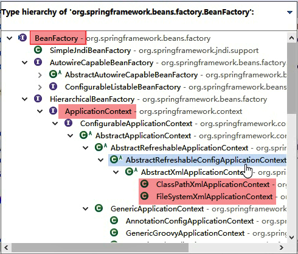

### 2.2 获取Bean的其他方式⭐

#### 2.2.1 getBean(Class<T> var1)

>我们还可以通过class属性获取bean：<T> T getBean(Class<T> var1)
>
>使用此方法获取对象时，要求Spring所管理的此类型的对象只能有一个！

~~~java
package com.atguigu.spring;

import org.springframework.context.ApplicationContext;
import org.springframework.context.support.ClassPathXmlApplicationContext;

public class Test {
    public static void main(String[] args) {
        /**
         * 我们现在需要将对象交给Spring管理，来实现解耦
         * 管理对象需要将对象配置在Spring的配置文件中！
         */
        // 1.初始化容器
        ApplicationContext ac = new ClassPathXmlApplicationContext("applicationContext.xml");
        // 2.通过getBean()方法获取对象
        /**
         * 1.如果找到一个，直接返回
         * 2.如果配置文件里面没有对应的类型，会抛出异常！
         * 3，如果配置了多个相同类型的bean，会抛出异常！
         */
        Person bean = ac.getBean(Person.class);
        System.out.println(bean);
    }
}
~~~

**注意：**

~~~shell
* 1.如果找到一个，直接返回
* 2.如果配置文件里面没有对应的类型，会抛出异常！NoSuchBeanDefinitionException
* 3.如果配置了多个相同类型的bean，会抛出异常！NoUniqueBeanDefinitionException
* 4.此时id属性值可以不设置！！！
~~~

#### 2.2.2 getBean(String var1, Class<T> var2)

>```
><T> T getBean(String var1, Class<T> var2)
>```

~~~java
package com.atguigu.spring;

import org.springframework.context.ApplicationContext;
import org.springframework.context.support.ClassPathXmlApplicationContext;

public class Test {
    public static void main(String[] args) {
        /**
         * 我们现在需要将对象交给Spring管理，来实现解耦
         * 管理对象需要将对象配置在Spring的配置文件中！
         */
        // 1.初始化容器
        ApplicationContext ac = new ClassPathXmlApplicationContext("applicationContext.xml");
        // 2.通过getBean()方法获取对象
        Person bean = ac.getBean("person",Person.class);
        System.out.println(bean);
    }
}
~~~

### 2.3 给bean的属性赋值⭐

#### 2.3.1 set方法注入🌙

>```
>property子标签:通过调用setXxx()方法给bean属性赋值
>此时需要有getter/setter方法
>```

**实体类**

~~~java
package com.atguigu.spring;

public class Student {
    private Integer id;
    private String name;
    private Integer age;
    private String sex;

    public Integer getId() {
        return id;
    }

    public void setId(Integer id) {
        this.id = id;
    }

    public String getName() {
        return name;
    }

    public void setName(String name) {
        this.name = name;
    }

    public Integer getAge() {
        return age;
    }

    public void setAge(Integer age) {
        this.age = age;
    }

    public String getSex() {
        return sex;
    }

    public void setSex(String sex) {
        this.sex = sex;
    }

    @Override
    public String toString() {
        return "Student{" +
                "id=" + id +
                ", name='" + name + '\'' +
                ", age=" + age +
                ", sex='" + sex + '\'' +
                '}';
    }
}

~~~

**配置文件**

~~~xml
<?xml version="1.0" encoding="UTF-8"?>
<beans xmlns="http://www.springframework.org/schema/beans"
       xmlns:xsi="http://www.w3.org/2001/XMLSchema-instance"
       xsi:schemaLocation="http://www.springframework.org/schema/beans http://www.springframework.org/schema/beans/spring-beans.xsd">
     <!--
        bean标签：一个bean标签就代表Spring管理的一个对象！
        id：唯一标识,不可以重复！！！！
        class:对象是由类实例化产生的，class属性值就是创建对象的类的全限定名！
      -->
    <bean id="s1" class="com.atguigu.spring.Student">
        <!--
        property:通过调用setXxx()方法给属性赋值
            name:属性值。实际上看的是set方法去掉set首字母小写后的字段
            value:属性值的赋值
        -->
        <property name="id" value="10010"></property>
        <property name="name" value="张三"></property>
        <property name="age" value="23"></property>
        <property name="sex" value="男"></property>
    </bean>

</beans>
~~~

**测试**

~~~java
package com.atguigu.spring;

import org.springframework.context.ApplicationContext;
import org.springframework.context.support.ClassPathXmlApplicationContext;

public class Test {
    public static void main(String[] args) {
        // 1.初始化容器
        ApplicationContext ac = new ClassPathXmlApplicationContext("applicationContext.xml");
        // 2.通过getBean()方法获取对象
        Student s1 = ac.getBean("s1", Student.class);
        System.out.println(s1);
    }
}

~~~

#### 2.3.2 构造器注入

>```
>constructor-arg子标签就是通过调用构造器给bean的属性赋值
>此时需要有构造器
>```

==构造器注入有一个严格的要求：必须要有匹配的构造器==

**实体类**

~~~java
package com.atguigu.spring;

public class Student {
    private Integer id;
    private String name;
    private Integer age;
    private String sex;

    public Integer getId() {
        return id;
    }

    public void setId(Integer id) {
        this.id = id;
    }

    public String getName() {
        return name;
    }

    public void setName(String name) {
        this.name = name;
    }

    public Integer getAge() {
        return age;
    }

    public void setAge(Integer age) {
        this.age = age;
    }

    public String getSex() {
        return sex;
    }

    public void setSex(String sex) {
        this.sex = sex;
    }

    @Override
    public String toString() {
        return "Student{" +
                "id=" + id +
                ", name='" + name + '\'' +
                ", age=" + age +
                ", sex='" + sex + '\'' +
                '}';
    }

    public Student() {
    }

    public Student(Integer id, String name, Integer age, String sex) {
        this.id = id;
        this.name = name;
        this.age = age;
        this.sex = sex;
    }
}

~~~

**配置文件**

##### 按照构造器参数名给属性赋值

~~~xml
<?xml version="1.0" encoding="UTF-8"?>
<beans xmlns="http://www.springframework.org/schema/beans"
       xmlns:xsi="http://www.w3.org/2001/XMLSchema-instance"
       xsi:schemaLocation="http://www.springframework.org/schema/beans http://www.springframework.org/schema/beans/spring-beans.xsd">
     <!--
        bean标签：一个bean标签就代表Spring管理的一个对象！
        id：唯一标识,不可以重复！！！！
        class:对象是由类实例化产生的，class属性值就是创建对象的类的全限定名！
      -->
    <bean id="s1" class="com.atguigu.spring.Student">
        <!--
           constructor-arg子标签：
             表示使用有参构造器赋值属性
             调用构造器给bean的属性赋值，可以自动匹配实体类中相对应的构造方法
           常用属性：
              index:索引
              name：构造方法的参数名
              ref引用
              type:类型
              value:参数值
        -->
     <!--
      public Student(Integer id, String name, Integer age, String sex)
     -->
        <constructor-arg name="id" value="10086" ></constructor-arg>
        <constructor-arg name="name" value="李四"></constructor-arg>
        <constructor-arg name="age" value="24"></constructor-arg>
        <constructor-arg name="sex" value="男"></constructor-arg>
    </bean>

</beans>
~~~

##### 按照构造器参数顺序给属性赋值 index属性

~~~xml
<?xml version="1.0" encoding="UTF-8"?>
<beans xmlns="http://www.springframework.org/schema/beans"
       xmlns:xsi="http://www.w3.org/2001/XMLSchema-instance"
       xsi:schemaLocation="http://www.springframework.org/schema/beans http://www.springframework.org/schema/beans/spring-beans.xsd">
     <!--
        bean标签：一个bean标签就代表Spring管理的一个对象！
        id：唯一标识,不可以重复！！！！
        class:对象是由类实例化产生的，class属性值就是创建对象的类的全限定名！
      -->
    <bean id="s1" class="com.atguigu.spring.Student">
        <!--
           constructor-arg子标签：
             表示使用有参构造器赋值属性
             调用构造器给bean的属性赋值，可以自动匹配实体类中相对应的构造方法
           常用属性：
              index:表示参数的索引位置, 0表示第一个参数位置
              name：构造方法的参数名
              ref引用
              type:类型
              value:参数值
        -->
     <!--
      public Student(Integer id, String name, Integer age, String sex)
     -->
        <constructor-arg index="1" value="李四"></constructor-arg>
        <constructor-arg index="3" value="男"></constructor-arg>
        <constructor-arg index="2" value="18"></constructor-arg>
        <constructor-arg index="0" value="10086" ></constructor-arg>
    </bean>

</beans>
~~~

##### 按照构造器参数类型给属性赋值 type属性

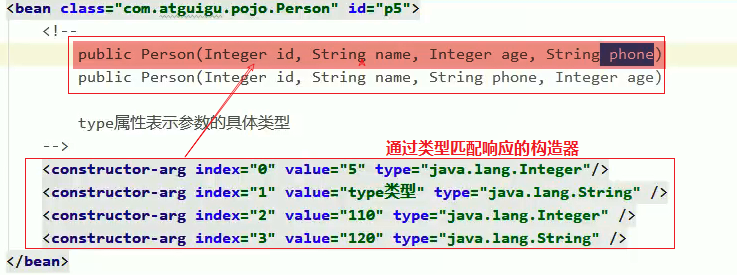

~~~xml
<?xml version="1.0" encoding="UTF-8"?>
<beans xmlns="http://www.springframework.org/schema/beans"
       xmlns:xsi="http://www.w3.org/2001/XMLSchema-instance"
       xsi:schemaLocation="http://www.springframework.org/schema/beans http://www.springframework.org/schema/beans/spring-beans.xsd">
     <!--
        bean标签：一个bean标签就代表Spring管理的一个对象！
        id：唯一标识,不可以重复！！！！
        class:对象是由类实例化产生的，class属性值就是创建对象的类的全限定名！
      -->
    <bean id="s1" class="com.atguigu.spring.Student">
        <!--
           constructor-arg子标签：
             表示使用有参构造器赋值属性
             调用构造器给bean的属性赋值，可以自动匹配实体类中相对应的构造方法
           常用属性：
              index:表示参数的索引位置, 0表示第一个参数位置
              name：构造方法的参数名
              ref引用
              type:参数的类型，当有多个有参构造，可以通过这个属性区分！
              value:参数值
        -->
     <!--
      public Student(Integer id, String name, Integer age, String sex)
     -->
        <constructor-arg  value="1" type="java.lang.Integer"></constructor-arg>
        <constructor-arg  value="慕容晓晓" type="java.lang.String"></constructor-arg>
        <constructor-arg  value="18" type="java.lang.Integer"></constructor-arg>
        <constructor-arg  value="男" type="java.lang.String"></constructor-arg>
    </bean>

</beans>
~~~

**测试**

~~~java
package com.atguigu.spring;

import org.springframework.context.ApplicationContext;
import org.springframework.context.support.ClassPathXmlApplicationContext;

public class Test {
    public static void main(String[] args) {
        // 1.初始化容器
        ApplicationContext ac = new ClassPathXmlApplicationContext("applicationContext.xml");
        // 2.通过getBean()方法获取对象
        Student s1 = ac.getBean("s1", Student.class);
        System.out.println(s1);
    }
}
~~~

#### 2.3.3 p名称空间🌙

使用p命名空间后，基于XML的配置方式将进一步简化。

**注意：使用p命名空间需要先引入此命名空间**

~~~xml
xmlns:p="http://www.springframework.org/schema/p"
~~~

~~~xml
<?xml version="1.0" encoding="UTF-8"?>
<beans xmlns="http://www.springframework.org/schema/beans"
       xmlns:xsi="http://www.w3.org/2001/XMLSchema-instance"
       xmlns:p="http://www.springframework.org/schema/p"
       xsi:schemaLocation="http://www.springframework.org/schema/beans
       http://www.springframework.org/schema/beans/spring-beans.xsd">
     <!--
        bean标签：一个bean标签就代表Spring管理的一个对象！
        id：唯一标识,不可以重复！！！！
        class:对象是由类实例化产生的，class属性值就是创建对象的类的全限定名！
      -->
    <bean id="s1" class="com.atguigu.spring.Student" p:id="10033" p:name="张小凡" p:age="26" p:sex="妖">
    </bean>

</beans>
~~~

#### 2.3.4可以使用的值⭐

>指的是给属性赋值可以使用的值

##### 2.3.4.1  给属性赋值为null

~~~xml
<?xml version="1.0" encoding="UTF-8"?>
<beans xmlns="http://www.springframework.org/schema/beans"
       xmlns:xsi="http://www.w3.org/2001/XMLSchema-instance"
       xsi:schemaLocation="http://www.springframework.org/schema/beans
       http://www.springframework.org/schema/beans/spring-beans.xsd">
     <!--
        bean标签：一个bean标签就代表Spring管理的一个对象！
        id：唯一标识,不可以重复！！！！
        class:对象是由类实例化产生的，class属性值就是创建对象的类的全限定名！
      -->
    <bean id="s1" class="com.atguigu.spring.Student" >
        <property name="id" value="10010"></property>
        <property name="name" value="张三"></property>
        <property name="age" value="23"></property>
        <property name="sex">
            <!-- null表示赋值为null-->
            <null></null>
        </property>
    </bean>

</beans>
~~~

##### 2.3.4.2  字面量

能够将这个值写成字符串的方式的就是字面量，包括：

- 可以使用字符串表示的值，可以通过value属性或value子节点的方式指定

- 基本数据类型及其封装类、String等类型都可以采取字面值注入的方式

- 若字面值中包含特殊字符，可以使用<![CDATA[]]>把字面值包裹起来

==只有String,基本数据类型及其包装类可以使用字面量赋值，也就是使用value属性赋值==

##### 2.3.4.3 ref属性给引用数据类型的属性赋值 🌙

>引用当前Spring所管理的范围之内的bean，给其他bean的引用数据类型属性赋值，它的值为bean的id

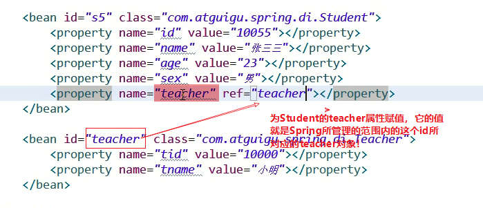

#### 2.3.5 内部bean给属性赋值

==我们也可以通过内部bean给引用数据类型的属性赋值==

当bean实例仅仅给一个特定的属性使用时，可以将其声明为内部bean。内部bean声明直接包含在<property>或<constructor-arg>元素里，不需要设置任何id或name属性

**内部bean不能使用在任何其他地方，在谁的内部定义的bean,这个bean就只属于谁**

~~~java
package com.atguigu.spring;

public class Teacher {
    private String name ;
    private int age;

    public String getName() {
        return name;
    }

    public void setName(String name) {
        this.name = name;
    }

    public int getAge() {
        return age;
    }

    public void setAge(int age) {
        this.age = age;
    }

    @Override
    public String toString() {
        return "Teacher{" +
                "name='" + name + '\'' +
                ", age=" + age +
                '}';
    }
}

~~~

~~~java
package com.atguigu.spring;

public class Student {
    private  Integer id;
    private String name;
    private Integer score;
    private String sex;
    private Teacher teacher;

    public Integer getId() {
        return id;
    }

    public void setId(Integer id) {
        this.id = id;
    }

    public String getName() {
        return name;
    }

    public void setName(String name) {
        this.name = name;
    }

    public Integer getScore() {
        return score;
    }

    public void setScore(Integer score) {
        this.score = score;
    }

    public String getSex() {
        return sex;
    }

    public void setSex(String sex) {
        this.sex = sex;
    }

    public Teacher getTeacher() {
        return teacher;
    }

    public void setTeacher(Teacher teacher) {
        this.teacher = teacher;
    }

    @Override
    public String toString() {
        return "Student{" +
                "id=" + id +
                ", name='" + name + '\'' +
                ", score=" + score +
                ", sex='" + sex + '\'' +
                ", teacher=" + teacher +
                '}';
    }
}

~~~

**配置文件**

~~~xml
<?xml version="1.0" encoding="UTF-8"?>
<beans xmlns="http://www.springframework.org/schema/beans"
       xmlns:xsi="http://www.w3.org/2001/XMLSchema-instance"
       xsi:schemaLocation="http://www.springframework.org/schema/beans
       http://www.springframework.org/schema/beans/spring-beans.xsd">
     <!--
        bean标签：一个bean标签就代表Spring管理的一个对象！
        id：唯一标识,不可以重复！！！！
        class:对象是由类实例化产生的，class属性值就是创建对象的类的全限定名！
      -->
     <bean id="student" class="com.atguigu.spring.Student">
         <property name="id" value="1" ></property>
         <property name="name" value="张三" ></property>
         <property name="score" value="90" ></property>
         <property name="sex" value="男" ></property>
         <property name="teacher">
             <!--
              这里使用了内部bean给属性赋值
              注意：内部bean只能赋值使用，无法通过Spring的容器直接获取！
              定义在某个bean内部的bean，只能在当前bean中使用
             -->

             <bean class="com.atguigu.spring.Teacher" id="t1">
                 <property name="age" value="100"> </property>
                 <property name="name" value="史记怀"> </property>
             </bean>
         </property>
     </bean>

</beans>
~~~

>**内部bean只能赋值使用，无法通过Spring的容器直接获取！**

#### 2.3.6 给级联属性赋值 🌙

>前提是先给属性对象赋值！！！

**实体类**

~~~java
package com.atguigu.spring;

public class Teacher {
    private String name ;
    private int age;

    public String getName() {
        return name;
    }

    public void setName(String name) {
        this.name = name;
    }

    public int getAge() {
        return age;
    }

    public void setAge(int age) {
        this.age = age;
    }

    @Override
    public String toString() {
        return "Teacher{" +
                "name='" + name + '\'' +
                ", age=" + age +
                '}';
    }
}

~~~

~~~java
package com.atguigu.spring;

public class Student {
    private  Integer id;
    private String name;
    private Integer score;
    private String sex;
    private Teacher teacher;

    public Integer getId() {
        return id;
    }

    public void setId(Integer id) {
        this.id = id;
    }

    public String getName() {
        return name;
    }

    public void setName(String name) {
        this.name = name;
    }

    public Integer getScore() {
        return score;
    }

    public void setScore(Integer score) {
        this.score = score;
    }

    public String getSex() {
        return sex;
    }

    public void setSex(String sex) {
        this.sex = sex;
    }

    public Teacher getTeacher() {
        return teacher;
    }

    public void setTeacher(Teacher teacher) {
        this.teacher = teacher;
    }

    @Override
    public String toString() {
        return "Student{" +
                "id=" + id +
                ", name='" + name + '\'' +
                ", score=" + score +
                ", sex='" + sex + '\'' +
                ", teacher=" + teacher +
                '}';
    }
}

~~~

**配置文件**

~~~xml
<?xml version="1.0" encoding="UTF-8"?>
<beans xmlns="http://www.springframework.org/schema/beans"
       xmlns:xsi="http://www.w3.org/2001/XMLSchema-instance"
       xsi:schemaLocation="http://www.springframework.org/schema/beans
       http://www.springframework.org/schema/beans/spring-beans.xsd">
     <!--
        bean标签：一个bean标签就代表Spring管理的一个对象！
        id：唯一标识,不可以重复！！！！
        class:对象是由类实例化产生的，class属性值就是创建对象的类的全限定名！
      -->
     <bean id="student" class="com.atguigu.spring.Student">
         <property name="id" value="1" ></property>
         <property name="name" value="张三" ></property>
         <property name="score" value="90" ></property>
         <property name="sex" value="男" ></property>
         <property name="teacher" ref="teacher"></property>
         <!--
           给级联属性赋值
           前提：需要先给属性teacher赋值
           效果：此时的name属性值从承集秀变为邓平锅
          -->
           <property name="teacher.name" value="邓平锅"></property>
     </bean>
     <bean id="teacher" class="com.atguigu.spring.Teacher">
         <property name="age" value="100"></property>
         <property name="name" value="承集秀"></property>
     </bean>

</beans>
~~~

**测试代码**

~~~java
package com.atguigu.spring;

import org.springframework.context.ApplicationContext;
import org.springframework.context.support.ClassPathXmlApplicationContext;

public class Test {
    public static void main(String[] args) {
        // 1.初始化容器
        ApplicationContext ac = new ClassPathXmlApplicationContext("applicationContext.xml");
        // 2.通过getBean()方法获取对象
        Student s1 = ac.getBean("student", Student.class);
        System.out.println(s1);
        System.out.println(s1.getSex().length());
    }
}
------------------------------------------------------------------------------
Student{id=1, name='张三', score=90, sex='男', teacher=Teacher{name='邓平锅', age=100}}
1
~~~

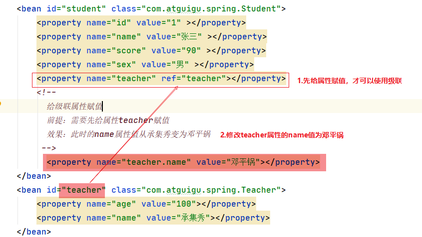

#### 2.3.7 给集合属性赋值🌙

##### 2.3.7.1 list集合

配置java.util.List类型的属性，需要指定<list>标签，在标签里包含一些元素。这些标签  可以通过<value>指定简单的常量值，通过<ref>指定对其他Bean的引用。通过<bean>指定内置bean定义。通过<null/>指定空元素。甚至可以内嵌其他集合。

​     数组的定义和List一样，都使用<list>元素。

​     配置java.util.Set需要使用<set>标签，定义的方法与List一样。

**实体类**

~~~java
package com.atguigu.spring;

import java.util.List;

public class Teacher {
    private String name ;
    private int age;
    private List<String> list;

    public List<String> getList() {
        return list;
    }

    public void setList(List<String> list) {
        this.list = list;
    }

    public String getName() {
        return name;
    }

    public void setName(String name) {
        this.name = name;
    }

    public int getAge() {
        return age;
    }

    public void setAge(int age) {
        this.age = age;
    }

    @Override
    public String toString() {
        return "Teacher{" +
                "name='" + name + '\'' +
                ", age=" + age +
                ", list=" + list +
                '}';
    }
}

~~~

**配置文件**

~~~xml
<?xml version="1.0" encoding="UTF-8"?>
<beans xmlns="http://www.springframework.org/schema/beans"
       xmlns:xsi="http://www.w3.org/2001/XMLSchema-instance"
       xsi:schemaLocation="http://www.springframework.org/schema/beans
       http://www.springframework.org/schema/beans/spring-beans.xsd">
     <!--
        bean标签：一个bean标签就代表Spring管理的一个对象！
        id：唯一标识,不可以重复！！！！
        class:对象是由类实例化产生的，class属性值就是创建对象的类的全限定名！
      -->
    <bean id="teacher" class="com.atguigu.spring.Teacher">
        <property name="age" value="120"></property>
        <property name="name" value="张三丰"></property>
        <property name="list">
            <list>
                <value>A</value>
                <value>B</value>
                <value>C</value>
            </list>
        </property>
    </bean>

</beans>
~~~

**测试代码**

~~~java
package com.atguigu.spring;

import org.springframework.context.ApplicationContext;
import org.springframework.context.support.ClassPathXmlApplicationContext;

public class Test {
    public static void main(String[] args) {
        // 1.初始化容器
        ApplicationContext ac = new ClassPathXmlApplicationContext("applicationContext.xml");
        // 2.通过getBean()方法获取对象
        Teacher s1 = ac.getBean("teacher", Teacher.class);
        System.out.println(s1);
    }
}
--------------------------------------------------------------------------------
Teacher{name='张三丰', age=120, list=[A, B, C]}    
~~~

类似的：

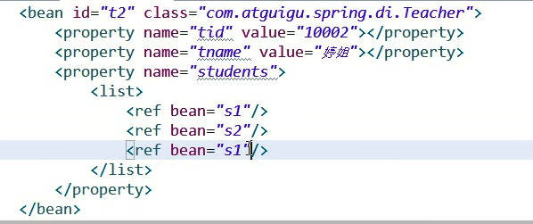

##### 2.3.7.2 map集合

>通过map标签来给map属性赋值：表示赋值类型是一个map集合
>
>entry表示一个键值对，这里面标签很多，写法多样！
>
>```
><map>
>    <entry key="" value=""></entry>
>    <entry key-ref="" value-ref=""></entry>
></map>
>```

Java.util.Map通过<map>标签定义，<map>标签里可以使用多个<entry>作为子标签。每个条目包含一个键和一个值。

​     必须在<key>标签里定义键。

​     因为键和值的类型没有限制，所以可以自由地为它们指定<value>、<ref>、<bean>或<null/>元素。

​     可以将Map的键和值作为<entry>的属性定义：简单常量使用key和value来定义；bean引用通过key-ref和value-ref属性定义。

**实体类**

~~~java
package com.atguigu.spring;

import java.util.Map;

public class Teacher {
    private String name ;
    private int age;
    private Map<String,String> map;

    public String getName() {
        return name;
    }

    public void setName(String name) {
        this.name = name;
    }

    public int getAge() {
        return age;
    }

    @Override
    public String toString() {
        return "Teacher{" +
                "name='" + name + '\'' +
                ", age=" + age +
                ", map=" + map +
                '}';
    }

    public Map<String, String> getMap() {
        return map;
    }

    public void setMap(Map<String, String> map) {
        this.map = map;
    }

    public void setAge(int age) {
        this.age = age;
    }

}

~~~

**配置文件**

~~~xml
<?xml version="1.0" encoding="UTF-8"?>
<beans xmlns="http://www.springframework.org/schema/beans"
       xmlns:xsi="http://www.w3.org/2001/XMLSchema-instance"
       xsi:schemaLocation="http://www.springframework.org/schema/beans
       http://www.springframework.org/schema/beans/spring-beans.xsd">
     <!--
        bean标签：一个bean标签就代表Spring管理的一个对象！
        id：唯一标识,不可以重复！！！！
        class:对象是由类实例化产生的，class属性值就是创建对象的类的全限定名！
      -->
    <bean id="teacher" class="com.atguigu.spring.Teacher">
        <property name="age" value="120"></property>
        <property name="name" value="张三丰"></property>
        <property name="map" >
            <map>
                <!--
                entry:代表一个map集合中的一组键值对
                -->
                <entry>
                    <key>
                        <value>1001</value>
                    </key>
                    <value>杨付超</value>
                </entry>
                <entry>
                    <key>
                        <value>1002</value>
                    </key>
                    <value>崔尚斌</value>
                </entry>
            </map>
        </property>
    </bean>

</beans>
~~~

##### 2.3.7.3 util名称空间

==定义公共的集合去引用同时这个集合还可以通过容器的方式去获取==

>util名称空间可以用来定义一个外部的集合，方便对象去引用！！！！
>
>使用util名称空间需要先引入util名称空间，类似于p名称空间
>
>```
><?xml version="1.0" encoding="UTF-8"?>
><beans xmlns="http://www.springframework.org/schema/beans"
>       xmlns:xsi="http://www.w3.org/2001/XMLSchema-instance" 
>       xmlns:util="http://www.springframework.org/schema/util"
>       xsi:schemaLocation="http://www.springframework.org/schema/beans
>       http://www.springframework.org/schema/beans/spring-beans.xsd http://www.springframework.org/schema/util 
>       https://www.springframework.org/schema/util/spring-util.xsd">
></bean>
>```

**实体类**

~~~java
package com.atguigu.spring;

import java.util.Map;

public class Teacher {
    private String name ;
    private int age;
    private Map<String,String> map;

    public String getName() {
        return name;
    }

    public void setName(String name) {
        this.name = name;
    }

    public int getAge() {
        return age;
    }

    @Override
    public String toString() {
        return "Teacher{" +
                "name='" + name + '\'' +
                ", age=" + age +
                ", map=" + map +
                '}';
    }

    public Map<String, String> getMap() {
        return map;
    }

    public void setMap(Map<String, String> map) {
        this.map = map;
    }

    public void setAge(int age) {
        this.age = age;
    }

}

~~~

**配置文件**

~~~xml
<?xml version="1.0" encoding="UTF-8"?>
<beans xmlns="http://www.springframework.org/schema/beans"
       xmlns:xsi="http://www.w3.org/2001/XMLSchema-instance"
       xmlns:util="http://www.springframework.org/schema/util"
       xsi:schemaLocation="http://www.springframework.org/schema/beans
       http://www.springframework.org/schema/beans/spring-beans.xsd http://www.springframework.org/schema/util
       https://www.springframework.org/schema/util/spring-util.xsd">
     <!--
        bean标签：一个bean标签就代表Spring管理的一个对象！
        id：唯一标识,不可以重复！！！！
        class:对象是由类实例化产生的，class属性值就是创建对象的类的全限定名！
      -->
    <bean id="teacher" class="com.atguigu.spring.Teacher">
        <property name="age" value="120"></property>
        <property name="name" value="张三丰"></property>
        <property name="map" ref="map01"></property>
    </bean>
    <!--
      定义公共的集合去引用！
      同时这个集合还可以通过容器的方式去获取
     -->
    <util:map id="map01">
        <entry>
            <key>
                <value>01</value>
            </key>
            <value>hehe</value>
        </entry>
        <entry key="02" value="haha"></entry>
    </util:map>

</beans>
~~~

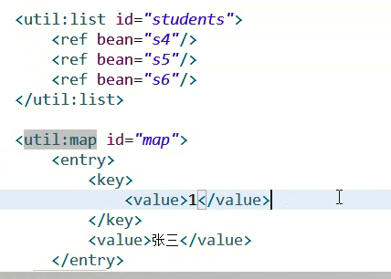

### 2.4 一些高 级知识点⭐

#### 2.4.1 与自己的工厂整合

##### 整合原有静态工厂：通过静态方法创建对象

>假如自己原来写了一个静态工厂，他的静态方法用来创建对象用，怎么整合到Spring中

**实体类**

~~~java
package com.atguigu.spring;

public class Person {
    private String name;
    private Integer age;

    public Person(String name, Integer age) {
        this.name = name;
        this.age = age;
    }

    public Person(String name) {
        this.name = name;
    }

    public String getName() {
        return name;
    }

    public void setName(String name) {
        this.name = name;
    }

    public Integer getAge() {
        return age;
    }

    public void setAge(Integer age) {
        this.age = age;
    }

    @Override
    public String toString() {
        return "Person{" +
                "name='" + name + '\'' +
                ", age=" + age +
                '}';
    }
}

~~~

**原有静态工厂类**

~~~java
package com.atguigu.spring;

public class PersonFactory {
    public static Person create(){
        return new Person("张三",12);
    }
}

~~~

**将静态工厂类整合到Spring中**

~~~xml
<?xml version="1.0" encoding="UTF-8"?>
<beans xmlns="http://www.springframework.org/schema/beans"
       xmlns:xsi="http://www.w3.org/2001/XMLSchema-instance"
       xmlns:util="http://www.springframework.org/schema/util"
       xsi:schemaLocation="http://www.springframework.org/schema/beans
       http://www.springframework.org/schema/beans/spring-beans.xsd http://www.springframework.org/schema/util
       https://www.springframework.org/schema/util/spring-util.xsd">
    <!--
      calss属性 + factory-method属性 是静态工厂方法
   -->
    <bean id="factory" class="com.atguigu.spring.PersonFactory" factory-method="create"></bean>


</beans>
~~~

**测试**

~~~java
package com.atguigu.spring;

import org.springframework.context.ApplicationContext;
import org.springframework.context.support.ClassPathXmlApplicationContext;

public class Test {
    public static void main(String[] args) {
        // 1.初始化容器
        ApplicationContext ac = new ClassPathXmlApplicationContext("applicationContext.xml");
        Person person =(Person) ac.getBean("factory");
        System.out.println(person);

    }
}
-------------------------------------------------------------------------------------
Person{name='张三', age=12}    
~~~

==可以看到，此时getBean方法获取的是工厂返回的对象，而不是工厂对象本身==

##### 整合原有实例工厂：通过实例方法1创建对象

>假如自己原来写了一个工厂，他的实例方法用来创建对象用，怎么整合到Spring中

**实体类**

~~~java
package com.atguigu.spring;

public class Person {
    private String name;
    private Integer age;

    public Person(String name, Integer age) {
        this.name = name;
        this.age = age;
    }

    public Person(String name) {
        this.name = name;
    }

    public String getName() {
        return name;
    }

    public void setName(String name) {
        this.name = name;
    }

    public Integer getAge() {
        return age;
    }

    public void setAge(Integer age) {
        this.age = age;
    }

    @Override
    public String toString() {
        return "Person{" +
                "name='" + name + '\'' +
                ", age=" + age +
                '}';
    }
}

~~~

**实例工厂**

~~~java
package com.atguigu.spring;

public class PersonFactory {
    public  Person create(){
        return new Person("张三",12);
    }
}

~~~

**将实例工厂整合到Spring中**

~~~xml
<?xml version="1.0" encoding="UTF-8"?>
<beans xmlns="http://www.springframework.org/schema/beans"
       xmlns:xsi="http://www.w3.org/2001/XMLSchema-instance"
       xmlns:util="http://www.springframework.org/schema/util"
       xsi:schemaLocation="http://www.springframework.org/schema/beans
       http://www.springframework.org/schema/beans/spring-beans.xsd http://www.springframework.org/schema/util
       https://www.springframework.org/schema/util/spring-util.xsd">

    <bean id="factory" class="com.atguigu.spring.PersonFactory"></bean>
    <!--factory-bean属性 + factory-method属性  工厂实例方法创建对象-->
    <bean id="p1" factory-bean="factory" factory-method="create"></bean>


</beans>
~~~

**测试**

~~~java
package com.atguigu.spring;

import org.springframework.context.ApplicationContext;
import org.springframework.context.support.ClassPathXmlApplicationContext;

public class Test {
    public static void main(String[] args) {
        // 1.初始化容器
        ApplicationContext ac = new ClassPathXmlApplicationContext("applicationContext.xml");
        Person person =(Person) ac.getBean("p1");
        System.out.println(person);

    }
}
~~~

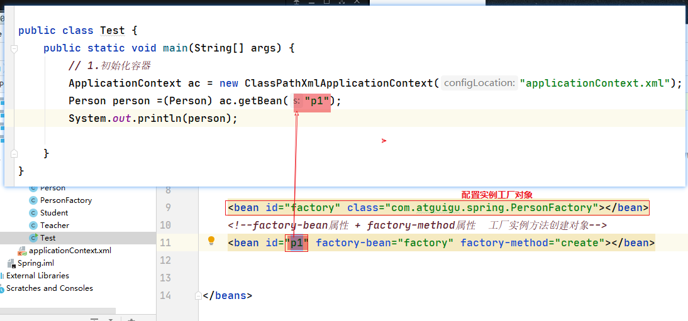

##### FactoryBean接口创建Bean对象⭐，Spring自己提供的工厂接口

Spring中有两种类型的bean，**一种是普通bean，另一种是工厂bean，即FactoryBean。**

**工厂bean跟普通bean不同，其返回的对象不是指定类的一个实例，其返回的是该工厂bean的getObject方法所返回的对象。**

==工厂bean必须实现org.springframework.beans.factory.FactoryBean接口。==如果我们创建一个类，实现了FactoryBean，他就是一个工厂Bean.

**实体类**

~~~java
package com.atguigu.spring;

public class Person {
    private String name;
    private Integer age;

    public Person(String name, Integer age) {
        this.name = name;
        this.age = age;
    }

    public Person(String name) {
        this.name = name;
    }

    public String getName() {
        return name;
    }

    public void setName(String name) {
        this.name = name;
    }

    public Integer getAge() {
        return age;
    }

    public void setAge(Integer age) {
        this.age = age;
    }

    @Override
    public String toString() {
        return "Person{" +
                "name='" + name + '\'' +
                ", age=" + age +
                '}';
    }
}

~~~

**工厂类**

~~~java
package com.atguigu.spring;

import org.springframework.beans.factory.FactoryBean;

/**
 * 要成为一个工厂Bean，前提
 * 1.实现FactoryBean接口，接口的泛型就是工厂要创建的对象的类型
 * 2.实现抽象方法
 */
public class PersonFactory implements FactoryBean<Person> {
    @Override
    public Person getObject() throws Exception {
        Person per= new Person("张凡",18);
        return per;
    }

    /**
     * 返回对象类型
     * @return
     */
    @Override
    public Class<?> getObjectType() {
        return Person.class;
    }

    /**
     * 是否为单例
     * @return
     */
    @Override
    public boolean isSingleton() {
        return false;
    }
}

~~~

**配置文件**

~~~xml
<?xml version="1.0" encoding="UTF-8"?>
<beans xmlns="http://www.springframework.org/schema/beans"
       xmlns:xsi="http://www.w3.org/2001/XMLSchema-instance"
       xmlns:util="http://www.springframework.org/schema/util"
       xsi:schemaLocation="http://www.springframework.org/schema/beans
       http://www.springframework.org/schema/beans/spring-beans.xsd http://www.springframework.org/schema/util
       https://www.springframework.org/schema/util/spring-util.xsd">
     <bean id="personFactory" class="com.atguigu.spring.PersonFactory"></bean>
  

</beans>
~~~

**测试**

~~~java
package com.atguigu.spring;

import org.springframework.context.ApplicationContext;
import org.springframework.context.support.ClassPathXmlApplicationContext;

public class Test {
    public static void main(String[] args) {
        // 1.初始化容器
        ApplicationContext ac = new ClassPathXmlApplicationContext("applicationContext.xml");
        Person person =(Person) ac.getBean("personFactory");
        System.out.println(person);

    }
}
----------------------------------------------------------------------------
Person{name='张凡', age=18}
~~~

#### 2.4.2 配置文件的继承和抽象

##### 配置文件的继承

>通过bean的属性parent可以来指定继承哪个bean的配置信息,可以复用bean的属性

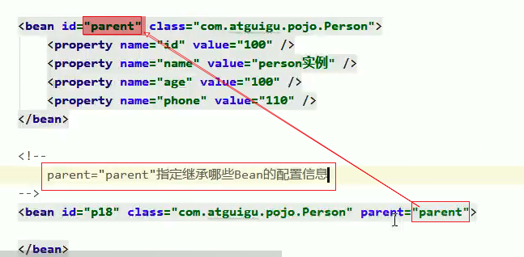

##### 配置文件的抽象

>如果希望某个bean只是用来被其他Bean继承自己的属性，不用来实例化自己，可以在bean标签的添加属性 abstract="true"
>
>表示当前的配置信息只能用于继承，不能被实例化

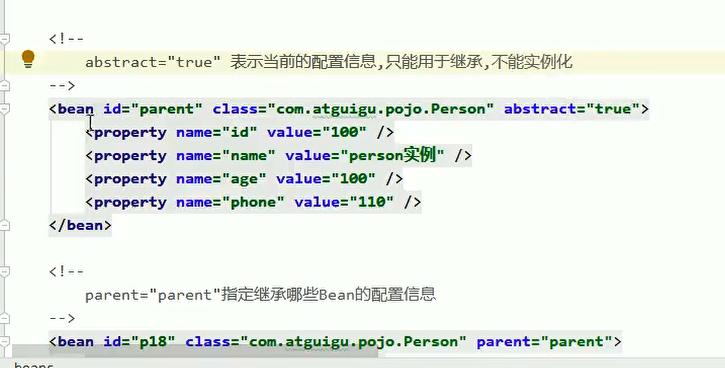

#### 2.4.3 bean的作用域⭐：scope属性

==bean的作用域是通过bean标签的属性**scope**来定义的==

在Spring中，可以在<bean>元素的scope属性里设置bean的作用域，以决定这个bean是单实例的还是多实例的。

默认情况下，Spring只为每个在IOC容器里声明的bean创建唯一一个实例，整个IOC容器范围内都能共享该实例：所有后续的getBean()调用和bean引用都将返回这个唯一的bean实例。该作用域被称为singleton，它是所有bean的默认作用域。

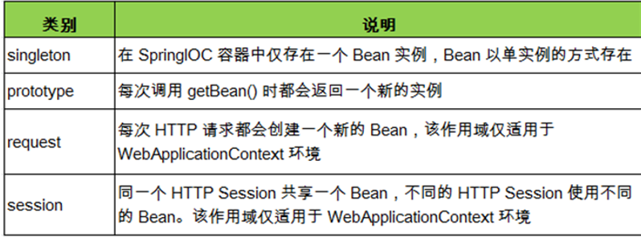

- ==**当bean的作用域为单例时，Spring会在IOC容器对象创建时就创建bean的对象实例**==
- ==**当bean的作用域为prototype时，IOC容器在获取bean的实例时创建bean的实例对象**==

#### 2.4.4 bean的生命周期⭐：init-method和destroy-method 属性

- Spring IOC容器可以管理bean的生命周期，Spring允许在bean生命周期内特定的时间点执行指定的任务。

-  Spring IOC容器对bean的生命周期进行管理的过程：

​           ① 通过构造器或工厂方法创建bean实例

​           ② 为bean的属性设置值和对其他bean的引用，**依赖注入**

​           ③ 调用bean的初始化方法

​            ④ bean可以使用了

​            ⑤ 当容器关闭时，调用bean的销毁方法

==注意：spring中的bean不是servlet自带初始化和销毁方法，我们要自己创建方法，并且通过配置指定哪个方法是初始化方法，指定哪个方法是销毁方法==

- 在配置bean时，通过init-method和destroy-method 属性为bean指定初始化和销毁方法

**实体类**

~~~java
package com.atguigu.spring;

public class Car {
    private String name;
    private Integer price;

    public String getName() {
        return name;
    }

    public void setName(String name) {
        System.out.println("②为bean的属性设置值和对其他bean的引用");
        this.name = name;
    }

    public Integer getPrice() {
        return price;
    }

    public void setPrice(Integer price) {
        this.price = price;
    }

    public Car() {
        System.out.println("①通过构造器或工厂方法创建bean实例");
    }

    @Override
    public String toString() {
        System.out.println("④bean可以使用了");
        return "Car{" +
                "name='" + name + '\'' +
                ", price=" + price +
                '}';
    }

    public void init(){
        System.out.println("③调用bean的初始化方法");
    }

    public void destroy(){
        System.out.println("⑤当容器关闭时，调用bean的销毁方法");
    }
}

~~~

**配置文件**

~~~xml
<?xml version="1.0" encoding="UTF-8"?>
<beans xmlns="http://www.springframework.org/schema/beans"
       xmlns:xsi="http://www.w3.org/2001/XMLSchema-instance"
       xmlns:util="http://www.springframework.org/schema/util"
       xsi:schemaLocation="http://www.springframework.org/schema/beans
       http://www.springframework.org/schema/beans/spring-beans.xsd http://www.springframework.org/schema/util
       https://www.springframework.org/schema/util/spring-util.xsd">
     <!--
          spring中的bean不是servlet自带初始化和销毁方法，
          我们要自己创建方法，并且通过配置指定哪个方法是初始化方法，指定哪个方法是销毁方法
     -->
 <bean id="car" class="com.atguigu.spring.Car" init-method="init" destroy-method="destroy">
      <property name="name" value="玛莎拉蒂"></property>
      <property name="price" value="1000000"></property>
 </bean>


</beans>
~~~

**测试代码**

~~~java
package com.atguigu.spring;

import org.springframework.context.ApplicationContext;
import org.springframework.context.support.ClassPathXmlApplicationContext;

public class Test {
    public static void main(String[] args) {
        // 1.初始化容器
        ClassPathXmlApplicationContext ac = new ClassPathXmlApplicationContext("applicationContext.xml");
        Car car = (Car) ac.getBean("car");
        System.out.println(car);
        ac.close();// 当容器关闭时，调用bean的销毁方法
    }
}
----------------------------------------------------------------------
①通过构造器或工厂方法创建bean实例
②为bean的属性设置值和对其他bean的引用
③调用bean的初始化方法
④bean可以使用了
Car{name='玛莎拉蒂', price=1000000}
⑤当容器关闭时，调用bean的销毁方法
~~~

#### 2.4.5 bean的后置处理器⭐

>原有的生命周期步骤是5步，bean后置处理器允许在调用**初始化方法前后**对bean进行额外的处理，这样bean的生命周期就由5步变为7步！！！！

bean的后置处理器：

​     ==① bean后置处理器允许在调用**初始化方法前后**对bean进行额外的处理==

​     ==② bean后置处理器对IOC容器里的所有bean实例逐一处理，而非单一实例。==也就是配置了后置处理器以后，会对**Spring管理的每一个bean都有效果**，而不仅仅是针对某一个bean或者某几个bean

​             其典型应用是：检查bean属性的正确性或根据特定的标准更改bean的属性。

​       ③ bean后置处理器需要实现接口：org.springframework.beans.factory.config.BeanPostProcessor。

​       ④ 建立后置处理器与Spring的关系，将后置处理器配置在配置文件中！！！！

在初始化方法被调用前后，Spring将把每个bean实例分别传递给上述接口的以下两个方法：

​       ●postProcessBeforeInitialization(Object, String)

​       ●postProcessAfterInitialization(Object, String)

添加bean后置处理器后bean的生命周期

​     ①通过构造器或工厂方法**创建****bean****实例**

​     ②为bean的**属性设置值**和对其他bean的引用

​     ③将bean实例传递给bean后置处理器的postProcessBeforeInitialization()方法

​     ④调用bean的**初始化**方法

​     ⑤将bean实例传递给bean后置处理器的postProcessAfterInitialization()方法

​     ⑥bean可以使用了

​     ⑦当容器关闭时调用bean的**销毁方法**

**实体类**

~~~java
package com.atguigu.spring;

public class Car {
    private String name;
    private Integer price;

    public String getName() {
        return name;
    }

    public void setName(String name) {
        System.out.println("②为bean的属性设置值和对其他bean的引用");
        this.name = name;
    }

    public Integer getPrice() {
        return price;
    }

    public void setPrice(Integer price) {
        this.price = price;
    }

    public Car() {
        System.out.println("①通过构造器或工厂方法创建bean实例");
    }

    @Override
    public String toString() {
        System.out.println("④bean可以使用了");
        return "Car{" +
                "name='" + name + '\'' +
                ", price=" + price +
                '}';
    }

    public void init(){
        System.out.println("③调用bean的初始化方法");
    }

    public void destroy(){
        System.out.println("⑤当容器关闭时，调用bean的销毁方法");
    }
}

~~~

**后置处理器类**

~~~java
package com.atguigu.spring;


import org.springframework.beans.BeansException;
import org.springframework.beans.factory.config.BeanPostProcessor;
import org.springframework.lang.Nullable;

/**
 * bean的后置处理器
 * 1.bean的后置处理器需要实现接口BeanPostProcessor
 * 2.重写抽象方法
 * 3.建立后置处理器与Spring的关系，将后置处理器配置在配置文件中！！！！
 */
public class AfterHandle implements BeanPostProcessor {
    /**
     * 作用在bean调用初始化方法之前
     * 返回的object就是经过处理之后的新的bean
     */
    @Override
    public  Object postProcessBeforeInitialization(Object bean, String beanName) throws BeansException {
        System.out.println("postProcessBeforeInitialization方法被调用！");
        Car car = (Car)bean;
        if(car.getName().equals("玛莎拉蒂")){
            car.setPrice(9999);
        }else{
            car.setPrice(8888);
        }
        return car;
    }


     // 作用在bean初始化之后
     @Override
     public Object postProcessAfterInitialization(Object bean, String beanName) throws BeansException {
        System.out.println("postProcessAfterInitialization方法被调用！");
        return bean;
    }
}

~~~

**配置文件**

~~~xml
<?xml version="1.0" encoding="UTF-8"?>
<beans xmlns="http://www.springframework.org/schema/beans"
       xmlns:xsi="http://www.w3.org/2001/XMLSchema-instance"
       xmlns:util="http://www.springframework.org/schema/util"
       xsi:schemaLocation="http://www.springframework.org/schema/beans
       http://www.springframework.org/schema/beans/spring-beans.xsd http://www.springframework.org/schema/util
       https://www.springframework.org/schema/util/spring-util.xsd">
     <!--
          spring中的bean不是servlet自带初始化和销毁方法，
          我们要自己创建方法，并且通过配置指定哪个方法是初始化方法，指定哪个方法是销毁方法
     -->
 <bean id="car" class="com.atguigu.spring.Car" init-method="init" destroy-method="destroy">
      <property name="name" value="玛莎拉蒂"></property>
      <property name="price" value="1000000"></property>
 </bean>
    <!--
    配置后置处理器：
    建立后置处理器与Spring的关系，将后置处理器配置在配置文件中！！！！
    -->
    <bean class="com.atguigu.spring.AfterHandle"></bean>


</beans>
~~~

**测试**

~~~java
package com.atguigu.spring;

import org.springframework.context.ApplicationContext;
import org.springframework.context.support.ClassPathXmlApplicationContext;

public class Test {
    public static void main(String[] args) {
        // 1.初始化容器
        ClassPathXmlApplicationContext ac = new ClassPathXmlApplicationContext("applicationContext.xml");
        Car car = (Car) ac.getBean("car");
        System.out.println(car);
        ac.close();// 当容器关闭时，调用bean的销毁方法
    }
}
------------------------------------------------------------------
①通过构造器或工厂方法创建bean实例
②为bean的属性设置值和对其他bean的引用
postProcessBeforeInitialization方法被调用！
③调用bean的初始化方法
postProcessAfterInitialization方法被调用！
④bean可以使用了
Car{name='玛莎拉蒂', price=9999}
⑤当容器关闭时，调用bean的销毁方法
~~~

### 2.5 引入外部资源文件⭐

#### 直接配置数据库连接

- 需要先导入jar包

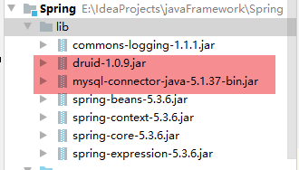

- 编写配置文件测试

**配置文件**

~~~xml
<?xml version="1.0" encoding="UTF-8"?>
<beans xmlns="http://www.springframework.org/schema/beans"
       xmlns:xsi="http://www.w3.org/2001/XMLSchema-instance"
       xmlns:util="http://www.springframework.org/schema/util"
       xsi:schemaLocation="http://www.springframework.org/schema/beans
       http://www.springframework.org/schema/beans/spring-beans.xsd http://www.springframework.org/schema/util
       https://www.springframework.org/schema/util/spring-util.xsd">
      <bean id="dataSource" class="com.alibaba.druid.pool.DruidDataSource">
          <property name="username" value="root" ></property>
          <property name="password" value="123456" ></property>
          <property name="driverClassName" value="com.mysql.jdbc.Driver" ></property>
          <property name="url" value="jdbc:mysql://localhost:3306/test" ></property>
      </bean>

</beans>
~~~

**测试代码**

~~~java
package com.atguigu.spring;

import com.alibaba.druid.pool.DruidDataSource;
import org.springframework.context.ApplicationContext;
import org.springframework.context.support.ClassPathXmlApplicationContext;

import java.sql.SQLException;

public class Test {
    public static void main(String[] args) throws SQLException {
        // 1.初始化容器
        ApplicationContext ac = new ClassPathXmlApplicationContext("applicationContext.xml");
        DruidDataSource dataSource = ac.getBean("dataSource", DruidDataSource.class);
        System.out.println(dataSource);
        System.out.println(dataSource.getConnection());
    }
}
--------------------------------------------------
 {
	CreateTime:"2021-10-17 11:43:35",
	ActiveCount:0,
	PoolingCount:0,
	CreateCount:0,
	DestroyCount:0,
	CloseCount:0,
	ConnectCount:0,
	Connections:[
	]
}
十月 17, 2021 11:43:35 上午 com.alibaba.druid.support.logging.JakartaCommonsLoggingImpl info
信息: {dataSource-1} inited
com.mysql.jdbc.JDBC4Connection@64485a47
~~~

#### 引入外部资源文件配置数据源⭐

如果我们自己编写了一个配置文件，想在Spring中加载配置文件的内容

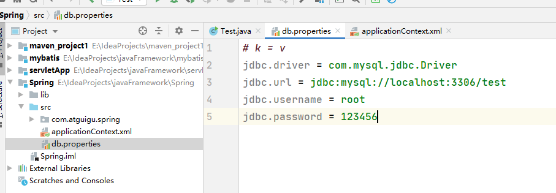

##### 方式1:通过Spring提供的类

>在Spring中为我们提供了一个类，这个类的作用就是用来加载资源文件的！！！**PropertyPlaceholderConfigurer**
>我们在Spring配置文件中配置这个类，然后固定语法：${key]：从Spring所加载的资源文件中通过键去获取值！

**配置文件**

~~~properties
# k = v
jdbc.driver = com.mysql.jdbc.Driver
jdbc.url = jdbc:mysql://localhost:3306/test
jdbc.username = root
jdbc.password = 123456
~~~

~~~xml
<?xml version="1.0" encoding="UTF-8"?>
<beans xmlns="http://www.springframework.org/schema/beans"
       xmlns:xsi="http://www.w3.org/2001/XMLSchema-instance"
       xmlns:util="http://www.springframework.org/schema/util"
       xsi:schemaLocation="http://www.springframework.org/schema/beans
       http://www.springframework.org/schema/beans/spring-beans.xsd http://www.springframework.org/schema/util
       https://www.springframework.org/schema/util/spring-util.xsd">

    <!--
       在Spring中为我们提供了一个类，这个类的作用就是用来加载资源文件的！！！！
    -->
    <bean class="org.springframework.beans.factory.config.PropertyPlaceholderConfigurer">
        <!-- 把资源文件的路径给location属性-->
        <property name="location" value="db.properties"></property>
    </bean>

    <bean id="dataSource" class="com.alibaba.druid.pool.DruidDataSource">
        <!--
        固定语法：${key]
            从Spring所加载的资源文件中通过键去获取值！
        -->
          <property name="username" value="${jdbc.username}" ></property>
          <property name="password" value="${jdbc.password}" ></property>
          <property name="driverClassName" value="${jdbc.driver}" ></property>
          <property name="url" value="${jdbc.url}" ></property>
      </bean>

</beans>
~~~

**测试代码**

~~~java
package com.atguigu.spring;

import com.alibaba.druid.pool.DruidDataSource;
import org.springframework.context.ApplicationContext;
import org.springframework.context.support.ClassPathXmlApplicationContext;

import java.sql.SQLException;

public class Test {
    public static void main(String[] args) throws SQLException {
        // 1.初始化容器
        ApplicationContext ac = new ClassPathXmlApplicationContext("applicationContext.xml");
        DruidDataSource dataSource = ac.getBean("dataSource", DruidDataSource.class);
        System.out.println(dataSource);
        System.out.println(dataSource.getConnection());
    }
}

~~~

##### 方式2：通过Spring专门提供的标签⭐<context:property-placeholder>

>这个标签的作用是专门用来加载资源文件的，使用它先要引入约束！

**配置文件**

~~~xml
<?xml version="1.0" encoding="UTF-8"?>
<beans xmlns="http://www.springframework.org/schema/beans"
       xmlns:xsi="http://www.w3.org/2001/XMLSchema-instance"
       xmlns:util="http://www.springframework.org/schema/util"
       xmlns:context="http://www.springframework.org/schema/context"
       xsi:schemaLocation="http://www.springframework.org/schema/beans
       http://www.springframework.org/schema/beans/spring-beans.xsd http://www.springframework.org/schema/util
       https://www.springframework.org/schema/util/spring-util.xsd http://www.springframework.org/schema/context https://www.springframework.org/schema/context/spring-context.xsd">

    <!--
       在Spring中为我们抓门提供了一个标签<context:property-placeholder>, 作用就是用来加载资源文件的！！！！
    -->
    <context:property-placeholder location="db.properties"></context:property-placeholder>

    <bean id="dataSource" class="com.alibaba.druid.pool.DruidDataSource">
        <!--
        固定语法：${key]
            从Spring所加载的资源文件中通过键去获取值！
        -->
          <property name="username" value="${jdbc.username}" ></property>
          <property name="password" value="${jdbc.password}" ></property>
          <property name="driverClassName" value="${jdbc.driver}" ></property>
          <property name="url" value="${jdbc.url}" ></property>
      </bean>

</beans>
~~~

### 2.6 自动装配⭐

装配还叫注入

- 手动装配：以value或ref的方式**明确指定属性值**都是手动装配。

- 自动装配：根据指定的装配规则，**不需要明确指定**，Spring**自动**将匹配的属性值**注入**bean中。

==自动装配只针对非字面量的属性！==

**实体类**

~~~java
package com.atguigu.spring;

public class Car {
    private Integer cid;
    private String cname;

    public Integer getCid() {
        return cid;
    }

    public void setCid(Integer cid) {
        this.cid = cid;
    }

    public String getCname() {
        return cname;
    }

    public void setCname(String cname) {
        this.cname = cname;
    }

    @Override
    public String toString() {
        return "Car{" +
                "cid=" + cid +
                ", cname='" + cname + '\'' +
                '}';
    }
}

~~~

~~~java
package com.atguigu.spring;

public class Dept {
    private Integer did;
    private String dname;

    public Integer getDid() {
        return did;
    }

    public void setDid(Integer did) {
        this.did = did;
    }

    public String getDname() {
        return dname;
    }

    public void setDname(String dname) {
        this.dname = dname;
    }

    @Override
    public String toString() {
        return "Dept{" +
                "did=" + did +
                ", dname='" + dname + '\'' +
                '}';
    }
}

~~~

~~~java
package com.atguigu.spring;

public class Emp {
    private Integer eid;
    private String ename;
    private Car car;
    private Dept dept;

    public Integer getEid() {
        return eid;
    }

    public void setEid(Integer eid) {
        this.eid = eid;
    }

    public String getEname() {
        return ename;
    }

    public void setEname(String ename) {
        this.ename = ename;
    }

    public Car getCar() {
        return car;
    }

    public void setCar(Car car) {
        this.car = car;
    }

    public Dept getDept() {
        return dept;
    }

    public void setDept(Dept dept) {
        this.dept = dept;
    }

    @Override
    public String toString() {
        return "Emp{" +
                "eid=" + eid +
                ", ename='" + ename + '\'' +
                ", car=" + car +
                ", dept=" + dept +
                '}';
    }
}

~~~

#### **2.6.1 手动装配的步骤**

~~~xml
<?xml version="1.0" encoding="UTF-8"?>
<beans xmlns="http://www.springframework.org/schema/beans"
       xmlns:xsi="http://www.w3.org/2001/XMLSchema-instance"
       xmlns:util="http://www.springframework.org/schema/util"
       xmlns:context="http://www.springframework.org/schema/context"
       xsi:schemaLocation="http://www.springframework.org/schema/beans
       http://www.springframework.org/schema/beans/spring-beans.xsd http://www.springframework.org/schema/util
       https://www.springframework.org/schema/util/spring-util.xsd http://www.springframework.org/schema/context https://www.springframework.org/schema/context/spring-context.xsd">

    <bean id="emp" class="com.atguigu.spring.Emp">
        <property name="eid" value="1001"></property>
        <property name="ename" value="张三"></property>
        <property name="car" ref="car"></property>
        <property name="dept" ref="dept"></property>
    </bean>
    <bean id="car" class="com.atguigu.spring.Car">
        <property name="cid" value="6666"></property>
        <property name="cname" value="霸道"></property>
    </bean>

    <bean id="dept" class="com.atguigu.spring.Dept">
        <property name="did" value="1111"></property>
        <property name="dname" value="科技部"></property>
    </bean>

</beans>
~~~

#### **2.6.2 自动装配**

>bean标签有属性值:autowire，用来自动装配
>
>取值：
>
>​      byName：根据名称自动装配，只要bean的id和属性名一致就可以自动赋值
>
>​      byType：根据类型自动装配

##### byName

>拿着bean的id和属性值对比，还得是兼容性的属性

~~~xml
<?xml version="1.0" encoding="UTF-8"?>
<beans xmlns="http://www.springframework.org/schema/beans"
       xmlns:xsi="http://www.w3.org/2001/XMLSchema-instance"
       xmlns:util="http://www.springframework.org/schema/util"
       xmlns:context="http://www.springframework.org/schema/context"
       xsi:schemaLocation="http://www.springframework.org/schema/beans
       http://www.springframework.org/schema/beans/spring-beans.xsd http://www.springframework.org/schema/util
       https://www.springframework.org/schema/util/spring-util.xsd http://www.springframework.org/schema/context https://www.springframework.org/schema/context/spring-context.xsd">

    <bean id="emp" class="com.atguigu.spring.Emp" autowire="byName">
        <property name="eid" value="1001"></property>
        <property name="ename" value="张三"></property>
        <!--<property name="car" ref="car"></property>
        <property name="dept" ref="dept"></property>-->
    </bean>

    <bean id="car" class="com.atguigu.spring.Car">
        <property name="cid" value="6666"></property>
        <property name="cname" value="霸道"></property>
    </bean>

    <bean id="dept" class="com.atguigu.spring.Dept">
        <property name="did" value="1111"></property>
        <property name="dname" value="科技部"></property>
    </bean>

</beans>
~~~

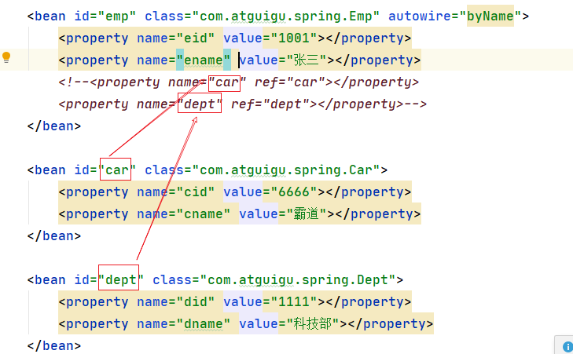

##### byType

**在用byType自动装配的时候，在Spring容器中只能出现一个能为该属性赋值的类型的bean，只能有一个才能赋值成功！**

>通过类型为属性赋值，会根据类型去找一个能为属性赋值的bean去赋值！
>
>在用byType自动装配的时候，在Spring容器中只能出现一个能为该属性赋值的类型的bean
>
>==如果出现多个，会出现异常==，如果一个都没有，也会出现异常！

~~~xml
<?xml version="1.0" encoding="UTF-8"?>
<beans xmlns="http://www.springframework.org/schema/beans"
       xmlns:xsi="http://www.w3.org/2001/XMLSchema-instance"
       xmlns:util="http://www.springframework.org/schema/util"
       xmlns:context="http://www.springframework.org/schema/context"
       xsi:schemaLocation="http://www.springframework.org/schema/beans
       http://www.springframework.org/schema/beans/spring-beans.xsd http://www.springframework.org/schema/util
       https://www.springframework.org/schema/util/spring-util.xsd http://www.springframework.org/schema/context https://www.springframework.org/schema/context/spring-context.xsd">

    <bean id="emp" class="com.atguigu.spring.Emp" autowire="byType">
        <property name="eid" value="1001"></property>
        <property name="ename" value="张三"></property>
        <!--<property name="car" ref="car"></property>
        <property name="dept" ref="dept"></property>-->
    </bean>

    <bean id="car1" class="com.atguigu.spring.Car">
        <property name="cid" value="6666"></property>
        <property name="cname" value="霸道"></property>
    </bean>

    <bean id="dept1" class="com.atguigu.spring.Dept">
        <property name="did" value="1111"></property>
        <property name="dname" value="科技部"></property>
    </bean>

</beans>
~~~

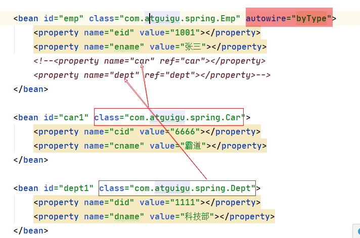

#### 2.6.3 自动装配中byName与byType的选择

~~~xml
    <!--
         autowire:根据某种策略自动为"非字面量"属性赋值
         取值：
             byName:通过属性名和spring容器中bean的id进行比较，若一致则可直接赋值
             byType:通过spring容器中bean的类型来为兼容性的属性赋值！
                    兼容性的属性：不单单可以为本类的属性赋值，还可以为父类的类型属性赋值，还可以为父接口类的属性赋值
                    在使用byType的过程中，要求spring容器中只能有一个能为属性赋值的该类型的bean

    -->
~~~

## 3.基于注解配置IOC⭐

相对于XML方式而言，通过注解的方式配置bean更加简洁和优雅，而且和MVC组件化开发的理念十分契合，是开发中常用的使用方式。

### 3.1 使用注解标识组件⭐

组件就是Spring所管理的一个==bean==

普通组件：**@Component**

​         标识一个受Spring IOC容器管理的组件

持久化层组件：**@Repository**

​         标识一个受Spring IOC容器管理的==持久化层==组件

业务逻辑层组件：**@Service**

​         标识一个受Spring IOC容器管理的==业务逻辑层==组件

表述层控制器组件：**@Controller**

​         标识一个受Spring IOC容器管理的==表述层控制器==组件，加在控制层上

**注意：**

- ==上述注解都是加在类上面的，如果一个类上加了这几个注解，Spring就会创建类的对象，且对象就可以作为Spring的组件被加载，spring就可以对这个类产生的对象进行管理==
- @Repository，@Service，@Controller全部都是由@Component演变而来，事实上Spring并没有能力识别一个组件到底是不是它所标记的类型，即使将 @Respository注解用在一个表述层控制器组件上面也不会产生任何错误，所以  @Respository、@Service、@Controller这几个注解仅仅是为了让开发人员自己明确当前的组件扮演的角色。
- 默认情况：==**使用组件的简单类名首字母小写后得到的字符串作为bean的id**==
- 我们在类上加了上述注解以后，还需要进行==**配置包扫描**==否则Spring无法对相应组件进行管理！！！！
- **上述四个注解有一个属性value,用来指定bean的ID值！**

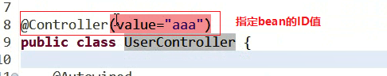

~~~java
package com.atguigu.auto.controller;

import org.springframework.stereotype.Controller;

@Controller
public class UserController {
    public UserController(){
        System.out.println("UserController");
    }
}

~~~

~~~java
package com.atguigu.auto.service;

import org.springframework.stereotype.Service;

@Service
public class UserServiceImpl implements UserService{
    public UserServiceImpl(){
        System.out.println("UserServiceImpl");
    }
}


~~~

~~~java
package com.atguigu.auto.dao;

import org.springframework.stereotype.Repository;

@Repository
public class UserDaoImpl implements UserDao{
    public UserDaoImpl(){
        System.out.println("UserDaoImpl");
    }
}

~~~

~~~java
package com.atguigu.spring;

import com.alibaba.druid.pool.DruidDataSource;
import org.springframework.context.ApplicationContext;
import org.springframework.context.support.ClassPathXmlApplicationContext;

import java.sql.SQLException;

public class Test {
    public static void main(String[] args) throws SQLException {
        // 1.初始化容器
        ApplicationContext ac = new ClassPathXmlApplicationContext("applicationContext.xml");

    }
}
-------------------------------------------------------------
UserController
UserDaoImpl
UserServiceImpl    
~~~

~~~xml
<?xml version="1.0" encoding="UTF-8"?>
<beans xmlns="http://www.springframework.org/schema/beans"
       xmlns:xsi="http://www.w3.org/2001/XMLSchema-instance"
       xmlns:util="http://www.springframework.org/schema/util"
       xmlns:context="http://www.springframework.org/schema/context"
       xsi:schemaLocation="http://www.springframework.org/schema/beans
       http://www.springframework.org/schema/beans/spring-beans.xsd http://www.springframework.org/schema/util
       https://www.springframework.org/schema/util/spring-util.xsd http://www.springframework.org/schema/context https://www.springframework.org/schema/context/spring-context.xsd">

    <!--
       <context:component-scan>:组件扫描，对设置的包下面的类进行扫描，会将加上注解的类作为Spring的组件进行加载！
         组件:指Spring中管理的bean
         作为Spring的组件进行加载:会自动在spring的配置文件中生成相对应的bean,这些bean的id会以类的首字母小写为值。
         使用注解对组件进行管理，必须经过扫描！！！！
         属性：base-package，基础包,只能定位到包结构,“多个包之间用,隔开”
    -->
   <context:component-scan base-package="com.atguigu.auto"></context:component-scan>

</beans>
~~~

<font color="red">**我们在类上加了上述注解以后，还需要进行配置，配置包扫描,否则Spring无法对相应组件进行管理！！使用组件的简单类名首字母小写后得到的字符串作为bean的id**</font>

### 3.2 组件扫描之包含和排除

在包特别多的情况下，如果我们要单独扫描某些包或者排除某些包该如何实现！

<context:include-filter>：设置包含规则

<context:exclude-filter>：设定排除规则

~~~xml
   <!--
    我们还可以通过 <context:component-scan>的子标签来指定扫描或者不扫描某些包
        1.子标签
             <context:include-filter>: 在设定的包结构下再次通过注解或者类型不扫描具体包含到某个或者某几个类！
                  1.1 属性type:
                      annotation:根据注解来进行包含，指定扫描含某个注解的包
                      assignable:根据类型来进行包含，指定扫描含某个类型的包，我指定哪一个类就只扫描哪一个类
                  1.2 属性expression：
                     表达式，可以是类的全限定名
                  1.3 要想配置的子标签生效，需要将use-default-filters属性设置为false！！！！
                      use-default-filters="false":代表不使用默认的过滤条件（即扫描包下所有的类），而使用我们配置的扫描规则
                      也就是一个都不扫描的情况下使用我们的扫描规则
        2.子标签
             <context:exclude-filter>: 在设定的包结构下再次通过注解或者类型不扫描某个或某几个类
                  2.1.属性type:
                      annotation:根据注解来进行包含，指定扫描含某个注解的包
                      assignable:根据类型来进行包含，指定扫描含某个类型的包，我指定哪一个类就只扫描哪一个类
                  2.2 属性expression：
                     表达式，可以是类的全限定名
                  2.3 要想配置的子标签生效，需要将use-default-filters属性设置为true或者不设置（默认就是true）！！！！
                      use-default-filters="true":代表使用默认的过滤条件（即扫描包下所有的类），但是排除掉我们设置的规则
                      也就是在所有都扫描的前提下排除我们设定的规则的包！
     -->
~~~

~~~xml
<?xml version="1.0" encoding="UTF-8"?>
<beans xmlns="http://www.springframework.org/schema/beans"
       xmlns:xsi="http://www.w3.org/2001/XMLSchema-instance"
       xmlns:util="http://www.springframework.org/schema/util"
       xmlns:context="http://www.springframework.org/schema/context"
       xsi:schemaLocation="http://www.springframework.org/schema/beans
       http://www.springframework.org/schema/beans/spring-beans.xsd http://www.springframework.org/schema/util
       https://www.springframework.org/schema/util/spring-util.xsd http://www.springframework.org/schema/context https://www.springframework.org/schema/context/spring-context.xsd">
    <!--
       <context:component-scan>:组件扫描
                使用注解对组件进行管理，必须经过扫描！！！！
                属性：base-package，基础包,只能定位到包结构
    -->
    <!--
    我们还可以通过 <context:component-scan>的子标签来指定扫描或者不扫描某些包
        1.子标签
             <context:include-filter>: 在设定的包结构下再次通过注解或者类型具体包含到某个或者某几个类！
                  属性type:
                      annotation:根据注解来进行包含，指定扫描含某个注解的包
                      assignable:根据类型来进行包含，指定扫描含某个类型的包，我指定哪一个类就只扫描哪一个类
                  属性expression：
                     表达式，可以是类的全限定名
                  要想配置的子标签生效，需要将use-default-filters属性设置为false！！！！
                      use-default-filters="false":代表不使用默认的过滤条件（即扫描包下所有的类），而使用我们配置的扫描规则
                      也就是一个都不扫描的情况下使用我们的扫描规则
        2.子标签
             <context:exclude-filter>: 在设定的包结构下再次通过注解或者类型具体排除到某个或者某几个类！
                  属性type:
                      annotation:根据注解来进行包含，指定扫描含某个注解的包
                      assignable:根据类型来进行包含，指定扫描含某个类型的包，我指定哪一个类就只扫描哪一个类
                  属性expression：
                     表达式，可以是类的全限定名
                  要想配置的子标签生效，需要将use-default-filters属性设置为true或者不设置（默认就是true）！！！！
                      use-default-filters="false":代表使用默认的过滤条件（即扫描包下所有的类），但是排除掉我们设置的规则
                      也就是在所有都扫描的前提下排除我们设定的规则的包！
     -->
   <context:component-scan base-package="com.atguigu.auto" use-default-filters="false">
       <context:include-filter type="annotation" expression="org.springframework.stereotype.Repository"/>
       <!--含义：只扫描包含指定注解Repository的包 -->
   </context:component-scan>

</beans>
~~~

**注意：**

==一个 <context:component-scan>中可以出现多个include,也可以多次出现多个exclude,但是两者不能同时出现==

### 3.3 基于注解的非字面量属性自动装配⭐

#### 3.3.1 @Autowired&&@Qualifier

这个注解用来给bean的非字面量属性实现自动装配，他的注入过程：

- 1.==按照要注入的属性的类型自动装配，也就是先根据byType自动装配==
- 2.==如果按照类型无法实现自动装配，则以注入的属性名作为ID从ioc容器中寻找以实现自动装配==
- 3.如果确实有多个实现类，并且ID值和属性名不一致，我们可以在 @Autowired注解上再加上注解@Qualifier("匹配的bean的ID值")，**通过@Qualifier注解指定ID以实现自动装配**

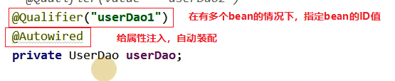

- 4.**有@Autowired注解的属性必须注入成功，这是因为@Autowired注解的属性required默认是true**,如果注入不成功，则会抛出异常，这个属性所在的类也无法成功创建对象，要==改变这个情况可以将属性required设置为false,==此时就是告诉Spring这个属性不是必须的，可以不注入！

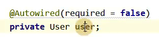

- 5.这两个注解还可以作用到方法上，此时作用于方法的参数

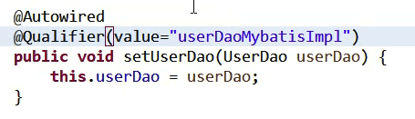

~~~shell
1.默认情况下，所有使用@Autowired注解的属性都需要被设置。当Spring找不到匹配的bean装配属性时，会抛出异常。
2.若某一属性允许不被设置，可以设置@Autowired注解的required属性为 false
3.默认情况下，当IOC容器里存在多个类型兼容的bean时，Spring会尝试匹配bean的id值是否与变量名相同，如果相同则进行装配。如果bean的id值不相同，通过类型的自动装配将无法工作。此时可以在@Qualifier注解里提供bean的名称。Spring甚至允许在方法的形参上标注@Qualifiter注解以指定注入bean的名称
~~~

#### 3.3.2 @Resource

- 属性注解，也用于声明属性自动装配
- 默认装配方式为byName,如果根据byName没有找到相对应的bean，则继续根据byType继续寻找相对应的bean
- 如果依然没有找到对应的bean或者找到不止一个类型匹配的bean，则抛出异常！

### 3.4 其他注解⭐

####  3.4.1 @Value注解

`@Value注解`：注入普通类型的属性，如String类型

- 名称：@Value

- 类型：**属性注解、方法注解**

- 位置：属性定义上方，方法定义上方

- 作用：设置对应属性的值或对方法进行传参

- 范例：

  ```java
  @Value("${jdbc.username}")
  private String username;
  ```

- 说明：

  - value值仅支持非引用类型数据，赋值时对方法的所有参数全部赋值

  - value值支持读取properties文件中的属性值，通过类属性将properties中数据传入类中

  - value值支持SpEL

  - @value注解如果添加在属性上方，可以省略set方法（set方法的目的是为属性赋值）

- 相关属性

  - value（默认）：定义对应的属性值或参数值

#### 3.4.2 @Scope注解

`@Scope注解`：类注解，用于声明当前类是单例模式还是非单例模式 ，相当于bean标签的scope属性       

​                            如 ：  @Scope("prototype")

#### 3.4.3 @PostConstruct注解

`@PostConstruct注解`：方法注解，相当于bean标签的init-method属性，声明一个方法为当前类的初始化方法，再构造器之后执行

#### 3.4.4 @PreDetroy注解

`@PreDetroy注解`：方法注解，相当于bean标签的destroy-method属性，声明一个方法为当前类的destroy方法

#### 3.4.5 @Bean注解

==会将当前方法的返回值作为bean对象存入Spring的IOC容器中==

- 属性：

​       name属性：用于指定方法返回的对象的bean的ID，当不写时，默认是方法名

- 细节：

​       当我们使用注解配置方法时，如果方法有参数，Spring框架会去容器中查找有没有可用的bean对象，朝朝的方式和autowired是一样的。

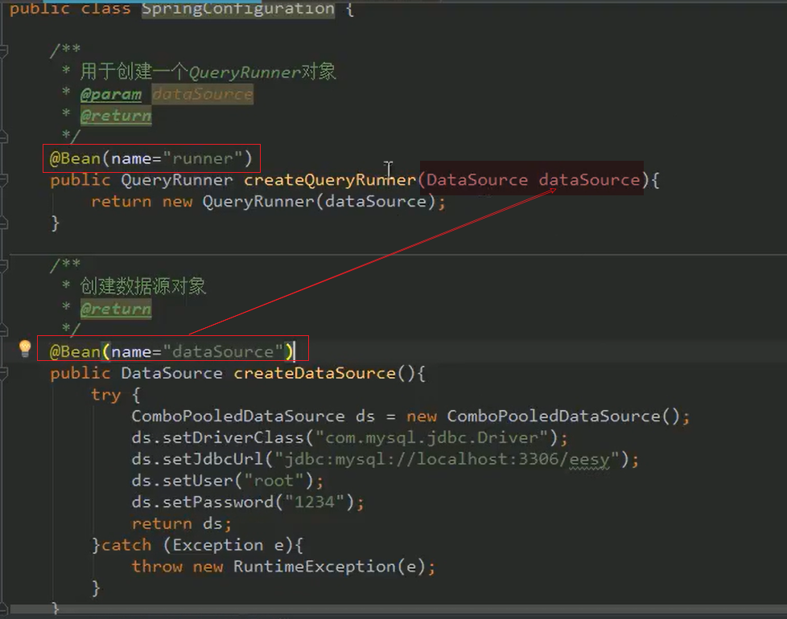

- 范例：

  ```java
  @Bean("dataSource")
  public DruidDataSource createDataSource() {    return ……;    }
  ```

- 说明：

  - 因为第三方bean无法在其源码上进行修改，使用@Bean解决第三方bean的引入问题

  - 该注解用于替代XML配置中的静态工厂与实例工厂创建bean，不区分方法是否为静态或非静态

  - @Bean所在的类必须被spring扫描加载，否则该注解无法生效

- 相关属性

  - value（默认）：定义bean的访问id

#### 3.4.6 @Import注解

==用于导入其他的配置类==，此时被导入的配置类不需要写@Configuration注解！

说明：

- @Import注解在同一个类上，仅允许添加一次，如果需要导入多个，使用数组的形式进行设定

- 在被导入的类中可以继续使用@Import导入其他资源（了解）

- @Bean所在的类可以使用导入的形式进入spring容器，无需声明为bean

**当我们使用@Import注解以后，有@Import注解的就是主配置类，而导入的就是子配置类。可以将其他的配置类导入主配置类，从而将所有的配置加载起来！**

用法如下

- **直接填对应的class数组，class数组可以有0到多个。**

~~~java
@Import({ 类名.class , 类名.class... })
public class TestDemo {

}
~~~

- #### ImportSelector方式【重点】

这种方式的前提就是一个类要实现ImportSelector接口，假如我要用这种方法，目标对象是Myclass这个类，分析具体如下：

创建Myclass类并实现ImportSelector接口

~~~java
public class Myclass implements ImportSelector {
//既然是接口肯定要实现这个接口的方法
    @Override
    public String[] selectImports(AnnotationMetadata annotationMetadata) {
        return new String[0];
    }
}
~~~

分析实现接口的selectImports方法中的：

- 1、返回值： 就是我们实际上要导入到容器中的组件全类名【**重点** 】
- 2、参数： AnnotationMetadata表示当前被@Import注解给标注的所有注解信息【不是重点】

>需要注意的是selectImports方法可以返回空数组但是不能返回null，否则会报空指针异常！

以上分析完毕之后，具体用法步骤如下：

第一步：创建Myclass类并实现ImportSelector接口，这里用于演示就添加一个全类名给其返回值

~~~java
public class Myclass implements ImportSelector {
    @Override
    public String[] selectImports(AnnotationMetadata annotationMetadata) {
        return new String[]{"com.yc.Test.TestDemo3"};
    }
}
~~~

第二步：编写TestDemo 类，并标注上使用ImportSelector方式的Myclass类

~~~java
@Import({TestDemo2.class,Myclass.class})
public class TestDemo {
        @Bean
        public AccountDao2 accountDao2(){
            return new AccountDao2();
        }

}
~~~

第三步：编写打印容器中的组件测试类

~~~java
/**
 * 打印容器中的组件测试
 */
public class AnnotationTestDemo {
    public static void main(String[] args) {
        AnnotationConfigApplicationContext applicationContext=new AnnotationConfigApplicationContext(TestDemo.class);  //这里的参数代表要做操作的类

        String[] beanDefinitionNames = applicationContext.getBeanDefinitionNames();
        for (String name : beanDefinitionNames){
            System.out.println(name);
        }

    }
}
~~~

#### 2.4.7 @PropertySource注解

加载指定的属性文件（*.properties）到 Spring 的 Environment 中。可以配合 @Value 和@ConfigurationProperties 使用：

-  @PropertySource 和 @Value组合使用，可以将自定义属性文件中的属性变量值注入到当前类的使用@Value注解的成员变量中。
- @PropertySource 和 @ConfigurationProperties
  组合使用，可以将属性文件与一个Java类绑定，将属性文件中的变量值注入到该Java类的成员变量中。

使用示例：

- ==@PropertySource 和 @Value组合使用==

**编写配置文件-属性文件：demo.properties**

~~~properties
demo.name=huang
demo.sex=1
demo.type=demo
~~~

**测试类**

~~~java
package com.huang.pims.demo.props;

import org.springframework.beans.factory.annotation.Value;
import org.springframework.context.annotation.PropertySource;
import org.springframework.stereotype.Component;

@Component
@PropertySource(value = {"demo/props/demo.properties"})
public class ReadByPropertySourceAndValue {

    @Value("${demo.name}")
    private String name;

    @Value("${demo.sex}")
    private int sex;

    @Value("${demo.type}")
    private String type;

    @Override
    public String toString() {
        return "ReadByPropertySourceAndValue{" +
                "name='" + name + '\'' +
                ", sex=" + sex +
                ", type='" + type + '\'' +
                '}';
    }
}

~~~

- ==@PropertySource 和 @ConfigurationProperties==

~~~java
package com.huang.pims.demo.props;

import org.springframework.boot.context.properties.ConfigurationProperties;
import org.springframework.context.annotation.PropertySource;
import org.springframework.stereotype.Component;

@Component
@PropertySource(value = {"demo/props/demo.properties"})
@ConfigurationProperties(prefix = "demo")
public class ReadByPropertySourceAndConfProperties {

    private String name;

    private int sex;

    private String type;

    public void setName(String name) {
        this.name = name;
    }

    public void setSex(int sex) {
        this.sex = sex;
    }

    public void setType(String type) {
        this.type = type;
    }

    public String getName() {
        return name;
    }

    public int getSex() {
        return sex;
    }

    public String getType() {
        return type;
    }

    @Override
    public String toString() {
        return "ReadByPropertySourceAndConfProperties{" +
                "name='" + name + '\'' +
                ", sex=" + sex +
                ", type='" + type + '\'' +
                '}';
    }
}
~~~

#### 2.4.8 bean的加载控制

(1)@DependsOn

- 名称：@DependsOn

- 类型：类注解、方法注解

- 位置：bean定义的位置（类上或方法上）

- 作用：==控制**bean**的加载顺序，使其在指定bean加载完毕后再加载==

- 范例：

  ```java
  @DependsOn("beanId")
  public class ClassName {
  }
  ```

- 说明：

  - 配置在方法上，使@DependsOn指定的bean优先于@Bean配置的bean进行加载

  - 配置在类上，使@DependsOn指定的bean优先于当前类中所有@Bean配置的bean进行加载

  - 配置在类上，使@DependsOn指定的bean优先于@Component等配置的bean进行加载

- 相关属性

  - value（默认）：设置当前bean所依赖的bean的id

(2)@Order

- 名称：@Order

- 类型：**配置类注解**

- 位置：配置类定义的位置（类上）

- 作用：==控制**配置类**的加载顺序==，**越小先加载！**

- 范例：

  ```java
  @Order(1)
  public class SpringConfigClassName {
  }
  ```

(3)@Lazy

- 名称：@Lazy

- 类型：**类注解、方法注解**

- 位置：bean定义的位置（类上或方法上）

- 作用：控制bean的加载时机，使其延迟加载

- 范例：

  ```java
  @Lazy
  public class ClassName {
  }
  ```

### 3.5 完全注解开发⭐

在使用注解的情况下，我们在配置文件中使用了包扫描标签，并没有完全脱离配置文件来开发！

==我们可以完全脱离配置文件来实现对象的创建==

步骤：

- 1.创建一个普通的类
- 2.在类上加注解@Configuration

​       @Configuration：==**添加该注解的类将是一个配置类，用来代替xml配置文件**==

注意：

>1.@Configuration修饰的类可以有多个，也就是可以有多个配置类
>
>2.如果AnnotationConfigApplicationContext里面的参数是某个配置类的class，那么这个配置类的@Configuration注解可以省略！

- 3.在类上加注解@ComponentScan

​      @ComponentScan：==**配置要扫描的包**==,里面有basePackages,值为包名

- 4.此时获取IOC容器要通过另一个实现类==**AnnotationConfigApplicationContext**==，参数为配置类的类型！！！

~~~java
ApplicationContext ac = new AnnotationConfigApplicationContext(ApplicationContext.class);
~~~

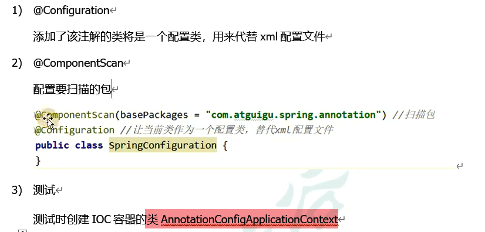


**总结**：

基于注解的组件化管理

 @Component,@Service（业务层）,@Controller（控制层）,@Repository（持久层）

以上四个注解的功能完全相同，不过在实际开发中，要在实现不同功能的类上加上相应的注解

完成组件化管理的过程：

- 1.在需求被Spring管理的类上加上相应的注解
- 2.在配置文件中通过<context:component-scan>对所设置的包结构进行扫描，就会将加上注解的类，作为Spring的组件进行加载。
- 组件:指Spring中管理的bean
           作为Spring的组件进行加载:会自动在spring的配置文件中生成相对应的bean,这些bean的id会以类的首字母小写为值。也可以通过@Controller("beanID")来为自动生成的bean指定ID。


自动装配：在需要赋值的非字面量属性上，加上@Autowired，就可以在spring的容器中通过不同的方式，匹配到相对应的bean.

@Autowired装配式会默认使用byType的方式，此时要求Spring容器中只有一个能为其赋值。

当byType实现不了装配时，会自动切换到byName，此时要求Spring中，有一个bean的id和属性名一致。

若自动装配时匹配到多个能够赋值的bean，可以使用@Qualifier(value="beanID")指定使用的bean

@Autowired和@Qualifier(value="beanID")可以一起作用在带形参的方法上，此时这个注解所指定的bean作用于形参。

## 4 .Spring与junit的整合

spring提供了对junit的集成，所以可以在测试类中直接注入IOC容器中的bean,==使用此功能需要导入spring-test-5.3.1.jar==

>集成了junit之后，不需要写初始化容器的步骤就可以直接注入IOC容器的bean啦！

~~~java
package com.atguigu.spring;

import com.atguigu.auto.service.UserService;
import org.junit.Test;
import org.junit.runner.RunWith;
import org.springframework.beans.factory.annotation.Autowired;
import org.springframework.test.context.ContextConfiguration;
import org.springframework.test.context.junit4.SpringJUnit4ClassRunner;

/**
 * Spring提供对junit的集成支持，有了这个集成，不需要写初始化容器，可以直接注入bean!
 */
@ContextConfiguration(locations = "classpath:applicationContext.xml")//指定Spring的配置文件的路径
@RunWith(SpringJUnit4ClassRunner.class)
public class SpringJunitTest {
    @Autowired
    private UserService userService;
    /**
     * 测试获取UserService
     */
    @Test
    public void testUserService(){
        userService.addUser();
    }
}

~~~

## 5.Spring的AOP

### 5.1 引入概述：代理设计模式

~~~java
代理设计模式的原理：使用一个代理将原本对象包装起来，然后用该代理对象”取代”原始对象。
任何对原始对象的调用都要通过代理。代理对象决定是否以及何时将方法调用转到原始对象上
将通用性的共工作交给代理完成，被代理对象只需要专注自己的核心业务。
~~~

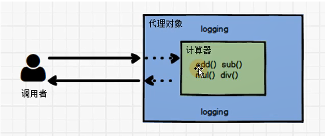


~~~markdown
动态代理几乎可以为所有的类产生代理对象
动态代理的方式
## 1.基于接口实现动态代理： JDK动态代理
   我们的实现类会实现这个接口，代理对象也会实现这个接口
## 2.基于继承实现动态代理： Cglib、Javassist动态代理 
~~~

1.被代理类中只用关注核心业务的实现，将通用的管理型逻辑(事务管理，日志管理)和业务逻辑分离。

2.将通过的代码放在代理类中实现，提高了代码的复用性

3.通过在代理类中添加业务，实现对原有业务逻辑的拓展(增强)

>静态代理：代理类只能为特定的类生产代理都西昂，不能代理任意类。
>
>动态代理几乎可以为所有的类产生代理对象！

==**不管你的目标对象是什么，我都可以通过这样的一个类去生成相对应的代理对象，帮助我*去完成功能，和目标对象没关系**==

原则：不管谁帮我完成这件事，我一定要保证结果的一致性

#### 5.1.1 AOP前奏案例

**接口**

~~~java
package com.atguigu.proxy;

public interface MathI {
    int add(int a,int b);
    int sub(int a,int b);
    int mul(int a,int b);
    int div(int a,int b);
}

~~~

**实现类**

~~~java
package com.atguigu.proxy;

public class MathImpl implements MathI {
    @Override
    public int add(int a, int b) {
        System.out.println("method:add,argument:"+a+","+b);
        int result = a+b;
        System.out.println("method:add,result:"+result);
        return result;
    }

    @Override
    public int sub(int a, int b) {
        System.out.println("method:sub,argument:"+a+","+b);
        int result = a-b;
        System.out.println("method:sub,result:"+result);
        return result;
    }

    @Override
    public int mul(int a, int b) {
        System.out.println("method:mul,argument:"+a+","+b);
        int result = a*b;
        System.out.println("method:mul,result:"+result);
        return result;
    }

    @Override
    public int div(int a, int b) {
        System.out.println("method:div,argument:"+a+","+b);
        int result = a/b;
        System.out.println("method:div,result:"+result);
        return result;
    }
}

~~~

==通过代理对象实现日志功能==

目标类

~~~java
package com.atguigu.proxy;

public class MathImpl implements MathI {
    @Override
    public int add(int a, int b) {

        int result = a+b;

        return result;
    }

    @Override
    public int sub(int a, int b) {

        int result = a-b;

        return result;
    }

    @Override
    public int mul(int a, int b) {

        int result = a*b;
        return result;
    }

    @Override
    public int div(int a, int b) {

        int result = a/b;

        return result;
    }
}

~~~

**日志类**

~~~java
package com.atguigu.proxy;

public class MyLogger {

    public static void before(String methodName,String args){
        System.out.println("method:"+methodName+",arguments:"+args);
    }


    public static void after(String methodName,Object result){
        System.out.println("method:"+methodName+",result:"+result);
    }
}

~~~

**代理对象**

~~~java
package com.atguigu.proxy;

import java.lang.reflect.InvocationHandler;
import java.lang.reflect.Method;
import java.lang.reflect.Proxy;

public class ProxyUtil {
    /**
       目标对象：想要去做的业务功能的对象
       由于目标对象没有类型限制，一般写成Object类型，不过这里我们用MathImpl
     */
    private MathImpl mathImpl;
    
    public ProxyUtil(MathImpl mathImpl) {
        this.mathImpl = mathImpl;
    }

    public Object getProxy(){
        /**
         * JDK动态代理：JDK提供的类。Proxy：通过这种方式生成的代理类全部继承这个代理类
         
         * 参数说明：
         *    ClassLoader loader：类加载器：一个类要想被加载执行，必须要有类加载器
         *         当前代理对象所属类（会帮我们创建一个新的代理类）的类加载，有这个类加载，当前所属类才能被加载，这个类才能创建代理对象
         *    Class<?>[] interfaces：目标对象所实现的所有接口的class类型
         *         目标类的方法由接口被实现得到，要想知道代理对象最终能够帮我们完成什么，知道目标对象所实现的所有接口即可！
         *         一个类可以实现多个接口，故是一个数组
         *    InvocationHandler：执行处理器，设置代理对象如何实现目标对象的功能,代理对象里面的抽象方法如何重写，如何实现逻辑的具体实现！
         */
        return Proxy.newProxyInstance(
                this.getClass().getClassLoader(),// 获取当前类的类加载器，用来加载代理对象所属类
                mathImpl.getClass().getInterfaces(),// 获取目标对象所实现的所有接口的Class,代理类会和目标类实现相同接口，最终通过代理类实现功能
                // 代理对象实现功能的方式
                new InvocationHandler() {
                    /**
                     *
                     * @param proxy：代理对象
                     * @param method :目标对象要执行的业务功能方法对象的对象
                     * @param args：目标对象要执行的业务功能方法的参数
                     * @return
                     * @throws Throwable
                     */
                    @Override
                    public Object invoke(Object proxy, Method method, Object[] args) throws Throwable {             
                        MyLogger.before(method.getName(), Arrays.toString(args));
                        Object result =  method.invoke(mathImpl,args);// 调用目标对象的方法用来保持结果的一致性！
                        System.out.println(result);
                        MyLogger.after(method.getName(),result);
                        return result;
                    }
                });
    }
}

~~~

**测试**

~~~java
package com.atguigu.proxy;

public class Test {
    public  static void main(String[] args){
        ProxyUtil proxy = new ProxyUtil(new MathImpl());
        MathI proxy2 =   (MathI)proxy.getProxy();
        int add = proxy2.add(1, 1);
        System.out.println(add);
    }
}

~~~

**总结**

>1.代理对象要能实现相同的功能，代理对象为什么能帮我们实现相同的功能，是因为代理对象能帮我们实现相同的接口。
>
>2.InvocationHandler接口：控制代理对象实现功能的方式。

动态代理：

>几乎可以为所有的类产生代理对象
>
>动态代理的实现方式有两种：
>
>- JDK动态代理
>- CGLIB动态代理

#### 5.1.2JDK动态代理⭐

==**要求必须有接口，最终生成的代理类会继承Proxy，实现相应的接口**==

~~~java
package com.atguigu.proxy;

import java.lang.reflect.InvocationHandler;
import java.lang.reflect.Method;
import java.lang.reflect.Proxy;

/**
 * JDK动态代理：是通过被代理对象实现的接口，产生其代理对象的
 */
public class JDKDynamicProxy {

    // 被代理对象 因为是Object类型，所以可以为几乎任何类型产生代理
    private Object obj;

    public JDKDynamicProxy(Object obj){
        this.obj = obj;
    }

    // 产生代理对象，返回代理对象
    public Object getProxy(){
        // 1.获取被代理对象的类加载器
        ClassLoader classLoader = obj.getClass().getClassLoader();
        // 2.获取被代理对象实现的接口
        Class<?>[] interfaces = obj.getClass().getInterfaces();
        // 3.产生代理对象,通过被代理对象的类加载器及其实现的接口，这个对象可以强转成被代理对象实现的接口类型
        // 第一个参数：被代理类的类加载器
        // 第二个参数：被代理对象实现的接口
        // 第三个参数：使用产生的代理对象调用方法时，用于拦截方法执行的拦截器，处理器
        Object o =  Proxy.newProxyInstance(classLoader, interfaces, new InvocationHandler() {
            @Override
            // 调用的方法作为参数method，传递给了invoke
            public Object invoke(Object proxy, Method method, Object[] args) throws Throwable {
                begin();
                Object returnValue = method.invoke(obj);// 执行method方法
                commit();
                return returnValue;
            }
        });
        return o;

    }
    public void begin(){
        System.out.println("======开启事务");
    }
    public void commit(){
        System.out.println("======提交事务");
    }

}

~~~

总结：

>使用代理对象调用方法，会进入到创建代理对象时指定的InvocationHandle类中的invoke方法！

#### 5.1.3 cglib动态代理⭐

==**要求必须有父类**==

- CGLIB(code Generation Library):Code生成类库

- CGLIB动态代理不限定是否具有接口，可以对任意操作进行增强
- CGLIB动态代理不需要原始被代理对象，动态创建出新的代理对象

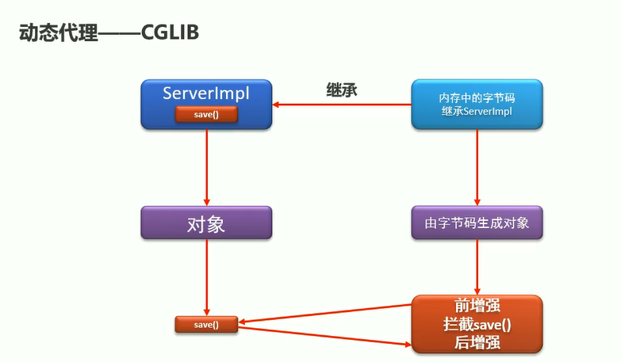

**接口**

~~~java
package com.atguigu.aop;

public interface MathI {
    int add(int a,int b);
    int sub(int a,int b);
    int mul(int a,int b);
    int div(int a,int b);
}

~~~

**实现类**

~~~java
package com.atguigu.aop;

public class MathiImpl  implements MathI{
    @Override
    public int add(int a, int b) {
        return 0;
    }

    @Override
    public int sub(int a, int b) {
        return 0;
    }

    @Override
    public int mul(int a, int b) {
        return 0;
    }

    @Override
    public int div(int a, int b) {
        return 0;
    }
}

~~~

**代理类**

~~~java
package com.atguigu.aop;

import org.springframework.cglib.proxy.Enhancer;
import org.springframework.cglib.proxy.MethodInterceptor;
import org.springframework.cglib.proxy.MethodProxy;

import java.lang.reflect.Method;

public class CglibProxy {
    public static MathI createMathiProxy(Class clazz){
        //1.创建Enhancer对象  这个对象可以在内存动态创建一个代理类的字节码对象！
        Enhancer enhancer = new Enhancer();
        //2.Cglib底层是创建当前实现的子类，故对于代理而言，实现类是他的父类，我们要告诉Enhancer对象，他创建的代理对象的父类是什么
        enhancer.setSuperclass(clazz);
        //3.必须对原始的操作进行”增强“，setCallback（）方法是必须的！
        enhancer.setCallback(new MethodInterceptor() {
            /**
             *
             * @param o :被代理对象
             * @param method ：类clazz要增强的方法对象，原始调用方法
             * @param args : 类clazz要增强的方法对象的方法执行需要用到的参数
             * @param methodProxy ：代理对象的方法的对象，新类中的方法
             * @return
             * @throws Throwable
             */
            @Override
            public Object intercept(Object o, Method method, Object[] args, MethodProxy methodProxy) throws Throwable {
                // 回调原始方法，对于cglib代理对象而言，就是调用父类的方法！
                Object res = methodProxy.invokeSuper(o, args);
                if(method.getName().equals("add")){
                    System.out.println("对方法做了增强1");
                    System.out.println("对方法做了增强2");
                }
                // 返回方法的返回值！
                return res;
            }
        });
        //4.返回代理对象！
        return (MathI) enhancer.create();
    }
}

~~~

**测试**

~~~java
package com.atguigu.aop;

public class Test1 {
    public static void main(String[] args) {
        MathI mathi = CglibProxy.createMathiProxy(MathiImpl.class);
        System.out.println(mathi);
        mathi.add(1,2);
    }
}
~~~

### 5.2 AOP概述

- AOP(Aspect-Oriented Programming，**面向切面编程**)：是一种新的方法论，是对传统 OOP(Object-Oriented Programming，面向对象编程)的==**补充**==。是一种通过动态代理实现程序功能拓展和统一维护的技术！

==**面向对象  纵向继承机制**==

==**面向切面  横向抽取机制**==

横向抽取机制：将一些公共代码，或者非业务代码（如日志打印）从业务代码中抽取出来，形成一个类，再通过动态代理技术作用到操作的功能中，此时非业务代码和业务代码实现解耦合！

- AOP编程操作的主要对象是**切面**(aspect)(存储公共功能的类)，而切面用于**模块化横切关注点（公共功能，非业务代码）**

- 在应用AOP编程时，仍然需要定义公共功能，但可以明确的定义这个功能应用在哪里，以什么方式应用，并且不必修改受影响的类。这样一来**横切关注点就被模块化到特殊的类**里——这样的类我们通常称之为“切面”。

- ① 每个事物逻辑位于一个位置，代码不分散，**便于维护和升级**

  ② ==业务模块更简洁，只包含核心业务代码==

  ③ AOP图解

  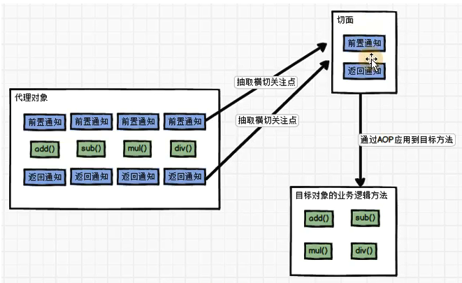

  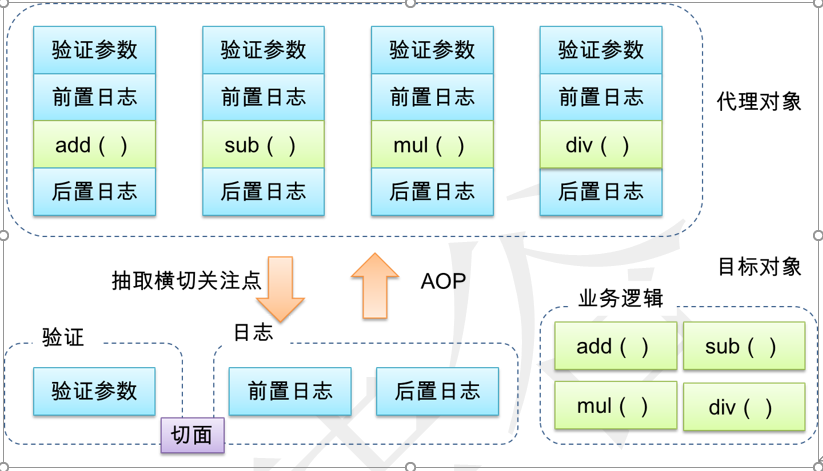

#### 5.2.1 AOP术语⭐

`横切关注点`：从每个方法中抽取出来的==同一类非核心业务==如：打印日志。

`切面`：封装横切关注点信息的==类==，每个关注点体现为一个通知方法。用于描述切入点与通知间的关系.

`通知`：切面必须要完成的各个具体工作，是横切关注点在切面的叫法，当我们把它从业务代码抽取出来，叫横切关注点，而当我们把它写在切面中，就是通知，AOP中有5种通知

`目标`：被通知的对象，抽取出来的代码要作用的对象

`代理(Proxy)`：向目标对象应用通知之后创建的代理对象

` 连接点(Joinpoint)`：==横切关注点在程序代码中的具体体现，对应程序执行的某个**特定位置**==。例如：类某个方法调用前、调用后、方法捕获到异常后等。

在应用程序中可以使用横纵两个坐标来定位一个具体的连接点：

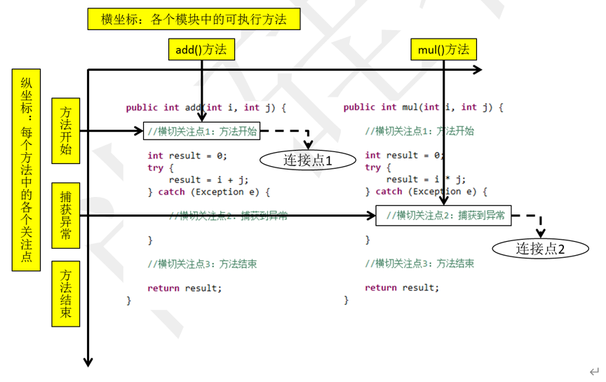

`切入点`：==**定位连接点的方式**==（切入点表达式）我们要把切面作用到哪儿，使用切面的==**条件**==，定义了当前切面需要作用到谁！

定位连接点的方式。每个类的方法中都包含多个连接点，所以连接点是类中客观存在的事物。

如果把连接点看作数据库中的记录，那么切入点就是查询条件——==AOP可以通过切入点定位到特定的连接点==。切点通过org.springframework.aop.Pointcut 接口进行描述，它使用**类和方法**作为连接点的查询条件。

就是一个条件，有了这个条件，切面才知道要作用到哪儿！！！

**可以通过切入点表达式找到切面所应用的连接点**

### 5.3 基于注解的AOP

AspectJ：Java社区里最完整最流行的AOP框架。

在Spring2.0以上版本中，可以使用基于AspectJ注解或基于XML配置的AOP。

Spring的AOP是一种思想，而AspectJ是一种实现，Spring对AspectJ进行了集成，AspectJ基于注解实现AOP在实现时更直观，更明确！

#### 5.3.1 @Aspect注解⭐

==**在Spring中声明切面使用 @Aspect注解，而且切面也需要交给IOC容器管理，即切面上也需要添加@Component注解**==

当在Spring IOC容器中初始化AspectJ切面以后，Spring ioc容器就会为那些与AspectJ切面相匹配的bean创建代理

在AspectJ注解中，切面只是一个带有@Aspect注解的Java类，它往往要包含很多通知。通知是标注有某种注解的简单的Java方法

#### 5.3.2 AspectJ支持5种类型的通知注解⭐

① `@Before`：前置通知，在方法执行之前执行

②`@After`：后置通知，在方法执行之后执行

③` @AfterRunning`：返回通知，在方法返回结果之后执行

④ `@AfterThrowing`：异常通知，在方法抛出异常之后执行

⑥` @Around`：环绕通知，围绕着方法执行

#### 5.3.3 具体实现案例⭐

**导入AOP相关的jar包**

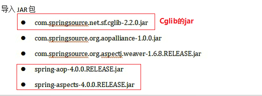

**配置文件**

~~~xml
<?xml version="1.0" encoding="UTF-8"?>
<beans xmlns="http://www.springframework.org/schema/beans"
       xmlns:xsi="http://www.w3.org/2001/XMLSchema-instance" xmlns:aop="http://www.springframework.org/schema/aop"
       xmlns:context="http://www.springframework.org/schema/context"
       xsi:schemaLocation="http://www.springframework.org/schema/beans http://www.springframework.org/schema/beans/spring-beans.xsd http://www.springframework.org/schema/aop https://www.springframework.org/schema/aop/spring-aop.xsd http://www.springframework.org/schema/context https://www.springframework.org/schema/context/spring-context.xsd">
    <!-- 开启注解扫描支持 -->
    <context:component-scan base-package="com.atguigu.aop"></context:component-scan>
    <!--开启AspectJ的自动代理功能 -->
    <aop:aspectj-autoproxy></aop:aspectj-autoproxy>

</beans>
~~~

一定要配置<aop:aspectj-autoproxy>，当Spring IOC容器侦测到bean配置文件中的<aop:aspectj-autoproxy>元素时，会自动为与AspectJ切面匹配的bean创建代理

**接口**

~~~java
package com.atguigu.aop;

public interface MathI {
    int add(int a,int b);
    int sub(int a,int b);
    int mul(int a,int b);
    int div(int a,int b);
}

~~~

**实体类**

~~~java
package com.atguigu.aop;

import org.springframework.stereotype.Component;

/**
 * 目标对象也需要交给Spring管理！
 */
@Component
public class MathImpl implements MathI {
    @Override
    public int add(int a, int b) {

        int result = a+b;

        return result;
    }

    @Override
    public int sub(int a, int b) {

        int result = a-b;

        return result;
    }

    @Override
    public int mul(int a, int b) {

        int result = a*b;
        return result;
    }

    @Override
    public int div(int a, int b) {

        int result = a/b;

        return result;
    }
}

~~~

**切面**

~~~java
package com.atguigu.aop;

import org.aspectj.lang.annotation.Aspect;
import org.aspectj.lang.annotation.Before;
import org.springframework.stereotype.Component;
/**
 * Spring最核心的功能就是IOC，aop也是依赖于IOC的！
 * 要想让AOP实现切面的功能，需要将切面当成Spring的一个组件进行加载，才能是一个切面
 */

/**
 * @Aspect:用来标注当前类为切面
 */
@Component
@Aspect
public class MyLoggerAspect {
    /**
     *  @Before:将方法指定为前置通知
     *  必须设置value,其值为切入点表达式,通过解析切入点表达式可以看到通知的作用位置
     */
    @Before(value="execution(public int com.atguigu.aop.MathImpl.add(int,int))")
   public void beforeMethod(){
        System.out.println("方法执行之前！");
   }
}

~~~

**测试**

~~~java
package com.atguigu.aop;

import javafx.application.Application;
import org.springframework.context.ApplicationContext;
import org.springframework.context.support.ClassPathXmlApplicationContext;

public class Test {
    public static void main(String[] args) {
        ApplicationContext ioc = new ClassPathXmlApplicationContext("aop.xml");
        // 这里面需要写接口的类型，而不能写接口的具体实现类的类型，因为会生成代理对象！
        MathI mathImpl = ioc.getBean("mathImpl", MathI.class);
        int add = mathImpl.add(1, 3);
        System.out.println(add);

    }
}

~~~

==**总结**==

>1.配置文件中要开启Spring的注解扫描支持和AspectJ的自动代理功能 
>
>2.声明一个切面要用到@Aspect注解，我们还需要将切面交给Spring的IOC容器管理
>
>3.目标对象也是需要交给Spring的IOC容器管理的
>
>4.会生成代理对象，故需要写接口的Class类型

#### 5.3.4 切入点表达式

通过**表达式的方式**定位**一个或多个**具体的连接点。

 切入点表达式的语法格式

  >execution([权限修饰符] [返回值类型] [简单类名/全类名] [方法名]([参数列表]))  

~~~java
切入点表达式：value="execution(public int com.atguigu.aop.MathImpl.add(int,int))"
1.如果我们想作用这个类的任意方法，可以将方法名写为*
    value="execution(public int com.atguigu.aop.MathImpl.*(int,int))"
2.如果我们想不考虑权限修饰符和方法的返回值类型，修饰符和返回值类型可以合写为一个*
    value="execution(* com.atguigu.aop.MathImpl.*(int,int))"
3.如果我们希望作用当前包下的所有的类的所有方法：可以将类名换为*，方法参数列表换为..
     value="execution(* com.atguigu.aop.*.*(..))"
~~~

~~~java
    /**
     * 切入点表达式的表示方式：
     * 1.execution(public int com.atguigu.aop.MathI.add(int,int))
     *   --在com.atguigu.aop.MathI接口中的add方法中执行
     * 2.execution(public int com.atguigu.aop.MathI.*(int,int))
     *   --在com.atguigu.aop.MathI接口中的所有方法中执行
     * 3.execution(public int com.atguigu.aop.MathI.*(int,int))
     *   --在切面的同一个包下的MathI接口中的所有方法中执行
     * 4.execution(* com.atguigu.aop.MathI.*(int,int))
     *   --不考虑权限修饰符和返回值类型在com.atguigu.aop.MathI接口中的所有方法中执行
     * 5.execution(* com.atguigu.aop.MathI.*(..))
     *   -- 不考虑权限修饰符和返回值类型以及参数的类型和个数在com.atguigu.aop.MathI接口中的所有方法中执行
     * 6.execution(* *.*(..))
     *   -- 不考虑权限修饰符和返回值类型以及参数的类型和个数在所有接口中的所有方法中执行
     */
~~~

|      | 切入点表达式                                                 | 含义                                                         |
| ---- | ------------------------------------------------------------ | :----------------------------------------------------------- |
| 1    | execution(***** com.atguigu.spring.ArithmeticCalculator.*****(**..**)) | ArithmeticCalculator接口中声明的所有方法。第一个“*”代表任意修饰符及任意返回值。第二个“*”代表任意方法。“..”匹配任意数量、任意类型的参数。若目标类、接口与该切面类在同一个包中可以省略包名。 |
| 2    | execution(**public** * ArithmeticCalculator.*(..))           | ArithmeticCalculator接口的所有公有方法                       |
| 3    | execution(public **double**  ArithmeticCalculator.*(..))     | ArithmeticCalculator接口中返回double类型数值的方法           |
| 4    | execution(public double ArithmeticCalculator.*(**double**,  ..)) | 第一个参数为double类型的方法。  “..” 匹配任意数量、任意类型的参数。 |
| 5    | execution(public double ArithmeticCalculator.*(**double**,  **double**)) | 参数类型为double，double类型的方法                           |
| 6    | !execution (* *.add(int,..))                                 | 匹配不是任意类中第一个参数为int类型的add方法                 |
| 7    | execution (* *.add(int,..))  \|\| execution(* *.sub(int,..)) | 任意类中第一个参数为int类型的add方法或sub方法                |

==**切入点表达式——逻辑运算符**==

- && ：连接两个切入点表达式，表示两个切入点表达式同时成立的匹配

- || ：连接两个切入点表达式，表示两个切入点表达式成立任意一个的匹配

- ! ：连接单个切入点表达式，表示该切入点表达式不成立的匹配

#### 5.3.5 前置通知与@Before注解⭐

==**前置通知在方法执行之前执行，可以通过JoinPoint获取方法相关信息**==

切入点表达式通常都会是从宏观上定位一组方法，和具体某个通知的注解结合起来就能够确定对应的连接点。那么就一个具体的连接点而言，我们可能会关心这个连接点的一些具体信息，例如：当前连接点所在方法的方法名、当前传入的参数值等等。这些信息都封装在**JoinPoint接口**的实例对象中

~~~java
 /**
     *  1.@Before:将方法指定为前置通知
     *    必须设置value,其值为切入点表达式,通过解析切入点表达式可以看到通知的作用位置
     *  2.通知的方法中可以传递参数：JoinPoint，这个对象封装了一些信息，可以获取被代理类的被代理方法的一些信息
     */
    @Before(value="execution(public int com.atguigu.aop.MathImpl.add(int,int))")
    public void beforeMethod(JoinPoint joinPoint){
        // 获取方法的参数
        Object[] args = joinPoint.getArgs();
        // 获取方法名
        String name = joinPoint.getSignature().getName();
        System.out.println("methodName:"+name+",arguments:"+ Arrays.toString(args));
   }
~~~

#### 5.3.5 后置通知与@After⭐

==**后置通知是写在finally里面的，不管有没有异常都会执行！！**==

即无论连接点是正常返回还是抛出异常，后置通知都会执行

~~~java
/**
     *  @After:将方法标注为后置通知
     *  后置通知作用于方法的finally语句块中，即不管有没有异常都会执行！
     */
   @After(value="execution(* com.atguigu.aop.*.*(..))")
   public void afterMethod(){
       System.out.println("后置通知");
   }
~~~

#### 5.3.5 返回通知与@AfterReturning⭐

返回通知又称为最终通知,可以对==方法的返回值==进行操作！！！

==**方法正常执行之后执行，可以通过@AfterReturning的returning属性获取方法的返回值**==

①在返回通知中，只要将returning属性添加到@AfterReturning注解中，就可以访问连接点的返回值。该属性的值即为用来传入返回值的参数名称

②必须在通知方法的签名中添加一个同名参数。在运行时Spring AOP会通过这个参数传递返回值

~~~java
 /**
     * 1.@AfterReturning:将当前方法标注为一个返回通知
     *      作用于方法执行之后
     * 2.这个注解中有一个属性returning,可以通过它来设置接收方法的返回值的变量名，这里我们给他赋值result，此时
     *      当我们将这个通知作用到连接点之后，当目标方法执行之后，会将最终方法执行的结果赋值给Object类型的result
     *      相当于我们定义了一个接受返回值的变量名
     * 3.要想在最终通知的方法中使用方法的返回值，还需要在返回通知中的方法中定义一个与returning属性值相同的参数名的方法形参
     * @param joinPoint
     */
   @AfterReturning(value="execution(* com.atguigu.aop.*.*(..))",returning ="result" )
   public void afterReturning(JoinPoint joinPoint,Object result){
       String methodName = joinPoint.getSignature().getName();
       System.out.println("method:"+methodName+",result:"+result);
   }
~~~

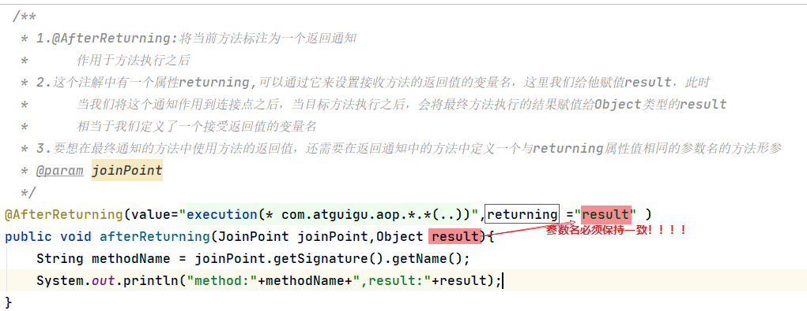

#### 5.3.6 异常通知与@AfterThrowing⭐

异常通知在方法抛出异常的时候执行，在异常通知的方法中可对方法的异常进行操作！！！！

~~~java
 /**
     * @AfterThrowing:将方法标注为异常通知！（例外通知）
     * 当方法抛出异常时作用
     * 可通过throwing设置接收方法返回的异常信息
     * 在参数列表中可通过具体的异常类型来对指定的异常信息进行操作！
     */
   @AfterThrowing(value="execution(* com.atguigu.aop.*.*(..))" ,throwing = "ex")
    public void afterThrowing(Exception ex){
       System.out.println("有异常了！，message:"+ex);
   }
~~~

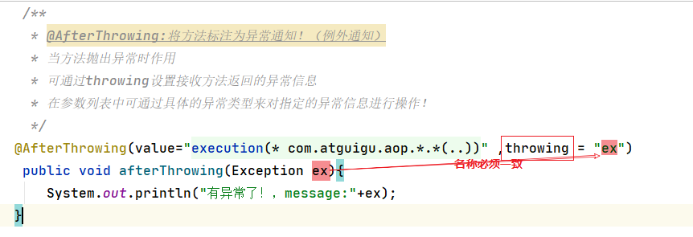

#### 5.3.7 环绕通知与@Around⭐

- 对于环绕通知来说，连接点的参数类型必须是ProceedingJoinPoint。它是 JoinPoint的子接口，允许控制何时执行，是否执行连接点。

- 在环绕通知中需要明确调用ProceedingJoinPoint的proceed()方法来执行被代理的方法。如果忘记这样做就会导致通知被执行了，但目标方法没有被执行。

- 注意：环绕通知的方法需要返回目标方法执行之后的结果，即调用 joinPoint.proceed();的返回值，否则会出现空指针异常。

~~~java
 /**
     * 1.@Around注解：标记当前方法是一个环绕通知方法
     * 2.环绕通知中需要控制方法的执行，
     * 3.同时方法的参数为ProceedingJoinPoint   ProceedingJoinPoint extends JoinPoint，
     */
   @Around(value="execution(* com.atguigu.aop.*.*(..))")
    public Object around(ProceedingJoinPoint joinPoint){
       Object result= null;
       try {
           // 前置通知
           System.out.println("前置通知");
           result = joinPoint.proceed();// 执行方法，相当于代理模式中的method.invoke();
           // 返回通知
           System.out.println("返回通知");
           return result;
       } catch (Throwable throwable) {
           throwable.printStackTrace();
           // 异常通知
           System.out.println("异常通知");
       }finally{
           // 最终通知
           System.out.println("最终通知");
       }
       return 0;
   }
~~~

#### 5.3.8 定义一个公共的切入点表达式与@Pointcut⭐

-  在编写AspectJ切面时，可以直接在通知注解中书写切入点表达式。但同一个切点表达式可能会在多个通知中重复出现。

- 在AspectJ切面中，可以通过==**@Pointcut注解**==将一个切入点声明成简单的方法。切入点的方法体通常是空的，因为将切入点定义与应用程序逻辑混在一起是不合理的。

-  切入点方法的访问控制符同时也控制着这个切入点的可见性。如果切入点要在多个切面中共用，最好将它们集中在一个公共的类中。在这种情况下，它们必须被声明为public。在引入这个切入点时，必须将类名也包括在内。如果类没有与这个切面放在同一个包中，还必须包含包名。

-   ==其他通知可以通过@Pointcut注解所在的方法名称引入该切入点，从而复用切入点表达式！==

~~~java
@Pointcut(value="execution(* com.atguigu.aop.*.*(..))")
    public void test(){

    }


    @Before(value="test()")
    public void beforeMethod(JoinPoint joinPoint){
        // 获取方法的参数
        Object[] args = joinPoint.getArgs();
        // 获取方法名
        String name = joinPoint.getSignature().getName();
        System.out.println("methodName:"+name+",arguments:"+ Arrays.toString(args));
   }
~~~

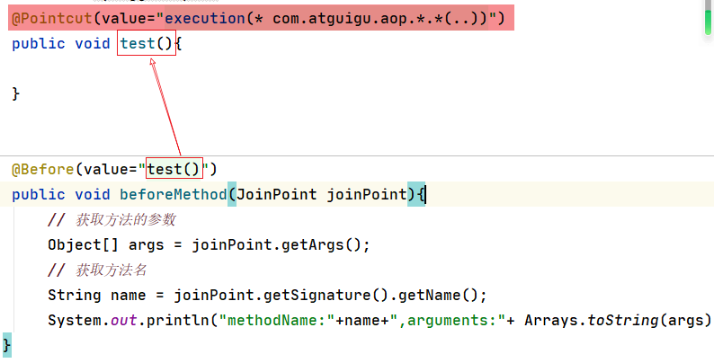

#### 5.3.9 切面的优先级与@Order

1) 在同一个连接点上应用不止一个切面时，除非明确指定，否则它们的优先级是不确定的。

2) 切面的优先级可以通过实现Ordered接口或利用@Order注解指定。

3) 实现Ordered接口，getOrder()方法的返回值越小，优先级越高。

4) 若使用@Order注解，序号出现在注解中，值越小，优先级越高

`@Order`:定义切面的优先级，值越小优先级越高！默认值为int的最大值

~~~java
package com.atguigu.aop;

import org.aspectj.lang.JoinPoint;
import org.aspectj.lang.annotation.*;
import org.springframework.core.annotation.Order;
import org.springframework.stereotype.Component;

import java.util.Arrays;

/**
 * @Order注解：用来控制多个切面的优先级
 *       值越小，优先级越高！
 */
@Component
@Aspect
@Order(2)
public class MyLoggerAspect {
    @Before(value="execution(* com.atguigu.aop.*.*(..))")
    public void beforeMethod(JoinPoint joinPoint){
        // 获取方法的参数
        Object[] args = joinPoint.getArgs();
        // 获取方法名
        String name = joinPoint.getSignature().getName();
        System.out.println("methodName:"+name+",arguments:"+ Arrays.toString(args));
   }

}

~~~

~~~java
package com.atguigu.aop;

import org.aspectj.lang.annotation.Aspect;
import org.aspectj.lang.annotation.Before;
import org.springframework.core.annotation.Order;
import org.springframework.stereotype.Component;

@Order(1)
@Component
@Aspect
public class MyLoggerAspect2 {
    @Before(value="execution(* com.atguigu.aop.*.*(..))")
    public void before(){
        System.out.println("MyLoggerAspect2的前置通知！");
    }
}


~~~

~~~java
package com.atguigu.aop;

import javafx.application.Application;
import org.springframework.context.ApplicationContext;
import org.springframework.context.support.ClassPathXmlApplicationContext;

public class Test {
    public static void main(String[] args) {
        ApplicationContext ioc = new ClassPathXmlApplicationContext("aop.xml");
        // 这里面需要写接口的类型，而不能写接口的具体实现类的类型，因为会生成代理对象！
        MathI mathImpl = ioc.getBean("mathImpl", MathI.class);
        int add = mathImpl.add(1, 0);
        System.out.println(add);

    }
}
---------------------------------------------------------------------------------------
MyLoggerAspect2的前置通知！
methodName:add,arguments:[1, 0]
1
~~~

**总结：**

- ==**基于注解的AOP中切面和target目标对象通过切入点表达式联系起来**==
- ==**切面和target目标对象都需要被Spring的IOC容器管理起来**==
- ==**在通过getBean获取bean的时候，如果要指定Class类型，需要指定为接口的类型！！！**==

#### 5.3.10 注解总结

AOP注解详解

##### @Aspect

- 名称：@Aspect

- 类型：**注解**

- 位置：类定义上方

- 作用：设置当前类为切面类

- 格式：

  ```java
  @Aspect
  public class AopAdvice {
  }
  ```

- 说明：一个beans标签中可以配置多个aop:config标签

##### @Pointcut

- 名称：@Pointcut

- 类型：**注解**

- 位置：方法定义上方

- 作用：使用当前方法名作为切入点引用名称

- 格式：

  ```java
  @Pointcut("execution(* *(..))")
  public void pt() {
  }
  ```

- 说明：被修饰的方法忽略其业务功能，格式设定为无参无返回值的方法，方法体内空实现（非抽象）

##### @Before

- 名称：@Before

- 类型：**注解**

- 位置：方法定义上方

- 作用：标注当前方法作为前置通知

- 格式：

  ```java
  @Before("pt()")
  public void before(){
  }
  ```

- 特殊参数：

  - 无

##### @After

- 名称：@After

- 类型：**注解**

- 位置：方法定义上方

- 作用：标注当前方法作为后置通知

- 格式：

  ```java
  @After("pt()")
  public void after(){
  }
  ```

- 特殊参数：

  - 无

##### @AfterReturning

- 名称：@AfterReturning

- 类型：**注解**

- 位置：方法定义上方

- 作用：标注当前方法作为返回后通知

- 格式：

  ```java
  @AfterReturning(value="pt()",returning = "ret")
  public void afterReturning(Object ret) {
  }
  ```

- 特殊参数：

  - returning ：设定使用通知方法参数接收返回值的变量名

##### @AfterThrowing

- 名称：@AfterThrowing

- 类型：**注解**

- 位置：方法定义上方

- 作用：标注当前方法作为异常后通知

- 格式：

  ```java
  @AfterThrowing(value="pt()",throwing = "t")
  public void afterThrowing(Throwable t){
  }
  ```

- 特殊参数：

  - throwing ：设定使用通知方法参数接收原始方法中抛出的异常对象名

##### @Around

- 名称：@Around

- 类型：**注解**

- 位置：方法定义上方

- 作用：标注当前方法作为环绕通知

- 格式：

  ```java
  @Around("pt()")
  public Object around(ProceedingJoinPoint pjp) throws Throwable {
      Object ret = pjp.proceed();
      return ret;
  }
  ```

- 特殊参数：

  - 无

### 5.4 基于XML的AOP

这是Spring自己实现AOP的方式，通过XML实现.同时Spring提供对AspectJ注解配置AOP的集成

#### 5.4.1 案例演示

**接口**

~~~java
package com.atguigu.aopXml.service;

public interface UserService {
    void save();
}
~~~

**实体类**

~~~java
package com.atguigu.aopXml.service.impl;


import com.atguigu.aopXml.service.UserService;

public class UserServiceImpl implements UserService {
    @Override
    public void save() {

        // System.out.println("共性功能");
        System.out.println(" user service running....");
    }
}
~~~

**切面类**

~~~java
package com.atguigu.aopXml.service.aop;
// 1制作一个通知类，在类中定义一个方法用于完成共性功能
public class AOPAdvice {
    public void function(){
        System.out.println("共性功能");
    }
}
~~~

**配置文件**

~~~xml
<?xml version="1.0" encoding="UTF-8"?>
<beans xmlns="http://www.springframework.org/schema/beans"
       xmlns:xsi="http://www.w3.org/2001/XMLSchema-instance"
       xmlns:util="http://www.springframework.org/schema/util"
       xmlns:context="http://www.springframework.org/schema/context"
       xmlns:aop="http://www.springframework.org/schema/aop"
       xsi:schemaLocation="http://www.springframework.org/schema/beans
       http://www.springframework.org/schema/beans/spring-beans.xsd http://www.springframework.org/schema/util
       https://www.springframework.org/schema/util/spring-util.xsd http://www.springframework.org/schema/context https://www.springframework.org/schema/context/spring-context.xsd http://www.springframework.org/schema/aop https://www.springframework.org/schema/aop/spring-aop.xsd">

    <bean id="userService" class="com.atguigu.aopXml.service.impl.UserServiceImpl"></bean>

    <!--2.配置切面成为Spring控制的资源 -->
    <bean id="myAdvice" class="com.atguigu.aopXml.service.aop.AOPAdvice"></bean>

    <!--
    <aop:config>:声明AOP的配置
    -->
    <aop:config>
        <!--
        <aop:pointcut>:配置切入点表达式：
                  作用：用来定位连接点
        -->
        <aop:pointcut id="pt" expression="execution(* *..*(..))"/>
       <!--
       <aop:aspect>:配置AOP的切面
             属性ref：指定AOP切面类
       -->
        <aop:aspect ref="myAdvice">
              <!--
               <aop:before> :配置前置通知
                  属性method：指定前置通知实现的具体功能
                  属性pointcut-ref：配置切入点表达式，用来确定连接点
               -->
              <aop:before method="function" pointcut-ref="pt"></aop:before>
        </aop:aspect>
    </aop:config>
</beans>
~~~

**测试**

~~~java
package com.atguigu.aopXml.service;

import org.springframework.context.ApplicationContext;
import org.springframework.context.support.ClassPathXmlApplicationContext;

public class App {
    public static void main(String[] args) {
        ApplicationContext ioc =  new ClassPathXmlApplicationContext("applicationContext.xml");
        UserService userService = ioc.getBean("userService", UserService.class);
        userService.save();
    }
}
~~~

#### 5.4.2 标签的具体解释⭐

##### aop:config

- 名称：aop:config

- 类型：**标签**

- 归属：beans标签

- 作用：设置AOP

- 格式：

  ```xml
  <beans>
      <aop:config>……</aop:config>
      <aop:config>……</aop:config>
  </beans>
  ```

- 说明：一个beans标签中可以配置多个aop:config标签

##### aop:aspect

- 名称：aop:aspect

- 类型：**标签**

- 归属：aop:config标签

- 作用：设置具体的AOP通知对应的切入点

- 格式：

  ```xml
  <aop:config>
      <aop:aspect ref="beanId">……</aop:aspect>
      <aop:aspect ref="beanId">……</aop:aspect>
  </aop:config>
  ```

- 说明：

  一个aop:config标签中可以配置多个aop:aspect标签

- 基本属性：

  - ref ：通知所在的bean的id

##### aop:pointcut

- 名称：aop:pointcut

- 类型：**标签**

- 归属：aop:config标签、aop:aspect标签

- 作用：设置切入点

- 格式：

  ```xml
  <aop:config>
      <aop:pointcut id="pointcutId" expression="……"/>
      <aop:aspect>
          <aop:pointcut id="pointcutId" expression="……"/>
      </aop:aspect>
  </aop:config>
  ```

- 说明：

  一个aop:config标签中可以配置多个aop:pointcut标签，且该标签可以配置在aop:aspect标签内

- 基本属性：

  - id ：识别切入点的名称

  - expression ：切入点表达式

#### 5.4.3 通知类型⭐

AOP的通知类型共5种

- 前置通知：原始方法执行前执行，如果通知中抛出异常，阻止原始方法运行

  应用：数据校验

- 后置通知：原始方法执行后执行，==无论原始方法中是否出现异常，都将执行通知==

  应用：现场清理

- 返回后通知：原始==方法正常执行完毕并返回结果后执行==，如果原始方法中抛出异常，无法执行

  应用：返回值相关数据处理

- 抛出异常后通知：原始方法抛出异常后执行，如果原始方法没有抛出异常，无法执行

  应用：对原始方法中出现的异常信息进行处理

- 环绕通知：在原始方法执行前后均有对应执行执行，还可以阻止原始方法的执行

  应用：十分强大，可以做任何事情

##### aop:before

- 名称：aop:before

- 类型：**标签**

- 归属：aop:aspect标签

- 作用：设置前置通知

- 格式：

  ```xml
  <aop:aspect ref="adviceId">
      <aop:before method="methodName" pointcut="……"/>
  </aop:aspect>
  ```

- 说明：一个aop:aspect标签中可以配置多个aop:before标签

- 基本属性：

  - method ：在通知类中设置当前通知类别对应的方法

  - pointcut ：设置当前通知对应的切入点表达式，与pointcut-ref属性冲突

  - pointcut-ref ：设置当前通知对应的切入点id，与pointcut属性冲突

##### aop:after

- 名称：aop:after

- 类型：**标签**

- 归属：aop:aspect标签

- 作用：设置后置通知

- 格式：

  ```xml
  <aop:aspect ref="adviceId">
      <aop:after method="methodName" pointcut="……"/>
  </aop:aspect>
  ```

- 说明：一个aop:aspect标签中可以配置多个aop:after标签

- 基本属性：

  - method ：在通知类中设置当前通知类别对应的方法

  - pointcut ：设置当前通知对应的切入点表达式，与pointcut-ref属性冲突

  - pointcut-ref ：设置当前通知对应的切入点id，与pointcut属性冲突

##### aop:after-returning

- 名称：aop:after-returning

- 类型：**标签**

- 归属：aop:aspect标签

- 作用：设置返回后通知

- 格式：

  ```xml
  <aop:aspect ref="adviceId">
      <aop:after-returning method="methodName" pointcut="……"/>
  </aop:aspect>
  ```

- 说明：一个aop:aspect标签中可以配置多个aop:after-returning标签

- 基本属性：

  - method ：在通知类中设置当前通知类别对应的方法

  - pointcut ：设置当前通知对应的切入点表达式，与pointcut-ref属性冲突

  - pointcut-ref ：设置当前通知对应的切入点id，与pointcut属性冲突

##### aop:after-throwing

- 名称：aop:after-throwing

- 类型：**标签**

- 归属：aop:aspect标签

- 作用：设置抛出异常后通知

- 格式：

  ```xml
  <aop:aspect ref="adviceId">
      <aop:after-throwing method="methodName" pointcut="……"/>
  </aop:aspect>
  ```

- 说明：一个aop:aspect标签中可以配置多个aop:after-throwing标签

- 基本属性：

  - method ：在通知类中设置当前通知类别对应的方法

  - pointcut ：设置当前通知对应的切入点表达式，与pointcut-ref属性冲突

  - pointcut-ref ：设置当前通知对应的切入点id，与pointcut属性冲突

##### aop:around

- 名称：aop:around

- 类型：**标签**

- 归属：aop:aspect标签

- 作用：设置环绕通知

- 格式：

  ```xml
  <aop:aspect ref="adviceId">
      <aop:around method="methodName" pointcut="……"/>
  </aop:aspect>
  ```

- 说明：一个aop:aspect标签中可以配置多个aop:around标签

- 基本属性：

  - method ：在通知类中设置当前通知类别对应的方法

  - pointcut ：设置当前通知对应的切入点表达式，与pointcut-ref属性冲突

  - pointcut-ref ：设置当前通知对应的切入点id，与pointcut属性冲突

环绕通知的开发方式

- 环绕通知是在原始方法的前后添加功能，==在环绕通知中，必须存在对原始方法的显式调用==

  ```java
  public Object around(ProceedingJoinPoint pjp) throws Throwable {
      Object ret = pjp.proceed();
      return ret;
  }
  ```

- 环绕通知方法相关说明：

  - 方法须设定Object类型的返回值，否则会拦截原始方法的返回。如果原始方法返回值类型为void，通知方	也可以设定返回值类型为void，最终返回null

  - 方法需在第一个参数位置设定==ProceedingJoinPoint对象==，通过该对象调用proceed()方法，实现对原始方法的调用。如省略该参数，原始方法将无法执行

  - 使用proceed()方法调用原始方法时，因无法预知原始方法运行过程中是否会出现异常，强制抛出Throwable对象，封装原始方法中可能出现的异常信息

#### 5.4.4 切入点的配置

在Spring的xml配置AOP中，切入点有三种配置方式：**公共切入点，局部切入点，私有切入点**

- `公共切入点`:在<aop:config>与<aop:aspect>之间，可以被多个切面所引用！

~~~xml
<?xml version="1.0" encoding="UTF-8"?>
<beans xmlns="http://www.springframework.org/schema/beans"
       xmlns:xsi="http://www.w3.org/2001/XMLSchema-instance"
       xmlns:util="http://www.springframework.org/schema/util"
       xmlns:context="http://www.springframework.org/schema/context"
       xmlns:aop="http://www.springframework.org/schema/aop"
       xsi:schemaLocation="http://www.springframework.org/schema/beans
       http://www.springframework.org/schema/beans/spring-beans.xsd http://www.springframework.org/schema/util
       https://www.springframework.org/schema/util/spring-util.xsd http://www.springframework.org/schema/context https://www.springframework.org/schema/context/spring-context.xsd http://www.springframework.org/schema/aop https://www.springframework.org/schema/aop/spring-aop.xsd">

    <bean id="userService" class="com.atguigu.aopXml.service.impl.UserServiceImpl"></bean>

    <!--2.配置切面成为Spring控制的资源 -->
    <bean id="myAdvice" class="com.atguigu.aopXml.service.aop.AOPAdvice"></bean>

    <!--<aop:config>:声明AOP的配置-->
    <aop:config>
        <!--
        <aop:pointcut>:配置切入点表达式：
                  作用：用来定位连接点
                  此时这里是公共切入点，可以被多个切面所引用！
        -->
        <aop:pointcut id="pt" expression="execution(* *..*(..))"/>
       <!--
       <aop:aspect>:配置AOP的切面
             属性ref：指定AOP切面类
       -->
        <aop:aspect ref="myAdvice">
              <!--
               <aop:before> :配置前置通知
                  属性method：指定前置通知实现的具体功能
                  属性pointcut-ref：配置切入点表达式，用来确定连接点
               -->
              <aop:before method="function" pointcut-ref="pt"></aop:before>
        </aop:aspect>
    </aop:config>
</beans>
~~~

- `局部切入点`:位置在<aop:aspect>标签的内部

~~~xml
<?xml version="1.0" encoding="UTF-8"?>
<beans xmlns="http://www.springframework.org/schema/beans"
       xmlns:xsi="http://www.w3.org/2001/XMLSchema-instance"
       xmlns:util="http://www.springframework.org/schema/util"
       xmlns:context="http://www.springframework.org/schema/context"
       xmlns:aop="http://www.springframework.org/schema/aop"
       xsi:schemaLocation="http://www.springframework.org/schema/beans
       http://www.springframework.org/schema/beans/spring-beans.xsd http://www.springframework.org/schema/util
       https://www.springframework.org/schema/util/spring-util.xsd http://www.springframework.org/schema/context https://www.springframework.org/schema/context/spring-context.xsd http://www.springframework.org/schema/aop https://www.springframework.org/schema/aop/spring-aop.xsd">

    <bean id="userService" class="com.atguigu.aopXml.service.impl.UserServiceImpl"></bean>

    <!--2.配置切面成为Spring控制的资源 -->
    <bean id="myAdvice" class="com.atguigu.aopXml.service.aop.AOPAdvice"></bean>

    <!--<aop:config>:声明AOP的配置-->
    <aop:config>
       <!--
       <aop:aspect>:配置AOP的切面
             属性ref：指定AOP切面类
       -->
        <aop:aspect ref="myAdvice">
            <!--
               <aop:pointcut>:配置切入点表达式：
                 作用：用来定位连接点
                 此时这里是局部切入点
            -->
            <aop:pointcut id="pt2" expression="execution(* *..*(..))"/>
              <!--
               <aop:before> :配置前置通知
                  属性method：指定前置通知实现的具体功能
                  属性pointcut-ref：配置切入点表达式，用来确定连接点
               -->
              <aop:before method="function" pointcut-ref="pt2"></aop:before>
        </aop:aspect>
    </aop:config>
</beans>
~~~

- `私有切入点`：位置在AOP各种类型的通知标签的pointcut属性对应的值中！

~~~xml
<?xml version="1.0" encoding="UTF-8"?>
<beans xmlns="http://www.springframework.org/schema/beans"
       xmlns:xsi="http://www.w3.org/2001/XMLSchema-instance"
       xmlns:util="http://www.springframework.org/schema/util"
       xmlns:context="http://www.springframework.org/schema/context"
       xmlns:aop="http://www.springframework.org/schema/aop"
       xsi:schemaLocation="http://www.springframework.org/schema/beans
       http://www.springframework.org/schema/beans/spring-beans.xsd http://www.springframework.org/schema/util
       https://www.springframework.org/schema/util/spring-util.xsd http://www.springframework.org/schema/context https://www.springframework.org/schema/context/spring-context.xsd http://www.springframework.org/schema/aop https://www.springframework.org/schema/aop/spring-aop.xsd">

    <bean id="userService" class="com.atguigu.aopXml.service.impl.UserServiceImpl"></bean>

    <!--2.配置切面成为Spring控制的资源 -->
    <bean id="myAdvice" class="com.atguigu.aopXml.service.aop.AOPAdvice"></bean>

    <!--<aop:config>:声明AOP的配置-->
    <aop:config>
       <!--
       <aop:aspect>:配置AOP的切面
             属性ref：指定AOP切面类
       -->
        <aop:aspect ref="myAdvice">
              <!--
               <aop:before> :配置前置通知
                  属性method：指定前置通知实现的具体功能
                  属性pointcut-ref：配置切入点表达式，用来确定连接点
               -->
            <!-- pointcut属性：
                 用来配置私有切入点：只针对当前的通知有效，
            -->
              <aop:before method="function" pointcut="execution(* *..*(..))"></aop:before>
        </aop:aspect>
    </aop:config>
</beans>
~~~

#### 5.4.5 通知顺序的控制

当同一个切入点配置了多个通知时，通知会存在运行的先后顺序，该顺序以==通知配置的顺序==为准

- before和around谁配置在前面先执行谁，after和around谁配置在后面后执行谁！
- 同种类型的多个通知之间以配置的顺序为准！

#### 5.4.6 获取通知的各种信息⭐

##### 通知中获取参数

对于目标对象中如果其方法有参数，我们可以通过两种方法获取方法的参数

第一种情况：

- 设定通知方法第一个参数为JoinPoint，通过该对象调用getArgs()方法，获取原始方法运行的参数数组

  ```java
  public void before(JoinPoint jp) throws Throwable {
      Object[] args = jp.getArgs();
  }
  ```

- 所有的通知均可以获取参数

第二种情况：

- 设定切入点表达式为通知方法传递参数（锁定通知变量名）

- 原始方法

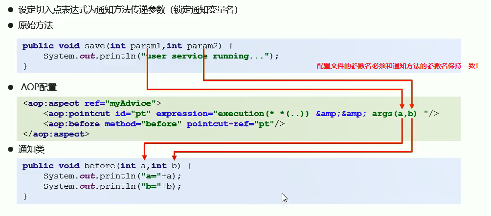

第三种情况

- 设定切入点表达式为通知方法传递参数（改变通知变量名的定义顺序）
- 原始方法

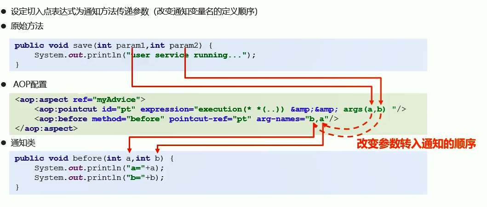

##### 通知中获取返回值

能拿到方法返回值的只有两种通知：**返回通知与环绕通知**

第一种：返回值变量名

- 设定返回值变量名

- 原始方法

  ```java
  public int save() {
  	System.out.println("user service running...");
      return 100;
  }
  ```

- AOP配置

  ```xml
  <aop:aspect ref="myAdvice">
      <aop:pointcut id="pt3" expression="execution(* *(..))  "/>
      <aop:after-returning method="afterReturning" pointcut-ref="pt3" returning="ret"/>
  </aop:aspect>
  ```

- 通知类

  ```java
  public void afterReturning(Object ret) {
      System.out.println(ret);
  }
  ```

- 适用于==返回后通知（after-returning），且配置文件变量名与通知方法参数名需要保持一致==

第二种：

- 在通知类的方法中调用原始方法获取返回值

- 原始方法

  ```java
  public int save() {
      System.out.println("user service running...");
      return 100;
  }
  ```

- AOP配置l

  ```xml
  <aop:aspect ref="myAdvice">
      <aop:pointcut id="pt2" expression="execution(* *(..))  "/>
      <aop:around method="around" pointcut-ref="pt2" />
  </aop:aspect>
  ```

- 通知类

  ```java
  public Object around(ProceedingJoinPoint pjp) throws Throwable {
      Object ret = pjp.proceed();
      return ret;
  }
  ```

- 适用于环绕通知（around）

#####  通知中获取异常对象

第一种：

- 设定异常对象变量名

- 原始方法

  ```java
  public void save() {
      System.out.println("user service running...");
      int i = 1/0;
  }
  ```

- AOP配置

  ```xml
  <aop:aspect ref="myAdvice">
  	<aop:pointcut id="pt4" expression="execution(* *(..))  "/>
      <aop:after-throwing method="afterThrowing" pointcut-ref="pt4" throwing="t"/>
  </aop:aspect>
  ```

- 通知类

  ```java
  public void afterThrowing(Throwable t){
      System.out.println(t.getMessage());
  }
  ```

- 适用于==返回后通知（after-throwing），且配置文件变量名与通知方法参数名需要保持一致==

第二种：通知类的方法中调用原始方法捕获异常

- 在通知类的方法中调用原始方法捕获异常

- 原始方法

  ```java
  public void save() {
      System.out.println("user service running...");
      int i = 1/0;
  }
  ```

- AOP配置

  ```xml
  <aop:aspect ref="myAdvice">
      <aop:pointcut id="pt4" expression="execution(* *(..))  "/>
      <aop:around method="around" pointcut-ref="pt4" />
  </aop:aspect>
  ```

- 通知类

  ```java
  public Object around(ProceedingJoinPoint pjp) throws Throwable {
      Object ret = pjp.proceed();	//对此处调用进行try……catch……捕获异常，或抛出异常
      return ret;
  }
  ```

- 适用于环绕通知（around）

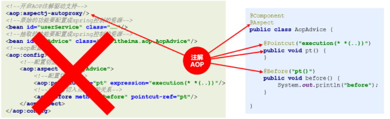

### **5.5 代理模式的选择**

Spirng可以通过配置的形式控制使用的代理形式，默认使用jdkproxy，通过配置可以修改为使用cglib

- XML配置

  ```xml
  <!--XMP配置AOP-->
  <aop:config proxy-target-class="false"></aop:config>
  ```

- XML注解支持

  ```xml
  <!--注解配置AOP-->
  <aop:aspectj-autoproxy proxy-target-class="false"/>
  ```

- 注解驱动

  ```java
  //注解驱动
  @EnableAspectJAutoProxy(proxyTargetClass = true)
  ```

## 6 Spring中的JDBCTemplate

为了使JDBC更加易于使用，Spring在JDBC API上定义了一个抽象层，以此建立一个JDBC存取框架。  

作为Spring JDBC框架的核心，JDBC模板的设计目的是为不同类型的JDBC操作（CRUD ）提供模板方法，通过这种方式，可以在尽可能保留灵活性的情况下，将数据库存取的工作量降到最低。

可以将Spring的JdbcTemplate看作是一个小型的轻量级持久化层框架

### 6.1 环境准备

所需要的jar包

-  IOC容器所需要的JAR包

commons-logging-1.1.1.jar

 spring-beans-4.0.0.RELEASE.jar

spring-context-4.0.0.RELEASE.jar

spring-core-4.0.0.RELEASE.jar

spring-expression-4.0.0.RELEASE.jar

- JdbcTemplate所需要的JAR包

 spring-jdbc-4.0.0.RELEASE.jar

spring-orm-4.0.0.RELEASE.jar

spring-tx-4.0.0.RELEASE.jar

- 数据库驱动和数据源

 druid-1.1.9.jar

 mysql-connector-java-5.1.7-bin.jar

==配置文件==

~~~properties
# k = v
jdbc.driver = com.mysql.jdbc.Driver
jdbc.url = jdbc:mysql://localhost:3306/spring
jdbc.username = root
jdbc.password = 123456
~~~

==主配置文件==

~~~xml
<?xml version="1.0" encoding="UTF-8"?>
<beans xmlns="http://www.springframework.org/schema/beans"
       xmlns:xsi="http://www.w3.org/2001/XMLSchema-instance"
       xmlns:util="http://www.springframework.org/schema/util"
       xmlns:context="http://www.springframework.org/schema/context"
       xmlns:aop="http://www.springframework.org/schema/aop"
       xsi:schemaLocation="http://www.springframework.org/schema/beans
       http://www.springframework.org/schema/beans/spring-beans.xsd http://www.springframework.org/schema/util
       https://www.springframework.org/schema/util/spring-util.xsd http://www.springframework.org/schema/context https://www.springframework.org/schema/context/spring-context.xsd http://www.springframework.org/schema/aop https://www.springframework.org/schema/aop/spring-aop.xsd">
    <!--
     PropertyPlaceholderConfigurer:引入资源文件这个类的作用与
        标签 <context:property-placeholder location="db.properties"/> 作用一致！
     -->
    <bean class="org.springframework.beans.factory.config.PropertyPlaceholderConfigurer">
        <property name="location" value="db.properties"></property>
    </bean>

    <!-- 创建数据源-->
    <bean id="dataSource" class="com.alibaba.druid.pool.DruidDataSource">
           <property name="driverClassName" value="${jdbc.driver}"></property>
           <property name="url" value="${jdbc.url}"></property>
           <property name="username" value="${jdbc.username}"></property>
           <property name="password" value="${jdbc.password}"></property>
       </bean>
    <!-- 通过数据源创建JDBCTemplate-->
       <bean id="jdbcTemplate" class="org.springframework.jdbc.core.JdbcTemplate">
        <property name="dataSource" ref="dataSource"></property>
      </bean>

</beans>
~~~

==建表语句==

~~~mysql
CREATE TABLE `emp` (
  `eid` int(11) NOT NULL PRIMARY KEY AUTO_INCREMENT,
  `ename` varchar(255) DEFAULT NULL,
  `age` int(11) DEFAULT NULL,
  `sex` varchar(255) DEFAULT NULL,
) 

~~~

==实体类==

~~~java
package com.atguigu.jdbcTemplate;

public class Emp {
    private Integer eid;
    private String ename;
    private Integer age;
    private String sex;

    public Integer getEid() {
        return eid;
    }

    public void setEid(Integer eid) {
        this.eid = eid;
    }

    public String getEname() {
        return ename;
    }

    public void setEname(String ename) {
        this.ename = ename;
    }

    public Integer getAge() {
        return age;
    }

    public void setAge(Integer age) {
        this.age = age;
    }

    public String getSex() {
        return sex;
    }

    public void setSex(String sex) {
        this.sex = sex;
    }

    @Override
    public String toString() {
        return "Emp{" +
                "eid=" + eid +
                ", ename='" + ename + '\'' +
                ", age=" + age +
                ", sex='" + sex + '\'' +
                '}';
    }
}


~~~

**测试**

~~~java
package com.atguigu.jdbcTemplate;

import org.springframework.context.ApplicationContext;
import org.springframework.context.support.ClassPathXmlApplicationContext;
import org.springframework.jdbc.core.JdbcTemplate;

public class Test {
    @org.junit.Test
    public void test(){
       ApplicationContext ioc = new ClassPathXmlApplicationContext("applicationContext.xml");
        JdbcTemplate jdbcTemplate = ioc.getBean("jdbcTemplate", JdbcTemplate.class);
        System.out.println(jdbcTemplate);
    }
}
----------------------------------------
org.springframework.jdbc.core.JdbcTemplate@49e202ad
~~~

### 6.2 JDBC的增删改方法

在jdbc中增删改可以用同一个方法实现！

~~~java
package com.atguigu.jdbcTemplate;

import org.springframework.context.ApplicationContext;
import org.springframework.context.support.ClassPathXmlApplicationContext;
import org.springframework.jdbc.core.JdbcTemplate;

public class Test {
    @org.junit.Test
    public void test(){
       ApplicationContext ioc = new ClassPathXmlApplicationContext("applicationContext.xml");
        JdbcTemplate jdbcTemplate = ioc.getBean("jdbcTemplate", JdbcTemplate.class);
        // jdbcTemplate.update("insert into emp values(null,'张三',23,'男')");
        String sql  = "insert into emp values (null,?,?,?)";
        jdbcTemplate.update(sql,"李四",24,"女");
    }
}
~~~

### 6.3 JDBC的批量增删改

==JdbcTemplate.batchUpdate(String, List<Object[]>)==

- Object[]封装了SQL语句每一次执行时所需要的参数

-  List集合封装了SQL语句多次执行时的所有参数

~~~java
package com.atguigu.jdbcTemplate;

import org.springframework.context.ApplicationContext;
import org.springframework.context.support.ClassPathXmlApplicationContext;
import org.springframework.jdbc.core.JdbcTemplate;

import java.util.ArrayList;
import java.util.List;

public class Test {
    @org.junit.Test
    public void test(){
       ApplicationContext ioc = new ClassPathXmlApplicationContext("applicationContext.xml");
       JdbcTemplate jdbcTemplate = ioc.getBean("jdbcTemplate", JdbcTemplate.class);
       // 测试jdbcTemplate的批量功能
        String sql  ="insert into emp values(null,?,?,?)";
        List<Object[]> list  = new ArrayList<>();
        list.add(new Object[]{"a1",1,"男"});
        list.add(new Object[]{"a2",2,"男"});
        list.add(new Object[]{"a3",3,"男"});
        jdbcTemplate.batchUpdate(sql,list);
    }
}
~~~

###  6.4 JDBCTemplate的查询

|      | 方法                                                         | 描述             |
| ---- | ------------------------------------------------------------ | ---------------- |
| 1    | <T> T  queryForObject(String var1, Class<T> requiredType),最终查询出来的类型对应的class对象 | 用来获取单个的值 |
| 2    | <T> T queryForObject(String var1, RowMapper<T> var2)         | 用来获取单行记录 |
| 3    | <T> List<T> query(String sql, RowMapper<T> rowMapper)        | 用来获取多条数据 |

~~~java
package com.atguigu.jdbcTemplate;

import org.springframework.context.ApplicationContext;
import org.springframework.context.support.ClassPathXmlApplicationContext;
import org.springframework.jdbc.core.BeanPropertyRowMapper;
import org.springframework.jdbc.core.JdbcTemplate;
import org.springframework.jdbc.core.RowMapper;


public class Test {
    @org.junit.Test
    public void test(){
        ApplicationContext ioc = new ClassPathXmlApplicationContext("applicationContext.xml");
        JdbcTemplate jdbcTemplate = ioc.getBean("jdbcTemplate", JdbcTemplate.class);
        String sql  = "select eid,ename,age,sex from emp where eid=?";
        RowMapper<Emp> rowMapper = new BeanPropertyRowMapper<>(Emp.class);// 将列名（可以是字段名或字段名的别名）与属性名进行映射
        Emp emp = jdbcTemplate.queryForObject(sql, new Object[]{1}, rowMapper);
        System.out.println(emp);
        sql = "select count(*) from emp";
        Integer count = jdbcTemplate.queryForObject(sql, Integer.class);
        System.out.println(count);
    }
}
~~~

## 7.Spring Task定时任务

SpringTask定时任务使用简单且功能强大，支持cron表达式！

### 7.1 xml注解方式配置定时任务

**定时任务类**

~~~java
package com.atguigu.task;

import org.springframework.stereotype.Component;

import java.text.SimpleDateFormat;
import java.util.Date;

@Component
public class TaskJob {
    private SimpleDateFormat df = new SimpleDateFormat("yyyy-MM-dd HH:mm:ss");

    /*定义定时任务的方法*/
    public void job1(){
        System.out.println("任务1:"+df.format(new Date()));
    }

    /*定义定时任务的方法*/
    public void job2(){
        System.out.println("任务2:"+df.format(new Date()));
    }
}

~~~

**配置文件**

~~~xml
<?xml version="1.0" encoding="UTF-8"?>
<beans xmlns="http://www.springframework.org/schema/beans"
       xmlns:xsi="http://www.w3.org/2001/XMLSchema-instance"
       xmlns:context="http://www.springframework.org/schema/context"
       xmlns:task="http://www.springframework.org/schema/task"
       xsi:schemaLocation="http://www.springframework.org/schema/beans http://www.springframework.org/schema/beans/spring-beans.xsd http://www.springframework.org/schema/context https://www.springframework.org/schema/context/spring-context.xsd http://www.springframework.org/schema/task http://www.springframework.org/schema/task/spring-task.xsd">
    <!--开启Spring的包扫描 -->
    <context:component-scan base-package="com.atguigu.task"></context:component-scan>

    <!--
    配置定时任务的规则:
        标签<task:scheduled-tasks>：用来指定配置定时任务，
        子标签<task:scheduled>：代表每一个具体的定时任务，可以配置多个
              属性：
                  ref：指代任务类
                  method：定时任务执行的方法
                  cron：代表cron表达式，用来配置时间规则！
    -->

    <task:scheduled-tasks>
        <!--可以配置多个定时任务 -->
        <!--定时任务1 -->
        <task:scheduled ref="taskJob" method="job1" cron="0/2 * * * * ?"/>
        <!--定时任务2 -->
        <task:scheduled ref="taskJob" method="job2" cron="0/5 * * * * ?"/>
    </task:scheduled-tasks>
</beans>
~~~

**测试**

~~~java
package com.atguigu.task;

import org.springframework.context.ApplicationContext;
import org.springframework.context.support.ClassPathXmlApplicationContext;

public class Test {
    public static void main(String[] args) {
        // 加载Spring的上下文环境
        ApplicationContext ioc  =new ClassPathXmlApplicationContext("spring.xml");
        // 获取定时任务类
        TaskJob taskJob = (TaskJob)ioc.getBean("taskJob");
    }
}
~~~

==注意==

- 不能使用junit单元测试去测试定时任务
- 定时任务所在的类需要交给Spring管理
- 需要定时任务相关的命名空间

~~~xml
<?xml version="1.0" encoding="UTF-8"?>
<beans xmlns="http://www.springframework.org/schema/beans"
       xmlns:xsi="http://www.w3.org/2001/XMLSchema-instance"
       xmlns:context="http://www.springframework.org/schema/context"
       xmlns:task="http://www.springframework.org/schema/task"
       xsi:schemaLocation="http://www.springframework.org/schema/beans
       http://www.springframework.org/schema/beans/spring-beans.xsd
       http://www.springframework.org/schema/context
       https://www.springframework.org/schema/context/spring-context.xsd
       http://www.springframework.org/schema/task
       http://www.springframework.org/schema/task/spring-task.xsd">
~~~


### 7.2 注解形式配置定时任务⭐

主要是**@Scheduled**注解的使用！

**1.编写任务处理类**

~~~java
package com.atguigu.task;

import org.springframework.scheduling.annotation.Scheduled;
import org.springframework.stereotype.Component;

import java.text.SimpleDateFormat;
import java.util.Date;

@Component
public class TaskJob {
    private SimpleDateFormat df = new SimpleDateFormat("yyyy-MM-dd HH:mm:ss");

    /*定义定时任务的方法
    * @Scheduled:
    *    用来标记当前方法是一个定时任务方法
    *    属性：cron：设定定时任务时间调度规则
    * */
    @Scheduled(cron = "0/2 * * * * ?")
    public void job1(){
        System.out.println("任务1:"+df.format(new Date()));
    }

    /*定义定时任务的方法*/
    @Scheduled(cron = "0/5 * * * * ?")
    public void job2(){
        System.out.println("任务2:"+df.format(new Date()));
    }
}

~~~

**2.引入名称空间，开启定时任务驱动**

~~~xml
<?xml version="1.0" encoding="UTF-8"?>
<beans xmlns="http://www.springframework.org/schema/beans"
       xmlns:xsi="http://www.w3.org/2001/XMLSchema-instance"
       xmlns:context="http://www.springframework.org/schema/context"
       xmlns:task="http://www.springframework.org/schema/task"
       xsi:schemaLocation="http://www.springframework.org/schema/beans
       http://www.springframework.org/schema/beans/spring-beans.xsd
       http://www.springframework.org/schema/context
       https://www.springframework.org/schema/context/spring-context.xsd
       http://www.springframework.org/schema/task
       http://www.springframework.org/schema/task/spring-task.xsd">
    <!--开启Spring的包扫描 -->
    <context:component-scan base-package="com.atguigu.task"></context:component-scan>
    <!---
       开启定时任务驱动
       只有开启这个驱动，Spring才能识别 @Scheduled注解
    -->
    <task:annotation-driven></task:annotation-driven>
</beans>
~~~

**测试**

~~~java
package com.atguigu.task;

import org.springframework.context.ApplicationContext;
import org.springframework.context.support.ClassPathXmlApplicationContext;

public class Test {
    public static void main(String[] args) {
        // 加载Spring的上下文环境
        ApplicationContext ioc  =new ClassPathXmlApplicationContext("spring.xml");
        // 获取定时任务类
        TaskJob taskJob = (TaskJob)ioc.getBean("taskJob");
    }
}
----------------------------------------------------
十一月 07, 2021 12:06:45 上午 org.springframework.scheduling.annotation.ScheduledAnnotationBeanPostProcessor finishRegistration
信息: No TaskScheduler/ScheduledExecutorService bean found for scheduled processing
任务1:2021-11-07 00:06:46
任务1:2021-11-07 00:06:48
任务1:2021-11-07 00:06:50
任务2:2021-11-07 00:06:50
~~~

###  7.3 Cron表达式简介

关于CronExpression表达式有至少6个（也可能是7个）由空格分隔的时间元素，从左到右，这些元素的定义如下：

- 1.秒（0-59）
- 2.分钟（0-59）
- 3.小时（0-23）
- 4.月份中的日期（1-31）
- 5.月份（1-12或者JAN-DEC）
- 6.星期中的日期（1-7或者SUN-SAT）
- 7.年份（1970-2099）

~~~java
0 0 10.14.16 * * ?
    
每天上午10点，下午2点和下午4点
~~~

~~~java
0 0,15,30,45 * 1-10 * ?
    
每月前10天每隔15分钟
~~~

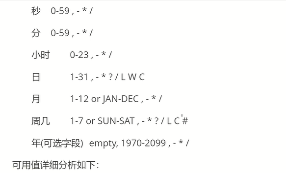

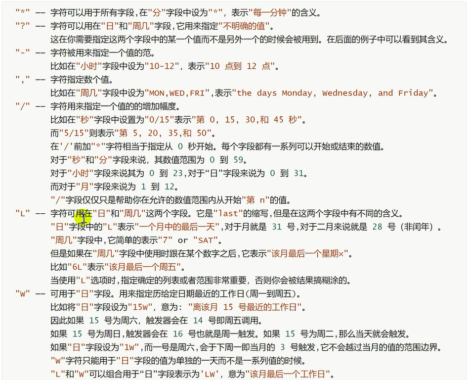

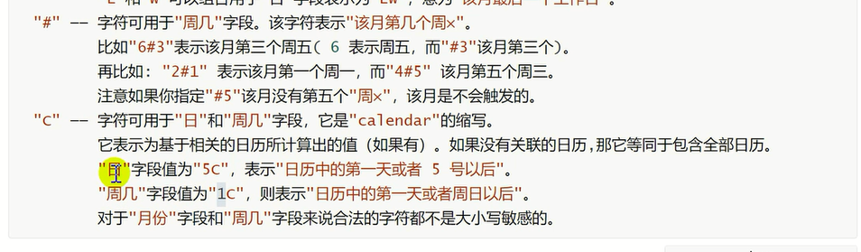

~~~java
每一个域可出现的字符如下：
Seconds:可出现",- * /"四个字符，有效范围为0-59的整数
Minutes:可出现",- * /"四个字符，有效范围为0-59的整数
Hours:可出现",- * /"四个字符，有效范围为0-23的整数
DayofMonth:可出现",- * / ? L W C"八个字符，有效范围为0-31的整数
Month:可出现",- * /"四个字符，有效范围为1-12的整数或JAN-DEc
DayofWeek:可出现",- * / ? L C #"四个字符，有效范围为1-7的整数或SUN-SAT两个范围。1表示星期天，2表示星期一， 依次类推
Year:可出现",- * /"四个字符，有效范围为1970-2099年

每一个域都使用数字，但还可以出现如下特殊字符，它们的含义是：
(1)：表示匹配该域的任意值，假如在Minutes域使用,即表示每分钟都会触发事件。

(2)?:只能用在DayofMonth和DayofWeek两个域。它也匹配域的任意值，但实际不会。因为DayofMonth和DayofWeek会相互影响。例如想在每月的20日触发调度，不管20日到底是星期几，则只能使用如下写法： 13 13 15 20 ?,其中最后一位只能用？，而不能使用，如果使用*表示不管星期几都会触发，实际上并不是这样。

(3)-:表示范围，例如在Minutes域使用5-20，表示从5分到20分钟每分钟触发一次

(4)/：表示起始时间开始触发，然后每隔固定时间触发一次，例如在Minutes域使用5/20,则意味着5分钟触发一次，而25，45等分别触发一次.

(5),:表示列出枚举值值。例如：在Minutes域使用5,20，则意味着在5和20分每分钟触发一次。

(6)L:表示最后，只能出现在DayofWeek和DayofMonth域，如果在DayofWeek域使用5L,意味着在最后的一个星期四触发。

(7)W:表示有效工作日(周一到周五),只能出现在DayofMonth域，系统将在离指定日期的最近的有效工作日触发事件。例如：在 DayofMonth使用5W，如果5日是星期六，则将在最近的工作日：星期五，即4日触发。如果5日是星期天，则在6日(周一)触发；如果5日在星期一到星期五中的一天，则就在5日触发。另外一点，W的最近寻找不会跨过月份

(8)LW:这两个字符可以连用，表示在某个月最后一个工作日，即最后一个星期五。

(9)#:用于确定每个月第几个星期几，只能出现在DayofMonth域。例如在4#2，表示某月的第二个星期三。

举几个例子:
0 0 2 1 ? 表示在每月的1日的凌晨2点调度任务
0 15 10 ? * MON-FRI 表示周一到周五每天上午10：15执行作业
0 15 10 ? 6L 2002-2006 表示2002-2006年的每个月的最后一个星期五上午10:15执行作

一个cron表达式有至少6个（也可能7个）有空格分隔的时间元素。
按顺序依次为
秒（0~59）
分钟（0~59）
小时（0~23）
天（月）（0~31，但是你需要考虑你月的天数）
月（0~11）
天（星期）（1~7 1=SUN 或 SUN，MON，TUE，WED，THU，FRI，SAT）
年份（1970－2099）

其中每个元素可以是一个值(如6),一个连续区间(9-12),一个间隔时间(8-18/4)(/表示每隔4小时),一个列表(1,3,5),通配符。由于"月份中的日期"和"星期中的日期"这两个元素互斥的,必须要对其中一个设置?
~~~

## 8.Spring处理事务⭐⭐

Spring的事务管理是AOP最经典的体现！！！！

- 在JavaEE企业级开发的应用领域，为了保证数据的**完整性**和**一致性**，必须引入数据库事务的概念，所以事务管理是企业级应用程序开发中必不可少的技术。

- 事务就是一组由于逻辑上紧密关联而合并成一个整体(工作单元)的多个数据库操作，这些操作**要么都执行**，**要么都不执行**。

- 事务的四个关键属性(ACID)

​     ①**原子性**(atomicity)：“原子”的本意是“**不可再分**”，事务的原子性表现为一个事务中涉及到的多个操作在逻辑上缺一不可。事务的原子性要求事务中的所有操作要么都执行，要么都不执行。

​     ②**一致性**(consistency)：“一致”指的是数据的一致，具体是指：所有数据都处于**满足业务规则的一致性状态**。一致性原则要求：一个事务中不管涉及到多少个操作，都必须保证事务执行之前数据是正确的，事务执行之后数据仍然是正确的。如果一个事务在执行的过程中，其中某一个或某几个操作失败了，则必须将其他所有操作撤销，将数据恢复到事务执行之前的状态，这就是**回滚**。

​     ③**隔离性**(isolation)：在应用程序实际运行过程中，事务往往是并发执行的，所以很有可能有许多事务同时处理相同的数据，因此每个事务都应该与其他事务隔离开来，防止数据损坏。隔离性原则要求多个事务在**并发执行过程中不会互相干扰**。

​     ④**持久性**(durability)：持久性原则要求事务执行完成后，对数据的修改**永久的保存**下来，不会因各种系统错误或其他意外情况而受到影响。通常情况下，事务对数据的修改应该被写入到持久化存储器中。


**编程式事务管理**

-  使用原生的JDBC API进行事务管理

​     ①获取数据库连接Connection对象

​     ②取消事务的自动提交

​     ③执行操作

​     ④正常完成操作时手动提交事务

​     ⑤执行失败时回滚事务

​     ⑥关闭相关资源

- 评价

​          使用原生的**JDBC API**实现事务管理是所有事务管理方式的基石，同时也是最典型  的编程式事务管理。编程式事务管理需要将事务管理代码**嵌入到业务方法中**来控制事务  的提交和回滚。在使用编程的方式管理事务时，必须在每个事务操作中包含额外的事务   管理代码。相对于**核心业务**而言，事务管理的代码显然属于**非核心业务**，如果多个模块   都使用同样模式的代码进行事务管理，显然会造成较大程度的**代码冗余**。

**声明式事务管理**

​     大多数情况下声明式事务比编程式事务管理更好：它将事务管理代码从业务方法中分离出来，以声明的方式来实现事务管理。

​     事务管理代码的固定模式作为一种横切关注点，可以通过AOP方法模块化，进而借助Spring AOP框架实现声明式事务管理。

​     Spring在不同的事务管理API之上定义了一个**抽象层**，通过**配置**的方式使其生效，从而让应用程序开发人员**不必了解事务管理****API****的底层实现细节**，就可以使用Spring的事务管理机制。

​    ==Spring既支持编程式事务管理，也支持声明式的事务管理==

### 8.1 Spring提供的事务管理器

​     Spring从不同的事务管理API中抽象出了一整套事务管理机制，让事务管理代码从特定的事务技术中独立出来。开发人员通过配置的方式进行事务管理，而不必了解其底层是如何实现的。

​     Spring的核心事务管理抽象是它为事务管理封装了一组独立于技术的方法。==无论使用Spring的哪种事务管理策略(编程式或声明式)，事务管理器都是必须的==。

​     事务管理器可以以普通的bean的形式声明在Spring IOC容器中。

### 8.2 事务管理器的主要实现

-  DataSourceTransactionManager：在应用程序中只需要处理一个数据源，而且通过JDBC存取。

- JtaTransactionManager：在JavaEE应用服务器上用JTA(Java Transaction API)进行事务管理

- HibernateTransactionManager：用Hibernate框架存取数据库

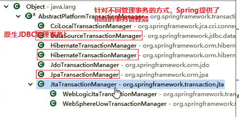

### 8.3 注解管理事务⭐

通过注解配置事务需要注意：

- ==需要配置事务管理的bean,并将其交给Spring管理==
- ==引入相应的名称空间将事务管理器与Spring的事务驱动结合起来==，底层就会通过AOP作用到方法上

```xml
...........
<!--
    配置事务管理器 ：
       1.要想让事务管理器对事务进行管理，需要将事务管理器交给Spring容器管理！
       2.这里我们用原生JDBC管理事务，故配置为：DataSourceTransactionManager
       3.事务管理器管理的是连接对象中的事务：如何归滚，如何提交！
    -->
    <bean id="dataSourceTransactionManager" class="org.springframework.jdbc.datasource.DataSourceTransactionManager">
        <!--管理的是当前数据源产生的链接对象！ -->
        <property name="dataSource" ref="dataSource"></property>
    </bean>
<!--
开启注解事务驱动：
   即对事务相关的注解进行扫描，解析含义并且执行功能！
   我们需要将事务管理器配置给transaction-manager属性，
      底层是将dataSourceTransactionManager对应的事务管理器通过AOP作用到业务方法上！
 -->
<tx:annotation-driven transaction-manager="dataSourceTransactionManager"></tx:annotation-driven>
```

- 在service层方法上加入@Transaction注解

#### 8.3.1 简单实现

具体实现如下：

**配置文件**

~~~xml
<?xml version="1.0" encoding="UTF-8"?>
<beans xmlns="http://www.springframework.org/schema/beans"
       xmlns:xsi="http://www.w3.org/2001/XMLSchema-instance"
       xmlns:util="http://www.springframework.org/schema/util"
       xmlns:context="http://www.springframework.org/schema/context"
       xmlns:aop="http://www.springframework.org/schema/aop" xmlns:tx="http://www.springframework.org/schema/tx"
       xsi:schemaLocation="http://www.springframework.org/schema/beans
       http://www.springframework.org/schema/beans/spring-beans.xsd http://www.springframework.org/schema/util
       https://www.springframework.org/schema/util/spring-util.xsd http://www.springframework.org/schema/context https://www.springframework.org/schema/context/spring-context.xsd http://www.springframework.org/schema/aop https://www.springframework.org/schema/aop/spring-aop.xsd http://www.springframework.org/schema/tx http://www.springframework.org/schema/tx/spring-tx.xsd">
    <!--
     配置注解的包扫描！
     -->
    <context:component-scan base-package="com.atguigu.book"></context:component-scan>
    <!--
     PropertyPlaceholderConfigurer:引入资源文件这个类的作用与
        标签 <context:property-placeholder location="db.properties"/> 作用一致！
     -->
    <bean class="org.springframework.beans.factory.config.PropertyPlaceholderConfigurer">
        <property name="location" value="db.properties"></property>
    </bean>

    <!-- 创建数据源-->
    <bean id="dataSource" class="com.alibaba.druid.pool.DruidDataSource">
           <property name="driverClassName" value="${jdbc.driver}"></property>
           <property name="url" value="${jdbc.url}"></property>
           <property name="username" value="${jdbc.username}"></property>
           <property name="password" value="${jdbc.password}"></property>
       </bean>
      <!-- 通过数据源创建JDBCTemplate-->
    <bean id="jdbcTemplate" class="org.springframework.jdbc.core.JdbcTemplate">
        <property name="dataSource" ref="dataSource"></property>
    </bean>


    <!--
    配置事务管理器 ：
       1.要想让事务管理器对事务进行管理，需要将事务管理器交给Spring容器管理！
       2.这里我们用原生JDBC管理事务，故配置为：DataSourceTransactionManager
       3.事务管理器管理的是连接对象中的事务：如何归滚，如何提交！
    -->
    <bean id="dataSourceTransactionManager" class="org.springframework.jdbc.datasource.DataSourceTransactionManager">
        <!--管理的是当前数据源产生的链接对象！ -->
        <property name="dataSource" ref="dataSource"></property>
    </bean>
    <!--
    开启注解事务驱动：
       即对事务相关的注解进行扫描，解析含义并且执行功能！
       我们需要将事务管理器配置给transaction-manager属性，
          底层是将dataSourceTransactionManager对应的事务管理器通过AOP作用到业务方法上！
@Transaction注解才会被解析成相对应的功能！
     -->
    <tx:annotation-driven transaction-manager="dataSourceTransactionManager"></tx:annotation-driven>
</beans>
~~~

**controller层**

~~~java
package com.atguigu.book.controller;

import com.atguigu.book.service.BookService;
import org.springframework.beans.factory.annotation.Autowired;
import org.springframework.stereotype.Controller;

@Controller
public class BookController {
    @Autowired
    private BookService bookService;
    public void buyBook(){
        bookService.buyBook("1","1001");
    }
}


~~~

**service层**

==**对应方法加上@Transactional注解**==

~~~java
package com.atguigu.book.service;

public interface BookService {
    void buyBook(String bid,String uid);
}
~~~

~~~java
package com.atguigu.book.service.Impl;

import com.atguigu.book.dao.BookDao;
import com.atguigu.book.service.BookService;
import org.springframework.beans.factory.annotation.Autowired;
import org.springframework.stereotype.Service;
import org.springframework.transaction.annotation.Transactional;

@Service
public class BookServiceImpl  implements BookService {

    @Autowired
    private BookDao bookDao;

    @Override
    @Transactional
    public void buyBook(String bid, String uid) {
        int price = bookDao.selectPrice(bid);
        bookDao.updateSt(bid);
        bookDao.updateBalance(uid,price);
    }
}
~~~

**dao层**

~~~java
package com.atguigu.book.dao;

public interface BookDao {
    // 查询书的价格
    int selectPrice(String bid);
    // 减库存
    void updateSt(String bid);
    // 减余额
    void updateBalance(String uid,int price);
}
~~~

~~~java
package com.atguigu.book.dao.impl;

import com.atguigu.book.dao.BookDao;
import org.springframework.beans.factory.annotation.Autowired;
import org.springframework.jdbc.core.JdbcTemplate;
import org.springframework.stereotype.Repository;

@Repository
public class BookDaoImpl  implements BookDao {
    @Autowired
    private JdbcTemplate jdbcTemplate;

    @Override
    public int selectPrice(String bid) {
        Integer price = jdbcTemplate.queryForObject("select  price from book1 where bid =?", new Object[]{bid}, Integer.class);
        return price;
    }

    @Override
    public void updateSt(String bid) {
        // 先获取该书籍的库存
        Integer st = jdbcTemplate.queryForObject("select stoc from stock where sid =?", new Object[]{bid}, Integer.class);
        if(st<=0){
             throw new RuntimeException();
        }else{
            jdbcTemplate.update("update stock set stoc = stoc-1 where sid =? ",bid);
        }
    }


    @Override
    public void updateBalance(String uid,int price) {
        Integer integer = jdbcTemplate.queryForObject("select balance from money where uid =? ", new Object[]{uid}, Integer.class);
        if(integer<price){
            throw new RuntimeException("要加钱！");
        }else{
            jdbcTemplate.update("update money set balance = balance-? where uid =? ",price,uid);
        }
    }
}
~~~

#### 8.3.2 @Transaction注解的属性

~~~java
     /**
     *  @Transactional注解：对方法中所有的操作作为一个事务进行管理
     *  1.既可以在方法上使用，也可以在类上使用
     *     在方法上使用，只对方法有效
     *     在类上使用，对类中所有的方法都有效果！
     *  2.当类上也有@Transactional注解，并且
     *     类上的注解的属性和方法上的注解的属性相同时，依据”就近原则“，以方法上的属性的值为准！
     *     类上的注解的属性和方法上的注解的属性不同时，则属性叠加！
     *  3.@Transactional注解常用属性 ：
     * 
     *    propagation:传播行为
     *
     *    isolation：隔离级别
     *
     *    timeout：超时
     *
     *    readOnly：只读属性
     *
     *    rollbackFor|rollbackForClassName|noRollbackFor|noRollbackForClassName
     */ 
     */
~~~

~~~java
// 
// Source code recreated from a .class file by IntelliJ IDEA
// (powered by Fernflower decompiler)
//
package org.springframework.transaction.annotation;

import java.lang.annotation.Documented;
import java.lang.annotation.ElementType;
import java.lang.annotation.Inherited;
import java.lang.annotation.Retention;
import java.lang.annotation.RetentionPolicy;
import java.lang.annotation.Target;
import org.springframework.core.annotation.AliasFor;

@Target({ElementType.TYPE, ElementType.METHOD})
@Retention(RetentionPolicy.RUNTIME)
@Inherited
@Documented
public @interface Transactional {
    @AliasFor("transactionManager")
    String value() default "";

    @AliasFor("value")
    String transactionManager() default "";

    String[] label() default {};

    Propagation propagation() default Propagation.REQUIRED;

    Isolation isolation() default Isolation.DEFAULT;

    int timeout() default -1;

    String timeoutString() default "";

    boolean readOnly() default false;

    Class<? extends Throwable>[] rollbackFor() default {};

    String[] rollbackForClassName() default {};

    Class<? extends Throwable>[] noRollbackFor() default {};

    String[] noRollbackForClassName() default {};
}

~~~

##### 8.3.2.1 propagation传播行为⭐

==**事务传播属性可以在@Transactional注解的propagation属性中定义。**==

当事务方法被另一个事务方法调用时，必须指定事务应该如何传播。例如：方法可能继续在现有事务中运行，也可能开启一个新事务，并在自己的事务中运行。

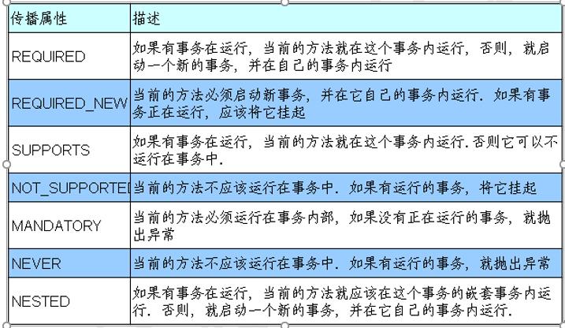

演示如下：

**表中数据如下：**

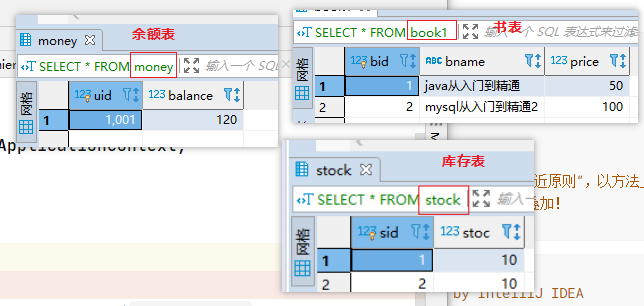

```xml
<?xml version="1.0" encoding="UTF-8"?>
<beans xmlns="http://www.springframework.org/schema/beans"
       xmlns:xsi="http://www.w3.org/2001/XMLSchema-instance"
       xmlns:util="http://www.springframework.org/schema/util"
       xmlns:context="http://www.springframework.org/schema/context"
       xmlns:aop="http://www.springframework.org/schema/aop" xmlns:tx="http://www.springframework.org/schema/tx"
       xsi:schemaLocation="http://www.springframework.org/schema/beans
       http://www.springframework.org/schema/beans/spring-beans.xsd http://www.springframework.org/schema/util
       https://www.springframework.org/schema/util/spring-util.xsd http://www.springframework.org/schema/context https://www.springframework.org/schema/context/spring-context.xsd http://www.springframework.org/schema/aop https://www.springframework.org/schema/aop/spring-aop.xsd http://www.springframework.org/schema/tx http://www.springframework.org/schema/tx/spring-tx.xsd">
    <!--
     配置注解的包扫描！
     -->
    <context:component-scan base-package="com.atguigu.book"></context:component-scan>
    <!--
     PropertyPlaceholderConfigurer:引入资源文件这个类的作用与
        标签 <context:property-placeholder location="db.properties"/> 作用一致！
     -->
    <bean class="org.springframework.beans.factory.config.PropertyPlaceholderConfigurer">
        <property name="location" value="db.properties"></property>
    </bean>

    <!-- 创建数据源-->
    <bean id="dataSource" class="com.alibaba.druid.pool.DruidDataSource">
           <property name="driverClassName" value="${jdbc.driver}"></property>
           <property name="url" value="${jdbc.url}"></property>
           <property name="username" value="${jdbc.username}"></property>
           <property name="password" value="${jdbc.password}"></property>
       </bean>
      <!-- 通过数据源创建JDBCTemplate-->
    <bean id="jdbcTemplate" class="org.springframework.jdbc.core.JdbcTemplate">
        <property name="dataSource" ref="dataSource"></property>
    </bean>


    <!--
    配置事务管理器 ：
       1.要想让事务管理器对事务进行管理，需要将事务管理器交给Spring容器管理！
       2.这里我们用原生JDBC管理事务，故配置为：DataSourceTransactionManager
       3.事务管理器管理的是连接对象中的事务：如何归滚，如何提交！
    -->
    <bean id="dataSourceTransactionManager" class="org.springframework.jdbc.datasource.DataSourceTransactionManager">
        <!--管理的是当前数据源产生的链接对象！ -->
        <property name="dataSource" ref="dataSource"></property>
    </bean>
    <!--
    开启注解事务驱动：
       即对事务相关的注解进行扫描，解析含义并且执行功能！
       我们需要将事务管理器配置给transaction-manager属性，
          底层是将dataSourceTransactionManager对应的事务管理器通过AOP作用到业务方法上！
     -->
    <tx:annotation-driven transaction-manager="dataSourceTransactionManager"></tx:annotation-driven>
</beans>
```

**处理一本书的逻辑**

**service**

~~~java
package com.atguigu.book.service;

public interface BookService {
    void buyBook(String bid,String uid);
}

~~~

~~~java
package com.atguigu.book.service.Impl;

import com.atguigu.book.dao.BookDao;
import com.atguigu.book.service.BookService;
import org.springframework.beans.factory.annotation.Autowired;
import org.springframework.stereotype.Service;
import org.springframework.transaction.annotation.Transactional;

@Service
public class BookServiceImpl  implements BookService {

    @Autowired
    private BookDao bookDao;

    /**
     *  @Transactional注解：对方法中所有的操作作为一个事务进行管理
     *  1.既可以在方法上使用，也可以在类上使用
     *     在方法上使用，只对方法有效
     *     在类上使用，对类中所有的方法都有效果！
     *  2.当类上也有@Transactional注解，并且
     *     类上的注解的属性和方法上的注解的属性相同时，依据”就近原则“，以方法上的属性的值为准！
     *     类上的注解的属性和方法上的注解的属性不同时，则属性叠加！
     */
    @Override
    @Transactional
    public void buyBook(String bid, String uid) {
        int price = bookDao.selectPrice(bid);
        bookDao.updateSt(bid);
        bookDao.updateBalance(uid,price);
    }
}

~~~

****

**dao**

~~~java
package com.atguigu.book.dao;

public interface BookDao {
    // 查询书的价格
    int selectPrice(String bid);
    // 减库存
    void updateSt(String bid);
    // 减余额
    void updateBalance(String uid,int price);
}
~~~

```java
package com.atguigu.book.dao.impl;

import com.atguigu.book.dao.BookDao;
import org.springframework.beans.factory.annotation.Autowired;
import org.springframework.jdbc.core.JdbcTemplate;
import org.springframework.stereotype.Repository;

@Repository
public class BookDaoImpl  implements BookDao {
    @Autowired
    private JdbcTemplate jdbcTemplate;

    @Override
    public int selectPrice(String bid) {
        Integer price = jdbcTemplate.queryForObject("select  price from book1 where bid =?", new Object[]{bid}, Integer.class);
        return price;
    }

    @Override
    public void updateSt(String bid) {
        // 先获取该书籍的库存
        Integer st = jdbcTemplate.queryForObject("select stoc from stock where sid =?", new Object[]{bid}, Integer.class);
        if(st<=0){
             throw new RuntimeException();
        }else{
            jdbcTemplate.update("update stock set stoc = stoc-1 where sid =? ",bid);
        }
    }


    @Override
    public void updateBalance(String uid,int price) {
        Integer integer = jdbcTemplate.queryForObject("select balance from money where uid =? ", new Object[]{uid}, Integer.class);
        if(integer<price){
            throw new RuntimeException("要加钱！");
        }else{
            jdbcTemplate.update("update money set balance = balance-? where uid =? ",price,uid);
        }
    }
}
```

**处理2本书的逻辑**

~~~java
package com.atguigu.book.service;

import java.util.List;

public interface Cashier {
    /**
     * 结账的方法，这里一次买多本书
     * @param uid 用户id
     * @param bids book编号的uid数组
     */
     void checkOut(String uid, List<String> bids);
}

~~~

~~~java
package com.atguigu.book.service.Impl;

import com.atguigu.book.service.BookService;
import com.atguigu.book.service.Cashier;
import org.springframework.beans.factory.annotation.Autowired;
import org.springframework.stereotype.Service;
import org.springframework.transaction.annotation.Transactional;

import java.util.List;
@Service
public class CashierServiceImpl implements Cashier {
    /**
     * 这里演示用，用到了另一个Service，是因为另一个Service实现了买一本书的操作！
     */
    @Autowired
    private BookService bookService;

    @Override
    @Transactional
    public void checkOut(String uid, List<String> bids) {
        for (String bid : bids) {
            // 有几本书，买书的操作就执行几次！
            bookService.buyBook(bid,uid);
        }
    }
}
~~~

可以看到，在处理两本书的时候，会调用两次service的buyBook方法，在checkOut没有注解@Transactional修饰，会出现一次购买成功，一次购买失败的情况，加了注解以后，则会出现购买不了的情况！！！！这是==由于传播行为的默认值是Propagation.REQUIRED：必须使用调用者的事务，也就是购买两本书的事务！！==

>     * propagation：传播行为
>     *     1.A方法和B方法都有事务，当A在调用B时，会将A中的事务传播给B方法，B方法对于事务的处理方式就是事物的传播行为
>     *         （B方法是新建一个事务还是用A传递过来的事务）
>     *     2.propagation属性常用值：
>     *          Propagation.REQUIRED：必须使用调用者的事务，也就是A的事务！
>     *          Propagation.REQUIRES_NEW:将调用者的事务挂起，不使用调用者的事务，而新建一个事务，也就是用B自己的事务！

`①REQUIRED传播行为`

当bookService的purchase()方法被另一个事务方法checkout()调用时，它==默认会在现有的事务内运行==。这个默认的传播行为就是REQUIRED。因此在checkout()方法的开始和终止边界内只有一个事务。这个事务只在checkout()方法结束的时候被提交，结果用户一本书都买不了。

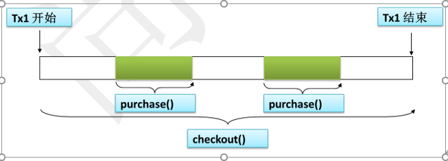

`②. REQUIRES_NEW传播行为`

表示==该方法必须启动一个新事务，并在自己的事务内运行。如果有事务在运行，就应该先挂起它。==

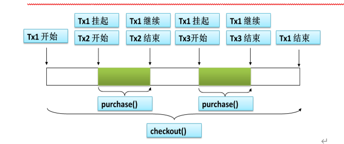

##### 8.3.2.2 isolation隔离级别⭐

==**用@Transactional注解声明式地管理事务时可以在@Transactional的isolation属性中设置隔离级别**==

数据库并发问题:

​     假设现在有两个事务：Transaction01和Transaction02并发执行。

- `脏读`:

​     ①Transaction01将某条记录的AGE值从20修改为30。

​     ②Transaction02读取了Transaction01更新后的值：30。

​     ③Transaction01回滚，AGE值恢复到了20。

​     ④Transaction02读取到的30就是一个无效的值。

- `不可重复读`:

​     ①Transaction01读取了AGE值为20。

​     ②Transaction02将AGE值修改为30。

​     ③Transaction01再次读取AGE值为30，和第一次读取不一致。

- `幻读`:

​     ①Transaction01读取了STUDENT表中的一部分数据。

​     ②Transaction02向STUDENT表中插入了新的行。

​     ③Transaction01读取了STUDENT表时，多出了一些行。

数据库系统必须具有隔离并发运行各个事务的能力，使它们不会相互影响，避免各种并发问题。**一个事务与其他事务隔离的程度称为隔离级别**。SQL标准中规定了多种事务隔离级别，不同隔离级别对应不同的干扰程度，隔离级别越高，数据一致性就越好，但并发性越弱。

- **读未提交**：``READ UNCOMMITTED`

允许Transaction01读取Transaction02未提交的修改。

- **读已提交**：``READ COMMITTED`

​       要求Transaction01只能读取Transaction02已提交的修改。

- **可重复读**：``REPEATABLE READ`

​       确保Transaction01可以多次从一个字段中读取到相同的值，即Transaction01执行期间禁止其它事务对这个字段进行更新。

- **串行化**：``SERIALIZABLE`

​       确保Transaction01可以多次从一个表中读取到相同的行，在Transaction01执行期间，禁止其它事务对这个表进行添加、更新、删除操作。可以避免任何并发问题，但性能十分低下。

==各个隔离级别解决并发问题的能力见下表==

|                  | 脏读 | 不可重复读 | 幻读 |
| ---------------- | ---- | ---------- | ---- |
| READ UNCOMMITTED | 有   | 有         | 有   |
| READ COMMITTED   | 无   | 有         | 有   |
| REPEATABLE READ  | 无   | 无         | 有   |
| SERIALIZABLE     | 无   | 无         | 无   |

 ==各种数据库产品对事务隔离级别的支持程度==

|                  | Oracle  | MySQL   |
| ---------------- | ------- | ------- |
| READ UNCOMMITTED | ×       | √       |
| READ COMMITTED   | √(默认) | √       |
| REPEATABLE READ  | ×       | √(默认) |
| SERIALIZABLE     | √       | √       |

>* isolation：事务的隔离级别，区分字段和记录条数，在并发的情况下，操作数据的一种规定
>     *     读未提交：存在”脏读“的情况 1
>     *     读已提交：能读到已经提交事务的数据，存在”不可重复读“的情况 2
>     *     可重复读：当前正在读取的表中存在的数据不允许任何的请求对他做任何的更新操作，存在”幻读“的情况，也就是新增，删除记录，针对表中的一行记录而言 4
>     *     串行化：相当于单线程，性能低，消耗大 8

##### 8.3.2.3 timeout超时属性⭐

超时事务属性：事务在强制回滚之前可以保持多久。这样可以防止长期运行的事务占用资源。

>* timeout：在事务强制回滚前最多可以执行（等待）的时间

一个请求超过timeout规定时间还没有执行完，我们就强制回滚！连接只有提交或回滚，才会被关闭！

##### 8.3.2.4 readOnly只读属性

只读事务属性: 表示这个事务只读取数据但不更新数据, 这样可以帮助数据库引擎优化事务。

>```java
>* readOnly：指定当前事务中的一系列操作是否为只读，如果设置为true，此时Spring会通知mysql，当前事务全是读的操作，不用对事务加锁，此时不管事务中有没有写的操作，mysql都会在请求访问数据的时候，不加锁，提高性能！
>* 但是如果有写的操作，建议一定不能设置为只读！
>```

##### 8.3.2.5 事务回滚的条件⭐

==默认情况下，只要@Transactional修饰的方法抛出异常就回滚==

我们可以通过属性设置异常回滚条件，因为什么而回滚|因为什么而不回滚

>```java
>* rollbackFor|rollbackForClassName|noRollbackFor|noRollbackForClassName：
>*     指定遇到时必须进行回滚的异常类型：
>*         rollbackFor：值为class类型
>*         rollbackForClassName：值为类的全限定名
>*     指定遇到时不回滚的异常类型：
>*         noRollbackFor：值为class类型
>*         noRollbackForClassName：值为类的全限定名
>```

 注解@Transactional 注解常用属性：

​     ① rollbackFor属性：指定遇到时必须进行回滚的异常类型，可以为多个

​     ② noRollbackFor属性：指定遇到时不回滚的异常类型，可以为多个

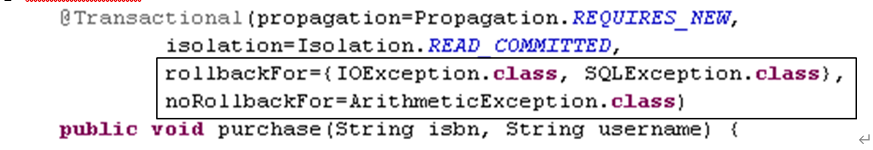

**总结**：

~~~java
 /**
     * @Transactional上可以设置的属性
     * propagation：传播行为
     *     1.A方法和B方法都有事务，当A在调用B时，会将A中的事务传播给B方法，B方法对于事务的处理方式就是事物的传播行为
     *         （B方法是新建一个事务还是用A传递过来的事务）
     *     2.propagation属性常用值：
     *          Propagation.REQUIRED：必须使用调用者的事务，也就是A的事务！
     *          Propagation.REQUIRES_NEW:不使用调用者的事务，而新建一个事务，也就是用B自己的事务！
     * isolation：事务的隔离级别，区分字段和记录条数，在并发的情况下，操作数据的一种规定
     *     读未提交：存在”脏读“的情况 1
     *     读已提交：能读到已经提交事务的数据，存在”不可重复读“的情况 2
     *     可重复读：当前正在读取的表中存在的数据不允许任何的请求对他做任何的更新操作，存在”幻读“的情况，也就是新增，删除记录，针对表中的一行记录而言 4
     *     串行化：相当于单线程，性能低，消耗大 8
     * timeout：在事务强制回滚前最多可以执行（等待）的时间
     *
     * readOnly：指定当前事务中的一系列操作是否为只读，如果设置为true，此时Spring会通知mysql，当前事务全是读的操作，不用对事务加锁
     *
     * rollbackFor|rollbackForClassName|noRollbackFor|noRollbackForClassName：设置事务回滚的
     *     指定遇到时必须进行回滚的异常类型：
     *         rollbackFor：值为class类型
     *         rollbackForClassName：值为类的全限定名
     *     指定遇到时不回滚的异常类型：
     *         noRollbackFor：值为class类型
     *         noRollbackForClassName：值为类的全限定名
     */
~~~

###  8.4 xml形式配置事务

~~~xml
<?xml version="1.0" encoding="UTF-8"?>
<beans xmlns="http://www.springframework.org/schema/beans"
       xmlns:xsi="http://www.w3.org/2001/XMLSchema-instance"
       xmlns:util="http://www.springframework.org/schema/util"
       xmlns:context="http://www.springframework.org/schema/context"
       xmlns:aop="http://www.springframework.org/schema/aop" xmlns:tx="http://www.springframework.org/schema/tx"
       xsi:schemaLocation="http://www.springframework.org/schema/beans
       http://www.springframework.org/schema/beans/spring-beans.xsd http://www.springframework.org/schema/util
       https://www.springframework.org/schema/util/spring-util.xsd http://www.springframework.org/schema/context https://www.springframework.org/schema/context/spring-context.xsd http://www.springframework.org/schema/aop https://www.springframework.org/schema/aop/spring-aop.xsd http://www.springframework.org/schema/tx http://www.springframework.org/schema/tx/spring-tx.xsd">
    <!--
     配置注解的包扫描！
     -->
    <context:component-scan base-package="com.atguigu.book"></context:component-scan>
    <!--
     PropertyPlaceholderConfigurer:引入资源文件这个类的作用与
        标签 <context:property-placeholder location="db.properties"/> 作用一致！
     -->
    <bean class="org.springframework.beans.factory.config.PropertyPlaceholderConfigurer">
        <property name="location" value="db.properties"></property>
    </bean>

    <!-- 创建数据源-->
    <bean id="dataSource" class="com.alibaba.druid.pool.DruidDataSource">
           <property name="driverClassName" value="${jdbc.driver}"></property>
           <property name="url" value="${jdbc.url}"></property>
           <property name="username" value="${jdbc.username}"></property>
           <property name="password" value="${jdbc.password}"></property>
       </bean>
      <!-- 通过数据源创建JDBCTemplate-->
    <bean id="jdbcTemplate" class="org.springframework.jdbc.core.JdbcTemplate">
        <property name="dataSource" ref="dataSource"></property>
    </bean>

    <!--
    事务管理器就相当于AOP中的切面！！！！
    -->
    <!--
    配置事务管理器 ：不管使用注解方式还是xml方式配置事务，一定要有事务管理器的支持！
       1.要想让事务管理器对事务进行管理，需要将事务管理器交给Spring容器管理！
       2.这里我们用原生JDBC管理事务，故配置为：DataSourceTransactionManager
       3.事务管理器管理的是连接对象中的事务：如何归滚，如何提交！
    -->
    <bean id="dataSourceTransactionManager" class="org.springframework.jdbc.datasource.DataSourceTransactionManager">
        <!--管理的是当前数据源产生的链接对象！ -->
        <property name="dataSource" ref="dataSource"></property>
    </bean>

    <!-- 配置事务通知,需要得到事务管理器的支持！-->
    <tx:advice id="tx" transaction-manager="dataSourceTransactionManager">
        <tx:attributes>
            <!--
            在设置好的切入点表达式下再次进行事务设置
            进一步确定在当前的切入点表达式下哪些方法需要被事务管理
            timeout="-1":代表永不超时
            -->
            <tx:method name="buyBook" propagation="REQUIRES_NEW" timeout="-1"/>
            <tx:method name="checkOut"></tx:method>
        </tx:attributes>
    </tx:advice>

    <aop:config>
        <!--配置切入点表达式 -->
        <aop:pointcut id="pointCut" expression="execution(* com.atguigu.book.service.Impl.*.*(..))"/>
       <!--将切入点表达式和事务通知联系起来 -->
        <aop:advisor advice-ref="tx" pointcut-ref="pointCut"></aop:advisor>
    </aop:config>

</beans>
~~~

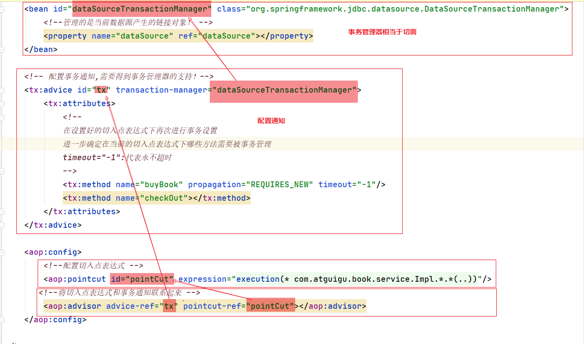

## 总结

- p命名空间用来进行依赖注入，给bean属性赋值，使用它需要引入约束
- util命名空间是用来定义集合属性的bean，使用它也需要引入约束
- <context:property-placeholder>标签主要用来加载外部资源文件，使用它也需要引入约束
- 注意：切面包含通知，一定要将切面交给Spring管理！
- 一定要配置<aop:aspectj-autoproxy>，当Spring IOC容器侦测到bean配置文件中的<aop:aspectj-autoproxy>元素时，会自动为与AspectJ切面匹配的bean创建代理


