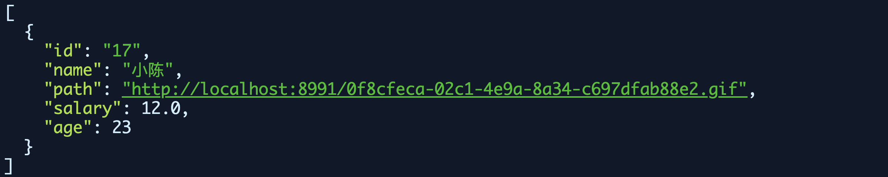
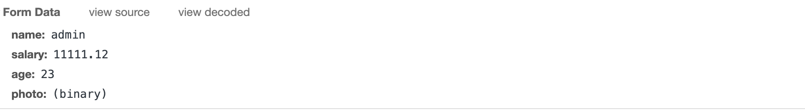

# Ems接口说明文档v1.0

## 用户模块

### 1.验证码接口

```markdown
# 1.接口说明
- 地址:  http://localhost:8992/user/getImage
- 请求方式: GET
- 请求参数: 无
- 响应结果: 必须是验证码的base64格式,如:
					{
						"src":"data:image/png;base64,/9j/4AAQSkZJRg......",
						"codeKey":"xxxx"
					}
- Base64  生成方式
```


```java
-- 提示:
ByteArrayOutputStream byteArrayOutputStream = new ByteArrayOutputStream();
VerifyCodeUtils.outputImage(120, 30, byteArrayOutputStream, code);
String data = "data:image/png;base64," + Base64Utils.encodeToString(byteArrayOutputStream.toByteArray());
```

### 2.用户注册接口

```markdown
# 1.接口说明
- 地址: http://localhost:8992/user/register?code=N5VQ&Codekey=xxxx
- 请求方式: POST
- 参数: {sex: "男", realname: "xiaoming", password: "123", username: "xiaozhang"} (json格式)
- 响应结果:
	成功: {"msg":"提示:注册成功!","state":true}
	失败: {"msg":"提示:用户名已存在!","state":false}
```

### 3.用户登录

```markdown
# 1.接口说明
- 地址: http://localhost:8992/user/login
- 请求方式: POST
- 参数: {username: "xiaochen", password: "123333"} (json格式)
- 响应结果:
	成功: 
			{"msg":"登录成功!","state":true,"user":{"id":"5","username":"xiaochen","realname":"小
			陈","password":"123","sex":"男","status":"已激活","registerTime":null}}
	失败: {"msg":"密码输入不正确!","state":false}
```

## 员工模块

### 1.员工列表

```markdown
# 1.接口说明
- 地址: http://localhost:8992/emp/findAll
- 请求方式: GET
- 请求参数: 无
- 响应结果:
```



### 2.保存员工信息

```markdown
# 1.接口说明
- 地址: http://localhost:8992/emp/save
- 请求方式: POST
- 请求参数: form data格式
```



```markdown
- 响应结果:
	成功: {"msg":"员工信息保存成功!","state":true}
	失败: {"msg":"员工信息保存失败!","state":false}
```

### 3.删除员工信息

```markdown
# 1.接口说明
- 地址: http://localhost:8992/emp/delete?id=17
- 请求方式: GET
- 请求参数: id
- 响应结果:
	成功: {"msg":"删除员工信息成功!","state":true}
	失败: {"msg":"删除员工信息失败!","state":false}
```

### 4.查看员工详细

```markdown
# 1.接口说明
- 地址: http://localhost:8992/emp/findOne?id=19
- 请求方式: GET
- 请求参数: id
- 响应结果:
	{"id":"19","name":"admin","path":"http://localhost:8991/73d01535-835f-4fc6-a7f4-44a9038798e4.gif","salary":11111.12,"age":23}
```

### 5.更新员工信息

```markdown
# 1.接口说明
- 地址: http://localhost:8992/emp/update
- 请求方式: POST
- 请求参数: form data emp对象 photo文件类型
```


```markdown
- 响应结果
	成功: {"msg":"员工信息保存成功!","state":true}
	错误: {"msg":"员工信息保存失败!","state":false}
```


