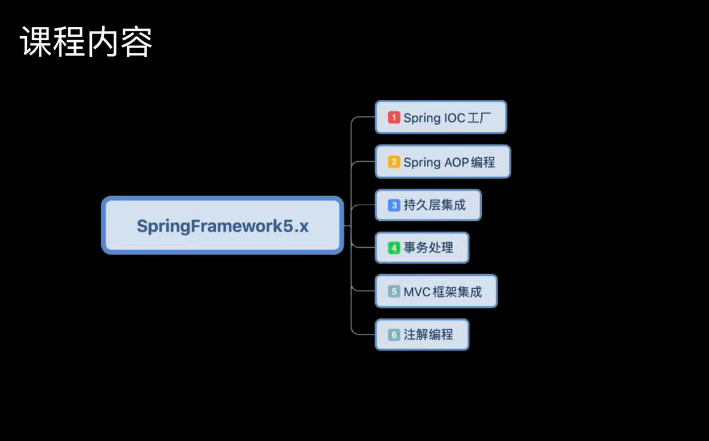
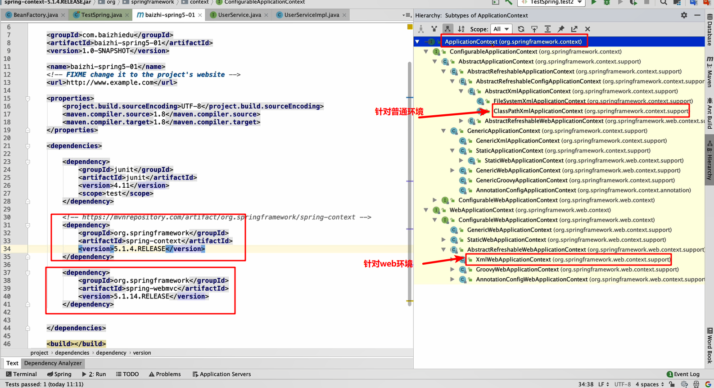
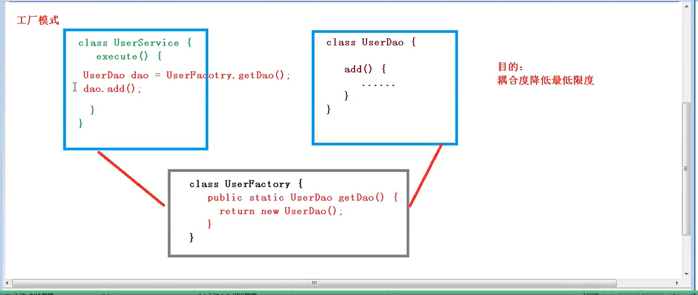
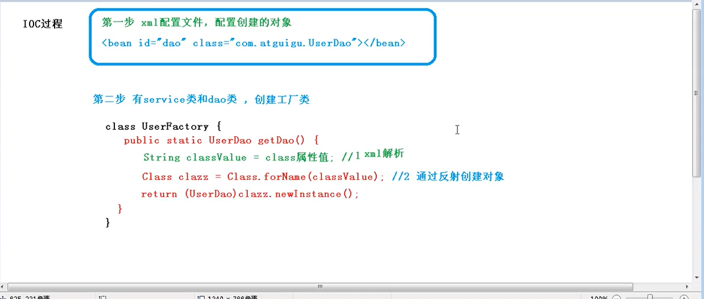

# Spring5

## 引言

EJB（Enterprise Java Bean）的缺陷

~~~java
1.运行环境苛刻
2.代码移植性差
所以EJB是一个重量级的框架
~~~

## 1.Spring框架概述

**轻量**

~~~markdown
# 1.对于运行环境没有额外的要求
    开源：tomcat resion jetty
    收费：weblogic websphere
# 2.代码移植性高：
    不需要实现额外的接口
~~~

**javaEE的解决方案**

~~~java
整个的javaEE开发都是分层完成的
    ** Controller 控制器（调用业务对象）
    ** Service 完成业务处理
    ** Dao 完成数据的访问和操作
    ** DB 数据库
可以解决每一层的问题
~~~

**整合了大量的优秀的设计模式**

~~~java
1.工厂设计模式
2.代理设计模式
3.模板设计
4.策略设计模式
。。。。。。
~~~

~~~java
1.Spring是一个轻量级的开源的JavaEE的解决方案框架
     **轻量级：jar包比较少，jar包体积小，可以不依赖其他jar包就可以使用
     **开源：开放源代码
     **框架：简化开发，解决企业应用开发的复杂性，更加方便
2.Spring有两哥核心部分：IOC && AOP
     **IOC：控制反转，把创建对象的过程交给S进行管理
     **AOP：面向切面，不修改源代码进行功能增强
3.Spring特点：
    **方便解耦，简化开发
    **AOP编程支持
    **方便程序测试
    **方便和其他框架进行整合
    **声明式事务，方便事务操作
    **Java源码是经典学习典范
4.下载地址：https://repo.spring.io/release/org/springframework/spring/
     
~~~

**结构图**

~~~java
1.创建一个普通的类
public class User {
    public void add(){
        System.out.println("add....");
    }
}

2.利用Spring配置文件创建对象User
<?xml version="1.0" encoding="UTF-8"?>
<beans xmlns="http://www.springframework.org/schema/beans"
       xmlns:xsi="http://www.w3.org/2001/XMLSchema-instance"
       xsi:schemaLocation="http://www.springframework.org/schema/beans http://www.springframework.org/schema/beans/spring-beans.xsd">
<!--配置User对象创建-->
    <bean id="user" class="com.atguigu.spring5.User"></bean>
</beans>
        
3.测试代码：
package com.atguigu.spring5.testDemo;

import com.atguigu.spring5.User;
import org.junit.Test;
import org.springframework.context.ApplicationContext;
import org.springframework.context.support.ClassPathXmlApplicationContext;

public class TestSpring5 {
    @Test
    public void testAdd(){
        //1.加载Spring配置文件
        ApplicationContext ap =new ClassPathXmlApplicationContext("bean1.xml");
        //2.获取配置创建的对象
        User user1 =(User)ap.getBean("user");
        User user2 = ap.getBean("user", User.class);
        //3.调用方法
        System.out.println(user2);
        user2.add();

    }
}
        

~~~

## 2.Spring的IOC容器、

**设计模式**

~~~java
1.广义概念
面向对象设计中，解决特定问题的经典代码！！！
2.狭义概念
GOF4人定义的23种设计模式！如：工厂，代理，模板，适配器.....
~~~

**工厂设计模式**

~~~java
1.概念：通过工厂类，创建对象
2.好处：解耦合
  耦合：指的是代码间的强关联关系，一方的改变会影响到另一方。
  问题：不利于代码的维护。
  简单理解：把接口的实现类，硬编码在程序中!
  UserService userService = new UserServiceImpl();

上述代码会使得我想换掉UserServiceImpl类，换成新的类的话，要修改代码，重新编译和部署，这就是耦合！
开闭原则：打开拓展，关闭修改！
硬编码修改的话，要重新编译和执行
~~~

简单工厂模式1

~~~java
//简单工厂类
public class BeanFactory {
    //定义成一个工具方法，后续用起来比较方便
    public static UserService getUserService(){
        return new UserServiceImpl();
    }
}

//简单工厂类解耦

public class TestSpring {
    /**
     * 用于测试工程类解耦合的操作
     */
    @Test
    public void test01(){
        //UserService userService = new UserServiceImpl();
        UserService userService = BeanFactory.getUserService();
        userService.login("小花","6666");
        userService.register(new User("suns","123456",14));
    }
}
~~~

简单工厂模式2：反射+配置文件

~~~java
public class BeanFactory {
    public static UserService getUserService(){
        /**
         * 创建对象的两种方式：
         * 1.直接调用构造器创建对象
         *   UserService service1 = new UserServiceImpl();
         * 2.通过反射的形式创建对象 解耦合
         *   Class clazz = Class.forName("com.baizhiedu.basic.UserServiceImpl");
         *   UserService service2 = (UserService)clazz.newInstanse();
         */
       //return new UserServiceImpl();
        UserService service = null;
        try {
            Class clazz = Class.forName("com.baizhiedu.basic.UserServiceImpl");
            try {
                 service  = (UserService)clazz.newInstance();
            } catch (InstantiationException e) {
                e.printStackTrace();
            } catch (IllegalAccessException e) {
                e.printStackTrace();
            }
        } catch (ClassNotFoundException e) {
            e.printStackTrace();
        }
        return service;
    }
}

进一步，我们将字符串进行处理
resources目录下写配置文件！
public class BeanFactory {
    public static Properties ens = new Properties();
    //为了避免频繁的创建IO对象，最好在静态代码块里面只定义并且只执行一次！
    static{
        //1.创建IO流
        InputStream resourceAsStream = BeanFactory.class.getResourceAsStream("/ApplicationContext.properties");
        //2.读取文件到集合
        try {
            ens.load(resourceAsStream);
            //3.关闭流
            resourceAsStream.close();
        } catch (IOException e) {
            e.printStackTrace();
        }

    }
    public static UserService getUserService(){
        /**
         * 创建对象的两种方式：
         * 1.直接调用构造器创建对象
         *   UserService service1 = new UserServiceImpl();
         * 2.通过反射的形式创建对象 解耦合
         *   Class clazz = Class.forName("com.baizhiedu.basic.UserServiceImpl");
         *   UserService service2 = (UserService)clazz.newInstanse();
         */
       //return new UserServiceImpl();
        UserService service = null;
        try {
            String userService = ens.getProperty("userService");
            Class clazz = Class.forName(userService);
            try {
                 service  = (UserService)clazz.newInstance();
            } catch (InstantiationException e) {
                e.printStackTrace();
            } catch (IllegalAccessException e) {
                e.printStackTrace();
            }
        } catch (ClassNotFoundException e) {
            e.printStackTrace();
        }
        return service;
    }
}
~~~

通用工厂模式

~~~java
上述代码确实实现了耦合，可是如果对每个对象都提供一个工厂方法来解耦合，那么工厂方法将无穷无尽，并且伴随着大量类似重复的代码。所以我们还可以进一步优化。设计一个更为通用的工厂！！！
~~~

~~~java
public class BeanFactory {
    public static Properties ens = new Properties();
    //为了避免频繁的创建IO对象，最好在静态代码块里面只定义并且只执行一次！
    static{
        //1.创建IO流
        InputStream resourceAsStream = BeanFactory.class.getResourceAsStream("/ApplicationContext.properties");
        //2.读取文件到集合
        try {
            ens.load(resourceAsStream);
            //3.关闭流
            resourceAsStream.close();
        } catch (IOException e) {
            e.printStackTrace();
        }

    }
    
    //创建一切想要创建的对象！
    public static Object getBean(String key){
        Object obj = null;
        Class clazz = null;
        try {
            clazz = Class.forName(ens.getProperty(key));
            obj = clazz.newInstance();
        } catch (Exception e) {
            e.printStackTrace();
        }
        return obj;
    }
}
~~~

~~~java
通用工厂的使用方式
1.定义类型（类）
2.通过配置文件的配置告知工厂（ApplicationContext.properties）
    key == value
3.通过工厂获得类的对象
    Object ret =  BeanFactory.getBean(key);
~~~

~~~java
关于spring的ioc容器。主要讲解以下四个部分：
    **ioc的底层原理
    **ioc接口（BeanFactory）
    **IOC操作Bean管理（基于xml）
    **IOC操作Bean管理(基于注解)
~~~

### 重要总结

~~~java
Spring本质：工厂ApplicationContext(配置文件：applicationContext.xml) 
~~~

**实际上工厂类方法中的key等于配置文件当中的key**

### 2.0 第一个Spring程序

环境搭建

#### 2.0.1 Spring的jar包

~~~java
#设置pom依赖
<!-- https://mvnrepository.com/artifact/org.springframework/spring-context -->
<dependency>
    <groupId>org.springframework</groupId>
    <artifactId>spring-context</artifactId>
    <version>5.1.4.RELEASE</version>
</dependency>
~~~

#### 2.0.2 spring的配置文件

~~~java
1.配置文件的放置位置：任意位置，没有硬性要求
2.配置的命名：没有硬性要求，建议是 applicationContext.xml
注意：
    日后应用spring框架，需要进行配置文件路径的设置。
<?xml version="1.0" encoding="UTF-8"?>
<beans xmlns="http://www.springframework.org/schema/beans"
       xmlns:xsi="http://www.w3.org/2001/XMLSchema-instance"
       xsi:schemaLocation="http://www.springframework.org/schema/beans http://www.springframework.org/schema/beans/spring-beans.xsd">

</beans>
~~~

#### 2.0.3 Spring的核心API

~~~，java
ApplicationContext:
作用：Spring提供的ApplicationContext这个工厂，主要用于对象的创建
好处：解耦合
注意
   ** ApplicationContext --它是接口类型
      接口：屏蔽实现的差异
   非web环境下的工厂：ClassPathXmlApplicationContext (main环境  junit环境)
   web环境的工厂：XMLWebApplicationContext
   ** ApplicationContext是一个重量级资源（内存占用多），他的对象会占用大量内存！
   不会频繁的创建这个类型的对象，一个应用程序只会创建一个对象。
   ApplicationContext这个工厂一定是线程安全的，可以被多线程并发访问！
~~~

#### 2.0.4 程序开发

~~~java
都是为了创建对象，解耦合！
步骤如下：
    ** 1.创建类型
    ** 2.配置文件的配置 --applicationContext.xml
    ** 3.通过工厂类获得对象 applicationContext
                         -- ClassPathXmlAppplicationContext
                         -- XmlWebApplicationContext
~~~

##### 2.0.4.1 创建类型

~~~java
package com.baizhiedu.basic;

/**
 * @program: spring5_demo1
 * @description:
 * @author: DFang
 * @create: 2020-07-29 16:33
 **/

public class Person {
}

~~~

##### 2.0.4.2 编写配置文件

~~~java
尤其要注意：
    bean标签
        -- id属性  唯一标志
        -- class属性 类全名
~~~

~~~java
<?xml version="1.0" encoding="UTF-8"?>
<beans xmlns="http://www.springframework.org/schema/beans"
       xmlns:xsi="http://www.w3.org/2001/XMLSchema-instance"
       xsi:schemaLocation="http://www.springframework.org/schema/beans http://www.springframework.org/schema/beans/spring-beans.xsd">

    <!-- 说明如下：
       id属性，名字，要求是唯一的
       class属性：填写类的全限定名
    -->
    <bean id="person" class="com.baizhiedu.basic.Person"></bean>
</beans>
~~~

##### 2.0.4.3 编码

~~~java
package com.itheima.basic;

import com.baizhiedu.basic.Person;
import org.junit.Test;
import org.springframework.context.ApplicationContext;
import org.springframework.context.support.ClassPathXmlApplicationContext;

public class Test01 {
    //验证第一个spring程序
    @Test
    public void test(){
        //1.获取spring工厂
        ApplicationContext context  = new ClassPathXmlApplicationContext("/applicationContext.xml");
        //2.利用工厂类来创建对象
        Person person = (Person) context.getBean("person");
        System.out.println(person);//com.baizhiedu.basic.Person@302552ec
    }
}
~~~

**关于getBean()方法的进一步**

~~~java
spring工厂对象的getBean方法
    ** 可以传入bean标签的id属性字符串
    ** 可以传入Class对象
~~~

#### 2.0.5 配置文件需要注意的内容

~~~java
<bean id="person" class="com.baizhiedu.basic.Person"></bean>
    
    
1.可以只配置class属性：id属性不是必须的！
    <bean class="com.baizhiedu.basic.Person"></bean>
        
    public class Test01 {
    //验证第一个spring程序
    @Test
    public void test(){
        //1.获取spring工厂
        ApplicationContext context  = new ClassPathXmlApplicationContext("/applicationContext.xml");
        //2.利用工厂类来创建对象
        Person person = context.getBean(Person.class);
        System.out.println(person);//com.baizhiedu.basic.Person@367ffa75
    }
}
*** 上述这种配置有没有id值(Spring会不会给我们提供id的默认值?) --会！
public class Test01 {
    //验证第一个spring程序
    @Test
    public void test(){
        //1.获取spring工厂
        ApplicationContext context  = new ClassPathXmlApplicationContext("/applicationContext.xml");
        //2.利用工厂类来创建对象
        Person person = context.getBean(Person.class);
        System.out.println(person);//com.baizhiedu.basic.Person@367ffa75
        String[] names = context.getBeanDefinitionNames();
        for (String s : names) {
            System.out.println(s);//com.baizhiedu.basic.Person#0
        }

    }
}
*** 上述配置的应用场景是
    如果这个bean只需要使用一次，那么就可以省略ID值
    如果这个bean需要使用多次，或者被其他bean引用，那么就不能省略id值
    
    
2.name属性：用于在spring配置文件中，为bean对象定义别名（小名）
           可以通过别名来获取对象
           相同点：
               都可以通过他们的属性值获取对象 这点而言他们等效（示例如下）
           区别：
               1.别名可以定义多个！别名间以逗号分隔，可以定义多个
                 但是id属性只能有一个！！！
               2.xml文件的
                 id属性值，命名有要求：必须以字母开头，后面可以更字母，下划线，数字！不能以特殊字符开头
                 name属性值，命名没有要求！
               3.
   <bean class="com.baizhiedu.basic.Person" name="p,p1,p2,p3"></bean>

    @Test
    public void test(){
        //1.获取spring工厂
        ApplicationContext context  = new ClassPathXmlApplicationContext("/applicationContext.xml");
        //2.利用工厂类来创建对象
        Person p = (Person) context.getBean("p");
        System.out.println(p);
    }
~~~

### 2.1 IOC的基本概念和底层原理

~~~java
/*
控制反转，将对象的创建和对象之间的调用过程，交给Spring管理
适用IOC的目的：为了耦合度降低
入门案例就是IOC的实现
*/
~~~

IOC底层原理：

<u>xml解析，工程模式，反射</u>

z

IOC的这种方式可以进一步降低耦合度，哪怕将路径变化，依然不需要改变代码，只需要修改配置文件即可！！！

