# Maven

****

**Maven是一个项目管理工具**。

主要作用是对项目进行==**依赖管理和项目构建**==。

它包含了一个**项目对象模型（POM：project Object Model）**,

一组标准集合：maven项目的目录结构是固定的！

一个项目生命周期（Project Lifecycle）,

一个依赖管理系统（Dependency Manger System）：管理jar包，通过坐标引入jar包

和用来运行定义在生命周期阶段（phase）中插件（plugin）目标（goal）的逻辑。

## 1.Maven解决的问题

- 管理jar包，避免jar包冲突；
- maven可以帮我们管理项目的生命周期：编译、测试、打包、运行项目；
- maven还可以帮我们部署项目

## 2.Maven的使用⭐

### 2.1 Maven配置环境变量

为了可以使用maven软件目录下的maven命令，我们可以配置maven的环境变量，但是这个不是必须的。

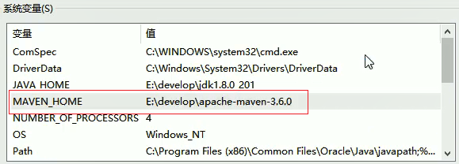


### 2.2 Maven仓库⭐🌙

- 本地仓库：用来存储从远程仓库或者中央仓库下载下来的jar包和插件，项目使用的插件或者jar包，优先从本地仓库查找。

- 远程仓库：如果本地需要插件或jar，本地仓库没有，则会默认去远程仓库下载。远程仓库可以在互联网内，也可以在局域网内。apache就提供了一个远程仓库地址：https://repo.maven.apache.org/maven2/，maven私服是公司局域网内的仓库，需要自己搭建。

- 中央仓库：在maven仓库中内置了一个远程仓库地址：http://repo1.maven.org/maven2.它就是中央仓库，服务整个互联网，它是maven团队自己维护，里面存储了非常全的jar包

  

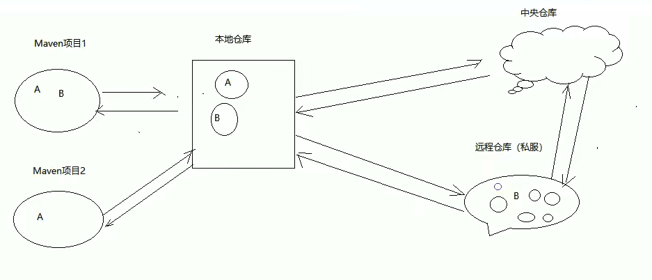

**修改本地仓库配置地址**

~~~xml
 <!-- localRepository
   | The path to the local repository maven will use to store artifacts.
   |
   | Default: ${user.home}/.m2/repository
  <localRepository>/path/to/local/repo</localRepository>
  -->
 <localRepository>D:\mavenRepository1\repository</localRepository>
~~~

**修改远程仓库绑定阿里云**

~~~xml
  <mirrors>
    <!-- mirror
     | Specifies a repository mirror site to use instead of a given repository. The repository that
     | this mirror serves has an ID that matches the mirrorOf element of this mirror. IDs are used
     | for inheritance and direct lookup purposes, and must be unique across the set of mirrors.
     |
    <mirror>
      <id>mirrorId</id>
      <mirrorOf>repositoryId</mirrorOf>
      <name>Human Readable Name for this Mirror.</name>
      <url>http://my.repository.com/repo/path</url>
    </mirror>
     -->
	<mirror>
      <id>nexus</id>
      <mirrorOf>*</mirrorOf> 
      <url>http://maven.aliyun.com/nexus/content/groups/public/</url>
    </mirror>
  </mirrors>
~~~

或者

~~~xml
  <mirrors>
    <!-- mirror
     | Specifies a repository mirror site to use instead of a given repository. The repository that
     | this mirror serves has an ID that matches the mirrorOf element of this mirror. IDs are used
     | for inheritance and direct lookup purposes, and must be unique across the set of mirrors.
     |
    <mirror>
      <id>mirrorId</id>
      <mirrorOf>repositoryId</mirrorOf>
      <name>Human Readable Name for this Mirror.</name>
      <url>http://my.repository.com/repo/path</url>
    </mirror>
     -->
	<mirror>
      <id>alimaven</id>
      <name>aliyun maven</name>
      <url>http://maven.aliyun.com/nexus/content/groups/public/</url>
      <mirrorOf>central</mirrorOf> 
    </mirror>
  </mirrors>
~~~

### 2.3 Maven的项目结构⭐🌙

~~~java
项目的根目录：
     --src:源码
          -- main:主工程代码
              --java:住工程代码
              --resources:需要使用的配置文件
              --webapp:web项目的资源目录（jsp/html/WEB-INF...）
          --test:测试代码
              --java:测试代码
              --resources:测试需要使用的配置文件
     --pom.xml:项目的核心配置文件           
~~~

### 2.4 Maven常用命令⭐

- compile

**mvn compile是maven工程的编译命令**，可以将src/main/javax下的文件编译成class文件输出到target目录下！

- clear

**mvn clearn是maven工程的清理命令**，可以将编译的target目录删除掉。

- package

**mvn package是maven工程的打包命令**，对于web项目，可以将项目打成一个war包，存放在target目录下。

- install

**mvn install是maven工程的安装命令**，可以将maven项目安装到本地仓库

|    命令     | 说明                     |
| :---------: | ------------------------ |
|  mvn clean  | 清除原来的编译结果       |
| mvn compile | 编译                     |
|  mvn test   | 运行测试代码             |
| mvn package | 打包项目                 |
| mvn install | 将项目安装到本地的仓库   |
| mvn deploy  | 发布到本地仓库或者服务器 |


### 2.5 Maven生命周期

maven项目构建过程中项目经历的过程称为项目的**生命周期**。

maven对项目构建过程分为三套独立的生命周期，分别是：

**Clean Lifecycle**： 在进行真正的构建之前进行的一些清理工作

**Default Lifecycle** :构建的核心部分，编译，测试，打包，部署等

**Site Lifecycle**:生成项目报告，站点，发布站点。

>**注意：在同一套生命周期中，执行后边的操作，会自动执行之前的所有操作。**

### 2.6 IDEA绑定Maven

- 绑定本地maven软件

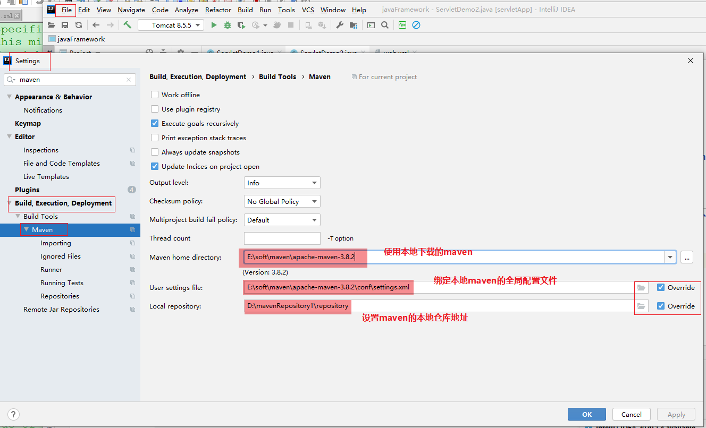

- 设置运行参数

  -DarchetypeCatalog=internal  ，用于设置任何配置信息都从本地缓存中拿。有一些模板信息maven默认从远程仓库下载获取，如果设置了这个参数第一次从远程拿，以后从本地拿（这就要求大家第一次玩maven必须联网

  ，1~5M不等）

~~~properties
-DarchetypeCatalog=internal
~~~

### 2.7 Maven的坐标

>被Maven管理的资源的唯一标识：如jar包，插件等

- **groupId**:组织名称
- **atifactId**:模块名称
- **version**:版本

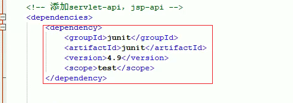

## 3.使用Maven创建项目

### 3.1 使用maven创建java项目

#### 3.1.1 不使用骨架

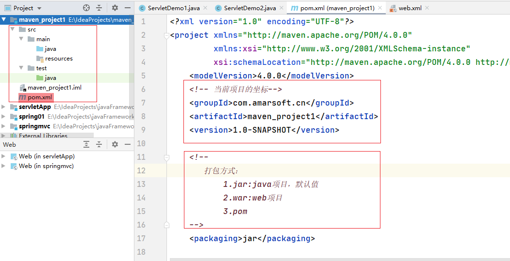

#### 3.2 使用骨架

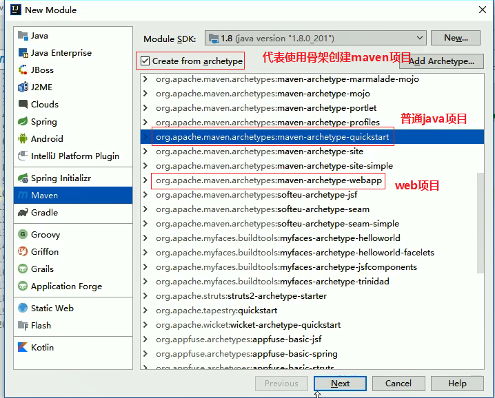

### 3.2导入依赖

>每一个Depemdency对应一个坐标，也就是对应一个jar包

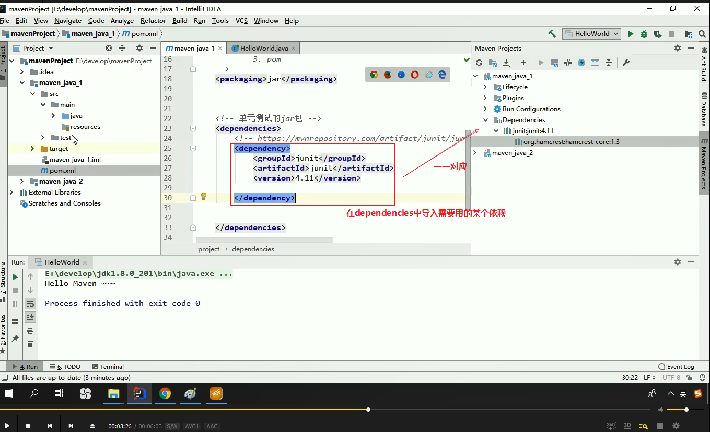

### 3.3 添加编译插件⭐🌙

maven的默认编译版本是1.5 我们可以通过两种方式来改变编译版本

方式1.**配置maven全局JDK版本**

只是配置校验级别，真正用的是本地环境变量的jdk.

~~~xml
<profile>
    <id>development</id>
    <activation>
      <jdk>1.8</jdk>
      <activeByDefault>true</activeByDefault>
    </activation>
    <properties>
      <maven.compiler.source>1.8</maven.compiler.source>
      <maven.compiler.target>1.8</maven.compiler.target>
      <maven.compiler.compilerVersion>1.8</maven.compiler.compilerVersion>
    </properties>
  </profile>
~~~

方式2:**在pom文件中添加插件**

~~~xml
 <build>
        <plugins>
            <plugin>
                <groupId>org.apache.maven.plugins</groupId>
                <artifactId>maven-compiler-plugin</artifactId>
                <version>3.8.1</version>
                <configuration>
                    <target>1.8</target>
                    <source>1.8</source>
                </configuration>
            </plugin></plugins>
    </build>
~~~

### 3.4 maven创建web项目

使用maven创建web项目，如果我们不使用骨架创建web项目，此时需要我们**补齐项目结构**

- 在main目录下创建webapp目录.必须叫==webapp==!

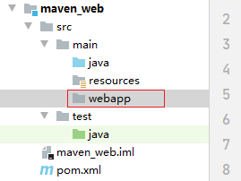

- 在webapp目录下创建**WEB-INF**目录，同时在WEB-INF目录下创建**web.xml**文件

web.xml结构如下：

~~~xml
<?xml version="1.0" encoding="UTF-8"?>
<web-app xmlns="http://xmlns.jcp.org/xml/ns/javaee"
         xmlns:xsi="http://www.w3.org/2001/XMLSchema-instance"
         xsi:schemaLocation="http://xmlns.jcp.org/xml/ns/javaee http://xmlns.jcp.org/xml/ns/javaee/web-app_4_0.xsd"
         version="4.0">
    
    
</web-app>
~~~

### 3.5 使用Tomcat插件启动web项目⭐🌙

我们除了可以将maven项目打成war包放入外部的tomcat容器中来启动项目，我们还可以直接通过maven的tomcat插件来启动maven的web项目！

~~~xml
<build>
        <plugins>
            <!-- tomcat插件，可以来启动当前的web应用-->
            <plugin>
                <groupId>org.apache.tomcat.maven</groupId>
                <artifactId>tomcat7-maven-plugin</artifactId>
                <version>2.2</version>
                <!-- 我们还可以给这个tomcat插件配置端口号和虚拟目录等-->
                <configuration>
                    <port>80</port>
                    <path>/mavenWeb</path>
                </configuration>
            </plugin></plugins>
    </build>
~~~

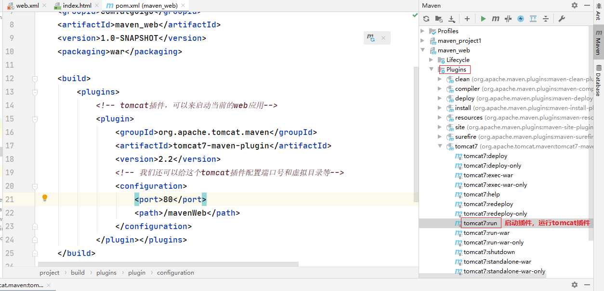

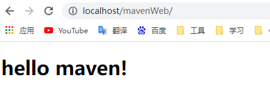

## 4.依赖范围⭐

我们在pom文件添加依赖时，可以==用scope标签指定依赖范围==！依赖范围实际上就是表达当前引入的依赖对哪些环境是有效的！哪些环境能够使用到引入的jar包！

有三种环境：**编译环境、测试环境、运行环境**

scope标签有5种取值：

- **compile**:编译范围，指A在编译时依赖B，此范围为==默认依赖范围==，编译范围的依赖会在**编译、测试、运行时都有效**！由于运行时需要，所以compile范围的依赖会被打包！
- **provided:provide**:依赖只有在当JDK或者一个容器已提供该以来之后才可以使用，**provided依赖在编译和测试时需要，在运行时不需要**，如“servlet api被tomcat容器提供！
- **runtime**:**runtime依赖范围在运行和测试时需要，但是在编译的时候不需要**，比如JDBC的驱动包，由于运行时需要所以runtime范围的依赖会被打包。
- **test**:**test依赖范围，在编译和运行时都不需要**，他们只有在测试编译和测试运行阶段可用，比如：junit。由于运行时不需要所以test范围的依赖不会被打包。
- **system**:system范围依赖与provided类似，但是你必须显示的提供一个对于本地系统中jar文件的路径，需指定systemPath磁盘路径，system依赖不推荐使用！

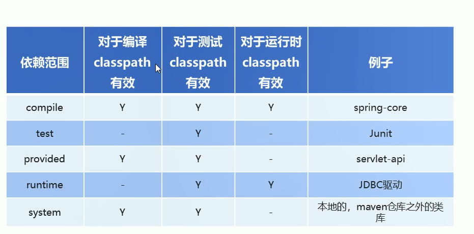

## 5.maven的依赖传递⭐🌙

### 5.1 依赖传递的概念⭐

在maven中，依赖是可以传递的，假设对于项目A，项目B，项目C三个项目，项目C依赖项目B，项目B依赖项目A，则项目C间接依赖项目A。

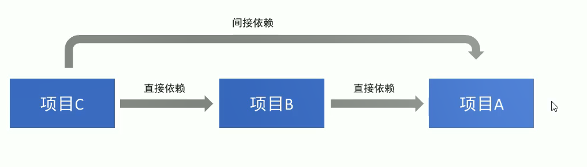

maven的依赖传递实际上是jar包的传递！

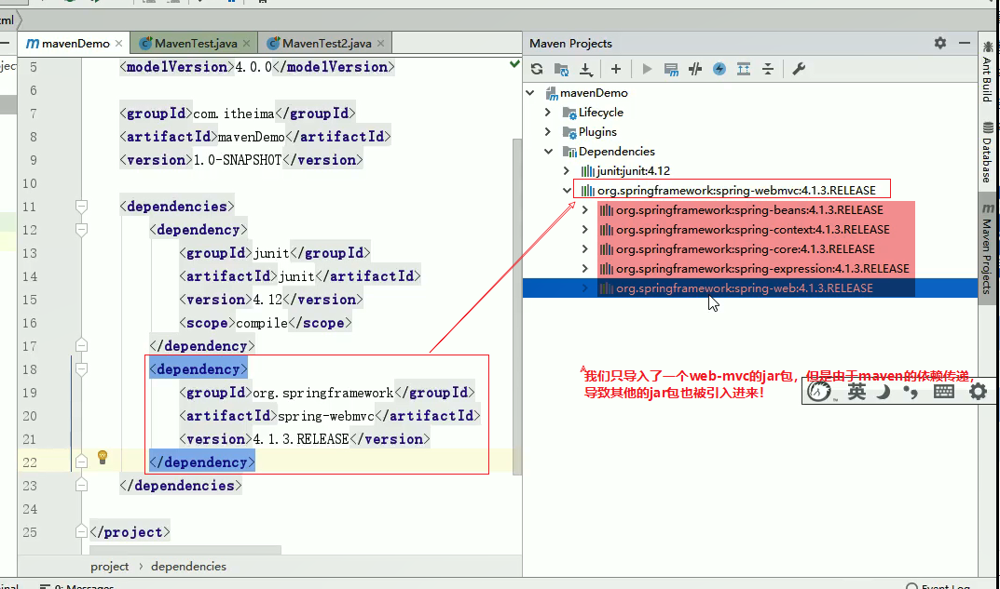

### 5.2 依赖冲突

依赖冲突实际上是由于maven的依赖传递引起的！

由于存在依赖传递现象，Spring-webmvc-4.2.4依赖Spring-beans-4.2.4,Spring-aop-5.0.2依赖

Spring-beans-5.0.2，但是我们发现Spring-beans-4.2.4加入了工程中，这就是**依赖冲突**。

### 5.3 如何解决依赖冲突⭐🌙

- 1.使用mave提供的依赖调整原则

       - ==第一声明者优先原则==

  ~~~markdown
  ### 1、在pom文件中定义依赖，以先声明的依赖为准，其实就是根据坐标导入的先后顺序来确定最终使用哪个传递过来的依赖。
  ~~~

       - ==路径近者优先原则：直接依赖近于传递过来的依赖！==

  ~~~markdown
  ### 1.
      上述情况中，Spring-aop和Spring-webmvc都会传递过来Spring-beans,那如果直接把Spring-bean的依赖写入到pom文件中，那么项目就不会再使用其他依赖传递过来的Spring-beans，因为自己直接在pom中定义的bean比其他依赖传递过来的路径要近。
  ~~~

- 2.排除依赖

==可以通过**exclusions标签**将传递过来依赖排除出去！==

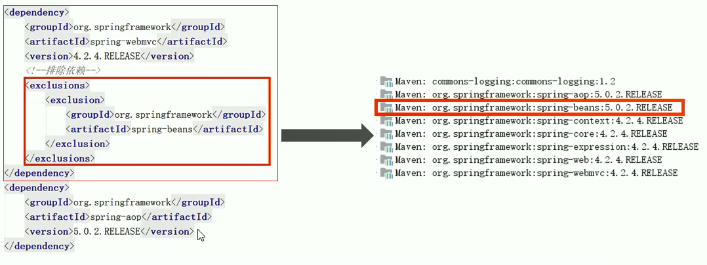

- 3.锁定版本

采用直接锁定版本的方式确定依赖jar包的版本，版本锁定以后则不考虑依赖声明的顺序或者依赖的路径。以锁定的版本为准添加到工程中！此方法在企业开发中经常用到！

版本锁定的方式：

   - 在dependencyManagement标签中锁定依赖的版本（只是声明了版本，并没有真正导入依赖进来）

   - 在dependencies标签中声明需要导入的maven的坐标

     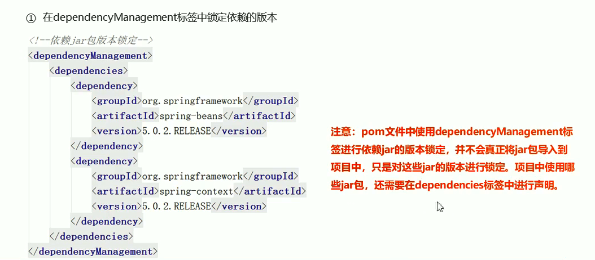

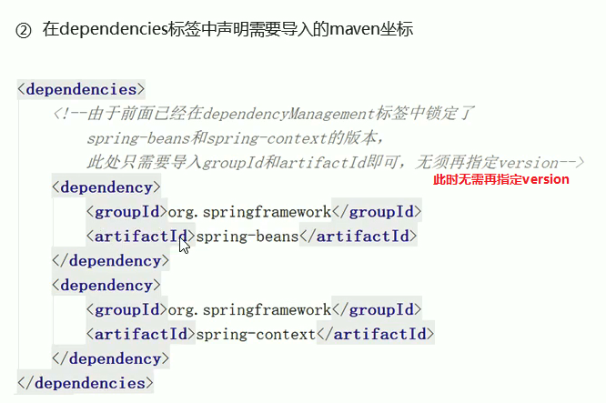

~~~xml
 <!--
       锁定jar包的版本，
       此时在项目中的jar包的版本就是锁定的版本
       即使以来过来的版本也会受到锁定的版本的影响
     -->
    <dependencyManagement>
        <dependencies>
            <dependency>
                <groupId>org.springframework</groupId>
                <artifactId>spring-beans</artifactId>
                <version>5.3.1</version>
            </dependency>
            <dependency>
                <groupId>org.springframework</groupId>
                <artifactId>spring-aop</artifactId>
                <version>5.3.1</version>
            </dependency>
        </dependencies>
    </dependencyManagement>
    <!--
    由于在前面已经在dependencyManagement标签中锁定了spring-aop
    此时只需要导入groupId和artifactId即可。无需再指定version
    -->
    <dependencies>
        <dependency>
            <groupId>org.springframework</groupId>
            <artifactId>spring-aop</artifactId>
        </dependency>
    </dependencies>
~~~

## 6.基于maven构建SSM工程案例⭐🐂

**整体项目结构**

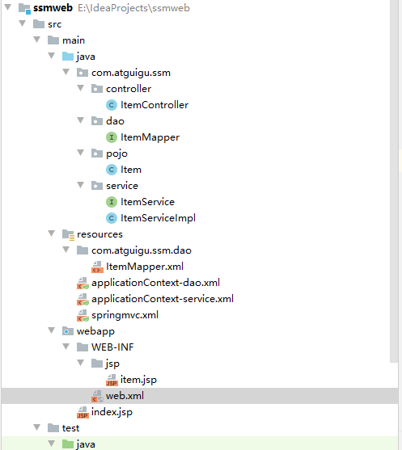

###  6.1 搭建数据库环境

~~~mysql
DROP TABLE IF EXISTS item;
CREATE TABLE item(
  id int(11) NOT NULL auto_increment,
  name varchar(255) DEFAULT NULL,
  price float DEFAULT NULL,
  createtime datetime DEFAULT NULL,
  detail varchar(255) DEFAULT NULL,
  PRIMARY KEY (id)
);
INSERT INTO item values(1,'电视机',4500,'2019-01-10 11:30:16','电视机');
~~~

### 6.2 搭建步骤

-  创建maven web项目
- 配置pom.xml文件
- 实现Spring和mybatis的整合
         - 创建POJO类
         - 持久层DAO接口编写
         - Mapper映射文件编写
         - 业务层Service编写
         - Spring配置文件applicationContext-dao.xml编写
         - Spring配置文件appliactionContext-service.xmli编写
- 加入SpringMVC的相关配置
          - 表现层Controller编写
              - SpringMVC.xml文件编写
              - jsp页面编写
              - 配置web.xml文件

### 6.3 创建项目并且配置pom文件

~~~xml
<?xml version="1.0" encoding="UTF-8"?>

<project xmlns="http://maven.apache.org/POM/4.0.0" xmlns:xsi="http://www.w3.org/2001/XMLSchema-instance"
  xsi:schemaLocation="http://maven.apache.org/POM/4.0.0 http://maven.apache.org/xsd/maven-4.0.0.xsd">
  <modelVersion>4.0.0</modelVersion>

  <groupId>com.atguigu</groupId>
  <artifactId>ssmweb</artifactId>
  <version>1.0-SNAPSHOT</version>
  <packaging>war</packaging>

  <name>ssmweb Maven Webapp</name>
  <!-- FIXME change it to the project's website -->
  <url>http://www.example.com</url>

  <properties>
      <project.build.sourceEncoding>UTF-8</project.build.sourceEncoding>
      <maven.compile.source>1.8</maven.compile.source>
      <maven.compile.target>1.8</maven.compile.target>
      <spring.version>5.0.5.RELEASE</spring.version>
      <springmvc.version>5.0.5.RELEASE</springmvc.version>
      <mybatis.version>3.4.5</mybatis.version>
  </properties>
  <!--jar包的版本锁定 -->
  <dependencyManagement>
    <dependencies>
      <!--mybatis -->
      <dependency>
        <groupId>org.mybatis</groupId>
        <artifactId>mybatis</artifactId>
        <version>${mybatis.version}</version>
      </dependency>
      <!--SpringMVC -->
      <dependency>
        <groupId>org.springframework</groupId>
        <artifactId>spring-webmvc</artifactId>
        <version>${springmvc.version}</version>
      </dependency>
      <!--Spring -->
      <dependency>
        <groupId>org.springframework</groupId>
        <artifactId>spring-context</artifactId>
        <version>${spring.version}</version>
      </dependency>
      <dependency>
        <groupId>org.springframework</groupId>
        <artifactId>spring-core</artifactId>
        <version>${spring.version}</version>
      </dependency>
      <dependency>
        <groupId>org.springframework</groupId>
        <artifactId>spring-aop</artifactId>
        <version>${spring.version}</version>
      </dependency>
      <dependency>
        <groupId>org.springframework</groupId>
        <artifactId>spring-web</artifactId>
        <version>${spring.version}</version>
      </dependency>
      <dependency>
        <groupId>org.springframework</groupId>
        <artifactId>spring-expression</artifactId>
        <version>${spring.version}</version>
      </dependency>
      <dependency>
        <groupId>org.springframework</groupId>
        <artifactId>spring-beans</artifactId>
        <version>${spring.version}</version>
      </dependency>
      <dependency>
        <groupId>org.springframework</groupId>
        <artifactId>spring-aspects</artifactId>
        <version>${spring.version}</version>
      </dependency>
      <dependency>
        <groupId>org.springframework</groupId>
        <artifactId>spring-context-support</artifactId>
        <version>${spring.version}</version>
      </dependency>
      <dependency>
        <groupId>org.springframework</groupId>
        <artifactId>spring-test</artifactId>
        <version>${spring.version}</version>
      </dependency>
      <dependency>
        <groupId>org.springframework</groupId>
        <artifactId>spring-jdbc</artifactId>
        <version>${spring.version}</version>
      </dependency>
      <dependency>
        <groupId>org.springframework</groupId>
        <artifactId>spring-tx</artifactId>
        <version>${spring.version}</version>
      </dependency>
    </dependencies>
  </dependencyManagement>
  <!--引入依赖 -->
  <dependencies>
    <!--mybatis和mybatis与Spring整合 -->
    <dependency>
      <groupId>org.mybatis</groupId>
      <artifactId>mybatis</artifactId>
    </dependency>
    <dependency>
      <groupId>org.mybatis</groupId>
      <artifactId>mybatis-spring</artifactId>
      <version>1.3.1</version>
    </dependency>
    <!--mysql驱动 -->
    <dependency>
      <groupId>mysql</groupId>
      <artifactId>mysql-connector-java</artifactId>
      <version>5.1.32</version>
    </dependency>
    <!--druid -->
    <dependency>
      <groupId>com.alibaba</groupId>
      <artifactId>druid</artifactId>
      <version>1.0.9</version>
    </dependency>
    <dependency>
      <groupId>org.springframework</groupId>
      <artifactId>spring-webmvc</artifactId>
    </dependency>
    <dependency>
      <groupId>org.springframework</groupId>
      <artifactId>spring-context</artifactId>
    </dependency>
    <dependency>
      <groupId>org.springframework</groupId>
      <artifactId>spring-core</artifactId>
    </dependency>
    <dependency>
      <groupId>org.springframework</groupId>
      <artifactId>spring-aop</artifactId>
    </dependency>
    <dependency>
      <groupId>org.springframework</groupId>
      <artifactId>spring-expression</artifactId>
    </dependency>
    <dependency>
      <groupId>org.springframework</groupId>
      <artifactId>spring-web</artifactId>
    </dependency>
    <dependency>
      <groupId>org.springframework</groupId>
      <artifactId>spring-beans</artifactId>
    </dependency>
    <dependency>
      <groupId>org.springframework</groupId>
      <artifactId>spring-aspects</artifactId>
    </dependency>
    <dependency>
      <groupId>org.springframework</groupId>
      <artifactId>spring-context-support</artifactId>
    </dependency>
    <dependency>
      <groupId>org.springframework</groupId>
      <artifactId>spring-test</artifactId>
    </dependency>
    <dependency>
      <groupId>org.springframework</groupId>
      <artifactId>spring-tx</artifactId>
    </dependency>
    <dependency>
      <groupId>org.springframework</groupId>
      <artifactId>spring-jdbc</artifactId>
    </dependency>
    <dependency>
      <groupId>junit</groupId>
      <artifactId>junit</artifactId>
      <version>4.12</version>
    </dependency>
    <dependency>
      <groupId>javax.servlet</groupId>
      <artifactId>servlet-api</artifactId>
      <version>2.5</version>
      <scope>provided</scope>
    </dependency>
    <dependency>
      <groupId>javax.servlet</groupId>
      <artifactId>jsp-api</artifactId>
      <version>2.0</version>
    </dependency>
    <dependency>
      <groupId>javax.servlet</groupId>
      <artifactId>jstl</artifactId>
      <version>1.2</version>
    </dependency>
  </dependencies>

  <build>
    <plugins>
      <plugin>
        <groupId>org.apache.maven.plugins</groupId>
        <artifactId>maven-compiler-plugin</artifactId>
        <version>3.1</version>
        <configuration>
          <source>1.8</source>
          <target>1.8</target>
          <encoding>UTF-8</encoding>
        </configuration>
      </plugin>
    </plugins>
  </build>

</project>

~~~

### 6.4 Spring整合Mybatis

**实体类**

~~~java
package com.atguigu.ssm.pojo;

import java.util.Date;

/**
 * 订单实体类
 */
public class Item {
    private int id;
    private String name;
    private double price;
    private Date createtime;
    private String detail;

    @Override
    public String toString() {
        return "Item{" +
                "id=" + id +
                ", name='" + name + '\'' +
                ", price=" + price +
                ", createtime=" + createtime +
                ", detail='" + detail + '\'' +
                '}';
    }

    public int getId() {
        return id;
    }

    public void setId(int id) {
        this.id = id;
    }

    public String getName() {
        return name;
    }

    public void setName(String name) {
        this.name = name;
    }

    public double getPrice() {
        return price;
    }

    public void setPrice(double price) {
        this.price = price;
    }

    public Date getCreatetime() {
        return createtime;
    }

    public void setCreatetime(Date createtime) {
        this.createtime = createtime;
    }

    public String getDetail() {
        return detail;
    }

    public void setDetail(String detail) {
        this.detail = detail;
    }
}

~~~

**接口**

~~~java
package com.atguigu.ssm.dao;

import com.atguigu.ssm.pojo.Item;

public interface ItemMapper {
    public Item getItemById(int id);
}

~~~

**mybatis接口映射文件**

~~~xml
<?xml version="1.0" encoding="UTF-8" ?>
<!DOCTYPE mapper
        PUBLIC "-//mybatis.org//DTD Mapper 3.0//EN"
        "http://mybatis.org/dtd/mybatis-3-mapper.dtd">
<!--
   说明：
      1.接口设置文件的根标签为mapper
      2.根标签mapper的namespace属性：这个属性的属性值用来绑定我们创建的接口，故值要设置为Mapper接口的全类名
-->
<mapper namespace="com.atguigu.ssm.dao.ItemMapper">
    <!--
    说明：
       mapper根标签可以有子标签select,insert,update,delete
         id属性：设置为Mapper接口的方法名，也是sql语句的唯一标识
         resultType:设置方法的返回值的类型，即实体类的全限定名
    -->
     <select id="getItemById" resultType="Item">
         select  * from item where id=#{id}
     </select>

</mapper>
~~~

**Service接口代码**

~~~java
package com.atguigu.ssm.service;

import com.atguigu.ssm.pojo.Item;

public interface ItemService {
    public Item findById(int id);
}
~~~

**Service接口实现类代码**

~~~java
package com.atguigu.ssm.service;

import com.atguigu.ssm.dao.ItemMapper;
import com.atguigu.ssm.pojo.Item;
import org.springframework.beans.factory.annotation.Autowired;
import org.springframework.stereotype.Service;
import org.springframework.transaction.annotation.Transactional;

@Service
@Transactional
public class ItemServiceImpl implements ItemService{
    // 我们这里是将Mybatis的接口代理对象注入进来，代码运行会创建Mapper代理对象，故可以被注入！
    @Autowired
    public ItemMapper itemMapper;

    @Override
    public Item findById(int id) {
        return itemMapper.getItemById(id);
    }
}
~~~

**Spring与mybatis整合的配置文件**

~~~xml
<?xml version="1.0" encoding="UTF-8"?>
<beans xmlns="http://www.springframework.org/schema/beans"
       xmlns:xsi="http://www.w3.org/2001/XMLSchema-instance"
       xsi:schemaLocation="http://www.springframework.org/schema/beans http://www.springframework.org/schema/beans/spring-beans.xsd">
    <!--这里用来配置Spring和mybatis整合相关的配置 -->
    <!--1.配置数据源信息，使用Druid连接池 -->
    <bean id="dataSource" class="com.alibaba.druid.pool.DruidDataSource">
        <property name="driverClassName" value="com.mysql.jdbc.Driver"></property>
        <property name="url" value="jdbc:mysql://localhost:3306/spring"></property>
        <property name="username" value="root"></property>
        <property name="password" value="123456"></property>
    </bean>

    <!--2.配置Spring整合mybatis框架提供的类：SQLSessionFactoryBean -->
    <bean id="sqlSessionFactory" class="org.mybatis.spring.SqlSessionFactoryBean">
        <!--配置数据源 -->
        <property name="dataSource" ref="dataSource"></property>
        <!--扫描pojo包，为实体类创建别名 -->
        <property name="typeAliasesPackage" value="com.atguigu.ssm.pojo"></property>
    </bean>

    <!--3.配置mybatis的mapper接口扫描器,用来扫描接口的包，产生代理对象，将代理对象给到Spring -->
    <bean class="org.mybatis.spring.mapper.MapperScannerConfigurer">
        <property name="basePackage" value="com.atguigu.ssm.dao"></property>
    </bean>
</beans>
~~~

**Spring自己的配置文件**

~~~xml
<?xml version="1.0" encoding="UTF-8"?>
<beans xmlns="http://www.springframework.org/schema/beans"
       xmlns:xsi="http://www.w3.org/2001/XMLSchema-instance"
       xmlns:context="http://www.springframework.org/schema/context" xmlns:tx="http://www.springframework.org/schema/tx"
       xsi:schemaLocation="http://www.springframework.org/schema/beans
        http://www.springframework.org/schema/beans/spring-beans.xsd
        http://www.springframework.org/schema/context
        http://www.springframework.org/schema/context/spring-context.xsd http://www.springframework.org/schema/tx http://www.springframework.org/schema/tx/spring-tx.xsd">
       <!--1.配置组件扫描，扫描Service-->
       <context:component-scan base-package="com.atguigu.ssm.service"></context:component-scan>

       <!--2.开启事务 -->
       <!--2.1配置事务管理器-->
       <bean id="transactionManager" class="org.springframework.jdbc.datasource.DataSourceTransactionManager">
             <property name="dataSource" ref="dataSource"></property>
             </bean>
       <!--2.2事务注解驱动-->
       <tx:annotation-driven transaction-manager="transactionManager"></tx:annotation-driven>


</beans>
~~~

### 6.5 整合SpringMVC

**controller的编写**

~~~java
package com.atguigu.ssm.controller;

import com.atguigu.ssm.pojo.Item;
import com.atguigu.ssm.service.ItemService;
import org.springframework.beans.factory.annotation.Autowired;
import org.springframework.stereotype.Controller;
import org.springframework.ui.Model;
import org.springframework.web.bind.annotation.PathVariable;
import org.springframework.web.bind.annotation.RequestMapping;

@Controller
@RequestMapping("/item")
public class ItemController {
    @Autowired
    private ItemService ItemService;

    @RequestMapping("/showItem/{id}")
    // @PathVariable("id") 从占位符中提取指定的参数值，并且赋值给形参！
    public String findById(@PathVariable("id") int id, Model model){
        Item item  = ItemService.findById(id);
        model.addAttribute("item",item);
        return "item";
    }

~~~

**SoringMVC的配置文件**

~~~xml
<?xml version="1.0" encoding="UTF-8"?>
<beans xmlns="http://www.springframework.org/schema/beans"
       xmlns:xsi="http://www.w3.org/2001/XMLSchema-instance"
       xmlns:context="http://www.springframework.org/schema/context"
       xsi:schemaLocation="http://www.springframework.org/schema/beans http://www.springframework.org/schema/beans/spring-beans.xsd http://www.springframework.org/schema/context http://www.springframework.org/schema/context/spring-context.xsd">

    <!--配置扫描器，扫描Controller -->
    <context:component-scan base-package="com.atguigu.ssm.controller"></context:component-scan>

    <!--配置视图解析器,这里用Spring自带的视图解析器：转发视图解析器 -->
    <bean class="org.springframework.web.servlet.view.InternalResourceViewResolver">
        <property name="prefix" value="/WEB-INF/jsp/"></property>
        <property name="suffix" value=".jsp"></property>
    </bean>
</beans>
~~~

**web.xml**

~~~xml
<!DOCTYPE web-app PUBLIC
 "-//Sun Microsystems, Inc.//DTD Web Application 2.3//EN"
 "http://java.sun.com/dtd/web-app_2_3.dtd" >

<web-app>
  <display-name>Archetype Created Web Application</display-name>
  <!--1.指定Spring配置文件的位置 -->
  <context-param>
    <param-name>contextConfigLocation</param-name>
    <param-value>classpath:applicationContext*.xml</param-value>
  </context-param>
  <!--2.配置Spring框架启动时使用的监听器，这样在项目启动时后就会加载Spring的配置文件-->
  <listener>
    <listener-class>org.springframework.web.context.ContextLoaderListener</listener-class>
  </listener>
  <!--3.配置SpringMVC的前端控制器 -->
  <servlet>
    <servlet-name>SpringMVC</servlet-name>
    <servlet-class>org.springframework.web.servlet.DispatcherServlet</servlet-class>
    <!--指定SpringMVC的配置文件的位置 -->
    <init-param>
      <param-name>contextConfigLocation</param-name>
      <param-value>classpath:springmvc.xml</param-value>
    </init-param>
  </servlet>
  <servlet-mapping>
    <servlet-name>SpringMVC</servlet-name>
    <url-pattern>/</url-pattern>
  </servlet-mapping>
</web-app>

~~~

## 7.分模块构建maven工程⭐🌙

在实际开发中，由于项目规模庞大，一般会将一个项目合理的拆分成N多个小的模块，分别进行开发。

一般有两种拆分模式：

- 按照业务拆分：每个模块分成一个maven工程，如用户模块，订单模块
- 按照层进行拆分，例如持久层，业务层，表现层，每一层对应一个maven工程

不管哪种拆分方式，通常会提供一个父工程，将一些==**公共的代码和配置提取到父工程进行统一的管理和配置**！==

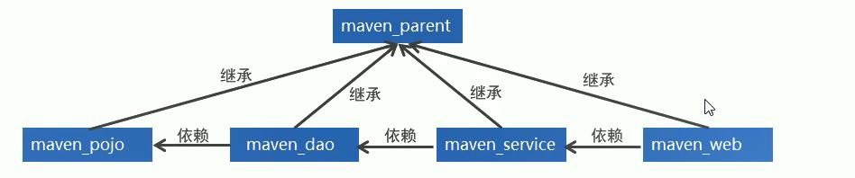

### 7.1 Maven的继承⭐

==**在maven工程中同样存在继承，子工程继承父工程以后，就可以使用父工程中引入的依赖。继承的目的是为了消除重复代码！**==

**父工程的pom文件定义**

~~~xml
  <groupId>com.atguigu</groupId>
  <artifactId>ssmweb</artifactId>
  <version>1.0-SNAPSHOT</version>
  <!-- 父工程的打包方式必须为pom-->
  <packaging>pom</packaging>
~~~

被继承的maven工程通常称之为夫工程，==父工程的打包方式必须为pom==，所以我们区分一个maven工程是否为父工程就啃=看这个工程的打包方式是否为pom！！！

**子工程的pom文件定义**

~~~xml
<parent>
  <groupId>com.atguigu</groupId>
  <artifactId>ssmweb</artifactId>
  <version>1.0-SNAPSHOT</version>
</parent>
~~~

继承其他maven工程的子工程，在pom文件中通过==parent标签==进行父工程的继承！后面我们会直接在夫工程中锁定版本，这样在子工程就不需要关注版本问题！

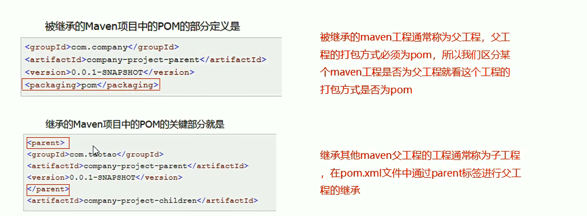

总结：

- 如果在父工程中来统一定义坐标依赖，子工程就可以直接获取依赖，不用定义相同的坐标！达到复用的目的！

- 虽然在父工程中定义引入依赖，子工程就可以直接继承过来。但是这样的话模块不需要的jar也引入进来啦！==**所以我们一般只是在父工程中进行版本锁定，在子工程用到的jar包的版本由父工程来指定！！！**==这样子工程在指定坐标的时候不需要指定version！

  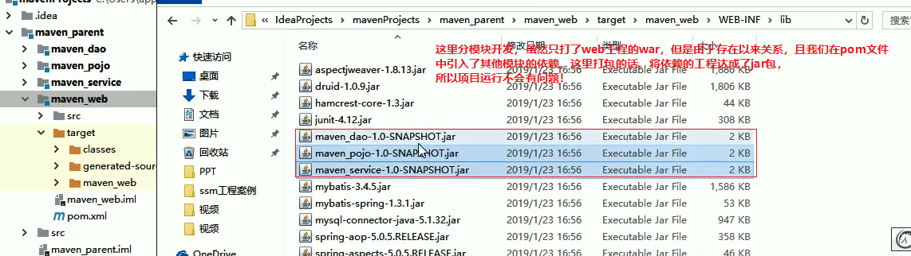

### 7.2 Maven的聚合⭐

聚合的目的是为了统一操作!

在maven工程的pom文件中可以使用==<modules>==标签将其他maven聚合到一起，聚合的目的是为了==统一操作==。

例如拆分的maven模块有多个，如果需要打包，就需要针对每个工程分别执行打包命令，这时候我们可以通过==<modules>==标签将这些工程统一聚合到maven工程中，需要打包的时候，只需要在工程中执行一次打包命令，其下被聚合的工程就都会被打包啦！

需要注意的是：继承和聚合之间没有必然联系！

~~~xml
<!--聚合其他maven工程，继承和聚合之间没有必然关系！！！1 -->
  <modules>
    <module>MavenDemo1</module>
    <module>MavenDemo2</module>
  </modules>
~~~

总结：==聚合的目的是为了统一进行操作！==

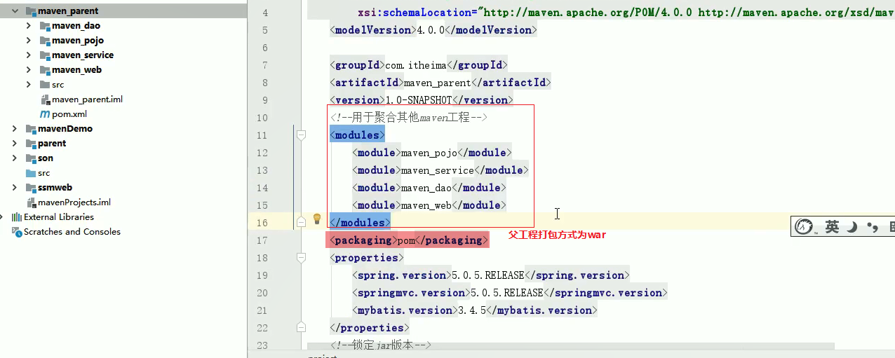

### 7.3 Maven的版本管理

- SNAPSHOT（快照版本）

  - 项目开发过程中，为方便团队成员合作，解决模块间相互依赖和时时更新的问题，开发者对每个模块进行构建的时候，输出的临时性版本叫快照版本（测试阶段版本）

  - u快照版本会随着开发的进展不断更新

- RELEASE（发布版本）

  - u项目开发到进入阶段里程碑后，向团队外部发布较为稳定的版本，这种版本所对应的构件文件是稳定的，即便进行功能的后续开发，也不会改变当前发布版本内容，这种版本称为发布版本

  ****

  约定规范：

  - <主版本>.<次版本>.<增量版本>.<里程碑版本>

  - 主版本：表示项目重大架构的变更，如：spring5相较于spring4的迭代

  - 次版本：表示有较大的功能增加和变化，或者全面系统地修复漏洞

  - 增量版本：表示有重大漏洞的修复

  - 里程碑版本：表明一个版本的里程碑（版本内部）。这样的版本同下一个正式版本相比，相对来说不是很稳定，有待更多的测试

  范例：

  - 5.1.9.RELEASE

### 7.4 Maven与外部资源文件

通过配置maven的属性可以在pom文件中引用pom文件中约定好的属性，如图所示：

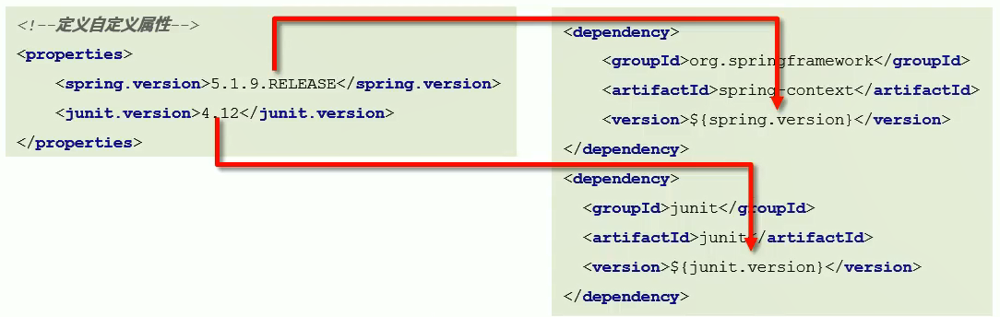

**maven还提供了资源配置来给外部资源文件的属性赋值！**也就是外部资源配置文件引入pom属性。这样的话，==外部配置文件的属性值就可以从pom文件中获取==，达到pom统一管理的目的！

**1.配置外部属性文件允许从pom文件中获取值**

pom.xml

~~~xml
 <!--1.先定义资源文件用的属性的属性值 --> 
  <properties>
      ...
    <jdbc.url>jdbc:mysql://127.0.0.1:3306/ssm_db</jdbc.url>
  </properties>

<!--2.在build标签内部的resources标签进行配置
 外部资源属性名称和开启过滤
 注意：resources标签只对src/main下面的资源文件生效，
      如果想对src/test目录下的资源生效，需要用到testResources这个标签来配置测试资源文件的信息
-->
<!--配置资源文件对应的信息-->
<build>
 <resources>
    <resource>
        <!--设定外部配置文件对应的位置目录，支持使用属性动态设定路径
         此时这个配置代表所有满足这个目录结构的工程的目录
-->
        <directory>${project.basedir}/src/main/resources</directory>
        <!--开启对配置文件的资源加载过滤-->
        <filtering>true</filtering>
    </resource>
 </resources>

 <resources>
     ...支持配置多个外部资源属性文件！
 </resources>
</build>
~~~

外部资源文件,如:db.properties

~~~properties
username=root
password=123456
# 此时在外部资源文件中的引用pom属性值的格式为${jdbc.url} 
url=${jdbc.url} 
driver=com.mysql.jdbc.Driver
~~~

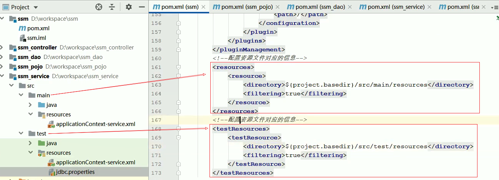

### 7.5 Maven的多环境配置⭐🌙

我们希望我们的工程可以在==多个环境==之间进行切换。我们需要满足两个条件：

- 1.配置多个环境

~~~xml
  <!--定义多个环境,这里用到profiles标签 -->
  <profiles>
      <!--定义具体的环境：开发 -->
      <profile>
         <!--定义环境对应的唯一标识 -->
         <id>develop</id>
         <!--定义环境中专用的属性值 -->
        <properties>
                <jdbc.url>dbc:mysql://127.0.0.1:3306/ssm_db</jdbc.url>
        </properties>
      </profile>

      <!--定义具体的环境：测试 -->
      <profile>
        <!--定义环境对应的唯一标识 -->
        <id>test</id>
        <!--定义环境中专用的属性值 -->
        <properties>
          <jdbc.url>dbc:mysql://138.13.12.1:3306/sit_db</jdbc.url>
        </properties>
      </profile>
  </profiles>
~~~

- 2.使用某个环境

  **调用格式**

  ```
  mvn 指令 –P 环境定义id
  ```

  范例

  ```
  mvn install –P pro_env
  ```


   ~~~markdown
## 1.Edit Configuration -> +Maven
## 2.Working directory:填写要打包的工程名   ；   Command line : install -P 指定某个环境中的id
   ~~~

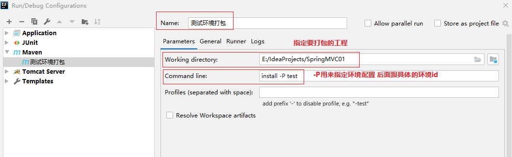

- 3.指定某个环境为默认环境，此时可以直执行install，自动会使用我们指定的默认环境打包，我们只需要加上

~~~xml
<activation>
     <activeByDefault>true</activeByDefault>
</activation>
~~~

~~~xml
  <!--定义多个环境,这里用到profiles标签 -->
  <profiles>
      <!--定义具体的环境：开发 -->
      <profile>
         <!--定义环境对应的唯一标识 -->
         <id>develop</id>
         <!--定义环境中专用的属性值 -->
        <properties>
                <jdbc.url>dbc:mysql://127.0.0.1:3306/ssm_db</jdbc.url>
        </properties>
        <activation>
            <!--设置此环境为默认环境 -->
          <activeByDefault>true</activeByDefault>
        </activation>
      </profile>

      <!--定义具体的环境：测试 -->
      <profile>
        <!--定义环境对应的唯一标识 -->
        <id>test</id>
        <!--定义环境中专用的属性值 -->
        <properties>
          <jdbc.url>dbc:mysql://138.13.12.1:3306/sit_db</jdbc.url>
        </properties>
      </profile>
  </profiles>
~~~

### 7.6 跳过测试

#### 7.6.1 场景

整体模块功能未开发

模块中某个功能未开发完毕

单个功能更新调试导致其他功能失败

快速打包

……

我们需要让==maven的生命周期过程跳过test这个阶段==，正常情况下，如package或者install都会经过测试阶段！

#### 7.6.2 跳过测试的三种方式

- 使用操作界面跳过测试

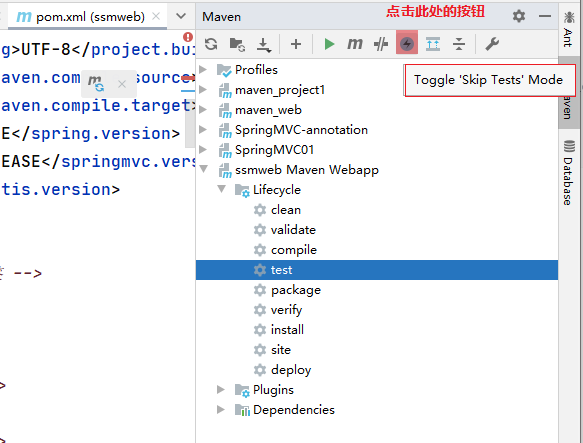

- 通过命令跳过测试

命令

```
mvn 指令 –D skipTests    如：mvn install -D skipTests 
```

注意事项：==执行的指令生命周期必须包含测试环节,也是是必须在test后面的生命周期！==

- 通过配置跳过测试

实际上执行Maven的生命周期的命令都是通过maven仓库自带的插件完成的！！！！

他们在D:\mavenRepository1\repository\org\apache\maven\plugins这个目录下，我们可以在pom.xml中显示的进行配置！！！！

~~~xml
 <build>
        <plugins>
            <<plugin>
            <!-- 这里面groupID由于是maven自己的，可以省略不写-->
            <artifactId>maven-surefire-plugin</artifactId>
            <version>2.22.1</version>
            <configuration>
                <skipTests>true</skipTests><!--设置跳过测试-->
                <!-- 我们还可以设置跳过某些测试，不跳过某些测试-->
                <includes> <!--
                  包含指定的测试用例
                  **:代表任意包
                  -->
                    <include>**/User*Test.java</include>
                </includes>
                <excludes><!--
                    排除指定的测试用例
                     **:代表任意包
                    -->
                    <exclude>**/User*TestCase.java</exclude>
                </excludes>
            </configuration>
        </plugin>
        </plugins>
    </build>
~~~

## 8.maven的私服

