# SpringDataJpa

## 1.ORM思想概述💭

### 1.1 ORM的基本概念

现在有需求：保存用户实体类数据到数据库中，则

**实体类**

~~~java
public class User{
    private String username;
    private String address;
    private Integer userId;
}
~~~

**数据库表**

~~~mysql
create table t_user(
    id int(11) not null auto_increment,
    username varchar(50) default null,
    address varchar(150) default null,
    primary key
)
~~~

**原生的JDBC技术**

~~~java
        // 1.注册驱动
        Class.forName("com.mysql.jdbc.Driver");
        // 2.与数据库建立连接
        Connection conn = DriverManager.getConnection("jdbc:mysql://localhost:3306/day16", "root", "root");
        // 3. 获得SQL语句发送对象：Statement
        Statement stmt = conn.createStatement();
        // 4. 准备SQL语句
        String sql = "insert into t_user values(1,'老王','广东省广州市')";
        // 5. 执行SQL语句并获得返回值
        int row = stmt.executeUpdate(sql);
        // 6. 关闭资源
        stmt.close();
        conn.close();
~~~

==注意tips==

- 1.注册驱动的方式：

~~~java
       // 原生注册方法是DriverManager.registerDriver(Driver d)，但是这个方法会导致驱动注册两次
       // 创建驱动对象，驱动会注册两次
        Driver driver = new Driver();
        DriverManager.registerDriver(driver);

-------------------------------------原因--------------------------------------------

class Driver extends NonRegisteringDriver implements java.sql.Driver {  
        static {  
           try {  
                java.sql.DriverManager.registerDriver(new Driver());  // 加载这个类已经注册一次啦！
            } catch (SQLException E) {  
                throw new RuntimeException("Can't register driver!");  
            }  
        }  
}  
~~~

- 2.Statement对象的作用：将SQL发送给数据库：对数据库执行增删改查操作并获得结果

| Statement对象常用方法              | 说明                                           |
| ---------------------------------- | ---------------------------------------------- |
| boolean execute(String sql)        | 可以执行任意SQL语句<br>一般用来执行DDL：创建表 |
| int executeUpdate(String sql)      | 用来执行增删改语句<br>返回影响的行数           |
| ResultSet executeQuery(String sql) | 用来执行查询语句<br>返回结果集对象             |

>使用JDBC存在的问题：
>
>- 1.需要编写Sql语句
>- 2.对占位符赋值也很麻烦，特别是当占位符比较多的时候
>
>解决方式：
>
>  不用写SQL,不对占位符赋值！最终这种思想演变成：**类与表，类的属性和表的字段之间映射关系**

~~~mysq
DDL（Data Definition Languages）语句： 即数据库定义语句，用来创建数据库中的表、索引、视图、存储过程、触发器等
常用的语句关键字有：CREATE,ALTER,DROP,TRUNCATE,COMMENT,RENAME。

DML（Data Manipulation Language）语句： 即数据操纵语句，用来查询、添加、更新、删除等
常用的语句关键字有：SELECT,INSERT,UPDATE,DELETE,MERGE,CALL,EXPLAIN PLAN,LOCK TABLE,包括通用性的增删改查。

DCL（Data Control Language）语句： 即数据控制语句，用于授权/撤销数据库及其字段的权限（DCL is short name of Data Control Language which includes commands such as GRANT and mostly concerned with rights, permissions and other controls of the database system.）。
常用的语句关键字有：GRANT,REVOKE。

TCL（Transaction Control Language）语句： 事务控制语句，用于控制事务
常用的语句关键字有：COMMIT,ROLLBACK,SAVEPOINT,SET TRANSACTION。

DQL:（Data QueryLanguage）语句： 数据查询语言
常用的语句关键字有：SELECT, FROM, WHERE, ORDER BY, HAVING,ASC|DESC
~~~

ORM:(Object-Relational Mapping),表示**对象关系映射**。简单来说，ORM就是建立实体类和数据表之间的关系，从而达到操作实体类就相当于操作数据库表的目的。

==**ORM：操作实体类就相当于操作数据库表！**==

ORM是一种思想，常见的ORM框架：Hibernate、OpenJpa、TopLink

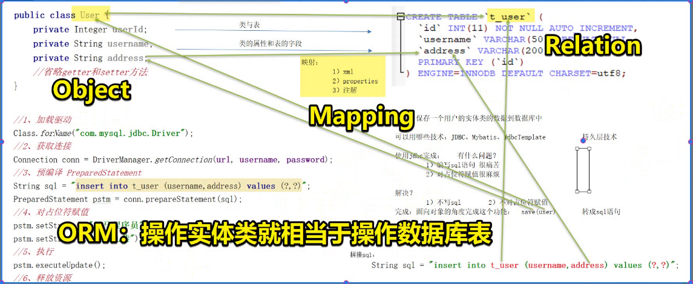

### 1.2 JPA与Hibernate

JPA的全称是==**Java Persistence API**==， 即Java 持久化API，是SUN公司推出的一套基于ORM的==规范==，内部是由一系列的接口和抽象类构成。

JPA通过==JDK 5.0注解==描述对象－关系表的映射关系，并将运行期的实体对象持久化到数据库中。

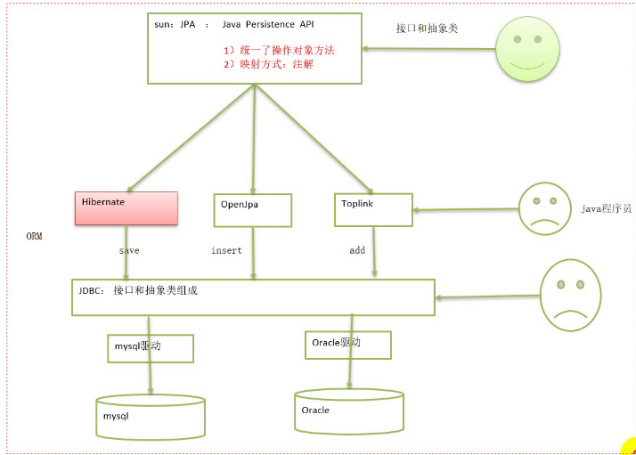

JPA:Java Persistence API ,定义了ORM框架必须实现的规范，包括：

- 统一了操作对象的方法
- 统一了映射方式，通过**注解**映射数据库表

## 2.JPA入门💡

### 2.1 导入依赖

~~~xml
<project xmlns="http://maven.apache.org/POM/4.0.0"
	xmlns:xsi="http://www.w3.org/2001/XMLSchema-instance"
	xsi:schemaLocation="http://maven.apache.org/POM/4.0.0 https://maven.apache.org/xsd/maven-4.0.0.xsd">
	<modelVersion>4.0.0</modelVersion>
	<groupId>com.atguigu</groupId>
	<artifactId>JPA-demo</artifactId>
	<version>0.0.1-SNAPSHOT</version>
	<properties>
		<project.build.sourceEncoding>UTF-8</project.build.sourceEncoding>
		<project.hibernate.version>5.0.7.Final</project.hibernate.version>
	</properties>

	<dependencies>
		<!-- junit -->
		<dependency>
			<groupId>junit</groupId>
			<artifactId>junit</artifactId>
			<version>4.12</version>
			<scope>test</scope>
		</dependency>

		<!-- hibernate对jpa的支持包 -->
		<dependency>
			<groupId>org.hibernate</groupId>
			<artifactId>hibernate-entitymanager</artifactId>
			<version>${project.hibernate.version}</version>
		</dependency>

		<!-- c3p0 -->
		<dependency>
			<groupId>org.hibernate</groupId>
			<artifactId>hibernate-c3p0</artifactId>
			<version>${project.hibernate.version}</version>
		</dependency>

		<!-- log日志 -->
		<dependency>
			<groupId>log4j</groupId>
			<artifactId>log4j</artifactId>
			<version>1.2.17</version>
		</dependency>

		<!-- Mysql and MariaDB -->
		<dependency>
			<groupId>mysql</groupId>
			<artifactId>mysql-connector-java</artifactId>
			<version>5.1.6</version>
		</dependency>
	</dependencies>
</project>
~~~

### 2.2 创建表与实体类

**建表语句**

~~~mysql
	/*创建客户表*/
    CREATE TABLE cst_customer (
      cust_id BIGINT(32) NOT NULL AUTO_INCREMENT COMMENT '客户编号(主键)',
      cust_name VARCHAR(32) NOT NULL COMMENT '客户名称(公司名称)',
      cust_source VARCHAR(32) DEFAULT NULL COMMENT '客户信息来源',
      cust_industry VARCHAR(32) DEFAULT NULL COMMENT '客户所属行业',
      cust_level VARCHAR(32) DEFAULT NULL COMMENT '客户级别',
      cust_address VARCHAR(128) DEFAULT NULL COMMENT '客户联系地址',
      cust_phone VARCHAR(64) DEFAULT NULL COMMENT '客户联系电话',
      PRIMARY KEY (`cust_id`)
    ) ENGINE=INNODB AUTO_INCREMENT=1 DEFAULT CHARSET=utf8;
~~~

**创建实体类**

~~~java
package com.atguigu.pojo;

import java.io.Serializable;

/**
   *    客户实体类
 * @author Admin
 *
 */
public class Customer implements Serializable {

	private Long custId;
	private String custName;
	private String custSource;
	private String custIndustry;
	private String custLevel;
	private String custAddress;
	private String custPhone;
	
	@Override
	public String toString() {
		return "Customer [custId=" + custId + ", custName=" + custName + ", custSource=" + custSource
				+ ", custIndustry=" + custIndustry + ", custLevel=" + custLevel + ", custAddress=" + custAddress
				+ ", custPhone=" + custPhone + "]";
	}
	public Long getCustId() {
		return custId;
	}
	public void setCustId(Long custId) {
		this.custId = custId;
	}
	public String getCustName() {
		return custName;
	}
	public void setCustName(String custName) {
		this.custName = custName;
	}
	public String getCustSource() {
		return custSource;
	}
	public void setCustSource(String custSource) {
		this.custSource = custSource;
	}
	public String getCustIndustry() {
		return custIndustry;
	}
	public void setCustIndustry(String custIndustry) {
		this.custIndustry = custIndustry;
	}
	public String getCustLevel() {
		return custLevel;
	}
	public void setCustLevel(String custLevel) {
		this.custLevel = custLevel;
	}
	public String getCustAddress() {
		return custAddress;
	}
	public void setCustAddress(String custAddress) {
		this.custAddress = custAddress;
	}
	public String getCustPhone() {
		return custPhone;
	}
	public void setCustPhone(String custPhone) {
		this.custPhone = custPhone;
	}
}
~~~

### 2.3 建立实体类与数据库表的映射⭐💡

 @Entity   @Table   @Id   @Column  @GeneratedValue

~~~java
package com.atguigu.pojo;

import java.io.Serializable;

import javax.persistence.Column;
import javax.persistence.Entity;
import javax.persistence.GeneratedValue;
import javax.persistence.GenerationType;
import javax.persistence.Id;
import javax.persistence.Table;

/**
   *    客户实体类
 * @author Admin
   *    导的注解来自javax.persistence
 */
// 1.把一个类标记成一个实体类
@Entity
// 2.用来将一个类映射到数据库表。name属性写表名
@Table(name="cst_customer")
public class Customer implements Serializable {
    
	@Id  // 标记为主键属性
	// ID主键生成值：主键策略
	@GeneratedValue(strategy=GenerationType.IDENTITY)   // 这里代表主键生成策略用的是自动增长策略
	@Column(name ="cust_id")// 类的属性和表的字段映射
	private Long custId;
	
	@Column(name ="cust_name")// 类的属性和表的字段映射
	private String custName;
	
	@Column(name ="cust_source")// 类的属性和表的字段映射
	private String custSource;
	
	@Column(name ="cust_industry")// 类的属性和表的字段映射
	private String custIndustry;
	
	@Column(name ="cust_level")// 类的属性和表的字段映射
	private String custLevel;
	
	@Column(name ="cust_address")// 类的属性和表的字段映射
	private String custAddress;
	
	@Column(name ="cust_phone")// 类的属性和表的字段映射
	private String custPhone;
   
	@Override
	public String toString() {
		return "Customer [custId=" + custId + ", custName=" + custName + ", custSource=" + custSource
				+ ", custIndustry=" + custIndustry + ", custLevel=" + custLevel + ", custAddress=" + custAddress
				+ ", custPhone=" + custPhone + "]";
	}
	public Long getCustId() {
		return custId;
	}
	public void setCustId(Long custId) {
		this.custId = custId;
	}
	public String getCustName() {
		return custName;
	}
	public void setCustName(String custName) {
		this.custName = custName;
	}
	public String getCustSource() {
		return custSource;
	}
	public void setCustSource(String custSource) {
		this.custSource = custSource;
	}
	public String getCustIndustry() {
		return custIndustry;
	}
	public void setCustIndustry(String custIndustry) {
		this.custIndustry = custIndustry;
	}
	public String getCustLevel() {
		return custLevel;
	}
	public void setCustLevel(String custLevel) {
		this.custLevel = custLevel;
	}
	public String getCustAddress() {
		return custAddress;
	}
	public void setCustAddress(String custAddress) {
		this.custAddress = custAddress;
	}
	public String getCustPhone() {
		return custPhone;
	}
	public void setCustPhone(String custPhone) {
		this.custPhone = custPhone;
	}
}
~~~

总结：关键是**几个注解**的使用！！！！

### 2.4 编写JPA的核心配置文件⭐

配置文件的文件名要叫：**persistence.xml**

配置文件的所在目录要为：**META-INF**

==**配置文件的名字不能改，目录不能变！！！！**==

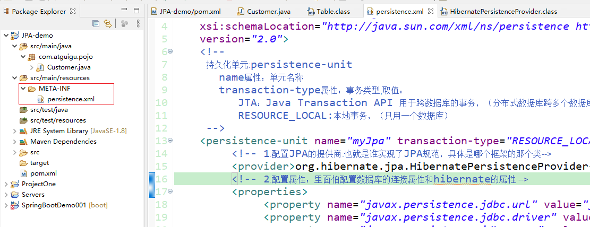

~~~xml
<?xml version="1.0" encoding="UTF-8"?>
<persistence xmlns="http://java.sun.com/xml/ns/persistence"
	xmlns:xsi="http://www.w3.org/2001/XMLSchema-instance"
	xsi:schemaLocation="http://java.sun.com/xml/ns/persistence http://java.sun.com/xml/ns/persistence/persistence_2_0.xsd"
	version="2.0">
	<!-- 
	   持久化单元:persistence-unit
	   name属性：单元名称
	   transaction-type属性：事务类型,取值：
	      JTA：Java Transaction API 用于跨数据库的事务，（分布式数据库跨多个数据库）
	      RESOURCE_LOCAL:本地事务，（只用一个数据库）
	 -->
	<persistence-unit name="myJpa" transaction-type="RESOURCE_LOCAL">
	     <!-- 1.配置JPA的提供商:也就是谁实现了JPA规范，具体是哪个框架的那个类-->
	     <provider>org.hibernate.jpa.HibernatePersistenceProvider</provider>
	     <!-- 2.配置属性：里面配置数据库的连接属性和hibernate的属性 -->
	     <properties>
	          <property name="javax.persistence.jdbc.url" value="jdbc:mysql://localhost:3306/demo"/>
	          <property name="javax.persistence.jdbc.driver" value="com.mysql.jdbc.Driver"/>
	          <property name="javax.persistence.jdbc.user" value="root"/>
	          <property name="javax.persistence.jdbc.password" value="123456"/>
	          
	          <!--显示SQL语句 -->
	          <property name="hibernate.show_sql" value="true"/>
	     </properties>
	</persistence-unit>
</persistence>
~~~

### 2.5 编写测试⭐

~~~java
package com.atguigu.test;

import javax.persistence.EntityManager;
import javax.persistence.EntityManagerFactory;
import javax.persistence.EntityTransaction;
import javax.persistence.Persistence;

import org.junit.Test;

import com.atguigu.pojo.Customer;

import javassist.expr.NewArray;

/**
 * JPA入门，保存测试
 * @author Admin
 *
 */
public class Test01 {
	
	/**
	   *      保存客户实体，JPA核心步骤：
	 *    1.加载配置文件，创建实体类管理器工厂！
	 *    2.通过实体类管理器工厂   创建实体类管理器
	 *    3.获取事务对象
	 *    4.开启事务
	 *    5.进行CRUD操作
	 *    6.提交事务
	 *    7.释放资源
	 */
	@Test
	public void test1() {
		 //    1.加载配置文件，创建实体类管理器工厂
		EntityManagerFactory factory = Persistence.createEntityManagerFactory("myJpa");
		
		//    2.通过实体类管理器工厂   创建实体类管理器
		EntityManager manager = factory.createEntityManager();
		
		//    3.获取事务对象
		EntityTransaction tx = manager.getTransaction();
		
		//    4.开启事务
		tx.begin();
		 
		//    5.进行CRUD操作:都是实体类管理器完成的！
		Customer c = new Customer();
		c.setCustName("纯情小飞飞");
		c.setCustLevel("倔强青铜");
		manager.persist(c);
		//    6.提交事务
		tx.commit();
		
		//    7.释放资源
		manager.close();
		factory.close();
	}

}
~~~

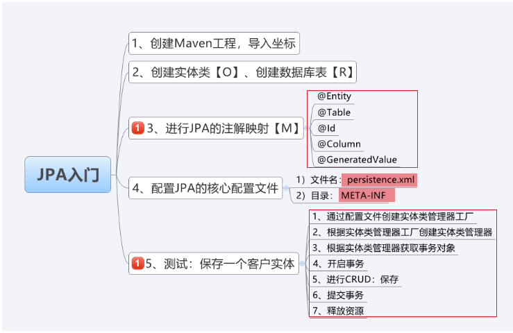

## 3.JPA的主键生成策略💡

### 3.1 Identity策略⭐

>这个策略代表主键自增策略，适用于能够主键自增的数据库，比如Mysql!
>
>对应关键字为auto_increment

为了验证这个策略，我们可以让JPA帮我们自动创建表，我们查看他的建表语句，看是不是有自动增长的策略在里面。为了让jpa帮我们维护表，我们需要

- 在配置文件中加入属性

~~~xml
<!-- hibernate.hbm2ddl.auto属性取值：
	                   1.create:每次先删除表，在创建表
	                   2.update：如果有表，则维护表结构，没有表，则创建表
	                   3.none:什么也不干，和没有配置是一样的
	            -->
	          <property name="hibernate.hbm2ddl.auto" value="create"/>
~~~

==**后面记得一定要把这个value改为none!!!!**==

- 测试代码

~~~java
package com.atguigu.test;

import javax.persistence.EntityManager;
import javax.persistence.EntityManagerFactory;
import javax.persistence.EntityTransaction;
import javax.persistence.Persistence;

import org.junit.Test;

import com.atguigu.pojo.Customer;

import javassist.expr.NewArray;

/**
 * JPA入门，保存测试
 * @author Admin
 *
 */
public class Test01 {
	
	/**
	   *      保存客户实体，JPA核心步骤：
	 *    1.加载配置文件，创建实体类管理器工厂！
	 *    2.通过实体类管理器工厂   创建实体类管理器
	 *    3.获取事务对象
	 *    4.开启事务
	 *    5.进行CRUD操作
	 *    6.提交事务
	 *    7.释放资源
	 */
	@Test
	public void test1() {
		 //    1.加载配置文件，创建实体类管理器工厂
		EntityManagerFactory factory = Persistence.createEntityManagerFactory("myJpa");
		
		//    2.通过实体类管理器工厂   创建实体类管理器
		EntityManager manager = factory.createEntityManager();
		
		//    3.获取事务对象
		EntityTransaction tx = manager.getTransaction();
		
		//    4.开启事务
		tx.begin();
		 
		//    5.进行CRUD操作:都是实体类管理器完成的！
		Customer c = new Customer();
		c.setCustName("纯情小鸭鸭电脑公司");
		c.setCustLevel("VIP级");
		manager.persist(c);
		//    6.提交事务
		tx.commit();
		
		//    7.释放资源
		manager.close();
		factory.close();
	}

}
~~~

- 日志显示

~~~sql
log4j:WARN No appenders could be found for logger (org.jboss.logging).
log4j:WARN Please initialize the log4j system properly.
log4j:WARN See http://logging.apache.org/log4j/1.2/faq.html#noconfig for more info.

Hibernate: drop table if exists cst_customer

Hibernate: create table cst_customer (cust_id bigint not null auto_increment, cust_address varchar(255), cust_industry varchar(255), cust_level varchar(255), cust_name varchar(255), cust_phone varchar(255), cust_source varchar(255), primary key (cust_id))

Hibernate: insert into cst_customer (cust_address, cust_industry, cust_level, cust_name, cust_phone, cust_source) values (?, ?, ?, ?, ?, ?)
~~~

### 3.2 其他策略

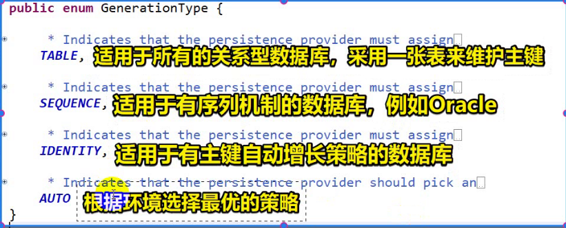

~~~
sequence: 序列机制的数据库，例如oracle
table:   适用于所有的关系型数据库【效率不高】。内部使用一张表来维护主键值！
auto:    根据环境选择最优策略【不要信】
~~~

- **sequence**:序列机制的数据库

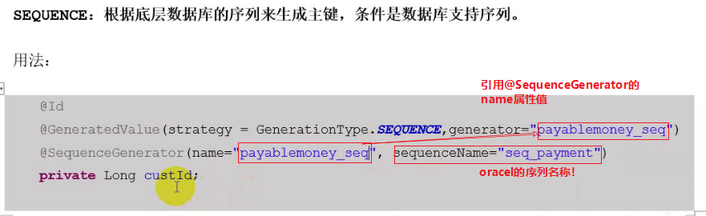

- **auto**

~~~xml
<?xml version="1.0" encoding="UTF-8"?>
<persistence xmlns="http://java.sun.com/xml/ns/persistence"
	xmlns:xsi="http://www.w3.org/2001/XMLSchema-instance"
	xsi:schemaLocation="http://java.sun.com/xml/ns/persistence http://java.sun.com/xml/ns/persistence/persistence_2_0.xsd"
	version="2.0">
	<!-- 
	   持久化单元:persistence-unit
	   name属性：单元名称
	   transaction-type属性：事务类型,取值：
	      JTA：Java Transaction API 用于跨数据库的事务，（分布式数据库跨多个数据库）
	      RESOURCE_LOCAL:本地事务，（只用一个数据库）
	 -->
	<persistence-unit name="myJpa" transaction-type="RESOURCE_LOCAL">
	     <!-- 1.配置JPA的提供商:也就是谁实现了JPA规范，具体是哪个框架的那个类-->
	     <provider>org.hibernate.jpa.HibernatePersistenceProvider</provider>
	     <!-- 2.配置属性：里面怕配置数据库的连接属性和hibernate的属性 -->
	     <properties>
	          <property name="javax.persistence.jdbc.url" value="jdbc:mysql://localhost:3306/demo"/>
	          <property name="javax.persistence.jdbc.driver" value="com.mysql.jdbc.Driver"/>
	          <property name="javax.persistence.jdbc.user" value="root"/>
	          <property name="javax.persistence.jdbc.password" value="123456"/>
	          
	          <!--显示SQL语句 -->
	          <property name="hibernate.show_sql" value="true"/>
	          <!-- hibernate.hbm2ddl.auto属性取值：
	                   1.create:每次先删除表，在创建表
	                   2.update：如果有表，则维护表结构，没有表，则创建表
	                   3.none:什么也不干，和没有配置是一样的
	            -->
	          <property name="hibernate.hbm2ddl.auto" value="create"/>
	     </properties>
	</persistence-unit>
</persistence>
~~~

~~~java
package com.atguigu.pojo;

import java.io.Serializable;

import javax.persistence.Column;
import javax.persistence.Entity;
import javax.persistence.GeneratedValue;
import javax.persistence.GenerationType;
import javax.persistence.Id;
import javax.persistence.Table;

/**
   *    客户实体类
 * @author Admin
   *    导的注解来自javax.persistence
 */
// 1.把一个类标记成一个实体类
@Entity
// 2.用来将一个类映射到数据库表。name属性写表名
@Table(name="cst_customer")
public class Customer implements Serializable {
    
	@Id  // 标记为主键属性
	// ID主键生成值：主键策略
	@GeneratedValue(strategy=GenerationType.TABLE)  // 主键生成策略，适用于所有的关系型数据库【效率不高】，使用表来维护主键！
	@Column(name ="cust_id")// 类的属性和表的字段映射
	private Long custId;
	
	@Column(name ="cust_name")// 类的属性和表的字段映射
	private String custName;
	
	@Column(name ="cust_source")// 类的属性和表的字段映射
	private String custSource;
	
	@Column(name ="cust_industry")// 类的属性和表的字段映射
	private String custIndustry;
	
	@Column(name ="cust_level")// 类的属性和表的字段映射
	private String custLevel;
	
	@Column(name ="cust_address")// 类的属性和表的字段映射
	private String custAddress;
	
	@Column(name ="cust_phone")// 类的属性和表的字段映射
	private String custPhone;
   
	@Override
	public String toString() {
		return "Customer [custId=" + custId + ", custName=" + custName + ", custSource=" + custSource
				+ ", custIndustry=" + custIndustry + ", custLevel=" + custLevel + ", custAddress=" + custAddress
				+ ", custPhone=" + custPhone + "]";
	}
	public Long getCustId() {
		return custId;
	}
	public void setCustId(Long custId) {
		this.custId = custId;
	}
	public String getCustName() {
		return custName;
	}
	public void setCustName(String custName) {
		this.custName = custName;
	}
	public String getCustSource() {
		return custSource;
	}
	public void setCustSource(String custSource) {
		this.custSource = custSource;
	}
	public String getCustIndustry() {
		return custIndustry;
	}
	public void setCustIndustry(String custIndustry) {
		this.custIndustry = custIndustry;
	}
	public String getCustLevel() {
		return custLevel;
	}
	public void setCustLevel(String custLevel) {
		this.custLevel = custLevel;
	}
	public String getCustAddress() {
		return custAddress;
	}
	public void setCustAddress(String custAddress) {
		this.custAddress = custAddress;
	}
	public String getCustPhone() {
		return custPhone;
	}
	public void setCustPhone(String custPhone) {
		this.custPhone = custPhone;
	}
}

~~~

~~~sql
log4j:WARN No appenders could be found for logger (org.jboss.logging).
log4j:WARN Please initialize the log4j system properly.
log4j:WARN See http://logging.apache.org/log4j/1.2/faq.html#noconfig for more info.

Hibernate: drop table if exists cst_customer
Hibernate: drop table if exists hibernate_sequences

Hibernate: create table cst_customer (cust_id bigint not null, cust_address varchar(255), cust_industry varchar(255), cust_level varchar(255), cust_name varchar(255), cust_phone varchar(255), cust_source varchar(255), primary key (cust_id))
Hibernate: create table hibernate_sequences (sequence_name varchar(255) not null, next_val bigint, primary key (sequence_name))
Hibernate: select tbl.next_val from hibernate_sequences tbl where tbl.sequence_name=? for update
Hibernate: insert into hibernate_sequences (sequence_name, next_val)  values (?,?)
Hibernate: update hibernate_sequences set next_val=?  where next_val=? and sequence_name=?
Hibernate: insert into cst_customer (cust_address, cust_industry, cust_level, cust_name, cust_phone, cust_source, cust_id) values (?, ?, ?, ?, ?, ?, ?)

~~~

**可以看到，它维护主键用了一张新表**

### 3.3 自己维护主键值，没有@GeneratedValue注解

在上述的主键生成策略中，主键都是自动生成的，但是在某些场景下，需要我们自己去指定主键的值，这个时候，我们就需要：

- 不用@GeneratedValue注解
- 保存的时候需要自己给主键赋值
- 如果不给主键赋值，会”发烂渣“

~~~java
package com.atguigu.pojo;

import java.io.Serializable;

import javax.persistence.Column;
import javax.persistence.Entity;
import javax.persistence.GeneratedValue;
import javax.persistence.GenerationType;
import javax.persistence.Id;
import javax.persistence.Table;

/**
   *    客户实体类
 * @author Admin
   *    导的注解来自javax.persistence
 */
// 1.把一个类标记成一个实体类
@Entity
// 2.用来将一个类映射到数据库表。name属性写表名
@Table(name="cst_customer")
public class Customer implements Serializable {
    
	@Id  // 标记为主键属性
	// ID主键生成值：主键策略
	// @GeneratedValue(strategy=GenerationType.TABLE)  // 主键生成策略，适用于所有的关系型数据库【效率不高】
	@Column(name ="cust_id")// 类的属性和表的字段映射
	private Long custId;
	
	@Column(name ="cust_name")// 类的属性和表的字段映射
	private String custName;
	
	@Column(name ="cust_source")// 类的属性和表的字段映射
	private String custSource;
	
	@Column(name ="cust_industry")// 类的属性和表的字段映射
	private String custIndustry;
	
	@Column(name ="cust_level")// 类的属性和表的字段映射
	private String custLevel;
	
	@Column(name ="cust_address")// 类的属性和表的字段映射
	private String custAddress;
	
	@Column(name ="cust_phone")// 类的属性和表的字段映射
	private String custPhone;
   
	@Override
	public String toString() {
		return "Customer [custId=" + custId + ", custName=" + custName + ", custSource=" + custSource
				+ ", custIndustry=" + custIndustry + ", custLevel=" + custLevel + ", custAddress=" + custAddress
				+ ", custPhone=" + custPhone + "]";
	}
	public Long getCustId() {
		return custId;
	}
	public void setCustId(Long custId) {
		this.custId = custId;
	}
	public String getCustName() {
		return custName;
	}
	public void setCustName(String custName) {
		this.custName = custName;
	}
	public String getCustSource() {
		return custSource;
	}
	public void setCustSource(String custSource) {
		this.custSource = custSource;
	}
	public String getCustIndustry() {
		return custIndustry;
	}
	public void setCustIndustry(String custIndustry) {
		this.custIndustry = custIndustry;
	}
	public String getCustLevel() {
		return custLevel;
	}
	public void setCustLevel(String custLevel) {
		this.custLevel = custLevel;
	}
	public String getCustAddress() {
		return custAddress;
	}
	public void setCustAddress(String custAddress) {
		this.custAddress = custAddress;
	}
	public String getCustPhone() {
		return custPhone;
	}
	public void setCustPhone(String custPhone) {
		this.custPhone = custPhone;
	}
}

~~~

~~~xml
<?xml version="1.0" encoding="UTF-8"?>
<persistence xmlns="http://java.sun.com/xml/ns/persistence"
	xmlns:xsi="http://www.w3.org/2001/XMLSchema-instance"
	xsi:schemaLocation="http://java.sun.com/xml/ns/persistence http://java.sun.com/xml/ns/persistence/persistence_2_0.xsd"
	version="2.0">
	<!-- 
	   持久化单元:persistence-unit
	   name属性：单元名称
	   transaction-type属性：事务类型,取值：
	      JTA：Java Transaction API 用于跨数据库的事务，（分布式数据库跨多个数据库）
	      RESOURCE_LOCAL:本地事务，（只用一个数据库）
	 -->
	<persistence-unit name="myJpa" transaction-type="RESOURCE_LOCAL">
	     <!-- 1.配置JPA的提供商:也就是谁实现了JPA规范，具体是哪个框架的那个类-->
	     <provider>org.hibernate.jpa.HibernatePersistenceProvider</provider>
	     <!-- 2.配置属性：里面怕配置数据库的连接属性和hibernate的属性 -->
	     <properties>
	          <property name="javax.persistence.jdbc.url" value="jdbc:mysql://localhost:3306/demo"/>
	          <property name="javax.persistence.jdbc.driver" value="com.mysql.jdbc.Driver"/>
	          <property name="javax.persistence.jdbc.user" value="root"/>
	          <property name="javax.persistence.jdbc.password" value="123456"/>
	          
	          <!--显示SQL语句 -->
	          <property name="hibernate.show_sql" value="true"/>
	          <!-- hibernate.hbm2ddl.auto属性取值：
	                   1.create:每次先删除表，在创建表
	                   2.update：如果有表，则维护表结构，没有表，则创建表
	                   3.none:什么也不干，和没有配置是一样的
	            -->
	          <property name="hibernate.hbm2ddl.auto" value="create"/>
	     </properties>
	</persistence-unit>
</persistence>
~~~

~~~java
package com.atguigu.test;

import javax.persistence.EntityManager;
import javax.persistence.EntityManagerFactory;
import javax.persistence.EntityTransaction;
import javax.persistence.Persistence;

import org.junit.Test;

import com.atguigu.pojo.Customer;

import javassist.expr.NewArray;

/**
 * JPA入门，保存测试
 * @author Admin
 *
 */
public class Test01 {
	
	/**
	   *      保存客户实体，JPA核心步骤：
	 *    1.加载配置文件，创建实体类管理器工厂！
	 *    2.通过实体类管理器工厂   创建实体类管理器
	 *    3.获取事务对象
	 *    4.开启事务
	 *    5.进行CRUD操作
	 *    6.提交事务
	 *    7.释放资源
	 */
	@Test
	public void test1() {
		 //    1.加载配置文件，创建实体类管理器工厂
		EntityManagerFactory factory = Persistence.createEntityManagerFactory("myJpa");
		
		//    2.通过实体类管理器工厂   创建实体类管理器
		EntityManager manager = factory.createEntityManager();
		
		//    3.获取事务对象
		EntityTransaction tx = manager.getTransaction();
		
		//    4.开启事务
		tx.begin();
		 
		//    5.进行CRUD操作:都是实体类管理器完成的！
		Customer c = new Customer();
		c.setCustId(222L);//如果没有@GeneratedValue主键，必须自己指定值
		c.setCustName("纯情小猪猪电脑公司");
		c.setCustLevel("SVIP级");
		manager.persist(c);
		//    6.提交事务
		tx.commit();
		
		//    7.释放资源
		manager.close();
		factory.close();
	}
}
~~~

## 4.JPA的核心API⭐

目标：知道是那几个API以及他们的作用

1、Persistence						  <font color=red><b>重要程度：一般</b></font>

```
作用：用于加载配置文件，创建实体类管理器工厂
方法：
	createEntityManageFactory("持久化单元名称")
```

2、EntityManagerFactory	 <font color=red><b>重要程度：比较重要</b></font>

```
作用：用于创建实体类管理器的
方法：
	createEntityManage()
	close()
细节：
	1、这个类是一个重量级的类：维护了非常多的信息，例如全字段插入，全字段的更新，根据id查询等sql语句
	2、这个类是个线程安全的对象，在多线程环境下，不会有并发问题
使用原则：
	一个web项目只有一个这个对象就好
```

3、EntityManager				  <font color=red><b>重要程度：非常重要</b></font>

```
作用： 与数据库的交互【CRUD】都是它来完成，还可以获取事务对象
方法：
	getTransaction()
	persist()
	close()
细节：
	1、由于工厂已经维护了非常多的信息，所以这个类维护的信息就少了，它是个轻量级对象
	2、这个对象是线程不安全
使用原则：
	一个线程应该只有一个这个对象，就不会出现并发问题
```

4、EntityTransaction		     <font color=red><b>重要程度：会用就行</b></font>

```
作用：控制事务
方法：
	begin()
	commit()
	rollback()
```

### 4.1 JPA工具类

~~~java
package com.atguigu.util;

import javax.persistence.EntityManager;
import javax.persistence.EntityManagerFactory;
import javax.persistence.Persistence;

/**
 *     工具类：保证一个项目只有一个EntityManagerFactory
 * @author Admin
 *
 */
public class JpaUtil {
	private static EntityManagerFactory factory;
	static {
		factory=Persistence.createEntityManagerFactory("myJpa");
	}
    
	/**
	   *   获取实体类管理器
	 * @return
	 */
	public static EntityManager getEntityManager() {
		return factory.createEntityManager();
	}
} 

~~~

**工具类使用**

~~~java

    @Test
	public void test2() {
    	EntityManager manager = JpaUtil.getEntityManager();
    	EntityTransaction tx = manager.getTransaction();
    	tx.begin();
    	Customer c = new Customer();
    	c.setCustName("天棚大元帅");
    	c.setCustAddress("666888");
    	manager.persist(c);
    	tx.commit();
    	manager.close();
    	// factory.close(); 工厂只有一个，不能关闭！
	}
~~~

## 5.JPA的CRUD⭐💡

### 5.1 新增一个对象persist()和查询一个实体**find和getReference**

- 创建一个对象，插入数据**persist()**

~~~java
// 保存一个客户实体 persist()方法
    @Test
	public void test1() {
    	EntityManager manager = JpaUtil.getEntityManager();
    	EntityTransaction tx = manager.getTransaction();
    	tx.begin();
    	// ====================================
    	
    	Customer c = new Customer();
    	c.setCustName("天棚大元帅");
    	c.setCustAddress("黄金级");
    	manager.persist(c);
    	
    	// ====================================
    	tx.commit();
    	manager.close();
    	// factory.close(); 工厂只有一个，不能关闭！
	}
    
~~~

- 查询对象：**find和getReference**

这两个方法都可以查询对象，也就是都可以发送select语句，且它们的参数是一样的。

| 方法         | 说明                                                         |
| ------------ | ------------------------------------------------------------ |
| find         | 立即加载【饥饿加载】，不管用不用，都马上发送SQL语句查询对象  |
| getReference | 延迟加载【懒加载】，用到的时候再去查询数据库，且返回的对象实际上是代理对象，子类的动态代理 |

~~~java
/**
               *    查询一个对象，可以用下面这两个方法，参数都是一样的：
     *      find：立即加载【饥饿加载】，不管用不用，都马上发送SQL语句查询对象
     *      getReference：延迟加载【懒加载】，用到的时候再去查询数据库，且返回的对象实际上是代理对象，子类的动态代理
               *                   这两个方法返回值实际上不是一样的，同时加载的实际也不一样
     */
    @Test
	public void test2() {
    	EntityManager manager = JpaUtil.getEntityManager();
    	EntityTransaction tx = manager.getTransaction();
    	tx.begin();
    	// ====================================
    	
//    	Customer c = manager.find(Customer.class, 2l);
//    	System.out.println(c);
    	
    	
    	Customer c = manager.getReference(Customer.class, 2l);
    	System.out.println(c);
    	// ====================================
    	tx.commit();
    	manager.close();
    	// factory.close(); 工厂只有一个，不能关闭！
	}
~~~

### 5.2  更新一个对象和删除一个实体

#### 5.2.1 更新对象merge

更新对象用**merge**方法

| 方法                                    | 说明                                                         |
| --------------------------------------- | ------------------------------------------------------------ |
| 直接在merge方法中放入新new出来的对象    | 这种方式有可能会清空数据，如果有些字段在数据库有值，到那时new出来的这个对象对应的字段属性没有值，则会清空 |
| 在merge方法中放入find方法查询出来的对象 | 这种方法推荐使用，不会删除数据                               |

- 直接new一个对象出来

~~~java
@Test
    public void  test3() {
    	EntityManager manager = JpaUtil.getEntityManager();
    	EntityTransaction tx = manager.getTransaction();
    	tx.begin();
    	// =============================
    	// update 表 set 字段=？ where id =?
    	// 方式1：直接new一个对象出来，这种方式可能会清空数据
    	Customer c = new Customer();
    	c.setCustId(1l);
    	c.setCustName("布玛网络科技有限公司");
    	
    	manager.merge(c);// 合并
    	
    	//===============================
    	tx.commit();
    	manager.close();
    }

~~~

- 先查后更

~~~java
@Test
    public void  test3() {
    	EntityManager manager = JpaUtil.getEntityManager();
    	EntityTransaction tx = manager.getTransaction();
    	tx.begin();
    	// =============================
    	// update 表 set 字段=？ where id =?
    	// 方式2:先查后更
    	Customer c = manager.find(Customer.class, 2l);
    	c.setCustName("阿里巴巴电商公司");
    	
    	manager.merge(c);// 合并
    	
    	//===============================
    	tx.commit();
    	manager.close();
    }
~~~

#### 5.2.2 删除一个数据remove

删除操作只能先查再删除

~~~java
 @Test
    public void  test3() {
    	EntityManager manager = JpaUtil.getEntityManager();
    	EntityTransaction tx = manager.getTransaction();
    	tx.begin();
    	// =============================
    	// 删除操作只能先查再删除
    	Customer customer = manager.find(Customer.class, 1l);
    	manager.remove(customer);
    	
    	//===============================
    	tx.commit();
    	manager.close();
    }
~~~

**总结：**

| 类型           | 方法说明               |
| -------------- | ---------------------- |
| 新增insert语句 | persist()              |
| 删除delete语句 | remove()               |
| 修改update语句 | merge()                |
| 查询select语句 | find()&&getReference() |

## 6.JPA的JPQL查询语句⭐💡

JPQL :  Java Persistence Query Language ，它是一种完全**面向对象**的跨平台的查询语言，与sql类似

>select   from where order等关键字，他们是sql99标准，可以写在JPQL语句中！

这其中，==**实体类管理器EntityManager有一个createQuery("jpql语句")**==方法，里面传入JPQL字符串即可。

sql:  select * from 表  where  字段  =?   limit

jpql:  from 类  where  属性 = ?

### 6.1 查询全部⭐

查询语句中JPQL语句为：**select 类名别名 from 类名  类名别名**  或者  **from 类名**

~~~java
package com.atguigu.test;

import java.util.List;

import javax.persistence.EntityManager;
import javax.persistence.EntityTransaction;
import javax.persistence.Query;

import org.junit.Test;

import com.atguigu.pojo.Customer;
import com.atguigu.util.JpaUtil;

/**
    *   学习JPQL 
 * @author Admin
 *
 */
public class Test02 {
	@Test
	public void test01() {
		EntityManager entityManager = JpaUtil.getEntityManager();
		EntityTransaction tx = entityManager.getTransaction();
		tx.begin();
		// ===========================
		// JPQL查询，里面返回的是一个Query对象
		// Query query = entityManager.createQuery("from Customer");
		Query query = entityManager.createQuery("select  c from Customer c");
		// 获取结果集
		List<Customer> list = query.getResultList();
		for(Customer customer:list) {
			System.out.println(customer);
		}
        // =====================
		tx.commit();
		entityManager.close();
	}
}
~~~

### 6.2 分页查询⭐

分页查询中：mysql用limit关键字，oracle用rownum，都不是sql99的标准

在JPA我们可以通过设置参数来获取分页结果进行分页查询。可以跨平台分页查询，很方便。

| 方法                                | 说明                                            |
| ----------------------------------- | ----------------------------------------------- |
| query.setFirstResult(startPosition) | 里面传开始记录索引：（当前页-1）*pageSize页大小 |
| query.setMaxResults(maxResult)      | 里面传pageSize页大小，也就是每页显示的条数      |

~~~java
@Test
	public void test01() {
		EntityManager entityManager = JpaUtil.getEntityManager();
		EntityTransaction tx = entityManager.getTransaction();
		tx.begin();
		// ===========================
		// JPQL查询，里面返回的是一个Query对象
		Query query = entityManager.createQuery("from Customer");
		// 设置分页参数
		query.setFirstResult(1); // 里面传开始记录索引：（当前页-1）*pageSize页大小
		query.setMaxResults(1);// 里面传pageSize页大小，也就是每页显示的条数
		// 获取结果集
		List<Customer> list = query.getResultList();
		for(Customer customer:list) {
			System.out.println(customer);
		}
		// =====================
		tx.commit();
		entityManager.close();
	}
~~~

### 6.3 条件查询⭐

JPQL里面也可以进行条件查询，通过**where关键字**，此时where后面不是跟数据库字段名，而是实体类属性名

#### 6.3.1 精确查询

~~~java
package com.atguigu.test;

import java.util.List;

import javax.persistence.EntityManager;
import javax.persistence.EntityTransaction;
import javax.persistence.Query;

import org.junit.Test;

import com.atguigu.pojo.Customer;
import com.atguigu.util.JpaUtil;
import com.mchange.v1.cachedstore.CachedStore.Manager;

/**
    *   学习JPQL 
 * @author Admin
 *
 */
public class Test02 {
	@Test
	public void test01() {
		EntityManager entityManager = JpaUtil.getEntityManager();
		EntityTransaction tx = entityManager.getTransaction();
		tx.begin();
		// ===========================
		// JPQL查询，里面返回的是一个Query对象,也会用到占位符
		Query query = entityManager.createQuery("from Customer where custName=?");
		// 对占位符赋值，占位符索引从1开始
		query.setParameter(1, "阿里巴巴电商公司");
		// 获取结果集
		List<Customer> list = query.getResultList();
		for(Customer customer:list) {
			System.out.println(customer);
		}
		// =====================
		tx.commit();
		entityManager.close();
	}

}
~~~

#### 6.3.2 模糊查询like

模糊查询在jpql中也可以用**like关键字**

~~~java
package com.atguigu.test;

import java.util.List;

import javax.persistence.EntityManager;
import javax.persistence.EntityTransaction;
import javax.persistence.Query;

import org.junit.Test;

import com.atguigu.pojo.Customer;
import com.atguigu.util.JpaUtil;
import com.mchange.v1.cachedstore.CachedStore.Manager;

/**
    *   学习JPQL 
 * @author Admin
 *
 */
public class Test02 {
	@Test
	public void test01() {
		EntityManager entityManager = JpaUtil.getEntityManager();
		EntityTransaction tx = entityManager.getTransaction();
		tx.begin();
		// ===========================
		// JPQL查询，里面返回的是一个Query对象,也会用到占位符
		Query query = entityManager.createQuery("from Customer where custName like  ?");
		// 对占位符赋值，占位符索引从1开始
		query.setParameter(1, "阿里巴巴%");
		// 获取结果集
		List<Customer> list = query.getResultList();
		for(Customer customer:list) {
			System.out.println(customer);
		}
		// =====================
		tx.commit();
		entityManager.close();
	}
}
~~~

#### 6.3.3 多条件查询 AND && OR

~~~java
package com.atguigu.test;

import java.util.List;

import javax.persistence.EntityManager;
import javax.persistence.EntityTransaction;
import javax.persistence.Query;

import org.junit.Test;

import com.atguigu.pojo.Customer;
import com.atguigu.util.JpaUtil;
import com.mchange.v1.cachedstore.CachedStore.Manager;

/**
    *   学习JPQL 
 * @author Admin
 *
 */
public class Test02 {
	@Test
	public void test01() {
		EntityManager entityManager = JpaUtil.getEntityManager();
		EntityTransaction tx = entityManager.getTransaction();
		tx.begin();
		// ===========================
		// JPQL查询，里面返回的是一个Query对象,也会用到占位符
		Query query = entityManager.createQuery("from Customer where custName like  ?  and custAddress=? ");
		// 对占位符赋值，占位符索引从1开始
		query.setParameter(1, "阿里巴巴%");
		query.setParameter(2, "黄金级");
		// 获取结果集
		List<Customer> list = query.getResultList();
		for(Customer customer:list) {
			System.out.println(customer);
		}
		// =====================
		tx.commit();
		entityManager.close();
	}
}
~~~

### 6.4 排序查询和统计查询⭐

#### 6.4.1 排序查询 order   by

排序思路分析：

~~~
sql：   order by  字段  asc|desc
jpql:   order by  属性  asc|desc
~~~

~~~java
package com.atguigu.test;

import java.util.List;

import javax.persistence.EntityManager;
import javax.persistence.EntityTransaction;
import javax.persistence.Query;

import org.junit.Test;

import com.atguigu.pojo.Customer;
import com.atguigu.util.JpaUtil;
import com.mchange.v1.cachedstore.CachedStore.Manager;

/**
    *   学习JPQL 
 * @author Admin
 *
 */
public class Test02 {
	@Test
	public void test01() {
		EntityManager entityManager = JpaUtil.getEntityManager();
		EntityTransaction tx = entityManager.getTransaction();
		tx.begin();
		// ===========================
		// JPQL查询，里面返回的是一个Query对象,也会用到占位符
		Query query = entityManager.createQuery("from Customer order  by custId desc");

		// 获取结果集
		List<Customer> list = query.getResultList();
		for(Customer customer:list) {
			System.out.println(customer);
		}
		// =====================
		tx.commit();
		entityManager.close();
	}

}

~~~

#### 6.4.2 统计查询

~~~
统计查询： avg  sum  count  min  max
~~~

~~~java
@Test
	public void test01() {
		EntityManager entityManager = JpaUtil.getEntityManager();
		EntityTransaction tx = entityManager.getTransaction();
		tx.begin();
		// ===========================
		// JPQL查询，里面返回的是一个Query对象,也会用到占位符
		Query query = entityManager.createQuery("select count(1) from Customer ");

		// 获取结果集
		List list = query.getResultList();
		for(Object o:list) {
			System.out.println(o);
		}
		// =====================
		tx.commit();
		entityManager.close();
	}
~~~

**返回结果集只有一条**

~~~java
package com.atguigu.test;

import java.util.List;

import javax.persistence.EntityManager;
import javax.persistence.EntityTransaction;
import javax.persistence.Query;

import org.junit.Test;

import com.atguigu.pojo.Customer;
import com.atguigu.util.JpaUtil;
import com.mchange.v1.cachedstore.CachedStore.Manager;

/**
    *   学习JPQL 
 * @author Admin
 *
 */
public class Test02 {
	@Test
	public void test01() {
		EntityManager entityManager = JpaUtil.getEntityManager();
		EntityTransaction tx = entityManager.getTransaction();
		tx.begin();
		// ===========================
		// JPQL查询，里面返回的是一个Query对象,也会用到占位符
		Query query = entityManager.createQuery("select count(1) from Customer where custId= ?");
		query.setParameter(1, 2l);
		// 获取结果集,如果结果集只有一条数据，可以用这个方法,如果返回大于1，会报错！
		System.out.println(query.getSingleResult());
		// =====================
		tx.commit();
		entityManager.close();
	}

}
~~~

## 7 SpringDataJpa概述

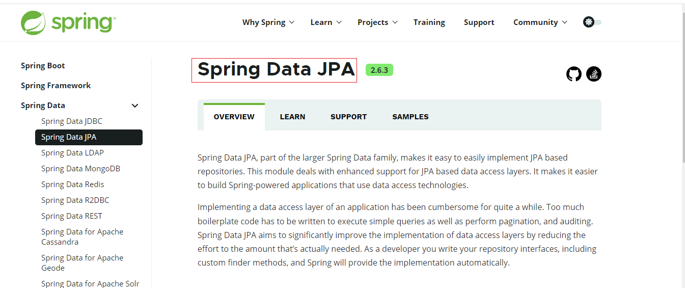

~~~
Spring Data JPA, part of the larger Spring Data family, makes it easy to easily implement JPA based repositories. This module deals with enhanced support for JPA based data access layers. It makes it easier to build Spring-powered applications that use data access technologies.
~~~

Spring Data JPA 是 Spring 基于 **ORM 框架、JPA 规范**的基础上封装的一套**JPA应用框架**，可使开发者用==极简==的代码即可实现对数据库的访问和操作。它提供了包括增删改查等在内的常用功能，且易于扩展！学习并使用
Spring Data JPA 可以==极大提高开发效率==！

SpringData Jpa 极大简化了数据库访问层【DAO层】代码。 如何简化的呢？ 使用了SpringDataJpa，我们的dao层中只需要写接口，就自动具有了增删改查、分页查询等方法。

==当然，SpringDataJpa还支持原生SQL拆查询，也支持JPQL查询，不过略微有点和JPA不同。==

**SpringDataJPA和JPA与hibernate之间的关系**

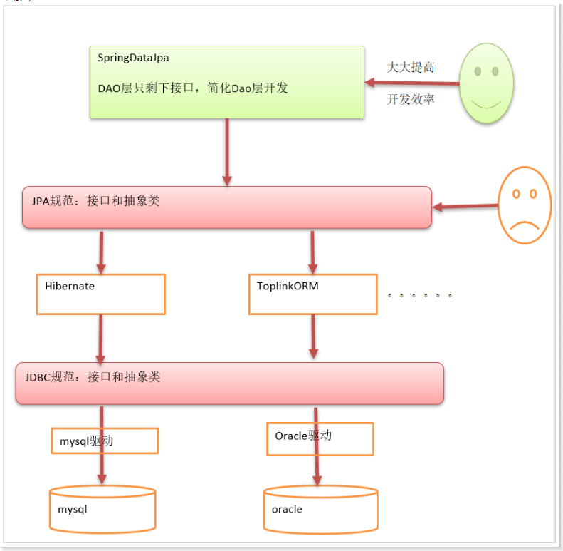

SpringDataJpa底层整合了JPA规范，DAO层只剩下接口，简化DAO层开发。在主流数据库下，SpringDataJpa的效率和Mybatis差不多，但是一些偏门的数据库下，Mybatis的支持比SpringDataJpa好！

## 8.SpringDataJPA入门⭐

### 8.1 导入依赖

~~~xml
<project xmlns="http://maven.apache.org/POM/4.0.0"
	xmlns:xsi="http://www.w3.org/2001/XMLSchema-instance"
	xsi:schemaLocation="http://maven.apache.org/POM/4.0.0 https://maven.apache.org/xsd/maven-4.0.0.xsd">
	<modelVersion>4.0.0</modelVersion>
	<groupId>com.atguigu</groupId>
	<artifactId>springdataJpa</artifactId>
	<version>0.0.1-SNAPSHOT</version>
	<properties>
		<spring.version>5.0.2.RELEASE</spring.version>
		<hibernate.version>5.0.7.Final</hibernate.version>
		<slf4j.version>1.6.6</slf4j.version>
		<log4j.version>1.2.12</log4j.version>
		<c3p0.version>0.9.1.2</c3p0.version>
		<mysql.version>5.1.18</mysql.version>
	</properties>

	<dependencies>
		<!-- junit单元测试 -->
		<dependency>
			<groupId>junit</groupId>
			<artifactId>junit</artifactId>
			<version>4.12</version>
			<scope>test</scope>
		</dependency>

		<!-- spring begin -->
		<dependency>
			<groupId>org.aspectj</groupId>
			<artifactId>aspectjweaver</artifactId>
			<version>1.6.8</version>
		</dependency>

		<dependency>
			<groupId>org.springframework</groupId>
			<artifactId>spring-aop</artifactId>
			<version>${spring.version}</version>
		</dependency>

		<dependency>
			<groupId>org.springframework</groupId>
			<artifactId>spring-context</artifactId>
			<version>${spring.version}</version>
		</dependency>

		<dependency>
			<groupId>org.springframework</groupId>
			<artifactId>spring-context-support</artifactId>
			<version>${spring.version}</version>
		</dependency>

		<dependency>
			<groupId>org.springframework</groupId>
			<artifactId>spring-orm</artifactId>
			<version>${spring.version}</version>
		</dependency>

		<dependency>
			<groupId>org.springframework</groupId>
			<artifactId>spring-beans</artifactId>
			<version>${spring.version}</version>
		</dependency>

		<dependency>
			<groupId>org.springframework</groupId>
			<artifactId>spring-core</artifactId>
			<version>${spring.version}</version>
		</dependency>
		<!-- spring end -->

		<!-- hibernate beg -->
		<dependency>
			<groupId>org.hibernate</groupId>
			<artifactId>hibernate-core</artifactId>
			<version>${hibernate.version}</version>
		</dependency>
		<dependency>
			<groupId>org.hibernate</groupId>
			<artifactId>hibernate-entitymanager</artifactId>
			<version>${hibernate.version}</version>
		</dependency>
		<dependency>
			<groupId>org.hibernate</groupId>
			<artifactId>hibernate-validator</artifactId>
			<version>5.2.1.Final</version>
		</dependency>
		<!-- hibernate end -->

		<!-- c3p0 beg -->
		<dependency>
			<groupId>c3p0</groupId>
			<artifactId>c3p0</artifactId>
			<version>${c3p0.version}</version>
		</dependency>
		<!-- c3p0 end -->

		<!-- log beg
		   slf4j类似于接口
		   log4j是一种实现
		 -->
		<dependency>
			<groupId>log4j</groupId>
			<artifactId>log4j</artifactId>
			<version>${log4j.version}</version>
		</dependency>

		<dependency>
			<groupId>org.slf4j</groupId>
			<artifactId>slf4j-api</artifactId>
			<version>${slf4j.version}</version>
		</dependency>

		<dependency>
			<groupId>org.slf4j</groupId>
			<artifactId>slf4j-log4j12</artifactId>
			<version>${slf4j.version}</version>
		</dependency>
		<!-- log end -->


		<dependency>
			<groupId>mysql</groupId>
			<artifactId>mysql-connector-java</artifactId>
			<version>${mysql.version}</version>
		</dependency>

		<!-- SpringDataJpa核心包 -->
		<dependency>
			<groupId>org.springframework.data</groupId>
			<artifactId>spring-data-jpa</artifactId>
			<version>2.0.6.RELEASE</version>
		</dependency>

		<dependency>
			<groupId>org.springframework</groupId>
			<artifactId>spring-test</artifactId>
			<version>${spring.version}</version>
		</dependency>

		<!-- el beg 使用spring data jpa 必须引入 -->
		<dependency>
			<groupId>javax.el</groupId>
			<artifactId>javax.el-api</artifactId>
			<version>2.2.4</version>
		</dependency>

		<dependency>
			<groupId>org.glassfish.web</groupId>
			<artifactId>javax.el</artifactId>
			<version>2.2.4</version>
		</dependency>
		<!-- el end -->
	</dependencies>
</project>
~~~

### 8.2 编写核心配置文件applicationContext.xml⭐💡

~~~xml
<?xml version="1.0" encoding="UTF-8"?>
<beans xmlns="http://www.springframework.org/schema/beans"
	xmlns:xsi="http://www.w3.org/2001/XMLSchema-instance"
	xmlns:aop="http://www.springframework.org/schema/aop"
	xmlns:context="http://www.springframework.org/schema/context"
	xmlns:jdbc="http://www.springframework.org/schema/jdbc"
	xmlns:tx="http://www.springframework.org/schema/tx"
	xmlns:jpa="http://www.springframework.org/schema/data/jpa"
	xmlns:task="http://www.springframework.org/schema/task"
	xsi:schemaLocation="
      http://www.springframework.org/schema/beans http://www.springframework.org/schema/beans/spring-beans.xsd
      http://www.springframework.org/schema/aop http://www.springframework.org/schema/aop/spring-aop.xsd
      http://www.springframework.org/schema/context http://www.springframework.org/schema/context/spring-context.xsd
      http://www.springframework.org/schema/jdbc http://www.springframework.org/schema/jdbc/spring-jdbc.xsd
      http://www.springframework.org/schema/tx http://www.springframework.org/schema/tx/spring-tx.xsd
      http://www.springframework.org/schema/data/jpa http://www.springframework.org/schema/data/jpa/spring-jpa.xsd">
      	<!-- SpringDataJpa配置 -->
    <!-- 1、EntityManagerFactory 交给spring管理-->
    <!-- 
         EntityManagerFactory:Spring提供了这个接口的实现类
     -->
    <bean id="entityManagerFactory" class="org.springframework.orm.jpa.LocalContainerEntityManagerFactoryBean">
        <!-- 数据源 -->
        <property name="dataSource" ref="dataSource"></property>
        <!-- 扫描实体类所在的包!!!! -->
        <property name="packagesToScan" value="com.atguigu.pojo"></property>
        <!-- JPA提供商 -->
        <property name="persistenceProvider">
            <bean  class="org.hibernate.jpa.HibernatePersistenceProvider"></bean>
        </property>
        <!--jpa提供商的适配器-->
        <property name="jpaVendorAdapter">
            <bean class="org.springframework.orm.jpa.vendor.HibernateJpaVendorAdapter">
                <property name="generateDdl" value="false" />
                <property name="database" value="MYSQL" />
                <property name="databasePlatform" value="org.hibernate.dialect.MySQLDialect" />
                <property name="showSql" value="true" />
            </bean>
        </property>
        <!-- JPA方言:可以使用jpa的高级特性 -->
        <property name="jpaDialect">
            <bean class="org.springframework.orm.jpa.vendor.HibernateJpaDialect"></bean>
        </property>
    </bean>
   
    <!-- 2、配置数据源 -->
    <bean id="dataSource" class="com.mchange.v2.c3p0.ComboPooledDataSource">
         <property name="driverClass" value="com.mysql.jdbc.Driver"></property>
         <property name="jdbcUrl" value="jdbc:mysql://localhost:3306/demo"></property>
         <property name="user" value="root"></property>
         <property name="password" value="123456"></property>
    </bean>
    
    <!-- 3、平台事务管理器 -->
    <bean id="transactionManager" class="org.springframework.orm.jpa.JpaTransactionManager">
       <property name="entityManagerFactory" ref="entityManagerFactory"></property>
    </bean>
    
    <!-- 4、SpringDataJpa的配置
        base-package:基础包，基包，是Dao接口所在的基础包
        entity-manager-factory-ref:引用实体类管理器工厂
        transaction-manager-ref:平台事务管理器
    -->
    <jpa:repositories 
          base-package="com.atguigu.dao"
          entity-manager-factory-ref="entityManagerFactory"
          transaction-manager-ref="transactionManager">
    </jpa:repositories>
    
    <!-- 5、开启组件的扫描-->
    <context:component-scan base-package="com.atguigu"></context:component-scan>
</beans>
~~~

### 8.3 编写客户实体类并进行JPA注解映

~~~java
package com.atguigu.pojo;

import java.io.Serializable;

import javax.persistence.Column;
import javax.persistence.Entity;
import javax.persistence.GeneratedValue;
import javax.persistence.GenerationType;
import javax.persistence.Id;
import javax.persistence.Table;

@Entity
@Table(name = "cst_customer")
public class Customer implements Serializable{
	@Id
	@Column(name="cust_id")
	@GeneratedValue(strategy = GenerationType.IDENTITY)
	private Long custId;
	
	@Column(name="cust_name")
	private String custName;
	
	@Column(name="cust_level")
	private String custLevel;
	
	@Column(name="cust_source")
	private String custSource;
	
	@Column(name="cust_industry")
	private String custIndustry;
	
	@Column(name="cust_address")
	private String custAddress;
	
	@Column(name="cust_phone")
	private String custPhone;

	public Long getCustId() {
		return custId;
	}

	public void setCustId(Long custId) {
		this.custId = custId;
	}

	public String getCustName() {
		return custName;
	}

	public void setCustName(String custName) {
		this.custName = custName;
	}

	public String getCustLevel() {
		return custLevel;
	}

	public void setCustLevel(String custLevel) {
		this.custLevel = custLevel;
	}

	public String getCustSource() {
		return custSource;
	}

	public void setCustSource(String custSource) {
		this.custSource = custSource;
	}

	public String getCustIndustry() {
		return custIndustry;
	}

	public void setCustIndustry(String custIndustry) {
		this.custIndustry = custIndustry;
	}

	public String getCustAddress() {
		return custAddress;
	}

	public void setCustAddress(String custAddress) {
		this.custAddress = custAddress;
	}

	public String getCustPhone() {
		return custPhone;
	}

	public void setCustPhone(String custPhone) {
		this.custPhone = custPhone;
	}

	@Override
	public String toString() {
		return "Customer [custId=" + custId + ", custName=" + custName + ", custLevel=" + custLevel + ", custSource="
				+ custSource + ", custIndustry=" + custIndustry + ", custAddress=" + custAddress + ", custPhone="
				+ custPhone + "]";
	}
}
~~~

### 8.4 编写符合规范的DAO层接口⭐💡

~~~java
package com.atguigu.dao;

import org.springframework.data.jpa.repository.JpaRepository;
import org.springframework.data.jpa.repository.JpaSpecificationExecutor;

import com.atguigu.pojo.Customer;

/**
 * 
 * jpa接口：
 *    1.这个接口所在的包已经在SpringDataJpa的核心配置文件中进行了配置声明，故不能乱放位置
 *          <jpa:repositories 
		          base-package="com.atguigu.dao"
		          entity-manager-factory-ref="entityManagerFactory"
		          transaction-manager-ref="transactionManager">
            </jpa:repositories>
      2.这个接口需要实现两个接口
           2.1 JpaRepository<操作的实体类，主键类型>:用于基本的增删改分页等
           2.2 JpaSpecificationExecutor<操作的实体类>：用于动态查询
 *
 */
public interface CustomerDao extends  JpaRepository<Customer,Long>,JpaSpecificationExecutor<Customer>{

}
~~~

**只要实现了这两个接口，就自动那个具备了增删改查的功能！**

### 8.5 SpringDataJpa的CRUD⭐💡重点！！！！

#### 8.5.1 根据主键查询一个对象findById⭐💡

~~~java
package com.atguigu.test;

import java.util.Optional;

import org.junit.runner.RunWith;
import org.springframework.beans.factory.annotation.Autowired;
import org.springframework.test.context.ContextConfiguration;
import org.springframework.test.context.junit4.SpringJUnit4ClassRunner;

import com.atguigu.dao.CustomerDao;
import com.atguigu.pojo.Customer;

//1.替换运行器，替换成Spring的运行器
@RunWith(SpringJUnit4ClassRunner.class)
//2.指定配置文件
@ContextConfiguration("classpath:applicationContext.xml")
public class Test {
     
	@Autowired
	private CustomerDao customerDao;
	
	@org.junit.Test
	public void test1() {
		Optional<Customer> optional = customerDao.findById(2l);
		Customer customer = optional.get();// 从Optional里面get出来即可！
		System.out.println(customer);
	}	
}
~~~

#### 8.5.2 保存和更新一个对象save⭐💡

- 保存一个对象 **save方法**

~~~java
package com.atguigu.test;

import java.util.Optional;

import org.junit.runner.RunWith;
import org.springframework.beans.factory.annotation.Autowired;
import org.springframework.test.context.ContextConfiguration;
import org.springframework.test.context.junit4.SpringJUnit4ClassRunner;

import com.atguigu.dao.CustomerDao;
import com.atguigu.pojo.Customer;

import javassist.expr.NewArray;

//1.替换运行器，替换成Spring的运行器
@RunWith(SpringJUnit4ClassRunner.class)
//2.指定配置文件
@ContextConfiguration("classpath:applicationContext.xml")
public class Test {
     
	@Autowired
	private CustomerDao customerDao;
	
	@org.junit.Test
	public void test1() {
		Customer c = new Customer();
		c.setCustName("樱木花道染发剂公司");
		c.setCustLevel("最强王者级");
		customerDao.save(c);
	}	
}
~~~

- 更新一个对象。也是**save**方法

>其中保存没有主键字段，更新有主键字段条件。
>
>更新也是需要先查询再更新！！！！

~~~java
package com.atguigu.test;

import java.util.Optional;

import org.junit.runner.RunWith;
import org.springframework.beans.factory.annotation.Autowired;
import org.springframework.test.context.ContextConfiguration;
import org.springframework.test.context.junit4.SpringJUnit4ClassRunner;

import com.atguigu.dao.CustomerDao;
import com.atguigu.pojo.Customer;

import javassist.expr.NewArray;

//1.替换运行器，替换成Spring的运行器
@RunWith(SpringJUnit4ClassRunner.class)
//2.指定配置文件
@ContextConfiguration("classpath:applicationContext.xml")
public class Test {
     
	@Autowired
	private CustomerDao customerDao;
	
	@org.junit.Test
	public void test1() {
		Optional<Customer> optional = customerDao.findById(2l);//更新有主键字段
		Customer customer = optional.get();
		customer.setCustName("阿里卡卡电商公司");
		customerDao.save(customer);
	}
}
~~~

#### 8.5.3 删除一个对象deleteById⭐💡

~~~java
package com.atguigu.test;

import java.util.Optional;

import org.junit.runner.RunWith;
import org.springframework.beans.factory.annotation.Autowired;
import org.springframework.test.context.ContextConfiguration;
import org.springframework.test.context.junit4.SpringJUnit4ClassRunner;

import com.atguigu.dao.CustomerDao;
import com.atguigu.pojo.Customer;

import javassist.expr.NewArray;

//1.替换运行器，替换成Spring的运行器
@RunWith(SpringJUnit4ClassRunner.class)
//2.指定配置文件
@ContextConfiguration("classpath:applicationContext.xml")
public class Test {
     
	@Autowired
	private CustomerDao customerDao;
	
	@org.junit.Test
	public void test1() {
		customerDao.deleteById(2l);
	}	
}
~~~

#### 8.5.4 查询所有对象findAll⭐💡

~~~java
package com.atguigu.test;

import java.util.List;
import java.util.Optional;

import org.junit.runner.RunWith;
import org.springframework.beans.factory.annotation.Autowired;
import org.springframework.test.context.ContextConfiguration;
import org.springframework.test.context.junit4.SpringJUnit4ClassRunner;

import com.atguigu.dao.CustomerDao;
import com.atguigu.pojo.Customer;

import javassist.expr.NewArray;

//1.替换运行器，替换成Spring的运行器
@RunWith(SpringJUnit4ClassRunner.class)
//2.指定配置文件
@ContextConfiguration("classpath:applicationContext.xml")
public class Test {
     
	@Autowired
	private CustomerDao customerDao;
	
	@org.junit.Test
	public void test1() {
		List<Customer> list = customerDao.findAll();
		for (Customer customer : list) {
			System.out.println(customer);
		}
	}	
}
~~~

### 8.6 入门总结

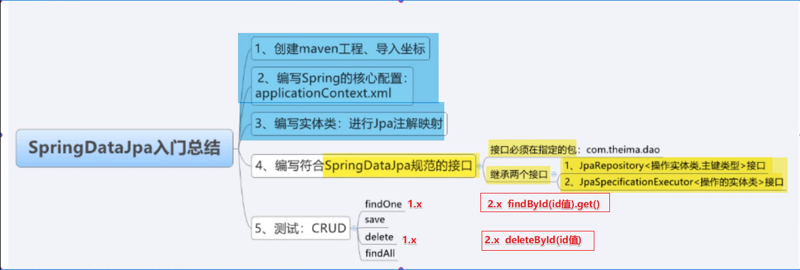

## 9.SpringDataJpA底层原理解析⭐💡

实际上底层是基于JDK动态代理生成了接口的代理对象来进行增上改查操作的！


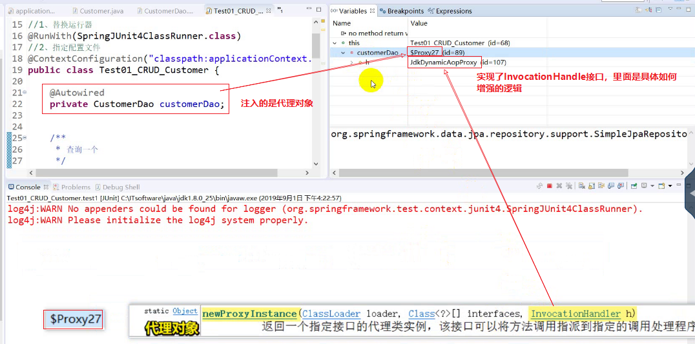

1）我们只写了接口，但是没有实现类，这个==**实现类就是Spring在运行的时候，注入的代理对象**==

2）Spring怎么知道生成那个dao的实现类？因为在配置文件中指定了dao接口所在的包

3）生成的是什么对象？代理对象：==通过jdk生成的动态代理对象==

Proxy.newProxyInstance(类加载器,实现的接口列表,InvocationHandler)

==**JdkDynamicAopProxy: 这个是个对象，实现了InvocationHandler接口，所以这个类有invoke方法**==

4）在JdkDynamicAopProxy的invoke方法中有个target对象，这个对象就是真正干活的对象,这个对象会赋值为SimpleJpaRepository对象。

5）真正干活的对象：SimpleJpaRepository

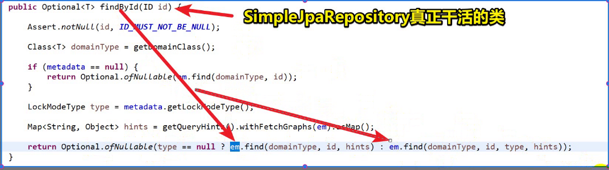

6）SimpleJpaRepository实现了我们dao接口继承的那两个接口，所以这个类中肯定有接口的所有方法.

7）我们看到findOne| findById()方法中调用了em.find方法，这个em到底是谁？**em就是EntityManager**.

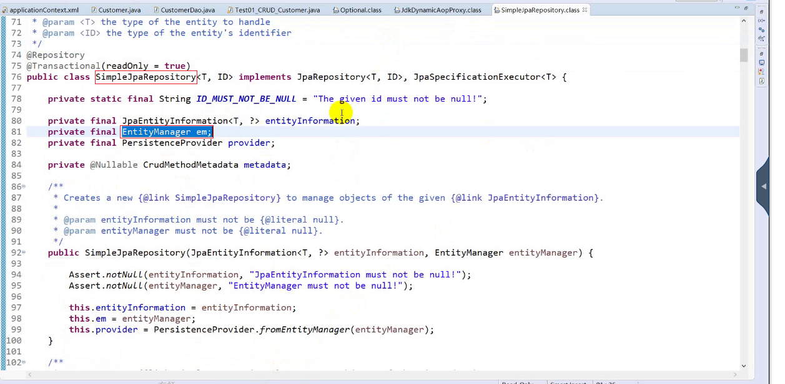

## 10.SpringDataJpa常用接口分析⭐💡

实际上的接口以及相关作用分析：

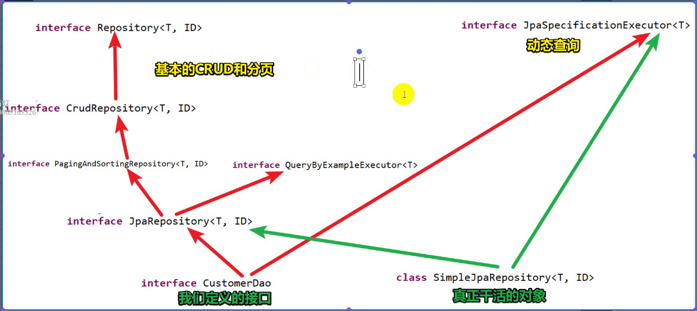

基本的CRUD+分页等                                                                                                                     动态查询

## 11.查询的几种方式   重点！！！！

### 11.1 接口定义的方法查询⭐💡

这种方式下我们直接用接口定义的方法就可以完成查询。

#### 11.1.1 接口定义方法查询：查询一个的两种方法💡

我们再用jpa的时候有立即加载查询和懒加载查询两种方式，对应的方法分别是**find和getReference**

我们在SpringDataJpa中同样有两种方式进行对象的查询

- ==**立即加载，findById方法，底层还是调用JPA的find方法,当一条数据中数据量不大可以用立即加载**==

~~~java
package com.atguigu.test;

import java.util.List;
import java.util.Optional;

import org.junit.runner.RunWith;
import org.springframework.beans.factory.annotation.Autowired;
import org.springframework.test.context.ContextConfiguration;
import org.springframework.test.context.junit4.SpringJUnit4ClassRunner;

import com.atguigu.dao.CustomerDao;
import com.atguigu.pojo.Customer;

import javassist.expr.NewArray;

//1.替换运行器，替换成Spring的运行器
@RunWith(SpringJUnit4ClassRunner.class)
//2.指定配置文件
@ContextConfiguration("classpath:applicationContext.xml")
public class Test {
     
	@Autowired
	private CustomerDao customerDao;
	
	@org.junit.Test
	public void test1() {
		// 立即加载，用findById
		Optional<Customer> optional = customerDao.findById(3L);
		Customer customer = optional.get();
		System.out.println(customer);
	}
	
}
~~~

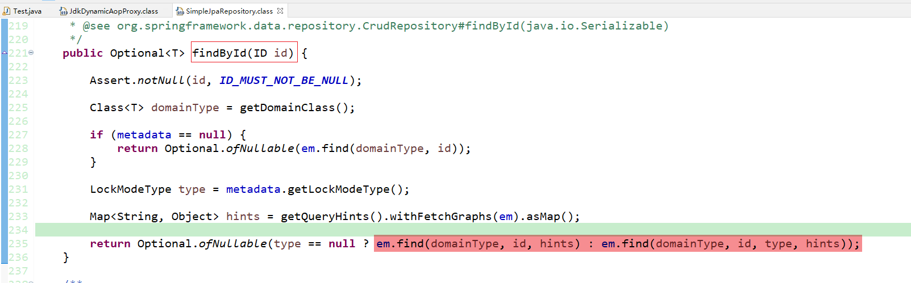

- ==**延迟加载，调用getOne方法，底层还是调用JPA的getReference方法，当一条数据中数据很大时，用懒加载**==

注意：懒加载要加上@Transactional注解！！！

~~~java
package com.atguigu.test;

import java.util.List;
import java.util.Optional;

import org.junit.runner.RunWith;
import org.springframework.beans.factory.annotation.Autowired;
import org.springframework.test.context.ContextConfiguration;
import org.springframework.test.context.junit4.SpringJUnit4ClassRunner;
import org.springframework.transaction.annotation.Transactional;

import com.atguigu.dao.CustomerDao;
import com.atguigu.pojo.Customer;

import javassist.expr.NewArray;

//1.替换运行器，替换成Spring的运行器
@RunWith(SpringJUnit4ClassRunner.class)
//2.指定配置文件
@ContextConfiguration("classpath:applicationContext.xml")
public class Test {
     
	@Autowired
	private CustomerDao customerDao;
	
	@org.junit.Test
	@Transactional //解决NoSession的问题： 懒加载需要事务
	public void test1() {
		// 延迟加载
		Customer one = customerDao.getOne(3l);
		System.out.println(one);
	}
	
}
~~~

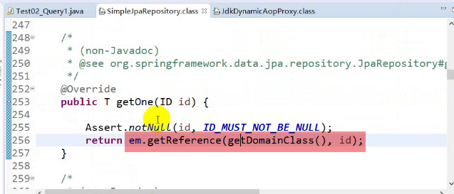

#### 11.1.2 接口定义方法查询：查询所有中的分页与排序查询.💡

|      | 方法                               |          |
| ---- | ---------------------------------- | -------- |
| 1    | List<T> findAll(Sort sort);        | 用于排序 |
| 2    | Page<T> findAll(Pageable pageable) | 用于分页 |

- 排序

>List<T> findAll(Sort sort):这个方法里面可以传递一个Sort参数，用于排序

~~~java
package com.atguigu.test;

import java.util.List;
import java.util.Optional;

import org.junit.runner.RunWith;
import org.springframework.beans.factory.annotation.Autowired;
import org.springframework.data.domain.Sort;
import org.springframework.data.domain.Sort.Direction;
import org.springframework.test.context.ContextConfiguration;
import org.springframework.test.context.junit4.SpringJUnit4ClassRunner;
import org.springframework.transaction.annotation.Transactional;

import com.atguigu.dao.CustomerDao;
import com.atguigu.pojo.Customer;

import javassist.expr.NewArray;

//1.替换运行器，替换成Spring的运行器
@RunWith(SpringJUnit4ClassRunner.class)
//2.指定配置文件
@ContextConfiguration("classpath:applicationContext.xml")
public class Test {
     
	@Autowired
	private CustomerDao customerDao;
	
	@org.junit.Test
	public void test1() {
		/**
		 * List<T> findAll(Sort sort):这个方法里面可以传递一个Sort参数，用于排序
		 */
		List<Customer> list = customerDao.findAll(Sort.by(Direction.DESC,"custId"));
		for (Customer customer : list) {
			System.out.println(customer);
		}
	}
	
}
~~~

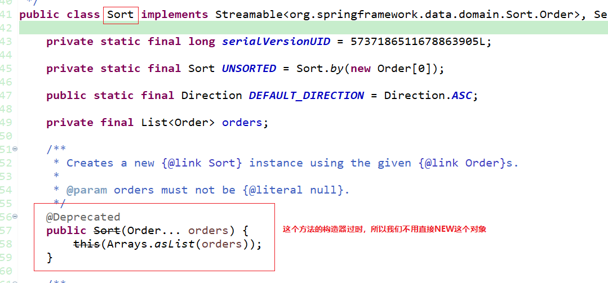

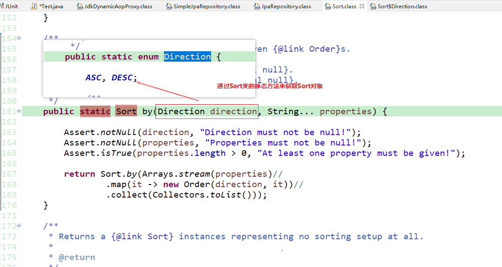


- 分页查询

>/**
>		 * Page<T> findAll(Pageable pageable):
>		 *         1.用于分页
>		 *         2.参数是一个接口：Pageable，我们用他的实现类PageRequest
>		 *         3.这个实现的对象获取是通过调用它的静态方法of：
>		 *                                                                                 参数1：页索引，从0开始，0代表第一页
>		 *                                                                                 参数2： 页大小                                                                    
>		 *                               
>		 */

返回的Page对象，有如下方法：

|      | 方法名             |                  |
| ---- | ------------------ | ---------------- |
| 1    | getTotalElements() | 分页的总记录数   |
| 2    | getTotalPages()    | 分页的总页数     |
| 3    | getContent()       | 当前页的数据集合 |

~~~java
package com.atguigu.test;

import java.util.List;
import java.util.Optional;

import org.junit.runner.RunWith;
import org.springframework.beans.factory.annotation.Autowired;
import org.springframework.data.domain.Page;
import org.springframework.data.domain.PageRequest;
import org.springframework.data.domain.Pageable;
import org.springframework.data.domain.Sort;
import org.springframework.data.domain.Sort.Direction;
import org.springframework.test.context.ContextConfiguration;
import org.springframework.test.context.junit4.SpringJUnit4ClassRunner;
import org.springframework.transaction.annotation.Transactional;

import com.atguigu.dao.CustomerDao;
import com.atguigu.pojo.Customer;

import javassist.expr.NewArray;

//1.替换运行器，替换成Spring的运行器
@RunWith(SpringJUnit4ClassRunner.class)
//2.指定配置文件
@ContextConfiguration("classpath:applicationContext.xml")
public class Test {
     
	@Autowired
	private CustomerDao customerDao;
	
	@org.junit.Test
	public void test1() {
		/**
		 * Page<T> findAll(Pageable pageable):
		 *         1.用于分页
		 *         2.参数是一个接口：Pageable，我们用他的实现类PageRequest
		 *         3.这个实现的对象获取调用它的静态方法of：
		 *                                                                                 参数1：页索引，从0开始，0代表第一页
		 *                                                                                 参数2： 页大小                                                                      
		 *                               
		 */
		Pageable of = PageRequest.of(0, 1);
		Page<Customer> findAll = customerDao.findAll(of);
		System.out.println("总记录数："+findAll.getTotalElements());
		System.out.println("总页数："+findAll.getTotalPages());
		
		// 返回当前页的数据
		for (Customer customer : findAll.getContent()) {
			System.out.println(customer);
		}
	}
	
}
~~~

#### 11.1.3 接口定义方法查询：统计所有和判断一个对象是否存在💡

|      | 方法         | 说明                 |
| ---- | ------------ | -------------------- |
| 1    | count()      | 统计所有             |
| 2    | existsById() | 更具主键判断是否存在 |

~~~java
package com.atguigu.test;

import java.util.List;
import java.util.Optional;

import org.junit.runner.RunWith;
import org.springframework.beans.factory.annotation.Autowired;
import org.springframework.data.domain.Page;
import org.springframework.data.domain.PageRequest;
import org.springframework.data.domain.Pageable;
import org.springframework.data.domain.Sort;
import org.springframework.data.domain.Sort.Direction;
import org.springframework.test.context.ContextConfiguration;
import org.springframework.test.context.junit4.SpringJUnit4ClassRunner;
import org.springframework.transaction.annotation.Transactional;

import com.atguigu.dao.CustomerDao;
import com.atguigu.pojo.Customer;

import javassist.expr.NewArray;

//1.替换运行器，替换成Spring的运行器
@RunWith(SpringJUnit4ClassRunner.class)
//2.指定配置文件
@ContextConfiguration("classpath:applicationContext.xml")
public class Test {
     
	@Autowired
	private CustomerDao customerDao;
	
	
	/**
	 * 统计所有：
	 * select  count(*)  from 表
	 */
	@org.junit.Test
	public void test1() {
		long count = customerDao.count();
		System.out.println(count);
	}	
}
~~~

~~~java
package com.atguigu.test;

import java.util.List;
import java.util.Optional;

import org.junit.runner.RunWith;
import org.springframework.beans.factory.annotation.Autowired;
import org.springframework.data.domain.Page;
import org.springframework.data.domain.PageRequest;
import org.springframework.data.domain.Pageable;
import org.springframework.data.domain.Sort;
import org.springframework.data.domain.Sort.Direction;
import org.springframework.test.context.ContextConfiguration;
import org.springframework.test.context.junit4.SpringJUnit4ClassRunner;
import org.springframework.transaction.annotation.Transactional;

import com.atguigu.dao.CustomerDao;
import com.atguigu.pojo.Customer;

import javassist.expr.NewArray;

//1.替换运行器，替换成Spring的运行器
@RunWith(SpringJUnit4ClassRunner.class)
//2.指定配置文件
@ContextConfiguration("classpath:applicationContext.xml")
public class Test {
     
	@Autowired
	private CustomerDao customerDao;
	
	
	@org.junit.Test
	public void test1() {
		boolean existsById = customerDao.existsById(4l);
		System.out.println(existsById);
	}
	
}
~~~

### 11.2 JPQL查询⭐💡

#### 11.2.1JPQL查询操作

==注意：占位符后面要加上参数的索引，索引从1开始==

JPQL查询的规则如下：

```
	1）在dao接口中编写方法
	2）在方法上使用@Query(value="JPQL语句")
	3）返回值，自己定，如果是单个对象，你就写单个对象，如果多个，就用List
```

- **精确查询**

~~~java
package com.atguigu.dao;

import java.util.List;

import org.springframework.data.jpa.repository.JpaRepository;
import org.springframework.data.jpa.repository.JpaSpecificationExecutor;
import org.springframework.data.jpa.repository.Query;

import com.atguigu.pojo.Customer;


/**
 * 
 * jpa接口：
 *    1.这个接口所在的包已经在SpringDataJpa的核心配置文件中进行了配置声明，故不能乱放位置
 *          <jpa:repositories 
		          base-package="com.atguigu.dao"
		          entity-manager-factory-ref="entityManagerFactory"
		          transaction-manager-ref="transactionManager">
            </jpa:repositories>
      2.这个接口需要实现两个接口
           2.1 JpaRepository<操作的实体类，主键类型>:用于基本的增删改分页等
           2.2 JpaSpecificationExecutor<操作的实体类>：用于动态查询
 *
 */
public interface CustomerDao extends  JpaRepository<Customer,Long>,JpaSpecificationExecutor<Customer>{

	// jpql查询：value写的就是JPQL语句
	// 占位符后面要加上参数的索引，索引从1开始
	@Query(value="from Customer where  custLevel=?1")
	public List<Customer> findJPQL1(String level);
	 
}
~~~

~~~java
package com.atguigu.test;

import java.util.List;
import java.util.Optional;

import org.junit.runner.RunWith;
import org.springframework.beans.factory.annotation.Autowired;
import org.springframework.data.domain.Page;
import org.springframework.data.domain.PageRequest;
import org.springframework.data.domain.Pageable;
import org.springframework.data.domain.Sort;
import org.springframework.data.domain.Sort.Direction;
import org.springframework.test.context.ContextConfiguration;
import org.springframework.test.context.junit4.SpringJUnit4ClassRunner;
import org.springframework.transaction.annotation.Transactional;

import com.atguigu.dao.CustomerDao;
import com.atguigu.pojo.Customer;

import javassist.expr.NewArray;

//1.替换运行器，替换成Spring的运行器
@RunWith(SpringJUnit4ClassRunner.class)
//2.指定配置文件
@ContextConfiguration("classpath:applicationContext.xml")
public class Test {
     
	@Autowired
	private CustomerDao customerDao;
	
	
	@org.junit.Test
	public void test1() {
		List<Customer> jpql1 = customerDao.findJPQL1("最强王者级");
		for (Customer customer : jpql1) {
			System.out.println(customer);
		}
	}	
}
~~~

- **模糊查询**

~~~java
package com.atguigu.dao;

import java.util.List;

import org.springframework.data.jpa.repository.JpaRepository;
import org.springframework.data.jpa.repository.JpaSpecificationExecutor;
import org.springframework.data.jpa.repository.Query;

import com.atguigu.pojo.Customer;
/**
 * 
 * jpa接口：
 *    1.这个接口所在的包已经在SpringDataJpa的核心配置文件中进行了配置声明，故不能乱放位置
 *          <jpa:repositories 
		          base-package="com.atguigu.dao"
		          entity-manager-factory-ref="entityManagerFactory"
		          transaction-manager-ref="transactionManager">
            </jpa:repositories>
      2.这个接口需要实现两个接口
           2.1 JpaRepository<操作的实体类，主键类型>:用于基本的增删改分页等
           2.2 JpaSpecificationExecutor<操作的实体类>：用于动态查询
 *
 */
public interface CustomerDao extends  JpaRepository<Customer,Long>,JpaSpecificationExecutor<Customer>{

	// jpql查询：value写的就是JPQL语句
	// 占位符后面要加上参数的索引，索引从1开始
	@Query(value="from Customer where  custLevel like ?1")
	public List<Customer> findJPQL1(String level);
	 
}
~~~

~~~java
package com.atguigu.test;

import java.util.List;
import java.util.Optional;

import org.junit.runner.RunWith;
import org.springframework.beans.factory.annotation.Autowired;
import org.springframework.data.domain.Page;
import org.springframework.data.domain.PageRequest;
import org.springframework.data.domain.Pageable;
import org.springframework.data.domain.Sort;
import org.springframework.data.domain.Sort.Direction;
import org.springframework.test.context.ContextConfiguration;
import org.springframework.test.context.junit4.SpringJUnit4ClassRunner;
import org.springframework.transaction.annotation.Transactional;

import com.atguigu.dao.CustomerDao;
import com.atguigu.pojo.Customer;

import javassist.expr.NewArray;

//1.替换运行器，替换成Spring的运行器
@RunWith(SpringJUnit4ClassRunner.class)
//2.指定配置文件
@ContextConfiguration("classpath:applicationContext.xml")
public class Test {
     
	@Autowired
	private CustomerDao customerDao;
	
	/**
	 * 模糊查询
	 */
	@org.junit.Test
	public void test1() {
		List<Customer> jpql1 = customerDao.findJPQL1("%王者级");
		for (Customer customer : jpql1) {
			System.out.println(customer);
		}
	}	
}
~~~

- **多条件查询**

~~~java
package com.atguigu.dao;

import java.util.List;

import org.springframework.data.jpa.repository.JpaRepository;
import org.springframework.data.jpa.repository.JpaSpecificationExecutor;
import org.springframework.data.jpa.repository.Query;

import com.atguigu.pojo.Customer;
/**
 * 
 * jpa接口：
 *    1.这个接口所在的包已经在SpringDataJpa的核心配置文件中进行了配置声明，故不能乱放位置
 *          <jpa:repositories 
		          base-package="com.atguigu.dao"
		          entity-manager-factory-ref="entityManagerFactory"
		          transaction-manager-ref="transactionManager">
            </jpa:repositories>
      2.这个接口需要实现两个接口
           2.1 JpaRepository<操作的实体类，主键类型>:用于基本的增删改分页等
           2.2 JpaSpecificationExecutor<操作的实体类>：用于动态查询
 *
 */
public interface CustomerDao extends  JpaRepository<Customer,Long>,JpaSpecificationExecutor<Customer>{

	// jpql查询：value写的就是JPQL语句
	// 占位符后面要加上参数的索引，索引从1开始
	@Query(value="from Customer where  custLevel like ?1 and custAddress=?2")
	public List<Customer> findJPQL1(String level,String address); 
}
~~~

~~~java
package com.atguigu.test;

import java.util.List;
import java.util.Optional;

import org.junit.runner.RunWith;
import org.springframework.beans.factory.annotation.Autowired;
import org.springframework.data.domain.Page;
import org.springframework.data.domain.PageRequest;
import org.springframework.data.domain.Pageable;
import org.springframework.data.domain.Sort;
import org.springframework.data.domain.Sort.Direction;
import org.springframework.test.context.ContextConfiguration;
import org.springframework.test.context.junit4.SpringJUnit4ClassRunner;
import org.springframework.transaction.annotation.Transactional;

import com.atguigu.dao.CustomerDao;
import com.atguigu.pojo.Customer;
import javassist.expr.NewArray;

//1.替换运行器，替换成Spring的运行器
@RunWith(SpringJUnit4ClassRunner.class)
//2.指定配置文件
@ContextConfiguration("classpath:applicationContext.xml")
public class Test {
     
	@Autowired
	private CustomerDao customerDao;
	
	/**
	 * 多条件查询
	 */
	@org.junit.Test
	public void test1() {
		List<Customer> jpql1 = customerDao.findJPQL1("%王者级","广州");
		for (Customer customer : jpql1) {
			System.out.println(customer);
		}
	}	
}
~~~

#### 11.2.2JPQL更新操作

JPQL更新也是需要满足一些规范的：

>**dao接口的要求：**
>
>1） 在Query的value属性中编写的update的jpql语句
>
>2）dao接口的方法上还需要加入一个注解：@Modifying
>
>同时由于这是我们自己写的增删改，需要我们手动加上事务控制！

~~~java
package com.atguigu.dao;

import java.util.List;

import org.springframework.data.jpa.repository.JpaRepository;
import org.springframework.data.jpa.repository.JpaSpecificationExecutor;
import org.springframework.data.jpa.repository.Modifying;
import org.springframework.data.jpa.repository.Query;

import com.atguigu.pojo.Customer;
/**
 * 
 * jpa接口：
 *    1.这个接口所在的包已经在SpringDataJpa的核心配置文件中进行了配置声明，故不能乱放位置
 *          <jpa:repositories 
		          base-package="com.atguigu.dao"
		          entity-manager-factory-ref="entityManagerFactory"
		          transaction-manager-ref="transactionManager">
            </jpa:repositories>
      2.这个接口需要实现两个接口
           2.1 JpaRepository<操作的实体类，主键类型>:用于基本的增删改分页等
           2.2 JpaSpecificationExecutor<操作的实体类>：用于动态查询
 *
 */
public interface CustomerDao extends  JpaRepository<Customer,Long>,JpaSpecificationExecutor<Customer>{

	// jpql查询：value写的就是JPQL语句
	// 占位符后面要加上参数的索引，索引从1开始
	@Modifying  // 更新的操作要有这个注解
	@Query("update Customer set custName =?2 where custId=?1")
	public void updateCustomerName(Long id,String Name); 
}
~~~

~~~java
package com.atguigu.test;

import java.util.List;
import java.util.Optional;

import org.junit.runner.RunWith;
import org.springframework.beans.factory.annotation.Autowired;
import org.springframework.data.domain.Page;
import org.springframework.data.domain.PageRequest;
import org.springframework.data.domain.Pageable;
import org.springframework.data.domain.Sort;
import org.springframework.data.domain.Sort.Direction;
import org.springframework.test.annotation.Rollback;
import org.springframework.test.context.ContextConfiguration;
import org.springframework.test.context.junit4.SpringJUnit4ClassRunner;
import org.springframework.transaction.annotation.Transactional;

import com.atguigu.dao.CustomerDao;
import com.atguigu.pojo.Customer;

import javassist.expr.NewArray;

//1.替换运行器，替换成Spring的运行器
@RunWith(SpringJUnit4ClassRunner.class)
//2.指定配置文件
@ContextConfiguration("classpath:applicationContext.xml")
public class Test {
     
	@Autowired
	private CustomerDao customerDao;
	
    
	@org.junit.Test
	// 我们自己的增删改要加事务!!!
	@Transactional
	@Rollback(false)// 之所以加上这个注解，是由于现在是在单元测试环境，Spring自动帮我们回滚了事务，我们需要设置不回滚
	public void test1() {
		customerDao.updateCustomerName(3l, "三分归元气网络科技公司");
	}
}
~~~

### 11.3 SQL查询⭐

我们也可以直接用SQL语句查询来获取结果，使用方式如下：

**sql查询规则：**

```
	1）在dao接口中编写方法
	2）在方法上使用@Query(value="SQL语句",nativeQuery=true)
	3）返回值，自己定，如果是单个对象，你就写单个对象，如果多个，就用List
```

~~~java
package com.atguigu.dao;

import java.util.List;

import org.springframework.data.jpa.repository.JpaRepository;
import org.springframework.data.jpa.repository.JpaSpecificationExecutor;
import org.springframework.data.jpa.repository.Modifying;
import org.springframework.data.jpa.repository.Query;

import com.atguigu.pojo.Customer;


/**
 * 
 * jpa接口：
 *    1.这个接口所在的包已经在SpringDataJpa的核心配置文件中进行了配置声明，故不能乱放位置
 *          <jpa:repositories 
		          base-package="com.atguigu.dao"
		          entity-manager-factory-ref="entityManagerFactory"
		          transaction-manager-ref="transactionManager">
            </jpa:repositories>
      2.这个接口需要实现两个接口
           2.1 JpaRepository<操作的实体类，主键类型>:用于基本的增删改分页等
           2.2 JpaSpecificationExecutor<操作的实体类>：用于动态查询
 *
 */
public interface CustomerDao extends  JpaRepository<Customer,Long>,JpaSpecificationExecutor<Customer>{

	// jpql查询：value写的就是JPQL语句
	// 占位符后面要加上参数的索引，索引从1开始
	@Modifying  // 更新的操作要有这个注解
	@Query(value="select * from  cst_customer where cust_id=?1",nativeQuery = true)
	public List<Customer> findSQL(Long id);	 
}
~~~

~~~java
package com.atguigu.test;

import java.util.List;
import java.util.Optional;

import org.junit.runner.RunWith;
import org.springframework.beans.factory.annotation.Autowired;
import org.springframework.data.domain.Page;
import org.springframework.data.domain.PageRequest;
import org.springframework.data.domain.Pageable;
import org.springframework.data.domain.Sort;
import org.springframework.data.domain.Sort.Direction;
import org.springframework.test.annotation.Rollback;
import org.springframework.test.context.ContextConfiguration;
import org.springframework.test.context.junit4.SpringJUnit4ClassRunner;
import org.springframework.transaction.annotation.Transactional;

import com.atguigu.dao.CustomerDao;
import com.atguigu.pojo.Customer;

import javassist.expr.NewArray;

//1.替换运行器，替换成Spring的运行器
@RunWith(SpringJUnit4ClassRunner.class)
//2.指定配置文件
@ContextConfiguration("classpath:applicationContext.xml")
public class Test {
     
	@Autowired
	private CustomerDao customerDao;
	
    
	@org.junit.Test
	// 我们自己的增删改要加事务!!!
	@Transactional
	@Rollback(false)// 之所以加上这个注解，是由于现在是在单元测试环境，Spring自动帮我们回滚了事务，我们需要设置不回滚
	public void test1() {
		List<Customer> list = customerDao.findSQL(3l);
		for (Customer customer : list) {
			System.out.println(customer);
		}
	}	
}
~~~

### 11.4 根据方法名规则查询💡

SpringDataJpa还提供了这种根据方法名来智能查询的功能。==此时不用再DAO接口方法上加注解==！！！！

Dao接口的方法名规则：

```
	1）以findBy开头
	2）后面跟的是查询的属性条件： 属性名首字母大写
	3）属性名后面跟的是查询规则： 模糊【Like】、精确 【不加规则代表精确查询】
	4）多个条件以  And 、 Or 拼接
	5）重复上面的步骤
	返回值，自己定，如果是单个对象，你就写单个对象，如果多个，就用List
```

~~~java
package com.atguigu.dao;

import java.util.List;

import org.springframework.data.jpa.repository.JpaRepository;
import org.springframework.data.jpa.repository.JpaSpecificationExecutor;
import org.springframework.data.jpa.repository.Modifying;
import org.springframework.data.jpa.repository.Query;

import com.atguigu.pojo.Customer;


/**
 * 
 * jpa接口：
 *    1.这个接口所在的包已经在SpringDataJpa的核心配置文件中进行了配置声明，故不能乱放位置
 *          <jpa:repositories 
		          base-package="com.atguigu.dao"
		          entity-manager-factory-ref="entityManagerFactory"
		          transaction-manager-ref="transactionManager">
            </jpa:repositories>
      2.这个接口需要实现两个接口
           2.1 JpaRepository<操作的实体类，主键类型>:用于基本的增删改分页等
           2.2 JpaSpecificationExecutor<操作的实体类>：用于动态查询
 *
 */
public interface CustomerDao extends  JpaRepository<Customer,Long>,JpaSpecificationExecutor<Customer>{
    // 根据方法名规则查询
	
	// 根据客户名称精确查询
	public List<Customer> findByCustName(String name);
	
	// 根据客户名称模糊查询
	public List<Customer> findByCustNameLike(String name);
	
	
	// 根据客户名称模糊查询
	public List<Customer> findByCustNameLikeAndCustLevel(String name,String level);
}
~~~

~~~java
package com.atguigu.test;

import java.util.List;
import java.util.Optional;

import org.junit.runner.RunWith;
import org.springframework.beans.factory.annotation.Autowired;
import org.springframework.data.domain.Page;
import org.springframework.data.domain.PageRequest;
import org.springframework.data.domain.Pageable;
import org.springframework.data.domain.Sort;
import org.springframework.data.domain.Sort.Direction;
import org.springframework.test.annotation.Rollback;
import org.springframework.test.context.ContextConfiguration;
import org.springframework.test.context.junit4.SpringJUnit4ClassRunner;
import org.springframework.transaction.annotation.Transactional;

import com.atguigu.dao.CustomerDao;
import com.atguigu.pojo.Customer;

import javassist.expr.NewArray;

//1.替换运行器，替换成Spring的运行器
@RunWith(SpringJUnit4ClassRunner.class)
//2.指定配置文件
@ContextConfiguration("classpath:applicationContext.xml")
public class Test {
     
	@Autowired
	private CustomerDao customerDao;
	
    
	@org.junit.Test
	public void test1() {
		List<Customer> findByCustName = customerDao.findByCustName("三分归元气网络科技公司");
		for (Customer customer : findByCustName) {
			System.out.println(customer);
		}
	}
	
	@org.junit.Test
	public void test2() {
		List<Customer> findByCustName = customerDao.findByCustNameLike("樱木花道%");
		for (Customer customer : findByCustName) {
			System.out.println(customer);
		}
	}
	
	@org.junit.Test
	public void test3() {
		List<Customer> findByCustName = customerDao.findByCustNameLikeAndCustLevel("樱木花道%","最强王者级");
		for (Customer customer : findByCustName) {
			System.out.println(customer);
		}
	}
}
~~~

| **Keyword**       | **Sample**                                 | **JPQL**                                                     |      |      |
| ----------------- | ------------------------------------------ | ------------------------------------------------------------ | ---- | ---- |
| And               | findByLastnameAndFirstname                 | … where x.lastname = ?1 and x.firstname = ?2                 |      |      |
| Or                | findByLastnameOrFirstname                  | … where x.lastname = ?1 or x.firstname = ?2                  |      |      |
| Is,Equals         | findByFirstnameIs,   findByFirstnameEquals | … where x.firstname = ?1                                     |      |      |
| Between           | findByStartDateBetween                     | … where x.startDate between ?1 and ?2                        |      |      |
| LessThan          | findByAgeLessThan                          | … where x.age < ?1                                           |      |      |
| LessThanEqual     | findByAgeLessThanEqual                     | … where x.age ⇐ ?1                                           |      |      |
| GreaterThan       | findByAgeGreaterThan                       | … where x.age > ?1                                           |      |      |
| GreaterThanEqual  | findByAgeGreaterThanEqual                  | … where x.age >= ?1                                          |      |      |
| After             | findByStartDateAfter                       | … where x.startDate > ?1                                     |      |      |
| Before            | findByStartDateBefore                      | … where x.startDate < ?1                                     |      |      |
| IsNull            | findByAgeIsNull                            | … where x.age is null                                        |      |      |
| IsNotNull,NotNull | findByAge(Is)NotNull                       | … where x.age not null                                       |      |      |
| Like              | findByFirstnameLike                        | … where x.firstname like ?1                                  |      |      |
| NotLike           | findByFirstnameNotLike                     | … where x.firstname not like ?1                              |      |      |
| StartingWith      | findByFirstnameStartingWith                | … where x.firstname like ?1 (parameter bound with   appended %) |      |      |
| EndingWith        | findByFirstnameEndingWith                  | … where x.firstname like ?1 (parameter bound with   prepended %) |      |      |
| Containing        | findByFirstnameContaining                  | … where x.firstname like ?1 (parameter bound   wrapped in %) |      |      |
| OrderBy           | findByAgeOrderByLastnameDesc               | … where x.age = ?1 order by x.lastname desc                  |      |      |
| Not               | findByLastnameNot                          | … where x.lastname <> ?1                                     |      |      |
| In                | findByAgeIn(Collection ages)               | … where x.age in ?1                                          |      |      |
| NotIn             | findByAgeNotIn(Collection age)             | … where x.age not in ?1                                      |      |      |
| TRUE              | findByActiveTrue()                         | … where x.active = true                                      |      |      |
| FALSE             | findByActiveFalse()                        | … where x.active = false                                     |      |      |
| IgnoreCase        | findByFirstnameIgnoreCase                  | … where UPPER(x.firstame) = UPPER(?1)                        |      |      |

==**关于JPA和SpringDataJpa的对比**==

>实际上SPringDataJpa只是简化了JPA的操作，原来需要一步步获取对象管理器，再进行操作的方式，在SpringDataJpa得到极大简化

在操作单表方面的对比，这里暂时不考虑多表：

|                    | JPA                                                          | SpringDataJPA                      |
| ------------------ | ------------------------------------------------------------ | ---------------------------------- |
| 新增一个对象       | persist()                                                    | save()                             |
| 修改一个对象       | merge()                                                      | save()                             |
| 删除一个对象       | remove()                                                     | deleteById()                       |
| 查询一个实体       | find()/getReference()                                        | findById()/getOne()                |
| 全部查询           | 没有与之对应的方法，需通过JPQL                               | findAll()                          |
| 全部查询并且分页   | 通过query.setFirstResult(startPosition)&&query.setMaxResults(maxResult) | Page<T> findAll(Pageable pageable) |
| 全部查询比并且排序 | 没有与之对应的方法，需通过JPQL                               | List<T> findAll(Sort sort);        |
| 统计所有           | 没有与之对应的方法，需通过JPQL                               | count()                            |
| 判断是否存在       | 没有与之对应的方法，需通过JPQL                               | existsById()                       |

- springDatajpa，jpa规范，hibernate三者之间的关系：code  --> springDatajpa  --> jpa规范的API --> hibernate

- 符合springDataJpa规范的dao层接口的编写规则

​	1）需要继承两个接口（JpaRepository，JpaSpecificationExecutor）
​	2）提供响应的泛型

- 运行过程

​	    动态代理的方式：动态代理对象

​	    JdkDynamicAopPorxy   -->     SimpleJpaRepository   -->    EntityManager

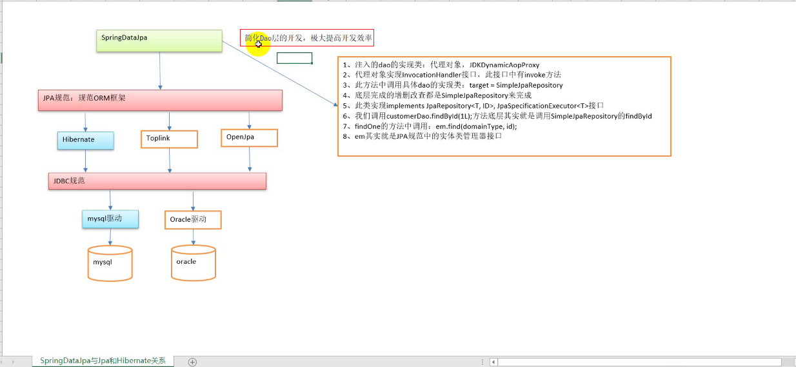

~~~markdown
#### 基于接口的方法 查询
		方法：findById、findAll、save、delete、exists、count
		对象：Sort、Pageable【PageRequest】 、Page	
#### JPQL查询
		@Query: value属性写的jpql       
		@Modifying	：更新操作要加入这个注解
#### SQL查询
		@Query: value属性写的sql   ，需要加入另外一个属性来指定用的sql查询： nativeQuery=true
#### 方法名规则查询
		方法名： findBy开头
		属性名： 首字母大写
		规则： Like，如果属性后面没有规则：精确查询
		多条件： And 、 or   拼接
~~~

## 12.Specification动态查询介绍

之前查询方式条件都是固定的，给定了条件，给什么值，用什么字段都是固定的，没有逻辑判断某些字段是否不需要加进去，在实际开发中，查询条件往往是会变的，我们希望可以动态拼接查询条件。具体可以看动态查询案例中的==多条件查询==！！！

比如：如果name有值则加上where custname =?,否则不加这个条件，这在前面的几种查询方式下办不到，但是Specification动态查询可以做到。因为他把处理逻辑写在方法中。

 有时我们在查询某个实体的时候，给定的条件是不固定的，这时就需要动态构建相应的查询语句，在Spring Data JPA 中可以通过JpaSpecificationExecutor 接口查询。相比JPQL,其优势是类型安全,更加的面向对象。 

JpaRepository接口：完成基本的增删改查

**JpaSpecificationExecutor** 接口 介绍：完成复杂查询和动态查询

~~~java
public interface JpaSpecificationExecutor<T> {
	T findOne(Specification<T> spec);
	List<T> findAll(Specification<T> spec);
	Page<T> findAll(Specification<T> spec, Pageable pageable);
	List<T> findAll(Specification<T> spec, Sort sort);
	long count(Specification<T> spec);
}
~~~

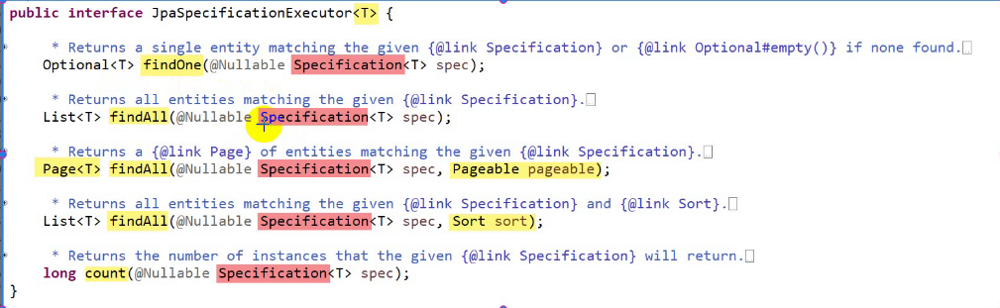

~~~java
package org.springframework.data.jpa.domain;

import static org.springframework.data.jpa.domain.Specifications.CompositionType.*;

import java.io.Serializable;

import javax.persistence.criteria.CriteriaBuilder;
import javax.persistence.criteria.CriteriaQuery;
import javax.persistence.criteria.Predicate;
import javax.persistence.criteria.Root;

import org.springframework.lang.Nullable;

@SuppressWarnings("deprecation")
public interface Specification<T> extends Serializable {

	long serialVersionUID = 1L;

	/**
	 * Negates the given {@link Specification}.
	 *
	 * @param <T>
	 * @param spec can be {@literal null}.
	 * @return
	 * @since 2.0
	 */
	static <T> Specification<T> not(Specification<T> spec) {
		return Specifications.negated(spec);
	}

	/**
	 * Simple static factory method to add some syntactic sugar around a {@link Specification}.
	 *
	 * @param <T>
	 * @param spec can be {@literal null}.
	 * @return
	 * @since 2.0
	 */
	static <T> Specification<T> where(Specification<T> spec) {
		return Specifications.where(spec);
	}

	/**
	 * ANDs the given {@link Specification} to the current one.
	 *
	 * @param other can be {@literal null}.
	 * @return The conjunction of the specifications
	 * @since 2.0
	 */
	default Specification<T> and(Specification<T> other) {
		return Specifications.composed(this, other, AND);
	}

	/**
	 * ORs the given specification to the current one.
	 *
	 * @param other can be {@literal null}.
	 * @return The disjunction of the specifications
	 * @since 2.0
	 */
	default Specification<T> or(Specification<T> other) {
		return Specifications.composed(this, other, OR);
	}

	/**
	 * Creates a WHERE clause for a query of the referenced entity in form of a {@link Predicate} for the given
	 * {@link Root} and {@link CriteriaQuery}.
	 *
	 * @param root must not be {@literal null}.
	 * @param query must not be {@literal null}.
	 * @param criteriaBuilder must not be {@literal null}.
	 * @return a {@link Predicate}, may be {@literal null}.
	 */
	@Nullable
	Predicate toPredicate(Root<T> root, CriteriaQuery<?> query, CriteriaBuilder criteriaBuilder);
}
~~~

Specification：它是一个接口，所有的动态拼接的条件都在这个接口的方法里完成

~~~java
public interface Specification<T> {
	Predicate toPredicate(Root<T> root, CriteriaQuery<?> query, CriteriaBuilder cb);
}
~~~

它只有一个**抽象**方法：toPredicate，此方法有三个参数

第一个：Root 			：==获取对象的属性的==

第二个：CriteriaQuery	：查询的顶层接口，他可以完成自定义查询，一般不用

第三个：CriteriaBuilder	：==动态构建查询条件，都用它==

### 12.1 动态查询之精确，模糊，多条件查询⭐💡

~~~java
package com.atguigu.dao;

import org.springframework.data.jpa.repository.JpaRepository;
import org.springframework.data.jpa.repository.JpaSpecificationExecutor;

import com.atguigu.pojo.Customer;


/**
 * 
 * jpa接口：
 *    1.这个接口所在的包已经在SpringDataJpa的核心配置文件中进行了配置声明，故不能乱放位置
 *          <jpa:repositories 
		          base-package="com.atguigu.dao"
		          entity-manager-factory-ref="entityManagerFactory"
		          transaction-manager-ref="transactionManager">
            </jpa:repositories>
      2.这个接口需要实现两个接口
           2.1 JpaRepository<操作的实体类，主键类型>:用于基本的增删改分页等
           2.2 JpaSpecificationExecutor<操作的实体类>：用于动态查询
 *
 */
public interface CustomerDao extends  JpaRepository<Customer,Long>,JpaSpecificationExecutor<Customer>{
    
}
~~~

~~~java
package com.atguigu.test;

import java.util.ArrayList;
import java.util.List;
import java.util.Optional;

import javax.persistence.criteria.CriteriaBuilder;
import javax.persistence.criteria.CriteriaQuery;
import javax.persistence.criteria.Path;
import javax.persistence.criteria.Predicate;
import javax.persistence.criteria.Root;

import org.junit.runner.RunWith;
import org.springframework.beans.factory.annotation.Autowired;
import org.springframework.data.jpa.domain.Specification;
import org.springframework.test.context.ContextConfiguration;
import org.springframework.test.context.junit4.SpringJUnit4ClassRunner;

import com.atguigu.dao.CustomerDao;
import com.atguigu.pojo.Customer;

//1.替换运行器，替换成Spring的运行器
@RunWith(SpringJUnit4ClassRunner.class)
//2.指定配置文件
@ContextConfiguration("classpath:applicationContext.xml")
public class Test {
     
	@Autowired
	private CustomerDao customerDao;	
    
	/**
	   *     精确查询
	 */
	@org.junit.Test
	public void test1() {
		Specification<Customer> spec =new Specification<Customer>() {
			/**
			 *       参数1：Root：用于获取对象的对比属性
			 *       参数3：CriteriaBuilder:动态构建查询条件用
			 */
			@Override
			public Predicate toPredicate(Root<Customer> root, CriteriaQuery<?> query, CriteriaBuilder criteriaBuilder) {
				// 1. 获取比对的属性,想对比哪个属性就填写哪个属性，其中返回值的Path的泛型写的是实体类属性的类型
				Path<String> path = root.get("custName");
				// 2.构建对比的条件
				Predicate equal = criteriaBuilder.equal(path,"三分归元气网络科技公司");
				// 3.返回结果
				return equal;
			}
		};
		Optional<Customer> one = customerDao.findOne(spec);
		Customer customer = one.get();
		System.out.println(customer);
	}
	
	
	/**
	   *     统计查询
	 */
	@org.junit.Test
	public void test2() {
		Specification<Customer> spec =new Specification<Customer>() {
			/**
			 *       参数1：Root：用于获取对象的对比属性
			 *       参数3：CriteriaBuilder:动态构建查询条件用
			 */
			@Override
			public Predicate toPredicate(Root<Customer> root, CriteriaQuery<?> query, CriteriaBuilder criteriaBuilder) {
				// 1. 获取比对的属性,想对比哪个属性就填写哪个属性，其中返回值的Path的泛型写的是实体类属性的类型
				Path<String> path = root.get("custName");
				// 2.构建对比的条件
				Predicate equal = criteriaBuilder.equal(path,"三分归元气网络科技公司");
				// 3.返回结果
				return equal;
			}
		};
		long count = customerDao.count(spec);
		System.out.println(count);
	}
	
	/**
	   *    模糊查询
	 */
	@org.junit.Test
	public void test3() {
		Specification<Customer> spec =new Specification<Customer>() {
			/**
			 *       参数1：Root：用于获取对象的对比属性
			 *       参数3：CriteriaBuilder:动态构建查询条件用
			 */
			@Override
			public Predicate toPredicate(Root<Customer> root, CriteriaQuery<?> query, CriteriaBuilder criteriaBuilder) {
				// 1. 获取比对的属性,想对比哪个属性就填写哪个属性，其中返回值的Path的泛型写的是实体类属性的类型
				Path<String> path = root.get("custName");
				// 2.构建对比的条件
				Predicate equal = criteriaBuilder.like(path,"三分%");
				// 3.返回结果
				return equal;
			}
		};
		List<Customer> list = customerDao.findAll(spec);
		for (Customer customer : list) {
			System.out.println(customer);
		}
	}
	
	
	/**
	   *   多条件查询
	 */
	@org.junit.Test
	public void test4() {
		String name="樱木%";
		String level = "";
		Specification<Customer> spec =new Specification<Customer>() {
			/**
			 *       参数1：Root：用于获取对象的对比属性
			 *       参数3：CriteriaBuilder:动态构建查询条件用
			 */
			@Override
			public Predicate toPredicate(Root<Customer> root, CriteriaQuery<?> query, CriteriaBuilder criteriaBuilder) {
				//封装查询条件
				List<Predicate> list = new ArrayList<Predicate>();
				
				// 判断名称
				if(name!=null&&name.length()>0) {
					// 1. 获取比对的属性,想对比哪个属性就填写哪个属性，其中返回值的Path的泛型写的是实体类属性的类型
					Path<String> path1 = root.get("custName");
					// 2.构建对比的条件
					Predicate equal = criteriaBuilder.like(path1,name);
					// 3.放入集合
					list.add(equal);
				}
				
				// 判断名称
				if(level!=null&&level.length()>0) {
					// 1. 获取比对的属性,想对比哪个属性就填写哪个属性，其中返回值的Path的泛型写的是实体类属性的类型
					Path<String> path2 = root.get("custLevel");
					// 2.构建对比的条件
					Predicate equal = criteriaBuilder.equal(path2,level);
					// 3.放入集合
					list.add(equal);
				}
				
				// 实例化一个数组
				Predicate[] rPredicates = new Predicate[list.size()];
				// 使用方法将查询条件转移到数组中
				list.toArray(rPredicates);
				
				// 3.返回结果    用and 代表两个条件都要，也可以用or:Predicate or(Predicate... restrictions);
				return criteriaBuilder.and(rPredicates);
			}
		};
		
		List<Customer> list = customerDao.findAll(spec);
		for (Customer customer : list) {
			System.out.println(customer);
		}
	}
}
~~~

### 12.2 Specification查询：分页与排序查询⭐💡

分页接口：Pageable

分页对象：PageRequest

排序对象：Sort

- 分页查询

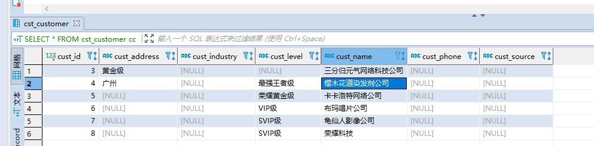

~~~java
package com.atguigu.test;

import java.util.ArrayList;
import java.util.List;
import java.util.Optional;

import javax.persistence.criteria.CriteriaBuilder;
import javax.persistence.criteria.CriteriaQuery;
import javax.persistence.criteria.Path;
import javax.persistence.criteria.Predicate;
import javax.persistence.criteria.Root;

import org.junit.runner.RunWith;
import org.springframework.beans.factory.annotation.Autowired;
import org.springframework.data.domain.Page;
import org.springframework.data.domain.PageRequest;
import org.springframework.data.jpa.domain.Specification;
import org.springframework.test.context.ContextConfiguration;
import org.springframework.test.context.junit4.SpringJUnit4ClassRunner;

import com.atguigu.dao.CustomerDao;
import com.atguigu.pojo.Customer;

//1.替换运行器，替换成Spring的运行器
@RunWith(SpringJUnit4ClassRunner.class)
//2.指定配置文件
@ContextConfiguration("classpath:applicationContext.xml")
public class Test {
     
	@Autowired
	private CustomerDao customerDao;	
    
	/**
	 *    动态查询分页 :原来查询分页中用的是Page<T> findAll(Pageable pageable)，我们也可以多加一个参数，用动态查询的参数
	 */
	@org.junit.Test
	public void test1() {
		String name ="%公司";
		String level = "";
		
		Specification<Customer> spec = new Specification<Customer>() {

			@Override
			public Predicate toPredicate(Root root, CriteriaQuery query, CriteriaBuilder criteriaBuilder) {
				List<Predicate> preList = new ArrayList<Predicate>();
				
				if(name!=null&&name.length()>0) {
					Path path1 = root.get("custName");
					Predicate pre1 = criteriaBuilder.like(path1, name);
					preList.add(pre1);
				}
				
				
				if(level!=null&&level.length()>0) {
					Path path2 = root.get("custLevel");
					Predicate pre2 = criteriaBuilder.equal(path2, name);
					preList.add(pre2);
				}
				Predicate[] preArrayPredicates = new Predicate[preList.size()];
				preList.toArray(preArrayPredicates);
				return criteriaBuilder.and(preArrayPredicates);
			}
		};
		
		
		Page<Customer> page = customerDao.findAll(spec, PageRequest.of(0, 2));
		System.out.println("总记录数为："+page.getTotalElements());
		System.out.println("总页数为："+page.getTotalPages());
		System.out.println("当前页数据");
		for (Customer customer : page) {
			System.out.println(customer);
		}
		
	}
}
~~~

~~~
Hibernate: select customer0_.cust_id as cust_id1_0_, customer0_.cust_address as cust_add2_0_, customer0_.cust_industry as cust_ind3_0_, customer0_.cust_level as cust_lev4_0_, customer0_.cust_name as cust_nam5_0_, customer0_.cust_phone as cust_pho6_0_, customer0_.cust_source as cust_sou7_0_ from cst_customer customer0_ where customer0_.cust_name like ? limit ?
Hibernate: select count(customer0_.cust_id) as col_0_0_ from cst_customer customer0_ where customer0_.cust_name like ?
总记录数为：5
总页数为：3
当前页数据
Customer [custId=3, custName=三分归元气网络科技公司, custLevel=null, custSource=null, custIndustry=null, custAddress=黄金级, custPhone=null]
Customer [custId=4, custName=樱木花道染发剂公司, custLevel=最强王者级, custSource=null, custIndustry=null, custAddress=广州, custPhone=null]看到
~~~


看以看到

可以看到。里面的查询条件被动态拼接啦。

- 分页加排序

~~~java
package com.atguigu.test;

import java.util.ArrayList;
import java.util.List;
import java.util.Optional;

import javax.persistence.criteria.CriteriaBuilder;
import javax.persistence.criteria.CriteriaQuery;
import javax.persistence.criteria.Path;
import javax.persistence.criteria.Predicate;
import javax.persistence.criteria.Root;

import org.junit.runner.RunWith;
import org.springframework.beans.factory.annotation.Autowired;
import org.springframework.data.domain.Page;
import org.springframework.data.domain.PageRequest;
import org.springframework.data.domain.Sort;
import org.springframework.data.domain.Sort.Direction;
import org.springframework.data.jpa.domain.Specification;
import org.springframework.test.context.ContextConfiguration;
import org.springframework.test.context.junit4.SpringJUnit4ClassRunner;

import com.atguigu.dao.CustomerDao;
import com.atguigu.pojo.Customer;

//1.替换运行器，替换成Spring的运行器
@RunWith(SpringJUnit4ClassRunner.class)
//2.指定配置文件
@ContextConfiguration("classpath:applicationContext.xml")
public class Test {
     
	@Autowired
	private CustomerDao customerDao;	
    
	/**
	 *    动态查询分页 :原来查询分页中用的是Page<T> findAll(Pageable pageable)，我们也可以多加一个参数，用动态查询的参数
	 */
	@org.junit.Test
	public void test1() {
		String name ="";
		String level = "";
		
		Specification<Customer> spec = new Specification<Customer>() {

			@Override
			public Predicate toPredicate(Root root, CriteriaQuery query, CriteriaBuilder criteriaBuilder) {
				List<Predicate> preList = new ArrayList<Predicate>();
				
				if(name!=null&&name.length()>0) {
					Path path1 = root.get("custName");
					Predicate pre1 = criteriaBuilder.like(path1, name);
					preList.add(pre1);
				}
				
				
				if(level!=null&&level.length()>0) {
					Path path2 = root.get("custLevel");
					Predicate pre2 = criteriaBuilder.equal(path2, name);
					preList.add(pre2);
				}
				Predicate[] preArrayPredicates = new Predicate[preList.size()];
				preList.toArray(preArrayPredicates);
				return criteriaBuilder.and(preArrayPredicates);
			}
		};
		
		// 先排序，再分页
		Page<Customer> page = customerDao.findAll(spec, PageRequest.of(0, 2,Sort.by(Direction.DESC, "custId")));
		System.out.println("总记录数为："+page.getTotalElements());
		System.out.println("总页数为："+page.getTotalPages());
		System.out.println("当前页数据");
		for (Customer customer : page) {
			System.out.println(customer);
		}		
	}
}
~~~

常见表关系： 一对一、一对多、多对多

- 一对一 和 一对多： 靠主外键

- 多对多： 靠中间表

一对多案例以**客户和联系人**来实现

多对多案例以**用户和角色**来实现

## 13.一对多映射⭐💡重点！！！！

### 13.1 一对多映射：第一步和第二步：确定关系和找到外键

~~~mysql
/*创建客户表*/
CREATE TABLE cst_customer (
  cust_id bigint(32) NOT NULL AUTO_INCREMENT COMMENT '客户编号(主键)',
  cust_name varchar(32) NOT NULL COMMENT '客户名称(公司名称)',
  cust_source varchar(32) DEFAULT NULL COMMENT '客户信息来源',
  cust_industry varchar(32) DEFAULT NULL COMMENT '客户所属行业',
  cust_level varchar(32) DEFAULT NULL COMMENT '客户级别',
  cust_address varchar(128) DEFAULT NULL COMMENT '客户联系地址',
  cust_phone varchar(64) DEFAULT NULL COMMENT '客户联系电话',
  PRIMARY KEY (`cust_id`)
) ENGINE=InnoDB AUTO_INCREMENT=94 DEFAULT CHARSET=utf8;

/*创建联系人表*/
CREATE TABLE cst_linkman (
  lkm_id bigint(32) NOT NULL AUTO_INCREMENT COMMENT '联系人编号(主键)',
  lkm_name varchar(16) DEFAULT NULL COMMENT '联系人姓名',
  lkm_gender char(1) DEFAULT NULL COMMENT '联系人性别',
  lkm_phone varchar(16) DEFAULT NULL COMMENT '联系人办公电话',
  lkm_mobile varchar(16) DEFAULT NULL COMMENT '联系人手机',
  lkm_email varchar(64) DEFAULT NULL COMMENT '联系人邮箱',
  lkm_position varchar(16) DEFAULT NULL COMMENT '联系人职位',
  lkm_memo varchar(512) DEFAULT NULL COMMENT '联系人备注',
  lkm_cust_id bigint(32) NOT NULL COMMENT '客户id(外键)',
  PRIMARY KEY (`lkm_id`),
  KEY `FK_cst_linkman_lkm_cust_id` (`lkm_cust_id`),
  CONSTRAINT `FK_cst_linkman_lkm_cust_id` FOREIGN KEY (`lkm_cust_id`) REFERENCES `cst_customer` (`cust_id`) ON DELETE NO ACTION ON UPDATE NO ACTION
) ENGINE=InnoDB AUTO_INCREMENT=3 DEFAULT CHARSET=utf8;

~~~

首先确定两张表之间的关系，其次**在数据库中实现两张表的关系**

第一步：使用代入法

```
公司表：  一方    一个公司可以有多个联系人
  
联系人表： 多方   一个联系人只能从属于一家公司
```

第二步：找主外键

多方【从表】：外键在多方中

一方【主表】：外键的值来源于一方的主键


### 13.2 第三步：在实体类中描述他们的关系

我们需要同时处理一方Customer类和多方Linkman类把关系表现出来！

~~~java
package com.atguigu.pojo;

import java.io.Serializable;
import java.util.HashSet;
import java.util.Set;

import javax.persistence.Column;
import javax.persistence.Entity;
import javax.persistence.GeneratedValue;
import javax.persistence.GenerationType;
import javax.persistence.Id;
import javax.persistence.Table;

@Entity
@Table(name = "cst_customer")
public class Customer implements Serializable{
	@Id
	@Column(name="cust_id")
	@GeneratedValue(strategy = GenerationType.IDENTITY)
	private Long custId;
	
	@Column(name="cust_name")
	private String custName;
	
	@Column(name="cust_level")
	private String custLevel;
	
	@Column(name="cust_source")
	private String custSource;
	
	@Column(name="cust_industry")
	private String custIndustry;
	
	@Column(name="cust_address")
	private String custAddress;
	
	@Column(name="cust_phone")
	private String custPhone;
	
	/**
	 * 这里对应的是一方，也就是一个Customer对应多个Linkman，故在一个Customer对象中声明一个set集合，既可以去重，去除笛卡尔效果，又可以表示一对多的关系
	 */
	private Set<Linkman> linkmans = new HashSet<Linkman>(0);

	public Set<Linkman> getLinkmans() {
		return linkmans;
	}

	public void setLinkmans(Set<Linkman> linkmans) {
		this.linkmans = linkmans;
	}

	public Long getCustId() {
		return custId;
	}

	public void setCustId(Long custId) {
		this.custId = custId;
	}

	public String getCustName() {
		return custName;
	}

	public void setCustName(String custName) {
		this.custName = custName;
	}

	public String getCustLevel() {
		return custLevel;
	}

	public void setCustLevel(String custLevel) {
		this.custLevel = custLevel;
	}

	public String getCustSource() {
		return custSource;
	}

	public void setCustSource(String custSource) {
		this.custSource = custSource;
	}

	public String getCustIndustry() {
		return custIndustry;
	}

	public void setCustIndustry(String custIndustry) {
		this.custIndustry = custIndustry;
	}

	public String getCustAddress() {
		return custAddress;
	}

	public void setCustAddress(String custAddress) {
		this.custAddress = custAddress;
	}

	public String getCustPhone() {
		return custPhone;
	}

	public void setCustPhone(String custPhone) {
		this.custPhone = custPhone;
	}

	@Override
	public String toString() {
		return "Customer [custId=" + custId + ", custName=" + custName + ", custLevel=" + custLevel + ", custSource="
				+ custSource + ", custIndustry=" + custIndustry + ", custAddress=" + custAddress + ", custPhone="
				+ custPhone + "]";
	}
}
~~~

~~~java
package com.atguigu.pojo;

import java.io.Serializable;
/**
   *   联系人实体类
 * @author Admin
 *
 */

import javax.persistence.Column;
import javax.persistence.Entity;
import javax.persistence.GeneratedValue;
import javax.persistence.GenerationType;
import javax.persistence.Id;
import javax.persistence.Table;

import org.omg.CORBA.PRIVATE_MEMBER;
@Entity
@Table(name ="cst_linkman")
public class Linkman implements Serializable {
	@Id
	@Column(name="lkm_id")
	@GeneratedValue(strategy = GenerationType.IDENTITY)
	private long lkmId;
	
	@Column(name="lkm_name")
	private String lkmName;
	
	@Column(name="lkm_gender")
	private String lkmGender;
	
	@Column(name="lkm_phone")
	private String lkmPhone;
	
	@Column(name="lkm_mobile")
	private String lkmMobile;
	
	@Column(name="lkm_email")
	private String lkmEmail;
	
	@Column(name="lkm_position")
	private String lkmPosition;
	
	@Column(name="lkm_memo")
	private String lkmMemo;
	
	/**
	 *Linkman是多方，多个Linkman对应一个Customer，也就是一个Linkman对应一个Customer，故这里写一个Customer声明即可！
	 */
	private Customer customer;

	public Customer getCustomer() {
		return customer;
	}

	public void setCustomer(Customer customer) {
		this.customer = customer;
	}

	public long getLkmId() {
		return lkmId;
	}

	public void setLkmId(long lkmId) {
		this.lkmId = lkmId;
	}

	public String getLkmName() {
		return lkmName;
	}

	public void setLkmName(String lkmName) {
		this.lkmName = lkmName;
	}

	public String getLkmGender() {
		return lkmGender;
	}

	public void setLkmGender(String lkmGender) {
		this.lkmGender = lkmGender;
	}

	public String getLkmPhone() {
		return lkmPhone;
	}

	public void setLkmPhone(String lkmPhone) {
		this.lkmPhone = lkmPhone;
	}

	public String getLkmMobile() {
		return lkmMobile;
	}

	public void setLkmMobile(String lkmMobile) {
		this.lkmMobile = lkmMobile;
	}

	public String getLkmEmail() {
		return lkmEmail;
	}

	public void setLkmEmail(String lkmEmail) {
		this.lkmEmail = lkmEmail;
	}

	public String getLkmPosition() {
		return lkmPosition;
	}

	public void setLkmPosition(String lkmPosition) {
		this.lkmPosition = lkmPosition;
	}

	public String getLkmMemo() {
		return lkmMemo;
	}

	public void setLkmMemo(String lkmMemo) {
		this.lkmMemo = lkmMemo;
	}

	@Override
	public String toString() {
		return "Linkman [lkmId=" + lkmId + ", lkmName=" + lkmName + ", lkmGender=" + lkmGender + ", lkmPhone="
				+ lkmPhone + ", lkmMobile=" + lkmMobile + ", lkmEmail=" + lkmEmail + ", lkmPosition=" + lkmPosition
				+ ", lkmMemo=" + lkmMemo + "]";
	}
	
}
~~~

### 13.3 第四步：配置出实体类和数据库表的关系映射⭐💡

关系注解：@OneToMany         @ManyToOne

外键维护注解：@JoinColumn(name="外键字段名称",referenceColumnName=“主表的主键字段名称”)

~~~java
package com.atguigu.pojo;

import java.io.Serializable;
import java.util.HashSet;
import java.util.Set;

import javax.persistence.Column;
import javax.persistence.Entity;
import javax.persistence.GeneratedValue;
import javax.persistence.GenerationType;
import javax.persistence.Id;
import javax.persistence.JoinColumn;
import javax.persistence.OneToMany;
import javax.persistence.Table;

@Entity
@Table(name = "cst_customer")
public class Customer implements Serializable{
	@Id
	@Column(name="cust_id")
	@GeneratedValue(strategy = GenerationType.IDENTITY)
	private Long custId;
	
	@Column(name="cust_name")
	private String custName;
	
	@Column(name="cust_level")
	private String custLevel;
	
	@Column(name="cust_source")
	private String custSource;
	
	@Column(name="cust_industry")
	private String custIndustry;
	
	@Column(name="cust_address")
	private String custAddress;
	
	@Column(name="cust_phone")
	private String custPhone;
	
	/**
	 * 这里对应的是一方，也就是一个Customer对应多个Linkman，故在一个Customer对象中声明一个set集合，既可以去重，去除笛卡尔效果，又可以表示一对多的关系
	 */
	// 当前所在类方是一方
	// 1.关系注解：一对多
	@OneToMany
	// 2.配置外键（由于外键在多方类对应的表中，我们在这里需要将外键申明出来，也就是需要将多方类的字段申明出来，对于当前一方来说，我是多加了一个字段，故用注解@JoinColumn）
	// 谁有这个注解@JoinColumn，谁就具备维护外键的能力
	@JoinColumn(
			// 外键的名称
			name="lkm_cust_id",
			// 外键的值来源于主表的主键
			referencedColumnName="cust_id"
			)
	private Set<Linkman> linkmans = new HashSet<Linkman>(0);

	public Set<Linkman> getLinkmans() {
		return linkmans;
	}

	public void setLinkmans(Set<Linkman> linkmans) {
		this.linkmans = linkmans;
	}

	public Long getCustId() {
		return custId;
	}

	public void setCustId(Long custId) {
		this.custId = custId;
	}

	public String getCustName() {
		return custName;
	}

	public void setCustName(String custName) {
		this.custName = custName;
	}

	public String getCustLevel() {
		return custLevel;
	}

	public void setCustLevel(String custLevel) {
		this.custLevel = custLevel;
	}

	public String getCustSource() {
		return custSource;
	}

	public void setCustSource(String custSource) {
		this.custSource = custSource;
	}

	public String getCustIndustry() {
		return custIndustry;
	}

	public void setCustIndustry(String custIndustry) {
		this.custIndustry = custIndustry;
	}

	public String getCustAddress() {
		return custAddress;
	}

	public void setCustAddress(String custAddress) {
		this.custAddress = custAddress;
	}

	public String getCustPhone() {
		return custPhone;
	}

	public void setCustPhone(String custPhone) {
		this.custPhone = custPhone;
	}

	@Override
	public String toString() {
		return "Customer [custId=" + custId + ", custName=" + custName + ", custLevel=" + custLevel + ", custSource="
				+ custSource + ", custIndustry=" + custIndustry + ", custAddress=" + custAddress + ", custPhone="
				+ custPhone + "]";
	}
}
~~~

~~~java
package com.atguigu.pojo;

import java.io.Serializable;
/**
   *   联系人实体类
 * @author Admin
 *
 */

import javax.persistence.Column;
import javax.persistence.Entity;
import javax.persistence.GeneratedValue;
import javax.persistence.GenerationType;
import javax.persistence.Id;
import javax.persistence.JoinColumn;
import javax.persistence.ManyToOne;
import javax.persistence.Table;
@Entity
@Table(name ="cst_linkman")
public class Linkman implements Serializable {
	@Id
	@Column(name="lkm_id")
	@GeneratedValue(strategy = GenerationType.IDENTITY)
	private long lkmId;
	
	@Column(name="lkm_name")
	private String lkmName;
	
	@Column(name="lkm_gender")
	private String lkmGender;
	
	@Column(name="lkm_phone")
	private String lkmPhone;
	
	@Column(name="lkm_mobile")
	private String lkmMobile;
	
	@Column(name="lkm_email")
	private String lkmEmail;
	
	@Column(name="lkm_position")
	private String lkmPosition;
	
	@Column(name="lkm_memo")
	private String lkmMemo;
	
	/**
	 *Linkman是多方，多个Linkman对应一个Customer，也就是一个Linkman对应一个Customer，故这里写一个Customer声明即可！
	 */
	// 1.关系注解：多对一
	@ManyToOne
	// 2.配置外键（由于外键在多方类对应的表中，我们在这里也需要将外键申明出来，也就是需要将多方类的字段申明出来）
		// 谁有这个注解@JoinColumn，谁就具备维护外键的能力
	@JoinColumn(
				// 外键的名称
				name="lkm_cust_id",
				// 外键的值来源于主表的主键
				referencedColumnName="cust_id"
				)
	private Customer customer;

	public Customer getCustomer() {
		return customer;
	}

	public void setCustomer(Customer customer) {
		this.customer = customer;
	}

	public long getLkmId() {
		return lkmId;
	}

	public void setLkmId(long lkmId) {
		this.lkmId = lkmId;
	}

	public String getLkmName() {
		return lkmName;
	}

	public void setLkmName(String lkmName) {
		this.lkmName = lkmName;
	}

	public String getLkmGender() {
		return lkmGender;
	}

	public void setLkmGender(String lkmGender) {
		this.lkmGender = lkmGender;
	}

	public String getLkmPhone() {
		return lkmPhone;
	}

	public void setLkmPhone(String lkmPhone) {
		this.lkmPhone = lkmPhone;
	}

	public String getLkmMobile() {
		return lkmMobile;
	}

	public void setLkmMobile(String lkmMobile) {
		this.lkmMobile = lkmMobile;
	}

	public String getLkmEmail() {
		return lkmEmail;
	}

	public void setLkmEmail(String lkmEmail) {
		this.lkmEmail = lkmEmail;
	}

	public String getLkmPosition() {
		return lkmPosition;
	}

	public void setLkmPosition(String lkmPosition) {
		this.lkmPosition = lkmPosition;
	}

	public String getLkmMemo() {
		return lkmMemo;
	}

	public void setLkmMemo(String lkmMemo) {
		this.lkmMemo = lkmMemo;
	}

	@Override
	public String toString() {
		return "Linkman [lkmId=" + lkmId + ", lkmName=" + lkmName + ", lkmGender=" + lkmGender + ", lkmPhone="
				+ lkmPhone + ", lkmMobile=" + lkmMobile + ", lkmEmail=" + lkmEmail + ", lkmPosition=" + lkmPosition
				+ ", lkmMemo=" + lkmMemo + "]";
	}
	
}
~~~

单向关系：你知道我，我不知道你

双向关系：你知道我，我也知道你

### 13.4 保存：单向关系的保存⭐💡

单向保存的意思是要么是一方维护外键来保存，要么是多方维护外键来保存。

~~~java
package com.atguigu.dao;

import org.springframework.data.jpa.repository.JpaRepository;
import org.springframework.data.jpa.repository.JpaSpecificationExecutor;

import com.atguigu.pojo.Linkman;

public interface LinkmanDao extends  JpaRepository<Linkman,Long>,JpaSpecificationExecutor<Linkman>{

}
~~~

**配置文件需要修改一下**，需要加上  <prop key="hibernate.hbm2ddl.auto">create</prop>

~~~xml
<?xml version="1.0" encoding="UTF-8"?>
<beans xmlns="http://www.springframework.org/schema/beans"
	xmlns:xsi="http://www.w3.org/2001/XMLSchema-instance"
	xmlns:aop="http://www.springframework.org/schema/aop"
	xmlns:context="http://www.springframework.org/schema/context"
	xmlns:jdbc="http://www.springframework.org/schema/jdbc"
	xmlns:tx="http://www.springframework.org/schema/tx"
	xmlns:jpa="http://www.springframework.org/schema/data/jpa"
	xmlns:task="http://www.springframework.org/schema/task"
	xsi:schemaLocation="
      http://www.springframework.org/schema/beans http://www.springframework.org/schema/beans/spring-beans.xsd
      http://www.springframework.org/schema/aop http://www.springframework.org/schema/aop/spring-aop.xsd
      http://www.springframework.org/schema/context http://www.springframework.org/schema/context/spring-context.xsd
      http://www.springframework.org/schema/jdbc http://www.springframework.org/schema/jdbc/spring-jdbc.xsd
      http://www.springframework.org/schema/tx http://www.springframework.org/schema/tx/spring-tx.xsd
      http://www.springframework.org/schema/data/jpa http://www.springframework.org/schema/data/jpa/spring-jpa.xsd">
      	<!-- SpringDataJpa配置 -->
    <!-- 1、EntityManagerFactory 交给spring管理-->
    <!-- 
         EntityManagerFactory:Spring提供了这个接口的实现类
     -->
    <bean id="entityManagerFactory" class="org.springframework.orm.jpa.LocalContainerEntityManagerFactoryBean">
        <!-- 数据源 -->
        <property name="dataSource" ref="dataSource"></property>
        <!-- 扫描实体类所在的包!!!! -->
        <property name="packagesToScan" value="com.atguigu.pojo"></property>
        <!-- JPA提供商 -->
        <property name="persistenceProvider">
            <bean  class="org.hibernate.jpa.HibernatePersistenceProvider"></bean>
        </property>
        <!--jpa提供商的适配器-->
        <property name="jpaVendorAdapter">
            <bean class="org.springframework.orm.jpa.vendor.HibernateJpaVendorAdapter">
                <property name="generateDdl" value="false" />
                <property name="database" value="MYSQL" />
                <property name="databasePlatform" value="org.hibernate.dialect.MySQLDialect" />
                <property name="showSql" value="true" />
            </bean>
        </property>
        <!-- JPA方言:可以使用jpa的高级特性 -->
        <property name="jpaDialect">
            <bean class="org.springframework.orm.jpa.vendor.HibernateJpaDialect"></bean>
        </property>
        <property name="jpaProperties">
           <props>
               <!-- 先删除表，再创建表 -->
               <prop key="hibernate.hbm2ddl.auto">create</prop>
           </props>
        </property>
    </bean>
   
    <!-- 2、配置数据源 -->
    <bean id="dataSource" class="com.mchange.v2.c3p0.ComboPooledDataSource">
         <property name="driverClass" value="com.mysql.jdbc.Driver"></property>
         <property name="jdbcUrl" value="jdbc:mysql://localhost:3306/demo"></property>
         <property name="user" value="root"></property>
         <property name="password" value="123456"></property>
    </bean>
    
    <!-- 3、平台事务管理器 -->
    <bean id="transactionManager" class="org.springframework.orm.jpa.JpaTransactionManager">
       <property name="entityManagerFactory" ref="entityManagerFactory"></property>
    </bean>
    
    <!-- 4、SpringDataJpa的配置
        base-package:基础包，基包，是Dao接口所在的基础包
        entity-manager-factory-ref:引用实体类管理器工厂
        transaction-manager-ref:平台事务管理器
    -->
    <jpa:repositories 
          base-package="com.atguigu.dao"
          entity-manager-factory-ref="entityManagerFactory"
          transaction-manager-ref="transactionManager">
    </jpa:repositories>
    
    <!-- 5、开启组件的扫描-->
    <context:component-scan base-package="com.atguigu"></context:component-scan>
</beans>
~~~

#### 13.4.1 测试类1：单向customer维护外键

~~~java
package com.atguigu.test;

import java.util.ArrayList;
import java.util.List;
import java.util.Optional;

import javax.persistence.JoinColumn;
import javax.persistence.criteria.CriteriaBuilder;
import javax.persistence.criteria.CriteriaQuery;
import javax.persistence.criteria.Path;
import javax.persistence.criteria.Predicate;
import javax.persistence.criteria.Root;


import org.junit.runner.RunWith;
import org.springframework.beans.factory.annotation.Autowired;
import org.springframework.data.domain.Page;
import org.springframework.data.domain.PageRequest;
import org.springframework.data.domain.Sort;
import org.springframework.data.domain.Sort.Direction;
import org.springframework.data.jpa.domain.Specification;
import org.springframework.test.annotation.Rollback;
import org.springframework.test.context.ContextConfiguration;
import org.springframework.test.context.junit4.SpringJUnit4ClassRunner;
import org.springframework.transaction.annotation.Transactional;

import com.atguigu.dao.CustomerDao;
import com.atguigu.dao.LinkmanDao;
import com.atguigu.pojo.Customer;
import com.atguigu.pojo.Linkman;

//1.替换运行器，替换成Spring的运行器
@RunWith(SpringJUnit4ClassRunner.class)
//2.指定配置文件
@ContextConfiguration("classpath:applicationContext.xml")
public class Test {
     
	@Autowired
	private CustomerDao customerDao;	
	
	
	@Autowired
	private LinkmanDao linkManDao;
	
	/**
	  * 一对多保存：单向维护（要么让主表维护，要么让从表维护）
	  * 一对多保存原则：先保存一方，再保存多方！永远遵循
	 */

	@org.junit.Test
	@Transactional// 关系保存，需要事务
	@Rollback(false)// 不自动回滚
	public void test1() {
		Customer c = new Customer();
		c.setCustName("卡卡罗特卡车公司");
		
		Linkman l = new Linkman();
		l.setLkmName("悟空克斯");
		
		//要想外键有值，必须设置关系，
		// 现在是单向维护关系，让客户维护关系
		c.getLinkmans().add(l);// 加了这一行，才会根据@JoinColumn注解，给表中外键字段赋值！
		
		// 1.先保存一方
		customerDao.save(c);
		// 2.再保存多方！
		linkManDao.save(l);
	}

}
~~~

~~~mysql
log4j:WARN No appenders could be found for logger (org.springframework.test.context.junit4.SpringJUnit4ClassRunner).
log4j:WARN Please initialize the log4j system properly.
Hibernate: alter table cst_linkman drop foreign key FKh9yp1nql5227xxcopuxqx2e7q
Hibernate: drop table if exists cst_customer
Hibernate: drop table if exists cst_linkman
Hibernate: create table cst_customer (cust_id bigint not null auto_increment, cust_address varchar(255), cust_industry varchar(255), cust_level varchar(255), cust_name varchar(255), cust_phone varchar(255), cust_source varchar(255), primary key (cust_id))
Hibernate: create table cst_linkman (lkm_id bigint not null auto_increment, lkm_email varchar(255), lkm_gender varchar(255), lkm_memo varchar(255), lkm_mobile varchar(255), lkm_name varchar(255), lkm_phone varchar(255), lkm_position varchar(255), lkm_cust_id bigint, primary key (lkm_id))
Hibernate: alter table cst_linkman add constraint FKh9yp1nql5227xxcopuxqx2e7q foreign key (lkm_cust_id) references cst_customer (cust_id)
Hibernate: insert into cst_customer (cust_address, cust_industry, cust_level, cust_name, cust_phone, cust_source) values (?, ?, ?, ?, ?, ?)
Hibernate: insert into cst_linkman (lkm_cust_id, lkm_email, lkm_gender, lkm_memo, lkm_mobile, lkm_name, lkm_phone, lkm_position) values (?, ?, ?, ?, ?, ?, ?, ?)
Hibernate: update cst_linkman set lkm_cust_id=? where lkm_id=?
~~~

**客户维护外键，执行的是update的语句，最后一行日志！**

#### 13.4.2 测试类2：单向linkman维护外键

~~~java
package com.atguigu.test;

import org.junit.runner.RunWith;
import org.springframework.beans.factory.annotation.Autowired;
import org.springframework.test.annotation.Rollback;
import org.springframework.test.context.ContextConfiguration;
import org.springframework.test.context.junit4.SpringJUnit4ClassRunner;
import org.springframework.transaction.annotation.Transactional;

import com.atguigu.dao.CustomerDao;
import com.atguigu.dao.LinkmanDao;
import com.atguigu.pojo.Customer;
import com.atguigu.pojo.Linkman;

//1.替换运行器，替换成Spring的运行器
@RunWith(SpringJUnit4ClassRunner.class)
//2.指定配置文件
@ContextConfiguration("classpath:applicationContext.xml")
public class Test {
     
	@Autowired
	private CustomerDao customerDao;	
	
	
	@Autowired
	private LinkmanDao linkManDao;
	
	/**
	  * 一对多保存：单向维护（要么让主表维护，要么让从表维护）
	  * 一对多保存原则：先保存一方，再保存多方！永远遵循
	 */

	@org.junit.Test
	@Transactional// 关系保存，需要事务
	@Rollback(false)// 不自动回滚
	public void test1() {
		Customer c = new Customer();
		c.setCustName("卡卡罗特卡车1234公司");
		
		Linkman l = new Linkman();
		l.setLkmName("悟空克斯6");
		
		//要想外键有值，必须设置关系，
		// 现在是单向维护关系，让联系人自己维护
		l.setCustomer(c);// 加了这一行，才会根据@JoinColumn注解，给表中外键字段赋值！
		
		// 1.先保存一方
		customerDao.save(c);
		// 2.再保存多方！
		linkManDao.save(l);
	}

}
~~~

~~~mysql
log4j:WARN No appenders could be found for logger (org.springframework.test.context.junit4.SpringJUnit4ClassRunner).
log4j:WARN Please initialize the log4j system properly.
Hibernate: alter table cst_linkman drop foreign key FKh9yp1nql5227xxcopuxqx2e7q
Hibernate: drop table if exists cst_customer
Hibernate: drop table if exists cst_linkman
Hibernate: create table cst_customer (cust_id bigint not null auto_increment, cust_address varchar(255), cust_industry varchar(255), cust_level varchar(255), cust_name varchar(255), cust_phone varchar(255), cust_source varchar(255), primary key (cust_id))
Hibernate: create table cst_linkman (lkm_id bigint not null auto_increment, lkm_email varchar(255), lkm_gender varchar(255), lkm_memo varchar(255), lkm_mobile varchar(255), lkm_name varchar(255), lkm_phone varchar(255), lkm_position varchar(255), lkm_cust_id bigint, primary key (lkm_id))
Hibernate: alter table cst_linkman add constraint FKh9yp1nql5227xxcopuxqx2e7q foreign key (lkm_cust_id) references cst_customer (cust_id)
Hibernate: insert into cst_customer (cust_address, cust_industry, cust_level, cust_name, cust_phone, cust_source) values (?, ?, ?, ?, ?, ?)
Hibernate: insert into cst_linkman (lkm_cust_id, lkm_email, lkm_gender, lkm_memo, lkm_mobile, lkm_name, lkm_phone, lkm_position) values (?, ?, ?, ?, ?, ?, ?, ?)
~~~

**联系人维护外键，执行的是insert的语句，最后一行日志！**

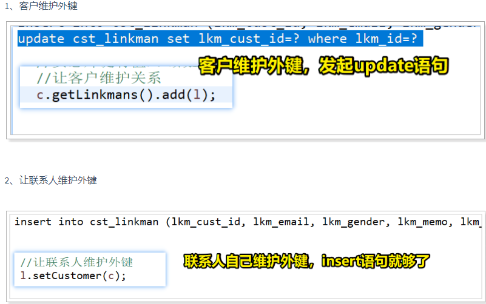

### 13.5 保存：双向关系的保存，为了维持性能需要主表放弃对外键的维护⭐💡

我们在上面写的保存是单向保存，要么是客户维护，要么是联系人维护，

~~~java
package com.atguigu.test;

import org.junit.runner.RunWith;
import org.springframework.beans.factory.annotation.Autowired;
import org.springframework.test.annotation.Rollback;
import org.springframework.test.context.ContextConfiguration;
import org.springframework.test.context.junit4.SpringJUnit4ClassRunner;
import org.springframework.transaction.annotation.Transactional;

import com.atguigu.dao.CustomerDao;
import com.atguigu.dao.LinkmanDao;
import com.atguigu.pojo.Customer;
import com.atguigu.pojo.Linkman;

//1.替换运行器，替换成Spring的运行器
@RunWith(SpringJUnit4ClassRunner.class)
//2.指定配置文件
@ContextConfiguration("classpath:applicationContext.xml")
public class Test {
     
	@Autowired
	private CustomerDao customerDao;	
	
	
	@Autowired
	private LinkmanDao linkManDao;
	
	/**
	  * 一对多保存：双向维护（让主表和从表同时维护）
	  * 一对多保存原则：先保存一方，再保存多方！
	 */

	@org.junit.Test
	@Transactional// 关系保存，需要事务
	@Rollback(false)// 不自动回滚
	public void test1() {
		Customer c = new Customer();
		c.setCustName("卡卡罗特卡车1234公司");
		
		Linkman l = new Linkman();
		l.setLkmName("悟空克斯6");
		
		//要想外键有值，必须设置关系，
		// 现在是双向维护：让主表和从表同时维护
		c.getLinkmans().add(l);
		l.setCustomer(c);
		
		// 1.先保存一方
		customerDao.save(c);
		// 2.再保存多方！
		linkManDao.save(l);
	}
}
~~~

上面这样双向维护虽然可以实现，但是有一些问题

	 * 一对多保存原则：先保存一方，再保存多方
	 * 双向关系的保存：两条insert，一条update
	 * 问题： 往两张表插入两条语句，只需要两条insert就够，但是多出了一条update，多出的Update来源于**主表一方维护！**
	 * 原因： 一方维护了外键，导致多出一条update语句
==问题解决==：

我们需要**让一方不维护外键， 删除@JoinColumn注解；在关系注解【OneToMany】中告诉他当前是谁来维护外键，通过mappedBy属性，这个属性只有@OneToMany有**，此时需要对主表类进行改动：==只有主表能放弃对外键的维护==

~~~java
package com.atguigu.pojo;

import java.io.Serializable;
import java.util.HashSet;
import java.util.Set;

import javax.persistence.Column;
import javax.persistence.Entity;
import javax.persistence.GeneratedValue;
import javax.persistence.GenerationType;
import javax.persistence.Id;
import javax.persistence.JoinColumn;
import javax.persistence.OneToMany;
import javax.persistence.Table;

@Entity
@Table(name = "cst_customer")
public class Customer implements Serializable{
	@Id
	@Column(name="cust_id")
	@GeneratedValue(strategy = GenerationType.IDENTITY)
	private Long custId;
	
	@Column(name="cust_name")
	private String custName;
	
	@Column(name="cust_level")
	private String custLevel;
	
	@Column(name="cust_source")
	private String custSource;
	
	@Column(name="cust_industry")
	private String custIndustry;
	
	@Column(name="cust_address")
	private String custAddress;
	
	@Column(name="cust_phone")
	private String custPhone;
	
	/**
	 * 这里对应的是一方，也就是一个Customer对应多个Linkman，故在一个Customer对象中声明一个set集合，既可以去重，去除笛卡尔效果，又可以表示一对多的关系
	 */
	// 当前所在类方是一方
//	// 1.关系注解：一对多
//	@OneToMany
//	// 2.配置外键（由于外键在多方类对应的表中，我们在这里需要将外键申明出来，也就是需要将多方类的字段申明出来，对于当前一方来说，我是多加了一个字段，故用注解@JoinColumn）
//	// 谁有这个注解@JoinColumn，谁就具备维护外键的能力
//	@JoinColumn(
//			// 外键的名称
//			name="lkm_cust_id",
//			// 外键的值来源于主表的主键
//			referencedColumnName="cust_id"
//			)
	
	
	// 放弃外键的维护
	// 1.删除@JoinColumn
	// 2.告诉当前方是谁维护外键：mappedBy = "对方有@JoinColumn注解的属性的名称"
	@OneToMany(mappedBy = "customer")
	private Set<Linkman> linkmans = new HashSet<Linkman>(0);

	public Set<Linkman> getLinkmans() {
		return linkmans;
	}

	public void setLinkmans(Set<Linkman> linkmans) {
		this.linkmans = linkmans;
	}

	public Long getCustId() {
		return custId;
	}

	public void setCustId(Long custId) {
		this.custId = custId;
	}

	public String getCustName() {
		return custName;
	}

	public void setCustName(String custName) {
		this.custName = custName;
	}

	public String getCustLevel() {
		return custLevel;
	}

	public void setCustLevel(String custLevel) {
		this.custLevel = custLevel;
	}

	public String getCustSource() {
		return custSource;
	}

	public void setCustSource(String custSource) {
		this.custSource = custSource;
	}

	public String getCustIndustry() {
		return custIndustry;
	}

	public void setCustIndustry(String custIndustry) {
		this.custIndustry = custIndustry;
	}

	public String getCustAddress() {
		return custAddress;
	}

	public void setCustAddress(String custAddress) {
		this.custAddress = custAddress;
	}

	public String getCustPhone() {
		return custPhone;
	}

	public void setCustPhone(String custPhone) {
		this.custPhone = custPhone;
	}

	@Override
	public String toString() {
		return "Customer [custId=" + custId + ", custName=" + custName + ", custLevel=" + custLevel + ", custSource="
				+ custSource + ", custIndustry=" + custIndustry + ", custAddress=" + custAddress + ", custPhone="
				+ custPhone + "]";
	}
}
~~~

怎么优化保存时多出的一条sql语句？==让一方放弃外键的维护==

 多方能否放弃外键维护？==多方不能放弃外键的维护，因为外键是多方中的一部分==

### 13.6 一对多操作：删除操作⭐💡

**只想删除从表数据**

~~~java
@org.junit.Test
	@Transactional// 关系保存，需要事务
	@Rollback(false)// 不自动回滚
	public void test1() {
		// 删除从表随便删
		linkManDao.deleteById(1l);
	}
~~~

**直接执行主表删除操作**

~~~java
	@org.junit.Test
	@Transactional// 关系保存，需要事务
	@Rollback(false)// 不自动回滚
	public void test1() {	
		// 删除主表
		// 1.1 如果主表已经放弃了外键的维护，先不执行代码删除从表，直接删除主表，删除的时候会报错！
		// 1.2 如果主表没有放弃外键的维护，会把外键置空，再删除主表的数据！
		customerDao.deleteById(1l);
	}
~~~

**正常删除步骤：此时主表放弃对主键的维护也可以i删除成功！**

~~~java
@org.junit.Test
	@Transactional// 关系保存，需要事务
	@Rollback(false)// 不自动回滚
	public void test1() {	
		// 删除主表
		// 1.1 如果主表已经放弃了外键的维护，先不执行代码删除从表，直接删除主表，删除的时候会报错！
		// 1.2 如果主表没有放弃外键的维护，会先把外键置空，再删除主表的数据！此时不会删除从表的数据！
		// 1.3 正常删除，先删除从表，再删除主表
		linkManDao.deleteById(1l);
		customerDao.deleteById(1l);
	}
~~~

**级联删除**.在我们主表放弃对外键的维护但是还想通过删除的主表的数据去删除数据的时候，用这个

~~~java
@org.junit.Test
	@Transactional// 关系保存，需要事务
	@Rollback(false)// 不自动回滚
	public void test1() {	
		// 删除主表
		// 1.1 如果主表已经放弃了外键的维护，先不执行代码删除从表，直接删除主表，删除的时候会报错！
		// 1.2 如果主表没有放弃外键的维护，把外键置空，再删除主表的数据！
		// 1.3 正常删除，先删除从表，再删除主表
		// 1.4 级联删除【慎用】，删除主表的时候，让框架在后台偷偷删除从表的数据，我们需要操作谁就在谁哪儿配置级联，我们删除的是客户，所以在客户那配置级联
		customerDao.deleteById(1l);
	}

~~~

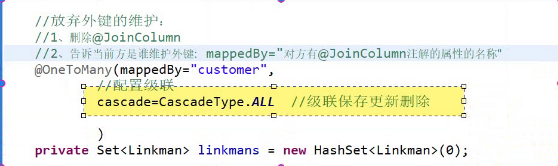

~~~java
//放弃外键的维护：
	//1、删除@JoinColumn
	//2、告诉当前方是谁维护外键:   mappedBy="对方有@JoinColumn注解的属性的名称"
	@OneToMany(mappedBy="customer",
			//配置级联
			cascade=CascadeType.ALL  //级联保存更新删除
			
			)
	private Set<Linkman> linkmans = new HashSet<Linkman>(0);
~~~

**删除从表数据**：可以随时任意删除。

**删除主表数据：**

1）没有从表数据引用：随便删

2）有从表数据
  	a、在默认情况【双方维护外键】下，它会把外键字段置为null，然后删除主表数据。如果在数据库的表结构上，外键字段有非空约束，默认情况就会报错了。
 	b、如果配置了放弃维护关联关系的权利，则不能删除（与外键字段是否允许为null，没有关系）因为在删除时，它根本不会去更新从表的外键字段了。
 	c、如果还想删除，使用级联删除引用

## 14. 多对多映射⭐💡重点！！！！

### 14.1 多对多映射：第一步和第二步和第三步

第一步：首先确定表与表之间的关系

用户：一个用户可以有多个角色

角色：一个角色可以赋予给多个用户

多对多关系


第二步：找中间表，在数据库中确定表与表之间的关系

用户表：

角色表：

用户角色的中间表：  两列： 来源用户表和角色表主键，   联合主键


第三步:在实体类中体现表与表之间的关系，描述两个实体之间的关系

一个用户包含多个角色：集合

一个角色包含多个用户：集合

~~~java
package com.atguigu.dao;

import java.io.Serializable;
import java.util.HashSet;
import java.util.Set;

import javax.persistence.Column;
import javax.persistence.Entity;
import javax.persistence.GeneratedValue;
import javax.persistence.GenerationType;
import javax.persistence.Id;
import javax.persistence.Table;

@Entity
// @Table(name="User")  如果表名和类名相同，可以省略
public class User implements Serializable {
	@Id
	@GeneratedValue(strategy = GenerationType.IDENTITY)
	// @Column(name="userId") 如果表名和类名相同，可以省略
	private String userId;
	private String userName;
	private String password;
	private String name;//真实名称
	
	// 一个用户包含多个角色
	private Set<Role> roles= new HashSet<Role>(0);
	
	public Set<Role> getRoles() {
		return roles;
	}
	public void setRoles(Set<Role> roles) {
		this.roles = roles;
	}
	
	public String getUserId() {
		return userId;
	}
	public void setUserId(String userId) {
		this.userId = userId;
	}
	public String getUserName() {
		return userName;
	}
	public void setUserName(String userName) {
		this.userName = userName;
	}
	public String getPassword() {
		return password;
	}
	public void setPassword(String password) {
		this.password = password;
	}
	public String getName() {
		return name;
	}
	public void setName(String name) {
		this.name = name;
	}
	@Override
	public String toString() {
		return "User [userId=" + userId + ", userName=" + userName + ", password=" + password + ", name=" + name + "]";
	}
}
~~~

~~~java
package com.atguigu.dao;

import java.io.Serializable;
import java.util.HashSet;
import java.util.Set;

import javax.persistence.Entity;
import javax.persistence.GeneratedValue;
import javax.persistence.GenerationType;
import javax.persistence.Id;

@Entity
//@Table(name="User")  如果表名和类名相同，可以省略
public class Role implements Serializable {
	@Id
	@GeneratedValue(strategy = GenerationType.IDENTITY)
	private String roleId;
	
    private String roleName;
    
    // 一个角色也可以赋值给多个用户
    private Set<User> users= new HashSet<User>(0);
	public Set<User> getUsers() {
		return users;
	}

	public void setUsers(Set<User> users) {
		this.users = users;
	}

	public String getRoleId() {
		return roleId;
	}

	public void setRoleId(String roleId) {
		this.roleId = roleId;
	}

	public String getRoleName() {
		return roleName;
	}

	public void setRoleName(String roleName) {
		this.roleName = roleName;
	}

	@Override
	public String toString() {
		return "Role [roleId=" + roleId + ", roleName=" + roleName + "]";
	}       
}
~~~

### 14.2多对多映射：第四步：配置出实体类和数据库表的关系映射⭐💡

~~~java
package com.atguigu.pojo;

import java.io.Serializable;
import java.util.HashSet;
import java.util.Set;

import javax.persistence.Column;
import javax.persistence.Entity;
import javax.persistence.GeneratedValue;
import javax.persistence.GenerationType;
import javax.persistence.Id;
import javax.persistence.JoinColumn;
import javax.persistence.JoinTable;
import javax.persistence.ManyToMany;
import javax.persistence.Table;

@Entity
// @Table(name="User")  如果表名和类名相同，可以省略
public class User implements Serializable {
	@Id
	@GeneratedValue(strategy = GenerationType.IDENTITY)
	// @Column(name="userId") 如果表名和类名相同，可以省略
	private Integer userId;
	private String userName;
	private String password;
	private String name;//真实名称
	
	// 一个用户包含多个角色
	 // 1.关系注解
    @ManyToMany
    // 2.中间表注解
    @JoinTable(
    		// 中间表名,自己定义
    		name="t_user_role",
    		// 当前方在中间表的外键
    		joinColumns = {@JoinColumn(name="u_id",referencedColumnName = "userId")},
    		// 对方在中间表的外键
    		inverseJoinColumns = {@JoinColumn(name="r_id",referencedColumnName = "roleId")}
    		)
	private Set<Role> roles= new HashSet<Role>(0);
	
	public Set<Role> getRoles() {
		return roles;
	}
	public void setRoles(Set<Role> roles) {
		this.roles = roles;
	}
	
	public Integer getUserId() {
		return userId;
	}
	public void setUserId(Integer userId) {
		this.userId = userId;
	}
	public String getUserName() {
		return userName;
	}
	public void setUserName(String userName) {
		this.userName = userName;
	}
	public String getPassword() {
		return password;
	}
	public void setPassword(String password) {
		this.password = password;
	}
	public String getName() {
		return name;
	}
	public void setName(String name) {
		this.name = name;
	}
	@Override
	public String toString() {
		return "User [userId=" + userId + ", userName=" + userName + ", password=" + password + ", name=" + name + "]";
	}

}
~~~

~~~java
package com.atguigu.pojo;

import java.io.Serializable;
import java.util.HashSet;
import java.util.Set;

import javax.persistence.Entity;
import javax.persistence.GeneratedValue;
import javax.persistence.GenerationType;
import javax.persistence.Id;
import javax.persistence.JoinColumn;
import javax.persistence.JoinTable;
import javax.persistence.ManyToMany;

@Entity
//@Table(name="User")  如果表名和类名相同，可以省略
public class Role implements Serializable {
	@Id
	@GeneratedValue(strategy = GenerationType.IDENTITY)
	private Integer roleId;
	
    private String roleName;
    
    // 一个角色也可以赋值给多个用户
    // 1.关系注解
    @ManyToMany
    // 2.中间表注解
    @JoinTable(
    		// 中间表名,自己定义
    		name="t_user_role",
    		// 当前方在中间表的外键
    		joinColumns = {@JoinColumn(name="r_id",referencedColumnName = "roleId")},
    		// 对方在中间表的外键
    		inverseJoinColumns = {@JoinColumn(name="u_id",referencedColumnName = "userId")}
    		)
    private Set<User> users= new HashSet<User>(0);
	public Set<User> getUsers() {
		return users;
	}

	public void setUsers(Set<User> users) {
		this.users = users;
	}


	public Integer getRoleId() {
		return roleId;
	}

	public void setRoleId(Integer roleId) {
		this.roleId = roleId;
	}

	public String getRoleName() {
		return roleName;
	}

	public void setRoleName(String roleName) {
		this.roleName = roleName;
	}

	@Override
	public String toString() {
		return "Role [roleId=" + roleId + ", roleName=" + roleName + "]";
	}
    
    
}

~~~

~~~xml
<?xml version="1.0" encoding="UTF-8"?>
<beans xmlns="http://www.springframework.org/schema/beans"
	xmlns:xsi="http://www.w3.org/2001/XMLSchema-instance"
	xmlns:aop="http://www.springframework.org/schema/aop"
	xmlns:context="http://www.springframework.org/schema/context"
	xmlns:jdbc="http://www.springframework.org/schema/jdbc"
	xmlns:tx="http://www.springframework.org/schema/tx"
	xmlns:jpa="http://www.springframework.org/schema/data/jpa"
	xmlns:task="http://www.springframework.org/schema/task"
	xsi:schemaLocation="
      http://www.springframework.org/schema/beans http://www.springframework.org/schema/beans/spring-beans.xsd
      http://www.springframework.org/schema/aop http://www.springframework.org/schema/aop/spring-aop.xsd
      http://www.springframework.org/schema/context http://www.springframework.org/schema/context/spring-context.xsd
      http://www.springframework.org/schema/jdbc http://www.springframework.org/schema/jdbc/spring-jdbc.xsd
      http://www.springframework.org/schema/tx http://www.springframework.org/schema/tx/spring-tx.xsd
      http://www.springframework.org/schema/data/jpa http://www.springframework.org/schema/data/jpa/spring-jpa.xsd">
      	<!-- SpringDataJpa配置 -->
    <!-- 1、EntityManagerFactory 交给spring管理-->
    <!-- 
         EntityManagerFactory:Spring提供了这个接口的实现类
     -->
    <bean id="entityManagerFactory" class="org.springframework.orm.jpa.LocalContainerEntityManagerFactoryBean">
        <!-- 数据源 -->
        <property name="dataSource" ref="dataSource"></property>
        <!-- 扫描实体类所在的包!!!! -->
        <property name="packagesToScan" value="com.atguigu.pojo"></property>
        <!-- JPA提供商 -->
        <property name="persistenceProvider">
            <bean  class="org.hibernate.jpa.HibernatePersistenceProvider"></bean>
        </property>
        <!--jpa提供商的适配器-->
        <property name="jpaVendorAdapter">
            <bean class="org.springframework.orm.jpa.vendor.HibernateJpaVendorAdapter">
                <property name="generateDdl" value="false" />
                <property name="database" value="MYSQL" />
                <property name="databasePlatform" value="org.hibernate.dialect.MySQLDialect" />
                <property name="showSql" value="true" />
            </bean>
        </property>
        <!-- JPA方言:可以使用jpa的高级特性 -->
        <property name="jpaDialect">
            <bean class="org.springframework.orm.jpa.vendor.HibernateJpaDialect"></bean>
        </property>
        <property name="jpaProperties">
           <props>
               <!-- 先删除表，再创建表 -->
               <prop key="hibernate.hbm2ddl.auto">create</prop>
           </props>
        </property>
    </bean>
   
    <!-- 2、配置数据源 -->
    <bean id="dataSource" class="com.mchange.v2.c3p0.ComboPooledDataSource">
         <property name="driverClass" value="com.mysql.jdbc.Driver"></property>
         <property name="jdbcUrl" value="jdbc:mysql://localhost:3306/demo"></property>
         <property name="user" value="root"></property>
         <property name="password" value="123456"></property>
    </bean>
    
    <!-- 3、平台事务管理器 -->
    <bean id="transactionManager" class="org.springframework.orm.jpa.JpaTransactionManager">
       <property name="entityManagerFactory" ref="entityManagerFactory"></property>
    </bean>
    
    <!-- 4、SpringDataJpa的配置
        base-package:基础包，基包，是Dao接口所在的基础包
        entity-manager-factory-ref:引用实体类管理器工厂
        transaction-manager-ref:平台事务管理器
    -->
    <jpa:repositories 
          base-package="com.atguigu.dao"
          entity-manager-factory-ref="entityManagerFactory"
          transaction-manager-ref="transactionManager">
    </jpa:repositories>
    
    <!-- 5、开启组件的扫描-->
    <context:component-scan base-package="com.atguigu"></context:component-scan>
</beans>
~~~

~~~java
package com.atguigu.test;

import org.junit.runner.RunWith;
import org.springframework.test.context.ContextConfiguration;
import org.springframework.test.context.junit4.SpringJUnit4ClassRunner;

//1.替换运行器，替换成Spring的运行器
@RunWith(SpringJUnit4ClassRunner.class)
//2.指定配置文件
@ContextConfiguration("classpath:applicationContext.xml")
public class Test {

	@org.junit.Test
	public void test1() {	
       System.out.println("6666666666");
	}

}
~~~

**运行结果**

~~~mysql
log4j:WARN No appenders could be found for logger (org.springframework.test.context.junit4.SpringJUnit4ClassRunner).
log4j:WARN Please initialize the log4j system properly.
Hibernate: alter table t_user_role drop foreign key FK41owmqiyqb64sx3xd8qlpfnxf
Hibernate: alter table t_user_role drop foreign key FKf6nc51ndg1xgsrtsev9ynrk4u
Hibernate: drop table if exists Role
Hibernate: drop table if exists t_user_role
Hibernate: drop table if exists User
Hibernate: create table Role (roleId varchar(255) not null auto_increment, roleName varchar(255), primary key (roleId))
Hibernate: create table t_user_role (u_id varchar(255) not null, r_id varchar(255) not null, primary key (r_id, u_id))
Hibernate: create table User (userId varchar(255) not null auto_increment, name varchar(255), password varchar(255), userName varchar(255), primary key (userId))
Hibernate: alter table t_user_role add constraint FK41owmqiyqb64sx3xd8qlpfnxf foreign key (r_id) references Role (roleId)
Hibernate: alter table t_user_role add constraint FKf6nc51ndg1xgsrtsev9ynrk4u foreign key (u_id) references User (userId)
6666666666
~~~

### 14.3 多对多操作：多对多中必须有一方放弃中间表的维护⭐💡

~~~java
package com.atguigu.dao;

import org.springframework.data.jpa.repository.JpaRepository;
import org.springframework.data.jpa.repository.JpaSpecificationExecutor;

import com.atguigu.pojo.User;

public interface UserDao extends JpaRepository<User, Integer>,JpaSpecificationExecutor<User> {

}
~~~

~~~java
package com.atguigu.dao;

import org.springframework.data.jpa.repository.JpaRepository;
import org.springframework.data.jpa.repository.JpaSpecificationExecutor;

import com.atguigu.pojo.Role;

public interface RoleDao extends JpaRepository<Role, Integer>,JpaSpecificationExecutor<Role> {

}

~~~

**测试**

~~~java
package com.atguigu.test;

import org.junit.runner.RunWith;
import org.springframework.beans.factory.annotation.Autowired;
import org.springframework.test.context.ContextConfiguration;
import org.springframework.test.context.junit4.SpringJUnit4ClassRunner;

import com.atguigu.dao.RoleDao;
import com.atguigu.dao.UserDao;
import com.atguigu.pojo.Role;
import com.atguigu.pojo.User;

import javassist.expr.NewArray;

//1.替换运行器，替换成Spring的运行器
@RunWith(SpringJUnit4ClassRunner.class)
//2.指定配置文件
@ContextConfiguration("classpath:applicationContext.xml")
public class Test {
	
    @Autowired 
    private UserDao userDao;
    
    @Autowired 
    private RoleDao roleDao;
	

    /**
              * 多对多保存
     */
	@org.junit.Test
	public void test1() {	
      User user = new User();
      user.setUserName("卡卡罗特收费公司");
      user.setName("kakaluote");
      user.setPassword("123456");
      
      Role  role  = new Role();
      role.setRoleName("赛亚人之神");
      
      roleDao.save(role);
      userDao.save(user);
     
      
	}

}
~~~

运行之后发现并没有中间表的数据，这是由于我们没有在代码中对中间表进行维护，所以中间表是美与数据插入的，我们需要通过代码对中间表进行维护。

- 让用户维护中间表

~~~java
package com.atguigu.test;

import org.junit.runner.RunWith;
import org.springframework.beans.factory.annotation.Autowired;
import org.springframework.test.annotation.Rollback;
import org.springframework.test.context.ContextConfiguration;
import org.springframework.test.context.junit4.SpringJUnit4ClassRunner;
import org.springframework.transaction.annotation.Transactional;

import com.atguigu.dao.RoleDao;
import com.atguigu.dao.UserDao;
import com.atguigu.pojo.Role;
import com.atguigu.pojo.User;

import javassist.expr.NewArray;

//1.替换运行器，替换成Spring的运行器
@RunWith(SpringJUnit4ClassRunner.class)
//2.指定配置文件
@ContextConfiguration("classpath:applicationContext.xml")
public class Test {
	
    @Autowired 
    private UserDao userDao;
    
    @Autowired 
    private RoleDao roleDao;	

    /**
              * 多对多保存
     */
	@org.junit.Test
	@Transactional // 加入事务
	@Rollback(false)//测试阶段需要加入
	public void test1() {	
      User user = new User();
      user.setUserName("卡卡罗特收费公司");
      user.setName("kakaluote");
      user.setPassword("123456");
      
      Role  role  = new Role();
      role.setRoleName("赛亚人之神");
        
      // 设置关系，让用户维护中间表
      user.getRoles().add(role);    
      
      roleDao.save(role);
      userDao.save(user);        
	}
}
~~~

- 让角色维护中间表

~~~java
package com.atguigu.test;

import org.junit.runner.RunWith;
import org.springframework.beans.factory.annotation.Autowired;
import org.springframework.test.annotation.Rollback;
import org.springframework.test.context.ContextConfiguration;
import org.springframework.test.context.junit4.SpringJUnit4ClassRunner;
import org.springframework.transaction.annotation.Transactional;

import com.atguigu.dao.RoleDao;
import com.atguigu.dao.UserDao;
import com.atguigu.pojo.Role;
import com.atguigu.pojo.User;

import javassist.expr.NewArray;

//1.替换运行器，替换成Spring的运行器
@RunWith(SpringJUnit4ClassRunner.class)
//2.指定配置文件
@ContextConfiguration("classpath:applicationContext.xml")
public class Test {
	
    @Autowired 
    private UserDao userDao;
    
    @Autowired 
    private RoleDao roleDao;
	

    /**
              * 多对多保存
     */
	@org.junit.Test
	@Transactional // 加入事务
	@Rollback(false)//测试阶段需要加入
	public void test1() {	
      User user = new User();
      user.setUserName("卡卡罗特收费公司");
      user.setName("kakaluote");
      user.setPassword("123456");
      
      Role  role  = new Role();
      role.setRoleName("赛亚人之神");
        
      // 设置关系，让角色维护中间表
      role.getUsers().add(user);
      
      roleDao.save(role);
      userDao.save(user);        
	}
}
~~~

要想中间表有值，必须设置关系，我们刚才设置了关系，上述两种单向关系都是可以实现的！

但是双向关系维护中间表会报错！！！！这和一对多不一样！

~~~java
package com.atguigu.test;

import org.junit.runner.RunWith;
import org.springframework.beans.factory.annotation.Autowired;
import org.springframework.test.annotation.Rollback;
import org.springframework.test.context.ContextConfiguration;
import org.springframework.test.context.junit4.SpringJUnit4ClassRunner;
import org.springframework.transaction.annotation.Transactional;

import com.atguigu.dao.RoleDao;
import com.atguigu.dao.UserDao;
import com.atguigu.pojo.Role;
import com.atguigu.pojo.User;

import javassist.expr.NewArray;

//1.替换运行器，替换成Spring的运行器
@RunWith(SpringJUnit4ClassRunner.class)
//2.指定配置文件
@ContextConfiguration("classpath:applicationContext.xml")
public class Test {
	
    @Autowired 
    private UserDao userDao;
    
    @Autowired 
    private RoleDao roleDao;
	

    /**
              * 多对多保存
     */
	@org.junit.Test
	@Transactional // 加入事务
	@Rollback(false)//测试阶段需要加入
	public void test1() {	
      User user = new User();
      user.setUserName("卡卡罗特收费公司");
      user.setName("kakaluote");
      user.setPassword("123456");
      
      Role  role  = new Role();
      role.setRoleName("赛亚人之神");
      
      // 设置关系，让用户维护中间表
      user.getRoles().add(role); 
        
      // 设置关系，让角色维护中间表
      role.getUsers().add(user);
      
      roleDao.save(role);
      userDao.save(user);  
      
	}

}
~~~

上述代码会报错！！！！==**多对多保存:多对多保存中，必须有一方放弃中间表的维护权利！**==

我们让角色放弃中间表的维护，也就是改为：

~~~java
package com.atguigu.pojo;

import java.io.Serializable;
import java.util.HashSet;
import java.util.Set;

import javax.persistence.Entity;
import javax.persistence.GeneratedValue;
import javax.persistence.GenerationType;
import javax.persistence.Id;
import javax.persistence.JoinColumn;
import javax.persistence.JoinTable;
import javax.persistence.ManyToMany;

@Entity
//@Table(name="User")  如果表名和类名相同，可以省略
public class Role implements Serializable {
	@Id
	@GeneratedValue(strategy = GenerationType.IDENTITY)
	private Integer roleId;
	
    private String roleName;
    
//    // 一个角色也可以赋值给多个用户
//    // 1.关系注解
//    @ManyToMany
//    // 2.中间表注解
//    @JoinTable(
//    		// 中间表名,自己定义
//    		name="t_user_role",
//    		// 当前方在中间表的外键
//    		joinColumns = {@JoinColumn(name="r_id",referencedColumnName = "roleId")},
//    		// 对方在中间表的外键
//    		inverseJoinColumns = {@JoinColumn(name="u_id",referencedColumnName = "userId")}
//    		)
    
    // 1.关系注解
    // mappedBy:对方有@JoinTable注解的属性名称
    @ManyToMany(mappedBy = "roles")
    private Set<User> users= new HashSet<User>(0);
	public Set<User> getUsers() {
		return users;
	}

	public void setUsers(Set<User> users) {
		this.users = users;
	}


	public Integer getRoleId() {
		return roleId;
	}

	public void setRoleId(Integer roleId) {
		this.roleId = roleId;
	}

	public String getRoleName() {
		return roleName;
	}

	public void setRoleName(String roleName) {
		this.roleName = roleName;
	}

	@Override
	public String toString() {
		return "Role [roleId=" + roleId + ", roleName=" + roleName + "]";
    }   
   
}
~~~

此时继续测试：

~~~java
package com.atguigu.test;

import org.junit.runner.RunWith;
import org.springframework.beans.factory.annotation.Autowired;
import org.springframework.test.annotation.Rollback;
import org.springframework.test.context.ContextConfiguration;
import org.springframework.test.context.junit4.SpringJUnit4ClassRunner;
import org.springframework.transaction.annotation.Transactional;

import com.atguigu.dao.RoleDao;
import com.atguigu.dao.UserDao;
import com.atguigu.pojo.Role;
import com.atguigu.pojo.User;

import javassist.expr.NewArray;

//1.替换运行器，替换成Spring的运行器
@RunWith(SpringJUnit4ClassRunner.class)
//2.指定配置文件
@ContextConfiguration("classpath:applicationContext.xml")
public class Test {
	
    @Autowired 
    private UserDao userDao;
    
    @Autowired 
    private RoleDao roleDao;
	

    /**
              * 多对多保存:多对多保存中，必须有一方放弃中间表的维护权利！
     */
	@org.junit.Test
	@Transactional // 加入事务
	@Rollback(false)//测试阶段需要加入
	public void test1() {	
      User user = new User();
      user.setUserName("卡卡罗特收费公司");
      user.setName("kakaluote");
      user.setPassword("123456");
      
      Role  role  = new Role();
      role.setRoleName("赛亚人之神");
      
      // 设置关系，让用户维护中间表
      user.getRoles().add(role); 
        
      // 设置关系，让角色维护中间表
      role.getUsers().add(user);
      
      roleDao.save(role);
      userDao.save(user);  
      
	}

}
~~~

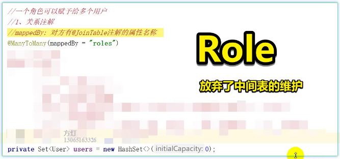

### 14.4 多对多操作：删除

多对多操作：删除： 谁有@JoinTable注解就删谁

~~~java
	@org.junit.Test
	@Transactional // 加入事务
	@Rollback(false)//测试阶段需要加入
	public void test1() {	
		// 谁有@JoinTable，谁就可以删除！
		userDao.deleteById(1);
		
		// 已经放弃了中间表的维护，这里删除会报错！
	    //roleDao.deleteById(1); 
	}
~~~

注意：

级联配置：

单向级联：慎用

双向级联： 双方都配置级联【禁用】

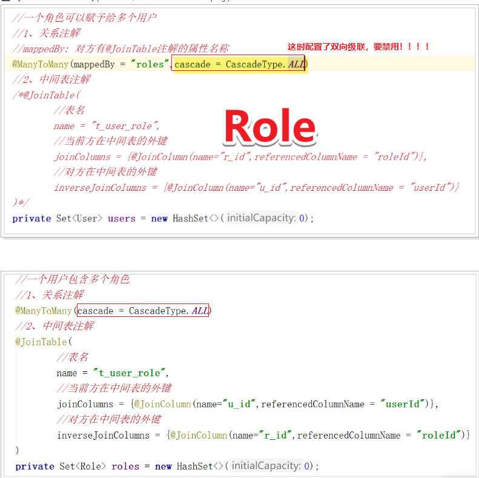

## 15. 对象导航查询

对象导航查询： 通过对象打点的时候，调用管理属性查询

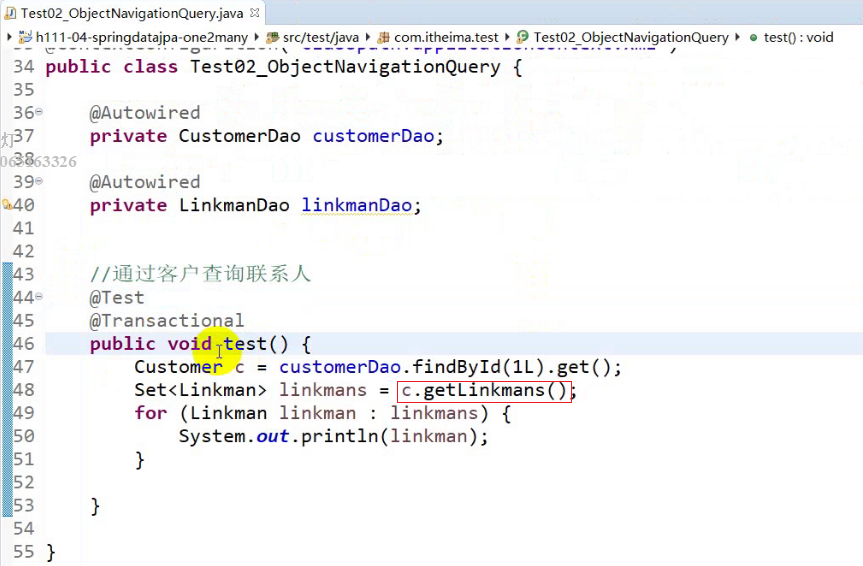

~~~java

@org.junit.Test
	@Transactional // 加入事务
	@Rollback(false)//测试阶段需要加入
	public void test1() {	
		Optional<User> findById = userDao.findById(1);
		Set<Role> roles = findById.get().getRoles();
		for (Role role : roles) {
			System.out.println(role);
		}
	}
~~~

1）通过客户导航查询联系人：customer.getLinkmen()   :   

  - 默认是 延迟加载
  - 可以改为立即加载： 在关系注解中配置  fetch属性

2）联系人导航查询客户：linkman.getCustomer()	    

- 默认是立即加载
- 可以改为延迟加载：在关系注解中配置 fetch属性

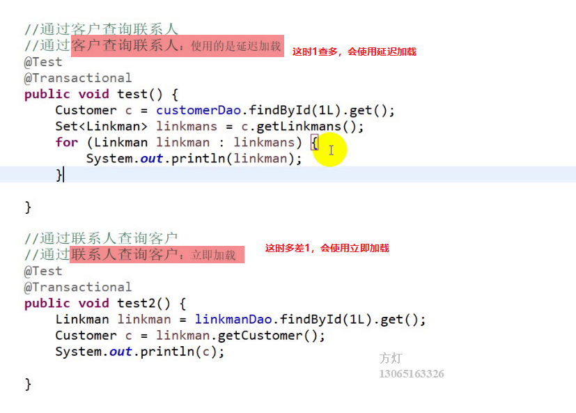

我们也可以手工修改加载顺序，不过不推荐：


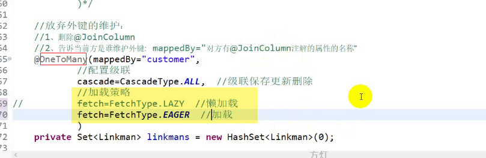

## Eclipse的快捷键

1.查找打开一个java类：ctrl+shift+t,打开类中的方法：ctrl+o

2.格式化：ctrl+i

3.查找一个资源：ctrl+shift+r

4.查找文件：ctrl+h

5.将当前行复制且向下粘贴：ctrl+alt+↓

6.打开全屏：ctrl+m

7.补全一个方法的返回值：ctrl+1

8.执行当前类当前方法的快捷键：ctrl+f11

9.查找当前接口的实现类：ctrl+t

10.ctrl+shift+o:去掉当前类没用的导入的类