# SpringMVC框架

## 1.SpringMVC的简介

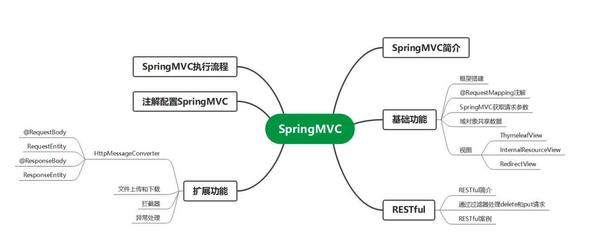

### 1、什么是MVC

MVC是一种软件架构的思想，将软件按照模型、视图、控制器来划分

M：Model，模型层，指==工程中的JavaBean，作用是处理数据==

JavaBean分为两类：

- 一类称为实体类Bean：专门存储业务数据的，如 Student、User 等
- 一类称为业务处理 Bean：指 Service 或 Dao 对象，专门用于处理业务逻辑和数据访问。

V：View，视图层，指工程中的html或jsp等页面，作用是与用户进行交互，展示数据

C：Controller，控制层，指工程中的servlet，作用是接收请求和响应浏览器

MVC的工作流程：
用户通过视图层发送请求到服务器，在服务器中请求被Controller接收，Controller调用相应的Model层处理请求，处理完毕将结果返回到Controller，Controller再根据请求处理的结果找到相应的View视图，渲染数据后最终响应给浏览器

### 2、什么是SpringMVC

SpringMVC是Spring的一个后续产品，是Spring的一个子项目，==是Spring的MVC模块的内容==

SpringMVC 是 Spring 为表述层开发提供的一整套完备的解决方案。在表述层框架历经 Strust、WebWork、Strust2 等诸多产品的历代更迭之后，目前业界普遍选择了 SpringMVC 作为 Java EE 项目表述层开发的**首选方案**。

> 注：三层架构分为表述层（或表示层）、业务逻辑层、数据访问层，表述层表示前台页面和后台servlet

### 3、SpringMVC的特点

- **Spring 家族原生产品**，与 IOC 容器等基础设施无缝对接
- **基于原生的Servlet**，==对Servlet进行了封装==通过了功能强大的==**前端控制器DispatcherServlet**==，对请求和响应进行==**统一处理**==
- 表述层各细分领域需要解决的问题**全方位覆盖**，提供**全面解决方案**
- **代码清新简洁**，大幅度提升开发效率
- 内部组件化程度高，可插拔式组件**即插即用**，想要什么功能配置相应组件即可
- **性能卓著**，尤其适合现代大型、超大型互联网项目要求

## 2.SpringMVC的案例⭐

### 2.1 创建maven工程

#### 2.1 导入jar

~~~xml
<?xml version="1.0" encoding="UTF-8"?>
<project xmlns="http://maven.apache.org/POM/4.0.0"
         xmlns:xsi="http://www.w3.org/2001/XMLSchema-instance"
         xsi:schemaLocation="http://maven.apache.org/POM/4.0.0 http://maven.apache.org/xsd/maven-4.0.0.xsd">
    <modelVersion>4.0.0</modelVersion>

    <groupId>com.atguigu.mvc</groupId>
    <artifactId>SpringMVC</artifactId>
    <version>1.0-SNAPSHOT</version>

    <!-- 配置打包方式为war-->
    <packaging>war</packaging>
    <dependencies>
        <!-- SpringMVC -->
        <dependency>
            <groupId>org.springframework</groupId>
            <artifactId>spring-webmvc</artifactId>
            <version>5.3.1</version>
        </dependency>

        <!-- 日志 -->
        <dependency>
            <groupId>ch.qos.logback</groupId>
            <artifactId>logback-classic</artifactId>
            <version>1.2.3</version>
        </dependency>

        <!-- ServletAPI -->
        <dependency>
            <groupId>javax.servlet</groupId>
            <artifactId>javax.servlet-api</artifactId>
            <version>3.1.0</version>
            <!-- 已被提供：被服务器提供，故打成war包不需要打这个jar，服务器tomcat带了这个jar-->
            <scope>provided</scope>
        </dependency>

        <!-- Spring5和Thymeleaf整合包 -->
        <dependency>
            <groupId>org.thymeleaf</groupId>
            <artifactId>thymeleaf-spring5</artifactId>
            <version>3.0.12.RELEASE</version>
        </dependency>
    </dependencies>
</project>

~~~

#### 2.2 将mave工程变为web工程

**创建webapp文件夹**

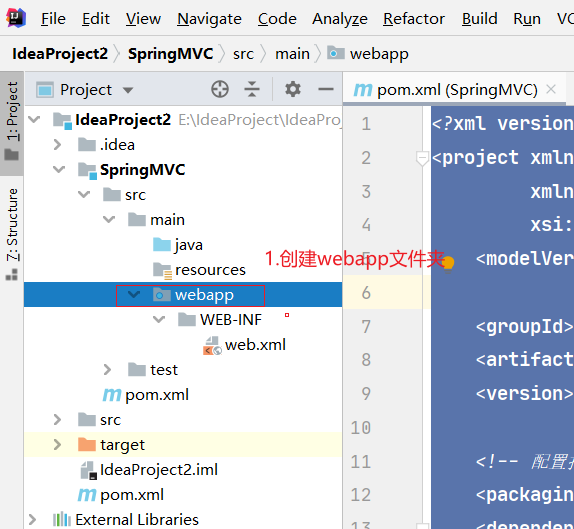

**创建web工程配置文件**

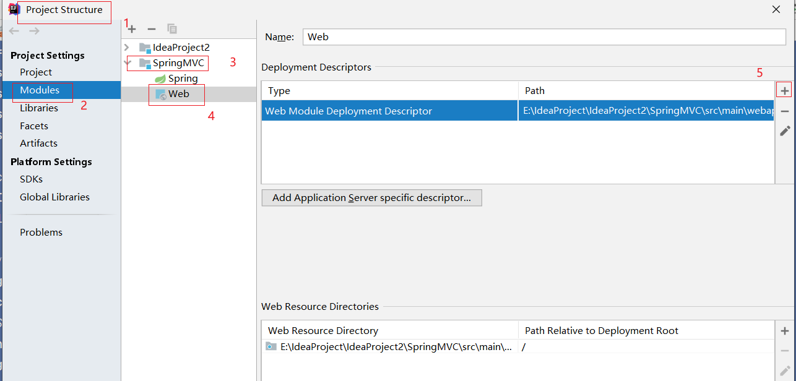

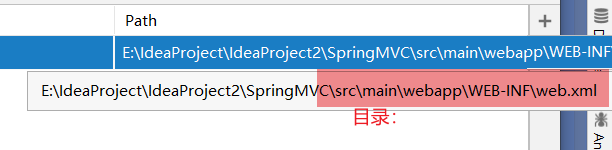

### 2.2 web.xml配置文件的编写

#### a>默认配置方式：位置默认，名称默认

此web.xml编写配置作用下，SpringMVC的配置文件将默认位于WEB-INF下，默认名称为\<servlet-name>-servlet.xml，例如，以下配置所对应SpringMVC的配置文件位于WEB-INF下，文件名为springMVC-servlet.xml

```xml
<?xml version="1.0" encoding="UTF-8"?>
<web-app xmlns="http://xmlns.jcp.org/xml/ns/javaee"
         xmlns:xsi="http://www.w3.org/2001/XMLSchema-instance"
         xsi:schemaLocation="http://xmlns.jcp.org/xml/ns/javaee http://xmlns.jcp.org/xml/ns/javaee/web-app_4_0.xsd"
         version="4.0">
    <!--
    配置前端控制器DispatcherServlet,对浏览器发送的请求进行统一的处理
    DispatcherServlet：也是一个Servlet
    -->
    <servlet>
        <servlet-name>SpringMVC</servlet-name>
        <servlet-class>org.springframework.web.servlet.DispatcherServlet</servlet-class>
        <!-- 没有指定SpringMVC配置文件的位置和名称，此时会使用默认的情况 -->
    </servlet>
    <servlet-mapping>
        <servlet-name>SpringMVC</servlet-name>
        <!--
      设置springMVC的核心控制器所能处理的请求的请求路径
         1./所匹配的请求可以是/login或.html或.js或.css方式的请求路径，代表接受除了.jsp外的所有请求
         2.但是/不能匹配.jsp请求路径的请求，这是因为SpringMVC会将.jsp看成一个路径，也就是普通的请求来处理，而不会指向具体的jsp页面
         3.jsp是特殊的Servlet，在服务器中有专门的Servlet去处理       -->
        <url-pattern>/</url-pattern>
    </servlet-mapping>
</web-app>

```

==由于这种配置下配置的位置是固定的，默认位于WEB-INF下，无法满足maven将配置文件放在resource文件夹统一管理的需求，故一般用下面的配置方式==

注意：

- 一个是web.xml的配置文件，一个是SpringMVC的配置文件，是两个文件
- 上述web.xml的配置将导致SpringMVC的配置文件的文件名和文件位置固定，和web.xml在一个目录下

#### b>扩展配置方式

可通过init-param标签==**改变**==SpringMVC配置文件的位置和名称，通过load-on-startup标签设置SpringMVC前端控制器DispatcherServlet的初始化时间

```xml
<!-- 配置SpringMVC的前端控制器，对浏览器发送的请求统一进行处理 -->
<servlet>
    <servlet-name>springMVC</servlet-name>
    <servlet-class>org.springframework.web.servlet.DispatcherServlet</servlet-class>
    <!-- 通过初始化参数指定SpringMVC配置文件的位置和名称 -->
    <init-param>
        <!-- contextConfigLocation为固定值 -->
        <param-name>contextConfigLocation</param-name>
        <!-- 使用classpath:表示从类路径查找配置文件，例如maven工程中的src/main/resources -->
        <param-value>classpath:springMVC.xml</param-value>
    </init-param>
    <!-- 
 		作为框架的核心组件，在启动过程中有大量的初始化操作要做
		而这些操作放在第一次请求时才执行会严重影响访问速度
		因此需要通过此标签将启动控制DispatcherServlet的初始化时间提前到服务器启动时
	-->
    <load-on-startup>1</load-on-startup>
</servlet>
<servlet-mapping>
    <servlet-name>springMVC</servlet-name>
    <!--
        设置springMVC的核心控制器所能处理的请求的请求路径
        /所匹配的请求可以是/login或.html或.js或.css方式的请求路径
        但是/不能匹配.jsp请求路径的请求
    -->
    <url-pattern>/</url-pattern>
</servlet-mapping>
```

> 注：
>
> \<url-pattern>标签中使用/和/*的区别：
>
> /所匹配的请求可以是/login或.html或.js或.css方式的请求路径，但是/不能匹配.jsp请求路径的请求,
>
> 因此就可以避免在访问jsp页面时，该请求被DispatcherServlet处理，从而找不到相应的页面
>
> 
>
> /*则能够匹配所有请求，例如在使用过滤器时，若需要对所有请求进行过滤，就需要使用/\*的写法，包括jsp页面。
>
>  < url-pattern > /* </ url-pattern > 会匹配*.jsp，会出现返回jsp视图时再次进入spring的DispatcherServlet 类，导致找不到对应的controller所以报404错。 

### 2.3 创建请求控制器

由于前端控制器对浏览器发送的请求进行了统一的处理，但是具体的请求有不同的处理过程，因此需要创建处理具体请求的类，即请求控制器

请求控制器中每一个处理请求的方法成为控制器方法

==**类中的方法才是处理请求的过程**==

**可以看成前端控制器统一获取所有的请求，然后分发给不同的控制器具体实现各自的逻辑.**

因为SpringMVC的控制器由一个POJO（普通的Java类）担任，因此需要通过@Controller注解将其标识为一个控制层组件，交给Spring的IoC容器管理，此时SpringMVC才能够识别控制器的存在

```java
@Controller
public class HelloController {
    
}
```

### 2.4 创建SpringMVC配置文件

~~~xml
<?xml version="1.0" encoding="UTF-8"?>
<beans xmlns="http://www.springframework.org/schema/beans"
       xmlns:xsi="http://www.w3.org/2001/XMLSchema-instance"
       xmlns:context="http://www.springframework.org/schema/context"
       xsi:schemaLocation="http://www.springframework.org/schema/beans http://www.springframework.org/schema/beans/spring-beans.xsd http://www.springframework.org/schema/context https://www.springframework.org/schema/context/spring-context.xsd">
    <!-- 扫描组件-->
    <context:component-scan base-package="com.atguigu.mvc.controller"></context:component-scan>

    <!--
    SpringMVC还需要配置视图解析器，视图名称会被视图解析器解析，负责最终的页面跳转，这里用Thymeleaf视图解析器
    配置Thymeleaf视图解析器 -->
    <bean id="viewResolver" class="org.thymeleaf.spring5.view.ThymeleafViewResolver">
        <!-- order属性用来配置当前视图解析器的优先级，整数的值越低代表优先级越高！我们可以在SpringMVC中配置多个视图解析器-->
        <property name="order" value="1"/>

        <property name="characterEncoding" value="UTF-8"/>
        <property name="templateEngine">
            <bean class="org.thymeleaf.spring5.SpringTemplateEngine">
                <property name="templateResolver">
                    <bean class="org.thymeleaf.spring5.templateresolver.SpringResourceTemplateResolver">
                        <!-- 视图会被视图解析器解析-->
                        <!-- 视图前缀 -->
                        <property name="prefix" value="/WEB-INF/templates/"/>
                        <!-- 视图后缀 -->
                        <property name="suffix" value=".html"/>

                        <property name="templateMode" value="HTML5"/>
                        <property name="characterEncoding" value="UTF-8" />
                    </bean>
                </property>
            </bean>
        </property>
    </bean>
</beans>

~~~

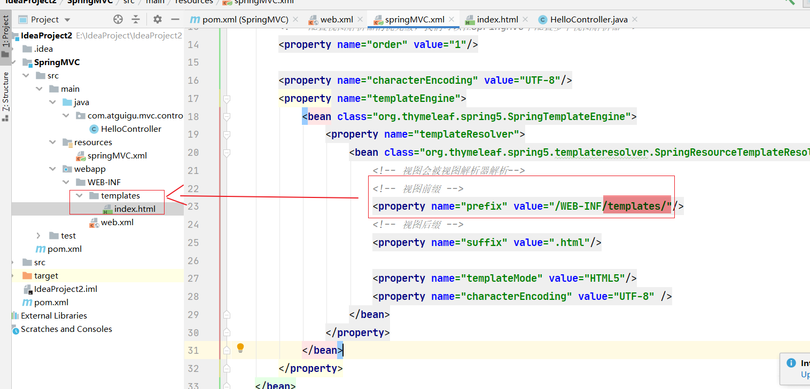

### 2.5 页面访问

~~~html
<!DOCTYPE html>
<html lang="en" xmlns:th="http://www.thymeleaf.org">
<head>
    <meta charset="UTF-8">
    <title>首页</title>
</head>
<body>
    <h1>首页</h1>
    <a th:href="@{/target}">访问目标页面</a>
</body>
</html>

~~~

对应的控制器

~~~java
package com.atguigu.mvc.controller;

import org.springframework.stereotype.Controller;
import org.springframework.web.bind.annotation.RequestMapping;

/**
 * 在我们将这个类变成IOC容器的一个组件的时候，他就会变成SpringMVC的一个控制器，将类中的方法作为处理器方法来处理请求
 *   1：@Controller：标记bean为一个控制层组件
 *   2:还需要经过扫描才能将这个类注册成为Spring的bean,
 */
@Controller
public class HelloController {
    /**
     * @RequestMapping：请求映射注解,
     *             作用：给处理的请求和控制器方法创建映射关系,
     *
     */
    @RequestMapping(value="/")
    public String index(){
        // 路径： / ：WEB-INF/templates/index.html
       return "index";
    }
    @RequestMapping(value="/target")
    public String toTarget(){
        return "target";
    }
}

~~~

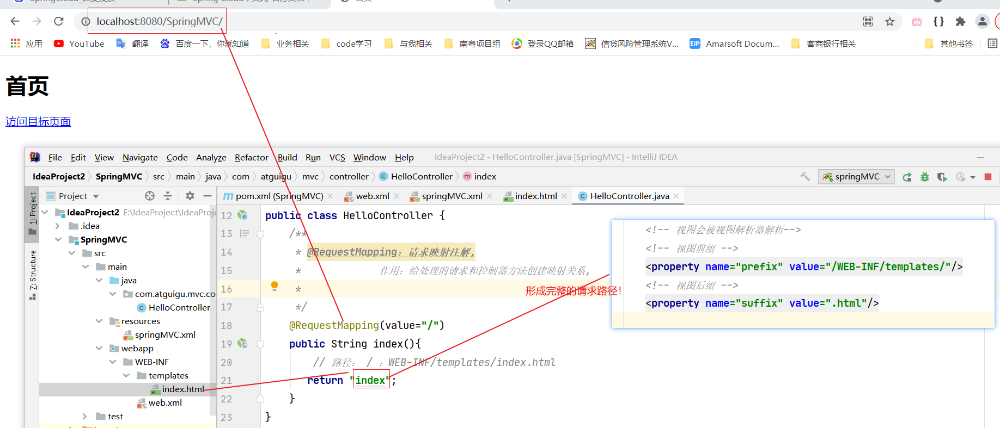

### 2.6 总结

浏览器发送请求，若请求地址符合前端控制器的url-pattern，该请求就会被==前端控制器DispatcherServlet处理==。前端控制器会读取SpringMVC的核心配置文件，通过扫描组件找到控制器，将==**请求地址和控制器中@RequestMapping注解的value属性值进行匹配，若匹配成功，该注解所标识的控制器方法就是处理请求的方法**==。处理请求的方法需要返回一个字符串类型的视图名称，该视图名称会被==视图解析器解析==，加上前缀和后缀组成视图的路径，通过Thymeleaf对视图进行渲染，最终转发到视图所对应页面。

## 3 @RequestMapping注解🌙

从注解名称上我们可以看到，@RequestMapping注解

- 请求映射：

​        请求：浏览器发出的请求

​        映射：和控制器Controller的方法进行映射

- 作用就是==**将请求和处理请求的控制器方法**==关联起来，建立映射关系。
- 一定要保证@RequestMapping注解所匹配的路径是唯一的，不能出现多个控制器方法对应同一个请求的情况，否则会报错！！！也就是**一个请求地址只有@RequestMapping注解的方法可以解决**
- 这个注解有多个属性，当多个属性同时设置，此时需要同时满足多个条件才会匹配！！！

>多个请求地址可以对应一个Controller，但是一个请求地址不能对应Controller!!!!

### 3.1 @RequestMapping注解的位置⭐

`@RequestMapping`:类注解&&方法注解

@RequestMapping标识一个类：设置映射请求的请求路径的初始信息

@RequestMapping标识一个方法：设置映射请求请求路径的具体信息

```java
@Controller
@RequestMapping("/test")
public class RequestMappingController {

	//此时请求映射所映射的请求的请求路径为：/test/testRequestMapping
    @RequestMapping("/testRequestMapping")
    public String testRequestMapping(){
        return "success";
    }

}
```

### 3.2 @RequestMapping注解的value属性⭐

通过当前的请求的==**请求地址**==来匹配请求

@RequestMapping注解的value属性通过请求的请求地址匹配请求映射

@RequestMapping注解的value属性是一个**字符串类型的数组**，==表示该请求映射能够匹配多个请求地址所对应的请求==

@RequestMapping注解的==**value属性必须设置**==，至少通过请求地址匹配请求映射

```html
<a th:href="@{/testRequestMapping}">测试@RequestMapping的value属性-->/testRequestMapping</a><br>
<a th:href="@{/test}">测试@RequestMapping的value属性-->/test</a><br>
```

```java
@RequestMapping(
        value = {"/testRequestMapping", "/test"}
)
public String testRequestMapping(){
    return "success";
}
```

### 3.3 @RequestMapping注解的method属性⭐

通过请求的==**请求方法信息**==来匹配请求

@RequestMapping注解的method属性通过请求的请求方式（get或post）匹配请求映射

@RequestMapping注解的method属性是一个RequestMethod类型的数组，表示该请求映射能够匹配多种请求方式的请求

若当前请求的请求地址满足请求映射的value属性，但是请求方式不满足method属性，则**浏览器报错405：Request method 'POST' not supported**

~~~html
<!DOCTYPE html>
<html lang="en" xmlns:th="http://www.thymeleaf.org">
<head>
    <meta charset="UTF-8">
    <title>首页</title>
</head>
<body>
    <h1>首页</h1>
    <a th:href="@{testRequstMapping}">测试RequestMapping注解的get请求</a><br>
    <form th:action = "@{/test}" method="post">
        <input type="submit" value="测试RequestMapping注解的method属性">
    </form>
</body>
</html>

~~~

~~~java
package com.atguigu.mvc.controller;

import org.springframework.stereotype.Controller;
import org.springframework.web.bind.annotation.RequestMapping;
import org.springframework.web.bind.annotation.RequestMethod;

/**
 * 在我们将这个类变成IOC容器的一个组件的时候，他就会变成SpringMVC的一个控制器，将类中的方法作为处理器方法来处理请求
 *   1：@Controller：标记bean为一个控制层组件
 *   2:还需要经过扫描才能将这个类注册成为Spring的bean,
 */
@Controller
//@RequestMapping("/hello")
public class HelloController {

    @RequestMapping(value="/target")
    public String toTarget(){
        return "target";
    }

    @RequestMapping(
            value = {"/testRequstMapping","test"},
            method = {RequestMethod.GET}
    )
    public String success(){
        return "success";
    }
}

~~~

- method属性的取值为==**枚举RequestMethod的相关属性**==
- 配置那种请求方式方式，就意味着只能支持处理哪种请求方式，可以同时配置多种请求方式，这个属性的值也是一个数组

>注：
>
>1、对于处理指定请求方式的控制器方法，SpringMVC中提供了@RequestMapping的派生注解
>
>处理get请求的映射-->`@GetMapping`
>
>处理post请求的映射-->`@PostMapping`
>
>处理put请求的映射-->`@PutMapping`
>
>处理delete请求的映射-->`@DeleteMapping`
>
>2、常用的请求方式有get，post，put，delete
>
>**但是目前浏览器只支持get和post，若在form表单提交时，为method设置了其他请求方式的字符串（put或delete），则按照默认的请求方式==get==处理**
>
>若要发送put和delete请求，则需要通过spring提供的过滤器HiddenHttpMethodFilter，在RESTful部分会讲到

注意：**value属性或者method属性只要满足其中一个就会匹配映射**

### 3.4  @RequestMapping注解的params属性

通过请求的==**请求参数信息**==来匹配请求

与value属性，method属性不同，params属性如果设置多个，必须多个同时满足才会匹配成功！！！！

RequestMapping注解的params属性通过请求的请求参数匹配请求映射

@RequestMapping注解的params属性是一个字符串类型的数组，可以通过四种表达式设置请求参数和请求映射的匹配关系

- "param"：要求请求映射所匹配的请求**必须携带**param请求参数

- "!param"：要求请求映射所匹配的请求**必须不能携带**param请求参数

- "param=value"：要求请求映射所匹配的请求**必须携带param请求参数且param=value**

- "param!=value"：要求请求映射所匹配的请求**必须携带param请求参数但是param!=value**

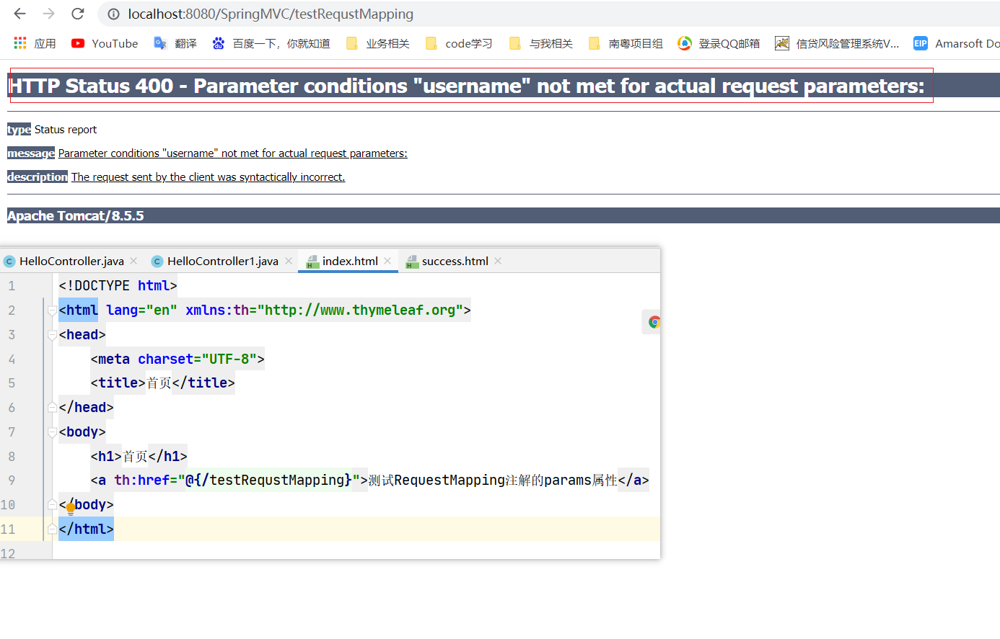

~~~html
<!DOCTYPE html>
<html lang="en" xmlns:th="http://www.thymeleaf.org">
<head>
    <meta charset="UTF-8">
    <title>首页</title>
</head>
<body>
    <h1>首页</h1>
    <a th:href="@{/testRequstMapping(username='admin',password=123456)}">测试RequestMapping注解的params属性</a>
</body>
</html>
~~~

~~~java
package com.atguigu.mvc.controller;

import org.springframework.stereotype.Controller;
import org.springframework.web.bind.annotation.RequestMapping;
import org.springframework.web.bind.annotation.RequestMethod;

/**
 * 在我们将这个类变成IOC容器的一个组件的时候，他就会变成SpringMVC的一个控制器，将类中的方法作为处理器方法来处理请求
 *   1：@Controller：标记bean为一个控制层组件
 *   2:还需要经过扫描才能将这个类注册成为Spring的bean,
 */
@Controller
public class HelloController {

    @RequestMapping(
            value = "/testRequstMapping",
            method = {RequestMethod.GET},
            params = {"username"}
    )
    public String success(){
        return "success";
    }
}
~~~

### 3.5 @RequestMapping注解的headers属性

通过请求的==**请求头信息**==来匹配请求

@RequestMapping注解的headers属性通过请求的请求头信息匹配请求映射

@RequestMapping注解的headers属性是一个字符串类型的数组，可以通过四种表达式设置请求头信息和请求映射的匹配关系

"header"：要求请求映射所匹配的请求必须携带header请求头信息

"!header"：要求请求映射所匹配的请求必须不能携带header请求头信息

"header=value"：要求请求映射所匹配的请求必须携带header请求头信息且header=value

"header!=value"：要求请求映射所匹配的请求必须携带header请求头信息且header!=value

若当前请求满足@RequestMapping注解的value和method属性，但是不满足headers属性，此时页面显示404错误，即资源未找到

**总结**：

- 1.如果请求没有和任何的控制器匹配，报404
- 2.如果请求方式匹配不了，报405
- 3.如果请求参数匹配不了，报400
- 4.如果请求头参数匹配不成功，仍然报404

### 3.6 SpringMVC支持ant风格的路径

这就类似于模糊查询，主要是`路径方面的模糊匹配`！

？：表示任意的单个字符，**一定要有一个字符，并且只能有一个字符**

*：表示任意的0个或多个字符

\**：表示任意的一层或多层目录，这两个**前后不能有其他的字符，否则会被当成任意的0个或多个字符，

注意：在使用\**时，只能使用`/**/xxx`的方式

~~~html
<!DOCTYPE html>
<html lang="en" xmlns:th="http://www.thymeleaf.org">
<head>
    <meta charset="UTF-8">
    <title>首页</title>
</head>
<body>
    <h1>首页</h1>
    <a th:href="@{/testRequstMapping(username='admin',password=123456)}">测试RequestMapping注解的params属性</a><br/>
    <a th:href="@{/a1a/testAnt}">测试SpringMVC可以匹配ant风格的路径 --》 使用？</a><br>
    <a th:href="@{/a1a/testAnt}">测试SpringMVC可以匹配ant风格的路径 --》 使用* </a><br>
    <a th:href="@{/a/a/testAnt}">测试SpringMVC可以匹配ant风格的路径 --》 使用** </a><br>
</body>
</html>
~~~

~~~java
  // @RequestMapping("/a?a/testAnt")
        // @RequestMapping("/a*a/testAnt")
        @RequestMapping("/**/testAnt")
        public String testAnt(){
            return "success";
        }
~~~

### 3.7 SpringMVC支持路径中的占位符⭐

**rest风格**：==将当前的请求资源用请求路径的方式表示出来，并且将请求参数以请求路径的方式并且请求路径中==

原始方式：/deleteUser?id=1

rest方式：/deleteUser/1

SpringMVC路径中的占位符常用于RESTful风格中，当请求路径中将某些数据通过路径的方式传输到服务器中，就可以在相应的==**@RequestMapping注解的value属性中通过占位符{xxx}表示传输的数据，再通过@PathVariable注解，将占位符所表示的数据赋值给控制器方法的形参**==

~~~html
<!DOCTYPE html>
<html lang="en" xmlns:th="http://www.thymeleaf.org">
<head>
    <meta charset="UTF-8">
    <title>首页</title>
</head>
<body>
    <h1>首页</h1>
    <a th:href="@{/testRequstMapping(username='admin',password=123456)}">测试RequestMapping注解的params属性</a><br/>
    <a th:href="@{/testRest/1/admin}">测试路径中的占位符-->/testRest</a><br>
</body>
</html>

~~~

~~~java
@RequestMapping("/testRest/{id}/{username}")
public String testRest(@PathVariable("id") String id, @PathVariable("username") String username){
    System.out.println("id:"+id+",username:"+username);
    return "success";
}
//最终输出的内容为-->id:1,username:admin
~~~

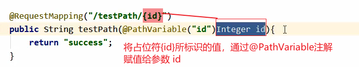

==**注意：路径中用到了占位符，则请求路径中一定要有这一层，也就是一定要传占位符对应的参数**==

## 4.SpringMVC获取请求参数🌙

### 4.1 通过Servlet的原生API获取请求参数

SpringMVC的前端控制器DispatcherServlet也是一个Servlet，他会封装请求的参数，当DispatcherServlet检索到控制器方法的时候，会匹配控制器方法的形参，如果我们的形参中有HttpServletRequest，此时前端控制器会给这个参数赋值。

将HttpServletRequest作为控制器方法的形参，此时HttpServletRequest类型的参数表示封装了当前请求的请求报文的对象。

~~~jsp
<!DOCTYPE html>
<html lang="en" xmlns:th="http://www.thymeleaf.org">
<head>
    <meta charset="UTF-8">
    <title>首页</title>
</head>
<body>
    <h1>测试请求参数</h1>
    <a th:href="@{/testServletAPI(username='admin',password=123456)}" >测试使用ServletAPI获取请求参数</a>
</body>
</html>
~~~

~~~java
package com.atguigu.mvc.controller;

import org.springframework.stereotype.Controller;
import org.springframework.web.bind.annotation.RequestMapping;

import javax.servlet.http.HttpServletRequest;

@Controller
public class ParamController {

    @RequestMapping("/testServletAPI")
    public String testServletAPI(HttpServletRequest request){
        String username = request.getParameter("username");
        String password = request.getParameter("password");
        System.out.println(username);
        System.out.println(password);
        return "success";
    }
}
~~~

### 4.2 通过SpringMVC的控制器方法的形参获取请求参数⭐

在控制器方法的形参位置，设置**和请求参数同名的形参**，当浏览器发送请求，匹配到请求映射时，在DispatcherServlet中就会将请求参数赋值给相应的形参

- 1.只要保证控制器方法的形参和请求参数名保持一致就能自动赋值成功！

~~~html
<!DOCTYPE html>
<html lang="en"  xmlns:th="http://www.thymeleaf.org">
<head>
    <meta charset="UTF-8">
    <title>Title</title>
</head>
<body>
<h1>欢迎欢迎，热烈欢迎！！！！</h1>
<a th:href="@{/testParam(username='admin',password=123456)}">测试使用控制器方法的形参来获取请求参数！</a>
</body>
</html>
~~~

~~~java
package com.atguigu.mvc.controller;

import org.springframework.stereotype.Controller;
import org.springframework.web.bind.annotation.RequestMapping;

@Controller
public class ParamController {
    @RequestMapping("/testParam")
    // 只要保证控制器方法的形参和请求参数名保持一致就能自动赋值成功！
    public String testParam(String username ,String password){
        System.out.println("username:"+username+",password:"+password);
        return "success";
    }
}

~~~

~~~java
<!DOCTYPE html>
<html lang="en">
<head>
    <meta charset="UTF-8">
    <title>Title</title>
</head>
<body>
 <h1>success!</h1>
</body>
</html>
~~~

- 2.当有==多个参数同名==的情况的处理⭐

2.1我们可以直接写一个同名的参数字符串，此时多个参数值**会以逗号分隔，传给字符串参数**

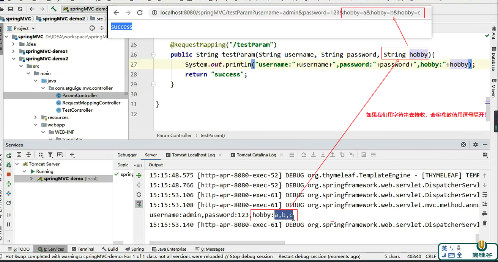

~~~html
<!DOCTYPE html>
<html lang="en"  xmlns:th="http://www.thymeleaf.org">
<head>
    <meta charset="UTF-8">
    <title>Title</title>
</head>
<body>
<h1>欢迎欢迎，热烈欢迎！！！！</h1>
<a th:href="@{/testParam(username='admin',password=123456)}">测试使用控制器方法的形参来获取请求参数！</a>
<form th:action="@{/testParam}" method="post">
    用户名：<input type="text" name="username"><br>
    密码：<input type="password" name="password"><br>
    爱好：<input type="checkbox" name="hobby" value="a">a
    <input type="checkbox" name="hobby" value="b">b
    <input type="checkbox" name="hobby" value="c">c<br>
    <input th:type="submit" value="测试使用控制器方法的形参来获取请求参数">
</form>
</body>
</html>
~~~

~~~java
package com.atguigu.mvc.controller;

import org.springframework.stereotype.Controller;
import org.springframework.web.bind.annotation.RequestMapping;

@Controller
public class ParamController {
    @RequestMapping("/testParam")
    // 只要保证控制器方法的形参和请求参数名保持一致就能自动赋值成功！
    public String testParam(String username ,String password,String hobby){
        System.out.println("username:"+username+",password:"+password+",hobby:"+hobby);
        return "success";
    }
}
-------------------------------------------------------------------------------------
username:admin,password:000000als,hobby:a,b
~~~

2.2 当确定有多个同名的参数时，除了1使用同名的字符串，我们还可以定义一个**==同名的数组==**去接受多个同名的参数！

~~~html
<!DOCTYPE html>
<html lang="en"  xmlns:th="http://www.thymeleaf.org">
<head>
    <meta charset="UTF-8">
    <title>Title</title>
</head>
<body>
<h1>欢迎欢迎，热烈欢迎！！！！</h1>
<a th:href="@{/testParam(username='admin',password=123456)}">测试使用控制器方法的形参来获取请求参数！</a>
<form th:action="@{/testParam}" method="post">
    用户名：<input type="text" name="username"><br>
    密码：<input type="password" name="password"><br>
    爱好：<input type="checkbox" name="hobby" value="a">a
    <input type="checkbox" name="hobby" value="b">b
    <input type="checkbox" name="hobby" value="c">c<br>
    <input th:type="submit" value="测试使用控制器方法的形参来获取请求参数">
</form>
</body>
</html>
~~~

~~~java
package com.atguigu.mvc.controller;

import org.springframework.stereotype.Controller;
import org.springframework.web.bind.annotation.RequestMapping;

import java.util.Arrays;

@Controller
public class ParamController {
    @RequestMapping("/testParam")
    // 只要保证控制器方法的形参和请求参数名保持一致就能自动赋值成功！
    public String testParam(String username ,String password,String[] hobby){
        System.out.println("username:"+username+",password:"+password+",hobby:"+ Arrays.toString(hobby));
        return "success";
    }
}
---------------------------------------------------------------
username:admin,password:000000als,hobby:[a, b, c]
~~~

**总结：**

- 控制器方法的形参和请求参数名保持一致则可以接收成功请求参数！

- 若请求参数中出现多个同名的请求参数，可以在控制器方法的形参位置设置==字符串类型==或者==字符串数组接受==此请求参数。
- 若使用字符串类型的形参，最终结果为请求参数的每一个值之间使用逗号进行拼接。
- 若使用字符串数组类型的形参，此参数的数组中包含了每一个数据。

### 4.3 @RequestParam注解的使用⭐（请求体数据和形参创建映射关系）

当请求参数名和处理器方法的形参名不一致，我们可以通过==@RequestParam注解来**建立请求参数和处理器方法的形参**之间==的映射关系！

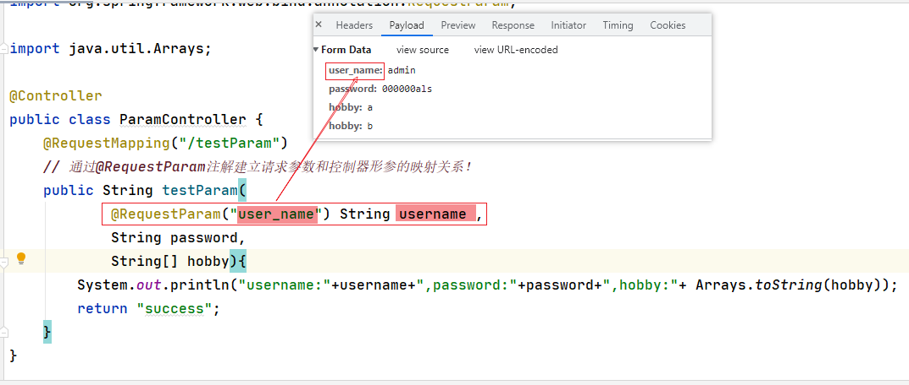

~~~html
<!DOCTYPE html>
<html lang="en"  xmlns:th="http://www.thymeleaf.org">
<head>
    <meta charset="UTF-8">
    <title>Title</title>
</head>
<body>
<h1>欢迎欢迎，热烈欢迎！！！！</h1>
<a th:href="@{/testParam(username='admin',password=123456)}">测试使用控制器方法的形参来获取请求参数！</a>
<form th:action="@{/testParam}" method="post">
    用户名：<input type="text" name="user_name"><br>
    密码：<input type="password" name="password"><br>
    爱好：<input type="checkbox" name="hobby" value="a">a
    <input type="checkbox" name="hobby" value="b">b
    <input type="checkbox" name="hobby" value="c">c<br>
    <input th:type="submit" value="测试使用控制器方法的形参来获取请求参数">
</form>
</body>
</html>
~~~

~~~java
package com.atguigu.mvc.controller;

import org.springframework.stereotype.Controller;
import org.springframework.web.bind.annotation.RequestMapping;
import org.springframework.web.bind.annotation.RequestParam;

import java.util.Arrays;

@Controller
public class ParamController {
    @RequestMapping("/testParam")
    // 通过@RequestParam注解建立请求参数和控制器形参的映射关系！
    public String testParam(
            @RequestParam("user_name") String username ,
            String password,
            String[] hobby){
        System.out.println("username:"+username+",password:"+password+",hobby:"+ Arrays.toString(hobby));
        return "success";
    }
}
~~~

#### @RequestParam注解的详细说明

~~~java
package org.springframework.web.bind.annotation;

import java.lang.annotation.Documented;
import java.lang.annotation.ElementType;
import java.lang.annotation.Retention;
import java.lang.annotation.RetentionPolicy;
import java.lang.annotation.Target;
import org.springframework.core.annotation.AliasFor;

@Target({ElementType.PARAMETER})
@Retention(RetentionPolicy.RUNTIME)
@Documented
public @interface RequestParam {
    @AliasFor("name")
    String value() default "";

    @AliasFor("value")
    String name() default "";

    boolean required() default true;

    String defaultValue() default "\n\t\t\n\t\t\n\ue000\ue001\ue002\n\t\t\t\t\n";
}
~~~

~~~markdown
# 1.这个注解用在方法的形参上
# 2.这个注解的name属性与value属性的含义一致，互为别名，用来映射请求参数名
# 3.required属性默认为true，代表必须传递此注解所映射的请求参数，如果不传递此请求参数，会报400.当我们设置此属性为false，则代表有则赋值，没有则为null.
# 4.defaultValue属性,代表默认值！不管required属性值为true或false，如果我们不传输这个请求参数或者传输的请求参数的值为”“，则会使用defaultValue设置的默认值！
~~~

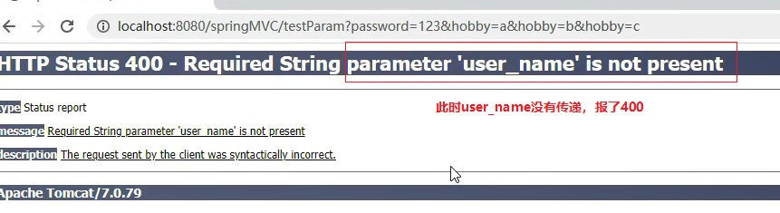

总结：

@RequestParam是将请求参数和控制器方法的形参创建映射关系

@RequestParam注解一共有三个属性：

value：指定为形参赋值的请求参数的参数名

required：设置是否必须传输此请求参数，默认值为true

若设置为true时，则当前请求必须传输value所指定的请求参数，若没有传输该请求参数，且没有设置defaultValue属性，则页面报错400：Required String parameter 'xxx' is not present；若设置为false，则当前请求不是必须传输value所指定的请求参数，若没有传输，则注解所标识的形参的值为null

defaultValue：不管required属性值为true或false，当==value所指定的请求参数没有传输或传输的值为""时，则使用默认值为形参赋值==

### 4.4 @RequestHeader注解⭐（请求头数据和形参创建映射关系）

**@RequestHeader是将==请求头信息和控制器方法的形参==创建映射关系**

@RequestHeader注解一共有三个属性：value、required、defaultValue，用法同@RequestParam

请求参数和控制器方法之间有默认的映射关系，故有时可以不加@RequestParam，但是如果我们想建立请求头和控制器形参之间的映射关系，必须加@RequestHeader注解

~~~java
package com.atguigu.mvc.controller;

import org.springframework.stereotype.Controller;
import org.springframework.web.bind.annotation.RequestHeader;
import org.springframework.web.bind.annotation.RequestMapping;
import org.springframework.web.bind.annotation.RequestParam;

import java.util.Arrays;

@Controller
public class ParamController {
    @RequestMapping("/testParam")
    // 通过@RequestParam注解建立请求参数和控制器形参的映射关系！
    public String testParam(
            @RequestParam("user_name") String username ,
            String password,
            String[] hobby,
            @RequestHeader("Host") String host // 此时会从请求头中寻找参数Host，将他的值赋值给host形参！
            ){
        System.out.println("username:"+username+",password:"+password+",hobby:"+ Arrays.toString(hobby));
        System.out.println("host:"+host);
        return "success";
    }
}
~~~

### 4.5 @CookieValue注解⭐（cookie数据和形参创建映射关系）

**@CookieValue是将==cookie数据和控制器方法==的形参创建映射关系**

@CookieValue注解一共有三个属性：value、required、defaultValue，用法同@RequestParam

~~~java
<!DOCTYPE html>
<html lang="en">
<head>
    <meta charset="UTF-8">
    <title>Title</title>
</head>
<body>
 <h1>success!</h1>
</body>
</html>
~~~

~~~html
<!DOCTYPE html>
<html lang="en"  xmlns:th="http://www.thymeleaf.org">
<head>
    <meta charset="UTF-8">
    <title>Title</title>
</head>
<body>
<h1>欢迎欢迎，热烈欢迎！！！！</h1>
<a th:href="@{/testServletAPI(username='admin',password=123456)}">测试使用原生API来获取请求参数！</a>
<form th:action="@{/testParam}" method="post">
    用户名：<input type="text" name="user_name"><br>
    密码：<input type="password" name="password"><br>
    爱好：<input type="checkbox" name="hobby" value="a">a
    <input type="checkbox" name="hobby" value="b">b
    <input type="checkbox" name="hobby" value="c">c<br>
    <input th:type="submit" value="测试使用控制器方法的形参来获取请求参数">
</form>
</body>
</html>
~~~

~~~java
package com.atguigu.mvc.controller;

import org.springframework.stereotype.Controller;
import org.springframework.web.bind.annotation.CookieValue;
import org.springframework.web.bind.annotation.RequestHeader;
import org.springframework.web.bind.annotation.RequestMapping;
import org.springframework.web.bind.annotation.RequestParam;

import javax.servlet.http.HttpServletRequest;
import javax.servlet.http.HttpSession;
import java.util.Arrays;

@Controller
public class ParamController {

    @RequestMapping("/testServletAPI")
    public String testServletAPI(HttpServletRequest request){
        HttpSession session = request.getSession();
        String username = request.getParameter("username");
        String password = request.getParameter("password");
        System.out.println("username:"+username+",password:"+password);
        return "success";
    }

    @RequestMapping("/testParam")
    // 通过@RequestParam注解建立请求参数和控制器形参的映射关系！
    public String testParam(
            @RequestParam("user_name") String username ,
            String password,
            String[] hobby,
            @RequestHeader("Host") String host // 此时会从请求头中寻找参数Host，将他的值赋值给host形参！,
            ,@CookieValue("JSESSIONID") String JSESSIONID // 此时会从cookie中寻找参数JSESSIONID，将他的值赋值给JSESSIONID形参！,
            ){
        System.out.println("username:"+username+",password:"+password+",hobby:"+ Arrays.toString(hobby));
        System.out.println("host:"+host);
        System.out.println("JSESSIONID:"+JSESSIONID);
        return "success";
    }
}

~~~

### 4.6 通过POJO获取请求参数

可以在控制器方法的形参位置设置一个实体类类型的形参，此时若浏览器传输的请求参数的参数名和实体类中的属性名一致，那么请求参数就会为此属性赋值

**前端页面**

~~~html
<!DOCTYPE html>
<html lang="en"  xmlns:th="http://www.thymeleaf.org">
<head>
    <meta charset="UTF-8">
    <title>Title</title>
</head>
<body>
<h1>欢迎欢迎，热烈欢迎！！！！</h1>
<form th:action="@{/testpojo}" method="post">
    用户名：<input type="text" name="username"><br>
    密码：<input type="password" name="password"><br>
    性别：<input type="radio" name="sex" value="男">男<input type="radio" name="sex" value="女">女<br>
    年龄：<input type="text" name="age"><br>
    邮箱：<input type="text" name="email"><br>
    <input type="submit" value="通过pojo获取请求参数">
</form>
</body>
</html>
~~~

**实体类**

~~~java
package com.atguigu.mvc.pojo;

public class User {
    public String username ;
    public String password;
    public String sex;
    public int age;
    public String email;

    @Override
    public String toString() {
        return "User{" +
                "username='" + username + '\'' +
                ", password='" + password + '\'' +
                ", sex='" + sex + '\'' +
                ", age=" + age +
                ", email='" + email + '\'' +
                '}';
    }

    public String getUsername() {
        return username;
    }

    public void setUsername(String username) {
        this.username = username;
    }

    public String getPassword() {
        return password;
    }

    public void setPassword(String password) {
        this.password = password;
    }

    public String getSex() {
        return sex;
    }

    public void setSex(String sex) {
        this.sex = sex;
    }

    public int getAge() {
        return age;
    }

    public void setAge(int age) {
        this.age = age;
    }

    public String getEmail() {
        return email;
    }

    public void setEmail(String email) {
        this.email = email;
    }
}
~~~

**处理器**

~~~java
package com.atguigu.mvc.controller;

import com.atguigu.mvc.pojo.User;
import org.springframework.stereotype.Controller;
import org.springframework.web.bind.annotation.CookieValue;
import org.springframework.web.bind.annotation.RequestHeader;
import org.springframework.web.bind.annotation.RequestMapping;
import org.springframework.web.bind.annotation.RequestParam;

import javax.servlet.http.HttpServletRequest;
import javax.servlet.http.HttpSession;
import java.util.Arrays;

@Controller
public class ParamController {
    @RequestMapping("/testpojo")
    public String testPojo(User user){
        System.out.println(user);
        return "success";
    }
}
----------------------------------------------------------------------------------------
User{username='admin', password='000000als', sex='??·', age=18, email='1607140115@qq.com'}
~~~

### 4.7 通过CharacterEncodingFilter处理获取请求参数的乱码问题⭐🐏

我们通过pojo获取请求参数时，请求参数的值携带中文呢会出现乱码，此时我们可以通过SpringMVC提供的过滤器**==CharacterEncodingFilter==**来处理乱码问题！

- get请求的乱码处理

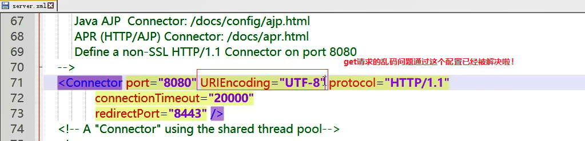

- post请求乱码问题

通过过滤器，**过滤器的加载时间早于Servlet**，这样就可以处理乱码问题！我们需要在web.xml中配置这个过滤器！

~~~xml
<?xml version="1.0" encoding="UTF-8"?>
<web-app xmlns="http://xmlns.jcp.org/xml/ns/javaee"
         xmlns:xsi="http://www.w3.org/2001/XMLSchema-instance"
         xsi:schemaLocation="http://xmlns.jcp.org/xml/ns/javaee http://xmlns.jcp.org/xml/ns/javaee/web-app_4_0.xsd"
         version="4.0">
   <!--配置处理post请求乱码的过滤器 start-->
  <filter>
      <filter-name>CharacterEncodingFilter</filter-name>
      <filter-class>org.springframework.web.filter.CharacterEncodingFilter</filter-class>
      <!--
       设置处理请求编码
         需要encoding的属性值
       -->
      <init-param>
          <param-name>encoding</param-name>
          <param-value>utf-8</param-value>
      </init-param>
      <!--
       设置响应编码
         需要forceResponseEncoding属性为true
       -->
      <init-param>
          <param-name>forceResponseEncoding</param-name>
          <param-value>true</param-value>
      </init-param>
  </filter>
    <filter-mapping>
        <filter-name>CharacterEncodingFilter</filter-name>
        <!-- /*代表处理所有请求-->
        <url-pattern>/*</url-pattern>
    </filter-mapping>
   <!--配置处理post请求乱码的过滤器 end-->
    
   <!-- 配置SpringMVC的前端控制器，对浏览器发送的请求统一进行处理：注册DispatcherServlet start-->
    <servlet>
        <servlet-name>springMVC</servlet-name>
        <servlet-class>org.springframework.web.servlet.DispatcherServlet</servlet-class>
        <!-- 通过初始化参数指定SpringMVC配置文件的位置和名称 -->
        <init-param>
            <!-- contextConfigLocation为固定值 -->
            <param-name>contextConfigLocation</param-name>
            <!-- 使用classpath:表示从类路径查找配置文件，例如maven工程中的src/main/resources -->
            <param-value>classpath:springMVC.xml</param-value>
        </init-param>
        <!--
             作为框架的核心组件，在启动过程中有大量的初始化操作要做
            而这些操作放在第一次请求时才执行会严重影响访问速度
            因此需要通过此标签将启动控制DispatcherServlet的初始化时间提前到服务器启动时
        -->
        <load-on-startup>1</load-on-startup>
    </servlet>
    <servlet-mapping>
        <servlet-name>springMVC</servlet-name>
        <!--
            设置springMVC的核心控制器所能处理的请求的请求路径
            /所匹配的请求可以是/login或.html或.js或.css方式的请求路径
            但是/不能匹配.jsp请求路径的请求
        -->
        <url-pattern>/</url-pattern>
    </servlet-mapping>
    <!-- 配置SpringMVC的前端控制器，对浏览器发送的请求统一进行处理：注册DispatcherServlet end-->
</web-app>
~~~

##### 

>注：SpringMVC中处理编码的过滤器一定要配置到其他过滤器之前，否则无效

## 5.域对象共享数据⭐

### 5.1 通过ServletAPI向Request域对象中共享数据

~~~java
package com.atguigu.mvc.controller;

import org.springframework.stereotype.Controller;
import org.springframework.web.bind.annotation.RequestMapping;

@Controller
public class HelloController {
    @RequestMapping("/")
    public String methodMapping01(){
        return "index";
    }
}

~~~

~~~html
<!DOCTYPE html>
<html lang="en"  xmlns:th="http://www.thymeleaf.org">
<head>
    <meta charset="UTF-8">
    <title>Title</title>
</head>
<body>
<h1>欢迎欢迎，热烈欢迎！！！！</h1>
<a th:href="@{/testRequestByServletAPI}">通过ServletAPI向request域对象中共享数据</a>
</body>
</html>
~~~

~~~java
package com.atguigu.mvc.controller;

import org.springframework.stereotype.Controller;
import org.springframework.web.bind.annotation.RequestMapping;

import javax.servlet.http.HttpServletRequest;

@Controller
public class ScopeController {
    // 使用ServletAPI向request域对象共享数据
    @RequestMapping("/testRequestByServletAPI")
    public String testRequestByServletAPI(HttpServletRequest request){
        request.setAttribute("testRequestScope","hello,ServletAPI");
        return "success";
    }
}

~~~

~~~html
<!DOCTYPE html>
<html lang="en" xmlns:th="http://www.thymeleaf.org">
<head>
    <meta charset="UTF-8">
    <title>Title</title>
</head>
<body>
 <h1>success!</h1><br>
<p th:text="${testRequestScope}"></p>  <!--获取到了请求的域对象的数据！ -->
</body>
</html>

~~~

### 5.2 使用ModelAndView向request域对象共享数据⭐

~~~java
    @RequestMapping("/testModelAndView")
    public ModelAndView testModelAndView(){
        /**
         * 方法中使用了ModelAndView，则这个方法的返回值必须是ModelAndView，只有这样才知道这个方法创建使用了ModelAndView。并且会返回给前端控制器，前端控制器才会去解析它
         * ModelAndView:两个功能，模型数据&&视图
         *    Model:往请求域中共享数据
         *    View：视图功能
         */
        ModelAndView mav  = new ModelAndView();
        // 处理模型数据，即向请求域Request中共享数据
        mav.addObject("testRequestScope","hello,ModelAndView");
        // 设置视图名称
        mav.setViewName("success");
        return mav;
    }
~~~

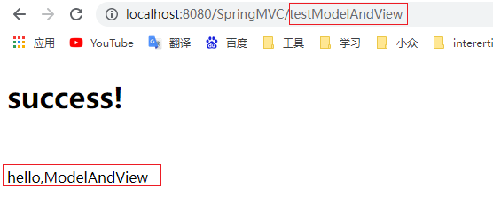

注意：返回ModelAndView才会有效果！

###  5.3 使用Model向request域对象共享数据⭐

>此时需要注意：
>
>​        1.方法的形参中需要有Model这个类型的变量

~~~html
<!DOCTYPE html>
<html lang="en"  xmlns:th="http://www.thymeleaf.org">
<head>
    <meta charset="UTF-8">
    <title>Title</title>
</head>
<body>
<h1>欢迎欢迎，热烈欢迎！！！！</h1>
<a th:href="@{/testRequestByServletAPI}">通过ServletAPI向request域对象中共享数据</a>
<a th:href="@{/testModel}">通过Model向request域对象中共享数据</a>
</body>
</html>
~~~

~~~java
package com.atguigu.mvc.controller;

import org.springframework.stereotype.Controller;
import org.springframework.ui.Model;
import org.springframework.web.bind.annotation.RequestMapping;
import org.springframework.web.servlet.ModelAndView;

import javax.servlet.http.HttpServletRequest;

@Controller
public class ScopeController {
    // 使用ServletAPI向request域对象共享数据
    @RequestMapping("/testRequestByServletAPI")
    public String testRequestByServletAPI(HttpServletRequest request){
        request.setAttribute("testRequestScope","hello,ServletAPI");
        return "success";
    }

    @RequestMapping("/testModelAndView")
    public ModelAndView testModelAndView(){
        /**
         * 方法中使用了ModelAndView，则这个方法的返回值必须是ModelAndView，只有这样才知道这个方法创建使用了ModelAndView。并且会返回给前端控制器，前端控制器才会去解析它
         * ModelAndView:两个功能，模型数据&&视图
         *    Model:往请求域中共享数据
         *    View：视图功能
         */
        ModelAndView mav  = new ModelAndView();
        // 处理模型数据，即向请求域Request中共享数据
        mav.addObject("testRequestScope","hello,ModelAndView");
        // 设置视图名称
        mav.setViewName("success");
        return mav;
    }
    @RequestMapping("/testModel")
    public String testModel(Model mol){
        // 使用model的话，只需要在方法的形参上使用Model类型的形参！
        mol.addAttribute("testRequestScope","hello,model");
        return "success";
    }
}
~~~

### 5.4 使用map向request域对象中共享数据⭐

我们还可以使用java中的map向域对象中共享数据

~~~html
<!DOCTYPE html>
<html lang="en"  xmlns:th="http://www.thymeleaf.org">
<head>
    <meta charset="UTF-8">
    <title>Title</title>
</head>
<body>
<h1>欢迎欢迎，热烈欢迎！！！！</h1>
<a th:href="@{/testRequestByServletAPI}">通过ServletAPI向request域对象中共享数据</a>
<a th:href="@{/testModel}">通过Model向request域对象中共享数据</a>
<a th:href="@{/testMap}">通过map向request域对象中共享数据</a>
</body>
</html>
~~~

~~~java
package com.atguigu.mvc.controller;

import org.springframework.stereotype.Controller;
import org.springframework.ui.Model;
import org.springframework.web.bind.annotation.RequestMapping;
import org.springframework.web.servlet.ModelAndView;

import javax.servlet.http.HttpServletRequest;
import java.util.Map;

@Controller
public class ScopeController {
    // 使用ServletAPI向request域对象共享数据
    @RequestMapping("/testRequestByServletAPI")
    public String testRequestByServletAPI(HttpServletRequest request){
        request.setAttribute("testRequestScope","hello,ServletAPI");
        return "success";
    }

    @RequestMapping("/testModelAndView")
    public ModelAndView testModelAndView(){
        /**
         * 方法中使用了ModelAndView，则这个方法的返回值必须是ModelAndView，只有这样才知道这个方法创建使用了ModelAndView。并且会返回给前端控制器，前端控制器才会去解析它
         * ModelAndView:两个功能，模型数据&&视图
         *    Model:往请求域中共享数据
         *    View：视图功能
         */
        ModelAndView mav  = new ModelAndView();
        // 处理模型数据，即向请求域Request中共享数据
        mav.addObject("testRequestScope","hello,ModelAndView");
        // 设置视图名称
        mav.setViewName("success");
        return mav;
    }
    @RequestMapping("/testModel")
    public String testModel(Model mol){
        // 使用model的话，只需要在方法的形参上使用Model类型的形参！
        mol.addAttribute("testRequestScope","hello,model");
        return "success";
    }
    @RequestMapping("/testMap")
    public String testMap(Map<String,Object> map){
        // 方法中设置形参，此时我们往map集合中存放的数据就是域对象中共享的数据！
        map.put("testRequestScope","hello,map");
        return "success";
    }
}
~~~

~~~html
<!DOCTYPE html>
<html lang="en" xmlns:th="http://www.thymeleaf.org">
<head>
    <meta charset="UTF-8">
    <title>Title</title>
</head>
<body>
 <h1>success!</h1><br>
<p th:text="${testRequestScope}"></p>
</body>
</html>
~~~

### 5.5 通过ModelMap向域对象中共享数据⭐

控制器方法的形参还可以使用ModelMap对象来向请求域中共享数据

~~~html
<!DOCTYPE html>
<html lang="en"  xmlns:th="http://www.thymeleaf.org">
<head>
    <meta charset="UTF-8">
    <title>Title</title>
</head>
<body>
<h1>欢迎欢迎，热烈欢迎！！！！</h1>
<a th:href="@{/testRequestByServletAPI}">通过ServletAPI向request域对象中共享数据</a>
<a th:href="@{/testModel}">通过Model向request域对象中共享数据</a>
<a th:href="@{/testMap}">通过map向request域对象中共享数据</a>
<a th:href="@{/testModelMap}">通过ModelMap向request域对象中共享数据</a>
</body>
</html>
~~~

~~~java
package com.atguigu.mvc.controller;

import org.springframework.stereotype.Controller;
import org.springframework.ui.Model;
import org.springframework.ui.ModelMap;
import org.springframework.web.bind.annotation.RequestMapping;
import org.springframework.web.servlet.ModelAndView;

import javax.servlet.http.HttpServletRequest;
import java.util.Map;

@Controller
public class ScopeController {
    // 使用ServletAPI向request域对象共享数据
    @RequestMapping("/testRequestByServletAPI")
    public String testRequestByServletAPI(HttpServletRequest request){
        request.setAttribute("testRequestScope","hello,ServletAPI");
        return "success";
    }

    @RequestMapping("/testModelAndView")
    public ModelAndView testModelAndView(){
        /**
         * 方法中使用了ModelAndView，则这个方法的返回值必须是ModelAndView，只有这样才知道这个方法创建使用了ModelAndView。并且会返回给前端控制器，前端控制器才会去解析它
         * ModelAndView:两个功能，模型数据&&视图
         *    Model:往请求域中共享数据
         *    View：视图功能
         */
        ModelAndView mav  = new ModelAndView();
        // 处理模型数据，即向请求域Request中共享数据
        mav.addObject("testRequestScope","hello,ModelAndView");
        // 设置视图名称
        mav.setViewName("success");
        return mav;
    }
    @RequestMapping("/testModel")
    public String testModel(Model mol){
        // 使用model的话，只需要在方法的形参上使用Model类型的形参！
        mol.addAttribute("testRequestScope","hello,model");
        return "success";
    }
    @RequestMapping("/testMap")
    public String testMap(Map<String,Object> map){
        // 方法中设置形参，此时我们往map集合中存放的数据就是域对象中共享的数据！
        map.put("testRequestScope","hello,map");
        return "success";
    }
    @RequestMapping("/testModelMap")
    public String testModelMap(ModelMap map){
        map.addAttribute("testRequestScope","hello,ModelMap");
        return "success";
    }
}
~~~

~~~html
<!DOCTYPE html>
<html lang="en" xmlns:th="http://www.thymeleaf.org">
<head>
    <meta charset="UTF-8">
    <title>Title</title>
</head>
<body>
 <h1>success!</h1><br>
<p th:text="${testRequestScope}"></p>
</body>
</html>
~~~

### 5.6 Model、ModelMap、Map的关系

Model、ModelMap、Map类型的参数其实本质上都是 BindingAwareModelMap 类型的

>public interface Model{}
>public class ModelMap extends LinkedHashMap<String, Object> {}
>public class ExtendedModelMap extends ModelMap implements Model {}
>public class BindingAwareModelMap extends ExtendedModelMap {}

我们可以获取真正实现转发的对象的类的全类名来确定

~~~java
package com.atguigu.mvc.controller;

import org.springframework.stereotype.Controller;
import org.springframework.ui.Model;
import org.springframework.ui.ModelMap;
import org.springframework.web.bind.annotation.RequestMapping;
import org.springframework.web.servlet.ModelAndView;

import javax.servlet.http.HttpServletRequest;
import java.util.Map;

@Controller
public class ScopeController {
    @RequestMapping("/testModel")
    public String testModel(Model mol){
        // 使用model的话，只需要在方法的形参上使用Model类型的形参！
        mol.addAttribute("testRequestScope","hello,model");
        
        System.out.println(mol.getClass().getName());
        
        return "success";
    }
    @RequestMapping("/testMap")
    public String testMap(Map<String,Object> map){
        // 方法中设置形参，此时我们往map集合中存放的数据就是域对象中共享的数据！
        map.put("testRequestScope","hello,map");
        
        System.out.println(map.getClass().getName());
        
        return "success";
    }
    @RequestMapping("/testModelMap")
    public String testModelMap(ModelMap map){
        map.addAttribute("testRequestScope","hello,ModelMap");
        
        System.out.println(map.getClass().getName());
        
        return "success";
    }
}
~~~

>输出的结果是：
>
>org.springframework.validation.support.BindingAwareModelMap
>
>```
>public class ExtendedModelMap extends ModelMap implements Model {
>....
>}
>
>public class BindingAwareModelMap extends ExtendedModelMap {
>....
>}
>
>public class ModelMap extends LinkedHashMap<String, Object> {
>....
>}
>```

**查看当前类的继承关系，idea快捷键：ctrl+H**

### 5.7 向Session域中共享数据

SpringMVC的session域共享数据，我们采用原生ServletAPI的方式！此时需要在形参位置设置一个Session对象！

~~~html
<!DOCTYPE html>
<html lang="en"  xmlns:th="http://www.thymeleaf.org">
<head>
    <meta charset="UTF-8">
    <title>Title</title>
</head>
<body>
<h1>欢迎欢迎，热烈欢迎！！！！</h1>
<a th:href="@{/testSession}">通过ServletAPI向session域对象中共享数据</a>
</body>
</html>
~~~

~~~java
package com.atguigu.mvc.controller;

import org.springframework.stereotype.Controller;
import org.springframework.ui.Model;
import org.springframework.ui.ModelMap;
import org.springframework.web.bind.annotation.RequestMapping;
import org.springframework.web.servlet.ModelAndView;

import javax.servlet.http.HttpServletRequest;
import javax.servlet.http.HttpSession;
import java.util.Map;

@Controller
public class ScopeController {

    @RequestMapping("/testSession")
    public String testSession(HttpSession session){
        session.setAttribute("testSessionScope","hello,Session");
        return "success";
    }

}

~~~

~~~html
<!DOCTYPE html>
<html lang="en" xmlns:th="http://www.thymeleaf.org">
<head>
    <meta charset="UTF-8">
    <title>Title</title>
</head>
<body>
 <h1>success!</h1><br>
 <!-- 在thymeleaf中访问Session是通过session.的形式来访问的！-->
<p th:text="${session.testSessionScope}"></p>
</body>
</html>
~~~

### 5.8 向application域共享数据

~~~html
<!DOCTYPE html>
<html lang="en"  xmlns:th="http://www.thymeleaf.org">
<head>
    <meta charset="UTF-8">
    <title>Title</title>
</head>
<body>
<h1>欢迎欢迎，热烈欢迎！！！！</h1>
<a th:href="@{/tsetApplication}">通过ServletAPI向application域对象中共享数据</a>
</body>
</html>
~~~

~~~java
 @RequestMapping("/tsetApplication")
    public String testApplication(HttpSession session){
        ServletContext servletContext = session.getServletContext();
        servletContext.setAttribute("tsetApplicationScope","hello,application");
        return "success";
    }
~~~

~~~html
<!DOCTYPE html>
<html lang="en" xmlns:th="http://www.thymeleaf.org">
<head>
    <meta charset="UTF-8">
    <title>Title</title>
</head>
<body>
<h1>success!</h1><br>
<!-- 在thymeleaf中访问application是通过application.的形式来访问的！-->
<p th:text="${application.tsetApplicationScope}"></p>
</body>
</html>
~~~

## 6.SpringMVC的视图解析🌙⭐

- 1.不论处理器方法返回一个String，ModelAndView还是View,SpringMVC都会在内部将他们转换成一个ModelAndView对象，ModelAndView对象回传给视图解析器对象，由视图解析器解析视图，然后进行页面跳转。

~~~java
DispatcherServlet中的
mv = ha.handle(processedRequest, response, mappedHandler.getHandler());
~~~

- 2.SpringMVC借助视图解析器（==SpringMVC中可以配置多个视图解析器==）（**ViewResolver接口**，配置那种视图解析器实现类就会使用那种视图解析器！）得到最终的视图对象（**View,这个对象里面会有页面跳转的url**，也包含渲染数据的方法）,最终的视图可以是JSP，也可以是Excel,JFreeChart等各种表现形式的视图！

**视图解析器必须实现下面这个接口**

~~~java
public interface ViewResolver {
    // 解析视图，获取View对象
    @Nullable
    View resolveViewName(String var1, Locale var2) throws Exception;
}
~~~

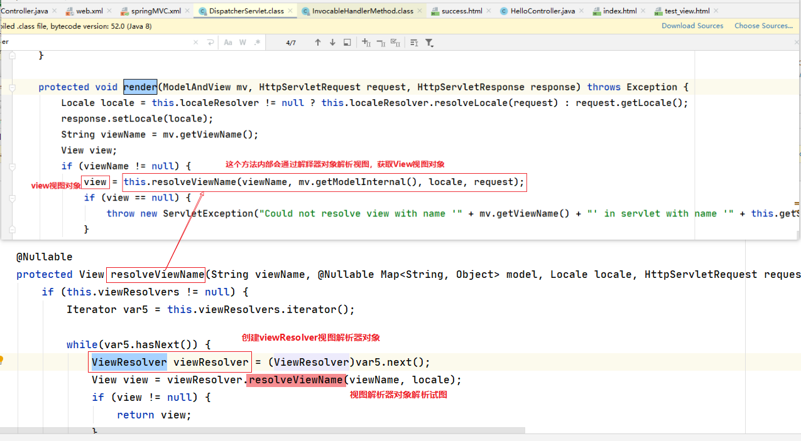

- 3.SpringMVC中的视图是View接口，视图的作用**渲染数据，将模型Model中的数据展示给用户**SpringMVC视图的种类很多，但是不论何种视图都实现了**View接口**，默认有==**转发视图InternalResourceView和重定向视图RedirectView**==

~~~java
public interface View {
    String RESPONSE_STATUS_ATTRIBUTE = View.class.getName() + ".responseStatus";
    String PATH_VARIABLES = View.class.getName() + ".pathVariables";
    String SELECTED_CONTENT_TYPE = View.class.getName() + ".selectedContentType";

    @Nullable
    default String getContentType() {
        return null;
    }
    // 这个方法用来渲染视图，呈现最终的展示效果
    void render(@Nullable Map<String, ?> var1, HttpServletRequest var2, HttpServletResponse var3) throws Exception;
}
~~~

当工程引入jstl的依赖，转发视图会自动转换为JstlView

若使用的视图技术为Thymeleaf，在SpringMVC的配置文件中配置了Thymeleaf的视图解析器，由此视图解析器解析之后所得到的是ThymeleafView

被哪种解析器解析，就会是哪种view。如“被Thymeleaf视图解析，则由此视图解析器解析之后所得到的是ThymeleafView”；

- 4.对于最终使用何种视图对象对模型进行渲染，处理器controller并不关心,处理器的工作重点聚焦在生产模型数据的工作中，从而实现MVC的充分解耦！

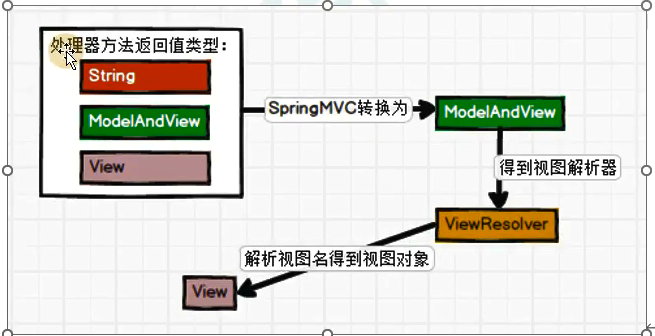


>- 视图解析器的作用比较单一：将逻辑视图解析为一个具体的视图
>- 所有的视图解析器都必须实现ViewResolver接口
>- 可以在SpringMVC上下文中配置一种或者多种解析器，每个解析器都实现了Ordered接口并且开放出一个order属性，**可以通过order属性指定解析器的优先顺序**，order越小优先级越高。
>- SpringMVC会按照视图解析器顺序的优先顺序对逻辑视图名进行解析，直到解析成功并且返回视图对象，否则将抛出ServletException异常。
>- JSP是最常见的视图技术，可以使用**InternalResourceViewResolver**作为视图解析器。

### 6.0  视图⭐

- 视图的作用是==渲染模型数据==，将模型中的数据以某种形式呈现给用户。
- 视图对象由==**视图解析器VIewResolver负责实例化**==，由于视图时是无状态的，所以他们不会有线程安全问题
- 为了实现模型数据和具体实现技术的解耦，Spring在org.springframework.web.servlet包中定义了一个高度抽象的View接口。

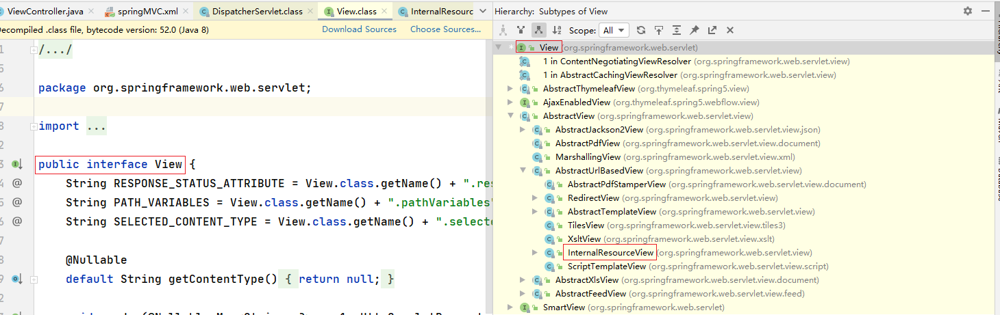

### 6.1 ThymeleafView

**当控制器方法中所设置的视图名称没有任何前缀时**(这里的前缀指的是forward：|redirect：)，此时的视图名称会被SpringMVC配置文件中所配置的视图解析器解析，==视图名称拼接视图前缀和视图后缀所得到的最终路径==，会通过**转发**的方式实现跳转.我们现在配置了Thymeleaf视图解析器！

如果控制器方法返回的字符串带**forward：/redirect：**前缀，SpringMVC会对他们进行特殊的处理，将forward：/redirect：当成指示符，其后的字符串作为URL处理

**入口controller**

~~~java
package com.atguigu.mvc.controller;

import org.springframework.stereotype.Controller;
import org.springframework.web.bind.annotation.RequestMapping;

@Controller
public class HelloController {
    @RequestMapping("/")
    public String methodMapping01(){
        return "index";
    }

    @RequestMapping("/test_view")
    public String testView(){
        return "test_view";
    }
}
~~~

**test_view.html**

~~~html
<!DOCTYPE html>
<html lang="en" xmlns:th="http://www.thymeleaf.org">
<head>
    <meta charset="UTF-8">
    <title>Title</title>
</head>
<body>
<a th:href="@{/testThymeleafView}">测试ThymeleafView</a>
</body>
</html>
~~~

**ViewController.java**

~~~java
package com.atguigu.mvc.controller;

import org.springframework.stereotype.Controller;
import org.springframework.web.bind.annotation.RequestMapping;

@Controller
public class ViewController {
    @RequestMapping("/testThymeleafView")
    public String testThymeleafView(){
       return "success";
    }
}
~~~

**success.html**

~~~html
<!DOCTYPE html>
<html lang="en" xmlns:th="http://www.thymeleaf.org">
<head>
    <meta charset="UTF-8">
    <title>Title</title>
</head>
<body>
 <h1>success!</h1><br>
</body>
</html>
~~~

### 6.2 转发视图⭐

SpringMVC中默认的转发视图是InternalResourceView

SpringMVC中创建转发视图的情况：

当控制器方法中所设置的视图名称以"forward:"为前缀时，创建InternalResourceView视图，此时的视图名称不会被SpringMVC配置文件中所配置的视图解析器解析，而是会将前缀"forward:"去掉，剩余部分作为最终路径通过转发的方式实现跳转

转发可以转发到一个页面，也可以转发给一个servlet

例如"forward:/"，"forward:/employee"

~~~java
package com.atguigu.mvc.controller;

import org.springframework.stereotype.Controller;
import org.springframework.web.bind.annotation.RequestMapping;

@Controller
public class ViewController {
    @RequestMapping("/testThymeleafView")
    public String testThymeleafView(){
       return "success";
    }


    @RequestMapping("/testForward")
    public String testForward(){

        return "forward:/testThymeleafView";
    }
}

~~~

### 6.3 重定向视图⭐

SpringMVC中默认的重定向视图是RedirectView

当控制器方法中所设置的视图名称以"redirect:"为前缀时，创建RedirectView视图，此时的视图名称不会被SpringMVC配置文件中所配置的视图解析器解析，而是会将前缀"redirect:"去掉，剩余部分作为最终路径通过重定向的方式实现跳转

例如"redirect:/"，"redirect:/employee"

**重定向的是一个请求而不是一个具体的页面**

~~~html
<!DOCTYPE html>
<html lang="en" xmlns:th="http://www.thymeleaf.org">
<head>
    <meta charset="UTF-8">
    <title>Title</title>
</head>
<body>
<a th:href="@{/testThymeleafView}">测试ThymeleafView</a>
<a th:href="@{/testForward}">测试InterResourceView</a>
<a th:href="@{/testRedirect}">测试RedirectView</a>
</body>
</html>
~~~

~~~java
package com.atguigu.mvc.controller;

import org.springframework.stereotype.Controller;
import org.springframework.web.bind.annotation.RequestMapping;

@Controller
public class ViewController {
    @RequestMapping("/testThymeleafView")
    public String testThymeleafView(){
       return "success";
    }


    @RequestMapping("/testRedirect")
    public String testRedirect(){
        return "redirect:/testThymeleafView";
    }
}

~~~

~~~html
<!DOCTYPE html>
<html lang="en" xmlns:th="http://www.thymeleaf.org">
<head>
    <meta charset="UTF-8">
    <title>Title</title>
</head>
<body>
 <h1>success!</h1><br>
</body>
</html>
~~~

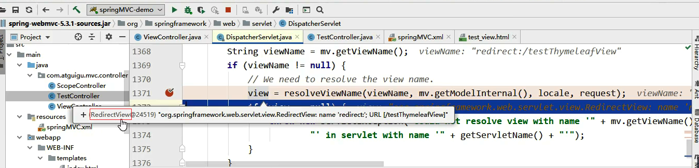

### 6.4 视图控制器mvc:view-controller标签⭐🐏

如果希望不经过处理器的方法直接响应SpringMVC渲染的视图，可以使用 mvc:view-controller标签来实现

在SpringMVC的配置文件中配置

~~~xml
 <!-- 
    配置不经过处理器方法直接到达响应页面
    path属性：配置访问的路径
    view name属性：设置视图名
    -->
    <mvc:view-controller path="/testView" view-name="success"></mvc:view-controller>
   <!--配置了以上标签以后会导致@RequestMapping注解失效，原来的方法都无法处理请求
    此时必须配置以下标签，而且我们开发也都会配置以下标签-->
   <!--开启MVC的注解驱动 -->
    <mvc:annotation-driven></mvc:annotation-driven>
~~~

>当SpringMVC中设置任何一个view-controller时，其他控制器中的请求映射将全部失效，此时需要在SpringMVC的核心配置文件中设置开启mvc注解驱动的标签：

## 7.RESTFul🌙

RESTFul是一种软件架构风格！

### 7.1 RestFul简介

REST：**Re**presentational **S**tate **T**ransfer，表现层资源状态转移。

##### a>资源

资源是一种看待服务器的方式，即，将服务器看作是由很多离散的资源组成。每个资源是服务器上一个可命名的抽象概念。因为资源是一个抽象的概念，所以它不仅仅能代表服务器文件系统中的一个文件、数据库中的一张表等等具体的东西，可以将资源设计的要多抽象有多抽象，只要想象力允许而且客户端应用开发者能够理解。与面向对象设计类似，资源是以名词为核心来组织的，首先关注的是名词。一个资源可以由一个或多个URI来标识。URI既是资源的名称，也是资源在Web上的地址。对某个资源感兴趣的客户端应用，可以通过资源的URI与其进行交互。

##### b>资源的表述

资源的表述是一段对于资源在某个特定时刻的状态的描述。可以在客户端-服务器端之间转移（交换）。资源的表述可以有多种格式，例如HTML/XML/JSON/纯文本/图片/视频/音频等等。资源的表述格式可以通过协商机制来确定。请求-响应方向的表述通常使用不同的格式。

##### c>状态转移

状态转移说的是：在客户端和服务器端之间转移（transfer）代表资源状态的表述。通过转移和操作资源的表述，来间接实现操作资源的目的。

### 7.2 RESTful的实现⭐

==主要是为了实现路径的统一，如果是操作同一种资源，则路径相同，但是通过不同的请求方式代表不同的操作方式==

具体说，就是 HTTP 协议里面，四个表示操作方式的动词：GET、POST、PUT、DELETE。

它们分别对应四种基本操作：==**GET 用来获取资源，POST 用来新建资源，PUT 用来(修改)更新资源，DELETE 用来删除资源。**==

**REST 风格提倡 URL 地址使用统一的风格设计，从前到后各个单词使用斜杠分开，不使用问号键值对方式携带请求参数，而是将要发送给服务器的数据作为 URL 地址的一部分，以保证整体风格的一致性**。

| 操作         | 传统方式         | REST风格                                                  |
| ------------ | ---------------- | --------------------------------------------------------- |
| 查询操作     | getUserById?id=1 | user/1-->==get请求方式==                                  |
| 新增保存操作 | saveUser         | user-->==post请求方式==之所以没有参数是因为参数在请求体中 |
| 删除操作     | deleteUser?id=1  | user/1-->==delete请求方式==                               |
| 更新操作     | updateUser       | user-->==put请求方式==                                    |

### 7.3 Restful模拟Get和POST

**SpringMVC配置文件**

~~~java
<?xml version="1.0" encoding="UTF-8"?>
<beans xmlns="http://www.springframework.org/schema/beans"
       xmlns:xsi="http://www.w3.org/2001/XMLSchema-instance"
       xmlns:context="http://www.springframework.org/schema/context"
       xmlns:mvc="http://www.springframework.org/schema/mvc"
       xsi:schemaLocation="http://www.springframework.org/schema/beans http://www.springframework.org/schema/beans/spring-beans.xsd http://www.springframework.org/schema/context https://www.springframework.org/schema/context/spring-context.xsd http://www.springframework.org/schema/mvc https://www.springframework.org/schema/mvc/spring-mvc.xsd">
    <!-- 开启注解包扫描的支持！ -->
    <context:component-scan base-package="com.atguigu.mvc.controller"></context:component-scan>
    <!-- 配置Thymeleaf视图解析器 -->
    <bean id="viewResolver" class="org.thymeleaf.spring5.view.ThymeleafViewResolver">
        <property name="order" value="1"/>
        <property name="characterEncoding" value="UTF-8"/>
        <property name="templateEngine">
            <bean class="org.thymeleaf.spring5.SpringTemplateEngine">
                <property name="templateResolver">
                    <bean class="org.thymeleaf.spring5.templateresolver.SpringResourceTemplateResolver">

                        <!-- 视图前缀 -->
                        <property name="prefix" value="/WEB-INF/templates/"/>

                        <!-- 视图后缀 -->
                        <property name="suffix" value=".html"/>
                        <property name="templateMode" value="HTML5"/>
                        <property name="characterEncoding" value="UTF-8" />
                    </bean>
                </property>
            </bean>
        </property>
    </bean>
    <mvc:view-controller path="/test_rest" view-name="test_rest"></mvc:view-controller>
    <mvc:annotation-driven></mvc:annotation-driven>
</beans>
~~~

**test_rest.html**

~~~html
<!DOCTYPE html>
<html lang="en"  xmlns:th="http://www.thymeleaf.org">
<head>
    <meta charset="UTF-8">
    <title>Title</title>
</head>
<body>
<!--超链接的请求方式就是GET -->
<a th:href="@{/user}">查询所有用户信息</a><br>
<!-- 对于RestFul风格来说，将参数以/的方式拼接到请求路径中-->
<a th:href="@{/user/1}">根据ID查询用户信息</a><br>
<form th:action="@{/user}" method="post">
    用户名： <input type="text" name="username"><br>
    密码： <input type="password" name="password"><br>
    <input type="submit" value="添加"><br>
</form>
</body>
</html>
~~~

**控制器方法**

~~~java
package com.atguigu.mvc.controller;

import org.springframework.stereotype.Controller;
import org.springframework.web.bind.annotation.RequestMapping;
import org.springframework.web.bind.annotation.RequestMethod;

@Controller
public class UserController {
    /**
     * 使用Restful模拟用户的增删改查
     * /user     GET 查询所有用户信息
     * /user/1   GET 根据用户id查询用户信息
     * /user     POST 添加用户信息
     * /user/1   DELETE 根据用户id删除用户信息
     * /user     PUT   修改用户信息
     */

    @RequestMapping(value="/user",method= RequestMethod.GET)
    public String getAllUser(){
        System.out.println("查询所有用户信息");
        return "success";
    }

    @RequestMapping(value="/user/{id}",method=RequestMethod.GET)
    public String getUserById(){
        System.out.println("根据用户ID查询用户信息");
        return "success";
    }

    @RequestMapping(value = "/user" ,method = RequestMethod.POST)
    public String insertUser(String username,String password){
        System.out.println("添加用户信息："+username+","+password);
        return "success";
    }

}
~~~

### 7.4 HiddenHttpMethodFilter⭐

我们可以通过Ajax发送PUT或者DELETE请求，但是并不是所有浏览器都支持这两种请求方式！

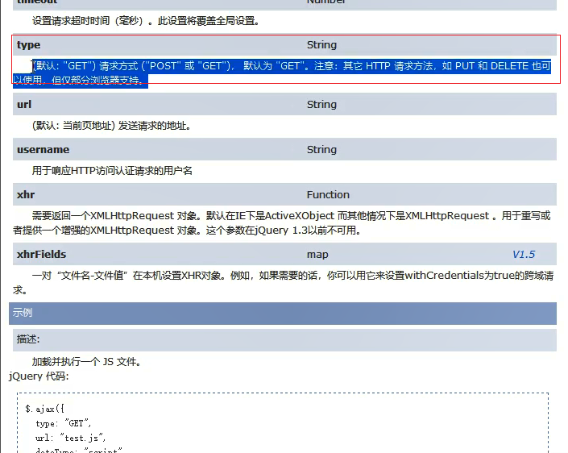

我们在Form表单中写PUT或者DELETE，也会转变成GET请求！

由于浏览器只支持发送get和post方式的请求，那么该如何发送put和delete请求呢？

==SpringMVC 提供了 **HiddenHttpMethodFilter** 帮助我们**将 POST 请求转换为 DELETE 或 PUT 请求**==

~~~java
public class HiddenHttpMethodFilter extends OncePerRequestFilter {
    private static final List<String> ALLOWED_METHODS;
    public static final String DEFAULT_METHOD_PARAM = "_method";
    private String methodParam = "_method";
    
    static {
        ALLOWED_METHODS = Collections.unmodifiableList(Arrays.asList(HttpMethod.PUT.name(), HttpMethod.DELETE.name(), HttpMethod.PATCH.name()));
    }
    
    // 过滤器放行请求的方法
    protected void doFilterInternal(HttpServletRequest request, HttpServletResponse response, FilterChain filterChain) throws ServletException, IOException {
        HttpServletRequest requestToUse = request;
        // 1.首先必须是POST请求！
        if ("POST".equals(request.getMethod()) && request.getAttribute("javax.servlet.error.exception") == null) {
            // 2.获取_method参数名对应的参数值！
            String paramValue = request.getParameter(this.methodParam);
            if (StringUtils.hasLength(paramValue)) {
                String method = paramValue.toUpperCase(Locale.ENGLISH);
                if (ALLOWED_METHODS.contains(method)) {
                    // 3.如果参数值是PUT\DELETE\PATCH之中的一个，则给requestToUse重新赋值，而这个值会给到最终的doFilter方法中去！
                    requestToUse = new HiddenHttpMethodFilter.HttpMethodRequestWrapper(request, method);
                }
            }
        }

        filterChain.doFilter((ServletRequest)requestToUse, response);
    }

}  
~~~

**通过上面的源码我们可以知道HiddenHttpMethodFilter** 处理put和delete请求的条件：

- ==a>当前请求的请求方式必须为post==

- ==b>当前请求必须传输请求参数_method==，我们为了满足restful规范，**传递PUT或者DELETE**

满足以上条件，**HiddenHttpMethodFilter** 过滤器就会将当前请求的请求方式转换为请求参数_method的值，因此请求参数\_method的值才是最终的请求方式

**模拟发送PUT请求的页面**

~~~html
<!DOCTYPE html>
<html lang="en"  xmlns:th="http://www.thymeleaf.org">
<head>
    <meta charset="UTF-8">
    <title>Title</title>
</head>
<body>
<!--超链接的请求方式就是GET -->
<a th:href="@{/user}">查询所有用户信息</a><br>
<!-- 对于RestFul风格来说，将参数以/的方式拼接到请求路径中-->
<a th:href="@{/user/1}">根据ID查询用户信息</a><br>
<form th:action="@{/user}" method="post">
    用户名： <input type="text" name="username"><br>
    密码： <input type="password" name="password"><br>
    <input type="submit" value="添加"><br>
</form>

<!-- 发送PUT请求的SPringMVC方式-->
<form th:action="@{/user}" method="post">i
    <input type="hidden" name="_method" value="PUT">
    用户名： <input type="text" name="username"><br>
    密码： <input type="password" name="password"><br>
    <input type="submit" value="修改"><br>
</form>

</body>
</html>
~~~

~~~java
@RequestMapping(value="/user",method=RequestMethod.PUT)
    public String updateUser(){
        System.out.println("修改用户信息");
        return "success";
    }
~~~

==**我们需要在web.xml中配置这个过滤器**==到此为止，web.xml中需要==配置方法过滤器HiddenHttpMethodFilter，编码过滤器：CharacterEncodingFilter以及前端控制器DispatcherServlet==三个组件！！！！

>注：
>
>目前为止，SpringMVC中提供了两个过滤器：CharacterEncodingFilter和HiddenHttpMethodFilter
>
>在web.xml中注册时，必须先注册CharacterEncodingFilter，再注册HiddenHttpMethodFilter
>
>原因：
>
>- 在 CharacterEncodingFilter 中通过 request.setCharacterEncoding(encoding) 方法设置字符集的
>
>- request.setCharacterEncoding(encoding) 方法要求前面不能有任何获取请求参数的操作
>
>- 而 HiddenHttpMethodFilter 恰恰有一个获取请求方式的操作：
>
>  ~~~java
>  String paramValue = request.getParameter(this.methodParam);
>  ~~~
>
>  

==**两个过滤器，一个前端控制器是标配！**==

## 8.RestFul案例

### 8.1 环境搭建

**web.xml**

~~~xml
<?xml version="1.0" encoding="UTF-8"?>
<web-app xmlns="http://xmlns.jcp.org/xml/ns/javaee"
         xmlns:xsi="http://www.w3.org/2001/XMLSchema-instance"
         xsi:schemaLocation="http://xmlns.jcp.org/xml/ns/javaee http://xmlns.jcp.org/xml/ns/javaee/web-app_4_0.xsd"
         version="4.0">
   <!--配置处理post请求乱码的过滤器  start-->
  <filter>
      <filter-name>CharacterEncodingFilter</filter-name>
      <filter-class>org.springframework.web.filter.CharacterEncodingFilter</filter-class>
      <!--
       设置处理请求编码
         需要encoding的属性值
       -->
      <init-param>
          <param-name>encoding</param-name>
          <param-value>utf-8</param-value>
      </init-param>
      <!--
       设置响应编码
         需要forceResponseEncoding属性为true
       -->
      <init-param>
          <param-name>forceResponseEncoding</param-name>
          <param-value>true</param-value>
      </init-param>
  </filter>
    <filter-mapping>
        <filter-name>CharacterEncodingFilter</filter-name>
        <!-- /*代表处理所有请求-->
        <url-pattern>/*</url-pattern>
    </filter-mapping>
    <!--配置处理post请求乱码的过滤器  start-->
    
    <!--配置HiddenHttpMethodFilter  start-->
    <filter>
        <filter-name>HiddenHttpMethodFilter</filter-name>
        <filter-class>org.springframework.web.filter.HiddenHttpMethodFilter</filter-class>
    </filter>
    <filter-mapping>
        <filter-name>HiddenHttpMethodFilter</filter-name>
        <url-pattern>/*</url-pattern>
    </filter-mapping>
    <!--配置HiddenHttpMethodFilter  end-->
    
   <!-- 配置SpringMVC的前端控制器，对浏览器发送的请求统一进行处理：注册DispatcherServlet -->
    <servlet>
        <servlet-name>springMVC</servlet-name>
        <servlet-class>org.springframework.web.servlet.DispatcherServlet</servlet-class>
        <!-- 通过初始化参数指定SpringMVC配置文件的位置和名称 -->
        <init-param>
            <!-- contextConfigLocation为固定值 -->
            <param-name>contextConfigLocation</param-name>
            <!-- 使用classpath:表示从类路径查找配置文件，例如maven工程中的src/main/resources -->
            <param-value>classpath:springMVC.xml</param-value>
        </init-param>
        <!--
             作为框架的核心组件，在启动过程中有大量的初始化操作要做
            而这些操作放在第一次请求时才执行会严重影响访问速度
            因此需要通过此标签将启动控制DispatcherServlet的初始化时间提前到服务器启动时
        -->
        <load-on-startup>1</load-on-startup>
    </servlet>
    <servlet-mapping>
        <servlet-name>springMVC</servlet-name>
        <!--
            设置springMVC的核心控制器所能处理的请求的请求路径
            /所匹配的请求可以是/login或.html或.js或.css方式的请求路径
            但是/不能匹配.jsp请求路径的请求
        -->
        <url-pattern>/</url-pattern>
    </servlet-mapping>
</web-app>
~~~

**springmvc.xml**

~~~xml
<?xml version="1.0" encoding="UTF-8"?>
<beans xmlns="http://www.springframework.org/schema/beans"
       xmlns:xsi="http://www.w3.org/2001/XMLSchema-instance"
       xmlns:context="http://www.springframework.org/schema/context"
       xmlns:mvc="http://www.springframework.org/schema/mvc"
       xsi:schemaLocation="http://www.springframework.org/schema/beans http://www.springframework.org/schema/beans/spring-beans.xsd http://www.springframework.org/schema/context https://www.springframework.org/schema/context/spring-context.xsd http://www.springframework.org/schema/mvc https://www.springframework.org/schema/mvc/spring-mvc.xsd">
    <!-- 开启注解包扫描的支持！ -->
    <context:component-scan base-package="com.atguigu.mvc"></context:component-scan>
    <!-- 配置Thymeleaf视图解析器 -->
    <bean id="viewResolver" class="org.thymeleaf.spring5.view.ThymeleafViewResolver">
        <property name="order" value="1"/>
        <property name="characterEncoding" value="UTF-8"/>
        <property name="templateEngine">
            <bean class="org.thymeleaf.spring5.SpringTemplateEngine">
                <property name="templateResolver">
                    <bean class="org.thymeleaf.spring5.templateresolver.SpringResourceTemplateResolver">

                        <!-- 视图前缀 -->
                        <property name="prefix" value="/WEB-INF/templates/"/>

                        <!-- 视图后缀 -->
                        <property name="suffix" value=".html"/>
                        <property name="templateMode" value="HTML5"/>
                        <property name="characterEncoding" value="UTF-8" />
                    </bean>
                </property>
            </bean>
        </property>
    </bean>
    
    <!-- 设置首页的视图控制器-->
    <mvc:view-controller path="/" view-name="index"></mvc:view-controller>
    <!-- 防止视图解析器失效注解，故需开启mvc的注解驱动-->
    <mvc:annotation-driven></mvc:annotation-driven>
</beans>
~~~

在原来的环境搭建的基础上，模拟dao层和bean层

**新建一个实体类bean**

~~~java
package com.atguigu.mvc.bean;

public class Employee {

    private Integer id;
    private String lastName;

    private String email;
    //1 male, 0 female
    private Integer gender;

    public Integer getId() {
        return id;
    }

    public void setId(Integer id) {
        this.id = id;
    }

    public String getLastName() {
        return lastName;
    }

    public void setLastName(String lastName) {
        this.lastName = lastName;
    }

    public String getEmail() {
        return email;
    }

    public void setEmail(String email) {
        this.email = email;
    }

    public Integer getGender() {
        return gender;
    }

    public void setGender(Integer gender) {
        this.gender = gender;
    }

    public Employee(Integer id, String lastName, String email, Integer gender) {
        super();
        this.id = id;
        this.lastName = lastName;
        this.email = email;
        this.gender = gender;
    }

    public Employee() {
    }
}

~~~

**新建一个Dao**

~~~java
package com.atguigu.mvc.dao;

import com.atguigu.mvc.bean.Employee;
import org.springframework.stereotype.Repository;

import java.util.Collection;
import java.util.HashMap;
import java.util.Map;

@Repository
public class EmployeeDao {
    private static Map<Integer, Employee> employees = null;

    static{
        employees = new HashMap<Integer, Employee>();
        // 员工ID作为键，员工对象作为值
        employees.put(1001, new Employee(1001, "E-AA", "aa@163.com", 1));
        employees.put(1002, new Employee(1002, "E-BB", "bb@163.com", 1));
        employees.put(1003, new Employee(1003, "E-CC", "cc@163.com", 0));
        employees.put(1004, new Employee(1004, "E-DD", "dd@163.com", 0));
        employees.put(1005, new Employee(1005, "E-EE", "ee@163.com", 1));
    }

    private static Integer initId = 1006;

    // 这个方法既可以新增，也可以修改
    public void save(Employee employee){
        if(employee.getId() == null){
            // ++ 在后，先赋值，再递增！
            employee.setId(initId++);
        }
        employees.put(employee.getId(), employee);
    }

    // 获取所有的员工信息
    public Collection<Employee> getAll(){
        return employees.values();
    }

    // 根据员工id获取员工信息
    public Employee get(Integer id){
        return employees.get(id);
    }

    // 删除员工信息
    public void delete(Integer id){
        employees.remove(id);
    }
}


~~~

**在Controller中注入DAO**

~~~java
package com.atguigu.mvc.controller;

import com.atguigu.mvc.dao.EmployeeDao;
import org.springframework.beans.factory.annotation.Autowired;
import org.springframework.stereotype.Controller;

@Controller
public class EmployeeController {
    @Autowired
    private EmployeeDao employeeDao;
}
~~~

### 8.2 获取所有员工信息

**请求页面index.html**

~~~html
<!DOCTYPE html>
<html lang="en"  xmlns:th="http://www.thymeleaf.org">
<head>
    <meta charset="UTF-8">
    <title>Title</title>
</head>
<body>
<h1>欢迎欢迎，热烈欢迎！！！！</h1>
<a th:href="@{/employee}">查看员工信息</a>
</body>
</html>
~~~

**处理器方法**

~~~java
package com.atguigu.mvc.controller;

import com.atguigu.mvc.bean.Employee;
import com.atguigu.mvc.dao.EmployeeDao;
import org.springframework.beans.factory.annotation.Autowired;
import org.springframework.stereotype.Controller;
import org.springframework.ui.Model;
import org.springframework.web.bind.annotation.GetMapping;
import org.springframework.web.bind.annotation.RequestMapping;

import java.util.Collection;

@Controller
public class EmployeeController {
    @Autowired
    private EmployeeDao employeeDao;

    @GetMapping("/employee")
    // 获取所有的员工信息
    public String getAllEmployee(Model model){
        Collection<Employee> employeeList = employeeDao.getAll();
        model.addAttribute("employeeList",employeeList);
        return "employee_list" ;
    }
}

~~~

**返回页面employee_list.html**

~~~html
<!DOCTYPE html>
<html lang="en" xmlns:th="http://www.thymeleaf.org">
<head>
    <meta charset="UTF-8">
    <title>employeeInfo</title>
</head>
<body>
    <table border="1" cellspacing="0" cellpadding="0" style="text-align: center">
        <tr>
            <th colspan="5">Employee Info</th>
        </tr>
        <tr>
            <th>id</th>
            <th>lastName</th>
            <th>email</th>
            <th>gender</th>
            <th>options</th>
        </tr>
        <tr th:each="employee : ${employeeList}">
            <td th:text="${employee.id}"></td>
            <td th:text="${employee.lastName}"></td>
            <td th:text="${employee.email}"></td>
            <td th:text="${employee.gender}"></td>
            <td>
                <a href="">delete</a>
                <a href="">update</a>
            </td>
        </tr>
    </table>
</body>
</html>
~~~

### 8.3 删除表格中的员工信息

**发送删除请求的页面**

~~~html
<!DOCTYPE html>
<html lang="en" xmlns:th="http://www.thymeleaf.org">
<head>
    <meta charset="UTF-8">
    <title>employeeInfo</title>
</head>
<body>
    <table id="dataTable" border="1" cellspacing="0" cellpadding="0" style="text-align: center">
        <tr>
            <th colspan="5">Employee Info</th>
        </tr>
        <tr>
            <th>id</th>
            <th>lastName</th>
            <th>email</th>
            <th>gender</th>
            <th>options</th>
        </tr>
        <tr th:each="employee : ${employeeList}">
            <td th:text="${employee.id}"></td>
            <td th:text="${employee.lastName}"></td>
            <td th:text="${employee.email}"></td>
            <td th:text="${employee.gender}"></td>
            <td>
                <a @click="deleteEmployee" th:href="@{/employee/}+${employee.id}">delete</a>
                <a href="">update</a>
            </td>
        </tr>
    </table>
    
   <!-- 创建处理delete请求方式的表单-->
    <!-- 作用：通过超链接控制表单的提交，将post请求转换为delete请求 -->
    <form id="deleteForm" method="post">
         <!-- HiddenHttpMethodFilter要求：必须传输_method请求参数，并且值为最终的请求方式 -->
        <input type="hidden" name="_method" value="delete">
    </form>
    
    <!--引入vue.js-->
    <script type="text/javascript" th:src="@{/static/vue.js}"></script>
    <script type="text/javascript">
        var vue = new Vue({
            el:"#dataTable",
            methods:{
                //event表示当前事件
                deleteEmployee:function(event){
                    // 根据ID获取表单元素
                    var deleteForm =   document.getElementById("deleteForm");
                    // 将触发点击事件的超链接href属性赋值给表单的action
                    deleteForm.action = event.target.href;
                    // 提交表单
                    deleteForm.submit();
                    //阻止超链接的默认跳转行为
                    event.preventDefault();
                }
            }
        });
    </script>
</body>
</html>
~~~

**执行删除的控制器方法**

~~~java
package com.atguigu.mvc.controller;

import com.atguigu.mvc.bean.Employee;
import com.atguigu.mvc.dao.EmployeeDao;
import org.springframework.beans.factory.annotation.Autowired;
import org.springframework.stereotype.Controller;
import org.springframework.ui.Model;
import org.springframework.web.bind.annotation.DeleteMapping;
import org.springframework.web.bind.annotation.GetMapping;
import org.springframework.web.bind.annotation.PathVariable;
import org.springframework.web.bind.annotation.RequestMapping;

import java.util.Collection;

@Controller
public class EmployeeController {
    @Autowired
    private EmployeeDao employeeDao;

    @GetMapping("/employee")
    // 获取所有的员工信息
    public String getAllEmployee(Model model){
        Collection<Employee> employeeList = employeeDao.getAll();
        model.addAttribute("employeeList",employeeList);
        return "employee_list" ;
    }

   @DeleteMapping("/employee/{id}")
    // 删除员工信息
    public String deleteEmployee(@PathVariable("id") Integer id){
        employeeDao.delete(id);
        //删除完成，重定向到指定的查看页面
        return "redirect:/employee";
    }
}
~~~

#### 如何处理静态资源访问问题⭐

我们发现thymeleaf视图解析器在底层可以解析跳转到指定的WEB-INF下的静态html目录，但是我们通过转发视图InternalResourceView无法转发到指定的html等静态资源。上述的删除案例引入了vue.js,但是我们发现在前端会有访问不到vus.js的404出现，这是由于==静态资源是不能被spring MVC解析访问呢成功的==，thymeleaf视图解析器是由于可以解析html视图底层才可以访问到静态html资源文件。

当我们将web应用部署到tomcat服务器上，服务器是先加载全局的`web.xml`，即`"D:\work_folder\java_studying\java_tools\apache-tomcat-9.0.12\conf\web.xml"`这是tomcat自带的web.xml文件，然后才会加载我们自己web项目中的`web.xml`，当我们加`url-pattern`配置成`/`会覆盖掉全局web.xml中对于静态资源的处理，具体可以参考全局web.xml中：

~~~xml
    <servlet>
        <servlet-name>default</servlet-name>
        <servlet-class>org.apache.catalina.servlets.DefaultServlet</servlet-class>
        <init-param>
            <param-name>debug</param-name>
            <param-value>0</param-value>
        </init-param>
        <init-param>
            <param-name>listings</param-name>
            <param-value>false</param-value>
        </init-param>
        <load-on-startup>1</load-on-startup>
    </servlet>


    <!-- The mapping for the default servlet -->
    <servlet-mapping>
        <servlet-name>default</servlet-name>
        <url-pattern>/</url-pattern>
    </servlet-mapping>
~~~

 这就是默认的servlet。**DefaultServlet（==专门用来处理静态资源的请求的==）**，发现与我们配置的url-pattern一样了，导致静态资源也被我们自定义的dispatcherServlet所拦截，那这个类就会去找controller里面的映射了，从而导致**DefaultServlet**这个servlet作用失效。比如我们访问`http://localhost:8080/springmvc/img.png`，显然是Controller里面是没有这个映射路径的。 

为了使项目中的静态资源可以被访问到，我们需要在springMVC的配置文件中加入一行配置,这样请求会先经过SPRINGMVC的处理，SpringMVC找不到会继续被默认的Servelt处理，而不会在SpringMVC找不到就直接报404！！！！

~~~xml
<!--开放对静态资源的访问！ -->
<mvc:default-servlet-handler/>
<!--配置了静态资源以后也必须配置以下标签，否则所有请求都会被默认的Servlet处理，只有也配置这个标签，才会先被DispatcherServlet处理，处理不了再交给DefaultServlet处理 -->
<mvc:annotation-driven></mvc:annotation-driven>
~~~

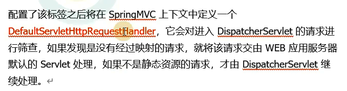

## 9.HttpMessageConverter与SpringMVC的响应数据⭐

==HttpMessageConverter==：报文信息转换器，主要是对报文信息进行处理。

**将请求报文转换为Java对象，或将Java对象转换为响应报文**

HttpMessageConverter提供了两个注解和两个类型：==**@RequestBody，@ResponseBody，RequestEntity，ResponseEntity**==

@RequestBody：请求报文中的请求体转换为Java对象

@ResponseBody：将java对象转化为响应体

RequestEntity：可以接受这个请求报文，而不单单是请求体

ResponseEntity：将这个对象转化为响应报文

### 9.1 @RequestBody⭐ 标识形参

这个提供了获取请求参数的另一种方式！用来==封装请求体==

>@RequestBody可以获取请求体，需要在控制器方法设置一个形参，使用@RequestBody进行标识，当前请求的请求体就会为当前注解所标识的形参赋值

**请求页面**

~~~java
<!DOCTYPE html>
<html lang="en"  xmlns:th="http://www.thymeleaf.org">
<head>
    <meta charset="UTF-8">
    <title>Title</title>
</head>
<body>
<h1>欢迎欢迎，热烈欢迎！！！！</h1>
<form th:action="@{/testRequestBody}" method="post">
    <input type="text" name="username">
    <input type="password" name="password">
    <input type="submit" value="测试@RequestBody">
</form>
</body>
</html>
~~~

**处理器方法**

~~~java
package com.atguigu.mvc.controller;

import org.springframework.stereotype.Controller;
import org.springframework.web.bind.annotation.PostMapping;
import org.springframework.web.bind.annotation.RequestBody;

@Controller
public class HttpController {
    @PostMapping("/testRequestBody")
    public String testRequestBody(@RequestBody String requestBody){
        System.out.println(requestBody);
        return "success";
    }
}

~~~

### 9.2 RequestEntity⭐作为形参

RequestEntity封装请求报文的一种类型，需要在控制器方法的形参中设置该类型的形参，当前请求的请求报文就会赋值给该形参，可以通过getHeaders()获取请求头信息，通过getBody()获取请求体信息

**这个对象封装的是整个请求报文，包括请求头，请求行！！！**

~~~java
package com.atguigu.mvc.controller;

import org.springframework.http.RequestEntity;
import org.springframework.stereotype.Controller;
import org.springframework.web.bind.annotation.PostMapping;
import org.springframework.web.bind.annotation.RequestBody;

@Controller
public class HttpController {
    @PostMapping("/testRequestBody")
    // 加上泛型代表以什么方式获取请求报文
    public String testRequestBody(RequestEntity<String> requestEntity){
        // 当前requestEntity代表整个请求报文信息
        System.out.println(requestEntity.getHeaders());
        System.out.println(requestEntity.getBody());
        return "success";
    }
}
~~~

输出信息：

[host:"localhost:8080", connection:"keep-alive", content-length:"33", cache-control:"max-age=0", sec-ch-ua:"" Not A;Brand";v="99", "Chromium";v="96", "Google Chrome";v="96"", sec-ch-ua-mobile:"?0", sec-ch-ua-platform:""Windows"", upgrade-insecure-requests:"1", origin:"http://localhost:8080", user-agent:"Mozilla/5.0 (Windows NT 10.0; Win64; x64) AppleWebKit/537.36 (KHTML, like Gecko) Chrome/96.0.4664.45 Safari/537.36", accept:"text/html,application/xhtml+xml,application/xml;q=0.9,image/avif,image/webp,image/apng,*/*;q=0.8,application/signed-exchange;v=b3;q=0.9", sec-fetch-site:"same-origin", sec-fetch-mode:"navigate", sec-fetch-user:"?1", sec-fetch-dest:"document", referer:"http://localhost:8080/SpringMVC/", accept-encoding:"gzip, deflate, br", accept-language:"zh-CN,zh;q=0.9", cookie:"Idea-773c1b2d=c98c533e-01e8-4355-93e1-ba6996a2ba64", Content-Type:"application/x-www-form-urlencoded;charset=UTF-8"]

username=admin&password=000000als

### 9.3 @ResponseBody🌙⭐🐂标识控制器方法

用来直接向浏览器响应数据！！！！

我们前面都是通过控制器方法返回字符串来实现页面跳转，但是我们也可以不需要页面跳转，此时我们让控制器方法返回值类型为void，或者return null。这样就不会出现出现转发或者重定向的情况。

我们还可以用==@ResponseBody来向原请求页面直接返回响应数据==，此时也不会发生请求到其他页面！！！！

**==@ResponseBody用于标识一个控制器方法，可以将该方法的返回值直接作为响应报文的响应体响应到浏览器==**，类似于Response.getWriter().write().

~~~java
 @RequestMapping("/testResponseBody")
    @ResponseBody
    /**
     * @ResponseBody:用来标记方法，被标记的方法的方法值不再被解析成视图名称，而将返回值变成响应数据的响应体！
     */
    public String testResponseBody(){
        return "success";
    }
~~~

#### 9.3.1 SpringMVC处理JSON

我们刚才是往浏览器返回了一个String，但是如果我们往浏览器返回一个对象，则如下所示：

~~~java
 @RequestMapping("/testResponseUser")
    @ResponseBody
    public User testResponseUser(){
        return new User(1001,"admin","123456",23,"男");
    }
~~~

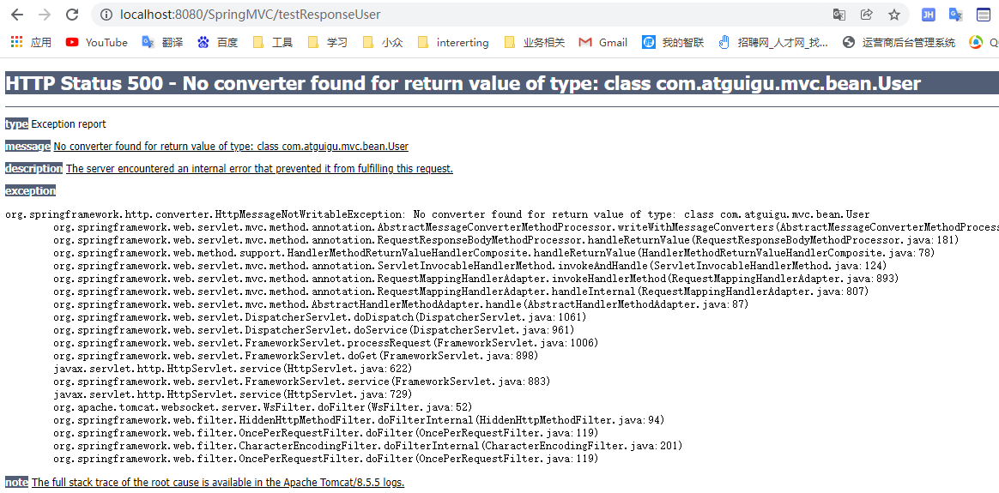

这是由于浏览器无法解析我们返回的除了字符串外的java对象，为此，我们需要用到统一数据交互格式，==json==.

为了让SpringMVC可以处理JSON，我们要导入相关的jar包依赖

a>==导入jackson的依赖==

```xml
<dependency>
    <groupId>com.fasterxml.jackson.core</groupId>
    <artifactId>jackson-databind</artifactId>
    <version>2.12.1</version>
</dependency>
```

b>==在SpringMVC的核心配置文件中开启mvc的注解驱动==，此时在HandlerAdaptor中会自动装配一个消息转换器：MappingJackson2HttpMessageConverter，可以将响应到浏览器的Java对象转换为Json格式的字符串

```
<mvc:annotation-driven />
```

c>在处理器方法上使用==**@ResponseBody**==注解进行标识

d>将==Java对象直接作为控制器方法的返回值返回==，就会自动转换为Json格式的**字符串**

```java
@RequestMapping("/testResponseUser")
@ResponseBody
public User testResponseUser(){
    return new User(1001,"admin","123456",23,"男");
}
```

浏览器的页面中展示的结果：

{"id":1001,"username":"admin","password":"123456","age":23,"sex":"男"}

#### 9.3.2 SpringMVC处理Ajax

这个案例通过Vue和Axios来实现，我们需要在WEB-INF下面创建一个个static文件夹，导入==vue.js和axios.js==这两个文件！！！！

~~~html
<!DOCTYPE html>
<html lang="en"  xmlns:th="http://www.thymeleaf.org">
<head>
    <meta charset="UTF-8">
    <title>Title</title>
</head>
<body>
<h1>欢迎欢迎，热烈欢迎！！！！</h1>
<dic id="app">
    <a @click="testAxios" th:href="@{/testAxios}">SpringMVC来处理Ajax</a>
</dic>
<script type="text/javascript" src="/static/vue.js"></script>
<script type="text/javascript" src="/static/axios-0.18.0.js"></script>
<script>
    new Vue({
        el:"#app",
        method:{
            testAxios:function (event) {
                axios({
                    method:"post",
                    url:event.target.href,
                    params:{
                        username:"admin",
                        passowrd:"123456"
                    }
                }).then(function(response){
                    alert(response.data);
                });
                event.preventDefault();
            }
        }
    })
</script>
</body>
</html>
~~~

~~~java
    @RequestMapping("testAxios")
    @ResponseBody
    public String testAxios(String username ,String password){
        System.out.println("username:"+username+",password:"+password);
        return "hello,axios";
    }
~~~

### 9.4 @RestController注解⭐🌙🐏标识类

@RestController注解是springMVC提供的一个==复合注解==，标识在控制器的类上，就相当于==**为类添加了@Controller注解，并且为其中的每个方法添加了@ResponseBody注解**==

相当于标记的控制层组件的每个方法都加上了@ResponseBody注解！！！！

### 9.5 ResponseEntity

ResponseEntity用于==控制器方法的返回值类型==，该控制器方法的返回值就是响应到浏览器的响应报文

## 10.文件上传与下载⭐

###  10.1 ResponseEntity实现文件下载🐂

~~~java
package com.atguigu.mvc.controller;

import org.springframework.http.HttpHeaders;
import org.springframework.http.HttpStatus;
import org.springframework.http.ResponseEntity;
import org.springframework.stereotype.Controller;
import org.springframework.util.MultiValueMap;
import org.springframework.web.bind.annotation.RequestMapping;

import javax.servlet.ServletContext;
import javax.servlet.http.HttpSession;
import java.io.FileInputStream;
import java.io.IOException;
import java.io.InputStream;

@Controller
public class FileUpAndDownController {

    @RequestMapping("/testDown")
    // ResponseEntity作为控制器方法的返回值类型，就是作为响应到浏览器的响应报文
    public ResponseEntity<byte[]> testResponseEntity(HttpSession session) throws IOException {
        //获取ServletContext对象，表示当前的整个工程
        ServletContext servletContext = session.getServletContext();
        //获取服务器中文件的真实路径  getRealPath（）：获取服务器的部署路径
        String realPath = servletContext.getRealPath("/static/img/1.jpeg");
        System.out.println(realPath);
        //创建输入流
        InputStream is = new FileInputStream(realPath);
        //创建字节数组  is.available()：获取输入流对应的文件的所有字节数
        byte[] bytes = new byte[is.available()];
        //将流读到字节数组中
        is.read(bytes);
        //创建HttpHeaders对象设置响应头信息
        MultiValueMap<String, String> headers = new HttpHeaders();
        //设置要下载方式以及下载文件的名字，其中attachment代表以附件的形式下载文件；filename：设置文件的默认名
        headers.add("Content-Disposition", "attachment;filename=1.jpeg");
        //设置响应状态码
        HttpStatus statusCode = HttpStatus.OK;
        //创建ResponseEntity对象，三个参数：响应体，响应头，响应状态码
        ResponseEntity<byte[]> responseEntity = new ResponseEntity<>(bytes, headers, statusCode);
        //关闭输入流
        is.close();
        return responseEntity;
    }
}
~~~

### 10.2 文件上传🐏

#### 10.2.1 分析前提⭐

文件上传要求form表单的请求方式必须为post，并且添加属性enctype="multipart/form-data"

a>添加依赖：

==上传文件必须添加这个依赖，不管是web原生上传还是SpringMVC上传，都必须有这个jar！！！==

```xml
<!-- https://mvnrepository.com/artifact/commons-fileupload/commons-fileupload -->
<dependency>
    <groupId>commons-fileupload</groupId>
    <artifactId>commons-fileupload</artifactId>
    <version>1.3.1</version>
</dependency>
```

SpringMVc中将上传的文件封装成一个MultipartFile对象，我们需要在形参上声明这个类型的变量。同时但上传的文件不能直接转换为这个对象，我们还需要在SpringMVC的配置文件中进行配置，==**只有配置了文件上传解析器，才会将我们上传的文件变成一个MultipartFile对象**==

b>配置文件上传解析器

~~~xml
 <!--配置文件上传解析器，将上传的文件封装为MultipartFile
         必须给文件上传解析器配置id，id必须叫multipartResolver
         -->
<bean id="multipartResolver" class="org.springframework.web.multipart.commons.CommonsMultipartResolver"></bean>
~~~

c>控制器方法：

控制器方法的形参必须要有MultipartFile类型的参数

~~~java
@RequestMapping("/testUp")
    public String testUp(MultipartFile photo){
        System.out.println(photo.getName());// 获取表单元素的name属性值
        System.out.println(photo.getOriginalFilename());// 获取上传的文件的名称
        return "success";
    }
~~~

#### 10.2.2 **具体实现**⭐🌙

**配置文件**

~~~xml
<?xml version="1.0" encoding="UTF-8"?>
<beans xmlns="http://www.springframework.org/schema/beans"
       xmlns:xsi="http://www.w3.org/2001/XMLSchema-instance"
       xmlns:context="http://www.springframework.org/schema/context"
       xmlns:mvc="http://www.springframework.org/schema/mvc"
       xsi:schemaLocation="http://www.springframework.org/schema/beans http://www.springframework.org/schema/beans/spring-beans.xsd http://www.springframework.org/schema/context https://www.springframework.org/schema/context/spring-context.xsd http://www.springframework.org/schema/mvc https://www.springframework.org/schema/mvc/spring-mvc.xsd">
    <!-- 开启注解包扫描的支持！ -->
    <context:component-scan base-package="com.atguigu.mvc"></context:component-scan>
    <!-- 配置Thymeleaf视图解析器 -->
    <bean id="viewResolver" class="org.thymeleaf.spring5.view.ThymeleafViewResolver">
        <property name="order" value="1"/>
        <property name="characterEncoding" value="UTF-8"/>
        <property name="templateEngine">
            <bean class="org.thymeleaf.spring5.SpringTemplateEngine">
                <property name="templateResolver">
                    <bean class="org.thymeleaf.spring5.templateresolver.SpringResourceTemplateResolver">

                        <!-- 视图前缀 -->
                        <property name="prefix" value="/WEB-INF/templates/"/>

                        <!-- 视图后缀 -->
                        <property name="suffix" value=".html"/>
                        <property name="templateMode" value="HTML5"/>
                        <property name="characterEncoding" value="UTF-8" />
                    </bean>
                </property>
            </bean>
        </property>
    </bean>
    <!--配置文件上传解析器，将上传的文件封装为MultipartFile
         必须给文件上传解析器配置id，id必须叫multipartResolver
         -->
    <bean id="multipartResolver" class="org.springframework.web.multipart.commons.CommonsMultipartResolver"></bean>

    <mvc:view-controller path="/" view-name="index"></mvc:view-controller>
    <mvc:view-controller path="/file" view-name="file"></mvc:view-controller>
    
    <!--开启SpringMVC对注解的支持 -->
    <mvc:annotation-driven></mvc:annotation-driven>

    <!--开放对静态资源的访问！ -->
    <mvc:default-servlet-handler></mvc:default-servlet-handler>


</beans>
~~~

**前端页面**

~~~html
<!DOCTYPE html>
<html lang="en" xmlns:th="http://www.thymeleaf.org">
<head>
    <meta charset="UTF-8">
    <title>测试文件上传和下载</title>
</head>
<body>
<a th:href="@{/testDown}">下载1.jpeg</a>
<!--文件上传的前提：
       1.必须使用post请求
       2.enctype属性值必须为：multipart/form-data，这样上传的文件就会以二进制的形式上传到服务器
 -->
<form th:action="@{/testUp}" method="post" enctype="multipart/form-data">
头像：<input type="file" name="photo"><br>
    <input type="submit" value="上传">
</form>
</body>
</html>
~~~

**后端方法**

~~~java
    @RequestMapping("/testUp")
    public String testUp(MultipartFile photo,HttpSession session) throws IOException {
        System.out.println(photo.getName());// 获取表单元素的name属性值
        System.out.println(photo.getOriginalFilename());// 获取上传的文件的名称
        ServletContext servletContext = session.getServletContext();
        String photoPath = servletContext.getRealPath("photo");// 获取当前文件或者文件夹的真实路径，这里我们获取服务器中photo目录的路径，上传的文件将放在这个目录下！
        File file  = new File(photoPath);
        // 判断photoPath所对应的路径是否存在
        if(!file.exists()){
            // 如果路径不存在，则创建这个目录
            file.mkdir();
        }
        // 最终上传的路径
        String finalPath = photoPath+File.separator+photo.getOriginalFilename();
        photo.transferTo(new File(finalPath));// 文件上传的功能的方法,这个方法封装了先读后写的IO流操作
        return "success";
    }
~~~

#### 10.2.3 解决上传的文件同名的问题

~~~java
 @RequestMapping("/testUp")
    public String testUp(MultipartFile photo,HttpSession session) throws IOException {
        System.out.println(photo.getName());// 获取表单元素的name属性值
        // 获取上传的文件的名称
        String fileName = photo.getOriginalFilename();
        // 获取上传的文件的后缀
        String suffixName = fileName.substring(fileName.lastIndexOf("."));
        // 将UUID作为文件名
        String uuid = UUID.randomUUID().toString();
        // 将uuid和后缀名拼接之后的结果作为最终的文件名
        fileName = uuid+suffixName;
        ServletContext servletContext = session.getServletContext();
        String photoPath = servletContext.getRealPath("photo");// 获取当前文件或者文件夹的真实路径，这里我们获取photo目录的路径，上传的文件将放在这个目录下！
        File file  = new File(photoPath);
        // 判断photoPath所对应的路径是否存在
        if(!file.exists()){
            // 如果路径不存在，则创建这个目录
            file.mkdir();
        }
        // 最终上传的路径
        String finalPath = photoPath+File.separator+fileName;
        photo.transferTo(new File(finalPath));// 文件上传的功能的方法,这个方法封装了先读后写的IO流操作
        return "success";
    }
~~~

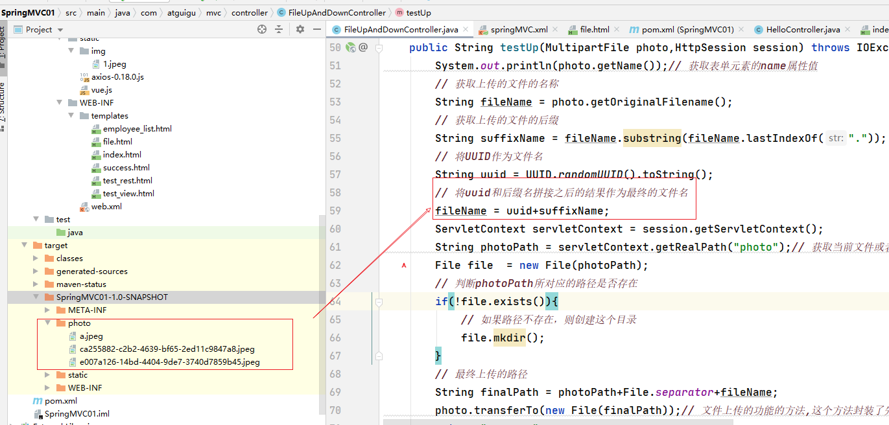

## 11.SpringMVC的拦截器⭐🌙

### 11.1 拦截器的说明

==拦截器用于在控制器方法执行前后进行操作==

- SpringMVC中的拦截器用于**拦截控制器方法的执行**

- SpringMVC中的拦截器需要实现HandlerInterceptor接口，里面有三个方法：==一个在控制器方法执行之前执行，一个在控制器方法执行之后生成ModelAndView对象之后执行，一个在渲染完视图之后执行==，并且拦截器可以有多个！！！！

- SpringMVC的拦截器必须在SpringMVC的配置文件中进行配置：

###  11.2 拦截器的配置实现⭐

#### 11.2.1 配置普通的拦截器，拦截所有请求⭐

- 创建一个拦截器

SpringMVC中的拦截器有三个抽象方法：

==preHandle==：**控制器方法执行之前执行preHandle()，其boolean类型的返回值表示是否拦截或放行，返回true为放行，即调用控制器方法；返回false表示拦截，即不调用控制器方法**

==postHandle==：**控制器方法执行之后执行postHandle()**

==afterComplation==：**处理完视图和模型数据，渲染视图完毕之后执行afterComplation()**

~~~java
package com.atguigu.mvc.interceptors;

import org.springframework.web.servlet.HandlerInterceptor;
import org.springframework.web.servlet.ModelAndView;
import org.springframework.web.servlet.handler.HandlerInterceptorAdapter;

import javax.servlet.http.HttpServletRequest;
import javax.servlet.http.HttpServletResponse;

/**
 * 创建拦截器的步骤：
 *    1.创建一个类实现HandlerInterceptor接口：implements HandlerInterceptor
 *      或者创建一个类继承HandlerInterceptorAdapter类：extends HandlerInterceptorAdapter
 */
public class FirstInterceptor implements HandlerInterceptor {

    /**
     * 在控制器方法执行之前执行
     * 返回false表示拦截，返回true表示放行！！！
     *
     */
    @Override
    public boolean preHandle(HttpServletRequest request, HttpServletResponse response, Object handler) throws Exception {
        System.out.println("FirstInterceptor==>preHandle");
        return true;
    }

    // 在控制器方法执行之后执行
    @Override
    public void postHandle(HttpServletRequest request, HttpServletResponse response, Object handler, ModelAndView modelAndView) throws Exception {
        System.out.println("FirstInterceptor==>postHandle");
    }

    // 在视图渲染之后执行
    @Override
    public void afterCompletion(HttpServletRequest request, HttpServletResponse response, Object handler, Exception ex) throws Exception {
        System.out.println("FirstInterceptor==>afterCompletion");
    }
}

~~~

- 在SpingMVC的配置文件中配置拦截器

~~~xml
<?xml version="1.0" encoding="UTF-8"?>
<beans xmlns="http://www.springframework.org/schema/beans"
       xmlns:xsi="http://www.w3.org/2001/XMLSchema-instance"
       xmlns:context="http://www.springframework.org/schema/context"
       xmlns:mvc="http://www.springframework.org/schema/mvc"
       xsi:schemaLocation="http://www.springframework.org/schema/beans http://www.springframework.org/schema/beans/spring-beans.xsd http://www.springframework.org/schema/context https://www.springframework.org/schema/context/spring-context.xsd http://www.springframework.org/schema/mvc https://www.springframework.org/schema/mvc/spring-mvc.xsd">
    <!-- 开启注解包扫描的支持！ -->
    <context:component-scan base-package="com.atguigu.mvc"></context:component-scan>
    <!-- 配置Thymeleaf视图解析器 -->
    <bean id="viewResolver" class="org.thymeleaf.spring5.view.ThymeleafViewResolver">
        <property name="order" value="1"/>
        <property name="characterEncoding" value="UTF-8"/>
        <property name="templateEngine">
            <bean class="org.thymeleaf.spring5.SpringTemplateEngine">
                <property name="templateResolver">
                    <bean class="org.thymeleaf.spring5.templateresolver.SpringResourceTemplateResolver">

                        <!-- 视图前缀 -->
                        <property name="prefix" value="/WEB-INF/templates/"/>

                        <!-- 视图后缀 -->
                        <property name="suffix" value=".html"/>
                        <property name="templateMode" value="HTML5"/>
                        <property name="characterEncoding" value="UTF-8" />
                    </bean>
                </property>
            </bean>
        </property>
    </bean>
    <!--配置文件上传解析器，将上传的文件封装为MultipartFile
         必须给文件上传解析器配置id，id必须叫multipartResolver
         -->
    <bean id="multipartResolver" class="org.springframework.web.multipart.commons.CommonsMultipartResolver"></bean>


    <mvc:view-controller path="/file" view-name="file"></mvc:view-controller>
    <!-- 开启mvc注解驱动 -->
    <mvc:annotation-driven>
        <mvc:message-converters>
            <!-- 处理响应中文内容乱码 -->
            <bean class="org.springframework.http.converter.StringHttpMessageConverter">
                <property name="defaultCharset" value="UTF-8" />
                <property name="supportedMediaTypes">
                    <list>
                        <value>text/html</value>
                        <value>application/json</value>
                    </list>
                </property>
            </bean>
        </mvc:message-converters>
    </mvc:annotation-driven>

    <!--开放对静态资源的访问！ -->
    <mvc:default-servlet-handler></mvc:default-servlet-handler>

    <!--配置拦截器 -->
   <mvc:interceptors>
       <bean class="com.atguigu.mvc.interceptors.FirstInterceptor"></bean>
   </mvc:interceptors>

</beans>
~~~

#### 11.2.2 配置含有拦截规则的拦截器⭐🌙

注意：上述的这种配置会对所有的请求生效进行拦截。

~~~xml
 <!--配置拦截器 此时会对所有的请求进行拦截-->
   <mvc:interceptors>
       <bean class="com.atguigu.mvc.interceptors.FirstInterceptor"></bean>
   </mvc:interceptors>
~~~

我们还可以设置拦截规则，这样的话，就会对满足拦截规则请求才生效

~~~xml
<?xml version="1.0" encoding="UTF-8"?>
<beans xmlns="http://www.springframework.org/schema/beans"
       xmlns:xsi="http://www.w3.org/2001/XMLSchema-instance"
       xmlns:context="http://www.springframework.org/schema/context"
       xmlns:mvc="http://www.springframework.org/schema/mvc"
       xsi:schemaLocation="http://www.springframework.org/schema/beans http://www.springframework.org/schema/beans/spring-beans.xsd http://www.springframework.org/schema/context https://www.springframework.org/schema/context/spring-context.xsd http://www.springframework.org/schema/mvc https://www.springframework.org/schema/mvc/spring-mvc.xsd">
    <!-- 开启注解包扫描的支持！ -->
    <context:component-scan base-package="com.atguigu.mvc"></context:component-scan>
    <!-- 配置Thymeleaf视图解析器 -->
    <bean id="viewResolver" class="org.thymeleaf.spring5.view.ThymeleafViewResolver">
        <property name="order" value="1"/>
        <property name="characterEncoding" value="UTF-8"/>
        <property name="templateEngine">
            <bean class="org.thymeleaf.spring5.SpringTemplateEngine">
                <property name="templateResolver">
                    <bean class="org.thymeleaf.spring5.templateresolver.SpringResourceTemplateResolver">

                        <!-- 视图前缀 -->
                        <property name="prefix" value="/WEB-INF/templates/"/>

                        <!-- 视图后缀 -->
                        <property name="suffix" value=".html"/>
                        <property name="templateMode" value="HTML5"/>
                        <property name="characterEncoding" value="UTF-8" />
                    </bean>
                </property>
            </bean>
        </property>
    </bean>
    <!--配置文件上传解析器，将上传的文件封装为MultipartFile
         必须给文件上传解析器配置id，id必须叫multipartResolver
         -->
    <bean id="multipartResolver" class="org.springframework.web.multipart.commons.CommonsMultipartResolver"></bean>


    <mvc:view-controller path="/file" view-name="file"></mvc:view-controller>
    <!-- 开启mvc注解驱动 -->
    <mvc:annotation-driven>
        <mvc:message-converters>
            <!-- 处理响应中文内容乱码 -->
            <bean class="org.springframework.http.converter.StringHttpMessageConverter">
                <property name="defaultCharset" value="UTF-8" />
                <property name="supportedMediaTypes">
                    <list>
                        <value>text/html</value>
                        <value>application/json</value>
                    </list>
                </property>
            </bean>
        </mvc:message-converters>
    </mvc:annotation-driven>

    <!--开放对静态资源的访问！ -->
    <mvc:default-servlet-handler></mvc:default-servlet-handler>

    <!--配置拦截器 -->
   <mvc:interceptors>
       <mvc:interceptor>
           <!--
               mapping:用来设置拦截的路径
              /**：代表拦截所有的请求
              /*:只代表拦截一层路径下的请求
           -->

           <mvc:mapping path="/**"/>

           <!--
               exclude-mapping:用来排除某些请求不拦截
               这里排除主页面不拦截
           -->
           <mvc:exclude-mapping path="/"/>
           <ref bean="firstInterceptor"></ref>
       </mvc:interceptor>
   </mvc:interceptors>

</beans>
~~~

~~~java
package com.atguigu.mvc.interceptors;

import org.springframework.stereotype.Component;
import org.springframework.web.servlet.HandlerInterceptor;
import org.springframework.web.servlet.ModelAndView;
import org.springframework.web.servlet.handler.HandlerInterceptorAdapter;

import javax.servlet.http.HttpServletRequest;
import javax.servlet.http.HttpServletResponse;

/**
 * 创建拦截器的步骤：
 *    1.创建一个类实现HandlerInterceptor接口：implements HandlerInterceptor
 *      或者创建一个类继承HandlerInterceptorAdapter类：extends HandlerInterceptorAdapter
 */
@Component
public class FirstInterceptor implements HandlerInterceptor {

    /**
     * 在控制器方法执行之前执行
     * 返回false表示拦截，返回true表示放行！！！
     *
     */
    @Override
    public boolean preHandle(HttpServletRequest request, HttpServletResponse response, Object handler) throws Exception {
        System.out.println("FirstInterceptor==>preHandle");
        return true;
    }

    // 在控制器方法执行之后执行
    @Override
    public void postHandle(HttpServletRequest request, HttpServletResponse response, Object handler, ModelAndView modelAndView) throws Exception {
        System.out.println("FirstInterceptor==>postHandle");
    }

    // 在视图渲染之后执行
    @Override
    public void afterCompletion(HttpServletRequest request, HttpServletResponse response, Object handler, Exception ex) throws Exception {
        System.out.println("FirstInterceptor==>afterCompletion");
    }
}

~~~

此时拦截器所在的类需要加上注解！！！！

### 11.3 多个拦截器的执行顺序⭐🌙

当我们在系统配置多个拦截器的时候，其生效时机和我们在==配置文件中配置的先后顺序有关==，

#### 11.3.1 案例演示

**第一个拦截器**

~~~java
package com.atguigu.mvc.interceptors;

import org.springframework.stereotype.Component;
import org.springframework.web.servlet.HandlerInterceptor;
import org.springframework.web.servlet.ModelAndView;
import org.springframework.web.servlet.handler.HandlerInterceptorAdapter;

import javax.servlet.http.HttpServletRequest;
import javax.servlet.http.HttpServletResponse;

/**
 * 创建拦截器的步骤：
 *    1.创建一个类实现HandlerInterceptor接口：implements HandlerInterceptor
 *      或者创建一个类继承HandlerInterceptorAdapter类：extends HandlerInterceptorAdapter
 */
@Component
public class FirstInterceptor implements HandlerInterceptor {

    /**
     * 在控制器方法执行之前执行
     * 返回false表示拦截，返回true表示放行！！！
     *
     */
    @Override
    public boolean preHandle(HttpServletRequest request, HttpServletResponse response, Object handler) throws Exception {
        System.out.println("FirstInterceptor==>preHandle");
        return true;
    }

    // 在控制器方法执行之后执行
    @Override
    public void postHandle(HttpServletRequest request, HttpServletResponse response, Object handler, ModelAndView modelAndView) throws Exception {
        System.out.println("FirstInterceptor==>postHandle");
    }

    // 在视图渲染之后执行
    @Override
    public void afterCompletion(HttpServletRequest request, HttpServletResponse response, Object handler, Exception ex) throws Exception {
        System.out.println("FirstInterceptor==>afterCompletion");
    }
}
~~~

**第二个拦截器**

~~~java
package com.atguigu.mvc.interceptors;

import org.springframework.stereotype.Component;
import org.springframework.web.servlet.HandlerInterceptor;
import org.springframework.web.servlet.ModelAndView;

import javax.servlet.http.HttpServletRequest;
import javax.servlet.http.HttpServletResponse;
@Component
public class SecondInterceptor implements HandlerInterceptor {
    /**
     * 在控制器方法执行之前执行
     * 返回false表示拦截，返回true表示放行！！！
     *
     */
    @Override
    public boolean preHandle(HttpServletRequest request, HttpServletResponse response, Object handler) throws Exception {
        System.out.println("SecondInterceptor==>preHandle");
        return true;
    }

    // 在控制器方法执行之后执行
    @Override
    public void postHandle(HttpServletRequest request, HttpServletResponse response, Object handler, ModelAndView modelAndView) throws Exception {
        System.out.println("SecondInterceptor==>postHandle");
    }

    // 在视图渲染之后执行
    @Override
    public void afterCompletion(HttpServletRequest request, HttpServletResponse response, Object handler, Exception ex) throws Exception {
        System.out.println("SecondInterceptor==>afterCompletion");
    }
}

~~~

**配置文件的顺序**

~~~xml
<?xml version="1.0" encoding="UTF-8"?>
<beans xmlns="http://www.springframework.org/schema/beans"
       xmlns:xsi="http://www.w3.org/2001/XMLSchema-instance"
       xmlns:context="http://www.springframework.org/schema/context"
       xmlns:mvc="http://www.springframework.org/schema/mvc"
       xsi:schemaLocation="http://www.springframework.org/schema/beans http://www.springframework.org/schema/beans/spring-beans.xsd http://www.springframework.org/schema/context https://www.springframework.org/schema/context/spring-context.xsd http://www.springframework.org/schema/mvc https://www.springframework.org/schema/mvc/spring-mvc.xsd">
    <!-- 开启注解包扫描的支持！ -->
    <context:component-scan base-package="com.atguigu.mvc"></context:component-scan>
    <!-- 配置Thymeleaf视图解析器 -->
    <bean id="viewResolver" class="org.thymeleaf.spring5.view.ThymeleafViewResolver">
        <property name="order" value="1"/>
        <property name="characterEncoding" value="UTF-8"/>
        <property name="templateEngine">
            <bean class="org.thymeleaf.spring5.SpringTemplateEngine">
                <property name="templateResolver">
                    <bean class="org.thymeleaf.spring5.templateresolver.SpringResourceTemplateResolver">

                        <!-- 视图前缀 -->
                        <property name="prefix" value="/WEB-INF/templates/"/>

                        <!-- 视图后缀 -->
                        <property name="suffix" value=".html"/>
                        <property name="templateMode" value="HTML5"/>
                        <property name="characterEncoding" value="UTF-8" />
                    </bean>
                </property>
            </bean>
        </property>
    </bean>
    <!--配置文件上传解析器，将上传的文件封装为MultipartFile
         必须给文件上传解析器配置id，id必须叫multipartResolver
         -->
    <bean id="multipartResolver" class="org.springframework.web.multipart.commons.CommonsMultipartResolver"></bean>


    <mvc:view-controller path="/file" view-name="file"></mvc:view-controller>
    <!-- 开启mvc注解驱动 -->
    <mvc:annotation-driven>
        <mvc:message-converters>
            <!-- 处理响应中文内容乱码 -->
            <bean class="org.springframework.http.converter.StringHttpMessageConverter">
                <property name="defaultCharset" value="UTF-8" />
                <property name="supportedMediaTypes">
                    <list>
                        <value>text/html</value>
                        <value>application/json</value>
                    </list>
                </property>
            </bean>
        </mvc:message-converters>
    </mvc:annotation-driven>

    <!--开放对静态资源的访问！ -->
    <mvc:default-servlet-handler></mvc:default-servlet-handler>

    <!--配置拦截器 -->
   <mvc:interceptors>
       <ref bean="firstInterceptor"></ref>
       <ref bean="secondInterceptor"></ref>
   </mvc:interceptors>

</beans>
~~~

最终我们访问首页，发现后台日志输出如下：

~~~
FirstInterceptor==>preHandle
SecondInterceptor==>preHandle
SecondInterceptor==>postHandle
FirstInterceptor==>postHandle
SecondInterceptor==>afterCompletion
FirstInterceptor==>afterCompletion
~~~

#### 11.3.2 规则

a>若每个拦截器的preHandle()都返回true

此时多个拦截器的执行顺序和拦截器在SpringMVC的配置文件的配置顺序有关：

==**preHandle()会按照配置的顺序执行，而postHandle()和afterComplation()会按照配置的反序执行**==

b>若某个拦截器的preHandle()返回了false

==**preHandle()返回false和它之前的拦截器的preHandle()都会执行（返回false的这个拦截器的preHandle()也会执行），postHandle()都不执行，返回false的拦截器之前的拦截器的afterComplation()会执行**==

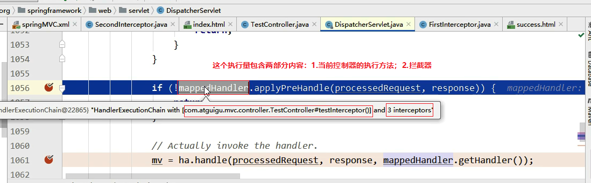

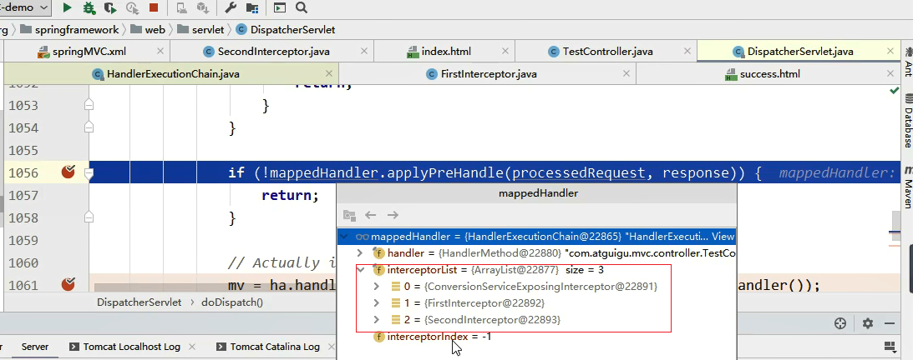

## 12.SpringMVC的异常处理器⭐

主要是用来处理异常的！在出现了指定异常后，跳转到相应的页面！

SpringMVC提供了一个处理控制器方法执行过程中所出现的异常的接口：HandlerExceptionResolver

HandlerExceptionResolver接口的实现类有：DefaultHandlerExceptionResolver和SimpleMappingExceptionResolver

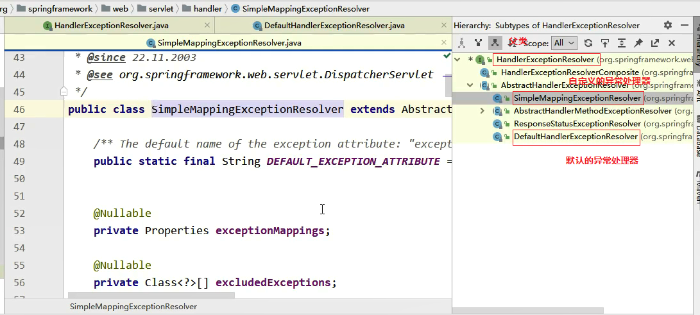

### 12.1 基于配置的异常处理⭐

**配置文件**

~~~xml
 <!--配置异常处理 -->
   <bean class="org.springframework.web.servlet.handler.SimpleMappingExceptionResolver">
       <!--
       属性exceptionMappings是一个 Properties类型的属性，
       他的赋值通过props标签来赋值
       一个<prop>代表一个键值对
            key：指定的异常的全限定名
            双标签中写value，一个新的视图名称
       -->
       <!--
        		properties的键表示处理器方法执行过程中出现的异常
        		properties的值表示若出现指定异常时，设置一个新的视图名称，跳转到指定页面
        	-->
       <property name="exceptionMappings">
           <props>
               <prop key="java.lang.ArithmeticException">error</prop>
           </props>
       </property>
       <!--
        属性exceptionAttribute
        这个属性是用来存储异常信息的，默认是将异常信息存储在请求域中，
        value属性的值就是异常信息键值对中的键，根据这个键可以找到对应的异常信息
        -->
       <!-- 设置将异常信息共享在请求域中的键-->
       <!--
    	exceptionAttribute属性设置一个属性名，将出现的异常信息在请求域中进行共享
       -->
       <property name="exceptionAttribute" value="ex"></property>
   </bean>
~~~

**控制器方法**

~~~java
 @RequestMapping("/testException")
    public String testException(){
        System.out.println(1/0);
        return "success";
    }
~~~

**error.html**

~~~html
<!DOCTYPE html>
<html lang="en" xmlns:th="http://www.thymeleaf.org">
<head>
    <meta charset="UTF-8">
    <title>error</title>
</head>
<body>
error!!!!
<p th:text="${ex}"></p>
</body>
</html>
~~~

### 12.2 基于注解的异常处理⭐

~~~java
package com.atguigu.mvc.controller;

import org.springframework.ui.Model;
import org.springframework.web.bind.annotation.ControllerAdvice;
import org.springframework.web.bind.annotation.ExceptionHandler;
//@ControllerAdvice将当前类标识为异常处理的组件
@ControllerAdvice
public class ExceptionController {
    //@ExceptionHandler用于设置所标识方法处理的异常
    @ExceptionHandler(value = {ArithmeticException.class,NullPointerException.class})
    /**
     * 方法的参数中的Exception 就是控制器方法出现异常以后捕获到的异常！
     */
    //ex表示当前请求处理中出现的异常对象
    public String testException(Exception ex, Model model){
        model.addAttribute("ex",ex);
        return "error";
    }
}

~~~

## 13.注解配置SpringMVC⭐🌙

使用配置类和注解代替web.xml和SpringMVC配置文件的功能

### 13.1 创建初始化类，代替web.xml

在==Servlet3.0环境==中，容器会在类路径(src,resource目录下)中查找实现javax.servlet.ServletContainerInitializer接口的类，如果找到的话就用它来配置Servlet容器。

Spring提供了这个接口的实现，名为SpringServletContainerInitializer，这个类反过来又会查找实现WebApplicationInitializer的类并将配置的任务交给它们来完成。Spring3.2引入了一个便利的WebApplicationInitializer基础实现，名为AbstractAnnotationConfigDispatcherServletInitializer，当我们的类扩展了AbstractAnnotationConfigDispatcherServletInitializer并将其部署到Servlet3.0容器的时候，容器会自动发现它，并用它来配置Servlet上下文。

~~~java
package com.atguigu.mvc.config;

import org.springframework.web.filter.CharacterEncodingFilter;
import org.springframework.web.filter.HiddenHttpMethodFilter;
import org.springframework.web.servlet.support.AbstractAnnotationConfigDispatcherServletInitializer;

import javax.servlet.Filter;

/**
 * web工程的初始化类，用来代替web.xml
 */
public class WebInit extends AbstractAnnotationConfigDispatcherServletInitializer {
    /**
     * 指定Spring的配置类
     * @return
     */
    @Override
    protected Class<?>[] getRootConfigClasses() {
        // return new Class[]{SpringConfig.class};
        return new Class[0];
    }

    /**
     * 指定SpringMVC的配置类
     * @return
     */
    @Override
    protected Class<?>[] getServletConfigClasses() {
        return new Class[]{WebConfig.class};
    }

    /**
     * 指定DispatcherServlet的映射规则，即url-pattern
     * @return
     */
    @Override
    protected String[] getServletMappings() {
        /**
         * <!--
         *     设置springMVC的核心控制器所能处理的请求的请求路径
         *     /所匹配的请求可以是/login或.html或.js或.css方式的请求路径
         *     但是/不能匹配.jsp请求路径的请求
         * -->
         */
        return new String[]{"/"};
    }

    /**
     * 注册过滤器
     * 我们重写这个方法，用来返回web.xml中需要用到的过滤器:编码过滤器。REST风格转换请求方法的过滤器
     * @return
     */
    @Override
    protected Filter[] getServletFilters() {
        // 编码过滤器
        CharacterEncodingFilter characterEncodingFilter = new CharacterEncodingFilter();
        characterEncodingFilter.setEncoding("UTF-8");
        characterEncodingFilter.setForceResponseEncoding(true);

        // REST风格转换请求方法的过滤器
        HiddenHttpMethodFilter hiddenHttpMethodFilter =new HiddenHttpMethodFilter();
        return new Filter[]{characterEncodingFilter,hiddenHttpMethodFilter};
    }
}

~~~

### 13.2 创建SpringConfig配置类，代替spring的配置文件

```java
@Configuration
public class SpringConfig {
	//ssm整合之后，spring的配置信息写在此类中
}
```

### 13.3 创建WebConfig配置类，代替SpringMVC的配置文件

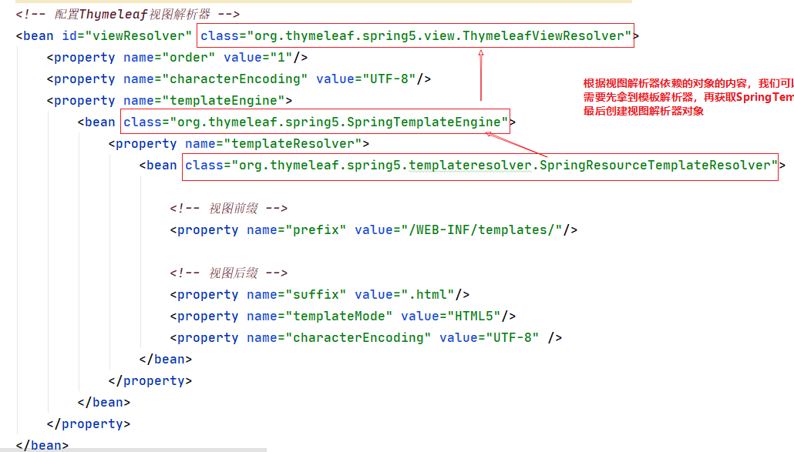

~~~java
package com.atguigu.mvc.config;

import org.springframework.context.annotation.Bean;
import org.springframework.context.annotation.ComponentScan;
import org.springframework.context.annotation.Configuration;

import org.springframework.web.context.ContextLoader;
import org.springframework.web.context.WebApplicationContext;
import org.springframework.web.servlet.ViewResolver;
import org.springframework.web.servlet.config.annotation.DefaultServletHandlerConfigurer;
import org.springframework.web.servlet.config.annotation.EnableWebMvc;
import org.springframework.web.servlet.config.annotation.InterceptorRegistry;
import org.springframework.web.servlet.config.annotation.WebMvcConfigurer;
import org.thymeleaf.spring5.SpringTemplateEngine;
import org.thymeleaf.spring5.view.ThymeleafViewResolver;
import org.thymeleaf.templatemode.TemplateMode;
import org.thymeleaf.templateresolver.ITemplateResolver;
import org.thymeleaf.templateresolver.ServletContextTemplateResolver;


/**
 * 代替SpringMVC的配置文件，里面可以有：
 *     1.扫描组件      2.视图解析器       3.view-controller    4.default-servlet-handler
 *     5.mvc注解驱动   6.文件上传解析器    7.异常处理            8.拦截器
 *
 */
// 将当前类表示为一个配置类
@Configuration
// 1.扫描组件
@ComponentScan("com.atguigu.mvc.controller")
// 5.mvc注解驱动
@EnableWebMvc
/*
* 配置类实现WebMvcConfigurer，里面提供了一些获取组件的方法！
* */
public class WebConfig  implements WebMvcConfigurer {
    
    // 3.配置视图控制
    @Override
    public void addViewControllers(ViewControllerRegistry registry) {
        registry.addViewController("/").setViewName("index");
    }
    
    /**
     * 4.default-servlet-handler
     * @param configurer
     */
    @Override
    public void configureDefaultServletHandling(DefaultServletHandlerConfigurer configurer) {
        // 这个方法代表默认的Servlet可用！
        configurer.enable();
    }
    
    // 6.配置文件上传解析器
    @Bean
    public CommonsMultipartResolver multipartResolver(){
        return new CommonsMultipartResolver();
    }
    // 7.配置异常映射
    @Override
    public void configureHandlerExceptionResolvers(List<HandlerExceptionResolver> resolvers) {
        SimpleMappingExceptionResolver exceptionResolver = new SimpleMappingExceptionResolver();
        Properties prop = new Properties();
        prop.setProperty("java.lang.ArithmeticException", "error");
        //设置异常映射
        exceptionResolver.setExceptionMappings(prop);
        //设置共享异常信息的键
        exceptionResolver.setExceptionAttribute("ex");
        resolvers.add(exceptionResolver);
    }
    
    /**
     * 8.拦截器
     * @param registry
     */
    @Override
    public void addInterceptors(InterceptorRegistry registry) {
        FirstInterceptor firstInterceptor = new FirstInterceptor();
        registry.addInterceptor(firstInterceptor).addPathPatterns("/**");
    }

    /**************************************2.配置视图解析器Start**************************************/
    //配置生成模板解析器
    @Bean
    public ITemplateResolver templateResolver() {
        WebApplicationContext webApplicationContext = ContextLoader.getCurrentWebApplicationContext();
        // ServletContextTemplateResolver需要一个ServletContext作为构造参数，可通过WebApplicationContext 的方法获得
        ServletContextTemplateResolver templateResolver = new ServletContextTemplateResolver(
                webApplicationContext.getServletContext());
        templateResolver.setPrefix("/WEB-INF/templates/");
        templateResolver.setSuffix(".html");
        templateResolver.setCharacterEncoding("UTF-8");
        templateResolver.setTemplateMode(TemplateMode.HTML);
        return templateResolver;
    }

    //生成模板引擎并为模板引擎注入模板解析器
    @Bean
    public SpringTemplateEngine templateEngine(ITemplateResolver templateResolver) {
        SpringTemplateEngine templateEngine = new SpringTemplateEngine();
        templateEngine.setTemplateResolver(templateResolver);
        return templateEngine;
    }

    //生成视图解析器并未解析器注入模板引擎
    @Bean
    public ViewResolver viewResolver(SpringTemplateEngine templateEngine) {
        ThymeleafViewResolver viewResolver = new ThymeleafViewResolver();
        viewResolver.setCharacterEncoding("UTF-8");
        viewResolver.setTemplateEngine(templateEngine);
        return viewResolver;
    }
    /**************************************2.配置视图解析器end**************************************/
}

~~~

## 14.SpringMVC的执行流程（源码分析）⭐☀

### 14.1 SpringMVC的常用组件⭐

- DispatcherServlet：**前端控制器**，不需要工程师开发，由框架提供

作用：==统一处理请求和响应，整个流程控制的中心，由它调用其它组件处理用户的请求==

- HandlerMapping：**处理器映射器**，不需要工程师开发，由框架提供

作用：==根据请求的url、method等信息查找Handler，也就是我们编写的Controller，即控制器方法==，**将请求和控制器方法进行映射**，**处理器映射器来找方法**

- Handler：**处理器**，需要工程师开发，指的就是我们写的Controller,控制器！

作用：==在DispatcherServlet的控制下Handler对具体的用户请求进行处理==

- HandlerAdapter：**处理器适配器**，不需要工程师开发，由框架提供

作用：==通过HandlerAdapter对处理器（控制器方法）进行执行==，HandlerMapping找到了控制器方法以后，由**处理器适配器来执行方法**

- ViewResolver：**视图解析器**，不需要工程师开发，由框架提供

作用：==进行视图解析，得到相应的视图，例如：ThymeleafView、InternalResourceView、RedirectView==

- View：**视图**

作用：==将模型数据通过页面展示给用户==，为用户展示模型数据，实际就是我们编写的页面

### 14.2 DispatcherServlet初始化过程⭐

DispatcherServlet 本质上是一个 Servlet，所以天然的遵循 Servlet 的生命周期。所以宏观上是 Servlet 生命周期来进行调度。我们考虑它是如何初始化的！

>```
>public class DispatcherServlet extends FrameworkServlet 
>DispatcherServlet继承了FrameworkServlet
>```

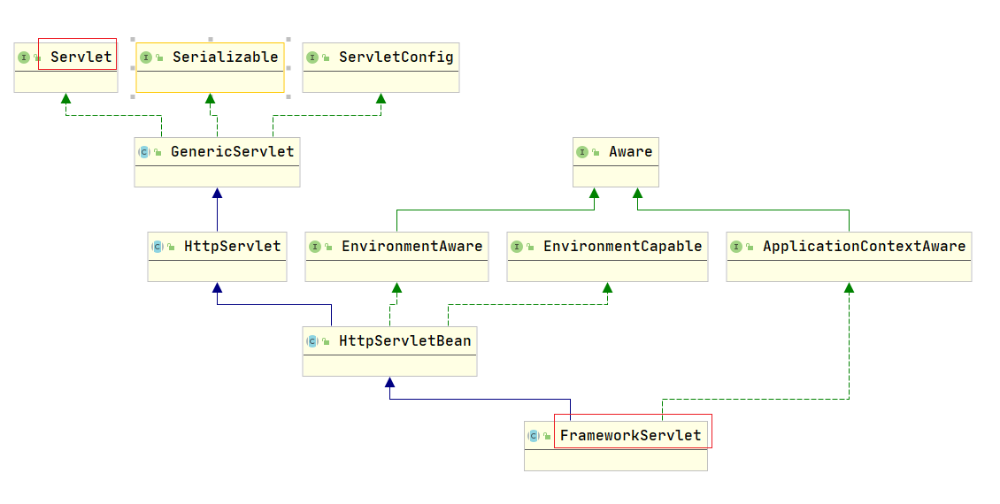


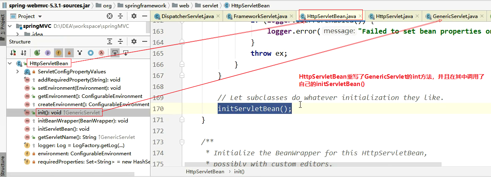

~~~java
// HttpServletBean的方法initServletBean：
protected void initServletBean() throws ServletException {

}
~~~

~~~java
// HttpServletBean的子类FrameworkServlet的initServletBean方法
protected final void initServletBean() throws ServletException {
        this.getServletContext().log("Initializing Spring " + this.getClass().getSimpleName() + " '" + this.getServletName() + "'");
        if (this.logger.isInfoEnabled()) {
            this.logger.info("Initializing Servlet '" + this.getServletName() + "'");
        }

        long startTime = System.currentTimeMillis();

        try {
            // 初始化的方法！
            this.webApplicationContext = this.initWebApplicationContext();
            this.initFrameworkServlet();
        } catch (RuntimeException | ServletException var4) {
            this.logger.error("Context initialization failed", var4);
            throw var4;
        }

        if (this.logger.isDebugEnabled()) {
            String value = this.enableLoggingRequestDetails ? "shown which may lead to unsafe logging of potentially sensitive data" : "masked to prevent unsafe logging of potentially sensitive data";
            this.logger.debug("enableLoggingRequestDetails='" + this.enableLoggingRequestDetails + "': request parameters and headers will be " + value);
        }

        if (this.logger.isInfoEnabled()) {
            this.logger.info("Completed initialization in " + (System.currentTimeMillis() - startTime) + " ms");
        }

    }
~~~

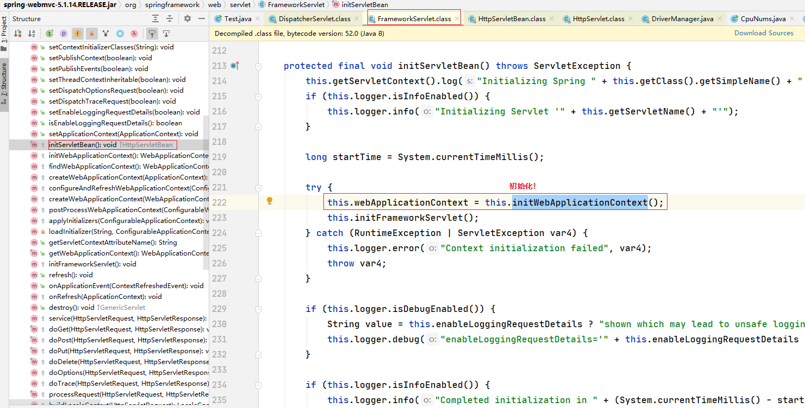

##### a>初始化WebApplicationContext

所在类：org.springframework.web.servlet.FrameworkServlet

```java
protected WebApplicationContext initWebApplicationContext() {
    WebApplicationContext rootContext =
        WebApplicationContextUtils.getWebApplicationContext(getServletContext());
    WebApplicationContext wac = null;

    if (this.webApplicationContext != null) {
        // A context instance was injected at construction time -> use it
        wac = this.webApplicationContext;
        if (wac instanceof ConfigurableWebApplicationContext) {
            ConfigurableWebApplicationContext cwac = (ConfigurableWebApplicationContext) wac;
            if (!cwac.isActive()) {
                // The context has not yet been refreshed -> provide services such as
                // setting the parent context, setting the application context id, etc
                if (cwac.getParent() == null) {
                    // The context instance was injected without an explicit parent -> set
                    // the root application context (if any; may be null) as the parent
                    cwac.setParent(rootContext);
                }
                configureAndRefreshWebApplicationContext(cwac);
            }
        }
    }
    
    if (wac == null) {
        // No context instance was injected at construction time -> see if one
        // has been registered in the servlet context. If one exists, it is assumed
        // that the parent context (if any) has already been set and that the
        // user has performed any initialization such as setting the context id
        wac = findWebApplicationContext();
    }
    
    // wac肯定是null，然后这时候我们追踪到createWebApplicationContext()方法中
    if (wac == null) {
        // No context instance is defined for this servlet -> create a local one
        // 1.创建WebApplicationContext
        wac = createWebApplicationContext(rootContext);
    }

    if (!this.refreshEventReceived) {
        // Either the context is not a ConfigurableApplicationContext with refresh
        // support or the context injected at construction time had already been
        // refreshed -> trigger initial onRefresh manually here.
        synchronized (this.onRefreshMonitor) {
            // 2.刷新WebApplicationContext
            onRefresh(wac);
        }
    }

    if (this.publishContext) {
        // Publish the context as a servlet context attribute.
        // 3.将IOC容器在应用域共享
        String attrName = getServletContextAttributeName();
        getServletContext().setAttribute(attrName, wac);
    }

    return wac;
}
```

##### b>创建WebApplicationContext，对应a中的  wac = createWebApplicationContext(rootContext)操作

所在类：org.springframework.web.servlet.FrameworkServlet

```java
protected WebApplicationContext createWebApplicationContext(@Nullable ApplicationContext parent) {
    Class<?> contextClass = getContextClass();
    if (!ConfigurableWebApplicationContext.class.isAssignableFrom(contextClass)) {
        throw new ApplicationContextException(
            "Fatal initialization error in servlet with name '" + getServletName() +
            "': custom WebApplicationContext class [" + contextClass.getName() +
            "] is not of type ConfigurableWebApplicationContext");
    }
    // 通过反射创建 IOC 容器对象
    ConfigurableWebApplicationContext wac =
        (ConfigurableWebApplicationContext) BeanUtils.instantiateClass(contextClass);

    wac.setEnvironment(getEnvironment());
    // 设置父容器，SpringMVC的容器是子容器，Spring的容器是父容器
    wac.setParent(parent);
    String configLocation = getContextConfigLocation();
    if (configLocation != null) {
        wac.setConfigLocation(configLocation);
    }
    configureAndRefreshWebApplicationContext(wac);

    return wac;
}
```

##### c>DispatcherServlet初始化策略

FrameworkServlet创建WebApplicationContext后，刷新容器，调用onRefresh(wac)，==此方法在DispatcherServlet中进行了重写，调用了initStrategies(context)方法，初始化策略，即初始化DispatcherServlet的各个组件。==

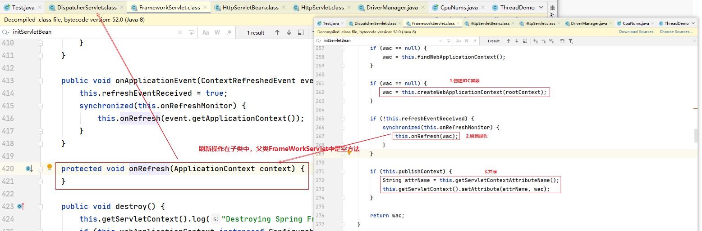

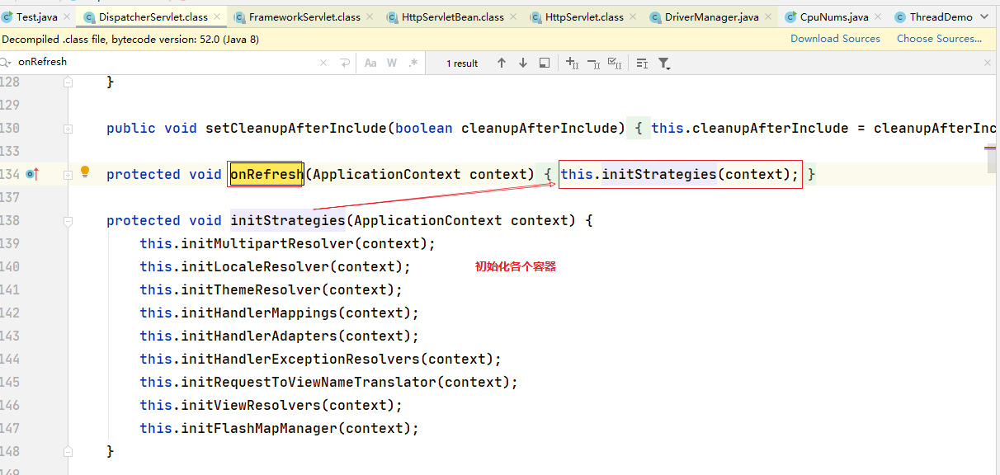

所在类：org.springframework.web.servlet.DispatcherServlet

```java
protected void initStrategies(ApplicationContext context) {
   initMultipartResolver(context);
   initLocaleResolver(context);
   initThemeResolver(context);
   initHandlerMappings(context);// 初始化处理器映射器，这个组件找方法
   initHandlerAdapters(context);// 初始化处理器适配器，这个来执行控制器方法
   initHandlerExceptionResolvers(context);// 初始化异常处理器
   initRequestToViewNameTranslator(context);
   initViewResolvers(context);// 初始化视图解析器
   initFlashMapManager(context);
}
```

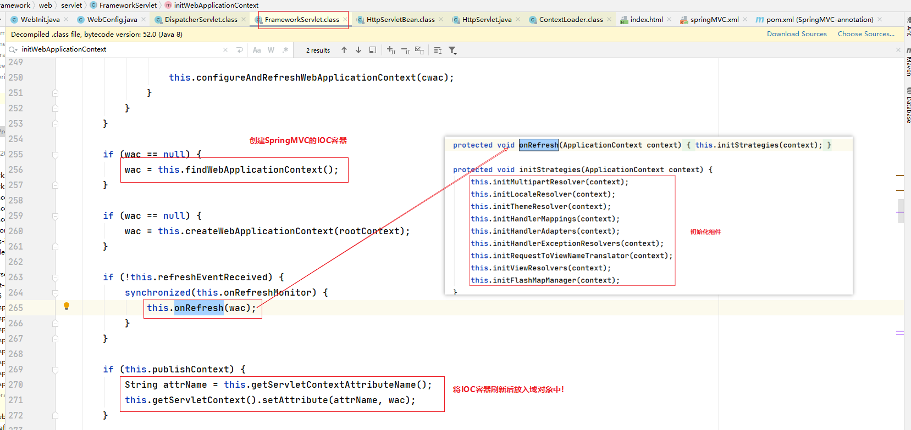

### 14.3 DispatcherServlet调用组件处理请求⭐🌙

##### a>processRequest()

处理请求的过程实际上还是原生Servlet的Service方法一步步调用过来，

FrameworkServlet重写HttpServlet中的service()和doXxx()，但是实际上这些方法中最终都是调用了processRequest(request, response)方法:

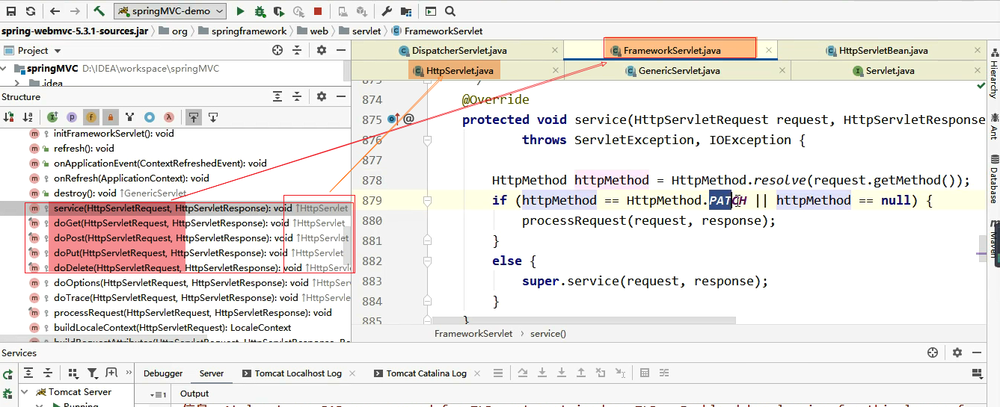

~~~java
// FrameworkServlet中的serice实现：
protected void service(HttpServletRequest request, HttpServletResponse response) throws ServletException, IOException {
        HttpMethod httpMethod = HttpMethod.resolve(request.getMethod());
        if (httpMethod != HttpMethod.PATCH && httpMethod != null) {
            super.service(request, response);// 这个是调用父类的service，最终还是调用到本类中的各种do***()方法，而do***方法最终稿还是调用下面的 this.processRequest(request, response);
        } else {
            this.processRequest(request, response);// 这个是调用本类的processRequest
        }

    }
~~~

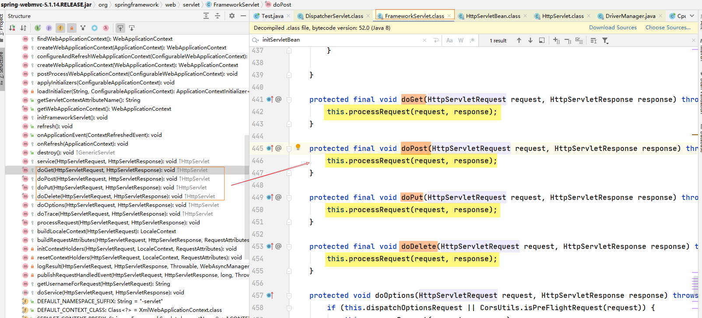

故我们看processRequest方法即可，所在类：org.springframework.web.servlet.FrameworkServlet

```java
// FrameworkServlet中的processRequest实现：
protected final void processRequest(HttpServletRequest request, HttpServletResponse response)
    throws ServletException, IOException {

    long startTime = System.currentTimeMillis();
    Throwable failureCause = null;

    LocaleContext previousLocaleContext = LocaleContextHolder.getLocaleContext();
    LocaleContext localeContext = buildLocaleContext(request);

    RequestAttributes previousAttributes = RequestContextHolder.getRequestAttributes();
    ServletRequestAttributes requestAttributes = buildRequestAttributes(request, response, previousAttributes);

    WebAsyncManager asyncManager = WebAsyncUtils.getAsyncManager(request);
    asyncManager.registerCallableInterceptor(FrameworkServlet.class.getName(), new RequestBindingInterceptor());

    initContextHolders(request, localeContext, requestAttributes);

    try {
		// 执行服务，doService()是一个抽象方法，在DispatcherServlet中进行了重写
        doService(request, response);
    }
    catch (ServletException | IOException ex) {
        failureCause = ex;
        throw ex;
    }
    catch (Throwable ex) {
        failureCause = ex;
        throw new NestedServletException("Request processing failed", ex);
    }

    finally {
        resetContextHolders(request, previousLocaleContext, previousAttributes);
        if (requestAttributes != null) {
            requestAttributes.requestCompleted();
        }
        logResult(request, response, failureCause, asyncManager);
        publishRequestHandledEvent(request, response, startTime, failureCause);
    }
}
```

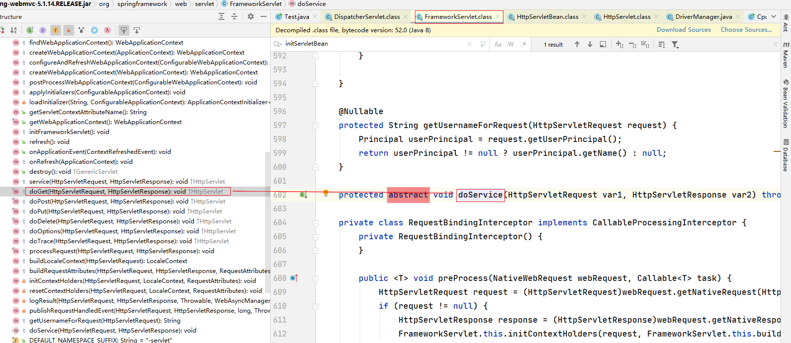

##### b>doService()

所在类：org.springframework.web.servlet.DispatcherServlet

```java
@Override
protected void doService(HttpServletRequest request, HttpServletResponse response) throws Exception {
    logRequest(request);

    // Keep a snapshot of the request attributes in case of an include,
    // to be able to restore the original attributes after the include.
    Map<String, Object> attributesSnapshot = null;
    if (WebUtils.isIncludeRequest(request)) {
        attributesSnapshot = new HashMap<>();
        Enumeration<?> attrNames = request.getAttributeNames();
        while (attrNames.hasMoreElements()) {
            String attrName = (String) attrNames.nextElement();
            if (this.cleanupAfterInclude || attrName.startsWith(DEFAULT_STRATEGIES_PREFIX)) {
                attributesSnapshot.put(attrName, request.getAttribute(attrName));
            }
        }
    }

    // Make framework objects available to handlers and view objects.
    request.setAttribute(WEB_APPLICATION_CONTEXT_ATTRIBUTE, getWebApplicationContext());
    request.setAttribute(LOCALE_RESOLVER_ATTRIBUTE, this.localeResolver);
    request.setAttribute(THEME_RESOLVER_ATTRIBUTE, this.themeResolver);
    request.setAttribute(THEME_SOURCE_ATTRIBUTE, getThemeSource());

    if (this.flashMapManager != null) {
        FlashMap inputFlashMap = this.flashMapManager.retrieveAndUpdate(request, response);
        if (inputFlashMap != null) {
            request.setAttribute(INPUT_FLASH_MAP_ATTRIBUTE, Collections.unmodifiableMap(inputFlashMap));
        }
        request.setAttribute(OUTPUT_FLASH_MAP_ATTRIBUTE, new FlashMap());
        request.setAttribute(FLASH_MAP_MANAGER_ATTRIBUTE, this.flashMapManager);
    }

    RequestPath requestPath = null;
    if (this.parseRequestPath && !ServletRequestPathUtils.hasParsedRequestPath(request)) {
        requestPath = ServletRequestPathUtils.parseAndCache(request);
    }

    try {
        // 处理请求和响应
        doDispatch(request, response);
    }
    finally {
        if (!WebAsyncUtils.getAsyncManager(request).isConcurrentHandlingStarted()) {
            // Restore the original attribute snapshot, in case of an include.
            if (attributesSnapshot != null) {
                restoreAttributesAfterInclude(request, attributesSnapshot);
            }
        }
        if (requestPath != null) {
            ServletRequestPathUtils.clearParsedRequestPath(request);
        }
    }
}
```

##### c>doDispatch()

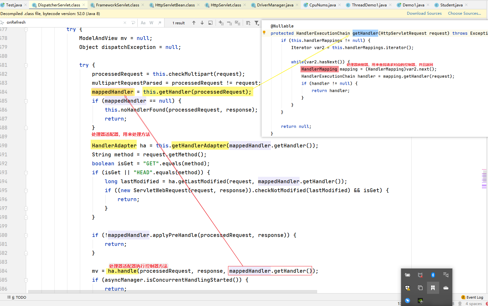

所在类：org.springframework.web.servlet.DispatcherServlet

```java
protected void doDispatch(HttpServletRequest request, HttpServletResponse response) throws Exception {
    HttpServletRequest processedRequest = request;
    HandlerExecutionChain mappedHandler = null;//  执行量
    boolean multipartRequestParsed = false;

    WebAsyncManager asyncManager = WebAsyncUtils.getAsyncManager(request);

    try {
        ModelAndView mv = null;
        Exception dispatchException = null;

        try {
            processedRequest = checkMultipart(request);
            multipartRequestParsed = (processedRequest != request);

            // Determine handler for the current request.
            
            /*
            	mappedHandler：调用链，是一个执行量，很重要
                包含handler、interceptorList、interceptorIndex
            	handler：浏览器发送的请求所匹配的控制器方法
            	interceptorList：处理控制器方法的所有拦截器集合
            	interceptorIndex：拦截器索引，控制拦截器afterCompletion()的执行
            */
            
            mappedHandler = getHandler(processedRequest);
            if (mappedHandler == null) {
                noHandlerFound(processedRequest, response);
                return;
            }

            // Determine handler adapter for the current request.
           	// 通过控制器方法创建相应的处理器适配器，调用所对应的控制器方法
            HandlerAdapter ha = getHandlerAdapter(mappedHandler.getHandler());

            // Process last-modified header, if supported by the handler.
            String method = request.getMethod();
            boolean isGet = "GET".equals(method);
            if (isGet || "HEAD".equals(method)) {
                long lastModified = ha.getLastModified(request, mappedHandler.getHandler());
                if (new ServletWebRequest(request, response).checkNotModified(lastModified) && isGet) {
                    return;
                }
            }
			
            // 调用拦截器的preHandle()
            if (!mappedHandler.applyPreHandle(processedRequest, response)) {
                return;
            }

            // Actually invoke the handler.
            // 由处理器适配器调用具体的控制器方法，最终获得ModelAndView对象
            mv = ha.handle(processedRequest, response, mappedHandler.getHandler());

            if (asyncManager.isConcurrentHandlingStarted()) {
                return;
            }

            applyDefaultViewName(processedRequest, mv);
            // 调用拦截器的postHandle()
            mappedHandler.applyPostHandle(processedRequest, response, mv);
        }
        catch (Exception ex) {
            dispatchException = ex;
        }
        catch (Throwable err) {
            // As of 4.3, we're processing Errors thrown from handler methods as well,
            // making them available for @ExceptionHandler methods and other scenarios.
            dispatchException = new NestedServletException("Handler dispatch failed", err);
        }
        // 后续处理：处理模型数据和渲染视图,其中的参数mv中封装有视图路径和域对象中的参数信息！
        processDispatchResult(processedRequest, response, mappedHandler, mv, dispatchException);
    }
    catch (Exception ex) {
        triggerAfterCompletion(processedRequest, response, mappedHandler, ex);
    }
    catch (Throwable err) {
        triggerAfterCompletion(processedRequest, response, mappedHandler,
                               new NestedServletException("Handler processing failed", err));
    }
    finally {
        if (asyncManager.isConcurrentHandlingStarted()) {
            // Instead of postHandle and afterCompletion
            if (mappedHandler != null) {
                mappedHandler.applyAfterConcurrentHandlingStarted(processedRequest, response);
            }
        }
        else {
            // Clean up any resources used by a multipart request.
            if (multipartRequestParsed) {
                cleanupMultipart(processedRequest);
            }
        }
    }
}
```

##### d>processDispatchResult()

```java
private void processDispatchResult(HttpServletRequest request, HttpServletResponse response,
                                   @Nullable HandlerExecutionChain mappedHandler, @Nullable ModelAndView mv,
                                   @Nullable Exception exception) throws Exception {

    boolean errorView = false;

    if (exception != null) {
        if (exception instanceof ModelAndViewDefiningException) {
            logger.debug("ModelAndViewDefiningException encountered", exception);
            mv = ((ModelAndViewDefiningException) exception).getModelAndView();
        }
        else {
            Object handler = (mappedHandler != null ? mappedHandler.getHandler() : null);
            mv = processHandlerException(request, response, handler, exception);
            errorView = (mv != null);
        }
    }

    // Did the handler return a view to render?
    if (mv != null && !mv.wasCleared()) {
        // 处理模型数据和渲染视图
        render(mv, request, response);
        if (errorView) {
            WebUtils.clearErrorRequestAttributes(request);
        }
    }
    else {
        if (logger.isTraceEnabled()) {
            logger.trace("No view rendering, null ModelAndView returned.");
        }
    }

    if (WebAsyncUtils.getAsyncManager(request).isConcurrentHandlingStarted()) {
        // Concurrent handling started during a forward
        return;
    }

    if (mappedHandler != null) {
        // Exception (if any) is already handled..
        // 调用拦截器的afterCompletion()
        mappedHandler.triggerAfterCompletion(request, response, null);
    }
}
```

### 14.4 SpringMVC的执行流程⭐🌙

1) 用户向服务器发送请求，请求被SpringMVC 前端控制器 DispatcherServlet捕获。

2) DispatcherServlet对请求URL进行解析，得到请求资源标识符（URI），判断请求URI对应的映射：

a) 不存在

​    i. 再判断是否配置了mvc:default-servlet-handler

   ii. 如果没配置，则控制台报映射查找不到，客户端展示404错误


​    iii. 如果有配置，则访问目标资源（一般为静态资源，如：JS,CSS,HTML），找不到客户端也会展示404错误


b) 存在则执行下面的流程：

3) 根据该URI，调用HandlerMapping获得该Handler配置的所有相关的对象（包括Handler对象以及Handler对象对应的拦截器），最后以HandlerExecutionChain执行链对象的形式返回。

4) DispatcherServlet 根据获得的Handler，选择一个合适的HandlerAdapter。

5) 如果成功获得HandlerAdapter，此时将开始执行拦截器的preHandler(…)方法【正向】

6) 提取Request中的模型数据，填充Handler入参，开始执行Handler（Controller)方法，处理请求。在填充Handler的入参过程中，根据你的配置，Spring将帮你做一些额外的工作：

​       a) HttpMessageConveter： 将请求消息（如Json、xml等数据）转换成一个对象，将对象转换为指定的响应信息

​      b) 数据转换：对请求消息进行数据转换。如String转换成Integer、Double等

​     c) 数据格式化：对请求消息进行数据格式化。 如将字符串转换成格式化数字或格式化日期等

​     d) 数据验证： 验证数据的有效性（长度、格式等），验证结果存储到BindingResult或Error中

7) Handler执行完成后，向DispatcherServlet 返回一个ModelAndView对象。

8) 此时将开始执行拦截器的postHandle(...)方法【逆向】。

9) 根据返回的ModelAndView（此时会判断是否存在异常：如果存在异常，则执行HandlerExceptionResolver进行异常处理）选择一个适合的ViewResolver进行视图解析，根据Model和View，来渲染视图。

10) 渲染视图完毕执行拦截器的afterCompletion(…)方法【逆向】。

11) 将渲染结果返回给客户端。

## 总结：

- 1.IDEA：

ctrl+H 查看类的继承结构

alt+7 查看当前类的含有的方法

ctrl+o 快速重写方法

- 2.<mvc:annotation-driven />这个配置的作用：

~~~markdown
## 1.处理View-Controller，防止@RequestMapping注解失效需要这个配置
## 2.处理静态资源的访问，防止都被默认Servlet处理，需要加入这个配置
## 3.与浏览器JSON格式交互，需要这个配置
~~~

~~~shell
Ctrl
快捷键	介绍
Ctrl + F	在当前文件进行文本查找 （必备）
Ctrl + R	在当前文件进行文本替换 （必备）
Ctrl + Z	撤销 （必备）
Ctrl + Y	删除光标所在行 或 删除选中的行 （必备）
Ctrl + X	剪切光标所在行 或 剪切选择内容
Ctrl + C	复制光标所在行 或 复制选择内容
Ctrl + D	复制光标所在行 或 复制选择内容，并把复制内容插入光标位置下面 （必备）
Ctrl + W	递进式选择代码块。可选中光标所在的单词或段落，连续按会在原有选中的基础上再扩展选中范围 （必备）
Ctrl + E	显示最近打开的文件记录列表
Ctrl + N	根据输入的 类名 查找类文件
Ctrl + G	在当前文件跳转到指定行处
Ctrl + J	插入自定义动态代码模板
Ctrl + P	方法参数提示显示
Ctrl + Q	光标所在的变量 / 类名 / 方法名等上面（也可以在提示补充的时候按），显示文档内容
Ctrl + U	前往当前光标所在的方法的父类的方法 / 接口定义
Ctrl + B	进入光标所在的方法/变量的接口或是定义出，等效于 Ctrl + 左键单击
Ctrl + K	版本控制提交项目，需要此项目有加入到版本控制才可用
Ctrl + T	版本控制更新项目，需要此项目有加入到版本控制才可用
Ctrl + H	显示当前类的层次结构
Ctrl + O	选择可重写的方法
Ctrl + I	选择可继承的方法
Ctrl + +	展开代码
Ctrl + -	折叠代码
Ctrl + /	注释光标所在行代码，会根据当前不同文件类型使用不同的注释符号 （必备）
Ctrl + [	移动光标到当前所在代码的花括号开始位置
Ctrl + ]	移动光标到当前所在代码的花括号结束位置
Ctrl + F1	在光标所在的错误代码出显示错误信息
Ctrl + F3	调转到所选中的词的下一个引用位置
Ctrl + F4	关闭当前编辑文件
Ctrl + F8	在 Debug 模式下，设置光标当前行为断点，如果当前已经是断点则去掉断点
Ctrl + F9	执行 Make Project 操作
Ctrl + F11	选中文件 / 文件夹，使用助记符设定 / 取消书签
Ctrl + F12	弹出当前文件结构层，可以在弹出的层上直接输入，进行筛选
Ctrl + Tab	编辑窗口切换，如果在切换的过程又加按上delete，则是关闭对应选中的窗口
Ctrl + Enter	智能分隔行
Ctrl + End	跳到文件尾
Ctrl + Home	跳到文件头
Ctrl + Space	基础代码补全，默认在 Windows 系统上被输入法占用，需要进行修改，建议修改为 Ctrl + 逗号 （必备）
Ctrl + Delete	删除光标后面的单词或是中文句
Ctrl + BackSpace	删除光标前面的单词或是中文句
Ctrl + 1,2,3…9	定位到对应数值的书签位置
Ctrl + 左键单击	在打开的文件标题上，弹出该文件路径
Ctrl + 光标定位	按 Ctrl 不要松开，会显示光标所在的类信息摘要
Ctrl + 左方向键	光标跳转到当前单词 / 中文句的左侧开头位置
Ctrl + 右方向键	光标跳转到当前单词 / 中文句的右侧开头位置
Ctrl + 前方向键	等效于鼠标滚轮向前效果
Ctrl + 后方向键	等效于鼠标滚轮向后效果
Alt
快捷键	介绍
Alt + `	显示版本控制常用操作菜单弹出层
Alt + Q	弹出一个提示，显示当前类的声明 / 上下文信息
Alt + F1	显示当前文件选择目标弹出层，弹出层中有很多目标可以进行选择
Alt + F2	对于前面页面，显示各类浏览器打开目标选择弹出层
Alt + F3	选中文本，逐个往下查找相同文本，并高亮显示
Alt + F7	查找光标所在的方法 / 变量 / 类被调用的地方
Alt + F8	在 Debug 的状态下，选中对象，弹出可输入计算表达式调试框，查看该输入内容的调试结果
Alt + Home	定位 / 显示到当前文件的 Navigation Bar
Alt + Enter	IntelliJ IDEA 根据光标所在问题，提供快速修复选择，光标放在的位置不同提示的结果也不同 （必备）
Alt + Insert	代码自动生成，如生成对象的 set / get 方法，构造函数，toString() 等
Alt + 左方向键	按左方向切换当前已打开的文件视图
Alt + 右方向键	按右方向切换当前已打开的文件视图
Alt + 前方向键	当前光标跳转到当前文件的前一个方法名位置
Alt + 后方向键	当前光标跳转到当前文件的后一个方法名位置
Alt + 1,2,3…9	显示对应数值的选项卡，其中 1 是 Project 用得最多
Shift
快捷键	介绍
Shift + F1	如果有外部文档可以连接外部文档
Shift + F2	跳转到上一个高亮错误 或 警告位置
Shift + F3	在查找模式下，查找匹配上一个
Shift + F4	对当前打开的文件，使用新Windows窗口打开，旧窗口保留
Shift + F6	对文件 / 文件夹 重命名
Shift + F7	在 Debug 模式下，智能步入。断点所在行上有多个方法调用，会弹出进入哪个方法
Shift + F8	在 Debug 模式下，跳出，表现出来的效果跟 F9 一样
Shift + F9	等效于点击工具栏的 Debug 按钮
Shift + F10	等效于点击工具栏的 Run 按钮
Shift + F11	弹出书签显示层
Shift + Tab	取消缩进
Shift + ESC	隐藏当前 或 最后一个激活的工具窗口
Shift + End	选中光标到当前行尾位置
Shift + Home	选中光标到当前行头位置
Shift + Enter	开始新一行。光标所在行下空出一行，光标定位到新行位置
Shift + 左键单击	在打开的文件名上按此快捷键，可以关闭当前打开文件
Shift + 滚轮前后滚动	当前文件的横向滚动轴滚动
Ctrl + Alt
快捷键	介绍
Ctrl + Alt + L	格式化代码，可以对当前文件和整个包目录使用 （必备）
Ctrl + Alt + O	优化导入的类，可以对当前文件和整个包目录使用 （必备）
Ctrl + Alt + I	光标所在行 或 选中部分进行自动代码缩进，有点类似格式化
Ctrl + Alt + T	对选中的代码弹出环绕选项弹出层
Ctrl + Alt + J	弹出模板选择窗口，讲选定的代码加入动态模板中
Ctrl + Alt + H	调用层次
Ctrl + Alt + B	在某个调用的方法名上使用会跳到具体的实现处，可以跳过接口
Ctrl + Alt + V	快速引进变量
Ctrl + Alt + Y	同步、刷新
Ctrl + Alt + S	打开 IntelliJ IDEA 系统设置
Ctrl + Alt + F7	显示使用的地方。寻找被该类或是变量被调用的地方，用弹出框的方式找出来
Ctrl + Alt + F11	切换全屏模式
Ctrl + Alt + Enter	光标所在行上空出一行，光标定位到新行
Ctrl + Alt + Home	弹出跟当前文件有关联的文件弹出层
Ctrl + Alt + Space	类名自动完成
Ctrl + Alt + 左方向键	退回到上一个操作的地方 （必备）
Ctrl + Alt + 右方向键	前进到上一个操作的地方 （必备）
Ctrl + Alt + 前方向键	在查找模式下，跳到上个查找的文件
Ctrl + Alt + 后方向键	在查找模式下，跳到下个查找的文件
Ctrl + Shift
快捷键	介绍
Ctrl + Shift + F	根据输入内容查找整个项目 或 指定目录内文件 （必备）
Ctrl + Shift + R	根据输入内容替换对应内容，范围为整个项目 或 指定目录内文件 （必备）
Ctrl + Shift + J	自动将下一行合并到当前行末尾 （必备）
Ctrl + Shift + Z	取消撤销 （必备）
Ctrl + Shift + W	递进式取消选择代码块。可选中光标所在的单词或段落，连续按会在原有选中的基础上再扩展取消选中范围 （必备）
Ctrl + Shift + N	通过文件名定位 / 打开文件 / 目录，打开目录需要在输入的内容后面多加一个正斜杠 （必备）
Ctrl + Shift + U	对选中的代码进行大 / 小写轮流转换 （必备）
Ctrl + Shift + T	对当前类生成单元测试类，如果已经存在的单元测试类则可以进行选择
Ctrl + Shift + C	复制当前文件磁盘路径到剪贴板
Ctrl + Shift + V	弹出缓存的最近拷贝的内容管理器弹出层
Ctrl + Shift + E	显示最近修改的文件列表的弹出层
Ctrl + Shift + H	显示方法层次结构
Ctrl + Shift + B	跳转到类型声明处
Ctrl + Shift + I	快速查看光标所在的方法 或 类的定义
Ctrl + Shift + A	查找动作 / 设置
Ctrl + Shift + /	代码块注释 （必备）
Ctrl + Shift + [	选中从光标所在位置到它的顶部中括号位置
Ctrl + Shift + ]	选中从光标所在位置到它的底部中括号位置
Ctrl + Shift + +	展开所有代码
Ctrl + Shift + -	折叠所有代码
Ctrl + Shift + F7	高亮显示所有该选中文本，按Esc高亮消失
Ctrl + Shift + F8	在 Debug 模式下，指定断点进入条件
Ctrl + Shift + F9	编译选中的文件 / 包 / Module
Ctrl + Shift + F12	编辑器最大化
Ctrl + Shift + Space	智能代码提示
Ctrl + Shift + Enter	自动结束代码，行末自动添加分号 （必备）
Ctrl + Shift + Backspace	退回到上次修改的地方
Ctrl + Shift + 1,2,3…9	快速添加指定数值的书签
Ctrl + Shift + 左方向键	在代码文件上，光标跳转到当前单词 / 中文句的左侧开头位置，同时选中该单词 / 中文句
Ctrl + Shift + 右方向键	在代码文件上，光标跳转到当前单词 / 中文句的右侧开头位置，同时选中该单词 / 中文句
Ctrl + Shift + 左方向键	在光标焦点是在工具选项卡上，缩小选项卡区域
Ctrl + Shift + 右方向键	在光标焦点是在工具选项卡上，扩大选项卡区域
Ctrl + Shift + 前方向键	光标放在方法名上，将方法移动到上一个方法前面，调整方法排序
Ctrl + Shift + 后方向键	光标放在方法名上，将方法移动到下一个方法前面，调整方法排序
Alt + Shift
快捷键	介绍
Alt + Shift + N	选择 / 添加 task
Alt + Shift + F	显示添加到收藏夹弹出层
Alt + Shift + C	查看最近操作项目的变化情况列表
Alt + Shift + F	添加到收藏夹
Alt + Shift + I	查看项目当前文件
Alt + Shift + F7	在 Debug 模式下，下一步，进入当前方法体内，如果方法体还有方法，则会进入该内嵌的方法中，依此循环进入
Alt + Shift + F9	弹出 Debug 的可选择菜单
Alt + Shift + F10	弹出 Run 的可选择菜单
Alt + Shift + 左键双击	选择被双击的单词 / 中文句，按住不放，可以同时选择其他单词 / 中文句
Alt + Shift + 前方向键	移动光标所在行向上移动
Alt + Shift + 后方向键	移动光标所在行向下移动
Ctrl + Shift + Alt
快捷键	介绍
Ctrl + Shift + Alt + V	无格式黏贴
Ctrl + Shift + Alt + N	前往指定的变量 / 方法
Ctrl + Shift + Alt + S	打开当前项目设置
Ctrl + Shift + Alt + C	复制参考信息
其他
快捷键	介绍
F2	跳转到下一个高亮错误 或 警告位置 （必备）
F3	在查找模式下，定位到下一个匹配处
F4	编辑源
F7	在 Debug 模式下，进入下一步，如果当前行断点是一个方法，则进入当前方法体内，如果该方法体还有方法，则不会进入该内嵌的方法中
F8	在 Debug 模式下，进入下一步，如果当前行断点是一个方法，则不进入当前方法体内
F9	在 Debug 模式下，恢复程序运行，但是如果该断点下面代码还有断点则停在下一个断点上
F11	添加书签
F12	回到前一个工具窗口
Tab	缩进
ESC	从工具窗口进入代码文件窗口
连按两次Shift	弹出 Search Everywhere 弹出层
~~~


