# Mybatis框架

## 1.mybatis简介

Mybatis是Apache的一个开源项目，ibatis3.x正式更名为Mybatis，代码目前在github.

他是一个基于Java开发的**持久层框架**。

mybatis的优点：

- 1.支持**定制化sql**，存储过程以及高级映射
- 2.避免了几乎所有的JDBC代码和手动设置参数以及获取结果集
- 3.可以使用简单的xml或者注解用于配置和原始映射，将接口与Java中的POJO（Plain Ordinary Java Object，普通的java对象）映射成数据库中的记录
- 4.Mybatis是一个**半自动的ORM(Object Relation Mapping)框架**

下载jar包的github地址：

***https://github.com/mybatis/mybatis-3*/**

官方文档：

https://mybatis.org/mybatis-3/zh/index.html

为什么使用mybatis：

**JDBC**

①  SQL夹在Java代码块里，耦合度高导致硬编码内伤

②  维护不易且实际开发需求中sql有变化，频繁修改的情况多见

**Hibernate和JPA**

①  长难复杂SQL，对于Hibernate而言处理也不容易

②  内部自动生产的SQL，不容易做特殊优化

③  基于全映射的全自动框架，大量字段的POJO进行部分映射时比较困难。导致数据库性能下降

**MyBatis**

①  对开发人员而言，核心sql还是需要自己优化

②  sql和java编码分开，功能边界清晰，一个专注业务、一个专注数据

## 2.Mybatis案例入门

搭建过程

>1.导入jar
>
>2.创建映射结果集的实体类
>
>3.创建接口
>
>4.创建按接口映射文件XXXMapper.xml，完成两个绑定
>
>​           接口全限定名要和映射文件的namespace保持一致
>
>​           接口中的方法名要和sql标签的id保持一致 
>
>5.创建mybatis的核心配置文件mybatis-config.xml,并且配置
>
>6.获取mybatis操作数据库的会话对象SqlSession,通过getMapper()获取接口的代理对象

### 2.0 建表语句

~~~mysql
CREATE TABLE `emp` (
  `eid` int(11) NOT NULL DEFAULT '0',
  `ename` varchar(255) NOT NULL,
  `age` int(11) NOT NULL,
  `sex` varchar(255) NOT NULL,
  `did` int(11) DEFAULT NULL,
  PRIMARY KEY (`eid`)
) ENGINE=InnoDB DEFAULT CHARSET=utf8
~~~

### 2.1 导入jar包

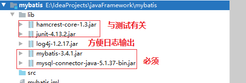


### 2.2 创建实体类与接口

~~~java
package com.atguigu.entity;

public class Employee {
    private String ename;
    private int eid;
    private int age;
    private String sex;

    public String getEname() {
        return ename;
    }

    public void setEname(String ename) {
        this.ename = ename;
    }

    public int getEid() {
        return eid;
    }

    public void setEid(int eid) {
        this.eid = eid;
    }

    public int getAge() {
        return age;
    }

    public void setAge(int age) {
        this.age = age;
    }

    public String getSex() {
        return sex;
    }

    public void setSex(String sex) {
        this.sex = sex;
    }

    @Override
    public String toString() {
        return "Employee{" +
                "ename='" + ename + '\'' +
                ", eid=" + eid +
                ", age=" + age +
                ", sex='" + sex + '\'' +
                '}';
    }

    public Employee() {
    }

    public Employee(String ename, int eid, int age, String sex) {
        this.ename = ename;
        this.eid = eid;
        this.age = age;
        this.sex = sex;
    }
}

~~~

~~~java
package com.atguigu.mapper;

import com.atguigu.entity.Employee;

public interface EmployeeMapper {
    Employee getEmployeeById(int eid);
}

~~~

### 2.3 创建接口映射文件

**又称为mapper映射文件，sql映射文件**

>这个接口映射文件要实现两个绑定：
>
>1.接口的全类名与接口映射文件的namespace保持一致
>
>2.操作数据库的标签体<select><insert><delete><update>的id属性与接口的方法名保持一致

~~~xml
<?xml version="1.0" encoding="UTF-8" ?>
<!DOCTYPE mapper
        PUBLIC "-//mybatis.org//DTD Mapper 3.0//EN"
        "http://mybatis.org/dtd/mybatis-3-mapper.dtd">
<!--
   说明：
      1.接口设置文件的根标签为mapper
      2.根标签mapper的namespace属性：这个属性的属性值用来绑定我们创建的接口，故值要设置为Mapper接口的全类名
-->
<mapper namespace="com.atguigu.mapper.EmployeeMapper">
    <!--
    说明：
       mapper根标签可以有子标签select,insert,update,delete
         id属性：设置为Mapper接口的方法名，也是sql语句的唯一标识
         resultType:设置方法的返回值的类型，即实体类的全限定名
    -->
    <select id="getEmployeeById" resultType="com.atguigu.entity.Employee">
        select ename,eid,age,sex from emp where eid = #{va1ue1}
    </select>

</mapper>
~~~

### 2.4 创建全局配置文件

**全局配置文件设置数据库连接的相关信息，并且注册接口映射文件！！！**

~~~xml
<?xml version="1.0" encoding="UTF-8" ?>
<!DOCTYPE configuration
        PUBLIC "-//mybatis.org//DTD Config 3.0//EN"
        "http://mybatis.org/dtd/mybatis-3-config.dtd">
<configuration>
    <environments default="development">
        <environment id="development">
            <transactionManager type="JDBC"/>
            <dataSource type="POOLED">
                <property name="driver" value="com.mysql.jdbc.Driver"/>
                <property name="url" value="jdbc:mysql://localhost:3306/mybatis"/>
                <property name="username" value="root"/>
                <property name="password" value="123456"/>
            </dataSource>
        </environment>
    </environments>
    <!--
        引入映射文件：注册Mapper映射文件（sql映射文件）
    -->
    <mappers>
        <mapper resource="com/atguigu/mapper/EmployeeMapper.xml"/>
    </mappers>
</configuration>
~~~

### 2.5 测试代码

~~~java
package com.atguigu.test;

import com.atguigu.entity.Employee;
import com.atguigu.mapper.EmployeeMapper;
import org.apache.ibatis.io.Resources;
import org.apache.ibatis.session.SqlSession;
import org.apache.ibatis.session.SqlSessionFactory;
import org.apache.ibatis.session.SqlSessionFactoryBuilder;
import org.junit.Test;

import java.io.IOException;
import java.io.InputStream;

public class MybatisTest {
    @Test
    public void test() throws IOException {
        //1.设置mybatis的全局配置文件路径
        String resource = "mybatis-config.xml";
        //2.读取mybatis的全局配置文件
        InputStream resourceAsStream = Resources.getResourceAsStream(resource);
        //3.创建SqlSessionFactory工厂
        SqlSessionFactory factory = new SqlSessionFactoryBuilder().build(resourceAsStream);
        //4.创建sqlSession对象.相当于connection对象.它是mybatis操作数据库的会话对象！
        SqlSession sqlSession = factory.openSession();
        //5.创建接口代理对象,返回代理实现类对象
        EmployeeMapper mapper = sqlSession.getMapper(EmployeeMapper.class);
        //调用EmployeeMapper接口的方法
        Employee employee = mapper.getEmployeeById(4);
        System.out.println(employee);
        //关闭SqlSession
        sqlSession.close();
    }
}

~~~

### 2.6 log4j配置文件

**这个配置文件不是必须的**

~~~Xml
<?xml version="1.0" encoding="UTF-8" ?>
<!DOCTYPE log4j:configuration SYSTEM "log4j.dtd">
 
<log4j:configuration xmlns:log4j="http://jakarta.apache.org/log4j/">
 
 <appender name="STDOUT" class="org.apache.log4j.ConsoleAppender">
   <param name="Encoding" value="UTF-8" />
   <layout class="org.apache.log4j.PatternLayout">
    <param name="ConversionPattern" value="%-5p %d{MM-dd HH:mm:ss,SSS} %m  (%F:%L) \n" />
   </layout>
 </appender>
 <logger name="java.sql">
   <level value="debug" />
 </logger>
 <logger name="org.apache.ibatis">
   <level value="info" />
 </logger>
 <root>
   <level value="debug" />
   <appender-ref ref="STDOUT" />
 </root>
</log4j:configuration>
~~~

**总结：**

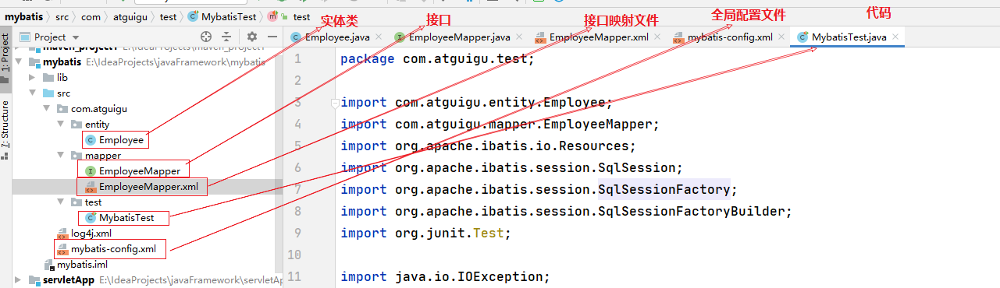

>1.搭建需要：实体类（映射结果集）、接口、两个配置文件
>
>2.全局配置文件是用来设置来连接数据库与绑定接口映射文件
>
>3.接口映射文件是用来编写SQL操作数据库

## 3.相关API

**Resources**

~~~java
org.apache.ibatis.io.Resources; 加载资源的工具类
~~~

| 返回值      | 方法名                                           | 说明                                 |
| ----------- | ------------------------------------------------ | ------------------------------------ |
| InputStream | InputStream getResourceAsStream(String resource) | 通过类加载器返回指定资源的字节输入流 |

****

**SqlSessionFactoryBuilder**

~~~java
org.apache.ibatis.session.SqlSessionFactoryBuilder 获取SqlSessionFactory工厂对象的功能类
~~~

| 返回值            | 方法名                                           | 说明                                                  |
| ----------------- | ------------------------------------------------ | ----------------------------------------------------- |
| SqlSessionFactory | SqlSessionFactory build(InputStream inputStream) | 通过指定资源的字节输入流获取SqlSessionFactory工厂对象 |

**SqlSessionFactory**

~~~java
org.apache.ibatis.session.SqlSessionFactory;获取SqlSession构建者对象的工厂！
~~~

| 返回值     | 方法名                    | 说明                                                    |
| ---------- | ------------------------- | ------------------------------------------------------- |
| SqlSession | openSession()             | 获取SqlSession构建者对象，并且开始手动提交事务          |
| SqlSession | openSession(boolean var1) | 获取SqlSession构建者对象，参数如果为true,则自动提交事务 |

**SqlSession**

~~~java
org.apache.ibatis.session.SqlSession;:构建者对象接口，用于执行sql，管理事务，接口代理！
~~~

| 返回值  | 方法名                               | 说明                           |
| ------- | ------------------------------------ | ------------------------------ |
| List<E> | selectList(String var1, Object var2) | 执行查询语句，返回List集合     |
| T       | selectOne(String var1, Object var2)  | 执行查询语句，返回一个结果对象 |
| int     | insert(String var1, Object var2)     | 执行新增语句，返回指定行数     |
| int     | update(String var1, Object var2)     | 执行修改语句，返回指定行数     |
| int     | delete(String var1, Object var2)     | 执行删除语句，返回指定行数     |
| void    | commit()                             | 提交事务                       |
| void    | rollback()                           | 回滚事务                       |
| T       | getMapper(Class<T> var1)             | 获取指定接口的代理实现类对象   |
| void    | close()                              | 释放资源                       |

>var1:接口映射文件的namespace+id
>
>var2:sql的参数

## 4.核心全局配置文件详解

**MyBatis 的核心全局配置文件包含了影响 MyBatis 行为甚深的设置（settings）和属性（properties）信息**

mybatis的核心配置文件的**可以配置的标签和标签的上下顺序是固定**的！如下所示：

~~~~~~xml
properties 属性
settings 设置
typeAliases 类型命名
typeHandlers 类型处理器
objectFactory 对象工厂
plugins 插件
environments 环境 
   environment 环境变量 
     transactionManager 事务管理器
     dataSource 数据源
databaseIdProvider 数据库厂商标识
mappers 映射器
~~~~~~

### 4.1 properties标签

>可外部配置且可动态替换的，既可以在典型的 Java 属性文件中配置，亦可通过 properties 元素的子元素来配置，用来给value属性值赋值

配置方式如下：

#### 4.1.1 直接使用property子标签给属性赋值

~~~xml
<?xml version="1.0" encoding="UTF-8" ?>
<!DOCTYPE configuration
        PUBLIC "-//mybatis.org//DTD Config 3.0//EN"
        "http://mybatis.org/dtd/mybatis-3-config.dtd">
<configuration>
    <!--
         properties标签作用：
             1.通过properties相关属性引入外部资源文件
               resource属性：引入类路径下的配置文件
               url属性：引入磁盘或者网络上的配置文件
             2.通过property子标签给属性赋值
    -->
    <properties>
        <property name="driver" value="com.mysql.jdbc.Driver" />
        <property name="url"
                  value="jdbc:mysql://localhost:3306/mybatis" />
        <property name="username" value="root" />
        <property name="password" value="123456" />
    </properties>

    <environments default="development">
        <environment id="development">
            <transactionManager type="JDBC"/>
            <dataSource type="POOLED">
                <!--
                    value值的加载顺序：
                       1.首先读取properties中property指定的属性值
                       2.加载外部属性文件的值（如果引入的外部属性文件中指定的key与第1步一致，则覆盖第1步的值）
                -->
                <property name="driver" value="${driver}"/>
                <property name="url" value="${url}"/>
                <property name="username" value="${username}"/>
                <property name="password" value="${password}"/>
            </dataSource>
        </environment>
    </environments>
    <!--
        引入映射文件：注册Mapper映射文件（sql映射文件）
    -->
    <mappers>
        <mapper resource="com/atguigu/mapper/EmployeeMapper.xml"/>
    </mappers>
</configuration>
~~~

#### 4.1.2 引入外部资源文件给属性赋值

创建db.properties文件

~~~java
username=root
password=123456
url=jdbc:mysql://localhost:3306/mybatis
driver=com.mysql.jdbc.Driver
~~~

~~~xml
<?xml version="1.0" encoding="UTF-8" ?>
<!DOCTYPE configuration
        PUBLIC "-//mybatis.org//DTD Config 3.0//EN"
        "http://mybatis.org/dtd/mybatis-3-config.dtd">
<configuration>
    <!--
         properties标签作用：
             1.通过properties相关属性引入外部资源文件
                resource属性：引入类路径下的配置文件
                url属性：引入磁盘或者网络上的配置文件
             2.通过property子标签给属性赋值
    -->
    <properties resource="db.properties">
    </properties>

    <environments default="development">
        <environment id="development">
            <transactionManager type="JDBC"/>
            <dataSource type="POOLED">
                <!--
                    value值的加载顺序：
                       1.首先读取properties中property指定的属性值
                       2.加载外部属性文件的值（如果引入的外部属性文件中指定的key与第1步一致，则覆盖第1步的值）
                -->
                <property name="driver" value="${driver}"/>
                <property name="url" value="${url}"/>
                <property name="username" value="${username}"/>
                <property name="password" value="${password}"/>
            </dataSource>
        </environment>
    </environments>
    <!--
        引入映射文件：注册Mapper映射文件（sql映射文件）
    -->
    <mappers>
        <mapper resource="com/atguigu/mapper/EmployeeMapper.xml"/>
    </mappers>
</configuration>
~~~

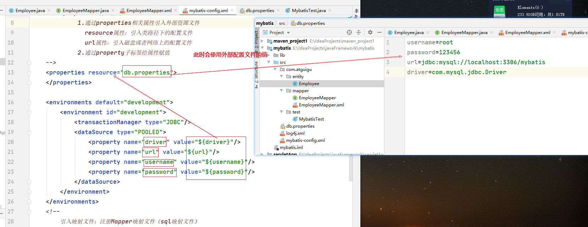

**注意：如果同时指定外部资源文件和property子标签，两者有同名的，以外部配置文件的为主**

~~~xml
 <properties resource="db.properties">
        <property name="username" value="roo2"/>
 </properties>
此时的username属性值以db.properties的username对应的值为主！
~~~

### 4.2 settings标签⭐

>这是 MyBatis 中极为重要的调整设置，定义全局设置，会改变 MyBatis 的运行时行为

| 设置值                   | 描述                                                         | 默认值 |
| ------------------------ | ------------------------------------------------------------ | ------ |
| mapUnderscoreToCamelCase | 是否开启驼峰命名自动映射：会将数据中的下划线字段转换为驼峰字段 | false  |
| cacheEnabled             | 缓存的全局开关                                               | true   |
| lazyLoadingEnabled       | 延迟加载的全局开关                                           | false  |
| aggressiveLazyLoading    | 开启时，任意方法的调用都会加载该对象的所有延迟加载属性，否则，每个延迟加载属性都会按需加载 | false  |
| useGeneratedKeys         | 允许JDBC支持自动生成主键，需要数据库驱动支持。如果设置为true,将强制使用自动生成主键 | false  |

使用案例：

~~~xml
 <settings>
        <!-- mapUnderscoreToCamelCase:将数据中的下划线字段转换为驼峰字段 user_name:userName-->
        <setting name="mapUnderscoreToCamelCase" value="true"/>
 </settings>
~~~

### 4.3 typeAliases 别名处理⭐

>用来指定别名

~~~xml
 <!--
           子标签typeAlias：可以给接口映射文件的返回值类型的全类名指定别名
                type属性：指定要起别名的类的全类名
                alias属性：指定别名，如果不指定，默认是类名的首字母小写，但是别名大小写不敏感，不区分大小写
           子标签package:通过指定包名，给包下所有的类起别名
-->
~~~

~~~xml
<?xml version="1.0" encoding="UTF-8" ?>
<!DOCTYPE configuration
        PUBLIC "-//mybatis.org//DTD Config 3.0//EN"
        "http://mybatis.org/dtd/mybatis-3-config.dtd">
<configuration>
    <!--
         properties标签作用：
             1.通过properties相关属性引入外部资源文件
               resource属性：引入类路径下的配置文件
               url属性：引入磁盘或者网络上的配置文件
             2.通过property子标签给属性赋值
    -->
    <properties resource="db.properties">
        <property name="username" value="roo2"/>
    </properties>

    <settings>
        <!-- mapUnderscoreToCamelCase:将数据中的下划线字段转换为驼峰字段 user_name:userName-->
        <setting name="mapUnderscoreToCamelCase" value="true"/>
    </settings>
    
    <typeAliases>
        <!--
           子标签typeAlias：可以给接口映射文件的返回值类型的全类名指定别名
                type属性：指定要起别名的类的全类名
                alias属性：指定别名，如果不指定，默认是类名的首字母小写，但是别名大小写不敏感，不区分大小写
           子标签package:通过指定包名，给包下所有的类起别名
        -->
        <typeAlias type="com.atguigu.entity.Employee" alias="employee" ></typeAlias>
    </typeAliases>
    
    <environments default="development">
        <environment id="development">
            <transactionManager type="JDBC"/>
            <dataSource type="POOLED">
                <!--
                    value值的加载顺序：
                       1.首先读取properties中property指定的属性值
                       2.加载外部属性文件的值（如果引入的外部属性文件中指定的key与第1步一致，则覆盖第1步的值）
                -->
                <property name="driver" value="${driver}"/>
                <property name="url" value="${url}"/>
                <property name="username" value="${username}"/>
                <property name="password" value="${password}"/>
            </dataSource>
        </environment>
    </environments>
    <!--
        引入映射文件：注册Mapper映射文件（sql映射文件）
    -->
    <mappers>
        <mapper resource="com/atguigu/mapper/EmployeeMapper.xml"/>
    </mappers>
</configuration>
~~~

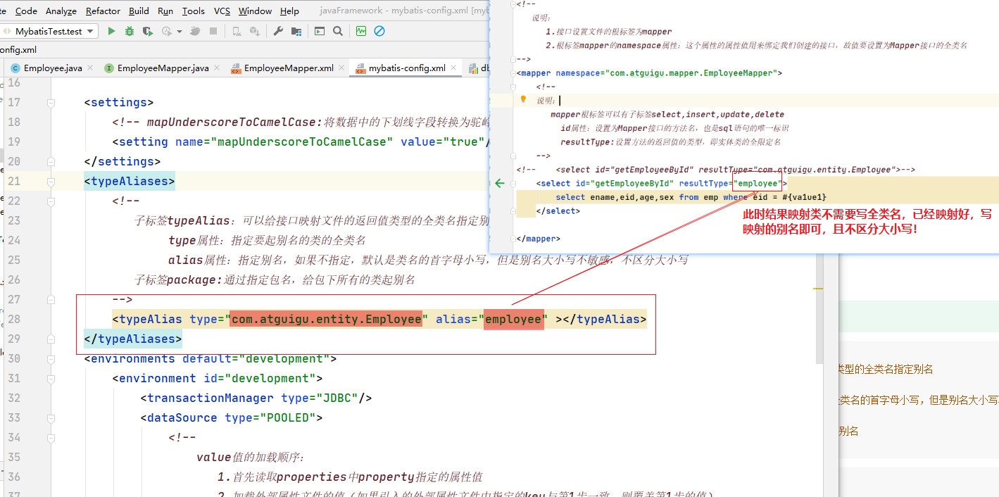

**mybatis中已经定义好的别名**

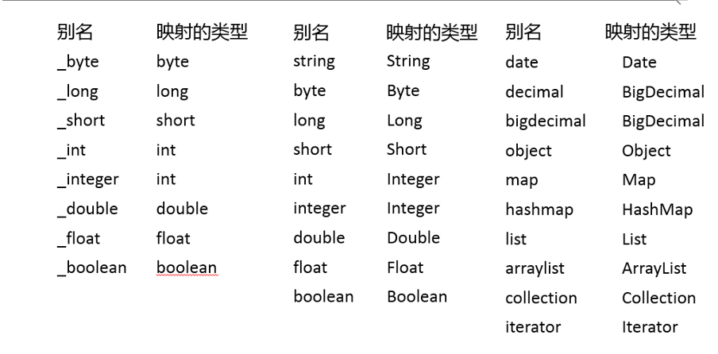

### 4.4 typeHandlers 类型处理器

>配置类处理器，主要用来处理特殊的数据类型：如日期，小数等，高版本处理的比较好！

~~~xml
 <typeHandlers>
        <typeHandler handler="配置类处理器的别名">
 </typeHandlers>
~~~

 自定义类型转换器

① 我们可以重写类型处理器或创建自己的类型处理器来处理不支持的或非标准的类 型

② 步骤

​           实现org.apache.ibatis.type.TypeHandler接口或者继承org.apache.ibatis.type.BaseTypeHandler

​           指定其映射某个JDBC类型（可选操作）

​           在mybatis全局配置文件中注册

### 4.5 plugins 插件机制

>插件是MyBatis提供的一个非常强大的机制，我们可以通过插件来修改MyBatis的一些核心行为。

~~~xml
<plugins>
       <plugin interceptor="配置插件的全类名"></plugin>
</plugins>
~~~

### 4.6 environments 环境配置⭐

>1) MyBatis可以配置多种环境，比如开发、测试和生产环境需要有不同的配置
>
>2) 每种环境使用一个environment标签进行配置并指定唯一标识符
>
>3) 可以通过environments标签中的default属性指定一个环境的标识符来快速的切换环境
>
>4) environment-指定具体环境
>
>​             id：指定当前环境的唯一标识
>
>​            transactionManager、和dataSource都必须有

~~~xml
<!-- 
        environments标签可以用来设置多个数据库环境，方便在不同环境数据库中来回切换
           属性default:指定当前使用的环境，与environment子标签的id属性值匹配
           子标签environment：设置某个具体的数据库环境，可以写多个，每个environment标签设置一套环境
                 id属性：数据库环境的唯一标识  
                 子标签transactionManager与dataSource都是必须的！！！
 -->
~~~

~~~xml
<environments default="oracle">
		<environment id="mysql">
            <!-- 
               type取值：JDBC|MANAGED
                   JDBC：使用JDBC原生的事务管理方式，即提交和回滚都需要手动处理
           -->
			<transactionManager type="JDBC" />
            <!-- 
               type取值：
                       POOLED：使用mybatis自带的数据库连接池
                       UNPOOLED:不使用数据库连接池
                       JNDI:调用上下文中的数据源
            -->
			<dataSource type="POOLED">
				<property name="driver" value="${jdbc.driver}" />
				<property name="url" value="${jdbc.url}" />
				<property name="username" value="${jdbc.username}" />
				<property name="password" value="${jdbc.password}" />
			</dataSource>
		</environment>
		 <environment id="oracle">
			<transactionManager type="JDBC"/>	
			<dataSource type="POOLED">
				<property name="driver" value="${orcl.driver}" />
				<property name="url" value="${orcl.url}" />
				<property name="username" value="${orcl.username}" />
				<property name="password" value="${orcl.password}" />
			</dataSource>
		</environment> 	
	</environments>
~~~

### 4.7 databaseIdProvider数据库厂商标识⭐

>这个标签主要用来指定不同的数据库的数据库厂商表示，MyBatis 可以根据不同的数据库厂商执行不同的语句，用来区别不同的数据库的“方言”！
>
>此时一个方法可以写多条SQL！

~~~xml
<!-- 
    databaseIdProvider标签：给不同的数据库厂商指定别名，然后再sql标签中通过databaseId属性引用别名
-->
<databaseIdProvider type="DB_VENDOR">
	 	<property name="MySQL" value="mysql"/>
	 	<property name="Oracle" value="oracle"/>
</databaseIdProvider>
~~~

Type： DB_VENDOR, 使用MyBatis提供的VendorDatabaseIdProvider解析数据库厂商标识。也可以实现DatabaseIdProvider接口来自定义.会通过 DatabaseMetaData#getDatabaseProductName() 返回的字符串进行设置。由于通常情况下这个字符串都非常长而且相同产品的不同版本会返回不同的值，所以最好通过设置属性别名来使其变短.

Property-name：数据库厂商标识

Property-value：为标识起一个别名，方便SQL语句使用databaseId属性引用

配置了databaseIdProvider后，在SQL映射文件中的增删改查标签中使用databaseId来指定数据库标识的别名

~~~xml
<select id="getEmployeeById"
         resultType="com.atguigu.mybatis.beans.Employee" 
         databaseId="mysql">
		 select * from tbl_employee where id = #{id}
</select>
~~~

~~~shell
MyBatis匹配规则如下:
①如果没有配置databaseIdProvider标签，那么databaseId=null
②如果配置了databaseIdProvider标签，使用标签配置的name去匹配数据库信息，匹配上设置databaseId=配置指定的值，否则依旧为null
③如果databaseId不为null，他只会找到配置databaseId的sql语句
④MyBatis 会加载不带 databaseId 属性和带有匹配当前数据库databaseId 属性的所有语句。如果同时找到带有 databaseId 和不带databaseId 的相同语句，则后者会被舍弃。
~~~

### 4.8 mappers 映射器⭐

>主要是用来注册SQL映射文件的！

~~~xml
<mappers>
        <!--
        子标签mapper:
            resource属性：指定类路径下的sql映射文件的路径
            url属性：指定磁盘或者网上sql映射文件的路径
            class属性：指定mapper接口的全类名
                      使用class属性注册sql映射文件的时候，映射文件必须与mapper接口同包同名
                      或者通过在Mapper接口上使用注解的方式来操作sql
        -->
        <mapper resource="com/atguigu/mapper/EmployeeMapper.xml"/>
        <!-- 
        子标签package:批量注册接口映射文件，
            这种方式要求SQL映射文件名必须和接口名相同并且在同一目录下，也就是Mapper接口和mapper映射文件必须在同一个包下
        -->
        <package name="指定包名"/>
</mappers>
~~~

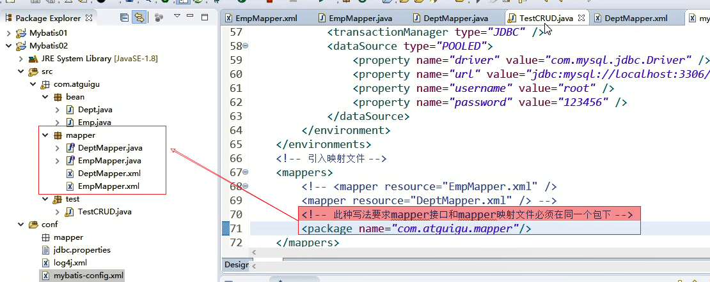

## 5.mybatis的接口映射文件

**接口映射文件主要是用来操作数据库的，我们要重点关注：1.不同类型的参数怎么传递给sql语句，2.返回值的类型**

MyBatis 的真正强大在于它的映射语句，也是它的魔力所在。由于它的异常强大，映射器的 XML 文件就显得相对简单。如果拿它跟具有相同功能的 JDBC 代码进行对比，你会立即发现省掉了将近 95% 的代码。MyBatis 就是针对 SQL 构建的，并且比普通的方法做的更好.

mybatis的接口映射文件中可以写的标签有：

~~~xml
cache – 给定命名空间的缓存配置。
cache-ref – 其他命名空间缓存配置的引用。
resultMap – 是最复杂也是最强大的元素，用来描述如何从数据库结果集中来加载对象。
sql – 可被其他语句引用的可重用语句块。
insert – 映射插入语句
update – 映射更新语句
delete – 映射删除语句
select – 映射查询语句
~~~

### 5.1 Mybatis实现CRUD⭐

 **select标签的属性说明**：

select标签中可以用以下属性：

- resultType: 设置方法的返回值类型，如果返回的试剂盒，那应该设置为集合包含的类型，而不是集合本身的类型。
- resultMap:设置对外的resultMap高级结果集标签的引用，resultType与resultMap之间只能使用其中一个
- flushCache:将其设置为true以后，只要语句被调用，都会导致本地混村和二级缓存被清空，默认值false
- useCache:将其设置为true后，将会导致本条语句的结果被二级缓存缓存起来。默认值：对select为true

**insert，update，delete标签属性说明**

标签中可以用以下属性：

- flushCache:将其设置为true以后，只要语句被调用，都会导致本地混村和二级缓存被清空，默认值（对insert,delete,update语句）false
- useGenerateKeys:**仅仅适用于insert和update**，会令mybatis使用JDBC的getGeneratedKeys方法来取出由数据库内部生成的主键，默认值false
- keyProperty:**仅仅适用于insert和update**,指定能够为一识别对象的属性，mybatis会使用useGenerateKeys的返回值或者insert语句的selectKey子元素设置它的值
- keyColumn:**仅仅适用于insert和update**,设置生成键值在表中的列名

**实体类**

~~~java
package com.atguigu.entity;

public class Employee {
    private String ename;
    private int eid;
    private int age;
    private String sex;
    private int did;

    public int getDid() {
        return did;
    }

    public void setDid(int did) {
        this.did = did;
    }

    public String getEname() {
        return ename;
    }

    public void setEname(String ename) {
        this.ename = ename;
    }

    public int getEid() {
        return eid;
    }

    public void setEid(int eid) {
        this.eid = eid;
    }

    public int getAge() {
        return age;
    }

    public void setAge(int age) {
        this.age = age;
    }

    public String getSex() {
        return sex;
    }

    public void setSex(String sex) {
        this.sex = sex;
    }

    @Override
    public String toString() {
        return "Employee{" +
                "ename='" + ename + '\'' +
                ", eid=" + eid +
                ", age=" + age +
                ", sex='" + sex + '\'' +
                ", did=" + did +
                '}';
    }

    public Employee() {
    }

    public Employee(int eid,String ename, int age, String sex, int did) {
        this.ename = ename;
        this.eid = eid;
        this.age = age;
        this.sex = sex;
        this.did = did;
    }
}

~~~

**接口**

~~~java
package com.atguigu.mapper;

import com.atguigu.entity.Employee;

public interface EmployeeMapper {
    Employee getEmployeeById(int eid);
    void addEmployee(Employee employee);
    void updateEmployee(Employee employee);
    void deleteEmployee(int eid);
}

~~~

**接口映射文件**

~~~xml
<?xml version="1.0" encoding="UTF-8" ?>
<!DOCTYPE mapper
        PUBLIC "-//mybatis.org//DTD Mapper 3.0//EN"
        "http://mybatis.org/dtd/mybatis-3-mapper.dtd">
<!--
   说明：
      1.接口设置文件的根标签为mapper
      2.根标签mapper的namespace属性：这个属性的属性值用来绑定我们创建的接口，故值要设置为Mapper接口的全类名
-->
<mapper namespace="com.atguigu.mapper.EmployeeMapper">
    <!--
    说明：
       mapper根标签可以有子标签select,insert,update,delete
         id属性：设置为Mapper接口的方法名，也是sql语句的唯一标识
         resultType:设置方法的返回值的类型，即实体类的全限定名
    -->
<!--    <select id="getEmployeeById" resultType="com.atguigu.entity.Employee">-->
    <select id="getEmployeeById" resultType="employee">
        select ename,eid,age,sex from emp where eid = #{va1ue1}
    </select>

    <!-- 添加
       parameterType属性：设置参数的类型，也可以不指定，mybatis有参数类型自动推断机制！
    -->
    <insert id="addEmployee" parameterType="com.atguigu.entity.Employee">
         insert into emp (ename,eid,age,sex,did)
      values(#{ename},#{eid},#{age},#{sex},#{did})
    </insert>
    <!-- 更新-->
    <update id="updateEmployee" >
         update emp set ename = #{ename},age=#{age},sex=#{sex}
      where eid =#{eid}
    </update>
    <!--修改 -->
    <delete id="deleteEmployee" >
         delete from emp  where eid=#{eid}
    </delete>
</mapper>
~~~

**核心配置文件**

~~~xml
<?xml version="1.0" encoding="UTF-8" ?>
<!DOCTYPE configuration
        PUBLIC "-//mybatis.org//DTD Config 3.0//EN"
        "http://mybatis.org/dtd/mybatis-3-config.dtd">
<configuration>
    <!--
         properties标签作用：
             1.通过properties相关属性引入外部资源文件
               resource属性：引入类路径下的配置文件
               url属性：引入磁盘或者网络上的配置文件
             2.通过property子标签给属性赋值
    -->
    <properties resource="db.properties">
        <property name="username" value="roo2"/>
    </properties>

    <typeAliases>
        <!--
           子标签typeAlias：可以给接口映射文件的返回值类型的全类名指定别名
                type属性：指定要起别名的类的全类名
                alias属性：指定别名，如果不指定，默认是类名的首字母小写，但是别名大小写不敏感，不区分大小写
           子标签package:通过指定包名，给包下所有的类起别名
        -->
        <typeAlias type="com.atguigu.entity.Employee" alias="employee" ></typeAlias>
    </typeAliases>

    <!--
        environments标签可以用来设置多个数据库环境，方便在不同环境数据库中来回切换
           属性default:指定当前使用的环境，与environment子标签的id属性值匹配
           子标签environment：可以写多个，每个environment标签设置一套环境
                   transactionManager与dataSource都是必须的！！！
    -->
    <environments default="development">
        <environment id="development">
            <transactionManager type="JDBC"/>
            <dataSource type="POOLED">
                <!--
                    value值的加载顺序：
                       1.首先读取properties中property指定的属性值
                       2.加载外部属性文件的值（如果引入的外部属性文件中指定的key与第1步一致，则覆盖第1步的值）
                -->
                <property name="driver" value="${driver}"/>
                <property name="url" value="${url}"/>
                <property name="username" value="${username}"/>
                <property name="password" value="${password}"/>
            </dataSource>
        </environment>
    </environments>


    <mappers>
        <!--
        子标签mapper:
            resource属性：指定类路径下的sql映射文件的路径
            url属性：指定磁盘或者网上sql映射文件的路径
            class属性：指定mapper接口的全类名
                      使用class属性注册sql映射文件的时候，映射文件必须与mapper接口同包同名
                      或者通过在Mapper接口上使用注解的方式来操作sql
        -->
        <mapper resource="com/atguigu/mapper/EmployeeMapper.xml"/>
        <!-- 
        子标签package:批量注册，
            这种方式要求SQL映射文件名必须和接口名相同并且在同一目录下
        -->
        <package name="指定包名"/>
    </mappers>
</configuration>
~~~

**测试代码之新增**

~~~java
package com.atguigu.test;

import com.atguigu.entity.Employee;
import com.atguigu.mapper.EmployeeMapper;
import org.apache.ibatis.io.Resources;
import org.apache.ibatis.session.SqlSession;
import org.apache.ibatis.session.SqlSessionFactory;
import org.apache.ibatis.session.SqlSessionFactoryBuilder;
import org.junit.Test;

import java.io.IOException;
import java.io.InputStream;

public class MybatisTest {
    @Test
    public void test() throws IOException {
        //1.设置mybatis的全局配置文件路径
        String resource = "mybatis-config.xml";
        //2.读取mybatis的全局配置文件
        InputStream resourceAsStream = Resources.getResourceAsStream(resource);
        //3.创建SqlSessionFactory工厂
        SqlSessionFactory factory = new SqlSessionFactoryBuilder().build(resourceAsStream);
        //4.创建sqlSession对象.相当于connection对象.它是mybatis操作数据库的会话对象！
        SqlSession sqlSession = factory.openSession();
        //5.创建接口代理对象,返回代理实现类对象
        EmployeeMapper mapper = sqlSession.getMapper(EmployeeMapper.class);
        Employee emp = new Employee(8,"二蛋",18,"人妖",5);
        mapper.addEmployee(emp);
        sqlSession.commit();
        sqlSession.close();
    }
}

~~~

**测试代码之修改**

~~~java
package com.atguigu.test;

import com.atguigu.entity.Employee;
import com.atguigu.mapper.EmployeeMapper;
import org.apache.ibatis.io.Resources;
import org.apache.ibatis.session.SqlSession;
import org.apache.ibatis.session.SqlSessionFactory;
import org.apache.ibatis.session.SqlSessionFactoryBuilder;
import org.junit.Test;

import java.io.IOException;
import java.io.InputStream;

public class MybatisTest {
    @Test
    public void test() throws IOException {
        //1.设置mybatis的全局配置文件路径
        String resource = "mybatis-config.xml";
        //2.读取mybatis的全局配置文件
        InputStream resourceAsStream = Resources.getResourceAsStream(resource);
        //3.创建SqlSessionFactory工厂
        SqlSessionFactory factory = new SqlSessionFactoryBuilder().build(resourceAsStream);
        //4.创建sqlSession对象.相当于connection对象.它是mybatis操作数据库的会话对象！
        SqlSession sqlSession = factory.openSession();
        //5.创建接口代理对象,返回代理实现类对象
        EmployeeMapper mapper = sqlSession.getMapper(EmployeeMapper.class);
        Employee emp = new Employee(8,"小二蛋",20,"男",8);
        mapper.updateEmployee(emp);
        sqlSession.commit();
        sqlSession.close();
    }
}
~~~

**测试代码之删除**

~~~java
package com.atguigu.test;

import com.atguigu.entity.Employee;
import com.atguigu.mapper.EmployeeMapper;
import org.apache.ibatis.io.Resources;
import org.apache.ibatis.session.SqlSession;
import org.apache.ibatis.session.SqlSessionFactory;
import org.apache.ibatis.session.SqlSessionFactoryBuilder;
import org.junit.Test;

import java.io.IOException;
import java.io.InputStream;

public class MybatisTest {
    @Test
    public void test() throws IOException {
        //1.设置mybatis的全局配置文件路径
        String resource = "mybatis-config.xml";
        //2.读取mybatis的全局配置文件
        InputStream resourceAsStream = Resources.getResourceAsStream(resource);
        //3.创建SqlSessionFactory工厂
        SqlSessionFactory factory = new SqlSessionFactoryBuilder().build(resourceAsStream);
        //4.创建sqlSession对象.相当于connection对象.它是mybatis操作数据库的会话对象！
        SqlSession sqlSession = factory.openSession();
        //5.创建接口代理对象,返回代理实现类对象
        EmployeeMapper mapper = sqlSession.getMapper(EmployeeMapper.class);
        mapper.deleteEmployee(8);
        sqlSession.commit();
        sqlSession.close();
    }
}
~~~

**注意：**

>如果SqlSessionFactory调用OPenSession（）方法时没有传入true，则需要手动提交事务，此时需要用到代码：
>
>sqlSession.commit();//自动处理事务

### 5.2 增删改的返回值⭐

>在上述增删改的代码中，他们的返回值都被我们写成了void，但实际上增删改的返回值也可以是**Boolean或者Integer**
>
>数值代表受影响的行数，布尔代表是否操作成功！
>
>不过增删改在配置文件中不用写resultType属性！！！

### 5.3 主键生成方式，获取主键值⭐

>插入数据后获取数据库自动增长的主键值，并且将主键值映射到实体类相应属性上！

mysql支持主键自增，oracle不支持主键自增！

若**数据库支持自动生成主键**的字段（比如 MySQL 和 SQL Server），则可以设置 useGeneratedKeys=”true”,**此时会获取数据库自动生成的主键值**，然后再把 keyProperty 设置到目标属性上。

>useGeneratedKeys属性：用来设置是否让JDBC返回自增的主键值，如果为true则返回主键
>
> keyProperty属性：返回的主键值设置给映射实体类POJO的哪个属性，自动生成的主键赋值给传递过来的参数的哪一个属性！

~~~xml
<!-- 
    parameterType属性：设置参数的类型，也可以不指定，myabatis可以自动推断
    useGeneratedKeys属性：用来设置是否让JDBC返回自增的主键值，如果为true则返回主键
    keyProperty属性：返回的主键值设置给映射实体类POJO的哪个属性
-->
<insert id="insertEmployee" parameterType="com.atguigu.mybatis.beans.Employee"  
			databaseId="mysql"
			useGeneratedKeys="true"
			keyProperty="id">
		insert into tbl_employee(last_name,email,gender) values(#{lastName},#{email},#{gender})
</insert>
~~~

而**对于不支持自增型主键**的数据库（例如 Oracle），则可以使用 selectKey 子元素：selectKey 元素将会首先运行，id 会被设置，然后插入语句会被调用

~~~xml
<insert id="insertEmployee" 
		parameterType="com.atguigu.mybatis.beans.Employee"  
			databaseId="oracle">
		<selectKey order="BEFORE" keyProperty="id" 
                                       resultType="integer">
			select employee_seq.nextval from dual 
		</selectKey>	
		insert into orcl_employee(id,last_name,email,gender) values(#{id},#{lastName},#{email},#{gender})
</insert>
~~~

或者

~~~xml
<insert id="insertEmployee" 
		parameterType="com.atguigu.mybatis.beans.Employee"  
			databaseId="oracle">
		<selectKey order="AFTER" keyProperty="id" 
                                         resultType="integer">
            <!-- 会将selectkey里面运行的结果赋值给keyProperty指定的id-->
			select employee_seq.currval from dual 
		</selectKey>	
	insert into orcl_employee(id,last_name,email,gender) values(employee_seq.nextval,#{lastName},#{email},#{gender})
</insert>
~~~

### 5.4 Mybatis查询的4种情况⭐

~~~java
// 1.查询单行数据返回单个对象
public Employee getEmployeeById(Integer id );

// 2.查询多行数据返回对象的集合
public List<Employee> getAllEmps();

// 3.查询单行数据返回Map集合
此时数据库中的字段名为key，数据库中的字段值为value
public Map<String,Object> getEmployeeByIdReturnMap(Integer id );

// 4.查询多行数据返回Map集合
@MapKey("id") // 指定使用对象的哪个属性来充当map的key
public Map<Integer,Employee>  getAllEmpsReturnMap();
~~~

**接口**

~~~java
package com.atguigu.mapper;

import com.atguigu.entity.Employee;
import org.apache.ibatis.annotations.MapKey;

import java.util.List;
import java.util.Map;

public interface EmployeeMapper {
    // 1.查询单行数据返回单个对象
    Employee getEmployeeById(int eid);
    // 2.查询多行数据返回对象的集合
    List<Employee> getAllEmployee();
    // 3.查询单行数据返回Map集合
    Map<String,Object> getEmployeeReturnMap(int eid);
    // 4.查询多行数据返回Map集合
    @MapKey("eid") // 需要通过 @MapKey注解指定返回的多个Employee对象中的key是数据中的那个字段的值
    Map<Integer,Employee> getEmployeeReturnMaps();
}

~~~

**接口配置文件**

~~~xml
<?xml version="1.0" encoding="UTF-8" ?>
<!DOCTYPE mapper
        PUBLIC "-//mybatis.org//DTD Mapper 3.0//EN"
        "http://mybatis.org/dtd/mybatis-3-mapper.dtd">
<!--
   说明：
      1.接口设置文件的根标签为mapper
      2.根标签mapper的namespace属性：这个属性的属性值用来绑定我们创建的接口，故值要设置为Mapper接口的全类名
-->
<mapper namespace="com.atguigu.mapper.EmployeeMapper">
    <!--
    说明：
       mapper根标签可以有子标签select,insert,update,delete
         id属性：设置为Mapper接口的方法名，也是sql语句的唯一标识
         resultType:设置方法的返回值的类型，即实体类的全限定名
    -->

    <select id="getEmployeeById" resultType="com.atguigu.entity.Employee">
        select ename,eid,age,sex from emp where eid = #{va1ue1}
    </select>

    <!-- 当mapper方法的返回值是一个list集合是，指定的resultType的值是集合中泛型的类型-->
    <select id="getAllEmployee" resultType="com.atguigu.entity.Employee">
        select  * from emp;
    </select>

    <!-- 查询单行数据返回Map集合，此地resultType是一个map
         map中的key是数据库中的字段名，值就是字段对应的值
    -->
    <select id="getEmployeeReturnMap" resultType="map">
        select ename,eid,age,sex from emp where eid = #{eid}
    </select>
    
    <!-- 此地resultType是一个map-->
    <select id="getEmployeeReturnMaps" resultType="map">
        select ename,eid,age,sex,did from emp;
    </select>
</mapper>
~~~

### 5.5 Mybatis获取参数值的两种方式⭐

>mybatis获取参数值的两种方式：
>
>${}:底层使用的是Statement。必须使用字符串拼接的方式来操作sql，一定要注意**单引号问题**
>
>#{}:底层使用的是PreparedStatement.可以使用通配符操作Sql,因为在为String赋值时，可以自动加单引号，因此**不需要注意单引号问题！**

**不同的参数类型，${}与#{}的不同取值方式**🌙

- **1.当传递的参数为单个String或者基本数据类型及其包装类**

~~~shell
#{}:可以使用任意的名字获取参数
${}:只能以${value}或者${_parameter}来获取
~~~

- **2.当传输参数为javaBean时候**

~~~shell
#{}与${}都可以通过属性名直接获取属性值，但是要注意${}的字符串要加单引号问题！
~~~

- **3.当传输多个参数时，mybatis会默认将这些参数放在map集合中，两种方式：**

​           第一种方式，键为0，1，2，3，4...n-1，以参数值为值

​           第二种方式，键为param1,param2,...paramn，以参数值为值

>任意多个参数，都会被MyBatis重新包装成一个Map传入。Map的key是param1，param2，或者0，1…，值就是参数的值

~~~shell
#{}：有两种方式：
   方式1：#{索引值}，索引从0开始，如#{0},#{1}
   方式2：#{param1}.#{param2}....
${}:只有一种方式：
   ${param1}.${param2}....
~~~

~~~java
package com.atguigu.mapper;


import com.atguigu.entity.Employee;

public interface EmployeeMapper {
    Employee getEmployeeByEidAndEname(int eid,String ename);// 这里传递了多个参数，mybatis内部会将其封装成一个map
}

~~~

~~~xml
<select id="getEmployeeByEidAndEname" resultType="com.atguigu.entity.Employee">
        <!-- #{}有两种方式：-->
        select * from emp where eid=#{0} and ename = #{1}
        select * from emp where eid=#{param1} and ename = #{param2}
        <!-- ${}有一种方式：且需要注意单引号拼接字符串问题-->
        select * from emp where eid= ${param1} and ename = '${param2}'
</select>
~~~

- **4.当传输的参数为map参数时**

~~~shell
#{}与${}都可以通过键的名字直接获取值，但是要注意${}的单引号字符串拼接问题
~~~

~~~java
package com.atguigu.mapper;


import com.atguigu.entity.Employee;

import java.util.Map;

public interface EmployeeMapper {
    // 通过参数mao获取emp
    Employee getEmpByMap(Map<String ,Object> map);
}

~~~

~~~xml
<?xml version="1.0" encoding="UTF-8" ?>
<!DOCTYPE mapper
        PUBLIC "-//mybatis.org//DTD Mapper 3.0//EN"
        "http://mybatis.org/dtd/mybatis-3-mapper.dtd">
<!--
   说明：
      1.接口设置文件的根标签为mapper
      2.根标签mapper的namespace属性：这个属性的属性值用来绑定我们创建的接口，故值要设置为Mapper接口的全类名
-->
<mapper namespace="com.atguigu.mapper.EmployeeMapper">
    <!--
    说明：
       mapper根标签可以有子标签select,insert,update,delete
         id属性：设置为Mapper接口的方法名，也是sql语句的唯一标识
         resultType:设置方法的返回值的类型，即实体类的全限定名
    -->
   <select id="getEmpByMap" resultType="com.atguigu.entity.Employee">
       select  * from emp where eid=${eid} and ename ='${ename}'
   </select>
</mapper>
~~~

~~~java
package com.atguigu.test;

import com.atguigu.entity.Employee;
import com.atguigu.mapper.EmployeeMapper;
import jdk.nashorn.internal.ir.CallNode;
import org.apache.ibatis.io.Resources;
import org.apache.ibatis.session.SqlSession;
import org.apache.ibatis.session.SqlSessionFactory;
import org.apache.ibatis.session.SqlSessionFactoryBuilder;
import org.junit.Test;

import java.io.IOException;
import java.io.InputStream;
import java.util.HashMap;
import java.util.Map;


public class MybatisTest {
    @Test
    public void test() throws IOException {
        //1.设置mybatis的全局配置文件路径
        String resource = "mybatis-config.xml";
        //2.读取mybatis的全局配置文件
        InputStream resourceAsStream = Resources.getResourceAsStream(resource);
        //3.创建SqlSessionFactory工厂
        SqlSessionFactory factory = new SqlSessionFactoryBuilder().build(resourceAsStream);
        //4.创建sqlSession对象.相当于connection对象.它是mybatis操作数据库的会话对象！
        SqlSession sqlSession = factory.openSession(true);
        //5.创建接口代理对象,返回代理实现类对象
        EmployeeMapper mapper = sqlSession.getMapper(EmployeeMapper.class);
        Map<String,Object> map = new HashMap<>();
        map.put("eid",4);
        map.put("ename","张三三");
        Employee empByMap = mapper.getEmpByMap(map);
        System.out.println(empByMap);
    }
}
~~~

- **5.命名参数：注解@Param**

**可以通过@Param("key")**来为map集合指定键的名字

通过上面可以直到，对于多个参数传递的情况，我们如果要获取参数，要么将其封装成一个我们map，通过map的键获取值；要么直接多个参数按照顺序书写，此时mybatis自己会将其封装成一个键为0，1....或者键param1，param2...的map集合。获取参数的方式是通过#{索引值}或者#{param}或者${param}来获取的，我们实际上可以**通过注解@Param("key")来为mybatis内部封装的map集合指定键的名字**！

>为参数使用@Param起一个名字，MyBatis就会将这些参数封装进map中，key就是我们自己指定的名字

~~~shell
#{}与${}都可以通过键的名字直接获取值，但是要注意${}的单引号字符串拼接问题
~~~

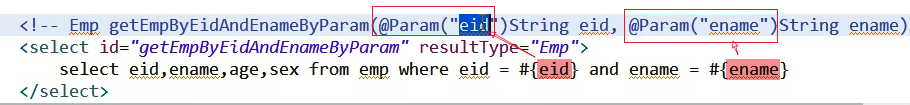

- **6.当传输参数为List或者Array**

~~~shell
mybatis会将List或者Array放在map中
List以list为键，Array以array为键
~~~

### 5.6 高级映射⭐使用resultMap来自定义映射

>resultMap标签：自定义映射，用来处理复杂的表关系！！！
>
>​              1.子标签 id:设置主键的映射关系，其属性column设置数据库的字段名，其属性property设置数据库字段对应的属性名
>
>​              2.子标签result:设置非主键的映射关系，其属性column设置数据库的字段名，其属性property设置数据库字段对应的属性名
>
>​              3.子标签association：**（处理一对一或者多对一）**用来处理复杂属性的映射或者分步查询，属性property：要处理的属性的属性名，属性javaType：要处理的属性对用的java类型，此时必须要指定，因为会通过反射创建对象！
>
>​              4.子标签collection:**（处理一对多或者多对多）**用来处理复杂属性的映射或者分步查询，属性property：要处理的属性的属性名，**属性ofType:代表集合中的映射**，不需要指定javaType
>
>​            并且3.4标签都有子标签：子标签 id、子标签result

#### 5.6.1 多对一自定义映射

**有几种写法，注意看接口映射文件的不同！**虽然接口映射文件的写法不同，但是都可以完成复杂的关系映射

多个员工信息对应一个部门信息，这实际上就是多对一，但是实际上一个员工信息只有一个有关的部门信息。

实体类：

部门实体类

~~~java
package com.atguigu.entity;

public class Dept {
    private int did;
    private String dname;

    public int getDid() {
        return did;
    }

    public void setDid(int did) {
        this.did = did;
    }

    public String getDname() {
        return dname;
    }

    public void setDname(String dname) {
        this.dname = dname;
    }

    @Override
    public String toString() {
        return "Dept{" +
                "did=" + did +
                ", dname='" + dname + '\'' +
                '}';
    }

    public Dept() {
    }

    public Dept(int did, String dname) {
        this.did = did;
        this.dname = dname;
    }
}

~~~

员工实体类**，里面有一个部门实体类对象的属性**

~~~java
package com.atguigu.entity;

public class Employee {
    private String ename;
    private int eid;
    private int age;
    private String sex;
    private Dept  dept;

    public Dept getDept() {
        return dept;
    }

    public void setDept(Dept dept) {
        this.dept = dept;
    }

    public String getEname() {
        return ename;
    }

    public void setEname(String ename) {
        this.ename = ename;
    }

    public int getEid() {
        return eid;
    }

    public void setEid(int eid) {
        this.eid = eid;
    }

    public int getAge() {
        return age;
    }

    public void setAge(int age) {
        this.age = age;
    }

    public String getSex() {
        return sex;
    }

    public void setSex(String sex) {
        this.sex = sex;
    }

    public Employee(String ename, int eid, int age, String sex, Dept dept) {
        this.ename = ename;
        this.eid = eid;
        this.age = age;
        this.sex = sex;
        this.dept = dept;
    }

    public Employee() {
    }

    @Override
    public String toString() {
        return "Employee{" +
                "ename='" + ename + '\'' +
                ", eid=" + eid +
                ", age=" + age +
                ", sex='" + sex + '\'' +
                ", dept=" + dept +
                '}';
    }
}

~~~

**接口**

~~~java
package com.atguigu.mapper;

import com.atguigu.entity.Employee;

import java.util.List;

public interface EmpDeptMapper {
    List<Employee> getAllEmp();
}

~~~

**映射文件写法1**🌙

**直接通过属性对象.属性名**的方式，给对象属性赋值,也就是**级联方式**

~~~xml
<?xml version="1.0" encoding="UTF-8" ?>
<!DOCTYPE mapper
        PUBLIC "-//mybatis.org//DTD Mapper 3.0//EN"
        "http://mybatis.org/dtd/mybatis-3-mapper.dtd">
<mapper namespace="com.atguigu.mapper.EmpDeptMapper">
  <!-- 
  resultMap标签：自定义映射，用来处理复杂的表关系！！！
           子标签id:设置主键的映射关系，其属性column设置数据库的字段名，其属性property设置数据库字段对应的属性名
           子标签result:设置非主键的映射关系，其属性column设置数据库的字段名，其属性property设置数据库字段对应的属性名
  -->
  <resultMap id="EmpMap" type="com.atguigu.entity.Employee">
      <id column="eid" property="eid"></id>
      <result column="ename" property="ename"></result>
      <result column="age" property="age"></result>
      <result column="sex" property="sex"></result>
      
      <!-- 级联操作，将属性的dept.did映射成查询出来的字段的did-->
      <!-- 级联操作，将属性的dept.dname映射成查询出来的字段的dname-->
      <result column="did" property="dept.did"></result>
      <result column="dname" property="dept.dname"></result>
      
  </resultMap>
 
  <select id="getAllEmp" resultMap="EmpMap">
      select e.eid,e.sex,e.age,e.ename,e.did,d.dname
      from emp e left join dep d
      on e.did = d.did;
  </select>


</mapper>
~~~

****

**映射文件写法2**🌙

**通过resultMap标签的子标签association给对象属性映射值**

>POJO中的属性可能会是一个对象,我们可以使用联合查询，并以级联属性的方式封装对象.使用association标签定义对象的封装规则

~~~xml
<?xml version="1.0" encoding="UTF-8" ?>
<!DOCTYPE mapper
        PUBLIC "-//mybatis.org//DTD Mapper 3.0//EN"
        "http://mybatis.org/dtd/mybatis-3-mapper.dtd">
<mapper namespace="com.atguigu.mapper.EmpDeptMapper">
     <!-- 
  resultMap标签：自定义映射，用来处理复杂的表关系！！！
           子标签id:设置主键的映射关系，其属性column设置数据库的字段名，其属性property设置数据库字段对应的属性名
           子标签result:设置非主键的映射关系，其属性column设置数据库的字段名，其属性property设置数据库字段对应的属性名
  -->
  <resultMap id="EmpMap" type="com.atguigu.entity.Employee">
      <id column="eid" property="eid"></id>
      <result column="ename" property="ename"></result>
      <result column="age" property="age"></result>
      <result column="sex" property="sex"></result>
      
      <!--
       association标签：用来处理复杂属性的映射,实际上会通过javaType帮我们创建属性对应的对象，并且将查询出来的字段赋值给创建的属性对象的属性
         属性property：要处理的属性的属性名
         属性javaType：要处理的属性对用的java类型，此时必须要指定，因为会通过反射创建对象！
       -->
      <association property="dept" javaType="com.atguigu.entity.Dept">
          <id column="did" property="did"></id>
          <result column="dname" property="dname"></result>
      </association>
      
  </resultMap>

    
    
  <select id="getAllEmp" resultMap="EmpMap">
      select e.eid,e.sex,e.age,e.ename,e.did,d.dname
      from emp e left join dep d
      on e.did = d.did;
  </select>

</mapper>
~~~

**核心配置文件**

~~~xml
<?xml version="1.0" encoding="UTF-8" ?>
<!DOCTYPE configuration
        PUBLIC "-//mybatis.org//DTD Config 3.0//EN"
        "http://mybatis.org/dtd/mybatis-3-config.dtd">
<configuration>
    <!--
         properties标签作用：
             1.通过properties相关属性引入外部资源文件
               resource属性：引入类路径下的配置文件
               url属性：引入磁盘或者网络上的配置文件
             2.通过property子标签给属性赋值
    -->
    <properties resource="db.properties">
        <property name="username" value="roo2"/>
    </properties>

    <environments default="development">
        <environment id="development">
            <transactionManager type="JDBC"/>
            <dataSource type="POOLED">
                <!--
                    value值的加载顺序：
                       1.首先读取properties中property指定的属性值
                       2.加载外部属性文件的值（如果引入的外部属性文件中指定的key与第1步一致，则覆盖第1步的值）
                -->
                <property name="driver" value="${driver}"/>
                <property name="url" value="${url}"/>
                <property name="username" value="${username}"/>
                <property name="password" value="${password}"/>
            </dataSource>
        </environment>
    </environments>
    <mappers>
        <mapper resource="EmpDeptMapper.xml"/>
    </mappers>
</configuration>
~~~

**测试代码**

~~~java
package com.atguigu.test;

import com.atguigu.entity.Employee;
import com.atguigu.mapper.EmpDeptMapper;
import com.atguigu.mapper.EmployeeMapper;
import org.apache.ibatis.io.Resources;
import org.apache.ibatis.session.SqlSession;
import org.apache.ibatis.session.SqlSessionFactory;
import org.apache.ibatis.session.SqlSessionFactoryBuilder;
import org.junit.Test;

import java.io.IOException;
import java.io.InputStream;
import java.util.HashMap;
import java.util.List;
import java.util.Map;


public class MybatisTest {
    @Test
    public void test() throws IOException {
        //1.设置mybatis的全局配置文件路径
        String resource = "mybatis-config.xml";
        //2.读取mybatis的全局配置文件
        InputStream resourceAsStream = Resources.getResourceAsStream(resource);
        //3.创建SqlSessionFactory工厂
        SqlSessionFactory factory = new SqlSessionFactoryBuilder().build(resourceAsStream);
        //4.创建sqlSession对象.相当于connection对象.它是mybatis操作数据库的会话对象！
        SqlSession sqlSession = factory.openSession(true);
        //5.创建接口代理对象,返回代理实现类对象
        EmpDeptMapper mapper = sqlSession.getMapper(EmpDeptMapper.class);
        List<Employee> allEmp = mapper.getAllEmp();
        System.out.println(allEmp);
    }
}

~~~

#### 5.6.2 多对一的分布查询

**分布查询是通过两个或者更多的SQL去查询的！**

>在5.6.1中，我们是一步将员工信息和员工所在的部门信息给查询出来，也就是在一个接口映射文件中写一条Sql来实现！我们也可以分步实现，有**专门查询Employee的sql，也有专门查询DepT的sql，我们将两个接口，两个sql,两个方法，两个接口对应的接口映射文件结合起来**

##### 部门相关

**实体类**

~~~java
package com.atguigu.entity;

public class Dept {
    private int did;
    private String dname;

    public int getDid() {
        return did;
    }

    public void setDid(int did) {
        this.did = did;
    }

    public String getDname() {
        return dname;
    }

    public void setDname(String dname) {
        this.dname = dname;
    }

    @Override
    public String toString() {
        return "Dept{" +
                "did=" + did +
                ", dname='" + dname + '\'' +
                '}';
    }

    public Dept() {
    }

    public Dept(int did, String dname) {
        this.did = did;
        this.dname = dname;
    }
}

~~~

**接口**

~~~~~~java
package com.atguigu.mapper;

import com.atguigu.entity.Dept;

public interface DeptMapper {
    Dept getDeptByDid(int did);
}

~~~~~~

**映射文件**

~~~xml
<?xml version="1.0" encoding="UTF-8" ?>
<!DOCTYPE mapper
        PUBLIC "-//mybatis.org//DTD Mapper 3.0//EN"
        "http://mybatis.org/dtd/mybatis-3-mapper.dtd">
<mapper namespace="com.atguigu.mapper.DeptMapper">

   <!--这一步的查询条件did通过第一步的查询结果拿到并且传递过来！ -->
   <select id="getDeptByDid" resultType="com.atguigu.entity.Dept">
       select did,dname from dep where did =#{did}
   </select>


</mapper>
~~~

##### 员工相关

**实体类**

~~~java
package com.atguigu.entity;

public class Employee {
    private String ename;
    private int eid;
    private int age;
    private String sex;
    private Dept  dept;// 依然这样写！！！用来映射结果集！

    public Dept getDept() {
        return dept;
    }

    public void setDept(Dept dept) {
        this.dept = dept;
    }

    public String getEname() {
        return ename;
    }

    public void setEname(String ename) {
        this.ename = ename;
    }

    public int getEid() {
        return eid;
    }

    public void setEid(int eid) {
        this.eid = eid;
    }

    public int getAge() {
        return age;
    }

    public void setAge(int age) {
        this.age = age;
    }

    public String getSex() {
        return sex;
    }

    public void setSex(String sex) {
        this.sex = sex;
    }

    public Employee(String ename, int eid, int age, String sex, Dept dept) {
        this.ename = ename;
        this.eid = eid;
        this.age = age;
        this.sex = sex;
        this.dept = dept;
    }

    public Employee() {
    }

    @Override
    public String toString() {
        return "Employee{" +
                "ename='" + ename + '\'' +
                ", eid=" + eid +
                ", age=" + age +
                ", sex='" + sex + '\'' +
                ", dept=" + dept +
                '}';
    }
}

~~~

**接口**

~~~java
package com.atguigu.mapper;


import com.atguigu.entity.Employee;


public interface EmployeeMapper {
    // 通过参数mao获取emp
    Employee getEmpStep(int eid);
}

~~~

**映射文件**

~~~xml
<?xml version="1.0" encoding="UTF-8" ?>
<!DOCTYPE mapper
        PUBLIC "-//mybatis.org//DTD Mapper 3.0//EN"
        "http://mybatis.org/dtd/mybatis-3-mapper.dtd">
<mapper namespace="com.atguigu.mapper.EmployeeMapper">
   <!--
    resultMap:自定义映射，处理复杂的表关系
    -->
    <resultMap id="EmpMap" type="com.atguigu.entity.Employee">
        <id column="eid" property="eid"></id>
        <result column="ename" property="ename"></result>
        <result column="age" property="age"></result>
        <result column="sex" property="sex"></result>
        <!--
        association标签：用来做一对多或者一对一的复杂关系映射，还可以用来处理分布查询
             select：分步查询的sql的id,用来确定分布查询的sql，值为namespace.sql的id,即接口的全限定名.方法名
             column：分步查询的条件，将当前sql的哪一个字段作为另一个分布查询的sql的条件！注意：此条件必须是数据库查询过的！
        -->
        <association property="dept" select="com.atguigu.mapper.DeptMapper.getDeptByDid" column="did"></association>
    </resultMap>

    <select id="getEmpStep" resultMap="EmpMap">
        select  eid,ename,sex,age,did from emp where eid =#{eid}
    </select>


</mapper>
~~~

**核心配置文件**

~~~xml
<?xml version="1.0" encoding="UTF-8" ?>
<!DOCTYPE configuration
        PUBLIC "-//mybatis.org//DTD Config 3.0//EN"
        "http://mybatis.org/dtd/mybatis-3-config.dtd">
<configuration>
    <!--
         properties标签作用：
             1.通过properties相关属性引入外部资源文件
               resource属性：引入类路径下的配置文件
               url属性：引入磁盘或者网络上的配置文件
             2.通过property子标签给属性赋值
    -->
    <properties resource="db.properties">
        <property name="username" value="roo2"/>
    </properties>

    <environments default="development">
        <environment id="development">
            <transactionManager type="JDBC"/>
            <dataSource type="POOLED">
                <!--
                    value值的加载顺序：
                       1.首先读取properties中property指定的属性值
                       2.加载外部属性文件的值（如果引入的外部属性文件中指定的key与第1步一致，则覆盖第1步的值）
                -->
                <property name="driver" value="${driver}"/>
                <property name="url" value="${url}"/>
                <property name="username" value="${username}"/>
                <property name="password" value="${password}"/>
            </dataSource>
        </environment>
    </environments>
    <mappers>
        <mapper resource="com/atguigu/mapper/EmployeeMapper.xml"/>
        <mapper resource="DeptMapper.xml"/>
    </mappers>
</configuration>
~~~

**测试**

~~~java
package com.atguigu.test;

import com.atguigu.entity.Employee;
import com.atguigu.mapper.EmployeeMapper;
import org.apache.ibatis.io.Resources;
import org.apache.ibatis.session.SqlSession;
import org.apache.ibatis.session.SqlSessionFactory;
import org.apache.ibatis.session.SqlSessionFactoryBuilder;
import org.junit.Test;

import java.io.IOException;
import java.io.InputStream;


public class MybatisTest {
    @Test
    public void test() throws IOException {
        //1.设置mybatis的全局配置文件路径
        String resource = "mybatis-config.xml";
        //2.读取mybatis的全局配置文件
        InputStream resourceAsStream = Resources.getResourceAsStream(resource);
        //3.创建SqlSessionFactory工厂
        SqlSessionFactory factory = new SqlSessionFactoryBuilder().build(resourceAsStream);
        //4.创建sqlSession对象.相当于connection对象.它是mybatis操作数据库的会话对象！
        SqlSession sqlSession = factory.openSession(true);
        //5.创建接口代理对象,返回代理实现类对象
        EmployeeMapper mapper = sqlSession.getMapper(EmployeeMapper.class);
        Employee empStep = mapper.getEmpStep(5);
        System.out.println(empStep);
    }
}

~~~

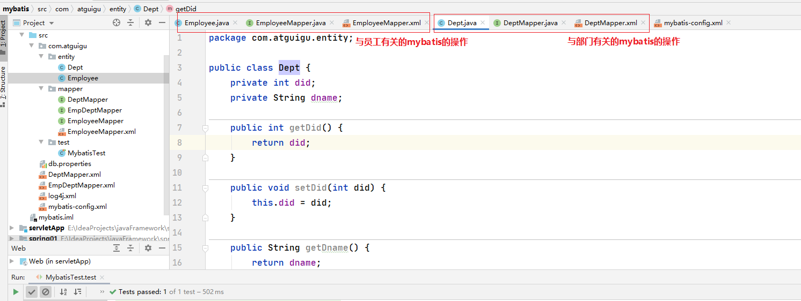

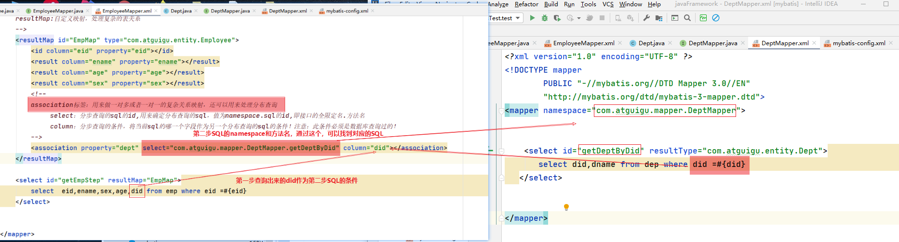

注意：

- 分布查询的两个接口映射文件都要进行注册，否则会报错
- 需要再association标签中指定后续步骤查询SQL的命名空间和方法ID，用来确定唯一SQL，并且给需要给指定的SQL传递第一步中查询出来的字段作为参数！

#### 5.6.3 分步查询的延迟加载

延迟加载的前提：**只有分布查询才有懒加载！**

>5.6.2设置了分步查询，但是他们仍然是两个表一起查。我们还可以设置分布查询的延迟加载：
>
>即如果用到了Emp表的信息就只查emp表，直到用到了dept表的数据才会去查询dept。
>
>用到了才查

**针对核心配置文件**

~~~xml
 <settings>
        <!--
        lazyLoadingEnabled:是否开启(延迟加载)懒加载，默认是false
        aggressiveLazyLoading:是否查询所有字段，默认值是true
        如果要开启懒加载，需要将lazyLoadingEnabled设置为true，将aggressiveLazyLoading设置为false
        -->
        <setting name="lazyLoadingEnabled" value="true"/>
        <setting name="aggressiveLazyLoading" value="false"/>
    </settings>
~~~

我们在5.6.2中，修改其核心配置文件，使之支持懒加载，则需要将上述信息加进去即可

~~~xml
<?xml version="1.0" encoding="UTF-8" ?>
<!DOCTYPE configuration
        PUBLIC "-//mybatis.org//DTD Config 3.0//EN"
        "http://mybatis.org/dtd/mybatis-3-config.dtd">
<configuration>
    <properties resource="db.properties">
        <property name="username" value="roo2"/>
    </properties>
    
    <settings>
        <!--
        lazyLoadingEnabled:是否开启(延迟加载)懒加载，默认是false
        aggressiveLazyLoading:是否查询所有字段，默认值是true
        如果要开启懒加载，需要将lazyLoadingEnabled设置为true，将aggressiveLazyLoading设置为false
        -->
        <setting name="lazyLoadingEnabled" value="true"/>
        <setting name="aggressiveLazyLoading" value="false"/>
    </settings>
    
    <environments default="development">
        <environment id="development">
            <transactionManager type="JDBC"/>
            <dataSource type="POOLED">
                <property name="driver" value="${driver}"/>
                <property name="url" value="${url}"/>
                <property name="username" value="${username}"/>
                <property name="password" value="${password}"/>
            </dataSource>
        </environment>
    </environments>
    <mappers>
        <mapper resource="com/atguigu/mapper/EmployeeMapper.xml"/>
        <mapper resource="DeptMapper.xml"/>
    </mappers>
</configuration>
~~~

此时测试代码

~~~java
package com.atguigu.test;

import com.atguigu.entity.Employee;
import com.atguigu.mapper.EmployeeMapper;
import org.apache.ibatis.io.Resources;
import org.apache.ibatis.session.SqlSession;
import org.apache.ibatis.session.SqlSessionFactory;
import org.apache.ibatis.session.SqlSessionFactoryBuilder;
import org.junit.Test;

import java.io.IOException;
import java.io.InputStream;


public class MybatisTest {
    @Test
    public void test() throws IOException {
        //1.设置mybatis的全局配置文件路径
        String resource = "mybatis-config.xml";
        //2.读取mybatis的全局配置文件
        InputStream resourceAsStream = Resources.getResourceAsStream(resource);
        //3.创建SqlSessionFactory工厂
        SqlSessionFactory factory = new SqlSessionFactoryBuilder().build(resourceAsStream);
        //4.创建sqlSession对象.相当于connection对象.它是mybatis操作数据库的会话对象！
        SqlSession sqlSession = factory.openSession(true);
        //5.创建接口代理对象,返回代理实现类对象
        EmployeeMapper mapper = sqlSession.getMapper(EmployeeMapper.class);
        Employee empStep = mapper.getEmpStep(5);
        System.out.println(empStep.getSex());
    }
}
-------------------------------------------------
由于没有用到dept的表的信息：empStep.getSex()，这里只是用到了emp的信息，故不会查询dept表，从控制台日志也可以看出来：这里只查询了一个表，只有一个表的sql
DEBUG 09-20 21:56:37,473 ==>  Preparing: select eid,ename,sex,age,did from emp where eid =?   (BaseJdbcLogger.java:145) 
DEBUG 09-20 21:56:37,494 ==> Parameters: 5(Integer)  (BaseJdbcLogger.java:145) 
DEBUG 09-20 21:56:37,604 <==      Total: 1  (BaseJdbcLogger.java:145) 
男
~~~

#### 5.6.4 一对多自定义映射

一个部门下有多个员工，这就是一对多！

>POJO中的属性可能会是一个集合对象,我们可以使用联合查询，并以级联属性的方式封装对象.使用collection标签定义对象的封装规则

员工表

~~~java
package com.atguigu.entity;

import java.util.List;

public class Dept {
    private int did;
    private String dname;

    private List<Employee> emps;

    public List<Employee> getEmps() {
        return emps;
    }

    @Override
    public String toString() {
        return "Dept{" +
                "did=" + did +
                ", dname='" + dname + '\'' +
                ", emps=" + emps +
                '}';
    }

    public void setEmps(List<Employee> emps) {
        this.emps = emps;
    }

    public int getDid() {
        return did;
    }

    public void setDid(int did) {
        this.did = did;
    }

    public String getDname() {
        return dname;
    }

    public void setDname(String dname) {
        this.dname = dname;
    }

    public Dept() {
    }

    public Dept(int did, String dname, List<Employee> emps) {
        this.did = did;
        this.dname = dname;
        this.emps = emps;
    }
}

~~~

**部门表：有属性多个员工组成的集合**

~~~java
package com.atguigu.entity;

import java.util.List;

public class Dept {
    private int did;
    private String dname;

    private List<Employee> emps;

    public List<Employee> getEmps() {
        return emps;
    }

    @Override
    public String toString() {
        return "Dept{" +
                "did=" + did +
                ", dname='" + dname + '\'' +
                ", emps=" + emps +
                '}';
    }

    public void setEmps(List<Employee> emps) {
        this.emps = emps;
    }

    public int getDid() {
        return did;
    }

    public void setDid(int did) {
        this.did = did;
    }

    public String getDname() {
        return dname;
    }

    public void setDname(String dname) {
        this.dname = dname;
    }

    public Dept() {
    }

    public Dept(int did, String dname, List<Employee> emps) {
        this.did = did;
        this.dname = dname;
        this.emps = emps;
    }
}
~~~

**部门接口**

~~~java
package com.atguigu.mapper;

import com.atguigu.entity.Dept;

public interface DeptMapper {
    Dept getDeptByDid(int did);
}

~~~

**部门接口映射文件**

~~~xml
<?xml version="1.0" encoding="UTF-8" ?>
<!DOCTYPE mapper
        PUBLIC "-//mybatis.org//DTD Mapper 3.0//EN"
        "http://mybatis.org/dtd/mybatis-3-mapper.dtd">
<mapper namespace="com.atguigu.mapper.DeptMapper">
   <resultMap type="com.atguigu.entity.Dept" id="DeptMap">
       <id column="did" property="did"></id>
       <result column="dname" property="dname"></result>
       <!--
           这里不能写javaType，要用ofType:代表集合中的类型！必须要知道集合中的类型，非常重要，不需要指定javaType
       -->
       <collection property="emps" ofType="com.atguigu.entity.Employee">
           <id column="eid" property="eid"></id>
           <result column="ename" property="ename"></result>
           <result column="sex" property="sex"></result>
           <result column="age" property="age"></result>
       </collection>
   </resultMap>

    <select id="getDeptByDid" resultMap="DeptMap">
       select d.did,d.dname,e.eid,e.ename,e.sex,e.age from dep d
          left join emp e
            on d.did = e.did where d.did=#{did}
   </select>


</mapper>
~~~

**测试**

~~~java
package com.atguigu.test;

import com.atguigu.entity.Dept;
import com.atguigu.entity.Employee;
import com.atguigu.mapper.DeptMapper;
import com.atguigu.mapper.EmployeeMapper;
import org.apache.ibatis.io.Resources;
import org.apache.ibatis.session.SqlSession;
import org.apache.ibatis.session.SqlSessionFactory;
import org.apache.ibatis.session.SqlSessionFactoryBuilder;
import org.junit.Test;

import java.io.IOException;
import java.io.InputStream;


public class MybatisTest {
    @Test
    public void test() throws IOException {
        //1.设置mybatis的全局配置文件路径
        String resource = "mybatis-config.xml";
        //2.读取mybatis的全局配置文件
        InputStream resourceAsStream = Resources.getResourceAsStream(resource);
        //3.创建SqlSessionFactory工厂
        SqlSessionFactory factory = new SqlSessionFactoryBuilder().build(resourceAsStream);
        //4.创建sqlSession对象.相当于connection对象.它是mybatis操作数据库的会话对象！
        SqlSession sqlSession = factory.openSession(true);
        //5.创建接口代理对象,返回代理实现类对象
        DeptMapper mapper = sqlSession.getMapper(DeptMapper.class);
        Dept deptByDid = mapper.getDeptByDid(1);
        System.out.println(deptByDid);
    }
}
----------------------------------------
DEBUG 09-20 22:27:28,828 ==>  Preparing: select d.did,d.dname,e.eid,e.ename,e.sex,e.age from dep d left join emp e on d.did = e.did where d.did=?   (BaseJdbcLogger.java:145) 
DEBUG 09-20 22:27:28,849 ==> Parameters: 1(Integer)  (BaseJdbcLogger.java:145) 
DEBUG 09-20 22:27:28,862 <==      Total: 4  (BaseJdbcLogger.java:145) 
Dept{did=1, dname='人事部门', emps=[Employee{ename='张三', eid=0, age=13, sex='男', dept=null}, Employee{ename='李四', eid=1, age=16, sex='男', dept=null}, Employee{ename='张三三', eid=4, age=13, sex='女', dept=null}, Employee{ename='a1', eid=5, age=233, sex='男', dept=null}]}

~~~

#### 5.6.5 一对多的分步查询

##### 员工相关

**实体类**

~~~java
package com.atguigu.entity;

public class Employee {
    private String ename;
    private int eid;
    private int age;
    private String sex;


    public String getEname() {
        return ename;
    }

    public void setEname(String ename) {
        this.ename = ename;
    }

    public int getEid() {
        return eid;
    }

    public void setEid(int eid) {
        this.eid = eid;
    }

    public int getAge() {
        return age;
    }

    public void setAge(int age) {
        this.age = age;
    }

    public String getSex() {
        return sex;
    }

    public void setSex(String sex) {
        this.sex = sex;
    }

    public Employee(String ename, int eid, int age, String sex) {
        this.ename = ename;
        this.eid = eid;
        this.age = age;
        this.sex = sex;
    }

    public Employee() {
    }

    @Override
    public String toString() {
        return "Employee{" +
                "ename='" + ename + '\'' +
                ", eid=" + eid +
                ", age=" + age +
                ", sex='" + sex + '\'' +
                '}';
    }
}

~~~

**接口**

~~~java
package com.atguigu.mapper;


import com.atguigu.entity.Employee;

import java.util.List;
import java.util.Map;

public interface EmployeeMapper {
    // 通过参数mao获取emp
    List<Employee> getEmps(int did);
}

~~~

**映射文件**

~~~java
<?xml version="1.0" encoding="UTF-8" ?>
<!DOCTYPE mapper
        PUBLIC "-//mybatis.org//DTD Mapper 3.0//EN"
        "http://mybatis.org/dtd/mybatis-3-mapper.dtd">
<mapper namespace="com.atguigu.mapper.EmployeeMapper">

   <select id="getEmps" resultType="com.atguigu.entity.Employee">
       select eid,ename,age,sex from emp where did=#{did}
   </select>

</mapper>
~~~

##### 部门相关

**实体类**

~~~java
package com.atguigu.entity;

import java.util.List;

public class Dept {
    private int did;
    private String dname;
    private List<Employee> emps;

    public List<Employee> getEmps() {
        return emps;
    }

    @Override
    public String toString() {
        return "Dept{" +
                "did=" + did +
                ", dname='" + dname + '\'' +
                ", emps=" + emps +
                '}';
    }

    public void setEmps(List<Employee> emps) {
        this.emps = emps;
    }

    public int getDid() {
        return did;
    }

    public void setDid(int did) {
        this.did = did;
    }

    public String getDname() {
        return dname;
    }

    public void setDname(String dname) {
        this.dname = dname;
    }

    public Dept() {
    }

    public Dept(int did, String dname, List<Employee> emps) {
        this.did = did;
        this.dname = dname;
        this.emps = emps;
    }
}

~~~

**接口**

~~~java
package com.atguigu.mapper;

import com.atguigu.entity.Dept;

public interface DeptMapper {
   Dept getDeptByDid(int did);
}

~~~

**映射文件🌙**

~~~xml
<?xml version="1.0" encoding="UTF-8" ?>
<!DOCTYPE mapper
        PUBLIC "-//mybatis.org//DTD Mapper 3.0//EN"
        "http://mybatis.org/dtd/mybatis-3-mapper.dtd">
<mapper namespace="com.atguigu.mapper.DeptMapper">

   <resultMap id="deptMap" type="com.atguigu.entity.Dept">
       <id property="did" column="did"></id>
       <result column="dname" property="dname"></result>
       <collection property="emps" select="com.atguigu.mapper.EmployeeMapper.getEmps" column="did">
       </collection>
   </resultMap>

   <select  id="getDeptByDid" resultMap="deptMap">
      select did,dname from dep where did=#{did}
   </select>
</mapper>
~~~

**核心配置文件**

~~~xml
<?xml version="1.0" encoding="UTF-8" ?>
<!DOCTYPE configuration
        PUBLIC "-//mybatis.org//DTD Config 3.0//EN"
        "http://mybatis.org/dtd/mybatis-3-config.dtd">
<configuration>
    <!--
         properties标签作用：
             1.通过properties相关属性引入外部资源文件
               resource属性：引入类路径下的配置文件
               url属性：引入磁盘或者网络上的配置文件
             2.通过property子标签给属性赋值
    -->
    <properties resource="db.properties">
        <property name="username" value="roo2"/>
    </properties>
    <settings>
        <!--
        lazyLoadingEnabled:是否开启(延迟加载)懒加载，默认是false
        aggressiveLazyLoading:是否查询所有字段，默认值是true
        如果要开启懒加载，需要将lazyLoadingEnabled设置为true，将aggressiveLazyLoading设置为false
        -->
        <setting name="lazyLoadingEnabled" value="true"/>
        <setting name="aggressiveLazyLoading" value="false"/>
    </settings>
    <environments default="development">
        <environment id="development">
            <transactionManager type="JDBC"/>
            <dataSource type="POOLED">
                <!--
                    value值的加载顺序：
                       1.首先读取properties中property指定的属性值
                       2.加载外部属性文件的值（如果引入的外部属性文件中指定的key与第1步一致，则覆盖第1步的值）
                -->
                <property name="driver" value="${driver}"/>
                <property name="url" value="${url}"/>
                <property name="username" value="${username}"/>
                <property name="password" value="${password}"/>
            </dataSource>
        </environment>
    </environments>
    <mappers>
        <mapper resource="com/atguigu/mapper/EmployeeMapper.xml"/>
        <mapper resource="DeptMapper.xml"/>
    </mappers>
</configuration>
~~~

**测试**

~~~java
package com.atguigu.test;

import com.atguigu.entity.Dept;
import com.atguigu.entity.Employee;
import com.atguigu.mapper.DeptMapper;
import com.atguigu.mapper.EmployeeMapper;
import org.apache.ibatis.io.Resources;
import org.apache.ibatis.session.SqlSession;
import org.apache.ibatis.session.SqlSessionFactory;
import org.apache.ibatis.session.SqlSessionFactoryBuilder;
import org.junit.Test;

import java.io.IOException;
import java.io.InputStream;


public class MybatisTest {
    @Test
    public void test() throws IOException {
        //1.设置mybatis的全局配置文件路径
        String resource = "mybatis-config.xml";
        //2.读取mybatis的全局配置文件
        InputStream resourceAsStream = Resources.getResourceAsStream(resource);
        //3.创建SqlSessionFactory工厂
        SqlSessionFactory factory = new SqlSessionFactoryBuilder().build(resourceAsStream);
        //4.创建sqlSession对象.相当于connection对象.它是mybatis操作数据库的会话对象！
        SqlSession sqlSession = factory.openSession(true);
        //5.创建接口代理对象,返回代理实现类对象
        DeptMapper mapper = sqlSession.getMapper(DeptMapper.class);
        Dept deptByDid = mapper.getDeptByDid(1);
        System.out.println(deptByDid);
    }
}

~~~

#### 5.6.6 多对一分布查询的延迟加载

**只有分布查询才有懒加载！**一对多的分布查询的延迟加载的设置是一样的！

>5.6.5设置了分步查询，但是他们仍然是两个表一起查。我们还可以设置分布查询的延迟加载：
>
>即如果用到了dept表的数据去查询dep，只有用到了Emp表的信息才会查emp表

**针对核心配置文件**

~~~xml
 <settings>
        <!--
        lazyLoadingEnabled:是否开启(延迟加载)懒加载，默认是false
        aggressiveLazyLoading:是否查询所有字段，默认值是true
        如果要开启懒加载，需要将lazyLoadingEnabled设置为true，将aggressiveLazyLoading设置为false
        -->
        <setting name="lazyLoadingEnabled" value="true"/>
        <setting name="aggressiveLazyLoading" value="false"/>
    </settings>
~~~

我们在5.6.2中，修改其核心配置文件，使之支持懒加载，则需要将上述信息加进去即可

~~~xml
<?xml version="1.0" encoding="UTF-8" ?>
<!DOCTYPE configuration
        PUBLIC "-//mybatis.org//DTD Config 3.0//EN"
        "http://mybatis.org/dtd/mybatis-3-config.dtd">
<configuration>
    <properties resource="db.properties">
        <property name="username" value="roo2"/>
    </properties>
    
    <settings>
        <!--
        lazyLoadingEnabled:是否开启(延迟加载)懒加载，默认是false
        aggressiveLazyLoading:是否查询所有字段，默认值是true
        如果要开启懒加载，需要将lazyLoadingEnabled设置为true，将aggressiveLazyLoading设置为false
        -->
        <setting name="lazyLoadingEnabled" value="true"/>
        <setting name="aggressiveLazyLoading" value="false"/>
    </settings>
    
    <environments default="development">
        <environment id="development">
            <transactionManager type="JDBC"/>
            <dataSource type="POOLED">
                <property name="driver" value="${driver}"/>
                <property name="url" value="${url}"/>
                <property name="username" value="${username}"/>
                <property name="password" value="${password}"/>
            </dataSource>
        </environment>
    </environments>
    <mappers>
        <mapper resource="com/atguigu/mapper/EmployeeMapper.xml"/>
        <mapper resource="DeptMapper.xml"/>
    </mappers>
</configuration>
~~~

#### 5.6.7 分布查询的细节🌙

我们刚才的案例中，分布查询是用一个参数去查询，如果我们想在分步查询中传递多个参数：

实际上底层仍然是封装成一个map集合，我们可以格式：

>column="{键名1=数据库字段1，键名2=数据库字段2...}"
>
>而此时在sql语句中获取则需要通过**键名**获取
>
>其中键名可以任意指定，但是获取的时候要注意对应！！！！

#### 5.6.8 延迟加载的细节🌙

我们刚才在核心配置文件中设置了延迟加载的属性，但是如果我们想针对某个sql不让其延迟加载，则可以通过如下方式设置：

- 在<association> 和<collection>标签中都可以设置**fetchType**，指定本次查询是否要使用延迟加载。默认为 fetchType=”lazy” ,如果本次的查询不想使用延迟加载，则可设置为**fetchType=”eager”.**

-  fetchType可以灵活的设置查询是否需要使用延迟加载，而不需要因为某个查询不想使用延迟加载将全局的延迟加载设置关闭.

## 6.Mybatis的动态sql⭐

动态 SQL是MyBatis强大特性之一。极大的简化我们拼装SQL的操作;

动态 SQL 元素和使用 JSTL 或其他类似基于 XML 的文本处理器相似;

MyBatis 采用功能强大的基于 OGNL 的表达式来简化操作;

**注意：xml中特殊符号如”,>,<等这些都需要使用转义字符**

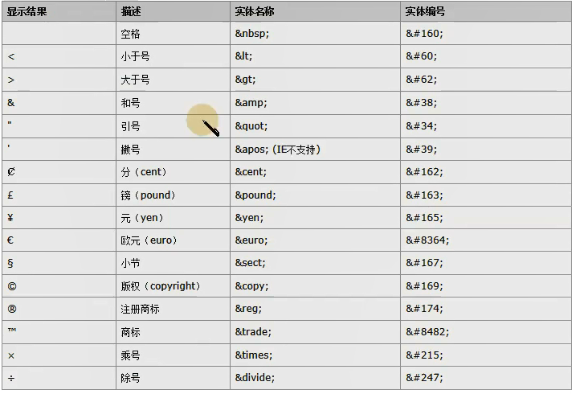

### 6.1 if

>用于完成简单的判断

**实体类**

~~~java
package com.atguigu.entity;

public class Employee {
    private String ename;
    private int eid;
    private int age;
    private String sex;


    public String getEname() {
        return ename;
    }

    public void setEname(String ename) {
        this.ename = ename;
    }

    public int getEid() {
        return eid;
    }

    public void setEid(int eid) {
        this.eid = eid;
    }

    public int getAge() {
        return age;
    }

    public void setAge(int age) {
        this.age = age;
    }

    public String getSex() {
        return sex;
    }

    public void setSex(String sex) {
        this.sex = sex;
    }

    public Employee(String ename, int eid, int age, String sex) {
        this.ename = ename;
        this.eid = eid;
        this.age = age;
        this.sex = sex;
    }

    public Employee() {
    }

    @Override
    public String toString() {
        return "Employee{" +
                "ename='" + ename + '\'' +
                ", eid=" + eid +
                ", age=" + age +
                ", sex='" + sex + '\'' +
                '}';
    }
}

~~~

**接口**

~~~java
package com.atguigu.mapper;


import com.atguigu.entity.Employee;

public interface EmployeeMapper {
    Employee getEmployee(Employee emp);
}

~~~

**映射文件**

~~~xml
<?xml version="1.0" encoding="UTF-8" ?>
<!DOCTYPE mapper
        PUBLIC "-//mybatis.org//DTD Mapper 3.0//EN"
        "http://mybatis.org/dtd/mybatis-3-mapper.dtd">
<mapper namespace="com.atguigu.mapper.EmployeeMapper">
    <!-- if标签的使用-->
    <select id="getEmployee" resultType="com.atguigu.entity.Employee">
        select eid,ename,age,sex
        from emp
        where
        <if test="eid != null">
            eid =#{eid}
        </if>
        <if test="ename != null">
            and ename =#{ename}
        </if>
        <if test="age != null">
            and  age =#{age}
        </if>
        <if test="sex != null">
            and sex =#{sex}
        </if>
    </select>

</mapper>
~~~

**全局配置文件**

~~~xml
<?xml version="1.0" encoding="UTF-8" ?>
<!DOCTYPE configuration
        PUBLIC "-//mybatis.org//DTD Config 3.0//EN"
        "http://mybatis.org/dtd/mybatis-3-config.dtd">
<configuration>
    <!--
         properties标签作用：
             1.通过properties相关属性引入外部资源文件
               resource属性：引入类路径下的配置文件
               url属性：引入磁盘或者网络上的配置文件
             2.通过property子标签给属性赋值
    -->
    <properties resource="db.properties">
        <property name="username" value="roo2"/>
    </properties>
    <settings>
        <!--
        lazyLoadingEnabled:是否开启(延迟加载)懒加载，默认是false
        aggressiveLazyLoading:是否查询所有字段，默认值是true
        如果要开启懒加载，需要将lazyLoadingEnabled设置为true，将aggressiveLazyLoading设置为false
        -->
        <setting name="lazyLoadingEnabled" value="true"/>
        <setting name="aggressiveLazyLoading" value="false"/>
    </settings>
    <environments default="development">
        <environment id="development">
            <transactionManager type="JDBC"/>
            <dataSource type="POOLED">
                <!--
                    value值的加载顺序：
                       1.首先读取properties中property指定的属性值
                       2.加载外部属性文件的值（如果引入的外部属性文件中指定的key与第1步一致，则覆盖第1步的值）
                -->
                <property name="driver" value="${driver}"/>
                <property name="url" value="${url}"/>
                <property name="username" value="${username}"/>
                <property name="password" value="${password}"/>
            </dataSource>
        </environment>
    </environments>
    <mappers>
        <mapper resource="com/atguigu/mapper/EmployeeMapper.xml"/>
    </mappers>
</configuration>
~~~

**测试代码**

~~~java
package com.atguigu.test;

import com.atguigu.entity.Dept;
import com.atguigu.entity.Employee;
import com.atguigu.mapper.DeptMapper;
import com.atguigu.mapper.EmployeeMapper;
import org.apache.ibatis.io.Resources;
import org.apache.ibatis.session.SqlSession;
import org.apache.ibatis.session.SqlSessionFactory;
import org.apache.ibatis.session.SqlSessionFactoryBuilder;
import org.junit.Test;

import java.io.IOException;
import java.io.InputStream;


public class MybatisTest {
    @Test
    public void test() throws IOException {
        //1.设置mybatis的全局配置文件路径
        String resource = "mybatis-config.xml";
        //2.读取mybatis的全局配置文件
        InputStream resourceAsStream = Resources.getResourceAsStream(resource);
        //3.创建SqlSessionFactory工厂
        SqlSessionFactory factory = new SqlSessionFactoryBuilder().build(resourceAsStream);
        //4.创建sqlSession对象.相当于connection对象.它是mybatis操作数据库的会话对象！
        SqlSession sqlSession = factory.openSession(true);
        //5.创建接口代理对象,返回代理实现类对象
        EmployeeMapper mapper = sqlSession.getMapper(EmployeeMapper.class);
        Employee emp = mapper.getEmployee(new Employee("李四", 1, 16, null));
        System.out.println(emp);
    }
}
-----------------------------------------
此时查询的sql：
Preparing: select eid,ename,age,sex from emp where eid =? and ename =? and age =? 
~~~

### 6.2 where

>Where用于解决SQL语句中**where关键字以及条件中第一个and或者or的问题**

~~~xml
<!-- if标签的使用-->
    <select id="getEmployee" resultType="com.atguigu.entity.Employee">
        select eid,ename,age,sex
        from emp
        where
        <if test="eid != null">
            eid =#{eid}
        </if>
        <if test="ename != null">
            and ename =#{ename}
        </if>
        <if test="age != null">
            and  age =#{age}
        </if>
        <if test="sex != null">
            and sex =#{sex}
    </select>
~~~

>问题：上述动态sql在eid为null时候，sql语句中会多出来一个and，此时SQL语句会有异常,我们可以通过**where关键字**去避免

~~~xml
<?xml version="1.0" encoding="UTF-8" ?>
<!DOCTYPE mapper
        PUBLIC "-//mybatis.org//DTD Mapper 3.0//EN"
        "http://mybatis.org/dtd/mybatis-3-mapper.dtd">
<mapper namespace="com.atguigu.mapper.EmployeeMapper">
    <select id="getEmployee" resultType="com.atguigu.entity.Employee">
        select eid,ename,age,sex
        from emp
        <where>
        <if test="eid != null">
            eid =#{eid}
        </if>
        <if test="ename != null">
            and ename =#{ename}
        </if>
        <if test="age != null">
            and  age =#{age}
        </if>
        <if test="sex != null">
            and sex =#{sex}
        </if>
        </where>
    </select>

</mapper>
~~~

### 6.3 trim

>Trim 可以在条件判断完的SQL语句前后 添加或者去掉指定的字符
>
>​     prefix: 添加前缀
>
>​     prefixOverrides: 去掉前缀
>
>​     suffix: 添加后缀
>
>​     suffixOverrides: 去掉后缀

我们在使用if或者where标签时，还可能出现问题：

```xml
<select id="getEmployee" resultType="com.atguigu.entity.Employee">
    select eid,ename,age,sex
    from emp
    <where>
    <if test="eid != null">
        eid =#{eid} and 
    </if>
    <if test="ename != null">
        ename =#{ename} and  
    </if>
    <if test="age != null">
        age =#{age}  and 
    </if>
    <if test="sex != null">
        sex =#{sex}
    </if>
    </where>
</select>
```

>在上述情况中，如果最后一个条件不成立，会多出来一个and，我们可以用trim标签来解决这个问题！

~~~xml
<?xml version="1.0" encoding="UTF-8" ?>
<!DOCTYPE mapper
        PUBLIC "-//mybatis.org//DTD Mapper 3.0//EN"
        "http://mybatis.org/dtd/mybatis-3-mapper.dtd">
<mapper namespace="com.atguigu.mapper.EmployeeMapper">
    <!-- if标签的使用-->
    <select id="getEmployee" resultType="com.atguigu.entity.Employee">
        select eid,ename,age,sex
        from emp
        <!--
              trim标签的四个属性：
                 prefix：添加前缀
                 prefixOverrides：去掉前缀
                 suffix：添加后缀
                 suffixOverrides：去掉后缀
        -->
        <trim prefix="where"  suffixOverrides="and">
        <if test="eid != null">
            eid =#{eid} and
        </if>
        <if test="ename != null">
            ename =#{ename} and
        </if>
        <if test="age != null">
            age =#{age}  and
        </if>
        <if test="sex != null">
            sex =#{sex}
        </if>
        </trim>
    </select>

</mapper>
~~~

### 6.4 choose

>choose 主要是用于分支判断，类似于java中的switch case,只会满足所有分支中的一个

~~~xml
<?xml version="1.0" encoding="UTF-8" ?>
<!DOCTYPE mapper
        PUBLIC "-//mybatis.org//DTD Mapper 3.0//EN"
        "http://mybatis.org/dtd/mybatis-3-mapper.dtd">
<mapper namespace="com.atguigu.mapper.EmployeeMapper">
    <!-- choose标签的使用
         choose只要有一个成立，就不会继续判断
    -->
    <select id="getEmployee" resultType="com.atguigu.entity.Employee">
        select eid,ename,age,sex
        from emp
        <where>
            <choose>
                <when test="eid!=0">
                    eid=#{eid}
                </when>
                <when test="ename!=null">
                    ename=#{ename}
                </when>
                <when test="age!=0">
                    age=#{age}
                </when>
                <otherwise >
                   sex=#{sex}
                </otherwise>
            </choose>
        </where>
    </select>

</mapper>
~~~

**测试代码**

~~~java
package com.atguigu.test;

import com.atguigu.entity.Employee;
import com.atguigu.mapper.EmployeeMapper;
import org.apache.ibatis.io.Resources;
import org.apache.ibatis.session.SqlSession;
import org.apache.ibatis.session.SqlSessionFactory;
import org.apache.ibatis.session.SqlSessionFactoryBuilder;
import org.junit.Test;

import java.io.IOException;
import java.io.InputStream;


public class MybatisTest {
    @Test
    public void test() throws IOException {
        //1.设置mybatis的全局配置文件路径
        String resource = "mybatis-config.xml";
        //2.读取mybatis的全局配置文件
        InputStream resourceAsStream = Resources.getResourceAsStream(resource);
        //3.创建SqlSessionFactory工厂
        SqlSessionFactory factory = new SqlSessionFactoryBuilder().build(resourceAsStream);
        //4.创建sqlSession对象.相当于connection对象.它是mybatis操作数据库的会话对象！
        SqlSession sqlSession = factory.openSession(true);
        //5.创建接口代理对象,返回代理实现类对象
        EmployeeMapper mapper = sqlSession.getMapper(EmployeeMapper.class);
        Employee emp = mapper.getEmployee(new Employee("李四", 0, 16, null));
        System.out.println(emp);
    }
}

~~~

**执行的sql**

~~~java
DEBUG 09-21 10:19:13,393 ==>  Preparing: select eid,ename,age,sex from emp WHERE ename=?   (BaseJdbcLogger.java:145) 
DEBUG 09-21 10:19:13,414 ==> Parameters: 李四(String)  (BaseJdbcLogger.java:145) 
~~~

### 6.5 set

>set 主要是用于关键字set,并且解决修改操作中SQL语句中可能多出逗号的问题

~~~xml
 <update id="updateEmployee">
        update employee set
        <if test="lastName !=null">
            last_name =#{lastName},
        </if>
        <if test="email !=email">
            email =#{email},
        </if>
        <if test="salary !=salary">
            salary =#{salary}
        </if>
        where id =#{id}
    </update>
~~~

**上述sql执行的时候容易出现多余的逗号，我们可以通过set标签去掉多余的最后的逗号问题**，

~~~xml
    <update id="updateEmployee">
        update employee 
        <set>
        <if test="lastName !=null">
            last_name =#{lastName},
        </if>
        <if test="email !=email">
            email =#{email},
        </if>
        <if test="salary !=salary">
            salary =#{salary}
        </if>
        </set>
        where id =#{id}
    </update>
~~~

### 6.6 foreach

> foreach 主要用于循环迭代
>
>​      collection: 要迭代的集合
>
>​      item: 当前从集合中迭代出的元素
>
>​      open: 开始字符
>
>​      close:结束字符
>
>​      separator: 元素与元素之间的分隔符
>
>​      index:
>
>​             迭代的是List集合: index表示的当前元素的下标
>
>​             迭代的Map集合: index表示的当前元素的key

这个我们通过批量删除和批量新增这个案例来演示foreach的用法

#### 批量删除

**接口**

~~~java
package com.atguigu.mapper;


import java.util.List;

public interface EmployeeMapper {
    // 通过list集合实现批量删除
    void deleteMpreEmp(List<Integer> eids);
}

~~~

**接口映射文件**

~~~xml
<?xml version="1.0" encoding="UTF-8" ?>
<!DOCTYPE mapper
        PUBLIC "-//mybatis.org//DTD Mapper 3.0//EN"
        "http://mybatis.org/dtd/mybatis-3-mapper.dtd">
<mapper namespace="com.atguigu.mapper.EmployeeMapper">
    <!-- void deleteMpreEmp(List<Integer> eids)-->
    <delete id="deleteMpreEmp" >
       delete from emp where eid in
       <!--
           foreach标签：对一个数组或者集合进行遍历
                  属性：
                  collection：指定要遍历的集合或者数组
                  item：设置别名
                  open:设置循环体的开始内容
                  close：设置循环体的结束内容
                  separator：设置每一次循环之间的分隔符
                  index：
                       若遍历的是list，index代表下表
                       若遍历的是map，index代表键
       -->

        <!--
        <foreach collection="eids" item="eid" separator="," >
        这里面的collection不能直接写方法中的变量名：
        因为这里传递了过来的是一个集合。而对于参数传递，有规则：
           如果传过来的是list或者Array,mybatis会将List或者Array放在map中
           List以list为键，Array以array为键
        -->

        <foreach collection="list" item="eid" separator="," open="(" close=")">
            #{eid}
        </foreach>

    </delete>


</mapper>
~~~

**核心配置文件**

~~~xml
<?xml version="1.0" encoding="UTF-8" ?>
<!DOCTYPE configuration
        PUBLIC "-//mybatis.org//DTD Config 3.0//EN"
        "http://mybatis.org/dtd/mybatis-3-config.dtd">
<configuration>
    <!--
         properties标签作用：
             1.通过properties相关属性引入外部资源文件
               resource属性：引入类路径下的配置文件
               url属性：引入磁盘或者网络上的配置文件
             2.通过property子标签给属性赋值
    -->
    <properties resource="db.properties">
        <property name="username" value="roo2"/>
    </properties>
    <settings>
        <!--
        lazyLoadingEnabled:是否开启(延迟加载)懒加载，默认是false
        aggressiveLazyLoading:是否查询所有字段，默认值是true
        如果要开启懒加载，需要将lazyLoadingEnabled设置为true，将aggressiveLazyLoading设置为false
        -->
        <setting name="lazyLoadingEnabled" value="true"/>
        <setting name="aggressiveLazyLoading" value="false"/>
    </settings>
    <environments default="development">
        <environment id="development">
            <transactionManager type="JDBC"/>
            <dataSource type="POOLED">
                <!--
                    value值的加载顺序：
                       1.首先读取properties中property指定的属性值
                       2.加载外部属性文件的值（如果引入的外部属性文件中指定的key与第1步一致，则覆盖第1步的值）
                -->
                <property name="driver" value="${driver}"/>
                <property name="url" value="${url}"/>
                <property name="username" value="${username}"/>
                <property name="password" value="${password}"/>
            </dataSource>
        </environment>
    </environments>
    <mappers>
        <mapper resource="com/atguigu/mapper/EmployeeMapper.xml"/>
    </mappers>
</configuration>
~~~

**测试代码**

~~~java
package com.atguigu.test;

import com.atguigu.entity.Employee;
import com.atguigu.mapper.EmployeeMapper;
import org.apache.ibatis.io.Resources;
import org.apache.ibatis.session.SqlSession;
import org.apache.ibatis.session.SqlSessionFactory;
import org.apache.ibatis.session.SqlSessionFactoryBuilder;
import org.junit.Test;

import java.io.IOException;
import java.io.InputStream;
import java.util.ArrayList;
import java.util.List;


public class MybatisTest {
    @Test
    public void test() throws IOException {
        //1.设置mybatis的全局配置文件路径
        String resource = "mybatis-config.xml";
        //2.读取mybatis的全局配置文件
        InputStream resourceAsStream = Resources.getResourceAsStream(resource);
        //3.创建SqlSessionFactory工厂
        SqlSessionFactory factory = new SqlSessionFactoryBuilder().build(resourceAsStream);
        //4.创建sqlSession对象.相当于connection对象.它是mybatis操作数据库的会话对象！
        SqlSession sqlSession = factory.openSession();
        //5.创建接口代理对象,返回代理实现类对象
        EmployeeMapper mapper = sqlSession.getMapper(EmployeeMapper.class);
        List list = new ArrayList();
        list.add(1);
        list.add(2);
        list.add(3);
        mapper.deleteMpreEmp(list);
    }
}
~~~

>注意：这里尤其要注意collection的取值问题，因为方法参数是一个list,而针对参数是list或者Array，mybatis会将其封装成一个键为listh或者array的map集合，我们要通过键名list或者array去获取对应的list或者array

#### 批量新增

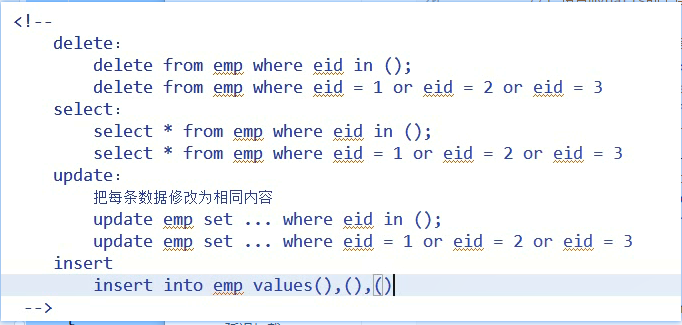

**接口**

~~~java
package com.atguigu.mapper;


import com.atguigu.entity.Employee;


public interface EmployeeMapper {
  void  insertEmps(Employee[] emps);
}

~~~

**配置文件**

~~~xml
<?xml version="1.0" encoding="UTF-8" ?>
<!DOCTYPE mapper
        PUBLIC "-//mybatis.org//DTD Mapper 3.0//EN"
        "http://mybatis.org/dtd/mybatis-3-mapper.dtd">
<mapper namespace="com.atguigu.mapper.EmployeeMapper">
       <!--
           foreach标签：对一个数组或者集合进行遍历
                  属性：
                  collection：指定要遍历的集合或者数组
                  item：设置别名
                  open:设置循环体的开始内容
                  close：设置循环体的结束内容
                  separator：设置每一次循环之间的分隔符
                  index：
                       若遍历的是list，index代表下表
                       若遍历的是map，index代表键
       -->
        <!--
        <foreach collection="eids" item="eid" separator="," >
        这里面的collection不能直接写方法中的变量名：
        因为这里传递了过来的是一个集合。而对于参数传递，有规则：
           如果传过来的是list或者Array,mybatis会将List或者Array放在map中
           List以list为键，Array以array为键
        -->
    <insert id="insertEmps" >
        insert into emp values
        <foreach collection="array" item="emp" separator=",">
            (#{emp.eid},#{emp.ename},#{emp.age},#{emp.sex},null)
        </foreach>
    </insert>


</mapper>
~~~

**核心配置文件**

~~~xml
<?xml version="1.0" encoding="UTF-8" ?>
<!DOCTYPE configuration
        PUBLIC "-//mybatis.org//DTD Config 3.0//EN"
        "http://mybatis.org/dtd/mybatis-3-config.dtd">
<configuration>
    <!--
         properties标签作用：
             1.通过properties相关属性引入外部资源文件
               resource属性：引入类路径下的配置文件
               url属性：引入磁盘或者网络上的配置文件
             2.通过property子标签给属性赋值
    -->
    <properties resource="db.properties">
        <property name="username" value="roo2"/>
    </properties>
    <settings>
        <!--
        lazyLoadingEnabled:是否开启(延迟加载)懒加载，默认是false
        aggressiveLazyLoading:是否查询所有字段，默认值是true
        如果要开启懒加载，需要将lazyLoadingEnabled设置为true，将aggressiveLazyLoading设置为false
        -->
        <setting name="lazyLoadingEnabled" value="true"/>
        <setting name="aggressiveLazyLoading" value="false"/>
    </settings>
    <environments default="development">
        <environment id="development">
            <transactionManager type="JDBC"/>
            <dataSource type="POOLED">
                <!--
                    value值的加载顺序：
                       1.首先读取properties中property指定的属性值
                       2.加载外部属性文件的值（如果引入的外部属性文件中指定的key与第1步一致，则覆盖第1步的值）
                -->
                <property name="driver" value="${driver}"/>
                <property name="url" value="${url}"/>
                <property name="username" value="${username}"/>
                <property name="password" value="${password}"/>
            </dataSource>
        </environment>
    </environments>
    <mappers>
        <mapper resource="com/atguigu/mapper/EmployeeMapper.xml"/>
    </mappers>
</configuration>
~~~

**测试代码**

~~~java
package com.atguigu.test;

import com.atguigu.entity.Employee;
import com.atguigu.mapper.EmployeeMapper;
import org.apache.ibatis.io.Resources;
import org.apache.ibatis.session.SqlSession;
import org.apache.ibatis.session.SqlSessionFactory;
import org.apache.ibatis.session.SqlSessionFactoryBuilder;
import org.junit.Test;

import java.io.IOException;
import java.io.InputStream;
import java.util.ArrayList;
import java.util.List;

public class MybatisTest {
    @Test
    public void test() throws IOException {
        //1.设置mybatis的全局配置文件路径
        String resource = "mybatis-config.xml";
        //2.读取mybatis的全局配置文件
        InputStream resourceAsStream = Resources.getResourceAsStream(resource);
        //3.创建SqlSessionFactory工厂
        SqlSessionFactory factory = new SqlSessionFactoryBuilder().build(resourceAsStream);
        //4.创建sqlSession对象.相当于connection对象.它是mybatis操作数据库的会话对象！
        SqlSession sqlSession = factory.openSession();
        //5.创建接口代理对象,返回代理实现类对象
        EmployeeMapper mapper = sqlSession.getMapper(EmployeeMapper.class);
        Employee emp1 = new Employee("云澈",40,20,"男");
        Employee emp2 = new Employee("千叶影儿",41,22,"女");
        Employee emp3 = new Employee("茉莉",42,18,"女");
        Employee[] emps={emp1,emp2,emp3};
        mapper.insertEmps(emps);
        sqlSession.commit();
    }
}
~~~

### 6.7 sql🌙

>sql 标签是用于抽取可重用的sql片段，将相同的，使用频繁的SQL片段抽取出来，单独定义，方便多次引用.

**抽取SQL**

~~~xml
<sql id="selectSQL">
		select id , last_name, email ,gender from tbl_employee
</sql>
设置一段SQL片段，即公共SQL，可以被当前映射文件的所有SQL语句所访问！
~~~

**引用SQL**

~~~xml
<include refid="selectSQL"></include>：访问某个SQL片段
~~~

## 7.mybatis的缓存

MyBatis 包含一个非常强大的查询缓存特性,它可以非常方便地配置和定制。缓存可以极大的提升查询效率

MyBatis系统中默认定义了两级缓存

-    一级缓存

-    二级缓存

默认情况下，只有一级缓存（SqlSession级别的缓存，也称为本地缓存）开启。也就是说**一级缓存要保证是同一个SqlSession对象**

二级缓存需要手动开启和配置，他是基于namespace级别的缓存。

为了提高扩展性。MyBatis定义了缓存接口Cache。我们可以通过实现Cache接口来自定义二级缓存

### 7.1 一级缓存

mapper调用两次相同的方法

也称为sqlSession级别的缓存，本地缓存！默认是开启的

>1.一级缓存(local cache), 即本地缓存, 作用域默认为sqlSession。当 Session**flush 或 close**后, 该 Session 中的所有 Cache 将被清空。
>
>2.本地缓存不能被关闭, 但可以调用 clearCache() 来清空本地缓存, 或者改变缓存的作用域.
>
>3.一级缓存的工作机制
>
>​         同一次会话期间只要查询过的数据都会保存在当前SqlSession的一个Map中,key: hashCode+查询的SqlId+编写的sql查询语句+参数

**一级缓存失效的几种情况**

1) **不同的SqlSession**对应不同的一级缓存,如获取了多个SqlSession

2) 同一个SqlSession但是**查询条件不同**

3) **同一个SqlSession两次查询期间执行了任何一次增删改操作**

4) **同一个SqlSession两次查询期间通过clearCache()手动清空了缓存**

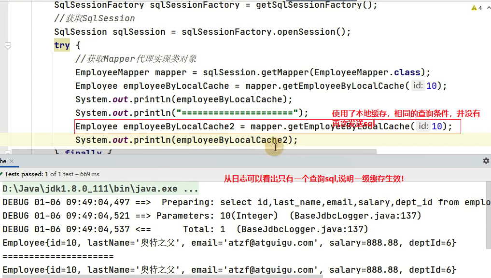

### 7.2 二级缓存 

SqlSession.getMapper()两次，并且class对象一致

不同的SqlSession，一级缓存无法使用，这时我们可以使用二级缓存！**二级缓存是映射文件级别的缓存！**

- 二级缓存(second level cache)，全局作用域缓存

- 二级缓存默认不开启，需要手动配置

- MyBatis提供二级缓存的接口以及实现，**缓存实现要求POJO实现Serializable接口**

- 二级缓存在 SqlSession 关闭或提交之后才会生效

**二级缓存的使用步骤：**

①  全局配置文件中开启二级缓存<setting name="cacheEnabled" value="true"/>

~~~xml
<?xml version="1.0" encoding="UTF-8" ?>
<!DOCTYPE configuration
        PUBLIC "-//mybatis.org//DTD Config 3.0//EN"
        "http://mybatis.org/dtd/mybatis-3-config.dtd">
<configuration>
    <!--
         properties标签作用：
             1.通过properties相关属性引入外部资源文件
               resource属性：引入类路径下的配置文件
               url属性：引入磁盘或者网络上的配置文件
             2.通过property子标签给属性赋值
    -->
    <properties resource="db.properties">
        <property name="username" value="roo2"/>
    </properties>
    <settings>
        <!-- 是否开启二级缓存-->
        <setting name="cacheEnabled" value="true"/>
    </settings>
    <environments default="development">
        <environment id="development">
            <transactionManager type="JDBC"/>
            <dataSource type="POOLED">
                <property name="driver" value="${driver}"/>
                <property name="url" value="${url}"/>
                <property name="username" value="${username}"/>
                <property name="password" value="${password}"/>
            </dataSource>
        </environment>
    </environments>
    <mappers>
        <mapper resource="com/atguigu/mapper/EmployeeMapper.xml"/>
    </mappers>
</configuration>
~~~

②  需要使用二级缓存的映射文件处使用cache配置缓存<cache />

~~~xml
<?xml version="1.0" encoding="UTF-8" ?>
<!DOCTYPE mapper
        PUBLIC "-//mybatis.org//DTD Mapper 3.0//EN"
        "http://mybatis.org/dtd/mybatis-3-mapper.dtd">
<mapper namespace="com.atguigu.mapper.EmployeeMapper">
       <!-- cache:开启二级缓存！-->
       <cache></cache>

</mapper>
~~~

③  注意：POJO需要实现Serializable接口

~~~java
package com.atguigu.entity;

import java.io.Serializable;

public class Employee implements Serializable {
    private String ename;
    private int eid;
    private int age;
    private String sex;


    public String getEname() {
        return ename;
    }

    public void setEname(String ename) {
        this.ename = ename;
    }

    public int getEid() {
        return eid;
    }

    public void setEid(int eid) {
        this.eid = eid;
    }

    public int getAge() {
        return age;
    }

    public void setAge(int age) {
        this.age = age;
    }

    public String getSex() {
        return sex;
    }

    public void setSex(String sex) {
        this.sex = sex;
    }

    public Employee(String ename, int eid, int age, String sex) {
        this.ename = ename;
        this.eid = eid;
        this.age = age;
        this.sex = sex;
    }

    public Employee() {
    }

    @Override
    public String toString() {
        return "Employee{" +
                "ename='" + ename + '\'' +
                ", eid=" + eid +
                ", age=" + age +
                ", sex='" + sex + '\'' +
                '}';
    }
}

~~~

****

**cache配置缓存<cache />标签的属性说明：**

二级缓存cache标签相关的属性

①  eviction=“FIFO”：缓存回收策略：在内存不够的时候的缓存的回收策略！

**LRU** – 最近最少使用的：移除最长时间不被使用的对象。

**FIFO** – 先进先出：按对象进入缓存的顺序来移除它们。

SOFT – 软引用：移除基于垃圾回收器状态和软引用规则的对象。

WEAK – 弱引用：更积极地移除基于垃圾收集器状态和弱引用规则的对象。

默认的是 LRU。

②  flushInterval：刷新间隔，单位毫秒

**默认情况是不设置，也就是没有刷新间隔，也就是不刷新**，缓存仅仅调用语句时刷新

③  size：引用数目，正整数

代表缓存最多可以存储多少个对象，太大容易导致内存溢出

④  readOnly：只读，true/false

true：只读缓存；会给所有调用者返回缓存对象的相同实例。因此这些对象不能被修改。这提供了很重要的性能优势。

false：读写缓存；会返回缓存对象的拷贝（通过序列化）。这会慢一些，但是安全，因此默认是 false。

5.type：设置第三方缓存

**实体类**

>POJO需要实现Serializable接口

~~~java
package com.atguigu.entity;

import java.io.Serializable;

public class Employee implements Serializable {
    private String ename;
    private int eid;
    private int age;
    private String sex;


    public String getEname() {
        return ename;
    }

    public void setEname(String ename) {
        this.ename = ename;
    }

    public int getEid() {
        return eid;
    }

    public void setEid(int eid) {
        this.eid = eid;
    }

    public int getAge() {
        return age;
    }

    public void setAge(int age) {
        this.age = age;
    }

    public String getSex() {
        return sex;
    }

    public void setSex(String sex) {
        this.sex = sex;
    }

    public Employee(String ename, int eid, int age, String sex) {
        this.ename = ename;
        this.eid = eid;
        this.age = age;
        this.sex = sex;
    }

    public Employee() {
    }

    @Override
    public String toString() {
        return "Employee{" +
                "ename='" + ename + '\'' +
                ", eid=" + eid +
                ", age=" + age +
                ", sex='" + sex + '\'' +
                '}';
    }
}

~~~

**接口**

~~~java
package com.atguigu.mapper;


import com.atguigu.entity.Employee;


public interface EmployeeMapper {
  Employee getEmployeeByEid(Integer eid);
}

~~~

**映射文件**

>在接口映射文件中开启二级缓存
>
> <!-- cache:开启二级缓存！-->
><cache></cache>

~~~xml
<?xml version="1.0" encoding="UTF-8" ?>
<!DOCTYPE mapper
        PUBLIC "-//mybatis.org//DTD Mapper 3.0//EN"
        "http://mybatis.org/dtd/mybatis-3-mapper.dtd">
<mapper namespace="com.atguigu.mapper.EmployeeMapper">
       <!-- cache:开启二级缓存！-->
       <cache></cache>

    <select id="getEmployeeByEid" resultType="com.atguigu.entity.Employee">
        select * from emp where eid =#{eid}
    </select>
</mapper>
~~~

**核心配置文件**

>在核心配置文件中
>
> <settings>
>        <!-- 是否开启二级缓存-->
>        <setting name="cacheEnabled" value="true"/>
>    </settings>

~~~xml
<?xml version="1.0" encoding="UTF-8" ?>
<!DOCTYPE configuration
        PUBLIC "-//mybatis.org//DTD Config 3.0//EN"
        "http://mybatis.org/dtd/mybatis-3-config.dtd">
<configuration>
    <!--
         properties标签作用：
             1.通过properties相关属性引入外部资源文件
               resource属性：引入类路径下的配置文件
               url属性：引入磁盘或者网络上的配置文件
             2.通过property子标签给属性赋值
    -->
    <properties resource="db.properties">
        <property name="username" value="roo2"/>
    </properties>
    <settings>
        <!-- 是否开启二级缓存-->
        <setting name="cacheEnabled" value="true"/>
    </settings>
    <environments default="development">
        <environment id="development">
            <transactionManager type="JDBC"/>
            <dataSource type="POOLED">
                <property name="driver" value="${driver}"/>
                <property name="url" value="${url}"/>
                <property name="username" value="${username}"/>
                <property name="password" value="${password}"/>
            </dataSource>
        </environment>
    </environments>
    <mappers>
        <mapper resource="com/atguigu/mapper/EmployeeMapper.xml"/>
    </mappers>
</configuration>
~~~

**测试代码**

>二级缓存在SqlSession提交或者关闭生效！

~~~java
package com.atguigu.test;

import com.atguigu.entity.Employee;
import com.atguigu.mapper.EmployeeMapper;
import org.apache.ibatis.io.Resources;
import org.apache.ibatis.session.SqlSession;
import org.apache.ibatis.session.SqlSessionFactory;
import org.apache.ibatis.session.SqlSessionFactoryBuilder;
import org.junit.Test;

import java.io.IOException;
import java.io.InputStream;
import java.util.ArrayList;
import java.util.List;


public class MybatisTest {
    @Test
    public void test() throws IOException {
        //1.设置mybatis的全局配置文件路径
        String resource = "mybatis-config.xml";
        //2.读取mybatis的全局配置文件
        InputStream resourceAsStream = Resources.getResourceAsStream(resource);
        //3.创建SqlSessionFactory工厂
        SqlSessionFactory factory = new SqlSessionFactoryBuilder().build(resourceAsStream);
        //4.创建sqlSession对象.相当于connection对象.它是mybatis操作数据库的会话对象！
        SqlSession sqlSession = factory.openSession();
        EmployeeMapper mapper1 = sqlSession.getMapper(EmployeeMapper.class);
        Employee emp1 = mapper1.getEmployeeByEid(40);
        System.out.println(emp1);
        sqlSession.commit();
        System.out.println("================");
        EmployeeMapper mapper2 = sqlSession.getMapper(EmployeeMapper.class);
        Employee emp2 = mapper2.getEmployeeByEid(40);
        System.out.println(emp2);
        sqlSession.commit();

    }
}
-------------------------------------------------------------------------------
    上述代码针对namespace做了两次get操作
DEBUG 09-21 16:10:21,243 Cache Hit Ratio [com.atguigu.mapper.EmployeeMapper]: 0.0  (LoggingCache.java:62) 
DEBUG 09-21 16:10:21,437 ==>  Preparing: select * from emp where eid =?   (BaseJdbcLogger.java:145) 
DEBUG 09-21 16:10:21,456 ==> Parameters: 40(Integer)  (BaseJdbcLogger.java:145) 
DEBUG 09-21 16:10:21,476 <==      Total: 1  (BaseJdbcLogger.java:145) 
Employee{ename='云澈', eid=40, age=20, sex='男'}
================
DEBUG 09-21 16:10:21,530 Cache Hit Ratio [com.atguigu.mapper.EmployeeMapper]: 0.5  (LoggingCache.java:62) 
Employee{ename='云澈', eid=40, age=20, sex='男'}
~~~

### 7.3 缓存的常用属性

1) 全局setting的cacheEnable：

**配置二级缓存的开关，一级缓存一直是打开的。**

2) select标签的useCache属性：

**配置这个select是否使用二级缓存。一级缓存一直是使用的**

3) sql标签的flushCache属性：

**增删改默认flushCache=true。sql执行以后，会同时清空一级和二级缓存。**

**查询默认 flushCache=false。**

4) **sqlSession.clearCache()：只是用来清除一级缓存。**

### 7.4 整合第三方缓存

二级缓存常用第三方来实现!

为了提高扩展性。MyBatis定义了缓存接口Cache。我们可以通过实现Cache接口来自定义二级缓存

在接口映射文件中，我们会通过<cache>标签来开启二级缓存，这个标签有个属性type，这个睡醒的值就是地方方的cache的实现类名称！在配置第三方缓存的时候会用到！

**第三方缓存框架之EhCache**

整合步骤：

①  导入ehcache包，以及整合包，日志包

ehcache-core-2.6.8.jar、mybatis-ehcache-1.0.3.jar

slf4j-api-1.6.1.jar、slf4j-log4j12-1.6.2.jar

②  编写ehcache.xml配置文件

 ~~~xml
 <?xml version="1.0" encoding="UTF-8"?>
 <ehcache xmlns:xsi="http://www.w3.org/2001/XMLSchema-instance"
  xsi:noNamespaceSchemaLocation="../config/ehcache.xsd">
  <!-- 磁盘保存路径 -->
  <diskStore path="D:\atguigu\ehcache" />
  
  <defaultCache 
    maxElementsInMemory="1000" 
    maxElementsOnDisk="10000000"
    eternal="false" 
    overflowToDisk="true" 
    timeToIdleSeconds="120"
    timeToLiveSeconds="120" 
    diskExpiryThreadIntervalSeconds="120"
    memoryStoreEvictionPolicy="LRU">
  </defaultCache>
 </ehcache>
  
 <!-- 
 属性说明：
 l diskStore：指定数据在磁盘中的存储位置。
 l defaultCache：当借助CacheManager.add("demoCache")创建Cache时，EhCache便会采用<defalutCache/>指定的的管理策略
  
 以下属性是必须的：
 l maxElementsInMemory - 在内存中缓存的element的最大数目 
 l maxElementsOnDisk - 在磁盘上缓存的element的最大数目，若是0表示无穷大
 l eternal - 设定缓存的elements是否永远不过期。如果为true，则缓存的数据始终有效，如果为false那么还要根据timeToIdleSeconds，timeToLiveSeconds判断
 l overflowToDisk - 设定当内存缓存溢出的时候是否将过期的element缓存到磁盘上
  
 以下属性是可选的：
 l timeToIdleSeconds - 当缓存在EhCache中的数据前后两次访问的时间超过timeToIdleSeconds的属性取值时，这些数据便会删除，默认值是0,也就是可闲置时间无穷大
 l timeToLiveSeconds - 缓存element的有效生命期，默认是0.,也就是element存活时间无穷大
  diskSpoolBufferSizeMB 这个参数设置DiskStore(磁盘缓存)的缓存区大小.默认是30MB.每个Cache都应该有自己的一个缓冲区.
 l diskPersistent - 在VM重启的时候是否启用磁盘保存EhCache中的数据，默认是false。
 l diskExpiryThreadIntervalSeconds - 磁盘缓存的清理线程运行间隔，默认是120秒。每个120s，相应的线程会进行一次EhCache中数据的清理工作
 l memoryStoreEvictionPolicy - 当内存缓存达到最大，有新的element加入的时候， 移除缓存中element的策略。默认是LRU（最近最少使用），可选的有LFU（最不常使用）和FIFO（先进先出）
  -->
 ~~~

③  配置cache标签

<cache type="org.mybatis.caches.ehcache.EhcacheCache"></cache>

## 8.Mybatis逆向工程⭐

MyBatis Generator: 简称MBG，是一个专门为MyBatis框架使用者定制的代码生成器，可以**快速的根据表生成对应的映射文件，接口，以及bean类**。支持基本的增删改查，以及QBC风格的条件查询。但是表连接、存储过程等这些复杂sql的定义需要我们手工编写

官方文档地址

http://www.mybatis.org/generator/

官方工程地址

https://github.com/mybatis/generator/releases

**使用步骤**

1) 导入逆向工程的jar包

mybatis-generator-core-1.3.2.jar

2) 编写MBG的配置文件（重要几处配置）,可参考官方手册

~~~xml
<?xml version="1.0" encoding="UTF-8"?>
<!DOCTYPE generatorConfiguration
  PUBLIC "-//mybatis.org//DTD MyBatis Generator Configuration 1.0//EN"
  "http://mybatis.org/dtd/mybatis-generator-config_1_0.dtd">

<generatorConfiguration>
  <!-- 
	  	targetRuntime: 执行生成的逆向工程的版本
	  			MyBatis3Simple: 最终生成的接口中只包含基本的CRUD
	  			MyBatis3:  最终生成的接口中除了包含基本的CRUD，还会生成带条件的CRUD
   -->
  <context id="DB2Tables" targetRuntime="MyBatis3">
      
    <!-- 设置连接数据库的相关信息-->
    <jdbcConnection driverClass="com.mysql.jdbc.Driver"
        connectionURL="jdbc:mysql://localhost:3306/mybatis"
        userId="root"
        password="123456">
    </jdbcConnection>
      
	<!-- javaBean的生成策略
      targetPackage：指定将生成的JavaBean类放到哪个包下
      targetProject：指定工程的路径
   -->
    <javaModelGenerator targetPackage="com.atguigu.mbg.entity" targetProject="src">
      <property name="enableSubPackages" value="true" />
      <property name="trimStrings" value="true" />
    </javaModelGenerator>
      
	<!-- SQL映射文件的生成策略 -->
    <sqlMapGenerator targetPackage="com.atguigu.mbg.mapper"  targetProject="src">
      <property name="enableSubPackages" value="true" />
    </sqlMapGenerator>
	
	<!-- Mapper接口的生成策略 -->
    <javaClientGenerator type="XMLMAPPER" targetPackage="com.atguigu.mbg.mapper"  targetProject="src">
      <property name="enableSubPackages" value="true" />
    </javaClientGenerator>
      
	<!-- 配置通过逆向分析表生成JavaBean类 
        tableName属性：配置表名
        domainObjectName：配置要生成的类名
    -->
    <table tableName="dep" domainObjectName="MBGDepartment"></table>
    <table tableName="emp" domainObjectName="MBGEmployee"></table>
  </context>
</generatorConfiguration>

~~~

3) 运行代码生成器生成代码

~~~java
package com.atguigu.test;

import org.junit.Test;
import org.mybatis.generator.api.MyBatisGenerator;
import org.mybatis.generator.config.Configuration;
import org.mybatis.generator.config.xml.ConfigurationParser;
import org.mybatis.generator.internal.DefaultShellCallback;

import java.io.File;
import java.util.ArrayList;
import java.util.List;

@Test
public void testMBG() throws Exception {
		   List<String> warnings = new ArrayList<String>();
		   boolean overwrite = true;
		   File configFile = new File("mbg.xml");
		   ConfigurationParser cp = new ConfigurationParser(warnings);
		   Configuration config = cp.parseConfiguration(configFile);
		   DefaultShellCallback callback = new DefaultShellCallback(overwrite);
		   MyBatisGenerator myBatisGenerator = new MyBatisGenerator(config, 
           callback, warnings);
		   myBatisGenerator.generate(null);
}

~~~

## 9 PageHelper分页插件⭐

~~~java
public interface Interceptor {
    Object intercept(Invocation var1) throws Throwable;

    Object plugin(Object var1);

    void setProperties(Properties var1);
}
~~~

**mybatis提供了接口Interceptor**所有的第三方插件都需要实现这个接口！

 PageHelper是MyBatis中非常方便的第三方分页插件

 官方文档：

https://github.com/pagehelper/Mybatis-PageHelper/blob/master/README_zh.md

**PageHelper的使用步骤**

- 导入相关包pagehelper-x.x.x.jar 和 jsqlparser-0.9.5.jar

- 在**MyBatis全局配置文件**中配置分页插件

~~~xml
<plugins>
        <plugin interceptor="com.github.pagehelper.PageInterceptor"></plugin>
</plugins>
~~~

- 使用PageHelper提供的方法进行分页

- 可以使用更强大的PageInfo封装返回结果

### 9.1 简单使用

**实体类**

~~~java
package com.atguigu.entity;

import java.io.Serializable;

public class Employee implements Serializable {
    private String ename;
    private int eid;
    private int age;
    private String sex;


    public String getEname() {
        return ename;
    }

    public void setEname(String ename) {
        this.ename = ename;
    }

    public int getEid() {
        return eid;
    }

    public void setEid(int eid) {
        this.eid = eid;
    }

    public int getAge() {
        return age;
    }

    public void setAge(int age) {
        this.age = age;
    }

    public String getSex() {
        return sex;
    }

    public void setSex(String sex) {
        this.sex = sex;
    }

    public Employee(String ename, int eid, int age, String sex) {
        this.ename = ename;
        this.eid = eid;
        this.age = age;
        this.sex = sex;
    }

    public Employee() {
    }

    @Override
    public String toString() {
        return "Employee{" +
                "ename='" + ename + '\'' +
                ", eid=" + eid +
                ", age=" + age +
                ", sex='" + sex + '\'' +
                '}';
    }
}

~~~

**接口**

~~~java
package com.atguigu.mapper;

import com.atguigu.entity.Employee;

import java.util.List;

public interface EmployeeMapper {
  List<Employee> getEmployees();
}

~~~

**映射文件**

~~~xml
<?xml version="1.0" encoding="UTF-8" ?>
<!DOCTYPE mapper
        PUBLIC "-//mybatis.org//DTD Mapper 3.0//EN"
        "http://mybatis.org/dtd/mybatis-3-mapper.dtd">
<mapper namespace="com.atguigu.mapper.EmployeeMapper">

    <select id="getEmployees" resultType="com.atguigu.entity.Employee">
        select * from emp
    </select>
</mapper>
~~~

**核心配置文件**

~~~xml
<?xml version="1.0" encoding="UTF-8" ?>
<!DOCTYPE configuration
        PUBLIC "-//mybatis.org//DTD Config 3.0//EN"
        "http://mybatis.org/dtd/mybatis-3-config.dtd">
<configuration>
    <properties resource="db.properties">
        <property name="username" value="roo2"/>
    </properties>
    <plugins>
        <plugin interceptor="com.github.pagehelper.PageInterceptor"></plugin>
    </plugins>
    <environments default="development">
        <environment id="development">
            <transactionManager type="JDBC"/>
            <dataSource type="POOLED">
                <property name="driver" value="${driver}"/>
                <property name="url" value="${url}"/>
                <property name="username" value="${username}"/>
                <property name="password" value="${password}"/>
            </dataSource>
        </environment>
    </environments>
    <mappers>
        <mapper resource="com/atguigu/mapper/EmployeeMapper.xml"/>
    </mappers>
</configuration>
~~~

**分页工具类的使用**

~~~java
package com.atguigu.test;

import com.atguigu.entity.Employee;
import com.atguigu.mapper.EmployeeMapper;
import com.github.pagehelper.PageHelper;
import com.github.pagehelper.PageInfo;
import org.apache.ibatis.io.Resources;
import org.apache.ibatis.session.SqlSession;
import org.apache.ibatis.session.SqlSessionFactory;
import org.apache.ibatis.session.SqlSessionFactoryBuilder;
import org.junit.Test;
import org.mybatis.generator.api.MyBatisGenerator;
import org.mybatis.generator.config.Configuration;
import org.mybatis.generator.config.xml.ConfigurationParser;
import org.mybatis.generator.internal.DefaultShellCallback;

import java.io.File;
import java.io.IOException;
import java.io.InputStream;
import java.util.ArrayList;
import java.util.List;


public class MybatisTest {
    @Test
    public void test() throws IOException {
        //1.设置mybatis的全局配置文件路径
        String resource = "mybatis-config.xml";
        //2.读取mybatis的全局配置文件
        InputStream resourceAsStream = Resources.getResourceAsStream(resource);
        //3.创建SqlSessionFactory工厂
        SqlSessionFactory factory = new SqlSessionFactoryBuilder().build(resourceAsStream);
        //4.创建sqlSession对象.相当于connection对象.它是mybatis操作数据库的会话对象！
        SqlSession sqlSession = factory.openSession();
        EmployeeMapper mapper = sqlSession.getMapper(EmployeeMapper.class);
        // 要是用分页插件PageHelper,我们要在查询前使用插件对应的方法
        /**
         * PageHelper工具类：专门用于分页
         * 方法：startPage(int pageNum, int pageSize)
         *      pageNum：从第几页开始
         *      pageSize：每页显示的条数
         */
        PageHelper.startPage(2,2);
        List<Employee> employees = mapper.getEmployees();
        for (Employee employee : employees) {
            System.out.println(employee);
        }
        /**
         * PageInfo这个类可以获取分页的详细信息
         */
        PageInfo<Employee> info  = new PageInfo<>(employees,5);
        for (Employee employee : employees) {
            System.out.println(employee);
        }
        System.out.println("=============获取详细分页相关的信息=================");
        System.out.println("当前页: " + info.getPageNum());
        System.out.println("总页码: " + info.getPages());
        System.out.println("总条数: " + info.getTotal());
        System.out.println("每页显示的条数: " + info.getPageSize());
        System.out.println("是否是第一页: " + info.isIsFirstPage());
        System.out.println("是否是最后一页: " + info.isIsLastPage());
        System.out.println("是否有上一页: " + info.isHasPreviousPage());
        System.out.println("是否有下一页: " + info.isHasNextPage());

        System.out.println("============分页逻辑===============");
        int [] nums = info.getNavigatepageNums();
        for (int i : nums) {
            System.out.print(i +" " );
        }

    }
}

~~~

## idea快捷键

~~~java
intellij idea 的全局搜索快捷键方法
1、Ctrl+N按名字搜索类

相当于eclipse的ctrl+shift+R，输入类名可以定位到这个类文件，就像idea在其它的搜索部分的表现一样，搜索类名也能对你所要搜索的内容多个部分进行匹配，而且如果能匹配的自己写的类，优先匹配自己写的类，甚至不是自己写的类也能搜索。

2、Ctrl+Shift+N按文件名搜索文件

同搜索类类似，只不过可以匹配所有类型的文件了。

3、Ctrl+H

查看类的继承关系，例如HashMap的父类是AbstractMap，子类则有一大堆。

4、Ctrl+Alt+B查看子类方法实现

Ctrl+B可以查看父类或父方法定义，但是不如ctrl+鼠标左键方便。但是在这里，Ctrl+B或ctrl+鼠标左键只能看见Map接口的抽象方法put的定义，不是我们想要的，这时候Ctrl+Alt+B就可以查看HashMap的put方法。

5、Alt+F7查找类或方法在哪被使用

相当于eclipse的ctrl+shif+H,但是速度快得多。

6、Ctrl+F/Ctrl+Shift+F按照文本的内容查找

相当于eclipse的ctrl+H，速度优势更加明显。其中Ctrl+F是在本页查找，Ctrl+Shift+F是全局查找。

7、Shift+Shift搜索任何东西

shift+shift非常强大，可搜索类、资源、配置项、方法等，还能搜索路径。其中搜索路径非常实用，例如你写了一个功能叫hello，在java，js，css，jsp中都有hello的文件夹，那我们可以搜索"hello/"找到路径中包含hello的文件夹。

8、查看接口的实现类

IDEA 风格 ctrl + alt +B     或者     Ctrl+Alt+鼠标左键
~~~


